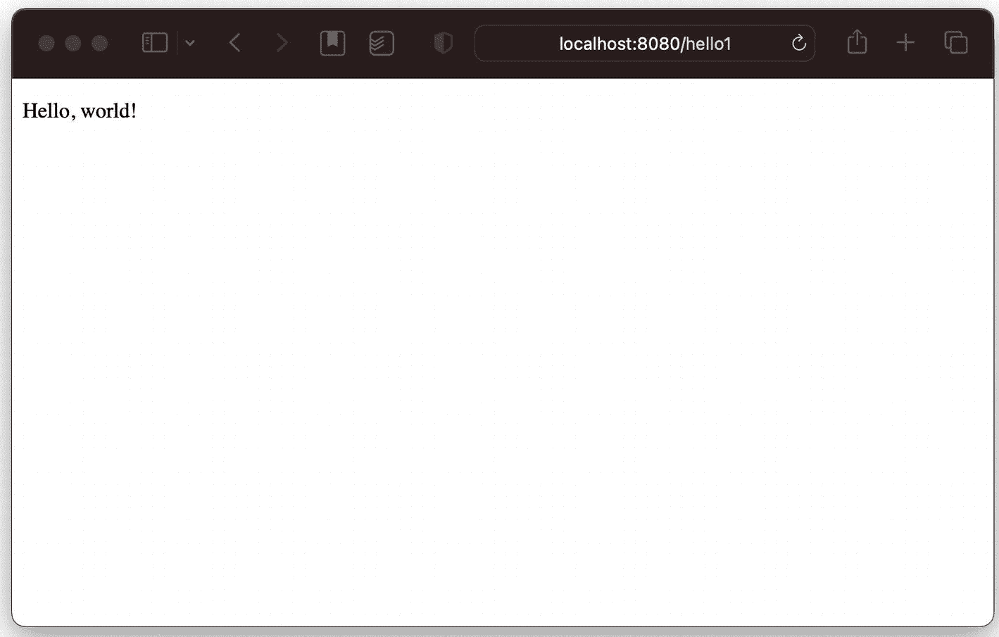

# 5. Spring 与 Jakarta EE

Spring 当然可以在独立环境中使用，但历史上 Spring 最常见的环境是企业环境，在托管服务器中驱动 Web 应用程序和后端服务。本章将演示在 Jakarta EE 容器（以前称为 Java EE 或 J2EE，甚至可能根据您的接触程度、当前认知和经验，仅称为“Tomcat”）中进行集成的某些方面。

注意

Tomcat 是一个 Servlet 容器，它代表了 Jakarta EE 所能涵盖的一小部分——它实际上是 Jakarta EE 特定配置文件的实现。话虽如此，许多开发人员过去（和现在）并不了解 Sun 命名约定的乐趣，因此他们以为 Tomcat 等同于 Java 企业版，而实际上它只是该技术某些方面的有用实现。

本章还介绍了项目的子模块以及模块间的依赖关系。我们将创建一个 `chapter05-api` 模块（我们将在其中存储一些在其他模块中保持不变的类）、一个 `chapter05-anno` 模块（将使用基于注解的配置）和一个 `chapter05-xml` 模块（将使用 XML 进行配置，这真是出人意料）。我们不打算使用 Java 配置，因为通过这个过程我们学不到任何新东西。（不过，一旦我们进入第 6 章，我们将大量转向使用基于 Java 的配置。）

## Jakarta EE 简介

Jakarta EE 是一组规范，涵盖了在 Java 平台上编写的应用程序的大部分（如果不是全部）企业架构模式。例如，如果您的应用程序具有请求/响应交互模型，则有一个规范涵盖它——Servlet 规范。如果您有面向消息的架构，则有 Java 消息服务。如果您需要远程调用架构，Jakarta EE 也有几个规范，从企业 Java Bean 规范开始。甚至还有一个上下文和依赖注入（CDI）规范，看起来与 Spring 非常相似。

CDI 看起来很像 Spring，因为 Spring 框架的作者为该规范做出了贡献。这是 Java 生态系统如此强大的部分原因，也导致了 Java 规范有时令人抓狂。规范制定团体给予，他们也收回。总的来说，这对每个人都有好处，但有时会做出相当令人沮丧的决定。

当然，这些规范也有参考实现。例如，Glassfish ([`https://glassfish.org/`](https://glassfish.org/)) 是 Servlet 和 Java 消息服务规范的当前实现；Weld ([`http://weld.cdi-spec.org/`](http://weld.cdi-spec.org/)) 是 CDI 的参考实现，尽管 Spring 首先启发了该规范这一点是很有争议的。

注意

这些是“活规范”，相关信息变化很快。Glassfish 7 被列为 Servlet 6.0 的指定兼容实现，但此信息可能很快就会过时。

顺便提一下，Jakarta EE 是以前称为 Java 企业版（“JavaEE”）以及更早的“Java 2 企业版”或“J2EE”的一个相当新的名称。2018 年，Oracle 将 Java EE 发布给 Eclipse 基金会，由开源社区管理，由于“Java”名称的版权问题，该基金会将其重命名为“Jakarta EE”。这又是围绕 Java 的品牌混淆——Java 从第一天起就饱受品牌、命名和版本混淆之苦，但希望开源社区对 Jakarta EE 的管理将有助于稳定未来的名称和版本。^(⁶⁵)

本章将向您展示一些最常用的企业规范（Servlet 规范）的基础知识，以及 Jetty 作为 Servlet 容器。请注意：Jakarta EE 并不简单。Jakarta EE 实现作为嵌套应用程序在其他应用程序内部运行，这对类路径和资源可用性有影响，甚至*编写*相关内容也可能令人困惑，因为解决每个给定问题都有许多不同且成功的方法。

本章实际上主要旨在介绍后续章节将依赖的概念，并说明一种将 Spring 集成到 Jakarta EE 中的相当古老的方法——主要是作为通往更复杂、更完整解决方案的简单入门。


### Servlet API

如前所述，Servlet API 专为遵循请求/响应生命周期的服务而设计：请求进入，响应发出。最终，请求会映射到实现已知接口 `javax.servlet.Servlet` 的单个类，但 Servlet 可以链式调用（或 `forward` 转发）其他 Servlet。该 API 还定义了可在 Servlet 调用前后执行的过滤器，以及可监听容器发出的事件（例如应用程序启动或关闭）的监听器。

Servlet 容器在特定端口上建立网络监听器；具体实现方式高度依赖于所使用的 Servlet 容器。它们通常使用 HTTP（超文本传输协议，其一个版本可在 [`https://tools.ietf.org/html/rfc2616`](https://tools.ietf.org/html/rfc2616) 找到），但并非*必须*如此。

Servlet 拥有一个 `service()` 方法、一个 Servlet 上下文^(⁶⁶)以及一些生命周期方法（包括 `init()` 和 `destroy()`）。`service()` 方法接收 `ServletRequest` 和 `ServletResponse` 引用，这两个引用本身都是接口。`ServletRequest` 接口引用关于请求的信息（协议、请求属性、参数等），而 `ServletResponse` 则提供了 Servlet 构建与请求匹配的响应的机制。

过滤器的定义方式与 Servlet 类似；有一个通用的 `javax.servlet.Filter` 接口，它有一个主要的入口点（名为 `doFilter()`，尽管 `Filter` 还有其他与过滤器生命周期相关的方法）；该方法接收 Servlet 容器创建的请求和响应对象，以及一个 `FilterChain` 引用。过滤器可以对请求和响应执行几乎任何操作，尽管通常过滤器要么为委托服务设置数据，要么装饰响应。

同样，大多数 Servlet 都使用 HTTP。作为一种协议，HTTP 将统一资源定位符（URL）映射到数据。HTTP 还指定了与这些 URL 相关的动词，例如 `GET`、`POST`、`DELETE` 和 `HEAD`。（还有其他动词；请查阅规范^(⁶⁷)获取完整列表。）

每个 HTTP 动词都有隐含的语义含义。

Roy T. Fielding 在 2000 年撰写了一篇题为“架构风格与基于网络的软件架构设计”的论文。你可以在 [`www.ics.uci.edu/~fielding/pubs/dissertation/top.htm;`](http://www.ics.uci.edu/~fielding/pubs/dissertation/top.htm%3B) 找到它；它描述了一种称为“REST”（表述性状态转移）的架构方法。REST 在基于 HTTP 的应用程序中*至关重要*；它提取了 HTTP 协议的一些隐含含义并将其形式化。如果你**真的**想了解如何使用 HTTP 动词以及 URL 在现代网络上的工作方式，请查阅 REST——我们将在第 6 章和第 7 章中使用它来创建我们的应用程序服务。

*   `GET` 是对已知位置资源的请求，传统上，与 `GET` 一起使用的 URL 可以被收藏。这是迄今为止最常见的 HTTP 请求类型。
*   `POST` 是将数据存储到已知位置的请求（尽管此位置的确定方式取决于具体实现）。
*   `PUT` 是另一种存储请求类型，但 `POST` 表示“存储”，而 `PUT` 暗示“如果对象已存在则存储或更新”。
*   `HEAD` 表示返回**关于**资源的数据，而不返回资源本身；例如，这可用于判断资源是否已更新。
*   `DELETE` 请求以某种方式移除 URL 所引用的资源。

人们通常会在 URL 的上下文中提及这些动词；因此，可能会说发出一个 `GET http://localhost/foo/bar` 请求——或者，在已指定特定主机的上下文中，可能会简单地说 `GET /foo/bar`。

在 `HttpServlet` 中，`service()` 方法被重写，以将请求类型分派到专门为每个动词命名的方法，并使用适合 HTTP^(⁶⁸) 的参数类型；因此，HTTP 中的 `GET` 由 `doGet()` 方法处理，HTTP 中的 `POST` 由 `doPost()` 方法处理，依此类推。

理解 Servlet 的工作原理及其实际功能，有助于更轻松地概念化未来的端点。我们最终将利用 Spring 本身提供的资源处理器，这些处理器会将请求分派到我们选择的方法中，参数由框架解析，而不是像本章中那样手动解析。

### 现代 Web 应用程序设计原则

过去，Web 应用程序被构建为单体式或“完整”的：例如，它们会包含服务器端渲染内容所需的所有静态资源。然而，随着富客户端的使用成为常态，这种做法早已不再是首选。Web 应用程序会引用诸如 JQuery 或 Vue.js 之类的 Javascript 库，这些库以 JSON 或 XML^(⁶⁹) 格式请求资源，并适当地渲染这些内容。

没有什么能阻止编码人员使用较旧的单体方法，这种方法本身也没有固有的错误，尽管很难说渲染完整页面与将数据发送到客户端按需渲染相比是否有任何实际优势。服务器端渲染意味着在低功耗客户端上体验更好，只要它们有足够的带宽；客户端渲染在带宽方面更优，但会消耗浏览器所在机器的更多 CPU 资源。（实际上，用户有闲置的 CPU 周期可用于客户端渲染，而繁忙的服务器是更有限的资源，因此这种方法在成本效益上很有意义，尽管某些应用程序的需求可能有所不同。）

就本书而言，我们将采用现代方法，因为它使我们能够专注于所使用的服务器端技术，而不是富客户端的工作方式。我们将使用简单的命令行工具在必要时发出 HTTP 请求，而不是使用嵌入在网页中的 Javascript。

## 模块结构

在本章中，我们将创建三个模块：`chapter05-api`、`chapter05-anno` 和 `chapter05-xml`。在大多数构建中，它们会被分组在一个 `chapter05` 模块下，该模块的唯一目的是包含其他模块，但这只会增加一个嵌套目录和一个 `pom.xml` 文件，因此没有实际好处。

本书的先前版本使用了 Gradle，它倾向于更宽、更扁平的模块结构。Maven 比 Gradle 能更好地处理更深层次的嵌套模块，但在这种情况下，这样做毫无意义，进一步嵌套只会使文件系统路径引用变得更长。


### 通用模块

我们的第一个模块将是一个简单的 API 模块。它将包含两个 Servlet，以及我们在音乐网关应用中所需的服务。^(⁷⁰)

为了创建目录结构，我们需要创建 `chapter05-api/src/main/java/com/bsg6/chapter05`：

```
mkdir -p chapter05-api/src/main/java/com/bsg6/chapter05
清单 5-1
使用 UNIX shell 创建目录结构
```

我们还需要一个 `pom.xml`：

```

4.0.0

com.apress
bsg6
1.0

chapter05-api
1.0

${project.parent.groupId}
chapter03
${project.parent.version}

com.fasterxml.jackson.core
jackson-databind

jakarta.servlet
jakarta.servlet-api
6.0.0
provided

清单 5-2
chapter05-api/pom.xml
```

这一切都相当直接，不过我们为 Servlet API 添加了一个资源，并将其设置为 `provided`，这意味着它对编译器可用（我们可以使用 Servlet API 中的类进行编译，这在编译 Servlet 时相当重要），但它不是传递性依赖。记住，它*不应该*是传递性依赖；Servlet 运行在像 Jetty 或 Tomcat 这样的容器中，这些容器有自己的 Servlet API 副本，因此我们的应用实际上应该确保它没有依赖关系会重复容器提供的内容。

我们还有一个对 `chapter03` 模块的传递性依赖。传递性依赖意味着对 `chapter05-api` 的依赖会附带另一个对 `chapter03` 的依赖——以及对 `chapter05-api` 或 `chapter03` 所依赖的任何其他内容的依赖。^(⁷¹) 我们将在一些示例中使用第 3 章中的 `MusicService` 实现之一，因为当我们已经编写了完整可用的接口和实现时，我们不想重新构建一个工作示例。

这样，我们就可以拥有模块间的依赖关系，而无需将模块输出复制到已知的仓库中。

我们还有一个对 `jackson-databind` 的依赖；Jackson ([`https://github.com/FasterXML/jackson`](https://github.com/FasterXML/jackson)) 是一个流行的库，用于将 Java 对象转换为 XML、JSON、CSV 等各种格式。我们在这里显式地包含它，因为我们的基础 Servlet 将使用它；实际上，Spring 已经对其有传递性依赖，所以我们本不必包含它，但这个库没有包含 Jackson 的依赖；因此，为了使用它，我们*确实*需要包含它。在实践中，这种方法相当原始，但对于学习实际工作原理很有用。

现在让我们来看看我们的 Servlet。它们两个将具有完全相同的结构：

1.  从 Servlet 上下文中获取 Spring 应用上下文。
2.  从 Spring 应用上下文中获取 `MusicService`。
3.  创建一个 `ObjectMapper` 以准备生成 JSON 输出。
4.  从 `HttpServletRequest` 中获取 Servlet 参数。
5.  验证参数。
6.  使用 Jackson 的 `ObjectMapper.writeValueAsString()` 方法从 `MusicService` 生成输出，并转换为 JSON。

第一个 Servlet 是 `VoteForSongServlet`。在我们完成 `anno` 或 `xml` 模块之前，我们无法看到它的实际运行，但请注意 `@WebServlet(urlPatterns="/vote")`，它告诉了我们这个 Servlet 将附加到的 URL 的一部分。（URL 的其他部分是协议、主机、服务器监听的端口以及应用名称本身——因此，当我们运行 `anno` 项目时，默认情况下，此 Servlet 将在 `http://localhost:8080/anno/vote` 上可用。）

```
package com.bsg6.chapter05;
import com.bsg6.chapter03.MusicService;
import com.fasterxml.jackson.databind.ObjectMapper;
import jakarta.servlet.annotation.WebServlet;
import jakarta.servlet.http.HttpServlet;
import jakarta.servlet.http.HttpServletRequest;
import jakarta.servlet.http.HttpServletResponse;
import org.springframework.context.ApplicationContext;
import java.io.IOException;
@WebServlet(urlPatterns = "/vote")
public class VoteForSongServlet extends HttpServlet {
@Override
public void doGet(HttpServletRequest req, HttpServletResponse resp)
throws IOException {
ApplicationContext context = (ApplicationContext) req
.getServletContext()
.getAttribute("context");
MusicService service = context.getBean(MusicService.class);
ObjectMapper mapper = new ObjectMapper();
String artist = req.getParameter("artist");
String song = req.getParameter("song");
if (artist == null || song == null) {
log("Missing data in request: requires artist and song parameters");
resp.setStatus(500);
} else {
log("Voting for artist " + artist + ", song " + song);
service.voteForSong(artist, song);
resp.setStatus(200);
resp.getWriter().println(
mapper.writeValueAsString(service.getSong(artist, song))
);
}
}
}
清单 5-3
chapter05-api/src/main/java/com/bsg6/chapter05/VoteForSongServlet.java
```

警告

这种使用 `@WebServlet` 的方法，很大程度上是我们直接针对 Servlet API 进行编写。在 Spring 中，有更好的方法来实现这一点，我们很快就会在后续内容中看到。在实践中，像这样使用 `@WebServlet` 对于应用程序开发者来说非常罕见。

注意我们是如何获取 `ApplicationContext` 的。`ServletRequest` 有一个由容器关联的 `ServletContext`；我们将把对 `ApplicationContext` 的引用作为属性存储到 `ServletContext` 中。我们在这里展示的两个 Servlet 将从 Servlet 上下文中获取 Spring 上下文。

我们的下一个 Servlet——`GetSongsForArtistServlet`——遵循完全相同的模式。

```
package com.bsg6.chapter05;
import com.bsg6.chapter03.MusicService;
import com.bsg6.chapter03.model.Song;
import com.fasterxml.jackson.databind.ObjectMapper;
import jakarta.servlet.annotation.WebServlet;
import jakarta.servlet.http.HttpServlet;
import jakarta.servlet.http.HttpServletRequest;
import jakarta.servlet.http.HttpServletResponse;
import org.springframework.context.ApplicationContext;
import java.io.IOException;
import java.util.List;
@WebServlet(urlPatterns = "/songs")
public class GetSongsForArtistServlet extends HttpServlet {
@Override
public void doGet(HttpServletRequest req, HttpServletResponse resp)
throws IOException {
ApplicationContext context = (ApplicationContext) req
.getServletContext()
.getAttribute("context");
MusicService service = context.getBean(MusicService.class);
ObjectMapper mapper = new ObjectMapper();
String artist = req.getParameter("artist");
if (artist == null ) {
log("Missing data in request: requires artist parameter");
resp.setStatus(500);
} else {
List data=service.getSongsForArtist(artist);
resp.setStatus(200);
resp.getWriter().println(
mapper.writeValueAsString(data)
);
}
}
}
清单 5-4
chapter05-api/src/main/java/com/bsg6/chapter05/GetSongsForArtistServlet.java
```

内容引人入胜——而且有些过时——但这是必要的，以便我们不必来回复制源文件。是时候看看一个实际的 Web 应用了，首先是一个与 Spring 无关的“Hello, World” Servlet，然后我们将看到如何创建一个 Spring 上下文，供我们的 `common` 模块的 Servlet 使用。

现在让我们看看如何执行我们的 Servlet。


### 基于注解的 Web 应用

让我们看看如何实现两件事：第一，构建一个可运行的 Web 应用；第二，使用一个 Spring 上下文，通过编程方式扫描包中带有 Spring 注解的类，供我们的 Servlet 使用。这个应用将被命名为 `anno`，这并非因为我们偏爱表示时间段的拉丁词汇，而是因为相比“annotation”或其他更具描述性的变体，它输入起来要简短得多。

我们先编写“Hello, World” Servlet，因为它能让我们将所有组件就位，以便为第二和第三个 Servlet 集成 Spring。

Maven 有一种专为 Web 容器设计工件的包类型，称为“Web 归档文件”，或者更通俗地说，“war”文件。^(⁷²) 它**还**提供了一系列便捷的插件，用于在容器内运行 Web 应用，我们将在几段后看到这一点。

首先，我们需要创建 `chapter05-anno` 目录本身。

```
mkdir -p chapter05-anno/src/main/java/com/bsg6/chapter05
mkdir -p chapter05-anno/src/main/resources
清单 5-5
使用 POSIX 命令创建目录结构
```

源代码布局与我们其他项目的源代码布局几乎相同。

我们的 `pom.xml` 才是开始变得有趣的地方。请注意 `plugins` 部分新增的内容，以及额外的依赖项：

*   Servlet API 本身，与 `chapter05-api` 模块中的相同。
*   另外，请参见 `spring-web`，用于 Spring 中与 Web 应用相关的部分。
*   一个模板库，Mustache。^(⁷³)
*   对第 3 章代码的依赖，我们将在本章中使用它来完成实际工作。
*   最后是 `jetty-maven-plugin` 插件，它为 Maven 提供了一种便捷的方式，将 Jetty 作为 Servlet 容器运行，并将我们的应用部署在其中。

```

4.0.0

com.apress
bsg6
1.0

chapter05-anno
1.0
war

${project.parent.groupId}
chapter05-api
${project.parent.version}

jakarta.servlet
jakarta.servlet-api
6.0.0
provided

org.springframework
spring-web

com.samskivert
jmustache
1.15

org.eclipse.jetty
jetty-maven-plugin
11.0.15

清单 5-6
chapter05-anno/pom.xml
```

#### 我们的第一个独立可运行 Servlet

现在，是时候创建我们的第一个*可运行* Servlet^(⁷⁴) 了——一个端点，它将接受来自 Web 浏览器的请求并为其生成响应。代码并不长，但它向我们展示了如何接受来自浏览器的 `GET` 请求（同样，这是最常见的请求类型），以及如何通过 Mustache 渲染输出（这是一项有用的技能，但对于本章来说并非至关重要）。

```
package com.bsg6.chapter05;
import com.samskivert.mustache.Mustache;
import jakarta.servlet.annotation.WebServlet;
import jakarta.servlet.http.HttpServlet;
import jakarta.servlet.http.HttpServletRequest;
import jakarta.servlet.http.HttpServletResponse;
import java.io.IOException;
import java.io.InputStreamReader;
import java.util.Map;
import java.util.Objects;
@WebServlet(urlPatterns = "/hello1")
public class FirstHelloServlet extends HttpServlet {
@Override
protected void doGet(HttpServletRequest request,
HttpServletResponse response)
throws IOException {
try (var in = Objects.requireNonNull(this
.getClass()
.getResourceAsStream("/hello.html"))) {
try (var reader = new InputStreamReader(in)) {
var output = Mustache.compiler().compile(reader)
.execute(Map.of("name", "world"));
response.getWriter().println(output);
}
}
}
}
清单 5-7
chapter5-anno/src/main/java/com/bsg6/chapter05/FirstHelloServlet.java
```

在这个 Servlet 中——通过注解标识，并在相对 URL 路径 `/hello1` 上可用——我们有很多处理导入的样板代码。我们还有一个 `doGet()` 方法——用于处理 HTTP 上的 `GET` 请求——它所做的只是渲染一个 Mustache 模板（位于类路径下的 `/src/main/resources/hello.html`，见下一个清单），其中包含一个静态值为 `"world"` 的变量 `name`。

正如所承诺的，让我们看看我们的 Mustache 模板。

```

Hello, {{ name }}

Hello, {{ name }}!

清单 5-8
chapter05-anno/src/main/resources/hello.html
```

在不深入过多细节的情况下，这个模板只是一个 HTML5 文档，其中包含一个名为 `name` 的值的占位符。渲染器（当然是 Mustache）会将 `{{ name }}` 替换为传递给 `render()` 方法的 `name` 值（如果有的话）。

这一切都很好，但有点抽象：我们如何*运行*它？我们怎样才能让我们的 Servlet 最终真正地向世界问好，而这个世界无疑一直在屏息以待？^(⁷⁵)

当然，我们通过 Maven 和前面提到的 `jetty-maven-plugin` 插件来实现，方法是在顶层项目目录（包含 `chapter03` 和 `chapter05` 的目录）中执行以下命令：

```
$ mvn -pl chapter05-anno jetty:run
清单 5-9
运行 chapter05-anno 项目
```

经过一番下载适当资源和编译 Servlet 的忙碌之后，Maven 会通知我们——除其他事项外——Jetty 正在 8080 端口上运行。我们的应用（目前就是这样）可在 `http://localhost:8080/` 访问。

```
[INFO] Started ServerConnector@5238896f{HTTP/1.1, (http/1.1)}{0.0.0.0:8080}
[INFO] Started Server@236ae13d{STARTING}[11.0.15,sto=0] @3218ms
[INFO] Automatic redeployment disabled, see 'mvn jetty:help' for more redeployment options
清单 5-10
来自 chapter05-anno 项目的相关日志
```

如果你还记得我们在 `FirstHelloServlet` 上使用的 `@WebServlet` 注解，你会记得我们有一个相对 URL 路径 `/hello1`。这被添加到 Web 应用的根 URL 上——即前面提到的 `http://localhost:8080/`——从而为我们的 Servlet 提供了一个端点 `http://localhost:8080/hello1`。如果我们打开一个 Web 浏览器并访问该地址，我们将沐浴在荣耀和赞美之中，因为浏览器窗口会胜利地显示 `Hello, world`，我们所有的梦想都将成真。



一个 Web 浏览器窗口的截图，显示了一个托管在 localhost:8080/hello1 的网页。页面的主要区域显示了文本 Hello, World!。

图 5-1

Hello, world!

我们也可以使用命令行应用程序 `curl`^(⁷⁶) 进行测试，我们将在其他 Servlet 中使用它。

```
$ curl http://localhost:8080/hello1

Hello, world

Hello, world!

$
清单 5-11
来自应用的内容

```

这很令人兴奋，但与其他“Hello, World”机制一样，它主要是确保所有基础架构都已就位，以便我们可以开始处理更有趣的部分。


#### 为 Servlet 添加 Spring 上下文

在 Servlet 中使用 Spring 有几种方式：我们可以使用 Spring 模块，例如 Spring Web（它包含一个 Servlet，作为调度器，用于处理为 Spring 设计的服务对象^(⁷⁷)，我们实际上已将其作为依赖包含在此处）；或者使用 Spring Boot（它实际上嵌入了自己的 Servlet 引擎）；或者我们可以让 Web 应用实例化一个 Spring 上下文，并从传统 Servlet 内部将其作为资源进行访问。大多数 Spring 专家可能倾向于使用 Spring Boot，因为 Boot 的开发和部署模型非常简单，但 Spring Boot 是第 7 章的主题，而非第 5 章；而 Spring Web 也是后续章节（第 6 章）的主题……这意味着我们得先从更基础的方法入手。

当我们研究 Spring Boot 和 Spring Web（再次说明，分别是第 6 章和第 7 章）时，我们会找到更简单的方法来实现我们即将看到的功能——但本章将让我们深入了解后续章节中幕后发生的事情。

既然我们已经讨论了这是一种“基础方法”等等，那么**具体**方法是什么呢？

我们将为两个 Web 应用添加一个 `ServletContextListener`，在这个 `ServletContextListener` 中，我们将实例化一个 Spring `WebApplicationContext`，并将其存储在整个 Web 应用的应用程序作用域中。当我们需要 Spring 上下文中的资源时，我们将从 `ServletContext` 中获取——这有点像 Jakarta EE 中的传统 JNDI 模型，正如我们在 `common` 模块的 Servlet 中看到的那样。（当我们研究 Spring Web 和 Spring Boot 时，我们会看到自动注入依赖的简便方法。）

让我们来看看这个 `ServletContextListener`，我们将其命名为 `AnnotationContextListener`。

```
package com.bsg6.chapter05;
import jakarta.servlet.ServletContextEvent;
import jakarta.servlet.ServletContextListener;
import jakarta.servlet.annotation.WebListener;
import org.springframework.context.ApplicationContext;
import org.springframework.web.context.
support.AnnotationConfigWebApplicationContext;
@WebListener
public class AnnotationContextListener implements ServletContextListener {
@Override
public void contextInitialized(ServletContextEvent event) {
ApplicationContext context = buildAnnotationContext();
event.getServletContext().setAttribute("context", context);
}
private ApplicationContext buildAnnotationContext() {
AnnotationConfigWebApplicationContext context =
new AnnotationConfigWebApplicationContext();
context.scan("com.bsg6.chapter03.mem03");
context.refresh();
return context;
}
}
Listing 5-12
chapter05-anno/src/main/java/com/bsg6/chapter05/AnnotationContextListener.java
```

大部分情况下，这个类非常简单。它在整个类上使用了 `@WebListener`——这告诉 Servlet 容器在**适当的时候**使用此类的实例——并且，鉴于它实现了 `ServletContextListener`，它将接收与上下文相关的事件。事件只有两个：`contextInitialized`（在应用启动时调用）和 `contextDestroyed`（在应用销毁时调用，如果可能的话）。

`ServletContextListener` 接口为 `contextInitialized()` 和 `contextDestroyed()` 都提供了默认实现，因此除非我们确实有操作要执行，否则无需实现任何内容。如果 Servlet 上下文停止，我们没有任何操作需要执行，所以我们不会费心去实现 `contextDestroyed()`。然而，我们希望在 `contextInitialized` 事件中创建我们的 Spring 上下文。

顾名思义，`AnnotationConfigWebApplicationContext` 为我们提供了扫描可用组件的能力，就像我们在前几章中看到的 `<context:component-scan />` 标签一样。使用这个类，我们可以通过编程方式告诉 Spring 上下文要扫描哪些包以查找可用的注解，这正是 `buildAnnotationContext()` 方法所做的。^(⁷⁸) 一旦我们有了 `AnnotationConfigWebApplicationContext`，就需要告诉它去哪里查找候选类——在这种情况下，我们复用了第 3 章中一个基于内存的实现，因此我们提供了一个包名 `com.bsg6.chapter03.mem03`。这个方法实际上接受一个包名数组，并且它实际上接受可变数量的参数；只是碰巧我们这里只需要扫描一个包，但我们可以提供一个逗号分隔的列表，列出我们需要扫描的任意数量的包。

请注意，这与 Java 配置并不完全相同。如果我们使用 Java 配置而不是构建配置，我们可以用 `@ComponentScan` 标记它——这将完成我们在这里使用 `@AnnotationConfigWebApplicationContext` 和 `<context:component-scan />` 所做的相同事情。我们将在后续章节中看到它的使用，届时我们实际上会切换到基于 Java 的配置。

通常，明智的做法是**精确**扫描你所需的内容，而不是添加整个包树。扫描相当慢；你不会经常执行它（仅在应用程序启动时），但它对 Java 运行时来说仍然相当沉重。如果你实际感兴趣的类不多，请考虑使用带有 `@Configuration` 注解的类进行编程配置，而不是扫描包。我们在这里进行扫描主要是因为它的代码行数比 Java 配置少，而 Java 配置需要一个带有自身样板代码的类。

然而，仅仅告诉上下文它**应该**扫描的位置并不会让它实际执行扫描。这是 `context.refresh()` 的作用。在我们完成**那一步**之后，我们从 `ServletContextEvent` 中获取 `ServletContext`，并将 Spring 上下文作为命名属性存储到 Servlet 上下文中^(⁷⁹)；为简单起见，我们将其命名为“context”。一旦完成，整个 Web 应用中的任何可执行代码都可以通过名称从 Servlet 上下文中获取 Spring 上下文。

当我们以这种方式使用 Spring 上下文（将 Spring 上下文显式加载到 Servlet 上下文中）时，我们无法将 Spring 资源自动注入到我们的 Servlet 中。相反，我们从 Spring 上下文中获取它们。（然而，**从** Spring 上下文中检索到的 bean 将具有自动注入功能——我们使用的特定 `MusicService` 需要并演示了这一点。）由于我们完全控制实例生命周期（参见第 4 章），我们可以精细地控制创建什么以及何时创建。

所有这些都非常有用^(⁸⁰)；我们现在可以从 Spring 中获取我们的 `MusicService`，如 `common` 模块中的 Servlet 所示，但我们如何演示它呢？

当然，通过执行与“Hello, World”Servlet 相同的操作。

我们的 `chapter05-anno` 应用包含了 `chapter05-api` 模块，正如我们所示（并多次提及，以防读者没有注意）。当我们包含 `chapter05-api` 模块时，这些 Servlet 会自动设置为响应由 `@WebServlet` 注解指定的 URL 模式——即 `/vote` 和 `/songs`。这意味着当我们使用 `jetty:run` 运行 `anno` 应用时，这些 Servlet 已经处于活动状态——尽管除非我们放置了 `ServletContextListener`，否则它们无法正常工作。

我们可以使用命令行应用程序（例如 `curl`）来测试这一点。启动应用程序后，发出一个 curl 命令。


```
$ curl "http://localhost:8080/vote?artist=Therapy+Zeppelin&song=Medium"
{"name":"Medium","votes":1}
$ curl "http://localhost:8080/vote?artist=Therapy+Zeppelin&song=Medium"
{"name":"Medium","votes":2}
$ curl "http://localhost:8080/songs?artist=Therapy+Zeppelin"
[{"name":"Medium","votes":2}]
代码清单 5-13
手动测试应用程序
```

明智的读者可能会好奇，为什么我们不像本书其他部分那样，将这部分测试自动化（作为构建过程的一部分）。答案很简单：这很难做到！在测试中启动一个兼容的 Servlet 容器是可行的，但最佳方式是使用像 Arquillian ([`https://arquillian.org/`](https://arquillian.org/)) 这样的工具——遗憾的是，解释起来并不简单。重建适当的基础设施需要大量的底层工作，这很大程度上超出了本书的范围。此外，正如多次提到的，这种构建应用程序的方式有点过时了——下一章我们将使用 Spring Web，它不仅能让我们的端点编写起来容易得多，而且还能让它们天生就*可测试*，而无需像本章这种相当基础的技术那样费尽周折。

我们保证，并不是想敷衍各位读者！我们只是不想浪费精力向您展示一个您实际上并不需要的测试流程，但您*确实*需要基本了解 Servlet API 是什么以及它是如何工作的，以便为自己的应用程序构建合适的端点。请查看下一章。它正确地涵盖了所有这些内容，然后在后续章节中，我们会做得*更好*。

### 基于 XML 的 Spring 上下文应用程序

在这里，一切与我们基于注解的应用程序**几乎**相同——这当然正是创建 `chapter05-api` 模块的全部意义所在。我们不再费心处理“Hello, World”Servlet，因此这个 Web 应用程序将包含我们的 `ServletContextListener` 和一个 XML 配置文件（以及我们在 `common` 模块中编写的 Servlet）。根据 `pom.xml` 的说明，我们共有四个文件。

首先，从 `chapter05-xml` 目录本身开始的目录结构。

```
mkdir -p chapter05-xml/src/main/java/com/bsg6/chapter05
mkdir -p chapter05-xml/src/main/webapp/WEB-INF
代码清单 5-14
使用 POSIX 命令创建目录结构
```

我们的 `pom.xml` 实际上与 `chapter05-anno` 模块的 `pom.xml` 完全相同，唯一的区别是我们不再需要 Mustache（因为“Hello, World”Servlet 是唯一使用 Mustache 的类）。

```

4.0.0

com.apress
bsg6
1.0

chapter05-xml
1.0
war

${project.parent.groupId}
chapter05-api
${project.parent.version}

jakarta.servlet
jakarta.servlet-api
6.0.0
provided

org.springframework
spring-web

org.eclipse.jetty
jetty-maven-plugin
11.0.15

代码清单 5-15
chapter05-xml/pom.xml
```

`ServletContextListener` 创建了一个 `XmlWebApplicationContext` 而不是 `AnnotationConfigWebApplicationContext`，这意味着我们需要在应用程序中有一个 XML 文件，但除此之外，一切应该都非常熟悉：

```
package com.bsg6.chapter05;
import jakarta.servlet.ServletContext;
import jakarta.servlet.ServletContextEvent;
import jakarta.servlet.ServletContextListener;
import jakarta.servlet.annotation.WebListener;
import org.springframework.context.ApplicationContext;
import org.springframework.web.context.support.XmlWebApplicationContext;
@WebListener
public class XMLContextListener implements ServletContextListener {
@Override
public void contextInitialized(ServletContextEvent event) {
ApplicationContext context =
buildXmlContext(event.getServletContext());
event.getServletContext().setAttribute("context", context);
}
private ApplicationContext buildXmlContext(ServletContext sc) {
XmlWebApplicationContext context = new XmlWebApplicationContext();
context.setServletContext(sc);
context.refresh();
return context;
}
@Override
public void contextDestroyed(ServletContextEvent sce) {
}
}
代码清单 5-16
chapter05-xml/src/main/java/com/bsg6/chapter05/XMLContextListener.java
```

请注意，当我们构建 `XmlWebApplicationContext` 时，我们还设置了对当前 `ServletContext` 的引用。这主要用于与我们正在创建的环境不同的环境；当 Spring 自行将请求分派给资源时，这很有用，但我们这里并未使用。当我们进入第 6 章时，这类事情将在幕后发生，我们无需担心，但在这里，它只是确保 Spring 上下文按预期设置。

当然，我们还需要配置文件本身。

```

代码清单 5-17
chapter05-xml/src/main/webapp/WEB-INF/applicationContext.xml
```

这几乎是第 3 章中某个 XML 配置的精确副本，只是重命名以匹配 `XmlWebApplicationContext` 搜索的默认位置。（我们可以向上下文提供一个资源来读取其配置，但默认情况下，它会搜索 Web 应用程序的本地资源——在本例中，如所示，是 `/WEB-INF/aplicationContext.xml`。）

如果我们通过 `mvn -pl chapter05-xml jetty:run` 使用 Maven 运行 `xml` 模块，我们可以使用与 `chapter05-anno` 版本完全相同的技术来测试应用程序。

```
$ curl "http://localhost:8080/vote?artist=Therapy+Zeppelin&song=Medium"
{"name":"Medium","votes":1}
$ curl "http://localhost:8080/vote?artist=Therapy+Zeppelin&song=Medium"
{"name":"Medium","votes":2}
$ curl "http://localhost:8080/songs?artist=Therapy+Zeppelin"
[{"name":"Medium","votes":2}]
代码清单 5-18
手动测试应用程序
```

我们的兴奋之情应该无以言表！但说真的，本章我们已经做了很多工作。只是碰巧 Spring 提供了更简单的方法来完成同样的事情，我们将在下一章中看到。

## 后续步骤

在本章中，我们了解了 Web 应用程序幕后的情况，包括原始 Servlet、使用 Mustache 进行模板渲染以及从手动填充的 Spring 上下文中获取资源。我们还了解了 Maven 中的模块如何相互引用。第 6 章将向我们展示如何构建一个功能更全面的乐队网关应用程序，通过从应用程序中移除所有手动调用和转换（以及 Servlet），引导我们进入一个更精简、更现代的 Web 应用程序开发流程，包括自动化测试。

脚注 1   2   3   4   5   6   7   8   9   10   11   12   13   14   15   16

