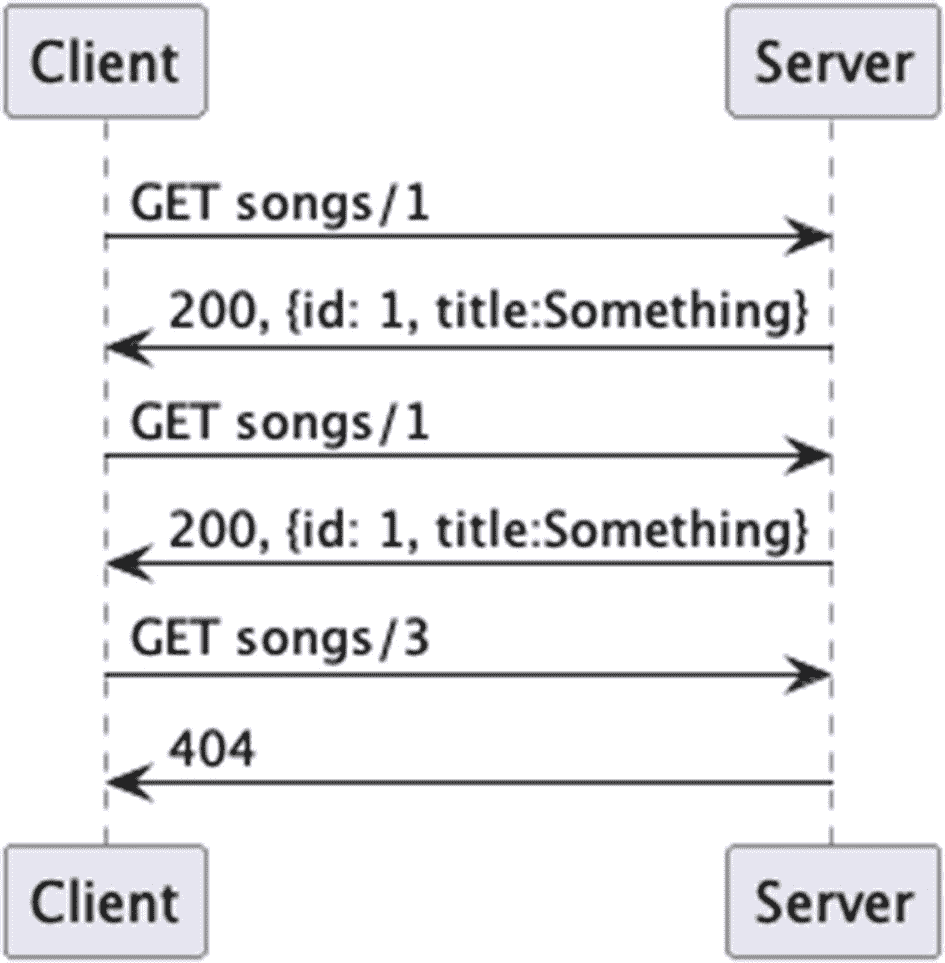
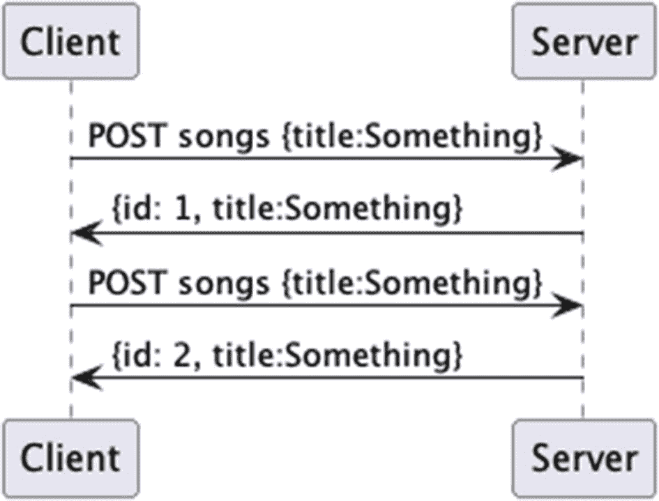
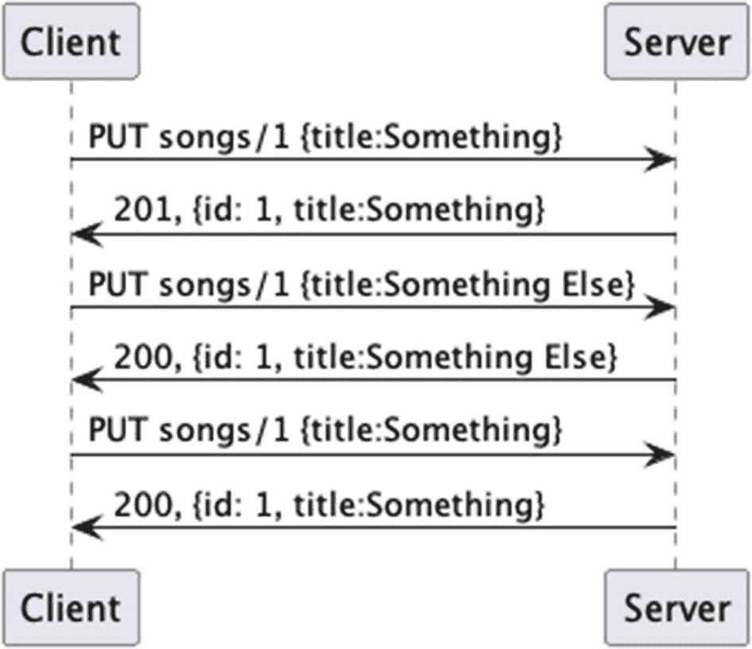
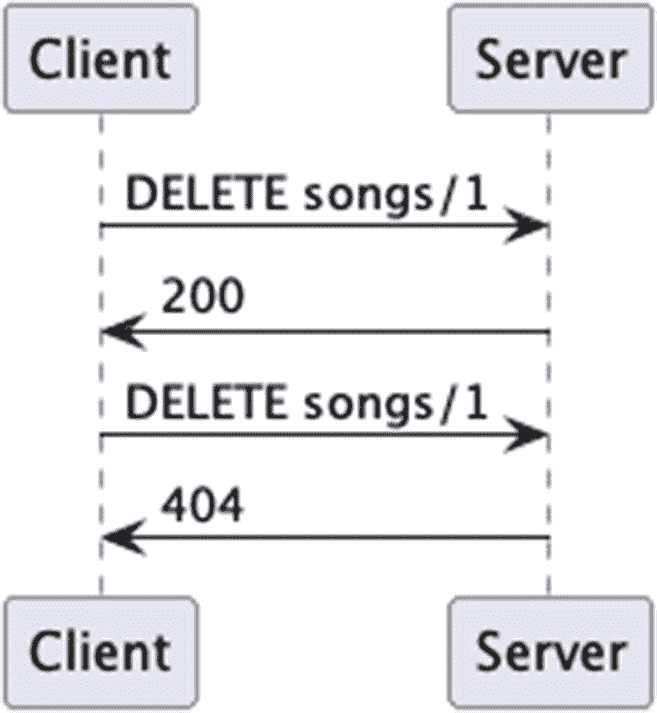

# 6. Spring Web

在前面的章节中，我们主要关注了依赖注入——这可以说是让 Spring 如此流行和有用的“秘密武器”——同时也初步了解了 Spring 在 Web 开发方面的能力。在本章中，我们将深入探讨框架中的 Spring MVC 库，并继续使用这个前端库来构建我们的乐队网关应用程序。该应用程序将变得更加功能完善，并通过自动化测试移除所有手动调用和转换。


## Spring MVC 简介

Spring Web 是一个框架，它提供了模型-视图-控制器（MVC）架构，用于使用 Spring 开发 Web 应用程序。这使开发者的注意力集中在应用程序需要通过 HTTP 提供访问所需执行的操作上，而不是关注访问是*如何*提供的。例如，在上一章中，我们构建了几个在 Spring 框架内运行的 Servlet，但除了 Spring 内置的 Bean 和其他管理功能外，我们仍然在使用常规的 Servlet。没有什么能阻止你这样做；然而，正如我们希望展示的那样，使用此模块将为你节省大量时间，因为它使用内置的 Spring 调度器将请求映射到*控制器方法*，而无需自己编写端点。

## MVC

Spring 的 Web 模块使用一种称为 MVC 的范式来组织组件——如前所述，MVC 是“模型-视图-控制器”的缩写。这种架构可用于开发比上一章中看到的更灵活、更松散耦合的应用程序。（我们也不必再那么仔细地管理配置了。）我们可以轻松地将业务逻辑、输入逻辑和前端逻辑分离到不同的组件中，并使用 Spring 将它们连接起来。

在 MVC 中，**模型**保存应用程序的数据，这使我们能够将业务逻辑与数据处理方式分离开来。在 Java 世界中，这是一个 POJO（Plain Old Java Object，普通旧式 Java 对象），到目前为止，我们都对此非常熟悉。

**视图**负责获取模型数据，并以某种方式将其展示给前端。在本章中，我们将展示 HTML 和 JSON 的渲染器。对于 HTML，我们将专注于使用更易于人类阅读的格式渲染模板；对于 JSON，我们将展示 API 调用的结果。

**控制器**用于与用户交互。在基于 Web 的交互中，这包括用户请求、表单提交，以及从业务逻辑角度决定显示哪个视图。它还负责模型如何传递。

## 使用 MVC 实现 Hello, World

在本章中，我们将回到一个简单的模块结构，并依赖于第 3 章。

首先，我们需要创建目录结构，从整个项目目录开始。

```
mkdir -p chapter06/src/main/java/com/bsg6/chapter06
mkdir -p chapter06/src/main/webapp/WEB-INF/templates
mkdir -p chapter06/src/test/java/com/bsg6/chapter06
清单 6-1
使用 POSIX 命令创建目录结构
```

与之前的章节一样，我们需要 Maven 配置文件 `pom.xml`。除了在 `dependencies` 中添加了 `spring-web` 和 `spring-webmvc` 之外，它并没有什么特别之处。其余部分忠实地从 `chapter05` 及更早版本的配置中复制而来，这些配置使我们能够通过一个简单的 Maven 目标运行 Jetty 实例。

```

4.0.0

com.apress
bsg6
1.0

chapter06
1.0
war

ch.qos.logback
logback-classic

${project.parent.groupId}
chapter03
${project.parent.version}

jakarta.servlet
jakarta.servlet-api
6.0.0
provided

org.springframework
spring-web

org.springframework
spring-test

org.springframework
spring-webmvc

com.samskivert
jmustache
1.15

com.fasterxml.jackson.core
jackson-databind

org.hamcrest
hamcrest
2.2
test

org.eclipse.jetty
jetty-maven-plugin
11.0.15

清单 6-2
chapter06/pom.xml
```

在前面的章节中，我们已经深入探讨了 XML 配置，因此在本章及后续章节中，我们将不再赘述，而是专注于使用注解来完成所有配置需求。

为什么？

基于 Java 的配置在 Java 生态系统中更加简单且更标准化，而且我们倾向于去除那些没有增加任何价值的冗余内容。XML 配置**很有用**，但根据我们在实际项目中的观察（以及我们个人的经验），*大多数*程序员更习惯于*编程*，而将配置作为代码的一部分意味着可以通过 Java 类路径更轻松地选择配置。^(⁸¹)

让我们来看一个简单的配置和 MVC 端点是什么样的。在下面的清单中，我们将创建一个简单的控制器，当端点被访问时，它会向最终用户输出一句常见的教程用语。

```
package com.bsg6.chapter06;
import org.springframework.http.HttpStatus;
import org.springframework.http.MediaType;
import org.springframework.http.ResponseEntity;
import org.springframework.stereotype.Controller;
import org.springframework.web.bind.annotation.GetMapping;
@Controller
public class GreetingController {
@GetMapping(
path = "/greeting",
produces = {MediaType.TEXT_PLAIN_VALUE}
)
public ResponseEntity greeting() {
return new ResponseEntity(
"Hello, World!",
HttpStatus.OK
);
}
}
清单 6-3
chapter06/src/main/java/com/bsg6/chapter06/GreetingController.java
```

这段代码片段中有不少我们尚未讨论的内容，让我们来解析一下。我们使用 `@GetMapping` 注解引入了一个 `GET` 请求映射。这个注解是基础注解 `@RequestMapping` 的一种更具体的形式。我们将在涉及 REST 时更详细地讨论 HTTP 方法，但这里只需说明，对于你想要映射到控制器的每个 HTTP 方法，都有一个对应的注解。

`String` 是一种简单类型，不需要转换；在更复杂的情况下，Spring MVC 会使用 Jackson（作为 Spring 本身的一部分，以传递依赖的方式包含在内）将实体转换为你的方法预期返回的任何类型。

从我们的 `@GetMapping` 可以看出，它*生成*的是 `text/plain` 类型。我们的方法返回一个类型为 `String` 的 `ResponseEntity`，考虑到我们返回的是一个简单的纯文本项，这是合理的。简单的返回值是 `Hello, World!`，状态为 `OK` 或 `HTTP 200`。Spring MVC 会在启动时进行检查，以确保没有冲突的映射。

确保你的控制器确实能正常工作并达到预期效果总是一个好主意，因此让我们创建一个测试来验证我们的假设。


```
package com.bsg6.chapter06;
import org.springframework.beans.factory.annotation.Autowired;
import org.springframework.http.MediaType;
import org.springframework.test.context.ContextConfiguration;
import org.springframework.test.context.testng.AbstractTestNGSpringContextTests;
import org.springframework.test.context.web.WebAppConfiguration;
import org.springframework.test.web.servlet.MockMvc;
import org.springframework.test.web.servlet.setup.MockMvcBuilders;
import org.springframework.web.context.WebApplicationContext;
import org.testng.annotations.Test;
import static org.springframework.test.web.servlet.request.MockMvcRequestBuilders.get;
import static org.springframework.test.web.servlet.result.MockMvcResultMatchers.status;
@Test
@WebAppConfiguration
@ContextConfiguration(classes = GatewayAppWebConfig.class)
public class TestGreetingController
extends AbstractTestNGSpringContextTests {
@Autowired
private WebApplicationContext wac;
private MockMvc mockMvc;
@Test
public void greetingTest() throws Exception {
this.mockMvc = MockMvcBuilders
.webAppContextSetup(this.wac)
.build();
this.mockMvc.perform(get("/greeting")
.accept(MediaType.ALL))
.andExpect(status().isOk());
}
}
代码清单 6-4
chapter06/src/test/java/com/bsg6/chapter06/TestGreetingController.java
```

上述测试是一个相当简单的测试，用于确保我们的控制器能够按预期处理请求。我们使用了`MockMvc`类，它模拟了 Web 层的 HTTP 调用，从而使测试能够快速执行。我们特意没有为测试启动 Web 容器，因为这部分内容将在第 7 章中结合`TestRestTemplate`进行更详细的介绍。通过这个测试，我们可以确保契约得到履行，并且代码按预期工作——这正是你在测试中希望看到的结果。

你会注意到，它使用了`GatewayAppWebConfig`类。我们将在后续进一步完善这个类，但目前已有的内容足以让程序运行起来。

```
package com.bsg6.chapter06;
import org.springframework.context.annotation.ComponentScan;
import org.springframework.context.annotation.Configuration;
import org.springframework.web.servlet.config.annotation.EnableWebMvc;
import org.springframework.web.servlet.config.annotation.WebMvcConfigurer;
@Configuration
@EnableWebMvc
@ComponentScan(basePackages = {"com.bsg6.chapter06", "com.bsg6.chapter03.mem03"})
public class GatewayAppWebConfig implements WebMvcConfigurer {
}
代码清单 6-5
chapter06/src/main/java/com/bsg6/chapter06/GatewayAppWebConfig.java
```

注意

我们将在本章稍后部分向此类添加一些配置。此处包含它只是为了能够运行`TestGreetingController`。

如果你想手动运行 Web 服务器并进行测试（这始终是个好主意），可以运行命令行`mvn -pl chapter06 jetty:run`来启动 Tomcat，然后访问端点`http://localhost:8080/chapter06/greeting`，你将看到返回的简单文本字符串`Hello, World!`。

到目前为止，我们已经介绍了一个简单的 GET 请求。

在接下来的示例中，我们将继续展示 Spring MVC 的部分功能，并尽可能在每个示例中遵循 REST 风格。鉴于这是本书中首次讨论 REST，我们有必要在下一节中探讨使用这种范式所固有的一些架构概念。

### REST 概念

过去几十年中，指导 API 设计的主要策略之一便是 REST，即表述性状态转移。^(⁸²) 它由 Roy T. Fielding 在 20 世纪 90 年代末期与 HTTP 1.1 的开发同步提出，并基于 HTTP 1.0 的现有设计。将 SOAP 协议^(⁸³)与 REST 所指定的架构原则进行比较，我们可以看到 REST 更侧重于通过利用 HTTP 协议内置的概念来降低整体复杂性和提高可发现性。

作为 RESTful API 的基础实现，应遵循以下两点。当然还有其他原则，但以下两点最为普遍：

*   基础 URI——例如[`http://api.bandgateway.com/songs/`](http://api.bandgateway.com/songs/)，它指定了集合（此处为“songs”），你将通过 HTTP 方法指定的操作在该集合上进行操作。

*   恰当地使用 HTTP 方法，最常用的是`GET`、`POST`、`PUT`和`DELETE`。其他方法如`PATCH`、`OPTIONS`和`HEAD`使用频率较低，但同样重要。在 REST 中，它们被用作对集合或实体执行的操作。

我们并非暗示 REST 架构风格的其他原则没有用处——它们确实有用。但它们超出了**本书**的讨论范围。

上述原则应该能帮助你朝着构建更简单的 API 迈出一大步。接下来，我们来谈谈如何恰当地使用 HTTP 方法。


#### 正确使用 HTTP 方法

俗话说，吃 Reese's 花生酱杯没有错误的方式^(⁸⁴)，使用 HTTP 方法也是如此。然而，确实存在一种**规定**的方式来使用 HTTP 方法，以遵循 REST 架构风格。

REST 将事物分为成员资源和集合资源。它自诩为一种范式，因为它并不适用于所有可能的 API，但在表示你能想到的大多数模式方面做得非常出色。下面我们将对此进行一些扩展，但如果你觉得你的 API 需要一些不同的东西，那也没关系；它并非完美的抽象，所以专注于完成任务，而不是构建完美的 API。为了我们简单 API 的目的，我们将讨论资源和集合的单一层级，但请知晓，使用 Spring MVC 实现嵌套是可能且相当简单的。如果你处理的是资源集合，你会看到像 [`http://api.bandgateway.com/songs/`](http://api.bandgateway.com/songs/) 这样的 URL。对于成员资源，我们将指定某种标识符，因此你的 URL 结构会更像 [`http://api.bandgateway.com/songs/42`](http://api.bandgateway.com/songs/42)。

警告：前方术语高能！

HTTP 动词列表经常涉及“幂等性”的概念。当你使用完全相同的数据进行多次调用并产生**相同**的结果时，该调用就是“幂等的”。只读操作——比如 `GET`——本质上是幂等的；对于其他动词，情况可能会更复杂一些。如果一个调用改变了应用程序状态，但每次改变的方式一致，那么它被认为是幂等的，就像你多次将电灯开关拨到“开”位置会发生的情况一样——它只会保持开启状态。当然，在现实中，这要稍微复杂一些。

抽象是好的，但并不完美。回到我们的正文！

`GET` 用于检索资源。这种性质的请求通常不应有副作用，这意味着该请求是“安全的”，因为资源的状态从未改变。



一张图表说明了通过请求和响应进行的客户端-服务器通信。客户端发送了 2 个针对 songs/1 的 GET 请求和 1 个针对 songs/3 的 GET 请求。服务器针对 songs/1 响应了 200 状态码和数据，针对 songs/3 响应了 404 状态码。

`POST` 用于创建新资源，并将使用集合资源的 URL 结构。它与 `PUT` 的主要区别在于它不是幂等的，因为多次调用 `POST` 会创建新资源，并且它使用集合资源的 URL 结构。（它不是幂等的，因为每次调用都会创建新的对象状态，而新状态会有自己的标识符，等等。）



一张图表说明了通过请求和响应进行的客户端-服务器通信。客户端发送了 2 个针对 songs 的 POST 请求，标题为 something。服务器针对第一个请求响应了 id 1, title something，针对第二个请求响应了 id 2, title something。

`PUT` 主要用于完整更新一个现有资源。如果资源不存在，源服务器必须使用 HTTP 201（已创建）响应码；如果是更新操作，则根据是否返回实体，使用 HTTP 状态码 200（如果返回实体）或 HTTP 状态码 204（如果选择不返回实体）。`PUT` 请求应该是幂等的，这意味着使用相同的数据执行一次或多次应该产生相同的结果，这确保了重复/重试对 `PUT` 的调用不会产生意外效果（因此，幂等性）。此外，`PUT` 请求是针对单个资源而非集合进行操作的，因为在大多数情况下它旨在进行更新。



一张图表说明了通过请求和响应进行的客户端-服务器通信。客户端发送了 3 个针对 songs/1 的 PUT 请求，分别带有不同的标题。服务器针对第一个请求响应了 201, id 1, title something，针对最后两个请求响应了 200, id 1, title something。

`DELETE` 用于移除由请求 URI 标识的资源。与 `PUT` 一样，`DELETE` 操作是幂等的，这意味着重复调用该资源上的 `DELETE` 端点不会改变结果，但假设删除成功，第二次调用将返回 404。



一张图表说明了通过请求和响应进行的客户端-服务器通信。客户端发送了 2 个针对 songs/1 的 DELETE 请求。服务器针对第一个请求响应了 200 状态码，针对第二个请求响应了 404 状态码。

`OPTIONS` 通常用于 CORS 请求^(⁸⁵)。对 CORS 的深入探讨超出了本书的范围；它是一种通过 HTTP 头实现的安全机制，告诉浏览器允许在一个源上运行的应用程序拥有访问来自不同源的选定资源的权限。在现实世界中，一种常见的基于 Web 的攻击媒介是注入恶意 JavaScript 代码，这些代码可能会攻击你拥有所需访问权限的其他域。因此，最佳实践是将允许访问你 API 的外部代码范围限制在一个批准的域名列表中。我们不打算为 `OPTIONS` 包含序列图，即使是很小的一个，因为它超出了本章的范围。

以上（希望）是关于 HTTP 和 REST 中有用方法的合适但简明的入门介绍，接下来让我们通过创建第一个 REST 端点将它们付诸实践。


## 使用 MVC 开发我们的第一个端点

在进一步解释了 REST 涉及的概念之后，让我们开始构建一些端点。最容易解释的是一个简单的 `GET` 请求。以下代码片段将处理发送到类似 [`http://api.bandgateway.com/songs?artist=threadbare%20loaf`](http://api.bandgateway.com/songs?artist=threadbare%20loaf) 的 URI 的任何请求。当 Spring 返回查询参数时，它会被 URL 解码，因此 `threadbare%20loaf` 将变成 `threadbare loaf`，中间有一个 ASCII 空格。URI 中允许使用特定的字符，以便于传输。这些字符由 RFC 3986 第 2 节 ([`https://tools.ietf.org/html/rfc3986`](https://tools.ietf.org/html/rfc3986)) 定义，通常包括 US-ASCII 字母数字字符，以及在 URI 字符串中具有特定含义的几个保留字符。如果所表示的字符不符合规范，则会使用代表该字符的 US-ASCII 码进行百分号编码。

```
package com.bsg6.chapter06;
import com.bsg6.chapter03.MusicService;
import com.bsg6.chapter03.model.Song;
import org.springframework.http.HttpStatus;
import org.springframework.http.ResponseEntity;
import org.springframework.stereotype.Controller;
import org.springframework.web.bind.annotation.GetMapping;
import org.springframework.web.bind.annotation.PathVariable;
import org.springframework.web.bind.annotation.RequestParam;
import java.net.URLDecoder;
import java.nio.charset.StandardCharsets;
import java.util.List;
@Controller
public class GetSongsController {
MusicService service;
GetSongsController(MusicService service) {
this.service = service;
}
@GetMapping("/artists/{artist}/songs/{name}")
public ResponseEntity getSong(
return new ResponseEntity(data, HttpStatus.OK);
}
}
清单 6-6
chapter06/src/main/java/com/bsg6/chapter06/GetSongsController.java
```

注意

我们很快将向这个类添加一个方法。

在清单 6-6 中，我们有一个类 `GetSongsController`，为了告诉 Spring MVC 我们打算让这个类以某种方式响应 HTTP 请求，我们使用 `@Controller` 注解它。这个注解基本上是我们在前面章节中看到的 `@Bean` 或 `@Component` 的一种更具体的形式，并且我们将在本章和本书中大量使用它。我们希望能够引入我们的 `MusicService`，因此我们在声明上使用了我们在第 5 章中学到的 `@Autowired` 注解。随着我们逐步深入各章节，我们将继续使用前面章节中的服务，以便在我们已知概念的基础上进行扩展。

与本章前面的 `GreetingController` 一样，我们使用 `@GetMapping` 注解了 `getSongsByArtist` 方法，这意味着任何对 `/songs` 的 GET 请求都将命中此方法。

我们的 `getSongsByArtist` 方法被设置为返回一个 `Song` 对象列表，格式为 JSON 数组。为此，我们需要接受一个查询参数 `artist`。既然我们已经走上了注解的道路，我们在方法参数前加上 `@RequestParam`，将其映射到一个 Web 参数。

`@RequestParam` 映射到查询参数、表单数据以及多部分请求中的部分。虽然不是必需的，但任何 `@*Mapping` 注解都可以接受一个 `params` 属性，以便您可以更明确地指定哪些参数映射到您的方法。对于 `@RequestParam`，它可以有以下参数，所有参数也都是可选的。

| 参数 | 描述 |
| --- | --- |
| `name` | 这是 URI 中查询参数的名称 |
| `required` | 默认为 true，如果符合您的要求，可以忽略；否则指定相反值 |
| `defaultValue` | 在未指定值时使用，以便您可以基于默认值进行操作 |

我们将返回一个 `Song` 类型的 JSON 数组，因此我们将实现一点魔法，返回一个 `ResponseEntity` 对象，该对象在 Spring MVC 中通常用作 `@Controller` 方法的返回值。当我们构造 `ResponseEntity` 时，我们包含歌曲列表——在 JSON 中，列表类型会表示为数组——以及 HTTP 响应码。

`GetSongsController` 中处理请求的另一个方法如下所示。它展示了另一种接受用户输入的方法。我们目前没有任何唯一的标识符可用于查找，因此我们将依赖于构成一首歌的两个关键信息：艺术家和歌曲名称。如果您还记得第 1 章，仅凭歌曲名称不足以构成唯一标识符，因为多年来存在重复歌曲名称的例子。

`@PathVariable` 映射到映射定义注解中的模式，并且可以有以下可选参数。

| 参数 | 描述 |
| --- | --- |
| `name` | 这是 URI 中路径参数的名称 |
| `required` | 默认为 true，如果符合您的要求，可以忽略；否则指定相反值 |

清单 6-7 展示了基于上述信息，我们的 `getSong` 方法的样子。我们不会重复解释上面在 `@RequestParam` 说明中已经解释过的注解细节，以免让您感到乏味。

```
@PathVariable("artist") final String artist,
@PathVariable("name") final String name
) {
var artistDecoded = URLDecoder.decode(artist, StandardCharsets.UTF_8);
var nameDecoded = URLDecoder.decode(name, StandardCharsets.UTF_8);
var song = service.getSong(artistDecoded, nameDecoded);
return new ResponseEntity(song, HttpStatus.OK);
}
@GetMapping("/songs")
public ResponseEntity> getSongsByArtist(
清单 6-7
chapter06/src/main/java/com/bsg6/chapter06/GetSongsController.java
```

这里的 GET 请求接受两个 `@PathVariable` 参数，并将它们传递到我们的方法中。URI 看起来类似于 [`http://api.bandgateway.com/artists/threadbare+loaf/songs/someone+stole+the+flour`](http://api.bandgateway.com/artists/threadbare+loaf/songs/someone+stole+the+flour)。对于路径参数，与我们上面的查询参数不同，Spring 不会自动对其进行 URL 解码。在我们的控制器方法中，由于我们要查找的是“threadbare loaf”，而不是“threadbare+loaf”，我们将使用 Java 标准库中提供的 `URLDecoder` 类来获取艺术家和名称的解码版本。

Spring 也有自己的编码器和解码器。你应该使用哪一个？

这其实无关紧要。两个库都会做同样的事情，而且它们都可供你使用。在下一章中，我们将使用 Spring 的编码器和解码器，并且不会注意到任何差异。

现在我们有了这两个端点，我们需要像测试 `GreetingController` 一样测试它们。我们将在这里对测试进行同样的操作，并向您展示如何模拟并确保您的端点按预期处理输入并交付输出。


```
package com.bsg6.chapter06;
import org.springframework.beans.factory.annotation.Autowired;
import org.springframework.http.MediaType;
import org.springframework.test.context.ContextConfiguration;
import org.springframework.test.context.testng.AbstractTestNGSpringContextTests;
import org.springframework.test.context.web.WebAppConfiguration;
import org.springframework.test.web.servlet.MockMvc;
import org.springframework.test.web.servlet.MvcResult;
import org.springframework.test.web.servlet.setup.MockMvcBuilders;
import org.springframework.web.context.WebApplicationContext;
import org.testng.annotations.Test;
import static org.springframework.test.web.servlet.request.MockMvcRequestBuilders.get;
import static org.springframework.test.web.servlet.result.MockMvcResultMatchers.status;
@Test
@WebAppConfiguration
@ContextConfiguration(classes = GatewayAppWebConfig.class)
public class TestGetSongsController
extends AbstractTestNGSpringContextTests {
@Autowired
private WebApplicationContext wac;
private MockMvc mockMvc;
@Test
public void getSongControllerTest() throws Exception {
this.mockMvc = MockMvcBuilders
.webAppContextSetup(this.wac)
.build();
MvcResult result = this.mockMvc.perform(get("/songs")
.param("artist", "van halen")
.param("name", "jump"))
.andReturn();
this.mockMvc.perform(get("/songs")
.param("artist", "van halen")
.param("name", "jump")
.accept(MediaType.ALL))
.andExpect(status().isOk());
}
@Test
public void getSongsTestWithoutParameters()
throws Exception {
this.mockMvc = MockMvcBuilders
.webAppContextSetup(this.wac)
.build();
this.mockMvc.perform(get("/songs")
.accept(MediaType.ALL))
.andExpect(status().is4xxClientError());
}
@Test
public void getSongsByArtistTest() throws Exception {
this.mockMvc = MockMvcBuilders
.webAppContextSetup(this.wac)
.build();
this.mockMvc.perform(get("/songs").param("artist", "van halen")
.accept(MediaType.ALL))
.andExpect(status().isOk());
}
}
清单 6-8
chapter06/src/test/java/com/bsg6/chapter06/TestGetSongsController.java
```

我们选择在此处使用模拟对象，是为了让测试编写变得简单快捷（省去了启动服务器实例的部署步骤）。在第 7 章中，我们将对此进行扩展，并在测试领域使用更多工具。

更敏锐的读者会审视上述代码，或者将其全部输入到自己的代码库中，并思考如何将模板与我们的控制器进行映射。接下来，让我们设置初始化程序和配置，这将展示如何实现这一点。

## 配置

我们已经非常习惯基于注解的配置，因此我们将通过展示一些配置类及其使用方式来进一步扩展。

首先是 `GatewayAppInitializer`，它要求我们重写其两个方法：`getRootConfigClasses()` 和 `getServletConfigClasses()`。我们还将重写第三个方法 `getServletMappings()`，该方法用于标识 Spring 的 `DispatcherServlet` 将监听哪些根映射。我们最关心的是 `getServletConfigClasses()`，它返回我们的 `GatewayAppWebConfig` 类。

```
package com.bsg6.chapter06;
import org.springframework.web.servlet.support.AbstractAnnotationConfigDispatcherServletInitializer;
public class GatewayAppInitializer extends AbstractAnnotationConfigDispatcherServletInitializer {
@Override
protected Class[] getRootConfigClasses() {
return new Class[0];
}
@Override
protected Class[] getServletConfigClasses() {
return new Class[]{GatewayAppWebConfig.class};
}
@Override
protected String[] getServletMappings() {
return new String[]{"/"};
}
}
清单 6-9
chapter06/src/main/java/com/bsg6/chapter06/GatewayAppInitializer.java
```

我们的 `GatewayAppWebConfig` 将以两个注解开头，这两个注解从本质上讲应该很好理解：`@Configuration` 和 `@EnableWebMvc`，意思是这是一个配置类，并且我们希望为在此配置的内容启用 Spring MVC。

下一个注解——`@ComponentScan`——我们在第 5 章中已经提到过。它会引入指定包结构下的所有类——在本例中，包括第 3 章 `com.bsg6.chapter03.mem03` 中的服务和模型类，以及第 6 章 `com.bsg6.chapter06` 下的类。

```
package com.bsg6.chapter06;
import org.springframework.context.annotation.Bean;
import org.springframework.context.annotation.ComponentScan;
import org.springframework.context.annotation.Configuration;
import org.springframework.web.servlet.ViewResolver;
import org.springframework.web.servlet.config.annotation.EnableWebMvc;
import org.springframework.web.servlet.config.annotation.ViewResolverRegistry;
import org.springframework.web.servlet.config.annotation.WebMvcConfigurer;
@Configuration
@EnableWebMvc
@ComponentScan(basePackages = {"com.bsg6.chapter06", "com.bsg6.chapter03.mem03"})
public class GatewayAppWebConfig implements WebMvcConfigurer {
@Override
public void configureViewResolvers(ViewResolverRegistry registry) {
registry.viewResolver(mustacheViewResolver());
}
@Bean
public ViewResolver mustacheViewResolver() {
var viewResolver = new MustacheViewResolver();
viewResolver.setPrefix("/WEB-INF/templates/");
viewResolver.setSuffix(".html");
return viewResolver;
}
}
清单 6-10
chapter06/src/main/java/com/bsg6/chapter06/GatewayAppWebConfig.java
```

在第 5 章中，我们介绍了使用 Mustache 进行模板渲染，并且我们将继续在 Spring MVC 中使用它。使用这个库的原因在于它提供了一个非常简单且易于理解的模板引擎。这是一个不错的选择，如果你在寻找替代方案，可以了解一下 Freemarker ([`https://freemarker.apache.org/`](https://freemarker.apache.org/))，或者完全放弃这些，直接编写返回 JSON 的 RESTful 组件。

为了使用 Mustache，我们需要注册一个新的 `ViewResolver`，并设置模板的位置以及扫描时使用的后缀。

注意

我们在这里显式地创建了一个 `ViewResolver`。Spring 本身已经有一个 Mustache 的 `ViewResolver`，作为 Spring Boot 的一部分，我们将在后续章节中使用它，但在本章中我们还不准备使用 Spring Boot。这个 `ViewResolver` 目前已经足够了。如果你查看 Spring 自身提供的那个，会发现这个版本与其非常接近。

要创建一个 `ViewResolver`，我们首先需要实现一个 `View`。


```
package com.bsg6.chapter06;
import com.samskivert.mustache.Mustache.Compiler;
import com.samskivert.mustache.Template;
import jakarta.servlet.http.HttpServletRequest;
import jakarta.servlet.http.HttpServletResponse;
import org.springframework.core.io.Resource;
import org.springframework.web.servlet.view.AbstractTemplateView;
import java.io.IOException;
import java.io.InputStreamReader;
import java.io.Reader;
import java.util.Locale;
import java.util.Map;
public class MustacheView extends AbstractTemplateView {
private Compiler compiler;
private String charset;
public void setCompiler(Compiler compiler) {
this.compiler = compiler;
}
public void setCharset(String charset) {
this.charset = charset;
}
@Override
public boolean checkResource(Locale locale) throws Exception {
var resource = getApplicationContext()
.getResource(getUrl());
return (resource != null && resource.exists());
}
@Override
protected void renderMergedTemplateModel(
Map model,
HttpServletRequest request,
HttpServletResponse response)
throws Exception {
var template = createTemplate(getApplicationContext()
.getResource(getUrl()));
if (template != null) {
template.execute(model, response.getWriter());
}
}
private Template createTemplate(Resource resource)
throws IOException {
try (Reader reader = getReader(resource)) {
return this.compiler.compile(reader);
}
}
private Reader getReader(Resource resource) throws IOException {
if (this.charset != null) {
return new InputStreamReader(
resource.getInputStream(),
this.charset);
}
return new InputStreamReader(
resource.getInputStream()
);
}
}
清单 6-11
chapter06/src/main/java/com/bsg6/chapter06/MustacheView.java
```

总体而言，这是一个相对资源密集、较为悲观的模板渲染机制实现；它没有缓存（因此会频繁地重新编译模板），并且就其本身而言非常简单；如前所述，Spring Boot 已经内置了类似功能，所以通常情况下我们无需费心。

现在我们有了 `MustacheView`，就需要一种方法将 Spring 视图名称解析为由该 `View` 渲染的内容，因此我们有了 `MustacheViewResolver`。

```
package com.bsg6.chapter06;
import com.samskivert.mustache.Mustache;
import com.samskivert.mustache.Mustache.Compiler;
import org.springframework.web.servlet.view.AbstractTemplateViewResolver;
import org.springframework.web.servlet.view.AbstractUrlBasedView;
public class MustacheViewResolver extends AbstractTemplateViewResolver {
private final Compiler compiler;
private String charset;
public MustacheViewResolver() {
this.compiler = Mustache.compiler();
setViewClass(requiredViewClass());
}
public MustacheViewResolver(Compiler compiler) {
this.compiler = compiler;
setViewClass(requiredViewClass());
}
@Override
protected Class requiredViewClass() {
return MustacheView.class;
}
public void setCharset(String charset) {
this.charset = charset;
}
@Override
protected AbstractUrlBasedView buildView(
String viewName
) throws Exception {
var view = (MustacheView) super.buildView(viewName);
view.setCompiler(this.compiler);
view.setCharset(this.charset);
return view;
}
@Override
protected AbstractUrlBasedView instantiateView() {
if((getViewClass() == MustacheView.class)) {
return new MustacheView();
} else {
return super.instantiateView();
}
}
}
清单 6-12
chapter06/src/main/java/com/bsg6/chapter06/MustacheViewResolver.java
```

现在我们有了渲染模板的方法，让我们通过一个简单的示例来实践我们的新配置。

## 模板与模型

上文我们已经很好地介绍了模型-视图-控制器范式中 `@Controller` 的方面。现在让我们花点时间讨论一下视图和模型。

Spring 提供了三个类，我们可以用它们将数据从控制器类传递到视图中：`Model`、`ModelMap` 和 `ModelAndView`。让我们在下一个示例中看看 `Model` 类的用法。

```
package com.bsg6.chapter06;
import org.springframework.stereotype.Controller;
import org.springframework.ui.Model;
import org.springframework.web.bind.annotation.GetMapping;
import org.springframework.web.bind.annotation.PathVariable;
@Controller
public class GreetingWithModelController {
@GetMapping(name = "greeting", path = "/greeting/{name}")
public String greeting(@PathVariable(name="name") String name, Model model) {
model.addAttribute("name", name);
return "greeting";
}
}
清单 6-13
chapter06/src/main/java/com/bsg6/chapter06/GreetingWithModelController.java
```

在这个清单中，我们看到一个带有 `@PathVariable` 的控制器，与我们之前看到的类似，它接受一个必需的 `name` 字段。我们的方法返回一个 `String` 而不是 `ResponseEntity`，因为我们要返回用于处理此请求的模板名称。我们的方法接受一个 `Model` 类，我们将传入路径 `name` 的值放入其中。`Model` 的一个优点是，如果需要，它还允许你合并一个 `String` 值的 `Map`。

你可能还记得在配置部分，我们设置了一个用于处理 Mustache 模板的 `ViewResolver`。现在，它正与我们的 `greeting.html` 模板一起发挥作用。从我们的方法中可以看到，我们返回了一个 `"greeting"` 字符串，将其与我们通过 `ViewResolver` 设置的配置合并后，可以推断出模板路径将是 `templates/greeting.html`。

让我们看看我们的模板。

```

Hello, {{ name }}

Hello, {{ name }}

清单 6-14
chapter06/src/main/webapp/WEB-INF/templates/greeting.html
```

我们的模板对名为 `name` 的 `Model` 属性进行了变量替换，实际上是通过 `model.getAttribute("name")` 来填充代码中的 `{{ name }}` 片段。`Model` 本质上是一个接口，它被传递到你的方法中，并允许你向其中添加属性。

将模型数据传递到视图的第二种方法是使用 `ModelMap`。这种方法允许你链式调用，并支持根据值自动生成属性名称。让我们看一个简单的例子。

```
public String greeting(ModelMap map) {
map.addAttribute("helloWorld");
map.addAttribute("threadbareLoaf");
return "greeting";
}
```

在上面的代码中，我们使用了自动生成功能，因此我们的模型将有两个属性名称，一个叫“helloWorld”，另一个叫“threadbareLoaf”。这有点傻，但生活有时不就是这样吗？（如果不是，我们该如何解释本书中的某些文字呢？）

模型数据传递的最后一种方法是 `ModelAndView`。它是一个便捷类，用于在单次调用中同时返回模型和视图。模型数据的底层持有者是 `ModelMap`，视图可以是我们之前见过的需要由 `ViewResolver` 类解析的 `String` 视图，也可以直接指定一个视图对象。

```
public ModelAndView greeting() {
Map model = new HashMap();
model.put("helloWorld", "helloWorld");
model.put("threadbareLoaf", "threadbareLoaf");
return new ModelAndView("greeting", model);
}
```

在这个简单的示例中，我们重复了在 `ModelMap` 示例中所做的操作，但现在使用的是 `ModelAndView` 类。这看起来节省不多，但它允许我们将模型和视图封装在单个类中，因此为我们提供了相当强大的功能。在下一节中，我们将处理错误以及如何在前端配置和显示它们。


## 错误处理

在构建 Web 应用程序时，妥善处理出现的错误情况至关重要。因此，让我们来看看一些方法，通过这些方法，你可以让应用程序的用户知道他们遇到了错误。我们的首要任务是构建一个自定义异常，该异常将简单地扩展 `RuntimeException` 并公开其中一个方法。现在让我们来看一下。

```
package com.bsg6.chapter06;
public class ArtistNotFoundException extends RuntimeException {
public ArtistNotFoundException(String message) {
super(message);
}
}
代码清单 6-15
chapter06/src/main/java/com/bsg6/chapter06/ArtistNotFoundException.java
```

上述代码是非常标准的写法，你完全可以随心所欲地使用错误代码或其他数据进行自定义，如果你觉得有必要的话。然而，鉴于我们坚定地站在全面使用注解的一边，这个自定义异常发挥作用的方式是通过 `@ExceptionHandler` 注解。在下面的代码片段中，我们展示了针对自定义异常 `ArtistNotFoundException` 的一个处理器，这将告诉 Spring，当抛出此类异常时，我们期望的视图应该在这里处理。

让我们看一些代码来展示这是如何实现的。

```
@Controller
public class GetArtistsExceptionController {
MusicService service;
GetArtistsExceptionController(MusicService service) {
throw new ArtistNotFoundException("未找到名为 " + artist + " 的艺术家");
}
@ExceptionHandler(ArtistNotFoundException.class)
public ModelAndView handleCustomException(ArtistNotFoundException ex) {
var model = new ModelAndView("error");
model.addObject("message", ex.getMessage());
model.addObject("statusCode", 404);
return model;
}
}
代码清单 6-16
chapter06/src/main/java/com/bsg6/chapter06/GetArtistsExceptionController.java
```

这将处理一个可以在控制器方法中抛出的非常具体的异常。它使用了我们在上一节中了解到的 `ModelAndView` 对象，并预先填充了 404 状态码，因为这是一个“未找到”异常。但是，如果发生了其他情况，并且是我们没有考虑到的异常，该怎么办？我们可以定义一个像下面代码片段这样的捕获所有异常的处理器。

```
@Controller
public class GetArtistsExceptionController {
MusicService service;
GetArtistsExceptionController(MusicService service) {
}
@ExceptionHandler(Exception.class)
public ModelAndView handleAllExceptions(Exception ex) {
var model = new ModelAndView("error");
model.addObject("message", ex.getMessage());
model.addObject("statusCode", 500);
return model;
}
代码清单 6-17
chapter06/src/main/java/com/bsg6/chapter06/GetArtistsExceptionController.java
```

这将默认返回 500 状态码，因为它可能是在我们代码之外的某个地方抛出的，这很可能是一个我们可以告知用户的合法服务器错误。

我们的下一个方法会有点傻，因为我们使用的是第 3 章中的服务方法，它们不会抛出异常或返回 null，我们只是有一个控制器方法，它会以 404 状态码响应任何 `GET /artists/{artist}` 请求。

```
@Controller
public class GetArtistsExceptionController {
MusicService service;
GetArtistsExceptionController(MusicService service) {
this.service = service;
}
@GetMapping("/artists/{artist}")
@ResponseBody
public ResponseEntity getSong(
@PathVariable("artist") final String artist
) {
throw new ArtistNotFoundException("未找到名为 " + artist + " 的艺术家");
}
}
代码清单 6-18
chapter06/src/main/java/com/bsg6/chapter06/GetArtistsExceptionController.java
```

在我们的控制器的两个异常处理方法中，`ModelAndView` 定义引用了一个名为“error”的视图。让我们来看看我们的错误模板。

```

错误 {{ statusCode }}

发生了一个错误，状态码为：{{ statusCode }}，消息为：{{ message }}

代码清单 6-19
chapter06/src/main/webapp/WEB-INF/templates/error.html
```

上面的模板很简单；它封装了一个简单的错误页面，并在出现问题时从我们的控制器中提取数据。

警告

我们在处理异常时遗漏了一些有用的信息，这主要是因为我们将请求转发到了服务器端渲染的视图。有一个“HTTP API 的问题详情”RFC（RFC 7807^(⁸⁶)）规定了关于错误的详细信息，其详细程度和实用性都超过了我们这里展示的内容。我们将在第 7 章中展示问题详情的实际应用。

## 后续步骤

在本章中，我们了解了如何构建一个功能更全面的乐队网关应用程序，方法是从我们的应用程序中移除所有的手动调用和转换（以及 Servlet），从而引导我们走向一个更精简、更现代的 Web 应用程序开发流程，包括自动化测试。下一章将把 Spring Boot 集成到我们的项目中，这将使我们能够访问部署中许多更成熟的功能，从而为我们节省相当多的配置工作以及对诸如 `ViewResolver` 等常见类的手动实现。

脚注 1   2   3   4   5   6

