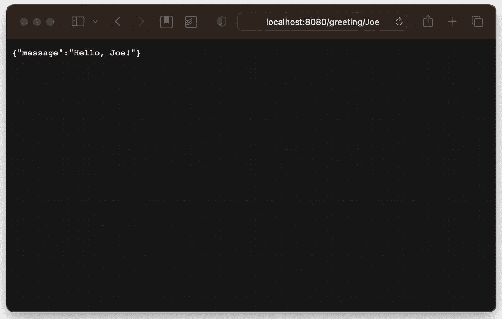
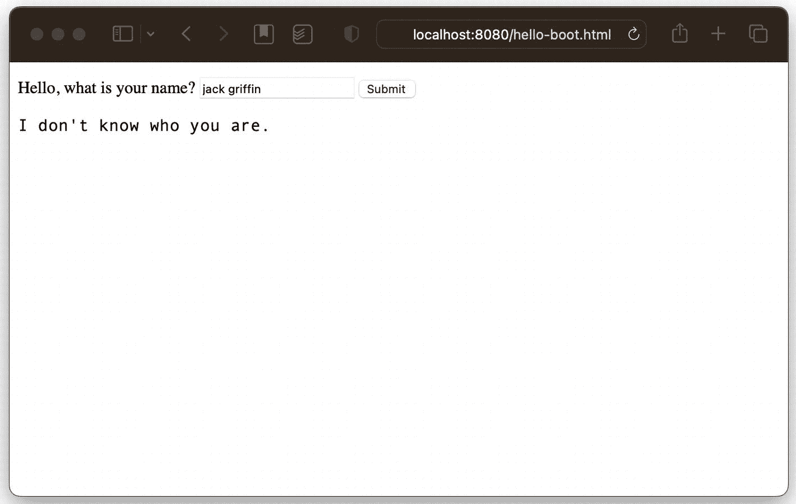

# 7. Spring Boot

到目前为止，我们已经了解了依赖注入和各种配置方法，并探索了将一些 Web 服务部署到 Apache Tomcat 中。在此过程中，我们使用了一小部分 Spring 模块，并根据需要进行了挑选。现在是时候转换思路，看看 Spring Boot 了，这是一个通常面向**微容器**的项目结构；Spring Boot 为我们提供了一种更简单的方法来获得 Spring 更丰富的功能集，并提供了一套集成的服务，旨在部署正在运行的应用程序，而无需依赖传统的 Jakarta EE 服务（如 Apache Tomcat）。

**微容器**有多种定义，但在上下文中，它是一个自包含的应用程序，可以表示为单个工件，部署在虚拟机中。这在 Java 的上下文中听起来有点奇怪，因为 Java 本身就在虚拟机中运行；那么，难道每个应用程序不都符合“微容器”的条件吗？

答案是“……​也许吧”。然而，“微容器”更常见的用法是指具有单一用途的应用程序，例如“运行乐队网关应用程序”，在其自己的虚拟机内运行（因此，是一个虚拟机在另一个虚拟机内运行），例如 Docker 容器。


## 什么是 Spring Boot？

Spring Boot ([`https://spring.io/projects/spring-boot`](https://spring.io/projects/spring-boot)) 的定义方式多种多样，就像 Spring 本身一样。

其核心是一个项目，它将许多最常用的 Spring 组件整合到一个统一的生态系统中，使得依赖管理更加容易，同时提供了一个可执行环境，使得无需容器即可轻松部署。

虽然随着章节项目的推进，我们添加了越来越多的模块，但到目前为止，我们还没有遇到太多相互关联的依赖关系，以至于需要费力去追踪依赖中的**问题**。一直以来，我们都专注于每一章的主题，因此能够将依赖列表保持在相当精简的程度。即便如此，我们也遇到了一些小问题——不过我们无需处理它们，因为它们非常微小，而且我们的工具实际上已经帮我们修复了。

假设我们依赖一个库——为了便于讨论，我们称它为 `spring-foobar`。这个项目名称完全是虚构的。假设这个库本身有传递性依赖，比如 `guava`、`slf4j-api` 和 `spring-webmvc`。问题是：*哪个* `spring-webmvc`？如果我们**自己**也依赖了 `spring-webmvc`，那么 `spring-foobar` 的依赖（比如 `spring-webmvc` 3.1^(⁸⁷)）和*我们*的依赖（可能是 `spring-webmvc` 6.1.0）之间就可能存在冲突。

无论我们使用什么构建系统，我们的构建脚本通常都会“胜出”，并且像 Maven 和 Gradle 这样的构建系统能够在必要时专门排除传递性依赖，以防它们产生混淆。然而，还有另一种可能性：我们可以在构建中使用物料清单（BOM），它整合了一系列相关的依赖，而不是挑选特定的版本。

这样做的结果是，我们最终会得到一个更一致、更稳定的构建。

通过 Spring Boot 父项目，我们将许多 Spring 依赖合并到一个参考列表（即物料清单）中，从而一举消除了这些潜在问题。这对我们的库声明和测试都有影响，因为几乎所有东西都神奇地可用了。^(⁸⁸)

但这还不是全部。

Spring Boot 旨在让你能够*无需*像 Apache Tomcat 这样的容器即可使项目可执行。你仍然可以以完全相同的方式编写控制器和 Spring Bean，但 Spring Boot 可以作为一个常规的可执行 Jar 文件运行，而不是启动一个 Tomcat 实例并将你的 Web 应用程序部署到其中（这是我们使用 `mvn jetty:run` 时或多或少假装执行的过程）。它自身嵌入了一个 Web 容器（默认是 Tomcat）并进行管理；它还管理日志记录、数据库连接（和数据库设置）、配置、指标以及其他事项。

这简直方便得不得了。

## 设置项目

实际设置一个 Spring Boot 项目相当简单。在 Maven 中，它涉及一个插件和一个初始依赖（可以选择配置一个可执行 jar）——之后，几乎所有事情都通过约定来完成，**包括**一个基本配置。让我们再走一遍“Hello, World”应用程序的流程，只是为了展示我们需要的部分——请注意，我们将在本章中逐步添加更多内容。

首先，当然，我们需要创建源代码结构和 `pom.xml` 本身。源代码结构与迄今为止我们看到的其他章节相同，包含一个 `main` 目录和一个 `test` 目录；我们的 `main` 目录包含一个 `java` 目录和一个 `resources` 目录。（我们将在本章后面使用 `resources` 来添加静态内容，只是为了说明如何创建一个“用户界面”——这个术语在本书中应用得非常宽泛。）

```
mkdir -p chapter07/src/main/java/com/bsg6/chapter07
mkdir -p chapter07/src/main/resources
mkdir -p chapter07/src/test/java/com/bsg6/chapter07
清单 7-1
使用 POSIX 命令创建目录结构
```

我们的 `pom.xml` 相当简洁——这在构建脚本中是一件好事。需要注意以下几点：

1.  我们包含了一个构建插件 `spring-boot-dependencies`，它为后续的依赖提供了版本信息。

2.  `spring-boot-starter-web` 依赖，其版本来自 `boot` 插件——所以我们不必（通常也不想）指定任何东西（它会从插件中获取）。

这种结构在 Spring Boot 应用程序中非常非常常见——如果你愿意，你甚至可以复制粘贴这个作为 Spring Boot 项目的起始模板。（需要说明的是，我们将在本章后面修改这个脚本，以添加一些测试所需的功能。）

需要说明的是，这并非什么特殊信息或行业秘闻——Spring Boot 自己的文档以及几乎所有其他 Spring Boot 参考资料都会向你展示几乎完全相同的内容。

```

4.0.0

com.apress
bsg6
1.0

chapter07
1.0
war

org.springframework.boot
spring-boot-starter-web

org.springframework.boot
spring-boot-starter-test
test

org.springframework.boot
spring-boot-maven-plugin
${springBootVersion}

清单 7-2
chapter07/pom.xml
```

## 检查基础

现在我们已经设置好了项目结构，可以创建我们的入口点了，我们将其命名为 `Chapter7Application`。它本身不会执行任何特定的代码——它将加载一个配置（通过 `@SpringBootApplication` 注解，这个注解有特殊含义，我们将在后面几段中看到）——并启动一个 Web 容器，同时为我们创建许多 Bean，用于指标和其他服务。我们的应用程序要做的事情很简单：声明 Bean 和控制器，并确保它们对应用程序类可见（通过位于同一个包树中，即包名以 `com.bsg6.chapter07` 开头，包括 `com.bsg6.chapter07` **下**的任何包）。这些服务将自动提供给任何需要它们的组件，我们将在后面看到。

### 构建应用程序

```
package com.bsg6.chapter07;
import org.springframework.boot.SpringApplication;
import org.springframework.boot.autoconfigure.SpringBootApplication;
@SpringBootApplication
public class Chapter7Application {
public static void main(String[] args) {
SpringApplication.run(Chapter7Application.class, args);
}
}
清单 7-3
chapter07/src/main/java/com/bsg6/chapter07/Chapter7Application.java
```

### 构建传输对象

当然，如果没有一个实际的控制器作为 HTTP 端点，这并没有什么用，所以让我们也创建一个简单的问候服务，以确保所有部分都能协同工作。首先，我们将创建一个 `Greeting`——一个包含内容的对象——我们可以从 REST 端点提供它。

注意使用了 `Objects.equals()` 和 `Objects.hash()` 等方法——这些是早在 Java 1.7 中引入的实用方法，用于帮助生成哈希码和判断相等性。

如果你跳过了第 6 章中关于 REST 的概念，现在可能是回去复习的好时机。如果你不想这样做，也没关系——基本上，我们是在 HTTP `GET` 请求后面托管一个资源。

```
package com.bsg6.chapter07;
import java.util.Objects;
public class Greeting {
String message;
public Greeting(String message) {
this.message = message;
}
public Greeting() {
}
public String getMessage() {
return message;
}
public void setMessage(String message) {
this.message = message;
}
@Override
public boolean equals(Object o) {
if (this == o) {
return true;
}
if (!(o instanceof Greeting)) {
return false;
}
Greeting greeting = (Greeting) o;
return Objects.equals(getMessage(), greeting.getMessage());
}
@Override
public int hashCode() {
return Objects.hash(getMessage());
}
}
清单 7-4
chapter07/src/main/java/com/bsg6/chapter07/Greeting.java
```


### 实际执行“问候”

既然我们有了一个可传递的对象，接下来创建`GreetingController`，其概念与第 6 章的`GreetingController`极为相似。^(⁸⁹) 我们将添加一两个特殊情况：首先，当未提供姓名时，我们会有一个通用问候语；其次，我们的控制器不会识别“隐形人”（在 1933 年恐怖电影中名为“杰克·格里芬”）的姓名。

```
package com.bsg6.chapter07;
import org.springframework.web.bind.annotation.PathVariable;
import org.springframework.web.bind.annotation.RequestMapping;
import org.springframework.web.bind.annotation.RestController;
@RestController
public class GreetingController {
@RequestMapping(value = {"/greeting/{name}", "/greeting/"})
Greeting greeting(@PathVariable(required = false) String name) {
String object = name != null ? name : "world";
/* Jack Griffin is the name of the "Invisible Man." */
if (object.equalsIgnoreCase("jack griffin")) {
return new Greeting("I don't know who you are.");
} else {
return new Greeting("Hello, " + object + "!");
}
}
}
代码清单 7-5
chapter07/src/main/java/com/bsg6/chapter07/GreetingController.java
```

需要指出几点：

*   `@RequestMapping` 表示该端点将处理多种 HTTP 方法的响应，因此我们既可以向此端点发送`POST`请求，也可以发送`GET`请求，并且它会以相同方式响应。如果我们想限制 HTTP 方法，可以使用`@GetMapping`或`@PostMapping`等注解。

*   我们指定了多个路径——一个包含`{name}`，另一个不包含。这是为了处理未提供姓名的情况，这样我们就可以用同一个端点响应`/greeting/World`和`/greeting`。这种做法并不特别明智，因为`POST`接受不同类型的数据，而我们却假设所有 HTTP 请求都得到相同处理。

*   我们使用`@PathVariable`注解映射参数类型，并指定该参数不是必需的（因为默认是必需的）。如果我们没有告诉 Spring 该参数是可选的，那么在未提供该值时就会抛出异常。

### 使用 Spring Boot 进行测试

当然，如果我们不知道控制器或服务是否正常工作，那么拥有它们就没有意义，因此我们为其创建一个测试，用几个示例输入及其预期输出来运行。实际上，这里有两种方法可以采用；一种测试方法是直接对端点方法进行方法调用来测试控制器。然而，这忽略了端点本身的许多功能。让我们快速看一下那段代码，以便了解我们在说什么。

```
@Test(dataProvider = "greetingData")
public void testDirectGreeting(String name, String greeting) {
assertEquals(
greetingController.greeting(name).getMessage(),
greeting);
}
代码清单 7-6
chapter07/src/test/java/com/bsg6/chapter07/TestGreetingController.java
```

我想，这段代码没问题，它实际上验证了控制器的 Java 代码是否按预期工作。然而，我们想要做的是通过 HTTP 发出调用，以确保参数转换和 URL 映射正常工作，并且我们能够以正确的形式获取返回的对象。只要允许 Spring Boot 在测试中注入一个用于发出 REST 调用的对象，并构建实际的端点，我们就可以做到这一点。为了发出调用，我们使用`TestRestTemplate`，它将允许我们从端点获取`ResponseEntity<Greeting>`。`ResponseEntity`使我们能够检查 REST 调用的实际结果——HTTP 状态码等——并返回一个我们可以像之前测试中那样检查的对象。这意味着我们需要更多代码来实际验证调用的结果，但这没关系；我们实际上对这些事情感兴趣。（如果我们对 HTTP 状态不感兴趣，可以使用`TestRestTemplate.getForObject()`代替，它会直接返回`Greeting`本身，而忽略`ResponseEntity`包装器。）以下是完整且可运行的`TestGreetingController`类，以展示具体内容。

```
package com.bsg6.chapter07;
import org.springframework.beans.factory.annotation.Autowired;
import org.springframework.boot.test.context.SpringBootTest;
import org.springframework.boot.test.web.client.TestRestTemplate;
import org.springframework.boot.test.web.server.LocalServerPort;
import org.springframework.http.HttpStatus;
import org.springframework.http.ResponseEntity;
import org.springframework.test.context.testng.AbstractTestNGSpringContextTests;
import org.testng.annotations.DataProvider;
import org.testng.annotations.Test;
import static org.testng.Assert.assertEquals;
@SpringBootTest(webEnvironment = SpringBootTest.WebEnvironment.RANDOM_PORT)
public class TestGreetingController extends AbstractTestNGSpringContextTests {
@Autowired
private GreetingController greetingController;
@LocalServerPort
private int port;
@Autowired
private TestRestTemplate restTemplate;
@DataProvider
Object[][] greetingData() {
return new Object[][]{
new Object[]{null, "Hello, world!"},
new Object[]{"World", "Hello, World!"},
new Object[]{"Andrew", "Hello, Andrew!"},
new Object[]{"Jack Griffin", "I don't know who you are."}
};
}
@Test(dataProvider = "greetingData")
public void testRestGreeting(String name, String greeting) {
String url = "http://localhost:" + port + "/greeting/" +
(name != null ? name : "");
ResponseEntity result =
restTemplate.getForEntity(url, Greeting.class);
assertEquals(result.getStatusCode(), HttpStatus.OK);
assertEquals(result.getBody().getMessage(), greeting);
}
@Test(dataProvider = "greetingData")
public void testDirectGreeting(String name, String greeting) {
assertEquals(
greetingController.greeting(name).getMessage(),
greeting);
}
}
代码清单 7-7
chapter07/src/test/java/com/bsg6/chapter07/TestGreetingController.java
```

我们现在**可以**实际运行测试，并执行这四个测试；现在我们知道控制器工作正常了。


### Spring Boot 中的配置

最后，我们是否需要创建某种额外的配置呢？

事实证明，不需要。（至少目前不需要。）`@SpringBootApplication` 注解实际上隐含了自动配置（因此连接会自动完成，并为我们生成大量基础设施）、对同一包（以及该包“下”的子包）中带有该注解的类进行组件扫描（因此 `com.bsg6.chapter07` 中的所有类都会被扫描，以检查它们是否为 Spring Bean），并且还隐式地包含了一个配置引用——所以，除非我们做一些非常规的操作，否则 Spring Boot 会自动识别当前包中所有被引用的 Bean，包括包含 Java 配置的类。实际上，我们的“Hello, World”Web 服务本身已经完成了。

在本章中，我们已经多次提到包树，即扫描发生在 `com.bsg6.chapter07` 及其“下”的子包中（如果有的话）。不过，值得记住的是，包是**按层级命名**的，虽然把它们想象成层级结构很方便，但它们实际上并不是真正的层级结构；你不能 `import` 一个包树，只能导入特定的包。

你必须逐个导入每个包。

因此，当我们说扫描发生在“包树”中时，请注意它实际上是在遍历具有共同前缀的包；它并不是真正的树。

如果我们告诉 Maven 在 `pom.xml` 中使用 `mvn -pl chapter07 package` 打包 war 文件，Maven 将构建一个我们可以直接运行的可执行归档文件。它不像 Java 中许多可执行包那样是 `.jar` 文件，但它同样可以工作。

```
mvn -pl chapter07
java -jar chapter07/target/chapter07-1.0.war
代码清单 7-8
构建并运行我们的«Hello, World»容器
```

在启动时输出大量日志信息（这应该只需要几秒钟）之后，我们可以在浏览器中打开 `http://localhost:8080/greeting/Joe`，然后我们的应用程序会热情地（甚至可以说是“深情地”）向我们打招呼。



一个网页浏览器窗口的截图，显示了一个托管在 localhost:8080/greeting/Joe 的网页。页面主体区域显示了文本：{ "message": "hello, Joe!" }

图 7-1

运行应用程序

### 使用 Spring Boot 处理静态内容

同样值得注意的是，只要我们将静态内容放在构建树中的 `src/main/resources/static` 目录下，Boot 就可以提供静态内容服务。（实际上还不止这些：默认情况下，静态内容可以从 `/static`、`/public`、`/resources` 甚至 `/META-INF/resources` 提供——是的，你也可以修改这些路径，尽管不建议这样做。在不增加更多混乱的情况下，拥有**四个**“标准位置”本身就很有趣了。）

让我们添加一个 `hello-boot.html` 页面，它将允许我们实际从 HTML 页面**发起**一个 REST 调用，只是为了演示一个端到端的过程。

这并不是对任何富客户端编程实践的推荐。这几乎可以说是能制作出的最简单的“富客户端”了，建议读者阅读 Apress 出版的众多关于 HTML 用户界面的优秀书籍，而不是将这个原始示例视为正确设计和实践的指导。

我们的 HTML 页面将包含的内容相当简单：一个通过简短 JavaScript 函数提交数据的 HTML 表单、JavaScript 代码本身，以及一个用于渲染结果的占位符。JavaScript 将使用 JQuery（[`https://jquery.com/`](https://jquery.com/)）向我们的端点发起 REST 调用，就像我们的测试所做的那样，并且它会修改占位符，逐字渲染来自 `GreetingController` 的数据。

```

Hello, World

function submitForm() {
$.get('http://localhost:8080/greeting/'+
$('#helloform input[name=name]').val(),
function(data) {
$("#greeting").text(data.message);
},
'json');
};

p#greeting {
font-family: "Andale Mono",monospace;
}

Hello, what is your name?

代码清单 7-9
chapter07/src/main/resources/static/hello-boot.html
```

如果我们运行应用程序（在重新构建之后，再次运行 `java -jar chapter07/target/chapter07-1.0.war`），我们可以通过打开 `http://localhost:8080/hello-boot.html` 并输入不同的名字来与我们的 HTML 页面交互。在这个例子中，我们将自己标识为“隐形人”。



一个网页浏览器窗口的截图，显示了一个托管在 localhost:8080/hello-boot.html 的网页。页面主体区域显示了文本：Hello, what is your name?，一个输入了 Jack Griffin 的输入框，以及一个提交按钮。我不知道你是谁。

图 7-2

与页面交互

### “Hello, World” Boot 机制总结

我们已经了解了如何构建项目结构并为 Spring Boot 创建可运行类，以及如何创建可执行的 jar 文件；我们还了解了如何创建 REST 端点（使用我们在第 6 章讨论的概念）并附带一个可工作的测试，以及如何将静态资源嵌入到我们的应用程序中。现在，是时候回到我们的音乐推荐应用程序，并展示更多内容如何在一个（稍微）更贴近实际的应用中整合在一起了。


## Spring Boot 与数据库连接

是时候为我们的音乐网关服务创建一个更好的版本了。在前面的章节中，我们一直复用第 3 章中仅使用内存的服务版本，这很方便，因为这些服务没有其他依赖项；它们既不使用数据库，也不使用任何可能需要配置的东西。为了演示一个功能更完整的配置，让我们创建一个由嵌入式数据库（此处为 H2）支持的 `MusicService`。

我们仍在向你展示一些并非“最高效”的做法。这是因为本章的重点是 Spring Boot 及其**一些**特性，而不是 JDBC 或其他类似技术；我们有意不利用将在后续章节中介绍的一些内容。其中一些内容，比如 Spring Boot 本身，将使完成某些编程任务变得更加容易，且代码量更少。

首先，当然，我们需要确保 H2 对我们的项目可用。我们还需要确保 `spring-boot-starter-jdbc` 在我们的依赖项列表中，以便——剧透警告——让 Spring Boot 为我们的数据库添加连接池。^(⁹⁰)

为什么选择 H2 而不是 HSQL 或 Derby？一方面，H2 可能是其中最流行的；H2 和 HSQLDB 都是 HSQL 的活跃维护分支，但 H2 由 HSQL 的原作者维护。Derby 实际上出人意料地强大，几乎可以看作是 IBM DB2 的 Java 版本，并由 Apache 维护，但它对系统资源的消耗比 H2 或 HSQLDB 更大。

```xml
<?xml version="1.0" encoding="UTF-8"?>
<project xmlns="http://maven.apache.org/POM/4.0.0"
         xmlns:xsi="http://www.w3.org/2001/XMLSchema-instance"
         xsi:schemaLocation="http://maven.apache.org/POM/4.0.0 http://maven.apache.org/xsd/maven-4.0.0.xsd">
    <modelVersion>4.0.0</modelVersion>

    <groupId>com.apress</groupId>
    <artifactId>bsg6</artifactId>
    <version>1.0</version>

    <parent>
        <groupId>org.springframework.boot</groupId>
        <artifactId>spring-boot-starter-parent</artifactId>
        <version>${springBootVersion}</version>
        <relativePath/>
    </parent>

    <groupId>chapter07</groupId>
    <artifactId>chapter07</artifactId>
    <version>1.0</version>
    <packaging>war</packaging>

    <dependencies>
        <dependency>
            <groupId>com.h2database</groupId>
            <artifactId>h2</artifactId>
            <scope>runtime</scope>
        </dependency>
        <dependency>
            <groupId>org.springframework.boot</groupId>
            <artifactId>spring-boot-starter-web</artifactId>
        </dependency>
        <dependency>
            <groupId>org.springframework.boot</groupId>
            <artifactId>spring-boot-starter-jdbc</artifactId>
        </dependency>
        <dependency>
            <groupId>org.springframework.boot</groupId>
            <artifactId>spring-boot-starter-test</artifactId>
            <scope>test</scope>
        </dependency>
    </dependencies>

    <build>
        <plugins>
            <plugin>
                <groupId>org.springframework.boot</groupId>
                <artifactId>spring-boot-maven-plugin</artifactId>
                <version>${springBootVersion}</version>
                <executions>
                    <execution>
                        <goals>
                            <goal>repackage</goal>
                        </goals>
                    </execution>
                </executions>
            </plugin>
        </plugins>
    </build>
</project>
清单 7-10
包含 H2 的 chapter07/pom.xml
```

注意在 `build` 节点中使用了 Spring Boot Maven 插件。这使我们能够将 Spring Boot 应用打包成可执行形式，随时可以部署和运行，同时还能处理其他一些（相对次要的）事情。

这里巧妙之处在于，对于三种 Java 嵌入式数据库——H2、HSQLDB 和 Derby——Spring Boot 可以为我们**自动配置**数据库。我们只需包含依赖项，剩下的工作由 Boot 完成。这并不意味着我们**不想**配置数据库，但对于早期开发和测试来说，这相当方便，就像 Spring Boot 的许多特性一样。然而，出于最佳实践的考虑，我们将手动配置数据库连接。

### 使用 Spring Boot 初始化数据

Spring Boot 还会在应用启动时为我们执行 SQL。它首先从类路径（例如，我们可以将这些文件放在源代码树的 `src/main/resources` 目录下）执行名为 `schema.sql` 和 `data.sql`（按此顺序）的文件中包含的 SQL 命令。它还会根据一个平台属性（我们稍后会展示）运行特定于数据库的脚本，这样我们就可以设置通用的模式，然后根据我们可能选择的任何数据库微调配置——如果我们碰巧使用了基于非 SQL 标准的特性的话。（换句话说，如果我们的模式需要特定数据库的特性，并使用该数据库的自定义 SQL，我们可以将自定义 SQL 放在一个以该数据库命名的文件中。）

请注意，我们的启动脚本是为测试需求设计的，而不是用于实际部署。我们强制重置数据以匹配测试要求，这是实际应用不会希望做的事情。

我们现在已经提到了数据库连接池的自动配置和一个“平台”属性。这些来自类路径中一个简单的属性文件，名为 `application.properties`。在我们的例子中，我们希望设置一个简单的数据库连接，包含 JDBC URL、用户名、密码和数据库驱动程序名称。实际上，我们并不**需要**所有这些——甚至一个都不需要——但设置它们是一个好习惯，以便将来你想将它们更改为比嵌入式数据库更健壮的东西。^(⁹¹)

我们目前的 `application.properties` 文件。

```
spring.datasource.url=jdbc:h2:./chapter07;DB_CLOSE_ON_EXIT=FALSE
spring.datasource.username=sa
spring.datasource.password=
spring.datasource.driver-class-name=org.h2.Driver
spring.sql.init.platform=h2
清单 7-11
chapter07/src/main/resources/application.properties
```

这样，当应用运行时，我们会在用户的当前目录中创建一个数据库，数据库用户名为 `sa`，密码为空（这恰好与默认的 H2 用户配置文件匹配）；我们还显式地将驱动程序类名设置为 `org.h2.Driver`。最后，我们还将平台设置为 `h2`，这样 Spring Boot 将首先尝试运行 `schema.sql`，然后运行 `schema-h2.sql`，之后运行 `data.sql` 和 `data-h2.sql`。

为什么要有特定于数据库的脚本？嗯，SQL 通常在所有数据库平台上都是相同的，但也不尽然。有些数据库会有非标准的数据类型或定义主键、表关系的方式；遗憾的是，尽管 SQL 如此常见且强大，但为了完成某些任务，通常需要特定于数据库的脚本——而定义模式正是最需要这样做的领域之一。

如果你还记得我们在第 3 章中的数据模型，你会注意到我们有两个实体需要管理：`Artist` 和 `Song`。这暗示我们应该有两个与这些实体名称对应的表，我们可以这样做，但我们不打算这么做。

原因很简单：本章已经涵盖了很多内容，同时涵盖 `Artist` 和 `Song` 服务会花费太多时间，而且增加的价值相对较少（一旦你理解了与 `Artist` 相关的服务是怎么回事，与 `Song` 相关的服务就不会有太大区别——但这会占用更多篇幅）。我们将在下一章中修改访问数据的方式，因此更有意义的是将重点放在第 8 章中服务的完整功能集上，而不是在第 7 章中。我们将在此处包含数据描述——作为 SQL 注释——只是为了向你展示它们应该放在哪里，但随后我们将假装 `Song` 不存在，直到我们进入第 8 章。

```sql
DROP INDEX IF EXISTS artist_name;
DROP TABLE IF EXISTS artists;
CREATE TABLE IF NOT EXISTS ARTISTS
(
    id   BIGINT NOT NULL GENERATED BY DEFAULT AS IDENTITY,
    name VARCHAR(64) NOT NULL
);
CREATE UNIQUE INDEX IF NOT EXISTS artist_name
    ON ARTISTS(name);
清单 7-12
chapter07/src/main/resources/schema.sql
```

我们还希望应用启动时数据库中有数据。在测试中，我们可能会（经常）清除数据，以便知道给定测试时数据库的状态。这是我们的 `data.sql` 文件。（如果我们碰巧使用了此 SQL 无法正常工作的数据库，我们最好为该数据库创建一个特定于平台的文件。）

```sql
INSERT INTO ARTISTS (NAME)
VALUES ('Threadbare Loaf');
INSERT INTO ARTISTS (NAME)
VALUES ('Therapy Zeppelin');
INSERT INTO ARTISTS (NAME)
VALUES ('Clancy In Silt');
清单 7-13
chapter07/src/main/resources/data.sql
```


### 构建 ArtistService

现在我们需要开始填充服务层——这意味着，像往常一样，创建一组文件。我们需要一种表示艺术家的方式——因此，我们将创建一个类，`com.bsg5.chapter07.Artist`，这很合乎逻辑。我们还需要一个服务——实际上是一个 `Repository`，即负责与数据库交互的组件——我们将其命名为 `com.bsg6.chapter07.ArtistRepository`。最后，我们需要一个将服务连接到 Web 层的组件——即控制器——因此，很自然地，我们将创建一个 `com.bsg6.chapter07.ArtistController`。

注意

如果你对第 3 章记忆犹新，你会记得我们当时使用了一个 `MusicService` 类来处理与数据模型相关的所有操作。而在这里，我们正如在第 3 章中所预告的那样，将功能拆分了出来。原因在于：便利性。我们在第 3 章中选择构建内存服务，是因为将数据模型的控制点集中在一组数据结构中要简单得多。而在这里，我们有了一个真正的“记录系统”——数据库——将交互拆分成更小的模块是合理的，因为从数据管理的角度来看，我们无需担心艺术家与歌曲之间的相互干扰。

`Artist` 类是一个简单的 POJO，具备其应有的一切特征：一个无参构造函数（默认构造函数）、私有字段、一个用于初始化私有字段的构造函数、访问器和修改器^(⁹²)、`equals()` 和 `hashCode()` 的实现，以及一个简单的 `toString()` 实现。一旦字段被添加到类中，几乎所有代码都由 IDE 生成；这个实现没有任何特殊或独特之处。（例外情况：`compareTo()` 方法忽略了艺术家名称的大小写，`equals()` 方法也做了同样的修改。）与它所做的事情相比，这是一个很长的类——毕竟它只是一个用于存放艺术家引用的容器——但这正是 Java 的美妙（或“美妙”）之处。

注意

当然，我们还有其他选择。为了简单起见，我们为 `Artist` 选择了 POJO；例如，我们也可以使用 Java 的 `record` 类。

```
package com.bsg6.chapter07;
import java.util.Objects;
import java.util.StringJoiner;
public class Artist implements Comparable {
private int id;
private String name;
public Artist() {
}
public Artist(int id, String name) {
this.id = id;
this.name = name;
}
public int getId() {
return id;
}
public void setId(int id) {
this.id = id;
}
public String getName() {
return name;
}
public void setName(String name) {
this.name = name;
}
@Override
public String toString() {
return new StringJoiner(", ",
Artist.class.getSimpleName() + "[", "]")
.add("id=" + id)
.add("name='" + name + "'")
.toString();
}
@Override
public boolean equals(Object o) {
if (this == o) return true;
if (!(o instanceof Artist)) return false;
Artist artist = (Artist) o;
return getId() == artist.getId() &&
Objects.equals(
getName().toLowerCase(),
artist.getName().toLowerCase()
);
}
@Override
public int hashCode() {
return Objects.hash(getId(), getName());
}
@Override
public int compareTo(Artist o) {
return o.getName().toLowerCase().compareTo(getName().toLowerCase());
}
}
Listing 7-14
chapter07/src/main/java/com/bsg6/chapter07/Artist.java
```

`ArtistService` 需要更多解释。

首先，请记住，我们正在尝试实现第 3 章中列出的与艺术家相关的以下服务：

*   检索艺术家名称列表（用于自动补全操作）

这意味着我们在第 3 章中列出的其他四项服务是与歌曲相关的，尽管涉及艺术家，而事实也确实如此。

问题是，其他服务也隐含了与艺术家相关的操作。请记住，在我们的完整需求集中，我们希望记录歌曲的存在，并为歌曲投票——这些确实是歌曲相关的服务，但歌曲也需要与艺术家关联。因此，我们应该在我们的需求列表中添加一些基础服务：

*   根据 id 获取艺术家。

*   根据名称获取艺术家。

*   保存艺术家。

这些函数的结构看起来也有些奇怪。实际上，每个函数我们都需要两个版本：一个只接受函数所需的参数（例如，如果通过 `id` 获取 `Artist`，则只需一个 `id`），另一个则在这些参数的基础上增加一个 `Connection` 对象。我们这样做是因为我们希望能够组合方法，并且希望这种组合不需要每次调用都使用一个独立的数据库连接。例如，保存艺术家时可能首先需要根据名称查找艺术家；我们希望这两个操作使用同一个 `Connection`，因为这样我们就可以使用一个数据库事务而不是两个。（我们将在本章后面看到这一点。）

警告

与本章中的许多其他内容一样，我们……实际上并没有显式地使用数据库事务。我们将在第 8 章中更深入地讨论事务隔离特性。不过，在本章中，维护事务状态会分散注意力。

让我们看看 `ArtistService` 的前两个方法，`findArtistById()`。这些方法非常简单：检索一个主键与提供的参数匹配的 `Artist`。

实际上，我们将拥有*两个*方法——一个接受 `Connection` 和 `id`，另一个只需要 `id`。这是有意为之的设计，以便我们可以通过 `Connection` 对象传播事务；方法的“简单”版本可以启动事务并控制回滚，而执行实际工作的方法可以*参与*事务，但不控制它。我们将在后续章节中看到更多这种模式，直到我们让 Spring 来为我们管理它。

```
public Artist findArtistById(int id) throws SQLException {
try (Connection conn = dataSource.getConnection()) {
return findArtistById(conn, id);
}
}
private Artist findArtistById(Connection conn, int id) {
String sql = "SELECT * FROM artists WHERE id=?";
try (PreparedStatement ps = conn.prepareStatement(sql)) {
ps.setInt(1, id);
try (ResultSet rs = ps.executeQuery()) {
if (rs.next()) {
return new Artist(id, rs.getString("name"));
} else {
throw new ArtistNotFoundException(id +
" not found in artist database");
}
}
} catch (SQLException e) {
throw new ArtistNotFoundException(e);
}
}
Listing 7-15
chapter07/src/main/java/com/bsg6/chapter07/services/ArtistService.java excerpt
```

我们看到的是一个相当简单的机制：如果我们调用 `findArtistById(int)`，我们会使用 Java 的 try-with-resources 分配一个 `Connection`（这意味着当退出 `try` 块时，`Connection` 会被正确关闭，而无需我们编写显式代码），然后在 `try` 块内部，委托给同名的重载方法，并传入该 `Connection`。

重载方法简单地创建一个 `PreparedStatement`，并用它来查询数据库中匹配的 `Artist`。如果找到，它会用查询到的数据构造一个 `Artist` 并返回。如果未找到，它会抛出一个自定义异常——`ArtistNotFoundException`。


### 在 Spring Boot 中处理异常

我们创建自定义异常，是因为我们希望以不同的方式处理不同的路径。通用异常也能工作，但自定义异常允许我们为异常赋予语义含义，并精确地处理它。事实上，既然我们已经提到了异常，在查看 `ArtistService.java` 的其余部分之前，我们应该先快速了解一下它。

```
package com.bsg6.chapter07;
import org.springframework.http.HttpStatus;
import org.springframework.web.bind.annotation.ResponseStatus;
@ResponseStatus(HttpStatus.NOT_FOUND)
public class ArtistNotFoundException extends RuntimeException {
public ArtistNotFoundException(String message) {
super(message);
}
public ArtistNotFoundException(Exception e) {
super(e);
}
}
清单 7-16
chapter07/src/main/java/com/bsg6/chapter07/ArtistNotFoundException.java
```

这是一个非常普通的异常类，其中有一行我们真正需要关注：`@ResponseStatus(HttpStatus.NOT_FOUND)`。这告诉 Spring 的 `@Controller`，此异常应映射到特定的 HTTP 状态码——在本例中，它是 404，对应“未找到”，正如其名称明确暗示的那样。如果我们没有设置显式的响应状态，这些异常将被视为服务错误，对应 HTTP 状态码 500。使用精确的 HTTP 错误码意味着，如果此异常从 `Controller` 返回，它应被视为“资源未找到”——从名称来看，这**正是**它所代表的含义。（这似乎显而易见，但如果我们不指出来，就有些失职了。）

同样值得指出的是，它继承自 `RuntimeException`。这在 Spring 的异常处理中很典型，因为这意味着我们不必在方法签名中指定抛出的异常，从而使代码更简洁。看待这种做法的方式有很多，但**大多数**语言都没有与 Java 显式错误机制类似的东西，即使在 Java 虚拟机上也是如此，而且大多数程序员似乎也乐于编写更简洁的代码。

现在我们可以查看 `ArtistRepository` 的其余部分了。一旦我们理解了所使用的方法重载，尽管类很长，但它实际上非常简单。另外值得注意的是：类上使用了 `@Repository` 注解，并且通过 `DataSource` 进行构造。将其标记为 `@Repository` 描述了其特定的架构角色（它封装了与数据存储系统交互的行为），并使其能够参与转换某些异常类型（本章不介绍此功能）。

### `ArtistService` 及其小 `Controller` 的实际实现

```
package com.bsg6.chapter07;
import org.springframework.stereotype.Repository;
import javax.sql.DataSource;
import java.sql.Connection;
import java.sql.PreparedStatement;
import java.sql.ResultSet;
import java.sql.Statement;
import java.sql.SQLException;
import java.util.ArrayList;
import java.util.List;
@Repository
public class ArtistRepository {
private DataSource dataSource;
public ArtistRepository(DataSource dataSource) {
this.dataSource = dataSource;
}
public Artist findArtistById(int id) throws SQLException {
try (Connection conn = dataSource.getConnection()) {
return findArtistById(conn, id);
}
}
private Artist findArtistById(Connection conn, int id) {
String sql = "SELECT * FROM artists WHERE id=?";
try (PreparedStatement ps = conn.prepareStatement(sql)) {
ps.setInt(1, id);
try (ResultSet rs = ps.executeQuery()) {
if (rs.next()) {
return new Artist(id, rs.getString("name"));
} else {
throw new ArtistNotFoundException(id +
" not found in artist database");
}
}
} catch (SQLException e) {
throw new ArtistNotFoundException(e);
}
}
public Artist saveArtist(String name) throws SQLException {
try (Connection conn = dataSource.getConnection()) {
try {
return saveArtist(conn, name);
} catch (SQLException e) {
e.printStackTrace();
return findArtistByName(conn, name);
}
}
}
private Artist saveArtist(Connection conn, String name)
throws SQLException {
String sql = "INSERT INTO ARTISTS (NAME) VALUES (?)";
try (PreparedStatement ps = conn.prepareStatement(sql, Statement.RETURN_GENERATED_KEYS)) {
ps.setString(1, name);
ps.executeUpdate();
try (ResultSet rs = ps.getGeneratedKeys()) {
rs.next();
int id = rs.getInt(1);
return new Artist(id, name);
}
}
}
public Artist findArtistByName(String name) throws SQLException {
try (Connection conn = dataSource.getConnection()) {
return findArtistByName(conn, name);
}
}
private Artist findArtistByName(
Connection conn,
String name
) throws SQLException {
String sql = "SELECT * FROM artists WHERE LOWER(name)=LOWER(?)";
try (PreparedStatement ps = conn.prepareStatement(sql)) {
ps.setString(1, name);
try (ResultSet rs = ps.executeQuery()) {
if (rs.next()) {
return new Artist(
rs.getInt("id"),
rs.getString("name")
);
} else {
throw new ArtistNotFoundException(name +
" not found in artist database");
}
}
}
}
public List findAllArtistsByName(String name)
throws SQLException {
try (Connection conn = dataSource.getConnection()) {
return findAllArtistsByName(conn, name);
}
}
private List findAllArtistsByName(
Connection conn,
String name
) throws SQLException {
String sql = "SELECT * FROM artists WHERE LOWER(name) LIKE LOWER(?)"
+ " ORDER BY name";
List artists = new ArrayList();
try (PreparedStatement ps = conn.prepareStatement(sql)) {
ps.setString(1, name + "%");
try (ResultSet rs = ps.executeQuery()) {
while (rs.next()) {
artists.add(new Artist(
rs.getInt("id"),
rs.getString("name")
));
}
}
}
return artists;
}
}
清单 7-17
chapter07/src/main/java/com/bsg6/chapter07/ArtistRepository.java
```

在这个 `ArtistRepository` 的特定实现中，包括 SQL 本身，并没有什么特别之处。

然而，`saveArtist` 方法需要一些解释——它实际上返回一个有效的 `Artist`。它通过首先尝试将 `Artist` 保存到数据库来实现这一点——但如果数据已经存在了呢？我们会得到一个异常（`SQLException`，表示违反了唯一键约束）。此方法如果捕获到该 `SQLException`，就会假设 `Artist` 已经在数据库中，然后查询该 `Artist` 数据并返回它——因此我们总能得到一个有效的“已保存”的 `Artist`，即使我们并没有在此特定调用中实际创建 `Artist` 数据。

> 注意
>
> 为了简便起见，我们仍然（稍微）有点取巧；我们没有检查所涉及的 `SQLException` 是否由索引违规引起，而这是我们希望遵循此逻辑的唯一情况。


该类在 `findAllArtistsByName` 方法中使用通配符匹配进行搜索——传入 `foo` 时，它会通过参数值 `foo%` 搜索所有名称以 `foo` 开头的艺术家——并且使用 SQL 的 `LOWER()` 函数来消除查询中的大小写敏感性。但除此之外（当然，还有 try-with-resources [[`https://docs.oracle.com/javase/tutorial/essential/exceptions/tryResourceClose.html`](https://docs.oracle.com/javase/tutorial/essential/exceptions/tryResourceClose.html)]），它与 JDBC 早期编写的代码并无二致。当然，从 Spring 的角度来看，这既低效又相当糟糕——Spring 拥有出色的数据访问机制，而我们在这里**完全**忽略了它们——但同样，这更多是下一章的主题。

为了实现服务功能，我们还需要查看一个类——`Controller` 本身，它主要将任务委托给 `ArtistRepository`。实际上它相当简短，谢天谢地，只暴露了四个端点。

```
package com.bsg6.chapter07;
import org.springframework.http.HttpStatus;
import org.springframework.http.ProblemDetail;
import org.springframework.web.bind.annotation.*;
import java.net.URI;
import java.sql.SQLException;
import java.util.List;
@RestController
public class ArtistController {
private ArtistRepository service;
public ArtistController(ArtistRepository service) {
this.service = service;
}
@GetMapping("/artist/{id}")
Artist findArtistById(@PathVariable int id) throws SQLException {
return service.findArtistById(id);
}
@GetMapping({"/artist/search/{name}", "/artist/search/"})
Artist findArtistByName(
@PathVariable(required = false) String name
) throws SQLException {
if (name != null) {
return service.findArtistByName(name);
} else {
throw new IllegalArgumentException("No artist name submitted");
}
}
@PostMapping("/artist")
Artist saveArtist(@RequestBody Artist artist) throws SQLException {
return service.saveArtist(artist.getName());
}
@GetMapping({"/artist/match/{name}", "/artist/match/"})
List findArtistByMatchingName(
@PathVariable(required = false)
String name
) throws SQLException {
return service.findAllArtistsByName(name != null ? name : "");
}
@ExceptionHandler(ArtistNotFoundException.class)
ProblemDetail handleArtistNotFound(ArtistNotFoundException e) {
ProblemDetail problemDetails = ProblemDetail
.forStatusAndDetail
(HttpStatus.NOT_FOUND, e.getLocalizedMessage());
problemDetails.setTitle("Artist Not Found");
return problemDetails;
}
}
清单 7-18
chapter07/src/main/java/com/bsg6/chapter07/ArtistController.java
```

请注意针对 HTTP `GET` 和 `POST` 方法使用的特定注解。对于使用 `@GetMapping` 注解的方法，参数作为 URL 映射本身的一部分嵌入，这些方法都相当简单。

不过，`saveArtist()` 方法使用了 `@PostMethod`，并且有一个 `Artist` 类型的参数。这意味着期望在 HTTP 内容中向该方法传递一个 `Artist` 模型——这对于 REST 服务来说相当标准。但我们无需担心如何将 JSON 或 XML 转换为我们自己的 `Artist` 类，因为正如第 6 章所述，Spring 会为我们处理所有这些工作。

我们还看到一个名为 `handleArtistNotFound()` 的方法，它向调用者返回一个 `ProblemDetail`。我们这里的示例相当简陋且规范不足；它仅仅将异常转换为 `ProblemDetail`，并在报告中添加了一个标题。如果我们有更细粒度的 `ArtistNotFoundException` 实例，能够区分艺术家是未通过 `id` 找到还是未通过 `name` 找到，那么我们就可以拥有更细粒度的问题处理器，并向调用者提供更多关于实际错误的信息。

### 测试我们的 `ArtistController`：它能工作吗？

不过，我们实际上还有一个类需要查看，而且它相当重要：那就是 `TestArtistController` 类，它实际上是整章中最长的类，跨越了 150 多行。


```
package com.bsg6.chapter07;
import org.springframework.beans.factory.annotation.Autowired;
import org.springframework.boot.test.context.SpringBootTest;
import org.springframework.boot.test.web.client.TestRestTemplate;
import org.springframework.core.ParameterizedTypeReference;
import org.springframework.http.HttpMethod;
import org.springframework.http.HttpStatus;
import org.springframework.http.ResponseEntity;
import org.springframework.test.context.testng.AbstractTestNGSpringContextTests;
import org.testng.annotations.DataProvider;
import org.testng.annotations.Test;
import java.util.List;
import static org.testng.Assert.*;
@SpringBootTest(webEnvironment = SpringBootTest.WebEnvironment.RANDOM_PORT)
public class TestArtistController extends AbstractTestNGSpringContextTests {
@Autowired
private TestRestTemplate restTemplate;
@DataProvider
Object[][] artistData() {
return new Object[][]{
new Object[]{1, "Threadbare Loaf"},
new Object[]{2, "Therapy Zeppelin"},
new Object[]{3, "Clancy in Silt"},
new Object[]{-1, null},
new Object[]{-1, "Not A Band"}
};
}
@Test(dataProvider = "artistData")
public void testGetArtist(int id, String name) {
String url = "/artist/" + id;
ResponseEntity response =
restTemplate.getForEntity(url, Artist.class);
if (id != -1) {
assertEquals(response.getStatusCode(), HttpStatus.OK);
Artist artist = response.getBody();
Artist data = new Artist(id, name);
assertEquals(artist, data);
} else {
assertEquals(response.getStatusCode(), HttpStatus.NOT_FOUND);
}
}
@Test(dataProvider = "artistData")
public void testSearchForArtist(int id, String name) {
String url = "/artist/search/" +
(name != null ? name : "");
ResponseEntity response =
restTemplate.getForEntity(url, Artist.class);
if (name != null) {
if (id == -1) {
assertEquals(response.getStatusCode(),
HttpStatus.NOT_FOUND);
} else {
assertEquals(response.getStatusCode(), HttpStatus.OK);
Artist artist = response.getBody();
Artist data = new Artist(id, name);
assertEquals(artist, data);
}
} else {
assertEquals(response.getStatusCode(),
HttpStatus.INTERNAL_SERVER_ERROR);
}
}
/*
* 此方法尝试保存一个应已存在于数据库中的艺术家；
* 这将验证 Repository 的 saveArtist() 方法在所有情况下
* 都能返回一个有效的艺术家对象，因为它应返回原始的艺术品引用。
*/
@Test
public void testSaveExistingArtist() {
String url = // "http://localhost:" + port +
"/artist";
Artist newArtist =
restTemplate.getForObject(url + "/1", Artist.class);
ResponseEntity response =
restTemplate.postForEntity(url, newArtist, Artist.class);
assertEquals(response.getStatusCode(), HttpStatus.OK);
Artist artist = response.getBody();
assertNotNull(artist);
int id = artist.getId();
assertEquals(id, newArtist.getId());
assertEquals(artist.getName(), newArtist.getName());
response =
restTemplate.getForEntity(url + "/" + id, Artist.class);
assertEquals(response.getStatusCode(), HttpStatus.OK);
Artist foundArtist = response.getBody();
assertNotNull(foundArtist);
assertEquals(artist, foundArtist);
}
@DataProvider
public Object[][] artistSearches() {
return new Object[][]{
new Object[]{"", 3},
new Object[]{"T", 2},
new Object[]{"Th", 2},
new Object[]{"Thr", 1},
new Object[]{"C", 1},
new Object[]{"Z", 0}
};
}
@Test(dataProvider = "artistSearches")
public void testSearches(String name, int count) {
// 用于帮助 Spring 确定 restTemplate.exchange() 返回的类型
ParameterizedTypeReference> type =
new ParameterizedTypeReference>() {
};
String url = "/artist/match/" + name;
ResponseEntity> response = restTemplate.exchange(
url,
HttpMethod.GET,
null,
type
);
assertEquals(response.getStatusCode(), HttpStatus.OK);
List artists = response.getBody();
assertNotNull(artists);
assertEquals(artists.size(), count);
}
/*
* 我们需要在 testSearches 完成后运行此方法，因为
* testSaveArtist() 会向艺术家列表中添加数据，因此某些搜索
* 可能会多返回一位艺术家。
*/
@Test(dependsOnMethods = "testSearches")
public void testSaveArtist() {
String url = //"http://localhost:" + port +
"/artist";
Artist newArtist = new Artist(0, "The Broken Keyboards");
ResponseEntity response = restTemplate.postForEntity(
url,
newArtist,
Artist.class
);
assertEquals(response.getStatusCode(), HttpStatus.OK);
Artist artist = response.getBody();
assertNotNull(artist);
int id = artist.getId();
assertNotEquals(id, 0);
assertEquals(artist.getName(), newArtist.getName());
response =
restTemplate.getForEntity(url + "/" + id, Artist.class);
assertEquals(response.getStatusCode(), HttpStatus.OK);
Artist foundArtist = response.getBody();
assertNotNull(foundArtist);
assertEquals(artist, foundArtist);
}
}
清单 7-19
chapter07/src/test/java/com/bsg6/chapter07/TestArtistController.java
```

当然，它看起来比实际要复杂；它包含一系列测试，遵循我们在 `TestGreetingController` 中看到的相同模式：构建一个请求，向 `ArtistController` 端点发出请求，然后检查预期的 HTTP 响应和预期的 HTTP 实体内容（即，确保我们得到正确的 HTTP 状态，然后检查响应中包含的数据）。大部分代码都是基于我们对数据库已知数据所做的断言；`artistData()`（我们的一个数据提供者方法）包含 `Artist` 的名称和标识符，而 `artistSearches()` 则跟踪与所提供内容匹配的响应数量（如果请求包含 `"Th"`，则应返回 `Threadbare Loaf` 和 `Therapy Zeppelin` 两位艺术家，记录数为 `2`）。

有一个方法需要在 `testSearches()` **之后**执行——即 `testSaveArtist()`——因为 `testSaveArtist()` 会修改数据库，并可能改变某个搜索的结果。实际上哪个方法先执行并不重要，但执行顺序应该是确定的。（否则，方法将无法预测数据库状态，这可不是件好事。）

## 下一步

在本章中，我们介绍了 Spring Boot——一个将 Spring 的许多功能整合到一个统一项目中的项目，它使依赖管理更加容易，并以约定而非要求开发者挑选模块的方式提供了许多服务。我们还演示了如何创建和配置一个微容器，使得从编译到执行的过程变得更加简单。

在下一章中，我们将介绍本章最薄弱的环节之一：使用 Spring Data 进行数据访问。

脚注 1   2   3   4   5   6

