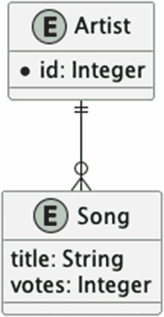
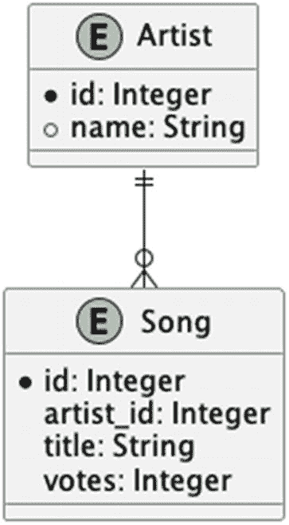

# 8. 使用 JdbcTemplate 进行 Spring 数据访问

是时候开始研究我们如何实际访问数据了。Spring 有多种数据访问方式；在这里，我们将介绍 `JdbcTemplate`，这是一个为常见操作提供简单访问的门面模式，并且我们将解决第 7 章中关于数据访问的其他一些问题。


## 引言

第 7 章是一章“总括性”章节，重点介绍了 Spring Boot。随后我们探讨了 Spring Boot 为我们处理的一些常见事务，例如处理依赖解析，以及为开发者常用的功能（如简单的 Web 部署、便捷的可执行归档文件和近乎透明的数据库配置）提供便捷的起点。

接着，我们介绍了数据库访问，大多数有经验的开发者——以及许多经验不足的开发者——可能会将其描述为“古雅”。我们还略微提到了数据库访问代码中的一个关键问题——该问题最终导致我们的服务只能处理两个数据库实体中的一个，因为在第 7 章的上下文中解决该问题得不偿失。因此，我们在第 7 章中选择对更简单的内容进行建模，将合适的数据库访问推迟到**本章**和下一章进行。

你认为第 7 章中的“关键问题”是什么？除了显而易见的答案“没有引用‘Song’”之外？剧透倒计时：三…​ 二…​ 一…​。

第 7 章完全没有管理事务。如果不引入超出第 7 章范围的数据库抽象，就无法解决数据库请求的协调问题。相反，我们选择保持事情非常简单，并为第 8 章和第 9 章奠定基础，这两章都将以更优雅（也更正确）的方式处理数据库访问。

在本章中，我们将演示 `JdbcTemplate` 的使用，它本身是 Spring 许多更简单的数据访问设施的模型。`JdbcTemplate` 为我们提供了一个单一的通用工作流模型，并提供了从关系数据映射到类的简单机制，以及用于异常处理和集中日志记录的简单模型。我们还将通过添加控制器来访问所有数据，并为所有内容编写测试，来完善本应是第 7 章的功能集。

## 项目设置

这是一个简单、相当直接的项目。首先，让我们创建项目目录结构。

```
mkdir -p chapter08/src/main/java/com/bsg6/chapter08
mkdir -p chapter08/src/main/resources
mkdir -p chapter08/src/test/java/com/bsg6/chapter08
mkdir -p chapter08/src/test/resources
清单 8-1
使用 POSIX 命令创建目录结构
```

和往常一样，我们需要一个 `pom.xml`。我们将使用在第 7 章中首次看到的 Spring Boot 依赖解析，并包含四个特别值得注意的内容。让我们看一下 `pom.xml`，然后更详细地了解这些依赖项。

```

4.0.0

com.apress
bsg6
1.0

chapter08
1.0
war

com.h2database
h2
runtime

org.springframework.boot
spring-boot-starter-web

org.springframework.boot
spring-boot-starter-jdbc

org.springframework.boot
spring-boot-starter-test
test

org.springframework.boot
spring-boot-maven-plugin
${springBootVersion}

清单 8-2
chapter8/pom.xml
```

首先，请注意我们包含了 `spring-boot-starter-jdbc`。这将引入 Spring 确保其 JDBC 支持和生态系统所需的一切，这意味着我们将获得各种好东西，例如连接池（默认使用 HikariCP^(⁹³)）、测试专用的数据源和数据加载功能（如第 7 章所述，使用 `schema.sql` 和 `data.sql`）。

我们想要确保包含的下一个依赖项实际上是最不相关的，因为我们在第 7 章中已经见过它：`spring-boot-starter-web`。我们在这里包含它是因为本章实际上将包含一个完全可用的乐队网关后端。

## 我们的实体和数据模型

我们使用与第 3 章描述且此后一直使用的相同的实体模型。但是，我们想稍微更改一下**数据**模型，以使数据管理更高效。

“实体模型”和“数据模型”有什么区别？嗯，具体来说，它们在很大程度上是可以互换的。没有一个正式的定义可以用来区分“这是实体模型，那是数据模型”。然而，通俗地说——正如这里所使用的——实体模型描述了我们正在处理的事物（实体）之间的整体关系，而数据模型是对实际管理元素的更具体描述。

例如，在一个**实体**模型中，一个 `Artist` 存在（因此，它是一个实体！），并且它有一个 `name`。在一个数据模型中，我们可能会包含一些使处理 `Artist` 更方便的内容——例如一个生成的主键，或者该 `Artist` 的歌曲数量——这些内容从编程角度来看可能与 `Artist` 相关，但不一定是 `Artist` 作为概念定义的一部分。

我们的实体模型（再次参见第 3 章）如下所示。



艺术家与歌曲之间的实体关系模型。具有属性 id（整数）的实体 E（艺术家）通过一对多关系分别与具有属性 title（字符串）和 votes（整数）的实体 E（歌曲）相互连接。

图 8-1

实体模型

我们的**数据**模型为实体添加了一些属性，以创建关系并使对象管理更加高效。



艺术家与歌曲之间的数据关系模型。具有属性 id（整数）和 name（字符串）的实体 E（艺术家）通过一对多关系分别与具有属性 id（整数）、artist_id（整数）、title（字符串）和 votes（整数）的实体 E（歌曲）相互连接。

图 8-2

数据模型

这并不完全描述性——我们没有在模型中包含可空性或大小，但我们也不是**完全**试图构建一个正式的实体模型。我们主要考虑的是如何设计我们的类结构。当你从 SQL 优先的访问模型出发时（即，当你预期使用 JDBC 访问数据时，正如我们在本章中所做的那样），这是建模数据的“正确方式”；在下一章中，当我们研究 Spring Data 时，我们实际上可以先设计类，然后确保它们生成一个可工作的数据库模式，而不是从模式开始并构建一个可工作的类结构。

以下是 `Artist` 类的完整实现。

```
package com.bsg6.chapter08;
import org.springframework.lang.NonNull;
import java.util.Objects;
import java.util.StringJoiner;
public class Artist {
Integer id;
@NonNull
String name;
public Artist() {}
public Artist(@NonNull String name) {
this.name=name;
}
public Artist(Integer id, @NonNull String name) {
this.id = id;
this.name = name;
}
public Integer getId() {
return id;
}
public void setId(Integer id) {
this.id = id;
}
@NonNull
public String getName() {
return name;
}
public void setName(@NonNull String name) {
this.name = name;
}
@Override
public String toString() {
return new StringJoiner(", ", Artist.class.getSimpleName() + "[", "]")
.add("id=" + id)
.add("name='" + name + "'")
.toString();
}
@Override
public boolean equals(Object o) {
if (this == o) return true;
if (!(o instanceof Artist artist)) return false;
return Objects.equals(getId(), artist.getId()) && Objects.equals(getName(), artist.getName());
}
@Override
public int hashCode() {
return Objects.hash(getId(), getName());
}
}
清单 8-3
chapter8/src/main/java/com/bsg6/chapter08/Artist.java
```


细心的读者会注意到`@NonNull`的使用。这引出了一个在前几章中已经提及的有趣观点：Spring 会影响你的设计和对象模型，但影响程度完全取决于*你的意愿*。`@NonNull`意味着当 Spring 自身构建模型或对模型应用验证时（例如在`@Controller`中使用或在其他类似场景中），它可以检查验证结果并提示模型是否构建正确。

但当 Spring*不参与*时——或者仅以特定方式参与时——这些注解就毫无作用。毕竟注解是在运行时由代码应用的，除非有东西检查被注解的结构并根据注解采取行动，否则*什么都不会发生*。

因此这些注解是有价值的，但重要的是要注意，它们的存在对*普通代码*而言并不意味着什么——它更多是提供信息，如果我们编写普通的 Java 代码，这些注解对任何事情都没有影响。这里使用的`@NonNull`注解意味着验证机制可以确保没有`null`值通过*验证层*，但 JVM 本身或执着的程序员仍然可以将值设置为`null`。

现在让我们看看`Song`类是什么样的。

```
package com.bsg6.chapter08;
import org.springframework.lang.NonNull;
import java.util.Objects;
import java.util.StringJoiner;
public class Song {
Integer id;
@NonNull
Integer artistId;
@NonNull
String name;
int votes;
public Song() {
}
public Song(Integer id, @NonNull Integer artistId, @NonNull String name, int votes) {
this.id = id;
this.artistId = artistId;
this.name = name;
this.votes = votes;
}
public Integer getId() {
return id;
}
public void setId(Integer id) {
this.id = id;
}
@NonNull
public Integer getArtistId() {
return artistId;
}
public void setArtistId(@NonNull Integer artistId) {
this.artistId = artistId;
}
@NonNull
public String getName() {
return name;
}
public void setName(@NonNull String name) {
this.name = name;
}
public int getVotes() {
return votes;
}
public void setVotes(int votes) {
this.votes = votes;
}
@Override
public boolean equals(Object o) {
if (this == o) return true;
if (!(o instanceof Song song)) return false;
return getVotes() == song.getVotes()
&& Objects.equals(getId(), song.getId())
&& Objects.equals(getArtistId(), song.getArtistId())
&& Objects.equals(getName(), song.getName());
}
@Override
public int hashCode() {
return Objects.hash(getId(), getArtistId(), getName(), getVotes());
}
@Override
public String toString() {
return new StringJoiner(", ", Song.class.getSimpleName() + "[", "]")
.add("id=" + id)
.add("name='" + name + "'")
.add("votes=" + votes)
.toString();
}
}
清单 8-4
chapter08/src/main/java/com/bsg6/chapter08/Song.java
```

这里没有什么神奇之处；我们基本上是在用 Java 源代码复现我们的数据模型。

我们将按照第 7 章所述，通过创建`schema.sql`文件来手动创建数据库模式。这些文件不会放在源代码树的相同位置，因为`application.properties`仅适用于我们的测试——毕竟在生产环境中我们可能想使用不同的数据库——但无论 H2 实例是内存型（如我们的测试中）还是外部数据库，或者任何其他形式，我们的`schema.sql`都是适用的。

H2 可以作为嵌入式数据库运行，也可以作为独立的数据库服务器运行。此外，它可以在磁盘上或内存中创建数据库，因此我们可以有四种不同的配置。

| 嵌入式且内存型 | 适用于测试 |
| --- | --- |
| 嵌入式且磁盘型 | 适用于在单个容器中运行且无需共享访问的应用程序 |
| 外部且内存型 | 或许适用于创建侧缓存；这在现实世界中相当罕见 |
| 外部且磁盘型 | 适用于多个进程使用数据库的应用程序，并反映了大多数其他数据库的使用方式 |

首先，简单（且幸运地简短）的`application.properties`，我们将把它放在`chapter08/src/test/resources`中——记住，这仅用于测试，所以我们**希望**它位于测试目录树中。（如果我们想要生产版本，可以在`chapter08/src/main/resources`中创建，其中包含用于生产环境的特定属性——例如显式的 JDBC URL 等。`test`目录树中的版本在我们的测试中具有优先权。）

这个文件的主要目的是确保 Spring Boot 知道我们使用的数据库平台，这样它就会使用`schema.sql`来创建我们的数据库表。

```
spring.sql.init.platform=h2
清单 8-5
chapter08/src/test/resources/application.properties
```

我们的`schema.sql`文件——它放在`chapter8/src/main/resources`目录中，因为这是我们希望在生产应用程序中使用的模式（而不仅仅用于测试）——也相当简单，并以尽可能直接的方式建模我们的实体，同时体现数据模型的意图。

```
CREATE TABLE IF NOT EXISTS artists
(
id   BIGINT GENERATED BY DEFAULT AS IDENTITY PRIMARY KEY,
name VARCHAR(64) NOT NULL
);
CREATE UNIQUE INDEX IF NOT EXISTS artist_name
ON artists(name);
CREATE TABLE IF NOT EXISTS songs
(
id        BIGINT GENERATED BY DEFAULT AS IDENTITY PRIMARY KEY,
artist_id INT,
name      VARCHAR(64) NOT NULL,
votes     INT DEFAULT 0,
FOREIGN KEY (artist_id) REFERENCES artists (id)
ON UPDATE CASCADE
);
CREATE UNIQUE INDEX IF NOT EXISTS song_artist
ON SONGS (artist_id, name);
清单 8-6
chapter08/src/main/resources/schema.sql
```

`songs`表的外键特意通过外键级联更新——因此如果我们更新`artist`记录的`id`字段，它应该会传播到`songs`表。我们有意不级联删除；想象一下，如果我们有一个艺术家录制了四十首歌曲。删除该艺术家也会删除他们所有的歌曲数据。不传播删除意味着我们必须**显式地**删除与该艺术家关联的`songs`记录，然后才能删除该艺术家的数据。

最后，默认有一些测试数据会很好。先预告一下：本章我们将有三个不同的测试类，其中两个会创建自己的数据，但有一个不会。（`ArtistControllerTest`是一个只读测试。因此，我们需要确保它拥有正常运行所需的数据。所以，默认数据！）为了那个测试，让我们继续看看默认的数据库内容，它位于`chapter8/src/test/resources/data.sql`中。

```
INSERT INTO ARTISTS (NAME)
VALUES ('Threadbare Loaf');
INSERT INTO ARTISTS (NAME)
VALUES ('Therapy Zeppelin');
INSERT INTO ARTISTS (NAME)
VALUES ('Clancy In Silt');
INSERT INTO SONGS (ARTIST_ID, NAME, VOTES)
VALUES ((select id from artists where name like 'Thre%'),
'Someone Stole the Flour', 4);
INSERT INTO SONGS (ARTIST_ID, NAME, VOTES)
VALUES ((select id from artists where name like 'Thre%'),
'What Happened to Our First CD?', 17);
INSERT INTO SONGS (ARTIST_ID, NAME, VOTES)
VALUES ((select id from artists where name like 'The%'),
'Medium', 4);
INSERT INTO SONGS (ARTIST_ID, NAME, VOTES)
VALUES ((select id from artists where name like 'C%'),
'Igneous', 5);
清单 8-7
chapter08/src/test/resources/data.sql
```

注意


那个 `INSERT` 是怎么回事？由于我们依赖 `ARTISTS` 表的自动生成主键，因此不希望依赖数据库的序列保留机制。那些 `INSERT` 语句在插入数据时会查找匹配的 `ARTISTS` 记录。如果数据库为 `ARTISTS` 的主键生成了序列，那么主键的假设很可能是错误的——这能让 SQL 具备前瞻性，是作者们不得不通过惨痛教训才学到的一课。幸运的是，这个问题通常只限于测试数据生成。

我们想在这里包含的最后一个类是配置类。由于我们使用的是 Spring Boot，该配置依赖于合理的默认值（或从 `application.properties` 构建的默认值）——因此它几乎完全是空的，所有功能都由注解驱动。

```
package com.bsg6.chapter08;
import org.springframework.boot.autoconfigure.SpringBootApplication;
@SpringBootApplication
public class JdbcConfiguration {
}
清单 8-8
chapter8/src/main/java/com/bsg6/chapter08/JdbcConfiguration.java
```

在这里，我们告诉 Spring 这是一个 Spring Boot 配置，要扫描此包（以及包名以此开头的包，即 `com.bsg6.chapter08` 包层级下的所有类）以查找 Spring 组件，并启用 Spring Web 配置。

现在我们终于可以开始**做事情**了。所有这些在不同程度上都是必要的，并且都是相关的，但大部分只是*准备工作*，为的是真正处理数据。

## 访问数据

让我们重新审视一下 `MusicService`，正如我们在第 3 章及后续章节中所见。我们的服务有五个主要操作：

*   检索某个艺术家的歌曲，按流行度排序（最流行的歌曲是更好的“主打歌”）。

*   检索某个艺术家的歌曲名称（用于自动补全操作，我们预计更完整的应用程序会用到此功能）。

*   检索艺术家名称列表（用于自动补全操作）。

*   记录某首歌曲的存在。

*   为某首歌曲投票，使其成为给定 `Artist` 的主打歌。

使用 `JdbcTemplate` 实现这些机制其实相当简单。我们要做的是创建一个类 `MusicService`，它将 `JdbcTemplate` 作为自动注入的属性接收。然后，它可以根据需要使用 `JdbcTemplate.query()` 和 `JdbcTemplate.update()` 向数据库发出 SQL 语句。让我们看看仅实现了一个方法的 `MusicService` 可能是什么样子。

我们需求中最简单的方法可能是检索匹配的艺术家名称，例如，如果我们传入一个“T”，就会得到一个字符串列表，反映的是以字母“T”开头的艺术家名称。为简单起见，我们将“the”、“a”和“an”^(⁹⁴) 等冠词视为有效——也就是说，在匹配艺术家时，“The Who”和“Who”是不同的乐队名称。当然有办法让冠词成为可选项，这对于 API 的增强版本来说确实是个好主意，但这超出了本章的范围。

如果你感兴趣，实现这一点的一种方法是在 `Artist` 表中添加另一个字段，该字段包含去除所有冠词后的名称。你还可以对剩余单词进行“词干提取”——“词干提取”意味着将单词转换为其最基本的形式，以便对单词应用一个称为“词干提取”的转换阶段，将其简化为最原始的形式；“improbably”变成“improb”，“threadbare loaf”变成“threadbar loaf”。然后，你可以使用这个人工的、仅供内部使用的内容来进行匹配，或许还可以结合实际的乐队名称。（毕竟，你希望当输入 `Th` 时，搜索“The Who”也能生效，而不仅仅是输入 `Wh` 时。）这甚至还没有开始考虑用于此类目的的访问模式或机器学习。正如我们所说，这最好留作未来增强的练习，因为仅此一项练习就足以写满一本书的好几章。

如果你感兴趣，有一些关于这个主题的研究论文，包括：

*   “算法与用户研究：基于大型医学词汇表的自动补全算法”；[`www.sciencedirect.com/science/article/pii/S153204641100164X`](http://www.sciencedirect.com/science/article/pii/S153204641100164X)。

*   Apache Solr 的 `Suggester` 实现，它可以为你隐藏许多细节；[`https://lucene.apache.org/solr/guide/7_7/suggester.html`](https://lucene.apache.org/solr/guide/7_7/suggester.html)。

*   当然，借助 Java 庞大的生态系统，有人移植了 Python 中能提供很大帮助的工具：Python 的 `fuzzywuzzy` 库。更多详情请参见 [`https://github.com/xdrop/fuzzywuzzy`](https://github.com/xdrop/fuzzywuzzy)。

*   最后，可以在 `https://`[`blogs.bing.com/search-quality-insights/September-2016/more-intelligent-autocomplete`](http://blogs.bing.com/search-quality-insights/September-2016/more-intelligent-autocomplete) 找到一篇关于 Bing 自动补全功能的优秀概述。^(⁹⁵)

还可以找到其他资料，尽管在 Google（或 Bing、DuckDuckGo，或你喜欢的任何搜索引擎）上搜索会返回大量面向用户界面的自动补全机制，而服务器端的信息则不多。祝你好运！

我们很快就会介绍 `MusicRepository` 的完整实现，但先让我们看一个不完整的版本，以便初步了解这个 API。

```
@Repository
public class MusicRepository {
    JdbcTemplate jdbcTemplate;
    MusicRepository(JdbcTemplate template) {
        jdbcTemplate = template;
    }
    @Transactional
    public List getMatchingArtistNames(String prefix) {
        String selectSQL = "SELECT name FROM artists WHERE " +
                "lower(name) like lower(?) " +
                "order by name asc";
        /*
         * 注意使用 Object[] 作为查询参数，
         * 以及使用 lambda 将行映射为 String
         */
        return jdbcTemplate.query(
            selectSQL,
            new Object[]{prefix + "%"},
            (rs, rowNum) -> rs.getString("name"));
    }
}
清单 8-9
chapter8/src/main/java/com/bsg6/chapter08/MusicRepository.java 的一部分
```

核心观察点：

*   `MusicRepository` 被标记为 `@Repository`，因此它是一个 Spring Bean。

*   我们有一个由构造函数提供的 `JdbcTemplate` 引用；Spring 会自动为我们提供这个引用。

*   我们有一个方法，用 `@Transactional` 注解，它调用了 `JdbcTemplate.query()`。

关于 `getMatchingArtistNames()`，有两件事值得我们思考。第一是 `query()` 调用本身——鉴于本章以 `JdbcTemplate` 为核心——另一件事是关于事务支持。


### `JdbcTemplate.query()`

`JdbcTemplate` 中的 `query()` 方法有**十九**种变体，这还不包括像 `queryForMap`、`queryForObject` 和 `queryForList` 这样的查询方法，而每个方法又有一系列重载签名。（在 `JdbcTemplate` 类中，名称以 `query` 开头的方法有四十多个。）清单 8-12 中使用的是其中最简单的一种。

```
public  List query(
String sql,
@Nullable Object[] args,
RowMapper rowMapper
) throws DataAccessException
```

这里的第一个参数是一个 SQL 查询语句。与 JDBC 一样，使用问号 `?` 作为占位符。

第二个参数是一个 `Object` 数组。该数组中的每个元素都会按顺序位置对应地填入 SQL 查询语句中——这意味着第一个 `?` 会被 `Object[]` 中的第一个元素替换，第二个 `?` 会被第二个元素替换，以此类推。

这个版本接受一个 `RowMapper<T>` 作为最后一个参数。`RowMapper<T>` 是一个简单的接口，只有一个方法（并返回由 `<T>` 表示的特定类型），因此它在 Java 中属于“单一访问方法”类——这意味着它可以用 lambda 表达式来表示。`RowMapper<T>` 负责接收一个 `ResultSet` 和一个行号（`int` 类型），并将该行映射为某种类型的对象；因此，我们用于查询艺术家姓名的方法负责接收一个 `ResultSet`，并从该 `ResultSet` 的当前行中返回艺术家的姓名。用 lambda 形式表示如下：

```
(rs, rowNum) -> rs.getString("name")
```

如果用“传统 Java”形式表示，则会稍长一些：

```
new RowMapper() {
@Override
String mapRow(ResultSet rs, int rowNum) throws SQLException {
return rs.getString("name");
}
}
```

两种形式都可以接受；实际上，它们在编译后生成的代码几乎相同，并且实现的功能完全一样。

因此，这个方法非常简单：它包含一条 SQL 语句，带有一个参数占位符，用于从 `artists` 表中检索艺术家姓名。该参数会被处理，添加一个 SQL 通配符（“%”），供 SQL 的 `LIKE` 运算符使用，然后将结果数据从 `ResultSet` 转换为每行一个单独的 `String` 对象——由于 `query()` 返回一个带类型的 `List`，我们就能将得到的 `List<String>` 返回给调用者。（我们本可以使用任何 Java 类型作为 `RowMapper` 的返回类型；只是这里我们处理的是简单的 `String` 实例。我们也不需要担心类型强制转换，因为声明给编译器提供了足够的信息，让编译器知道返回的是什么类型。）

由于 `query()` 返回一个 `List`，我们可以对这个 `List` 进行操作；不过，我们更希望获得特定的结果。考虑一个通过 `id` 查找 `Artist` 的方法：

```
@Repository
public class MusicRepository {
JdbcTemplate jdbcTemplate;
MusicRepository(JdbcTemplate template) {
jdbcTemplate=template;
}
@Transactional
public Artist findArtistById(Integer id) {
return jdbcTemplate.query(
"SELECT id, name FROM artists WHERE id=?",
new Object[]{id},
(rs, rowNum) ->
new Artist(
rs.getInt("id"),
rs.getString("name"
)
)
)
.stream()
.findFirst()
.orElse(null);
}
}
清单 8-10
摘自 chapter08/src/main/java/com/bsg6/chapter08/MusicRepository.java
```

如果你还对 lambda 表达式感到疑惑，这里是它的“传统形式”：

```
new RowMapper() {
@Override
String mapRow(ResultSet rs, int rowNum) throws SQLException {
return new Artist(
rs.getInt("id"),
rs.getString("name")
);
}
}
```

在清单 8-10 中，我们在结构上做的事情与 `getMatchingArtistNames()` 中看到的相同。我们有一个简单的 SQL 查询，其中包含一个用于 `id` 的占位符，并传入一个包含 `id` 方法参数的对象数组。我们有一个简单的 lambda 表达式（实际上是一行代码，为了适应印刷页面宽度而拆分开来），就像在 `getMatchingArtistNames()` 中一样，只不过这里我们将 `ResultSet` 映射为一个 `Artist` 对象。

然后，我们让 Java 的 Stream API 获取 `List` 中的第一个结果——该列表最多只有一个条目。`Stream.findFirst()` 返回一个 `Optional<T>`，因此如果 `List<Artist>` 为空，我们可以通过 `Optional<T>.orElse()` 将其转换为 `null`。我们还会在 `MusicRepository` 的其他地方看到**这种**模式，即我们搜索数据，并在数据不存在时采取相应操作。

在进一步深入探讨 `MusicRepository` 之前——以及在我们看到完整的实际实现而非代码片段之前——我们先来聊聊 `@Transactional`。


### `@Transactional`

回顾第 7 章的数据库交互服务，我们当时仅支持处理 `Artist` 实体，这有几个原因。

原因之一是，我们当时知道这些代码后续会被废弃（就在本章你**现在**阅读的这一节中），而且增加对 `Song` 的支持并不会给服务带来任何价值；对 `Artist` 的支持已经足以传达我们试图理解的重点。

不过，主要原因在于，我们的代码结构本身就不太容易支持事务。借助工具箱中的 Spring 数据访问工具（例如 `JdbcTemplate`），我们可以非常轻松地指示方法参与事务。

`@Transactional` 的含义是，被注解的方法需要在某种*事务上下文*中运行，这种上下文甚至可能包括“完全没有事务”。事务上下文被称为其*传播行为*。默认的传播行为是 `REQUIRED`，这意味着如果事务尚未启动，则*应该*启动一个事务；你也可以使用 `REQUIRES_NEW`，它表示即使事务已经启动，也会为该方法调用启动一个新事务（这……可能有效，也可能无效，具体取决于你的数据存储和配置）；还有 `SUPPORTS`，它表示如果事务已经启动，则会遵循事务语义，但如果没有事务，该方法将以非事务方式执行。

| 传播行为 | 描述 |
| --- | --- |
| `REQUIRED` | 参与一个已启动的事务，如果不存在事务则创建一个新事务。 |
| `SUPPORTS` | 参与一个已启动的事务，如果不存在事务则以非事务方式执行。 |
| `REQUIRES_NEW` | 如果事务正在进行，则挂起当前事务并启动一个新事务；新事务完成后，旧事务将恢复。这在所有上下文中可能不都有效。 |
| `MANDATORY` | 如果当前存在事务则参与其中，如果**不**存在事务则抛出异常。 |
| `NOT_SUPPORTED` | 如果事务正在进行则挂起它，并在事务上下文之外执行。 |
| `NEVER` | 这是 `MANDATORY` 的反向操作；如果事务正在进行则抛出异常。如果没有当前事务，则以非事务方式执行。 |
| `NESTED` | 在当前运行的事务**内部**创建一个新事务（如果存在事务）。这在所有上下文中可能不都有效，因为所用的事务管理器需要支持嵌套事务。 |

`@Transactional` 注解还可以指定事务上下文为只读（通过 `readOnly` 属性，该属性接受一个 `boolean` 值：因此，使用时看起来像 `@Transactional(readOnly=true)`）。

事务的另一个属性是 `isolation`（隔离级别），它影响事务提交前，该事务所执行操作对其他事务的可见性。例如，假设一个需要五秒才能完成的事务，在其开始后的前 50 毫秒内删除了一条记录；那么*其他*事务是否能在该事务完成之前看到删除操作的效果？允许有四种特定的隔离级别，此外还提供了一个 `DEFAULT` 级别，表示使用数据存储的底层默认隔离级别。

| 隔离级别 | 描述 |
| --- | --- |
| `READ_UNCOMMITTED` | 允许一个事务更改的行在更改提交之前被另一个事务读取。如果该事务失败，第二个事务可能会得到无效数据。 |
| `READ_COMMITTED` | 阻止事务读取已被其他事务更改但尚未提交的数据，直到其他事务的更改已提交。 |
| `REPEATABLE_READ` | 阻止读取包含更改的行（与 `READ_COMMITTED` 非常相似），但同时也防止在数据被更改后查询重新获取数据的情况。数据库行为可能很奇怪，但当你深入探究时，这仍然是有意义的。 |
| `SERIALIZABLE` | 阻止事务看到已更改的数据（如同 `REPEATABLE_READ`），同时还强制事务在*本*事务完成之前，不能看到来自*任何*其他活动事务的数据；就好像事务拥有一个在事务开始时数据状态的快照视图。 |
| `NEVER` | 这意味着如果在调用方法时事务正在进行，则会抛出异常！（据作者所知，这在现实世界中相当罕见；他们从未见过有人使用它。） |

`@Transactional` 注解还有其他字段；其中有两个特别值得指出，尽管我们在本章中并未使用它们。

第一个是 `timeout`（超时）。如果提供了这个属性（例如 `@Transactional(timeout=5)`），那么当事务持续时间超过超时值时，事务将以异常结束。（默认值是 `-1`，表示“无超时”。）如果你有一个长时间运行的事务，或者遇到了死锁情况，这个属性就非常有价值。

当事务需要的资源不可用时，就可能发生死锁。例如，假设事务“X” - `tX` - 获取了资源 `A` 上的锁，同时，事务“Y” - `tY` - 获取了资源 `B` 上的锁。此时还没有死锁——除非在**下一个**时刻，`tX` 试图获取 `B` 上的锁，而 `tY` 试图获取 `A` 上的锁。`tX` 和 `tY` 都无法继续执行，因为它们需要的资源被另一个事务锁定了。

事务超时会在超时时间结束后终止事务，让程序有机会恢复并继续执行——并且希望能告知程序员问题所在。

有很多方法可以处理此类锁问题，但这超出了本书的范围；你确实需要考虑导致死锁的具体情况以及你所使用的特定数据库的事务能力。

话虽如此，一个快速简单的经验法则是**始终**以相同的顺序获取资源——因此 `tX` 和 `tY` 将始终*按该顺序*尝试获取资源 `A` 和 `B`，这样 `tX` 完成对 `A` 和 `B` 的操作之前，`tY` 不会继续执行。正如所述，这是一个“快速而粗糙”的经验法则，而且这是非常严肃的说法；你的特定问题领域可能不允许如此简单的解决方案。

`@Transactional` 注解还支持许多与**回滚**相关的属性。回滚将取消事务创建的所有更改；所有锁、更新或删除操作都将被回滚取消。（这是对事务的取消，并将数据库恢复到事务开始前的状态。）

使用 `@Transactional`，你可以添加 `rollbackFor`，后跟一个扩展了 `Throwable` 的类数组，或者 `rollbackForClassName`，后跟一个类**名称**数组——例如，作为字符串。如果被注解的方法抛出了这些异常，则事务将在方法退出时作为一部分被回滚。还有 `noRollback` 和 `noRollbackForClassName`，它们指示如果方法抛出这些异常，事务**不会**被回滚。默认行为是在 `@Transactional` 方法抛出异常时进行回滚——但它是完全可调的。

这些默认设置对于我们的 `MusicRepository` 来说实际上已经足够了。说到 `MusicRepository`，让我们回到它上面，实际看看真实、活生生的实现是什么样的——全部 150 多行代码。


### 实际的 `MusicRepository`

以下是 `MusicRepository` 的**实际**内容。其中有一个方法值得我们详细审视：`internalFindArtistByName()`。还有其他一些方法遵循了部分相同的原则（例如，`getSong()` 几乎沿用了 `findArtistByName()` 所使用的模式，而 `voteForSong()` 本质上也是类似的操作），但 `findArtistByName` 为我们的实现引入了一些架构上重要的概念。

为完整起见，本清单中也包含了 `getMatchingArtistNames()` 和 `findArtistById()` 的内容。

```
package com.bsg6.chapter08;
import org.springframework.beans.factory.annotation.Autowired;
import org.springframework.jdbc.core.JdbcTemplate;
import org.springframework.jdbc.support.GeneratedKeyHolder;
import org.springframework.jdbc.support.KeyHolder;
import org.springframework.stereotype.Repository;
import org.springframework.transaction.annotation.Transactional;
import java.sql.PreparedStatement;
import java.sql.Statement;
import java.util.List;
// tag::declaration[]
@Repository
public class MusicRepository {
JdbcTemplate jdbcTemplate;
MusicRepository(JdbcTemplate template) {
jdbcTemplate=template;
}
// end::declaration[]
@Autowired
SongRowMapper songRowMapper;
// tag::findArtistById[]
@Transactional
public Artist findArtistById(Integer id) {
return jdbcTemplate.query(
"SELECT id, name FROM artists WHERE id=?",
new Object[]{id},
(rs, rowNum) ->
new Artist(
rs.getInt("id"),
rs.getString("name"
)
)
)
.stream()
.findFirst()
.orElse(null);
}
// end::findArtistById[]
@Transactional
public Artist findArtistByName(String name) {
return internalFindArtistByName(name, true);
}
@Transactional
public Artist findArtistByNameNoUpdate(String name) {
return internalFindArtistByName(name, false);
}
private Artist internalFindArtistByName(String name, boolean update) {
String insertSQL = "INSERT into artists (name) values (?)";
String selectSQL = "SELECT id, name FROM artists " +
"WHERE lower(name)=lower(?)";
return jdbcTemplate.query(
selectSQL,
new Object[]{name},
(rs, rowNum) -> new Artist(
rs.getInt("id"),
rs.getString("name")
)
)
.stream()
.findFirst()
.orElseGet(() -> {
if (update) {
KeyHolder keyHolder = new GeneratedKeyHolder();
jdbcTemplate.update(conn -> {
PreparedStatement ps = conn.prepareStatement(
insertSQL,
Statement.RETURN_GENERATED_KEYS
);
ps.setString(1, name);
return ps;
}, keyHolder);
return new Artist(keyHolder.getKey().intValue(), name);
} else {
return null;
}
});
}
@Transactional
public List getSongsForArtist(String artistName) {
String selectSQL = "SELECT id, artist_id, name, votes " +
"FROM songs WHERE artist_id=? " +
"order by votes desc, name asc";
Artist artist = internalFindArtistByName(artistName, true);
return jdbcTemplate.query(
selectSQL, new Object[]{artist.getId()},
songRowMapper);
}
@Transactional
public List getMatchingSongNamesForArtist(
String artistName,
String prefix
) {
String selectSQL = "SELECT name FROM songs WHERE artist_id=? " +
"and lower(name) like lower(?) " +
"order by name asc";
Artist artist = internalFindArtistByName(artistName, true);
return jdbcTemplate.query(
selectSQL, new Object[]{artist.getId(), prefix + "%"},
(rs, rowNum) -> rs.getString("name"));
}
// tag::getMatchingArtistNames[]
@Transactional
public List getMatchingArtistNames(String prefix) {
String selectSQL = "SELECT name FROM artists WHERE " +
"lower(name) like lower(?) " +
"order by name asc";
/*
* Note use of Object[] for query arguments, and
* the use of a lambda to map from a row to a String
*/
return jdbcTemplate.query(
selectSQL,
new Object[]{prefix + "%"},
(rs, rowNum) -> rs.getString("name"));
}
// end::getMatchingArtistNames[]
@Transactional
public Song getSong(String artistName, String name) {
return internalGetSong(artistName, name);
}
private Song internalGetSong(String artistName, String name) {
String selectSQL = "SELECT id, artist_id, name, votes FROM songs " +
"WHERE artist_id=? " +
"and lower(name) = lower(?)";
String insertSQL = "INSERT INTO SONGS (artist_id, name, votes) " +
"values(?,?,?)";
Artist artist = internalFindArtistByName(artistName, true);
Song song = jdbcTemplate.query(
selectSQL,
new Object[]{artist.getId(), name},
songRowMapper)
.stream()
.findFirst()
.orElseGet(() -> {
KeyHolder keyHolder = new GeneratedKeyHolder();
jdbcTemplate.update(conn -> {
PreparedStatement ps = conn.prepareStatement(insertSQL,
Statement.RETURN_GENERATED_KEYS);
ps.setInt(1, artist.getId());
ps.setString(2, name);
ps.setInt(3, 0);
return ps;
}, keyHolder);
return new Song(keyHolder.getKey().intValue(),
artist.getId(),
name,
0);
});
return song;
}
@Transactional
public Song voteForSong(String artistName, String name) {
String updateSQL = "UPDATE songs SET votes=? WHERE id=?";
Song song = internalGetSong(artistName, name);
song.setVotes(song.getVotes() + 1);
jdbcTemplate.update(conn -> {
PreparedStatement ps = conn.prepareStatement(updateSQL);
ps.setInt(1, song.getVotes());
ps.setInt(2, song.getId());
return ps;
});
return song;
}
}
清单 8-11
chapter08/src/main/java/com/bsg6/chapter08/MusicRepository.java
```


请记住，无需关注 `// tag::` 和 `// end::` 注释。本书使用 AsciiDoctor ([`https://asciidoctor.org`](https://asciidoctor.org)) 编写，这些是排版注释，用于帮助我们根据需要提取特定的代码片段。这样做的结果是，我们无需将代码从源代码树复制到书中，并期望示例代码与书籍内容保持同步；我们实际上是在使用真实的代码来生成书籍内容。虽然存在一些例外情况，包括本章中的某些内容（例如，用于替换 lambda 表达式的 `RowMapper` 代码），但大多数情况下，您在阅读本书时看到的是真实的代码，即用于实际编译和运行所有内容的代码。因此，当您（如果）键入或复制它时，您得到的是在本书编写时实际可用的代码。

我们现在要检查的第一件事是：`intFindArtistByName()`，这是一个内部方法，通过两个 `public` 方法提供访问点。第一个公共方法（`findArtistByName`）接收一个 `String`（艺术家的名字）。第二个公共方法（`findArtistByNameNoUpdate()`）具有相同的参数——艺术家的名字——但调用内部方法时不会尝试进行更新。

这个私有方法*没有*使用 `@Transactional` 注解——它是一个私有的内部方法，期望被一个已标记为 `@Transactional` 的公共方法调用。这避免了异常传播的问题；在这个类中，我们对异常条件有足够的控制，以至于它*可能*不是问题，但我们不妨*尝试*正确地处理它。

在内部，`internalFindArtistByName()` 的第一部分与清单 8-10 中的 `findArtistById()` 方法类似；我们有一个返回 `List<Artist>` 的查询，并将其转换为一个流。不过，`.orElse()` 代码稍微复杂一些。

您看，这个方法可能以两种方式使用：第一种方式意味着应该创建一个 `Artist`，第二种方式则不会。这是因为当我们搜索歌曲列表时，我们不一定想要创建一个 `Artist`；搜索是一个只读操作，因此没有必要或要求尝试写入任何内容——事实上，我们**不希望**写入任何内容。该方法的默认“模式”是写入一个 `Artist`，但我们希望访问一个不进行写入的版本。因此，公共版本（`findArtistByName()`）假定进行更新，而内部版本——即执行所有工作的版本——会检查需要执行哪些操作。

如果是只读操作，我们返回 `null`——这是我们表示“未找到”的信号值。我们本可以抛出一个异常，或者返回一个 `Optional`，但在上下文中，`null` 更简单；此外，我们已经在代码的其他地方使用过它（例如，再次参见清单 8-10 中的 `findArtistById()`）。

如果需要更新，那么我们需要考虑几个因素。当然，我们需要返回一个 `Artist` 对象，并且该对象应该被完全填充。`name` 很容易；我们按名称搜索 `Artist`，因此这是 `name` 属性的一个逻辑值。（这还需要说吗？……可能不需要，但我们在这里力求一定程度的完整性。）

然而，我们也需要获取数据库分配给 `Artist` 的 `id`。我们这样做的方式相当简单，但有一些动态部分需要考虑：

1.  首先，我们创建一个 `KeyHolder`（一个接口，其具体实现为 `GeneratedKeyHolder`）。这个接口有一些获取键的访问方法——但最有用（并且在这种情况下相关）的是 `getKey()`，它返回一个 `java.lang.Number`。

2.  然后，我们使用一个 lambda 表达式作为 `PreparedStatementCreator` 的实例。这是一个单访问方法的类（方法为 `createPreparedStatement()` 并接受一个 `Connection`）；您的任务是，嗯，创建一个填充了适当占位符的 `PreparedStatement`。我们只有一个占位符（因为一个 `Artist` 除了 `id` 之外只有一个属性），所以这……相当简单。

3.  我们将 `KeyHolder` 作为最后一个参数传递给 `JdbcTemplate.update()` 方法。

最后，我们从 `KeyHolder` 中取出键——使用 `keyHolder.getKey().intValue()`，它从 `Number` 抽象中获取一个整数——并用它来构建一个 `Artist` 引用。

我们能否将其编写得更简单，或者至少更直接？嗯……某种程度上可以。在这种情况下，“直接”意味着“没有流或 `Optional`”，老实说……这是可以做到的，但会涉及很多临时变量来保存局部状态。“更简单”的版本实际上会比流式版本具有更高的圈复杂度^(⁹⁶)；现在的写法设计复杂度为 2，圈复杂度也为 2，而使用 `if` 和检查 `List.size()` 来判断是否存在的老方法，复杂度得分实际上是 3——数字越低越好。

您在 `getSong()` 中可以看到相同的模式，使用 `private internalGetSong()` 方法来避免嵌套来自同一类的事务调用。`voteForSong()` 在需要获取 `Song` 时使用 `internalGetSong()`——事务语义仅在公共方法层应用。

在实践中，如果您小心谨慎，可以（某种程度上）避免嵌套事务调用，但它们通常是不好的做法（由于 Spring 应用事务的方式），并且可能会产生一些奇怪的错误。


#### 测试 MusicRepository

编写 `MusicRepository` 固然不错，但和往常一样，如果它实际上无法工作，那价值就不大。我们需要一个测试。幸运的是，我们早就写了一个——早在第 3 章。这里展示的是对第 3 章（清单 3-16）中 `MusicServiceTests` 的修改，去掉了超类结构。

第 3 章将 `MusicServiceTests` 创建为一系列测试的抽象超类，这样我们就可以通过更改配置机制，针对 `MusicService` 的多个实现运行相同的测试。本章没有这个顾虑，因此这个测试在组织上稍微简单一些。执行测试的实际代码是相同的，尽管每个方法都略有不同，因为自第 3 章以来，我们在工具箱中添加了诸如 `@BeforeMethod` 之类的东西。

```
package com.bsg6.chapter08;
import org.springframework.beans.factory.annotation.Autowired;
import org.springframework.boot.test.context.SpringBootTest;
import org.springframework.jdbc.core.JdbcTemplate;
import org.springframework.test.context.testng.AbstractTestNGSpringContextTests;
import org.testng.annotations.BeforeMethod;
import org.testng.annotations.Test;
import java.util.List;
import java.util.function.Consumer;
import static org.testng.Assert.assertEquals;
@SpringBootTest(webEnvironment = SpringBootTest.WebEnvironment.RANDOM_PORT)
public class MusicRepositoryTest extends AbstractTestNGSpringContextTests {
@Autowired
MusicRepository musicRepository;
@Autowired
JdbcTemplate jdbcTemplate;
private Object[][] model = new Object[][]{
{"Threadbare Loaf", "Someone Stole the Flour", 4},
{"Threadbare Loaf", "What Happened To Our First CD?", 17},
{"Therapy Zeppelin", "Medium", 4},
{"Clancy in Silt", "Igneous", 5}
};
void iterateOverModel(Consumer consumer) {
for (Object[] data : model) {
consumer.accept(data);
}
}
void populateData() {
iterateOverModel(data -> {
for (int i = 0; i 
assertEquals(
musicRepository.getSong((String) data[0],
(String) data[1]).getVotes(),
((Integer) data[2]).intValue()
));
}
@Test
void testSongsForArtist() {
List songs = musicRepository.getSongsForArtist("Threadbare Loaf");
assertEquals(songs.size(), 2);
assertEquals(songs.get(0).getName(), "What Happened To Our First CD?");
assertEquals(songs.get(0).getVotes(), 17);
assertEquals(songs.get(1).getName(), "Someone Stole the Flour");
assertEquals(songs.get(1).getVotes(), 4);
}
@Test
void testMatchingArtistNames() {
List names = musicRepository.getMatchingArtistNames("Th");
assertEquals(names.size(), 2);
assertEquals(names.get(0), "Therapy Zeppelin");
assertEquals(names.get(1), "Threadbare Loaf");
}
@Test
void testMatchingSongNamesForArtist() {
List names = musicRepository.getMatchingSongNamesForArtist(
"Threadbare Loaf", "W"
);
assertEquals(names.size(), 1);
assertEquals(names.get(0), "What Happened To Our First CD?");
}
}
清单 8-12
chapter08/src/test/java/com/bsg6/chapter08/MusicRepositoryTest.java
```

几点注意事项：

首先，我们有一个用 `@BeforeMethod` 注解的方法。TestNG（以及其他测试框架）提供了在给定测试的不同阶段前后运行特定方法的机制；在这种情况下，我们希望在执行任何标记为 `@Test` 的方法之前运行 `clearDatabase()`（它会清空数据库，然后用已知数据填充它）。我们也可以在每次测试**之后**运行方法，使用 `@AfterMethod`，并且我们还有其他可用的注解，例如 `@BeforeClass` 和 `@BeforeTest`，每个都有其自身重要的行为。更多详情请参见 [`https://testng.org/doc/documentation-main.html#annotations`](https://testng.org/doc/documentation-main.html#annotations)。JUnit 当然也有其对应的行为，即 `@BeforeEach` 和 `@BeforeAll`。

其次，注意在类级别注解中使用了 `@SpringBootTest(webEnvironment = SpringBootTest.WebEnvironment.RANDOM_PORT)`。在**这个**测试的上下文中，端口意义不大——但我们将在本章后面用到它，所以暂时请忍耐一下。我们在这里使用这个注解是因为配置本身（实际上，它是从本章其余部分的其它测试中复制过来的，因此成为了本书这一部分的标准做法）；这很简单，我们只是将其标记为支持 Web 的配置，因此为了正确运行完整的初始化，我们需要将此测试也标记为支持 Web。我们可以通过使用多个配置来避免这种情况，这些配置都绑定在一个“顶层”配置类中，但这除了避免需要一个注解以及在本书印刷时消耗更多纸张之外，几乎没有什么用处。

能够重用第 3 章的测试固然很好，但按原样编写基本上很困难——因为第 3 章测试的基类位于 `src/tests` 目录中，因此它不会被导出供其他项目使用。我们本可以创建一个 `testsupport` 项目，**确实**导出类供测试使用，但这对于这么早的章节来说会引入很多复杂性。我们将在第 9 章看到这种技术的应用，届时我们将希望为两个完全独立的持久层重用测试。

## 添加 REST 端点

我们现在有了一个 `MusicService` 实现，它使用数据库通过 `JdbcTemplate` 存储数据——因此我们与数据库的交互相当安全、易于维护，并且对于任何稍微熟悉 SQL 的人来说都很清晰。是时候将所有内容整合到一个实际的 Web 应用程序中，以展示所有部分协同工作了。^(⁹⁷)


### `ArtistController`

让我们从小处着手，重新创建第 7 章中的`ArtistController`。（由于底层服务已更改，我们无法复用原有代码。）这段代码与第 7 章中的代码基本相同，只是增加了一个`decode()`方法（如第 6 章简要提及，此处为完整性添加），以便处理包含空格、问号和其他特殊字符的乐队名称，并通过构造函数自动注入`MusicService`。我们还需要一个`ArtistNotFoundException`，就像第 7 章中那样；这里不包含`ProblemDetail`，因为问题详情虽然非常重要，但不在*本章*的讨论范围内。

```
package com.bsg6.chapter08;
import org.springframework.http.MediaType;
import org.springframework.web.bind.annotation.*;
import org.springframework.web.util.UriUtils;
import java.nio.charset.Charset;
import java.util.List;
@RestController
public class ArtistController {
private MusicRepository service;
ArtistController(MusicRepository service) {
this.service = service;
}
String decode(Object data) {
return UriUtils.decode(data.toString(), Charset.defaultCharset());
}
@GetMapping(value = "/artists/{id}",
produces = MediaType.APPLICATION_JSON_VALUE)
Artist findArtistById(@PathVariable int id) {
Artist artist = service.findArtistById(id);
if (artist != null) {
return artist;
} else {
throw new ArtistNotFoundException();
}
}
/*
* 如果未提供艺术家名称，则始终选择异常路径，
* 并抛出 IllegalArgumentException。
*/
@GetMapping(value = {"/artists/search/{name}", "/artists/search/"},
produces = MediaType.APPLICATION_JSON_VALUE)
Artist findArtistByName(
@PathVariable(required = false) String name
) {
if (name != null) {
Artist artist = service.findArtistByNameNoUpdate(decode(name));
if (artist != null) {
return artist;
} else {
throw new ArtistNotFoundException();
}
} else {
throw new NoArtistNameSubmittedException();
}
}
@PostMapping(value="/artists",
produces = MediaType.APPLICATION_JSON_VALUE)
Artist saveArtist(@RequestBody Artist artist) {
return service.findArtistByName(artist.getName());
}
@GetMapping(value={"/artists/match/{name}", "/artists/match/"},
produces = MediaType.APPLICATION_JSON_VALUE)
List findArtistByMatchingName(
@PathVariable(required = false)
String name
) {
return service.getMatchingArtistNames(name != null ? decode(name) : "");
}
}
清单 8-13
chapter08/src/main/java/com/bsg6/chapter08/ArtistController.java
```

在`findArtistByName()`中，我们可以看到使用“传统”（即非流式）的直白代码来处理`findArtistByName()`的结果。我们本可以用流来编写这段代码；下一个示例包含一个方法，用于将`MusicService.findArtistByName()`返回的`null`转换为`Optional<Artist>`。让我们看一下，然后弄清楚它的含义：

我们仍然在用糟糕的方式实现 REST。当我们创建一个`Artist`（或者一个`Song`，稍后会看到）时，我们应该在响应中返回一个`Location`头，其中包含一个能返回新创建对象的端点。

为什么不这样做呢？

嗯……一个原因是，这里的 Web 接口并非旨在做到完全完整——Spring 的 Web 层非常全面，我们只是触及了它能力的皮毛；我们主要展示的是**能够**工作的代码，而不是工作得极其出色的代码。本章已经够长了。

```
/*
* 此方法用于将 MusicService 的 findArtistByName()
* 迁移为接受并返回 Optional 的形式
*/
Optional findArtistByName(Optional name, boolean update) {
return Optional.of(service.findArtistByName(
decode(
name.orElseThrow(
() -> new IllegalArgumentException("No artist name supplied")
)
)
));
}
@GetMapping({"/artist/search/{name}", "/artist/search/"})
Artist findArtistByName(
@PathVariable(required = false) Optional name
) {
Optional artistOptional = findArtistByName(name, false);
return artistOptional.orElseThrow(
ArtistNotFoundException::new
);
}
清单 8-14
findArtistByName 的流式版本
```

这里类内部的`findArtistByName()`方法存在有两个原因：一是将`MusicService.findArtistByName()`的结果转换为`Optional<Artist>`。显然，如果服务本身返回的是`Optional`而不是`null`来表示“未找到艺术家”，我们就不需要这个转换。另一个原因是确保在传入一个看起来有效的`name`时调用`decode()`，否则抛出异常。

我们**需要**这个功能吗？实际上，不需要。我们完全可以不在控制器中映射`"/artists/search/"`。然而，这意味着调用`/artists/search/`（不带艺术家名称）会返回 HTTP“未找到”错误，而不是“无效调用”错误（用 HTTP 错误码的说法，是`404`而不是`400`）。你可以通过添加一个返回正确错误码的特定映射来解决**这个**问题。

哪种方式最好？嗯……能工作的方式最好。这里并没有真正的“最佳”，尽管可以对代码的每个方面提出论点。你应该使用你认为最合理的方法。

“简单”版本（即实际示例代码中的版本）的圈复杂度是 3（它有多个分支和执行路径）。流式代码（所有代码，包括两个方法）的圈复杂度是**1**。从代码度量来看，流式版本实际上比更直白的代码**更简单**。这并不意味着流式版本更好——我们也没有使用它们，因为`MusicService`的 API 无论如何都不返回`Optional<Artist>`。这个例子只是为了说明程序员可用的（嗯哼）选项。

现在来看异常类，它有一个注解，用于告诉 Spring 将其转换为 HTTP 错误码，就像第 7 章中那样。注意，它是我们实际程序代码的一部分，因此位于`src/main`中：

```
package com.bsg6.chapter08;
import org.springframework.http.HttpStatus;
import org.springframework.web.bind.annotation.ResponseStatus;
@ResponseStatus(code = HttpStatus.NOT_FOUND, reason = "Artist not found")
public class ArtistNotFoundException extends RuntimeException{
}
清单 8-15
chapter08/src/main/java/com/bsg6/chapter08/ArtistNotFoundException.java
```

现在，我们有了一个可用的接口，可以通过 HTTP 处理`Artist`实体。我们还不能对`Song`实体做任何操作，但让我们先让简单的东西运行起来。（毕竟，如果无法对`Artist`做任何操作，也就无法对`Song`做任何操作。）

当然，如果没有实际测试的东西，就不能算拥有`ArtistController`，所以让我们看看`ArtistControllerTest`——同样，它与我们在第 7 章中看到的非常相似，尽管由于配置方法的细微差异而略有不同。我们这里并没有直接接触`MusicService`——一切都是通过控制器进行的，使用实际的 HTTP 请求形式；可能存在（而且很可能）某些错误条件没有被测试到，但总的来说，如果这些测试全部通过，我们处理`Artist`记录的能力就得到了保证。


```
package com.bsg6.chapter08;
import org.springframework.beans.factory.annotation.Autowired;
import org.springframework.boot.test.context.SpringBootTest;
import org.springframework.boot.test.web.client.TestRestTemplate;
import org.springframework.core.ParameterizedTypeReference;
import org.springframework.http.HttpMethod;
import org.springframework.http.HttpStatus;
import org.springframework.http.ResponseEntity;
import org.springframework.jdbc.core.JdbcTemplate;
import org.springframework.test.context.testng.AbstractTestNGSpringContextTests;
import org.springframework.web.util.UriUtils;
import org.testng.annotations.BeforeClass;
import org.testng.annotations.DataProvider;
import org.testng.annotations.Test;
import java.nio.charset.Charset;
import java.util.List;
import static org.testng.Assert.*;
import static org.testng.Assert.assertEquals;
@SpringBootTest(webEnvironment = SpringBootTest.WebEnvironment.RANDOM_PORT)
public class ArtistControllerTest extends AbstractTestNGSpringContextTests {
@Autowired
private TestRestTemplate restTemplate;
@Autowired
JdbcTemplate jdbcTemplate;
String encode(Object data) {
return UriUtils.encode(data.toString(),
Charset.defaultCharset());
}
List getArtists() {
return jdbcTemplate.query(
"SELECT id, name FROM artists",
(rs, rowNum) ->
new Object[]{
rs.getInt("id"),
rs.getString("name")
}
);
}
@DataProvider
Object[][] artistData() {
List artists = getArtists();
artists.add(new Object[]{-1, null});
artists.add(new Object[]{-1, "Not A Band"});
return artists.toArray(new Object[0][]);
}
@Test(dataProvider = "artistData")
public void testGetArtistById(int id, String name) {
String url = "/artists/" + id;
ResponseEntity response =
restTemplate.getForEntity(url, Artist.class);
if (id != -1) {
assertEquals(response.getStatusCode(), HttpStatus.OK);
Artist artist = response.getBody();
Artist data = new Artist(id, name);
assertEquals(artist.getId(), data.getId());
// 注意：修正后的服务返回的是*正确*的名称
assertEquals(
artist.getName().toLowerCase(),
data.getName().toLowerCase()
);
} else {
assertEquals(response.getStatusCode(), HttpStatus.NOT_FOUND);
}
}
@Test(dataProvider = "artistData")
public void testSearchForArtist(int id, String name) {
String url = "/artists/search/" +
(name != null ? encode(name) : "");
ResponseEntity response =
restTemplate.getForEntity(url, Artist.class);
if (name != null) {
if (id == -1) {
assertEquals(response.getStatusCode(),
HttpStatus.NOT_FOUND);
} else {
assertEquals(response.getStatusCode(), HttpStatus.OK);
Artist artist = response.getBody();
Artist data = new Artist(id, name);
// 注意：修正后的服务返回的是*正确*的名称
assertEquals(
artist.getName().toLowerCase(),
data.getName().toLowerCase()
);
}
} else {
assertEquals(
response.getStatusCode(),
HttpStatus.BAD_REQUEST
);
}
}
@Test
public void testSaveExistingArtist() {
String url = "/artists";
Artist newArtist = new Artist("Threadbare Loaf");
ResponseEntity response = restTemplate.postForEntity(
url,
newArtist,
Artist.class
);
assertEquals(response.getStatusCode(), HttpStatus.OK);
Artist artist = response.getBody();
assertNotNull(artist);
int id = artist.getId();
assertEquals(artist.getName(), newArtist.getName());
response = restTemplate.postForEntity(
url,
newArtist,
Artist.class
);
assertEquals(response.getStatusCode(), HttpStatus.OK);
assertEquals(response.getBody(), artist);
}
@DataProvider
public Object[][] artistSearches() {
return new Object[][]{
new Object[]{"", 3},
new Object[]{"T", 2},
new Object[]{"Th", 2},
new Object[]{"Thr", 1},
new Object[]{"C", 1},
new Object[]{"Z", 0}
};
}
@Test(dataProvider = "artistSearches")
public void testSearches(String name, int count) {
ParameterizedTypeReference> type =
new ParameterizedTypeReference() {
};
String url = "/artists/match/" + encode(name);
ResponseEntity> response = restTemplate.exchange(
url,
HttpMethod.GET,
null,
type
);
assertEquals(response.getStatusCode(), HttpStatus.OK);
List artists = response.getBody();
assertNotNull(artists);
assertEquals(artists.size(), count);
}
// 我们需要在 testSearches 完成后运行此方法，因为
// testSearches 会向艺术家列表中添加数据，因此某些搜索
// 可能会多返回一位艺术家。
@Test(dependsOnMethods = "testSearches")
public void testSaveArtist() {
String url = "/artists";
Artist newArtist = new Artist(0, "The Broken Keyboards");
ResponseEntity response = restTemplate.postForEntity(
url,
newArtist,
Artist.class
);
assertEquals(response.getStatusCode(), HttpStatus.OK);
Artist artist = response.getBody();
assertNotNull(artist);
int id = artist.getId();
assertNotEquals(id, 0);
assertEquals(artist.getName(), newArtist.getName());
response = restTemplate.getForEntity(url + "/search/" + newArtist.getName(), Artist.class);
assertEquals(response.getStatusCode(), HttpStatus.OK);
Artist foundArtist = response.getBody();
assertNotNull(foundArtist);
assertEquals(artist, foundArtist);
}
}
清单 8-16
chapter08/src/test/java/com/bsg6/chapter08/ArtistControllerTest.java
```

`testGetArtistsById()` 存在一个有趣的问题。在清单 8-7 中，我们初始化数据的方式不包含任何 `id` 字段——它让数据库通过内部序列生成 `id`。这意味着我们的测试不知道用于查询特定 `Artist` 的 `id`；`testGetArtistsById()` 使用的 `@DataProvider`（即 `artistData()` 方法）需要有一种方法来查询数据库并构建测试数据集。

因此，我们编写了 `getArtists()` 方法，它使用 `JdbcTemplate` 根据数据库返回一个“有效艺术家”列表；而 `artistData()` 方法则获取该列表，并向其中追加*无效*的 `Artist` 记录，这样我们既能测试命中情况，也能测试未命中情况。


### `SongController`

现在来看新代码——让我们添加一个`SongController`。如你所见，这是一个相当简单的控制器——几乎所有工作都委托给了`MusicService`。我们之前讨论的适用于`ArtistController`的相同方法在此同样适用。

```
package com.bsg6.chapter08;
import org.springframework.http.MediaType;
import org.springframework.web.bind.annotation.GetMapping;
import org.springframework.web.bind.annotation.PathVariable;
import org.springframework.web.bind.annotation.RestController;
import org.springframework.web.util.UriUtils;
import java.nio.charset.Charset;
import java.util.List;
@RestController
public class SongController {
private MusicRepository service;
SongController(MusicRepository service) {
this.service = service;
}
String decode(Object data) {
return UriUtils.decode(data.toString(), Charset.defaultCharset());
}
@GetMapping(value="/artists/{name}/vote/{title}",
produces = MediaType.APPLICATION_JSON_VALUE)
Song voteForSong(@PathVariable String name, @PathVariable String title) {
return service.voteForSong(decode(name), decode(title));
}
@GetMapping(value="/artists/{name}/song/{title}",
produces = MediaType.APPLICATION_JSON_VALUE)
Song getSong(@PathVariable String name, @PathVariable String title) {
return service.getSong(decode(name), decode(title));
}
@GetMapping(value="/artists/{name}/songs",
produces = MediaType.APPLICATION_JSON_VALUE)
List getSongsForArtist(@PathVariable String name) {
return service.getSongsForArtist(decode(name));
}
@GetMapping(value={"/artists/{name}/match/{title}",
"/artists/{name}/match/"},
produces = MediaType.APPLICATION_JSON_VALUE)
List findSongsForArtist(@PathVariable String name,
@PathVariable(required = false)
String title) {
return service.getMatchingSongNamesForArtist(decode(name),
title != null ? decode(title) : "");
}
}
代码清单 8-17
chapter08/src/main/java/com/bsg6/chapter08/SongController.java
```

最后，我们来到了可以说是项目中最重要的测试——`SongControllerTest`。我们的其他测试对于增量开发很重要，并且测试特定的内容。然而，这个测试在一个类中几乎涵盖了项目所做的所有事情。（它并**没有**完全涵盖所有内容，因为我们不想重复`ArtistControllerTest`中的一些简单测试。）

```
package com.bsg6.chapter08;
import org.springframework.beans.factory.annotation.Autowired;
import org.springframework.boot.test.context.SpringBootTest;
import org.springframework.boot.test.web.client.TestRestTemplate;
import org.springframework.boot.test.web.server.LocalServerPort;
import org.springframework.core.ParameterizedTypeReference;
import org.springframework.http.HttpMethod;
import org.springframework.http.HttpStatus;
import org.springframework.http.ResponseEntity;
import org.springframework.jdbc.core.JdbcTemplate;
import org.springframework.test.context.testng.AbstractTestNGSpringContextTests;
import org.springframework.web.util.UriUtils;
import org.testng.annotations.BeforeMethod;
import org.testng.annotations.Test;
import java.nio.charset.Charset;
import java.util.List;
import java.util.function.Consumer;
import static org.testng.Assert.assertEquals;
import static org.testng.Assert.assertNotNull;
@SpringBootTest(webEnvironment = SpringBootTest.WebEnvironment.RANDOM_PORT)
public class SongControllerTest extends AbstractTestNGSpringContextTests {
@LocalServerPort
private int port;
@Autowired
private TestRestTemplate restTemplate;
@Autowired
JdbcTemplate jdbcTemplate;
private Object[][] model = new Object[][]{
{"Threadbare Loaf", "Someone Stole the Flour", 4},
{"Threadbare Loaf", "What Happened To Our First CD?", 17},
{"Therapy Zeppelin", "Medium", 4},
{"Clancy in Silt", "Igneous", 5}
};
@BeforeMethod
void clearDatabase() {
jdbcTemplate.update("DELETE FROM songs");
jdbcTemplate.update("DELETE FROM artists");
populateData();
}
void iterateOverModel(Consumer consumer) {
for (Object[] data : model) {
consumer.accept(data);
}
}
String encode(Object data) {
return UriUtils.encode(data.toString(), Charset.defaultCharset());
}
void populateData() {
iterateOverModel(data -> {
for (int i = 0; i  response =
restTemplate.getForEntity(url, Song.class);
assertEquals(response.getStatusCode(), HttpStatus.OK);
}
});
}
@Test
void testSongVoting() {
iterateOverModel(data -> {
String url = "http://localhost:"
+ port
+ "/artists/"
+ encode(data[0])
+ "/song/"
+ encode(data[1]);
ResponseEntity response =
restTemplate.getForEntity(url, Song.class);
assertEquals(response.getStatusCode(), HttpStatus.OK);
Song song = response.getBody();
assertNotNull(song);
assertEquals(song.getName(), data[1]);
assertEquals(song.getVotes(), ((Integer) data[2]).intValue());
});
}
@Test
void testSongsForArtist() {
ParameterizedTypeReference> type =
new ParameterizedTypeReference() {
};
String url = "http://localhost:"
+ port
+ "/artists/"
+ encode("Threadbare Loaf")
+ "/songs";
ResponseEntity> response = restTemplate.exchange(
url,
HttpMethod.GET,
null,
type
);
assertEquals(response.getStatusCode(), HttpStatus.OK);
List songs =response.getBody();
assertEquals(songs.size(), 2);
assertEquals(songs.get(0).getName(), "What Happened To Our First CD?");
assertEquals(songs.get(0).getVotes(), 17);
assertEquals(songs.get(1).getName(), "Someone Stole the Flour");
assertEquals(songs.get(1).getVotes(), 4);
}
@Test
void testMatchingSongNamesForArtist() {
ParameterizedTypeReference> type =
new ParameterizedTypeReference() {
};
String url = "http://localhost:"
+ port
+ "/artists/"
+ encode("Threadbare Loaf")
+ "/match/" +
encode("W");
ResponseEntity> response = restTemplate.exchange(
url,
HttpMethod.GET,
null,
type
);
List names = response.getBody();
assertEquals(names.size(), 1);
assertEquals(names.get(0), "What Happened To Our First CD?");
}
}
代码清单 8-18
chapter08/src/test/java/com/bsg6/chapter08/SongControllerTest.java
```

从编码的角度来看，它并不特别复杂，但相当全面。

## 后续步骤

本章我们经历了一段关于事务支持、`JdbcTemplate`使用以及集成服务测试的旅程。值得庆幸的是，核心概念相当容易总结：使用 Spring 的数据访问机制可以让你轻松获得事务支持，并且 Spring 接口尽管提供了广泛的选择，但使用起来非常简单。不过，一个限制是，我们仍然需要手动编写用于关系数据库的 SQL。

在下一章中，我们将了解 Spring 的另一个数据抽象，称为“Spring Data”。借助 Spring Data，我们可以编写接口来访问几乎**任何**数据库，无论是关系型还是非关系型，并且我们将看到如何使我们的查询在程序上可验证。

脚注 1   2   3   4   5

