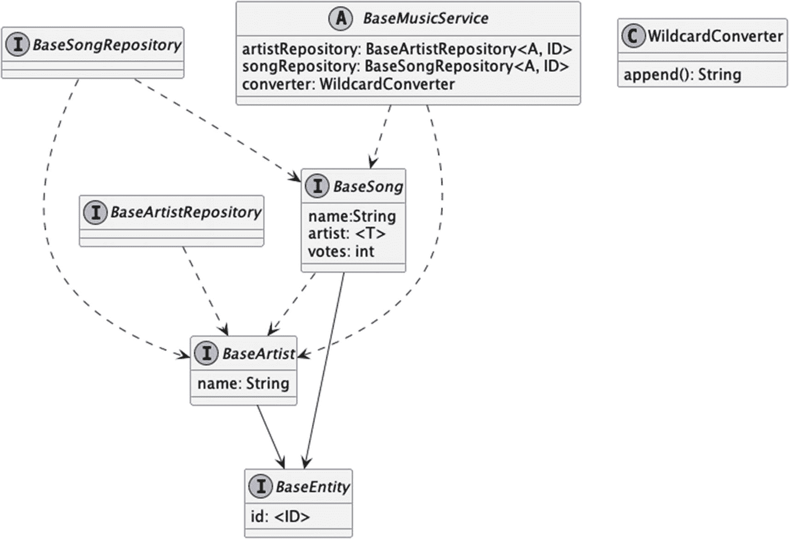

# 9. 使用 Spring 和 Spring Data 进行持久化

在第 8 章中，我们终于不再关注配置和展示机制，而是研究了如何使用`JdbcTemplate`访问关系数据库。在本章中，我们将再次探讨数据访问——这次使用一个名为“Spring Data”的 Spring 项目，它可以提供一种基本与数据无关的数据访问视图。

Spring Data 统一了 Spring 的数据访问，不仅为不同的数据库提供了通用访问，还为不同的 API（如 JPA（Java 持久化 API）和我们的老朋友 JDBC）以及不同类型的数据库（如 MongoDB、Neo4J 等）提供了通用访问。


## 引言

我们通常倾向于从最简单的技术使用逐步过渡到更高级的技术，但本章将稍微颠倒一下顺序，从 JPA 开始；JDBC 和 SQL 是基础级别的技术（并且在 JPA 的底层被使用），但 JDBC 的问题在于，嗯，它就是 JDBC——并且它严重依赖于一个实时的数据结构，这种结构你会在一个运行中的、拥有功能完备且已实现的模式的数据库中看到。这意味着，刚性数据访问的某些方面可能有效也可能无效，具体取决于数据库，因为它是“记录系统”，是数据样貌的权威描述。当我们编译应用程序时，我们不知道数据库是否存在，也不知道模式是什么样，这使得针对该数据库的自动化工具变得相当困难。

然而，JPA 允许我们描述应用程序应该看到的数据模型。我们可以使用一个 JPA 数据模型，并随意更改底层结构（只要我们同时也告诉 JPA 底层结构是什么），但我们也可以在编译时就知道程序所看到的数据模型是什么。这意味着，当我们首次编译应用程序时，无论数据库是否存在，我们都能知道如何期望访问我们的数据（因为它在代码中描述了）——这意味着我们可以高度确信我们的应用程序将正确地访问数据，尽管可能效率不高。^(⁹⁸)

为什么我们不知道数据访问是否高效？答案很简单：例如，我们可能以某种方式设计我们的对象模型，导致数据库使用了未索引的数据，或者使用了比实际需要更多的表，从而导致查询需要进行全表扫描等等。JPA 并不是一颗神奇的子弹，无论你如何描述数据，它都能给你一个优秀的模式；它通常能帮助你创建一个**可运行**的模式，但你仍然需要理解关系型数据库的工作原理，才能真正微调数据模型。不过，要是能有神奇的性能配方就好了。

我们将介绍 Spring Data 抽象层背后的几种不同的存储机制，但本章将回顾第 3 章和第 8 章以及它们对测试的使用。一旦服务正常工作，在服务前面添加 REST 端点就是一件小事（正如我们在第 7 章和第 8 章中看到的那样），因此我们不会在此处通过添加一个支持 Web 的前端来分散注意力。

## 总体架构

Spring Data 扩展了 `Repository<T,ID>` 的概念，这是一个针对给定数据存储和实体的通用访问层。我们已经见过 `@Repository` 注解，但在这里我们将看到一个接口（也叫做 `Repository<T,ID>`，其中 `T` 是被存储的类型，`ID` 是主键类型，并通过 `CrudRepository<T,ID>` 和 `PagingAndSortingRepository<T,ID>` 进行扩展），Spring 将通过代理（在很大程度上）**为你**实现这个接口。

不幸的是，Java 中的代理并不真正属于本书的讨论范围。话虽如此，这里还是对一种方法做一个非常粗略的概述：你可以定义一个对象（称为 `Proxy`），它拦截方法调用，并在一个处理器对象中任意执行代码。由于代理可以访问调用的方法签名和被调用的实例，处理器可以在实际方法体之前或之后执行代码——或者它也可以从一开始就避免调用实际的方法体。

对于实现 `Repository<T,ID>` 的类，该接口被用来（几乎）从无到有地制造方法体，其效果是我们定义一个简单的接口，然后 Spring 神奇地为我们实现这个接口。显然，这里没有*真正的*魔法——它只是一个 `Proxy`——但这使得使用 Spring Data 比原本可能的方式容易得多。

值得注意的是，Spring 中有多种代理机制。默认是使用 Java 原生的代理机制，但在某些情况下，Spring 会使用一个名为 CGLIB 的库，并用它构建一种不同类型的代理。

你将用 Java 定义实体，然后创建一个接口（或一组接口）来描述如何在数据存储系统中操作该实体。`Repository<T,ID>` 接口本身只是一个标记；它没有方法，但向 Spring 指示其实现以某种方式与数据库协同工作。

如果 `Repository<T,ID>` 没有方法，那它有什么用呢？

嗯，有时你想通过使用细粒度的接口来限制对方法的访问。例如，可能有一个 `Controller` 没有保存实体的能力；如果我们愿意，我们可以定义一个只定义读取数据方法的 `Repository<T,ID>`，而实际的实例则拥有保存或更新实体的方法。`Controller` 可能会从 Spring 接收到这个只读接口的一个副本，因此**编译器**可以强制执行它永远不能保存实体的要求。

`CrudRepository<T,ID>` 接口扩展了 `Repository<T,ID>`，定义了用于读取、写入、更新、删除**甚至**查询数据库的操作——并且 Spring Data 应用了一些魔法，使得你甚至可以在**接口中**指定查询，而无需知道如何实际查询数据库本身。在第 7 章中，我们看到了像 `findAllArtistsByName()` 这样的方法，它选择了所有名称匹配通配符的艺术家，且不区分大小写；使用 Spring Data，我们在仓库中定义一个方法**签名**，就能获得几乎相同的功能。（我们需要在外部构建通配符，尽管确实**有**方法可以通过接口本身来实现。）

```
public interface ArtistRepository
extends Repository {
List findLikeNameIgnoreCase(String name);
}
清单 9-1
Spring Data 中与第 7 章 findAllArtistsByName 等价的方法
```

构建一个 `Repository<T,ID>` 涉及三个源文件。对于一个给定的仓库，你将拥有：

1.  一个 Spring 配置（当然，它可以服务于多个仓库）
2.  一个实体类型（代表数据的对象），带有某种主键
3.  一个实现 `Repository<T,ID>`（或者实践中常用的 `CrudRepository<T,ID>` 或 `PagingAndSortingRepository<T,ID>`）的接口，并指定实体类型及其主键类型

接口的创建也有多种变体，以允许不同级别的方法访问。我们将在本章中展示其中的一些。

### 关于需求的重要说明

本章将演示访问两个数据库系统：一个嵌入式 H2 数据库（就像在第 7 章和第 8 章中一样）和一个 MongoDB 数据库。我们将使用一个允许我们嵌入 MongoDB 的项目，因此你无需运行（或安装）MongoDB。


## 创建项目结构

第 9 章实际上由四个子项目组成，分别是：

*   `chapter09-api`，包含第 9 章其他项目使用的基础类和接口
*   `chapter09-test`，包含我们的 Spring Data 实现应能通过的测试
*   `chapter09-jpa`，包含 JPA 的实现和配置
*   `chapter09-mongo`，包含 MongoDB 的实现和配置

`chapter09-test` 模块的测试类位于 `src/main/java` 目录下，这意味着这些类可供导入 `chapter09-test` 的项目使用——我们将在测试阶段将其作为依赖项。

现在让我们开始创建项目结构——由于有四个独立的项目，内容很多，但操作相当重复。

```
mkdir -p chapter09-api/src/main/java
mkdir -p chapter09-api/src/main/resources
mkdir -p chapter09-api/src/test/java
mkdir -p chapter09-api/src/test/resources
mkdir -p chapter09-test/src/main/java
mkdir -p chapter09-test/src/main/resources
mkdir -p chapter09-test/src/test/java
mkdir -p chapter09-test/src/test/resources
mkdir -p chapter09-jpa/src/main/java
mkdir -p chapter09-jpa/src/main/resources
mkdir -p chapter09-jpa/src/test/java
mkdir -p chapter09-jpa/src/test/resources
mkdir -p chapter09-mongo/src/main/java
mkdir -p chapter09-mongo/src/main/resources
mkdir -p chapter09-mongo/src/test/java
mkdir -p chapter09-mongo/src/test/resources
代码清单 9-2
使用 POSIX 命令创建目录结构
```

当然，还有另一种方法。既然我们是程序员，使用 `bash` shell（或等效工具）并编写一点脚本，实际上会更优雅、更简单。（这也是编写本章时实际创建项目的方式。不过别告诉编辑！）

```
for i in api test jpa mongo; do
for j in main test; do
for k in java resources; do
mkdir -p chapter09-$i/src/$j/$k;
done;
done;
done
代码清单 9-3
使用 POSIX 命令创建目录结构（第二版）
```

当然，既然我们已经深入了解了 bash 脚本的能力，还可以做得更漂亮。虽然这不是一本关于 shell 脚本的书，但边学边用也很有趣。

```
mkdir -p chapter09-{api,test,jpa,mongo}/src/{main,test}/{java,resources}
代码清单 9-4
使用 POSIX 命令创建目录结构（第三版）
```

在真正编写可执行的代码之前，我们需要先了解 `chapter09-api` 和 `chapter09-test` 项目，因为这两个项目是 `chapter09-jpa` 和 `chapter09-mongo` 项目的基础。（它们包含的代码也比 `jpa` 和 `mongodb` 项目更多。`chapter09-jpa` 和 `chapter09-mongo` 项目的源代码主要由扩展或实现 `chapter09-api` 或 `chapter09-test` 中类的类组成，实际的*源代码*非常少。）

### 公共代码

`chapter09-api` 项目包含五个接口、一个抽象类和一个最终将成为 Spring 组件的类。它们分别是：

*   `BaseEntity`，一个泛型接口，定义了通用标识符的访问器和修改器
*   `BaseArtist`，一个接口，定义了访问艺术家 `name` 字段的方法，并扩展了 `BaseEntity`
*   `BaseSong`，一个接口，定义了访问 `BaseArtist` 实现、歌曲名称和歌曲投票数的方法，同时扩展了 `BaseEntity`
*   `BaseArtistRepository`，一个接口，定义了如何访问扩展 `BaseArtist` 的实体
*   `BaseSongRepository`，一个接口，定义了如何访问扩展 `BaseSong` 的实体
*   `BaseMusicService`，一个抽象类，用于协调各种仓库方法
*   `WildcardConverter`，一个提供构建服务通配符机制的类

以下是用 UML 绘制的类图，展示了各类之间的关系。当我们在 `chapter09-jpa` 和 `chapter09-mongo` 中实现该结构的具体版本时，基本上就是在最终确定这些基类的版本。



流程图如下：I BaseSongRepository 和 A BaseMusicService 指向 I BaseSong 和 I BaseArtist。I BaseSong 和 I BaseArtistRepository 指向 I BaseArtist。I BaseSong 和 I BaseArtist 指向 I BaseEntity。C WildcardConverter 与主流程分离。

图 9-1
基本数据设计

其中大部分都非常简单。但由于它们是泛型的，类声明往往相当冗长；原因是不同的数据库可能以不同方式处理主键；因此，我们需要一种方法来根据具体情况定义主键。

我们在这里使用“数据库”一词，是取其“存储数据的应用程序”的广义含义，而非特指“关系型数据库”。

例如，对于关系型数据库，主键通常最好生成为某种整数；但对于像 MongoDB 这样的文档数据库，主键则生成为以 `String` 实例表示的 UUID。我们可以强制类型统一（因此，要么到处使用 UUID，要么使用整数），但这感觉像是在毫无理由地放弃优化（当然，除非你认为更简单的接口是一个“好理由”，这完全有可能）。

首先，我们来看一下 `chapter09-api` 的构建脚本。它与我们之前的一些构建脚本有一些不同之处。

```

4.0.0

com.apress
bsg6
1.0

chapter09-api
1.0

org.springframework.data
spring-data-bom
${springDataBomVersion}
import
pom

org.springframework.data
spring-data-commons

org.springframework
spring-tx

org.springframework
spring-beans
test

org.springframework.boot
spring-boot-maven-plugin
${springBootVersion}

代码清单 9-5
chapter09-api/pom.xml
```

这里的一切都相当直接，不过我们需要注意在 `dependencyManagement` 块中特别包含了 `spring-data-bom`，这使我们能够访问 Spring Data 的一组一致依赖项。

那么，让我们先来看看实体接口；它们很简单（除了泛型声明，随着我们在 `chapter09-api` 项目中的深入，这些声明只会变得更复杂）。

首先，我们有 `BaseEntity` 接口，它接受一个 `ID` 类型。

```
package com.bsg6.chapter09.common;
public interface BaseEntity {
ID getId();
void setId(ID id);
}
代码清单 9-6
chapter09-api/src/main/java/com/bsg6/chapter09/common/BaseEntity.java
```

这非常简单；它是一个接口，因此本身不包含任何状态（没有属性），但它表明任何实现 `BaseEntity` 的类都可以访问某种类型的 `Id` 属性，该类型以泛型 `<ID>` 的形式传递给编译器。

接下来，我们看看 `BaseArtist`，它使用了 `BaseEntity` 并添加了对自身属性的访问。


```
package com.bsg6.chapter09.common;
public interface BaseArtist
extends BaseEntity {
/**
* 获取艺术家名称
*/
String getName();
void setName(String name);
}
清单 9-7
chapter09-api/src/main/java/com/bsg6/chapter09/common/BaseArtist.java
```

它有一个泛型参数，就像 `BaseEntity` 一样，但仅用它来将功能**委托**给 `BaseEntity`。

注意

这些都是接口，因为实际的实现需要比泛型接口所能提供的更多信息。例如，对于 JPA，每个属性（如 `name`）都会有一个关于 `name` 应如何在数据库中表示的描述，但这些表示会根据实际使用的数据存储而改变；例如，MongoDB 会使用与 JPA 不同的信息。因此，我们只描述 `Artist` 应*呈现*的方式，而不描述艺术家在具体、实际意义上的真实表示方式。

`BaseSong` 稍微复杂一些，因为它需要提供对实现了 `BaseArtist` 的对象的访问。它有两个泛型参数：一个是实现了 `BaseArtist` 的类型，另一个是 `BaseEntity` 的标识符类型。

```
package com.bsg6.chapter09.common;
public interface BaseSong
, ID>
extends BaseEntity {
T getArtist();
void setArtist(T artist);
/**
* 获取歌曲名称
*/
String getName();
void setName(String name);
int getVotes();
void setVotes(int votes);
}
清单 9-8
chapter09-api/src/main/java/com/bsg6/chapter09/common/BaseSong.java
```

现在，我们开始进入有趣的部分；我们将查看 `BaseArtistRepository`，它实际上使用了 Spring Data 来提供功能，之后我们将查看 `BaseSongRepository`、`BaseMusicService` 和 `WildcardConverter`。一旦我们理解了 `BaseArtistRepository`，其他类就很容易理解了。

```
package com.bsg6.chapter09.common;
import java.util.List;
import java.util.Optional;
import org.springframework.data.repository.CrudRepository;
public interface BaseArtistRepository
, ID>
extends CrudRepository {
List findAllByNameIsLikeIgnoreCaseOrderByName(String name);
Optional findByNameIgnoreCase(String name);
}
清单 9-9
chapter09-api/src/main/java/com/bsg6/chapter09/common/BaseArtistRepository.java
```

从表面上看，这个接口似乎相当简单。它有两个泛型参数：一个是实现了 `BaseArtist` 的类型，另一个是主键类型。它还实现了一个接口 `CrudRepository`，这是我们连接大量功能的桥梁。

`CrudRepository` 暴露了许多有用的标准方法，用于 CRUD 操作——即“创建”、“读取”、“更新”和“删除”。`ArtistRepository` 的声明意味着这是一个 `CrudRepository` 的实现，适用于扩展了 `BaseArtist` 的类型，并使用 `ID` 表示的主键类型。`CrudRepository` 接口本身暴露了以下方法。

| 方法签名 | 描述 |
| --- | --- |
| `<S extends T> S save(S entity)` | 保存一个实体，并返回一个可赋值给该实体类型的类型。（如果传入一个 `Artist`，返回的将等同于一个 `Artist`。）如果保存操作分配了可见的值（即，如果保存实体生成了一个主键），它也可能改变作为参数传入的实体。它可能不是相同的类型，因为某些持久化机制（如 Hibernate）返回的是可赋值给该类型的代理，而不是简单的类型本身。 |
| `<S extends T> Iterable<S> saveAll(Iterable<S> entities)` | 保存一组实体；你可以传入任何 JVM 可以迭代的集合。在某些有限的情况下，这可以模拟批量操作，尽管在服务层面进行事务性操作可能更好。 |
| `Optional<T> findById(ID id)` | 根据传入的主键对实体类型进行主键查找。如果未找到，则返回 `Optional.empty()`。 |
| `boolean existsByid(ID id)` | 指示数据库中是否存在具有传入 `id` 的正确类型的实体。 |
| `Iterable<T> findAll()` | 返回实体类型的 `Iterable`。 |
| `Iterable<T> findAllById(Iterable<ID> ids)` | 返回一个 `Iterable`，包含主键集合中具有匹配 `id` 的每个现有实体。 |
| `long count()` | 返回仓库中所有正确类型实体的计数。（我们确信这并不意外。） |
| `void deleteById(ID id)` | 如果数据存储中存在具有此 `id` 的实体，则将其删除。 |
| `void delete(T entity)` | 如果实体与现有实体匹配，则将其从数据存储中删除。 |
| `void deleteAll(Iterable<? extends T> entities)` | 从数据存储中删除所有匹配的实体。 |
| `void deleteAll()` | 从数据存储中删除此类型的所有现有实体。 |

`PagingAndSortingRepository` 向 `CrudRepository` 添加了两个方法，以支持分页（和排序！），并作为其他可用方法的标记。这两个方法是 `findAll(Sort)`（其中 `Sort` 表示排序选项）和 `findAll(Pageable pageable)`（其中 `pageable` 表示分页和排序选项）。它们都是相当简单的方法，但不在本章的讨论范围内。

然而，`BaseArtistRepository` 还定义了另外两个方法：

```
List findAllByNameIsLikeIgnoreCaseOrderByName(String name);
Optional findByNameIgnoreCase(String name);
```

这些方法由 Spring Data 通过动态代理实现，其功能源自方法名称，并遵循相当具体的语法。该语法可以这样理解：

*   查询类型，例如：
    *   `find`，可以返回一个集合或单个实体；例如，通过将返回类型设为 `List`，你可以获得一个集合；如果底层数据持久化机制支持，你还可以返回实体类型的 `java.util.Stream`。

*   `read`，其操作方式与 `find` 相同。

*   `query`，其操作方式与 `find` 相同。

*   `get`，其操作方式与 `find` 相同。`get`、`read`、`query` 和 `find` 在应用和含义上都是等价的；它们的存在只是为了让程序员可以选择他们喜欢的查询语义。

*   `count`，返回匹配查询的实体数量。

*   修饰符，例如：
    *   `Top`、`First` 或 `Bottom`，后跟一个可选数字（`1` 是默认值，因此 `Top1` 和 `Top` 相同）。

*   `Distinct`，用于对结果应用去重；这适用于基于 `id` 或其他唯一字段之外的属性的查询。

*   可选的实体类型（不是必需的，但可能增加方法名称的可读性）。你可以使用 `findArtistByName` 或 `findByName`——选择哪种取决于你。


*   `By`，表示查询条件的开始

*   条件列表，由以下部分组成：
    *   实体的属性，例如 `Name`（对应 `Artist.name`）。支持遍历，因此，如果你有一个 `Person` 实体，它引用了包含 `city` 的 `Address`，那么使用 `findByAddressCity` 将城市名称作为查询条件的一部分是可行的。

*   `IgnoreCase` 将使查询不区分大小写，具体实现取决于数据存储——例如，JPA 会对属性调用 `UPPER()`。

*   运算符，其可用性取决于具体的数据存储实现。示例包括：
        *   Between

*   LessThan

*   GreaterThan

*   Like

*   可选的排序，由以下部分组成：
        *   OrderBy

*   属性名称，例如 Artist 或 Song 的 Name

*   可选的方向，Asc 或 Desc

*   第一个条件与所有后续条件之间的分隔符 `And`

显然，这**并非**实际的语法——要描述实际语法，我们最终会得到四五页的巴科斯-瑙尔范式图，这些图旨在说明形式语法——但希望这能让命名系统更清晰。

如果我们有一个 `ArtistRepository<Artist, Integer>`（我们确实会有！），并且我们想通过 `name` 查找一个 `Artist`（此处用 `<T>` 表示，因为 `T` 继承自 `BaseArtist`），而不必担心精确的大小写匹配，那么我们的查询名称将表示为 `findByNameIgnoreCase(String name)`。它可能返回一个 `Optional<Artist>` 或一个 `Artist` 引用；如果是 `Artist`，当数据库中不存在该名称时（即条件不满足），它将返回 `null`。如果是 `Optional<Artist>`，则条件匹配失败将返回 `Optional.empty()`——这种形式主要用于流式处理。

值得注意的是：虽然 Spring Data 的查询生成器非常强大，但它往往会产生相当复杂的方法名称，并且查询名称的验证有点……欠缺。这给程序员带来了正确命名的负担。然而，有一个名为“Querydsl”的库（[`http://querydsl.com/`](http://querydsl.com/)）可以在一定程度上解决这个问题，它为 Spring Data 提供了类型安全的查询。

使用 Querydsl，您可以使用注解处理器生成一个“元模型”——实际上很像 JPA 的条件建模——然后使用该模型生成可由编译器本身验证的查询。您将使用元模型的方法和属性来构建查询的程序化条件，而不是手动输入名称。这意味着您（希望）也能拥有更容易输入的方法名称。

然而，Querydsl 的集成仍然有些变动。就**本书**而言，Querydsl 是一个值得关注的方向，但不在讨论范围之内。

让我们快速看一下 `BaseSongRepository`。这个接口与 `BaseArtistRepository` 实质上是相同的，尽管声明更长，因为它必须引用一个继承自 `BaseArtist` 的类（因为 `BaseSong` 声明也需要它）。这也是我们在声明中使用 `A extends BaseArtist<ID>` 的原因；`Repository` 本身并不使用 `A`，但需要声明 `A` 来理解 `BaseSong<A, ID>` 是如何构造的。（还有其他构造方式，但这种方式涉及的嵌套类型更少。）

```
package com.bsg6.chapter09.common;
import org.springframework.data.repository.CrudRepository;
import java.util.List;
import java.util.Optional;
public interface BaseSongRepository
, S extends BaseSong, ID>
extends CrudRepository {
Optional findByArtistIdAndNameIgnoreCase(
ID artistId, String name
);
List findByArtistIdOrderByVotesDesc(ID artistId);
List findByArtistIdAndNameLikeIgnoreCaseOrderByNameDesc(
ID artistId, String name
);
}
清单 9-10
chapter09-api/src/main/java/com/bsg6/chapter09/common/BaseSongRepository.java
```

接下来，让我们快速看一下我们的 `WildcardConverter`，它主要提供了一个名为 `convertToWildCard(String)` 的方法。当然，它非常简单。这个类存在的原因是一些数据库使用特殊字符来匹配通配符；例如，SQL 使用 `%`，而 Neo4J 使用正则表达式（如 `".*"`）。其他数据库可能使用不同的字符，或者像我们将在 MongoDB 中看到的那样，根本不使用任何字符。通过这个类，我们可以让 Spring 配置为我们的数据库构建合适的 `WildcardConverter`，而我们的 `BaseMusicService` 则完全不需要更改。

```
package com.bsg6.chapter09.common;
public class WildcardConverter {
private final String append;
public WildcardConverter(String append) {
this.append = append;
}
public String convertToWildCard(String data) {
return data + append;
}
}
清单 9-11
chapter09-api/src/main/java/com/bsg6/chapter09/common/WildcardConverter.java
```

现在，我们来看看 `BaseMusicService`，它使用了实现 `BaseSongRepository` 和 `BaseArtistRepository` 的类。这是一个抽象类。继承 `BaseMusicService` 的类需要做四件事：

*   拥有正确的类签名。

*   委托给此类的构造函数。

*   实现 `createArtist(String)`，该方法创建一个实现 `BaseArtist` 的实例。

*   实现 `createSong(Artist, String)`，该方法创建一个实现 `BaseSong` 的实例。

除此之外——我们保证，很快就会看到这个类是如何使用的！——这个类实现了我们音乐服务在第 3 章和第 8 章中的所有功能需求，同时还提供了两个额外的方法，用于通过 `id` 直接访问 `Song` 和 `Artist`。（这对于 REST 服务来说是一个有用的特性，我们将在第 10 章中有限地看到这一点。）实际上，它看起来比实际更复杂。我们知道代码很冗长——这是因为这个类是整章中最重要的类之一。

请注意，在大多数情况下，这是一个中心入口点，允许我们提供这四个特定方法，而不会影响整个对象设计。通常，当您需要适配多种数据存储服务时，您会根据这些数据仓库的擅长领域来设计对象和访问方式，而在这里，我们试图避免这种情况（以防止在大量清单中重复非常相似的对象模型）。这个类允许我们根据需求，以非常狭窄的方式进行特化。


```
package com.bsg6.chapter09.common;
import org.springframework.transaction.annotation.Transactional;
import java.util.List;
import java.util.stream.Collectors;
public abstract class BaseMusicService
,
S extends BaseSong,
ID> {
private final BaseArtistRepository artistRepository;
private final BaseSongRepository songRepository;
private final WildcardConverter converter;
protected BaseMusicService(
BaseArtistRepository artistRepository,
BaseSongRepository songRepository,
WildcardConverter converter
) {
this.artistRepository = artistRepository;
this.songRepository = songRepository;
this.converter = converter;
}
protected abstract A createArtist(String name);
protected abstract S createSong(A artist, String name);
@Transactional
public void voteForSong(String artistName, String songTitle) {
S song = getSong(artistName, songTitle);
song.setVotes(song.getVotes() + 1);
songRepository.save(song);
}
@Transactional
public S getSong(String artistName, String songTitle) {
A artist = getArtist(artistName);
return songRepository
.findByArtistIdAndNameIgnoreCase(
artist.getId(),
songTitle
)
.orElseGet(() -> {
S entity = createSong(artist, songTitle);
songRepository.save(entity);
return entity;
});
}
@Transactional
public A getArtist(String artistName) {
return artistRepository
.findByNameIgnoreCase(artistName)
.orElseGet(() -> {
A entity = createArtist(artistName);
artistRepository.save(entity);
return entity;
});
}
@Transactional
public List getSongsForArtist(String artistName) {
A artist = getArtist(artistName);
return songRepository.findByArtistIdOrderByVotesDesc(
artist.getId()
);
}
@Transactional(readOnly = true)
public List getMatchingArtistNames(String artistName) {
return artistRepository
.findAllByNameIsLikeIgnoreCaseOrderByName(
converter.convertToWildCard(artistName))
.stream()
.map(A::getName)
.collect(Collectors.toList());
}
@Transactional
public A getArtistById(ID id) {
return artistRepository.findById(id).orElse(null);
}
@Transactional
public S getSongById(ID id) {
return songRepository.findById(id).orElse(null);
}
@Transactional(readOnly = true)
public List getMatchingSongNamesForArtist(
String artistName,
String songTitle
) {
A artist = getArtist(artistName);
return songRepository
.findByArtistIdAndNameLikeIgnoreCaseOrderByNameDesc(
artist.getId(),
converter.convertToWildCard(songTitle)
)
.stream()
.map(S::getName)
.collect(Collectors.toList());
}
}
清单 9-12
chapter09-api/src/main/java/com/bsg6/chapter09/common/BaseMusicService.java
```

现在我们已经看到了一组可用于构建应用程序的类。是时候创建本章四个项目中的第二个项目了：`chapter09-test`，它将包含三个代表测试套件的抽象类。与 `BaseMusicService` 一样，它们不算特别短（但也不算特别长！）——最终的结果是，我们在 JPA 和 MongoDB 项目中的“测试代码”将非常简短（实际上主要由类声明组成）。

### `chapter09-test` 项目

`chapter09-test` 项目与 `chapter09-api` 类似，不是一个“真正的”Spring Boot 项目；它是一个供 Spring Boot 项目使用的构件。它有点独特，因为它旨在被导入到其他模块的**测试**作用域中，因此它通过 `src/main/java` 导出所有内容。

`chapter09-test` 的 `pom.xml` 与 `chapter09-api` 的 `pom.xml` 非常相似。

```

4.0.0

com.apress
bsg6
1.0

chapter09-test
1.0

org.springframework.data
spring-data-bom
${springDataBomVersion}
import
pom

com.apress
chapter09-api
1.0

org.springframework.boot
spring-boot-starter-test

org.springframework
spring-test

org.testng
testng

org.springframework.boot
spring-boot-maven-plugin
${springBootVersion}

清单 9-13
chapter09-test/pom.xml
```

请注意，它显式依赖了 TestNG、`spring-boot-starter-test` 和 `spring-test`——并且它们没有被设置为 `test` 作用域。当我们将此项目导入到 `chapter09-jpa` 和 `chapter09-mongo` 时，我们会在 `test` 作用域下进行导入，因此 TestNG 和 `spring-boot-starter-test` 依赖项对于下游依赖项将处于测试作用域，但对于*这个*项目，我们希望它们位于主编译类路径中。由于我们以 `test` 作用域将该项目导入到*其他*项目中，任何传递性依赖也将以 `test` 作用域导入。这样我们就不会污染类路径。

`chapter09-test` 中包含三组测试：`BaseArtistRepositoryTests`、`BaseSongRepositoryTests` 和 `BaseMusicServiceTests`。每一个都相当简单；目标是执行测试目标，但由 Spring 注入服务的实现。

因此，当我们**使用**这些测试时，我们将有一个引用必要服务的 Spring 配置，并且这些类将使用所提供的任何内容。与 `chapter09-api` 一样，这会导致一些奇怪的声明，但并不过于复杂——只是有些冗长。

让我们来看第一个测试 `BaseArtistRepositoryTests`。

```
package com.bsg6.chapter09.test;
import com.bsg6.chapter09.common.BaseArtist;
import com.bsg6.chapter09.common.BaseArtistRepository;
import com.bsg6.chapter09.common.WildcardConverter;
import org.springframework.beans.factory.annotation.Autowired;
import org.springframework.test.context.testng.AbstractTestNGSpringContextTests;
import org.testng.annotations.BeforeMethod;
import org.testng.annotations.Test;
import static org.testng.Assert.*;
public abstract class BaseArtistRepositoryTests
, ID>
extends AbstractTestNGSpringContextTests {
@Autowired
BaseArtistRepository artistRepository;
// 允许访问 createWildcard...
@Autowired
WildcardConverter converter;
protected abstract A createArtist(String name);
@BeforeMethod
public void clearDatabase() {
artistRepository.deleteAll();
}
@Test
public void testOperations() {
// 检查数据库是否为空
assertEquals(artistRepository.count(), 0);
var firstEntity = createArtist("Threadbare Loaf");
var secondEntity = createArtist("Therapy Zeppelin");
firstEntity = artistRepository.save(firstEntity);
assertNotNull(firstEntity.getId());
var artist = artistRepository.findById(firstEntity.getId());
assertTrue(artist.isPresent());
assertEquals(artist.get(), firstEntity);
var query = artistRepository.findAllByNameIsLikeIgnoreCaseOrderByName(converter.convertToWildCard("th"));
assertEquals(query.size(), 1l);
assertEquals(query.get(0), firstEntity);
artistRepository.save(secondEntity);
query = artistRepository.findAllByNameIsLikeIgnoreCaseOrderByName(converter.convertToWildCard("th"));
assertEquals(query.size(), 2);
}
}
清单 9-14
chapter09-test/src/main/java/com/bsg6/chapter09/test/BaseArtistRepositoryTests.java
```

这里的一切对于基类来说都相当直接；实现类需要提供某种方式（通过 `createArtist()`）来创建艺术家实例——但正如我们将在几页后看到的，`BaseArtistRepositoryTests` 的具体实例大多是样板代码。该类本身仅需三行代码。


请注意，在第 3 章中我们采用了不同的方法：不是将测试放在超类中，而是让子类委托给超类。第 3 章的方法在很多方面可能“更安全”，尤其是在测试的复杂性和功能不断增加的情况下。我们在**本**章中选择这种方法，主要是因为不想重复编写超出绝对必要的代码。本章已经够长了，代码量也足够多，无需在每个具体测试类中再添加一组相同的代码行。

`BaseSongRepositoryTests` 更长，这是因为 `BaseSongRepository` 做了更多工作；毕竟它需要与艺术家进行交互。^(⁹⁹) 它使用 `@BeforeMethod` 在测试 `BaseSongRepository` 实例之前重置数据库（无论是哪种数据库！）。

```
package com.bsg6.chapter09.test;
import static org.testng.Assert.assertEquals;
import java.util.List;
import java.util.Optional;
import org.springframework.beans.factory.annotation.Autowired;
import org.springframework.test.context.testng.AbstractTestNGSpringContextTests;
import org.testng.annotations.BeforeMethod;
import org.testng.annotations.Test;
import com.bsg6.chapter09.common.BaseArtist;
import com.bsg6.chapter09.common.BaseArtistRepository;
import com.bsg6.chapter09.common.BaseSong;
import com.bsg6.chapter09.common.BaseSongRepository;
import com.bsg6.chapter09.common.WildcardConverter;
public abstract class BaseSongRepositoryTests,
S extends BaseSong,
ID>
extends AbstractTestNGSpringContextTests {
@Autowired
BaseArtistRepository artistRepository;
@Autowired
BaseSongRepository songRepository;
@Autowired
WildcardConverter converter;
protected abstract A createArtist(String name);
protected abstract S createSong(A artist, String name);
@BeforeMethod
public void clearDatabase() {
songRepository.deleteAll();
artistRepository.deleteAll();
buildModel();
}
private Object[][] model = new Object[][]{
{"Threadbare Loaf", "Someone Stole the Flour", 4},
{"Threadbare Loaf", "What Happened To Our First CD?", 17},
{"Therapy Zeppelin", "Mfbrbl Is Not A Word", 0},
{"Therapy Zeppelin", "Medium", 4},
{"Clancy in Silt", "Igneous", 5}
};
private void buildModel() {
for (Object[] data : model) {
String artistName = (String) data[0];
String songTitle = (String) data[1];
Integer votes = (Integer) data[2];
Optional artistQuery = artistRepository
.findByNameIgnoreCase(artistName);
A artist = artistQuery.orElseGet(() -> {
A entity = createArtist(artistName);
artistRepository.save(entity);
return entity;
});
Optional songQuery = songRepository
.findByArtistIdAndNameIgnoreCase(artist.getId(),
songTitle);
if (songQuery.isEmpty()) {
S song = createSong(artist, songTitle);
song.setVotes(votes);
songRepository.save(song);
}
}
}
@Test
public void testOperations() {
A artist = artistRepository
.findByNameIgnoreCase("therapy zeppelin")
.orElseThrow();
List songs = songRepository
.findByArtistIdAndNameLikeIgnoreCaseOrderByNameDesc(
artist.getId(),
converter.convertToWildCard("m")
);
assertEquals(songs.size(), 2);
songs = songRepository
.findByArtistIdOrderByVotesDesc(artist.getId());
assertEquals(songs.size(), 2);
// we know the votes assigned by default,
// and they should be in descending order.
// "Medium" has four votes...
assertEquals(songs.get(0).getName(), "Medium");
assertEquals(songs.get(0).getVotes(), 4);
// "Mfbrbl" is liked by nobody. I mean, REALLY.
assertEquals(songs.get(1).getVotes(), 0);
}
}
Listing 9-15
chapter09-test/src/main/java/com/bsg6/chapter09/test/BaseSongRepositoryTests.java
```

最后，我们来看最长的测试类 `BaseMusicServiceTests`。它在概念上与 `BaseSongRepositoryTests` 相同，只是改为与 `BaseMusicService` 交互；其使用的机制与我们在 `BaseSongRepositoryTests` 中看到的几乎完全相同。

不过有一点需要注意：`abstract ID getNonexistentId()` 方法。基类不知道有效的 `ID` 是什么样，因此使用该方法的类需要实现此方法，希望提供一个不会自然出现的标识符，以便使用此方法的测试——`testFindArtistById()` 和 `testFindSongById()`——能够成功检查一个不存在的对象。

```
package com.bsg6.chapter09.test;
import com.bsg6.chapter09.common.*;
import org.springframework.beans.factory.annotation.Autowired;
import org.springframework.test.context.testng.AbstractTestNGSpringContextTests;
import org.testng.annotations.BeforeMethod;
import org.testng.annotations.Test;
import java.util.List;
import java.util.function.Consumer;
import static org.testng.Assert.*;
public abstract class BaseMusicServiceTests,
S extends BaseSong,
ID
> extends AbstractTestNGSpringContextTests {
@Autowired
BaseMusicService musicService;
@Autowired
BaseArtistRepository artistRepository;
@Autowired
BaseSongRepository songRepository;
private Object[][] model = new Object[][]{
{"Threadbare Loaf", "Someone Stole the Flour", 4},
{"Threadbare Loaf", "What Happened To Our First CD?", 17},
{"Therapy Zeppelin", "Medium", 4},
{"Clancy in Silt", "Igneous", 5}
};
@BeforeMethod
public void clearDatabase() {
songRepository.deleteAll();
artistRepository.deleteAll();
populateService();
}
protected abstract ID getNonexistentId();
void iterateOverModel(Consumer consumer) {
for (Object[] data : model) {
consumer.accept(data);
}
}
void populateService() {
iterateOverModel(data -> {
for (int i = 0; i 
assertEquals(
musicService.getSong(
data[0].toString(),
data[1].toString()
).getVotes(),
((Integer) data[2]).intValue()
));
}
@Test
void testSongsForArtist() {
List songs =
musicService.getSongsForArtist("Threadbare Loaf");
assertEquals(songs.size(), 2);
assertEquals(songs.get(0).getName(),
"What Happened To Our First CD?");
assertEquals(songs.get(0).getVotes(), 17);
assertEquals(songs.get(1).getName(),
"Someone Stole the Flour");
assertEquals(songs.get(1).getVotes(), 4);
}
@Test
void testMatchingArtistNames() {
List names = musicService.getMatchingArtistNames("Th");
assertEquals(names.size(), 2);
assertEquals(names.get(0), "Therapy Zeppelin");
assertEquals(names.get(1), "Threadbare Loaf");
}
@Test
void testFindArtistById() {
A artist = musicService.getArtist("Threadbare Loaf");
assertNotNull(artist);
A searched = musicService.getArtistById(artist.getId());
assertNotNull(searched);
assertEquals(artist.getName(), searched.getName());
searched = musicService.getArtistById(getNonexistentId());
assertNull(searched);
}
@Test
void testFindSongById() {
S song = musicService.getSong("Therapy Zeppelin",
"Medium");
assertNotNull(song);
S searched = musicService.getSongById(song.getId());
assertNotNull(searched);
assertEquals(song.getName(), searched.getName());
searched = musicService.getSongById(getNonexistentId());
assertNull(searched);
}
@Test
void testMatchingSongNamesForArtist() {
List names =
musicService.getMatchingSongNamesForArtist(
"Threadbare Loaf", "W"
);
assertEquals(names.size(), 1);
assertEquals(names.get(0),
"What Happened To Our First CD?");
}
}
Listing 9-16
chapter09-test/src/main/java/com/bsg6/chapter09/test/BaseMusicServiceTests.java
```

现在，我们终于要开始**使用** Spring Data，而不是为使用它做准备了。


### `chapter09-jpa` 项目

JPA（Java 持久化 API）是一种规范，为 Java 提供了惯用的对象/关系映射（简称“ORM”）。换句话说，它旨在将数据库表（或表集合）中的数据（以行和列的形式存储）映射到 Java 对象模型。

我们在第 8 章中已经看到了一些相关内容，只不过当时我们是手动进行转换（并且仅在查询数据库时）。

有许多 JPA 的实现。Hibernate（[`https://hibernate.org`](https://hibernate.org)）*可能*是 Java 中最具影响力的对象关系映射器，就像 Spring*可能*是 Java 中最具影响力的依赖注入库一样。Hibernate 的替代方案包括 OpenJPA（[`https://openjpa.apache.org/`](https://openjpa.apache.org/)）、EclipseLink（[`https://eclipse.dev/eclipselink//`](https://eclipse.dev/eclipselink//)）和 DataNucleus（[`www.datanucleus.org`](http://www.datanucleus.org)）等，但在本章中，我们将使用 Spring Data 为我们提供的实现——也就是 Hibernate。

让我们快速浏览一下我们的`pom.xml`。有几点需要注意：

*   它包含一个对`chapter09-test`的测试时依赖。
*   它具有与`chapter09-api`和`chapter09-test`相同的有限插件配置和依赖管理。这是因为我们将在第 10 章中将`chapter09-jpa`用作依赖项。
*   它依赖于`spring-boot-starter-data-jpa`和`h2`（作为示例数据库）。
*   它导入了`jackson-annotations`，因为我们想在一个实体类中使用一个注解——我们将在查看`Artist`实现时看到（并解释）这个注解。

```

4.0.0

com.apress
bsg6
1.0

chapter09-jpa
1.0

org.springframework.data
spring-data-bom
${springDataBomVersion}
import
pom

com.apress
chapter09-api
1.0

com.apress
chapter09-test
1.0
test

org.springframework.boot
spring-boot-starter-data-jpa

com.h2database
h2
runtime

com.fasterxml.jackson.core
jackson-annotations

org.springframework.boot
spring-boot-maven-plugin
${springBootVersion}

列表 9-17
chapter09-jpa/pom.xml
```

实际上，繁重的工作已经在`chapter09-api`中完成了。这个项目需要做的事情虽然冗长（因为是用 Java 编写的，而 Java 习惯上将类放在各自的源文件中，这意味着大量重复的样板代码），但仍然出奇地简单：

*   创建所有基类的具体实现。
*   提供 Spring 配置。

让我们开始吧。我们必须实现`BaseArtist`、`BaseSong`、`BaseArtistRepository`、`BaseSongRepository`和`BaseMusicService`；值得庆幸的是，所有这些类都非常简短，但我们仍然必须拥有它们。然后，我们需要构建一个配置，接着还需要扩展我们的测试类。

首先，是`Artist`类。这是一个 JPA 实体；请注意，它扩展了`BaseArtist`并使用`Integer`作为标识符类型。它还使用常规的 JPA 注解来定义艺术家和歌曲之间的关系。

你会注意到在`songs`引用上使用了`@JsonIgnore`注解；在我们相当简单的对象结构中，这是必需的，因为`Artist`持有一组`Song`对象的引用，而每个`Song`对象又持有对`Artist`的引用。这在序列化对象结构时会产生影响——由于此模块在第 10 章中使用，我们必须考虑序列化问题，否则会遇到堆栈溢出。

```
package com.bsg6.chapter09.jpa;
import com.bsg6.chapter09.common.BaseArtist;
import com.fasterxml.jackson.annotation.JsonIgnore;
import jakarta.persistence.*;
import org.springframework.lang.NonNull;
import java.util.ArrayList;
import java.util.List;
import java.util.Objects;
import java.util.StringJoiner;
@Entity
public class Artist implements BaseArtist {
@Id
@GeneratedValue(strategy = GenerationType.AUTO)
Integer id;
@NonNull
String name;
@OneToMany(
cascade = CascadeType.ALL,
mappedBy = "artist",
fetch = FetchType.EAGER
)
@OrderBy("votes DESC")
@JsonIgnore
List songs = new ArrayList();
public Artist() {
}
public Artist(@NonNull String name) {
this.name = name;
}
@Override
public String getName() {
return name;
}
@Override
public void setName(String name) {
this.name = name;
}
@Override
public Integer getId() {
return id;
}
@Override
public void setId(Integer id) {
this.id = id;
}
@Override
public String toString() {
return new StringJoiner(", ", Artist.class.getSimpleName() + "[", "]")
.add("id=" + id)
.add("name='" + name + "'")
.add("songs=" + songs)
.toString();
}
@Override
public boolean equals(Object o) {
if (this == o) return true;
if (!(o instanceof Artist artist)) return false;
return Objects.equals(
getId(),
artist.getId()
) && Objects.equals(
getName(),
artist.getName()
);
}
@Override
public int hashCode() {
return Objects.hash(getId(), getName());
}
}
列表 9-18
chapter09-jpa/src/main/java/com/bsg6/chapter09/jpa/Artist.java
```

注意

对`songs`的引用使用了`FetchType.EAGER`。这意味着当加载`Artist`时，该艺术家的`Song`引用会同时被加载，这可能会导致检索`Artist`的速度比预期慢。这样做的原因在于实体管理的方式；如果我们使用`FetchType.LAZY`，就需要更主动地管理访问和填充此字段的时机，而这更适合在专门讨论 JPA 主题的书籍中讲解。

如果没有对`Song`的引用，我们就无法使用这个类。

```
package com.bsg6.chapter09.jpa;
import com.bsg6.chapter09.common.BaseSong;
import org.springframework.lang.NonNull;
import jakarta.persistence.*;
import java.util.StringJoiner;
@Entity
@Table(indexes = {
@Index(
name = "artist_song",
columnList = "artist_id,name",
unique = true
)
})
public class Song implements BaseSong {
@Id
@GeneratedValue(strategy = GenerationType.AUTO)
Integer id;
@ManyToOne
@NonNull
Artist artist;
@NonNull
String name;
int votes;
public Song() {
}
public Song(@NonNull Artist artist, @NonNull String name) {
this.artist = artist;
this.name = name;
}
@Override
public Integer getId() {
return id;
}
@Override
public void setId(Integer id) {
this.id = id;
}
@Override
public Artist getArtist() {
return artist;
}
@Override
public void setArtist(Artist artist) {
this.artist = artist;
}
@Override
public String getName() {
return name;
}
@Override
public void setName(String name) {
this.name = name;
}
@Override
public int getVotes() {
return votes;
}
@Override
public void setVotes(int votes) {
this.votes = votes;
}
@Override
public String toString() {
return new StringJoiner(", ", Song.class.getSimpleName() + "[", "]")
.add("id=" + id)
.add("artist=" + artist)
.add("votes=" + votes)
.toString();
}
}
列表 9-19
chapter09-jpa/src/main/java/com/bsg6/chapter09/jpa/Song.java
```

`@Table`声明包含一个使用`artist_id`和`name`的索引——这意味着我们对特定艺术家的歌曲标题有一个自然的、由数据库强制执行的限制：每个艺术家只能有一首具有给定标题的歌曲。（我们不能将歌曲的`name`用作唯一索引，因为多个艺术家可能会发布具有相同歌曲名称的歌曲。它们甚至可能是同一首歌，因为艺术家可以翻唱其他音乐人的作品：想想吉米·亨德里克斯的《沿着瞭望塔》，这是对鲍勃·迪伦歌曲的翻唱。）

同样，这是一个相当标准（可能也比较简单）的 JPA 实体实现。


`ArtistRepository` 实际上非常简单：它只是一个接口，为 `BaseArtistRepository` 使用了具体类型。仅此而已。这里添加的唯一信息就在接口定义中。

```
package com.bsg6.chapter09.jpa;
import com.bsg6.chapter09.common.BaseArtistRepository;
public interface ArtistRepository
extends BaseArtistRepository {
}
清单 9-20
chapter09-jpa/src/main/java/com/bsg6/chapter09/jpa/ArtistRepository.java
```

`SongRepository` 的完成方式完全相同：它的存在仅仅是为了向 `BaseSongRepository` 添加类型信息。

```
package com.bsg6.chapter09.jpa;
import com.bsg6.chapter09.common.BaseSongRepository;
public interface SongRepository
extends BaseSongRepository {
}
清单 9-21
chapter09-jpa/src/main/java/com/bsg6/chapter09/jpa/SongRepository.java
```

最后，我们来看 `MusicService`——这里的情况稍微复杂一点，但也不会复杂太多。我们需要实现两个方法来创建 `Artist` 和 `Song` 的实例，并且我们还想委托给 `BaseMusicService` 的构造函数。

然而，它并没有被标记为 `@Component`，因为我们将在 Spring 配置中专门构造它。（由于所有泛型的使用导致的类型解析，使得显式配置更容易使用。）

```
package com.bsg6.chapter09.jpa;
import com.bsg6.chapter09.common.BaseMusicService;
import com.bsg6.chapter09.common.WildcardConverter;
public class MusicService extends BaseMusicService {
MusicService(
ArtistRepository artistRepository,
SongRepository songRepository,
WildcardConverter converter
) {
super(artistRepository, songRepository, converter);
}
@Override
protected Artist createArtist(String name) {
return new Artist(name);
}
@Override
protected Song createSong(Artist artist, String name) {
return new Song(artist, name);
}
}
清单 9-22
chapter09-jpa/src/main/java/com/bsg6/chapter09/jpa/MusicService.java
```

那么，剩下的唯一一件事就是 Spring 配置。我们将通过一个名为 `JpaConfiguration` 的类来完成。

```
package com.bsg6.chapter09.jpa;
import com.bsg6.chapter09.common.WildcardConverter;
import org.springframework.boot.SpringBootConfiguration;
import org.springframework.boot.autoconfigure.domain.EntityScan;
import org.springframework.context.annotation.Bean;
import org.springframework.data.jpa.repository.config.EnableJpaRepositories;
@SpringBootConfiguration
@EnableJpaRepositories
@EntityScan
public class JpaConfiguration {
@Bean
WildcardConverter converter() {
return new WildcardConverter("%");
}
@Bean
MusicService musicService(
ArtistRepository artistRepository,
SongRepository songRepository,
WildcardConverter converter
) {
return new MusicService(artistRepository, songRepository, converter);
}
}
清单 9-23
chapter09-jpa/src/main/java/com/bsg6/chapter09/jpa/JpaConfiguration.java
```

在这里，我们利用 Spring Boot 来完成大部分工作，使用了 `@SpringBootConfiguration`。这将扫描当前包（以及任何包名以 `com.bsg6.chapter09.jpa` 开头的包）以查找 Spring 组件——这将捕获我们的 `MusicService`、`ArtistRepository` 和 `SongRepository` 接口；通过 `@EnableJpaRepositories`，我们告知 Spring 要实现哪种类型的服务（以及在哪里查找带有 `@Repository` 注解的类）。

我们还使用 `@EntityScan` 注解来强制扫描当前包（以及任何“子包”，即包名以此包名开头的包）中的实体（标记有 `@Entity` 的类）。运行测试时我们不需要这个——测试注解会为我们完成——但在“真实代码”中，我们会需要它。

我们还创建了 JPA 兼容的 `WildcardConverter` 作为一个组件。

请注意，我们没有做任何事情来为 JPA 创建任何资源；没有数据源，没有 `EntityManager` 引用，什么都没有。Spring Boot 通过 `spring-boot-starter-data-jpa` 依赖为我们完成了这些。默认情况下，我们将拥有类路径中任何数据库（在此项目中为 H2）的内存版本；如果我们想要（也确实需要），我们可以使用 `application.properties` 并通过 `spring.datasource.url=jdbc:h2:file:chapter09-jpa` 或任何合适的值来设置 JDBC URL。下面是一个示例。

```
spring.datasource.url=jdbc:h2:./chapter9jpa;DB_CLOSE_DELAY=-1;
spring.datasource.username=sa
spring.datasource.password=
spring.jpa.hibernate.ddl-auto=update
清单 9-24
chapter09-jpa/src/main/resources/application.properties
```

注意

我们使用 `update` 作为 `spring.jpa.hibernate.ddl-auto` 的值。对于开发和测试来说，这没问题。对于生产环境来说，这简直是一场噩梦。请谨慎使用。

我们对 `chapter09-jpa` 的测试看起来与其余代码非常相似。我们有三个测试，每个测试都扩展了 `chapter09-test` 项目中的一个类，添加了特定于 `chapter09-jpa` 的类型信息，并且偶尔实现一两个方法来帮助测试实例化正确类型的类。

这是第一个测试，`ArtistRepositoryTests`。

```
package com.bsg6.chapter09.jpa;
import com.bsg6.chapter09.test.BaseArtistRepositoryTests;
import org.springframework.boot.test.autoconfigure.orm.jpa.DataJpaTest;
@DataJpaTest
public class ArtistRepositoryTests
extends BaseArtistRepositoryTests {
protected Artist createArtist(String name) {
return new Artist(name);
}
}
清单 9-25
chapter09-jpa/src/test/java/com/bsg6/chapter09/jpa/ArtistRepositoryTests.java
```

注意 `@DataJpaTest` 的使用。

`SongRepositoryTests` 实际上是一样的。

```
package com.bsg6.chapter09.jpa;
import org.springframework.boot.test.autoconfigure.orm.jpa.DataJpaTest;
import com.bsg6.chapter09.test.BaseSongRepositoryTests;
@DataJpaTest
public class SongRepositoryTests
extends BaseSongRepositoryTests {
@Override
protected Artist createArtist(String name) {
return new Artist(name);
}
@Override
protected Song createSong(Artist artist, String name) {
return new Song(artist, name);
}
}
清单 9-26
chapter09-jpa/src/test/java/com/bsg6/chapter09/jpa/SongRepositoryTests.java
```

最后，让我们看看 `MusicServiceTests`，它与前两个测试类似，主要作用是为泛型超类提供具体类型，并实现 `getNonexistentId()`，使用一个荒谬的高标识符。

```
package com.bsg6.chapter09.jpa;
import org.springframework.boot.test.autoconfigure.orm.jpa.DataJpaTest;
import com.bsg6.chapter09.test.BaseMusicServiceTests;
@DataJpaTest
public class MusicServiceTests
extends BaseMusicServiceTests {
@Override
protected Integer getNonexistentId() {
return 1928491;
}
}
清单 9-27
chapter09-jpa/src/test/java/com/bsg6/chapter09/jpa/MusicServiceTests.java
```

如您所见，`chapter09-jpa` 项目实际上并没有增加太多内容。它提供了具体的实体（`Artist` 和 `Song`），配置提供了一个 `WildcardConverter`；`MusicService` 也提供了一种构建实体实例的简便方法，但仅此而已。项目代码的其余部分是为各种接口提供具体类型。

我们是否可以以不同的方式构建基类，特别是为了不必提供像 `createArtist()` 和 `createSong()` 这样的方法？答案当然是“可以”，而且有多种方式。例如，我们可以在 `BaseMusicService` 中派生具体类的引用（这些引用对 `BaseMusicService` 不可用，但对子类可用，我们可以利用这一点）。

我们也可以将具体引用（即 `Artist.class`）传递给 `BaseMusicService` 的构造函数，并使用这些引用来构建新对象。


最终选择哪种方法实际上取决于你*偏好*哪种方法。这里选择了最简单的方法之一——抽象方法，这些方法在给定数据后，会返回有效的实例。这种方法简单且不易出错。

它违反了 DRY（“不要重复自己”）原则——尤其是当你考虑到每个被复制的方法签名看起来完全一样时。在这种情况下，为了简洁和简单，我们特意选择重新编写这些方法；如果我们将所有内容都抽象化，就需要再创建一整套类。

如果我们愿意，可以像第 8 章中看到的那样，编写一个配置来运行 Spring Boot 应用程序；剩下的就是创建一个功能性的用户界面，这样我们就有了一个可用的音乐应用程序，并使用关系数据库进行数据存储。

现在，让我们看看使用**不同**的数据提供者——MongoDB——需要做多少工作。

### `chapter09-mongo` 项目

MongoDB（[`www.mongodb.com`](http://www.mongodb.com)）是一个开源数据库，它将数据表示为二进制 JSON 文档的集合。因此，它使用动态、灵活的模式。它大致被归为“NoSQL 数据库”一类，这些数据管理系统不使用 SQL 来操作数据。它也是说明 NoSQL 优缺点的一个很好的例子：惊人的速度和可扩展性，偶尔晦涩的查询和建模，以及通常特定于提供者的事务方法。^(¹⁰⁰)

幸运的是，Spring Data 使得使用 MongoDB 变得相当简单，并且它符合我们在 JPA 示例中看到的模式，即使用 Spring Data MongoDB 模块。

### 获取 MongoDB

我们将使用一个库，该库允许我们在测试中**嵌入** MongoDB，因此你无需安装 MongoDB。当然，你可能实际上*希望*在本地安装 MongoDB，而不是依赖嵌入式安装；毕竟，如果你使用 MongoDB 构建应用程序，外部依赖项并不意外。以下是你可以选择安装 MongoDB 的方法；请注意，测试仍将使用嵌入式版本，但如果你愿意，运行 MongoDB 也很容易。

在 OSX 上，只需运行 `brew install mongo` 即可。

在 Ubuntu 上，可以通过 `apt-get install mongodb` 安装 MongoDB。

在 Windows 上，你可以通过访问其下载页面（[`www.mongodb.com/try/download/community`](http://www.mongodb.com/try/download/community)）并获取相应的 MSI 文件来安装 MongoDB。

你可以通过找到一个空目录并运行它来轻松启动 MongoDB。

```
mkdir /var/tmp/musicdata
mongod --noauth -dbpath /var/tmp/musicdata
清单 9-28
在 Linux 上启动 MongoDB
```

如果这对你不起作用，请查阅 [`www.mongodb.com`](http://www.mongodb.com) 上针对你特定操作系统的说明。另请注意，这会以无身份验证方式启动 MongoDB；这**仅**适用于运行测试和其他此类长期价值不大的操作。

### `chapter09-mongo` 项目的代码

我们的 `pom.xml` 看起来与我们的 `chapter09-jpa pom.xml` 非常相似。它没有使用 `spring-boot-starter-data-jpa`，而是使用了 `spring-boot-starter-data-``mongodb`，并且还包含一个额外的测试依赖项 `de.flapdoodle.embed.mongo`。这个依赖项将允许我们的测试实际下载并启动一个嵌入式的 MongoDB 实例，这样我们就不必在执行任何测试之前确保 MongoDB 正在运行。

```

4.0.0

com.apress
bsg6
1.0

chapter09-mongo
1.0

org.springframework.data
spring-data-bom
${springDataBomVersion}
import
pom

com.apress
chapter09-api
1.0

com.apress
chapter09-test
1.0
test

org.springframework.boot
spring-boot-starter-data-mongodb

de.flapdoodle.embed
de.flapdoodle.embed.mongo.spring30x
4.7.0
test

org.springframework.boot
spring-boot-maven-plugin
${springBootVersion}

清单 9-29
chapter09-mongo/pom.xml
```

`chapter09-mongo` 项目的实体实际上是该项目与 `chapter09-jpa` 项目之间的核心实质性区别。其他类看起来几乎完全相同，主要区别在于包声明（因为 `chapter09-mongo` 项目使用 `com.bsg6.chapter09.mongodb` 而不是 `com.bsg6.chapter09.jpa`）。

然而，即使在我们的实体中，差异也很小；例如，在 `Artist` 中，我们使用 `@Document` 而不是 `@Entity`，并且主键是 `String` 而不是 `Integer`。

```
package com.bsg6.chapter09.mongodb;
import com.bsg6.chapter09.common.BaseArtist;
import org.springframework.data.annotation.Id;
import org.springframework.data.mongodb.core.mapping.Document;
import org.springframework.lang.NonNull;
import java.util.Objects;
import java.util.StringJoiner;
@Document
public class Artist implements BaseArtist {
@Id
String id;
@NonNull
String name;
public Artist() {
}
public Artist(@NonNull String name) {
this.name = name;
}
@Override
public String getId() {
return id;
}
@Override
public void setId(String id) {
this.id = id;
}
@Override
@NonNull
public String getName() {
return name;
}
@Override
public void setName(@NonNull String name) {
this.name = name;
}
@Override
public String toString() {
return new StringJoiner(", ", Artist.class.getSimpleName() + "[", "]")
.add("id='" + id + "'")
.add("name='" + name + "'")
.toString();
}
@Override
public boolean equals(Object o) {
if (this == o) return true;
if (!(o instanceof Artist artist)) return false;
return Objects.equals(
getId(),
artist.getId()
) && Objects.equals(
getName(),
artist.getName()
);
}
@Override
public int hashCode() {
return Objects.hash(getId(), getName());
}
}
清单 9-30
chapter09-mongo/src/main/java/com/bsg6/chapter09/mongodb/Artist.java
```

`Song` 也几乎相同。当然，存在一些差异；我们看到使用 `@CompoundIndexes` 来声明艺术家和歌曲名称之间的唯一索引。（在这方面，它与关系数据库实现复合索引的方式非常相似。索引结构中的 `":1"` 指的是排序顺序，这对我们的应用程序来说并不重要，但仍然需要指定。）我们还使用 `@DBRef` 引用 `Artist`，这是一种告诉 Spring 在字段中存储对有效 `Artist` 文档的引用的方式。结果是，我们仍然以与使用 JPA 完全相同的方式使用该对象——毕竟，我们使用的是完全相同的接口——但我们正在帮助 Spring Data 确定对象模型应该是什么样子。


```
package com.bsg6.chapter09.mongodb;
import com.bsg6.chapter09.common.BaseSong;
import org.springframework.data.annotation.Id;
import org.springframework.data.mongodb.core.index.CompoundIndex;
import org.springframework.data.mongodb.core.index.CompoundIndexes;
import org.springframework.data.mongodb.core.mapping.DBRef;
import org.springframework.data.mongodb.core.mapping.Document;
import org.springframework.lang.NonNull;
@Document
@CompoundIndexes(
@CompoundIndex(unique = true, def = "{'artist':1, 'name':1}")
)
public class Song implements BaseSong {
@Id
String id;
@NonNull
@DBRef
Artist artist;
@NonNull
String name;
int votes;
public Song() {
}
public Song(@NonNull Artist artist, @NonNull String name) {
this.artist = artist;
this.name = name;
}
@Override
public String getId() {
return id;
}
@Override
public void setId(String id) {
this.id = id;
}
@Override
@NonNull
public Artist getArtist() {
return artist;
}
@Override
public void setArtist(@NonNull Artist artist) {
this.artist = artist;
}
@Override
@NonNull
public String getName() {
return name;
}
@Override
public void setName(@NonNull String name) {
this.name = name;
}
@Override
public int getVotes() {
return votes;
}
@Override
public void setVotes(int votes) {
this.votes = votes;
}
}
清单 9-31
chapter09-mongo/src/main/java/com/bsg6/chapter09/mongodb/Song.java
```

现在，我们进入本章真正重复的部分：我们将看到 `chapter09-mongo` 项目的 `ArtistRepository`、`SongRepository` 和 `MusicService`，除了包名不同，这三个类几乎与 `chapter09-jpa` 中的版本完全一样。

首先，是 `ArtistRepository`。

```
package com.bsg6.chapter09.mongodb;
import com.bsg6.chapter09.common.BaseArtistRepository;
public interface ArtistRepository
extends BaseArtistRepository {
}
清单 9-32
chapter09-mongo/src/main/java/com/bsg6/chapter09/mongodb/ArtistRepository.java
```

接下来，是 `SongRepository`。

```
package com.bsg6.chapter09.mongodb;
import com.bsg6.chapter09.common.BaseSongRepository;
public interface SongRepository
extends BaseSongRepository {
}
清单 9-33
chapter09-mongo/src/main/java/com/bsg6/chapter09/mongodb/SongRepository.java
```

接下来，是 `MusicService`。

```
package com.bsg6.chapter09.mongodb;
import com.bsg6.chapter09.common.BaseMusicService;
import com.bsg6.chapter09.common.WildcardConverter;
import org.springframework.stereotype.Component;
@Component
public class MusicService extends BaseMusicService {
MusicService(
ArtistRepository artistRepository,
SongRepository songRepository,
WildcardConverter converter
) {
super(artistRepository, songRepository, converter);
}
@Override
protected Artist createArtist(String name) {
return new Artist(name);
}
@Override
protected Song createSong(Artist artist, String name) {
return new Song(artist, name);
}
}
清单 9-34
chapter09-mongo/src/main/java/com/bsg6/chapter09/mongodb/MusicService.java
```

在我们进入测试之前——顺便提一下，这些测试看起来会非常眼熟，就像我们到目前为止的其他类一样——我们应该先看看 `MongoConfiguration`。它也会非常眼熟，只有一些不同之处：我们使用 `@EnableMongoRepositories` 而不是 `@EnableJpaRepositories`。

就像我们在 `chapter09-jpa` 项目中看到的那样，我们初始化了一个 `WildcardConverter`——但在这里，通配符是由 MongoDB 应用的，而不是使用特殊字符。

```
package com.bsg6.chapter09.mongodb;
import com.bsg6.chapter09.common.WildcardConverter;
import org.springframework.boot.SpringBootConfiguration;
import org.springframework.boot.autoconfigure.domain.EntityScan;
import org.springframework.context.annotation.Bean;
import org.springframework.data.mongodb.repository.config.EnableMongoRepositories;
@SpringBootConfiguration
@EnableMongoRepositories
@EntityScan
public class MongoConfiguration {
@Bean
WildcardConverter converter() {
return new WildcardConverter("");
}
@Bean
MusicService musicService(
ArtistRepository artistRepository,
SongRepository songRepository,
WildcardConverter converter
) {
return new MusicService(artistRepository, songRepository, converter);
}
}
清单 9-35
chapter09-mongo/src/main/java/com/bsg6/chapter09/mongodb/MongoConfiguration.java
```

当然，我们本可以在配置中将其声明为 `@Bean`，而不是让它被自动扫描为 `@Component`。我们本可以在一个仅用于测试的配置类中这样做（记住，这是一个位于 `src/test/java` 中的类，因此它只会在测试的类路径中）。不过，通过这种方式，我们拥有一个单一的配置，可以不加修改或重复地复用于正在运行的应用程序。

之后，一切就变得简单了，而且幸运的是，篇幅也很短。首先是 `ArtistRepositoryTests` 类。

```
package com.bsg6.chapter09.mongodb;
import com.bsg6.chapter09.test.BaseArtistRepositoryTests;
import org.springframework.boot.test.autoconfigure.data.mongo.DataMongoTest;
@DataMongoTest
public class ArtistRepositoryTests
extends BaseArtistRepositoryTests {
protected Artist createArtist(String name) {
return new Artist(name);
}
}
清单 9-36
chapter09-mongo/src/test/java/com/bsg6/chapter09/mongodb/ArtistRepositoryTests.java
```

在这里，我们看到使用了 `@DataMongoTest` 而不是 `@DataJpaTest`。

接下来，是 `SongRepositoryTests` 类。

```
package com.bsg6.chapter09.mongodb;
import com.bsg6.chapter09.test.BaseSongRepositoryTests;
import org.springframework.boot.test.autoconfigure.data.mongo.DataMongoTest;
@DataMongoTest
public class SongRepositoryTests
extends BaseSongRepositoryTests {
@Override
protected Artist createArtist(String name) {
return new Artist(name);
}
@Override
protected Song createSong(Artist artist, String name) {
return new Song(artist, name);
}
}
清单 9-37
chapter09-mongo/src/test/java/com/bsg6/chapter09/mongodb/SongRepositoryTests.java
```

现在是 `MusicServiceTests` 类，它和我们预期的一样简单，其中的 `getNonexistentId()` 方法返回一个随机的 `UUID`（这应该能满足不存在的需求，除非运气特别好，因为随机 UUID 冲突的概率极低）。

```
package com.bsg6.chapter09.mongodb;
import com.bsg6.chapter09.test.BaseMusicServiceTests;
import org.springframework.boot.test.autoconfigure.data.mongo.DataMongoTest;
import java.util.UUID;
@DataMongoTest
public class MusicServiceTests
extends BaseMusicServiceTests {
@Override
protected String getNonexistentId() {
return UUID.randomUUID().toString();
}
}
清单 9-38
chapter09-mongo/src/test/java/com/bsg6/chapter09/mongodb/MusicServiceTests.java
```

## 收尾工作

到目前为止，我们已经看到 Spring Data 如何使数据存储的访问比原本容易得多，它允许我们使用两组相似性远大于差异性的类来访问关系型数据库和 MongoDB 数据库——尽管底层数据模型**极其**不同。在访问 Spring Data 支持的任何数据库时，你都能看到类似的好处。

值得注意的是，我们在本章中看到的接口实际上可以相当容易地嵌入到第 8 章展示的 Web 前端中。我们保持了事务性，并且实际上获得了简单性和灵活性；使用 JPA，我们可以获得对大多数（如果不是全部）关系型数据库的支持，而将代码改为 MongoDB 也很简单。我们可以以同样小的代价迁移到其他数据库，如 Cassandra 或 Neo4J。

## 下一步

在第 10 章中，我们将从数据管理转向 Spring Security，它为 Spring 应用程序提供身份验证和授权支持——特别侧重于通过 Web 管理访问。

脚注 1   2   3


