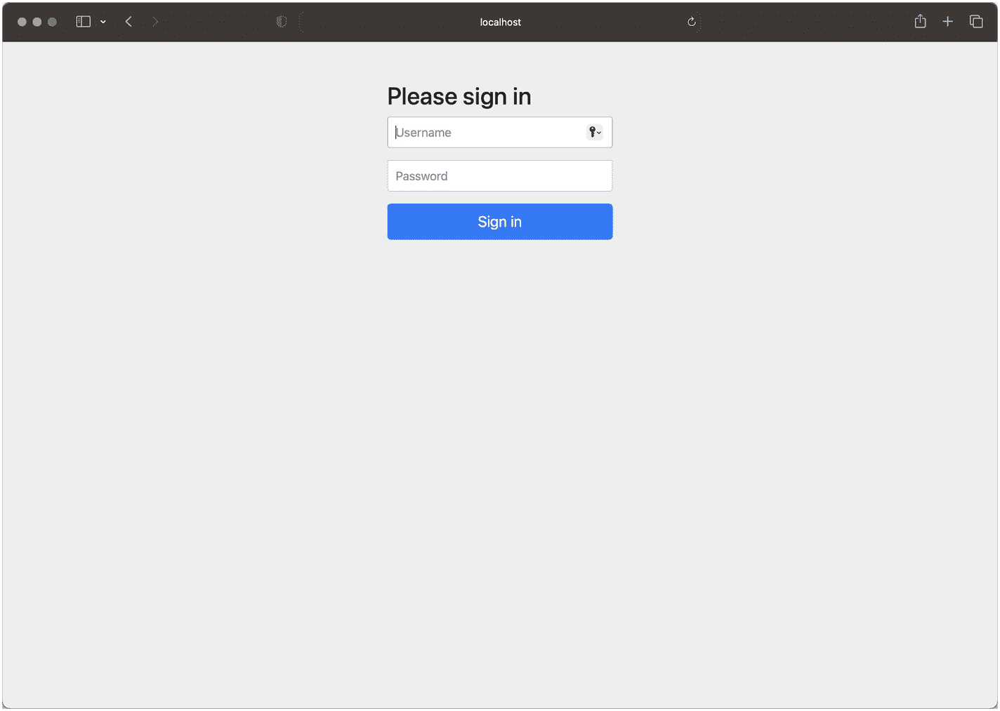
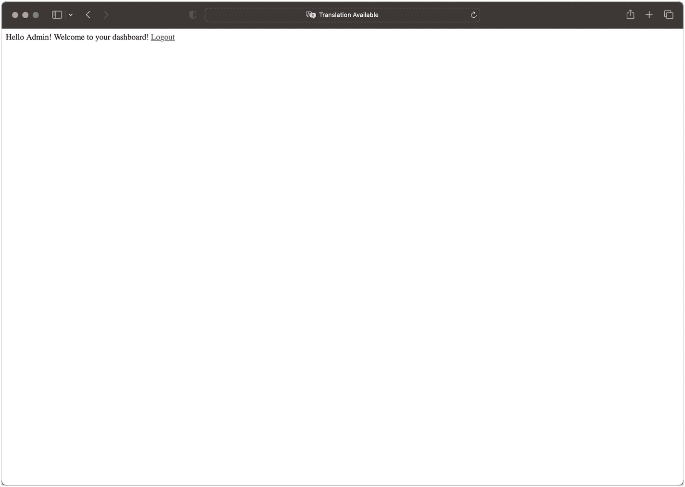
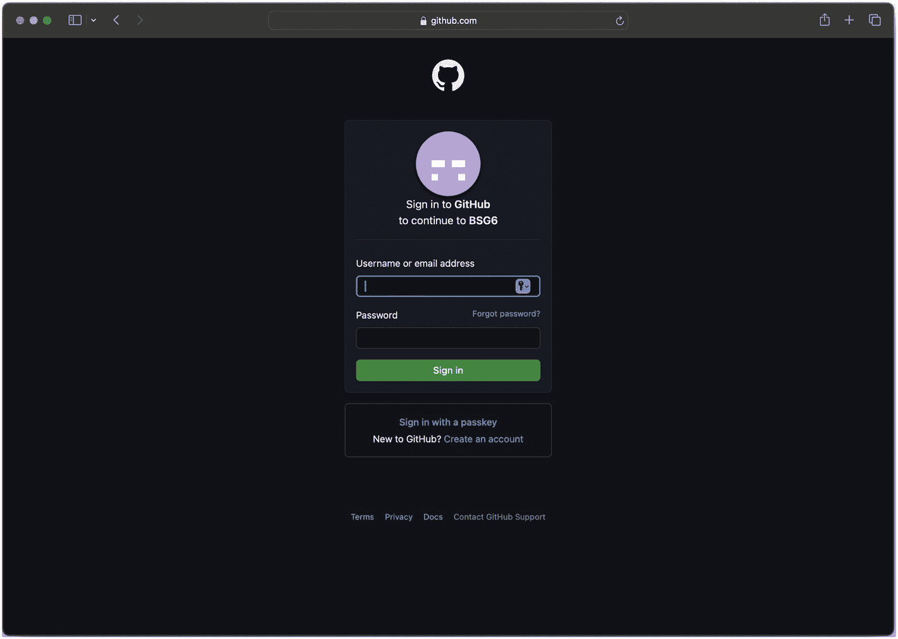
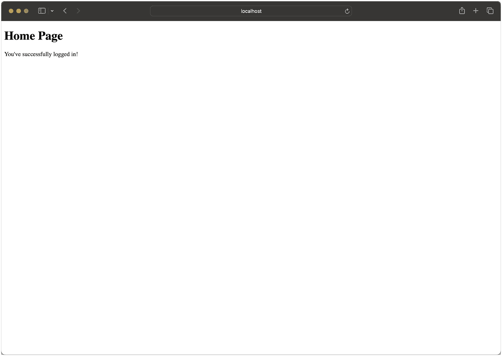

# 10. Spring Security

安全性在任何能够访问实时信息（即使是公开信息）的应用程序中都至关重要。^(¹⁰¹) 安全性意味着控制对功能和信息的访问权限；除非安妮被特别授权访问弗兰克的信息，否则弗兰克的数据应该是**安全**的，并且从安妮的角度来看是不可见的。自然而然地，Spring 拥有一个强大且功能完备的安全项目——名为 Spring Security——它允许你控制应用程序安全的几乎每个方面。

在本章中，我们将开发两个模块——`chapter10` 和 `chapter10-custom`——并且我们将使用我们在第 9 章中构建的一个简单 Web 应用程序——`chapter09-jpa` 项目——并在其上添加一个简单的接口来验证用户身份并控制对资源的授权。

## 简介

Spring Security 子项目最初是一个独立的项目，始于 2003 年，名为 Acegi Security System。^(¹⁰²) 在与 Spring 本身分开开发了 3 年之后，它于 2007 年被 Spring 正式采纳并更名为 Spring Security。如今，该子项目已成为 Spring 进行身份验证和访问控制的标准。它提供了足够的样板代码，让你无需任何定制即可使用，同时也具有足够的可扩展性，以满足你特定身份验证和授权需求可能需要的任何具体实现细节。

与许多其他 Spring 项目（包括第 8 章中介绍的 Spring Data）一样，Spring Security 子项目根据功能进一步细分为许多其他子项目。在最基本的层面上，你通常默认需要包含的三个 Spring Security 库是 `spring-security-core`、`spring-security-config` 和 `spring-security-web`。

以下是主要模块及其能帮助你实现的需求的非详尽列表：

| 库 | 描述 |
| --- | --- |
| `spring-security-core` | 所有使用 Spring Security 的应用程序都需要核心库。它包含访问控制和身份验证的类及接口，可用于独立或远程需求。 |
| `spring-security-config` | 这也是一个核心库——提供通过 Java 或 XML 进行的配置。 |
| `spring-security-web` | 该库包含在你的 Web 应用程序中使用 Spring Security 所需的必要过滤器和 Web 安全基础设施。 |
| `spring-security-test` | 为测试 Spring Security 应用程序提供支持。它与 JUnit 的映射最为简单，但我们也能使用 TestNG 实现相同的技巧。 |
| `spring-security-acl` | 提供对应用程序中特定 Java 对象实例上特定操作的访问控制。有了它，你可以指定某个特定用户有权在特定对象实例上执行特定方法，当然，你也可以依赖不那么**具体**的访问控制。（通常，人们依赖角色访问而非特定用户访问……但你可以选择所需的功能。） |
| `spring-security-ldap` | 该库提供对 LDAP（轻量级目录访问协议）的访问，用于身份验证和用户配置。 |

还有许多其他库值得一提，例如 OAuth（它有自己的工件组 `org.springframework.security.oauth`，包含许多提供特定功能的工件）和 JOSE。^(¹⁰³) 此外，还支持 CAS（一种单点登录系统；CAS 代表“中央认证服务”）和 OpenID（一种广泛的互联网身份验证规范），以及，嗯，`在此处插入你的安全机制`，无论是官方支持还是通过众多开源集成之一。有些库只关注身份验证方面，而有些则整合了围绕授权的不同概念。在撰写本文时，Maven 中为 `org.springframework.security` 命名空间提供了 48 个官方包。

**身份验证与授权**

当我们谈论身份验证时，我们试图正确断言访问我们资源的实体就是它所声称的实体或身份。当我们从基于 Web 的身份验证角度谈论这一点时，通常涉及多种不同的方法，最简单的是 HTTP BASIC 访问，一直到更复杂的机制，如 OpenID 或 CAS。

授权是一组或多条规则，用于确定一旦通过身份验证，谁被允许做什么。例如，如果 Jennifer 以 ADMIN 身份进行身份验证，那么她可能拥有对系统中所有实体的创建/读取/更新/删除权限，而 John 可能拥有 USER 权限，只能查看和更新与其账户关联的项目。

正如你在前几章中所见，Spring Boot 可以极大地减少入门所需的工作量，并以更少的精力让复杂的东西运行起来。在下一节中，我们将了解如何开始使用 Spring Security 配置一个 Web 应用程序和一个 REST API。


## 快速入门

在本节中，我们将借助 Spring Boot 提供的启动器，快速构建一个由 Spring Security 保护的简单 Web 应用。后续章节会深入探讨，但为了快速上手，这里我们先保持简单。

首先，我们需要在项目根目录下创建目录结构。

```
mkdir -p chapter10/src/main/java/com/bsg6/chapter10
mkdir -p chapter10/src/main/resources/templates
mkdir -p chapter10/src/test/java/com/bsg6/chapter10
代码清单 10-1
使用 POSIX 命令创建目录结构
```

我们需要像前几章一样设置 `pom.xml`。^(¹⁰⁴) 我们将使用 Spring Boot，这能大幅减少配置时间。我们将编写快速入门所需的 `pom.xml`，请注意，唯一显式声明且不属于 Spring Boot 的依赖是 `spring-security-test`，因为它不在启动器包中。

```

4.0.0

com.apress
bsg6
1.0

chapter10
1.0
war

org.springframework.boot
spring-boot-starter-web

org.yaml
snakeyaml

org.springframework.boot
spring-boot-starter-test
test

org.springframework.boot
spring-boot-starter-security

org.springframework.boot
spring-boot-starter-mustache

org.springframework.security
spring-security-test
test

org.springframework.boot
spring-boot-maven-plugin
${springBootVersion}

repackage

代码清单 10-2
chapter10/pom.xml
```

我们将构建的第一个 Web 应用会简单地提供一个登录验证页面，用户通过后才能访问我们高度机密的仪表盘页面。在 Spring Boot 的帮助下，我们将使用以下依赖：

*   `spring-boot-starter-web`：Spring MVC 启动器
*   `spring-boot-starter-security`：快速上手 Spring Security 的最简单方式
*   `spring-boot-starter-mustache`：用于渲染 Mustache 模板
*   `spring-boot-starter-test` 和 `spring-security-test`：引入测试代码的实用工具

Spring Security 非常灵活，即使没有多个官方子项目，其配置方式也多种多样。为简单起见，我们将专注于纯 Java 配置；XML 配置当然可行，但相当冗长。

让我们看看使用 Spring Boot 和 Spring Security 保护第一个 Web 应用需要哪些步骤。正如我们在第 7 章介绍 Spring Boot 时所看到的，入门可以相当简单。我们的第一个 Web 应用也不例外。

```
package com.bsg6.chapter10;
import org.springframework.boot.SpringApplication;
import org.springframework.boot.autoconfigure.SpringBootApplication;
@SpringBootApplication
public class GatewayApplication {
public static void main(String[] args) {
SpringApplication.run(GatewayApplication.class, args);
}
}
代码清单 10-3
chapter10/src/main/java/com/bsg6/chapter10/GatewayApplication.java
```

合理的默认配置能让你快速上手。由于添加了 `spring-boot-starter-security` 且没有显式指令，所有对 Web 应用的请求都将默认需要经过安全验证。

你可能会问，既然我们使用了这么多默认配置，又没有指定凭据，那该如何登录呢？如果未通过其他配置指定，默认用户名为 `user`，默认密码为 UUID 格式，运行 war 包时会显示如下：

```
Using generated security password: 33ccafac-5d13-4af5-ab48-ced789749669
```

此生成的密码仅用于开发环境。在生产环境中运行应用之前，必须更新你的安全配置。

闲话少叙，让我们运行应用，看看上述效果（尽管我们还没有任何实际的端点）。

```
mvn spring-boot:run
```

在任意浏览器中打开 http://localhost:8080，你将看到以下内容。



一个需要用户认证的网页界面，包含两个输入凭据的字段和一个提交按钮。

图 10-1

登录页面

输入默认用户名 `user` 和在日志中找到的生成密码后，你会看到一个 404 错误页面，因为我们还没有定义任何控制器。

当然，日志中明显可见的警告信息应当引起注意。毕竟这只是一个快速入门示例，但如果我们想指定自己的静态凭据，可以在 `src/main/resources` 目录下的 `application.properties` 中添加以下内容：

```
spring.security.user.name=user
spring.security.user.password=password123
```

让我们在代码库中添加一个仪表盘控制器和一个渲染模板，以此完成快速入门。

```
package com.bsg6.chapter10;
import org.springframework.stereotype.Controller;
import org.springframework.web.bind.annotation.GetMapping;
@Controller
public class DashboardController {
@GetMapping("/")
public String dashboard() {
return "dashboard";
}
}
代码清单 10-4
chapter10/src/main/java/com/bsg6/chapter10/DashboardController.java
```

我们将继续使用 Mustache 作为模板引擎，并覆盖默认的 `.mustache` 后缀，改用 `.html`。我们在 `application.properties` 中定义此后缀，以便 Spring 能准确映射。

```
spring.mustache.suffix:.html
代码清单 10-5
chapter10/src/main/resources/application.properties
```

以及我们带有 `logout` 操作的超炫模板。

```

Admin Dashboard Page

Hello Admin! Welcome to your dashboard!
Logout

代码清单 10-6
chapter10/src/main/resources/templates/dashboard.html
```

打开浏览器并登录后，你将不再看到错误信息，而是看到我们渲染的模板。



一个在网页浏览器上显示的交互式管理仪表盘界面，包含欢迎信息和退出选项，表明这是一个用于管理任务和用户管理的平台。

图 10-2

管理仪表盘


### 测试

在本快速入门指南中，我们将编写的大部分代码都集中在测试上。与之前的 Spring Boot 测试一样，我们需要为类添加一些注解，并准备必要的组件，以便与 TestNG 正常协作。

你会注意到，我们在测试中使用了 `MockMvc` 而非 `TestRestTemplate`。除了这些测试不涉及任何 REST API 之外，主要原因是这些测试模拟了来自 `spring-test` 的请求和响应，无需运行中的 Servlet 容器。这足以让我们验证功能是否按预期工作。接下来，我们看看如何设置一个模拟的 `WebApplicationContext`，并确保对 `MockMvcBuilders` 应用了 `.apply(springSecurity())`。

```
@SpringBootTest(classes = GatewayApplication.class, webEnvironment = SpringBootTest.WebEnvironment.RANDOM_PORT)
@AutoConfigureMockMvc
public class GatewayApplicationTest extends AbstractTestNGSpringContextTests {
@Autowired
private WebApplicationContext webApplicationContext;
private MockMvc mockMvc;
@BeforeClass
public void setup() {
mockMvc = MockMvcBuilders.webAppContextSetup(webApplicationContext)
.apply(springSecurity())
.build();
}
代码清单 10-7
摘自 chapter10/src/test/java/com/bsg6/chapter10/GatewayApplicationTest.java
```

我们的第一个实际测试是确保访问 Web 应用根路径时返回 `HTTP 401`。第二个测试将模拟登录过程：当请求收到 `HTTP 401` 后，重定向到登录页面，我们使用一个 `RequestPostProcessor` 来处理 CSRF 及生成的 Cookie 等所有必要事项，从而验证登录后能否得到预期的 `HTTP 200` 状态码。

```
@Test
public void testDashboardRequiresLogin() throws Exception {
this.mockMvc.perform(get("/"))
.andExpect(status().isUnauthorized());
}
@Test
public void testDashboardAfterLogin() throws Exception {
this.mockMvc.perform(get("/")
.with(SecurityMockMvcRequestPostProcessors
.user("user")
.password("password")))
.andExpect(status().isOk());
}
代码清单 10-8
摘自 chapter10/src/test/java/com/bsg6/chapter10/GatewayApplicationTest.java
```

为了运行此模块中的测试，我们将使用 Maven 并指定模块，同时指明要运行 `test`。

```
mvn -pl chapter10 -am test
```

## 自定义安全配置

我们的快速入门示例虽然能让你快速上手运行，但对于任何实际应用来说显然是不够的。将 Spring Boot 与 Spring Security 结合使用的便利之处在于，我们无需禁用其自动配置，只需在应用中添加相应的配置类即可覆盖默认行为。

Spring Security 通过 Servlet 过滤器机制拦截 HTTP 调用来实现 Web 安全，并将调用内容与安全映射进行匹配。对于方法调用，它采用动态代理而非 Servlet 过滤器来实现相同的功能。因此，我们需要确保安全过滤器已注册到 Servlet 容器或类加载器中，以便 Security 发挥其魔力。

Spring Boot 会自动确保 `springSecurityFilterChain` 这个 Servlet 过滤器被设置并注册到我们的应用中。

Spring Security 的 `springSecurityFilterChain` 是一个过滤器链，负责拦截传入的 HTTP 请求，并应用各种已配置的安全机制，包括身份验证和授权。它是控制对特定资源和端点访问的核心机制，也是 Spring Security 的重要组成部分。

我们的自定义安全应用将提供一个带有默认配置的应用，我们将在每一步中对其进行自定义。现在，让我们为 `chapter10-custom` 创建自定义目录结构。

```
mkdir -p chapter10-custom/src/main/java/com/bsg6/chapter10
mkdir -p chapter10-custom/src/main/resources/templates
mkdir -p chapter10-custom/src/test/java/com/bsg6/chapter10
mkdir -p chapter10-custom/src/test/java/resources/templates
代码清单 10-9
使用 POSIX 命令创建 chapter10-custom 目录结构
```

我们从 `pom.xml` 和 `application.properties` 开始，可以直接从 `chapter10` 完整复制过来（只需在 `pom.xml` 中将 `artifactId` 改为 `chapter10-custom` 即可）。

```
cp ../chapter10/pom.xml .
cp ../chapter10/src/main/resources/application.properties src/main/resources
代码清单 10-10
从 chapter10 复制 pom.xml 和 application.properties
```

俗话说太阳底下无新事，我们的入门应用也不例外。我们只是复制了主入口点，并为了规范而更改了类名。

```
package com.bsg6.chapter10;
import org.springframework.boot.SpringApplication;
import org.springframework.boot.autoconfigure.SpringBootApplication;
@SpringBootApplication
public class GatewayCustomApplication {
public static void main(String[] args) {
SpringApplication.run(GatewayCustomApplication.class, args);
}
}
代码清单 10-11
chapter10-custom/src/main/java/com/bsg6/chapter10/GatewayCustomApplication.java
```

根据我们在新模块中的设置，`chapter10-custom` 目前基本与上一节实现的内容相同，尚无特别之处。然而，我们的目标是创建一个所有人都能访问的自定义登录页面，登录后则是一个主页、一个普通用户仪表盘、一个管理员用户仪表盘，以及一个两个角色都能访问的联系页面。

我们将从这个 Web 应用的 `@Configuration` 类开始。在声明此类时，唯一需要做的就是指定 `@Configuration` 注解，让 Spring 知道它应该关注这个类。如果我们没有使用 Spring Boot，还需要添加 `@EnableWebSecurity` 注解，但幸运的是，Spring Boot 帮你省去了这一步。

```
@Configuration
public class GatewaySecurityConfig {
代码清单 10-12
摘自 chapter10-custom/src/main/java/com/bsg6/chapter10/GatewaySecurityConfig.java
```


我们需要定义的方法之一是 `PasswordEncoder`，它可以在我们的 `userDetailsService` 方法中使用。我们将使用一个工厂，该工厂返回一个 `DelegatingPasswordEncoder`，其底层实际上是一个包含命名编码器及其实现的 `Map`。如果你需要更明确一些，可以返回工厂中的任何编码器，或者自定义编码器。

```
@Bean
public PasswordEncoder passwordEncoder() {
return PasswordEncoderFactories.createDelegatingPasswordEncoder();
}
代码清单 10-13
PasswordEncoder 的定义，位于 chapter10-custom/src/main/java/com/bsg6/chapter10/GatewaySecurityConfig.java
```

**DelegatingPasswordEncoder**

由于需求变更，或者因为你接手了一个仍在使用 MD5 的系统，迁移到新的密码编码方法可能会很痛苦。从 Spring Security 5 开始引入了 `DelegatingPasswordEncoder`，它通过使用前缀来支持多种密码编码器。如果我们使用工厂方法 `PasswordEncoderFactories.createDelegatingPasswordEncoder()`，你会发现，如果未指定，它会默认使用 `{bcrypt}`，并提供一种简单的方法来升级未使用你首选方法的现有密码。

对于我们的示例应用程序，我们将设置两个用户账户，每个账户拥有一个或多个角色的访问权限。我们将创建一个拥有 `ADMIN` 和 `USER` 角色访问权限的账户，以及另一个仅拥有 `USER` 角色访问权限的账户。由于我们仍希望保持简单，我们将使用 `InMemoryUserDetailsManager`^(¹⁰⁵)，它允许我们基本上硬编码用户，并返回这个内存管理器，该管理器后续会被一个实际的安全提供者替换。你会注意到，我们使用了之前定义的 `passwordEncoder` 方法，这样我们就可以为返回的 `UserDetailsService` 提供一个通用的密码编码方法。

**GrantedAuthority 和 Roles**

一开始看到用户的两种不同区分可能会感到困惑，一种是 `GrantedAuthority`，另一种是 `Role`。`GrantedAuthority` 是一种比角色粒度更细的权限，例如 `READ_AUTHORITY` 或 `WRITE_AUTHORITY`，其命名和处理方式完全由你决定，非常灵活。Spring Security 为此提供了一个检查权限的方法 `hasAuthority`。另一方面，我们有 `Role`，它可以是对系统中用户角色更粗粒度的定义。`Role` 可以与 `hasRole` 方法一起使用，通常表示为 `ADMIN`、`USER` 或 `SUPERUSER`——同样，其命名也由你决定。

```
@Bean
public UserDetailsService userDetailsService() {
InMemoryUserDetailsManager manager = new InMemoryUserDetailsManager();
PasswordEncoder encoder = passwordEncoder();
UserDetails adminUser = User
.withUsername("admin")
.password(encoder.encode("admin123"))
.roles("ADMIN", "USER")
.build();
UserDetails regularUser = User
.withUsername("user")
.password(encoder.encode("user123"))
.roles("USER")
.build();
manager.createUser(adminUser);
manager.createUser(regularUser);
return manager;
}
代码清单 10-14
userDetailsService 的定义，位于 chapter10-custom/src/main/java/com/bsg6/chapter10/GatewaySecurityConfig.java
```

我们的 Web 应用程序将包含以下路由：

*   `/login` – 一个包含用户名和密码输入框以及提交按钮的表单页面
*   `/home` – 成功登录后显示，任何已认证用户均可访问
*   `/dashboard` – 任何拥有 `USER` 角色的用户均可访问
*   `/admin_dashboard` – 拥有 `ADMIN` 角色的用户可以访问

在下面的代码中，我们使用了 Lambda DSL 风格，这使得一切更容易理解。思考上述端点，我们的实现将确保角色和权限与意图相匹配，并且任何未指定的请求将自动要求认证。`HttpSecurity` 对象使用了构建器模式，因此我们可以确保每一步都返回该对象，并使用 `build` 方法返回一个 `SecurityFilterChain` 实例，以便 Spring Security 按照我们定义的意愿执行。

```
@Bean
public SecurityFilterChain filterChain(HttpSecurity http) throws Exception {
http
.authorizeHttpRequests(authorize -> authorize
.requestMatchers("/login")
.permitAll()
.requestMatchers("/dashboard")
.hasRole("USER")
.requestMatchers("/admin_dashboard")
.hasRole("ADMIN")
.anyRequest()
.authenticated()
)
.formLogin(formLogin -> formLogin
.loginPage("/login")
.permitAll()
);
return http.build();
}
代码清单 10-15
filterChain 的定义，位于 chapter10-custom/src/main/java/com/bsg6/chapter10/GatewaySecurityConfig.java
```

Spring Boot 生成的登录页面为我们处理了很多事情；然而，我真的很喜欢我 2000 年代早期那种没有 CSS 的风格，所以我们将构建自己的登录表单。Spring Boot 的登录页面自定义处理的一个项目是 CSRF。我们在下面使用 `@ControllerAdvice` 设置了一个 Model 属性，这将允许我们将其注入到我们的 Mustache 模板中。

**跨站请求伪造 (CSRF)**

由于 Web 天生开放的特性，它更容易受到恶意行为者的攻击。其中一种方法是跨站请求伪造 (CSRF 或 XSRF)。攻击者试图诱使无辜的受害者提交一个恶意构造的、受害者拥有特权访问权限的 Web 请求。对抗这种攻击的一种方法是确保对于固有危险的操作，我们有一个服务器生成的令牌必须被传递，我们将使用 `@ControllerAdvice` 来确保它是一个可供我们所有页面使用的 Model 属性。

```
@ControllerAdvice
public class CsrfTokenControllerAdvice {
@ModelAttribute("csrf")
public CsrfToken csrfToken(CsrfToken token) {
return token;
}
}
代码清单 10-16
filterChain 的定义，位于 chapter10-custom/src/main/java/com/bsg6/chapter10/CsrfTokenControllerAdvice.java
```

以下模板是我们精美的登录页面。它提交到端点 `/login`，并传递 `username` 和 `password`，并且感谢我们的 `CsrfTokenControllerAdvice`，我们还可以传入生成的 CSRF 令牌，并将其作为隐藏字段传递。我们接下来将在 `NonSecureController` 类文件中看到的一个实现细节是，针对一个名为 `hasError` 的布尔值的条件块。如果传递给登录处理程序的项目没有成功完成，我们将显示条件块中看到的非常通用的消息。

```

登录页面

{{ #hasError }}

用户名或密码无效。

{{ /hasError }}

用户名

密码

登录

代码清单 10-17
登录模板，位于 chapter10-custom/src/main/resources/templates/login.html
```

对于登录路由，我们的控制器将相当简单。唯一特别的地方是我们使用了一个非必需的 `@RequestParam`，名为 `error`，它将指示登录是否因任何原因失败。由于 Mustache 是一个无逻辑的模板库，我们向模板传递一个名为 `hasError` 的布尔标志属性，如果该参数存在于 URL 查询参数中，则该属性为 true。

```
package com.bsg6.chapter10;
import org.springframework.stereotype.Controller;
import org.springframework.ui.Model;
import org.springframework.web.bind.annotation.GetMapping;
import org.springframework.web.bind.annotation.RequestParam;
@Controller
public class NonSecureController {
@GetMapping("/login")
public String login(Model model, @RequestParam(required = false) String error) {
model.addAttribute("hasError", error != null);
return "login";
}
}
代码清单 10-18
非安全路由的控制器，位于 chapter10-custom/src/main/java/com/bsg6/chapter10/NonSecureController.java
```


除了将安全路由和非安全路由放在不同的类文件中感觉更清晰，尤其是当涉及更多逻辑时，并没有系统层面的理由要求这样做。在仔细阅读了 `GatewaySecureConfig` 类之后，我们的新路由应该会让人感到熟悉。

```
package com.bsg6.chapter10;
import org.springframework.stereotype.Controller;
import org.springframework.web.bind.annotation.GetMapping;
@Controller
public class SecureController {
@GetMapping(value={"/", "/home"})
public String home() {
return "home";
}
@GetMapping("/dashboard")
public String dashboard() {
return "dashboard";
}
@GetMapping("/admin_dashboard")
public String admin_dashboard() {
return "admin_dashboard";
}
}
清单 10-19
安全路由的控制器 chapter10-custom/src/main/java/com/bsg6/chapter10/SecureController.java
```

接下来，让我们看看自定义安全应用程序的非常简单的模板。首页包含指向另外两个仪表盘的链接，一个用于普通用户，一个用于管理员（两者都包含“注销”功能）。

```

管理员仪表盘页面

你好，管理员！欢迎来到你的仪表盘！

注销

清单 10-22
chapter10-custom/src/main/resources/templates/admin_dashboard.html 中的管理员仪表盘模板
```

```

普通用户仪表盘页面

你好，用户！欢迎来到你的仪表盘！

注销

清单 10-21
chapter10-custom/src/main/resources/templates/dashboard.html 中的用户仪表盘模板
```

```

首页

首页
仪表盘 | 管理员仪表盘

清单 10-20
chapter10-custom/src/main/resources/templates/home.html 中的首页模板
```

我们的测试对于确保代码按预期工作至关重要。我们的第一个测试 `testHomepageRequiresLogin` 将使用 `MockMvc` 访问 Web 应用的根路径，并确保我们得到 `HTTP 302` 作为响应。我们的另一个期望是使用 Ant 匹配器匹配 `**/login` 模式。接下来的两个测试将使用 `@WithUserDetails` 注解来模拟用户已登录，并且我们能够在登录后查看页面。你会注意到，用户仪表盘的测试没有指定用户名，这是因为默认属性已经是 `user`，我们将其用于普通用户。

```
@Test
public void testHomepageRequiresLogin() throws Exception {
this.mockMvc.perform(get("/"))
.andExpect(status().is3xxRedirection())
.andExpect(redirectedUrlPattern("**/login"));
}
@Test
@WithUserDetails()
public void testDashboardAfterLoginAsUser() throws Exception {
this.mockMvc.perform(
get("/dashboard")
).andExpect(status().isOk());
}
@Test
@WithUserDetails("admin")
public void testDashboardAfterLoginAsAdmin() throws Exception {
this.mockMvc.perform(
get("/admin_dashboard")
).andExpect(status().isOk());
}
清单 10-23
安全路由的控制器 chapter10-custom/src/test/java/com/bsg6/chapter10/GatewayCustomApplicationTest.java
```

让我们打开终端，导航到 `chapter10-custom` 目录并运行测试。

```
mvn test
```

如果一切顺利（理应如此），所有测试都将通过。

现在，我们换个话题，讨论一下如何使用我们在第 9 章中看到的仓库代码来保护 REST 应用程序。

## 保护 REST 应用程序

在上一节中，我们很确定已经完成了新子项目的创建，但安全方面总是有其他计划。我们将创建最后一个顶级项目，并将其命名为 `chapter10-jpa`。本节将引入子项目 `chapter09-jpa`，并了解如何将 Spring Security 与我们第 9 章的工作集成。以下是创建目录结构的方法。

```
mkdir -p chapter10-jpa/src/main/java/com/bsg6/chapter10
mkdir -p chapter10-jpa/src/main/resources/templates
mkdir -p chapter10-jpa/src/test/java/com/bsg6/chapter10
清单 10-24
使用 POSIX 命令创建 chapter10-jpa 目录结构
```

引入第 9 章代码的另一个好处是，它使用了 Spring Boot，而我们在本章中尚未涉及。正如我们在其他利用 Spring Boot 的章节中所看到的，Boot 让很多事情变得非常简单。

首先，让我们构建新的 Maven 配置文件——`pom.xml`——并且一如既往地注意，顶级 `pom.xml` 用于一些继承的属性。我们将引入 Spring Boot 所需的依赖项，包括一个新的依赖项 `spring-boot-starter-security`，它将为我们完成大量基础工作，以及 `chapter09-common` 和 `chapter09-jpa` 子项目，它们使我们能够访问 `MusicService` 及其依赖项。

```

4.0.0

com.apress
bsg6
1.0

chapter10-jpa
1.0
war

org.springframework.boot
spring-boot-starter-web

org.yaml
snakeyaml

org.springframework.boot
spring-boot-starter-test
test

${project.parent.groupId}
chapter09-jpa
${project.parent.version}

org.springframework.boot
spring-boot-maven-plugin
${springBootVersion}

repackage

清单 10-25
chapter10-jpa/pom.xml
```

要使用 Spring Boot，我们需要定义一个 `@SpringBootApplication` 类，我们将在下面的 `GatewayRestApplication` 中完成。我们在第 9 章的代码库中使用了 `@Bean` 类，因此我们的 `scanBasePackages` 将包含 `com.bsg6.chapter09.jpa` 以及我们在第 10 章中的包 `com.bsg6.chapter10`。

```
package com.bsg6.chapter10;
import org.springframework.boot.SpringApplication;
import org.springframework.boot.autoconfigure.SpringBootApplication;
@SpringBootApplication(scanBasePackages = {
"com.bsg6.chapter09.jpa",
"com.bsg6.chapter10"
})
public class GatewayRestApplication {
public static void main(String[] args) {
SpringApplication.run(GatewayRestApplication.class, args);
}
}
清单 10-26
chapter10-jpa/src/main/java/com/bsg6/chapter10/MainApplication.java
```

有了这一个类，我们现在就有了一个 Spring Boot 应用程序，并且可以使用以下 Gradle 命令运行它：`mvn spring:bootRun`。一旦启动，你将拥有一个可用的 Tomcat 实例，随时可以运行。不过，我们还没有实际定义任何端点，因此你会遇到很多 `404`（未找到）错误。让我们来解决这个问题，并创建一个 `@RestController`，用于访问和创建数据源中的 `Song` 条目。为了简单起见，我们将定义两个端点，一个用于按标识符检索（GET）资源，另一个用于创建（POST）新资源。


```
package com.bsg6.chapter10;
import com.bsg6.chapter09.jpa.MusicService;
import com.bsg6.chapter09.jpa.Song;
import org.springframework.http.MediaType;
import org.springframework.web.bind.annotation.GetMapping;
import org.springframework.web.bind.annotation.PathVariable;
import org.springframework.web.bind.annotation.PostMapping;
import org.springframework.web.bind.annotation.RequestBody;
import org.springframework.web.bind.annotation.RestController;
@RestController
public class SongController {
private MusicService service;
SongController(MusicService service) {
this.service = service;
}
@GetMapping(value = "/songs/{id}",
produces = MediaType.APPLICATION_JSON_VALUE)
Song getSongById(@PathVariable int id) {
Song song = service.getSongById(id);
if (song != null) {
return song;
} else {
throw new SongNotFoundException();
}
}
@PostMapping(value="/songs",
consumes = MediaType.APPLICATION_JSON_VALUE,
produces = MediaType.APPLICATION_JSON_VALUE)
Song saveSong(@RequestBody Song song) {
Song songLookup  = service.getSong(song.getArtist().getName(), song.getName());
if(songLookup != null) {
return songLookup;
} else {
throw new SongNotFoundException();
}
}
}
清单 10-27
chapter10-jpa/src/main/java/com/bsg6/chapter10/SongController.java
```

我们在这里定义了两个方法；第一个是 `getSongById`，它接受一个 `@PathVariable` 类型的 `id` 参数，我们将使用 `MusicService` 在数据库中查找该 ID。如果该 ID 不存在，我们将抛出一个 `SongNotFoundException`，这与我们在第 9 章中看到的 `ArtistNotFoundException` 代码相同。

第二个方法用于创建一个新的 `Song`。它将消费一个 JSON 对象（我们将在下面创建一个示例供你提交），并在响应中生成/返回新创建的对象。你可以使用以下 `curl` 命令来查看保存操作的实际效果。

```
curl --header "Content-Type: application/json" \
-u user:user123 \
--request POST \
--data '{"name":"Someone Stole The Flour","artist":{"name": "Threadbare Loaf"}}' \
http://localhost:8080/songs
清单 10-28
保存歌曲的 Curl 请求
```

创建完这个新的歌曲条目后，我们可以再次使用一个简单的 curl 命令来请求我们的条目。

```
curl --header "Content-Type: application/json" http://localhost:8080/songs/2
清单 10-29
获取歌曲的 Curl 命令
```

现在我们有了一个非常简单的 REST 控制器，让我们看看集成 Spring Security 后它会是什么样子。要保护应用程序并开始要求身份验证，我们唯一需要做的就是将以下 `pom.xml` 依赖项添加到项目中。

```
org.springframework.boot
spring-boot-starter-security

org.springframework.security
spring-security-test
test

清单 10-30
将 spring-boot-starter-security 添加到 chapter10-jpa/pom.xml
```

这将设置一些神奇的默认值，为所有以 `/*` 开头的 URL 添加安全性，使用 BASIC 身份验证作为默认方式，并设置一个默认用户名为 `user`。

你可能会问自己：“这很好，但密码呢？”当你使用 `mvn spring:bootRun` 运行应用程序时，你会在输出中看到类似的内容。

```
Using generated security password: df1a58e9-7ac2-4d01-9e6e-41e36c06ddb9
清单 10-31
Spring Boot 生成的密码
```

之后，发出一个不带身份验证信息的 curl 命令来访问 GET 端点。

```
curl --header "Content-Type: application/json" http://localhost:8080/songs/2
清单 10-32
未提供身份验证的获取歌曲 Curl 命令
```

你将看到处理程序返回类似这样的响应。

```
{"timestamp":"2019-06-27T16:22:16.070+0000","status":401,"error":"Unauthorized","message":"Unauthorized","path":"/songs/2"}
清单 10-33
未提供身份验证的 Curl 响应
```

因此，让我们进行身份验证，并使用我们的凭据获取 `Threadbare Loaf` 条目。如果你还记得上面的内容，这意味着用户名为 `user`，密码为 `generated security password` 部分列出的任何内容。为简单起见，我们就使用上面已经列出的那个。

```
curl \
-u user:51f210f0-3f46-49be-97eb-13e7fef163a8 \
--header "Content-Type: application/json" \
http://localhost:8080/songs/2
{"id":2,"artist":{"id":1,"name":"Threadbare Loaf"},"name":"Someone Stole The Flour","votes":0}
清单 10-34
带身份验证的 Curl 命令

```

如此简单易行，而且你几乎可以免费获得它。这显然不适用于生产应用程序，单个用户仅用于测试目的。让我们看看一个新的配置，我们可以创建它来允许我们创建自己的用户和角色，并覆盖 Spring Boot 的默认设置。

```
package com.bsg6.chapter10;
import org.springframework.context.annotation.Bean;
import org.springframework.context.annotation.Configuration;
import org.springframework.security.config.annotation.web.builders.HttpSecurity;
import org.springframework.security.config.annotation.web.configuration.EnableWebSecurity;
import org.springframework.security.config.annotation.web.configurers.AbstractHttpConfigurer;
import org.springframework.security.core.userdetails.User;
import org.springframework.security.core.userdetails.UserDetails;
import org.springframework.security.core.userdetails.UserDetailsService;
import org.springframework.security.crypto.factory.PasswordEncoderFactories;
import org.springframework.security.crypto.password.PasswordEncoder;
import org.springframework.security.provisioning.InMemoryUserDetailsManager;
import org.springframework.security.web.SecurityFilterChain;
import static org.springframework.security.config.Customizer.withDefaults;
@Configuration
@EnableWebSecurity
public class GatewaySecurityConfig {
@Bean
public UserDetailsService userDetailsService() {
InMemoryUserDetailsManager manager = new InMemoryUserDetailsManager();
PasswordEncoder encoder = PasswordEncoderFactories.createDelegatingPasswordEncoder();
UserDetails adminUser = User
.withUsername("admin")
.password(encoder.encode("admin123"))
.roles("ADMIN", "USER")
.build();
UserDetails regularUser = User
.withUsername("user")
.password(encoder.encode("user123"))
.roles("USER")
.build();
manager.createUser(adminUser);
manager.createUser(regularUser);
return manager;
}
@Bean
public SecurityFilterChain filterChain(HttpSecurity http) throws Exception {
http.authorizeHttpRequests(authorize -> authorize.anyRequest().authenticated())
.csrf(AbstractHttpConfigurer::disable)
.httpBasic(withDefaults());
return http.build();
}
}
清单 10-35
chapter10-jpa/src/main/java/com/bsg6/chapter10/GatewaySecurityConfig.java
```

上面的大部分内容对你来说应该已经很熟悉了。

我们的 `userDetailsService()` 方法执行的操作与之前示例中使用的 `userDetailsService` 覆盖类似。我们使用 `DelegatingPasswordEncoder` 设置了两个用户，分别为 `USER` 角色使用凭据 `user:user123`，为同时具有 `USER` 和 `ADMIN` 权限的角色使用凭据 `admin:admin123`。

我们的第二个方法是之前见过的 `filterChain` 方法，但在 `HttpSecurity` 上使用了一些新方法。由于这里使用了 REST，我们不需要使用 `CSRF`——它用于防止使用 JavaScript 的跨站请求伪造。除了这些之外，我们正在使用 `USER` 角色保护所有端点，现在可以使用已经定义的更简单的凭据。当你添加了这个新类后，终止现有的 `bootRun` 并使用 `mvn spring:bootRun` 重新运行它。我们可以复制上面清单 10-33 中现有的 curl 命令，并将凭据替换为 `user:user123`，应该会看到类似的结果。


我们不要错过这个测试。在这些测试中，我们将使用 `TestRestTemplate` 类来测试这些 RESTful 调用，毕竟它的名字就说明了用途。两个测试都会创建一个名为“Threadbare Loaf”的艺术家和一首名为“Someone Stole the Flour”的歌曲。第一个测试不会向我们的方法传递任何认证信息，我们的 Web 应用会正确返回 `HTTP 401` 响应。第二个测试会创建相同的对象，但会使用 `admin:admin123` 通过基本认证挑战，我们会看到返回 `HTTP 200`，并且响应体不为空。

```
package com.bsg6.chapter10;
import com.bsg6.chapter09.jpa.Artist;
import com.bsg6.chapter09.jpa.Song;
import org.springframework.beans.factory.annotation.Autowired;
import org.springframework.boot.test.context.SpringBootTest;
import org.springframework.boot.test.web.client.TestRestTemplate;
import org.springframework.http.HttpStatus;
import org.springframework.http.ResponseEntity;
import org.springframework.test.context.testng.AbstractTestNGSpringContextTests;
import org.testng.annotations.Test;
import static org.testng.Assert.assertEquals;
import static org.testng.AssertJUnit.assertNotNull;
@SpringBootTest(classes = GatewayRestApplication.class, webEnvironment = SpringBootTest.WebEnvironment.RANDOM_PORT)
public class GatewayRestApplicationTest extends AbstractTestNGSpringContextTests {
@Autowired
private TestRestTemplate restTemplate;
@Test
public void testSaveSongsRequiresLogin() throws Exception {
Artist artist = new Artist("Threadbare Loaf");
Song song = new Song(artist, "Someone Stole the Flour");
ResponseEntity response = restTemplate.postForEntity("/songs", song, Song.class);
assertEquals(HttpStatus.UNAUTHORIZED, response.getStatusCode());
}
@Test
public void testSaveSongsWithAuth() throws Exception {
Artist artist = new Artist("Threadbare Loaf");
Song song = new Song(artist, "Someone Stole the Flour");
ResponseEntity response = restTemplate.withBasicAuth("admin", "admin123").postForEntity("/songs", song, Song.class);
assertEquals(HttpStatus.OK, response.getStatusCode());
assertNotNull(response.getBody());
}
}
清单 10-36
chapter10-jpa/src/test/java/com/bsg6/chapter10/GatewayRestApplicationTest.java
```

要使用 Maven 运行此测试，请导航到 `chapter10-jpa` 目录并运行。

```
mvn test
清单 10-37
运行 Spring Security JPA 测试
```

现在你已经看到，使用 Spring Boot 和 REST 端点设置安全性，以及编写一个简单的测试来确保其按预期工作，是多么简单。

### 集成 OAuth

我们要处理的最后一个官方内容是，如何在你选择的情况下将 OAuth 2.0^(¹⁰⁶) 集成到你的安全流程中。由于本章已经涵盖了不少内容，我们将构建的示例会相当简单。我们将创建一个 Web 应用，该应用将假定所有端点都必须由我们的 OAuth 提供程序（这里我们将使用 GitHub）保护。我们将创建另一个子项目来保持内容的良好分离。

```
mkdir -p chapter10-oauth/src/main/java/com/bsg6/chapter10
mkdir -p chapter10-oauth/src/main/resources/templates
清单 10-38
使用 POSIX 命令创建 chapter10-oauth 目录结构
```

现在我们已经有了目录结构，接下来将创建一个新的 `pom.xml`，并确保将其也添加到父 pom 中。

```

4.0.0

com.apress
bsg6
1.0

chapter10-oauth
1.0
war

org.springframework.boot
spring-boot-starter-web

org.yaml
snakeyaml

org.springframework.boot
spring-boot-starter-security

org.springframework.boot
spring-boot-starter-mustache

org.springframework.boot
spring-boot-starter-oauth2-client

org.springframework.boot
spring-boot-maven-plugin
${springBootVersion}

repackage

清单 10-39
chapter10-oauth/pom.xml
```

你会注意到我们添加的新依赖是 `spring-boot-starter-oauth2-client`。鉴于我们之前对 Spring Boot Starter 的了解，这不会有任何不同，并且绝对是你以前将 OAuth 集成到应用程序中最简单的方式。接下来，让我们创建 `SpringApplication`。

```
package com.bsg6.chapter10;
import org.springframework.boot.SpringApplication;
import org.springframework.boot.autoconfigure.SpringBootApplication;
@SpringBootApplication()
public class GatewayOAuthApplication {
public static void main(String[] args) {
SpringApplication.run(GatewayOAuthApplication.class, args);
}
}
清单 10-40
chapter10-oauth/src/main/java/com/bsg6/chapter10/GatewayOAuthApplication.java
```

这非常简单，如果你在此处运行应用程序，Spring Boot 的 Spring Security 将默认使用常规表单登录，并像第一个示例一样生成一个安全密码。问题是我们还没有指定任何要集成的 OAuth 提供程序。我们稍后会解决这个问题。我们首先需要做的是创建一个新的 GitHub 应用程序。

1.  访问以下页面以创建一个新的 GitHub 应用程序：[`https://github.com/settings/developers`](https://github.com/settings/developers)。

2.  点击“New OAuth App”按钮。

3.  为应用程序命名，如果需要，还可以添加描述。

4.  对于主页 URL，你可以输入 `http://localhost:8080`。

5.  对于授权回调 URL，请使用：`http://localhost:8080/login/oauth2/code/github`。

6.  接下来点击 **Register application**，你会看到一个页面，上面有一个你需要复制的客户端 ID，以及一个“Generate a new client secret”按钮。

7.  记下客户端 ID 和客户端密钥，我们接下来会用到它们。

我们将避免将任何密钥放入 `application.properties` 中，而是使用放置在 `chapter10-oauth` 模块目录中的 `.env` 文件来保存我们的密钥。你在上述第 7 步中记下的内容应填入文件中的占位符。

```
GITHUB_OAUTH_CLIENT_ID=
GITHUB_OAUTH_CLIENT_SECRET=
清单 10-41
我们的秘密 .env 文件在运行中
```

接下来，让我们在 `application.properties` 文件中使用上述内容。第 2 行包含一个特殊配置，允许我们在代码中利用 `.env` 文件，并从此文件中省略密钥。`optional` 名称告诉 Spring，如果资源不存在，不要抛出错误，而 `[.properties]` 后缀表示文件名可以是 `.env` 或 `.env.properties`，并且都是有效的。第 4 行和第 5 行是我们告诉 Spring Boot 的 OAuth 实现客户端 ID 和客户端密钥的位置。


```
spring.mustache.suffix:.html
spring.config.import=optional:file:.env[.properties]
spring.security.oauth2.client.registration.github.client-id=${GITHUB_OAUTH_CLIENT_ID}
spring.security.oauth2.client.registration.github.client-secret=${GITHUB_OAUTH_CLIENT_SECRET}
代码清单 10-42
chapter10-oauth/src/main/resources/application.properties
```

为了完善我们的 OAuth 示例，最后要做两件事：创建一个 `@Controller`，它在根路径 `/` 和 `/home` 上定义了一个路由。

```
package com.bsg6.chapter10;
import org.springframework.stereotype.Controller;
import org.springframework.web.bind.annotation.GetMapping;
@Controller
public class HomeController {
@GetMapping(value={"/", "/home"})
public String home() {
return "home";
}
}
代码清单 10-43
chapter10-oauth/src/main/java/com/bsg6/chapter10/HomeController.java
```

最后，我们创建一个模板，该模板将在我们通过 OAuth 服务器 GitHub 成功登录后显示。

```

首页

首页
您已成功登录！

代码清单 10-44
chapter10-oauth/src/main/resources/templates/home.html
```

打开终端并运行应用程序 `mvn spring-boot:run`，然后在浏览器中打开 http://localhost:8080。

您将立即被重定向到 GitHub 登录页面。



网页浏览器上的 GitHub 登录页面，包含用户名或电子邮件以及密码字段。它提供了登录、创建帐户的选项，以及支持和密码恢复的链接。

图 10-3

GitHub 登录

成功登录并授权您创建的应用程序后，您将看到以下内容。



网页浏览器上指示用户登录成功的页面。它显示了一条确认成功认证的消息。

图 10-4

首页

与我们本章使用的其他示例一样，我们始终可以覆盖默认配置，转而使用我们自己的自定义实现。从 `oauth2Login()` 方法返回的对象提供了许多方法，其中一些对于配置非常有用且不建议接受默认值的方法如下：

*   `loginPage("/my_login")` – 允许您配置一个端点来提供登录页面，而不是使用 Spring Boot 的默认页面
*   `defaultSuccessUrl()` – 成功时使用的重定向地址
*   `failureUrl()` – 登录失败时使用的重定向地址（例如，用户使用了无效凭据）
*   `successHandler()` – 用户认证成功的自定义逻辑处理器，必须实现 `AuthenticationSuccessHandler`，通常用于重定向或转发到成功页面
*   `failureHandler()` – 认证失败的自定义逻辑处理器，实现 `AuthenticationFailureHandler`，通常重定向到认证页面以重试

当然还有更多选项，您可以在文档中查看更多内容。请参阅 [`https://spring.io/projects/spring-security-oauth`](https://spring.io/projects/spring-security-oauth)。

我们仅仅触及了 Spring Security 强大功能的皮毛。该子项目支持从简单的 HTTP BASIC、Digest 和基于表单的认证，到更复杂的 OpenID、JOSSO 以及使用中央认证服务（CAS）的 SSO。它集成了从 LDAP、Kerberos 甚至 Windows NTLM 拉取数据的功能。它提供了您期望安全框架应具备的功能，并且其核心具有可配置性，您可以随心所欲地进行修改。

最重要的一点是，如果您使用的是行业中的任何标准或最佳实践，Spring Security 很可能已经为您提供了支持。如果没有，它也是完全可插拔和可定制的，可以与您特定的自定义认证实现协同工作。

## 通往 Spring Security 7 之路

我们的目标是时刻做好准备，虽然我们讨论的是 Spring Security 6.x，但简要提及下一版本的一些即将到来的变化是合适的。在下一个版本中，非 Lambda 配置样式将被弃用，转而支持 Lambda DSL。在我们上面看到的所有代码中，我们特意使用了 Lambda 风格的 DSL 以实现向前兼容。让我们看看我们代码库中的一个示例。

```
@Bean
public SecurityFilterChain filterChain(HttpSecurity http) throws Exception {
http
.authorizeHttpRequests(authorize -> authorize
.requestMatchers("/login")
.permitAll()
.requestMatchers("/dashboard")
.hasRole("USER")
.requestMatchers("/admin_dashboard")
.hasRole("ADMIN")
.anyRequest()
.authenticated()
)
.formLogin(formLogin -> formLogin
.loginPage("/login")
.permitAll()
);
return http.build();
}
代码清单 10-45
Lambda DSL 风格示例 chapter10-custom/src/main/java/com/bsg6/chapter10/GatewaySecurityConfig.java
```

根据开发者的说法，这样做是为了减少混淆，因为嵌套的 `.and()` 和多种返回类型越来越难以调试。新方法始终返回 `HttpSecurity` 对象的实例以供进一步配置，并使配置风格更符合其他包（如 Spring Integration 和 Spring Cloud Gateway）的风格。Lambda DSL 风格的工作方式类似，也可以应用于 WebFlux。

## 下一步

在第 11 章中，我们将探索用于数据处理的 Spring Batch 和用于更好组织代码库的 Spring Modulith。我们将一起学习如何设置、配置和运行企业级批处理作业，以及如何以更加模块化的方式构建应用程序。

脚注 1   2   3   4   5   6

