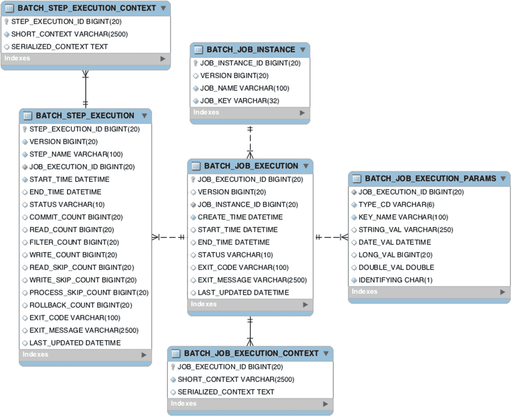
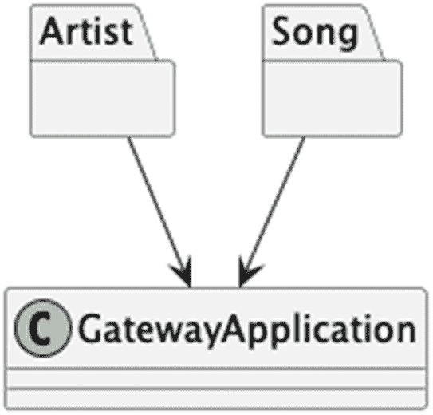
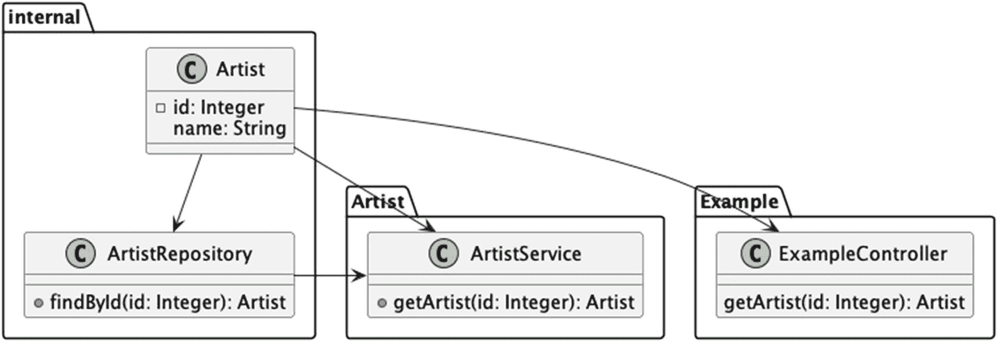
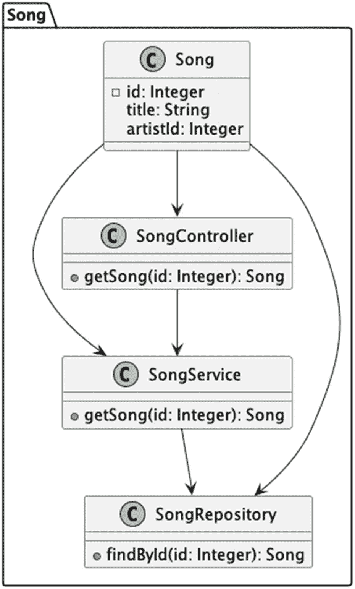
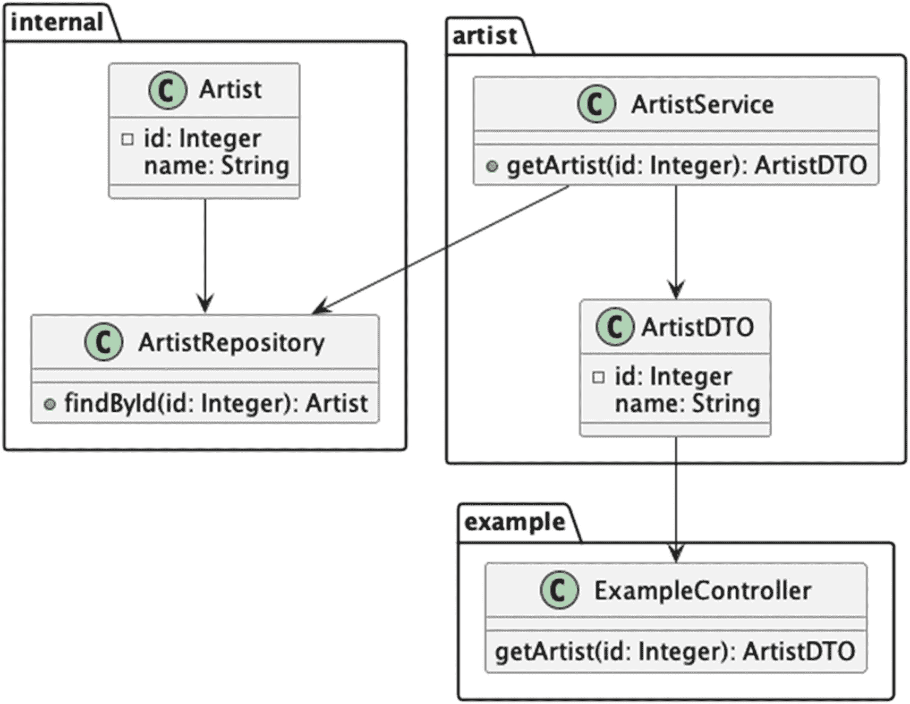
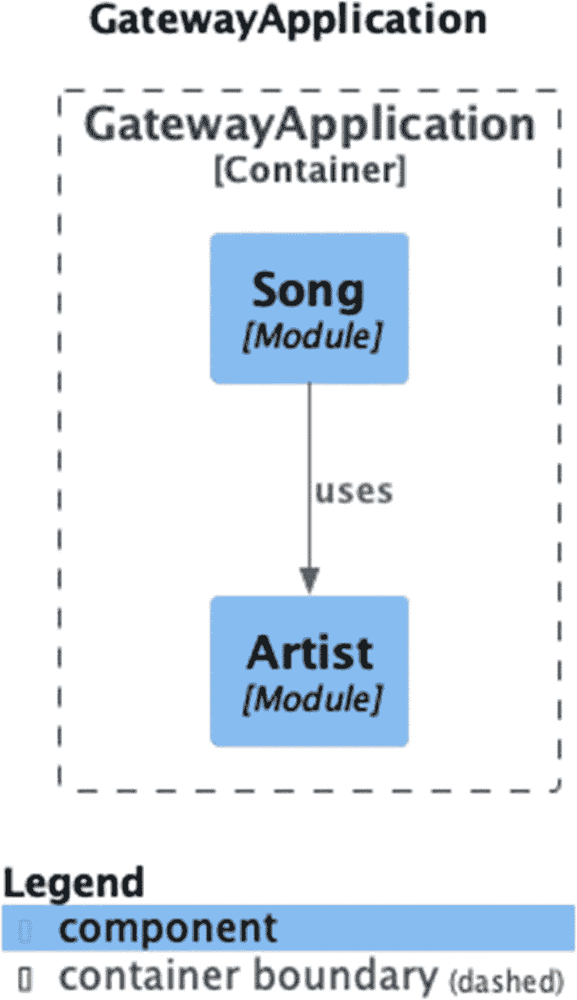

# 11. Spring Batch 与 Modulith

在本章中，我们将讨论 Spring 框架生态系统中两个较新但不太为人所知的库：Spring Batch 和 Spring Modulith。两者都可以为我们软件开发中必须处理的功能提供有用的工具，并作为我们喜爱的框架的一部分提供一些指导和必要的结构。

## Batch 简介

Batch [`https://spring.io/projects/spring-batch`](https://spring.io/projects/spring-batch) 是一组轻量级函数，其构建具有足够的健壮性，可以集成到企业环境中。Batch 提供的功能包括：

*   事务管理
*   基于块的处理
*   声明式 I/O
*   启动/停止/重启
*   重试/跳过
*   通过 Spring Cloud Data Flow [`https://dataflow.spring.io/`](https://dataflow.spring.io/) 提供的基于 Web 的管理界面

### 配置

在本节中，我们将创建一个小的示例，该示例将从两个独立的 CSV 文件导入数据，以便为 Band Gateway 应用程序初始化数据。

首先，我们需要创建目录结构，从整个项目目录开始。

```
mkdir -p chapter11-batch/src/main/java/com/bsg6/chapter11
mkdir -p chapter11-batch/src/main/resources
代码清单 11-1
使用 POSIX 命令创建目录结构
```

我们需要设置 `pom.xml` – 与前面章节类似。^(¹⁰⁷) 我们将使用 Spring Boot，因此我们的设置时间将大大减少。

```

4.0.0

com.apress
bsg6
1.0

chapter11-batch
1.0

org.springframework.boot
spring-boot-starter-batch

org.springframework.boot
spring-boot-starter-data-jpa

com.h2database
h2
runtime

org.springframework.boot
spring-boot-maven-plugin
${springBootVersion}

repackage

代码清单 11-2
chapter11-batch/pom.xml
```

为了降低复杂性，我们不会处理从其他项目导入依赖项，而是再次导入 `spring-boot-starter-data-jpa` 和 `h2`，以及本章的新成员和主题 `spring-boot-starter-batch`，这将帮助我们在这里快速入门。


### 我们的第一个任务

该应用将使用我们在 `application.properties` 中定义的 CSV 文件，首先导入艺术家列表，然后遍历并为每位艺术家导入歌曲列表。

我们的入口应用与之前 Spring Batch 章节中的相同。最终，这甚至可能就是关键所在。

```
package com.bsg6.chapter11;
import org.springframework.boot.SpringApplication;
import org.springframework.boot.autoconfigure.SpringBootApplication;
@SpringBootApplication
public class GatewayBatchApplication {
public static void main(String[] args) {
SpringApplication.run(GatewayBatchApplication.class, args);
}
}
Listing 11-3
chapter11-batch/src/main/java/com/bsg6/chapter11/GatewayBatchApplication.java
```

首先，让我们将 `chapter09-jpa` 示例中的任何属性复制到新示例中。我们将为 CSV 文件添加两个新属性，分别命名为 `file.artists.input` 和 `file.songs.input`，并展示每个 CSV 文件的内容。但概览一下，艺术家文件的假定表头将是 `id,name`，而歌曲文件的假定表头将是 `id,name,artistId`。

```
file.artists.input=artists.csv
file.songs.input=songs.csv
spring.datasource.url=jdbc:h2:./chapter-11-batch;DB_CLOSE_DELAY=-1;
spring.datasource.username=sa
spring.datasource.password=
spring.jpa.hibernate.ddl-auto=update
spring.batch.jdbc.initialize-schema=always
Listing 11-4
chapter11-batch/src/main/resources/application.properties
```

我们包含了 Spring 和 JPA 所需的一切，以便 Spring Batch 能够创建它所需的表，我们将从参考文档中包含 DDL。它们与 Spring Batch 的对象层次结构非常吻合，例如 `BATCH_JOB_EXECUTION` → `JobExecution` 等。



Spring Batch 数据库模式图。它描绘了六个部分，标题分别为：批处理步骤执行上下文、批处理步骤执行、批处理作业执行上下文、批处理作业执行、批处理作业实例和批处理作业执行参数。每个部分都有各种字段，这些部分之间的关系由线条表示。

图 11-1

Spring Batch

我们需要导入数据才能工作，所以让我们看看我们的艺术家 CSV 文件。

```
1,Threadbare Loaf
2,Therapy Zeppelin
3,Clancy in Silt
4,Electric Octopus
5,Quantum Quokkas
6,Neon Pigeons
7,Galactic Tofu
8,Velvet Unicorns
9,Pixelated Socks
10,Moonlight Llamas
11,Holographic Jukebox
12,Disco Dinosaurs
13,Steam-Powered Funk
14,Astral Alpacas
15,Time-Traveling Turnips
16,Cosmic Wombats
17,Funky Fireflies
18,Space Bananas
19,Robot Raccoons
20,Synthwave Sloths
21,Subatomic Sandwiches
22,Polka-Dotted Platypuses
Listing 11-5
chapter11-batch/src/main/resources/artists.csv
```

对于每位艺术家，我们决定提供五首网关歌曲，但之前示例中使用过的艺术家和歌曲除外。

```
1,Someone Stole the Flour,1
2,What Happened To Our First CD?,1
3,Mfbrbl Is Not A Word,2
4,Medium,2
5,Igneous,3
6,Electric Rhapsody,4
7,Funky Fusion Groove,4
8,Retro Groove Revival,4
9,Disco Fever Dream,4
10,Summer Night Serenade,4
11,Midnight Jazz Blues,5
12,Soulful Swing Shuffle,5
13,Daydream Delight,5
14,Jazzed Up Memories,5
15,Smooth Groove Affair,5
16,Velvet Whispers in Time,6
17,Rainbow Romance Chronicles,6
18,Whimsical Wonderland Waltz,6
19,Enchanted Evening Echoes,6
20,Heartfelt Harmonies of Love,6
21,Static Funk Odyssey,7
22,Neon Nights Reflections,7
23,Electro Elegance Fantasy,7
24,Swingin' Socks Stomp,7
25,Pixelated Party Celebration,7
26,Moonlit Memories Lullaby,8
27,Lullaby Serenade Under the Stars,8
28,Summer Tango Serenity,8
29,Starry Nights Whispers,8
30,Luna Blues Serenade,8
31,Groovy Heartbeat Journey,9
32,Retrowave Rhythms in Motion,9
33,Disco Fever Fantasy,9
34,Funky Fusion Groove Groove,9
35,Groove Expedition Quest,9
36,Alpaca Adventure Chronicles,10
37,Timeless Tango Tales,10
38,Turnip Twist Delight,10
39,Interdimensional Groove Quest,10
40,Carrot Boogie Bliss,10
41,Funky Quest Odyssey,11
42,Party Platter Extravaganza,11
43,Banana Boogie Blast,11
44,Funky Groove Fiesta,11
45,Infinite Joy Journey,11
46,Firefly Frenzy Fantasia,12
47,Neon Dreams Reverie,12
48,Glowing Vibes Celebration,12
49,Starlight Serenade Serenity,12
50,Firefly Fantasia Fantasia,12
51,Electric Jam Journey,13
52,Interstellar Rhythms in Motion,13
53,Wombat Waltz Whimsy,13
54,Carousel Swing Delight,13
55,Whimsical Whimsy Whimsy,13
56,Disco Delight Fantasy,14
57,Safari Serenade Serenity,14
58,Banana Samba Sensation,14
59,Neon Nightscape Nocturne,14
60,Funky Fiesta Fiesta,14
61,Robo Rock Revolution,15
62,Digital Dance Delight,15
63,Electro Blues Bliss,15
64,Emotional Echoes Echoes,15
65,Raccoon Rave Rave,15
66,Synthwave Sunset Serenity,16
67,Glitch Groove Quest,16
68,Neon Vibes Reverie,16
69,Robo-Boogie Extravaganza,16
70,Synthwave Serenade Serenade,16
71,Sandwich Swing Stories,17
72,Quiche Quest Quest,17
73,Crouton Conundrum Delight,17
74,Pickle Polka Extravaganza,17
75,Sandwich Shuffle Shuffle,17
76,Platypus Anthem Adventure,18
77,Polka-Dotted Dance Delight,18
78,Quokka Quesadilla Quest,18
79,Picnic Serenade Serenade,18
80,Dance of the Platypi Stories,18
81,Smooth Operator,19
82,Summer Breeze,19
83,Sunset Serenade,19
84,Island Dreams,19
85,Beachside Blues,19
86,Moonlit Sonata,20
87,Starry Night Waltz,20
88,Nocturnal Serenade,20
89,Midnight Whispers,20
90,Dreams of Stardust,20
91,Electric Dreamscape,21
92,Pixelated Reverie,21
93,Neon Nocturne,21
94,Holographic Harmony,21
95,Technicolor Tango,21
96,Synthwave Dreams,22
97,Cyberpunk Groove,22
98,Virtual Reality Rhapsody,22
99,Pixelated Dreamscape,22
100,Future Funk Fusion,22
Listing 11-6
chapter11-batch/src/main/resources/songs.csv
```

现在我们有了 CSV 文件以及对它们的引用，让我们来看看如何创建一个 `@Configuration` 文件，该文件将驱动我们希望启用的批处理流程。

```
@Configuration
public class GatewayConfiguration {
@Value("${file.artists.input}")
private String artistsFileInput;
@Value("${file.songs.input}")
private String songsFileInput;
Listing 11-7
Declarations for chapter11-batch/src/main/java/com/bsg6/chapter11/GatewayConfiguration.java
```

我们的声明相当简单；现在我们应该有两个变量，其值来自 `application.properties`。这很好，因为我们接下来要定义两个 Bean，它们将读取输入文件中所需的数据。为了将数据读入 Spring Batch，我们使用 `ItemReader` 的实现。输入类型多种多样，但最简单的是平面文件、XML 文件^(¹⁰⁸)或数据库。在大多数情况下，如果记录存在，读取器将返回一个有效且可用的领域对象，但 `null` 也有效，表示没有底层结果。


```content
public interface ItemReader {
T read() throws Exception, UnexpectedInputException, ParseException, NonTransientResourceException;
}
```

`FlatFileItemReaderBuilder` 是 Spring Batch 中 `ItemReader` 的一个实现，它帮助我们从给定的资源位置（这里我们使用的是类路径资源）获取数据，帮助我们定义文档中看到的字段，并将这些字段映射到我们的 bean（即 `Artist`）。我们对 `Song` 也做了同样的处理，唯一的区别是我们包含了 `artistId`，这样我们的歌曲就能映射到目录中独特且多样的艺术家。

```
@Bean
public FlatFileItemReader artistReader() {
return new FlatFileItemReaderBuilder().name("artistsReader")
.resource(new ClassPathResource(artistsFileInput))
.delimited()
.names(new String[] { "id", "name" })
.fieldSetMapper(new BeanWrapperFieldSetMapper() {{
setTargetType(Artist.class);
}})
.build();
}
@Bean
public FlatFileItemReader songReader() {
return new FlatFileItemReaderBuilder().name("songsReader")
.resource(new ClassPathResource(songsFileInput))
.delimited()
.names(new String[] { "id", "name", "artistId" })
.fieldSetMapper(new BeanWrapperFieldSetMapper() {{
setTargetType(Song.class);
}})
.build();
}
清单 11-8
位于 chapter11-batch/src/main/java/com/bsg6/chapter11/GatewayConfiguration.java 中的读取器
```

读取方程的另一端显然是写入器。就像 Spring Boot 在读取端帮助我们一样，它在写入端也同样会提供帮助。所有写入器都实现了 `ItemWriter` 接口。写入器可以假设它会收到一个项目列表，以便写入到首选方法，并且每批数据将根据作业中的规则进行分块，在写入列表结束时，它将负责对正在使用的数据源执行任何刷新操作。

```
public interface ItemWriter {
void write(Chunk chunk) throws Exception;
}
```

在我们的示例中，我们将为 `Artist` 和 `Song` 这两种类型使用 `JdbcBatchItemWriterBuilder`，并编写一条 SQL 预处理语句。我们使用从 `application.properties` 配置中创建的 `dataSource`，它会被自动注入到该方法中。

```
@Bean
public JdbcBatchItemWriter writer(DataSource dataSource) {
return new JdbcBatchItemWriterBuilder()
.itemSqlParameterSourceProvider(new BeanPropertyItemSqlParameterSourceProvider())
.sql("INSERT INTO artist (id, name) VALUES (:id, :name)")
.dataSource(dataSource)
.build();
}
@Bean
public JdbcBatchItemWriter songsWriter(DataSource dataSource) {
return new JdbcBatchItemWriterBuilder()
.itemSqlParameterSourceProvider(new BeanPropertyItemSqlParameterSourceProvider())
.sql("INSERT INTO song (id, artist_id, name, votes) VALUES (:id, :artistId, :name, 0)")
.dataSource(dataSource)
.build();
}
清单 11-9
位于 chapter11-batch/src/main/java/com/bsg6/chapter11/GatewayConfiguration.java 中的写入器
```

当我们构建 `Job` 时，我们使用 `JobBuilder` 来设置所有必要的部分以使其工作。`Job` 本质上只是 `Step` 实例的容器。给定流程中的每个 `Step` 都可以使用块或 Tasklet 进行处理。Tasklet 旨在在一个步骤内执行一个任务，可能包含多个步骤，具体取决于处理方式。另一方面，块将获取固定数量的记录（一个块），并通过 `.reader()`、`.processor()` 和 `writer()` 流程进行处理，直到没有更多记录为止。构建器接受两个重要的部分，它们将被 `JobLauncher` 用于支持批处理的执行：作业名称和 `JobRepository`。处理 `Job` 的 CRUD 操作的 `JobRepository` 具有默认值，这些默认值可能适用于你遇到的大多数情况，参考文档中针对你可能想要自定义的不同情况提供了完整的说明。

对于我们的情况，我们将配置两个步骤的执行。第一步导入艺术家，下一步为之前导入的艺术家导入歌曲。如果我们正在构建一个生产应用程序，我们会进行更多的验证和检查，但由于篇幅有限，我们将保持简单。我们需要添加的第一件事是一个 `JobParametersIncrementer`，用于保持 ID 递增，我们不做任何花哨的事情，所以我们将直接使用 `RunIdIncrementer` 实现。

我们将在下一节中详细讨论 `listener`，它基本上允许你使用 `JobExecution` 对象在作业执行之前和之后触发代码。我们也可以将 `*Listener` 对象附加到每个 `Step` 上。它们都是步骤范围的，除了 `StepExecutionListener` 和 `SkipListener` 之外，所有监听器在发生错误时都有处理程序。

*   `StepExecutionListener` – 在步骤执行之前和之后进行通知
*   `ChunkListener` – 在块之前和块之后进行通知
*   `ItemReadListener` – 在每个项目读取之前和之后进行通知
*   `ItemProcessListener` – 在每个 `ItemProcessor` 运行之前和之后进行通知
*   `ItemWriteListener` – 在每个项目写入之前和之后进行通知
*   `SkipListener` – 在读取、处理或写入过程中发生跳过时进行通知，以便进一步处理

`Step` 的不同流程可以构成一整章的内容。根据我们的需求，我们希望做一些顺序执行的事情，首先是 `step1`，然后是 `step2`，如果在处理过程中发生任何错误，作业将停止。

```
@Bean
public Job importJob(JobRepository jobRepository, Step step1, Step step2, JobNotificationListener listener) {
return new JobBuilder("importJob", jobRepository)
.incrementer(new RunIdIncrementer())
.listener(listener)
.start(step1)
.next(step2)
.build();
}
清单 11-10
位于 chapter11-batch/src/main/java/com/bsg6/chapter11/GatewayConfiguration.java 中的作业定义
```

但是，假设在失败时，你希望不失败，而是转移到另一个步骤？我们可以按正确的顺序组合使用 `on`、`from` 和 `to` 方法来模拟我们的新流程图。我们没有在自己的代码中实现这个流程，但认为将其作为一个示例来说明如何根据你的需求进行配置会很好。

```
return new JobBuilder("myJob", jobRepository)
.start(step1)
.on("*").to(step2)
.from(step1).on("FAILED").to(stepError)
.end()
.build();
```

我们的流程基本上是说运行 `step1`，并且在所有情况下都继续执行 `step2`。如果从 `step1` 退出状态为 `FAILED`，则我们转移到 `stepError`。可以想象，对于任何特定的用例，这可能会变得相当复杂，因此请参阅 Spring Batch 的参考文档以获取更多详细信息。

对于我们要处理的两个步骤，我们将使用 `StepBuilder` 创建，并非常简单地命名为 `step1` 和 `step2`。对于批处理作业，我们希望提供一些合理的数据处理拆分，而 `chunk` 方法就是我们实现这一目标的方式。对于每个步骤，我们提供一个读取器和一个写入器，我们将在下一节中更详细地介绍，但歌曲导入步骤将在其间运行一个 `processor`，以便我们可以在写入数据库之前转换由读取器创建的内容。

```
@Bean
public Step step1(JobRepository jobRepository, PlatformTransactionManager transactionManager, JdbcBatchItemWriter writer) {
return new StepBuilder("step1", jobRepository)
. chunk(5, transactionManager)
.reader(artistReader())
.writer(writer)
.build();
}
@Bean
public Step step2(JobRepository jobRepository, PlatformTransactionManager transactionManager, JdbcBatchItemWriter songsWriter) {
return new StepBuilder("step2", jobRepository)
. chunk(10, transactionManager)
.reader(songReader())
.processor(processor())
.writer(songsWriter)
.build();
}
清单 11-11
位于 chapter11-batch/src/main/java/com/bsg6/chapter11/GatewayConfiguration.java 中的步骤定义
```


### 处理与监听

处理步骤通常应用于批处理流程中的某个环节。`ItemProcessor` 是 ETL 处理中的转换步骤，^(¹⁰⁹) 这在批量事务中很常见。通过处理器，可以将传入的对象转换为新对象、保持原对象不变，或返回 `null`。如果处理器返回 `null`，则意味着处理过程及批处理任务本身应停止。

在我们的示例中，`Song` 实体中定义了一个 `transient` 变量 `artistId`，因此当 `artistId` 为非空值时，我们会创建一个新的 `Artist` 对象，设置其 `id`，并将其关联到 `Song` 上。鉴于我们当前的写入方式，这并非严格必要，但如果使用 Hibernate 或其他 ORM，这种绑定会很有帮助。

```
package com.bsg6.chapter11;
import org.springframework.batch.item.ItemProcessor;
public class SongProcessor implements ItemProcessor {
@Override
public Song process(final Song song) {
if (song.getArtistId() != null) {
Artist artist = new Artist();
artist.setId(song.getArtistId());
song.setArtist(artist);
}
return song;
}
}
清单 11-12
Processor 定义位于 chapter11-batch/src/main/java/com/bsg6/chapter11/SongProcessor.java
```

我们的 `SongProcessor` 被注入到我们希望在其上执行的 `Step` 中（此处步骤为 `step2`），并在配置中定义如下。

```
@Bean
public SongProcessor processor() {
return new SongProcessor();
}
清单 11-13
Processor 定义位于 chapter11-batch/src/main/java/com/bsg6/chapter11/GatewayConfiguration.java
```

一个带有 `@Component` 注解的 `JobExecutionListener` 实现类，它定义了 `beforeJob` 和 `afterJob` 方法，这两个方法接收一个 `JobExecution` 实例，该实例代表即将运行或刚刚运行的任务。我们将在此处使用监听器对数据库进行验证性抽查，以确认预期数据已被添加。我们会注入一个 `JdbcTemplate`，对 `artist` 和 `song` 表执行一些 `SELECT` 语句，并将结果输出到日志中。

```
package com.bsg6.chapter11;
import org.slf4j.Logger;
import org.slf4j.LoggerFactory;
import org.springframework.batch.core.BatchStatus;
import org.springframework.batch.core.JobExecution;
import org.springframework.batch.core.JobExecutionListener;
import org.springframework.beans.factory.annotation.Autowired;
import org.springframework.jdbc.core.JdbcTemplate;
import org.springframework.stereotype.Component;
@Component
public class JobNotificationListener implements JobExecutionListener {
private static final Logger log =
LoggerFactory.getLogger(JobNotificationListener.class);
private final JdbcTemplate jdbcTemplate;
public JobNotificationListener(JdbcTemplate jdbcTemplate) {
this.jdbcTemplate = jdbcTemplate;
}
@Override
public void afterJob(JobExecution jobExecution) {
if(jobExecution.getStatus() == BatchStatus.COMPLETED) {
log.info("完成：是时候验证结果了");
log.info("让我们看看艺术家列表！");
jdbcTemplate.query("SELECT name FROM artist",
(rs, row) -> new Artist(
rs.getString(1)
)
).forEach(artist ->
log.info("在数据库中找到 。", artist.getName()));
log.info("让我们看看歌曲列表！");
jdbcTemplate.query("SELECT name FROM song",
(rs, row) -> new Song(
rs.getString(1))
).forEach(song ->
log.info("在数据库中找到 。", song.getName()));
}
}
}
清单 11-14
chapter11-batch/src/main/java/com/bsg6/chapter11/JobNotificationListener.java
```

现在一切就绪，我们可以运行批处理导入工具，用 CSV 文件的内容填充数据库。

```
mvn -pl chapter11-batch -am clean package
java -jar chapter11-batch/target/chapter11-batch-1.0.jar
```

在 Spring 文档中，还有更多内容等待探索，我们目前只是触及了皮毛。最新版本的参考文档可在 [`https://docs.spring.io/spring-batch/docs/current/reference/html/`](https://docs.spring.io/spring-batch/docs/current/reference/html/) 获取。

## Modulith 简介

Spring Modulith [`https://spring.io/projects/spring-modulith`](https://spring.io/projects/spring-modulith) 使我们能够基于模块驱动的领域设计构建结构良好的应用程序。其最有用的功能包括：验证模块化结构、事件发布与消费、单个模块的集成测试，以及根据结构创建文档片段。

我们将从一贯的起点开始，即 Spring Boot 应用程序，这与我们之前看到的相同。当然，你可以在默认设置之上指定不同的内容，但就我们的需求而言，只需要基础配置。

```
package com.bsg6.chapter11;
import org.springframework.boot.SpringApplication;
import org.springframework.boot.autoconfigure.SpringBootApplication;
@SpringBootApplication
public class GatewayApplication {
public static void main(String[] args) {
SpringApplication.run(GatewayApplication.class, args);
}
}
清单 11-15
chapter11-modulith/src/main/java/com/bsg6/chapter11/GatewayApplication.java
```

从这个基础包开始，Spring Boot 应用程序下的每个直接子包都被视为一个应用程序模块，而这些应用程序模块都被视为 API 包，并且是唯一允许其他模块有传入依赖关系的包。

我们将采用示例应用程序中的一些概念，构建能够独立运行的模块，并在模块内为特定项设置边界。例如，我们可以说有两个应用程序模块 `artist` 和 `song`，它们可以“在一定程度上”相互独立工作。

我们的应用程序模块可能如下所示。



一个包含两个实体的图表，顶部标注为 artist 和 song，箭头指向底部第三个标注为 C gateway application 的实体。

图 11-2

应用程序模块示例

如果我们采用非 Modulith 风格构建，对于 `artist` 包，我们可能会构建出类似下面这样简单的结构。



一个包含 4 个类的流程图，分别是 C artist、C artist repository、C artist service 和 C example controller。后三个类通过 id 查找和获取 artist，而 C artist 具有 id 和 name 属性。C artist 指向所有其他类，C artist repository 指向 artist service。

图 11-3

Artist 包

对于 `song` 包，结构也类似。



一个图表描绘了一个标注为 song 的方框，包含 4 个类，分别是 C song、C song controller、C song service 和 C song repository。后三个类通过 id 获取和查找 song，而 C song 具有 id、title 和 artist id 属性。C song 指向其他三个类。C song controller 指向 C song service，后者进一步指向 song repository。

图 11-4

Song

为了隔离地构建其中一些组件，并将其各自的基包视为应用程序模块，我们可能会对其他模块隐藏大量实现细节，以保持代码整洁。

使用 Spring Modulith 时，除非另有指定，应用程序模块的任何子包都对该应用程序模块是内部的。让我们看看 `artist` 应用程序模块可能的样子。


一个包含 4 个类的流程图，分别是 C artist、C artist repository、C artist service 和 C example controller。后三个类通过 id 查找和获取 artist，而 C artist 具有 id 和 name 属性。C artist 指向所有其他类，C artist repository 指向 artist service。

图 11-5

Artist 模块

目前看起来还不错，但我们对外部模块不必要地暴露了什么？是 `Artist` 对象，它本应是模块内部的。显然，是时候引入 DTO 了。^(¹¹⁰)




一个包含 5 个类的流程图，分别是 C artist、C artist repository、C artist service、C artist D T O 和 C example controller。其他类获取并查找 C artist 和 C artist D T O，因为它们具有 i d 和 name 属性。C artist 和 C artist service 指向 artist repository。C artist service 也指向 C artist D T O，并进一步指向 example。

图 11-6

Artist 模块修订版

现在，你可以看到`ArtistService`访问了`ArtistDTO`和`Artist`，但外部控制器`ExampleController`只能访问`ArtistService`和`ArtistDTO`。

首先，让我们看一下基础包中的应用程序模块代码，其中包含`ArtistDTO`和`ArtistService`。

```
package com.bsg6.chapter11.artist;
import com.bsg6.chapter11.artist.internal.Artist;
import com.bsg6.chapter11.artist.internal.ArtistRepository;
import org.springframework.stereotype.Service;
import java.util.List;
@Service
public class ArtistService {
private final ArtistRepository repository;
public ArtistService(ArtistRepository repository) {
this.repository = repository;
}
public List findAll() {
return repository.findAll();
}
public ArtistDTO getArtist(Integer id) {
return repository.findById(id)
.map(artist -> new ArtistDTO(artist.getId(), artist.getName()))
.orElse(null);
}
}
清单 11-17
chapter11-modulith/src/main/java/com/bsg6/chapter11/artist/ArtistService.java
```

```
package com.bsg6.chapter11.artist;
public record ArtistDTO(Integer id, String name) {
}
清单 11-16
chapter11-modulith/src/main/java/com/bsg6/chapter11/artist/ArtistDTO.java
```

`ArtistService`从仓库接收一个`Artist`对象，并将其转换为`ArtistDTO`供外部模块使用。接下来，我们将查看子包中的类，我们恰当地将其命名为`internal`。

```
package com.bsg6.chapter11.artist.internal;
import org.springframework.data.jpa.repository.JpaRepository;
public interface ArtistRepository extends JpaRepository {
}
清单 11-19
chapter11-modulith/src/main/java/com/bsg6/chapter11/artist/internal/ArtistRepository.java
```

```
package com.bsg6.chapter11.artist.internal;
import jakarta.persistence.Entity;
import jakarta.persistence.Id;
@Entity
public class Artist {
@Id
public Integer id;
private String name;
public Integer getId() {
return id;
}
public void setId(Integer id) {
this.id = id;
}
public String getName() {
return name;
}
public void setName(String name) {
this.name = name;
}
}
清单 11-18
chapter11-modulith/src/main/java/com/bsg6/chapter11/artist/internal/Artist.java
```

从代码上看，它应该与你在本书中看到的先前示例类似。由于这些代码位于应用程序模块的子包中，除非另有明确指定，否则它们在应用程序模块外部将不可用。

让我们看一下`song`的应用程序模块。

```
package com.bsg6.chapter11.song;
import com.bsg6.chapter11.artist.ArtistDTO;
import com.bsg6.chapter11.artist.ArtistService;
import com.bsg6.chapter11.song.internal.SongRepository;
import org.springframework.context.ApplicationEventPublisher;
import org.springframework.stereotype.Service;
@Service
public class SongService {
private final SongRepository repository;
private final ArtistService artistService;
public SongService(SongRepository repository,
ArtistService artistService) {
this.repository = repository;
this.artistService = artistService;
}
public SongDTO getSong(Integer id) {
return repository.findById(id)
.map(song -> {
ArtistDTO artistDTO =
artistService.getArtist(song.getArtistId());
return artistDTO != null ?
new SongDTO(id, song.getTitle(), artistDTO) :
null;
})
.orElse(null);
}
}
清单 11-21
chapter11-modulith/src/main/java/com/bsg6/chapter11/song/SongService.java
```

```
package com.bsg6.chapter11.song;
import com.bsg6.chapter11.artist.ArtistDTO;
public record SongDTO(Integer id, String name, ArtistDTO artistDTO) {
}
清单 11-20
chapter11-modulith/src/main/java/com/bsg6/chapter11/song/SongDTO.java
```

与之前的`ArtistService`一样，我们接收一个属于`internal`包的`Song`对象，并将其转换为`SongDTO`。这里需要注意的一点是，我们将`ArtistService`注入到`SongService`中，以便能够根据给定的`artistId`调用获取`ArtistDTO`。在生产系统中，你可能不会这样做，这是一个书本示例，所以请暂时放下疑虑，接受你看到的内容。

`internal`包包含`Song`和`SongRepository`，两者都无法在应用程序模块外部访问。

```
package com.bsg6.chapter11.song.internal;
import org.springframework.data.jpa.repository.JpaRepository;
public interface SongRepository extends JpaRepository {
}
清单 11-23
chapter11-modulith/src/main/java/com/bsg6/chapter11/song/internal/SongRepository.java
```

```
package com.bsg6.chapter11.song.internal;
import jakarta.persistence.Entity;
import jakarta.persistence.Id;
@Entity
public class Song {
@Id
private Integer id;
private Integer artistId;
private String title;
public Integer getId() {
return id;
}
public void setId(Integer id) {
this.id = id;
}
public Integer getArtistId() {
return artistId;
}
public void setArtistId(Integer artistId) {
this.artistId = artistId;
}
public String getTitle() {
return title;
}
public void setTitle(String name) {
this.title = name;
}
}
清单 11-22
chapter11-modulith/src/main/java/com/bsg6/chapter11/song/internal/Song.java
```

为了确保尽可能解耦，服务之间的交互最好通过事件发布和消费来实现。参考文档中有更详细的说明，但让我们暂时想象一下，我们正在向`SongService`添加一个`vote`服务调用，并且我们希望它通知`Artist`其一首歌曲收到了投票。这是一个书本示例，请耐心听我讲。

```
import org.springframework.context.ApplicationEvent;
...
private final ApplicationEventPublisher events;
public SongService(SongRepository repository, ArtistService artistService, ApplicationEventPublisher events) {
this.events = events;
...
}
@Transactional
public void vote(Integer songId) {
events.publishEvent(new VoteDTO(songId));
}
清单 11-24
SongService 中的事件
```

我们使用 Spring 的`ApplicationEventPublisher`发布一个应用程序事件。在`ArtistService`端，我们会监听这些事件，并以最合适的方式处理它们。

```
@Async
@TransactionalEventListener
void on(VoteDTO event) { /* 执行某些操作 */ }
清单 11-25
ArtistService 中的事件监听器
```

前面的示例并不完整，参考文档中有一个更充实的示例，你可以在闲暇时仔细阅读。可以说，仅凭这些基础知识，你就能很快像构建微服务一样构建单体应用，并且无需处理版本地狱。现在，我们已经初步了解了如何使用 Spring Modulith 进行设置，接下来我们将研究验证和文档化的方法，以便告知开发者逻辑拆分的情况。


### 验证

能够强制执行我们通过 Modulith 设置的模块规则是一项我们可以利用的巨大优势。让我们看看可以在某个测试中添加的一个项目，这样如果某个代码路径超出了其边界，测试就会失败。

```
package com.bsg6.chapter11;
import org.springframework.boot.test.context.SpringBootTest;
import org.springframework.modulith.core.ApplicationModules;
import org.springframework.test.context.testng.AbstractTestNGSpringContextTests;
import org.testng.annotations.Test;
@SpringBootTest(classes = GatewayApplication.class)
public class GatewayApplicationTest extends AbstractTestNGSpringContextTests {
@Test
public void testModulesValid() {
ApplicationModules.of(GatewayApplication.class).verify();
}
}
清单 11-26
chapter11-modulith/src/test/java/com/bsg6/chapter11/GatewayApplicationTest.java
```

检查将包括：

*   模块之间的依赖关系必须形成有向无环图^(¹¹¹)

*   所有对位于应用程序模块内部包中的类型的引用都将被拒绝

*   仅当明确指定时，才允许显式声明的应用程序模块依赖关系。如果定义了允许的依赖关系并进行了具体配置，则其他依赖关系将被拒绝

如果我们在 `SongService` 中添加对 `Artist` 的引用，并使用 Maven 运行测试，我们会看到类似以下内容：

```
[ERROR] Failures:
[ERROR]   GatewayApplicationTest>AbstractTestNGSpringContextTests.run:154->testModulesValid:13 » Violations - Module 'song' depends on non-exposed type com.bsg6.chapter11.artist.internal.Artist within module 'artist'!
Method  calls constructor ()> in (SongService.java:19)
```

### 文档

Spring Modulith 的另一个优秀特性是能够为我们的模块生成文档。我们可以通过使用 `mvn test` 运行模块测试来实现这一点。

```
package com.bsg6.chapter11;
import org.springframework.modulith.core.ApplicationModules;
import org.springframework.modulith.docs.Documenter;
import org.testng.annotations.Test;
public class DocumentationTests {
ApplicationModules modules = ApplicationModules.of(GatewayApplication.class);
@Test
void writeDocumentationSnippets() {
new Documenter(modules)
.writeModulesAsPlantUml()
.writeIndividualModulesAsPlantUml();
}
}
清单 11-27
chapter11-modulith/src/test/java/com/bsg6/chapter11/DocumentationTests.java
```

生成的文档位于 `target/spring-modulith-docs` 中，以下是其生成内容的一个示例。



一个网关应用程序的图表。它描绘了一个虚线容器，标签为“网关应用程序，容器”。容器内有 2 个组件，即“歌曲模块”和“艺术家模块”。“歌曲模块”使用了“艺术家模块”。

图 11-7

网关应用程序

如果你不太喜欢用图形来表示组件模块关系，你可以选择使用 `Documenter` 以文档化的文本形式将它们写出来。

```
new Documenter(modules)
.writeModuleCanvases();
清单 11-28
展示文本画布的替代文档生成器
```

下面的示例将 `artist` 模块映射出来，并为我们将其转换为一个 `asciidoc` 块。

| **基础包** | `com.bsg6.chapter11.artist` |
| **Spring 组件** | *控制器*• `c.b.c.a.ArtistController`*服务*• `c.b.c.a.ArtistService` |

将这样的功能构建到模块化架构中无疑是一个很好的补充，并且对于探索 Spring Modulith 系统的强大功能非常有用，尽管它才刚刚达到 1.0 版本。

在本节中，我们介绍了如何设置简单的应用程序模块，并防止内部代码被其他模块访问，从而保持良好的关注点分离。我们进行了验证检查以确保一切正常，并大致了解了应用程序模块的文档化是什么样的。在 Spring Modulith 中，还有许多其他模块可以帮助我们完成这一过程，我们强烈建议你查阅参考文档：[`https://docs.spring.io/spring-modulith/docs/current/reference/html/`](https://docs.spring.io/spring-modulith/docs/current/reference/html/)。

## 后续步骤

在下一章中，我们将探讨你在 Spring 学习之旅中的下一步。我们将涉及之前未涵盖的 Spring 其他有趣模块。

脚注 1   2   3   4   5

