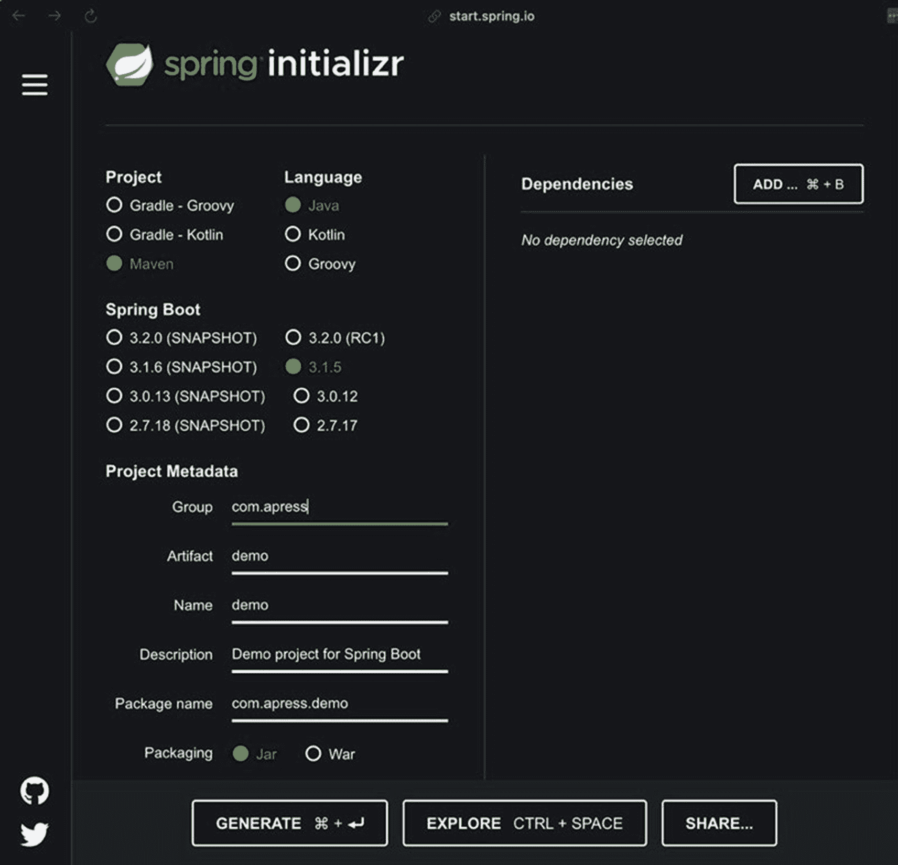
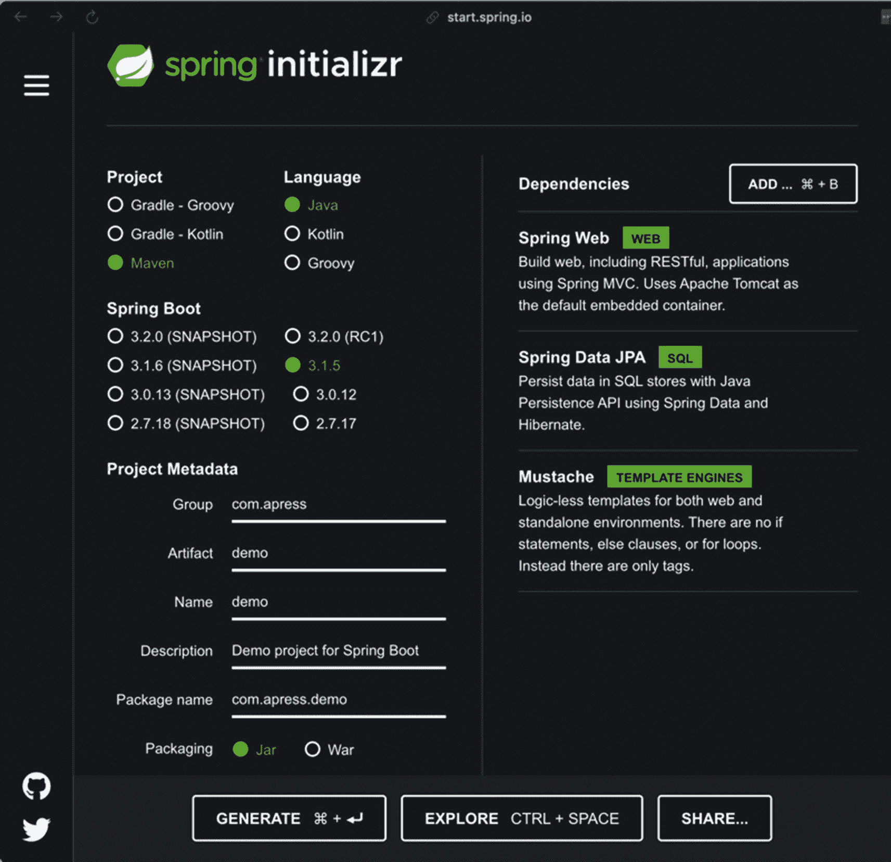

# 12. 后续步骤

到目前为止，我们已经了解了 Spring 和依赖注入，以及 Web 服务（特别是 REST 服务）、事务、持久化和安全性等主题。总的来说，这些很可能是 Spring 生态系统中“最重要的”部分，但我们仅仅触及了 Spring 生态系统本身的皮毛，更不用说那些使用 Spring 但不属于 Spring 项目的项目了。

在本章中，我们想探讨一些程序员在实际开发中可能会遇到的内容。这远非完整；一本涵盖所有内容的书需要多卷，而且最终仍会不完整：新的项目和功能一直在不断开发。

请注意，本章没有值得一提的代码。本章并非试图演示功能，即使是有限范围内的演示；在这里，我们只是指出更广泛的 Spring 生态系统中一些有趣的项目，并解决你可能一直在思考的一些开发问题。^(¹¹²) 因此，这些内容往往是作者们注意到在某些方面有趣或相关的东西，并且我们认为这些内容可能会在读者开发自己的项目时激发他们的兴趣。


## 对书籍的批评

在鄙人看来，书籍是开发者的绝佳资源，^(¹¹³) 但它们远非完美。

技术书籍最大的问题在于，它们往往目标定得太低。大多数书籍只展示代码片段，这取决于它们试图演示的内容或许可行，但对于任何实际应用而言，当你的部署代码库由数千行代码和数十个组件构成时，十行代码示例根本不够用。

因此，在本书中，我们尽可能选择展示**完整**的类，包括 `package` 和 `import` 语句，以消除代码归属的歧义。我们的意图是，你可以将本书的文本作为可用的参考；当我们展示的代码旨在执行时，你无需在查看某个片段时自行判断是否包含了所有内容（或正确的内容）。

我们还倾向于使用测试，而不是运行代码并手动检查输出。测试是你**确认**代码工作的方式；很容易在看到 `"Hello, wor1d"` 时忽略 `"world"` 中的数字 `1` 而非*字母* `l`。如果你足够仔细——并且你的字体足够清晰——你能发现它，但人类大脑非常擅长纠正所见以使其合理，所以如果你在“world”中嵌入了数字时读成“Hello, world”，这绝对无可指责。

测试不存在自动纠正结果为有效的问题。输出必须正确。如果你的测试使用了一个正则表达式——`"Hello, wor[1l]d"`——这将会通过，那么你可以在测试中看到，匹配器使用的正则表达式*可能*在确保输出符合预期方面毫无意义。

编写测试可能令人恼火，但它们应该是每个人都能掌握的工具。我们本可以在本书中进行**更多**测试，但我们追求的是在意图测试上取得良好平衡：如果一个服务应该能够以某种特定方式写入、读取、更新和删除数据，我们已尽力在测试中体现这些需求的某些合理方面。

我们尚未涉及测试的某些方面，比如性能（“该服务能否在三秒或更短时间内处理来自四百个用户的一千次更新，且内存影响为……​”），但这引出了书籍在知识传递方面的另一个问题：范围。

像本书这样的书籍必须在范围上有所限制，否则我们涵盖的内容就太多了。我们选择聚焦于 Spring 框架及其配套生态系统中你在实际开发中可能遇到的方面，以便你能对框架的预期行为以及真实项目的样子有一定信心。但若在某些方向上走得太远，就会涉及部署场景，这对于一本关于 **Spring** 的书籍来说过于宽泛……​除非我们至少再花几年时间写作，再加上几卷内容（导致像高德纳的《计算机程序设计艺术》^(¹¹⁴)那样——一套多卷本至今仍未完成，尽管始于 1968 年），不仅我们温和的出版商会反对这个想法，而且作者们也没有唐纳德·高德纳的才华。^(¹¹⁵)

我们还刻意避开了诸如“使用什么 IDE”之类的规定性决策，而是专注于与 IDE 无关的构建工具。你可以用 Notepad++、vim、emacs、IDEA、Eclipse、NetBeans……​任何能够以 Java 编译器可读的格式保存文本的工具来编写本书的代码。我们在写作时使用了 IDEA（包括编写章节内容，而不仅仅是代码），但我们本可以使用*任何*可行的工具，因为我们觉得告诉读者偏好某一种工具并无帮助，而涵盖*所有*选项也不可行。

想象一下，你在阅读时不得不看一张又一张 Eclipse 运行测试的截图……​然后是 IDEA 运行测试的截图（因为显示意图相似但不同）……​然后是 NetBeans。要求你们，我们的读者，忍受这一切实在太过分了，而且这对本书的价值增加甚微。

我们已尽力在脚注之外提供尽可能多的价值。^(¹¹⁶)

## Spring Initializr

你可能考虑的一个项目是 Spring Initializr，这是一个位于 [`https://start.spring.io/`](https://start.spring.io/) 的 Web 应用程序。这个应用程序可以生成一个 Spring 项目，并附带一组你可以直接从列表中选择的依赖项。

以下是 Initializr 首页可能的样子，在你选择了组 ID 和 Maven 作为构建系统之后（就像我们为本书可能做的那样，尽管我们并没有这样做）。



Spring Initializr 界面在 start dot spring dot io 的截图。它展示了各种项目设置，包括项目类型、Spring Boot 版本和项目元数据。未选择任何依赖项。底部有生成、探索和分享按钮。

图 12-1

Initializr 首页

选择依赖项将添加这些依赖项所需的一切，以便你的项目为这些依赖项进行**正确**的设置。例如，一个典型的应用程序（如第 5 章和第 6 章中可能找到的）可能包含 Spring Data JPA，以及 Spring Web 和 Mustache，而 Initializr 允许你通过一个简单的下拉菜单将这些全部作为直接依赖项包含进来。



Spring Initializr 界面在 start dot spring dot i o 的截图。它展示了各种项目设置，包括项目类型、Spring Boot 版本和项目元数据。依赖项部分列出了以下 3 个选项：Spring web, web；Spring data J P A, S Q L；Mustache, template engines。

图 12-2

选择依赖项

选择依赖项后，你可以使用“生成”按钮下载一个完整的可编译项目；用你选择的任何工具打开该项目，你现在就有了一个可用的平台，可以在此基础上构建世界一直在寻找的“下一个大事件”。

我们并没有为本书使用 Initializr，正如我们已经说过的，但我们当然可以这样做。如果你想知道 Spring 生态系统可能提供哪些功能，这是一个找到其中许多功能的绝佳场所。

当然，Spring 生态系统远不止 Initializr 所包含的内容：GitHub ([`https://github.com`](https://github.com)) 上有许多项目以 Spring 未曾尝试过的方式或不同的方式解决不同的问题。如果你在寻找 Spring 开发者尚未解决的问题，很可能有人已经做出了可行的尝试。


### 替代 JVM 语言

本书主要使用 Java，并借助 Maven 使用 XML 进行项目配置，还少量使用了一种通常被称为“Moustache”的模板语言。然而，JVM 上可用的语言*很多*，如果其他语言因某种原因更适合你，你完全*没有理由*将自己局限于 Java。

Spring 甚至通过针对自身进行调整的优化来支持其中大部分语言，因此你可以用 Groovy 或 Kotlin 等语言编写地道的代码，并实现我们用 Java 演示的所有功能。

推荐某种特定语言（当然，Java 除外）超出了本书的范围，但 Groovy 和 Kotlin 都是 Spring 的一等公民，你当然也可以利用 Scala 或 Clojure 等语言。Spring 作用于 JVM 上的*类*；它并不关心这些类是如何创建的。

这些语言各有优缺点。例如，Groovy 语法非常简洁，可以用很少的代码行添加大量功能，并且作为一种脚本语言，它往往表现力很强。Kotlin *感觉*很像 Java，但其语法通常也极具表现力（因为它旨在表示 Java 的语法树，而非 Java 的*语法*）。这两种语言与 Java 之间的互操作性通常*非常*高。

除了 Java 之外，你可能需要考虑的语言，按大致流行度排序如下：

1.  Kotlin ([`https://kotlinlang.org/`](https://kotlinlang.org/))

2.  Groovy ([`https://groovy-lang.org/`](https://groovy-lang.org/))

3.  Ruby ([`www.ruby-lang.org/`](http://www.ruby-lang.org/) 以及 JVM 上的 [`www.jruby.org/`](http://www.jruby.org/))

4.  Scala ([`www.scala-lang.org/`](http://www.scala-lang.org/))

5.  Clojure ([`https://clojure.org/`](https://clojure.org/))

## Spring WebMVC.fn

在第 6、7 和 10 章中，我们探讨了如何使用 WebMVC（Spring 用于创建 HTTP 端点的项目）。函数式端点 ([`https://docs.spring.io/spring-framework/reference/web/webmvc-functional.html`](https://docs.spring.io/spring-framework/reference/web/webmvc-functional.html)) 在 Spring 5 中作为 Spring WebMVC.fn 引入，并在版本 6 中与 Spring Web MVC 完全集成。

函数式端点模型提供了一种使用函数来路由和处理请求的方法，并设计为不可变。它在 Spring 内部提供了一种“领域特定语言”方法，作为基于注解方法的替代方案，但仍运行在同一个 `DispatcherServlet` 上。

领域特定语言（简称 DSL）是一种专门针对特定应用领域的语言或语法子集。

像 Java 这样的语言非常通用，但用 Java 编写的代码可以很容易地针对特定领域；例如，你可以创建一个 `Door` 的抽象，它知道如何 `open` 或 `close` 自身。

然而，你仍然在用 Java 表达这些操作。开关门是一个本质上简单的建模过程，但考虑一下模拟电子信号的例子；用 Java 代码表达具体的电子学概念很容易，但对工程师来说，Java 代码会包含各种工程师不需要且可能不理解的多余信息。

另一方面，DSL 通常被设计为紧密贴合其所描述的问题空间，理想情况下，工程师应该能够阅读“电子学 DSL”，而无需处理太多底层编程语言。

JVM 上 DSL 的流行示例包括 Gradle（使用 DSL 在 Groovy 或 Kotlin 中构建项目）、JavaFX 和 Processing（参见 [`https://processing.org/`](https://processing.org/)）。当然，还有很多很多——包括 `WebMVC.fn` 本身。但你已经知道了，因为我们一开始就将 WebMVC.fn 描述为一种 DSL！

不过，你无需在 `Component` 中映射端点，而是创建**另一个**类型为 `RouterFunction<ServerResponse>` 的 bean，它提供了一个便捷的流式 API，用于创建处理 `GET` 请求、`POST` 请求、过滤等操作的端点。

以下是一个代码示例片段。

```
@Bean
RouterFunction routes(PersonHandler ph) {
return route()
.GET("/people", ph::handleGetAllPeople)
.GET("/people/{id}", ph::handleGetPersonById)
.POST("/people", ph::handlePostPerson)
.filter((serverRequest, handlerFunction) -> {
try {
log.info("entering HandlerFilterFunction");
return handlerFunction.handle(serverRequest);
}
finally {
log.info("exiting HandlerFilterFunction");
}
})
.build();
}
列表 12-1
WebMVC.fn 路由配置示例
```

这需要一点时间来适应，部分原因是 Java 在创建领域特定语言方面不如 Scala、Kotlin 或 Groovy 等编程语言灵活，因此 DSL 并不像它可能达到的那样简洁——它会包含 Java 特有的东西，如 lambda 表达式、方法引用和具体类型声明，正如你从列表 12-1 中看到的那样。

然而，WebMVC.fn 确实允许你集中管理端点配置。如果你目前有 17 个不同的类充当 `Controller` 对象，WebMVC.fn 允许你将它们改回普通的 `Component` 类——并拥有一个配置所有端点的位置，而不是迫使程序员去追踪这 17 个类中哪一个实际提供了特定端点。

这是一个有价值的目标吗？老实说，是的（或者，嗯，“也许”）；一个好的设计能让你轻松地在端点和特定的 `Controller` 之间建立映射，但让 `Controller` 对象自行处理其端点构建意味着它们对应用程序的整体设计和部署拥有比可能应有的更广泛的可见性。

归根结底，这是一个次要的设计决策（毕竟，Web MVC 现在也能工作，你可以像 WebMVC.fn 那样手动注册端点，只是需要更多代码并且使用地道的 Java 方式），但这仍然是一个巧妙的想法。即使没有 WebMVC.fn，你仍然可以实现类似的功能（通过在一个中心位置注册端点，但没有 WebMVC.fn 的 DSL），但 DSL 使其比原本可能的方式方便得多。

像往常一样，Spring 提供了灵活性，使你几乎可以按照任何你喜欢的方式设计应用程序。


## Spring Reactive

响应式编程可以简单地概括为“使用异步数据流进行编程”。^(¹¹⁷)

我们在之前的示例代码中已经看到，数据流比传统的循环和其他类似的迭代机制更受青睐（特别是在第 3、8 和 9 章中）。传统数据流与响应式数据流的主要区别在于，响应式代码通常拥有异步数据源，因此数据流通常没有明确的终点。

在传统的流式模型中，存在一个数据收集阶段——你需要获取一个`Artist`或`Song`实例的列表——当你拥有所有这些实例时，**然后**才能处理它们。检索实例是一个**阻塞操作**，它代表代码中的一个位置，在该阻塞操作完成之前，代码无法继续执行。

另一方面，正如我们所说，响应式编程是异步的：我们可能会指示想要获取一个实例列表，并**当它们可用时**，对它们执行某些操作。我们不会在等待数据源返回实例时阻塞代码的执行；而是设置好处理实例的机制，然后退出。

在实践中，这往往会带来令人难以置信的性能提升，因为一次数据库调用（例如）可能意味着给定线程暂停十毫秒；而使用响应式编程，则完全没有暂停。该线程可以被用来做其他事情。

当然，代价是你必须编写代码来使用响应式模型。在本书中，我们一直倾向于这种方向，强调 lambda 表达式和数据流，但对许多 Java 程序员来说，这仍然是一种相对较新的方法——尽管它早在 2014 年就随 Java 8 一起引入了。

在 Spring 5 中，Spring 提供了一个`spring-webflux`模块，它几乎可以作为 WebMVC 的直接替代品。^(¹¹⁸) Spring Web Reactive 适配了 Web MVC 中的概念，并将其迁移到响应式模型中，包括可以选择指定**不必**在输入或输出上阻塞的输入和输出；你可以利用这一点，在数据点可用时提供一系列数据点（如股票行情价格）——无论是作为输入**还是**输出——只需将类型从例如`Artist`更改为`Flux<Artist>`即可。

如果第一次阅读时觉得这听起来很复杂，别担心——它确实不简单。然而，如果你能编写使用 WebMVC 的代码，那么迁移到 Spring Web Reactive 并随着你理解如何利用响应式模型来添加功能和提升性能是相当容易的。

甚至还有一个`spring-boot-starter-webflux`可以方便地与 Spring Boot 一起使用——如果你打算使用 Spring Reactive，这可能是你应该采用的方式。

## 消息队列与 Spring

消息队列是一种异步的服务间通信形式。^(¹¹⁹) 在队列架构中，有三个基本组件：

*   一个主机应用程序，如 RabbitMQ ([`www.rabbitmq.com`](http://www.rabbitmq.com))、ActiveMQ ([`https://activemq.apache.org/`](https://activemq.apache.org/)) 或 Artemis ([`https://activemq.apache.org/components/artemis/`](https://activemq.apache.org/components/artemis/)，它本身也是一个 ActiveMQ 项目)

*   一个生产者（向主机应用程序发送消息的组件）

*   一个消费者（从主机应用程序检索消息的组件）

请注意，一个给定的服务既可以作为生产者也可以作为消费者，这实际上非常常见；此外，生产者不限于一种生产类型，也不限于一种消费类型。

在队列系统中有两种主要的消息模型：发布/订阅（或“pub/sub”）和点对点（或“PtP”）。

这两种模型在消息传递方式上有所不同：

*   在发布/订阅模型中，消息会立即传递给每个可用的消费者。这种消息流通常被称为“主题”（这确实是 Java 消息服务对发布/订阅队列的称呼方式）。

*   在点对点模型中，无论有多少消费者在监听给定的消息流，消息都只会分发给一个且仅一个消费者；这种消息流也被称为“队列”，以区别于主题。消息如何分配给消费者由队列本身决定——但通常消息会按照“轮询”算法进行分发，这意味着消息**通常**会在可用的监听器之间均匀分配。

聊天室是主题的一个很好的例子；一个人的消息会发送给消息发送时恰好在该房间内的其他所有人。

异步日志服务是队列的一个很好的例子；生产者生成一条日志消息并将其发送到消息服务，在那里，多个可能的监听器中的一个会检索该消息并决定如何处理它。

如前所述，Java 有一个用于处理消息队列的标准规范，称为 Java 消息服务（或“JMS”）。JMS 就像 JDBC：该规范涵盖了 API 的使用方式，但不涉及 API 的工作原理。你需要为每个给定的消息队列主机使用一个 JMS 库；ActiveMQ 有一个，RabbitMQ 也有自己的一个。（对于 RabbitMQ，请参阅[`www.rabbitmq.com/jms-client.html`](http://www.rabbitmq.com/jms-client.html)了解如何通过 JMS 访问 RabbitMQ。）

Spring 也有一个用于处理 JMS 的模块，`spring-amqp`；特别是，它提供了`JmsTemplate`类，以及诸如`@JmsListener`之类的注解，使得组件能够以相当少的努力从队列或主题中检索消息（更多详情请参阅[`https://spring.io/guides/gs/messaging-jms/`](https://spring.io/guides/gs/messaging-jms/)）。你仍然需要配置主机连接，但之后，使用队列或主题就只是使用`JmsTemplate.send()`方法的问题了（尽管`JmsTemplate`类实际上**极其**灵活，而且你很可能永远不会单独使用`send()`，因为还有其他方法可能更完全地适合特定场景）。

RabbitMQ 在这里实际上值得特别一提。

大多数消息传递提供者使用高级消息队列协议 1.0 版本，即 AMQP ([`www.amqp.org`](http://www.amqp.org))。然而，RabbitMQ 默认使用 AMQP 0.9，并且 RabbitMQ 的 JMS 客户端旨在与 RabbitMQ 的消息服务协同工作。

不过，你是有选择的：你可以随时将 AMQP 1.0 作为插件安装到 RabbitMQ 中，或者你可以直接从 Spring 使用 AMQP 0.9，使用由`spring-rabbit`依赖提供的`RabbitTemplate`，这大致相当于由`spring-amqp`模块提供的`JmsTemplate`。

为什么要使用消息队列？它们非常适合大规模扩展和事务性的异步操作；以银行交易为例。通常，当你对银行账户进行扣款时，银行会存储一组操作（取款和存款）并在特定时间过账；由于消息队列可以是事务性的，失败的操作可以被重新处理，直到成功处理为止。除了使复杂的架构变得相当易于使用（因为进程具有简单的输入和输出）之外，点对点场景中消费的事务性本质使得代码**安全**。^(¹²⁰)


## GraphQL

在第 6 章中，我们提到了表述性状态传递（REST），这是一种通过 HTTP 处理数据模型的常见且流行的方法。REST 通常相当简单；其最困难之处在于创建从外部 API 角度而言合理的端点。（另一个棘手的问题是如何处理端点的版本控制，以便在情况发生变化时，你仍需支持“旧方式”。）

例如，我们是通过`Artist`引用还是按标题来访问`Song`实例？使用歌曲标题更有意义，因为同一歌曲标题可能被多位艺术家使用……但这样一来，如何引用特定艺术家创作的歌曲呢？当然，为了本书的写作目的，我们有令人满意的答案，但在更复杂的模型中，诸如此类的问题可能不那么容易回答。

此外，REST 端点往往相当粗粒度；如果你请求一个`Song`，通常你会得到该`Song`的所有属性，无论请求是否需要。你显然可以调整 REST 请求的输出，使其不包含所有属性（就像我们在创建自动补全服务时那样），但通常创建投影^(¹²¹)需要创建额外的对象类来表示投影，这对大多数项目来说最终会变成大量工作（尽管投影可能比返回大型对象高效得多）。更简单的做法是直接返回庞大的对象，尽管这可能会影响处理速度和网络传输时间。

返回“庞大对象”是坏事吗？嗯……和往常一样，这取决于具体情况。如果对象能以序列化形式用相对较小的空间表示，那可能没什么问题，尤其是当它只需几千字节就能表示时。

一个网络数据包——实际上是数据段——的大小通常在 1500 字节左右，其中大约 1400 字节可供应用程序使用；其余部分构成数据包的头部和其他元数据。如果对象的序列化形式能放入一两个网络数据包，那么**可能**不必担心传输了额外数据。

当然，如果你要处理数百万个这样的请求，而你的数据占用了**两个**网络数据包，但你只需要传输其中的**部分**数据……那么，将结果精简到更小规模或许更具成本效益。

或者，当然，也可以考虑使用像 GraphQL 这样的库。

GraphQL（[`https://graphql.org/`](https://graphql.org/)）是一种查询语言和库，旨在与 API 配合使用，使得客户端能够实际定义需要请求哪些属性，并且可以指定返回数据的**图**结构。

在我们的音乐网关示例中，如果我们想要所有相关数据，可能需要两个端点来获取一个`Artist`以及该艺术家的每首`Song`。使用 GraphQL，我们可以构建一个请求，同时请求两组数据（`Artist`和相关的`Song`对象），并且可能只包含两种对象类型中的特定属性，而不是**所有**属性。

由于这是通过**查询语言**完成的，API 设计者甚至不必预先预料应该包含哪些字段，或者结果图应该是什么样子。（当然，API 的消费者必须知道返回了什么；**消费者**必须了解数据，但这正是消费者首先指定数据性质的原因。）

程序员只需定义哪些字段和对象**可能**可用，然后使用 GraphQL 库来处理请求的输入和输出。

由于查询语言实际上与对象模型分离，因此在不更改客户端代码的情况下向端点添加功能变得轻而易举；客户端会请求它们需要的数据，而 API 中**额外**数据的存在不会造成影响。

那么，这是否意味着程序员应该抛弃他们陈旧过时的 REST 端点，转而使用 GraphQL 呢？

可能不是。GraphQL 和其他许多事物一样，是一个有用的工具；它意味着客户端在了解要请求哪些数据方面承担着一定的责任，但情况并非总是如此。事实上，作者认识的一位开发者在多个环境中遇到过将 GraphQL 当作“魔法酱料”使用的情况——结果却不得不将其移除，并在项目中看到了好处。这并不意味着 GraphQL**不好**——这只意味着 GraphQL 是一个工具，和大多数其他工具一样，需要在适当的环境和条件下使用。在那些条件下，GraphQL 可以**非常**有用；当这些条件不具备时，它就像给鱼配自行车一样不切实际。

GraphQL 的 Java 库可以在[`https://github.com/graphql-java/graphql-java;`](https://github.com/graphql-java/graphql-java%3B)找到；还有一个用于 GraphQL 的 Spring Boot 启动器，位于[`www.graphql-java-kickstart.com/spring-boot/`](http://www.graphql-java-kickstart.com/spring-boot/)。

### 云部署

本书一直专注于在 Java 虚拟机中部署应用程序。然而，它没有涉及的一个问题是虚拟机实际运行在哪里；在测试中，你是在本地 JVM 上运行，但现代开发的现实是，许多公司在别人的硬件上运行他们的应用程序。

这带来了足够的复杂性，以至于*每个远程提供商*都值得用一本专门的书籍来介绍其能力和注意事项。虽然可以将功能从一个提供商抽象到另一个（每个提供商都提供了一种运行虚拟机的方式，你可以在上面安装任何你愿意管理的服务），但要真正利用 Azure（[`https://azure.microsoft.com/`](https://azure.microsoft.com/)）、AWS（[`https://aws.amazon.com/`](https://aws.amazon.com/)）或 GCP（[`https://cloud.google.com/`](https://cloud.google.com/)），你实际上会希望这些提供商尽可能多地管理你的应用程序。

例如，你可以使用 Artemis 或 RabbitMQ 设置自己的消息队列系统……但 AWS 有简单队列服务^(¹²²)（以及其他服务），GCP 有 PubSub，^(¹²³)而 Azure 有 Azure Messaging。^(¹²⁴)

每个提供商还提供不同的数据存储，无论是基于云的关系型数据库（如 MySQL 或 Postgres），还是其他 NoSQL 或 SQL 相关技术（如 DynamoDB、MongoDB 或 BigQuery）。

功能列表*非常*广泛：这仅仅是触及了人们可能*首先*寻找的内容的表面。

Spring 有一个项目，Spring Cloud（[`https://spring.io/projects/spring-cloud`](https://spring.io/projects/spring-cloud)），旨在帮助协调这些服务，无论是在消费还是部署方面。该项目的大部分内容侧重于应用程序层面的问题（“我如何消费内容，或协调服务”），但也可能有助于解决可管理性或部署等问题。


### 性能指标

正如我们在本章开头所指出的，本书几乎完全聚焦于功能性需求：某个给定的服务能否完成这些任务？

我们尚未提出的问题是：“某个给定的服务能否在给定的负载下完成这些任务？”——换句话说，某个给定的服务有多快，或者其可扩展性如何？

对我们而言，衡量可扩展性有两种方式：“垂直”扩展和“水平”扩展。不同的人可能会使用不同的坐标轴或术语，但这些概念是通用的。

对我们来说，垂直可扩展性指的是“服务有多快？”如果某个方法——`methodA()`——执行需要 400 毫秒，而另一个方法（`methodB()`）执行需要 750 毫秒，那么第一个方法（`methodA()`）的“垂直可扩展性”就优于第二个方法。

水平可扩展性指的是“在给定时间内，有多少个这样的调用可以成功执行？”如果 `methodA()` 一次只能在*一个线程*中被调用，但 `methodB()` 可以同时被四百个线程调用，那么 `methodB()` 的水平可扩展性就远优于 `methodA()`。

这两个坐标轴是协同工作的。假设我们有四个线程分别调用每个方法。

第一个线程调用 `methodA()`——需要 400 毫秒才能返回一个值。**第二个**线程对 `methodA()` 的调用*必须等待第一个线程的调用完成*——因此，如果它们同时启动，第一个线程将在 400 毫秒内得到结果，但*第二个*线程将在 *800 毫秒*内得到结果，这包括第一个线程获取数据所需的时间，再加上获取第二个线程结果所需的时间。假设没有其他因素干扰执行时间，第三个线程的经过时钟时间为 1200 毫秒，第四个线程的经过时钟时间为 1600 毫秒。

现在，我们对 `methodB()` 进行同样的操作，它耗时更长（750 毫秒而非 400 毫秒），但现在每个线程可以并发地获取其结果——也就是说，第一、第二、第三和第四个线程都在 750 毫秒内得到了它们的响应。

`methodB()` 调用速度较慢，但具有更好的水平可扩展性；`methodA()` 速度更快，但水平可扩展性很差。

在本书中，我们试图设计代码以保持水平可扩展性，但我们完全没有对此进行测试，这主要是因为水平可扩展性完全由实际应用程序所需的性能类型决定。应用程序是否需要扩展到数十个用户？还是数百万个？为数百万并发用户设计的代码看起来会*非常*不同于为十个用户设计的代码，测试工具也会相当不同。

注意

很容易找到一些库，它们的教程会说：“这是如何用我们的技术构建 Twitter^(¹²⁵) 的方法”，这些教程可能非常有用。但与此同时，Twitter 的性能要求不仅*令人难以置信*，而且*复制*起来也极其困难，据作者所知，很少有教程能够*以任何方式*经受住 Twitter 实际部署要求的考验。很少有教程能解决大型社交媒体网站必须面对的水平可扩展性问题。

像 TestNG（[`https://testng.org/`](https://testng.org/)，本书中使用）和 JUnit5^(¹²⁶) 这样的测试框架可以*帮助*测试水平和垂直可扩展性，但你也需要在某个时候考虑使用像 Apache JMeter（[`https://jmeter.apache.org/`](https://jmeter.apache.org/)）这样的工具来生成测试场景，以考验水平能力。

### 其他开发者

本书旨在成为作者与您之间的一次对话，这很大程度上是单向的，因为一本书是静态信息的汇编。这可能是有效的（书籍也是作者最初学习的方式！），但这并非学习的终点。

我们鼓励您在任何您觉得方便的论坛上寻找其他开发者，并与他们*交流*。无论是本地的 Java 用户组（[`https://dev.java/community/jugs/`](https://dev.java/community/jugs/) 是一个不错的起点），还是 StackExchange、Quora、IRC、Google Groups、Facebook，或者……嗯，*任何*平台，真的，开发者通常对编程的艺术和技能感兴趣，并且大多数人都愿意教学（和学习）。Java 社区*无疑是*其最强大的工具。其知识量令人难以置信，而且很容易找到有动力的开发者来为您正在做的任何事情做出贡献。^(¹²⁷)

提出问题！没有人会因为你不懂某事而责备你。（如果他们这样做了，嗯，我们提前为他们的行为道歉——并非每个人在每种情况下都表现完美。）

同时，也要提供答案，即使你缺乏信心——你也可以从专家那里学到为什么你的答案可能不正确，正如我们在本书开头所说，能工作的代码总比不能工作的代码好，即使你的答案可能并不完美。

做到这两点，都将为人类可用的知识海洋做出贡献——这是我们可以拥有的最高使命之一。

## 接下来是什么？

我们希望您喜欢学习更多关于 Spring（以及，偶尔，*不止* Spring）的知识。我们已经涵盖了 Spring 的基础知识，包括它为何被编写以及为何仍然存在，以及它今天如何仍然影响着 Java 开发者。我们还涵盖了使用 Spring 通过网络提供内容，以及如何与多种数据源交互；我们还讨论了如何识别用户并根据其身份和角色限制他们能做什么。最后，我们开始温和地超越 Web、持久化和安全性，去探索更广阔的 Spring 生态系统。

现在轮到您了：用 Spring 开发令人着迷的应用程序！让世界变得更美好，并告诉世界您做了什么以及是如何做到的。我们会在那里看着并为您加油。


脚注 1   2   3   4   5   6   7   8   9   10   11   12   13   14   15   16 索引 A Acegi Security 系统 ActiveMQ 基于注解的 Web 应用 Maven pom.xml Servlet，添加 Spring 上下文独立工作 Servlet ApplicationContext ApplicationContext getBean() 方法 artistData() 方法 @Autowired 注解 @Autowired SongNameNormalizer B Band Gateway 应用 批处理配置 CSV 文件 特性 处理/监听 Bean 注解，配置 @Autowired 组件 构造器注入 @Qualifier 和 Bean 名称 乐队网关 代码 注解，配置 API API 类 注解，配置 构建模型 Music Service API 标准化器接口 容器 Java 配置 ApplicationContext @Autowired @Bean，声明组件 构造器注入 DataProvider @Qualifier 示例应用 XML 配置 声明 Bean <property />，连接组件 buildAnnotationContext() 方法 build() 方法 C 中央认证服务 (CAS) @Component 注解 上下文与依赖注入 (CDI) @ContextConfiguration 注解 D @DataProvider 依赖注入 HelloWorldBean J2EE hello world JNDI 数据集名称 服务 小部件 依赖注入框架 doGet() 方法 E, F 企业 Java Bean (EJB) @EntityScan 注解 equals() 方法 G getNonexistentId() 方法 Gradle GraphQL 云部署 开发者 性能指标 查询语言 REST 端点 Groovy H handleArtistNotFound() HasData “Hello, World!” 应用 构建 Maven Maven 安装 项目 编程语言 Spring 面向痛苦编程 测试 I iterateOverModel() J, K, L Jakarta EE CDI 容器 实现 Java EE 现代 Web 应用 设计原则 模块结构 基于注解的 Web 应用 通用模块 Gradle 请求/响应交互模型 Servlet API 基于 XML 的 Spring 上下文应用 Java Bean Java 企业版 (“JavaEE”) Java 持久化 API (JPA) Java 虚拟机 JdbcTemplate 访问数据 实际 MusicRepository MusicRepository query() 测试 MusicRepository @Transactional 注解 数据访问设施 数据模型 实体模型 MusicService 项目设置 REST 端点 ArtistController SongController SQL 优先访问模型 @JsonIgnore JSR-250 注解 注解类，构造器 调用方法 特性 作用域 M Maven 消息队列 微容器 模型-视图-控制器 (MVC) 架构 定义 端点 项目目录 模块化应用 模块 艺术家包 文档 驱动模块化领域设计 Song 和 SongRepository Spring Boot 应用 验证 MongoDB musicServiceTests N NetBeans @NonNull 标准化器 O oauth2Login() 方法 对象/关系映射 (ORM) P @PathVariable 注解 @PostConstruct @PostMethod @PreDestroy Q @Qualifier 注解 Querydsl R RabbitMQ 响应式编程 render() 方法 表述性状态转移 (REST) @RequestMapping @RequestParam reset() 方法 runMethod() 方法 S saveArtist() 方法 @Scope 注解 安全 认证 授权 自定义目录结构 Frank 的数据 Lambda 风格 DSL 模块与需求 项目目录 REST 应用 @Bean 类 创建 @RestController 目录结构 集成 OAuth JPA 测试 TestRestTemplate 类 测试 service() 方法 Servlet API 单一访问方法 Spring EJB J2EE Java EE Rod/Juergen 搭建舞台 Spring 6 现代 Java Spring Boot ArtistService ArtistService/Little 控制器，实现 检查 构建基础 应用 构建传输对象 配置 “Hello” 静态内容 测试 数据库连接 定义 处理异常 初始化数据 微容器 设置项目 spring-webmvc TestArtistController 类 Spring Data 架构 功能 模式 JPA 项目结构，创建 BaseArtistRepository BaseEntity 接口 BaseMusicService BaseSong 构建脚本 组件 创建目录，POSIX CrudRepository 数据设计 语法 JPA 项目 MongoDB 测试项目 WildcardConverter Spring Initializr 依赖 JVM 语言 Spring 生命周期 调用构造器 调用方法 依赖注入框架 Java 配置 监听器 作用域 Spring Tool Suite Spring Web SQL 优先访问模型 SQL LOWER() 函数 T TestNG testSongVoting() 方法 Threadbare Loaf 传统 J2EE 方法 @Transaction 注解 transform() 方法 U, V userDetailsService() 方法 W, X, Y, Z Web 归档 WebMVC
