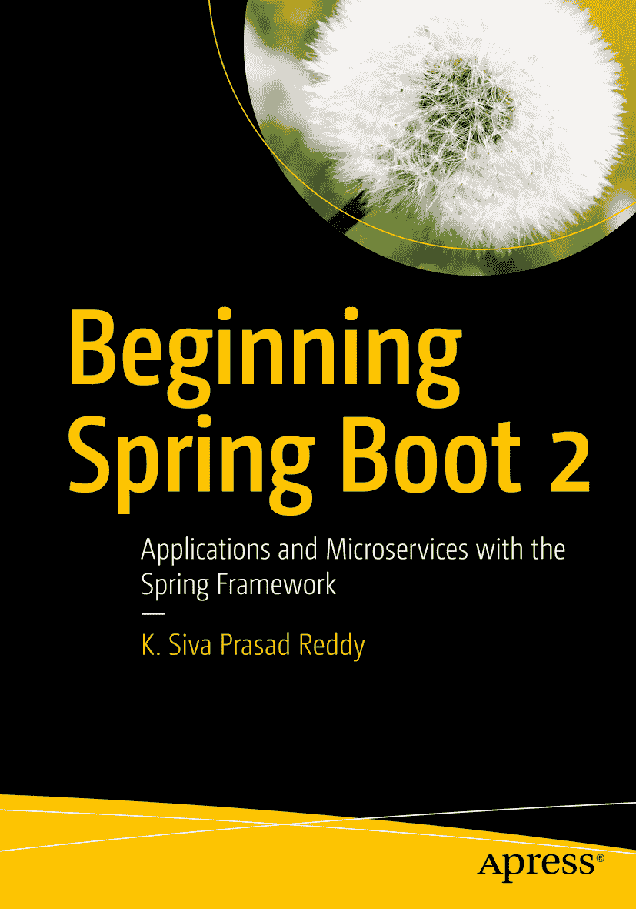

K. Siva Prasad Reddy 著 《Spring Boot 2 实战：使用 Spring 框架构建应用与微服务》

本书作者引用的任何源代码或其他补充材料，读者均可通过本书产品页面（位于 [`www.apress.com/9781484229309`](http://www.apress.com/9781484229309) ）上的 GitHub 获取。如需更详细信息，请访问 [`http://www.apress.com/source-code`](http://www.apress.com/source-code) 。  
ISBN 978-1-4842-2930-9  
e-ISBN 978-1-4842-2931-6  
[`doi.org/10.1007/978-1-4842-2931-6`](https://doi.org/10.1007/978-1-4842-2931-6)  
美国国会图书馆控制号：2017955551  
© K. Siva Prasad Reddy 2017  
本作品受版权保护。出版商保留所有权利，无论是全部还是部分材料，特别是翻译、重印、插图复用、朗诵、广播、微缩胶片复制或任何其他物理形式、信息存储与检索的传输与电子改编、计算机软件，或目前已知或未来开发的任何类似或不同方法的权利。  
本书中可能出现商标名称、徽标和图像。我们不会在每个商标名称、徽标或图像出现时都使用商标符号，而是仅以编辑方式使用这些名称、徽标和图像，以维护商标所有者的利益，无意侵犯商标权。  
本书中使用的商品名称、商标、服务标志及类似术语，即使未明确标识，也不应被视为对其是否受专有权利保护的立场表达。  
尽管本书中的建议和信息在出版时被认为是真实准确的，但作者、编辑和出版商均不对可能出现的任何错误或遗漏承担法律责任。出版商对本书所含材料不作任何明示或暗示的担保。  
印刷于无酸纸上  
全球图书贸易由 Springer Science+Business Media New York 发行，地址：233 Spring Street, 6th Floor, New York, NY 10013。电话：1-800-SPRINGER，传真：(201) 348-4505，电子邮件：orders-ny@springer-sbm.com，或访问 www.springeronline.com。  
Apress Media, LLC 是加利福尼亚州有限责任公司，其唯一成员（所有者）是 Springer Science + Business Media Finance Inc (SSBM Finance Inc)。SSBM Finance Inc 是特拉华州公司。

## 引言

Spring 是构建企业级应用最流行的基于 Java 的框架。Spring 框架提供了丰富的项目生态系统，以满足现代应用的需求，例如安全、简化关系型和 NoSQL 数据存储的访问、批处理、与社交网站的集成、大量数据流的处理等。由于 Spring 是一个非常灵活且可定制的框架，通常有多种方式来配置应用。虽然拥有多种选择是件好事，但对于初学者来说可能会感到不知所措。Spring Boot 通过其强大的自动配置机制，解决了“Spring 应用需要复杂配置”这一问题。

Spring Boot 是一个遵循“约定优于配置”方法的固执己见的框架，有助于快速、轻松地构建基于 Spring 的应用。Spring Boot 的主要目标是快速创建基于 Spring 的应用，而无需开发人员反复编写相同的样板配置。

近年来，微服务架构已成为构建复杂企业应用的首选架构风格。Spring Boot 是使用各种 Spring Cloud 模块构建基于微服务的应用的绝佳选择。

本书将帮助您理解什么是 Spring Boot，Spring Boot 如何帮助您快速轻松地构建基于 Spring 的应用，以及通过易于理解的示例了解 Spring Boot 的内部工作原理。

## 本书涵盖内容

本书涵盖以下主题：

*   什么是 Spring Boot，它如何提高开发人员生产力？
*   Spring Boot 自动配置在幕后是如何工作的？
*   如何创建自定义的 Spring Boot Starter？
*   使用 JdbcTemplate、MyBatis、JOOQ 和 Spring Data JPA 操作数据库
*   使用 MongoDB NoSQL 数据库
*   使用 Spring Boot 和 Thymeleaf 开发 Web 应用
*   使用 Spring WebFlux 开发响应式 Web 应用
*   使用 Spring Boot 开发 REST API
*   使用 Spring Security 保护 Web 应用
*   使用 Spring Boot Actuator 监控 Spring Boot 应用
*   测试 Spring Boot 应用
*   使用 Groovy、Scala 和 Kotlin 开发 Spring Boot 应用
*   在 Docker 容器中运行 Spring Boot 应用

## 本书所需环境

要学习本书中的示例，您必须安装以下软件：

*   JDK 1.8
*   您喜欢的 IDE
    *   Spring Tool Suite
    *   IntelliJ IDEA
    *   NetBeans IDE
*   构建工具
    *   Maven
    *   Gradle
*   数据库服务器
    *   MySQL
    *   PostgreSQL

致谢

我要感谢我的妻子 Neha Jain 和我的家人，在我撰写本书的整个过程中给予的持续支持。

我要向 Apress 团队，特别是 Steve Anglin 和 Mark Powers，在整个过程中给予的持续支持表示衷心的感谢。我还要感谢审阅者提供的宝贵反馈，这些反馈有助于提高内容的质量。

目录 第 1 章：Spring Boot 简介 1 Spring 框架概述 1 Spring 配置风格 2 使用 SpringMVC 和 JPA 开发 Web 应用程序 3 快速体验 Spring Boot 16 简易依赖管理 19 自动配置 19 嵌入式 Servlet 容器支持 19 小结 20 第 2 章：Spring Boot 入门 21 什么是 Spring Boot？ 21 Spring Boot Starter 21 Spring Boot 自动配置 22 优雅的配置管理 22 Spring Boot Actuator 22 易用的嵌入式 Servlet 容器支持 22 你的第一个 Spring Boot 应用程序 23 使用 Spring Initializr 23 使用 Spring Tool Suite 24 使用 IntelliJ IDEA 25 使用 NetBeans IDE 26 探索项目 26 应用程序入口点类 31 使用 Spring Boot Maven 插件生成 Fat JAR 32 使用 Gradle 的 Spring Boot 32 Maven 还是 Gradle？ 33 小结 33 第 3 章：Spring Boot 自动配置 35 探索 @Conditional 的强大功能 35 基于系统属性使用 @Conditional 36 基于 Java 类的存在/缺失使用 @Conditional 38 基于已配置的 Spring Bean 使用 @Conditional 38 基于属性配置使用 @Conditional 39 Spring Boot 内置的 @Conditional 注解 40 Spring Boot 自动配置的工作原理 42 小结 45 第 4 章：Spring Boot 要点 47 日志记录 47 外部化配置属性 49 类型安全的配置属性 49 宽松绑定 50 使用 Bean Validation API 验证属性 50 开发者工具 51 小结 53 第 5 章：使用 JdbcTemplate 55 不使用 Spring Boot 使用 JdbcTemplate 55 使用 Spring Boot 使用 JdbcTemplate 58 初始化数据库 58 使用其他连接池库 62 使用 Flyway 进行数据库迁移 63 小结 64 第 6 章：使用 MyBatis 65 使用 Spring Boot MyBatis Starter 65 小结 69 第 7 章：使用 JOOQ 71 JOOQ 简介 71 使用 Spring Boot 的 JOOQ Starter 72 配置 Spring Boot JOOQ Starter 73 数据库模式 73 使用 JOOQ Maven Codegen 插件生成代码 74 将 JOOQ 生成的代码添加为源文件夹 76 领域对象 77 使用 JOOQ DSL 77 小结 82 第 8 章：使用 JPA 83 Spring Data JPA 简介 83 将 Spring Data JPA 与 Spring Boot 结合使用 85 添加动态查询方法 88 使用排序和分页功能 88 使用多个数据库 89 为多数据源使用 OpenEntityManagerInViewFilter 96 小结 97 第 9 章：使用 MongoDB 99 MongoDB 简介 99 安装 MongoDB 100 在 Windows 上安装 MongoDB 100 在 MacOS 上安装 MongoDB 101 在 Linux 上安装 MongoDB 101 使用 Mongo Shell 开始使用 MongoDB 101 Spring Data MongoDB 简介 102 使用嵌入式 Mongo 进行测试 105 小结 106 第 10 章：使用 Spring Boot 开发 Web 应用程序 107 SpringMVC 简介 107 使用 Spring Boot 开发 Web 应用程序 109 使用 Tomcat、Jetty 和 Undertow 嵌入式 Servlet 容器 112 自定义嵌入式 Servlet 容器 114 自定义 SpringMVC 配置 115 将 Servlet、Filter 和 Listener 注册为 Spring Bean 116 将 Spring Boot Web 应用程序部署为 WAR 包 119 Spring Boot 支持的视图模板 120 使用 Thymeleaf 视图模板 121 使用 Thymeleaf 表单 122 表单验证 124 文件上传 128 使用 ResourceBundle 实现国际化 (i18n) 128 用于 Hibernate 验证错误的 ResourceBundle 129 错误处理 130 小结 132 第 11 章：使用 Spring Boot 构建 REST API 133 RESTful Web 服务简介 133 使用 SpringMVC 构建 REST API 134 CORS（跨域资源共享）支持 144 通过 RESTful 服务暴露具有双向引用的 JPA 实体 146 使用 Spring Data REST 构建 REST API 149 排序与分页 151 Spring Data REST 中的 CORS 支持 153 异常处理 153 小结 155 第 12 章：使用 Spring WebFlux 进行响应式编程 157 响应式编程简介 157 响应式流 158 Project Reactor 158 使用 Spring WebFlux 构建响应式 Web 应用程序 159 基于注解编程模型的 WebFlux 160 基于函数式编程模型的 WebFlux 163 Thymeleaf 响应式支持 169 响应式 WebClient 172 测试 Spring WebFlux 应用程序 173 小结 174 第 13 章：保护 Web 应用程序 175 Spring Boot Web 应用程序中的 Spring Security 175 实现“记住我”功能 184 基于简单哈希的 Cookie 令牌 184 持久化令牌 186 跨站请求伪造 187 方法级安全 188 使用 Spring Security 保护 REST API 190 小结 195 第 14 章：Spring Boot Actuator 197 Spring Boot Actuator 简介 197 探索 Actuator 的端点 199 /info 端点 200 /health 端点 201 /beans 端点 201 /autoconfig 端点 202 /mappings 端点 204 /configprops 端点 204 /metrics 端点 205 /env 端点 206 /trace 端点 207 /dump 端点 208 /loggers 端点 209 /logfile 端点 211 /shutdown 端点 211 /actuator 端点 212 自定义 Actuator 端点 213 保护 Actuator 端点 214 实现自定义健康指标 215 捕获自定义应用程序指标 217 Actuator 端点的 CORS 支持 219 通过 JMX 进行监控和管理 219 小结 220 第 15 章：测试 Spring Boot 应用程序 221 测试 Spring Boot 应用程序 221 使用 Mock 实现进行测试 225 使用 Mockito 进行测试 227 使用 @*Test 注解测试应用程序切片 230 使用 @WebMvcTest 测试 SpringMVC 控制器 231 使用 @WebMvcTest 测试 SpringMVC REST 控制器 232 测试受保护的控制器/服务方法 234 使用 @DataJpaTest 和 @JdbcTest 测试持久层组件 241 小结 246 第 16 章：创建自定义 Spring Boot Starter 247 Twitter4j 简介 247 自定义 Spring Boot Starter 248 创建 twitter4j-spring-boot-autoconfigure 模块 249 创建 twitter4j-spring-boot-starter 模块 253 使用 twitter4j-spring-boot-starter 的应用程序 255 小结 257 第 17 章：Spring Boot 与 Groovy、Scala 和 Kotlin 259 将 Spring Boot 与 Groovy 结合使用 259 Groovy 简介 259 使用 Groovy 创建 Spring Boot 应用程序 262 将 Spring Boot 与 Scala 结合使用 266 Scala 简介 266 使用 Scala 创建 Spring Boot 应用程序 268 将 Spring Boot 与 Kotlin 结合使用 272 Kotlin 简介 272 使用 Kotlin 创建 Spring Boot 应用程序 273 小结 278 第 18 章：JHipster 简介 279 JHipster 简介 279 安装 JHipster 279 前提条件 280 创建 JHipster 应用程序 280 创建实体 283 使用 JHipster 实体子生成器 284 使用 JDL Studio 284 管理关系 285 小结 287 第 19 章：部署 Spring Boot 应用程序 289 在生产模式下运行 Spring Boot 应用程序 289 在 Heroku 上部署 Spring Boot 应用程序 291 在 Docker 上运行 Spring Boot 应用程序 296 安装 Docker 296 在 Docker 容器中运行 Spring Boot 应用程序 297 使用 docker-compose 运行多个容器 299 小结 300 索引 301 内容概览 关于作者 xiii   关于技术审校者 xv   致谢 xvii   引言 xix   第 1 章：Spring Boot 简介 1   第 2 章：Spring Boot 入门 21   第 3 章：Spring Boot 自动配置 35   第 4 章：Spring Boot 要点 47   第 5 章：使用 JdbcTemplate 55   第 6 章：使用 MyBatis 65   第 7 章：使用 JOOQ 71   第 8 章：使用 JPA 83   第 9 章：使用 MongoDB 99   第 10 章：使用 Spring Boot 开发 Web 应用程序 107   第 11 章：使用 Spring Boot 构建 REST API 133   第 12 章：使用 Spring WebFlux 进行响应式编程 157   第 13 章：保护 Web 应用程序 175   第 14 章：Spring Boot Actuator 197   第 15 章：测试 Spring Boot 应用程序 221   第 16 章：创建自定义 Spring Boot Starter 247   第 17 章：Spring Boot 与 Groovy、Scala 和 Kotlin 259   第 18 章：JHipster 简介 279   第 19 章：部署 Spring Boot 应用程序 289   索引 301   关于作者与关于技术审校者 关于作者 关于技术审校者

