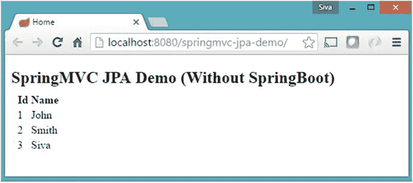

# 1. Spring Boot 简介

Spring 框架是一个非常流行且广泛使用的 Java 框架，用于构建 Web 和企业级应用程序。Spring 的核心是一个依赖注入容器，它提供了多种配置 Bean 的灵活性，例如 XML、注解和 JavaConfig。多年来，Spring 框架通过满足现代业务应用程序的需求（如安全性、对 NoSQL 数据存储的支持、处理大数据、批处理、与其他系统的集成等）而呈指数级增长。Spring 及其子项目已成为构建企业级应用程序的可行平台。

Spring 框架非常灵活，提供了多种配置应用程序组件的方式。丰富的功能集加上多种配置选项，使得配置 Spring 应用程序变得复杂且容易出错。Spring 团队创建了 Spring Boot，旨在通过其强大的自动配置机制来解决配置的复杂性。

本章将快速介绍 Spring 框架。你将使用 SpringMVC 和 JPA 以传统方式（不使用 Spring Boot）开发一个 Web 应用程序。然后，你将了解传统方式的痛点，并学习如何使用 Spring Boot 开发相同的应用程序。

## Spring 框架概述

如果你是一名 Java 开发者，那么你很有可能听说过 Spring 框架并在项目中使用过它。Spring 框架最初是作为一个依赖注入容器创建的，但它的功能远不止于此。Spring 之所以非常流行，有以下几个原因：

*   Spring 的依赖注入方法鼓励编写可测试的代码
*   易于使用且功能强大的数据库事务管理能力
*   Spring 简化了与其他 Java 框架（如 JPA/Hibernate ORM 和 Struts/JSF Web 框架）的集成
*   用于构建 Web 应用程序的最先进的 Web MVC 框架

除了 Spring 框架本身，还有许多其他的 Spring 子项目可以帮助构建满足现代业务需求的应用程序：

*   Spring Data：简化了从关系型和 NoSQL 数据存储中访问数据的过程。
*   Spring Batch：提供了一个强大的批处理框架。
*   Spring Security：用于保护应用程序的健壮安全框架。
*   Spring Social：支持与社交网站（如 Facebook、Twitter、LinkedIn、GitHub 等）的集成。
*   Spring Integration：企业集成模式的实现，通过轻量级消息传递和声明式适配器促进与其他企业应用程序的集成。

还有许多其他有趣的项目，用于满足各种现代应用程序开发需求。更多信息，请查看 [`http://spring.io/projects`](http://spring.io/projects)。

## Spring 配置风格

Spring 最初提供了基于 XML 的方法来配置 Bean。后来，Spring 引入了基于 XML 的 DSL、注解和基于 JavaConfig 的方法来配置 Bean。清单 1-1 到 1-3 展示了每种配置风格的样子。

```

清单 1-1.
基于 XML 的配置示例
```

```
@Service public class UserService
{
private UserDao userDao;
@Autowired    public UserService(UserDao dao){
this.userDao = dao;
}
...
...
}
@Repository public class JdbcUserDao
{
private DataSource dataSource;
@Autowired
public JdbcUserDao(DataSource dataSource){
this.dataSource = dataSource;
}
...
...
}
清单 1-2.
基于注解的配置示例
```

```
@Configuration
public class AppConfig
{
@Bean
public UserService userService(UserDao dao){
return new UserService(dao);
}
@Bean
public UserDao userDao(DataSource dataSource){
return new JdbcUserDao(dataSource);
}
@Bean
public DataSource dataSource(){
BasicDataSource dataSource = new BasicDataSource();
dataSource.setDriverClassName("com.mysql.jdbc.Driver");
dataSource.setUrl("jdbc:mysql://localhost:3306/test");
dataSource.setUsername("root");
dataSource.setPassword("secret");
return dataSource;
}
}
清单 1-3.
基于 JavaConfig 的配置示例
```

如你所见，Spring 提供了多种配置应用程序组件的方法，你甚至可以混合使用这些方法。例如，你可以在同一个应用程序中同时使用 JavaConfig 和基于注解的配置风格。这带来了极大的灵活性，但有利也有弊。刚接触 Spring 框架的人可能会对应该遵循哪种方法感到困惑。

目前，Spring 社区建议你遵循基于 JavaConfig 的方法，因为它提供了更大的灵活性。但并没有一种放之四海而皆准的解决方案。你必须根据自己的应用程序需求来选择合适的方法。

现在你已经了解了各种 Spring Bean 配置风格的样子，接下来我们将快速浏览一个典型的基于 SpringMVC 和 JPA/Hibernate 的 Web 应用程序配置。

## 使用 SpringMVC 和 JPA 开发 Web 应用程序

在了解 Spring Boot 及其提供的功能之前，我们先来看看一个典型的 Spring Web 应用程序配置是什么样的，并了解其中的痛点。然后，我们将看到 Spring Boot 是如何解决这些问题的。

首先要做的是创建一个 Maven 项目，并在 `pom.xml` 文件中配置所有必需的依赖项，如清单 1-4 所示。

```

4.0.0
com.apress
springmvc-jpa-demo
war
1.0-SNAPSHOT
springmvc-jpa-demo

UTF-8
1.8
1.8
false

org.apache.tomcat.maven
tomcat7-maven-plugin
2.2

org.springframework
spring-webmvc
4.3.7.RELEASE

org.springframework.data
spring-data-jpa
1.11.1.RELEASE

org.slf4j
jcl-over-slf4j
1.7.22

org.slf4j
slf4j-api
1.7.22

org.slf4j
slf4j-log4j12
1.7.22

log4j
log4j
1.2.17

com.h2database
h2
1.4.193

commons-dbcp
commons-dbcp
1.4

mysql
mysql-connector-java
5.1.38

org.hibernate
hibernate-entitymanager
5.2.5.Final

javax.servlet
javax.servlet-api
3.1.0
provided

org.thymeleaf
thymeleaf-spring4
2.1.4.RELEASE

清单 1-4.
pom.xml 文件
```

我们已经在 Maven 的 `pom.xml` 文件中配置了所有 Spring MVC、Spring Data JPA、JPA/Hibernate、Thymeleaf 和 Log4j 的依赖项。

使用 JavaConfig 配置服务层/DAO 层的 Bean，如清单 1-5 所示。


```
package com.apress.demo.config;
import java.util.Properties;
import javax.persistence.EntityManagerFactory;
import javax.sql.DataSource;
import org.apache.commons.dbcp.BasicDataSource;
import org.springframework.beans.factory.annotation.Autowired;
import org.springframework.context.annotation.Bean;
import org.springframework.context.annotation.Configuration;
import org.springframework.context.annotation.PropertySource;
import org.springframework.context.support.PropertySourcesPlaceholderConfigurer;
import org.springframework.core.env.Environment;
import org.springframework.core.io.ClassPathResource;
import org.springframework.data.jpa.repository.config.EnableJpaRepositories;
import org.springframework.instrument.classloading.InstrumentationLoadTimeWeaver;
import org.springframework.jdbc.datasource.init.DataSourceInitializer;
import org.springframework.jdbc.datasource.init.ResourceDatabasePopulator;
import org.springframework.orm.hibernate4.HibernateExceptionTranslator;
import org.springframework.orm.jpa.JpaTransactionManager;
import org.springframework.orm.jpa.LocalContainerEntityManagerFactoryBean;
import org.springframework.orm.jpa.vendor.HibernateJpaVendorAdapter;
import org.springframework.transaction.PlatformTransactionManager;
import org.springframework.transaction.annotation.EnableTransactionManagement;
@Configuration
@EnableTransactionManagement
@EnableJpaRepositories(basePackages="com.apress.demo.repositories")
@PropertySource(value = { "classpath:application.properties" })
public class AppConfig
{
@Autowired
private Environment env;
@Bean
public static PropertySourcesPlaceholderConfigurer placeHolderConfigurer()
{
return new PropertySourcesPlaceholderConfigurer();
}
@Bean
public PlatformTransactionManager transactionManager()
{
EntityManagerFactory factory = entityManagerFactory().getObject();
return new JpaTransactionManager(factory);
}
@Bean
public LocalContainerEntityManagerFactoryBean entityManagerFactory()
{
LocalContainerEntityManagerFactoryBean factory = new LocalContainerEntityManagerFactoryBean();
HibernateJpaVendorAdapter vendorAdapter = new HibernateJpaVendorAdapter();
vendorAdapter.setShowSql(Boolean.TRUE);
factory.setDataSource(dataSource());
factory.setJpaVendorAdapter(vendorAdapter);
factory.setPackagesToScan(env.getProperty("packages-to-scan"));
Properties jpaProperties = new Properties();
jpaProperties.put("hibernate.hbm2ddl.auto", env.getProperty("hibernate.hbm2ddl.auto"));
factory.setJpaProperties(jpaProperties);
factory.afterPropertiesSet();
factory.setLoadTimeWeaver(new InstrumentationLoadTimeWeaver());
return factory;
}
@Bean
public HibernateExceptionTranslator hibernateExceptionTranslator()
{
return new HibernateExceptionTranslator();
}
@Bean
public DataSource dataSource()
{
BasicDataSource dataSource = new BasicDataSource();
dataSource.setDriverClassName(env.getProperty("jdbc.driverClassName"));
dataSource.setUrl(env.getProperty("jdbc.url"));
dataSource.setUsername(env.getProperty("jdbc.username"));
dataSource.setPassword(env.getProperty("jdbc.password"));
return dataSource;
}
@Bean
public DataSourceInitializer dataSourceInitializer(DataSource dataSource)
{
DataSourceInitializer dataSourceInitializer = new DataSourceInitializer();
dataSourceInitializer.setDataSource(dataSource);
ResourceDatabasePopulator databasePopulator = new ResourceDatabasePopulator();
databasePopulator.addScript(new ClassPathResource(env.getProperty("init-scripts")));
dataSourceInitializer.setDatabasePopulator(databasePopulator);
dataSourceInitializer.setEnabled(Boolean.parseBoolean(env.getProperty("init-db", "false")));
return dataSourceInitializer;
}
}
清单 1-5.
com.apress.demo.config.AppConfig.java 文件
```

在 `AppConfig.java` 配置类中，我们执行了以下操作：

1.  现在在 `application.properties` 中配置属性占位符值，如清单 1-6 所示。

```
    jdbc.driverClassName=com.mysql.jdbc.Driver
    jdbc.url=jdbc:mysql://localhost:3306/test
    jdbc.username=root
    jdbc.password=admin
    init-db=true
    init-scripts=data.sql
    hibernate.dialect=org.hibernate.dialect.MySQLDialect
    hibernate.show_sql=true
    hibernate.hbm2ddl.auto=update
    packages-to-scan=com.apress.demo
    清单 1-6.
    src/main/resources/application.properties 文件
    ```

2.  创建一个名为 `data.sql` 的简单 SQL 脚本，用于向 `USER` 表中填充示例数据，如清单 1-7 所示。

```
    delete from user;
    insert into user(id, name) values(1,'John');
    insert into user(id, name) values(2,'Smith');
    insert into user(id, name) values(3,'Siva');
    清单 1-7.
    src/main/resources/data.sql 文件
    ```

3.  使用基本配置创建 `log4j.properties` 文件，如清单 1-8 所示。

```
    log4j.rootCategory=INFO, stdout
    log4j.appender.stdout=org.apache.log4j.ConsoleAppender
    log4j.appender.stdout.layout=org.apache.log4j.PatternLayout
    log4j.appender.stdout.layout.ConversionPattern=%5p %t %c{2}:%L - %m%n
    log4j.category.com.apress=DEBUG
    log4j.category.org.springframework=INFO
    清单 1-8.
    src/main/resources/log4j.properties 文件
    ```

4.  现在配置 Spring MVC Web 层 Bean，例如 `ThymeleafViewResolver`、静态 `ResourceHandler` 以及用于国际化的 `MessageSource`，如清单 1-9 所示。


```
    package com.apress.demo.config;
    import org.springframework.context.MessageSource;
    import org.springframework.context.annotation.Bean;
    import org.springframework.context.annotation.ComponentScan;
    import org.springframework.context.annotation.Configuration;
    import org.springframework.context.support.ReloadableResourceBundleMessageSource;
    import org.springframework.web.servlet.config.annotation.DefaultServletHandlerConfigurer;
    import org.springframework.web.servlet.config.annotation.EnableWebMvc;
    import org.springframework.web.servlet.config.annotation.ResourceHandlerRegistry;
    import org.springframework.web.servlet.config.annotation.WebMvcConfigurerAdapter;
    import org.thymeleaf.spring4.SpringTemplateEngine;
    import org.thymeleaf.spring4.view.ThymeleafViewResolver;
    import org.thymeleaf.templateresolver.ServletContextTemplateResolver;
    import org.thymeleaf.templateresolver.TemplateResolver;
    @Configuration
    @ComponentScan(basePackages = { "com.apress.demo.web"})
    @EnableWebMvc
    public class WebMvcConfig extends WebMvcConfigurerAdapter
    {
    @Bean
    public TemplateResolver templateResolver() {
    TemplateResolver templateResolver = new ServletContextTemplateResolver();
    templateResolver.setPrefix("/WEB-INF/views/");
    templateResolver.setSuffix(".html");
    templateResolver.setTemplateMode("HTML5");
    templateResolver.setCacheable(false);
    return templateResolver;
    }
    @Bean
    public SpringTemplateEngine templateEngine() {
    SpringTemplateEngine templateEngine = new SpringTemplateEngine();
    templateEngine.setTemplateResolver(templateResolver());
    return templateEngine;
    }
    @Bean
    public ThymeleafViewResolver viewResolver() {
    ThymeleafViewResolver thymeleafViewResolver = new ThymeleafViewResolver();
    thymeleafViewResolver.setTemplateEngine(templateEngine());
    thymeleafViewResolver.setCharacterEncoding("UTF-8");
    return thymeleafViewResolver;
    }
    @Override
    public void addResourceHandlers(ResourceHandlerRegistry registry)
    {
    registry.addResourceHandler("/resources/**").addResourceLocations("/resources/");
    }
    @Override
    public void configureDefaultServletHandling(DefaultServletHandlerConfigurer configurer)
    {
    configurer.enable();
    }
    @Bean(name = "messageSource")
    public MessageSource messageSource()
    {
    ReloadableResourceBundleMessageSource messageSource = new ReloadableResourceBundleMessageSource();
    messageSource.setBasename("classpath:messages");
    messageSource.setCacheSeconds(5);
    messageSource.setDefaultEncoding("UTF-8");
    return messageSource;
    }
    }
    清单 1-9.
    com.apress.demo.config.WebMvcConfig.java 文件
    ```

在 `WebMvcConfig.java` 配置类中，我们完成了以下操作：
    *   使用 `@Configuration` 注解将其标记为 Spring `Configuration` 类。
    *   使用 `@EnableWebMvc` 启用基于注解的 Spring MVC 配置。
    *   通过注册 `TemplateResolver`、`SpringTemplateEngine` 和 `ThymeleafViewResolver` Bean 来配置 `ThymeleafViewResolver`。
    *   注册 `ResourceHandlers` Bean 以处理静态资源的请求。URI `/resources/**` 将从 `/resources/` 目录提供服务。
    *   配置 `MessageSource` Bean，以从类路径下的 `ResourceBundle messages_{国家代码}.properties` 加载国际化消息。
5.  在 `src/main/resources` 文件夹中创建 `messages.properties` 文件，并添加以下属性：

```
    app.title=SpringMVC JPA Demo (Without SpringBoot)
    ```

6.  接下来，您将注册 Spring MVC 的 `FrontController` Servlet——`DispatcherServlet`。注意 在 Servlet 3.x 规范之前，您必须在 `web.xml` 中注册 Servlet/过滤器。自 Servlet 3.x 规范起，您可以使用 `ServletContainerInitializer` 以编程方式注册 Servlet/过滤器。Spring MVC 提供了一个便捷的类 `AbstractAnnotationConfigDispatcherServletInitializer` 来注册 `DispatcherServlet`。

```
    package com.apress.demo.config;
    import javax.servlet.Filter;
    import org.springframework.orm.jpa.support.OpenEntityManagerInViewFilter;
    import org.springframework.web.servlet.support.AbstractAnnotationConfigDispatcherServletInitializer;
    public class SpringWebAppInitializer extends AbstractAnnotationConfigDispatcherServletInitializer
    {
    @Override
    protected Class[] getRootConfigClasses()
    {
    return new Class[] { AppConfig.class};
    }
    @Override
    protected Class[] getServletConfigClasses()
    {
    return new Class[] { WebMvcConfig.class };
    }
    @Override
    protected String[] getServletMappings()
    {
    return new String[] { "/" };
    }
    @Override
    protected Filter[] getServletFilters()
    {
    return new Filter[]{ new OpenEntityManagerInViewFilter() };
    }
    }
    清单 1-10.
    com.apress.demo.config.SpringWebAppInitializer.java 文件
    ```

在 `SpringWebAppInitializer.java` 配置类中，我们完成了以下操作：
    *   将 `AppConfig.class` 配置为 `RootConfirationClasses`，它将作为父级 `ApplicationContext`，包含所有子级（`DispatcherServlet`）上下文共享的 Bean 定义。
    *   将 `WebMvcConfig.class` 配置为 `ServletConfigClasses`，它是子级 `ApplicationContext`，包含 `WebMvc` Bean 定义。
    *   将 `/` 配置为 `ServletMapping`，这意味着所有请求都将由 `DispatcherServlet` 处理。
    *   注册 `OpenEntityManagerInViewFilter` 作为 Servlet 过滤器，以便在渲染视图时可以延迟加载 JPA 实体的延迟集合。
7.  创建一个 JPA 实体用户及其 Spring Data JPA 仓库接口 `UserRepository`。创建一个名为 `User.java` 的 JPA 实体，如清单 1-11 所示，以及一个名为 `UserRepository.java` 的 Spring Data JPA 仓库，如清单 1-12 所示。

```
    package com.apress.demo.domain;
    import javax.persistence.*;
    @Entity
    public class User
    {
    @Id @GeneratedValue(strategy=GenerationType.AUTO)
    private Integer id;
    private String name;
    public User()
    {
    }
    public User(Integer id, String name)
    {
    this.id = id;
    this.name = name;
    }
    public Integer getId()
    {
    return id;
    }
    public void setId(Integer id)
    {
    this.id = id;
    }
    public String getName()
    {
    return name;
    }
    public void setName(String name)
    {
    this.name = name;
    }
    }
    清单 1-11.
    com.apress.demo.domain.User.java 文件
    ```

```
    package com.apress.demo.repositories;
    import org.springframework.data.jpa.repository.JpaRepository;
    import com.apress.demo.domain.User;
    public interface UserRepository extends JpaRepository
    {
    }
    清单 1-12.
    com.apress.demo.repositories.UserRepository.java 文件
    ```

如果您不理解 `JpaRepository` 是什么，请不要担心。您将在后续章节中了解更多关于 Spring Data JPA 的内容。
8.  创建一个 SpringMVC 控制器来处理 URL `/`，该控制器会渲染一个用户列表。参见清单 1-13。


```
    package com.apress.demo.web.controllers;
    import org.springframework.beans.factory.annotation.Autowired;
    import org.springframework.stereotype.Controller;
    import org.springframework.ui.Model;
    import org.springframework.web.bind.annotation.RequestMapping;
    import com.apress.demo.repositories.UserRepository;
    @Controller
    public class HomeController
    {
    @Autowired
    private UserRepository userRepo;
    @RequestMapping("/")
    public String home(Model model)
    {
    model.addAttribute("users", userRepo.findAll());
    return "index";
    }
    }
    清单 1-13.
    com.apress.demo.web.controllers.HomeController.java 文件
    ```

9.  在 `/WEB-INF/views/` 文件夹中创建一个名为 `index.html` 的 Thymeleaf 视图，用于渲染用户列表，如清单 1-14 所示。

```

Home

App Title

Id
    Name

Id
    Name

清单 1-14.
    src/main/webapp/WEB-INF/views/index.html 文件
    ```

*   使用 `@Configuration` 注解将其标记为 Spring `Configuration` 类。
*   使用 `@EnableTransactionManagement` 启用基于注解的事务管理。
*   配置 `@EnableJpaRepositories` 以指示 Spring Data JPA 仓库的查找位置。
*   使用 `@PropertySource` 注解和 `PropertySourcesPlaceholderConfigurer` bean 定义配置了 `PropertyPlaceHolder` bean，该 bean 从 `application.properties` 文件中加载属性。
*   为 `DataSource`、JPA `EntityManagerFactory` 和 `JpaTransactionManager` 定义了 bean。
*   配置了 `DataSourceInitializer` bean，以便在应用程序启动时通过执行 `data.sql` 脚本来初始化数据库。

现在，您已准备好运行应用程序。但在此之前，您需要在 IDE 中下载并配置一个服务器，例如 Tomcat、Jetty 或 Wildfly 等。您可以下载 Tomcat 8 并配置您喜欢的 IDE，运行应用程序，然后将浏览器指向 `http://localhost:8080/springmvcjpa-demo`。如果一切顺利，您应该会看到一个表格中显示的用户详细信息列表，如图 1-1 所示。



图 1-1.

显示用户列表

耶……您做到了。但是，等等，仅仅为了显示从数据库表中拉取的用户详细信息列表，这工作量是不是太大了？

让我们坦诚且公平地说。所有这些配置并不仅仅是为了这一个用例。这些配置成为了应用程序其余部分的基础。同样，如果您想快速启动并运行，这工作量也太大了。它的另一个问题是，假设您想开发另一个具有类似技术栈的 SpringMVC 应用程序。您可以复制粘贴配置并进行调整，对吧？

记住一件事：如果您不得不一次又一次地做同样的事情，您应该找到一种自动化的方法来完成它。

除了反复编写相同的配置之外，您在这里还看到其他问题了吗？让我们看看我在这里看到的问题。

*   您需要为特定的 Spring 版本搜寻所有兼容的库并进行配置。
*   大多数情况下，您会以相同的方式配置 `DataSource`、`EntitymanagerFactory`、`TransactionManager` 等 bean。如果 Spring 能自动为您完成这些工作，那岂不是很好？
*   类似地，大多数情况下，您也会以相同的方式配置 `ViewResolver`、`MessageSource` 等 SpringMVC bean。如果 Spring 能自动为您完成，那就太棒了。

如果 Spring 能够自动配置 bean 会怎样？如果您可以使用简单的可定制属性来自定义自动配置会怎样？

例如，您可能希望将 `DispatcherServlet url-pattern` 映射到 `/app/`，而不是映射到 `/`。您可能希望将 Thymeleaf 视图放在 `/WEB-INF/templates/` 文件夹中，而不是放在 `/WEB-INF/views` 文件夹中。

所以，基本上您希望 Spring 自动完成事情，同时又能以更简单的方式提供覆盖默认配置的灵活性。您即将进入 Spring Boot 的世界，在这里您的梦想可以成真！

## 快速体验 Spring Boot

欢迎来到 Spring Boot！Spring Boot 会自动为您配置应用程序组件，但如果您愿意，也允许您覆盖默认配置。

与其从理论上解释这一点，我更喜欢通过示例来解释。在本节中，您将看到如何使用 Spring Boot 实现相同的应用程序。

1.  创建一个基于 Maven 的 Spring Boot 项目，并在 `pom.xml` 文件中配置依赖项，如清单 1-15 所示。

    ```

    4.0.0
    com.apress
    hello-springboot
    jar
    1.0-SNAPSHOT
    hello-springboot

    org.springframework.boot
    spring-boot-starter-parent
    2.0.0.RELEASE

    UTF-8
    1.8

    org.springframework.boot
    spring-boot-starter-data-jpa

    org.springframework.boot
    spring-boot-starter-web

    org.springframework.boot
    spring-boot-starter-thymeleaf

    mysql
    mysql-connector-java

    org.springframework.boot
    spring-boot-maven-plugin

    清单 1-15.
    pom.xml 文件
    ```

    哇，这个 `pom.xml` 文件突然变得这么小！注意 如果此时这个配置看起来没有意义，请不要担心。在接下来的章节中，您还有很多要学习的内容。如果您想使用 Spring Boot 的任何 `MILESTONE` 或 `SNAPSHOT` 版本，您需要在 `pom.xml` 中配置以下里程碑/快照仓库。

    ```
    org.springframework.boot
    spring-boot-starter-parent
    2.0.0.BUILD-SNAPSHOT

    spring-snapshots
    Spring Snapshots
    https://repo.spring.io/snapshot

    true

    spring-milestones
    Spring Milestones
    https://repo.spring.io/milestone

    false

    spring-snapshots
    Spring Snapshots
    https://repo.spring.io/snapshot

    true

    spring-milestones
    Spring Milestones
    https://repo.spring.io/milestone

    false

    ```

2.  在 `src/main/resources/application.properties` 中配置数据源/JPA 属性，如清单 1-16 所示。

    ```
    spring.datasource.driver-class-name=com.mysql.jdbc.Driver
    spring.datasource.url=jdbc:mysql://localhost:3306/test
    spring.datasource.username=root
    spring.datasource.password=admin
    spring.datasource.initialize=true
    spring.jpa.hibernate.ddl-auto=update
    spring.jpa.show-sql=true
    清单 1-16.
    src/main/resources/application.properties 文件
    ```

    将相同的 `data.sql` 文件复制到 `src/main/resources` 文件夹中。  
3.  创建一个名为 `User.java` 的 JPA 实体、一个名为 `UserRepository.java` 的 Spring Data JPA 仓库接口以及一个名为 `HomeController.java` 的控制器，如之前的 `springmvc-jpa-demo` 应用程序所示。  
4.  创建一个 Thymeleaf 视图来显示用户列表。您可以将之前在 `springmvc-jpa-demo` 应用程序中创建的 `/WEB-INF/views/index.html` 复制到新项目的 `src/main/resources/templates` 文件夹中。  
5.  创建一个包含 main 方法的 Spring Boot 入口点类 `Application.java` 文件，如清单 1-17 所示。

    ```
    package com.apress.demo;
    import org.springframework.boot.SpringApplication;
    import org.springframework.boot.autoconfigure.SpringBootApplication;
    @SpringBootApplication
    public class Application
    {
    public static void main(String[] args)
    {
    SpringApplication.run(Application.class, args);
    }
    }
    清单 1-17.
    com.apress.demo.Application.java 文件
    ```

现在，将 `Application.java` 作为 Java 应用程序运行，并将浏览器指向 `http://localhost:8080/`。您应该会看到一个表格格式的用户列表。

但您可能会挠头，心想“这是怎么回事？”。下一节将解释刚才发生的事情。


### 轻松管理依赖

首先要注意的是以 `spring-boot-starter-*` 命名的依赖项的使用。还记得我说过，“大多数情况下，你使用的都是相同的配置”。因此，当你添加 `springboot-starter-web` 依赖时，它会默认拉取开发 Spring MVC 应用程序时常用的所有库，例如 `spring-webmvc`、`jackson-json`、`validation-api` 和 `tomcat`。

我们添加了 `spring-boot-starter-data-jpa` 依赖。这会拉取所有 `spring-data-jpa` 依赖并添加 Hibernate 库，因为大多数应用程序都使用 Hibernate 作为 JPA 实现。

### 自动配置

`spring-boot-starter-web` 不仅添加了所有这些库，还使用合理的默认值配置了常用的注册 bean，例如 `DispatcherServlet`、`ResourceHandler`、`MessageSource` 等。

我们还添加了 `spring-boot-starter-thymeleaf`，它不仅添加了 Thymeleaf 库依赖，还自动配置了 `ThymeleafViewResolver` bean。

我们没有定义任何 `DataSource`、`EntityManagerFactory` 或 `TransactionManager` bean，但它们都被自动创建了。这是如何做到的？

如果你的类路径中有任何内存数据库驱动程序（如 H2 或 HSQL），那么 Spring Boot 将自动创建一个内存数据源，并使用合理的默认值自动注册 `EntityManagerFactory` 和 `TransactionManager` bean。

但是你使用的是 MySQL，因此需要显式提供 MySQL 连接详细信息。你已在 `application.properties` 文件中配置了这些 MySQL 连接详细信息，Spring Boot 会使用这些属性创建一个 `DataSource`。

### 嵌入式 Servlet 容器支持

最重要且令人惊讶的是，我们创建了一个简单的 Java 类，并用一些神奇的注解（`@SpringApplication`）进行了标注，该类有一个 `main()` 方法。通过运行该 `main()` 方法，我们能够运行应用程序并通过 `http://localhost:8080/` 访问它。Servlet 容器是从哪里来的？

我们添加了 `spring-boot-starter-web`，它会自动拉取 `spring-boot-starter-tomcat`。当我们运行 `main()` 方法时，它会启动 Tomcat 作为嵌入式容器，这样我们就不必将应用程序部署到任何外部安装的 Tomcat 服务器上。如果我们想使用 Jetty 服务器而不是 Tomcat 呢？你只需从 `spring-boot-starter-web` 中排除 `spring-boot-starter-tomcat`，并包含 `spring-boot-starter-jetty` 即可。就这么简单。

但这看起来太神奇了！我能想象你在想什么。你可能会想，Spring Boot 看起来很酷，它自动为你做了很多事情。你仍然不完全理解这一切在幕后是如何运作的，对吧？

我能理解。看魔术表演很有趣，但在软件开发中，神秘感就没那么有趣了。别担心，我们将逐一审视这些内容，并详细解释幕后发生的事情。我不想在第一章节就把所有东西都抛给你，让你不知所措。

## 总结

本章快速概述了各种 Spring 配置风格。目的是向你展示配置 Spring 应用程序的复杂性。同时，你也通过创建一个简单的 Web 应用程序，快速了解了 Spring Boot。

下一章将更详细地介绍 Spring Boot，并展示如何以不同方式创建 Spring Boot 应用程序。

