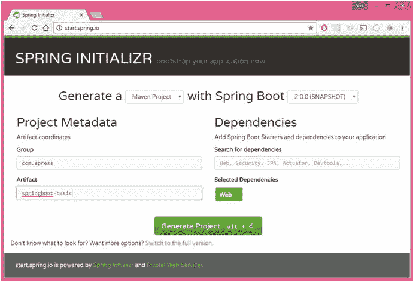
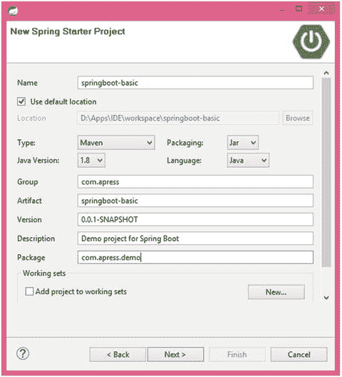
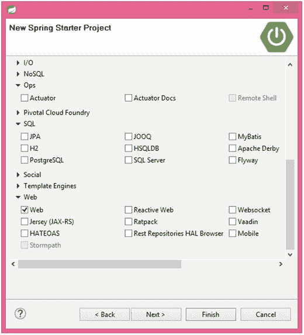

# 2. Spring Boot 入门

本章将更详细地介绍 Spring Boot 及其特性。然后，本章将探讨创建 Spring Boot 应用程序的各种选项，例如 Spring Initializr、Spring Tool Suite、Intellij IDEA 等。最后，本章将探索生成的代码，并介绍如何运行应用程序。

## 什么是 Spring Boot？

Spring Boot 是一个固执己见的框架，可帮助开发者快速、轻松地构建基于 Spring 的应用程序。Spring Boot 的主要目标是快速创建基于 Spring 的应用程序，而无需开发者一遍又一遍地编写相同的样板配置。Spring Boot 的关键特性包括：

*   Spring Boot 启动器
*   Spring Boot 自动配置
*   优雅的配置管理
*   Spring Boot Actuator
*   易于使用的嵌入式 Servlet 容器支持

### Spring Boot 启动器

Spring Boot 提供了许多启动器模块，可以快速上手许多常用技术，例如 SpringMVC、JPA、MongoDB、Spring Batch、SpringSecurity、Solr、ElasticSearch 等。这些启动器预先配置了最常用的库依赖，因此你无需搜索兼容的库版本并手动配置它们。

例如，`spring-boot-starter-data-jpa` 启动器模块包含了使用 Spring Data JPA 所需的所有依赖，以及 Hibernate 库依赖，因为 Hibernate 是最常用的 JPA 实现。

注意

你可以在官方文档中找到所有开箱即用的 Spring Boot 启动器列表：[`http://docs.spring.io/spring-boot/docs/current/reference/htmlsingle/#using-boot-starter-poms`](http://docs.spring.io/spring-boot/docs/current/reference/htmlsingle/#using-boot-starter-poms)。

### Spring Boot 自动配置

Spring Boot 解决了 Spring 应用程序需要复杂配置的问题，它消除了手动设置样板配置的需要。

Spring Boot 对应用程序采取固执己见的看法，并根据各种标准自动注册 bean，从而自动配置各种组件。这些标准可以是：

*   类路径中存在特定类
*   Spring bean 的存在或不存在
*   系统属性的存在
*   配置文件的不存在

例如，如果你的类路径中有 `spring-webmvc` 依赖，Spring Boot 会假定你正在尝试构建一个基于 SpringMVC 的 Web 应用程序，并自动尝试注册 `DispatcherServlet`（如果尚未注册）。

如果你的类路径中有任何嵌入式数据库驱动程序（例如 H2 或 HSQL），并且你尚未显式配置 `DataSource` bean，那么 Spring Boot 将使用内存数据库设置自动注册一个 `DataSource` bean。你将在第 3 章中了解更多关于自动配置的信息。

### 优雅的配置管理

Spring 支持使用 `@PropertySource` 配置来外部化可配置属性。Spring Boot 通过使用合理的默认值和强大的类型安全属性绑定到 bean 属性，将其更进一步。Spring Boot 支持为不同的配置文件（profile）使用单独的配置文件，而无需大量配置。

### Spring Boot Actuator

能够获取生产环境中运行的应用程序的各种详细信息，对许多应用程序来说至关重要。Spring Boot Actuator 提供了多种此类生产就绪特性，而无需开发者编写大量代码。Spring Actuator 的一些特性包括：

*   可以查看应用程序 bean 配置详细信息
*   可以查看应用程序 URL 映射、环境详细信息和配置参数值
*   可以查看已注册的健康检查指标

### 易于使用的嵌入式 Servlet 容器支持

传统上，在构建 Web 应用程序时，你需要创建 WAR 类型的模块，然后将它们部署到外部服务器（如 Tomcat、WildFly 等）上。但是，通过使用 Spring Boot，你可以创建一个 JAR 类型的模块，并非常轻松地将 Servlet 容器嵌入到应用程序中，这样应用程序将成为一个自包含的部署单元。此外，在开发过程中，你可以轻松地从 IDE 或使用构建工具（如 Maven 或 Gradle）从命令行将 Spring Boot JAR 类型模块作为 Java 应用程序运行。

你将在后续章节中了解更多关于这些特性以及如何有效使用它们的信息。


## 你的第一个 Spring Boot 应用

创建 Spring Boot 应用的方法有很多种。最简单的方式是使用位于 [`http://start.spring.io/`](http://start.spring.io/) 的 Spring Initializr，这是一个在线 Spring Boot 应用生成器。在本节中，你将了解如何创建一个提供简单 HTML 页面的 Spring Boot Web 应用，并探索典型 Spring Boot 应用的各个方面。

### 使用 Spring Initializr

你可以将浏览器指向 [`http://start.spring.io/`](http://start.spring.io/)，查看项目详情，如图 2-1 所示。

1.  选择 Maven 项目和 Spring Boot 版本（在撰写本书时，最新版本是 2.0.0—SNAPSHOT）。
2.  按如下方式输入 Maven 项目详情：
    *   组（Group）：`com.apress`
    *   工件（Artifact）：`springboot-basic`
    *   名称（Name）：`springboot-basic`
    *   包名（Package Name）：`com.apress.demo`
    *   打包方式（Packaging）：JAR
    *   Java 版本：1.8
    *   语言：Java
3.  如果你已经熟悉启动器的名称，可以直接搜索；或者点击“切换到完整版本”链接，查看所有可用的启动器。你会看到许多启动器模块，它们被组织成不同的类别，如核心（Core）、Web、数据（Data）等。从 Web 类别中选择 Web 复选框。
4.  点击“生成项目”按钮。



图 2-1.

Spring Initializr

现在，你可以解压下载的 ZIP 文件，并将其导入到你喜欢的 IDE 中。

### 使用 Spring Tool Suite

Spring Tool Suite（STS：[`https://spring.io/tools/sts`](https://spring.io/tools/sts)）是 Eclipse IDE 的一个扩展，包含许多与 Spring 框架相关的插件。你可以通过选择“文件 ➤ 新建 ➤ 其他 ➤ Spring ➤ Spring Starter 项目 ➤ 下一步”，轻松地从 STS 创建一个 Spring Boot 应用。你将看到一个向导，它看起来与 Spring Initializr 类似（图 2-2）。



图 2-2.

STS 新建 Spring Starter 项目向导

输入项目详情并点击“下一步”。然后选择最新的 Spring Boot 版本和 Web 启动器（图 2-3），并点击“完成”。



图 2-3.

STS Spring 启动器选择向导

Spring Boot 项目将被创建并自动导入到 STS IDE 中。

### 使用 Intellij IDEA

Intellij IDEA 是一款功能强大的商业 IDE，具有出色的特性，包括对 Spring Boot 的支持。你可以通过选择“文件 ➤ 新建 ➤ 项目 ➤ Spring Initializr ➤ 下一步”，从 Intellij IDEA 创建一个 Spring Boot 项目。输入项目详情并点击“下一步”。然后选择启动器并点击“下一步”。最后，输入项目名称并点击“完成”。

注意

Spring 框架支持仅适用于商业版的 Intellij IDEA Ultimate Edition，而不适用于免费的 Community Edition。如果你想使用 Intellij IDEA Community Edition，你可以使用 Spring Initializr 生成项目，然后将其作为 Maven/Gradle 项目导入到 Intellij IDEA 中。

### 使用 NetBeans IDE

NetBeans IDE 是另一个用于开发 Java 应用的流行 IDE。目前，NetBeans 中没有开箱即用的创建 Spring Boot 项目的支持，但社区构建了 NB Spring Boot 插件（参见 [`https://github.com/AlexFalappa/nb-springboot`](https://github.com/AlexFalappa/nb-springboot)），该插件支持直接从 IDE 创建 Spring Boot 应用。

注意

还有一些其他快速使用 Spring Boot 的选项，例如使用 Spring Boot CLI 和 SDKMAN。你可以在以下地址找到更多详细信息：“安装 Spring Boot”：[`http://docs.spring.io/spring-boot/docs/current/reference/htmlsingle/#getting-started-installing-spring-boot`](http://docs.spring.io/spring-boot/docs/current/reference/htmlsingle/#getting-started-installing-spring-boot)。

### 探索项目

现在你已经创建了一个包含 `web` 启动器的基于 Maven 的 Spring Boot 项目，可以开始探索生成的应用中包含的内容了。

1.  首先，查看 `pom.xml` 文件，如代码清单 2-1 所示。

```
4.0.0
    com.apress
    springboot-basic
    0.0.1-SNAPSHOT
    jar
    springboot-basic
    Demo project for Spring Boot

org.springframework.boot
    spring-boot-starter-parent
    2.0.0.BUILD-SNAPSHOT

UTF-8
    UTF-8
    1.8

spring-snapshots
    Spring Snapshots
    https://repo.spring.io/snapshot

true

spring-milestones
    Spring Milestones
    https://repo.spring.io/milestone

false

spring-snapshots
    Spring Snapshots
    https://repo.spring.io/snapshot

true

spring-milestones
    Spring Milestones
    https://repo.spring.io/milestone

false

org.springframework.boot
    spring-boot-starter-web

org.springframework.boot
    spring-boot-starter-test
    test

org.springframework.boot
    spring-boot-maven-plugin

代码清单 2-1.
    pom.xml 文件
    ```

这里首先要注意的是，`springboot-basic` Maven 模块继承自 `springboot-starter-parent` 模块。通过继承 `spring-boot-starter-parent`，这个新模块将自动获得以下好处：
    *   你只需要在父模块配置中指定一次 Spring Boot 版本。你不需要为所有启动器依赖项和其他支持库指定版本。要查看支持库的列表，请查看 `org.springframework.boot:springboot-dependencies:{version}` Maven 模块的 `pom.xml` 文件。
    *   父模块 `spring-boot-starter-parent` 已经包含了最常用的插件，例如 `maven-jar-plugin`、`maven-surefire-plugin`、`maven-war-plugin`、`exec-maven-plugin` 和 `maven-resources-plugin`，并带有合理的默认配置。
    *   除了前面提到的插件，`spring-boot-starter-parent` 模块还配置了 `spring-boot-maven-plugin`，该插件将用于构建 fat JAR。我们将在本章后面更详细地介绍 `spring-boot-maven-plugin`。此示例仅选择了 `web` 启动器，但 `test` 启动器也默认包含在内。我们选择了 1.8 作为 Java 版本，因此包含了属性 `<java.version>1.8</java.version>`。这个 `java.version` 值将用于在 `spring-boot-starter-parent` 模块中配置 Maven 编译器的 JDK 版本。

```
    ${java.version}
    ${java.version}
    ```

2.  生成的 Spring Boot JAR 类型模块将有一个应用入口点 Java 类，名为 `SpringbootBasicApplication.java`，其中包含 `public static void main(String[] args)` 方法，你可以运行它来启动应用。参见代码清单 2-2。

```
    package com.apress.demo;
    import org.springframework.boot.SpringApplication;
    import org.springframework.boot.autoconfigure.SpringBootApplication;
    @SpringBootApplication
    public class SpringbootBasicApplication
    {
    public static void main(String[] args)
    {
    SpringApplication.run(SpringbootBasicApplication.class, args);
    }
    }
    代码清单 2-2.
    com.apress.demo.SpringbootBasicApplication.java
    ```

这里，`SpringbootBasicApplication` 类使用了 `@SpringBootApplication` 注解进行标注，这是一个组合注解。

```
    @Target(ElementType.TYPE)
    @Retention(RetentionPolicy.RUNTIME)
    @Documented
    @Inherited
    @SpringBootConfiguration
    @EnableAutoConfiguration
    @ComponentScan(excludeFilters = {
    @Filter(type = FilterType.CUSTOM, classes = TypeExcludeFilter.class),
    @Filter(type = FilterType.CUSTOM, classes = AutoConfigurationExcludeFilter.class) })
    public @interface SpringBootApplication {
    ....
    ....
    }
    ```

`@SpringBootConfiguration` 是另一个带有 `@Configuration` 注解的组合注解。


```
    @Target(ElementType.TYPE)
    @Retention(RetentionPolicy.RUNTIME)
    @Documented
    @Configuration
    public @interface SpringBootConfiguration {
    }
    ```

以下是这些注解的含义：
*   `@Configuration` 表示该类是一个 Spring 配置类。
*   `@ComponentScan` 启用对当前类所在包中 Spring Bean 的组件扫描。
*   `@EnableAutoConfiguration` 触发 Spring Boot 的自动配置机制。你通过在 `main()` 方法中调用 `SpringApplication.run(SpringbootBasicApplication.class, args)` 来启动应用程序。你可以向 `SpringApplication.run()` 方法传递一个或多个 Spring 配置类。但如果你将应用程序入口点类放在根包中，则只需传递应用程序入口类即可，它会负责扫描所有子包中的其他 Spring 配置类。
3.  现在创建一个简单的 SpringMVC 控制器，命名为 `HomeController.java`，如清单 2-3 所示。

```
    package com.apress.demo;
    import org.springframework.stereotype.Controller;
    import org.springframework.ui.Model;
    import org.springframework.web.bind.annotation.RequestMapping;
    @Controller
    public class HomeController
    {
    @RequestMapping("/")
    public String home(Model model) {
    return "index.html";
    }
    }
    清单 2-3.
    HomeController.java
    ```

这是一个简单的 SpringMVC 控制器，包含一个用于 URL `/` 的请求处理方法，该方法返回名为 `index.html` 的视图。
4.  创建一个名为 `index.html` 的 HTML 视图。

默认情况下，Spring Boot 从 `src/main/public/` 和 `src/main/static/` 目录提供静态内容。因此，在 `src/main/public/` 中创建 `index.html`，如清单 2-4 所示。

```

Home

Hello World!!

清单 2-4.
src/main/public/index.html
```

现在，从你的 IDE 中，将 `SpringbootBasicApplication.main()` 方法作为独立的 Java 类运行，它将启动嵌入式 Tomcat 服务器（端口 8080），并将浏览器指向 `http://localhost:8080/`。你应该能够看到响应：`Hello World!!`。

你也可以使用 `spring-boot-maven-plugin` 运行 Spring Boot 应用程序，如下所示：

```
mvn spring-boot:run
```

## 应用程序入口点类

Spring Boot 应用程序应有一个包含 `public static void main(String[] args)` 方法的入口点类，该类通常使用 `@SpringBootApplication` 注解进行标注，并用于启动应用程序（清单 2-5）。

```
package com.mycompany.myproject;
import org.springframework.boot.SpringApplication;
import org.springframework.boot.autoconfigure.SpringBootApplication;
@SpringBootApplication
public class Application
{
public static void main(String[] args)
{
SpringApplication.run(Application.class, args);
}
}
清单 2-5.
根包中的主类 com.mycompany.myproject.Application.java
```

强烈建议你将主入口点类放在根包中，例如 `com.mycompany.myproject`，这样 `@EnableAutoConfiguration` 和 `@ComponentScan` 注解将自动扫描根包及其所有子包中的 Spring Bean、JPA 实体等。

如果你将入口点类放在嵌套包中，则可能需要显式指定要扫描的 `basePackage` 以查找 Spring 组件（清单 2-6）。

```
package com.mycompany.myproject.config;
@Configuration
@EnableAutoConfiguration
@ComponentScan(basePackages = "com.mycompany.myproject")
@EntityScan(basePackageClasses=Person.class)
public class Application
{
public static void main(String[] args)
{
SpringApplication.run(Application.class, args);
}
}
清单 2-6.
非根包中的主类 com.mycompany.myproject.config.Application.java
```

这里，`Application.java` 主类位于 `com.mycompany.myproject.config` 包中，这不是根包。因此，你需要指定 `@ComponentScan(basePackages = "com.mycompany.myproject")`，以便 Spring Boot 扫描 `com.mycompany.myproject` 及其所有子包以查找 Spring 组件。此外，我们还指定了 `@EntityScan(basePackageClasses=Person.class)`，以便 Spring Boot 扫描 `Person.class` 所在包下的 JPA 实体。

## 使用 Spring Boot Maven 插件创建 Fat JAR

你可以在开发期间直接从 IDE 运行应用程序，或使用 Maven `spring-boot:run`，但最终你需要创建一个无需任何 IDE 支持即可在生产环境中运行的部署单元。你可以通过执行以下 Maven 目标，使用 `spring-boot-maven-plugin` 创建一个单一的部署单元（fat JAR）。

```
mvn clean package
```

现在，`target` 目录中有两个有趣的文件——`springboot-basic-1.0-SNAPSHOT.jar` 和 `springboot-basic-1.0-SNAPSHOT.jar.original`。`springboot-basic-1.0-SNAPSHOT.jar.original` 文件仅包含编译后的类文件和类路径资源。

但如果你查看 `springboot-basic-1.0-SNAPSHOT.jar`，你会发现以下内容：

*   你自己源代码（位于 `src/main/java`）的编译类文件和来自 `src/main/resources` 的静态资源将位于 `BOOT-INF/classes` 目录中
*   所有依赖的 JAR 文件位于 `BOOT-INF/lib` 目录中
*   `org.springframework.boot.loader` 包中的类，这些类负责执行 Spring Boot 应用程序的魔法

你可以使用 `maven-shade-plugin` 等插件为 JAR 类型的模块创建自包含的部署单元，该插件将所有依赖的 JAR 类打包到一个 JAR 文件中。但 Spring Boot 采用了不同的方法，它允许你直接将 JAR 嵌套在 Spring Boot 应用程序 JAR 文件中。你可以在以下地址阅读更多相关信息：[`http://docs.spring.io/spring-boot/docs/current/reference/htmlsingle/#executable-jar`](http://docs.spring.io/spring-boot/docs/current/reference/htmlsingle/#executable-jar)。

你可以使用以下命令运行应用程序：

```
java -jar springboot-basic-1.0-SNAPSHOT.jar
```

## 使用 Gradle 的 Spring Boot

Gradle 是另一种基于 Groovy DSL 的流行构建工具。你可以使用 Gradle 代替 Maven 来构建 Spring Boot 应用程序。Gradle 遵循与 Maven 类似的项目结构。例如，主 Java 源代码位于 `src/main/java`，主资源位于 `src/main/resources`，等等。

你可以通过 Spring Initializr 或 IDE 创建应用程序时选择 Gradle 作为构建工具，来创建一个基于 Gradle 的 Spring Boot 项目。生成的 `build.gradle` 文件将如清单 2-7 所示。

```
buildscript {
ext {
springBootVersion = '2.0.0.BUILD-SNAPSHOT'
}
repositories {
mavenCentral()
maven { url "https://repo.spring.io/snapshot" }
maven { url "https://repo.spring.io/milestone" }
}
dependencies {
classpath("org.springframework.boot:spring-boot-gradle-plugin:${springBootVersion}")
}
}
apply plugin: 'java'
apply plugin: 'eclipse'
apply plugin: 'org.springframework.boot'
version = '0.0.1-SNAPSHOT'
sourceCompatibility = 1.8
repositories {
mavenCentral()
maven { url "https://repo.spring.io/snapshot" }
maven { url "https://repo.spring.io/milestone" }
}
dependencies {
compile('org.springframework.boot:spring-boot-starter-web')
testCompile('org.springframework.boot:spring-boot-starter-test')
}
清单 2-7.
build.gradle
```

现在，你可以使用 `gradle bootRun` 命令运行应用程序。你也可以使用 `gradle build` 命令，该命令会在 `build/libs` 目录中生成 fat JAR。


### Maven 还是 Gradle？

在 Java 世界中，Maven 和 Gradle 是两种最流行的构建工具。Maven 于 2004 年发布，被许多开发者广泛使用。Gradle 于 2012 年发布，它更强大且易于定制。

由于 Maven 仍然是最常用的构建工具，本书将全程使用它。不过，你可以在本书每个模块的示例代码中找到 Gradle 构建脚本。因此，你可以选择使用 Maven 或 Gradle。选择权在你手中！

## 本章小结

本章快速介绍了 Spring Boot 的特性，并讨论了创建 Spring Boot 应用程序的不同方法。既然你已经知道如何创建并运行一个简单的 Spring Boot 应用程序，你可能想了解 Spring Boot 的自动配置是如何工作的。但在此之前，你应该了解 Spring 的 `@Conditional` 特性，Spring Boot 的自动配置正是依赖于它。

下一章将探讨 `@Conditional` 注解特性的强大之处，并详细研究 Spring Boot 自动配置的工作原理。

