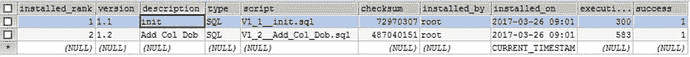

# 5. 使用 JdbcTemplate

数据持久化是软件系统的关键部分。大多数软件应用程序使用关系型数据库作为数据存储，但近年来，像 MongoDB、Redis、Cassandra 这样的 NoSQL 数据存储也越来越受欢迎。Java 提供了 JDBC API 来与数据库通信，但它是一个低级 API，需要大量样板代码。JavaEE 平台提供了 Java 持久化 API（JPA）规范，这是一种对象关系映射（ORM）框架。Hibernate 和 EclipseLink 是最流行的 JPA 实现。还有其他流行的持久化框架，如 MyBatis 和 JOOQ，它们更侧重于 SQL。

Spring 在 JDBC API 之上提供了一个很好的抽象，使用 `JdbcTemplate`，并通过基于注解的方法提供了出色的事务管理能力。Spring Data 是一个伞形项目，为与大多数流行的数据访问技术（如 JPA、MongoDB、Redis、Cassandra、Solr、ElasticSearch 等）的集成提供支持。Spring Boot 通过根据各种标准自动配置所需的 Bean，使得使用这些持久化技术变得更加容易。

本章将介绍如何在不使用 Spring Boot 的情况下使用 `JdbcTemplate`，以及 Spring Boot 如何让你无需大量编码或配置即可轻松使用 `JdbcTemplate`。你还将学习如何使用 Flyway 执行数据库迁移。


## 在不使用 Spring Boot 的情况下使用 JdbcTemplate

首先，我们快速了解一下如何通过注册 `DataSource`、`TransactionManager` 和 `JdbcTemplate` Bean，来常规使用 Spring 的 JdbcTemplate（不使用 Spring Boot）。你也可以注册 `DataSourceInitializer` Bean 来初始化数据库。

```
@Configuration
@ComponentScan
@EnableTransactionManagement
@PropertySource(value = { "classpath:application.properties" })
public class AppConfig {
@Autowired
private Environment env;
@Bean
public static PropertySourcesPlaceholderConfigurer placeHolderConfigurer()
{
return new PropertySourcesPlaceholderConfigurer();
}
@Value("${init-db:false}")
private String initDatabase;
@Bean
public JdbcTemplate jdbcTemplate(DataSource dataSource)
{
return new JdbcTemplate(dataSource);
}
@Bean
public PlatformTransactionManager transactionManager(DataSource dataSource)
{
return new DataSourceTransactionManager(dataSource);
}
@Bean
public DataSource dataSource()
{
BasicDataSource dataSource = new BasicDataSource();
dataSource.setDriverClassName(env.getProperty("jdbc.driverClassName"));
dataSource.setUrl(env.getProperty("jdbc.url"));
dataSource.setUsername(env.getProperty("jdbc.username"));
dataSource.setPassword(env.getProperty("jdbc.password"));
return dataSource;
}
@Bean
public DataSourceInitializer dataSourceInitializer(DataSource dataSource)
{
DataSourceInitializer dataSourceInitializer = new DataSourceInitializer();
dataSourceInitializer.setDataSource(dataSource);
ResourceDatabasePopulator databasePopulator = new ResourceDatabasePopulator();
databasePopulator.addScript(new ClassPathResource("data.sql"));
dataSourceInitializer.setDatabasePopulator(databasePopulator);
dataSourceInitializer.setEnabled(Boolean.parseBoolean(initDatabase));
return dataSourceInitializer;
}
}
```

你需要在 `src/main/resources/application.properties` 中配置 JDBC 连接参数，如下所示。

```
jdbc.driverClassName=com.mysql.jdbc.Driver
jdbc.url=jdbc:mysql://localhost:3306/test
jdbc.username=root
jdbc.password=admin
```

然后，你可以在 `src/main/resources` 中创建一个名为 `data.sql` 的数据库设置脚本，如下所示：

```
DROP TABLE IF EXISTS USERS;
CREATE TABLE users (
id int(11) NOT NULL AUTO_INCREMENT,
name varchar(100) NOT NULL,
email varchar(100) DEFAULT NULL,
PRIMARY KEY (id)
);
insert into users(id, name, email) values(1,'John','john@gmail.com');
insert into users(id, name, email) values(2,'Rod','rod@gmail.com');
insert into users(id, name, email) values(3,'Mike','mike@gmail.com');
```

如果你希望将模式生成脚本和种子数据插入脚本分开存放，可以将它们放在不同的文件中，并按如下方式添加：

```
databasePopulator.addScripts(new ClassPathResource("schema.sql"),
new ClassPathResource("seed-data.sql") );
```

完成上述配置后，你就可以将 `JdbcTemplate` 注入到数据访问组件中，以便与数据库进行交互。

```
public class User
{
private Integer id;
private String name;
private String email;
// setters & getters
}
@Repository
public class UserRepository
{
@Autowired
private JdbcTemplate jdbcTemplate;
@Transactional(readOnly=true)
public List findAll() {
return jdbcTemplate.query("select * from users", new UserRowMapper());
}
}
class UserRowMapper implements RowMapper
{
@Override
public User mapRow(ResultSet rs, int rowNum) throws SQLException {
User user = new User();
user.setId(rs.getInt("id"));
user.setName(rs.getString("name"));
user.setEmail(rs.getString("email"));
return user;
}
}
```

你可能已经注意到，在大多数情况下，你会在应用程序中使用类似这样的配置。

下一节将向你展示如何使用 Spring Boot，而无需手动配置所有这些 Bean。

## 在 Spring Boot 中使用 JdbcTemplate

如果你使用 Spring Boot 的自动配置功能，则无需手动配置 Bean。首先，创建一个基于 Maven 的 Spring Boot 项目，并添加 `spring-boot-starter-jdbc` 模块。

```
org.springframework.boot
spring-boot-starter-jdbc

```

通过添加 `spring-boot-starter-jdbc` 模块，你将获得以下自动配置特性：

*   `spring-boot-starter-jdbc` 模块会传递性地引入 `tomcat-jdbc-{version}.jar`，该 JAR 包用于配置 `DataSource` Bean。
*   如果你没有显式定义 `DataSource` Bean，并且在类路径中存在任何嵌入式数据库驱动（例如 H2、HSQL 或 Derby），那么 Spring Boot 将使用内存数据库设置自动注册 `DataSource` Bean。
*   如果你尚未注册以下任何 Bean，则 Spring Boot 会自动注册它们。
    *   `PlatformTransactionManager` (`DataSourceTransactionManager`)
    *   `JdbcTemplate`
    *   `NamedParameterJdbcTemplate`
*   你可以在根类路径下放置 `schema.sql` 和 `data.sql` 文件，Spring Boot 将自动使用它们来初始化数据库。


### 初始化数据库

Spring Boot 使用 `spring.datasource.initialize` 属性值（默认为 true）来决定是否初始化数据库。如果 `spring.datasource.initialize` 属性设置为 `true`，Spring Boot 将使用根类路径下的 `schema.sql` 和 `data.sql` 文件来初始化数据库。

除了 `schema.sql` 和 `data.sql` 之外，如果根类路径中存在 `schema-${platform}.sql` 和 `data-${platform}.sql` 文件，Spring Boot 也会加载它们。这里的 platform 值是 `spring.datasource.platform` 属性的值，可以是 `hsqldb`、`h2`、`oracle`、`mysql`、`postgresql` 等。

你可以使用以下属性自定义脚本的默认名称：

```
spring.datasource.schema=create-db.sql
spring.datasource.data=seed-data.sql
```

如果你想关闭数据库初始化，可以将 `spring.datasource.initialize` 设置为 `false`。如果执行脚本时出现任何错误，应用程序将无法启动。如果你想继续，可以将 `spring.datasource.continueOnError` 设置为 `true`。

要将 H2 数据库驱动程序添加到 `pom.xml` 文件中，请使用以下内容：

```
com.h2database
h2

```

在 `src/main/resources` 中创建 `schema.sql`，内容如下：

```
CREATE TABLE users
(
id int(11) NOT NULL AUTO_INCREMENT,
name varchar(100) NOT NULL,
email varchar(100) DEFAULT NULL,
PRIMARY KEY (id)
);
```

在 `src/main/resources` 中创建 `data.sql`，内容如下：

```
insert into users(id, name, email) values(1,'John','john@gmail.com');
insert into users(id, name, email) values(2,'Rod','rod@gmail.com');
insert into users(id, name, email) values(3,'Mike','mike@gmail.com');
```

现在你可以将 `JdbcTemplate` 注入到 `UserRepository` 中，如清单 5-1 所示。

```
@Repository
public class UserRepository
{
@Autowired
private JdbcTemplate jdbcTemplate;
@Transactional(readOnly=true)
public List findAll() {
return jdbcTemplate.query("select * from users",
new UserRowMapper());
}
@Transactional(readOnly=true)
public User findUserById(int id) {
return jdbcTemplate.queryForObject("select * from users where id=?",
new Object[]{id}, new UserRowMapper());
}
public User create(final User user) {
final String sql = "insert into users(name,email) values(?,?)";
KeyHolder holder = new GeneratedKeyHolder();
jdbcTemplate.update(new PreparedStatementCreator() {
@Override
public PreparedStatement createPreparedStatement(Connection connection)
throws SQLException {
PreparedStatement ps = connection
.prepareStatement(sql, Statement.RETURN_GENERATED_KEYS);
ps.setString(1, user.getName());
ps.setString(2, user.getEmail());
return ps;
}
}, holder);
int newUserId = holder.getKey().intValue();
user.setId(newUserId);
return user;
}
}
class UserRowMapper implements RowMapper
{
@Override
public User mapRow(ResultSet rs, int rowNum) throws SQLException {
User user = new User();
user.setId(rs.getInt("id"));
user.setName(rs.getString("name"));
user.setEmail(rs.getString("email"));
return user;
}
}
清单 5-1.
UserRepository.java
```

创建名为 `SpringbootJdbcDemoApplication.java` 的入口点，如清单 5-2 所示。

```
@SpringBootApplication
public class SpringbootJdbcDemoApplication
{
public static void main(String[] args)
{
SpringApplication.run(SpringbootJdbcDemoApplication.class, args);
}
}
清单 5-2.
SpringbootJdbcDemoApplication.java
```

现在你可以创建一个 JUnit 测试类来测试 `UserRepository` 的方法，如清单 5-3 所示。

```
@RunWith(SpringRunner.class)
@SpringBootTest(SpringbootJdbcDemoApplication.class)
public class SpringbootJdbcDemoApplicationTests
{
@Autowired
private UserRepository userRepository;
@Test
public void findAllUsers()  {
List users = userRepository.findAll();
assertNotNull(users);
assertTrue(!users.isEmpty());
}
@Test
public void findUserById()  {
User user = userRepository.findUserById(1);
assertNotNull(user);
}
@Test
public void createUser() {
User user = new User(0, "Johnson", "johnson@gmail.com");
User savedUser = userRepository.create(user);
User newUser = userRepository.findUserById(savedUser.getId());
assertNotNull(newUser);
assertEquals("Johnson", newUser.getName());
assertEquals("johnson@gmail.com", newUser.getEmail());
}
}
清单 5-3.
SpringbootJdbcDemoApplicationTests.java
```

注意

默认情况下，只有当你使用 `SpringApplication` 时，诸如外部属性、日志记录等 Spring Boot 特性才在 `ApplicationContext` 中可用。因此，Spring Boot 提供了 `@SpringBootTest` 注解，用于为那些在后台使用 `SpringApplication` 的测试配置 `ApplicationContext`。

你已经学习了如何快速上手嵌入式数据库。但是，如果你想使用非嵌入式数据库（如 MySQL、Oracle 和 PostgreSQL）该怎么办呢？

你可以在 `application.properties` 文件中配置数据库属性，这样 Spring Boot 就会使用这些 JDBC 参数来配置 `DataSource` bean。

```
spring.datasource.driver-class-name=com.mysql.jdbc.Driver
spring.datasource.url=jdbc:mysql://localhost:3306/test
spring.datasource.username=root
spring.datasource.password=admin
```

如果出于任何原因，你想拥有更多控制权并自行配置 `DataSource` bean，你可以在配置类中进行配置。如果你注册了 `DataSource` bean，Spring Boot 将不会使用自动配置来配置它。

### 使用其他连接池库

默认情况下，Spring Boot 会引入 `tomcat-jdbc-{version}.jar`，并使用 `org.apache.tomcat.jdbc.pool.DataSource` 来配置 `DataSource` bean。

Spring Boot 会检查以下类的可用性，并使用类路径中第一个可用的类。

*   `org.apache.tomcat.jdbc.pool.DataSource`
*   `com.zaxxer.hikari.HikariDataSource`
*   `org.apache.commons.dbcp.BasicDataSource`
*   `org.apache.commons.dbcp2.BasicDataSource`

如果你想使用 `HikariDataSource`，可以排除 `tomcat-jdbc` 并添加 `HikariCP` 依赖，如下所示：

```
org.springframework.boot
spring-boot-starter-jdbc

org.apache.tomcat
tomcat-jdbc

com.zaxxer
HikariCP

```

你可以按如下方式配置连接池库的特定设置：

```
spring.datasource.tomcat.*= # Tomcat 数据源特定设置
spring.datasource.hikari.*= # Hikari 数据源特定设置
spring.datasource.dbcp2.*= # Commons DBCP2 特定设置
```

例如，你可以按如下方式设置 `HikariCP` 连接池设置：

```
spring.datasource.hikari.allow-pool-suspension=true
spring.datasource.hikari.connection-test-query=SELECT 1
spring.datasource.hikari.transaction-isolation=TRANSACTION_READ_COMMITTED
spring.datasource.hikari.connection-timeout=45000
```


## 使用 Flyway 进行数据库迁移

对于企业级应用而言，制定合理的数据库迁移计划至关重要。应用的新版本可能会发布涉及数据库模式变更的新功能或增强特性。强烈建议使用带版本号的数据库脚本，这样你就可以追踪每个版本引入了哪些数据库变更，并在需要时将数据库恢复到特定版本。

本节将介绍一款名为 Flyway 的流行数据库迁移工具，Spring Boot 对其提供了开箱即用的支持。

你可以按照特定的命名模式将数据库迁移脚本创建为 `.sql` 文件，这样 Flyway 就能根据当前模式版本按顺序执行这些脚本。Flyway 会创建一个名为 `schema_version` 的数据库表来记录当前模式版本，从而在执行迁移操作时运行所有待处理的迁移脚本（图 5-1）。



图 5-1.

Flyway schema_version 表

在命名迁移脚本时，应遵循命名规范，以确保脚本按正确顺序执行。

```
V{版本号}__{描述}.sql
```

其中，`{版本号}` 是版本号，可以包含点号 (.) 和下划线 (_)。`{描述}` 可以包含描述迁移变更的文本。`{版本号}` 和 `{描述}` 之间应使用分隔符分隔；默认分隔符是两个连续的下划线 (`__`)，但此选项是可配置的。

示例：

```
V1__Init.sql
V1.1_CreatePersonTable.sql
V1_2__UpdatePersonTable.sql
V2.1.0__CreateSecurityTables.sql
V2_1_1__AddAuditingTables.sql
```

要为 Spring Boot 应用添加 Flyway 迁移支持，你只需添加 `flyway-core` 依赖，并将迁移脚本放置在类路径下的 `db/migration` 目录中。

```
org.flywaydb
flyway-core

```

现在，在 `src/main/resources/db/migration` 目录中创建清单 5-4 和 5-5 所示的两个迁移脚本。

```
CREATE TABLE users
(
id int(11) NOT NULL AUTO_INCREMENT,
name varchar(100) NOT NULL,
email varchar(100) DEFAULT NULL,
PRIMARY KEY (id)
);
insert into users(id, name, email) values(1,'John','john@gmail.com');
insert into users(id, name, email) values(2,'Rod','rod@gmail.com');
insert into users(id, name, email) values(3,'Renold','renold@gmail.com');
清单 5-4.
V1.0__Init.sql
```

```
ALTER TABLE USERS ADD COLUMN DOB DATE DEFAULT NULL;
清单 5-5.
V1.1__Add_DOB_Column.sql
```

现在，当你启动应用时，它会检查当前模式版本号（`schema_version.version` 列的最大值），如果存在版本号更高的待处理迁移脚本，则会执行这些脚本。

如果你已经有一个包含表的现有数据库，可以导出现有数据库结构并将其作为基线脚本，这样你就可以清理数据库并从头开始。如果你不想导出并重新运行初始脚本（这在生产环境中很常见），可以设置 `flyway.baseline-on-migrate=true`，这将在 `schema_version` 表中插入一条版本设置为 1 的基线记录。现在，你可以添加版本号高于 1 的迁移脚本，例如 1.1、1_2 等。

有关 Flyway 迁移的更多信息，请参阅 [`https://flywaydb.org/`](https://flywaydb.org/) 。

## 本章小结

在本章中，你学习了如何在 Spring Boot 中轻松使用 `JdbcTemplate`，以及如何连接到 H2 和 MySQL 等数据库。本章还介绍了如何使用 SQL 脚本初始化数据库。此外，你还学习了如何使用各种连接池库。下一章将解释如何将 MyBatis 与 Spring Boot 结合使用。

