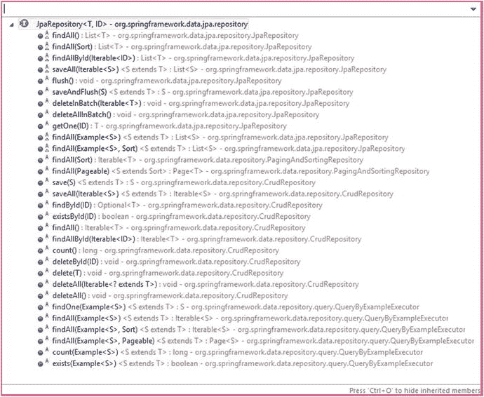

# 8. 使用 JPA

Java 持久化 API（JPA）是一个对象关系映射（ORM）框架，它是 Java EE 平台的一部分。JPA 通过让开发者使用面向对象的 API 而不是手动编写 SQL 查询，简化了数据访问层的实现。最流行的 JPA 实现包括 Hibernate、EclipseLink 和 OpenJPA。

Spring 框架提供了一个 Spring ORM 模块，以便轻松集成 ORM 框架。你还可以将 Spring 的声明式事务管理功能与 JPA 结合使用。除了 Spring ORM 模块，Spring Data 项目组合还提供了一个基于 Spring 的一致编程模型，用于访问关系型数据库和 NoSQL 数据存储。

Spring Data 集成了大多数流行的数据访问技术，包括 JPA、MongoDB、Redis、Cassandra、Solr、ElasticSearch 等。

本章将探讨 Spring Data JPA，解释如何将其与 Spring Boot 一起使用，并研究如何在同一个 Spring Boot 应用程序中处理多个数据库。

## 介绍 Spring Data JPA

第 1 章讨论了如何在不使用 Spring Boot 的情况下，使用 SpringMVC 和 JPA 开发 Web 应用程序。如果不使用 Spring Boot，你需要自行配置各种 Bean，例如 `DataSource`、`TransactionManager`、`LocalContainerEntityManagerFactoryBean` 等。你可以使用 Spring Boot JPA 启动器 `spring-boot-starter-data-jpa` 来快速启动并运行 JPA。在深入了解如何使用 `spring-boot-starter-data-jpa` 之前，让我们先看看 Spring Data JPA。

如第 5 章所述，Spring Data 是一个伞形项目，它以一种一致的编程模型为大多数流行的数据访问技术（包括 JPA、MongoDB、Redis、Cassandra、Solr 和 ElasticSearch）提供数据访问支持。Spring Data JPA 是使用 JPA 处理关系型数据库的模块之一。

有时，你可能需要实现数据管理应用程序来存储、编辑和删除数据。对于这些应用程序，你只需要实现实体的 CRUD（创建、读取、更新、删除）操作。Spring Data 没有让你一遍又一遍地实现相同的 CRUD 操作，或者推出你自己的通用 CRUD DAO 实现，而是提供了各种仓库抽象，例如 `CrudRepository`、`PagingAndSortingRepository`、`JpaRepository` 等。它们为 CRUD 操作以及分页和排序提供了开箱即用的支持。参见图 8-1。



图 8-1.

JpaRepository 方法

如图 8-1 所示，`JpaRepository` 提供了多种用于 CRUD 操作的方法，以及以下值得关注的方法：

*   `long count();`——返回可用的实体总数。
*   `boolean existsById(ID id);`——返回具有给定 ID 的实体是否存在。
*   `List<T> findAll(Sort sort);`——返回按给定选项排序的所有实体。
*   `Page<T> findAll(Pageable pageable);`——返回满足 `Pageable` 对象中提供的分页限制的实体页面。

Spring Data JPA 不仅提供了开箱即用的 CRUD 操作，还支持基于方法名称的动态查询生成。

例如：

*   通过定义一个 `User findByEmail(String email)` 方法，Spring Data 将自动生成带有 `where` 子句的查询，例如 `"where email = ?1"`。
*   通过定义一个 `User findByEmailAndPassword(String email, String password)` 方法，Spring Data 将自动生成带有 `where` 子句的查询，例如 `"where email = ?1 and password=?2"`。

注意

你还可以使用其他运算符，例如 `OR`、`LIKE`、`Between`、`LessThan`、`LessThanEqual` 等。有关支持操作的完整列表，请参阅 [`http://docs.spring.io/spring-data/jpa/docs/current/reference/html/#jpa.query-methods.query-creation`](http://docs.spring.io/spring-data/jpa/docs/current/reference/html/#jpa.query-methods.query-creation)。

但有时你可能无法使用方法名称来表达你的条件，或者方法名称看起来很不美观。Spring Data 提供了使用 `@Query` 注解显式配置查询的灵活性。

```
@Query("select u from User u where u.email=?1 and u.password=?2 and u.enabled=true")
User findByEmailAndPassword(String email, String password);
```

你还可以使用 `@Modifying` 和 `@Query` 执行数据更新操作，如下所示：

```
@Modifying
@Query("update User u set u.enabled=:status")
int updateUserStatus(@Param("status") boolean status)
```

请注意，此示例使用了命名参数 `:status` 而不是位置参数 `?1`。


## 在 Spring Boot 中使用 Spring Data JPA

现在您已经初步了解了 Spring Data JPA 及其提供的功能，本节将向您展示如何将其付诸实践。

1.  创建一个 Spring Boot Maven 项目，并添加以下依赖项。

    ```

    org.springframework.boot
    spring-boot-starter-data-jpa

    com.h2database
    h2

    org.springframework.boot
    spring-boot-starter-test
    test

    ```

2.  创建一个名为 `User` 的 JPA 实体和一个名为 `UserRepository` 的 JPA 仓库接口。  
3.  创建一个用户 JPA 实体，如清单 8-1 所示。

    ```
    @Entity
    @Table(name="USERS")
    public class User
    {
    @Id @GeneratedValue(strategy=GenerationType.AUTO)
    private Integer id;
    @Column(nullable=false)
    private String name;
    @Column(nullable=false, unique=true)
    private String email;
    private boolean disabled;
    //setters and getters
    }
    Listing 8-1.
    JPA Entity User.java
    ```

4.  通过扩展 `JpaRepository` 接口来创建 `UserRepository` 接口，如清单 8-2 所示。

    ```
    public interface UserRepository extends JpaRepository
    {
    }
    Listing 8-2.
    JPA Repository Interface UserRepository.java
    ```

5.  现在，您可以使用 SQL 脚本 `src/main/resources/data.sql` 填充一些示例数据：

    ```
    insert into users(id, name, email,disabled)
    values(1,'John','john@gmail.com', false);
    insert into users(id, name, email,disabled)
    values(2,'Rod','rod@gmail.com', false);
    insert into users(id, name, email,disabled)
    values(3,'Becky','becky@gmail.com', true);
    ```

    由于您配置了内存数据库（H2）驱动，Spring Boot 会自动注册一个 `DataSource`。由于您添加了 `spring-boot-starter-data-jpa` 依赖，Spring Boot 的自动配置会使用合理的默认值自动创建 JPA 相关的 Bean，例如 `LocalContainerEntityManagerFactoryBean`、`TransactionManager` 等。  
6.  创建一个名为 `SpringbootJPADemoApplication.java` 的 Spring Boot 入口类，如清单 8-3 所示。

    ```
    @SpringBootApplication
    public class SpringbootJPADemoApplication
    {
    public static void main(String[] args)
    {
    SpringApplication.run(SpringbootJPADemoApplication.class, args);
    }
    }
    Listing 8-3.
    SpringbootJPADemoApplication.java
    ```

7.  创建一个 JUnit 测试类来测试 `UserRepository` 的方法，如清单 8-4 所示。

    ```
    @RunWith(SpringRunner.class)
    @SpringBootTest
    public class SpringbootJPADemoApplicationTests
    {
    @Autowired
    private UserRepository userRepository;
    @Test
    public void findAllUsers()  {
    List users = userRepository.findAll();
    assertNotNull(users);
    assertTrue(!users.isEmpty());
    }
    @Test
    public void findUserById()  {
    Optional user = userRepository.getById(1);
    assertNotNull(user.get());
    }
    @Test
    public void createUser() {
    User user = new User(null, "Paul", "paul@gmail.com");
    User savedUser = userRepository.save(user);
    User newUser = userRepository.findById(savedUser.getId()).get();
    assertEquals("SivaPrasad", newUser.getName());
    assertEquals("sivaprasad@gmail.com", newUser.getEmail());
    }
    }
    Listing 8-4.
    SpringbootJPADemoApplicationTests.java
    ```

### 添加动态查询方法

现在，您将添加一些查找方法，以了解基于方法名称的动态查询生成是如何工作的。

要按名称获取用户，请使用：

```
User findByName(String name)
```

要按名称搜索用户，请使用：

```
List findByNameLike(String name)
```

上述方法会生成一个类似 `where u.name like ?1` 的 `where` 子句。

假设您想进行通配符搜索，例如 `where u.name like %?1%`。您可以按如下方式使用 `@Query`：

```
@Query("select u from User u where u.name like %?1%")
List searchByName(String name)
```

### 使用排序和分页功能

假设您想按名称升序获取所有用户。您可以按如下方式使用 `findAll(Sort sort)` 方法：

```
Sort sort = new Sort(Direction.ASC, "name");
List users = userRepository.findAll(sort);
```

您也可以对多个属性应用排序，如下所示：

```
Order order1 = new Order(Direction.ASC, "name");
Order order2 = new Order(Direction.DESC, "id");
Sort sort = Sort.by(order1, order2);
List users = userRepository.findAll(sort);
```

用户将首先按名称升序排序，然后按 ID 降序排序。

在许多 Web 应用程序中，您希望以分页的方式显示数据。Spring Data 使得以分页样式加载数据变得非常容易。假设您想在一页中加载前 25 个用户。我们可以使用 `Pageable` 和 `PageRequest` 按页获取结果，如下所示：

```
int size = 25;
int page = 0; //基于零的页码索引。
Pageable pageable = PageRequest.of(page, size);
Page usersPage = userRepository.findAll(pageable);
```

`usersPage` 将仅包含前 25 条用户记录。您可以获取其他详细信息，例如总页数、当前页码、是否有下一页、是否有上一页等。

*   `usersPage.getTotalElements();` — 返回元素总数。
*   `usersPage.getTotalPages();` — 返回总页数。
*   `usersPage.hasNext();`
*   `usersPage.hasPrevious();`
*   `List<User> usersList = usersPage.getContent();`

您也可以将分页与排序结合使用，如下所示：

```
Sort sort = new Sort(Direction.ASC, "name");
Pageable pageable = PageRequest.of(page, size, sort);
Page usersPage = userRepository.findAll(pageable);
```


### 使用多个数据库

如果你只需要处理单个数据库，Spring Boot 的自动配置可以开箱即用，并通过其属性提供了大量的自定义选项。

但如果你的应用程序需要对应用配置进行更精细的控制，你可以关闭特定的自动配置，并自行配置相关组件。

例如，你可能想在同一个应用程序中使用多个数据库。如果需要连接多个数据库，你需要显式地配置各种 Spring Bean，例如 `DataSources`、`TransactionManagers`、`EntityManagerFactoryBeans`、`DataSourceInitializers` 等。

假设你的应用程序中，安全数据存储在一个数据库/模式中，而订单相关数据存储在另一个数据库/模式中。

如果你添加了 `spring-boot-starter-data-jpa` 启动器，并且只定义了 `DataSource` Bean，那么 Spring Boot 会尝试自动创建一些 Bean（例如 `TransactionManager`），并假设只有一个数据源。这将会失败。

现在你将看到如何在 Spring Boot 中使用多个数据库，并构建基于 Spring Data JPA 的应用程序。

1.  使用 `data-jpa` 启动器创建一个 Spring Boot 应用程序。在 `pom.xml` 中配置以下依赖项：

```
    org.springframework.boot
    spring-boot-starter-data-jpa

mysql
    mysql-connector-java

```

2.  关闭 DataSource/JPA 自动配置。由于你将显式配置与数据库相关的 Bean，因此需要通过排除 `AutoConfiguration` 类来关闭 DataSource/JPA 自动配置，如清单 8-5 所示。

```
    @SpringBootApplication(
    exclude = { DataSourceAutoConfiguration.class,
    HibernateJpaAutoConfiguration.class,
    DataSourceTransactionManagerAutoConfiguration.class})
    @EnableTransactionManagement
    public class SpringbootMultipleDSDemoApplication
    {
    public static void main(String[] args)
    {
    SpringApplication.run(SpringbootMultipleDSDemoApplication.class, args);
    }
    }
    清单 8-5.
    SpringbootMultipleDSDemoApplication.java
    ```

由于你已经关闭了 `AutoConfigurations`，你需要通过使用 `@EnableTransactionManagement` 注解来显式启用 `TransactionManagement`。  
3.  配置 `datasource` 属性。在 `application.properties` 文件中配置 `Security` 和 `Orders` 数据库的连接参数。

```
    datasource.security.driver-class-name=com.mysql.jdbc.Driver
    datasource.security.url=jdbc:mysql://localhost:3306/security
    datasource.security.username=root
    datasource.security.password=admin
    datasource.security.initialize=true
    datasource.orders.driver-class-name=com.mysql.jdbc.Driver
    datasource.orders.url=jdbc:mysql://localhost:3306/orders
    datasource.orders.username=root
    datasource.orders.password=admin
    datasource.orders.initialize=true
    hibernate.hbm2ddl.auto=update
    hibernate.show-sql=true
    ```

在这里，你使用了自定义的属性键来配置两个 `datasource` 属性。  
4.  创建一个与安全相关的 JPA 实体和一个 JPA 仓库。然后创建一个 `User` 实体，如下所示：

```
    package com.apress.demo.security.entities;
    @Entity
    @Table(name="USERS")
    public class User
    {
    @Id @GeneratedValue(strategy=GenerationType.AUTO)
    private Integer id;
    @Column(nullable=false)
    private String name;
    @Column(nullable=false, unique=true)
    private String email;
    private boolean disabled;
    //setters & getters
    }
    ```

5.  创建 `UserRepository` 如下：

```
    package com.apress.demo.security.repositories;
    public interface UserRepository extends JpaRepository
    {
    }
    ```

请注意，你已经在 `com.apress.demo.security` 子包中创建了 `User.java` 和 `UserRepository.java`。  
6.  创建一个与订单相关的 JPA 实体和一个 JPA 仓库。创建一个 `Order` 实体如下：

```
    package com.apress.demo.orders.entities;
    @Entity
    @Table(name="ORDERS")
    public class Order
    {
    @Id @GeneratedValue(strategy=GenerationType.AUTO)
    private Integer id;
    @Column(nullable=false, name="cust_name")
    private String customerName;
    @Column(nullable=false, name="cust_email")
    private String customerEmail;
    //setters & getters
    }
    ```

创建 `OrderRepository` 如下：

```
    package com.apress.demo.orders.repositories;
    public interface OrderRepository extends JpaRepository
    {
    }
    ```

请注意，你已经在 `com.apress.demo.orders` 子包中创建了 `Order.java` 和 `OrderRepository.java`。  
7.  创建 SQL 脚本来初始化示例数据。在 `src/main/resources` 文件夹中创建 `security-data.sql` 脚本，用示例数据初始化 `USERS` 表。

```
    delete from users;
    insert into users(id, name, email,disabled)
    values(1,'John','john@gmail.com', false);
    insert into users(id, name, email,disabled)
    values(2,'Rob','rob@gmail.com', false);
    insert into users(id, name, email,disabled)
    values(3,'Remo','remo@gmail.com', true);
    ```

在 `src/main/resources` 文件夹中创建 `orders-data.sql` 脚本，用示例数据初始化 `ORDERS` 表。

```
    delete from orders;
    insert into orders(id, cust_name, cust_email)
    values(1,'Andrew','andrew@gmail.com');
    insert into orders(id, cust_name, cust_email)
    values(2,'Paul','paul@gmail.com');
    insert into orders(id, cust_name, cust_email)
    values(3,'Jimmy','jimmy@gmail.com');
    ```

8.  创建 `SecurityDBConfig.java` 配置类。你将在 `SecurityDBConfig.java` 中配置 Spring Bean，例如 `DataSource`、`TransactionManager`、`EntityManagerFactoryBean` 和 `DataSourceInitializer`，通过连接到 `Security` 数据库，如清单 8-6 所示。


```
    package com.apress.demo.config;
    @Configuration
    @EnableJpaRepositories(
    basePackages = "com.apress.demo.security.repositories",
    entityManagerFactoryRef = "securityEntityManagerFactory",
    transactionManagerRef = "securityTransactionManager"
    )
    public class SecurityDBConfig
    {
    @Autowired
    private Environment env;
    @Bean
    @ConfigurationProperties(prefix="datasource.security")
    public DataSourceProperties securityDataSourceProperties()
    {
    return new DataSourceProperties();
    }
    @Bean
    public DataSource securityDataSource()
    {
    DataSourceProperties securityDataSourceProperties = securityDataSourceProperties();
    return DataSourceBuilder.create()
    .driverClassName(securityDataSourceProperties.getDriverClassName())
    .url(securityDataSourceProperties.getUrl())
    .username(securityDataSourceProperties.getUsername())
    .password(securityDataSourceProperties.getPassword())
    .build();
    }
    @Bean
    public PlatformTransactionManager securityTransactionManager()
    {
    EntityManagerFactory factory = securityEntityManagerFactory().getObject();
    return new JpaTransactionManager(factory);
    }
    @Bean
    public LocalContainerEntityManagerFactoryBean securityEntityManagerFactory()
    {
    LocalContainerEntityManagerFactoryBean factory =
    new LocalContainerEntityManagerFactoryBean();
    factory.setDataSource(securityDataSource());
    factory.setPackagesToScan("com.apress.demo.security.entities");
    factory.setJpaVendorAdapter(new HibernateJpaVendorAdapter());
    Properties jpaProperties = new Properties();
    jpaProperties.put("hibernate.hbm2ddl.auto", env.getProperty("hibernate.hbm2ddl.auto"));
    jpaProperties.put("hibernate.show-sql", env.getProperty("hibernate.show-sql"));
    factory.setJpaProperties(jpaProperties);
    return factory;
    }
    @Bean
    public DataSourceInitializer securityDataSourceInitializer()
    {
    DataSourceInitializer dsInitializer = new DataSourceInitializer();
    dsInitializer.setDataSource(securityDataSource());
    ResourceDatabasePopulator dbPopulator = new ResourceDatabasePopulator();
    dbPopulator.addScript(new ClassPathResource("security-data.sql"));
    dsInitializer.setDatabasePopulator(dbPopulator);
    dsInitializer.setEnabled(env.getProperty("datasource.security.initialize",
    Boolean.class, false) );
    return dsInitializer;
    }
    }
    清单 8-6.
    SecurityDBConfig.java
    ```

请注意，您已通过使用 `@ConfigurationProperties(prefix="datasource.security")` 和 `DataSourceBuilder` 流畅 API 将 `datasource.security.*` 属性填充到 `DataSourceProperties` 中，从而创建了 `DataSource` bean。在创建 `LocalContainerEntityManagerFactoryBean` bean 时，您配置了名为 `com.apress.demo.security.entities` 的包以扫描 JPA 实体。您配置了 `DataSourceInitializer` bean 以从 `security-data.sql` 初始化示例数据。最后，您通过使用 `@EnableJpaRepositories` 注解启用了 Spring Data JPA 支持。由于您将拥有多个 `EntityManagerFactory` 和 `TransactionManager` bean，因此您通过指向相应的 bean 名称来配置了 `entityManagerFactoryRef` 和 `transactionManagerRef` 的 bean ID。您还配置了 `basePackages` 属性，以指示在哪里查找 Spring Data JPA 仓库（包）。
9.  创建 `OrdersDBConfig.java` 配置类。与 `SecurityDBConfig.java` 类似，您将创建 `OrdersDBConfig.java`，但将其指向 `Orders` 数据库。请参见清单 8-7。

```
    package com.apress.demo.config;
    @Configuration
    @EnableJpaRepositories(
    basePackages = "com.apress.demo.orders.repositories",
    entityManagerFactoryRef = "ordersEntityManagerFactory",
    transactionManagerRef = "ordersTransactionManager"
    )
    public class OrdersDBConfig
    {
    @Autowired
    private Environment env;
    @Bean
    @ConfigurationProperties(prefix="datasource.orders")
    public DataSourceProperties ordersDataSourceProperties()
    {
    return new DataSourceProperties();
    }
    @Bean
    public DataSource ordersDataSource()
    {
    DataSourceProperties primaryDataSourceProperties = ordersDataSourceProperties();
    return DataSourceBuilder.create()
    .driverClassName(primaryDataSourceProperties.getDriverClassName())
    .url(primaryDataSourceProperties.getUrl())
    .username(primaryDataSourceProperties.getUsername())
    .password(primaryDataSourceProperties.getPassword())
    .build();
    }
    @Bean
    public PlatformTransactionManager ordersTransactionManager()
    {
    EntityManagerFactory factory = ordersEntityManagerFactory().getObject();
    return new JpaTransactionManager(factory);
    }
    @Bean
    public LocalContainerEntityManagerFactoryBean ordersEntityManagerFactory()
    {
    LocalContainerEntityManagerFactoryBean factory = new LocalContainerEntityManagerFactoryBean();
    factory.setDataSource(ordersDataSource());
    factory.setPackagesToScan("com.apress.demo.orders.entities");
    factory.setJpaVendorAdapter(new HibernateJpaVendorAdapter());
    Properties jpaProperties = new Properties();
    jpaProperties.put("hibernate.hbm2ddl.auto",env.getProperty("hibernate.hbm2ddl.auto"));
    jpaProperties.put("hibernate.show-sql", env.getProperty("hibernate.show-sql"));
    factory.setJpaProperties(jpaProperties);
    return factory;
    }
    @Bean
    public DataSourceInitializer ordersDataSourceInitializer()
    {
    DataSourceInitializer dsInitializer = new DataSourceInitializer();
    dsInitializer.setDataSource(ordersDataSource());
    ResourceDatabasePopulator dbPopulator = new ResourceDatabasePopulator();
    dbPopulator.addScript(new ClassPathResource("orders-data.sql"));
    dsInitializer.setDatabasePopulator(dbPopulator);
    dsInitializer.setEnabled(env.getProperty("datasource.orders.initialize",
    Boolean.class, false));
    return dsInitializer;
    }
    }
    清单 8-7.
    OrdersDBConfig.java
    ```

请注意，您已使用 `datasource.orders.*` 属性创建了 `DataSource` bean，配置了 `com.apress.demo.orders.entities` 包以扫描 JPA 实体，并配置了 `DataSourceInitializer` bean 以使用 `orders-data.sql` 中的示例数据初始化数据库。
10. 现在，您将创建一个 JUnit 测试类，该类调用 JPA 仓库方法，如清单 8-8 所示。

```
    @RunWith(SpringRunner.class)
    @SpringBootTest
    public class SpringbootMultipleDSDemoApplicationTests
    {
    @Autowired
    private UserRepository userRepository;
    @Autowired
    private OrderRepository orderRepository;
    @Test
    public void findAllUsers()
    {
    List users = userRepository.findAll();
    assertNotNull(users);
    assertTrue(!users.isEmpty());
    }
    @Test
    public void findAllOrders()
    {
    List orders = orderRepository.findAll();
    assertNotNull(orders);
    assertTrue(!orders.isEmpty());
    }
    }
    清单 8-8.
    SpringbootMultipleDSDemoApplicationTests.java
    ```


### 为多数据源使用 OpenEntityManagerInViewFilter

如果在 Web 应用中按照上一节所述设置了多个数据库配置，并希望使用 `OpenEntityManagerInViewFilter` 在渲染视图时启用 JPA 实体 `LAZY` 关联集合的懒加载，则需要注册 `OpenEntityManagerInViewFilter` 的 Bean，如清单 8-9 所示。

```
@Configuration
public class WebMvcConfig
{
@Bean
public OpenEntityManagerInViewFilter primaryOpenEntityManagerInViewFilter()
{
OpenEntityManagerInViewFilter osivFilter =
new OpenEntityManagerInViewFilter();
osivFilter.setEntityManagerFactoryBeanName
("primaryEntityManagerFactory");
return osivFilter;
}
@Bean
public OpenEntityManagerInViewFilter reportingOpenEntityManagerInViewFilter()
{
OpenEntityManagerInViewFilter osivFilter =
new OpenEntityManagerInViewFilter();
osivFilter.setEntityManagerFactoryBeanName
("reportingEntityManagerFactory");
return osivFilter;
}
}
清单 8-9.
WebMvcConfig.java
```

这段代码通过设置两个 `EntityManagerFactory` 的 Bean 名称——`primaryEntityManagerFactory` 和 `reportingEntityManagerFactory`，配置了两个 `OpenEntityManagerInViewFilter` 的 Bean。

注意

要了解更多关于 Spring Data JPA 的信息，请访问官方 Spring Data JPA 文档：[`http://docs.spring.io/spring-data/jpa/docs/current/reference/html`](http://docs.spring.io/spring-data/jpa/docs/current/reference/html) 。

## 本章小结

本章介绍了 Spring Data JPA，并讲解了如何将其与 Spring Boot 结合使用。下一章将解释如何在 Spring Boot 应用中使用 MongoDB。

