# 10. 使用 Spring Boot 开发 Web 应用程序

Spring MVC 是基于模型-视图-控制器（MVC）设计模式的最流行的 Java Web 框架。自 Spring 3.0 版本起，Spring MVC 就提供了基于注解的请求映射功能，使用 `@Controller` 和 `@RequestMapping`。但是，配置 Spring MVC Web 应用程序组件（如 `DispatcherServlet`、`ViewResolver`、`MultiPartResolver` 和 `ExceptionHandler`）是一个重复且繁琐的过程。

Spring Boot 使得开始使用 Spring MVC 变得非常简单，因为 Spring Boot 的自动配置机制会为大多数组件（如 `DispatcherServlet`、`ViewResolver`、`ContentNegotiatingViewResolver`、`LocaleResolver`、`MessageCodesResolver` 等）配置默认值，并提供自定义选项。

传统上，JSP 用于视图渲染，但随着时间的推移，出现了许多其他视图模板技术，例如 Thymeleaf、Mustache、Groovy Templates、FreeMarker 等。Spring Boot 也为这些视图模板库提供了自动配置。

Spring Boot 提供了嵌入式 Servlet 容器支持，因此你可以将应用程序构建为自包含的部署单元。Spring Boot 开箱即用地支持 Tomcat、Jetty 和 Undertow Servlet 容器，并提供了自定义钩子来实现所有服务器级别的自定义。

本章将探讨如何使用 Web Starter 开发基于 Spring MVC 的 Web 应用程序，并将 Tomcat、Jetty 和 Undertow 作为嵌入式 Servlet 容器。你将学习如何自定义默认的 Spring MVC 配置，以及如何将 Servlet、过滤器和监听器注册为 Spring Bean。

你将学习如何使用 Thymeleaf 视图模板、如何执行表单验证、如何上传文件以及如何使用 ResourceBundle 进行国际化（i18n）。

最后，你将学习使用 `@ExceptionHandler` 和 `@ControllerAdvice` 注解处理异常的各种方法，以及 Spring Boot 如何使这一过程更加简单。

## 介绍 Spring MVC

Spring MVC 是一个基于 MVC 和前端控制器设计模式构建的强大 Web 框架。Spring MVC 提供了 `DispatcherServlet`，它作为前端控制器接收所有请求，并将处理委托给请求处理器（控制器）。处理完成后，`ViewResolver` 将根据视图名称渲染视图。图 10-1 展示了这个流程。

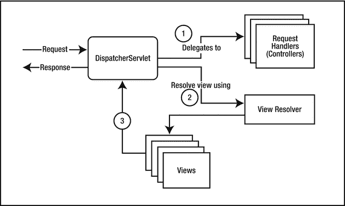

图 10-1.

Spring MVC 请求处理流程

Spring MVC 提供了基于注解的映射支持，可以使用 `@Controller` 和 `@RequestMapping` 注解将请求 URL 模式映射到处理器类（清单 10-1）。

```
@Controller
public class HomeController
{
@RequestMapping(value="/home", method=RequestMethod.GET)
public String home(Model model) {
model.addAttribute("message", "Hello Spring MVC!!");
return "home";
}
}
清单 10-1.
Spring MVC 基于注解的控制器
```

`HomeController` 类上的 `@Controller` 注解将其标记为请求处理器的 Spring 组件，`home()` 方法将处理对 `/home` URL 的 `GET` 请求。`ViewResolver` 会将逻辑视图名称 `"home"` 解析为视图模板，例如 `/WEB-INF/views/home.html`，然后渲染视图。

Spring 4.3 引入了 `@GetMapping`、`@PostMapping`、`@PutMapping` 等注解作为便捷的组合注解，这样你就不必在 `@RequestMapping(value="/url", method=RequestMethod.XXX)` 中指定 `method` 类型。参见清单 10-2。

```
@Controller
public class HomeController
{
@GetMapping("/home")
public String home(Model model) {
model.addAttribute("message", "Hello Spring MVC!!");
return "home";
}
@PostMapping("/users")
public String createUser(User user) {
userRepository.save(user);
return "users";
}
}
清单 10-2.
使用 @GetMapping 和 @PostMapping 注解
```

对于基于 Spring MVC 的 Web 应用程序，我们需要配置各种 Web 层组件，如 `DispatcherServlet`、`ViewResolver`、`LocaleResolver`、`HandlerExceptionResolver` 等。Spring Boot 提供了 Web Starter，它可以自动配置所有这些常用的 Web 层组件，从而使 Web 应用程序开发变得更加容易。


## 使用 Spring Boot 开发 Web 应用

Spring Boot 提供了 Web 启动器 `spring-boot-starter-web`，用于使用 Spring MVC 开发 Web 应用。Spring Boot 的自动配置会注册 Spring MVC 的 Bean，例如 `DispatcherServlet`、`ViewResolver`、`ExceptionHandler` 等。你可以将 Spring Boot Web 应用开发为 JAR 类型的模块（使用内嵌 Servlet 容器），或 WAR 类型的模块（可部署在任何外部 Servlet 容器上）。

```
org.springframework.boot
spring-boot-starter-web

```

`spring-boot-starter-web` 启动器默认将 `DispatcherServlet` 配置到 URL 模式 `"/"`，并添加 Tomcat 作为内嵌 Servlet 容器，运行在 8080 端口。

Spring Boot 默认从以下 `CLASSPATH` 位置提供静态资源（HTML、CSS、JS、图片等）：

*   `/static`
*   `/public`
*   `/resources`
*   `/META-INF/resources`

除了这些位置，你还可以使用 WebJars（[`http://www.webjars.org/`](http://www.webjars.org/)）来提供静态资源。Spring Boot 会自动处理对 `/webjars/` 路径的请求，并从 WebJars 的 JAR 文件中提供资源。你可以通过在 `application.properties` 文件中配置 `spring.resources.staticLocations` 属性来覆盖静态资源的位置。

```
spring.resources.staticLocations=classpath:/assets/
```

现在，你将学习如何创建一个 Spring Boot Web 项目，显示一个简单的 HTML 页面，并使用 CSS 和图片等静态资源。Bootstrap（[`http://getbootstrap.com/`](http://getbootstrap.com/)）是一个流行的 CSS 框架。本示例通过 WebJars 将 Bootstrap CSS 添加到项目中。

1.  创建一个包含 Web 启动器的 Spring Boot Maven 项目，并添加 Bootstrap WebJars 依赖。

    ```

    org.springframework.boot
    spring-boot-starter-web

    org.webjars.bower
    bootstrap
    3.3.7

    ```

2.  在 `src/main/resources/static/css` 文件夹中创建 `styles.css` 样式表。

    ```
    body {
    background-color: #A7A5A4;
    padding-top: 50px;
    }
    ```

3.  将一张图片（例如 `spring-boot.png`）复制到 `src/main/resources/static/images` 文件夹中。  
4.  在 `src/main/resources/public` 文件夹中创建 `index.html` 文件，并将 `bootstrap.css` 添加到 `index.html` 文件中。使用 Bootstrap 导航栏组件。

    ```

    Home

    Toggle navigation

    Project name

    Home
    About
    Contact

    Hello World!!

    ```

5.  创建一个应用程序入口点类。

    ```
    @SpringBootApplication
    public class SpringbootWebDemoApplication
    {
    public static void main(String[] args)
    {
    SpringApplication.run(SpringbootWebDemoApplication.class, args);
    }
    }
    ```

现在运行 `SpringbootWebDemoApplication` 并导航到 `http://localhost:8080/`。你应该能够看到带有 Bootstrap 导航栏的网页，如图 10-2 所示。

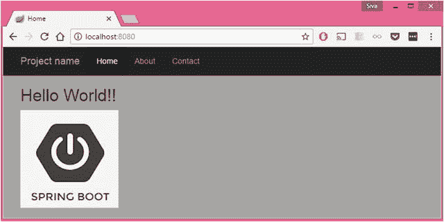

图 10-2.

使用 WebJars 集成 Bootstrap 组件的网页

默认情况下，Spring Boot Web 启动器使用 Tomcat 作为内嵌 Servlet 容器，并运行在 8080 端口。但是，你可以通过在 `application.properties` 中使用 `server.*` 来自定义服务器属性。

```
server.port=9090
server.servlet.context-path=/demo
server.servlet.path=/app
```

通过这些自定义配置，`DispatcherServlet` 被配置为处理 URL 模式 `/app`，根 `contextPath` 将是 `/demo`，Tomcat 现在运行在端口 `9090` 上。因此，你可以通过 `http://localhost:9090/demo/app/` 访问 `index.html` 文件。

## 使用 Tomcat、Jetty 和 Undertow 内嵌 Servlet 容器

如前所述，Spring Boot Web 启动器默认包含 Tomcat 作为内嵌 Servlet 容器。不过，你可以使用其他 Servlet 容器（如 Jetty 或 Undertow）来代替 Tomcat。

要使用 Jetty 作为内嵌容器，你只需排除 `spring-boot-starter-tomcat` 并添加 `spring-boot-starter-jetty`。

```
org.springframework.boot
spring-boot-starter-web

org.springframework.boot
spring-boot-starter-tomcat

org.springframework.boot
spring-boot-starter-jetty

```

Undertow（[`http://undertow.io/`](http://undertow.io/)）是一个用 Java 编写的 Web 服务器。它提供了基于 NIO 的阻塞和非阻塞 API。Spring Boot 也为 Undertow 服务器提供了自动配置支持。与 Jetty 类似，你可以按如下方式配置 Spring Boot 使用 Undertow 内嵌服务器代替 Tomcat：

```
org.springframework.boot
spring-boot-starter-web

spring-boot-starter-tomcat
org.springframework.boot

org.springframework.boot
spring-boot-starter-undertow

```

你可以分别使用 `server.tomcat.*`、`server.jetty.*` 和 `server.undertow.*` 属性来自定义 Tomcat、Jetty 和 Undertow Servlet 容器的各种属性。

```
server.tomcat.accesslog.directory=logs # 创建日志文件的目录。
server.tomcat.accesslog.enabled=false # 启用访问日志。
server.tomcat.accesslog.file-date-format=.yyyy-MM-dd # 日志文件名中的日期格式。
server.tomcat.basedir= # Tomcat 基础目录。如果未指定，将使用临时目录。
server.tomcat.max-connections= # 服务器在任何给定时间将接受和处理的最大连接数。
server.tomcat.max-http-header-size=0 # HTTP 消息头的最大大小（字节）。
server.tomcat.max-http-post-size=0 # HTTP POST 内容的最大大小（字节）。
server.tomcat.max-threads=0 # 最大工作线程数。
server.tomcat.min-spare-threads=0 # 最小工作线程数。
server.tomcat.port-header=X-Forwarded-Port # 用于覆盖原始端口值的 HTTP 头名称。
server.jetty.acceptors= # 要使用的接收器线程数。
server.jetty.accesslog.append=false # 追加到日志。
server.jetty.accesslog.date-format=dd/MMM/yyyy:HH:mm:ss Z
server.jetty.accesslog.enabled=false # 启用访问日志。
server.jetty.accesslog.filename= # 日志文件名。如果未指定，日志将被重定向到 "System.err"。
server.jetty.accesslog.log-cookies=false # 启用请求 cookie 的日志记录。
server.jetty.accesslog.log-latency=false # 启用请求处理时间的日志记录。
server.jetty.max-http-post-size=0 # HTTP POST 或 PUT 内容的最大大小（字节）。
server.undertow.accesslog.dir= # Undertow 访问日志目录。
server.undertow.accesslog.enabled=false # 启用访问日志。
server.undertow.accesslog.rotate=true # 启用访问日志轮转。
server.undertow.accesslog.suffix=log # 日志文件名的后缀。
server.undertow.buffer-size= # 每个缓冲区的大小（字节）。
server.undertow.io-threads= # 为工作线程创建的 I/O 线程数。
server.undertow.max-http-post-size=0 # HTTP POST 内容的最大大小（字节）。
```

使用 `org.springframework.boot.autoconfigure.web.ServerProperties` 类可以查看服务器自定义属性的完整列表。


## 自定义嵌入式 Servlet 容器

Spring Boot 提供了大量自定义选项，可通过 `server.*` 属性配置 Servlet 容器。你可以在 `application.properties` 中配置这些属性，以自定义 `port`、`connectionTimeout`、`contextPath`、SSL 配置参数以及会话配置参数。

但如果需要更多控制权，你可以根据要使用的嵌入式服务器，通过注册类型为 `TomcatServletWebServerFactory`、`JettyServletWebServerFactory` 或 `UndertowServletWebServerFactory` 的 Bean，以编程方式注册嵌入式 Servlet 容器。

需要以编程方式注册嵌入式 Servlet 容器的一个常见场景是将默认的 HTTP 请求重定向到 HTTPS 协议。

假设你的应用程序运行在 `http://localhost:8080` 上，并且你想使用 HTTPS 协议。如果有人访问 `http://localhost:8080`，你希望将请求重定向到 `https://localhost:8443`。

首先，使用以下命令生成自签名 SSL 证书：

```
keytool -genkey -alias mydomain -keyalg RSA -keysize 2048 -keystore KeyStore.jks -validity 3650
```

在回答 keytool 提出的问题后，它将生成一个 `KeyStore.jks` 文件，并将其复制到 `src/main/resources` 文件夹中。

现在，在 `application.properties` 文件中按如下方式配置 SSL 属性：

```
server.port=8443
server.ssl.key-store=classpath:KeyStore.jks
server.ssl.key-store-password=mysecret
server.ssl.keyStoreType=JKS
server.ssl.keyAlias=mydomain
```

如果你使用的是 Tomcat 嵌入式容器，可以按清单 10-3 所示，以编程方式注册 `TomcatServletWebServerFactory`。

```
@Configuration
public class TomcatConfiguration
{
@LocalServerPort
int serverPort;
@Bean
public ServletWebServerFactory servletContainer() {
TomcatServletWebServerFactory tomcat = new TomcatServletWebServerFactory() {
@Override
protected void postProcessContext(Context context) {
SecurityConstraint securityConstraint = new SecurityConstraint();
securityConstraint.setUserConstraint("CONFIDENTIAL");
SecurityCollection collection = new SecurityCollection();
collection.addPattern("/*");
securityConstraint.addCollection(collection);
context.addConstraint(securityConstraint);
}
};
tomcat.addAdditionalTomcatConnectors(initiateHttpConnector());
return tomcat;
}
private Connector initiateHttpConnector() {
Connector connector = new Connector("org.apache.coyote.http11.Http11NioProtocol");
connector.setScheme("http");
connector.setPort(8080);
connector.setSecure(false);
connector.setRedirectPort(serverPort);
return connector;
}
}
清单 10-3. 以编程方式注册 Tomcat 嵌入式容器
```

通过此自定义配置，对 `http://localhost:8080/` 的请求将自动重定向到 `https://localhost:8443/`。

## 自定义 SpringMVC 配置

大多数情况下，Spring Boot 的默认自动配置以及自定义属性足以调整你的 Web 应用程序。但有时，你可能需要以特定方式配置应用程序组件以满足应用需求，从而获得更多控制权。

如果你想利用 Spring Boot 的自动配置并添加一些额外的 MVC 配置（拦截器、格式化器、视图控制器等），那么你可以创建一个不带 `@EnableWebMvc` 注解的配置类，该类实现 `WebMvcConfigurer` 并提供额外的配置。参见清单 10-4。

注意

如果你想完全控制 Spring MVC 配置，可以添加一个使用 `@EnableWebMvc` 注解的自定义配置类。如果你创建了一个带有 `@Configuration` 和 `@EnableWebMvc` 注解的配置类，Spring Boot 的 WebMVC 自动配置将完全关闭。

```
@Configuration
public class WebConfig implements WebMvcConfigurer
{
@Override
public void addViewControllers(ViewControllerRegistry registry){
registry.addViewController("/login").setViewName("public/login");
registry.addRedirectViewController("/", "/home");
}
@Override
public void addInterceptors(InterceptorRegistry registry) {
//在此处添加额外的拦截器
}
@Override
public void addResourceHandlers(ResourceHandlerRegistry registry) {
registry.addResourceHandler("/assets/").addResourceLocations("/resources/assets/");
}
@Override
public void configureDefaultServletHandling(DefaultServletHandlerConfigurer configurer) {
configurer.enable();
}
@Override
public void addFormatters(FormatterRegistry registry) {
//在此处添加额外的格式化器
}
}
清单 10-4. 自定义 SpringMVC 配置
```

SpringMVC 提供了 `WebMvcConfigurerAdapter`，它是 `WebMvcConfigurer` 接口的一个实现。但从 Spring 5.0 开始，`WebMvcConfigurerAdapter` 已被弃用，因为 `WebMvcConfigurer` 具有默认方法实现，并使用了 Java 8 的默认方法支持。


## 将 Servlet、Filter 和 Listener 注册为 Spring Bean

你可以通过使用 `ServletRegistrationBean`、`FilterRegistrationBean` 和 `ServletListenerRegistrationBean` 的 Bean 定义来注册 Servlet、Filter 和 Listener。

假设你创建了清单 10-5 中所示的 Servlet，并使用 `@Component` 注解将其标记为 Spring Bean。

```
@Component
public class MyServlet extends HttpServlet
{
@Autowired
private UserService userService;
@Override
protected void doGet(HttpServletRequest req, HttpServletResponse resp)
throws ServletException, IOException {
resp.getWriter().write(userService.getMessage());
}
}
清单 10-5.
使用 @Component 注解将 MyServlet 定义为 Spring Bean
```

现在，你可以使用 `ServletRegistrationBean` 注册 `MyServlet`，并将其映射到 URL 模式 `/myServlet`，如清单 10-6 所示。

```
@Configuration
public class WebMvcConfig implements WebMvcConfigurer
{
@Autowired
private MyServlet myServlet;
@Bean
public ServletRegistrationBean myServletBean()
{
ServletRegistrationBean servlet = new ServletRegistrationBean();
servlet.setServlet(myServlet);
servlet.addUrlMappings("/myServlet");
return servlet;
}
...
...
}
清单 10-6.
使用 ServletRegistrationBean 注册 MyServlet
```

通过这种方法，你可以利用 Spring 的依赖注入功能来处理 Servlet、Filter 和 Listener。接下来，我们看看如何注册 Filter 和 Listener。

JavaMelody ( [`https://github.com/javamelody/javamelody/wiki`](https://github.com/javamelody/javamelody/wiki) ) 是一个可用于监控基于 Java 的 Web 应用程序的库。JavaMelody 可以提供关于运行中应用程序的各种指标，包括：

*   一个摘要，显示总执行次数、平均执行时间、CPU 时间和错误百分比。
*   当平均时间超过可配置阈值时，请求所花费的时间百分比。
*   完整的请求列表，聚合了无动态参数的请求，包含执行次数、平均执行时间、平均 CPU 时间、错误百分比以及执行时间随时间变化的趋势图。
*   每个 HTTP 请求都指示了流量响应的大小、SQL 平均执行次数和 SQL 平均时间。

将 JavaMelody 集成到 Java Web 应用程序中非常简单。你需要注册 `net.bull.javamelody.MonitoringFilter`（这是一个 Filter）和 `net.bull.javamelody.SessionListener`（这是一个 `HttpSessionListener`）。

清单 10-7 展示了如何使用 `FilterRegistrationBean` 和 `ServletListenerRegistrationBean` 将 JavaMelody 的 `MonitoringFilter` 和 `SessionListener` 配置为 Spring Bean。

```
@Configuration
public class WebMvcConfig implements WebMvcConfigurer
{
@Bean(name = "javamelodyFilter")
public FilterRegistrationBean javamelodyFilterBean() {
FilterRegistrationBean registration = new FilterRegistrationBean();
registration.setFilter(new MonitoringFilter());
registration.addUrlPatterns("/*");
registration.setName("javamelodyFilter");
registration.setAsyncSupported(true);
registration.setDispatcherTypes(DispatcherType.REQUEST, DispatcherType.ASYNC);
return registration;
}
@Bean(name = "javamelodySessionListener")
public ServletListenerRegistrationBean sessionListener() {
return new ServletListenerRegistrationBean(new SessionListener());
}
}
清单 10-7.
注册 JavaMelody 的 MonitoringFilter 和 SessionListener
```

通过此配置，你可以启动应用程序，并在 `http://localhost:8080/monitoring` 查看 JavaMelody 的监控仪表盘。参见图 10-3。

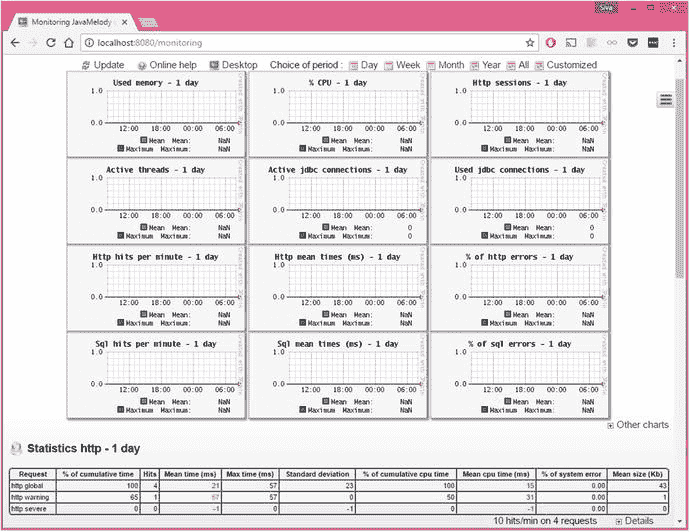

图 10-3.

JavaMelody 监控仪表盘

## 作为可部署 WAR 的 Spring Boot Web 应用程序

Spring Boot Web 应用程序也可以使用 WAR 类型打包进行开发。如果要构建一个可部署的 WAR 文件，首先要做的就是更改 `packaging` 类型。

如果你使用 Maven，则在 `pom.xml` 中将 `packaging` 类型更改为 `war`。

```
war
```

如果你使用 Gradle，则需要应用 WAR 插件。

```
apply plugin: 'war'
```

当你添加 `spring-boot-starter-web` 依赖时，它也会传递性地添加 `spring-boot-starter-tomcat` 依赖。因此，你需要将 `spring-boot-starter-tomcat` 添加为 `provided` 作用域，这样它就不会被打包到 WAR 文件中。

```
org.springframework.boot
spring-boot-starter-tomcat
provided

```

如果你使用 Gradle，则按如下方式添加 `providedRuntime` 作用域的 `spring-boot-starter-tomcat`：

```
dependencies {
...
providedRuntime 'org.springframework.boot:spring-boot-starter-tomcat'
...
}
```

最后，你需要提供一个 `SpringBootServletInitializer` 的子类，并重写其 `configure()` 方法。你可以简单地让应用程序的入口点类继承 `SpringBootServletInitializer`，如清单 10-8 所示。

```
@SpringBootApplication
public class SpringbootWebDemoApplication extends SpringBootServletInitializer {
@Override
protected SpringApplicationBuilder configure(SpringApplicationBuilder application) {
return application.sources(SpringbootWebDemoApplication.class);
}
public static void main(String[] args) throws Exception {
SpringApplication.run(SpringbootWebDemoApplication.class, args);
}
}
清单 10-8.
实现 SpringBootServletInitializer
```

现在，运行 Maven/Gradle 构建工具将生成一个 WAR 文件，该文件可以部署到外部服务器上。

## Spring Boot 支持的视图模板

Java Server Pages (JSP) 是传统基于 Java 的 Web 应用程序中最常用的视图模板技术。然而，出现了新的视图模板库，例如 Thymeleaf、Mustache 等，作为 JSP 的替代方案。

Spring Boot 为以下视图模板技术提供了自动配置。

*   Thymeleaf ( [`http://www.thymeleaf.org/`](http://www.thymeleaf.org/) )
*   Mustache ( [`http://mustache.github.io/`](http://mustache.github.io/) )
*   Groovy ( [`http://docs.groovy-lang.org/docs/next/html/documentation/template-engines.html#_the_markuptemplateengine`](http://docs.groovy-lang.org/docs/next/html/documentation/template-engines.html#_the_markuptemplateengine) )
*   FreeMarker ( [`http://freemarker.org/docs/`](http://freemarker.org/docs/) )

尽管 Spring MVC 支持 JSP，但在使用嵌入式 Servlet 容器的 Spring Boot 应用程序中使用 JSP 存在一些已知的限制 ( [`http://docs.spring.io/spring-boot/docs/current/reference/htmlsingle/#boot-features-jsp-limitations`](http://docs.spring.io/spring-boot/docs/current/reference/htmlsingle/#boot-features-jsp-limitations) )。但 JSP 在 Spring Boot 的 WAR 类型模块中运行良好。


### 使用 Thymeleaf 视图模板

Thymeleaf 是一个服务端 Java 模板引擎，支持与 SpringMVC 和 SpringSecurity 集成。在众多支持的视图模板中，Thymeleaf 是 Spring Boot 应用中最流行的一个。

在本节中，你将了解如何在 Spring Boot Web 应用中使用 Thymeleaf。

创建一个包含 `spring-boot-starter-thymeleaf` 起步依赖的 Spring Boot Maven 项目。

```

org.springframework.boot
spring-boot-starter-web

org.springframework.boot
spring-boot-starter-thymeleaf

```

`ThymeleafAutoConfiguration` 将负责注册 `TemplateResolver`、`ThymeleafViewResolver`、`SpringResourceTemplateResolver` 和 `SpringTemplateEngine`。默认情况下，Spring Boot 从 `classpath:/templates/` 目录加载 Thymeleaf 视图模板。

现在创建一个控制器来处理 `"/home"` 请求。

```
@Controller
public class HomeController
{
@GetMapping("/home")
public String home(Model model) {
model.addAttribute("message", "Spring Boot + Thymeleaf rocks");
return "home";
}
}
```

此示例将字符串 `"Spring Boot + Thymeleaf rocks"` 添加到模型中，键为 `"message"`，你希望在 Thymeleaf 模板中渲染该值。

在 `src/main/resources/templates` 目录中创建名为 `home.html` 的 Thymeleaf 视图。

```

Home

Welcome 
Message

```

这将使用 `th:text="${message}"` 在 Thymeleaf 模板中显示模型属性 `"message"` 的值。

现在运行以下入口点类。

```
@SpringBootApplication
public class SpringbootThymeleafDemoApplication
{
public static void main(String[] args)
{
SpringApplication.run(SpringbootThymeleafDemoApplication.class, args);
}
}
```

在浏览器中访问 `http://localhost:8080/home`。你应该能看到响应 `Spring Boot + Thymeleaf rocks`。


### 使用 Thymeleaf 表单

Thymeleaf 提供了非常出色的 Spring 集成，支持以下功能：

*   使用带有支持 bean 和结果/错误绑定的表单
*   使用属性编辑器和转换服务
*   使用 ResourceBundle 显示国际化（i18n）消息
*   使用 Spring 表达式语言（Spring EL）

在本节中，你将看到如何使用 Thymeleaf 创建用户注册表单，并使用 Spring 控制器处理表单提交。

创建一个名为 `User.java` 的简单 POJO，如清单 10-9 所示。

```
public class User
{
private Long id;
private String name;
private String email;
private String password;
//setters & getters
}
清单 10-9.
User.java
```

在 `src/main/resources/templates` 目录中创建 `registration.html` 文件，如清单 10-10 所示。

```

用户注册

用户注册表单

姓名

电子邮件

密码

提交

清单 10-10.
Thymeleaf 注册视图 src/main/resources/templates/registration.html
```

创建一个 SpringMVC 控制器来处理对 `/registration` URL 的 `GET` 和 `POST` 请求，如清单 10-11 所示。

```
@Controller
public class RegistrationController
{
@GetMapping("/registration")
public String registrationForm(Model model) {
model.addAttribute("user", new User());
return "registration";
}
@PostMapping("/registration")
public String handleRegistration(User user) {
logger.debug("Registering User : "+user);
return "redirect:/login";
}
}
清单 10-11.
RegistrationController.java
```

当你请求 `"/registration"` URL 时，会触发一个 `GET` 请求，并由 `RegistrationController.registrationForm()` 方法处理。你将 `User` 对象以 `"user"` 键添加到 `Model` 中，以便可以在 Thymeleaf 表单中绑定表单属性。

请注意，此示例使用了两个 Thymeleaf 属性——`th:action` 用于构建上下文相关的 URL，`th:object` 用于指定模型属性名称。

```
...
...

```

该示例对表单输入字段使用了 `th:field="*{propertyName}"` 语法，以便该字段将由模型对象属性支持。因此，当你使用 `<input type="text" th:field="*{name}"/>` 时，`name` 输入字段值将绑定到 `user.name` 属性。如果你查看渲染后表单的源代码，`<input type="text" th:field="*{name}"/>` 会被渲染如下：

```

表单验证

验证用户提交的数据在 Web 应用程序中至关重要。
Spring 使用其自身的验证框架支持数据验证，
并支持 Java Bean 验证 API。

首先，你需要使用 Java Bean
验证注解指定用户验证规则。

```
public class User
{
private Long id;
@NotNull
@Size(min=3, max=50)
private String name;
@NotNull
@Email(message="{invalid.email}")
private String email;
@NotNull
@Size(min=6, max=50)
private String password;
//setters & getters
}
```

Thymeleaf 提供了 `#fields.hasErrors('fieldName')` 语法
来检查 `fieldName` 字段是否存在任何错误。

```
数据不正确
```

你可以使用 `#fields.hasErrors('global')`
来检查是否存在任何全局错误（与任何特定字段无关）。

你现在可以更新 `registration.html` 以
显示验证错误，如清单 10-12 所示。

```

用户注册

用户注册表单

数据不正确

姓名

数据不正确

电子邮件

数据不正确

密码

数据不正确

提交

清单 10-12.
包含验证错误标签的 registration.html 文件
```

使用此更新后的表单，如果存在任何表单验证失败，它将在字段旁边显示这些错误，并在开头显示所有全局错误。请注意，此示例使用 `th:classappend="${#fields.hasErrors('email')}? 'has-error'"` 在存在任何错误时动态添加一些 CSS 样式。

你需要更新 `"/registration" POST` 处理程序方法以触发模型对象的验证。你可以向模型参数添加 `@Valid` 注解以在表单提交时执行验证。

你还需要在模型对象之后立即定义 `BindingResult` 参数。验证错误将填充到 `BindingResult` 中，你可以在方法体中稍后检查它。

```
@Controller
public class RegistrationController
{
...
...
@PostMapping("/registration")
public String handleRegistration(@Valid User user, BindingResult result) {
logger.debug("Registering User : "+user);
if(result.hasErrors()){
return "registration";
}
return "redirect:/registrationsuccess";
}
}
```

当使用无效数据提交表单时，这些验证错误将填充到 `BindingResult` 中。该示例检查是否存在任何错误，并重新显示注册表单，该表单将连同错误一起渲染。

有时，你无法仅使用注解来表达所有验证规则。例如，你希望用户电子邮件是唯一的。如果不检查数据库，你就无法实现这一点。

接下来，你将看到如何使用 Spring 的验证框架来实现复杂的验证。

你可以通过实现 `org.springframework.validation.Validator` 接口来创建 `UserValidator`，如清单 10-13 所示。

```
@Component
public class UserValidator implements Validator
{
@Autowired
UserRepository userRepository;
@Override
public boolean supports(Class clazz)
{
return User.class.isAssignableFrom(clazz);
}
@Override
public void validate(Object target, Errors errors)
{
User user = (User) target;
String email = user.getEmail();
User userByEmail = userRepository.findByEmail(email);
if(userByEmail != null){
errors.rejectValue("email",
"email.exists",
new Object[]{email},
"Email "+email+" already in use");
}
}
}
清单 10-13.
UserValidator.java
```

在 `validate(Object target, Errors errors)` 方法中，你可以实现任何复杂的验证逻辑并注册错误。

现在，你可以将 `UserValidator` 注入到 `RegistrationController` 中，并使用它来验证模型对象，如下所示：

```
@Controller
public class RegistrationController
{
@Autowired
private UserValidator userValidator;
@PostMapping("/registration")
public String handleRegistration(@Valid User user, BindingResult result) {
userValidator.validate(user, result);
if(result.hasErrors()){
return "registration";
}
return "redirect:/registrationsuccess";
}
}
```

当表单随后被提交时，如果根据 Bean 验证约束注解存在任何验证失败，它们将填充到 `BindingResult` 中。之后，该示例使用 `userValidator.validate(user, result)` 检查重复的电子邮件。如果给定的电子邮件已存在，这将向 `email` 属性添加一个错误。

文件上传

Spring Boot 的 `org.springframework.boot.autoconfigure.web.servlet.MultipartAutoConfiguration` 默认启用多部分上传。

你可以创建一个带有 `enctype="multipart/form-data"` 的表单来上传文件，如清单 10-14 所示。

```

清单 10-14.
文件上传表单
```

然后，你可以实现 `FileUploadController` 来处理请求，如清单 10-15 所示。

```
@PostMapping("/uploadMyFile")
public String handleFileUpload(@RequestParam("myFile") MultipartFile file)
{
if (!file.isEmpty())
{
String name = file.getOriginalFilename();
try
{
byte[] bytes = file.getBytes();
Files.write(new File(name).toPath(), bytes);
}
catch (Exception e)
{
e.printStackTrace();
}
}
return "redirect:/fileUpload";
}
清单 10-15.
FileUploadController.java
```

请注意，此示例将 `file` 类型的输入参数 `myFile` 绑定到 `MultipartFile` 参数，使用 `@RequestParam("myFile")`，从中你可以提取 `byte[]` 或 `InputStream`。

你可以使用以下属性自定义多部分配置：

```
spring.servlet.multipart.enabled=true
spring.servlet.multipart.max-file-size=2MB
spring.servlet.multipart.max-request-size=20MB
spring.servlet.multipart.file-size-threshold=5MB
```

使用 ResourceBundle 进行国际化（i18n）

默认情况下，Spring Boot 的 `org.springframework.boot.autoconfigure.context.MessageSourceAutoConfiguration` 会注册一个基础名称为 `"messages"` 的 `MessageSource` bean。

你可以在根类路径中添加诸如 `messages.properties`、`messages_en.properties` 和 `messages_fr.properties` 之类的 ResourceBundle，Spring Boot 会自动拾取它们。你还可以使用 `spring.messages.basename` 属性自定义 ResourceBundle 的 `basename`。

除此之外，Spring Boot 还提供了以下自定义属性。

```
spring.messages.basename=messages
spring.messages.cache-seconds=-1(缓存过期时间（秒）。如果设置为 -1，则捆绑包将永久缓存)
spring.messages.encoding=UTF-8
spring.messages.fallback-to-system-locale=true
```

在 `src/main/resources/` 文件夹中创建默认的 ResourceBundle `messages.properties`，如下所示：

```
app.title=SpringBoot Thymeleaf Demo
app.version=1.0
email.exists=Email {0} is already in use.
```

你可以使用 `th:text="#{msgKey}"` 在 Thymeleaf 模板中渲染这些值。

```
应用标题
```

你还可以从 `MessageSource` 以编程方式获取这些消息，如清单 10-16 所示。

```
@Controller
public class RegistrationController
{
@Autowired
private MessageSource messageSource;
....
....
public String handleRegistration(User user)
{
...
String code="email.exists";
Object[] args = new Object[]{email};
String defaultMsg = "Email "+email+" already in use";
Locale locale = Locale.getDefault();
String errorMsg =
messageSource.getMessage(code, args, defaultMsg, locale);
...
}
}
清单 10-16.
以编程方式读取 i18n 消息
```

用于 Hibernate 验证错误的 ResourceBundle

Spring Boot 使用 Hibernate Validator 作为 Bean 验证 API 的实现。默认情况下，Hibernate 验证会在根类路径中查找 `ValidationMessages.properties` 文件以获取失败消息键。如果你想将 `messages.properties` 同时用于 i18n 和 Hibernate 验证错误消息，你可以注册 `Validator` bean，如清单 10-17 所示。

```
@Configuration
public class WebConfig implements WebMvcConfigurer
{
...
...
@Autowired
private MessageSource messageSource;
@Override
public Validator getValidator() {
LocalValidatorFactoryBean factory = new LocalValidatorFactoryBean();
factory.setValidationMessageSource(messageSource);
return factory;
}
}
清单 10-17.
为 Hibernate 验证消息使用 MessageSource
```

使用此配置，国际化（i18n）和 Hibernate 验证错误消息键都将从 `messages*.properties` 文件中获取。

错误处理

你可以通过注册 `SimpleMappingExceptionResolver` bean 并配置为哪种异常类型渲染哪个视图来处理 Spring MVC 应用程序中的异常，如清单 10-18 所示。

```
@Configuration
@EnableWebMvc
public class WebMvcConfig implements WebMvcConfigurer
{
@Bean(name="simpleMappingExceptionResolver")
public SimpleMappingExceptionResolver simpleMappingExceptionResolver()
{
SimpleMappingExceptionResolver exceptionResolver = new SimpleMappingExceptionResolver();
Properties mappings = new Properties();
mappings.setProperty("DataAccessException", "dbError");
mappings.setProperty("RuntimeException", "error");
exceptionResolver.setExceptionMappings(mappings);
exceptionResolver.setDefaultErrorView("error");
return exceptionResolver;
}
}
清单 10-18.
使用 SimpleMappingExceptionResolver 处理异常
```

你还可以使用 `@ExceptionHandler` 注解为特定的异常类型定义处理程序方法，如清单 10-19 所示。

```
@Controller
public class CustomerController
{
@GetMapping("/customers/{id}")
public String findCustomer(@PathVariable Long id, Model model)
{
Customer c = customerRepository.findById(id);
if(c == null) throw new CustomerNotFoundException();
model.add("customer", c);
return "view_customer";
}
@ExceptionHandler(CustomerNotFoundException.class)
public ModelAndView handleCustomerNotFoundException(CustomerNotFoundException ex)
{
ModelAndView model = new ModelAndView("error/404");
model.addObject("exception", ex);
return model;
}
}
清单 10-19.
使用控制器级别的 @ExceptionHandler 处理异常
```

`CustomerController` 中的 `handleCustomerNotFoundException()` 方法将仅处理从 `CustomerController @RequestMapping` 方法中抛出的 `CustomerNotFoundException` 异常。

你可以通过创建一个使用 `@ControllerAdvice` 注解的异常处理程序类来全局处理异常。`@ControllerAdvice` 类中的 `@ExceptionHandler` 方法处理在任何控制器请求处理方法中发生的错误。参见清单 10-20。

```
@ControllerAdvice
public class GlobalExceptionHandler
{
private static final Logger logger = LoggerFactory.getLogger(GlobalExceptionHandler.class);
@ExceptionHandler(DataAccessException.class)
public String handleDataAccessException(HttpServletRequest request, DataAccessException ex){
logger.info("DataAccessException Occurred:: URL="+request.getRequestURL());
return "db_error";
}
@ExceptionHandler(ServletRequestBindingException.class)
public String servletRequestBindingException(ServletRequestBindingException e) {
logger.error("ServletRequestBindingException occurred: "+e.getMessage());
return "validation_error"
}
}
清单 10-20.
使用 @ControllerAdvice 的全局异常处理程序
```

Spring Boot 默认注册一个全局错误处理程序并映射 `/error`，它为浏览器客户端渲染 HTML 响应，为 REST 客户端渲染 JSON 响应。你可以通过实现 `ErrorController` 提供自定义错误页面。参见清单 10-21。

```
@Controller
public class GenericErrorController implements ErrorController
{
private static final String ERROR_PATH = "/error";
@RequestMapping(ERROR_PATH)
public String error(){
return "errorPage.html";
}
@Override
public String getErrorPath() {
return ERROR_PATH;
}
}
清单 10-21.
实现自定义 ErrorController
```

你还可以根据 HTTP 错误状态码提供自定义错误页面。Spring Boot 在静态资源位置（`classpath:/static`、`classpath:/public` 等）下的 `/error` 文件夹中查找错误页面。

例如，当发生 404 错误时，你可以显示 `src/main/resources/static/error/404.html` 文件。同样，你也可以为所有带有 `5xx` 错误状态码的服务器错误显示 `src/main/resources/static/error/5xx.html` 文件。

总结

本章讨论了如何使用 Spring Boot 和 Thymeleaf 视图模板开发 Web 应用程序。还介绍了如何使用 Bean 验证 API 和 Spring 的验证框架执行表单验证。你学习了如何在控制器级别和全局级别处理异常场景。在下一章中，你将学习如何使用 Spring Boot 开发 RESTful Web 服务。

11. 使用 Spring Boot 构建 REST API

REST（表述性状态转移）是一种用于构建分布式系统的架构风格，它提供了异构系统之间的互操作性。随着移动设备的急剧增加，对 REST API 的需求大大增加。构建 REST API 并让 Web 和移动客户端消费该 API，而不是开发单独的应用程序，这变得合乎逻辑。

SpringMVC 为构建 RESTful Web 服务提供了一流的支持。由于 Spring 的 REST 支持是构建在 SpringMVC 之上的，你可以利用 SpringMVC 的知识来构建 REST API。

Spring Data REST 是一个 Spring 组合项目，可用于将 Spring Data 存储库公开为 REST 端点。你可以毫不费力地将 Spring Data JPA、Spring Data Mongo 和 Spring Data Cassandra 存储库公开为 REST 端点。

本章涵盖 RESTful Web 服务，包括如何使用 SpringMVC 构建 REST API。然后你将学习如何使用 Spring Data REST 构建 REST API。

RESTful Web 服务简介

REST 代表表述性状态转移，是一种用于设计分布式超媒体系统的架构风格。REST 一词由 Roy Fielding 于 2000 年在他的博士论文中提出，你可以在以下网址找到： [`http://www.ics.uci.edu/~fielding/pubs/dissertation/rest_arch_style.htm`](http://www.ics.uci.edu/%7Efielding/pubs/dissertation/rest_arch_style.htm) 。

基于 REST 的系统的基本概念是资源，它可以通过统一资源标识符（URI）来标识。对于基于 Web 的系统，HTTP 是与外部系统通信最常用的协议。你可以使用 URI 标识唯一的资源。

例如，一篇博客文章可以通过 URI [`http://www.myblog.com/posts/restful-architecture`](http://www.myblog.com/posts/restful-architecture) 来标识。资源可以是集合资源，它表示一组分组的资源。例如，URI [ `http://www.myblog.com/posts/`
](http://www.myblog.com/posts/) 表示 `posts` 资源，它可能包含零个或多个 `Post` 资源，每个资源都可以通过其自己的 URI 来标识。可以对资源执行的各种操作可以使用其 URI 以及适当的 HTTP 方法（`GET`、`POST`、`PUT`、`DELETE` 等）来表达。

例如，假设你正在为博客应用程序构建 REST API。在博客域中可以标识的资源是文章、评论和用户。

遵循 REST 原则，你可以使用以下 HTTP 动词：

*   `GET`—获取集合或单个资源
*   `POST`—创建新资源
*   `PUT`—更新现有资源
*   `DELETE`—删除集合或单个资源

现在考虑如何为博客系统的资源定义 URI：

*   `GET`—`http://localhost:8080/myblog/posts/`：返回所有文章的列表
*   `GET`—`http://localhost:8080/myblog/posts/2`：返回 ID 为 2 的文章
*   `POST`—`http://localhost:8080/myblog/posts/`：创建一个新的 `Post` 资源
*   `PUT`—`http://localhost:8080/myblog/posts/2`：更新 ID 为 2 的 POST 资源
*   `DELETE`—`http://localhost:8080/myblog/posts/2`：删除 ID 为 2 的 POST 资源
*   `GET`—`http://localhost:8080/myblog/posts/2/comments`：返回 ID 为 `2` 的文章的所有评论
*   `POST`—`http://localhost:8080/myblog/posts/2/comments`：为 ID 为 2 的 `POST` 创建新评论
*   `DELETE`—`http://localhost:8080/myblog/posts/2/comments`：删除 ID 为 2 的 `POST` 的所有评论

最常用的数据交换格式（ContentTypes）是 JSON 和 XML。在基于 Web 的系统中，确定输入请求内容和输出响应类型的典型做法是基于 `ContentType` 和 `Accept` 标头值。

使用 SpringMVC 的 REST API

SpringMVC 为构建 RESTful Web 服务提供支持，Spring Boot 通过其自动配置机制使其变得更加容易。

清单 11-1 显示了一个基于 SpringMVC 的 REST 端点。

```
@Controller
public class PostController
{
@Autowired
PostRepository postRepository;
@ResponseBody
@GetMapping("/posts")
public List listPosts()
{
return postRepository.findAll();
}
}
清单 11-1.
SpringMVC REST 控制器
```

它看起来就像一个普通的 SpringMVC 控制器，有两个明显的区别：

*   与返回视图名称或 `ModelAndView` 对象的普通控制器方法不同，`listPosts()` 方法返回一个 `Post` 对象列表。
*   `listPosts()` 请求处理程序方法使用 `@ResponseBody` 注解。

请求处理程序方法上的 `@ResponseBody` 注解表示返回值应绑定到响应体。如果你向 `"/posts"` URL 发出 `GET` 请求，你可能会根据 `Accept` 标头值获得 `Post` 对象列表的 JSON 或 XML 表示。

清单 11-2 显示了用于创建新文章的另一方法。

```
@Controller
public class PostController
{
@Autowired
PostRepository postRepository;
...
...
@ResponseBody
@PostMapping("/posts")
public Post createPost(@RequestBody Post post)
{
return postRepository.save(post);
}
}
清单 11-2.
使用 @RequestBody 注解的 REST 控制器方法
```

在 `createPost()` 处理程序方法中，有趣的部分是 `@RequestBody` 注解。`@RequestBody` 注解将借助注册的 `HttpMessageConverter` 负责将 Web 请求体绑定到方法参数。因此，当你使用 `Post` JSON 体向 `"/post"` URL 发出 `POST` 请求时，`HttpMessageConverters` 会将 JSON 请求体转换为 `Post` 对象并将其传递给 `savePost()` 方法。

如果你所有的处理程序方法都是 REST 端点处理程序方法，你可以在类级别使用 `@ResponseBody`，而不是将其添加到每个方法。更好的是，你可以使用 `@RestController`，它是 `@Controller` 和 `@ResponseBody` 的组合注解。

现在你将深入研究如何使用 Spring Data JPA、SpringMVC 以及当然还有 Spring Boot 为简单的博客应用程序实现 REST API。

1.  创建一个 Spring Boot 项目并配置 Web 和 JPA 启动器。

    创建一个 Spring Boot Maven 项目并添加以下启动器：

    ```
    org.springframework.boot
    spring-boot-starter-web

    org.springframework.boot
    spring-boot-starter-data-jpa

    com.h2database
    h2

    ```

    对 REST 资源进行建模。此示例假设你的博客应用程序是一个简单的应用程序，管理员可以在其中创建文章，博客查看者可以查看文章并添加评论。因此，你可以确定应用程序域中将存在 `User`、`Post` 和 `Comment` 资源。

    首先，你将这些资源创建为 JPA 实体，如清单 11-3 所示。

    ```
    @Entity
    @Table(name = "USERS")
    public class User
    {
    @Id @GeneratedValue(strategy = GenerationType.IDENTITY)
    private Integer id;
    @Column(name = "name", nullable = false, length = 150)
    private String name;
    @Column(name = "email", nullable = false, length = 150)
    private String email;
    @Column(name = "password", nullable = false, length = 150)
    private String password;
    //setters & getters
    }
    @Entity
    @Table(name = "POSTS")
    public class Post
    {
    @Id @GeneratedValue(strategy = GenerationType.IDENTITY)
    private Integer id;
    @Column(name = "title", nullable = false, length = 150)
    private String title;
    @Lob
    @Column(name = "content", nullable = false, columnDefinition="TEXT")
    private String content;
    @Temporal(TemporalType.TIMESTAMP)
    @Column(name="created_on")
    private Date createdOn = new Date();
    @Temporal(TemporalType.TIMESTAMP)
    @Column(name="updated_on")
    private Date updatedOn;
    @OneToMany
    @JoinColumn(name="post_id")
    private List comments;
    //setters & getters
    }
    @Entity
    @Table(name = "COMMENTS")
    public class Comment
    {
    @Id @GeneratedValue(strategy = GenerationType.IDENTITY)
    private Integer id;
    @Column(name = "name", nullable = false, length = 150)
    private String name;
    @Column(name = "email", nullable = false, length = 150)
    private String email;
    @Lob
    @Column(name = "content", nullable = false, columnDefinition="TEXT")
    private String content;
    @Temporal(TemporalType.TIMESTAMP)
    @Column(name="created_on")
    private Date createdOn = new Date();
    @Temporal(TemporalType.TIMESTAMP)
    @Column(name="updated_on")
    private Date updatedOn;
    //setters & getters
    }
    清单 11-3.
    JPA 实体 User.java、Post.java 和 Comment.java
    ```

2.  现在为你刚刚创建的 JPA 实体创建 Spring Data JPA 存储库，如清单 11-4 所示。

    ```
    public class UserRepository extends JpaRepository
    {
    }
    public class PostRepository extends JpaRepository
    {
    }
    public class CommentRepository extends JpaRepository
    {
    }
    清单 11-4.
    User、Post 和 Comment 实体的 JPA 存储库
    ```

3.  现在创建一个 SpringMVC 控制器来实现所有 `Post` 资源相关的 REST 端点：

    ```
    @RestController
    @RequestMapping(value="/posts")
    public class PostController
    {
    @Autowired
    PostRepository postRepository;
    @Autowired
    CommentRepository commentRepository;
    ...
    ...
    }
    ```

    此示例使用 `@RestController`，因为所有请求处理程序方法都只是 REST 端点。此外，它还使用 `@RequestMapping(value="/posts")` 注解，以拥有名为 `"/posts"` 的公共根 URL，这样你就不必为每个方法重复它。

    在开始实现 REST 端点之前，首先需要创建一个自定义异常类，称为 `ResourceNotFoundException`（清单 11-5）。当客户端发送请求以获取不存在的资源的详细信息时，将抛出此异常。

    ```
    @ResponseStatus(HttpStatus.NOT_FOUND)
    public class ResourceNotFoundException extends RuntimeException
    {
    public ResourceNotFoundException() {
    this("Resource not found!");
    }
    public ResourceNotFoundException(String message) {
    this(message, null);
    }
    public ResourceNotFoundException(String message, Throwable cause) {
    super(message, cause);
    }
    }
    清单 11-5.
    ResourceNotFoundException.java
    ```

    请注意，该示例使用 `@ResponseStatus(HttpStatus.NOT_FOUND)` 注解了 `ResourceNotFoundException` 类，以便当请求处理程序方法抛出 `ResourceNotFoundException` 时，将向客户端返回适当的 HTTP 错误状态码（404 `NOT_FOUND`）。

    你将首先实现用于创建新文章的端点。根据 REST 原则，你使用 `http://localhost:8080/posts` 作为 URI，并使用 HTTP `POST` 方法来创建新文章。如果 `POST` 创建成功，你将返回适当的 HTTP 状态码（201 `CREATED`）以及新创建的文章作为 `Response` 体。

    ```
    @ResponseStatus(HttpStatus.CREATED)
    @PostMapping("")
    public Post createPost(@RequestBody Post post)
    {
    return postRepository.save(post);
    }
    ```

    默认情况下，如果请求处理方法成功完成，将返回 HTTP 状态码 `200 OK`。因此，你显式使用 `@ResponseStatus(HttpStatus.CREATED)` 注解以返回适当的 HTTP 状态码（201 `CREATED`）。

    接下来，你将实现用于获取所有文章的端点，其端点 URL 将是 `GET http://localhost:8080/posts`。

    ```
    @GetMapping("")
    public List listPosts()
    {
    return postRepository.findAll();
    }
    ```

    此示例从数据库加载所有文章并将它们作为响应返回。

    接下来，你将实现用于获取给定 ID 的文章的端点，其端点 URL 将是 `GET http://localhost:8080/posts/{id}`。

    ```
    @GetMapping(value="/{id}")
    public Post getPost(@PathVariable("id") Integer id)
    {
    return postRepository.findById(id)
    .orElseThrow(() -> new ResourceNotFoundException("No post found with id="+id));
    }
    ```

    此示例从数据库中获取给定 ID 的 `Post` 对象，如果未找到文章则抛出 `ResourceNotFoundException`；否则，返回 `POST` 对象。

    接下来，你需要实现用于更新给定 ID 的文章的端点，其端点 URL 将是 `PUT http://localhost:8080/posts/{id}`。

    ```
    @PutMapping("/{id}")
    public Post updatePost(@PathVariable("id") Integer id, @RequestBody Post post)
    {
    postRepository.findById(id)
    .orElseThrow(() -> new ResourceNotFoundException("No post found with id="+id));
    return  postRepository.save(post);
    }
    ```

    该示例从数据库中获取给定 ID 的 `Post` 对象，如果未找到文章则抛出 `ResourceNotFoundException`，否则更新文章。

    类似地，你可以通过使用 HTTP `DELETE` 方法在 URI `http://localhost:8080/posts/{id}` 上实现删除文章的端点，如下所示：

    ```
    @DeleteMapping("/{id}")
    public void deletePost(@PathVariable("id") Integer id)
    {
    Post post = postRepository.findById(id)
    .orElseThrow(() -> new ResourceNotFoundException("No post found with id="+id));
    postRepository.deleteById(post.getId());
    }
    ```

    请注意，你没有向客户端返回任何内容，因此在成功删除文章后，将发送 HTTP 200 `OK` 状态码。

    你还可以实现用于创建新评论和删除给定文章的现有评论的 REST 端点，如下所示：

    ```
    @ResponseStatus(HttpStatus.CREATED)
    @PostMapping("/{id}/comments")
    public void createPostComment(@PathVariable("id") Integer id, @RequestBody Comment comment)
    {
    Post post = postRepository.findById(id)
    .orElseThrow(() -> new ResourceNotFoundException("No post found with id="+id));
    post.getComments().add(comment);
    }
    @DeleteMapping("/{postId}/comments/{commentId}")
    public void deletePostComment(@PathVariable("postId") Integer postId,
    @PathVariable("commentId") Integer commentId)
    {
    commentRepository.deleteById(commentId);
    }
    ```

    你还可以为 REST 端点处理程序方法添加验证，类似于传统 Web 应用程序的 SpringMVC 控制器。参见清单 11-16。

    ```
    @ResponseStatus(HttpStatus.CREATED)
    @PostMapping(value="")
    public Post createPost(@RequestBody @Valid Post post, BindingResult result)
    {
    if(result.hasErrors()){
    //handle errors
    //throw Exception with Invalid data details
    }
    return postRepository.save(post);
    }
    清单 11-6.
    使用 Java Bean 验证 API 执行验证
    ```

    此示例向方法参数 `Post` 添加了 `@Valid` 注解，以便文章对象数据将根据在 `POST` 属性上定义的 Java Bean 验证约束进行验证。

4.  除了从请求处理方法返回任意对象之外，你还可以返回 `ResponseEntity/HttpEntity`，它提供了一种设置响应标头和状态码的简便方法。参见清单 11-7。

    ```
    @PostMapping("")
    public ResponseEntity createPost(@RequestBody @Valid Post post, BindingResult result)
    {
    if(result.hasErrors()){
    return new ResponseEntity(post, HttpStatus.BAD_REQUEST);
    }
    Post savedPost = postRepository.save(post);
    HttpHeaders responseHeaders = new HttpHeaders();
    responseHeaders.set("MyResponseHeader1", "MyValue1");
    responseHeaders.set("MyResponseHeader2", "MyValue2");
    return new ResponseEntity(savedPost, responseHeaders, HttpStatus.CREATED);
    }
    清单 11-7.
    使用 ResponseEntity 对响应进行细粒度控制
    ```

    此代码验证是否存在任何验证错误，并返回状态码为 `BAD_REQUEST`（400）的响应。否则，它保存文章并添加自定义响应标头。然后返回状态码为 `CREATED`（201）的响应。

    `ResponseEntity/HttpEntity` 类也可以与 `RestTemplate` 一起使用来消费 REST 服务，这将在下一节中讨论。

5.  你可以使用任何 REST 客户端工具（例如 Chrome 浏览器的 Postman（[`http://www.getpostman.com/`](http://www.getpostman.com/)）或 Advanced REST Client（[`https://chromerestclient.appspot.com/`](https://chromerestclient.appspot.com/)）扩展）来测试 REST 端点。

你还可以使用 Spring 的 `RestTemplate` 作为客户端来调用 RESTful 服务。现在你将使用 `RestTemplate` 测试已实现的 REST 端点。

首先，你需要使用 SQL 脚本填充一些示例数据，如清单 11-8 所示。

```
delete from  users;
INSERT INTO users (id, email, password, name) VALUES
(1, 'admin@gmail.com', 'admin', 'Admin'),
(2, 'david@gmail.com', 'david', 'David'),
(3, 'ron@gmail.com', 'ron', 'Ron');
insert into posts(id, title, content, created_on, updated_on) values
(1, 'Introducing SpringBoot', 'SpringBoot is awesome', '2017-05-10', null),
(2, 'Securing Web applications', 'This post will show how to use SpringSecurity', '2017-05-20', null),
(3, 'Introducing Spring Social', 'Developing social web applications using Spring Social', '2017-05-24', null);
insert into comments(id, post_id, name, email, content, created_on, updated_on) values
(1, 1, 'John','john@gmail.com', 'This is cool', '2017-05-10', null),
(2, 1, 'Rambo','rambo@gmail.com', 'Thanks for awesome tips', '2017-05-20', null),
(3, 2, 'Paul', 'paul@gmail.com', 'Nice post buddy.', '2017-05-24', null);
清单 11-8.
src/test/resources/data.sql
```

现在你将编写一个 Spring Boot 测试，它在定义的端口（`server.port` 值）上启动一个嵌入式 Servlet 容器，并使用 `RestTemplate` 调用 REST API 端点。参见清单 11-9。

```
@RunWith(SpringRunner.class)
@SpringBootTest(webEnvironment = SpringBootTest.WebEnvironment.DEFINED_PORT)
public class SpringbootMvcRestDemoApplicationTest
{
private static final String ROOT_URL = "http://localhost:8080";
RestTemplate restTemplate = new RestTemplate();
@Test
public void testGetAllPosts()
{
ResponseEntity responseEntity =
restTemplate.getForEntity(ROOT_URL+"/posts", Post[].class);
List posts = Arrays.asList(responseEntity.getBody());
assertNotNull(posts);
}
@Test
public void testGetPostById()
{
Post post = restTemplate.getForObject(ROOT_URL+"/posts/1", Post.class);
assertNotNull(post);
}
@Test
public void testCreatePost()
{
Post post = new Post();
post.setTitle("Exploring SpringBoot REST");
post.setContent("SpringBoot is awesome!!");
post.setCreatedOn(new Date());
ResponseEntity postResponse =
restTemplate.postForEntity(ROOT_URL+"/posts", post, Post.class);
assertNotNull(postResponse);
assertNotNull(postResponse.getBody());
}
@Test
public void testUpdatePost()
{
int id = 1;
Post post = restTemplate.getForObject(ROOT_URL+"/posts/"+id, Post.class);
post.setContent("This my updated post1 content");
post.setUpdatedOn(new Date());
restTemplate.put(ROOT_URL+"/posts/"+id, post);
Post updatedPost = restTemplate.getForObject(ROOT_URL+"/posts/"+id, Post.class);
assertNotNull(updatedPost);
}
@Test
public void testDeletePost()
{
int id = 2;
Post post = restTemplate.getForObject(ROOT_URL+"/posts/"+id, Post.class);
assertNotNull(post);
restTemplate.delete(ROOT_URL+"/posts/"+id);
try {
post = restTemplate.getForObject(ROOT_URL+"/posts/"+id, Post.class);
}
catch (final HttpClientErrorException e) {
assertEquals(e.getStatusCode(), HttpStatus.NOT_FOUND);
}
}
}
清单 11-9.
使用 RestTemplate 测试 REST 端点
```

你使用了 `RestTemplate` 上的各种方法来调用 REST 服务，触发 `GET`、`POST`、`PUT` 和 `DELETE` 操作。然后你使用 `HttpMessageConverter` 将响应作为 Java 对象接收。

CORS（跨域资源共享）支持

出于安全原因，浏览器不允许你向当前源之外的资源发出 AJAX 请求。CORS 规范（[`https://www.w3.org/TR/cors/`](https://www.w3.org/TR/cors/)）提供了一种指定允许哪些跨域请求的方法。SpringMVC 为 REST API 端点提供启用 CORS 的支持，以便 API 消费者（例如 Web 客户端和移动设备）可以调用 REST API。

类和方法的 CORS 配置

你可以使用 `@CrossOrigin` 注解在控制器级别或方法级别启用 CORS。现在你将看到如何在特定的请求处理方法上启用 CORS 支持。

```
@RestController
public class UserController
{
@CrossOrigin
@GetMapping("/users/{id}")
public User getUser(@PathVariable Long id) {
// ...
}
@DeleteMapping("/users/{id}")
public void deleteUser(@PathVariable Long id) {
// ...
}
}
```

在这里，CORS 支持仅使用默认配置为 `forgetUsers()` 方法启用。

*   允许所有标头和源
*   允许凭据
*   最大年龄设置为 30 分钟
*   HTTP 方法列表设置为 `@RequestMethod` 注解上的方法

你可以通过在 `@CrossOrigin` 注解上提供选项来自定义这些属性。

```
@CrossOrigin(origins={"http://domain1.com", "http://domain2.com"},
allowedHeaders="X-AUTH-TOKEN",
allowCredentials="false",
maxAge=15*60,
methods={RequestMethod.GET, RequestMethod.POST }
)
@GetMapping("/users/{id}")
public User getUser(@PathVariable Long id) {
// ...
}
```

类似地，你可以在控制器类级别应用 `@CrossOrigin` 注解。

```
@CrossOrigin
@RestController
public class UserController
{
....
....
}
```

当在类级别应用时，相同的 `@CrossOrigin` 配置将应用于所有 `@RequestMapping` 方法。如果在类级别和方法级别都指定了 `@CrossOrigin` 注解，Spring 将通过组合两个注解的属性来派生 CORS 配置。

全局 CORS 配置

除了在类和方法级别指定 CORS 配置之外，你还可以通过实现 `WebMvcConfigurer.addCorsMappings()` 方法全局配置它。参见清单 11-10。

```
@Configuration
public class WebConfig implements WebMvcConfigurer
{
@Override
public void addCorsMappings(CorsRegistry registry) {
registry.addMapping("/api/**")
.allowedOrigins("http://localhost:3000")
.allowedMethods("*")
.allowedHeaders("*")
.allowCredentials(false)
.maxAge(3600);
}
}
清单 11-10.
SpringMVC 全局 CORS 配置
```

此配置仅为来自源 `http://localhost:3000` 的 URL 模式 `/api/**` 启用 CORS。你可以指定 `allowedOrigins("*")` 以允许来自任何源的请求。

通过 RESTful 服务公开具有双向引用的 JPA 实体

在通过 RESTful 服务公开具有双向引用的 JPA 实体时，你需要格外小心。如果你尝试编组一个包含子实体集合（例如 `List<Comment>`）的 JPA 父实体（例如 `Post`），并且子实体具有对父实体（`Post`）的引用，那么 JPA 编组将导致无限递归并抛出 `StackOverflowError`。

假设你有以下 `Post` 和 `Comment` 实体：

```
@Entity
@Table(name = "POSTS")
public class Post
{
@Id @GeneratedValue(strategy = GenerationType.IDENTITY)
private Integer id;
@Column(name = "title", nullable = false, length = 150)
private String title;
....
....
@OneToMany(mappedBy="post")
private List comments;
//setters & getters
}
@Entity
@Table(name = "COMMENTS")
public class Comment
{
@Id @GeneratedValue(strategy = GenerationType.IDENTITY)
private Integer id;
@Column(name = "name", nullable = false, length = 150)
private String name;
...
...
@ManyToOne(optional=false)
@JoinColumn(name="post_id")
private Post post;
//setters & getters
}
```

在这里，你在 `Post` 和 `Comment` 实体之间有一个双向关联。现在假设你正在公开一个 REST 端点以通过其 `id` 获取 `Post`，如下所示：

```
@GetMapping("/{id}")
public Post getPost(@PathVariable("id") Integer id)
{
return postRepository.findById(id)
.orElseThrow(() -> new ResourceNotFoundException("No post found with id="+id));
}
```

如果你访问 `http://localhost:8080/posts/1`，代码将进入无限递归，服务器将抛出 `StackOverflowError`。

Spring Boot 默认配置 Jackson JSON（[`https://github.com/FasterXML/jackson-databind`](https://github.com/FasterXML/jackson-databind)）库来将 Java bean 编组/解组为 JSON，反之亦然。

你可以通过以下方式使用 Jackson JSON 库注解来解决无限递归问题。

使用 @JsonIgnore

你可以通过向子对象的反向引用添加 `@JsonIgnore` 注解来打破无限递归。

```
@Entity
@Table(name = "COMMENTS")
public class Comment
{
...
...
@JsonIgnore
@ManyToOne(optional=false)
@JoinColumn(name="post_id")
private Post post;
...
...
}
```

你可以将 `@JsonIgnore` 添加到所有你想要排除在编组之外的属性，或者你可以在类级别使用 `@JsonIgnoreProperties` 来列出所有要忽略的属性名称。

```
@JsonIgnoreProperties({"post"})
@Entity
@Table(name = "COMMENTS")
public class Comment
{
....
....
}
```

现在你应该能够访问 `http://localhost:8080/posts/1` 并获取响应 JSON。

使用 @JsonManagedReference 和 @JsonBackReference

你也可以使用 `@JsonManagedReference` 和 `@JsonBackReference` 注解来打破无限递归。

注意

`@JsonManagedReference` 注解用于指示带注解的属性是字段之间双向链接的一部分，并且其角色是“父级”（或“正向”）链接。`@JsonBackReference` 注解也用于指示关联属性是字段之间双向链接的一部分，但其角色是“子级”（或“反向”）链接。

你将使用 `@JsonManagedReference` 注解 `Post` 中的 `List<Comment>` 集合，因为它在编组 `Post` 对象的上下文中是父级。你将使用 `@JsonBackReference` 注解 `Comment` 类中的反向引用属性 `POST`，因为它是到父级 `Post` 对象的反向链接。

```
@Entity
@Table(name = "POSTS")
public class Post
{
....
....
@JsonManagedReference
@OneToMany(mappedBy="post")
private List comments;
//setters & getters
}
@Entity
@Table(name = "COMMENTS")
public class Comment
{
....
....
@JsonBackReference
@ManyToOne(optional=false)
@JoinColumn(name="post_id")
private Post post;
//setters & getters
}
```

有时，你可能需要对响应格式进行更多控制，并且不能或不想直接将数据库实体公开为 REST 端点响应。在这种情况下，你可以使用数据传输对象（DTO），你可以使用 Java 对象映射器库（例如 Dozer（[`http://dozer.sourceforge.net/`](http://dozer.sourceforge.net/)）、ModelMapper（[`http://modelmapper.org/`](http://modelmapper.org/)）和 MapStruct（[`http://mapstruct.org/`](http://mapstruct.org/)））从实体填充 DTO。

使用 Spring Data REST 的 REST API

在上一节中，你为 JPA 实体实现了具有 CRUD 操作的 REST API。如果你的应用程序需求更像是基于数据库表的 CRUD 操作的 REST API，你可以使用 Spring Data REST。

Spring Data REST 构建在 Spring Data 存储库之上，并自动将它们导出为 REST 资源。Spring Data REST 配置在配置类 `RepositoryRestMvcConfiguration` 中定义，你可以简单地使用 `@Import(RepositoryRestMvcConfiguration.class)` 导入它以在我们的应用程序中激活它。

如果你将 `spring-boot-starter-data-rest` 添加到你的应用程序，Spring Boot 将自动启用 Spring Data REST。

```
org.springframework.boot
spring-boot-starter-data-rest

```

要使用默认设置将 Spring Data 存储库公开为 REST 资源，你无需添加任何额外配置。你可以像上一节所示那样简单地创建 JPA 实体和 Spring Data JPA 存储库。

现在你可以运行以下入口点类来启动服务器。

```
@SpringBootApplication
public class SpringbootDataRestDemoApplication
{
public static void main(String[] args)
{
SpringApplication.run(SpringbootDataRestDemoApplication.class, args);
}
}
```

假设你创建了 JPA 实体 `User`、`Post` 和 `Comment` 以及它们的 JPA 存储库，如上一节所示，现在你将使用 Postman REST 客户端工具调用 REST 服务。

调用 `http://localhost:8080/posts GET` 请求，并将 `Accept` 标头设置为 `application/json`。这应该返回清单 11-11 中所示的响应。

```
{
_embedded:{
posts:[
{
id:1,
title:"Introducing SpringBoot",
content:"SpringBoot is awesome",
createdOn:"2017-05-09T18:30:00.000+0000",
updatedOn:null,
_links:{
self:{
href:"http://localhost:8080/api/posts/1"
},
post:{
href:"http://localhost:8080/api/posts/1"
},
comments:{
href:"http://localhost:8080/api/posts/1/comments"
}
}
},
{
id:2,
title:"Securing Web applications",
content:"This post will show how to use SpringSecurity",
createdOn:"2017-05-19T18:30:00.000+0000",
updatedOn:null,
_links:{
self:{
href:"http://localhost:8080/api/posts/2"
},
post:{
href:"http://localhost:8080/api/posts/2"
},
comments:{
href:"http://localhost:8080/api/posts/2/comments"
}
}
},
{
id:3,
title:"Introducing Spring Social",
content:"Developing social web applications using Spring Social",
createdOn:"2017-05-23T18:30:00.000+0000",
updatedOn:null,
_links:{
self:{
href:"http://localhost:8080/api/posts/3"
},
post:{
href:"http://localhost:8080/api/posts/3"
},
comments:{
href:"http://localhost:8080/api/posts/3/comments"
}
}
}
]
},
_links:{
self:{
href:"http://localhost:8080/api/posts{?page,size,sort}",
templated:true
},
profile:{
href:"http://localhost:8080/api/profile/posts"
},
search:{
href:"http://localhost:8080/api/posts/search"
}
},
page:{
size:20,
totalElements:3,
totalPages:1,
number:0
}
}
清单 11-11.
Spring Data REST 集合资源响应
```

你可以通过在 `http://localhost:8080/posts` 上调用 `POST` 请求来创建一个新的 `Post`，并将 `Accept` 和 `Content-Type` 标头设置为 `application/json`。将要创建的 `Post` 详细信息作为 JSON 传递到请求体中。

```
{
"title": "My 4th Post",
"content": "This is my awesome 4th post",
"createdOn": "2016-05-09T18:30:00.000+0000"
}
```

类似地，你可以通过在 `http://localhost:8080/posts/4` 上使用 `PUT` 请求来更新 `id=4` 的 `POST`。

```
{
"title": "My fourth Post",
"content": "This is my awesome 4th post",
"createdOn": "2016-05-09T18:30:00.000+0000",
"updatedOn": "2016-05-09T18:40:00.000+0000"
}
```

你可以通过在 `http://localhost:8080/posts/4` 上使用 `DELETE` 请求来删除 `id=4` 的 `POST`。

默认情况下，Spring Data REST 在根 URI `"/"` 上提供 REST 资源。你可以使用 `application.properties` 中的 `spring.data.rest.basePath` 属性自定义路径。

```
spring.data.rest.basePath=/api
```

排序和分页

如果 `Repository` 扩展了 `PagingAndSortingRepository`，那么 Spring Data REST 端点开箱即用地支持分页和排序。

你可以使用 `size` 查询参数来限制返回的条目数。

```
http://localhost:8080/posts/?size=10
```

要检索每页五个条目的第二页条目，请使用 `page` 和 `size` 查询参数。

```
http://localhost:8080/posts?page=1&size=5
```

要检索按某个属性排序的条目，请使用 `sort` 查询参数。

```
http://localhost:8080/posts?sort=createdOn,desc
```

Spring Data REST 默认公开所有公共存储库接口，无需任何额外配置。但是，如果你想自定义默认设置，可以使用 `@RepositoryRestResource` 和 `@RestResource` 注解。你可以通过添加 `@RepositoryRestResource(exported = false)` 来禁用将存储库公开为 REST 资源。

```
@RepositoryRestResource(exported = false)
public interface CommentRepository extends JpaRepository
{
}
```

你可以通过向方法添加 `@RestResource(exported = false)` 来禁用将特定方法公开为 REST 资源。你还可以使用 `@RepositoryRestResource` 自定义默认的 `path` 和 `rel` 属性值，如下所示：

```
@RepositoryRestResource(path = "people", rel = "people")
public interface UserRepository extends JpaRepository
{
@Override
@RestResource(exported = false)
void delete(Integer id);
@Override
@RestResource(exported = false)
void delete(User entity);
}
```

你可以使用 `application.properties` 文件中的 `spring.data.rest.*` 属性自定义 Spring Data REST 的各种属性。如果你想要对自定义进行更多控制，你可以注册一个 `RepositoryRestConfigurer`（或扩展 `RepositoryRestConfigurerAdapter`）并根据需要实现或覆盖 `configure*()` 方法。

例如，默认情况下，实体的主键（`id`）值不会在响应中公开。如果你想公开某些实体的 `id` 值，你可以按如下方式自定义：

```
@Configuration
public class RestRepositoryConfig extends RepositoryRestConfigurerAdapter
{
@Override
public void configureRepositoryRestConfiguration(RepositoryRestConfiguration config)
{
config.exposeIdsFor(User.class);
}
}
```

通过此自定义，响应将包含 `id` 属性。

Spring Data REST 中的 CORS 支持

与 SpringMVC REST 端点类似，你可以使用存储库级别或全局的 `@CrossOrigin` 注解为 Spring Data REST 端点启用 CORS 支持。

```
@CrossOrigin
public interface UserRepository extends JpaRepository
{
}
```

要全局启用 CORS 支持，你可以扩展 `RepositoryRestConfigurerAdapter` 并提供 CORS 配置，如清单 11-12 所示。

```
@Configuration
public class RepositoryConfig extends RepositoryRestConfigurerAdapter
{
@Override
public void configureRepositoryRestConfiguration(RepositoryRestConfiguration config)
{
config.getCorsRegistry()
.addMapping("/api/**")
.allowedOrigins("http://localhost:3000")
.allowedMethods("*")
.allowedHeaders("*")
.allowCredentials(false)
.maxAge(3600);
}
}
清单 11-12.
Spring Data REST 全局 CORS 配置
```

注意

SpringMVC 的 CORS 配置不适用于 Spring Data REST 端点。

要了解有关 Spring Data REST 的更多信息，请访问 Spring Data REST 文档： [`http://docs.spring.io/spring-data/rest/docs/current/reference/html/`](http://docs.spring.io/spring-data/rest/docs/current/reference/html/) 。

异常处理

你可以像在基于 SpringMVC 的 Web 应用程序中处理异常一样处理 REST API 中的异常——通过使用 `@ExceptionHandler` 和 `@ControllerAdvice` 注解。你可以返回带有适当 HTTP 状态码和异常详细信息的 `ResponseEntity`，而不是渲染视图。

与其简单地抛出带有 HTTP 状态码的异常，不如提供有关问题的更多详细信息，例如错误代码、消息、开发人员消息等。

创建一个名为 `ErrorDetails` 的类，如清单 11-13 所示。

```
public class ErrorDetails
{
private String errorCode;
private String errorMessage;
private String devErrorMessage;
private Map additionalData = new HashMap();
//setters & getters
}
清单 11-13.
ErrorDetails.java
```

在控制器处理方法中，你可以根据错误条件抛出异常，并使用 `@ExceptionHandler` 方法处理这些异常，如清单 11-14 所示。

```
@RestController
@RequestMapping(value="/posts")
public class PostController
{
...
...
@DeleteMapping("/{id}")
public void deletePost(@PathVariable("id") Integer id)
{
Post post = postRepository.findById(id)
.orElseThrow(() -> new ResourceNotFoundException("No post found with id="+id));
try {
postRepository.deleteById(post.getId());
} catch (Exception e) {
throw new PostDeletionException("Post with id="+id+" can't be deleted");
}
}
...
...
@ExceptionHandler(PostDeletionException.class)
public ResponseEntity servletRequestBindingException(PostDeletionException e)
{
ErrorDetails errorDetails = new ErrorDetails();
errorDetails.setErrorMessage(e.getMessage());
StringWriter sw = new StringWriter();
PrintWriter pw = new PrintWriter(sw);
e.printStackTrace(pw);
errorDetails.setDevErrorMessage(sw.toString());
return new ResponseEntity(errorDetails, HttpStatus.INTERNAL_SERVER_ERROR);
}
}
清单 11-14.
在控制器级别使用 @ExceptionHandler 方法处理 REST API 异常
```

你可以使用带有 `@ExceptionHandler` 方法的 `@ControllerAdvice` 类全局处理异常，如清单 11-15 所示。

```
@ControllerAdvice
public class GlobalExceptionHandler
{
@ExceptionHandler(ServletRequestBindingException.class)
public ResponseEntity servletRequestBindingException(ServletRequestBindingException e) {
ErrorDetails errorDetails = new ErrorDetails();
errorDetails.setErrorMessage(e.getMessage());
errorDetails.setDevErrorMessage(getStackTraceAsString(e));
return new ResponseEntity(errorDetails, HttpStatus.BAD_REQUEST);
}
@ExceptionHandler(Exception.class)
public ResponseEntity exception(Exception e) {
ErrorDetails errorDetails = new ErrorDetails();
errorDetails.setErrorMessage(e.getMessage());
errorDetails.setDevErrorMessage(getStackTraceAsString(e));
return new ResponseEntity(errorDetails, HttpStatus.INTERNAL_SERVER_ERROR);
}
private String getStackTraceAsString(Exception e)
{
StringWriter sw = new StringWriter();
PrintWriter pw = new PrintWriter(sw);
e.printStackTrace(pw);
return sw.toString();
}
}
清单 11-15.
使用 @ExceptionHandler 方法全局处理 REST API 异常
```

全局异常处理机制帮助你在一个中心位置处理异常（如数据库通信错误和第三方服务调用失败），而不是在每个控制器类中处理它们。

总结

本章讨论了如何使用 SpringMVC 和 Spring Data REST 创建 REST API。还介绍了如何在控制器级别和全局级别处理异常。在下一章中，你将学习如何使用 Spring WebFlux 构建响应式 Web 应用程序。

12. 使用 Spring WebFlux 进行响应式编程

与几年前相比，现代 IT 业务需求发生了显著变化。从各种来源（如社交媒体网站、物联网设备、传感器等）生成的数据量是巨大的。传统的数据处理模型可能不适合处理如此大量的数据。尽管如今我们有更好的硬件支持，但许多现有的 API 是同步和阻塞的 API，这成为提高吞吐量的瓶颈。

响应式编程是一种编程范式，它提倡一种异步、非阻塞、事件驱动的数据处理方法。响应式编程正在获得发展势头，许多编程语言都提供了响应式框架和库。

在 Java 中，有像 RxJava 和 Reactor 这样的响应式库，它们支持响应式编程。随着 Java 社区对响应式编程的兴趣日益增长，一项名为响应式流的新倡议开始为具有非阻塞背压的异步流处理提供标准。响应式流支持将成为 Java 9 版本的一部分。

Spring 框架 5 引入了对响应式编程的支持，并提供了新的 WebFlux 模块。使用 Spring 5 的 Spring Boot 2 也提供了一个启动器，用于使用 WebFlux 快速创建响应式应用程序。本章教你如何使用 Spring WebFlux 构建响应式 Web 应用程序。

响应式编程简介

响应式编程涉及将数据和事件建模为可观察的数据流，并实现数据处理例程以响应这些流中的变化。一群人共同制定了响应式宣言，网址为 [ `http://www.reactivemanifesto.org/`
](http://www.reactivemanifesto.org/) ，以描述响应式系统的特征。

响应式编程正变得越来越流行，并且许多流行的编程语言已经有了响应式框架或库。

*   Project Reactor— [`https://projectreactor.io/`](https://projectreactor.io/) 
*   RxJava— [`https://github.com/ReactiveX/RxJava`](https://github.com/ReactiveX/RxJava) 
*   Akka Streams— [`http://doc.akka.io/docs/akka/2.5.3/scala/stream/index.html`](http://doc.akka.io/docs/akka/2.5.3/scala/stream/index.html) 
*   RxJS— [`https://github.com/ReactiveX/rxjs`](https://github.com/ReactiveX/rxjs) 
*   Rx.NET— [`https://github.com/Reactive-Extensions/Rx.NET`](https://github.com/Reactive-Extensions/Rx.NET) 
*   RxScala— [`http://reactivex.io/rxscala`](http://reactivex.io/rxscala) 
*   RxClojure— [`https://github.com/ReactiveX/RxClojure`](https://github.com/ReactiveX/RxClojure) 
*   RxSwift— [`https://github.com/ReactiveX/RxSwift`](https://github.com/ReactiveX/RxSwift) 

响应式流

响应式流（[`http://www.reactive-streams.org/`](http://www.reactive-streams.org/)）是一项为具有非阻塞背压的异步流处理提供标准的倡议。响应式流的关键组件是 `Publisher` 和 `Subscriber`。

`Publisher` 是无限数量的有序元素的提供者，这些元素根据从订阅者那里收到的需求发布。

```
public interface Publisher {
public void subscribe(Subscriber s);
}
```

`Subscriber` 订阅发布者以进行回调。发布者不会自动将数据推送给订阅者，除非订阅者请求数据。

```
public interface Subscriber {
public void onSubscribe(Subscription s);
public void onNext(T t);
public void onError(Throwable t);
public void onComplete();
}
```

响应式流的两个流行实现是 RxJava（[`https://github.com/ReactiveX/RxJava`](https://github.com/ReactiveX/RxJava)）和 Project Reactor（[`https://projectreactor.io/`](https://projectreactor.io/)）。

Project Reactor

Project Reactor 是响应式流规范的一个实现，具有非阻塞和背压支持。Reactor 提供了两种可组合的响应式类型——`Flux` 和 `Mono`——它们实现了发布者，但也提供了丰富的操作符集。`Flux` 表示 0..N 个项目的响应式序列，而 `Mono` 表示单个值或空结果。

`Flux<T>` 是一个标准的 `Publisher<T>`，表示 0 到 N 个发射项的异步序列，可选地由成功信号或错误终止。

`Mono<T>` 是一个专门的 `Publisher<T>`，它最多发射一个项目，然后可选地以 `onComplete` 信号或 `onError` 终止。`Mono` 可用于表示返回 `Mono<Void>` 的无值异步进程。

现在你将看到如何创建 `Mono` 和 `Flux` 类型以及如何从中消费数据。

```
Mono mono = Mono.just("Spring");
Mono mono = Mono.empty();
Flux flux = Flux.just("Spring", "SpringBoot", "Reactor");
Flux flux = Flux.fromArray(new String[]{"Spring", "SpringBoot", "Reactor"});
Flux flux = Flux.fromIterable(Arrays.asList("Spring", "SpringBoot", "Reactor"));
```

在你订阅发布者之前，不会发生数据流。你必须启用日志记录并订阅 flux。

```
Flux flux = Flux.just("Spring", "SpringBoot", "Reactor");
flux.log().subscribe();
```

当你运行此代码时，它将记录底层回调方法调用，如下所示：

```
[main] INFO reactor.Flux.Array.1 - | onSubscribe([Synchronous Fuseable] FluxArray.ArraySubscription)
[main] INFO reactor.Flux.Array.1 - | request(unbounded)
[main] INFO reactor.Flux.Array.1 - | onNext(Spring)
[main] INFO reactor.Flux.Array.1 - | onNext(SpringBoot)
[main] INFO reactor.Flux.Array.1 - | onNext(Reactor)
[main] INFO reactor.Flux.Array.1 - | onComplete()
```

查看日志语句，你可以看到当你订阅 `Publisher` 时：

*   当你订阅 `Publisher(Flux)` 时，会调用 `onSubscribe()` 方法。
*   当你在 `Publisher` 上调用 `subscribe()` 时，会创建一个订阅。此订阅从发布者请求数据。在此示例中，它默认为无限制，因此请求每个可用的元素。
*   为每个元素调用 `onNext()` 回调方法。
*   在接收到最后一个元素后，最后调用 `onComplete()` 回调方法。
*   如果在消费下一个元素时发生错误，则会调用 `onError()` 回调。

注意

深入介绍 Project Reactor 超出了本书的范围。有关更多详细信息，请参阅 Project Reactor 文档：[ `http://projectreactor.io/docs/core/release/reference/`
](http://projectreactor.io/docs/core/release/reference/) 。

Spring WebFlux 响应式框架构建在 Project Reactor 之上，Project Reactor 是响应式流规范的实现。

使用 Spring WebFlux 的响应式 Web 应用程序

Spring 框架 5 附带了一个名为 `spring-webflux` 的新模块，以支持构建响应式 Web 应用程序。Spring WebFlux 默认使用 Project Reactor，它是用于响应式支持的响应式流实现。但你也可以使用其他响应式流实现，例如 RxJava。`spring-webflux` 模块支持使用 REST、HTML 浏览器和 WebSocket 风格的通信创建响应式服务器应用程序以及响应式客户端应用程序。

Spring WebFlux 可以在支持 Servlet 3.1 非阻塞 I/O API 的 Servlet 容器上运行，也可以在 Netty 和 Undertow 等其他异步运行时上运行。参见图 12-1。

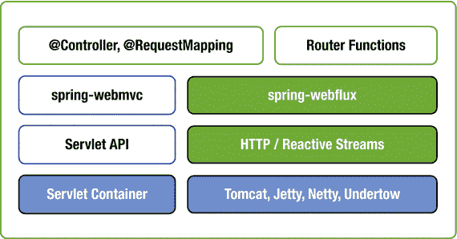

图 12-1.

Spring WebFlux 运行时支持

每个运行时都适配为响应式 `ServerHttpRequest` 和 `ServerHttpResponse`，从而将请求和响应的体暴露为 `Flux<DataBuffer>`，而不是 `InputStream` 和 `OutputStream`，并具有响应式背压。在此基础上支持 REST 风格的 JSON 和 XML 序列化与反序列化以及 HTML 视图渲染，作为 `Flux<Object>`。

你可以通过两种方式使用 `spring-webflux` 模块开发响应式 Web 应用程序：

*   使用基于 SpringMVC 风格注解的方法，使用 `@Controller & @RestController`
*   使用带有路由器和处理器的函数式风格

使用基于注解的编程模型的 WebFlux

你可以使用熟悉的 Spring MVC 注解 `@Controller` 或 `@RestController` 构建响应式 Web 应用程序，这些注解也适用于 WebFlux。当与 WebFlux 一起使用时，底层框架组件（如 `HandlerMapping` 和 `HandlerAdapter`）是非阻塞的，并在响应式 `ServerHttpRequest` 和 `ServerHttpResponse` 上运行，而不是在 `HttpServletRequest` 和 `HttpServletResponse` 上运行。

即使你在控制器层使用 WebFlux 响应式支持，如果你使用阻塞式数据访问 API（如 JDBC 或 JPA），你的应用程序也不会是完全响应式的。截至目前，关系数据库供应商尚未提供非阻塞驱动程序实现。有一些 NoSQL 数据存储（如 MongoDB、Cassandra 和 Redis）提供了响应式驱动程序。

现在你将使用基于注解的编程模型开发一个带有 Spring WebFlux 的响应式 Web 应用程序。你将使用 MongoDB 响应式流驱动程序（[`https://mongodb.github.io/mongo-java-driver-reactivestreams/`](https://mongodb.github.io/mongo-java-driver-reactivestreams/)）来充分利用 MongoDB 的响应式支持。

创建一个带有响应式 Web 和响应式 Mongo 启动器的 Spring Boot 应用程序。

```
org.springframework.boot
spring-boot-starter-webflux

org.springframework.boot
spring-boot-starter-data-mongodb-reactive

```

通过添加以下依赖项来使用嵌入式 MongoDB 服务器，这样你就不需要安装 MongoDB 服务器。

```
de.flapdoodle.embed
de.flapdoodle.embed.mongo

```

创建一个表示 MongoDB 中文档的 `User` POJO，如清单 12-1 所示。

```
import org.springframework.data.annotation.Id;
import org.springframework.data.mongodb.core.mapping.Document;
@Document
public class User
{
@Id
private String id;
private String name;
private String email;
//setters and getters
}
清单 12-1.
User.java
```

Spring Data Mongo 库提供了 `ReactiveCrudRepository`，它类似于 `CrudRepository`，但具有响应式支持，它将在底层与 MongoDB 响应式驱动程序交互。

现在为 `User` 创建一个 Spring Data 存储库，如清单 12-2 所示。

```
import org.springframework.data.repository.reactive.ReactiveCrudRepository;
public interface UserReactiveRepository extends ReactiveCrudRepository
{
}
清单 12-2.
UserReactiveRepository.java
```

基于 Spring WebFlux 注解的控制器看起来与 SpringMVC 控制器非常相似，只是输入和返回类型将使用 Reactor 类型 `Mono` 或 `Flux`。

现在你可以实现 `User` 的 CRUD 操作，如清单 12-3 所示。

```
import org.springframework.beans.factory.annotation.Autowired;
import org.springframework.web.bind.annotation.*;
import reactor.core.publisher.Flux;
import reactor.core.publisher.Mono;
@RestController
@RequestMapping("/api/users")
public class UserController
{
@Autowired
private UserReactiveRepository userReactiveRepository;
@GetMapping
public Flux allUsers() {
return userReactiveRepository.findAll();
}
@GetMapping("/{id}")
public Mono  getUser(@PathVariable String id) {
return userReactiveRepository.findById(id);
}
@PostMapping
public Mono saveUser(@RequestBody Mono userMono) {
return userMono.flatMap(user -> userReactiveRepository.save(user));
}
@DeleteMapping("/{id}")
public Mono deleteUser(@PathVariable String id) {
return userReactiveRepository.deleteById(id);
}
}
清单 12-3.
遵循基于注解的响应式编程模型的 UserController.java
```

`UserController` 实现中没有什么新内容，只是你使用了 Reactor 类型，例如 `Mono<User>` 来表示单个用户对象的流，并使用 `Flux<User>` 来表示一个或多个 `User` 对象的流。

需要记住的一个关键点是，除非有人订阅了响应式流管道，否则什么也不会发生。例如，以下方法不会在 MongoDB 中插入用户文档。

```
@PostMapping
public Mono saveUser(@RequestBody Mono userMono) {
userMono.flatMap(user -> userReactiveRepository.save(user));
return Mono.empty();
}
```

这只是定义了流管道，但没有人订阅它，所以什么也不会发生。以下代码将插入用户文档，因为它显式地在管道上调用了 `subscribe()`。

```
userMono.flatMap(user -> userReactiveRepository.save(user)).subscribe();
```

`UserController.saveUser()` 实现返回 `Mono<User>`，以便 Web 响应订阅管道。因此，它按预期工作。

使用函数式编程模型的 WebFlux

Spring 框架 5 引入了一种新的函数式风格编程模型，它构建在响应式基础之上，除了基于注解的编程模型之外。

你可以将 `HandlerFunctions` 实现为 Java 8 lambda，并使用 `RouterFunctions` 将请求 URL 模式映射到 `HandlerFunctions`，而不是使用注解来定义请求处理方法。

```
HandlerFunction echoHandlerFn =
( request ) -> ServerResponse.ok().body(fromObject(request.queryParam("name")));
RequestPredicate predicate = RequestPredicates.GET("/echo");
RouterFunction routerFunction = RouterFunctions.route(predicate, echoHandlerFn);
```

此示例将 URL 模式 GET `"/echo"` 映射到 `echoHandlerFn`，后者返回请求参数 `"name"` 的值作为响应体。你可以使用 Java 8 lambda 和静态导入以更简洁的方式编写相同的代码块，如下所示：

```
route(GET("/echo"), request -> ok().body(fromObject(request.queryParam("name"))));
```

现在你可以探索函数式 Web 框架的关键组件。

HandlerFunction

`HandlerFunction` 是一个函数式接口，它接受 `ServletRequest` 并返回 `ServletResponse`。

```
@FunctionalInterface
public interface HandlerFunction
{
Mono handle(ServerRequest request);
}
```

这里，`ServerRequest` 和 `ServerResponse` 是构建在 Reactor 类型之上的不可变接口。你可以将请求体转换为 Reactor 的 `Mono` 或 `Flux` 类型，并且你可以将响应式流的 `Publisher` 的任何实例作为响应体发送。

ServerRequest

`org.springframework.web.reactive.function.server.ServerRequest` 接口表示服务器端的 HTTP 请求。你可以使用各种方法从 `ServerRequest` 中检索输入 HTTP 请求的信息，如下所示：

```
HttpMethod method = request.method();
String path = request.path();
String id = request.pathVariable("id");
Map pathVariables = request.pathVariables();
Optional email = request.queryParam("email");
URI uri = request.uri();
```

你可以使用 `bodyToMono()` 和 `bodyToFlux()` 方法将请求体转换为 `Mono` 或 `Flux`。

```
Mono userMono = request.bodyToMono(User.class);
Flux usersFlux = request.bodyToFlux(User.class);
```

`bodyToMono()` 和 `bodyToFlux()` 方法实际上是 `BodyExtractor` 的实例，用于提取请求体并将其反序列化为对象。

你可以使用 `BodyExtractors` 工具类将请求体提取到 `Mono` 或 `Flux` 中，如下所示：

```
Mono userMono = request.body(BodyExtractors.toMono(User.class));
Flux userFlux = request.body(BodyExtractors.toFlux(User.class));
```

如果你想将请求体转换为泛型类型，可以使用 `ParameterizedTypeReference`。

```
ParameterizedTypeReference>> typeReference = new ParameterizedTypeReference>>() {};
Mono>> mapMono = request.body(BodyExtractors.toMono(typeReference));
```

ServerResponse

`org.springframework.web.reactive.function.server.ServerResponse` 接口表示服务器端的 HTTP 响应。`ServerResponse` 是一个不可变接口，并提供了许多静态构建器方法来构造带有 `status`、`contentType`、`cookies`、`headers`、`body` 等的响应。

以下是一些如何使用构建器方法构造 `ServerResponse` 的示例。

```
ServerResponse.ok().contentType(APPLICATION_JSON).body(userMono, User.class);
ServerResponse.ok().contentType(APPLICATION_JSON).body(BodyInserters.fromObject(user));
ServerResponse.created(uri).build();
ServerResponse.notFound().build();
```

你也可以使用 `render()` 方法渲染视图模板，如下所示：

```
Map modelAttributes = new HashMap();
modelAttributes.put("user",user);
ServerResponse.ok().render("home", modelAttributes);
```

因此，本质上，使用这些 `ServerResponse` 构建器方法，你可以构造 `HandlerFunction.handle(ServerRequest)` 方法的返回值。

RouterFunction

`RouterFunction` 使用 `RequestPredicate` 将传入请求映射到 `HandlerFunction`。你可以使用 `RouterFunctions` 工具类的静态方法构建 `RouterFunction`，如下所示：

```
RouterFunctions.route(GET("/echo"), request -> ok().body(fromObject(request.queryParam("name"))));
```

你可以将多个路由定义组合成一个新的路由定义，该定义路由到与谓词匹配的第一个处理函数。

```
import static org.springframework.web.reactive.function.server.RequestPredicates.*; RouterFunctions.route(GET("/echo"), request -> ok().body(fromObject(request.queryParam("name"))))
.and(route(GET("/home"), request -> ok().render("home")))
.andRoute(POST("/users"), request -> ServerResponse.ok().build());
```

此示例将三个路由定义组合成一个；传入请求将由第一个匹配 `RequestPredicate` 的 `HandlerFunction` 处理。

假设你需要组合多个具有相同前缀的路由。你可以使用 `RouterFunctions.nest()` 如下所示，而不是在每个路由中重复 URL 路径：

```
RouterFunctions.nest(path("/api/users"),
nest(accept(APPLICATION_JSON),
route(GET("/{id}"), request -> ServerResponse.ok().build())
.andRoute(method(HttpMethod.GET), request -> ServerResponse.ok().build())));
```

此代码将两个 URL 映射到它们的处理函数。一个是 `GET /api/users`，返回所有用户，另一个是 `GET /api/users/{id}`，返回给定 `id` 的用户详细信息。它使用 `nest()` 来组合路由，而不是重复公共路径前缀 `/api/users`。

你可以使用 `RequestPredicates` 静态方法创建 `RequestPredicate`，并且还可以使用 `RequestPredicate.and(RequestPredicate)` 和 `RequestPredicate.or(RequestPredicate)` 组合请求谓词。

```
RouterFunctions.route(path("/api/users").and(method(HttpMethod.GET)),
request -> ServerResponse.ok().build());
RouterFunctions.route(GET("/api/users").or(GET("/api/users/list")),
request -> ServerResponse.ok().build());
```

HandlerFilterFunction

如果你必须比较基于注解的方法和函数式方法，`RouterFunction` 类似于 `@RequestMapping` 注解，`HandlerFunction` 类似于使用 `@RequestMapping` 注解的方法。新的函数式 Web 框架还提供了 `HandlerFilterFunction`，它类似于 Servlet `Filter` 或 `@ControllerAdvice` 方法。

```
@FunctionalInterface
public interface HandlerFilterFunction
{
Mono filter(ServerRequest request, HandlerFunction next);
//other methods
}
```

例如，你可以使用 `HandlerFilterFunction` 根据用户角色过滤路由，如下所示：

```
RouterFunction route = route(DELETE("/api/users/{id}"), request -> ok().build());
RouterFunction filteredRoute = route.filter((request, next) -> {
if (hasAdminRole()) {
return next.handle(request);
}
else {
return ServerResponse.status(UNAUTHORIZED).build();
}
});
private boolean hasAdminRole()
{
//logic to check current user has ADMIN role or not
}
```

当你向 `/api/users/{id}` URL 发出请求时，过滤器会检查用户是否具有管理员角色，并决定执行处理函数或返回 `UNAUTHORIZED` 响应。

将 HandlerFunctions 注册为方法引用

与其使用内联 lambda 定义 `HandlerFunction`，不如将它们定义为方法，并在路由配置中使用方法引用，如清单 12-4 所示。

```
@Component
class EchoHandler
{
public Mono echo(ServerRequest request)
{
return ServerResponse.ok().body(fromObject(request.queryParam("name")));
}
}
@SpringBootApplication
class Applications
{
@Autowired
EchoHandler echoHandler;
@Bean
public RouterFunction echoRouterFunction() {
return RouterFunctions.route(GET("/echo"), echoHandler::echo);
}
}
清单 12-4.
使用方法引用将 HandlerFunction 与路由注册
```

现在你可以使用函数式编程模型构建与上一节中构建的相同的应用程序。你将创建 `UserHandler`，其中包含用于各种操作的 `HandlerFunction` 方法，然后配置 `RouterFunctions` 将路由映射到处理函数。参见清单 12-5。

```
import org.springframework.beans.factory.annotation.Autowired;
import org.springframework.http.MediaType;
import org.springframework.stereotype.Component;
import org.springframework.web.reactive.function.server.ServerRequest;
import org.springframework.web.reactive.function.server.ServerResponse;
import reactor.core.publisher.Flux;
import reactor.core.publisher.Mono;
import static org.springframework.web.reactive.function.BodyInserters.fromObject;
@Component
public class UserHandler
{
private UserReactiveRepository userReactiveRepository;
@Autowired
public UserHandlerFunctions(UserReactiveRepository userReactiveRepository) {
this.userReactiveRepository = userReactiveRepository;
}
public Mono getAllUsers(ServerRequest request)
{
Flux allUsers = userReactiveRepository.findAll();
return ServerResponse.ok().contentType(MediaType.APPLICATION_JSON_UTF8)
.body(allUsers, User.class);
}
public Mono getUserById(ServerRequest request)
{
Mono userMono = userReactiveRepository.findById(request.pathVariable("id"));
Mono notFount = ServerResponse.notFound().build();
return userMono.flatMap(user -> ServerResponse.ok()
.contentType(MediaType.APPLICATION_JSON_UTF8)
.body(fromObject(user)))
.switchIfEmpty(notFount);
}
public Mono saveUser(ServerRequest request)
{
Mono userMono = request.bodyToMono(User.class);
Mono mono = userMono.flatMap(user -> userReactiveRepository.save(user));
return ServerResponse.ok().body(mono, User.class);
}
public Mono deleteUser(ServerRequest request)
{
String id = request.pathVariable("id");
return ServerResponse.ok().build(userReactiveRepository.deleteById(id));
}
}
清单 12-5.
使用函数式编程模型的 UserHandler.java
```

你已经将 CRUD 操作的处理函数定义为单独的方法。现在你可以配置路由器函数，如清单 12-6 所示。

```
import org.springframework.beans.factory.annotation.Autowired;
import org.springframework.boot.SpringApplication;
import org.springframework.boot.autoconfigure.SpringBootApplication;
import org.springframework.context.annotation.Bean;
import org.springframework.http.HttpMethod;
import org.springframework.web.reactive.function.server.*;
import static org.springframework.http.MediaType.APPLICATION_JSON;
import static org.springframework.web.reactive.function.BodyInserters.fromObject;
import static org.springframework.web.reactive.function.server.RequestPredicates.*;
import static org.springframework.web.reactive.function.server.RouterFunctions.nest;
import static org.springframework.web.reactive.function.server.RouterFunctions.route;
import static org.springframework.web.reactive.function.server.ServerResponse.ok;
@SpringBootApplication
public class Application
{
public static void main(String[] args) {
SpringApplication.run(SpringBootWebfluxFunctionalDemoApplication.class, args);
}
@Autowired
UserHandler userHandler;
@Bean
public RouterFunction routerFunctions() {
return
nest(path("/api/users"),
nest(accept(APPLICATION_JSON),
route(GET("/{id}"), userHandler::getUserById)
.andRoute(method(HttpMethod.GET), userHandler::getAllUsers)
.andRoute(DELETE("/{id}"), userHandler::deleteUser)
.andRoute(POST("/"), userHandler::saveUser)));
}
}
清单 12-6.
Application.java
```

你定义了路由器配置，并将它们注册为 `RouterFunction` bean。你甚至可以在同一个应用程序中混合使用基于注解和基于函数的编程模型。

默认情况下，`spring-boot-starter-webflux` 使用 `reactor-netty` 作为运行时引擎。你可以排除 `reactor-netty` 并使用其他支持响应式非阻塞 I/O 的服务器，例如 Undertow、Jetty 或 Tomcat。

注意

有关 WebFlux 自动配置的更多详细信息，请查看 `org.springframework.boot.autoconfigure.web.reactive` 包中的配置类。

Thymeleaf 响应式支持

Thymeleaf 提供了 `thymeleaf-spring5` 模块来支持 Spring 框架 5 集成。`thymeleaf-spring5` 模块提供了响应式支持，以便你可以将其与基于 Spring WebFlux 的响应式应用程序一起使用。

Spring Boot 2 Thymeleaf 启动器将 `thymeleaf-spring5` 库作为依赖项包含在内，并自动配置 Thymeleaf 的响应式支持。你可以在配置类 `org.springframework.boot.autoconfigure.thymeleaf.ThymeleafAutoConfiguration` 中查看 Thymeleaf 响应式自动配置。

新的 `thymeleaf-spring5` 模块提供了 `SpringWebFluxTemplateEngine`，它扩展了 `SpringTemplateEngine`，作为 Spring WebFlux 应用程序中使用的默认模板引擎实现。`SpringWebFluxTemplateEngine` 提供了三种处理模式：

*   完整模式：当未指定最大块大小限制且未指定数据驱动上下文变量时，Thymeleaf 将使用 FULL 模式。所有模板输出将在内存中生成，然后作为单个 `DataBuffer` 发送到服务器的输出通道。
*   分块模式：当指定了最大块大小限制但未指定数据驱动上下文变量时，Thymeleaf 将使用 `CHUNKED` 模式。模板输出将生成等于或小于指定限制（以字节为单位）的块，然后发送到服务器的输出通道。在每个块发送到输出后，模板引擎将等待服务器通过响应式背压请求更多块。
*   数据驱动模式：当向上下文添加了数据驱动变量（包装在 `IReactiveDataDriverContextVariable` 中的数据流）时，Thymeleaf 将使用 `DATA-DRIVEN` 模式。在此模式下，Thymeleaf 将使用背压以块的形式从数据驱动程序流式传输数据。

清单 12-7 显示了如何获取数据流（`Flux<T>`）并使用 Thymeleaf 响应式支持进行渲染。

```
@Controller
public class UserListController
{
@Autowired
private UserReactiveRepository userReactiveRepository;
@GetMapping("/list-users")
public String listUsers(Model model)
{
Flux userFlux = this.userReactiveRepository.findAll();
List userList = userFlux.collectList().block();
model.addAttribute("users", userList);
return "users";
}
@GetMapping("/list-users-chunked")
public String listUsersChunked(Model model)
{
Flux userFlux = this.userReactiveRepository.findAll();
model.addAttribute("users", userFlux);
return "users";
}
@GetMapping("/list-users-reactive")
public String listUsersReactive(Model model)
{
Flux userFlux = this.userReactiveRepository.findAll();
model.addAttribute("users", new ReactiveDataDriverContextVariable(userFlux, 1000));
return "users";
}
}
清单 12-7.
使用 Thymeleaf 响应式支持的 UserListController.java
```

在 `listUsers()` 方法中，你从 MongoDB 获取数据作为响应式流 `Flux<User>`，并完全解析数据，然后使用内存中可用的完整数据集渲染视图。

在 `listUsersChunked()` 方法中，你直接将 `Flux<User>` 添加到模型中，但你没有指定 `responseMaxChunkSizeBytes`，因此它将像 `FULL` 模式一样处理。如果你配置了 `spring.thymeleaf.reactive.max-chunk-size=size_in_bytes` 属性，那么它将以 `CHUNKED` 模式处理。

在 `listUsersReactive()` 方法中，你从 MongoDB 获取数据作为响应式流 `Flux<User>`，并将其包装在带有缓冲区大小的 `ReactiveDataDriverContextVariable` 中，以便 Thymeleaf 将使用数据驱动模式来渲染视图。

注意

在 Thymeleaf 数据驱动模式下，你只能向上下文添加一个多值 Publisher（flux）。

清单 12-8 显示了如何创建 Thymeleaf 视图模板来渲染用户。

```

用户

姓名
电子邮件

...
...

清单 12-8.
users.html Thymeleaf 视图
```

这个 Thymeleaf 视图在处理响应式流渲染方面没有什么特别之处；在幕后，Thymeleaf 将无缝地处理来自数据流的视图解析逻辑。

你可以使用 Web 函数式框架风格的 `HandlerFunction` 实现相同的端点，如清单 12-9 所示。

```
@Component
public class UserHandler
{
@Autowired
private UserReactiveRepository userReactiveRepository;
...
...
public Mono listUsers(ServerRequest request)
{
List userList = userReactiveRepository.findAll().collectList().block();
Map data = new HashMap();
data.put("users", userList);
return ServerResponse.ok().contentType(MediaType.TEXT_HTML).render("users", data);
}
public Mono listUsersReactive(ServerRequest request)
{
Flux userFlux = userReactiveRepository.findAll();
ReactiveDataDriverContextVariable users = new ReactiveDataDriverContextVariable(userFlux, 1000);
Map data = new HashMap();
data.put("users", users);
return ServerResponse.ok().contentType(MediaType.TEXT_HTML).render("users", data);
}
}
清单 12-9.
UserHandler.java
```

现在你可以定义路由以将 URL 映射到 `HandlerFunction`，如清单 12-10 所示。

```
@SpringBootApplication
public class Application
{
@Autowired
UserHandler userHandler;
public static void main(String[] args) {
SpringApplication.run(SpringBootWebfluxFunctionalDemoApplication.class, args);
}
...
...
@Bean
public RouterFunction listUsersRouter() {
return route(GET("/list-users"), userHandler::listUsers);
}
@Bean
public RouterFunction listUsersReactiveRouter() {
return route(GET("/list-users-reactive"), userHandler::listUsersReactive);
}
}
清单 12-10.
Application.java
```

如果你在 MongoDB 中有大型数据集并访问端点 `/list-users` 和 `/list-users-reactive`，你可以清楚地看到 `/list-users-reactive` 响应更快。

响应式 WebClient

Spring 提供了 `RestTemplate` 来调用 RESTful 服务端点，它支持消息转换器，因此可以使用 Java 对象而不是手动准备 JSON 或 XML 的输入请求体来发出 HTTP 请求。

Spring WebFlux 提供了 WebClient 作为 `RestTemplate` 的响应式替代方案，它支持非阻塞。`WebClient` 使用 `Flux<DataBuffer>` 作为请求和响应体，而不是使用 `InputStream` 和 `OutputStream` 进行请求处理。

清单 12-11 显示了作为客户端如何向响应式端点发出请求。

```
WebClient webClient = WebClient.create("http://localhost:"+port);
List users = webClient.get().uri("/api/users")
.accept(MediaType.APPLICATION_JSON)
.exchange()
.flatMap(response -> response.bodyToFlux(User.class).collectList()).block();
清单 12-11.
使用 WebClient 调用响应式 REST 端点
```

`webClient.get().uri("/api/users").exchange()` 将返回一个 `Mono<ClientResponse>`，而 `ClientResponse` 提供了各种实用方法，例如 `bodyToMono()、bodyToFlux()` 和 `body(BodyExtractor)` 方法来提取体内容。

测试 Spring WebFlux 应用程序

`spring-test` 模块提供了 `WebTestClient`，可用于测试响应式端点。Spring Boot 自动配置 `WebTestClient`，因此你可以自动注入 `WebTestClient`，而无需手动配置它。

清单 12-12 显示了如何使用 `WebTestClient` 测试响应式 REST 端点 `GET /api/users`。

```
import org.junit.Test;
import org.junit.runner.RunWith;
import org.springframework.beans.factory.annotation.Autowired;
import org.springframework.boot.test.context.SpringBootTest;
import static org.springframework.http.MediaType.*;
import org.springframework.test.context.junit4.SpringRunner;
import org.springframework.test.web.reactive.server.WebTestClient;
import java.util.List;
import static org.junit.Assert.assertEquals;
import static org.junit.Assert.assertNotNull;
@RunWith(SpringRunner.class)
@SpringBootTest(webEnvironment = SpringBootTest.WebEnvironment.RANDOM_PORT)
public class SpringBootWebfluxFunctionalDemoApplicationTests
{
@Autowired
private WebTestClient webTestClient;
@Test
public void getAllUsers() {
webTestClient.get().uri("/api/users").accept(APPLICATION_JSON).exchange()
.expectStatus().isOk()
.expectHeader().contentType(APPLICATION_JSON)
.expectBodyList(User.class)
.consumeWith(result -> assertEquals(5, result.getResponseBody().size()));
}
}
清单 12-12.
使用 WebTestClient 测试响应式端点
```

你可以注入 `WebTestClient` 并使用相对 URL 进行测试，而不是提供完整的 URL。一旦调用了 REST 端点，你可以断言 HTTP 状态和 `ContentType` 标头值，并指定响应体需要转换成的类类型。

类似地，你可以执行其他操作，如 `POST`、`DELETE` 等，如清单 12-13 所示。

```
@Test
public void createUser() {
User user = new User(UUID.randomUUID().toString(), "Zinx", "zinx@gmail.com");
webTestClient.post().uri("/api/users")
.body(Mono.just(user), User.class)
.exchange()
.expectStatus().isOk()
.expectHeader().contentType(MediaType.APPLICATION_JSON_UTF8)
.expectBody(User.class)
.consumeWith(result -> assertThat(result.getResponseBody()).isEqualToComparingFieldByField(user));
}
清单 12-13.
使用 WebTestClient 执行 POST 请求
```

此示例执行 `POST` 请求到 `/api/users` 以创建一个新的 `User`。它发送 `Mono<User>` 作为请求体，并获取创建的 `User` 作为响应体。

你还可以通过使用 JSON Path 库断言对响应体执行 JSON 断言。你可以调用 `GET /api/users/{id}` 端点来检索给定 ID 的特定用户，并断言响应 JSON，如清单 12-14 所示。

```
@Test
public void getUserById() {
String id = "uid1";
webTestClient.get().uri("/api/users/"+id)
.exchange()
.expectStatus().isOk()
.expectBody()
.jsonPath("$.id").isEqualTo(id)
.jsonPath("$.name").isEqualTo("Admin")
.jsonPath("$.email").isEqualTo("admin@gmail.com");
}
清单 12-14.
对 WebTestClient 响应体执行 JSON 断言
```

此示例使用 JSON Path 库提供的 `jsonPath()` 断言来断言响应 JSON。有关 JSON Path 的更多详细信息，请参见 [`https://github.com/json-path/JsonPath`](https://github.com/json-path/JsonPath) 。

注意

你将在第 15 章中学习更多关于测试 Spring Boot 应用程序的知识。

总结

本章向你展示了如何使用 Spring WebFlux 框架构建响应式 Web 应用程序，这是 Spring 5 中引入的一个新模块。你使用 MongoDB 响应式流驱动程序和 WebFlux 构建了一个响应式应用程序，使用了基于注解的模型和函数式风格编程模型。在下一章中，你将学习如何使用 Spring Security 保护传统的 Web 应用程序和 REST API。

13. 保护 Web 应用程序

安全是软件应用程序设计的一个重要方面。它确保只有有权访问受保护资源的人才能这样做。在保护应用程序方面，你需要处理的两件主要事情是身份验证和授权。身份验证是指验证用户的过程，通常通过要求提供凭据来完成。授权是指验证是否允许用户执行某项活动的过程。

Spring Security 是一个强大且灵活的安全框架，用于保护基于 Java 的 Web 应用程序。尽管 Spring Security 通常与基于 Spring 的应用程序一起使用，但你也可以使用它来保护非基于 Spring 的 Web 应用程序。

本章解释如何使用 Spring Boot Security 启动器来保护基于 SpringMVC 的 Web 应用程序，以及如何使用方法级安全性来保护服务层组件。本章还探讨了如何配置 Spring Security 来保护 REST API。

Spring Boot Web 应用程序中的 Spring Security

Spring Security 是一个用于在多个层保护基于 Java 的应用程序的框架，具有极大的灵活性和可定制性。Spring Security 提供针对数据库身份验证、LDAP、表单身份验证、JA-SIG 中央身份验证服务、Java 身份验证和授权服务（JAAS）等的身份验证和授权支持。Spring Security 提供对处理常见攻击（如 CSRF、XSS 和会话固定保护）的支持，只需最少的配置。

Spring Security 可用于在多个层保护应用程序，例如 Web URL、服务层方法等。从 3.2 版本开始，Spring Security 为安全提供了 Java 配置支持。在 Spring Boot 应用程序中使用 Spring Security 由于其自动配置功能而变得更加容易。

将 Spring Security 启动器（`spring-boot-starter-security`）添加到 Spring Boot 应用程序将：

*   启用 HTTP 基本安全
*   注册带有内存存储和单个用户的 `AuthenticationManager` bean
*   忽略常用静态资源位置的路径（例如 `/css/**`、`/js/**`、`/images/**` 等）
*   启用常见的低级功能，如 XSS、CSRF、缓存等

你将首先了解如何使用 Spring Security 保护 Spring Boot 应用程序。首先，创建一个带有 Web、Thymeleaf 和 Spring Security 启动器的 Spring Boot 项目。

```
org.springframework.boot
spring-boot-starter-web

org.springframework.boot
spring-boot-starter-thymeleaf

org.springframework.boot
spring-boot-starter-security

```

现在，如果你运行应用程序并访问 `http://localhost:8080`，系统将提示你输入用户凭据。默认用户是 `user`，密码是自动生成的。你可以在控制台日志中找到它。

```
Using default security password: 78fa095d-3f4c-48b1-ad50-e24c31d5cf35
```

你可以在 `application.properties` 中更改默认用户凭据，如下所示：

```
security.user.name=admin
security.user.password=secret
security.user.role=USER,ADMIN
```

好的，这对于快速演示来说很不错。但在你的实际项目中，你可能希望使用持久化数据存储（如数据库）来实现基于角色的访问控制。此外，你可能希望根据角色微调对资源（URL、服务层方法等）的访问。现在你将看到如何自定义默认的 Spring Security 自动配置以满足你的需求。

首先，你将创建图 13-1 中所示的数据库表来存储用户和角色。

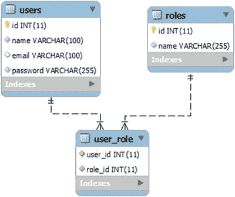

图 13-1.

用户和角色数据库表

你将使用 Spring Data JPA 启动器与数据库通信。

```
org.springframework.boot
spring-boot-starter-data-jpa

com.h2database
h2

```

创建名为 `users` 和 `roles` 的 JPA 实体，如清单 13-1 和 13-2 所示。

```
@Entity
@Table(name="users")
public class User
{
@Id @GeneratedValue(strategy=GenerationType.AUTO)
private Integer id;
@Column(nullable=false, unique=true)
private String email;
@Column(nullable=false)
private String password;
@ManyToMany(cascade=CascadeType.MERGE)
@JoinTable(
name="user_role",
joinColumns={@JoinColumn(name="USER_ID",
referencedColumnName="ID")},
inverseJoinColumns={@JoinColumn(name="ROLE_ID",
referencedColumnName="ID")})
private List roles;
//setters and getters
}
清单 13-1.
User JPA 实体
```

```
@Entity
@Table(name="roles")
public class Role
{
@Id @GeneratedValue(strategy=GenerationType.AUTO)
private Integer id;
@Column(nullable=false, unique=true)
private String name;
@ManyToMany(mappedBy="roles")
private List users;
//setters and getters
}
清单 13-2.
Role JPA 实体
```

接下来，为 `user` 实体创建 Spring Data JPA 存储库，如清单 13-3 所示。

```
public interface UserRepository extends JpaRepository
{
Optional findByEmail(String email);
}
清单 13-3.
Spring Data JPA 存储库接口 UserRepository.java
```

Spring Security 使用 `UserDetailsService` 接口，该接口包含 `loadUserByUsername(String username)` 方法，用于查找给定 `username` 的 `UserDetails`。`UserDetails` 接口表示一个经过身份验证的用户对象，Spring Security 提供了 `org.springframework.security.core.userdetails.User` 的开箱即用实现。

现在你实现一个 `UserDetailsService` 以从数据库获取 `UserDetails`，如清单 13-4 所示。

```
@Service
@Transactional
public class CustomUserDetailsService implements UserDetailsService
{
@Autowired
private UserRepository userRepository;
@Override
public UserDetails loadUserByUsername(String userName)
throws UsernameNotFoundException {
User user = userRepository.findByEmail(userName)
.orElseThrow(() -> new UsernameNotFoundException("Email "+userName+" not found"));
return new org.springframework.security.core.userdetails.User(
user.getEmail(),
user.getPassword(),
getAuthorities(user)
);
}
private static Collection getAuthorities(User user)
{
String[] userRoles = user.getRoles()
.stream()
.map((role) -> role.getName())
.toArray(String[]::new);
Collection authorities = AuthorityUtils.createAuthorityList(userRoles);
return authorities;
}
}
清单 13-4.
UserDetailsService 实现
```

Spring Boot 在 `SecurityAutoConfiguration` 中实现了默认的 Spring Security 自动配置。要切换默认的 Web 应用程序安全配置并提供你自己的自定义安全配置，你可以创建一个扩展 `WebSecurityConfigurerAdapter` 并使用 `@EnableWebSecurity` 注解的配置类。

现在你将创建一个扩展 `WebSecurityConfigurerAdapter` 的配置类，以自定义默认的 Spring Security 配置，如清单 13-5 所示。

```
@Configuration
@EnableWebSecurity
public class WebSecurityConfig extends WebSecurityConfigurerAdapter {
@Autowired
private UserDetailsService customUserDetailsService;
@Bean
public PasswordEncoder passwordEncoder() {
return new BCryptPasswordEncoder();
}
@Autowired
public void configureGlobal(AuthenticationManagerBuilder auth)
throws Exception
{
auth
.userDetailsService(customUserDetailsService)
.passwordEncoder(passwordEncoder());
}
@Override
protected void configure(HttpSecurity http) throws Exception {
http
.authorizeRequests()
.antMatchers("/resources/", "/webjars/","/assets/")
.permitAll()
.antMatchers("/").permitAll()
.antMatchers("/admin/").hasRole("ADMIN")
.anyRequest().authenticated()
.and()
.formLogin()
.loginPage("/login")
.defaultSuccessUrl("/home")
.failureUrl("/login?error")
.permitAll()
.and()
.logout()
.logoutRequestMatcher(new AntPathRequestMatcher("/logout"))
.logoutSuccessUrl("/login?logout")
.permitAll()
.and()
.exceptionHandling()
.accessDeniedPage("/accessDenied");
}
}
清单 13-5.
扩展 WebSecurityConfigurerAdapter 的自定义 Spring Security 配置
```

此示例配置了 `CustomUserDetailsService` 和 `BCryptPasswordEncoder`，供 `AuthenticationManager` 使用，而不是使用带有明文密码的单个用户的默认内存数据库。

`configure(HttpSecurity http)` 方法配置为：

*   忽略静态资源路径 `"/resources/**"`、`"/webjars/**"` 和 `"/assets/**"`
*   允许所有人访问根 URL `"/"`
*   将访问以 `/admin/` 开头的 URL 限制为仅具有 `ADMIN` 角色的用户
*   所有其他 URL 仅对经过身份验证的用户可访问

你还在配置自定义的基于表单的登录参数，并使它们对所有人可访问。默认情况下，注销请求仅适用于 HTTP `POST` 方法，因此此示例将其配置为可与任何 HTTP 方法一起使用，这使得它对所有人可访问。

该示例还配置了 URL，以便在用户尝试访问他们无权访问的资源时，将他们重定向到 `/accessDenied` URL。

你将使用 Thymeleaf 视图模板来渲染视图。`thymeleaf-extras-springsecurity4` 模块提供了 Thymeleaf Spring Security 方言属性（`sec:authentication`、`sec:authorize` 等），以根据身份验证状态、登录用户角色等有条件地渲染视图的部分内容。

添加以下依赖项以使用 Thymeleaf Spring Security 方言。

```
org.thymeleaf.extras
thymeleaf-extras-springsecurity4

```

现在你需要创建一个配置类来提供 MVC 配置，如清单 13-6 所示。

```
@Configuration
public class WebConfig implements WebMvcConfigurer
{
@Override
public void addViewControllers(ViewControllerRegistry registry)
{
registry.addViewController("/login").setViewName("login");
registry.addViewController("/home").setViewName("home");
registry.addViewController("/admin/home").setViewName("adminhome");
registry.addViewController("/accessDenied").setViewName("403");
}
@Bean
public SpringSecurityDialect securityDialect() {
return new SpringSecurityDialect();
}
}
清单 13-6.
Spring WebMVC 配置
```

此示例配置了视图控制器，以指定为哪个 URL 渲染哪个视图。此外，它还注册了 `SpringSecurityDialect` 以启用使用 Thymeleaf Spring Security 方言。

现在你已经准备好所有配置，是时候使用 Thymeleaf 创建视图了。

创建 `src/main/resources/templates/login.html`，如清单 13-7 所示。

```

SpringBoot 安全

无效的电子邮件和密码。

登录

清单 13-7.
Thymeleaf 登录视图
```

此代码创建了带有 `username` 和 `password` 字段的登录表单，如果存在 `error` 请求参数，则渲染登录错误。代码将登录表单的 `failureUrl` 配置为 `"/login?error"`，因此如果用户提供了不正确的凭据，他们将被重定向到 `/login?error` URL。

接下来，创建 `src/main/resources/templates/home.html`，如清单 13-8 所示。

```

SpringBoot 安全

欢迎用户
注销

只有当你具有 ADMIN 角色时，你才会看到此内容
管理员首页

清单 13-8.
Thymeleaf 首页视图
```

代码将 `"/home"` 配置为 `defaultSuccessUrl`，因此在成功身份验证后，用户将被重定向到 `/home` URL，该 URL 将渲染 `home.html` 视图。

在 `home.html` 视图中，你使用 `sec:authentication="principal.username"` 来显示经过身份验证的用户名。此示例还有条件地渲染指向管理员首页的链接，仅当经过身份验证的用户具有 `ROLE_ADMIN` 角色时。这是通过使用 `sec:authorize="hasRole('ROLE_ADMIN')"` 完成的。

创建 `src/main/resources/templates/adminhome.html`，如清单 13-9 所示。

```

SpringBoot 安全

欢迎管理员（用户）
注销

清单 13-9.
Thymeleaf 管理员首页视图
```

接下来，创建 `src/main/resources/templates/403.html`，如清单 13-10 所示。

```

访问被拒绝

你无权查看此页面！！

清单 13-10.
访问被拒绝视图 403.html
```

如果登录用户没有 `ROLE_ADMIN` 角色并尝试访问 `/admin/home` URL，则 Spring Security 将抛出 `AccessDeniedException`。当发生 `AccessDeniedException` 时，代码会将用户重定向到 `/accessDenied` URL。这是因为该示例将 `/accessDenied` URL 映射到视图 `403.html` 文件。

你可以简单地将 `exceptionHandling()` 配置为抛出带有 HTTP 状态码 `403` 的 `AccessDeniedException`，而不是配置 `exceptionHandling().accessDeniedPage("/accessDenied")`。然后你可以将 `403.html` 文件放在 `src/main/resources/public/error/` 文件夹中，该文件将被 Spring Boot 错误处理机制自动拾取。

在运行此应用程序之前，你需要使用一些 `users` 和 `roles` 的示例数据初始化数据库，如清单 13-11 所示。

```
delete from  user_role;
delete from  roles;
delete from  users;
INSERT INTO roles (id, name) VALUES
(1, 'ROLE_ADMIN'),
(2, 'ROLE_USER');
INSERT INTO users (id, email, password, name) VALUES
(1, 'admin@gmail.com', '$2a$10$hKDVYxLefVHV/vtuPhWD3OigtRyOykRLDdUAp80Z1crSoS1lFqaFS', 'Admin'),
(2, 'siva@gmail.com', '$2a$10$UFEPYW7Rx1qZqdHajzOnB.VBR3rvm7OI7uSix4RadfQiNhkZOi2fi', 'Siva'),
(3, 'user@gmail.com', '$2a$10$ByIUiNaRfBKSV6urZoBBxe4UbJ/sS6u1ZaPORHF9AtNWAuVPVz1by', 'DemoUser');
insert into user_role(user_id, role_id) values
(1,1),
(1,2),
(3,2);
清单 13-11.
src/main/resources/data.sql
```

密码使用 `BCryptPasswordEncoder.encode(plan_tx_password)` 方法加密。

运行应用程序并转到 `http://localhost:8080/home`。你将被重定向到登录页面，因为你尚未通过身份验证。提交有效凭据（例如 `admin@gmail.com/admin`）后，你将被重定向到首页。如果你以具有 `ADMIN` 角色的用户身份登录，你应该能够看到文本“只有当你具有 ADMIN 角色时，你才会看到此内容”以及指向管理员首页的链接。如果你单击管理员首页链接，你应该能够看到管理员首页页面。

如果你以普通用户（`user@gmail.com/user`）身份登录，你将无法看到“只有当你具有 ADMIN 角色时，你才会看到此内容”以及指向管理员首页的链接。如果你尝试通过直接输入 `http://localhost:8080/admin/home` 来访问管理员首页 URL，你将被重定向到访问被拒绝页面（`403.html` 视图）。

实现“记住我”功能

Spring Security 提供了“记住我”功能，以便应用程序可以在会话之间记住用户的身份。要使用“记住我”功能，你只需要发送 HTTP 参数 `remember-me`。

```

记住我
登录

```

Spring Security 提供了以下两种开箱即用的“记住我”功能实现：

*   基于简单哈希的令牌作为 Cookie——此方法通过哈希用户身份信息并将其设置为客户端浏览器上的 Cookie 来创建令牌。
*   持久化令牌——此方法使用持久化存储（如关系数据库）来存储令牌。

基于简单哈希的令牌作为 Cookie

你可以在安全配置中启用“记住我”功能，默认情况下使用基于哈希的令牌方法，如清单 13-12 所示。

```
@Configuration
@EnableWebSecurity
public class WebSecurityConfig extends WebSecurityConfigurerAdapter
{
...
...
@Override
protected void configure(HttpSecurity http) throws Exception {
http
.authorizeRequests()
.antMatchers("/resources/**", "/webjars/**","/assets/**").permitAll()
.antMatchers("/").permitAll()
.antMatchers("/admin/**").hasRole("ADMIN")
.anyRequest().authenticated()
.and()
.formLogin()
.loginPage("/login")
.defaultSuccessUrl("/home")
.failureUrl("/login?error")
.permitAll()
.and()
.logout()
.logoutRequestMatcher(new AntPathRequestMatcher("/logout"))
.logoutSuccessUrl("/login?logout")
.deleteCookies("remember-me")
.permitAll()
.and()
.rememberMe()
.and()
.exceptionHandling()
;
}
}
清单 13-12.
启用“记住我”的 Spring Security 配置
```

使用此配置，当你通过选中“记住我”复选框登录时，将设置一个带有 `remember-me` 的 Cookie，其中包含基于哈希的令牌作为值。现在，如果你关闭并重新打开浏览器并转到应用程序，你将自动通过身份验证。还要注意，当用户注销时，`remember-me` Cookie 会被删除。

这种基于哈希的令牌作为 Cookie 的方法由 Spring Security 使用 `org.springframework.security.web.authentication.rememberme.TokenBasedRememberMeServices` 实现。

`remember-me` Cookie 令牌值生成如下：

```
base64(username + ":" + expirationTime + ":" + md5Hex(username + ":" + expirationTime + ":" password + ":" + key))
```

默认的 `expirationTime` 是两周（1209600 秒），`key` 是一个随机生成的字符串（`UUID.randomUUID().toString()`）。

你可以按如下方式自定义 Cookie 名称、过期时间和密钥：

```
.rememberMe()
.key("my-secure-key")
.rememberMeCookieName("my-remember-me-cookie")
.tokenValiditySeconds(24 * 60 * 60)
.and()
```

通过此自定义，在成功身份验证后，它将创建一个名为 `my-remember-me-cookie` 的 `remember-me` Cookie。它将有效期为一天（24 * 60 * 60 秒）。

警告

在这种方法中，生成的令牌包含 MD5 哈希密码，如果 Cookie 被捕获，则存在潜在的安全漏洞。

持久化令牌

Spring Security 提供了“记住我”功能的另一种实现，可用于将生成的令牌存储在持久化存储（如数据库）中。持久化令牌方法使用 `org.springframework.security.web.authentication.rememberme.PersistentTokenBasedRememberMeServices` 实现，它在内部使用 `PersistentTokenRepository` 接口来存储令牌。

Spring 提供了以下两种开箱即用的 `PersistentTokenRepository` 实现。

*   `InMemoryTokenRepositoryImpl` 可用于在内存中存储令牌（不建议用于生产环境）。
*   `JdbcTokenRepositoryImpl` 可用于在数据库中存储令牌。

`JdbcTokenRepositoryImpl` 将令牌存储在 `persistent_logins` 表中。参见清单 13-13。

```
create table persistent_logins
(
username varchar(64) not null,
series varchar(64) primary key,
token varchar(64) not null,
last_used timestamp not null
);
清单 13-13.
persistent_logins 表
```

现在你将看到如何配置“记住我”功能以使用关系数据库来存储令牌。参见清单 13-14。

```
@Configuration
@EnableWebSecurity
public class WebSecurityConfig extends WebSecurityConfigurerAdapter
{
@Autowired
private UserDetailsService customUserDetailsService;
@Autowired
private DataSource dataSource;
...
...
@Override
protected void configure(HttpSecurity http) throws Exception {
http
...
...
.rememberMe()
.tokenRepository(persistentTokenRepository())
.tokenValiditySeconds(24 * 60 * 60)
.and()
.exceptionHandling()
;
}
PersistentTokenRepository persistentTokenRepository(){
JdbcTokenRepositoryImpl tokenRepositoryImpl = new JdbcTokenRepositoryImpl();
tokenRepositoryImpl.setDataSource(dataSource);
return tokenRepositoryImpl;
}
}
清单 13-14.
使用持久化令牌配置“记住我”
```

现在，当你成功登录并选中“记住我”复选框时，生成的令牌将存储在 `persistent_logins` 表中。

这种方法为用户生成一个唯一的系列值，连同随机令牌数据一起创建令牌并将其设置为 Cookie。每次用户随后使用 Cookie 登录时，都会生成新的随机令牌数据，但该用户的系列值将保持不变。

跨站请求伪造

跨站请求伪造（CSRF）是一种攻击，它允许用户在经过身份验证的 Web 应用程序上执行不需要的操作。假设你访问 `genuinesite.com` 网站并进行身份验证。这可能会在你的浏览器上设置 Cookie，包括身份验证令牌。现在，如果你在同一个浏览器但在不同的选项卡中打开 `malicioussite.com` 网站，你可以从 `malicioussite.com` 向 `genuinesite.com` 发送带有不需要数据的请求。此数据将连同 `genuinesite.com` 设置的 Cookie 一起发送请求。

Spring Security 提供了 CSRF 保护，并且默认启用。Spring Security 通过使用 `org.springframework.security.web.csrf.CsrfFilter` 提供 CSRF 保护。`CsrfFilter` 将拦截所有请求，忽略 `GET`、`HEAD`、`TRACE` 和 `OPTIONS` 请求，并检查所有其他请求（例如 `POST`、`PUT`、`DELETE` 等）是否存在有效的 CSRF 令牌。如果 CSRF 令牌丢失或包含无效令牌，则它将抛出 `AccessDeniedException`。

你应该将状态更改请求（例如 `POST`、`PUT`、`DELETE` 等）与 CSRF 令牌一起作为请求中的隐藏参数发送。你可以按如下方式手动插入令牌：

```
...
...

```

如果你使用 Spring Security 和 Thymeleaf，如果 `<form>` 具有 `th:action` 属性且 `method` 不是 `GET`、`HEAD`、`TRACE` 或 `OPTIONS`，则 CSRF 令牌将自动包含在内。

假设你有以下 Thymeleaf 表单。

当它被渲染时，如果你查看页面源代码，你可以看到 CSRF 令牌作为隐藏参数自动插入。

注意

如果你使用 `action` 属性而不是设置 `th:action`，或者将 `method` 值设置为 `GET`、`HEAD`、`TRACE` 或 `OPTIONS` 中的任何一个，则 CSRF 令牌不会自动插入。

如果你在没有 CSRF 令牌或使用无效 CSRF 令牌的情况下提交表单，则会抛出带有 `403` HTTP 状态码的 `AccessDeniedException`。

方法级安全性

你已经学习了如何通过保护对 Web URL 的访问来保护 Web 应用程序。但是，那些本应仅由经过身份验证的用户调用的服务层方法，如果用户拥有 Spring bean，则仍然可以不受限制地访问。你不仅可以将 Spring 用于开发 Web 应用程序，还可以用于批处理应用程序、集成服务器等，这些不提供 Web 界面。因此，你可能需要根据角色和权限保护方法访问。

Spring Security 使用 `@Secured` 注解提供方法级安全性。它还支持 JSR-250 安全注解 `@RolesAllowed`。从 3.0 版本开始，Spring Security 使用 `@PreAuthorize` 和 `@PostAuthorize` 注解提供了基于表达式的安全配置，这提供了更细粒度的控制。

你可以通过在任何配置类上使用 `@EnableGlobalMethodSecurity` 注解来启用方法级安全性，如下所示：

*   `secureEnabled`：定义是否启用 `@Secured`。
*   `prePostEnabled`：定义是否启用前置/后置注解 `@PreAuthorize` 和 `@PostAuthorize`。
*   `jsr250Enabled`：定义是否启用 JSR-250 注解 `@RolesAllowed`。

```
@Configuration
@EnableWebSecurity
@EnableGlobalMethodSecurity(securedEnabled = true,
prePostEnabled=true,
jsr250Enabled=true)
public class WebSecurityConfig extends WebSecurityConfigurerAdapter
{
...
...
}
```

一旦启用了方法级安全性，你就可以使用 `@Secured`、`@PreAuthorize` 或 `@RolesAllowed` 注解 SpringMVC 控制器请求处理方法、服务层方法或任何 Spring 组件，以定义你的安全限制。参见清单 13-15。

```
@RestController
public class AdminRestController
{
@Autowired
private UserService userService;
@PreAuthorize("hasRole('ADMIN') OR hasRole('USER')")
@PutMapping("/admin/users/{id}")
public User updateUser(@RequestBody User user)
{
userService.updateUser(user);
return user;
}
@Secured("ROLE_ADMIN")
@DeleteMapping("/admin/users/{id}")
public void deleteUser(@PathVariable("id") Integer userId)
{
userService.deleteUser(userId);
}
}
清单 13-15.
使用方法级安全注解的 SpringMVC REST 控制器
```

类似地，你可以使用 `@Secured`、`@PreAuthorize` 或 `@RolesAllowed` 注解来保护服务层方法。

```
@Service
@Transactional
public class UserService
{
@PreAuthorize("hasRole('ADMIN')")
public void deleteUser(Integer userId)
{
....
}
}
```

你也可以在类级别使用 `@Secured`、`@PreAuthorize` 或 `@RolesAllowed` 注解，这会将安全配置应用于该类中的所有方法。

你可以使用 Spring 表达式语言（SpEL）来定义安全表达式，如下所示：

*   `hasRole(role)`：如果当前用户具有指定的角色，则返回 true。
*   `hasAnyRole(role1,role2)`：如果当前用户具有任何提供的角色，则返回 true。
*   `isAnonymous()`：如果当前用户是匿名用户，则返回 true。
*   `isAuthenticated()`：如果用户不是匿名的，则返回 true。
*   `isFullyAuthenticated()`：如果用户不是匿名用户或“记住我”用户，则返回 true。

你可以使用逻辑运算符 `AND`、`OR` 和 `NOT`(`!`) 组合这些表达式。

```
@PreAuthorize("hasRole('ADMIN') OR hasRole('USER')")
@PreAuthorize("isFullyAuthenticated() AND hasRole('ADMIN')")
@PreAuthorize("!isAnonymous()")
```

尽管使用 `@Secured` 和 `@PreAuthorize` 定义安全限制看起来很相似，但有一些细微的差别需要注意。

`@Secured("ROLE_ADMIN")` 注解等同于 `@PreAuthorize("hasRole('ROLE_ADMIN')")`。`@Secured({"ROLE_USER", "ROLE_ADMIN")` 被视为 `ROLE_USER OR ROLE_ADMIN`，因此你不能使用 `@Secured` 表达 `AND` 条件。你可以使用 `@PreAuthorize("hasRole('ADMIN') OR hasRole('USER')")` 定义相同的内容，这更容易理解。你也可以表达 `AND`、`OR` 或 `NOT`(`!`)。

```
@PreAuthorize("!isAnonymous() AND hasRole('ADMIN')")
```

注意

与 `@Secured/@RolesAllowed` 相比，`@PreAuthorize` 注解更强大，因此最好使用 `@PreAuthorize`。

使用 Spring Security 保护 REST API

在上一节中，你学习了如何使用 Spring Security 保护传统的 Web 应用程序。某些 Spring Security 组件的默认行为适用于 Web 应用程序。然而，为了保护 REST API，你需要自定义组件的行为以更好地适应 REST 语义。请按照以下步骤操作：

1.  设置 `AuthenticationEntryPoint`。

    默认情况下，当用户尝试在未登录的情况下访问受保护资源时，Spring Security 的 `AuthenticationEntryPoint` 会将用户重定向到登录 URL。然而，对于 REST API，当未经授权的用户尝试访问受保护资源时，返回 HTTP 状态码 `401`（`SC_UNAUTHORIZED`）会更有意义。

    Spring Security 提供了几种开箱即用的 `AuthenticationEntryPoint` 实现。其中，`org.springframework.boot.autoconfigure.security.Http401AuthenticationEntryPoint` 提供了你所需的确切行为——返回 HTTP 状态码 `401 SC_UNAUTHORIZED`。参见清单 13-16。

    ```
    public class Http401AuthenticationEntryPoint
    implements AuthenticationEntryPoint
    {
    private final String headerValue;
    public Http401AuthenticationEntryPoint(String headerValue) {
    this.headerValue = headerValue;
    }
    @Override
    public void commence(HttpServletRequest request,
    HttpServletResponse response,
    AuthenticationException authException)
    throws IOException, ServletException
    {
    response.setHeader("WWW-Authenticate", this.headerValue);
    response.sendError(HttpServletResponse.SC_UNAUTHORIZED,
    authException.getMessage());
    }
    }
    清单 13-16.
    REST API 的 AuthenticationEntryPoint
    ```

2.  设置 `AuthenticationSuccessHandler`。

    默认情况下，Spring Security 使用 `SavedRequestAwareAuthenticationSuccessHandler`，它实现了 `AuthenticationSuccessHandler`，以使用 `301 MOVED PERMANENTLY` HTTP 状态码将用户重定向到 `redirectUrl`。但对于 REST API，对于成功的身份验证，返回状态码 `200 OK` 以及经过身份验证的用户详细信息作为响应体会更有意义。

    清单 13-17 显示了如何实现一个自定义的 `AuthenticationSuccessHandler` 作为 Spring bean，以便你可以利用 `HttpMessageConverters` 将 `User` 详细信息作为响应体发送。

    ```
    @Component
    public class RestAuthenticationSuccessHandler
    extends SavedRequestAwareAuthenticationSuccessHandler
    {
    private final ObjectMapper mapper;
    @Autowired
    public RestAuthenticationSuccessHandler
    (MappingJackson2HttpMessageConverter messageConverter) {
    this.mapper = messageConverter.getObjectMapper();
    }
    @Override
    public void onAuthenticationSuccess(HttpServletRequest request,
    HttpServletResponse response,
    Authentication authentication)
    throws IOException, ServletException
    {
    response.setStatus(HttpServletResponse.SC_OK);
    UserDetails userDetails = (UserDetails) authentication.getPrincipal();
    PrintWriter writer = response.getWriter();
    mapper.writeValue(writer, userDetails);
    writer.flush();
    writer.close();
    }
    }
    清单 13-17.
    REST API 的 AuthenticationSuccessHandler
    ```

3.  设置 `AuthenticationFailureHandler`。

    Spring Security 提供了 `SimpleUrlAuthenticationFailureHandler`，它实现了 `AuthenticationFailureHandler`，如果 `defaultFailureUrl` 不为 null，则重定向到 `defaultFailureUrl`。如果 `defaultFailureUrl` 为 null，则它将简单地返回 HTTP 状态码 `401 SC_UNAUTHORIZED`。参见清单 13-18。

    ```
    public class SimpleUrlAuthenticationFailureHandler implements
    AuthenticationFailureHandler {
    protected final Log logger = LogFactory.getLog(getClass());
    private String defaultFailureUrl;
    ....
    ....
    public SimpleUrlAuthenticationFailureHandler() {
    }
    public SimpleUrlAuthenticationFailureHandler(String defaultFailureUrl) {
    setDefaultFailureUrl(defaultFailureUrl);
    }
    public void onAuthenticationFailure(HttpServletRequest request,
    HttpServletResponse response, AuthenticationException exception)
    throws IOException, ServletException {
    if (defaultFailureUrl == null) {
    logger.debug("No failure URL set, sending 401 Unauthorized error");
    response.sendError(HttpServletResponse.SC_UNAUTHORIZED,
    "Authentication Failed: " + exception.getMessage());
    }
    else {
    ....
    ....
    }
    }
    ...
    ...
    }
    清单 13-18.
    REST API 的 AuthenticationFailureHandler
    ```

    因此，你可以使用 `SimpleUrlAuthenticationFailureHandler` 而不设置 `defaultFailureUrl` 值，这适用于 REST API。

4.  设置 `LogoutSuccessHandler`。

当用户从 Spring Security 注销时，它使用 `SimpleUrlLogoutSuccessHandler`，该处理程序实现了 `LogoutSuccessHandler`，以将用户重定向到默认的目标 URL。对于 REST API，你应该返回 HTTP 状态码 `200 OK`，类似于 `AuthenticationSuccessHandler`。

Spring Security 提供了 `HttpStatusReturningLogoutSuccessHandler`，你可以使用它简单地返回 HTTP 状态码 `200`，如清单 13-19 所示。

```
public class HttpStatusReturningLogoutSuccessHandler
implements LogoutSuccessHandler
{
private final HttpStatus httpStatusToReturn;
....
....
public HttpStatusReturningLogoutSuccessHandler() {
this.httpStatusToReturn = HttpStatus.OK;
}
public void onLogoutSuccess(HttpServletRequest request,
HttpServletResponse response,
Authentication authentication)
throws IOException, ServletException
{
response.setStatus(httpStatusToReturn.value());
response.getWriter().flush();
}
}
清单 13-19.
REST API 的 LogoutSuccessHandler
```

现在你已经完成了保护 REST API 的所有 Spring Security 自定义设置。是时候将它们与 Spring Security 配置挂钩了。参见清单 13-20。

```
@Configuration
@EnableWebSecurity
@EnableGlobalMethodSecurity(securedEnabled = true)
public class WebSecurityConfig extends WebSecurityConfigurerAdapter {
@Autowired
private UserDetailsService customUserDetailsService;
@Autowired
private RestAuthenticationSuccessHandler authenticationSuccessHandler;
@Bean
public PasswordEncoder passwordEncoder() {
return new BCryptPasswordEncoder();
}
@Autowired
public void configureGlobal(AuthenticationManagerBuilder auth)
throws Exception
{
auth.userDetailsService(customUserDetailsService)
.passwordEncoder(passwordEncoder());
}
@Override
protected void configure(HttpSecurity http) throws Exception {
http
.csrf().disable()
.authorizeRequests()
.antMatchers("/","/register","/forgotPassword").permitAll()
.antMatchers("/admin/").hasRole("ADMIN")
.and()
.exceptionHandling()
.authenticationEntryPoint(
new Http401AuthenticationEntryPoint("Basic realm=\"MyApp\""))
.and()
.formLogin()
.permitAll()
.loginProcessingUrl("/login")
.successHandler(authenticationSuccessHandler)
.failureHandler(new SimpleUrlAuthenticationFailureHandler())
.and()
.logout()
.permitAll()
.logoutRequestMatcher(new AntPathRequestMatcher("/logout"))
.logoutSuccessHandler(
new HttpStatusReturningLogoutSuccessHandler())
;
}
}
清单 13-20.
为 REST API 自定义的 Spring Security 配置
```

你已经完成了保护 REST API 的完整配置。现在，在向受保护资源发出请求之前，客户端需要进行身份验证。否则，将返回 `401 UNAUTHORIZED` 响应代码。在此示例中，你将使用 Postman REST 客户端（[`https://www.getpostman.com/`](https://www.getpostman.com/)）来验证 REST API 是否安全。

如果你打开 Postman 客户端并向 `http://localhost:8080/api/posts` 发送 `GET` 请求，你将看到以下响应，因为你尚未通过身份验证。

```
{
"timestamp": 1496547074713,
"status": 401,
"error": "Unauthorized",
"message": "Full authentication is required to access this resource",
"path": "/api/posts"
}
```

现在向 `http://localhost:8080/login` 发送 `POST` 请求，并将 `form-data` 设置为 `username` 和 `password` 值。这将产生以下响应：

```
{
"password":null,
"username":"admin@gmail.com",
"authorities":[
{"authority":"ROLE_ADMIN"},
{"authority":"ROLE_USER"}
],
"accountNonExpired":true,
"accountNonLocked":true,
"credentialsNonExpired":true,
"enabled":true,
"name":"admin@gmail.com"
}
```

现在你已通过身份验证，再次向 `http://localhost:8080/api/posts` 发送 `GET` 请求。你应该会成功。

总结

本章探讨了如何使用 Spring Security 启动器保护使用 SpringMVC 和 Thymeleaf 构建的传统 Web 应用程序。你还学习了如何通过自定义 Spring Security 来保护使用 Spring Boot 构建的 REST API。下一章将介绍 Spring Boot Actuator。

14. Spring Boot Actuator

Spring Boot 是一个固执己见的框架，它根据多种标准（例如你使用的启动器、属性配置和活动的环境配置文件）自动配置各种应用程序组件。

*   有没有办法知道 Spring Boot 自动注册了哪些组件（哪些 Spring bean）？
*   是否可以检查当前运行的应用程序应用的所有配置参数？
*   你能确定哪个请求 URL 将由哪个控制器处理吗？
*   你能获取应用程序的指标，例如内存使用情况、线程分配等吗？

所有这些问题的答案都是肯定的。你可以使用 Spring Boot Actuator 执行所有这些活动。

本章介绍 Spring Boot Actuator，并探讨各种 Actuator 端点，这些端点提供了大量关于正在运行的 Spring Boot 应用程序的有用信息。你还将学习如何保护 Actuator 端点、为 Actuator 端点启用 CORS，以及实现自定义健康检查和指标。最后，本章将介绍如何使用 JMX 通过 JConsole 监控你的应用程序。

Spring Boot Actuator 简介

Spring Boot Actuator 模块提供了生产就绪的功能，例如监控、指标、健康检查等。Spring Boot Actuator 使你能够使用 HTTP 端点和 JMX 监控应用程序。

Spring Boot 提供了 `spring-boot-starter-actuator` 来自动配置 Actuator。你可以利用 Actuator 的功能来监控 Spring Boot 应用程序，你将在本节中看到。

首先，创建一个带有 Web、Data-JPA 和 Actuator 启动器的 Spring Boot 应用程序。

```

org.springframework.boot
spring-boot-starter-web

org.springframework.boot
spring-boot-starter-data-jpa

org.springframework.boot
spring-boot-starter-actuator

com.h2database
h2

```

运行入口点类 `SpringbootActuatorDemoApplication`。

```
@SpringBootApplication
public class SpringbootActuatorDemoApplication
{
public static void main(String[] args)
{
SpringApplication.run(SpringbootActuatorDemoApplication.class, args);
}
}
```

你可以看到控制台输出显示了 Spring Boot Actuator 提供的请求映射。

```
... EndpointHandlerMapping     : Mapped "{[/application/health || /application/health.json],methods=[GET],....
... EndpointHandlerMapping     : Mapped "{[/application/loggers/{name:.*}],methods=[GET],...
... EndpointHandlerMapping     : Mapped "{[/application/loggers/{name:.*}],methods=[POST],...
... EndpointHandlerMapping     : Mapped "{[/application/loggers || /application/loggers.json],methods=[GET],...
... EndpointHandlerMapping     : Mapped "{[/application/auditevents || /application/auditevents.json],methods=[GET],...
... EndpointHandlerMapping     : Mapped "{[/application/dump || /application/dump.json],methods=[GET],...
... EndpointHandlerMapping     : Mapped "{[/application/env/{name:.*}],methods=[GET],...
... EndpointHandlerMapping     : Mapped "{[/application/env || /application/env.json],methods=[GET],...
... EndpointHandlerMapping     : Mapped "{[/application/beans || /application/beans.json],methods=[GET],...
... EndpointHandlerMapping     : Mapped "{[/application || /application.json],methods=[GET],...
... EndpointHandlerMapping     : Mapped "{[/application/trace || /application/trace.json],methods=[GET],...
... EndpointHandlerMapping     : Mapped "{[/application/metrics/{name:.*}],methods=[GET],...
... EndpointHandlerMapping     : Mapped "{[/application/metrics || /application/metrics.json],methods=[GET],...
... EndpointHandlerMapping     : Mapped "{[/application/info || /application/info.json],methods=[GET],...
... EndpointHandlerMapping     : Mapped "{[/application/logfile || /application/logfile.json],methods=[GET || HEAD]}" ...
... EndpointHandlerMapping     : Mapped "{[/application/autoconfig || /application/autoconfig.json],methods=[GET],...
... EndpointHandlerMapping     : Mapped "{[/application/docs],produces=[text/html]}" ...
... EndpointHandlerMapping     : Mapped "{[/application/docs/],produces=[text/html]}" ...
... EndpointHandlerMapping     : Mapped "{[/application/heapdump || /application/heapdump.json],methods=[GET],...
... EndpointHandlerMapping     : Mapped "{[/application/mappings || /application/mappings.json],methods=[GET],...
... EndpointHandlerMapping     : Mapped "{[/application/configprops || /application/configprops.json],methods=[GET],...
```

Spring Boot Actuator 自动添加了许多端点。下一节将详细探讨各种 Actuator 端点。

探索 Actuator 的端点

表 14-1 中列出的 Actuator 端点由 Actuator 启动器使用默认设置自动配置。

表 14-1.

Spring Boot Actuator 端点

  ID
 |
  描述
 |
  敏感默认值
 |

| --- | --- | --- | --- | --- | --- | --- |

  `info`
 |
  显示任意应用程序信息。
 |
  `false`
 |

  `health`
 |
  为未经身份验证的用户显示应用程序基本健康信息，为经过身份验证的用户显示完整详细信息。
 |
  `false`
 |

  `beans`
 |
  显示应用程序中配置的所有 Spring bean 的列表。
 |
  `true`
 |

  `autoconfig`
 |
  显示自动配置报告，显示所有自动配置候选者以及它们被应用/未被应用的原因。
 |
  `true`
 |

  `mappings`
 |
  显示所有 `@RequestMapping` 路径的整理列表。
 |
  `true`
 |

  `configprops`
 |
  显示所有 `@ConfigurationProperties` 的整理列表。
 |
  `true`
 |

  `metrics`
 |
  显示当前应用程序的指标信息。
 |
  `true`
 |

  `env`
 |
  公开 Spring 的 `ConfigurableEnvironment` 中的属性。
 |
  `true`
 |

  `trace`
 |
  显示跟踪信息（默认情况下，最后 100 个 HTTP 请求）。
 |
  `true`
 |

  `dump`
 |
  执行线程转储。
 |
  `true`
 |

  `loggers`
 |
  显示和修改应用程序中日志记录器的配置。
 |
  `true`
 |

  `auditevents`
 |
  公开当前应用程序的审计事件信息。
 |
  `true`
 |

  `flyway`
 |
  显示已应用的任何 Flyway 数据库迁移。
 |
  `true`
 |

  `liquibase`
 |
  显示已应用的任何 Liquibase 数据库迁移。
 |
  `true`
 |

  `actuator`
 |
  为其他端点提供基于超媒体的“发现页面”。需要 Spring `HATEOAS` 在类路径上。
 |
  `true`
 |

  `shutdown`
 |
  允许应用程序优雅地关闭（默认未启用）。
 |
  `true`
 |

表 14-2 列出了根据某些条件可用的其他 Actuator 端点。

表 14-2.

SpringMVC 应用程序的其他 Spring Boot Actuator 端点

  ID
 |
  描述
 |
  敏感默认值
 |

| --- | --- | --- | --- | --- | --- | --- |

  `docs`
 |
  显示 Actuator 端点的文档，包括示例请求和响应。需要 `spring-boot-actuator-docs` 在类路径上。
 |
  `false`
 |

  `heapdump`
 |
  返回 GZip 压缩的 `hprof` 堆转储文件。
 |
  `true`
 |

  `jolokia`
 |
  通过 HTTP 公开 JMX bean（当 `Jolokia` 在类路径上时）。
 |
  `true`
 |

  `logfile`
 |
  返回日志文件的内容（如果已设置 `logging.file` 或 `logging.path` 属性）。
 |
  `true`
 |

敏感的 Actuator 端点只能由经过身份验证的用户访问。你将在后面的部分中学习如何为端点配置安全性，因此现在你可以通过设置以下属性来禁用 Actuator 端点的安全性。

```
management.security.enabled=false
```

默认情况下，Actuator 端点在同一个 HTTP 端口（`server.port`）上运行，并以 `/application` 作为基本路径前缀。

在本节中，你将探索几个常用的 Actuator 端点。

/info 端点

如果你使用 `info.app.*` 属性在 `application.properties` 文件中添加了关于应用程序的任何信息，如图 14-1 所示，那么你可以在 `http://localhost:8080/application/info` 端点查看它。

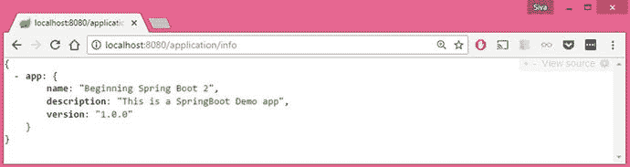

图 14-1.

Spring Boot Actuator /info 端点

```
info.app.name=Beginning Spring Boot 2
info.app.description=This is a SpringBoot Demo app
info.app.version=1.0.0
```

/health 端点

`/health` 端点显示应用程序的健康状况，包括磁盘空间、数据库等。转到 `http://localhost:8080/application/health` 检查应用程序的健康状况，如图 14-2 所示。

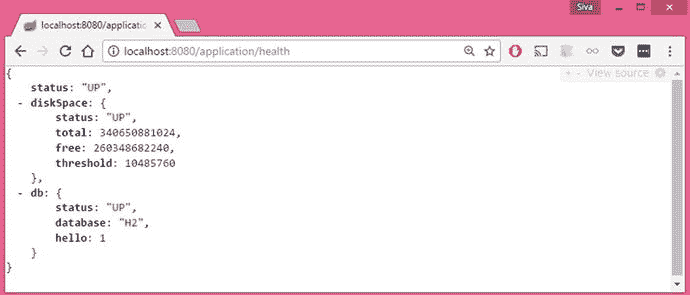

图 14-2.

Spring Boot Actuator /health 端点

默认情况下，`/health` 端点仅向未经授权的用户显示应用程序是 `UP` 还是 `DOWN`。如果用户已授权或管理安全性已禁用，`/health` 端点会显示其他信息，例如磁盘空间、数据库健康状况等。

/beans 端点

`/beans` 端点显示应用程序中注册的所有 bean，包括你显式配置的 bean 和 Spring Boot 自动配置的 bean。

将浏览器指向 `http://localhost:8080/application/beans`。你应该能够看到类似于图 14-3 所示的输出。

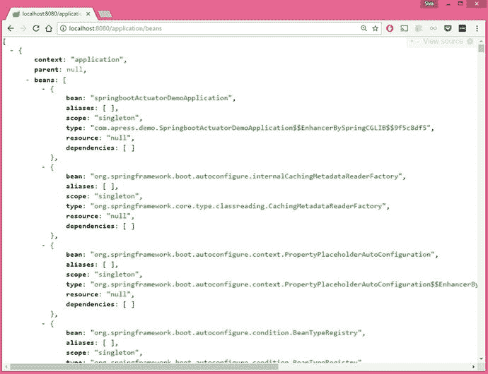

图 14-3.

Spring Boot Actuator /beans 端点

/autoconfig 端点

`/autoconfig` 端点显示自动配置报告，该报告分为 `positiveMatches` 和 `negativeMatches`。

如果你转到 `http://localhost:8080/application/autoconfig`，你应该会看到类似于图 14-4 的自动配置报告。

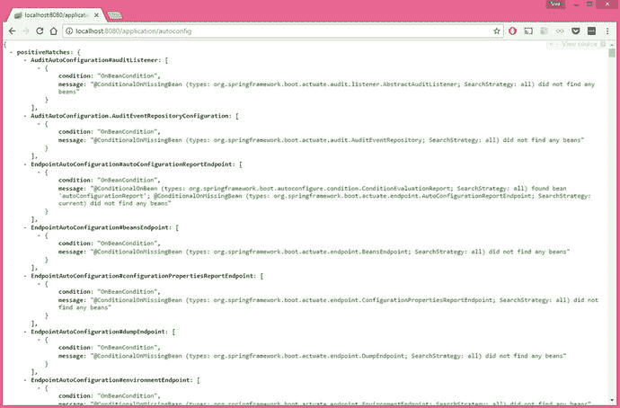

图 14-4.

Spring Boot Actuator /autoconfig 端点

`positiveMatches` 中的元素是各种 `@Conditional` 组件匹配的条件。

例如：

```
DataSourceAutoConfiguration: [
{
condition: "OnClassCondition",
message: "@ConditionalOnClass classes found: javax.sql.DataSource,org.springframework.jdbc.datasource.embedded.EmbeddedDatabaseType"
}
]
```

由于此示例添加了 `data-jpa` 启动器和 `H2` 驱动程序，因此在类路径中找到了类 `javax.sql.DataSource` 和 `org.springframework.jdbc.datasource.embedded.EmbeddedDatabaseType`，因此 `DataSourceAutoConfiguration` 成为正匹配。

`negativeMatches` 中的元素是各种 `@Conditional` 组件未匹配的条件。

例如：

```
JooqAutoConfiguration: [
{
condition: "OnClassCondition",
message: "required @ConditionalOnClass classes not found: org.jooq.DSLContext"
}
]
```

由于应用程序类路径上没有 JOOQ 库，`@ConditionalOnClass` 无法找到 `org.jooq.DSLContext` 类，因此 `JooqAutoConfiguration` 成为负匹配。

/mappings 端点

`/mappings` 端点显示应用程序中声明的所有 `@RequestMapping` 路径。这对于检查哪个请求路径将由哪个控制器方法处理非常有帮助。

如果你转到 `http://localhost:8080/application/mappings`，你应该会看到图 14-5 中所示的所有映射。

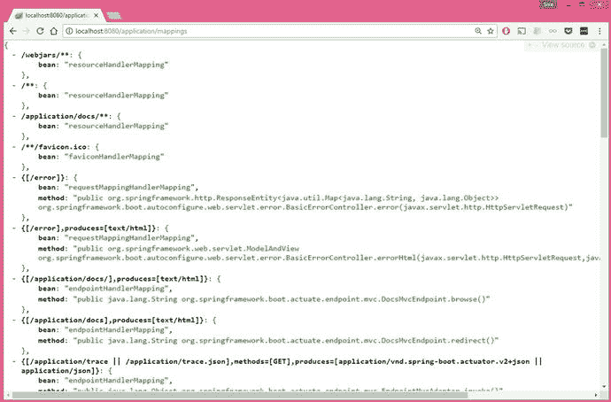

图 14-5.

Spring Boot Actuator /mappings 端点

/configprops 端点

`/configprops` 显示由 `@ConfigurationProperties` bean 定义的所有配置属性，包括你在 `application.properties` 或 YAML 文件中定义的自定义配置属性。

如果你转到 `http://localhost:8080/application/configprops`，你应该会看到所有配置属性，如图 14-6 所示。

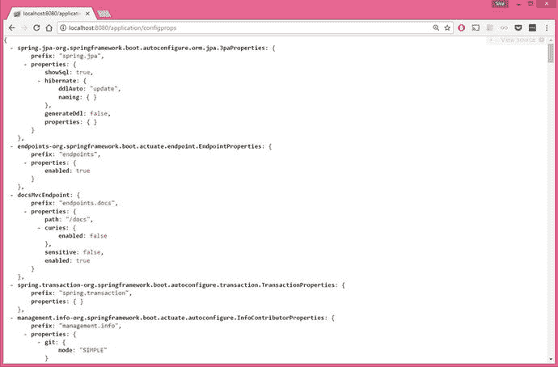

图 14-6.

Spring Boot Actuator /configprops 端点

/metrics 端点

`/metrics` 端点显示当前应用程序的各种指标，例如它使用了多少内存、有多少空闲内存、正在使用的堆大小、使用的线程数等。

如果你转到 `http://localhost:8080/application/metrics`，你应该会看到图 14-7 中所示的所有配置属性。

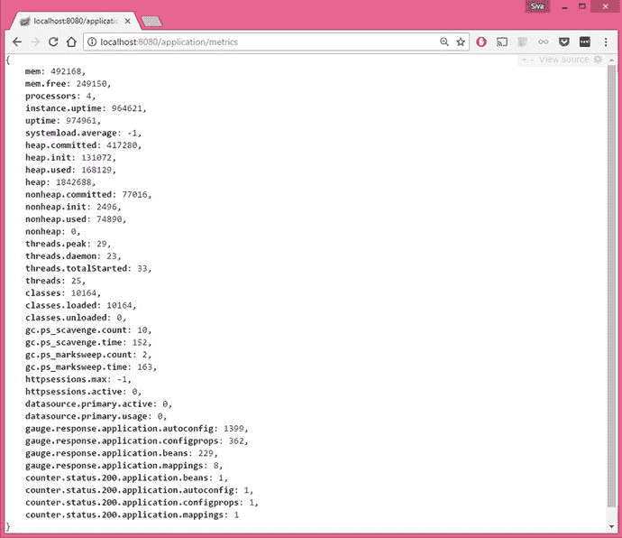

图 14-7.

Spring Boot Actuator /metrics 端点

/env 端点

`/env` 端点将公开 Spring 的 `ConfigurableEnvironment` 接口中的所有属性，例如活动配置文件列表、应用程序属性、系统环境变量等。

如果你转到 `http://localhost:8080/application/env`，你应该能够看到图 14-8 中所示的所有环境详细信息。

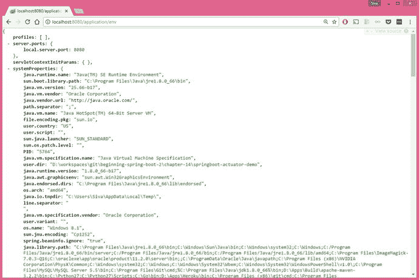

图 14-8.

Spring Boot Actuator /env 端点

/trace 端点

`/trace` 端点显示最后几个 HTTP 请求的跟踪信息，这对于调试请求/响应详细信息（如标头、Cookie 等）非常有帮助。转到 `http://localhost:8080/application/trace` 查看 HTTP 请求跟踪详细信息，如图 14-9 所示。

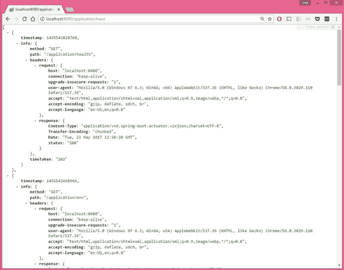

图 14-9.

Spring Boot Actuator /trace 端点

/dump 端点

你可以在 `http://localhost:8080/application/dump` 端点查看应用程序的线程转储，其中包含正在运行的线程的详细信息和 JVM 的堆栈跟踪。参见图 14-10。

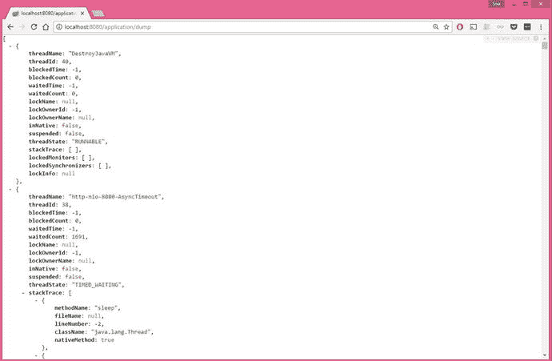

图 14-10.

Spring Boot Actuator /dump 端点

/loggers 端点

`/loggers` 端点允许你在运行时查看和配置应用程序的日志级别。你可以在 `http://localhost:8080/application/loggers` 查看所有日志记录器的日志级别，如图 14-11 所示。

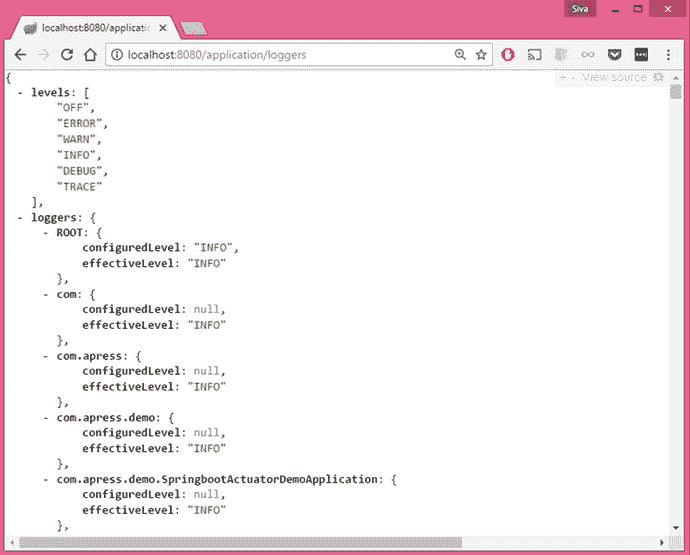

图 14-11.

Spring Boot Actuator /loggers 端点

你可以在 `http://localhost:8080/application/{loggerName}` 查看特定日志记录器的日志级别。例如，如果你想查看 `com.apress.demo` 日志记录器的日志级别，请转到 `http://localhost:8080/application/loggers/com.apress.demo`。

```
{
configuredLevel: null,
effectiveLevel: "INFO"
}
```

你可以通过向 `http://localhost:8080/application/{loggerName}` 发出 `POST` 请求来在运行时更新日志记录器的日志级别。假设你想将 `com.apress.demo` 的日志级别更改为 `DEBUG`。你可以向 `http://localhost:8080/application/loggers/com.apress.demo` URL 发送 `POST` 请求，并附带以下请求体 JSON。

```
{
configuredLevel: "DEBUG"
}
> curl -i -X POST -H 'Content-Type: application/json' -d '{"configuredLevel": "DEBUG"}' http://localhost:8080/application/loggers/com.apress.demo
```

现在，如果你通过向 `http://localhost:8080/application/loggers/com.apress.demo` 发出 `GET` 请求再次检查 `com.apress.demo` 日志记录器的日志级别，你将看到更新后的日志配置。

```
{
configuredLevel: "DEBUG",
effectiveLevel: "DEBUG"
}
```

/logfile 端点

如果你通过设置 `logging.file` 或 `logging.path` 或使用本机文件配置文件（`logback.xml`、`log4j.properties` 等）启用了基于文件的日志记录，则可以使用 `/logfile` 端点查看日志文件内容。转到 `http://localhost:8080/application/logfile`，如图 14-12 所示。

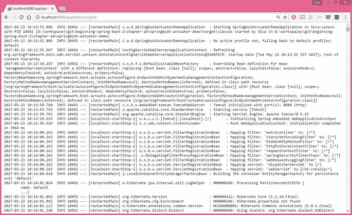

图 14-12.

Spring Boot Actuator /logfile 端点

/shutdown 端点

`/shutdown` 端点可用于优雅地关闭应用程序，默认情况下未启用。你可以通过将以下属性添加到 `application.properties` 来启用此端点。

```
endpoints.shutdown.enabled=true
```

添加此属性后，你可以将 HTTP `POST` 方法发送到 `http://localhost:8080/application/shutdown` 以调用 `/shutdown` 端点。

成功调用 `/shutdown` 端点后，你应该会看到以下消息：

```
{
"message": "Shutting down, bye..."
}
```

注意

小心启用/关闭端点。仅在绝对需要时启用或关闭端点，并确保使用适当的安全配置保护端点。

/actuator 端点

`/actuator` 端点为其他端点提供基于超媒体的“发现页面”。要激活此端点，你需要具有以下 Spring `HATEOAS` 依赖项。

```
org.springframework.hateoas
spring-hateoas

```

转到 `http://localhost:8080/application/` 查看 Actuator 端点列表，如图 14-13 所示。

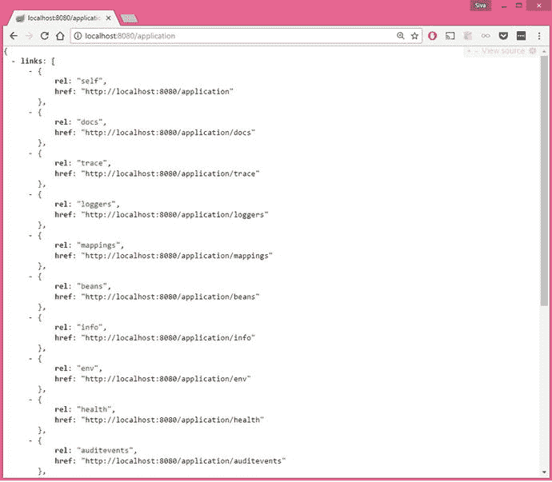

图 14-13.

Spring Boot Actuator /actuator 端点

你可以通过设置 `endpoints.actuator.path` 属性来自定义 Actuator 端点 URL。

```
endpoints.actuator.path=/actuator
```

现在你可以在 `http://localhost:8080/application/actuator` 访问 Actuator 端点。

自定义 Actuator 端点

默认情况下，Spring Boot Actuator 端点在同一个端口上运行，默认的管理上下文路径是 `"/application"`。你可以使用以下属性自定义这些属性。

```
management.context-path=/management
management.port=9090
```

通过此自定义，你可以在 `http://localhost:9090/management/` 作为基本路径访问 Actuator 端点。`/health` 端点将变为 `http://localhost:8080/management/health`。

你可以使用 `endpoints.{endpointName}.*` 属性更改端点 ID、敏感度和启用值。

```
endpoints.beans.id=springbeans
endpoints.beans.sensitive=false
endpoints.beans.enabled=true
```

通过这些自定义，你可以在 `http://localhost:8080/application/springbeans` 访问 `/beans` 端点。

你还可以使用 `endpoints.{endpoint}.enabled` 属性有选择地启用/禁用端点。

```
endpoints.trace.enabled=false
endpoints.shutdown.enabled=true
```

你可以使用 `endpoints.enabled` 属性启用/禁用所有端点，并有选择地为特定端点覆盖。例如，如果你想禁用除 /info 之外的所有端点，则按如下方式配置：

```
endpoints.enabled=false
endpoints.info.enabled=true
```

你可以使用 `endpoints.sensitive` 属性为所有端点设置敏感度，并有选择地为特定端点覆盖。例如，如果你想使所有端点不敏感，但 `/trace` 除外，你可以按如下方式配置：

```
endpoints.sensitive=false
endpoints.trace.sensitive=true
```

如果你不想通过 HTTP 公开端点，可以通过添加以下属性来禁用此选项。

```
management.port=-1
```

保护 Actuator 端点

默认情况下，所有敏感端点都是安全的，只有具有 `ACTUATOR` 角色的经过身份验证的用户才能访问这些端点。你可以通过设置以下属性将 `ACTUATOR` 角色名称更改为其他名称，例如 `SUPERADMIN`。

```
management.security.roles=SUPERADMIN
```

如果你在类路径上有 Spring Boot Security 启动器，则 Actuator 端点将由 Spring Security 保护。

将 Security 启动器依赖项添加到 `pom.xml`。

```
org.springframework.boot
spring-boot-starter-security

```

你可以按如下方式在 `application.properties` 中配置安全用户凭据，而不是使用默认用户凭据。

```
security.user.name=admin
security.user.password=secret
security.user.role=USER,ADMIN,ACTUATOR
```

现在，如果你尝试访问任何端点，例如 `http://localhost:8080/application/beans`，系统将提示你输入凭据。

但很可能你将使用由数据存储支持的自定义 Spring Security 配置来存储用户凭据，因此你可以根据需要为 Actuator 端点配置安全性。

如果出于任何原因，你想禁用 Actuator 端点的安全性，可以设置以下属性：

```
management.security.enabled=false
```

这将禁用所有 Actuator 端点的安全性。强烈建议保护 Actuator 端点，尤其是当你的应用程序可公开访问时。

实现自定义健康指示器

Spring Boot 提供了以下开箱即用的 `HealthIndicator` 实现。它们默认是自动配置的。

*   `CassandraHealthIndicator`
*   `DiskSpaceHealthIndicator`
*   `DataSourceHealthIndicator`
*   `ElasticsearchHealthIndicator`
*   `JmsHealthIndicator`
*   `MailHealthIndicator`
*   `MongoHealthIndicator`
*   `RabbitHealthIndicator`
*   `RedisHealthIndicator`
*   `SolrHealthIndicator`

除了这些，你还可以根据应用程序的健康检查需求实现自己的 `HealthIndicators`。

假设你需要定期从远程服务器下载一些馈送数据，并且有一个端点可用于检查服务器可达性。

要实现自定义 `HealthIndicator`，你需要注册一个实现 `HealthIndicator` 接口的 Spring bean。你可以实现一个 `HealthIndicator` 来 ping 馈送服务器，如清单 14-1 所示。

```
import java.util.Date;
import org.springframework.boot.actuate.health.Health;
import org.springframework.boot.actuate.health.HealthIndicator;
import org.springframework.stereotype.Component;
import org.springframework.web.client.RestClientException;
import org.springframework.web.client.RestTemplate;
@Component
public class FeedServerHealthIndicator implements HealthIndicator
{
@Override
public Health health() {
RestTemplate restTemplate = new RestTemplate();
String url = "http://feedserver.com/ping";
try {
String resp = restTemplate.getForObject(url, String.class);
if("OK".equalsIgnoreCase(resp)){
return Health.up().
build();
} else {
return Health.down()
.withDetail("ping_url", url)
.withDetail("ping_time", new Date())
.build();
}
} catch (RestClientException e) {
return Health.down(e)
.withDetail("ping_url", url)
.withDetail("ping_time", new Date())
.build();
}
}
}
清单 14-1.
实现自定义 HealthIndicator
```

现在，当你转到 `http://localhost:8080/application/health` URL 并且馈送服务器不可达时，你将看到以下响应：

```
{
status: "DOWN",
feedServer: {
status: "DOWN",
error: "org.springframework.web.client.HttpClientErrorException: 410 Gone",
ping_url: "http://feedserver.com/ping",
ping_time: 1495777475435
},
diskSpace: {
status: "UP",
total: 340650881024,
free: 260343615488,
threshold: 10485760
},
db: {
status: "UP",
database: "H2",
hello: 1
}
}
```

对各种应用程序组件和集成点进行健康检查将帮助你监控整体应用程序健康状况。

捕获自定义应用程序指标

你已经了解了如何使用 Actuator 的 `/metrics` 端点查看各种应用程序指标，例如内存、堆、线程池和数据源信息。除此之外，你还可以通过使用 `CounterService` 和 `GaugeService` 记录自己的指标。

`CounterService` 可用于递增、递减和重置命名计数器的值。`GaugeService` 可用于提交命名的指标值以供进一步分析。

假设你想捕获成功和失败登录尝试的次数。你可以使用 `CounterService` 记录这些指标，如清单 14-2 所示。

```
import org.springframework.beans.factory.annotation.Autowired;
import org.springframework.boot.actuate.metrics.CounterService;
import org.springframework.stereotype.Service;
@Service
public class LoginService
{
@Autowired
private CounterService counterService;
public boolean login(String email, String password)
{
if("admin@gmail.com".equalsIgnoreCase(email) && "admin".equals(password)){
counterService.increment("counter.login.success");
return true;
} else {
counterService.increment("counter.login.failure");
return false;
}
}
}
清单 14-2.
使用 CounterService 记录登录指标
```

现在，如果你使用正确和不正确的凭据调用 `LoginService.login()` 方法，你可以在 `http://localhost:8080/application/metrics` 端点看到这些指标。

```
{
mem: 491423,
mem.free: 155266,
....
....
datasource.primary.active: 0,
datasource.primary.usage: 0,
gauge.response.application.health: 1679,
gauge.response.application.metrics: 12,
...
...
counter.login.failure: 2,
counter.login.success: 3,
....
...
}
```

假设你想捕获调用第三方 Web 服务所需的时间。你可以使用 `GaugeService` 记录此 Web 服务调用所花费的时间。默认的 `GaugeService` 实现会将数据存储在内存中，但你可以创建一个实现来将数据馈送到你的分析工具中。参见清单 14-3。

```
import org.springframework.beans.factory.annotation.Autowired;
import org.springframework.boot.actuate.metrics.GaugeService;
import org.springframework.stereotype.Service;
import org.springframework.web.client.RestClientException;
import org.springframework.web.client.RestTemplate;
import com.apress.demo.models.GitHubUser;
@Service
public class GitHubService {
@Autowired
GaugeService gaugeService;
public GitHubUser getUserInfo(String username)
{
RestTemplate restTemplate = new RestTemplate();
String url = "https://api.github.com/users/"+username;
GitHubUser gitHubUser = null;
try {
long start = System.currentTimeMillis();
gitHubUser = restTemplate.getForObject(url, GitHubUser.class);
long end = System.currentTimeMillis();
gaugeService.submit("gauge.guthub.response-time", (end-start));
} catch (RestClientException e) {
e.printStackTrace();
}
return gitHubUser;
}
}
清单 14-3.
使用 GaugeService 记录响应时间
```

现在，如果你调用 `GitHubService.getUserInfo()` 方法，调用所花费的时间将使用 `GaugeService` 记录。你可以在 `http://localhost:8080/application/metrics` 端点查看这些指标。

```
{
mem: 491423,
mem.free: 155266,
....
....
datasource.primary.active: 0,
datasource.primary.usage: 0,
...
gauge.guthub.response-time: 126,
...
...
}
```

Actuator 端点的 CORS 支持

为了从其他源访问 Actuator 端点，你需要为它们启用 CORS 支持。CORS 支持默认是禁用的，你需要设置 `endpoints.cors.allowed-origins` 属性来启用它。

```
endpoints.cors.allowed-origins=http://remoteserver.com
endpoints.cors.allowed-methods=GET,POST
```

你还可以使用 `endpoints.cors.*` 属性添加其他 CORS 属性。

通过 JMX 进行监控和管理

默认情况下，Spring Boot 将 Actuator 端点公开为 `org.springframework.boot` 域下的 JMX MBean。你可以使用 JDK 附带的 JConsole 查看 JMX MBean。

从 `C:\\Program Files\\Java\\jdk1.8.0_45\\bin\\jconsole.exe` 运行 JConsole。选择 Spring Boot 应用程序主类并单击连接。如果你看到一个对话框显示“安全连接失败。不安全地重试？”，请单击不安全连接。

默认情况下，你将在“概述”选项卡上。单击 MBeans 选项卡。

现在展开 `org.springframework.boot` 域，你将在其中找到作为 MBean 导出的 Actuator 端点。参见图 14-14。

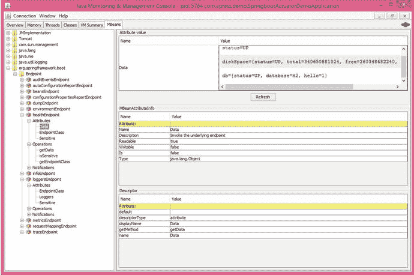

图 14-14.

Spring Boot Actuator JMX 监控

你可以使用 `endpoints.jmx.domain` 属性自定义域名。

```
endpoints.jmx.domain=mydomain
```

你可以通过设置 `endpoints.jmx.enabled=false` 来禁用通过 JMX 公开端点。

总结

在本章中，你探索了 Spring Boot Actuator，它包含了非常有用的生产支持功能。你了解了各种端点，包括如何自定义它们以及如何通过 HTTP 和 JMX 调用它们。在下一章中，你将学习如何测试 Spring Boot 应用程序。

15. 测试 Spring Boot 应用程序

测试是软件开发的重要组成部分。它帮助开发人员验证功能的正确性。JUnit 和 TestNG 是 Java 项目中最常用的两个测试库。

测试驱动开发（TDD）是一种流行的开发实践，你首先编写测试，然后编写刚好足够的代码来通过测试。你编写各种类型的测试，例如单元测试、集成测试、性能测试等。单元测试侧重于隔离测试一个组件，而集成测试则验证一个功能的行为，这可能涉及多个组件。在进行集成测试时，你可能需要模拟依赖组件的行为，例如第三方 Web 服务类、数据库方法调用等。有像 Mockito、PowerMock 和 jMock 这样的模拟库用于模拟对象的行为。

依赖注入（DI）设计模式鼓励实践并编写可测试的代码。通过依赖注入，你可以为测试注入模拟实现，为生产注入真实实现。Spring 本质上是一个依赖注入容器，它为测试应用程序的各个部分提供了极好的支持。

在本章中，你将学习如何在 Spring Boot 应用程序中测试 Spring 组件。你将详细了解如何使用 `@WebMvcTest`、`@DataJpaTest` 和 `@JdbcTest` 注解测试应用程序的切片，例如 Web 组件（常规 MVC 控制器、REST API 端点）、Spring 数据存储库以及受保护的控制器/服务方法。

测试 Spring Boot 应用程序

Spring 框架流行的关键原因之一是其对测试的出色支持。Spring 提供了 `SpringRunner`，这是一个自定义的 JUnit 运行器，通过使用 `@ContextConfiguration(classes=AppConfig.class)` 帮助加载 Spring `ApplicationContext`。

一个典型的 Spring 单元/集成测试如清单 15-1 所示。

```
@RunWith(SpringRunner.class)
@ContextConfiguration(classes=AppConfig.class)
public class UserServiceTests
{
@Autowired
UserService userService;
@Test
public void should_load_all_users()
{
List users = userService.getAllUsers();
assertNotNull(users);
assertEquals(10, users.size());
}
}
清单 15-1.
典型的 Spring JUnit 测试
```

Spring Boot 应用程序也只是一个 Spring 应用程序，因此你也可以在 Spring Boot 应用程序中使用 Spring 的所有测试功能。

但是，某些 Spring Boot 功能（例如加载外部属性和日志记录）仅在你使用 `SpringApplication` 类创建 `ApplicationContext` 时才可用，你通常会在入口点类中使用该类。如果你使用 `@ContextConfiguration`，这些额外的 Spring Boot 功能将不可用。

```
@SpringBootApplication
public class SpringbootTestingDemoApplication
{
public static void main(String[] args)
{
SpringApplication.run(SpringbootTestingDemoApplication.class, args);
}
}
```

Spring Boot 提供了 `@SpringBootTest` 注解，它在后台使用 `SpringApplication` 来加载 `ApplicationContext`，以便所有 Spring Boot 功能都可用。参见清单 15-2。

```
@RunWith(SpringRunner.class)
@SpringBootTest
public class SpringbootTestingDemoApplicationTests
{
@Autowired
UserService userService;
@Test
public void should_load_all_users()
{
...
...
}
}
清单 15-2.
典型的 Spring Boot JUnit 测试
```

对于 `@SpringBootTest`，你可以传递 Spring 配置类、Spring bean 定义 XML 文件等，但在 Spring Boot 应用程序中，你通常会使用入口点类。

Spring Boot 测试启动器 `spring-boot-starter-test` 引入了 JUnit、Spring Test 和 Spring Boot Test 模块，以及以下最常用的模拟和断言库：

*   Mockito——一个 Java 模拟框架，位于 [`http://site.mockito.org/`](http://site.mockito.org/) 。
*   Hamcrest——一个用于数据断言的匹配器/谓词库，位于 [`http://hamcrest.org/JavaHamcrest/`](http://hamcrest.org/JavaHamcrest/) 。
*   AssertJ——一个流畅的断言库，位于 [`https://joel-costigliola.github.io/assertj/`](https://joel-costigliola.github.io/assertj/) 。
*   JSONassert——一个用于 JSON 的断言库，位于 [`https://github.com/skyscreamer/JSONassert`](https://github.com/skyscreamer/JSONassert) 。
*   JsonPath——用于 JSON 的 XPath，位于 [`https://github.com/json-path/JsonPath`](https://github.com/json-path/JsonPath) 。

现在你将看到如何创建一个简单的 Spring Boot Web 应用程序和一个简单的 REST 端点。

```

org.springframework.boot
spring-boot-starter-web

org.springframework.boot
spring-boot-starter-test
test

```

首先创建一个名为 `Application.java` 的入口点类，如下所示：

```
@SpringBootApplication
public class Application
{
public static void main(String[] args)
{
SpringApplication.run(Application.class, args);
}
}
```

清单 15-3 显示了如何创建一个名为 `/ping` 的简单 REST 端点。

```
@RestController
public class PingController
{
@GetMapping("/ping")
public String ping()
{
return "OK";
}
}
清单 15-3.
Spring REST 控制器
```

现在，如果你运行应用程序，你可以调用 REST 端点 `http://localhost:8080/ping`，它将返回响应 `"OK"`。现在你可以为 `/ping` 端点编写一个测试。参见清单 15-4。

```
import static org.assertj.core.api.Assertions.assertThat;
import org.junit.Test;
import org.junit.runner.RunWith;
import org.springframework.beans.factory.annotation.Autowired;
import org.springframework.boot.test.context.SpringBootTest;
import org.springframework.boot.test.context.SpringBootTest.WebEnvironment;
import org.springframework.boot.test.web.client.TestRestTemplate;
import org.springframework.http.HttpStatus;
import org.springframework.http.ResponseEntity;
import org.springframework.test.context.junit4.SpringRunner;
@RunWith(SpringRunner.class)
@SpringBootTest(webEnvironment=WebEnvironment.RANDOM_PORT)
public class PingControllerTests
{
@Autowired
TestRestTemplate restTemplate;
@Test
public void testPing()
{
ResponseEntity respEntity = restTemplate.getForEntity("/ping", String.class);
assertThat(respEntity.getStatusCode()).isEqualTo(HttpStatus.OK);
assertThat(respEntity.getBody()).isEqualTo("OK");
}
}
清单 15-4.
使用 TestRestTemplate 测试 Spring REST 端点
```

由于你需要测试 REST 端点，因此通过指定 `@SpringBootTest` 的 `webEnvironment` 属性来启动嵌入式 Servlet 容器。

默认的 `webEnvironment` 值是 `WebEnvironment.MOCK`，它不会启动嵌入式 Servlet 容器。

你可以根据你希望如何运行测试来使用各种 `webEnvironment` 值。

*   `MOCK (默认)`——加载 `WebApplicationContext` 并提供模拟的 Servlet 环境。它不会启动嵌入式 Servlet 容器。如果 Servlet API 不在你的类路径上，此模式将回退到创建常规的非 Web `ApplicationContext`。
*   `RANDOM_PORT`——加载 `ServletWebServerApplicationContext` 并启动一个监听随机可用端口的嵌入式 Servlet 容器。
*   `DEFINED_PORT`——加载 `ServletWebServerApplicationContext` 并启动一个监听已定义端口（`server.port`）的嵌入式 Servlet 容器。
*   `NONE`——使用 `SpringApplication` 加载 `ApplicationContext`，但不提供 Servlet 环境。

仅当 `@SpringBootTest` 与嵌入式 Servlet 容器一起启动时，`TestRestTemplate` bean 才会自动注册。

在运行启动嵌入式 Servlet 容器的集成测试时，最好使用 `WebEnvironment.RANDOM_PORT`，这样它就不会与其他正在运行的应用程序冲突，尤其是在多个构建并行运行的持续集成（CI）环境中。

你可以通过使用 `@SpringBootTest` 注解的 `classes` 属性来指定用于构建 `ApplicationContext` 的配置类。如果你没有显式指定任何类，它将自动搜索嵌套的 `@Configuration` 类，并将回退到搜索 `@SpringBootConfiguration` 类。`@SpringBootApplication` 使用 `@SpringBootConfiguration` 注解，因此 `@SpringBootTest` 将拾取应用程序的入口点类。

使用模拟实现进行测试

在执行单元测试时，你可能希望模拟对外部服务（如数据库交互和 Web 服务调用）的调用。你可以创建用于测试的模拟实现和用于生产的真实实现。

假设你有一个 `EmployeeRepository` 文件，它与数据库通信并获取员工数据，如清单 15-5 所示。

```
public interface EmployeeRepository
{
List findAllEmployees();
}
清单 15-5.
EmployeeRepository.java
```

假设你有 `EmployeeService`，它依赖于 `EmployeeRepository`，具有 `getMaxSalariedEmployee()` 和其他一些与员工相关的方法。参见清单 15-6。

```
@Service
public class EmployeeService
{
private EmployeeRepository employeeRepository;
@Autowired
public EmployeeService(EmployeeRepository employeeRepository)
{
this.employeeRepository = employeeRepository;
}
public Employee getMaxSalariedEmployee()
{
Employee emp = null;
List emps = employeeRepository.findAllEmployees();
//loop through emps and find max salaried emp
return emp;
}
}
清单 15-6.
EmployeeService.java
```

现在你可以为测试创建一个模拟的 `EmployeeRepository` 文件，如清单 15-7 所示。

```
@Repository
@Profile("test")
public class MockEmployeeRepository implements EmployeeRepository
{
public List findAllEmployees()
{
return Arrays.asList(
new Employee(1, "A", 50000),
new Employee(2, "B", 75000),
new Employee(3, "C", 43000)
};
}
}
清单 15-7.
MockEmployeeRepository.java
```

现在你将创建一个用于生产的真实 `EmployeeRepository` 实现，如清单 15-8 所示。

```
@Service
@Profile("production")
public class JdbcEmployeeRepository implements EmployeeRepository
{
@Autowired
private JdbcTemplate jdbcTemplate;
public List findAllEmployees()
{
return jdbcTemplate.query(...);
}
}
清单 15-8.
JdbcEmployeeRepository.java
```

你可以使用 `@ActiveProfiles` 注解来指定要使用的配置文件，以便仅激活与这些配置文件关联的 bean。参见清单 15-9。

```
@ActiveProfiles("test")
@RunWith(SpringRunner.class)
@SpringBootTest
public class ApplicationTests
{
@Autowired
EmployeeService employeeService;
@Test
public void test_getMaxSalariedEmployee()
{
Employee emp = employeeService.getMaxSalariedEmployee();
assertNotNull(emp);
assertEquals(2, emp.getId());
assertEquals("B", emp.getName());
assertEquals(75000, emp.getSalary());
}
}
清单 15-9.
使用配置文件进行模拟实现测试
```

由于你已启用 `test` 配置文件，`MockEmployeeRepository` 将被注入到 `EmployeeService` 中。你可以在生产环境中运行应用程序时激活 `production` 配置文件，如下所示：

```
java -jar myapp.jar -Dspring.profiles.active=production
```

在运行主应用程序时，将使用 `production` 配置文件，并且 `JdbcEmployeeRepository` 将被注入到 `EmployeeService` 中。

除了提供模拟数据之外，你可能还需要模拟其他行为，例如在调用某些方法时抛出异常。但是，为每个用例创建模拟实现可能很繁琐。你可以使用模拟库来创建模拟对象，而无需实际创建具有模拟行为的类。下一节将介绍如何使用流行的模拟库 Mockito 进行单元测试。

使用 Mockito 进行测试

Mockito 是一个流行的 Java 模拟框架，可以与 JUnit 一起使用。Mockito 允许你通过模拟具有所需行为的外部依赖项来编写测试。

例如，假设你正在调用某个外部 Web 服务。当它由于某些通信故障而失败时，你希望在放弃之前重试三次。为了测试重试行为，该外部 Web 服务应该抛出一个你可能无法控制的异常。你可以使用 Mockito 来模拟此行为，以便你可以测试重试功能。

假设你正在使用 Web 服务从第三方导入用户数据，如清单 15-10 所示。

```
@Service
public class UsersImporter
{
public List importUsers() throws UserImportServiceCommunicationFailure
{
List users = new ArrayList();
//get users by invoking some web service
//if any exception occurs throw UserImportServiceCommunicationFailure
//dummy data
users.add(new User());
users.add(new User());
users.add(new User());
return users;
}
}
清单 15-10.
UsersImporter.java
```

`UserService` 使用 `UsersImporter` 获取用户数据，并在发生 `UserImportServiceCommunicationFailure` 时重试三次。参见清单 15-11。

```
@Service
@Transactional
public class UsersImportService
{
private Logger logger = LoggerFactory.getLogger(UserService.class);
private UsersImporter usersImporter;
@Autowired
public UsersImportService(UsersImporter usersImporter)
{
this.usersImporter = usersImporter;
}
public UsersImportResponse importUsers()
{
int retryCount = 0;
int maxRetryCount = 3;
for (int i = 0; i  importUsers = usersImporter.importUsers();
logger.info("Import Users: "+importUsers);
break;
} catch (UserImportServiceCommunicationFailure e)
{
retryCount++;
logger.error("Error: "+e.getMessage());
}
}
if(retryCount >= maxRetryCount)
return new UsersImportResponse(retryCount, "FAILURE");
else
return new UsersImportResponse(0, "SUCCESS");
}
}
public class UsersImportResponse
{
private int retryCount;
private String status;
//setters & getters
}
清单 15-11.
UsersImportService.java
```

此代码调用 `usersImporter.importUsers()` 方法，如果它抛出 `UserImportServiceCommunicationFailure`，则重试三次。

如果你想测试 `usersImporter.importUsers()` 是否在没有异常的情况下返回结果，那么应该返回 `UsersImportResponse(0, "SUCCESS")`；否则，应该返回 `UsersImportResponse(3, "FAILURE")`。

你可以使用 `@Mock` 创建模拟对象，使用 `@InjectMocks` 将依赖项与模拟对象一起注入。你可以使用 `@RunWith(MockitoJUnitRunner.class)` 初始化模拟对象，或者在 JUnit `@Before` 方法中使用 `MockitoAnnotations.initMocks(this)` 触发模拟对象初始化。参见清单 15-12。

```
import static org.assertj.core.api.Assertions.assertThat;
import static org.mockito.BDDMockito.*;
import org.junit.Test;
import org.junit.runner.RunWith;
import org.mockito.InjectMocks;
import org.mockito.Mock;
import org.mockito.junit.MockitoJUnitRunner;
import com.apress.demo.exceptions.UserImportServiceCommunicationFailure;
import com.apress.demo.model.UsersImportResponse;
@RunWith(MockitoJUnitRunner.class)
public class UsersImportServiceMockitoTest
{
@Mock
private UsersImporter usersImporter;
@InjectMocks
private UsersImportService usersImportService;
@Test
public void should_retry_3times_when_UserImportServiceCommunicationFailure_occured()
{
given(usersImporter.importUsers()).willThrow(new UserImportServiceCommunicationFailure());
UsersImportResponse response = usersImportService.importUsers();
assertThat(response.getRetryCount()).isEqualTo(3);
assertThat(response.getStatus()).isEqualTo("FAILURE");
}
}
清单 15-12.
使用 Mockito 模拟对象进行测试
```

在这里，你模拟了使用 Web 服务导入用户时的失败条件，如下所示：

```
given(usersImporter.importUsers()).willThrow(new UserImportServiceCommunicationFailure());
```

因此，当你调用 `userService.importUsers()` 并且模拟的 `usersImporter` 对象抛出 `UserImportServiceCommunicationFailure` 时，它将重试三次。类似地，你可以使用 Mockito 模拟任何类型的行为以满足这些测试用例。

Spring Boot 提供了 `@MockBean` 注解，可用于定义新的 Mockito 模拟 bean 或用模拟 bean 替换 Spring bean，并将其注入到它们的依赖 bean 中。模拟 bean 将在每个测试方法后自动重置。参见清单 15-13。

```
import static org.assertj.core.api.Assertions.assertThat;
import static org.mockito.BDDMockito.*;
import org.junit.Test;
import org.junit.runner.RunWith;
import org.springframework.beans.factory.annotation.Autowired;
import org.springframework.boot.test.context.SpringBootTest;
import org.springframework.boot.test.mock.mockito.MockBean;
import org.springframework.test.context.junit4.SpringRunner;
import com.apress.demo.exceptions.UserImportServiceCommunicationFailure;
import com.apress.demo.model.UsersImportResponse;
@RunWith(SpringRunner.class)
@SpringBootTest
public class UsersImportServiceMockitoTest
{
@MockBean
private UsersImporter usersImporter;
@Autowired
private UsersImportService usersImportService;
@Test
public void should_retry_3times_when_UserImportServiceCommunicationFailure_occured()
{
given(usersImporter.importUsers()).willThrow(new UserImportServiceCommunicationFailure());
UsersImportResponse response = usersImportService.importUsers();
assertThat(response.getRetryCount()).isEqualTo(3);
assertThat(response.getStatus()).isEqualTo("FAILURE");
}
}
清单 15-13.
使用 Spring Boot 的 @MockBean 模拟进行测试
```

在这里，Spring Boot 将为 `UsersImporter` 创建一个 Mockito 模拟对象，并将其注入到 `UsersImportService` bean 中。

使用 @*Test 注解测试应用程序切片

在测试应用程序的各个组件时，你可能希望加载 Spring `ApplicationContext` bean 的一个子集，这些 bean 与测试中的主题（SUT）相关。例如，在测试 SpringMVC 控制器时，你可能只想加载 MVC 层组件，并提供模拟的服务层 bean 作为依赖项。

Spring Boot 提供了诸如 `@WebMvcTest`、`@DataJpaTest`、`@DataMongoTest`、`@JdbcTest` 和 `@JsonTest` 之类的注解来测试应用程序的切片。

使用 @WebMvcTest 测试 SpringMVC 控制器

Spring Boot 提供了 `@WebMvcTest` 注解，它将自动配置 SpringMVC 基础设施组件，并仅加载 `@Controller`、`@ControllerAdvice`、`@JsonComponent`、`Filter`、`WebMvcConfigurer` 和 `HandlerMethodArgumentResolver` 组件。使用此注解时，不会扫描其他 Spring bean（使用 `@Component`、`@Service`、`@Repository` 等注解的 bean）。

现在你将看到如何创建一个将数据添加到模型并渲染 Thymeleaf 视图的控制器。参见清单 15-14。

```
import org.springframework.beans.factory.annotation.Autowired;
import org.springframework.stereotype.Controller;
import org.springframework.ui.Model;
import org.springframework.web.bind.annotation.GetMapping;
import com.apress.demo.repositories.TodoRepository;
@Controller
public class TodoController
{
@Autowired
TodoRepository todoRepository;
@GetMapping("/todolist")
public String showTodos(Model model)
{
model.addAttribute("todos", todoRepository.findAll());
return "todos";
}
}
清单 15-14.
TodoController.java
```

清单 15-15 显示了如何使用 `@WebMvcTest` 为 `TodoController` 编写测试。

```
import static org.mockito.BDDMockito.*;
import static org.springframework.test.web.servlet.request.MockMvcRequestBuilders.get;
import static org.springframework.test.web.servlet.result.MockMvcResultMatchers.*;
import static org.hamcrest.Matchers.*;
import java.util.Arrays;
import org.junit.Test;
import org.junit.runner.RunWith;
import org.springframework.beans.factory.annotation.Autowired;
import org.springframework.boot.test.autoconfigure.web.servlet.WebMvcTest;
import org.springframework.boot.test.mock.mockito.MockBean;
import org.springframework.http.MediaType;
import org.springframework.test.context.junit4.SpringRunner;
import org.springframework.test.web.servlet.MockMvc;
import com.apress.demo.entities.Todo;
import com.apress.demo.repositories.TodoRepository;
@RunWith(SpringRunner.class)
@WebMvcTest(controllers= TodoController.class)
public class TodoControllerTests
{
@Autowired
private MockMvc mvc;
@MockBean
private TodoRepository todoRepository;
@Test
public void testShowAllTodos() throws Exception
{
Todo todo1 = new Todo(1, "Todo1",false);
Todo todo2 = new Todo(2, "Todo2",true);
given(this.todoRepository.findAll()).willReturn(Arrays.asList(todo1, todo2));
this.mvc.perform(get("/todolist")
.accept(MediaType.TEXT_HTML))
.andExpect(status().isOk())
.andExpect(view().name("todos"))
.andExpect(model().attribute("todos", hasSize(2)))
;
verify(todoRepository, times(1)).findAll();
}
}
清单 15-15.
使用 MockMvc 测试 SpringMVC 控制器
```

你已使用 `@WebMvcTest(controllers = TodoController.class)` 注解了测试，并通过显式指定你正在测试的控制器。由于 `@WebMvcTest` 不加载其他常规 Spring bean，并且 `TodoController` 依赖于 `TodoRepository`，因此你使用 `@MockBean` 注解提供了一个模拟 bean。`@WebMvcTest` 自动配置 `MockMvc`，可用于测试控制器，而无需启动实际的 Servlet 容器。

在此测试方法中，你设置了 `todoRepository.findAll()` 的预期行为，以返回两个 `Todo` 对象的列表。然后你向 `"/todolist"` 发出 `GET` 请求，并对响应进行各种断言。

使用 @WebMvcTest 测试 SpringMVC REST 控制器

与测试 SpringMVC 控制器类似，你也可以测试 REST 控制器。你可以使用 `JsonPath` 或 `JSONassert` 库对响应数据编写断言。

创建一个 `TodoRestController`，如清单 15-16 所示。

```
import java.util.Optional;
import org.springframework.beans.factory.annotation.Autowired;
import org.springframework.web.bind.annotation.GetMapping;
import org.springframework.web.bind.annotation.PathVariable;
import org.springframework.web.bind.annotation.RestController;
import com.apress.demo.entities.Todo;
import com.apress.demo.repositories.TodoRepository;
@RestController
public class TodoRestController
{
@Autowired
private TodoRepository todoRepository;
@GetMapping("/api/todos/{id}")
public Optional findById(@PathVariable Integer id)
{
return todoRepository.findById(id);
}
}
清单 15-16.
TodoRestController.java.
```

你可以为 `TodoRestController` 编写一个测试，如清单 15-17 所示。

```
import static org.hamcrest.CoreMatchers.*;
import static org.mockito.BDDMockito.*;
import static org.springframework.test.web.servlet.request.MockMvcRequestBuilders.get;
import static org.springframework.test.web.servlet.result.MockMvcResultMatchers.jsonPath;
import static org.springframework.test.web.servlet.result.MockMvcResultMatchers.status;
import java.util.Optional;
import org.junit.Test;
import org.junit.runner.RunWith;
import org.springframework.beans.factory.annotation.Autowired;
import org.springframework.boot.test.autoconfigure.web.servlet.WebMvcTest;
import org.springframework.boot.test.mock.mockito.MockBean;
import org.springframework.http.MediaType;
import org.springframework.test.context.junit4.SpringRunner;
import org.springframework.test.web.servlet.MockMvc;
import com.apress.demo.entities.Todo;
import com.apress.demo.repositories.TodoRepository;
@RunWith(SpringRunner.class)
@WebMvcTest(controllers= TodoRestController.class)
public class TodoRestControllerTests
{
@Autowired
private MockMvc mvc;
@MockBean
private TodoRepository todoRepository;
@Test
public void testFindTodoById() throws Exception
{
Todo todo = new Todo(1, "Todo1", false);
given(this.todoRepository.findById(1)).willReturn(Optional.of(todo));
this.mvc.perform(get("/api/todos/1")
.accept(MediaType.APPLICATION_JSON))
.andExpect(status().isOk())
.andExpect(jsonPath("$.id", is(1)))
.andExpect(jsonPath("$.text", is("Todo1")))
.andExpect(jsonPath("$.done", is(false)));
verify(todoRepository, times(1)).findById(1);
}
}
清单 15-17.
使用 MockMvc 测试 SpringMVC REST 控制器
```

你以与测试 `TodoController` 相同的方式测试 `TodoRestController` 端点 `"/api/todos/{id}"`，但使用 JSON `Path` 断言来验证返回的 JSON 响应数据。

测试受保护的控制器/服务方法

在第 13 章中，你学习了如何保护 Web 应用程序和 REST API，以及应用方法级安全性。Spring 也提供了几种测试这些受保护资源的方法。

现在你将看到如何测试受保护的资源。

添加以下依赖项以启用 Spring Security 和安全测试功能。

```
org.springframework.boot
spring-boot-starter-security

org.springframework.security
spring-security-test
test

```

当你添加 Security 启动器而没有自定义安全配置时，MVC 端点将使用 HTTP 基本身份验证进行保护，并使用默认用户和生成的密码。你可以按如下方式在 `application.properties` 中配置凭据，而不是使用默认凭据：

```
security.user.name=admin
security.user.password=admin123
security.user.role=USER,ADMIN
```

你可以使用自动配置的 `TestRestTemplate` 来测试 REST 端点，传递 HTTP 基本身份验证参数，如清单 15-18 所示。

```
@RunWith(SpringRunner.class)
@SpringBootTest(webEnvironment=WebEnvironment.RANDOM_PORT)
public class PingControllerTests
{
@Autowired
TestRestTemplate restTemplate;
@Test
public void testPing() throws Exception
{
ResponseEntity respEntity =
restTemplate.withBasicAuth("admin", "admin123")
.getForEntity("/ping", String.class);
assertThat(respEntity.getStatusCode()).isEqualTo(HttpStatus.OK);
assertThat(respEntity.getBody()).isEqualTo("OK");
}
}
清单 15-18.
使用 TestRestTemplate 通过 HTTP 基本身份验证测试 REST 端点
```

请注意，你使用 `restTemplate.withBasicAuth("admin", "admin123")` 传递了凭据。还要注意，通过使用 `TestRestTemplate`，你可以使用相对路径（如 `"/ping"`）调用 REST 端点，而不是指定完整的 URL `http://localhost:<port>/ping`。这在使用 `RANDOM_PORT` 时非常方便。但是，如果你想自己构造 URL，可以使用 `@LocalServerPort` 获取 `RANDOM_PORT` 值，如下所示：

```
import org.springframework.boot.web.server.LocalServerPort;
@LocalServerPort
int port;
```

你可能希望自定义默认的 Spring Security 配置，并使用基于表单的身份验证而不是 HTTP 基本身份验证。

现在你将看到如何自定义 Spring Security 以配置一些内存中的用户详细信息并启用方法级安全性，如清单 15-19 所示。

```
@Configuration
@EnableWebSecurity
@EnableGlobalMethodSecurity(securedEnabled = true, prePostEnabled=true)
public class WebSecurityConfig extends WebSecurityConfigurerAdapter
{
@Autowired
protected void configureGlobal(AuthenticationManagerBuilder auth) throws Exception
{
auth
.inMemoryAuthentication()
.withUser("user").password("password").roles("USER").and()
.withUser("admin").password("admin123").roles("USER", "ADMIN");
}
@Override
protected void configure(HttpSecurity http) throws Exception {
http.authorizeRequests()
.antMatchers("/api/todos/**").hasRole("USER")
.antMatchers("/admin/**").hasRole("ADMIN")
.antMatchers("/ping").hasAnyRole("USER","ADMIN")
.anyRequest().authenticated()
;
}
}
清单 15-19.
自定义 Spring Security 配置
```

你已经自定义了安全配置，并且 `httpBasic` 身份验证未启用。因此，你不能使用带有基本身份验证参数的 `TestRestTemplate` 来测试受保护的 REST 端点。你可以使用 `@WebMvcTest` 并使用 `MockMvc` 调用 REST 端点，这允许你传递安全用户凭据。

当使用 `@WebMvcTest` 时，默认情况下将使用 Spring Security HTTP 基本身份验证，而不是你手动配置的自定义安全配置。你可以使用 `@WebMvcTest` 的 `secure=false` 属性关闭基本身份验证，并使用 `@ContextConfiguration` 加载安全配置，如清单 15-20 所示。

```
@RunWith(SpringRunner.class)
@WebMvcTest(controllers= TodoRestController.class, secure=false)
@ContextConfiguration(classes={SpringbootTestingDemoApplication.class, WebSecurityConfig.class})
public class TodoRestControllerTests
{
@Autowired
private MockMvc mvc;
@MockBean
private TodoRepository todoRepository;
//@Test methods
}
清单 15-20.
使用自定义 Spring Security 配置测试 REST 控制器
```

清单 15-21 向你展示了如何使用 `MockMvc` 测试 `GET /api/todos/{id}` 端点。

```
@Test
public void testFindTodoById() throws Exception
{
Todo todo = new Todo(1, "Todo1", false);
given(this.todoRepository.findById(1)).willReturn(Optional.of(todo));
this.mvc.perform(get("/api/todos/1")
.with(user("admin").password("admin123").roles("USER","ADMIN"))
.accept(MediaType.APPLICATION_JSON))
.andExpect(status().isOk())
.andExpect(jsonPath("$.id", is(1)))
.andExpect(jsonPath("$.text", is("Todo1")))
.andExpect(jsonPath("$.done", is(false)));
verify(todoRepository, times(1)).findById(1);
}
清单 15-21.
使用 MockMvc 测试受保护的 REST 端点
```

在这里，你模拟了 `todoRepository.findById(1)` 方法，并使用 `MockMvc.perform()` 触发 GET 请求，并使用 `.with(user("admin").password("admin123").roles("USER","ADMIN"))` 传递安全用户凭据。

清单 15-22 向你展示了如何测试 `POST /api/todos` 端点以创建一个新的 `Todo`。

```
@Autowired
private ObjectMapper objectMapper;
@Test
public void testCreateTodo() throws Exception
{
Todo todo = new Todo(null, "New Todo1", false);
String content = objectMapper.writeValueAsString(todo);
given(this.todoRepository.save(any(Todo.class))).willReturn(todo);
this.mvc.perform(post("/api/todos")
.contentType(MediaType.APPLICATION_JSON_VALUE)
.content(content)
.with(csrf())
.with(user("admin").password("admin123").roles("USER","ADMIN"))
.accept(MediaType.APPLICATION_JSON_VALUE))
.andExpect(status().isOk())
.andExpect(MockMvcResultMatchers.content().json(content))
.andReturn()
;
verify(todoRepository, times(1)).save(any(Todo.class));
}
清单 15-22.
使用 MockMvc 测试带有 CSRF 令牌的受保护 REST 端点
```

它类似于之前的测试方法，但你使用 `MockMvc.perform()` 执行 `POST` 请求，并使用 `with(csrf())` 设置 CSRF 令牌。由于这是一个 `POST` 请求并且 CSRF 已启用，你应该发送 CSRF 令牌；否则，它将抛出带有 HTTP 状态码 `403` 的 `AccessDeniedException`。

除了使用 `configure(HttpSecurity http)` 方法配置安全约束之外，你还可以使用 `@Secured` 或 `@PreAuthorize` 注解来保护 REST 端点。参见清单 15-23。

```
@RestController
public class AdminRestController
{
@Autowired
private UserService userService;
@Secured("ROLE_ADMIN")
@DeleteMapping("/admin/users/{id}")
public void deleteUser(@PathVariable("id") Integer userId)
{
userService.deleteUser(userId);
}
}
清单 15-23.
使用注解保护方法的 AdminRestController
```

REST 端点 `DELETE /admin/users/{id}` 可以由具有 `ADMIN` 角色的用户访问。你可以使用 `MockMvc` 以相同的方式测试由 `@Secured` 或 `@PreAuthorize` 注解保护的 REST 端点，如清单 15-24 所示。

```
@RunWith(SpringRunner.class)
@WebMvcTest(controllers= AdminRestController.class, secure=false)
@ContextConfiguration(classes={SpringbootTestingDemoApplication.class, WebSecurityConfig.class})
public class AdminRestControllerTests
{
@Autowired
private MockMvc mvc;
@MockBean
private UserService userService;
@Test
public void testAdminDeleteUser() throws Exception
{
Mockito.doNothing()
.when(userService)
.deleteUser(Mockito.any(Integer.class));
this.mvc.perform(delete("/admin/users/2")
.with(csrf())
.with(user("admin").password("admin123").roles("ADMIN"))
.accept(MediaType.APPLICATION_JSON))
.andExpect(status().isOk());
verify(userService, times(1)).deleteUser(2);
}
}
清单 15-24.
使用 MockMvc 测试由 @Secured 注解保护的 REST 端点
```

除了保护 Web 层之外，你还可以通过使用方法级安全性并使用 `@Secured` 或 `@PreAuthorize` 注解方法来保护任何 Spring 组件。你也可以在类级别使用这些注解，这会将安全配置应用于该类中的所有方法。

清单 15-25 向你展示了如何使用 `@Secured` 和 `@PreAuthorize` 保护 `UserService` 方法。

```
@Service
@Transactional
public class UserService
{
private UserRepository userRepository;
@Autowired
public UserService(UserRepository repo)
{
this.userRepository = repo;
}
public Optional findUserById(Integer userId)
{
return userRepository.findById(userId);
}
@Secured("ROLE_USER")
public void createUser(User user)
{
userRepository.save(user);
}
@PreAuthorize("isAuthenticated()")
public void updateUser(User user)
{
userRepository.save(user);
}
@Secured("ROLE_ADMIN")
public void deleteUser(Integer userId)
{
userRepository.delete(userId);
}
}
清单 15-25.
具有方法级安全性的 UserService.java
```

在 `UserService` 中，你已将 `deleteUser()` 方法配置为仅对 `ADMIN` 用户可访问，`createUser()` 方法仅对具有 `USER` 角色的用户可访问，`updateUser()` 方法可由任何经过身份验证的用户访问。

方法一

你可以使用 JUnit `@Before` 方法初始化 Spring Security 用户身份验证，并使用 `@After` 方法清除 `SecurityContextHolder`。参见清单 15-26。

```
@RunWith(SpringRunner.class)
@SpringBootTest(webEnvironment=WebEnvironment.RANDOM_PORT)
public class SpringbootTestingDemoApplicationTests
{
@Autowired
private UserService userService;
@Autowired
private ApplicationContext context;
private Authentication authentication;
@Before
public void init() {
AuthenticationManager authenticationManager =
this.context.getBean(AuthenticationManager.class);
this.authentication = authenticationManager.authenticate(
new UsernamePasswordAuthenticationToken("admin", "admin123"));
}
@After
public void close() {
SecurityContextHolder.clearContext();
}
@Test(expected = AuthenticationCredentialsNotFoundException.class)
public void deleteUserUnauthenticated() {
userService.deleteUser(3);
}
@Test
public void deleteUserAuthenticated() {
SecurityContextHolder.getContext().setAuthentication(this.authentication);
userService.deleteUser(3);
}
}
清单 15-26.
使用 AuthenticationManager 测试受保护的方法
```

在这里，你在没有身份验证的情况下调用 `deleteUserUnauthenticated()` 测试方法。这意味着 `userService.deleteUser()` 将抛出 `AuthenticationCredentialsNotFoundException`。但在 `deleteUserAuthenticated()` 测试用例中，你使用有效的用户凭据为 `ADMIN` 角色设置了用户身份验证，因此它将允许你调用 `userService.deleteUser()` 方法。

方法二

Spring Security 4.0 引入了 `@WithMockUser` 注解，它允许你更轻松地测试受保护的资源。`@WithMockUser` 默认将使用用户名设置为 `user`、密码设置为 `password`、角色设置为 `ROLE_USER` 来初始化用户身份验证。

```
@Test
@WithMockUser
public void createUserWithMockUser() {
User user = new User();
user.setName("Yosin");
user.setEmail("yosin@gmail.com");
user.setPassword("yosin123");
userService.createUser(user);
}
```

由于 `userService.createUser()` 允许具有 `ROLE_USER` 角色的用户调用，你可以简单地添加 `@WithMockUser` 来运行 `createUserWithMockUser()` 测试用例。

你还可以显式地向 `@WithMockUser` 提供 `username`、`password` 和 `roles`，如下所示。

```
@Test
@WithMockUser(username="admin", password="admin123", roles={"USER","ADMIN"})
public void deleteUserAuthenticatedWithMockUser() {
userService.deleteUser(2);
}
```

方法三

在实际应用程序中，你可能使用了自定义的 `UserDetailsService` 和自定义的 `UserDetails` 实现。在这些情况下，你可以使用 `@WithUserDetails` 来初始化通过使用自定义 `UserDetailsService` 加载的用户身份验证。

```
@Test
@WithUserDetails
public void createUserWithUserDetails()
{
...
}
```

你还可以传递特定的 `username` 作为 `@WithUserDetails("admin")`，它使用通过使用自定义 `UserDetailsService` 加载的 `admin` 用户详细信息来初始化用户身份验证。

有关 Spring Security 测试的更多详细信息，请访问参考文档：[`http://docs.spring.io/spring-security/site/docs/current/reference/htmlsingle/#test`](http://docs.spring.io/spring-security/site/docs/current/reference/htmlsingle/#test) 。

使用 @DataJpaTest 和 @JdbcTest 测试持久层组件

你可能希望测试应用程序的持久层组件，这不需要加载许多组件，如控制器、安全配置等。Spring Boot 提供了 `@DataJpaTest` 和 `@JdbcTest` 注解来测试与关系数据库通信的 Spring bean。

Spring Boot 提供了 `@DataJpaTest` 注解来测试持久层组件，它将自动配置内存中的嵌入式数据库，并扫描 `@Entity` 类和 Spring Data JPA 存储库。`@DataJpaTest` 注解不会将其他 Spring bean（`@Components`、`@Controller`、`@Service` 和带注解的 bean）加载到 `ApplicationContext` 中。

现在你将看到如何在 Spring Boot 应用程序中测试 Spring Data JPA 存储库。创建一个带有 Data-JPA 和 Test 启动器的 Spring Boot Maven 项目。

```

org.springframework.boot
spring-boot-starter-data-jpa

com.h2database
h2

org.springframework.boot
spring-boot-starter-test
test

```

创建一个名为 `User` 的 JPA 实体和一个名为 `UserRepository` 的 Spring Data JPA 存储库，如清单 15-27 所示。

```
@Entity
@Table(name="users")
public class User
{
@Id @GeneratedValue(strategy=GenerationType.AUTO)
private Integer id;
@Column(nullable=false)
private String name;
@Column(nullable=false, unique=true)
private String email;
@Column(nullable=false)
private String password;
//setters & getters
}
public interface UserRepository extends JpaRepository
{
User findByEmail(String email);
}
清单 15-27.
JPA 实体 User.java 和数据 JPA 存储库 UserRepository.java
```

你可以使用 `src/main/resources/data.sql` 用一些静态数据初始化 `USERS` 表。参见清单 15-28。

```
insert into users(id, email, password, name) values
(1, 'admin@gmail.com','admin','Admin'),
(2, 'siva@gmail.com','siva','Siva'),
(3, 'test@gmail.com','test','Test');
清单 15-28.
src/main/resources/data.sql
```

现在你可以使用 `@DataJpaTest` 注解测试 `UserRepository`，如清单 15-29 所示。

```
@RunWith(SpringRunner.class)
@DataJpaTest
public class UserRepositoryTests
{
@Autowired
private UserRepository userRepository;
@Test
public void testFindByEmail() {
User user = userRepository.findByEmail("admin@gmail.com");
assertNotNull(user);
assertEquals(1, user.getId());
assertEquals("admin", user.getName());
}
}
清单 15-29.
使用 @DataJpaTest 测试 Spring Data JPA 存储库
```

当你运行 `UserRepositoryTests` 时，Spring Boot 将自动配置 `H2` 内存嵌入式数据库（因为你在类路径中有 `H2` 数据库驱动程序）并运行测试。

如果你想针对实际注册的数据库运行测试，你可以使用 `@AutoConfigureTestDatabase(replace=Replace.NONE)` 注解测试，它将使用注册的 `DataSource` 而不是内存数据源。你可以使用 `Replace.AUTO_CONFIGURED` 替换自动配置的 `DataSource`，并使用 `Replace.ANY`（默认值）替换任何自动配置或显式定义的数据源 bean。

`@DataJpaTest` 测试默认是事务性的，并在每个测试结束时回滚。你可以通过使用 `@Transactional(propagation = Propagation.NOT_SUPPORTED)` 注解来禁用单个测试或整个测试类的默认回滚行为。参见清单 15-30。

```
@RunWith(SpringRunner.class)
@DataJpaTest
public class UserRepositoryTests
{
@Autowired
private UserRepository userRepository;
@Test
@Transactional(propagation = Propagation.NOT_SUPPORTED)
public void testCreateUser() {
User user = new User(null, "john@gmail.com", "john", "John");
userRepository.save(user);
//assertions
}
@Test
public void testUpdateUser() {
User user = userRepository.findByEmail("admin@gmail.com");
user.setName("Administrator")
userRepository.save(user);
//assertions
}
}
清单 15-30.
具有自定义事务行为的 @DataJpaTest
```

当 `testCreateUser()` 测试方法运行时，更改将不会被回滚，而在 `testUpdateUser()` 中进行的数据库更改将自动回滚。

`@DataJpaTest` 注解还会自动配置 `TestEntityManager`，它是 JPA `EntityManager` 的替代品，用于 JPA 测试。参见清单 15-31。

```
@RunWith(SpringRunner.class)
@DataJpaTest
public class UserRepositoryTests
{
@Autowired
private UserRepository userRepository;
@Autowired
private TestEntityManager entityManager;
@Test
public void testFindByEmail() {
User user = new User(null, "john@gmail.com", "john", "John");
Integer id = entityManager.persistAndGetId(user, Integer.class);
User john = userRepository.findByEmail("john@gmail.com");
assertNotNull(john);
assertEquals(id, john.getId());
assertEquals("john", user.getName());
}
}
清单 15-31.
使用 TestEntityManager 的 @DataJpaTest
```

`TestEntityManager` 提供了一些便捷方法——例如 `persistAndGetId()`、`persistAndFlush()` 和 `persistFlushFind()`——这些方法在测试中很有用。

与 `@DataJpaTest` 注解类似，你可以使用 `@JdbcTest` 来测试使用 `JdbcTemplate` 的纯 JDBC 相关方法。`@JdbcTest` 注解也会自动配置内存中的嵌入式数据库，并以事务方式运行测试。

现在你将创建一个 `JdbcUserRepository` 来使用 `JdbcTemplate` 执行数据库操作。参见清单 15-32。

```
public class JdbcUserRepository
{
private JdbcTemplate jdbcTemplate;
public JdbcUserRepository(JdbcTemplate jdbcTemplate) {
this.jdbcTemplate = jdbcTemplate;
}
public List findAll() {
....
....
}
}
清单 15-32.
Jdbc UserRepository.java
```

清单 15-33 向你展示了如何使用 `@JdbcTest` 测试 `JdbcUserRepository` 方法。

```
@RunWith(SpringRunner.class)
@JdbcTest
public class JdbcUserRepositoryTests
{
@Autowired
private JdbcTemplate jdbcTemplate;
private JdbcUserRepository userRepository;
@Before
public void init()
{
userRepository = new JdbcUserRepository(jdbcTemplate);
jdbcTemplate.execute("create table people(id int, name varchar(100))");
jdbcTemplate.execute("insert into people(id, name) values(1, 'John')");
jdbcTemplate.execute("insert into people(id, name) values(2, 'Remo')");
jdbcTemplate.execute("insert into people(id, name) values(3, 'Dale')");
}
@Test
public void testFindAllUsers() throws Exception
{
List users = userRepository.findAll();
assertThat(users.size()).isEqualTo(3);
}
}
清单 15-33.
使用 @JdbcTest 测试 JDBC 操作
```

由于 `@jdbcTest` 不会加载任何常规的 `@Component` Spring bean，此示例通过使用自动配置的 `JdbcTemplate` bean 手动创建 `JdbcUserRepository` 实例。

与 `@DataJpaTest` 和 `@jdbcTest` 类似，Spring Boot 提供了其他注解，如 `@DataMongoTest`、`@DataNeo4jTest`、`@JooqTest`、`@JsonTest` 和 `@DataLdapTest` 来测试应用程序的切片。

总结

在本章中，你学习了测试 Spring Boot 应用程序的各种技术。你研究了测试控制器、REST API 端点和服务层方法。你还学习了如何使用 Spring Security 测试模块测试受保护的方法和 REST 端点。在下一章中，你将了解如何创建自己的 Spring Boot 启动器。

16. 创建自定义 Spring Boot 启动器

Spring Boot 的主要目的是通过采取固执己见的应用程序视图并自动配置 Spring `ApplicationContext` 来提高开发人员生产力。Spring Boot 为广泛使用的框架和库提供了启动器。Spring Boot 的自动配置机制根据各种标准代表你配置 Spring Bean。

除了开箱即用的 Spring Boot 启动器之外，你还可以创建自己的启动器模块。你可能在组织中开发了一些可重用的模块，这些模块在许多应用程序中使用。你可以创建自己的自定义 Spring Boot 启动器，以便在 Spring Boot 应用程序中以更简单的方式利用这些可重用模块。

本章介绍如何创建自定义 Spring Boot 启动器。为了演示，你将创建 `twitter4j-spring-boot-starter`，它将自动配置 Twitter4j，这是一个与 Twitter API 交互的 Java 库。

Twitter4j 简介

Twitter4j 为 Twitter REST API 提供了 Java 绑定。为了使用 Twitter4j，你需要添加以下 Maven 依赖项。

```
org.twitter4j
twitter4j-core
4.0.4

```

Twitter4j API 的主要入口点是 `Twitter` 类，你可以创建 Twitter 的实例，如清单 16-1 所示。

```
ConfigurationBuilder cb = new ConfigurationBuilder();
cb.setDebugEnabled(true)
.setOAuthConsumerKey("your-consumer-key-here")
.setOAuthConsumerSecret("your-consumer-secret-here")
.setOAuthAccessToken("your-access-token-here")
.setOAuthAccessTokenSecret("your-access-token-secret-here");
TwitterFactory tf = new TwitterFactory(cb.build());
Twitter twitter = tf.getInstance();
清单 16-1.
使用 Twitter4j API
```

现在你可以使用 `Twitter` 实例获取最新的推文，如下所示：

```
List statuses = twitter.getHomeTimeline();
for (Status status : statuses)
{
System.out.println(status.getUser().getName() + ":" + status.getText());
}
```

你将创建一个用于 Twitter4j 的 Spring Boot 启动器，以便你可以自动注入 `Twitter` 实例，而无需显式注册它们。

自定义 Spring Boot 启动器

在第 3 章中，你学习了 Spring Boot 自动配置如何使用 `@Conditional` 功能。

Spring Boot 启动器通常旨在根据类的存在、配置属性或是否已注册特定类型的 bean 来自动配置某些库或框架。

创建自定义 Spring Boot 启动器通常涉及：

*   创建一个自动配置模块，该模块根据某些标准自动配置 Spring Bean
*   创建一个启动器模块，该模块提供对自动配置模块以及依赖库的依赖

因此，你将创建：

*   `twitter4j-spring-boot-autoconfigure` 模块，其中包含 Twitter4j 自动配置 bean 定义。
*   `twitter4j-spring-boot-starter` 模块，它引入 `twitter4j-spring-boot-autoconfigure` 和 `twitter4j-core` 依赖项。

创建自定义 Twitter4j 启动器后，你将使用 `twitter4j-spring-boot-starter` 构建一个 Spring Boot 应用程序。

创建 twitter4j-spring-boot-autoconfigure 模块

现在你将创建一个名为 `twitter4j-spring-boot-autoconfigure` 的模块，并添加 Maven 依赖项，例如 `spring-boot-autoconfigure`、`twitter4j-core` 和 `spring-boot-starter-test`。参见清单 16-2。

```

4.0.0
com.apress
twitter4j-spring-boot-autoconfigure
jar
1.0-SNAPSHOT

UTF-8
1.8
1.8
4.0.4
2.0.0.BUILD-SNAPSHOT

org.springframework.boot
spring-boot-dependencies
${spring-boot.version}
pom
import

org.springframework.boot
spring-boot-autoconfigure

org.springframework.boot
spring-boot-configuration-processor
true

org.springframework.boot
spring-boot-starter-test
test

org.twitter4j
twitter4j-core
${twitter4j.version}
true

清单 16-2.
twitter4j-spring-boot-autoconfigure/pom.xml
```

请注意，此示例将 `twitter4j-core` 指定为可选依赖项，因为仅当将 `twitter4j-spring-boot-starter` 添加到项目时，才应将 `twitter4j-core` 添加到项目。

用于保存 Twitter4j 配置参数的 Twitter4j 属性

现在你将创建 `Twitter4jProperties.java`，以使用 `@ConfigurationProperties` 绑定以 `twitter4j.*` 开头的 Twitter4j OAuth 配置参数。参见清单 16-3。

```
package com.apress.spring.boot.autoconfigure;
import org.springframework.boot.context.properties.ConfigurationProperties;
@ConfigurationProperties(prefix= Twitter4jProperties.TWITTER4J_PREFIX)
public class Twitter4jProperties
{
public static final String TWITTER4J_PREFIX = "twitter4j";
private Boolean debug = false;
private OAuth oauth = new OAuth();
public Boolean getDebug() {
return debug;
}
public void setDebug(Boolean debug) {
this.debug = debug;
}
public OAuth getOauth() {
return oauth;
}
public static class OAuth {
private String consumerKey;
private String consumerSecret;
private String accessToken;
private String accessTokenSecret;
public String getConsumerKey() {
return consumerKey;
}
public void setConsumerKey(String consumerKey) {
this.consumerKey = consumerKey;
}
public String getConsumerSecret() {
return consumerSecret;
}
public void setConsumerSecret(String consumerSecret) {
this.consumerSecret = consumerSecret;
}
public String getAccessToken() {
return accessToken;
}
public void setAccessToken(String accessToken) {
this.accessToken = accessToken;
}
public String getAccessTokenSecret() {
return accessTokenSecret;
}
public void setAccessTokenSecret(String accessTokenSecret) {
this.accessTokenSecret = accessTokenSecret;
}
}
}
清单 16-3.
Twitter4jProperties.java
```

`@ConfigurationProperties` 注解允许你将一组具有公共前缀的属性绑定到 Java bean 属性。使用此配置对象，你可以在 `application.properties` 中配置 Twitter4j 属性，如清单 16-4 所示。

```
twitter4j.debug=true
twitter4j.oauth.consumer-key=your-consumer-key-here
twitter4j.oauth.consumer-secret=your-consumer-secret-here
twitter4j.oauth.access-token=your-access-token-here
twitter4j.oauth.access-token-secret=your-access-token-secret-here
清单 16-4.
application.properties
```

用于自动配置 Twitter4j 的 Twitter4j 自动配置

现在你创建一个名为 `Twitter4jAutoConfiguration` 的自动配置类，其中包含将根据某些标准自动配置的 bean 定义。

标准是什么？

*   如果 `twitter4j.TwitterFactory.class` 在类路径上
*   如果 `TwitterFactory` bean 尚未显式定义

因此，如果类路径中存在 `TwitterFactory` 类并且尚未注册 `TwitterFactory` bean，你将自动配置 `TwitterFactory` 和 Twitter bean。

创建 `Twitter4jAutoConfiguration` 类，如清单 16-5 所示。

```
package com.apress.spring.boot.autoconfigure;
import org.apache.commons.logging.Log;
import org.apache.commons.logging.LogFactory;
import org.springframework.beans.factory.annotation.Autowired;
import org.springframework.boot.autoconfigure.condition.ConditionalOnClass;
import org.springframework.boot.autoconfigure.condition.ConditionalOnMissingBean;
import org.springframework.boot.context.properties.EnableConfigurationProperties;
import org.springframework.context.annotation.Bean;
import org.springframework.context.annotation.Configuration;
import twitter4j.Twitter;
import twitter4j.TwitterFactory;
import twitter4j.conf.ConfigurationBuilder;
@Configuration
@ConditionalOnClass({ TwitterFactory.class })
@EnableConfigurationProperties(Twitter4jProperties.class)
public class Twitter4jAutoConfiguration {
private static Log log = LogFactory.getLog(Twitter4jAutoConfiguration.class);
@Autowired
private Twitter4jProperties properties;
@Bean
@ConditionalOnMissingBean
public TwitterFactory twitterFactory(){
if (this.properties.getOauth().getConsumerKey() == null
|| this.properties.getOauth().getConsumerSecret() == null
|| this.properties.getOauth().getAccessToken() == null
|| this.properties.getOauth().getAccessTokenSecret() == null)
{
log.error("Twitter4j properties not configured properly. Please check twitter4j.* properties settings in configuration file.");
throw new RuntimeException("Twitter4j properties not configured properly. Please check twitter4j.* properties settings in configuration file.");
}
ConfigurationBuilder cb = new ConfigurationBuilder();
cb.setDebugEnabled(properties.getDebug())
.setOAuthConsumerKey(properties.getOauth().getConsumerKey())
.setOAuthConsumerSecret(properties.getOauth().getConsumerSecret())
.setOAuthAccessToken(properties.getOauth().getAccessToken())
.setOAuthAccessTokenSecret(properties.getOauth().getAccessTokenSecret());
TwitterFactory tf = new TwitterFactory(cb.build());
return tf;
}
@Bean
@ConditionalOnMissingBean
public Twitter twitter(TwitterFactory twitterFactory){
return twitterFactory.getInstance();
}
}
清单 16-5.
Twitter4jAutoConfiguration.java
```

此示例使用 `@ConditionalOnClass({ TwitterFactory.class})` 来指定仅当 `TwitterFactory.class` 类存在时才应进行此自动配置。

它还使用 bean 定义方法上的 `@ConditionalOnMissingBean` 来仅当尚未显式定义 `TwitterFactory` bean 时才考虑此 bean 定义。

还要注意，该示例使用 `@EnableConfigurationProperties(Twitter4jProperties.class)` 注解以启用对 `ConfigurationProperties` 的支持，并注入了 `Twitter4jProperties` bean。

现在你需要在 `src/main/resources/METAINF/spring.factories` 文件中配置自定义的 `Twitter4jAutoConfiguration`，如下所示：

```
org.springframework.boot.autoconfigure.EnableAutoConfiguration=\ com.apress.spring.boot.autoconfigure.Twitter4jAutoConfiguration
```

接下来，你将创建名为 `twitter4j-spring-boot-starter` 的启动器模块。

创建 twitter4j-spring-boot-starter 模块

现在你将创建一个名为 `twitter4j-spring-boot-starter` 的模块，并配置其依赖项，如清单 16-6 所示。

```

4.0.0
com.apress
twitter4j-spring-boot-starter
jar
1.0-SNAPSHOT

UTF-8
1.8
1.8
2.0.0.BUILD-SNAPSHOT
4.0.4

org.springframework.boot
spring-boot-dependencies
${spring-boot.version}
pom
import

org.springframework.boot
spring-boot-starter

com.apress
twitter4j-spring-boot-autoconfigure
${project.version}

org.twitter4j
twitter4j-core
${twitter4j.version}

清单 16-6.
twitter4j-spring-boot-starter/pom.xml
```

请注意，在此 Maven 模块中，你实际上引入了 `twitter4j-core` 依赖项。

你不需要向此模块添加任何代码，但你可以选择在 `src/main/resources/METAINF/spring.provides` 文件中指定你将通过此启动器提供的依赖项，如下所示：

```
provides: twitter4j-core
```

这就是这个启动器的全部内容。接下来，你将看到如何使用 `twitter4j-spring-boot-starter` 创建一个示例。

使用 twitter4j-spring-boot-starter 的应用程序

我们将创建一个简单的基于 Maven 的 Spring Boot 应用程序，并使用 `twitter4j-spring-boot-starter` 来获取最新的推文。首先，你创建一个简单的 Spring Boot 应用程序并添加 `twitter4j-spring-boot-starter` 依赖项，如清单 16-7 所示。

```

4.0.0
com.apress
twitter4j-spring-boot-sample
jar
1.0-SNAPSHOT

org.springframework.boot
spring-boot-starter-parent
2.0.0.BUILD-SNAPSHOT

UTF-8
1.8

org.springframework.boot
spring-boot-maven-plugin

com.apress
twitter4j-spring-boot-starter
1.0-SNAPSHOT

org.springframework.boot
spring-boot-starter-test
test

清单 16-7.
twitter4j-spring-boot-sample/pom.xml
```

创建入口点类 `SpringbootTwitter4jDemoApplication`，如清单 16-8 所示。

```
package com.apress.demo;
import org.springframework.boot.SpringApplication;
import org.springframework.boot.autoconfigure.SpringBootApplication;
@SpringBootApplication
public class SpringbootTwitter4jDemoApplication
{
public static void main(String[] args)
{
SpringApplication.run(SpringbootTwitter4jDemoApplication.class, args);
}
}
清单 16-8.
SpringbootTwitter4jDemoApplication.java
```

接下来，创建 `TweetService`，如清单 16-9 所示。

```
package com.apress.demo;
import java.util.ArrayList;
import java.util.List;
import org.springframework.beans.factory.annotation.Autowired;
import org.springframework.stereotype.Service;
import twitter4j.ResponseList;
import twitter4j.Status;
import twitter4j.Twitter;
import twitter4j.TwitterException;
@Service
public class TweetService
{
@Autowired
private Twitter twitter;
public List getLatestTweets()
{
List tweets = new ArrayList();
try {
ResponseList homeTimeline = twitter.getHomeTimeline();
for (Status status : homeTimeline)
{
tweets.add(status.getText());
}
}
catch (TwitterException e) {
throw new RuntimeException(e);
}
return tweets;
}
}
清单 16-9.
TweetService.java
```

现在创建一个测试来验证 Twitter4j 自动配置（参见清单 16-10）。在此之前，请确保已将 Twitter4j OAuth 配置参数设置为你实际的值。你可以从 [`https://apps.twitter.com/`](https://apps.twitter.com/) 获取它们。

```
package com.apress.demo;
import java.util.List;
import org.junit.Test;
import org.junit.runner.RunWith;
import org.springframework.beans.factory.annotation.Autowired;
import org.springframework.boot.test.context.SpringBootTest;
import org.springframework.test.context.junit4.SpringRunner;
import twitter4j.TwitterException;
@RunWith(SpringRunner.class)
@SpringBootTest
public class SpringbootTwitter4jDemoApplicationTest
{
@Autowired
private TweetService tweetService;
@Test
public void testGetTweets() throws TwitterException
{
List tweets = tweetService.getLatestTweets();
for (String tweet : tweets)
{
System.err.println(tweet);
}
}
}
清单 16-10.
SpringbootTwitter4jDemoApplicationTest.java
```

现在，当你运行此 JUnit 测试时，你应该能够在控制台输出中看到最新的推文。

总结

在本章中，你学习了如何创建自己的自动配置类和你自己的 Spring Boot 启动器。在下一章中，你将学习如何使用 Groovy、Scala 和 Kotlin 等 JVM 语言开发 Spring Boot 应用程序。

17. Spring Boot 与 Groovy、Scala 和 Kotlin

Java 是在 Java 虚拟机（JVM）上运行的最广泛使用的编程语言。还有许多其他基于 JVM 的语言，例如 Groovy、Scala、JRuby、Jython、Kotlin 等。其中，Groovy 和 Scala 被广泛采用，在 Java 社区中非常流行，而 Kotlin 的采用率正在迅速增长。

Spring Boot 是一个基于 Java 的框架，也可以与其他基于 JVM 的语言一起使用。本章介绍如何将 Spring Boot 与 Groovy、Scala 和 Kotlin 编程语言一起使用。

将 Spring Boot 与 Groovy 一起使用

Groovy 是一种在 JVM 上运行的动态类型语言。由于 Groovy 的语法与 Java 非常接近，Java 开发人员很容易上手 Groovy。可以使用 Groovy 编程语言开发 Spring Boot 应用程序。

Groovy 简介

Groovy 是一种基于 JVM 的编程语言，具有类似 Java 的语法。但 Groovy 支持动态类型、闭包、元编程、运算符重载等。除此之外，Groovy 还提供了许多很酷的功能，例如多行字符串、字符串插值、优雅的循环结构和简单的属性访问。此外，分号是可选的。所有这些都有助于提高开发人员的工作效率。

Groovy 字符串

你可以使用单引号或双引号在 Groovy 中创建字符串。使用单引号时，字符串被视为 `java.lang.String` 的实例，而使用双引号时，它被视为 `groovy.lang.Gstring` 的实例，它支持字符串插值。

```
def name = "John"
def amount = 125
println('My name is ${name}')
println("My name is ${name}")
println("He paid \$${amount}")
```

当你运行此代码时，它将打印以下输出：

```
My name is ${name}
My name is John
He paid $125
```

由于第一个 `println()` 语句中使用了单引号，`${name}` 按原样打印，而在第二个 `println()` 语句中，由于使用了双引号，它被插值。此代码还使用了转义字符 `\$` 来打印 `$` 符号。

Groovy 支持使用三引号（`"""` 或 `'''`）的多行字符串，如下所示：

```
//using single quotes
def content = '''My Name is John.
I live in London.
I am a software developer'''
def name = 'John'
def address = 'London'
def occupation = 'software developer'
//using double quotes
def bio = """My name is ${name}.
I live in ${address}.
I am a ${occupation}."""
```

Groovy 的多行支持在创建跨越多行的字符串（如创建表脚本、带有占位符的 HTML 模板等）时非常方便。

JavaBean 属性

在 Java 中，你通常通过创建私有属性以及这些属性的 setter 和 getter 来创建 Java bean。尽管你可以使用 IDE 支持生成 setter 和 getter，但它冗长且不必要地嘈杂。

在 Groovy 中，你可以通过仅声明属性来创建 bean，然后使用 `object.propertyName` 语法访问它们，而无需创建 setter 和 getter。

```
class Person
{
def id


