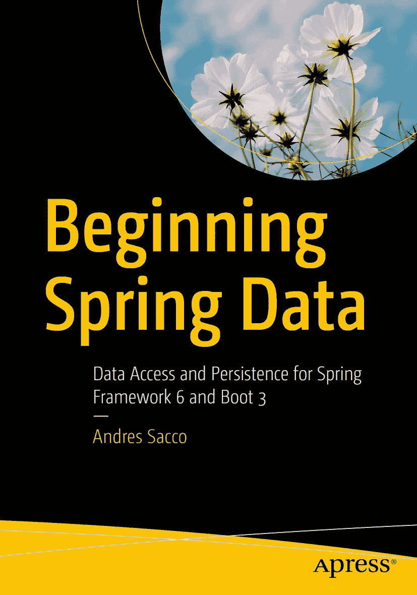

**Spring Data 入门**

**面向 Spring Framework 6 和 Boot 3 的数据访问与持久化**

**安德烈斯·萨科**

***Spring Data 入门：面向 Spring Framework 6 和 Boot 3 的数据访问与持久化***

***与 Boot 3***

安德烈斯·萨科

阿根廷布宜诺斯艾利斯，布宜诺斯艾利斯

ISBN-13（平装）：978-1-4842-8763-7

ISBN-13（电子版）：978-1-4842-8764-4

[`doi.org/10.1007/978-1-4842-8764-4`](https://doi.org/10.1007/978-1-4842-8764-4)

版权所有 © 2023 安德烈斯·萨科

本作品受版权保护。出版商保留所有权利，无论是涉及材料的全部或部分，特别是翻译、重印、重用插图、朗诵、广播、以缩微胶卷或任何其他物理方式复制，以及信息存储与检索的传输、电子改编、计算机软件，或现在已知或以后开发的任何类似或不同方法的权利。

本书中可能出现商标名称、标识和图像。我们并非在每次出现商标名称、标识或图像时都使用商标符号，而是仅以编辑方式使用这些名称、标识和图像，以维护商标所有者的利益，且无意侵犯商标权。

本出版物中对商品名称、商标、服务标志及类似术语的使用，即使未明确标识，也不应被视为对其是否受专有权利保护的看法。

尽管本书中的建议和信息在出版时被认为是真实准确的，但作者、编辑和出版商均不对可能出现的任何错误或遗漏承担法律责任。出版商对本书所含内容不作任何明示或暗示的保证。

Apress Media LLC 董事总经理：Welmoed Spahr
收购编辑：Steve Anglin
开发编辑：Laura Berendson
协调编辑：Jill Balzano
文字编辑：Kim Burton
封面设计：eStudioCalamar
封面图片：Mink Mingle 提供，来自 Unsplash (www.unsplash.com)

本书通过 Apress Media, LLC 在全球图书贸易中发行，地址：1 New York Plaza, New York, NY 10004, U.S.A. 电话：1-800-SPRINGER，传真：(201) 348-4505，电子邮件：orders-ny@springer-sbm.com，或访问 www.springeronline.com。Apress Media, LLC 是一家加利福尼亚有限责任公司，其唯一成员（所有者）是 Springer Science + Business Media Finance Inc (SSBM Finance Inc)。SSBM Finance Inc 是一家**特拉华州**公司。

有关翻译信息，请发送电子邮件至 booktranslations@springernature.com；如需重印、平装版或音频版权，请发送电子邮件至 bookpermissions@springernature.com。

Apress 图书可批量购买用于学术、企业或促销用途。大多数图书也提供电子版和许可证。如需更多信息，请参考我们的印刷版和电子版批量销售网页：http://www.apress.com/bulk-sales。

作者在本书中引用的任何源代码或其他补充材料，读者可在 GitHub (https://github.com/Apress) 上获取。如需更详细信息，请访问 http://www.apress.com/source-code。

印刷于无酸纸上

*献给我的祖父母，他们教会我*

*不断学习新事物的重要性*

*献给我的妻子和孩子，感谢他们在我撰写本书期间给予的支持*

**目录**

关于作者 ������������������������������������������������������������������������������������������������������������� xi
关于技术审校 ��������������������������������������������������������������������������������������������������� xiii
致谢 �������������������������������������������������������������������������������������������������������������������xv
引言 �������������������������������������������������������������������������������������������������������������������xvii
第一部分：引言 ����������������������������������������������������������������������������������������� 1

第 1 章：[应用架构 ������������������������������������������������������������������������� 3](https://doi.org/10.1007/978-1-4842-8764-4_1)

[持久化为何如此重要 �������������������������������������������������������������������������������������������������� 3](https://doi.org/10.1007/978-1-4842-8764-4_1#Sec1)

[持久化发展史 ������������������������������������������������������������������������������������������������������������ 4](https://doi.org/10.1007/978-1-4842-8764-4_1#Sec2)

[JDBC ���������������������������������������������������������������������������������������������������������������������������������������� 5](https://doi.org/10.1007/978-1-4842-8764-4_1#Sec3)

[EJB ���������������������������������������������������������������������������������������������������������������������������������������� 12](https://doi.org/10.1007/978-1-4842-8764-4_1#Sec10)

[JPA ����������������������������������������������������������������������������������������������������������������������������������������� 16](https://doi.org/10.1007/978-1-4842-8764-4_1#Sec12)

[Spring Data ���������������������������������������������������������������������������������������������������������������������������� 19](https://doi.org/10.1007/978-1-4842-8764-4_1#Sec13)

[对象映射 ��������������������������������������������������������������������������������������������������������������������� 20](https://doi.org/10.1007/978-1-4842-8764-4_1#Sec14)

[仓库支持 ��������������������������������������������������������������������������������������������������������������������� 22](https://doi.org/10.1007/978-1-4842-8764-4_1#Sec15)

[架构类型 ��������������������������������������������������������������������������������������������������������������������� 24](https://doi.org/10.1007/978-1-4842-8764-4_1#Sec16)

[分层架构 �������������������������������������������������������������������������������������������������������������������� 24](https://doi.org/10.1007/978-1-4842-8764-4_1#Sec17)

[六边形架构 �������������������������������������������������������������������������������������������������������������� 26](https://doi.org/10.1007/978-1-4842-8764-4_1#Sec20)

[持久化设计模式 ������������������������������������������������������������������������������������������������������� 29](https://doi.org/10.1007/978-1-4842-8764-4_1#Sec24)

[数据访问对象（DAO） ������������������������������������������������������������������������������������������������������ 29](https://doi.org/10.1007/978-1-4842-8764-4_1#Sec25)

[仓库模式 ����������������������������������������������������������������������������������������������������������������� 32](https://doi.org/10.1007/978-1-4842-8764-4_1#Sec26)

[数据传输对象（DTO） ���������������������������������������������������������������������������������������������������� 34](https://doi.org/10.1007/978-1-4842-8764-4_1#Sec27)

[规约模式 ������������������������������������������������������������������������������������������������������������� 35](https://doi.org/10.1007/978-1-4842-8764-4_1#Sec28)

[其他模式 ����������������������������������������������������������������������������������������������������������������������� 36](https://doi.org/10.1007/978-1-4842-8764-4_1#Sec29)

[小结 ������������������������������������������������������������������������������������������������������������������������������������� 36](https://doi.org/10.1007/978-1-4842-8764-4_1#Sec30)

v

目录

第 2 章：[Spring 基础与进阶 �������������������������������������������������������������������� 37](https://doi.org/10.1007/978-1-4842-8764-4_2)

[Spring 基础 ������������������������������������������������������������������������������������������������������������������������������ 37](https://doi.org/10.1007/978-1-4842-8764-4_2#Sec1)

[Spring Boot ��������������������������������������������������������������������������������������������������������������������������������� 39](https://doi.org/10.1007/978-1-4842-8764-4_2#Sec2)

[基础应用搭建 �������������������������������������������������������������������������������������������������������������� 40](https://doi.org/10.1007/978-1-4842-8764-4_2#Sec3)

[使用 Spring Initializr 创建 API ������������������������������������������������������������������������������������ 41](https://doi.org/10.1007/978-1-4842-8764-4_2#Sec4)

[在 IDE 中创建 API ������������������������������������������������������������������������������������������������������ 45](https://doi.org/10.1007/978-1-4842-8764-4_2#Sec5)

[如何运行应用 ��������������������������������������������������������������������������������������������������� 47](https://doi.org/10.1007/978-1-4842-8764-4_2#Sec6)

[最佳实践 ����������������������������������������������������������������������������������������������������������������������������� 57](https://doi.org/10.1007/978-1-4842-8764-4_2#Sec7)

[防止依赖冲突 ��������������������������������������������������������������������������������������������������������� 57](https://doi.org/10.1007/978-1-4842-8764-4_2#Sec8)

[记录端点文档 �������������������������������������������������������������������������������������������������� 59](https://doi.org/10.1007/978-1-4842-8764-4_2#Sec9)

[记录所有细节日志 ����������������������������������������������������������������������������������������������������������� 59](https://doi.org/10.1007/978-1-4842-8764-4_2#Sec10)

[维护和更新依赖 ���������������������������������������������������������������������������������������� 60](https://doi.org/10.1007/978-1-4842-8764-4_2#Sec11)

[小结 ������������������������������������������������������������������������������������������������������������������������������������� 60](https://doi.org/10.1007/978-1-4842-8764-4_2#Sec12)

第 3 章：[Spring Data 与不同类型的持久化 ���������������������������������������������������� 61](https://doi.org/10.1007/978-1-4842-8764-4_3)

[什么是 Spring Data？ ������������������������������������������������������������������������������������������������������������������ 61](https://doi.org/10.1007/978-1-4842-8764-4_3#Sec1)

[Spring Data 如何工作？ ����������������������������������������������������������������������������������������������������� 64](https://doi.org/10.1007/978-1-4842-8764-4_3#Sec2)

[Spring Data 代码示例 ���������������������������������������������������������������������������������������������������� 64](https://doi.org/10.1007/978-1-4842-8764-4_3#Sec3)

[核心概念 ����������������������������������������������������������������������������������������������������������������������� 70](https://doi.org/10.1007/978-1-4842-8764-4_3#Sec4)

[小结 ������������������������������������������������������������������������������������������������������������������������������� 84](https://doi.org/10.1007/978-1-4842-8764-4_3#Sec10)

第二部分：SQL 持久化 �������������������������������������������������������������������������������� 85

第 4 章：[持久化与领域模型 ����������������������������������������������������������������������������� 87](https://doi.org/10.1007/978-1-4842-8764-4_4)

[使用注解进行 JPA 配置 ���������������������������������������������������������������������������������������������������������� 87](https://doi.org/10.1007/978-1-4842-8764-4_4#Sec1)

[实体 ������������������������������������������������������������������������������������������������������������������������������������� 91](https://doi.org/10.1007/978-1-4842-8764-4_4#Sec2)

[关系类型 ������������������������������������������������������������������������������������������������������������������������� 107](https://doi.org/10.1007/978-1-4842-8764-4_4#Sec11)

[继承类型 �������������������������������������������������������������������������������������������������������������� 120](https://doi.org/1007/978-1-4842-8764-4_4#Sec14)

[监听与审计事件 ����������������������������������������������������������������������������������������������������� 132](https://doi.org/10.1007/978-1-4842-8764-4_4#Sec20)

[验证模式 ���������������������������������������������������������������������������������������������������������������� 135](https://doi.org/10.1007/978-1-4842-8764-4_4#Sec21)

[总结 ��������������������������������������������������������������������������������������������������������������������������� 141](https://doi.org/10.1007/978-1-4842-8764-4_4#Sec22)

vi

目录

第 5 章：[事务管理 ������������������������������������������������������������������������������������ 143](https://doi.org/10.1007/978-1-4842-8764-4_5)

[什么是事务？ �������������������������������������������������������������������������������������������������������������� 145](https://doi.org/10.1007/978-1-4842-8764-4_5#Sec1)

[什么是 ACID？ �������������������������������������������������������������������������������������������������������� 146](https://doi.org/10.1007/978-1-4842-8764-4_5#Sec2)

[隔离问题 ��������������������������������������������������������������������������������������������������������������� 147](https://doi.org/10.1007/978-1-4842-8764-4_5#Sec3)

[隔离级别 ���������������������������������������������������������������������������������������������������������������� 150](https://doi.org/10.1007/978-1-4842-8764-4_5#Sec4)

[锁类型 ���������������������������������������������������������������������������������������������������������������� 152](https://doi.org/10.1007/978-1-4842-8764-4_5#Sec5)

[这些概念如何在 Spring Data 中工作？ ������������������������������������������������������������������������� 152](https://doi.org/10.1007/978-1-4842-8764-4_5#Sec6)

[事务属性 �������������������������������������������������������������������������������������������������������� 155](https://doi.org/10.1007/978-1-4842-8764-4_5#Sec7)

[事务模板 ����������������������������������������������������������������������������������������������������������� 158](https://doi.org/10.1007/978-1-4842-8764-4_5#Sec8)

[乐观锁 ��������������������������������������������������������������������������������������������������������������� 159](https://doi.org/10.1007/978-1-4842-8764-4_5#Sec9)

[总结 ������������������������������������������������������������������������������������������������������������������� 162](https://doi.org/10.1007/978-1-4842-8764-4_5#Sec10)

第 6 章：[版本控制或迁移变更 ���������������������������������������������������������������� 163](https://doi.org/10.1007/978-1-4842-8764-4_6)

[数据库中的版本控制 �������������������������������������������������������������������������������������������� 163](https://doi.org/10.1007/978-1-4842-8764-4_6#Sec1)

[实现版本控制的库 ����������������������������������������������������������������������������������� 166](https://doi.org/10.1007/978-1-4842-8764-4_6#Sec2)

[哪个库负责版本控制？ �������������������������������������������������������������������������������� 170](https://doi.org/10.1007/978-1-4842-8764-4_6#Sec5)

[在 Spring Boot 中集成库 ����������������������������������������������������������������������������������� 170](https://doi.org/10.1007/978-1-4842-8764-4_6#Sec6)

[最佳实践 �������������������������������������������������������������������������������������������������������� 178](https://doi.org/10.1007/978-1-4842-8764-4_6#Sec9)

[功能开关 �������������������������������������������������������������������������������������������������������� 179](https://doi.org/10.1007/978-1-4842-8764-4_6#Sec10)

[实现功能开关 ������������������������������������������������������������������������������������������������ 181](https://doi.org/10.1007/978-1-4842-8764-4_6#Sec11)

[最佳实践 �������������������������������������������������������������������������������������������������������� 185](https://doi.org/10.1007/978-1-4842-8764-4_6#Sec14)

[总结 ������������������������������������������������������������������������������������������������������������������� 185](https://doi.org/10.1007/978-1-4842-8764-4_6#Sec15)

第三部分：NoSQL 持久化 ������������������������������������������������������������������������� 187

第 7 章：[Redis：键/值数据库 ����������������������������������������������������������������� 189](https://doi.org/10.1007/978-1-4842-8764-4_7)

[什么是 Redis？ �������������������������������������������������������������������������������������������������������� 189](https://doi.org/10.1007/978-1-4842-8764-4_7#Sec1)

[Spring 数据结构 ������������������������������������������������������������������������������������������������ 193](https://doi.org/10.1007/978-1-4842-8764-4_7#Sec2)

[数据库与连接设置 ������������������������������������������������������������������������������������������� 195](https://doi.org/10.1007/978-1-4842-8764-4_7#Sec3)

[连接主/从节点 ���������������������������������������������������������������������������������������� 200](https://doi.org/10.1007/978-1-4842-8764-4_7#Sec4)

[对象映射与转换 ����������������������������������������������������������������������������������������������� 203](https://doi.org/10.1007/978-1-4842-8764-4_7#Sec5)

vii

目录

[定义自定义仓库 ��������������������������������������������������������������������������������������������������� 206](https://doi.org/10.1007/978-1-4842-8764-4_7#Sec6)

[按示例查询 �������������������������������������������������������������������������������������������������������� 209](https://doi.org/10.1007/978-1-4842-8764-4_7#Sec7)

[总结 ������������������������������������������������������������������������������������������������������������������� 212](https://doi.org/10.1007/978-1-4842-8764-4_7#Sec8)

第 8 章：[MongoDB：文档数据库 ����������������������������������������������������������� 213](https://doi.org/10.1007/978-1-4842-8764-4_8)

[什么是文档存储？ ���������������������������������������������������������������������������������������������� 213](https://doi.org/10.1007/978-1-4842-8764-4_8#Sec1)

[可能的用例 ������������������������������������������������������������������������������������������������ 214](https://doi.org/10.1007/978-1-4842-8764-4_8#Sec2)

[实现方式 ������������������������������������������������������������������������������������������������ 215](https://doi.org/10.1007/978-1-4842-8764-4_8#Sec3)

[什么是 MongoDB？ ������������������������������������������������������������������������������������������������ 216](https://doi.org/10.1007/978-1-4842-8764-4_8#Sec4)

[Spring Data Mongo 简介 ������������������������������������������������������������������������������� 219](https://doi.org/10.1007/978-1-4842-8764-4_8#Sec5)

[数据库与连接设置 �������������������������������������������������������������������������������������� 219](https://doi.org/10.1007/978-1-4842-8764-4_8#Sec6)

[使用仓库进行访问 ���������������������������������������������������������������������������������������� 224](https://doi.org/10.1007/978-1-4842-8764-4_8#Sec8)

[定义查询 ������������������������������������������������������������������������������������������������������������������ 226](https://doi.org/10.1007/978-1-4842-8764-4_8#Sec10)

[使用 MongoTemplate 与自定义仓库 ������������������������������������������������������������������������������� 227](https://doi.org/10.1007/978-1-4842-8764-4_8#Sec13)

[总结 ����������������������������������������������������������������������������������������������������������������������������������� 230](https://doi.org/10.1007/978-1-4842-8764-4_8#Sec14)

第 9 章：[Neo4j：图数据库 ���������������������������������������������������������������������������������������� 231](https://doi.org/10.1007/978-1-4842-8764-4_9)

[什么是图数据库？ ������������������������������������������������������������������������������������������������������� 231](https://doi.org/10.1007/978-1-4842-8764-4_9#Sec1)

[可能的使用场景 ������������������������������������������������������������������������������������������������������������ 232](https://doi.org/10.1007/978-1-4842-8764-4_9#Sec2)

[实现 ���������������������������������������������������������������������������������������������������������������������������������� 233](https://doi.org/10.1007/978-1-4842-8764-4_9#Sec3)

[什么是 Neo4j？ �������������������������������������������������������������������������������������������������������������������������� 234](https://doi.org/10.1007/978-1-4842-8764-4_9#Sec4)

[Spring Data Neo4j 简介 ������������������������������������������������������������������������������������������������� 236](https://doi.org/10.1007/978-1-4842-8764-4_9#Sec5)

[数据库与连接设置 ������������������������������������������������������������������������������������������������������ 236](https://doi.org/10.1007/978-1-4842-8764-4_9#Sec6)

[使用仓库进行访问 ������������������������������������������������������������������������������������������������������������������ 241](https://doi.org/10.1007/978-1-4842-8764-4_9#Sec8)

[总结 ����������������������������������������������������������������������������������������������������������������������������������� 247](https://doi.org/10.1007/978-1-4842-8764-4_9#Sec12)

[第 10 章：Cassandra：宽列数据库 ���������������������������������������������������������������������������������� 249](https://doi.org/10.1007/978-1-4842-8764-4_10)

[什么是 Cassandra？ ������������������������������������������������������������������������������������������������������������������ 249](https://doi.org/10.1007/978-1-4842-8764-4_10#Sec1)

[结构 ���������������������������������������������������������������������������������������������������������������������������������������������� 252](https://doi.org/10.1007/978-1-4842-8764-4_10#Sec2)

[配置 ��������������������������������������������������������������������������������������������������������������������������������������������� 253](https://doi.org/10.1007/978-1-4842-8764-4_10#Sec3)

[数据库与连接设置 ������������������������������������������������������������������������������������������������������ 253](https://doi.org/10.1007/978-1-4842-8764-4_10#Sec4)

viii

目录

[定义自定义仓库 ������������������������������������������������������������������������������������������������������������� 260](https://doi.org/10.1007/978-1-4842-8764-4_10#Sec5)

[定义 TTL ���������������������������������������������������������������������������������������������������������������������� 263](https://doi.org/10.1007/978-1-4842-8764-4_10#Sec6)

[总结 ����������������������������������������������������������������������������������������������������������������������������������� 264](https://doi.org/10.1007/978-1-4842-8764-4_10#Sec7)

第四部分：高级测试与最佳实践 ��������������������������������������������� 265

[第 11 章：响应式访问 �������������������������������������������������������������������������������� 267](https://doi.org/10.1007/978-1-4842-8764-4_11)

[什么是响应式访问？ ��������������������������������������������������������������������������������������������������������� 268](https://doi.org/10.1007/978-1-4842-8764-4_11#Sec1)

[将查询修改为响应式 ������������������������������������������������������������������������������������������������������������� 269](https://doi.org/10.1007/978-1-4842-8764-4_11#Sec2)

[非关系型数据库 ������������������������������������������������������������������������������������������������������������������� 270](https://doi.org/10.1007/978-1-4842-8764-4_11#Sec3)

[关系型数据库 ��������������������������������������������������������������������������������������������������������������������������� 272](https://doi.org/10.1007/978-1-4842-8764-4_11#Sec4)

[注意事项 �������������������������������������������������������������������������������������������������������������������������� 275](https://doi.org/10.1007/978-1-4842-8764-4_11#Sec5)

[总结 ����������������������������������������������������������������������������������������������������������������������������������� 275](https://doi.org/10.1007/978-1-4842-8764-4_11#Sec6)

[第 12 章：单元测试与集成测试 ������������������������������������������������������������������������������ 277](https://doi.org/10.1007/978-1-4842-8764-4_12)

[使用 Mock 进行单元测试 ������������������������������������������������������������������������������������������������������������ 278](https://doi.org/10.1007/978-1-4842-8764-4_12#Sec1)

[使用数据库进行集成测试 ���������������������������������������������������������������������������������������������������������� 281](https://doi.org/10.1007/978-1-4842-8764-4_12#Sec2)

[Testcontainers ��������������������������������������������������������������������������������������������������������������������� 281](https://doi.org/10.1007/978-1-4842-8764-4_12#Sec3)

[Testcontainers 与嵌入式数据库对比 ���������������������������������������������������������������������������������������������� 283](https://doi.org/10.1007/978-1-4842-8764-4_12#Sec4)

[使用 Testcontainers ����������������������������������������������������������������������������������������������������������� 284](https://doi.org/10.1007/978-1-4842-8764-4_12#Sec5)

[多个集成测试 �������������������������������������������������������������������������������������������������������������������� 293](https://doi.org/10.1007/978-1-4842-8764-4_12#Sec6)

[初始化策略 ������������������������������������������������������������������������������������������������������������������������ 294](https://doi.org/10.1007/978-1-4842-8764-4_12#Sec7)

[潜在问题 ������������������������������������������������������������������������������������������������������������������������������ 295](https://doi.org/10.1007/978-1-4842-8764-4_12#Sec8)

[总结 ����������������������������������������������������������������������������������������������������������������������������������� 298](https://doi.org/10.1007/978-1-4842-8764-4_12#Sec9)

[第 13 章：检测性能问题 ������������������������������������������������������������������������������������������ 299](https://doi.org/10.1007/978-1-4842-8764-4_13)

[低性能问题 ��������������������������������������������������������������������������������������������������������������������� 300](https://doi.org/10.1007/978-1-4842-8764-4_13#Sec1)

[检测问题 ����������������������������������������������������������������������������������������������������������������������������������� 301](https://doi.org/10.1007/978-1-4842-8764-4_13#Sec2)

[分析查询性能 ������������������������������������������������������������������������������������������������������������� 301](https://doi.org/10.1007/978-1-4842-8764-4_13#Sec3)

[分析查询复杂度 ���������������������������������������������������������������������������������������������������������������� 305](https://doi.org/10.1007/978-1-4842-8764-4_13#Sec4)

[检查端点的性能 ������������������������������������������������������������������������������������������ 310](https://doi.org/10.1007/978-1-4842-8764-4_13#Sec5)

[总结 ����������������������������������������������������������������������������������������������������������������������������������� 323](https://doi.org/10.1007/978-1-4842-8764-4_13#Sec6)

ix

目录

[第 14 章：最佳实践 ����������������������������������������������������������������������������������� 325](https://doi.org/10.1007/978-1-4842-8764-4_14)

[压缩信息 ���������������������������������������������������������������������������������������������������������� 325](https://doi.org/10.1007/978-1-4842-8764-4_14#Sec1)

[减少传输的信息 �������������������������������������������������������������������������������������������� 332](https://doi.org/10.1007/978-1-4842-8764-4_14#Sec2)

[在自定义查询中使用 Optional ��������������������������������������������������������������������������������������������� 332](https://doi.org/10.1007/978-1-4842-8764-4_14#Sec3)

[在关系中使用 Lazy 加载 ������������������������������������������������������������������������������������������������������ 332](https://doi.org/10.1007/978-1-4842-8764-4_14#Sec4)

[持久化多个元素 ��������������������������������������������������������������������������������������������������� 333](https://doi.org/10.1007/978-1-4842-8764-4_14#Sec5)

[使用主/从或副本 ������������������������������������������������������������������������������������������������ 333](https://doi.org/10.1007/978-1-4842-8764-4_14#Sec6)

[使用缓存减少访问 ������������������������������������������������������������������������������������������������� 334](https://doi.org/10.1007/978-1-4842-8764-4_14#Sec7)

[总结 ����������������������������������������������������������������������������������������������������������������������������������� 340](https://doi.org/10.1007/978-1-4842-8764-4_14#Sec8)

附录 A：设置环境工具 ��������������������������������������������������������������������������� 341

附录 B：推荐与替代工具 ����������������������������������������������������������������������� 349

附录 C：打开项目 ��������������������������������������������������������������������������������������������� 363

附录 D：安装和配置关系型数据库 �������������������������������������������������������������������� 367

附录 E：安装和配置非关系型数据库 ���������������������������������������������������������������������� 383

附录 F：延伸阅读 �������������������������������������������������������������������������������� 407

索引 ��������������������������������������������������������������������������������������������������������������������� 411

x

**关于作者**

**安德烈斯·萨科**自 2007 年起成为一名专业开发人员，曾使用多种语言工作，包括 Java、Scala、PHP、Node.js 和 Kotlin。他的背景主要集中在 Java 及其相关库或框架上，例如 Spring、JSF、iBATIS、Hibernate 和 Spring Data。他专注于研究新技术，以提升所开发应用程序的性能、稳定性和质量。

2017 年，他开始寻找优化应用程序间数据传输的新方法，以降低基础设施成本。他提出了适用于微服务的改进措施。这些措施实施后，成本降低了 55%。其中一些措施与数据库的不当使用直接相关。

xi

**关于技术审校**

**曼努埃尔·乔丹·埃莱拉**是一位自学成才的开发者和研究员，他乐于学习新技术用于自己的实验，并创造新的集成方案。曼努埃尔曾荣获 2013 年 Springy 奖社区冠军和 Spring 冠军。在有限的空闲时间里，他阅读《圣经》并用吉他作曲。

曼努埃尔以 dr_pompeii 的网名闻名。他曾担任多本书籍的技术审校，包括《Pro Spring MVC with WebFlux》。

（Apress，2020 年）《精通 Spring Boot 2》（Apress，2019 年）《快速掌握 Java》

《持久化与微服务》（Apress，2019 年）《Java 语言特性》

（Apress，2018 年）《Spring Boot 2 实战》（Apress，2018 年）以及《Java API、扩展与库》（Apress，2018 年）。

您可以通过他的博客[www.manueljordanelera.blogspot.com](http://www.manueljordanelera.blogspot.com)阅读他关于 Spring 技术的详细教程，并与他取得联系。您也可以在 Twitter 上关注 Manuel，账号为@dr_pompeii。

xiii

**致谢**

我要感谢我的家人和朋友在本书写作过程中给予的鼓励与支持。

*   我的妻子 Gisela，在我长时间伏案写作时始终耐心陪伴。
*   我的小女儿 Francesca，在我撰写每一章时帮我放松心情。
*   我的宝宝 Allegra，作为家庭新成员，她是我写作本书的灵感来源。
*   我的朋友 German Canale 和 Julian Delley，他们一直鼓励我写书，并在自我怀疑时给予支持。
*   特别感谢 Manuel Jordan 指导我提升本书质量。

我衷心感谢 Apress 团队在本书出版过程中提供的支持。感谢 Mark Powers 给予的出色协助。最后，感谢 Steve Anglin 建议并给予我撰写一本关于 Spring Data 书籍的机会。

xv

**引言**

过去，开发者使用 JDBC 等传统方法将信息保存到关系型数据库中。在系统规模较小或维护复杂度不高时，这种方法尚能奏效。随后，Ibatis 和 Hibernate 等新技术逐渐兴起，降低了查询的复杂性，简化了对不同关系型数据库的访问，使开发者能够专注于创建出色的应用程序，而无需花费大量时间研究如何连接数据库或减少连接数。

不久之后，许多非关系型数据库出现，解决了某些问题，但其他问题依然存在。作为开发者，仍然需要使用数据库客户端，并应对各种性能问题和/或不良实践。

Spring¹被证明是解决多种问题的方案，无论是依赖注入，还是如何在某个方法/类被调用前后进行拦截。框架的开发者创建出能够降低使用多种数据库（关系型与非关系型）复杂性的工具，这并不令人意外。Spring Data 解决了大部分此类问题，提升了开发者的工作效率和创建新应用的能力。

本书将介绍创建可访问多种数据库的应用的基础知识，并演示如何在不同数据库中实现功能。此外，您还将学习有助于减少应用中低效问题的最佳实践。

**为何撰写本书**

那么，为什么要写一本关于 Spring Data 以及如何在多种数据库中持久化信息的书呢？大多数开发者会使用不同的数据库来持久化不同类型的信息；例如，有些人使用 Redis（一种可能的缓存机制）或 MongoDB（用于保存未来结构可能变化的文档）。我撰写本书的目的是阐释 Spring Data 的强大功能及其最佳实践。

¹ [`spring.io/`](https://spring.io/)

xvii

引言

以下是与数据库使用相关的一些常见问题。

*   如何优化查询或数据库中的操作数量？
*   如何创建单元测试来验证查询或变更是否正常工作？
*   如何维护对数据库所有更改的记录？
*   如何评估查询是否存在性能问题？
*   对于正在进行的项目，哪个数据库是最佳选择？

这些只是我在本书中试图解答的部分问题。

**本书读者对象**

本书适合具备 Java 编程背景、希望了解

如何在不同数据库中持久化信息，以及如何创建测试来验证应用程序是否按预期运行。

**注意** 本书不打算深入解释与查询创建相关的*所有*概念。

你无需具备使用 Spring 或 Spring Data 的先前经验，因为我会向你展示如何从零开始创建一个包含不同层次的项目，每一层都有其特定用途。

xviii

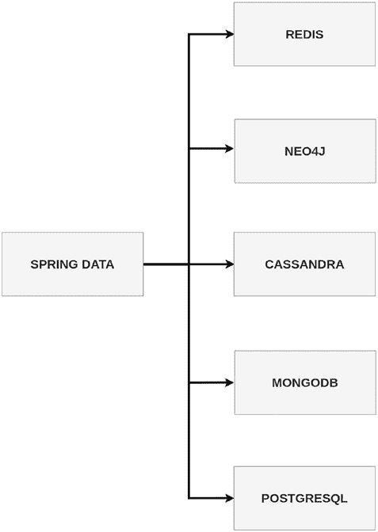

引言

**先决条件**

你的机器上应安装 Java JDK 17 或更高版本、Maven 3.8.1 或更高版本，以及你熟悉的 IDE。IDE 选项包括 Eclipse、IntelliJ IDEA、Visual Studio Code 等，但还有许多其他选择。重要的是你用得顺手。

2 [`jdk.java.net/`](http://jdk.java.net/)
3 [`maven.apache.org/`](https://maven.apache.org/)
4 [`www.eclipse.org/downloads/`](https://www.eclipse.org/downloads/)
5 [`www.jetbrains.com/es-es/idea/`](https://www.jetbrains.com/es-es/idea/)
6 [`code.visualstudio.com/`](https://code.visualstudio.com/)

xix

引言

需要特别注意的是，本书大部分章节需要不同类型的数据库，例如 Postgres、MongoDB、Redis、Neo4j 和 Cassandra。为了减少在机器上安装这些数据库的麻烦，我建议你安装 Docker 并用它来运行所有数据库。

Docker 的使用和安装不在本书的讨论范围内，但网上有大量教程和速查表展示了最常用的命令。

**如何检查我是否具备正确的先决条件？**

在安装完上一节提到的所有工具后，你需要确保在开始阅读本书之前，它们都已正确安装。

在 Java 中，你需要运行以下命令。

% java -version
openjdk 17.0.4 2022-07-19 LTS
OpenJDK Runtime Environment Microsoft-38107 (build 17.0.4+8-LTS)
OpenJDK 64-Bit Server VM Microsoft-38107 (build 17.0.4+8-LTS, mixed mode, sharing)

之后，你需要通过以下命令检查已安装的 Maven 版本是否正确。

% mvn --version
Apache Maven 3.8.1
Maven home: /usr/share/maven

7 [`www.postgresql.org/`](https://www.postgresql.org/)
8 [`www.mongodb.com/es`](https://www.mongodb.com/es)
9 [`redis.io/`](https://redis.io/)
10 [`neo4j.com/`](https://neo4j.com/)
11 [`cassandra.apache.org/_/index.html`](https://cassandra.apache.org/_/index.html)
12 [`www.docker.com/`](https://www.docker.com/)
13 [`docker-curriculum.com/`](https://docker-curriculum.com/)
14 [`michaelhaar.dev/my-docker-compose-cheatsheet`](https://michaelhaar.dev/my-docker-compose-cheatsheet)

xx

引言

最后，检查 Docker 在你的机器上是否正常运行。你可以通过运行以下命令来验证。

% docker --version
Docker version 20.10.12, build 20.10.12-0ubuntu2~20.04.1

再次强调，我认为 Docker 是本书的最佳选择，但这仅仅是因为它减少了在机器上安装不同类型数据库的必要性。

**为什么选择这些先决条件？**

为一本书选择特定的先决条件有几个原因。其中一些与读者感到顺手或可能拥有大量使用经验的特定工具或 Java 版本有关。在本书中，这些先决条件与 Synk.io 进行的一项年度调查相关。

该调查表明，大多数开发者在生产环境中仅使用 Java 的 LTS 版本（即 Java 8/11/17）。此外，同一项调查提到，76% 的

开发者们使用 Maven 来管理其至少部分应用程序的依赖关系。

话虽如此，请注意本书中的所有示例只需极少的改动即可转换为 Gradle。

**源代码**

本书的源代码可在 github.com/apress/beginning-spring-data 下载。

**本书结构**

本书分为四个部分。

• 第一部分（第 [1](https://doi.org/10.1007/978-1-4842-8764-4_1) 章至第 [3](https://doi.org/10.1007/978-1-4842-8764-4_3) 章）概述了 Java 持久化的历史及其相关模式，解释了如何在 Spring 中创建项目，并简要说明了 Spring Data 中可用的不同类型的持久化方式。

15 [`snyk.io/jvm-ecosystem-report-2021/`](https://snyk.io/jvm-ecosystem-report-2021/)

xxi

引言

• 第二部分（第 [4](https://doi.org/10.1007/978-1-4842-8764-4_4) 章至第 [6](https://doi.org/10.1007/978-1-4842-8764-4_6) 章）简要介绍了 Spring Data 与关系型数据库相关的关键特性，并展示了用于数据库版本变更管理的工具。

• 第三部分（第 [7](https://doi.org/10.1007/978-1-4842-8764-4_7) 章至第 [10](https://doi.org/10.1007/978-1-4842-8764-4_10) 章）简要探讨了 Spring Data 如何与 Cassandra、Redis、MongoDB 和 Neo4j 等非关系型数据库进行交互。

• 第四部分（第 [11](https://doi.org/10.1007/978-1-4842-8764-4_11) 章至第 [14](https://doi.org/10.1007/978-1-4842-8764-4_14) 章）涵盖了高级主题，例如使用不同库执行单元测试和性能测试。最后一章描述了使用 Spring Data 的一些最佳实践。

xxii

**第 1 章**

**应用程序架构**

持久化通常是任何语言中最重要的主题之一，因为它为消费或产生信息的应用程序提供了一种长期保存信息的方式。过去，当开发者创建单个大型应用程序时，问题往往集中出现在一个地方。也许大部分逻辑都存在于存储过程中，但随着微服务的出现并成为行业标准，大多数应用都需要保存其信息。因此，与单体应用相比，该主题的重要性比以往任何时候都更加突出。

此外，在从单体架构向微服务架构过渡期间，许多非关系型数据库成为解决特定问题的替代方案，例如为具有不同结构的已保存信息提供缓存机制。

自 Java 问世以来，出现了多种访问信息的方式以及其他类型的架构。本章概述了访问数据库方式的演变及其优缺点。

同时，您还将学习一些与关系型或非关系型数据库持久化相关的最重要的模式。

**为什么持久化如此重要**

持久化信息是微服务和应用程序最重要的方面之一。如果在部署、重启或系统发生故障时未能保存数据，您将丢失一切。

但还有其他需要考虑的因素，因为它们可能会影响整个平台的性能，增加延迟或错误。以下是一些与数据库不当使用或设计相关的问题。

© Andres Sacco 2023
A. Sacco，《Spring Data 入门》[，https://doi.org/10.1007/978-1-4842-8764-4_1](https://doi.org/10.1007/978-1-4842-8764-4_1#DOI)

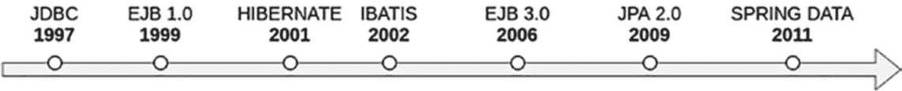

第 1 章 应用程序架构

• 增加执行查询和从数据库获取信息的延迟
• 由于连接方式设计错误，导致访问数据库时 CPU/内存使用率增加
• 针对要持久化的信息类型，选择了旧版本或不正确的数据库类型

存在许多与持久化相关的问题，但本书不要求您了解所有问题。一个错误的决策，或者不理解每种数据库类型的优缺点以及如何访问信息，都可能影响您的整个系统。

**持久化的历史**

自 JDK 1.1 中引入 JDBC 以来，应用程序的持久化技术经历了一次演变，从 JDBC 发展到 ORM，再到如今使用 Spring Data——它提供了一个用于访问不同数据库的标准接口。其中一些是关系型数据库，而另一些则是非关系型数据库。

持久化信息到数据库的方式有很多种。考虑到根据 Snyk 的报告,1，至少有 50% 的开发者使用 Spring Boot，那么其中许多人使用 Spring Data 似乎合乎逻辑。图 1-1 展示了从 Java 持久化技术到 2011 年 Spring Data 出现的历史。

***图 1-1.** 持久化技术历史*

如今，大多数与数据库交互的库仍然具有重要意义。它们都经过了多年的发展。有些库之间会相互影响；例如，在图 1-1 中，企业级 JavaBean（EJB）和 Java 持久化 API（JPA）是两种不同的东西。早期版本的 EJB 包含了所有 JPA 规范，而 JPA 的重要性日益增长。EJB 3.0 版本则表现为两个相互交互的独立部分。

1 [`snyk.io/jvm-ecosystem-report-2021/`](https://snyk.io/jvm-ecosystem-report-2021/)

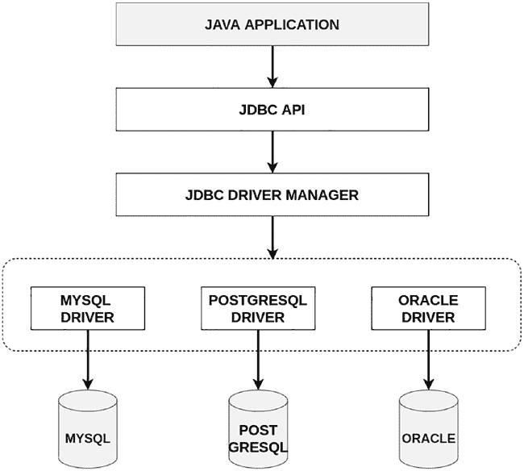

第 1 章 应用程序架构

**JDBC**

JDBC，即 Java 数据库连接（Java Database Connectivity），提供了一个通用接口来与其他数据库进行通信和交互。更具体地说，JDBC 提供了一种连接数据库、创建和执行语句（如创建/删除/清空表）以及执行查询（如 SELECT/INSERT/UPDATE/DELETE）的方法。图 1-2 简要概述了使用 JDBC 与数据库通信时交互的不同组件。

***图 1-2.** JDBC 结构*

与数据库交互涉及一组组件或层次。

• **JDBC API**：此层包含所有驱动程序需要实现的所有接口，以便 Java 开发者使用它们。这一层是最重要的层之一，因为你可以从一个数据库切换到另一个数据库而无需更改太多内容，只需更换另一个数据库的驱动程序，并对列类型进行少量修改。

第 1 章 应用程序架构

• **JDBC 驱动程序管理器**：这组类充当驱动程序和 JDBC API 之间的连接器，负责注册和注销可用的数据库、获取与数据库的连接以及与该连接相关的信息。

• **驱动程序**：为了实现数据库之间的连接，JDBC 将所有与特定数据库交互的逻辑隐藏在一系列驱动程序中，每个驱动程序都包含针对一个数据库的逻辑。通常，开发这些数据库的公司会为大多数语言创建相应的驱动程序。

JDBC 自 1997 年首次发布以来并非一成不变。后续版本尝试增加更多功能或解决与性能相关的问题（见表 1-1）。像 Spring 这样的框架实现了 JDBC 的一个版本，并包含了该框架的一些特性。

***表 1-1.** JDBC 各版本演变*

**年份**

**版本**

**规范**

**JDK 版本**

JDBC 4.3

JSr 221

JDBC 4.2

JSr 221

JDBC 4.1

JSr 221

JDBC 4.0

JSr 2212

JDBC 3.0

JSr 543

1.4

JDBC 2.1

1.2

JDBC 1.2

1.1

此表展示了 JDBC 的演变过程以及详细说明每个版本引入了哪些功能的规范。一些早期版本并没有具体的规范。

2 [`www.jcp.org/en/jsr/detail?id=221`](https://www.jcp.org/en/jsr/detail?id=221)

3 [`www.jcp.org/en/jsr/detail?id=54`](https://www.jcp.org/en/jsr/detail?id=54)

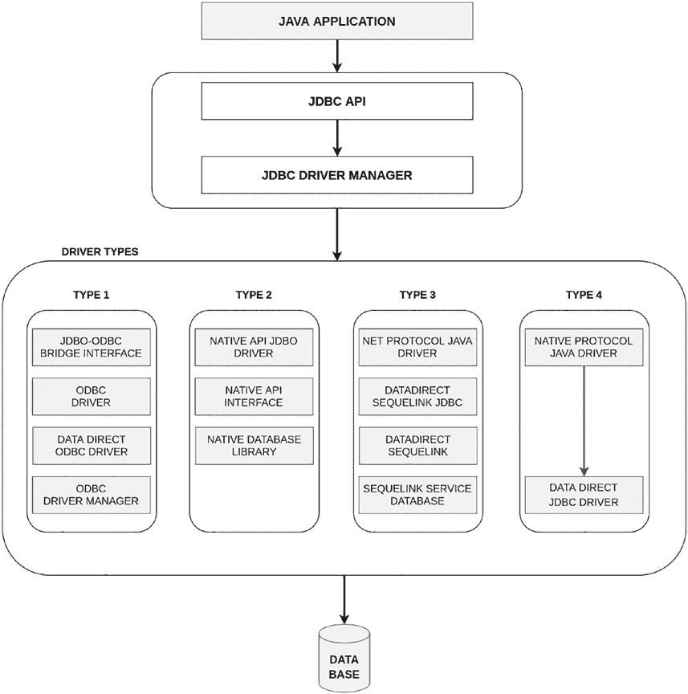

第 1 章 应用程序架构

**JDBC 驱动程序**

JDBC 驱动程序组件实现了 JDBC API 中定义的接口，用于与数据库交互。可以将此组件视为一个客户端适配器，用于将特定数据库的元素或语法转换为 Java 能够理解的标准。

JDBC 提供了四种在不同情况下推荐的驱动程序类型，如图

图 1-3

***图 1-3.** 提供 JDBC 的驱动程序类型*

第 1 章 应用程序架构

**类型 1：JDBC-ODBC 桥接器**

这种类型最初被用于第一批 JDBC 驱动程序，因为当时大多数数据库都支持 ODBC 访问。该驱动程序将 JDBC 转换为 ODBC，反之亦然，充当一个独立于数据库的适配器。你可以将其视为 JDK 的一部分，是一个通用驱动程序，因此项目中无需包含任何依赖项。

这种类型的驱动程序仅用于开发或测试；由于从 JDBC 转换为 ODBC 的性能问题以及安全方面的隐患，它不会在生产环境中使用。

**类型 2：基于客户端**

下一代驱动程序变得更加流行，因为它省去了将 JDBC 转换为 ODBC 的所有步骤，直接使用每个数据库厂商的原生库进行调用，这些库通常复用现有的 C/C++ 代码来创建。

其优势包括性能提升，因为无需在不同格式之间进行转换。但也存在一些缺点；例如，驱动程序必须安装在客户端机器上。

**类型 3：两层架构**

*两层架构*、*网络协议*和*带有中间件的纯 Java 驱动程序*都指向同一个概念。这种类型使用 JDBC，通过套接字与中间件服务器交互，进而与数据库通信。该中间件包含了所有不同数据库的驱动程序，因此无需在每台机器上都安装所有内容。

这种方法的主要问题在于需要一个专用服务器来与数据库交互，这意味着更多的信息传输，并引入了一个故障点。此外，厂商需要将 C/C++ 代码重写为纯 Java。

**类型 4：网络协议驱动程序**

*网络协议*或*原生协议驱动程序*是直接连接数据库最流行的方法之一。在这种类型中，驱动程序完全用 Java 编写，并使用每个厂商定义的协议与数据库通信。

这种类型提供了许多优势，包括与上一种类型相比性能卓越，并且无需在客户端或服务器上安装任何东西。但主要缺点是每个数据库都有一个使用不同协议的驱动程序。

第 1 章 应用程序架构

**如何连接数据库**

根据性能要求，有几种方法，例如使用连接池。连接数据库的基本过程包括以下步骤。

1.  **导入类。** 你必须包含使用 JDBC 和连接数据库所需的所有类。大多数情况下，所有类都位于 `java.sql.*` 包中。

2.  **打开连接。** 使用 `DriverManager.getConnection()` 创建一个连接，该连接代表与数据库的物理连接。

3.  **执行查询。** 创建一个 `Statement` 对象，其中包含要在数据库中执行的查询。

4.  **获取数据。** 在数据库中执行查询后，你需要使用 `ResultSet.getXXX()` 方法来检索每一列的信息。

5.  **关闭连接。** 无论应用程序是否产生异常，你都需要显式关闭与数据库的连接。

让我们来看看所有与访问数据库和获取特定信息相关的概念。其想法是创建一个代表国家/州/城市目录的表结构，你将在关于关系型数据库的章节中使用它。图 1-4 展示了这些表的结构以及它们之间的不同关系。

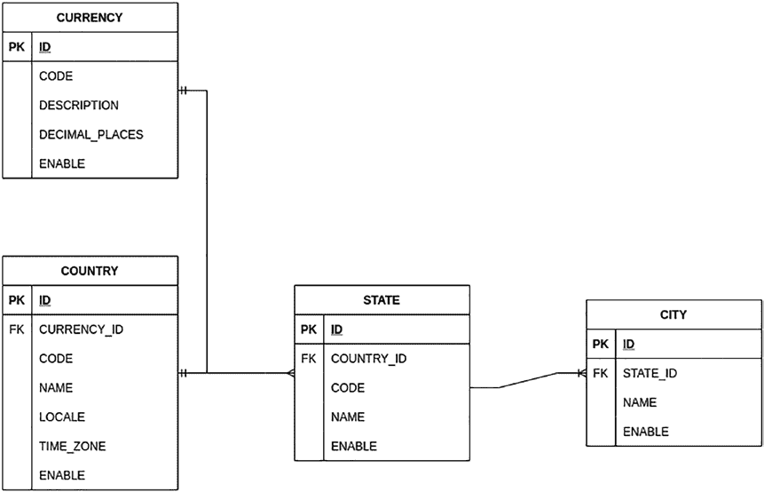

第 1 章 应用程序架构

***图 1-4.** 目录数据库的结构*

**注意** 你可以在 [github.com/apress/beginning-](http://github.com/apress/beginning-spring-data) 找到这些表的结构和用于填充信息的插入语句，以及所有其他源代码。

[spring-data.](http://github.com/apress/beginning-spring-data)

当数据库中的所有内容看起来都相当相似时，如图 1-4 所示，你可以连接到数据库，并使用类似下面的代码块获取现有国家列表。

*package* com.apress.jdbc;

*import* java.sql. *Connection*;

*import* java.sql.DriverManager;

*import* java.sql. *Statement*;

*import* java.sql. *ResultSet*;

*import* java.sql.SQLException;

第 1 章 应用程序架构

*public class* App {

*static final* String *DB_URL* = "jdbc:postgresql://localhost:5432/catalog"; *static final* String *USER* = "postgres";

*static final* String *PASS* = "postgres";

*static final* String *QUERY* = "SELECT id, code, name FROM country"; *public static void* main(String[] args) {

*// 打开连接，并在执行完毕后关闭*

*// 以这种方式使用 try/catch 可以自动关闭资源*

*try*( *Connection* conn = DriverManager. *getConnection*( *DB_URL*, *USER*, *PASS*);

*Statement* stmt = conn.createStatement();

*ResultSet* rs = stmt.executeQuery( *QUERY*);) {

*// 获取一行的信息*

*while* (rs.next()) {

*// 按列检索数据*

*int* id = rs.getInt("id");

String code = rs.getString("code");

String name = rs.getString("name");

System. *out*.println(String. *format*("ID: %s, Code: %s, Name:

%s", id, code, name));

}

} *catch* (SQLException e) {

e.printStackTrace();

}

}

}

***DB_URL*** 具有特定格式，该格式与每种数据库类型相关联。每种 URL 类型都在特定的数据库驱动程序中定义，你需要在运行应用程序之前将其包含在项目中。表 1-2 按数据库列出了常见的 JDBC URL。如果你不想用 Postgres 测试此示例，可以尝试列表中的其他数据库。

第 1 章 应用程序架构

***表 1-2.** 按数据库划分的 JDBC URL*

**数据库**

**JDBC URL**

postgreSQl

jdbc:postgresql://host:port/database?properties

SQl Server

jdbc:sqlserver://[servername[\instancename][:portnumber]][;property=

value[;property=value]]

oracle

jdbc:oracle:thin:[<user>/<password>]@//<host>[:<port>]/<service> MYSQl

jdbc:mysql://host:port/database?properties

**EJB**

企业级 JavaBean（EJB）是一种规范，用于构建可移植、可扩展且可重用的业务应用程序，而无需重新发明处理某些常见事务（如安全性、数据库访问、跨不同应用程序发送消息等）的方法。在 Java 的早期版本中，其中一些特性存在于其他库中，或者 JDK 内部提供了基本版本，因此当 EJB 出现时，它将这些特性统一到了同一个框架中。

与之前使用 JDBC 访问数据库的方法相比，最大的区别之一是你需要一个运行在应用服务器（如 Glassfish4、Wildfly5 和 Jetty6）内部的 EJB 容器。图 1-5 展示了 EJB 提供的一些最相关的特性。

4 [`javaee.github.io/glassfish/`](https://javaee.github.io/glassfish/)

5 [`www.wildfly.org/`](https://www.wildfly.org/)

6 [`www.eclipse.org/jetty/`](https://www.eclipse.org/jetty/)

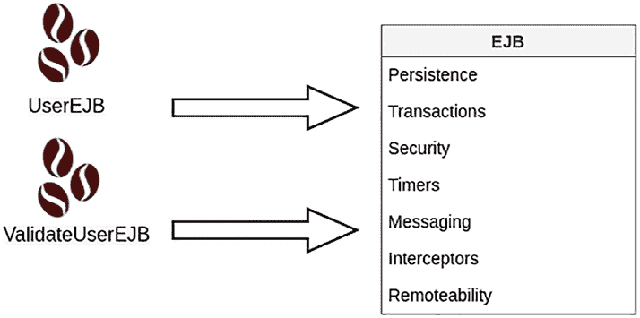

第 1 章 应用程序架构

***图 1-5.** EJB 提供的特性*

自 1999 年以来，EJB 经历了多个版本，引入了许多新特性，提升了性能，并修复了先前版本中的错误。最近，EJB 在 Jakarta EE 的 8 和 9 版本中被采用。表 1-3 描述了每个版本中最相关的内容 7。

7 [`jakarta.ee/about/working-group/`](https://jakarta.ee/about/working-group/)

第 1 章 应用程序架构

***表 1-3.** EJB 版本及其特性列表*

**年份**

**版本**

**特性**

1998/ eJB 1.0

• 引入对使用实体 Bean 处理持久化对象的支持

• 具有用于远程访问的远程接口，因此在某种程度上，EJB 是可移植的

1999 eJB 1.1

• 引入了以 XML 格式编写的部署描述符，用于替代包含所有元数据的类

2001 年 EJB 2.08 • 引入了与 CorBa 及其他 Java API 的兼容性
• 同一 J2EE 容器中的客户端可通过本地接口访问另一个 EJB
• 出现了 JavaBeans 查询语言，使开发者能够执行 SQL 查询

2003 年 EJB 2.19 • 增加了使用 Soap 创建 Web 服务的支持
• 引入了定时器服务的可能性，可通过 cron 定期调用某些服务
• 增加了在 EJB 查询中使用 `ORDER BY`、`AVG`、`MIN`、`MAX`、`SUM` 和 `COUNT` 操作的支持

2006 年 EJB 3.010 • 出现了 POJO（普通 Java 对象）作为 EJB Bean 类的替代方案
• 重写了大部分代码，使用注解替代庞大的配置文件
• 不再需要实现远程和本地接口
• JPA 实体与 EJB 容器解耦，可独立使用

2009 年 EJB 3.111 • EJB Lite 可在同一虚拟机中作为 EJB 客户端运行多个组件
2013 年 EJB 3.212 • 自动关闭接口
• 增加了对生命周期拦截器方法事务性的更多控制

2020 年 EJB 4.013 • 弃用了 ***EJBContext.getEnvironment()*** 方法
• 移除了依赖 ***JAX-RPC*** 的方法
• ***javax.ejb*** 中的大部分包已迁移至 ***jakarta.ejb***

8 [`www.jcp.org/en/jsr/detail?id=19`](https://www.jcp.org/en/jsr/detail?id=19)
9 [`www.jcp.org/en/jsr/detail?id=153`](https://www.jcp.org/en/jsr/detail?id=153)
10 [`www.jcp.org/en/jsr/detail?id=220`](https://www.jcp.org/en/jsr/detail?id=220)
11 [`www.jcp.org/en/jsr/detail?id=318`](https://www.jcp.org/en/jsr/detail?id=318)
12 [`www.jcp.org/en/jsr/detail?id=345`](https://www.jcp.org/en/jsr/detail?id=345)
13 [`jakarta.ee/specifications/enterprise-beans/4.0/`](https://jakarta.ee/specifications/enterprise-beans/4.0/)

第 1 章 应用程序架构

**EJB 类型**

EJB 架构包含三个主要组件：EJB 容器、应用服务器和企业级 JavaBeans（EJB），后者又分为多种类型。

• **会话 Bean**：这些组件包含与用户任务或用例相关的所有逻辑。会话 Bean 在该任务或用例（如同一次对话）执行期间可用。但是，如果服务器崩溃或重启，会话 Bean 中保存的所有信息都将丢失。

会话 Bean 分为两种类型：有状态和无状态。主要区别在于，前者在调用后会保存状态，而后者（无状态）在调用后不保存任何信息。

• **消息驱动 Bean**：当需要应用程序之间的同步通信时，前面的 Bean 工作良好；但如果需要异步通信，消息驱动 Bean 则是正确的选择。最常见的实现使用 JMS（Java 消息服务）14。这种类型的 EJB 充当队列主题中的监听器，等待消息并在消息到达时执行相应操作。这种通信方式在微服务出现后变得流行。

• **实体**：此组件包含代表数据库表的类，并为数据库中的 CRUD（创建、检索/读取、更新、删除）操作提供接口。EJB 3.0 引入了对此类组件的更改，使用 JPA 替代了之前作为 EJB 规范一部分的实体 Bean。

图 1-6 展示了构成 EJB 的各组件之间的交互。

14 [`docs.oracle.com/cd/B19306_01/server.102/b14257/jm_create.htm`](https://docs.oracle.com/cd/B19306_01/server.102/b14257/jm_create.htm)

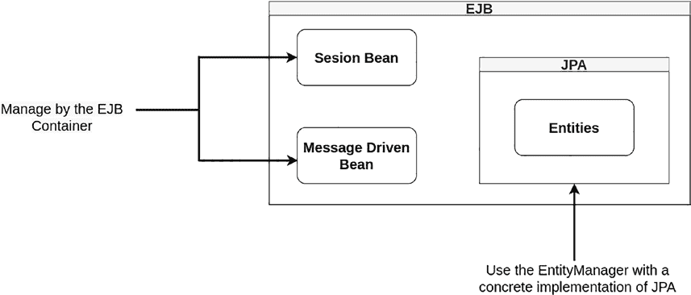

第 1 章 应用程序架构

***图 1-6.** EJB 组件及其与 JPA 的交互方式*

**JPA**

Java 持久化 API（JPA）是一种直接与数据库持久化相关的规范 15。更具体地说，JPA 提供了一组所有提供商都必须遵循的接口，以确保它们遵循标准，这样你就可以在不费太多力气的情况下更换提供商。

使用 JPA，开发者可以通过一个代表表结构的 Java 类来访问数据库中的信息，并执行某些操作，如插入、更新、删除和检索。要执行这些操作，你需要使用代表表中常见内容的注解来标注类，例如表名、列大小以及表之间的关系。

JPA 提供了多种执行查询以检索信息的方式。一种是像 JDBC 那样直接使用 SQL 语句，并借助类来帮助构建语句；另一种则引入了一种抽象，这样你无需编写完整的语句，因为 JPA 的提供商会动态生成该语句。图 1-7 展示了 JPA 与应用程序的不同层级或结构。

15 [`www.jcp.org/en/jsr/detail?id=338`](https://www.jcp.org/en/jsr/detail?id=338)

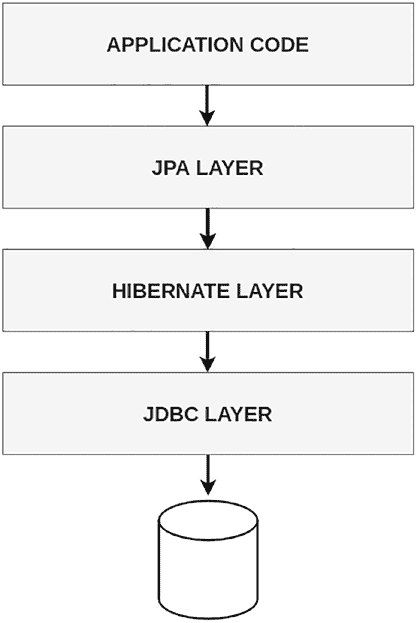

第 1 章 应用程序架构

***图 1-7.** 使用 JPA 的层级结构示例*

该规范有许多实现，但最相关的是 Hibernate16、EclipseLink17、Apache OpenJPA18 和 Spring Data JPA19。它们各自都以不同的方式实现了 JPA 规范，优先考虑性能或开发者体验等方面。

让我们看一个示例，其中你可以声明一个代表数据库中某个表的类。

16 [`hibernate.org/`](https://hibernate.org/)

17 [`www.eclipse.org/eclipselink/`](https://www.eclipse.org/eclipselink/)

18 [`openjpa.apache.org/`](https://openjpa.apache.org/)

19 [`spring.io/projects/spring-data`](https://spring.io/projects/spring-data)

第 1 章 应用程序架构

*package com.apress.jpa.model;*

*import javax.persistence.Column;*

*import javax.persistence.Entity;*

*import javax.persistence.GeneratedValue;*

*import javax.persistence.GenerationType;*

*import javax.persistence.Id;*

*import javax.persistence.Table;*

*import java.io.Serializable;*

***@Entity // 必需***

***@Table(name = "currency") //可选，仅当需要指定表名时使用***

*public class Currency {*

***@Id //必需 - 标识哪个是主键***

***@GeneratedValue(strategy = GenerationType.SEQUENCE) //指示生成 ID 的方式***

*private Long id;*

*private String code;*

*private String description;*

*private Boolean enable;*

***@Column(name = "decimal_places", length = 5) //可选：指定列名和长度***

*private String decimalPlaces;*

*public Currency(Long id, String code, String description, Boolean*

*enable, String decimalPlaces) {*

*this.id = id;*

*this.code = code;*

*this.description = description;*

*this.enable = enable;*

*this.decimalPlaces = decimalPlaces;*

*}*

*// 所有属性的设置器和获取器*

*// 重写 hashCode 和 equals 方法*

*}*

第 1 章 应用程序架构

指定列名和长度的方法并不复杂。如果你不指定名称和默认大小，JPA 的实现会定义这些值，对于字符串类型，默认值为 255。

**注意** 你将在本书的第二部分了解更多关于 JPA 的内容。

**Spring Data**

之前所有持久化机制的主要问题在于，你无法同时访问关系型和非关系型这两种类型的数据库。但 Spring Data 解决了这个问题，它允许你通过使用接口的仓库来访问数据库，以执行 CRUD 操作。此外，你还可以创建实现该接口的具体类。

仓库接口体现了执行 Spring Data 框架未涵盖的特定操作的理念。这些仓库几乎在所有实现中都可用，用于访问数据库，以降低在同一应用程序中使用多个数据库的复杂性。

有一些基础仓库可用于扩展你的仓库功能。

其中，有两个最为相关。`CrudRepository` 包含了所有实体的基本操作。`PagingAndSortingRepository` 包含了使用分页和排序标准从数据库中获取某个结构信息的所有逻辑。

图 1-8 说明了 Spring Data 支持 MongoDB、Redis、Neo4j、Cassandra 以及所有关系型数据库。其他数据库，如 ElasticSearch20 和 Couchbase21，本书未作介绍，因为它们具有类似的信息存储结构。

20 [`www.elastic.co/`](https://www.elastic.co/)
21 [`www.couchbase.com/`](https://www.couchbase.com/)

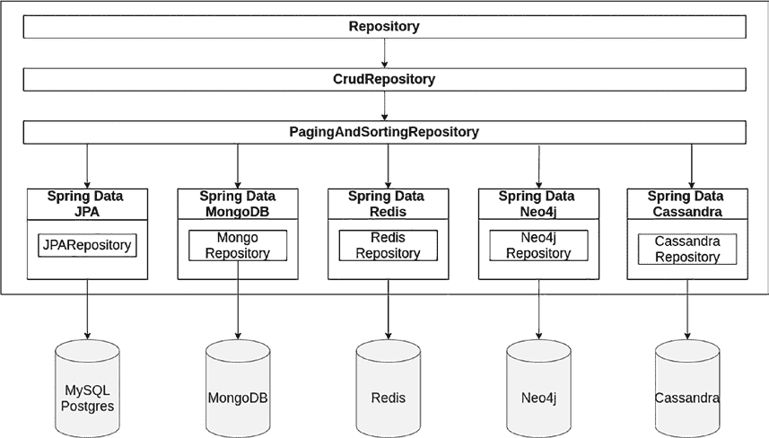

第 1 章 应用程序架构

***图 1-8.** 仓库的结构取决于数据库*

**注意** 在某些数据库中，Spring Data 提供了一种方法，可以使用在仓库或 DAO 后台使用的模板来分配和转换数据库中的异常，以执行诸如插入或检索信息之类的操作。Spring Data JPA 不使用模板，因为它是一个用于访问所有 RDBMS 数据库的抽象层。

你可以考虑使用这些模板在 Spring Data 提供的基础功能之外创建自定义仓库。例如，你可以在 Redis 中插入或检索信息之前引入安全机制或压缩机制。

**对象映射**

JPA 为开发者提供的最显著优势之一是能够将表与特定类进行映射，同时考虑所有可能的列类型以及表之间的关系。Spring Data 将这种方法扩展到了所有 NoSQL 数据库。每种类型的数据库都提供了自己的注解来表示信息，以便将数据库与 Java 类进行映射。表 1-4 展示了每个对象如何在其他数据库中表示，而字段名称和类型无需重大更改。你只需要更改与每个数据库相关的注解即可。

***表 1-4.** 在各种数据库中声明实体*

| **JPA** | **MongoDB** | **Neo4j** |
| :--- | :--- | :--- |
| `@Entity` `@Table(name = "currency")` public class Currency {   `@Id`   `@GeneratedValue(strategy = GenerationType.SEQUENCE)`   private Long id;   `@Column(name = "decimal_places", length = 5)`   private String decimalPlaces;   // 其他属性和 getter/setter } | `@Document(collection="currency")` public class Currency {   `@Id`   private String id;   `@Field("decimal_places")`   private String decimalPlaces;   // 其他属性和 getter/setter } | `@NodeEntity` public class Currency {   `@GraphId`   private Long id;   private String decimalPlaces;   // 其他属性和 getter/setter } |

JPA 和 Spring Data 支持映射对象之间的关系，这些对象可以存储在另一个对象（表、文档、节点）中。表 1-5 中的注解告诉 Spring Data 这些对象之间的关系以及如何检索信息。

第 1 章 应用程序架构

***表 1-5.** 在数据库中声明对象之间的关系*

| **JPA** | **MongoDB** | **Neo4j** |
| :--- | :--- | :--- |
| `@Entity` `@Table(name = "country")` public class Country {   `@Id`   `@GeneratedValue(strategy = GenerationType.SEQUENCE)`   private Long id;   `@OneToMany`   private List<Currency> currencies;   // 其他属性和 getter/setter } | `@Document(collection="country")` public class Country {   `@Id`   private String id;   private List<Currency> currencies;   // 其他属性和 getter/setter } | `@NodeEntity` public class Country {   `@GraphId`   private Long id;   `@RelatedTo(type = "has", direction = Direction.OUTGOING)`   private List<Currency> currencies;   // 其他属性和 getter/setter } |

货币；

//其他属性

以及设置/获取

}

有些数据库没有关系，例如早期版本的 Mongo，但从第 3 版开始，你可以关联不同的实体。这类数据库背后的理念是减少实体中的重复信息。

**仓库支持**

当你编写一个需要从数据库持久化/检索信息的应用程序时，大多数情况下你会创建一个包含所有这些操作的类或层。

有多种方式对这些操作进行分组：全部放在同一个类中，每个表一个类，但最常见的方式是创建一个代表 DAO 模式的类（下一节将详细讨论），其中包含一个表的所有操作。这意味着你可以有多个类来访问数据库，其主要区别在于所访问的表。为了降低拥有多个包含相同代码的类的复杂性，Spring Data 提供了使用一个包含所有这些操作的抽象层的可能性，你只需指明所访问的实体/表的名称。

Spring Data 提供了提供通用数据库操作的接口。你需要创建一个继承自这些通用接口之一的接口，并指明要访问的表或结构。在后台，Spring Data 会根据数据库类型将此接口转换为一个查询来保存/检索信息。图 1-9 展示了组合接口以拥有更多可用操作，本书第二部分将对此进行更详细的介绍。

***图 1-9.** 扩展默认 Spring Data 方法的仓库示例*

第 1 章 应用程序架构

**架构类型**

应用程序通常具有一种结构，有助于你理解在哪里可以找到逻辑，例如验证、业务逻辑、实体以及访问数据库的接口/类。所有这些对于理解层的层次结构以及创建新功能或应用程序时需要遵循的规则都很重要。

在 Java 中，像 Archunit22 这样的工具允许你定义并检查项目中的一切是否遵循你定义的结构。

**分层架构**

这种架构类型是最简单的，因为它将应用程序像蛋糕一样拆分成不同的层，每一层只能访问同一层或更低层的元素。这类架构从具有四层（如视图/表示层、业务逻辑层、持久化层和数据库层）的架构演变为三层或五层的架构。

对于正确的层数没有统一的标准。但是，如果你认为三层是较少的层数，那么 Spring Boot 由控制器、服务、仓库和数据库表示，而数据库在 Spring 中并不直接作为层出现。

图 1-10 展示了这类架构的表示以及不同层之间如何交互。

22 [`www.archunit.org/`](https://www.archunit.org/)

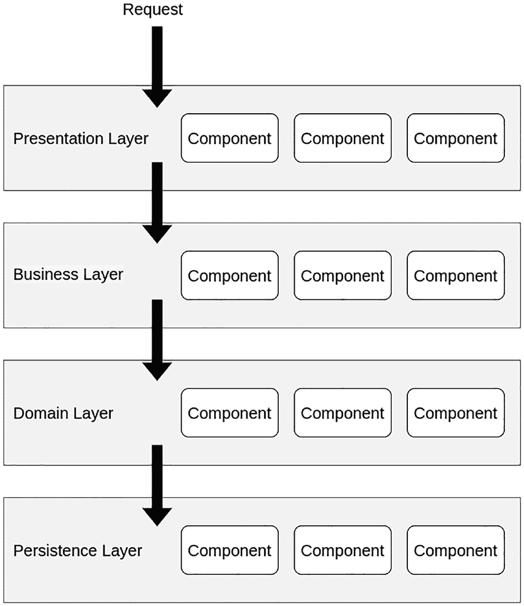

第 1 章 应用程序架构

***图 1-10.** 分层的基本结构*

第 1 章 应用程序架构

**优点**

这种结构具有以下优点。

•   实现和维护简单，因为你只有一个层的层次结构。

•   每一层只有一个职责，并且不知道如何实现其他层的逻辑，因此你可以对某些层的逻辑进行修改，而不会直接影响其他层。

•   所有项目中的结构大致相同。你可以从一个项目切换到另一个项目，并知道在哪里找到所需内容。

**缺点**

这种架构类型具有以下缺点。

•   隐藏了用例，很难知道所有类或对象是如何连接起来表示一个用例的。

•   根据层的大小和数量，你可能会遇到可扩展性问题，因为你可能有多个类/

同一包或层中的接口。

**注意**：本书并未正式推荐您必须使用哪种架构类型，但大多数示例遵循分层架构。

**六边形架构**

分层架构为开发者提供了一种创建应用程序并理解角色或职责分离的简单方式。2005 年，Alistar Cockburn23 提出了一种新的替代方案，该方案封装或保持所有与数据库或外部系统的外部通信无关。

23 [`alistair.cockburn.us/hexagonal-architecture/`](https://alistair.cockburn.us/hexagonal-architecture/)

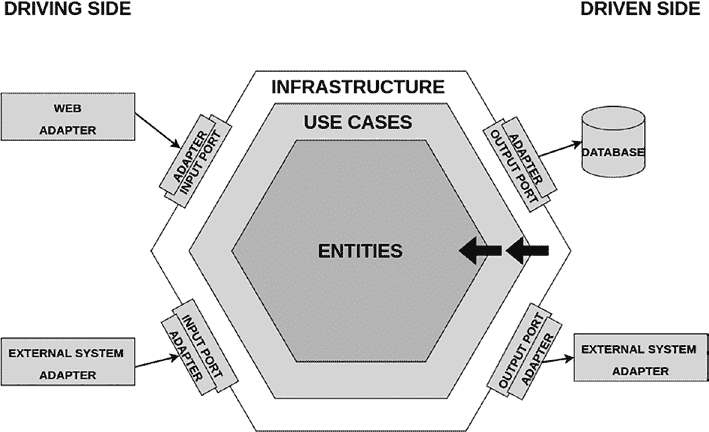

第 1 章 应用程序架构

为此，他在架构中创建了输入/输出的概念，以表示与数据库或外部系统等外部资源的通信。

这种架构类型的主要思想是创建所有业务逻辑，使其与应用程序工作方式无关的外部工具和技术相隔离。图 1-11 展示了六边形架构的不同元素，以及如何与数据库或其他应用程序等外部资源进行交互。

***图 1-11.** 包含最相关层的六边形架构*

该架构将六边形分为两部分。一部分称为“驱动侧”，由参与者（如外部系统和 Web/移动系统）发起交互。另一部分称为“被驱动侧”，参与者在此接收请求，以从数据库或其他外部系统获取特定信息。

**组件**

六边形架构在结构的每个部分内部都有多个组件，但我只提及理解基本思想最相关的部分。

• **基础设施** 包含负责使用不同协议与外部系统或数据库连接的端口和适配器。*端口*是与技术无关的接口，定义了访问应用程序或其他系统的方法。*适配器*是与特定技术相关的端口实现，例如对数据库的查询或 REST 控制器。

第 1 章 应用程序架构

• **用例** 是系统的核心，因为它包含了与各种场景及其关联方式相关的所有逻辑。根据作者的不同，该组件可能被称为*应用程序层*或*领域层*，并将用例与领域组件相结合。

• **实体** 是应用程序的纯领域，包含应用程序组件中使用的所有值对象实体。

**优势**

这种结构具有以下优势。

• 您可以毫无问题地更改或替换适配器。
• 领域和用例是纯粹的，因此您可以理解业务逻辑。
• 您可以为了测试目的更改端口的实现。

**缺点**

这种架构类型具有以下缺点。

• 实现某些框架很困难，因为您可能会错误地判断什么是适配器/端口。
• 引入间接性来查找每个端口的实现。
• 没有指导方针解释有关项目组织的所有事项，因此任何人都可能引入错误。

第 1 章 应用程序架构

**持久化设计模式**

在本书中，某些代码遵循相同的结构，因为这些模式与数据库访问相关联。本节介绍这些模式中最相关的部分，但本书未涵盖其他模式，其中大部分在 Martin Fowler 的网站上有所提及。24

**数据访问对象（DAO）**

数据访问对象（DAO）模式用于持久化数据库信息并从中检索信息。它允许开发者将业务层与持久化层隔离，持久化层在大多数情况下与数据库关联，但也可能是任何负责访问信息的组件。

该模式将所有 CRUD 操作的复杂性隐藏到

数据库，这样你就可以在不显著影响其他所有层的情况下进行更改或引入修改。在 Spring Data 中这并不常见，因为大多数开发者都使用**仓库模式**。但某些与性能或操作相关的场景并不支持该模式，因此 DAO 模式应运而生，帮助我们解决这些问题。

图 1-12 展示了遵循此模式时，不同的接口/类如何交互以访问数据库。

24 [`martinfowler.com/`](https://martinfowler.com/)

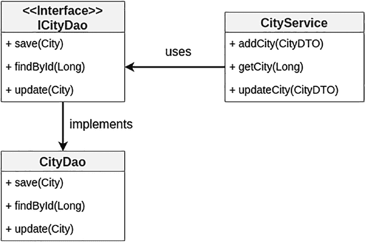

第 1 章 应用程序架构

***图 1-12.** DAO 接口及其实现，以及与* *服务层* *的交互方式*

当开发者开始使用此模式时，大多数人会创建一个包含所有可能方法的通用接口，并创建一个类来访问特定表，从而减少与数据库访问相关的文件数量。清单 1-1 展示了一个常见 DAO 可能拥有的不同方法，当然，你也可以创建其他方法，但大多数框架都实现了这些方法。

***清单 1-1.*** 访问数据库的通用接口

public interface CommonDao<T> {

Optional<T> get(long id);

List<T> getAll();

void save(T t);

void delete(T t);

}

第 1 章 应用程序架构

现在你已经看到了一个通用接口，其实现方式在所有情况下都大同小异。区别在于表名和访问数据库的查询语句，但所有 DAO 都遵循相同的格式。

清单 1-2 展示了清单 1-1 中接口的一种可能实现；请注意，还有其他实现方式。

***清单 1-2.*** 通用 DAO 的实现

public class CityDao implements CommonDao<City> {

private List<City> cities = new ArrayList<>();

public CityDao() {

cities.add(new City("BUE", "Buenos Aires"));

cities.add(new City("SCL", "Santiago de Chile"));

}

public Optional<City> get(long id) {

return Optional.ofNullable(cities.get((int) id));

}

public List<City> getAll() {

return cities;

}

public void save(City city) {

cities.add(city);

}

public void delete(City city) {

cities.remove(city);

}

}

**注意** 仅关注模式示例，这里并没有数据库与应用程序内存中创建城市之间的真实连接，但概念是相同的。

第 1 章 应用程序架构

**仓库模式**

仓库模式通过访问数据库来获取特定信息，并为其他层引入了一层抽象。仓库模式的精神在于，通过使用接口访问领域对象，来模拟或协调领域与数据映射之间的关系。

DAO 模式与仓库模式的主要区别在于，仓库更贴近业务逻辑，并试图隐藏所有与数据库查询相关的逻辑。最常见的用法是创建一个包含特定方法的接口；像 Spring Boot 和 Quarkus 这样的框架会将这些方法转换为针对数据库的特定查询。相比之下，DAO 则使用查询来实现所有访问数据库的逻辑。

请参阅表 1-6 来查看这两种方法之间的主要区别。

***表 1-6.** DAO 与仓库的主要区别*

**DAO 模式**

**仓库模式**

更贴近数据库，因为它使用查询和表。

更贴近业务/领域层，因为它提供了隐藏实现的抽象。

DAO 不能包含仓库，因为它们位于不同的层。

仓库可以包含或实现 DAO。

它是数据的抽象。

它是对象集合的抽象。

Spring Data 为开发者提供了一个基本接口，用于实现分页和 CRUD 操作的逻辑，而无需额外工作。清单 1-3 展示了一个遵循仓库模式的接口示例。

***清单 1-3.*** 仓库示例

interface CityRepository {

Optional<City> get(long id);

List<City> getAll();

void save(City city);

void delete(City city);

}

第 1 章 应用程序架构

你可以使用一个或多个仓库来隐藏访问信息的逻辑。你可以从清单 1-3 中获取接口，并创建一个具体类，以与清单 1-2 相同的方式使用该仓库。

***清单 1-4.** 使用 DAO 的仓库示例*

public class CityRepositoryImpl implements CityRepository {

private CityDao cityDao;

public CityRepositoryImpl(CityDao cityDao) {

this.cityDao = cityDao;

}

public Optional<City> get(long id) {

return cityDao.get(id);

}

public List<City> getAll() {

return cityDao.getAll();

}

public void save(City city) {

cityDao.save(city);

}

public void delete(City city) {

cityDao.delete(city);

}

}

这种组合非常少见，因为大多数开发者只使用其中一种。Spring Data 为仓库提供了大量元素，仅通过仓库接口即可解决问题。

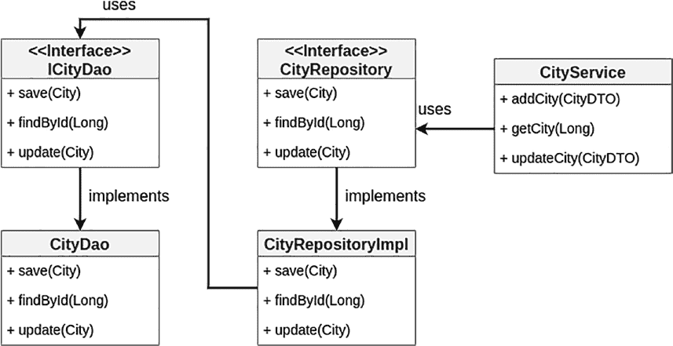

第 1 章 应用程序架构

***图 1-13.** 组合两种模式的结构*

**数据传输对象（DTO）**

数据传输对象（DTO）模式在多种语言中使用，它聚合并封装数据，用于在应用程序或应用程序的各层之间传输。你可以将此模式视为一种不包含任何业务逻辑的数据结构，它可以表示多种结构的组合。

这种模式并非近期才出现。Martin Fowler 在 2002 年出版的《企业应用架构模式》一书中提到了它。在他的网页.25 上也对此进行了讨论。

该模式有助于减少为获取执行特定任务所需的所有信息而调用不同端点或进程的次数，这些调用在时间或传输信息量方面成本高昂。

25 [`martinfowler.com/eaaCatalog/dataTransferObject.html`](https://martinfowler.com/eaaCatalog/dataTransferObject.html)

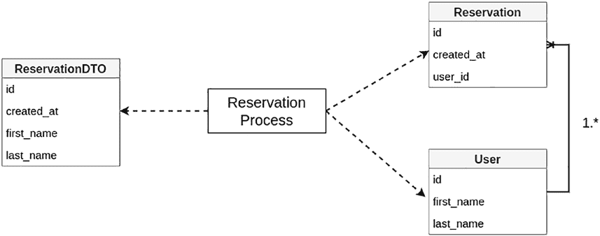

第 1 章 应用程序架构

***图 1-14.** 组合两个不同对象的 DTO 示例*

**注意** 当类转换用于将信息持久化到数据库的实体以及其他应用程序层时，此模式会出现在示例中。

有多种映射对象的方法；有些是手动完成的，即创建一个接收一个对象并返回另一个对象的类。另一种方法是使用像 MapStruct、26 Orika、27 Dozer、28 JMapper、29 和 ModelMapper30 这样的库来自动完成大部分转换。关于哪个库是根据 CPU 使用率、内存或实现复杂度来选择的最佳方案，已有大量分析和基准测试 31。

**规约模式**

规约模式根据条件过滤或选择对象的子集。例如，假设你想知道在你的旅行社至少有两个预订的所有用户，那么你可以创建一个类，该类接收每个用户并检查该用户是否满足条件。

26 [`mapstruct.org/`](https://mapstruct.org/)

27 [`orika-mapper.github.io/orika-docs/`](https://orika-mapper.github.io/orika-docs/)

28 [`dozer.sourceforge.net/`](http://dozer.sourceforge.net/)

29 [`jmapper-framework.github.io/jmapper-core/`](https://jmapper-framework.github.io/jmapper-core/)

30 [`modelmapper.org/`](http://modelmapper.org/)

31 [`www.baeldung.com/java-performance-mapping-frameworks`](https://www.baeldung.com/java-performance-mapping-frameworks)

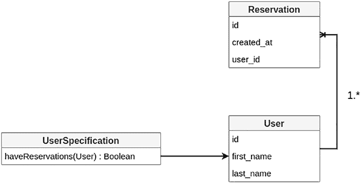

第 1 章 应用程序架构

***图 1-15.** 规约示例*

Martin Fowler32 很早以前就首次讨论了规约模式。如今，该模式直接与仓库模式相关联，在 Spring Data 中用于过滤数据库表中的结果。

**其他模式**

我介绍了与本书最相关的一些模式，以便更好地解释如何访问数据库或在不同层之间传输信息。其他模式则用于解决特定问题，例如过滤结果或保存历史数据。

**总结**

本章涵盖了使用 JDBC 等技术将持久化演进到 Java 数据库的过程，JDBC 提供了一种访问信息的基本方式，但可能在执行 SQL 查询时引入多种问题。JDBC 出现后，出现了许多在数据库中访问和执行查询的方法。其中最重要的是 JPA，这是一个所有库都可以遵循的规范。

Spring Data 允许开发人员在关系型和非关系型数据库之间进行切换，而无需引入重大更改。

你还了解了架构类型以及与持久化相关的最常见模式。

32 [`martinfowler.com/apsupp/spec.pdf`](https://martinfowler.com/apsupp/spec.pdf)

**第 2 章**

**Spring 基础与进阶**

在第 [1](https://doi.org/10.1007/978-1-4842-8764-4_1) 章中，你了解了在数据库中持久化信息的方法。Spring Data 是唯一一个提供使用关系型和非关系型数据库可能性的方案。

在讨论框架如何在幕后工作之前，你需要了解 Spring 框架是如何工作的。在本章中，你将学习如何创建一个小型项目，该项目将在本书中一直使用。

根据 Synk[1](https://snyk.io/jvm-ecosystem-report-2021/?utm_campaign=JVM-SC-2021&utm_medium=Report-Link#spring-dominates) 每年进行的调查，58% 的开发者使用 Spring，因为它提供了无需太多努力即可创建应用程序的可能性。

此外，该框架还提供了与 Vault、Kubernetes、Apache Kafka 等众多其他工具的集成。

**注意** 本书不会涵盖与 Spring 框架和 Spring Boot 相关的所有主题，因为许多其他 Apress 书籍已经涵盖了这些内容。以下仅是对相关概念的简要概述。

**Spring 基础**

Spring 的第一个版本于 2004 年发布，此后，采用该框架的开发者数量以及其支持的功能/技术数量都在增长。如今，有一个庞大的开发者社区为每个 Spring 版本出现的问题提供支持。每年都会举办一次年度会议，会议主题是向开发者展示最新版本的最新功能。

该框架提供了一个容器，用于创建和管理现有组件。定义这些组件的方式是使用注解或 XML，如今在定义组件时，XML 已不那么流行。Spring 应用上下文负责管理每个组件的生命周期。Spring 应用了一种称为依赖注入（DI）的模式，这是一种对象接收其所依赖的其他对象的技术。其他对象的状态由 Spring 管理，无需开发者干预。图 2-1 展示了 Spring 中不同组件之间的交互方式。

***图 2-1.** 组件之间的交互*

Spring 是一个由多个模块组成的生态系统，这些模块相互交互以提供功能。该生态系统包含以下元素。

• **核心** 包含了 Spring 在各模块中使用的所有核心功能，例如依赖注入或组件生命周期管理。

• **Web** 是一个支持开发处理 HTTP 请求的 Web 应用程序的模块组。

• **数据访问** 提供了一套基本工具，用于将信息持久化存储到关系型和非关系型数据库等地方。

• **测试** 是一个提供支持的模块组，用于创建测试以检查你使用 Spring 开发的一切是否运行正常。

图 2-2 展示了组成 Spring 框架的不同模块。

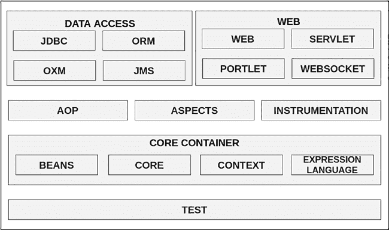

第 2 章 Spring 基础与进阶

***图 2-2.** Spring 模块*

**Spring Boot**

Spring Boot 是一个于 2014 年发布的项目，旨在降低创建和开发 Java Web 应用程序的复杂性，它在底层使用了 Spring。Spring Boot 的一些关键特性包括：自动配置所有组件以便快速上手，无需在 Web 服务器上部署构件（artifact），并提供监控和检查一切是否正常运行的方法。

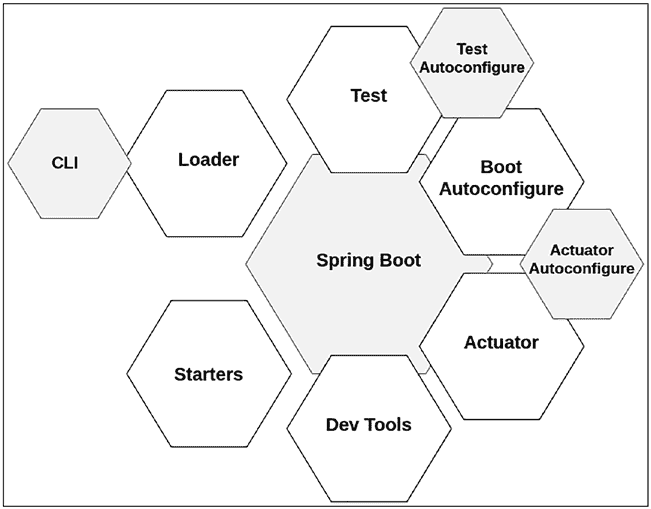

第 2 章 Spring 基础与进阶

图 2-3 展示了 Spring Boot 中存在的一些模块。图中最核心的是位于中心的模块，它负责为其他模块提供支持，并使用嵌入式 Web 服务器创建/运行应用程序。

此外，它还负责将应用程序配置外部化到一个或多个文件中。

***图 2-3.** Spring Boot 模块*

Spring Boot 中与本书主题直接交互的依赖项之一是 actuator。Actuator 负责检查并报告应用程序是否健康。通常，Spring Boot 会在内部检查应用程序上下文中的所有内容是否正常。但当你的应用程序与数据库交互时，你可以明确指示它检查状态，并将该信息作为响应的一部分发送出去。

**基本应用程序设置**

让我们创建一个包含城市、州和国家所有信息的目录微服务。为此，你需要为每个资源定义一组端点。大多数操作都是 CRUD（创建、检索/读取、更新、删除）操作中的常见操作。

第 2 章 Spring 基础与进阶

首先，你必须创建一个基本骨架，以便在后续章节中添加不同的数据库来持久化信息。为简单起见，让我们使用应用了约束或具有持久化信息能力的数据库示例。

有多种方法可以创建使用 Spring Boot 的应用程序。请记住，你使用 Spring Boot 是为了轻松创建 Web 应用程序。有些方法需要手动创建项目并添加所有必要的依赖项来运行应用程序。在某些情况下，这种方法可能不是最佳选择，并且会因缺少依赖项而产生大量错误。为了解决这个问题，Spring Boot 提供了一种不同的机制来简单地创建项目及其所有必要的依赖项。

最流行的有两种方法。

• 从网页使用 Spring Initializr²
• 使用 IDE 插件，如 Eclipse、IntelliJ 或 Visual Studio Code

本书将教你如何使用这两种选项创建项目，但仅涵盖 IntelliJ IDE。

**使用 Spring Initializr 创建 API**

首先，让我们使用 Spring Initializr 创建一个项目，这是一个直观的界面，可以让你了解如何配置项目。当你访问该网页时，你会看到类似于图 2-4 的内容，你需要在此处指明：配置管理、语言、Spring Boot 版本以及所有项目元数据（组、构件、名称和 Java 版本）。

[²]: [`start.spring.io/`](https://start.spring.io/)

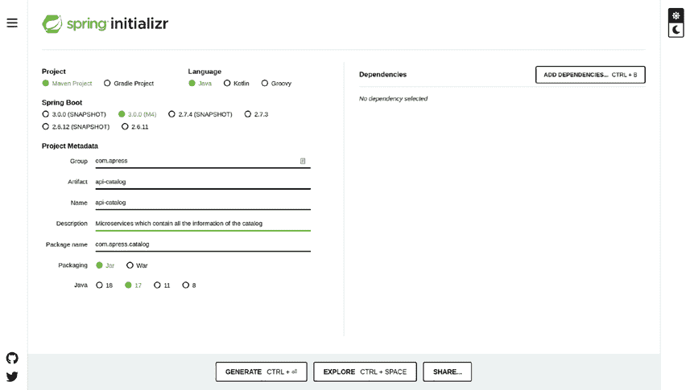

第 2 章 Spring 基础与进阶

***图 2-4.** 使用 Spring Initializr，你可以创建一个新的应用程序。*

**注意** 本书中的所有示例均使用 Maven 而非 Gradle。

第 2 章 Spring 基础与进阶

对于本书，请使用表 2-1 中的信息填写输入项。

***表 2-1.** 生成新项目的项目元数据*

**属性**

**值**

**描述**

project

Maven project

要生成的项目类型：maven-project 或 gradle-project

Language

Java

要使用的编程语言：java、groovy 或 kotlin

Spring Boot

3.0.0-M4

要构建所基于的 Spring Boot 版本

group

com.apress

项目的组 ID，用于在 Maven 仓库中进行组织

Artifact

api-catalog

项目的工件 ID，如同在 Maven 仓库中显示的那样

name

api-catalog

项目名称；同时也决定了应用程序主类的名称

description

Microservices that contain all the information in the catalog

项目描述

package

com.apress.catalog

项目的基础包名

name

packaging

Jar

项目的打包方式：jar 或 war

Java

用于构建的 Java 版本

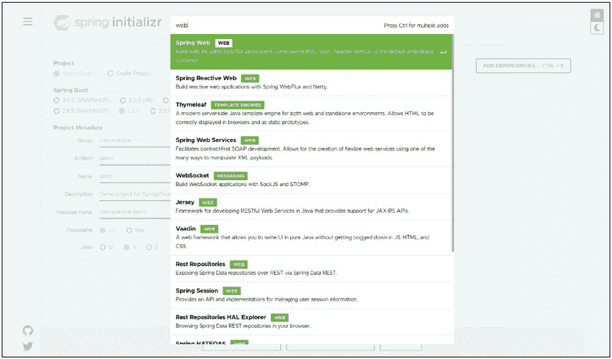

第 2 章 Spring 基础与进阶

之后，你需要添加依赖项以支持基本操作，例如创建微服务的端点以及处理配置文件。因此，你需要点击“添加依赖项…”按钮，该按钮会显示一个类似于图 2-5 的页面。

***图 2-5.** 你可以从网页中添加依赖项。*

对于本项目，请添加以下依赖项。

• **Spring Boot Actuator**3 提供了提供特定信息的端点，例如应用程序是否健康、应用程序中的缓存等。此外，你还可以创建自定义端点，这些端点可以扩展或不扩展现有端点。

• **Spring Configuration Processor**4 为开发者在 YML 或 properties 等配置文件中使用而生成元数据。因此，你可以更简单地知道某个配置有哪些可用属性，因为当你开始输入时，IDE 会为你提供文件中可用的选项。

3 [`docs.spring.io/spring-boot/docs/current/reference/html/actuator.html`](https://docs.spring.io/spring-boot/docs/current/reference/html/actuator.html)
4 [`docs.spring.io/spring-boot/docs/current/reference/html/configuration-`](https://docs.spring.io/spring-boot/docs/current/reference/html/configuration-metadata.html)
[metadata.html](https://docs.spring.io/spring-boot/docs/current/reference/html/configuration-metadata.html)

第 2 章 Spring 基础与进阶

• **Spring Web** 允许你为应用程序添加支持，以使用像 Tomcat 这样的嵌入式服务器创建 RESTful API。

• **Spring Boot Devtools**5 是一个为开发者提供有用功能的库，例如快速应用程序重启和远程调试应用程序。

你没有添加任何与 Spring Data 相关的依赖项，因为本章的重点是创建一个基础项目，该项目公开端点，并在其中包含使用 Spring Data 访问数据库的逻辑层级。

添加依赖项后，你只需点击“生成”按钮，该按钮会将应用程序打包成一个 ZIP 文件。你只需将该文件解压到你想要的任何目录，然后继续执行“如何运行应用程序”一节中的步骤。

**在 IDE 中创建 API**

让我们使用你的 IDE 创建一个应用程序。在本书中，IntelliJ 是默认的 IDE。你需要打开 IntelliJ，然后通过选择 **文件** ➤ **新建** ➤ **项目** 进入顶部菜单。选择创建新项目的选项后，你会看到一个类似于图 2-3 所示的窗口。选择一个 JDK 版本以及 Spring Boot 生成器将创建应用程序的位置。在该插件的最新版本中，你需要填写以下信息：

在 Spring Initializr 中，Java 版本、组/工件名称以及其他详细信息，如图 2-6 所示。

5 [`docs.spring.io/spring-boot/docs/current/reference/html/using.html#using.`](https://docs.spring.io/spring-boot/docs/current/reference/html/using.html#using.devtools)

[开发者工具](https://docs.spring.io/spring-boot/docs/current/reference/html/using.html#using.devtools)

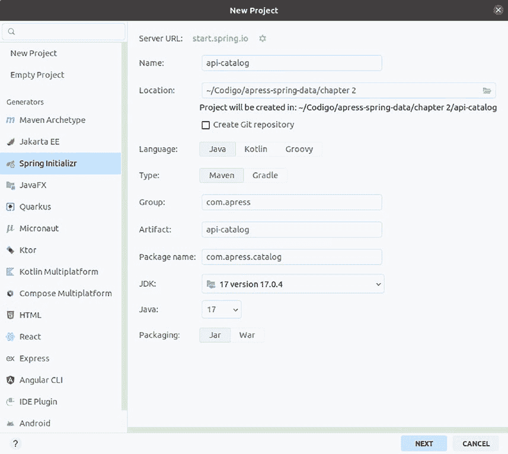

第 2 章 Spring 基础与进阶

***图 2-6.** 在 IntelliJ 中创建新项目的模态框*

下一步是包含项目所有的依赖项。请包含 Spring Boot Actuator、Spring Dev Tools、Spring Configuration Processor 和 Spring Web。Spring Initializr 与此选项的主要区别在于，依赖项按组组织，以便于查找，如图 2-7 所示。

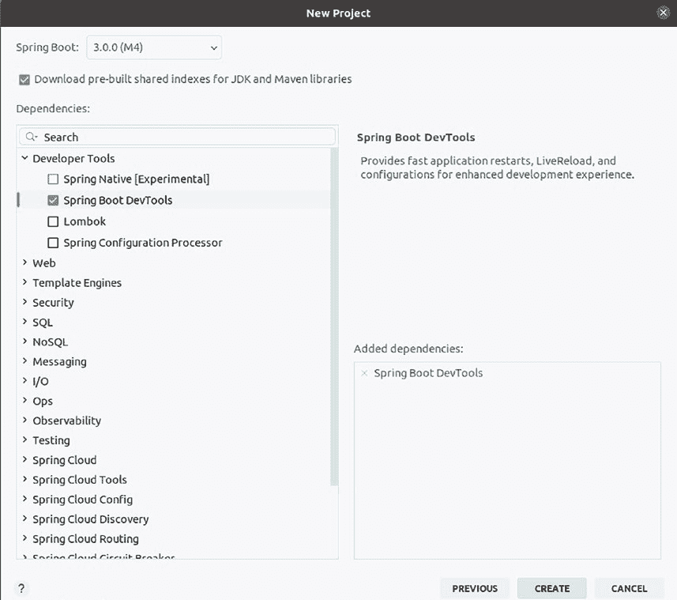

第 2 章 Spring 基础与进阶

***图 2-7.** 添加所有项目依赖项的模态框*

完成整个过程后，其结果与使用 Spring Initializr 相同。

**如何运行应用程序**

清单 2-1 展示了项目的基本结构。

第 2 章 Spring 基础与进阶

***清单 2-1.** 使用 Spring Initializr 创建的项目结构*

.
├── HELP.md
├── mvnw
├── mvnw.cmd
├── pom.xml
└── src
    ├── **main**
    │   ├── java
    │   │   └── com
    │   │       └── apress
    │   │           └── catalog
    │   │               └── ApiCatalogApplication.java
    │   └── resources
    │       ├── application.properties
    │       ├── static
    │       └── templates
    └── **test**
        └── java
            └── com
                └── apress
                    └── catalog
                        └── ApiCatalogApplicationTests.java

文件夹结构与任何 Maven 或 Gradle 项目类似，但有一些细微的变化。让我们来回顾一下项目的各个部分。

• **mvnw** 和 **mvnw.cmd** 是脚本，如果你机器上没有安装 Maven，它们会充当包装器。
• **pom.xml** 包含 Maven 构建项目所需的所有规范，例如依赖项、插件和仓库。
• **ApiCatalogApplication** 是应用程序的主类。
• **ApiCatalogApplicationTests** 是一个简单的测试类，用于检查应用程序是否正常运行。

第 2 章 Spring 基础与进阶

• **application.properties** 是一个初始为空的文件，但提供了加载与应用程序相关的所有配置的机会。你也可以创建一个同名但扩展名为 YML 的文件来配置应用程序。

现在你已经了解了项目中的组件，是时候看看 `pom.xml` 文件的内容以及哪些是最相关的部分了。清单 2-2 包含一个父 POM，它解决了 Spring Boot 所需的不同库版本相关的所有问题；因此，你在依赖项中看不到任何版本声明。

***清单 2-2.** 初始 Maven 构建规范*

<?xml version="1.0" encoding="UTF-8"?>
<project xmlns:xsi="http://www.w3.org/2001/XMLSchema-instance"
         xsi:schemaLocation="http://maven.apache.org/POM/4.0.0 https://maven.apache.org/xsd/maven-4.0.0.xsd">
    <modelVersion>4.0.0</modelVersion>
    <parent>
        <groupId>org.springframework.boot</groupId>
        <artifactId>spring-boot-starter-parent</artifactId>
        <version>3.0.0-M4</version>
        <relativePath/> <!-- lookup parent from repository -->
    </parent>
    <groupId>com.apress</groupId>
    <artifactId>api-catalog</artifactId>
    <version>0.0.1-SNAPSHOT</version>
    <name>api-catalog</name>
    <description>包含目录所有信息的微服务</description>
    <properties>
        <java.version>17</java.version>
    </properties>
    <dependencies>
        <dependency>
            <groupId>org.springframework.boot</groupId>
            <artifactId>spring-boot-starter-actuator</artifactId>
        </dependency>
        <dependency>
            <groupId>org.springframework.boot</groupId>
            <artifactId>spring-boot-starter-web</artifactId>
        </dependency>
        <dependency>
            <groupId>org.springframework.boot</groupId>
            <artifactId>spring-boot-devtools</artifactId>
            <scope>runtime</scope>
            <optional>true</optional>
        </dependency>
        <dependency>

<groupId>org.springframework.boot</groupId>

<artifactId>spring-boot-configuration-processor</artifactId>

<optional>true</optional>

</dependency>

<dependency>

<groupId>org.springframework.boot</groupId>

<artifactId>spring-boot-starter-test</artifactId>

<scope>test</scope>

</dependency>

</dependencies>

<build>

<plugins>

<plugin>

<groupId>org.springframework.boot</groupId>

<artifactId>spring-boot-maven-plugin</artifactId>

</plugin>

</plugins>

</build>

<repositories>

<repository>

<id>spring-milestones</id>

第 2 章 Spring 基础与进阶

<name>Spring Milestones</name>

<url>https://repo.spring.io/milestone</url>

<snapshots>

<enabled>false</enabled>

</snapshots>

</repository>

</repositories>

<pluginRepositories>

<pluginRepository>

<id>spring-milestones</id>

<name>Spring Milestones</name>

<url>https://repo.spring.io/milestone</url>

<snapshots>

<enabled>false</enabled>

</snapshots>

</pluginRepository>

</pluginRepositories>

</project>

和之前一样，**application.properties** 文件是空的。我们的想法是删除该文件，并创建一个新文件 **application.yml**，其内容如清单 2-3 所示，该文件定义了应用程序暴露的 Actuator 端点、端口以及默认 URL。这样做的原因是，你可以通过理解属性的层级结构来降低配置文件的复杂性，但使用 application.properties 也能实现同样的效果，没有任何问题。

***清单 2-3.*** 包含默认 URL 和暴露端点的配置

management:
  endpoints:
    web:
      base-path: /
      exposure:
        include: "*" # 表示暴露所有端点
  server:
    port: 8080 # 表示应用程序的默认端口
    servlet:
      context-path: /api/catalog # 表示默认 URL

第 2 章 Spring 基础与进阶

现在是时候运行应用程序了。有两种方法可以实现：你可以使用 IDE，或者使用命令行，清单 2-4 展示了命令行选项。

***清单 2-4.*** 运行应用程序的命令

./mvnw spring-boot:run

接下来，运行该命令。你会看到类似于清单 2-5 的输出，其中包含了关于启动应用程序位置、应用程序使用的容器服务器以及其他附加细节的所有信息。该输出中最相关的信息是端口和默认 URL（/api/catalog），你需要经常检查它们，以防出现问题。

***清单 2-5.*** 控制台输出

  .   ____          _            __ _ _
 /\\ / ___'_ __ _ _(_)_ __  __ _ \ \ \ \
( ( )\___ | '_ | '_| | '_ \/ _` | \ \ \ \
 \\/  ___)| |_)| | | | | || (_| |  ) ) ) )
  '  |____| .__|_| |_|_| |_\__, | / / / /
 =========|_|==============|___/=/_/_/_/
 :: Spring Boot ::                (v3.0.0-M4)

2022-09-19T11:05:12.370-03:00  INFO 1172745 --- [  restartedMain] c.apress.catalog.ApiCatalogApplication   : Starting ApiCatalogApplication using Java 17.0.4 on asacco with PID 1172745 (/home/asacco/Codigo/api-catalog/target/classes started by asacco in /home/asacco/Codigo/api-catalog)
2022-09-19T11:05:12.375-03:00  INFO 1172745 --- [  restartedMain] c.apress.catalog.ApiCatalogApplication   : No active profile set, falling back to 1 default profile: "default"
2022-09-19T11:05:12.425-03:00  INFO 1172745 --- [  restartedMain] .e.DevToolsPropertyDefaultsPostProcessor : Devtools property defaults active! Set 'spring.devtools.add-properties' to 'false' to disable
2022-09-19T11:05:12.426-03:00  INFO 1172745 --- [  restartedMain] .e.DevToolsPropertyDefaultsPostProcessor : For additional web related logging consider setting the 'logging.level.web' property to 'DEBUG'
2022-09-19T11:05:13.297-03:00  INFO 1172745 --- [  restartedMain] o.s.b.w.embedded.tomcat.TomcatWebServer  : Tomcat initialized with port(s): 8080 (http)

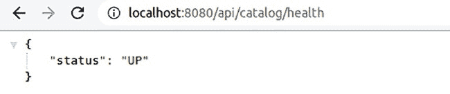

第 2 章 Spring 基础与进阶

2022-09-19T11:05:13.304-03:00  INFO 1172745 --- [  restartedMain] o.apache.catalina.core.StandardService   : Starting service [Tomcat]
2022-09-19T11:05:13.304-03:00  INFO 1172745 --- [  restartedMain] org.apache.catalina.core.StandardEngine  : Starting Servlet engine: [Apache Tomcat/10.0.22]

2022-09-19T11:05:13.344-03:00 INFO 1172745 --- [ restartedMain]

o.a.c.c.C.[.[localhost].[/api/catalog] : 正在初始化 Spring 嵌入式

WebApplicationContext

2022-09-19T11:05:13.346-03:00 INFO 1172745 --- [ restartedMain] w.

s.c.ServletWebServerApplicationContext : 根 WebApplicationContext:

初始化完成，耗时 919 毫秒

2022-09-19T11:05:13.817-03:00 INFO 1172745 --- [ restartedMain] o.s.

b.d.a.OptionalLiveReloadServer : LiveReload 服务器正在运行于

端口 35729

2022-09-19T11:05:13.831-03:00 INFO 1172745 --- [ restartedMain]

o.s.b.a.e.web.EndpointLinksResolver : 在基础路径 '' 下暴露了 13 个端点

2022-09-19T11:05:13.861-03:00 INFO 1172745 --- [ restartedMain]

o.s.b.w.embedded.tomcat.TomcatWebServer : Tomcat 已启动，端口: 8080

(http)，上下文路径为 '/api/catalog'

2022-09-19T11:05:13.879-03:00 INFO 1172745 --- [ restartedMain] c.apress.

catalog.ApiCatalogApplication : ApiCatalogApplication 已启动，耗时 1.837

秒（进程运行了 2.137 秒）

应用程序正在运行，你唯一需要做的就是检查应用程序是否响应正常。为此，你可以检查由 Actuator 暴露的健康端点的状态，如图 2-8 所示。如果一切正常，JSON 会显示应用程序状态为 **UP**。

***图 2-8.** 应用程序健康端点的结果*

第 2 章 Spring 基础与进阶

现在是时候创建本书中将要使用的端点了。在本节中，端点仅返回模拟响应。

第一个任务是定义一个 DTO 类，这是大多数端点接收的对象，包含关于货币的所有信息。清单 2-6 是一个简单的类，包含变量以及 setter/getter 方法。

***清单 2-6.*** 该类包含关于特定货币的所有信息 public class CurrencyDTO {

private Long id;

private String code;

private String description;

private Boolean enable;

private Integer decimalPlaces;

public CurrencyDTO(Long id, String code, String description, Boolean

enable, Integer decimalPlaces) {

this.id = id;

this.code = code;

this.description = description;

this.enable = enable;

this.decimalPlaces = decimalPlaces;

}

// 所有 setter 和 getter 方法

}

清单 2-7 定义了 **CurrencyService**，其中包含与货币 CRUD 操作相关的所有业务逻辑。包含 @Service 注解，这允许你在 Spring Boot 中将创建和注入委托给其他类。

***清单 2-7.*** 该类包含 CRUD 操作的所有业务逻辑

@Service

public class CurrrencyService {

public CurrencyDTO getById(Long id) {

return new CurrencyDTO(id, "USD", "Dollar", true, 2);

}

第 2 章 Spring 基础与进阶

public CurrencyDTO save(CurrencyDTO currencyDTO) {

return currencyDTO;

}

public CurrencyDTO update(CurrencyDTO currencyDTO) {

return currencyDTO;

}

public void delete(Long id) {

// TODO 自动生成的方法存根

}

}

Service 类没有包含太多逻辑，因为本书目前还没有引入持久化机制，但该类将来需要与不同的仓库进行交互。之后，你需要定义一个 RestController，它暴露你可以对货币执行的每个操作（参见清单 2-8）。

***清单 2-8.*** 暴露端点的货币控制器

@RestController

@RequestMapping("/currency")

public class CurrencyController {

private CurrrencyService currrencyService;

@Autowired

public CurrencyController(CurrrencyService currrencyService) {

this.currrencyService = currrencyService;

}

@GetMapping(value = "/{id}")

public ResponseEntity<CurrencyDTO> getById(@PathVariable Long id) {

CurrencyDTO response = currrencyService.getById(id);

return new ResponseEntity<>(response, HttpStatus.OK);

}

@PostMapping

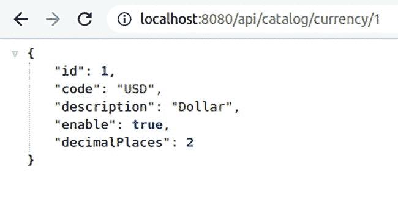

第 2 章 Spring 基础与进阶

public ResponseEntity<CurrencyDTO> save(@RequestBody CurrencyDTO

currencyDTO) {

CurrencyDTO response = currrencyService.save(currencyDTO);

return new ResponseEntity<>(response, HttpStatus.CREATED);

}

@PutMapping(value = "/{id}")

public ResponseEntity<CurrencyDTO> update(@RequestBody CurrencyDTO

currencyDTO) {

CurrencyDTO response = currrencyService.update(currencyDTO);

return new ResponseEntity<>(response, HttpStatus.OK);

}

@DeleteMapping(value = "/{id}")

public ResponseEntity<Void> delete(@PathVariable Long id) {

currrencyService.delete(id);

return ResponseEntity.accepted().build();

}

}

当你在源代码中完成所有修改后，运行应用程序并尝试获取任意货币信息，以检查映射是否正常。响应需要与图 2-9 所示类似，其中你调用了 localhost:8080/api/catalog/currency/1。

***图 2-9.** 调用 GET 端点获取货币信息的结果*

第 2 章 Spring 基础与进阶

**注意** 本书的范围并未涵盖使用 Spring Boot 创建 REST API 的所有方面。因此，仅提供了创建应用程序的基本示例，以便让你有机会了解从 REST 端点到数据库的完整流程。

**最佳实践**

在使用 Spring Boot 创建新应用程序时，最佳实践有助于开发者减少常见问题，例如确定可用的端点，或者应用程序在 IDE 中运行良好但在其他环境中表现不佳的原因。本节将讨论一些最佳实践。

**防止依赖冲突**

大多数开发者在项目中添加依赖时，并未考虑同一库的不同版本之间可能存在的冲突。像 Gradle 或 Maven 这样的依赖管理工具会使用特定策略来解决冲突。这种方法在大多数情况下都有效，直到你在某些环境中尝试部署应用程序时出现错误；在构建或执行过程中，你可能会遇到诸如 `ClassNotFoundException`、`NoClassDefFoundError` 或 `MethodNotSupportedException` 之类的异常。

为了解决此类问题，或将应用程序的使用限制在特定版本的 JDK 或 Maven 上，你可以使用 Enforcer 插件，该插件在 Maven6 和 Gradle7 中均受支持。与 Spring Boot 相关的依赖没有此问题，但如果你添加了其他依赖，则可能出现该问题，因此为防万一，请添加该插件。

图 2-10 展示了同一依赖的不同版本之间的冲突在控制台上的显示情况。

6 [`maven.apache.org/enforcer/maven-enforcer-plugin/index.html`](https://maven.apache.org/enforcer/maven-enforcer-plugin/index.html)

7 [`kordamp.org/enforcer-gradle-plugin/#_introduction`](https://kordamp.org/enforcer-gradle-plugin/#_introduction)

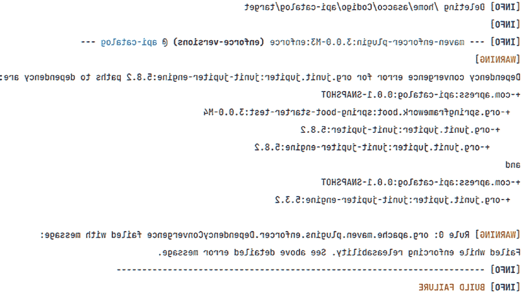

第 2 章 Spring 基础与进阶

*依赖*

*依赖树*

*冲突*

*解决冲突*

*Enforcer 插件*

***图 2-10.** 依赖冲突*

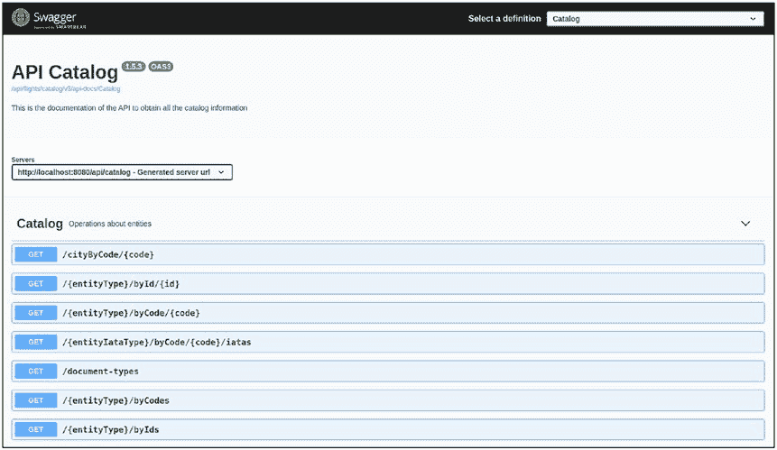

第 2 章 Spring 基础与进阶

**记录端点文档**

使用其他 REST API 时最大的问题之一是了解端点的信息，例如 URL、请求/响应和 HTTP 方法。有多种方法可以记录所有这些信息。默认标准是 OpenAPI 规范 8。像 Spring Boot 和 Quarkus 这样的框架提供了库来记录端点并动态生成文档，如图 2-11 所示。

***图 2-11.** API 文档*

**记录所有详细信息**

日志记录是在预生产或生产环境中查找和解决问题的最重要功能之一，因为它能提供有助于你重现或理解问题的信息。

8 [`swagger.io/specification/`](https://swagger.io/specification/)

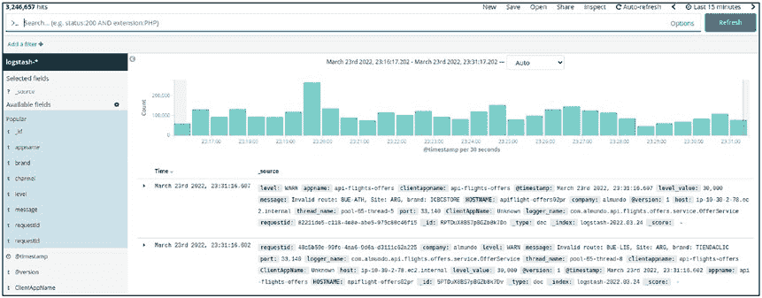

第 2 章 Spring 基础与进阶

根据你的预算，有多种实现日志记录的方法。工具

像 ELK（Elastic Logstash9 和 Kibana10）或来自 AWS 的 CloudWatch11 这类工具，都是将应用程序所有实例的日志集中存放的替代方案。

图 2-12 展示了 ELK 技术栈如何呈现应用程序的不同日志。

***图 2-12.** API 的文档*

**维护和更新依赖项**

Spring Boot 持续优化内存性能与 CPU 使用率，因此维护和更新应用程序至关重要。此外，Spring Boot 或其依赖项中的漏洞通常会导致安全相关问题。为解决这些问题，当某个库出现新版本时，IntelliJ 等 IDE 会发出警报。

**总结**

在本章中，你学习了如何使用 Spring Initializr 或 IDE 等工具创建 Spring Boot 项目。这两种策略都能得到相同的结果，但 IDE 依赖于插件，这些插件可能未更新，且在旧版本中不会出现。

本书通篇会使用端点定义和应用程序运行来检查数据库访问是否一切正常。

9 [`www.elastic.co//logstash/`](https://www.elastic.co//logstash/)
10 [`www.elastic.co//what-is/kibana`](https://www.elastic.co//what-is/kibana)
11 [`aws.amazon.com//cloudwatch/`](https://aws.amazon.com//cloudwatch/)

**第 3 章**

**Spring Data 与不同类型的持久化**

第[1 章](https://doi.org/10.1007/978-1-4842-8764-4_1)讨论了信息持久化的机制。其中之一是 Spring Data，它提供了使用不同数据库进行信息持久化的可能性，具备一定的抽象层次，并且无需大量代码即可解决大多数常见操作。

本章涵盖 Spring Data 的基础知识，包括仓库（Repository）的工作原理以及如何定义自定义实现。这些主题非常重要，因为后续章节中大部分都会用到它们。

**什么是 Spring Data？**

Spring Data 是 Spring 支持的一系列项目，旨在简化对 MongoDB、Redis、Cassandra、Neo4j、Memcached 以及所有关系型数据库的访问。在关系型数据库中，与 JDBC、Hibernate、JPA、JDO 或 MyBatis 等其他方案相比，Spring Data 提供了更简化的访问方式，减少了任何数据库操作所需的类、层和配置数量。

Spring Data1 首次出现在 2010 年的 Spring One 大会上。Rod Johnson（SpringSource 公司）和 Emil Eifrem（Neo Technologies 公司）尝试使用 Spring 将 Neo4j 数据库与应用程序连接起来。他们创建了用于在应用程序和数据库之间建立连接的类；这些类成为了 Spring Data 的基础。此后，该项目家族不断壮大，为不同的数据库提供支持，遵循着降低复杂性并在应用程序与数据库之间建立一定抽象层次的精神。

现在，让我们思考一下为什么需要使用 Spring Data 而不是数据库驱动程序。假设你有一个使用 Redis 的应用程序。维护这个数据库的成本很高，因此基础设施团队建议将信息迁移到经过高度优化的 Cassandra。这种情况下的问题是：如果你仅使用数据库驱动程序来实现所有持久化和检索信息的逻辑，那么你需要修改大量与 CRUD 操作、连接以及所有配置相关的代码行。但如果你使用 Spring Data，更换数据库只需修改实体中的注解和配置即可。

属性，或许就是仓库中的信息，仅此而已。使用 Spring Data 从一个数据库迁移到另一个数据库所需的时间更短，并且你拥有一种访问数据库的独特方式。

Spring Data 包含多个模块组；有些模块适用于所有类型的数据库，而另一些则针对特定类型。让我们来看看这些模块中最相关的一些。

• **Spring Data Commons** 提供了一个元数据模型，用于通过下一节中的仓库接口将 Java 类持久化到特定数据库中。

• **Spring Data REST**2 构建在 Spring Data 模块之上，帮助你使用与实体关联的仓库创建 RESTful API。

• **Spring Data JPA**3 提供了 JPA 的实现，它使用仓库接口，在大多数情况下支持所有 CRUD 操作。如果需要，你也可以创建具有特定逻辑的自定义仓库来访问数据库。

• **Spring Data JDBC**4 提供了使用 JDBC 通过仓库访问数据库的实现，但不具备 JPA 的更多功能，例如懒加载和缓存。

• **Spring Data for Apache Cassandra**5 支持 Cassandra 实体中的所有 CRUD 操作和 TTL 定义。它还支持配置数据库的多个实例。

• **Spring Data MongoDB**6 提供了使用仓库或 `MongoTemplate`（另一种执行 CRUD 操作的方式）在 MongoDB 数据库中执行所有操作的可能性。

2 [`spring.io/projects/spring-data-rest`](https://spring.io/projects/spring-data-rest)

3 [`spring.io/projects/spring-data-jpa`](https://spring.io/projects/spring-data-jpa)

4 [`spring.io/projects/spring-data-jdbc`](https://spring.io/projects/spring-data-jdbc)

5 [`spring.io/projects/spring-data-cassandra`](https://spring.io/projects/spring-data-cassandra)

6 [`spring.io/projects/spring-data-mongodb`](https://spring.io/projects/spring-data-mongodb)

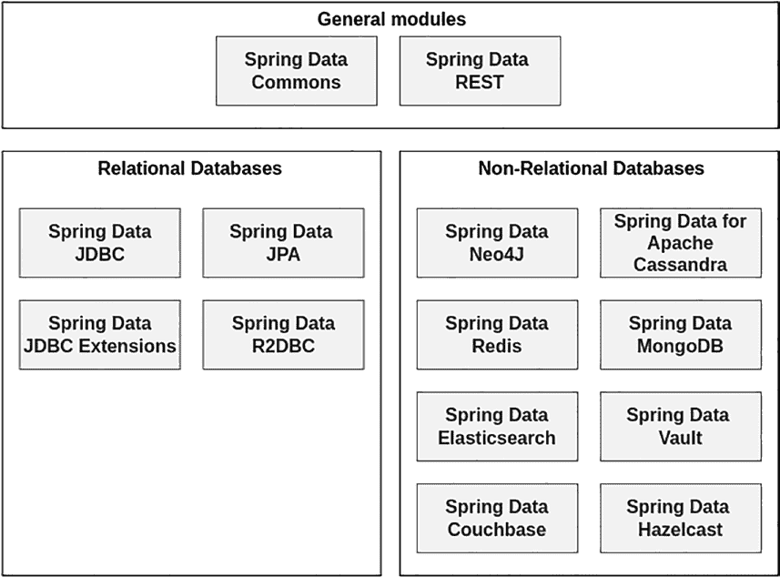

第 3 章 Spring Data 与不同类型的持久化

• **Spring Data Neo4j**7 支持使用 Neo4j 图数据库构建响应式和命令式应用程序。

• **Spring Data Redis**8 支持访问 Redis 数据库以保存简单值或更复杂的对象（如对象）。此外，它还支持使用带有 Sentinel 机制的 Redis，该机制负责监控并暴露高可用性服务。

图 3-1 展示了之前解释中未涵盖但与 Spring Data 相关的其他模块。这些模块将在本书后续章节中更详细地介绍。

***图 3-1.** Spring Data 模块结构*

7 [`spring.io/projects/spring-data-neo4j`](https://spring.io/projects/spring-data-neo4j)

8 [`spring.io/projects/spring-data-redis`](https://spring.io/projects/spring-data-redis)

第 3 章 Spring Data 与不同类型的持久化

所有 Spring Data 项目的源代码都可以从 Spring GitHub 仓库 9 下载。

**Spring Data 是如何工作的？**

第 [1 章](https://doi.org/10.1007/978-1-4842-8764-4_1) 讨论了仓库模式，它提供了一种访问数据库并执行任何 CRUD 操作的方式，但 Spring Data 在幕后做了什么呢？

如何将查询结果转换为对象？如果你是第一次使用 Spring Data，并且读到某些接口提供了访问数据库的所有操作，你可能会觉得这很神奇。但事实是，Spring Data 在运行时动态创建了大量类，将接口转换为类。可以将这种方法视为一种代理，使用接口而不是直接访问数据库的类。

**Spring Data 代码示例**

让我们使用[第 2 章](https://doi.org/10.1007/978-1-4842-8764-4_2)中创建的目录 API 作为示例，来更好地理解其中的奥妙。但首先，你需要引入一些修改。首先，你必须在项目中包含清单 3-1 中的依赖项。其中大部分直接与 Spring Data JPA 相关，后续章节会更详细地介绍，但这里仅包含这些依赖项。

***清单 3-1.*** Spring Data JPA 的依赖项

<dependencies>

