# 其他依赖项

<dependency>

<groupId>org.springframework.boot</groupId>

<artifactId>spring-boot-starter-data-jpa</artifactId>

</dependency>

<dependency>

<groupId>org.postgresql</groupId>

<artifactId>postgresql</artifactId>

</dependency>

9[ https://github.com/spring-projects?q=data&type=all](https://github.com/spring-projects?q=data&type=all)

第 3 章 Spring Data 与不同类型的持久化

<!-- 该库将帮助你实现实体与 DTO 之间的相互转换 -->

<dependency>

<groupId>org.mapstruct</groupId>

<artifactId>mapstruct</artifactId>

<version>${mapstruct.version}</version><!-- 请查看 Maven 仓库 10 中的最新版本 -->

</dependency>

<dependency>

<groupId>jakarta.persistence</groupId>

<artifactId>jakarta.persistence-api</artifactId>

</dependency>

</dependencies>

<build>

<plugins>

<plugin>

<groupId>org.springframework.boot</groupId>

<artifactId>spring-boot-maven-plugin</artifactId>

</plugin>

<plugin>

<groupId>org.apache.maven.plugins</groupId>

<artifactId>maven-compiler-plugin</artifactId>

<version>3.8.1</version>

<configuration>

<source>${java.version}</source>

<source>${java.version}</source>

<annotationProcessorPaths>

<path>

<groupId>org.mapstruct</

groupId>

10 [`mvnrepository.com/artifact/org.mapstruct/mapstruct`](https://mvnrepository.com/artifact/org.mapstruct/mapstruct)

第 3 章 Spring Data 与不同类型的持久化

<artifactId>mapstruct-

processor</artifactId>

<version>${mapstruct.

version}</version>

</path>

</annotationProcessorPaths>

</configuration>

</plugin>

</plugins>

</build>

之后，你需要引入所有必要的设置来连接数据库。清单 3-2 介绍了 application.yml 中的配置。该示例使用 PostgreSQL，但你可以使用任何关系型数据库。如果需要安装数据库的说明，请参考附录 D。

***清单 3-2.*** 需要包含在 application.yml 中的配置

spring:

datasource:

url: "jdbc:postgresql://localhost:5432/catalog?autoReconnect=true"

username: postgres

password: postgres

driverClassName: org.postgresql.Driver

validation-query: select 1;

maxActive: 100

jpa:

show-sql: false

generate-ddl: false

现在你已经拥有了所有依赖项并完成了配置，应用程序不会报错，但它并没有对数据库进行任何操作。因此，下一步是创建一个实体。出现这种情况是因为在配置中，你没有指定在应用程序启动时生成数据库结构。在此案例中，你使用[第 1 章](https://doi.org/10.1007/978-1-4842-8764-4_1)中的实体，该实体代表货币表。目前，不必花太多精力理解所有注解，因为它们将在本书的第二部分中更详细地介绍。清单 3-3 包含了用于持久化信息的实体，其中包含将所有注解转换为数据库列和类属性的内容。

***清单 3-3.*** 用于在货币表中持久化和检索信息的实体 import jakarta.persistence.Column;

import jakarta.persistence.Entity;

import jakarta.persistence.GeneratedValue;

import jakarta.persistence.GenerationType;

import jakarta.persistence.Id;

import jakarta.persistence.Table;

@Entity

@Table(name = "currency") //可选，仅当需要指定表名时使用

public class Currency {

@Id //标识哪个是主键


@GeneratedValue(strategy = GenerationType.SEQUENCE) //指示生成 ID 的方式

private Long id;

private String code;

private String description;

private Boolean enabled;

@Column(name = "decimal_places") //可选：指定列的名称和长度

private int decimalPlaces;

public Currency() {}

// 所有属性的 Getter 和 Setter 方法

// 重写 hashCode 和 equals 方法

}

下一步是创建一个接口，用于访问货币表并执行不同的操作。第 [1 章](https://doi.org/10.1007/978-1-4842-8764-4_1)讨论了仓库模式，该模式具有一个接口层次结构，每个接口支持不同的操作。清单 3-4 使用了最基本的 CRUD 操作仓库之一。

第 3 章 Spring Data 与不同类型的持久化

***清单 3-4.*** 访问数据库的仓库

import org.springframework.data.repository.CrudRepository;

import org.springframework.stereotype.Repository;

import com.apress.catalog.model.Currency;

public interface CurrencyRepository extends

CrudRepository<Currency, Long> {

}

第 [1 章](https://doi.org/10.1007/978-1-4842-8764-4_1)还讨论了 DTO 模式，这是一种在不暴露数据库设计的情况下，将信息传输/移动到不同层的方法。但该模式的一个问题在于，如何在不编写大量代码的情况下，将一个类的属性映射到另一个类。为了解决这个问题，Java 提供了用于执行此映射操作的库，从而减少了代码行数。清单 3-5 使用了 Mapstruct11。

***清单 3-5.*** 将实体转换为 DTO 的映射器配置

import com.apress.catalog.dto.CurrencyDTO;

import com.apress.catalog.model.Currency;

import org.mapstruct.Mapper;

import org.mapstruct.factory.Mappers;

@Mapper(componentModel = "spring")

public interface ApiMapper {

ApiMapper INSTANCE = Mappers.getMapper( ApiMapper.class );

CurrencyDTO entityToDTO(Currency currency);

Currency DTOToEntity(CurrencyDTO currency);

}

11 [`mapstruct.org/`](https://mapstruct.org/)

第 3 章 Spring Data 与不同类型的持久化

**注意** 对执行映射的库进行分析超出了本书的范围；然而，可选的方案包括 ModelMapper,12 JMapper, 13 和 orika。 14

最后一步是修改 CurrencyService，使其使用清单 3-4 中定义的仓库，并使用 MapperFacade 在实体和 DTO 之间进行转换（参见清单 3-6）。

***清单 3-6.*** 经过修改以检索信息的 CurrencyService

import com.apress.catalog.dto.CurrencyDTO;

import com.apress.catalog.mapper.ApiMapper;

import com.apress.catalog.model.Currency;

import com.apress.catalog.repository.CurrencyRepository;

import org.springframework.beans.factory.annotation.Autowired;

import org.springframework.stereotype.Service;

import java.util.Optional;

@Service

public class CurrencyService {

CurrencyRepository repository;

@Autowired

public CurrencyService(CurrencyRepository repository) {

this.repository = repository;

}

public CurrencyDTO getById(Long id) {

CurrencyDTO response = null;

Optional<Currency> currency = repository.findById(id);

if(currency.isPresent()) {

response = ApiMapper.INSTANCE.entityToDTO(currency.get());

}

12 [`modelmapper.org/`](http://modelmapper.org/)

13 [`jmapper-framework.github.io/jmapper-core/`](https://jmapper-framework.github.io/jmapper-core/)

14 [`orika-mapper.github.io/orika-docs/`](https://orika-mapper.github.io/orika-docs/)

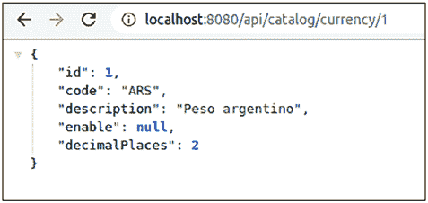

第 3 章 Spring Data 与不同类型的持久化

return response;

}

// 其他未修改的现有方法

}

最后一步是运行应用程序，并向 API 发送请求，地址为 http://localhost:8080/api/catalog/currency/1。在运行应用程序之前，你应该


创建包含表和行的数据库。你可以在本书源码仓库的 SQL 脚本中找到所有这些内容。如果运行应用程序时一切正常，

你将看到与图 3-2 大致相似的响应。

***图 3-2.** 执行 API 请求的响应*

现在你已经有了一个能从数据库返回结果的工作应用，是时候了解幕后发生了什么。

**核心概念**

本节涵盖 Spring Data 在幕后工作的两个最相关方面，以及如何扩展默认仓库以执行其他自定义操作。

**对象映射**

对象映射是 Spring Data 中负责创建属性访问和映射的部分。其流程包括使用类的公共构造函数创建新对象，并填充所有暴露的属性。

第 3 章 Spring Data 与不同类型的持久化

**注意** 通常，变化取决于用于持久化信息的数据库，例如自定义列或字段名称。

让我们从使用 Spring Data 创建对象开始。对于这个主题，核心模块会检测所有与数据库交互的持久化实体，并在运行时生成一个工厂类来创建新实例。为什么要创建一个类来实例化该类，而不是使用反射来创建实例并填充所有属性？

这种方法的主要问题与性能相关。

现在是时候看看清单 3-3 中定义的 Currency 实体发生了什么。在幕后，Spring Data 获取该实体并创建一个实现 `ObjectInstantiator` 的新类，如清单 3-7 所示。

***清单 3-7.** 运行时创建的用于实例化实体的类*

*public class* CurrencyObjectInstantiator *implements* ObjectInstantiator {

Object newInstance(Object... args) {

*return new* Currency((Long) args[0], (String) args[1], (String)

args[2], (Boolean) args[3], (Integer) args[4]);

}

}

如果你对所有实体遵循一些规则，这种方法效果很好。

• 该类至少需要有一个公共构造函数。你不需要创建一个公共构造函数，默认构造函数即可。

• 当你有多个公共构造函数时，你需要使用 `@PersistenceCreator` 注解来指示哪个是主构造函数。

• 该类不能是私有的或静态内部类。

有一些规则或约束可以获得大约 10% 的性能提升，但请记住，所有这些类仅在运行时可见，并且由 Spring Data 负责编排，因此你无法控制它们。

第 3 章 Spring Data 与不同类型的持久化

下一步是填充 Spring Data 从数据库获取的信息。遵循减少应用程序中代码块的原则，核心模块会在运行时生成一个负责设置实体所有属性的类。

清单 3-8 使用清单 3-3 中的类来查看 Spring Data 在幕后创建了什么。

***清单 3-8.** 运行时创建的用于设置实体属性的类*

public class CurrencyPropertyAccessor implements

PersistentPropertyAccessor {

private Currency currency;

public void setProperty(PersistentProperty property, Object value) {

String name = property.getName();

if ("id".equals(name)) {

this.currency.setId((Long) value);

} else if ("code".equals(name)) {

this.currency.setCode((String) value);

} else if ("description".equals(name)) {

this.currency.setDescription((String) value);

}

//其他 else if 条件，每个实体属性对应一个

}

}

属性填充规则与对象实例化相同；如果你遵循之前的约束，应该不会遇到 Spring Data 的任何问题。如果 Spring Data 无法以这种方式使用，它会尝试使用反射，这样你就不会损失性能提升。


**注意**：此方法仅适用于以下情况：构造函数未接收持久化实体的所有参数，或存在一个空构造函数。

第 3 章 Spring Data 与不同类型的持久化

**仓库**

仓库是 Spring Data 用于与数据库交互的抽象，旨在减少应用程序中的代码量。如果你曾使用过某些旧框架或库来访问数据库，或许还记得那些与数据库交互并在同一层映射结果的 DAO 类，其规模庞大且逻辑复杂，难以追踪。但如果你查看清单 3-4 中的接口，会发现其中并无逻辑——只是一个继承自其他接口的接口。那么，幕后究竟发生了什么？

Spring Data 提供了一系列仓库（均为可扩展的接口），用于指明实体及其 ID 类型。在运行时，框架会创建一个代理类，其中包含访问数据库所需的所有逻辑。在清单 3-4 中，该仓库扩展自 **CrudRepository<T, ID>** [，15 它提供了一组用于在数据库中执行 CRUD 操作的方法。清单 3-9 展示了该接口的部分操作。

***清单 3-9.*** CrudRepository 方法

package org.springframework.data.repository;

import java.util.Optional;

@NoRepositoryBean

public interface CrudRepository<T, ID> extends Repository<T, ID> {

<S extends T> S save(S entity); // 保存或更新实体

Optional<T> findById(ID primaryKey);

Iterable<T> findAll();

long count();

void delete(T entity);

boolean existsById(ID primaryKey);

// ... 其他方法已省略。

}

15 [`docs.spring.io/spring-data/commons/docs/current/api/org/springframework/`](https://docs.spring.io/spring-data/commons/docs/current/api/org/springframework/data/repository/CrudRepository.html)

[data/repository/CrudRepository.html](https://docs.spring.io/spring-data/commons/docs/current/api/org/springframework/data/repository/CrudRepository.html)

第 3 章 Spring Data 与不同类型的持久化

其他接口包括 PagingAndSortingRepository<T, ID>16（它扩展自 CrudRepository）、JpaRepository 和 MongoRepository。后两个仓库各自用于特定类型的数据库，而 CrudRepository 和 PagingAndSortingRepository 则是适用于所有数据库的通用接口。在 Spring Data 3.0.0 中，出现了一个新的仓库：ListCrudRepository<T, ID> ID**>** 17，它包含了额外的方法来检索元素列表，而非返回 Iterable 接口。

大多数常见仓库提供的方法在多数情况下都很有用。但如果需要根据其他属性（而非 ID）查找元素，该怎么办？Spring Data 提供了一种无需创建额外类即可创建自定义查询的机制。

**自动自定义查询**

Spring Data 会分析每个仓库，搜索所有已定义的方法，并为每个方法生成特定的查询。如果你需要特定的查询，可以在接口中使用 Spring Data 用于创建查询的关键字来定义一个新方法。在这种情况下，你需要创建一个使用 **findBy** 或 **existBy** 的方法，后跟要在表中搜索的字段名。如果该属性在表中不存在，Spring 会抛出异常（参见清单 3-10）。

***清单 3-10.*** 创建特定查询的自定义方法

@Repository

public interface CurrencyRepository extends

CrudRepository<Currency, Long> {

List<Currency> findByCode(String code);

}

其他关键字允许创建一组查询，例如组合属性、限制结果数量或以特定方式排序（参见表 3-3）。查询的结构分为两部分：第一部分定义了查询的主题，而


第二个是谓词。查询的主体定义了查询需要执行的另一种操作类型。谓词是子句中用于过滤、排序或去重的属性部分。

16 [`docs.spring.io/spring-data/commons/docs/current/api/org/springframework/`](https://docs.spring.io/spring-data/commons/docs/current/api/org/springframework/data/repository/PagingAndSortingRepository.html)

[data/repository/PagingAndSortingRepository.html](https://docs.spring.io/spring-data/commons/docs/current/api/org/springframework/data/repository/PagingAndSortingRepository.html)

17 [`spring.io/blog/2022/02/22/`](https://spring.io/blog/2022/02/22/announcing-listcrudrepository-friends-for-spring-data-3-0)

[announcing-listcrudrepository-friends-for-spring-data-3-0](https://spring.io/blog/2022/02/22/announcing-listcrudrepository-friends-for-spring-data-3-0)

第 3 章 Spring Data 与不同类型的持久化

让我们看看 CurrencyRepository 中其他查询的示例，这些查询用于过滤属性并对结果进行排序。清单 3-11 使用了 `List` 接口而不是 `Set` 接口，以说明你可以拥有重复元素。但如果你想改用 `Set` 接口，查询仍然可以正常工作。

***清单 3-11.*** 查找并排序结果的自定义查询示例

```java
public interface CurrencyRepository extends
    CrudRepository<Currency, Long> {

    // 通用查询
    List<Currency> findByCode(String code);
    List<Currency> findByCodeAndDescription(String code, String
        description);

    // 排序查询
    List<Currency> findByDescriptionOrderByCodeAsc(String description);
    List<Currency> findByDescriptionOrderByCodeDesc(String description);
}
```

这些示例看起来相当简单，但让我们看看 Spring Data 会生成什么样的查询来访问数据库。所有应用程序都将 `application.yml` 中的 `show-sql` 属性值从 `false` 改为 `true`。如果你运行应用程序并发出一个请求，你将在控制台上看到类似表 3-1 中的查询。

第 3 章 Spring Data 与不同类型的持久化

***表 3-1.** 方法与数据库查询之间的等价关系*

| **方法** | **查询** |
| :--- | :--- |
| `List<Currency> findByCode(String code);` | `select currency0_.id as id1_0_, currency0_.code as code2_0_, currency0_.decimal_places as decimal_3_0_, currency0_.description as descript4_0_, currency0_.enabled as enabled5_0_ from currency currency0_ where currency0_.code=?` |
| `List<Currency> findByCodeAndDescription(String code, String description);` | `select currency0_.id as id1_0_, currency0_.code as code2_0_, currency0_.decimal_places as decimal_3_0_, currency0_.description as descript4_0_, currency0_.enabled as enabled5_0_ from currency currency0_ where currency0_.code=? and currency0_.description=?` |
| `List<Currency> findByDescriptionOrderByCodeAsc(String description);` | `select currency0_.id as id1_0_, currency0_.code as code2_0_, currency0_.decimal_places as decimal_3_0_, currency0_.description as descript4_0_, currency0_.enabled as enabled5_0_ from currency currency0_ where currency0_.description=? order by currency0_.code asc` |
| `List<Currency> findByDescriptionOrderByCodeDesc(String description);` | `select currency0_.id as id1_0_, currency0_.code as code2_0_, currency0_.decimal_places as decimal_3_0_, currency0_.description as descript4_0_, currency0_.enabled as enabled5_0_ from currency currency0_ where currency0_.description=? order by currency0_.code desc` |

表 3-2 描述了最相关的主体关键字。其中一些关键字可能不被特定的非关系型数据库所支持。

第 3 章 Spring Data 与不同类型的持久化

***表 3-2.** 查询主体关键字*

| **关键字** | **描述** |
| :--- | :--- |
| `findBy…` | 这些关键字通常与 `select` 查询相关联，并返回一个元素或一组元素，这些元素可以是 `Collection` 或 `Streamable` 的子类型。 |
| `getBy…` | |
| `queryBy…` | |


countBy… 返回匹配查询的元素数量。

existBy… 返回布尔类型，如果存在匹配查询的内容则返回 true。

deleteBy… 删除一组匹配查询的元素，但不返回任何内容。

表 3-3 展示了谓词关键字与数据库关键字之间的对应关系。官方 Spring Data 文档 18. 中还有更多关键字。

***表 3-3.** 查询谓词关键字*

**逻辑关键字 关键字表达式**

LiKe

Like

iS_nULL

null 或 isnull

LeSS_than

Lessthan

greater_than

greaterthan

anD

and

or

or

after

after 或 isafter

Before

Before 或 isBefore

本书第二部分展示了如何创建查询来访问关系型数据库。

18 [`docs.spring.io/spring-data/commons/docs/current/reference/html/#appendix.`](https://docs.spring.io/spring-data/commons/docs/current/reference/html/#appendix.query.method.predicate)

[query.method.predicate](https://docs.spring.io/spring-data/commons/docs/current/reference/html/#appendix.query.method.predicate)

第 3 章 Spring Data 与不同类型的持久化

**手动自定义查询**

创建查询以访问数据库的第二种方法是经典方式——以类似于 SQL 的格式编写需要执行的查询，并在接口中定义一个方法。清单 3-12 修改了之前的仓库，加入了一个使用代码查找元素的手动查询。

***清单 3-12.*** 手动查询示例

import com.apress.catalog.model.Currency;

import org.springframework.data.jpa.repository.Query;

import org.springframework.data.repository.CrudRepository;

import org.springframework.data.repository.query.Param;

public interface CurrencyRepository extends

CrudRepository<Currency, Long> {

// 通用查询

List<Currency> findByCode(String code);

List<Currency> findByCodeAndDescription(String code, String

description);

// 排序查询

List<Currency> findByDescriptionOrderByCodeAsc(String description);

List<Currency> findByDescriptionOrderByCodeDesc(String description);

// 手动查询

@Query("SELECT c FROM Currency c where c.code = :code")

Currency retrieveByCode(@Param("code") String code);

}

声明查询的方式有很多种。

• 将其声明为接口顶部的常量，这样你就可以拥有所有方法的声明，以便理解每个方法。

• 将所有查询外部化到一个属性文件中，并动态导入到每个仓库中。这种方法的一个缺点是，你需要有良好的组织，才能知道哪个文件包含每个仓库的查询。

第 3 章 Spring Data 与不同类型的持久化

• 最后，可以有一个类包含特定仓库的所有查询。当你有大量过长的查询时，这种方法很有用。你可以清理仓库，将方法集中在一个地方，所有查询放在另一个地方。同时，定义命名模式以识别每个查询背后的意图。

每种方法都有许多优点和缺点，但哪种方法最适合你，取决于你自己。

既然有自动创建查询的方法，为什么还需要手动创建查询呢？

一个答案是，你需要提高 Spring Data 生成的查询的性能，或者你不需要表中的所有属性。你是在处理特定的场景。这种情况被称为投影（Projections）19. 另一个答案是，查询过于复杂，以至于没有关键字可以表达它。没有任何规则能解释所有可能需要使用一种机制而非另一种机制的潜在场景。但如果你知道你的应用程序在查询性能方面存在问题，最好的选择可能是尝试手动编写查询，看看效果如何。

**注意** 本书不涵盖 SQL 的所有语句或语法，因为这超出了范围。附录 f 推荐了提供更多信息的书籍和网站。

**实现仓库方法**


Spring Data 仓库提供的方法涵盖了常见场景，但你也可以通过添加方法来扩展它们。然而，某些场景需要你实现具体逻辑。清单 3-13 创建了一个接口和一个类，该类通过所有逻辑扩展了该接口。

19 [`docs.spring.io/spring-data/jpa/docs/current/reference/html/#projections`](https://docs.spring.io/spring-data/jpa/docs/current/reference/html/#projections)

第 3 章 Spring Data 与不同类型的持久化

***清单 3-13.*** 自定义仓库示例

public interface CustomCurrencyJPARepository {

List<Currency> myCustomFindMethod(String code);

}

@Repository

@Transactional

public class CustomCurrencyJPARepositoryImpl extends

CustomCurrencyJPARepository {

// 包含访问数据库所需的所有依赖项

List<Currency> myCustomFindMethod(String code) {

// 此处为自定义方法的所有逻辑

}

}

清单 3-13 中有一个代码块，你必须在构造函数中注入访问数据库所需的所有依赖项。例如，在关系型数据库中，你需要包含 `EntityManager`。关于此示例，你最后需要了解的一点是，你可以返回任何实现了 `Iterable`、`List` 和 `Set` 接口的类。但在本例中，你返回的是一个列表，因为这里对元素是否重复没有限制。

看完上一个示例中的代码块后，你可以考虑本节应包含哪些内容。这个问题的答案是，在完全手动编写查询和将创建查询的全部责任委托给 Spring Data 之间，还存在另一种方法。Criteria API 提供了一种以编程方式创建查询的方法，可以防止语法错误。要实现这种方法，你必须创建一个包含所有查询创建逻辑的自定义仓库。

让我们以 Criteria API 为例。清单 3-14 将一个简单的按代码查找货币的方法转换为一个自定义方法。

***清单 3-14.*** 使用 Criteria API 的自定义查询示例

public interface CustomCurrencyJPARepository {

List<Currency> myCustomFindMethod(String code);

}

第 3 章 Spring Data 与不同类型的持久化

@Repository

@Transactional

public class CustomCurrencyJPARepositoryImpl extends

CustomCurrencyJPARepository {

EntityManager em;

public CustomCurrencyRepositoryImpl(EntityManager em) {

this.em = em;

}

List<Currency> myCustomFindMethod(String code) {

CriteriaBuilder cb = em.getCriteriaBuilder();

CriteriaQuery<Currency> cq = cb.createQuery(Currency.class);

// 你需要定义主实体

Root<Currency> currency = cq.from(Currency.class);

// 定义查询的所有条件

Predicate codePredicate = cb.equal(currency.get("code"), code);

// 你可以有多个 where 子句

cq.where(codePredicate);

// 创建查询，然后执行

TypedQuery<Currency> query = em.createQuery(cq);

return query.getResultList();

}

}

此方法的流程是：首先创建一个负责构建查询元素的 CriteriaBuilder。之后，你需要指明要获取哪个实体作为响应的一部分，在本例中是 `Currency`。下一步是定义查询的根：即 SQL 语句中 `FROM XXXX` 块中出现的表。此外，你还可以使用谓词条件包含查询需要匹配的所有条件，这些条件不一定只有一个。你可以根据需要创建任意多个。最后，你需要创建查询并指明你想要的响应类型，可以是列表或单个元素。

第 3 章 Spring Data 与不同类型的持久化

对于 JPA，Spring Data 提供了另一种可能性，即使用类来封装创建查询的所有逻辑。规范（Specifications）是你创建的、用于扩展 `Specification` 接口的类，它封装了自定义查询的逻辑，但不需要


创建一个仓库的实现。这种方法有助于你仅通过接口来表示访问数据库的层（参见清单 3-15）。

***清单 3-15.*** 使用规约的条件示例

public class CurrencySpecification implements Specification<Currency> {

private static final long serialVersionUID = 2753473399996931822L;

Currency entity;

public CurrencySpecification(Currency entity) {

this.entity = entity;

}

@Override

public Predicate toPredicate(Root<Currency> root, CriteriaQuery<?>

query, CriteriaBuilder builder) {

//创建一个新的谓词列表

List<Predicate> predicates = new ArrayList<>();

CriteriaQuery<Currency> cq = builder.createQuery(Currency.class);

// 你需要定义主实体

Root<Currency> currency = cq.from(Currency.class);

// 定义查询的所有条件

Predicate codePredicate = builder.equal(currency.get("code"),

entity.getCode());

predicates.add(codePredicate);

return builder.and(predicates.toArray(new Predicate[0]));

}

}

我不想在本章引入更多复杂性。更深入的示例将在本书第二部分给出。

第 3 章 Spring Data 与不同类型的持久化

**总结**

在本章中，你学习了如何使用 Spring Data 提供的特性来访问数据库的类型，例如创建抽象层的仓库，你无法在其中定义执行查询的逻辑。你还可以创建自定义仓库并定义完整的逻辑。

**第 4 章**

**持久化与领域**

**模型**

在上一章中，你学习了 Spring 的基础知识，以及如何构建一个项目，该项目通过使用 Spring Data 的分层架构，暴露一个端点，将信息持久化到数据库中。然而，该端点仅获取一个实体的信息，而没有任何与其他实体的连接或关系。在关系型数据库中，这种情况并不常见。

本章将解释实体之间的关系，以及如何使用继承来减少 Java 中的重复代码。为此，让我们使用你在第 [1](https://doi.org/10.1007/978-1-4842-8764-4_1) 章的图 [1-4](https://doi.org/10.1007/978-1-4842-8764-4_1#Fig4) 中看到的目录数据库模型，该模型表示国家、州、城市和货币的目录列表。

最后，你将学习如何在将信息持久化到数据库之前验证实体的值，因为你可能会向数据库发送导致异常的数据。在大多数情况下，这种类型的情况意味着在大多数相关云提供商中，与跨网络传输信息相关的成本。因此，在将数据发送到数据库之前进行验证至关重要。

**使用注解的 JPA 配置**

JPA 提供了一组注解，用于在实体中提供元数据，其理念是扩展此规范的库/框架使用这些信息来执行某些操作，例如创建表或验证数据库中的模型是否与实体匹配。

这个概念听起来很抽象，但 JPA 使用注解在类中表示数据库中存在的不同类型的元素和关系；例如，表中的列名可能与实体中的列名不同，或者你想指示如果表中的一行被删除，所有与该行有关系的表也需要被删除。你可以在 **jakarta.persistence** 包中找到大多数与 JPA API 相关的注解。在导入类时检查包很重要，因为许多类在不同库中具有相同的名称。

注解并不是将类中的属性映射到实体的唯一方式。JPA 还提供了使用 XML 描述符文件的方式，这种方式在 Hibernate 的早期版本中使用过。


如今，使用 XML 声明映射已不常见，但向后兼容性使得大多数 JPA 实现仍可使用它。

在学习注解之前，你已经创建了一个代表数据库中表的实体。如图 4-1 所示，灰色背景的表是应用中唯一的表，因此让我们将所有实体创建为普通的 POJO 类，不添加任何注解，因为你将在本章各节中逐步引入它们。

***图 4-1.** 整个数据库结构概览*

第 4 章 持久化与领域模型

这个数据库模型很常见。当用户完成结账以指定收货地址时，或当用户需要查找航班时，你可以在大多数电商网站或旅行社网站上看到这类信息。其理念是模拟一个真实场景，但不会过于复杂，因为本书的目标是让你理解 Spring Data 背后的概念。

请记住，包含所有用于填充数据库的插入语句的数据库结构，存在于包含本书所有源代码的仓库中。

**注意** 本书不涉及如何规范化数据库，以及如何设计一个能减少表间重复元素或信息的模式的利弊。许多书籍对这些概念有非常详细的介绍。

此外，本书也不解释云服务商跨网络传输信息所产生的成本，因为这是一个庞大的话题，需要为每个云服务商单独撰写一本书。互联网上有很多资源详细解释了这一主题。

让我们创建一个 Country 类，暂不表示与其他实体之间的关系；包含基本的 Java 属性（例如 `Long`、`String`、`Boolean`），如代码清单 4-1 所示。

***代码清单 4-1.*** 数据库中的 Country 类

```java
public class Country implements Serializable {

    private Long id;
    private String code;
    private String name;
    private String locale;
    private String timezone;
    private Boolean enabled;

    // 所有属性的构造方法、setter 和 getter
    // 重写 hashcode 和 equals 方法
}
```

第 4 章 持久化与领域模型

现在用同样的方式处理 State，以在 Java 对象中表示该表（见代码清单 4-2）。

***代码清单 4-2.*** 数据库中的 State 类

```java
public class State implements Serializable {

    private Long id;
    private String code;
    private String name;
    private Boolean enabled;

    // 所有属性的构造方法、setter 和 getter
    // 重写 hashcode 和 equals 方法
}
```

**注意** 本书后续会引入修改，以改进并减少重复代码。目前，实体之间的关系并不重要，因此类之间不出现关联。

最后，对 City 类执行相同操作，以表示所有表。

***代码清单 4-3.*** 数据库中的 City 类

```java
public class City implements Serializable {

    private Long id;
    private String name;
    private Boolean enabled;

    // 所有属性的构造方法、setter 和 getter
    // 重写 hashcode 和 equals 方法
}
```

最后要做的是创建 DTO，其结构与实体类相同，但带有前缀 DTO，例如 `CountryDTO`。请记住，使用 DTO 类的目的是保持应用领域对消费者的私有性。

第 4 章 持久化与领域模型

代码块中只出现属性，没有任何方法。这样做的目的是减少不显示相关内容的行数，因此你不会看到所有的 setter、getter 和构造方法。

**实体**

表是数据库的关键元素。它们负责包含特定类型的信息，例如产品数据、用户或发票。JPA 提供了一种简单的方法，通过使用不同类型的注解将 Java 类转换为数据库中的表。其中最重要的有：


**@Entity** 和 **@Table** 这两个注解都能帮助 JPA 理解类中所有需要持久化到数据库表中的属性。关于实体，另一个需要考虑的事项是重写 `hashCode` 和 `equals` 方法，以防止与对象内容发生冲突。

清单 4-4 展示了如何通过这两个注解将一个简单的 Java 类转换为具有持久化状态的实体。

***清单 4-4.*** 表示数据库表的实体定义

```java
@Entity //此注解向 JPA 表明这是一个具有持久化状态的对象
@Table(name = "country") //此注解是可选的
public class Country implements Serializable {

    // 所有属性的属性、构造方法、setter 和 getter 方法
    // 重写 hashcode 和 equals 方法
}
```

当数据库中的表名与类名大小写完全一致时，**@Table** 注解中的 `name` 属性是可选的。但在 **@Entity** 注解中，`name` 属性并非可选，因为这是 Spring Data 检测到该类包含需要持久化信息的唯一方式。不过，在任何情况下都明确指定表名是一种良好的实践，因为如果你决定更改类名，应用程序可能会无法正常工作。通过定义表名，类名就变得无关紧要了，你可以随意更改它。

此外，你还可以定义包含该表的模式（schema），因为 JPA 支持使用多个模式。最常见的用法是为整个表组只定义一个模式。

```java
@Table(name = "country", schema = "catalog")
```

第 4 章 持久化与领域模型

现在，让我们按照[第 2 章](https://doi.org/10.1007/978-1-4842-8764-4_2)的说明运行应用程序，看看如果在 `Country` 类中只定义 **@Entity** 和 **@Table** 而不添加其他内容会发生什么。

```
2022-04-26 16:17:43.372  INFO 39331 --- [ restartedMain] o.apache.
catalina.core.StandardService                  : Stopping service [Tomcat]
2022-04-26 16:17:43.390  INFO 39331 --- [ restartedMain]
ConditionEvaluationReportLoggingListener :

Error starting ApplicationContext. To display the conditions report re-run
your application with 'debug' enabled.

2022-04-26 16:17:43.405 ERROR 39331 --- [ restartedMain] o.s.boot.
SpringApplication               : Application run failed

org.springframework.beans.factory.BeanCreationException: Error creating
bean with name 'entityManagerFactory' defined in class path resource [org/
springframework/boot/autoconfigure/orm/jpa/HibernateJpaConfiguration.
class]: Invocation of init method failed; nested exception is org.
hibernate.AnnotationException: No identifier specified for entity: com.
apress.catalog.model.Country
```

运行应用程序时会出现两个情况：其中一个直接与尚未定义的实体相关，即主键或主要属性。另一个在幕后实现中出现的是 Hibernate。我们无需直接使用 Hibernate，因为 Spring Data 在幕后包含了一个抽象层来隐藏真实的实现。

控制台中出现的异常是可能遇到的异常之一。每个实体都需要遵循规则才能被视为有效。

*   每个实体都需要有一个带有 **@Id** 注解的属性/类，以指示主键或用于搜索的主要属性。
*   实体需要有一个无参构造方法，该构造方法不能被显式定义。JPA 会使用所有 Java 类都拥有的默认构造方法，但如果你创建了一个带参数的构造方法，则需要显式定义无参构造方法。
*   类不能被声明为 `final`。
*   所有属性都需要有 setter 和 getter 方法。此外，重写 `hashCode` 和 `equals` 方法也是一种良好的实践。

第 4 章 持久化与领域模型

要解决清单 4-4 中的问题，你只需要在 `Country` 类的 `id` 属性上添加 **@Id** 注解即可。现在，如果你运行应用程序，并且...


微服务再次运行，一切正常，没有任何问题。你可以在 IDE 中运行该应用程序，或执行**./mvnw spring-boot:run**命令。

列表 4-5 展示了带有@Id 注解的 Country 实体。

***列表 4-5.*** 添加表 ID

@Entity //这向 JPA 表明这是一个具有持久化状态的对象

@Table(name = "country") //这是可选的

public class Country implements Serializable {

@Id

private Long id;

*// 所有属性的属性、构造方法、setter 和 getter 方法*

*// 重写 hashcode 和 equals 方法*

}

需要注意的是，你声明为**@Id**的属性在首次持久化后修改其值并非良好实践，因为这可能导致 Spring Data 和 Hibernate 在后台提供的缓存机制出现问题。

另一个需要考虑的是，**@Id**必须有一个值——你可以在创建对象时设置该值，或者将生成值的责任委托给数据库，使用下一节中介绍的某个键生成器。

**提示** 在所有实体中定义 hashCode 和 equals 方法，因为这有助于判断两个实体实例是否相同，即是否指向数据库表的同一行。如果你不声明这些方法，两个或多个实体实例之间的比较将基于内存位置，而内存位置可能不同——即使每个实例包含相同的信息。

当两个对象具有相同的值且指向数据库中的同一行时，这被称为数据库标识；相反，当两个对象在内存中不共享相同位置但值不同时，这被称为对象标识。

第 4 章 持久化与领域模型

在继续解释与列相关的其他注解之前，请复制上一章的相同逻辑，为获取一个**Country**的信息暴露一个端点。如果你愿意，可以查看 GitHub 仓库中的文件夹以获取上一章的源代码，并将新更改添加到本章中。

**列**

在类中声明表名之后，下一步是声明与每个类属性匹配的每个表列的名称和类型。此外，你可以定义每个列的长度、最小值和最大值，并使用这些定义来验证特定实例中的值是否有效以进行持久化，以及该列是否允许空值。

为了指示名称、长度、最大值和最小值，以及是否支持空值，JPA 提供了@Column 注解，你可以在每个类属性上仅使用一种类型。

**提示** 是否需要在所有属性中包含**@Column**注解？答案是否定的，因为 JPA 假设属性名称与数据库中的列名称相同。但最佳实践是在所有情况下都定义该注解，包括定义名称、是否允许空值，以及所有可用于在持久化前验证实体的可能内容。此外，考虑为字符串列设置正确的属性长度。

一些关系数据库供应商区分小写和大写单词，因此最佳实践是尽量在所有情况下指示列的名称。

让我们修改之前的实体，以包含@Column 注解及其内部可定义的属性（参见列表 4-6）。

***列表 4-6.*** 实体中列的定义

import jakarta.persistence.Column;

import jakarta.persistence.Entity;

import jakarta.persistence.Table;

第 4 章 持久化与领域模型

import jakarta.persistence.Id;

@Entity //这向 JPA 表明这是一个具有持久化状态的对象

@Table(name = "country") //这是可选的

public class Country implements Serializable {

@Id

private Long id;

@Column(name = "code", nullable = false, length = 4)

private String code;

@Column(name = "name", nullable = false, length = 30)


private String name;

@Column(name = "locale", nullable = false, length = 6)

private String locale;

@Column(name = "time_zone", nullable = false, length = 10)

private String timezone;

@Column(name = "enabled", nullable = false)

private Boolean enabled = Boolean.TRUE;

// 所有属性的属性、构造方法、setter 和 getter 方法

*// 重写 hashcode 和 equals 方法*

}

清单 4-6 揭示了以下内容。

• 列的名称可以相同也可以不同；例如，表中的 timezone 属性声明方式就有所不同。

• 如果要在列中声明默认值，可以像 enabled 属性在声明时赋值那样操作。另一种方法是使用 `columnDefinition` 属性并指定默认值。

第 4 章 持久化与领域模型

***表 4-1.** 默认值的定义*

**注解中的默认值**

**属性中的默认值**

@Column(name = "enabled", @Column(name = "enabled", nullable = false, nullable = false)

columnDefinition = "boolean default true")

private Boolean enabled = private Boolean enabled;

Boolean.TRUE;

`@ColumnDefinition` 注解也能实现相同的功能，但它直接与 Hibernate 关联。我建议始终使用 JPA 提供的注解，因为如果未来 Spring Data JPA 使用了其他供应商，你的部分代码可能无法编译。

• `length` 属性仅对保存字符串的列有效。对于数值列，你可以使用与 Spring Validator 关联的注解来指示其支持的最小值和最大值。

• `nullable` 属性仅对基本类型的包装类有效。

**提示** 如果需要声明某列具有唯一值，注解中有一个 `unique` 属性。默认情况下，该属性的值为 `false`，因此你需要显式声明该列是唯一的。例如，国家代码可以是唯一的，因为它明确且唯一地代表一个国家。目前，你暂不包含此属性，因为此案例用于演示如何对现有表进行修改。

在定义现有表的实体时，主要问题是确定正确的类型，因此我们来讨论如何在 Java 类中定义每种 ANSI SQL 类型。

**基本类型**

表 4-2 描述了 SQL 类型与 Java 类型之间的基本对应关系。在 Java 中，你可以使用基本类型或其包装类；例如，可以使用 `java.lang.Long` 代替 **long**。

第 4 章 持久化与领域模型

***表 4-2.** SQL 类型与 Java 类型的等价关系*

**ANSI SQL 类型**

**Java 类型**

BiGint

long, java.lang.long

Bit

boolean, java.lang.Boolean

Char

char, java.lang.Character

Char（例如 'n', 'n', 'Y', 'y'）

boolean, java.lang.Boolean

doUBle

double, java.lang.double

Float

float, java.lang.Float

inteGer

int, java.lang.integer

inteGer（例如 0 或 1）

boolean, java.lang.Boolean

smallint

short, java.lang.short

tinYint

byte, java.lang.Byte

关于布尔类型如何表示，并没有硬性规定。许多数据库使用不同类型的列（如 BIT、BYTE、BOOLEAN 或 CHAR）来表示布尔类型，因此请检查你的数据库支持这些列类型中的哪一种。

**注意** 作为建议，当列允许空值时，尽量使用基本类型的包装类（如 `Double`、`Float` 等），而不是基本类型变量（如 `double`、`float`）。因为 JPA 供应商在尝试将空值映射到基本类型变量时，可能会有不同的行为（例如，在 Hibernate 中，如果类使用 `int` 变量，数据库中的空值可能会被转换为 0）。

现在，让我们探讨为什么定义正确的 Java 类型很重要。首先，引入数据库中 DDL 的验证。此属性指示应用程序需要检查实体映射结构是否与数据库中的表匹配。

jpa:

show-sql: true # 显示 Spring Data 创建的查询

generate-ddl: false # 开启或关闭该功能，具体取决于供应商


独立

**hibernate：**

第 4 章 持久化与领域模型

**ddl-auto: validate** # 检查实体在数据库中是否具有相同的结构

接下来，将属性类型从字符串改为整数，例如 Country 实体的时区属性。

import jakarta.persistence.Column;

import jakarta.persistence.Entity;

import jakarta.persistence.Table;

@Entity // 这向 JPA 表明这是一个具有持久化状态的对象

@Table(name = "country") // 这是可选的

public class Country implements Serializable {

@Column(name = "time_zone", nullable = false)

private Integer timezone;

// 所有属性的属性、构造方法、setter 和 getter 方法

*// 重写 hashcode 和 equals 方法*

}

最后，运行带有这些修改的应用程序，并检查控制台中是否出现类似如下的输出。

org.springframework.beans.factory.BeanCreationException: Error creating

bean with name 'entityManagerFactory' defined in class path resource [org/

springframework/boot/autoconfigure/orm/jpa/HibernateJpaConfiguration.

class]: Invocation of init method failed; nested exception is javax.

persistence.PersistenceException: [PersistenceUnit: default] Unable to

build Hibernate SessionFactory; nested exception is org.hibernate.tool.

schema.spi.SchemaManagementException: Schema-validation: wrong column

type encountered in column [time_zone] in table [country]; found [varchar

(Types#VARCHAR)], but expecting [int4 (Types#INTEGER)]

at org.springframework.beans.factory.support.

AbstractAutowireCapableBeanFactory.initializeBean(AbstractAutowireCapableBe

anFactory.java:1804) ~[spring-beans-5.3.16.jar:5.3.16]

第 4 章 持久化与领域模型

**字符类型**

当需要表示包含多个字符的字符串时，根据要保存的元素大小，可以使用多种 SQL 类型。表 4-3 展示了不同 SQL 类型与 Java 类之间的对应关系；许多 SQL 类型可以使用同一个 Java 类。

***表 4-3.** SQL 类型与 Java 字符类型的对应关系*

**ANSI SQL 类型**

**Java 类型**

CloB

java.lang.string

nCloB

java.lang.string

Char

java.lang.string

VarChar

java.lang.string

nVarChar

java.lang.string

lonGVarChar

java.lang.string

lonGnVarChar

java.lang.string

**日期和时间类型**

如果需要在列中保存与日期相关的数据，根据所需的精度，有多种 SQL 类型和 Java 类型可供选择。表 4-4 展示了不同日期 SQL 类型与 Java 类之间的对应关系；许多 SQL 类型可以使用同一个 Java 类。

第 4 章 持久化与领域模型

***表 4-4.** 日期/时间类型的对应关系*

**ANSI SQL 类型**

**Java 类型**

date

java.util.date

java.sql.date

java.util.Calendar

java.time.localdate

time

java.util.date

java.sql.time

java.time.offsettime

java.time.localtime

timestamp

java.util.date

java.sql.timestamp

java.util.Calendar

java.time.instant

java.time.localdatetime java.time.Zoneddatetime

BiGint

java.time.duration

JPA 2.2 支持 **java.time** Java 8 包中的所有新类。它提供了许多以前存在于 Joda 库中的新方法。不过，如果你使用的是旧版本的 JPA，可能会在代码中看到 **java.sql.Date** 和 **java.util.Date** 之间的转换。

**二进制类型**

当需要保存大量数据（如书籍、视频、音频或照片）时，SQL 类型中有多种格式可以解决这个问题。表 4-5 展示了不同 SQL 类型与 Java 类之间的对应关系。

第 4 章 持久化与领域模型

***表 4-5.** 二进制类型的对应关系*

**ANSI SQL 类型**

**Java 类型**

VarBinarY

byte[ ], java.lang.Byte[ ],

java.io.serializable

BloB

java.sql.Blob

CloB

java.sql.Clob

nCloB

java.sql.Clob

lonGVarBinarY

byte[ ], java.lang.Byte[ ]

**注意** BloB 和 CloB 被称为 LOB（大型对象类型）。每种类型都有


保存某些内容的职责，但两者的主要思想都是保存大量信息。下文将对它们逐一进行描述。

• **BLOB**（二进制大对象）用于存储二进制文件，例如视频、GIF 和音频文件。
• **CLOB**（字符大对象）用于存储包含文本的大型文件，例如 PDF 文档、文本文件和 JSON 文件。
• 根据数据库的不同，存在多种格式；例如，在 MySQL 中，`TEXT` 类型代表一种 CLOB。

**其他类型**

其他类型不属于按条件分组的范畴。在大多数情况下，使用它们可以方便地减少从数据库获取信息后的任何转换。表 4-6 展示了一些最相关的 SQL 类型及其与 Java 类的对应关系。

第 4 章 持久化与领域模型

***表 4-6.** 其他类型之间的对应关系*

**ANSI SQL 类型**

**Java 类型**

`NUMERIC`

`java.math.BigInteger`
`java.math.BigDecimal`

`INTEGER`, `NUMERIC`, `SMALLINT`, `TINYINT`, `BIGINT`,
`ENUM`
`DECIMAL`, `DOUBLE`, `FLOAT`, `CHAR`, `LONGVARCHAR`, `VARCHAR`

`VARCHAR`

`java.util.Currency`
`java.lang.Class`
`java.util.Locale`
[`java.net.URL`](http://java.net.URL)

枚举可以保存为多种类型，并直接映射到 Java 类中的枚举。其解释是，你可以将枚举保存为字符串或像数字这样的序数类型，并将将列信息转换为枚举值的职责委托给框架。为了实际理解这个概念，让我们创建一个洲际枚举，并在 Country 实体中包含一个属性。

```java
import jakarta.persistence.Enumerated;
import jakarta.persistence.EnumType;

public enum Continent {
    SOUTH_AMERICA, NORTH_AMERICA, EUROPE, ASIA, AFRICA, ANTARCTIC;
}

@Entity // 这向 JPA 表明这是一个具有持久化状态的对象
@Table(name = "country") // 这是可选的
public class Country implements Serializable {

    @Enumerated(EnumType.STRING)
    private Continent continent;

    // 所有属性的属性、构造器、setter 和 getter 方法
    // 重写 hashcode 和 equals 方法
}
```

第 4 章 持久化与领域模型

现在先不要在 Country 类中包含 continent 属性。第 [6 章](https://doi.org/10.1007/978-1-4842-8764-4_6) 将解释如何使用 Flyway 或 Liquibase 等工具，通过对表或列的变更进行版本控制来向数据库引入修改。

**非持久化属性**

JPA 提供了指示不需要持久化到数据库中的属性的可能性。这并非最佳实践，但有很多理由这样做，例如，一个在实体内部包含逻辑的旧应用程序。

让我们回到你的 Country 实体，并映射实体之间的关系，但在属性上添加 **@Transient** 注解。如果你在包含此注解的情况下运行应用程序，应用程序将毫无问题地运行，因为 JPA 会忽略该属性，并且不会在表和实体之间创建关系。

清单 4-7 展示了 Country 实体在包含一些瞬态属性时的样子。

***清单 4-7.** 非持久化属性的定义*

```java
import jakarta.persistence.Transient;
import jakarta.persistence.Entity;
import jakarta.persistence.Table;

@Entity // 此注解向 JPA 表明这是一个具有持久化状态的对象
@Table(name= "country") // 此注解是可选的
public class Country {

    @Transient
    private Currency currency;

    // 所有属性的属性、构造器、setter 和 getter 方法
    // 重写 hashcode 和 equals 方法
}
```

第 4 章 持久化与领域模型

**主键与生成器**

主键是讨论最多的话题之一，因为有很多方法或途径来决定哪种类型最适合用作主键。有时，最佳选择是使用 Long 类型的主键，因为你在数据库中保存的行数较少。另一方面，你可能有一个包含海量行数的实体，那么使用 UUID 可能是一个不错的选择。此外，使用 UUID 的另一个原因是出于安全考虑，因为如果你的


应用程序暴露了一个端点，该端点使用 ID 提供实体的所有信息。

你可以递增或递减 ID 来获取表中的行，而如果使用 UUID，则可以降低他人知晓数据库中哪些有效 UUID 存在的风险。

**注意** 使用 VarChar（这是在数据库中表示 UUID 的方式）的效率低于使用数值类型（如 BigInt 或 Integer）。此外，数值类型比 VarChar 占用更少的空间。

如果你使用 VarChar 来保存 UUID，请考虑该列的长度，因为有时该列的大小较小。当你尝试持久化信息时，会出现异常。

本书旨在解释某种方法在何种场景下优于另一种方法。请将此解释视为一种说明，即不存在适用于所有情况的正确答案，因此你可能会发现某个旧应用程序并未遵循你在本节第一部分中读到的任何方法。

选择实体的主键后，下一步是定义生成值的策略。为此，你需要在充当主键的属性声明上添加 `@GeneratedValue` 注解，并指明生成机制。这样做之后，JPA 会在持久化实体之前完成该值的填充。

让我们修改 Country 实体，以包含生成值的策略，并将指示下一个值的责任委托给数据库（参见清单 4-8）。

***清单 4-8.*** 主键生成策略的定义

```java
import jakarta.persistence.Column;
import jakarta.persistence.Entity;
import jakarta.persistence.GeneratedValue;
import jakarta.persistence.GenerationType;
import jakarta.persistence.Id;
import jakarta.persistence.Table;

@Entity // 此注解向 JPA 表明这是一个具有持久化状态的对象
@Table(name= "country") // 此注解是可选的
public class Country implements Serializable {

    @Id
    @GeneratedValue(strategy = GenerationType.SEQUENCE)
    private Long id;

    // 所有属性的属性、构造方法、setter 和 getter 方法
    // 重写 hashcode 和 equals 方法
}
```

清单 4-8 展示了一种生成主键值的策略，但 JPA 提供了一个包含多个选项的枚举。让我们看看每个可用的选项。

• **GenerationType.SEQUENCE** 在数据库中定义一个数值序列，因此在将信息持久化到 JPA 表之前，会调用该序列以获取要插入表中的下一个数值。
使用序列的主要好处是，你可以在直接由一张表关联的多个表的任何列中使用它，但通常的做法是将其用于特定目的。支持使用 SEQUENCE 的数据库包括 Oracle 和 PostgreSQL。

**注意** 每个数据库都有其特定的方式来指示生成序列的策略。让我们看看如何在 PostgreSQL 中声明。

```sql
CREATE TABLE IF NOT EXISTS city
(
    id bigint GENERATED ALWAYS AS IDENTITY PRIMARY KEY,
    name varchar(80) NOT NULL,
    enabled BOOLEAN DEFAULT true NOT NULL,
    state_id bigint NOT NULL REFERENCES state(id)
);
```

**注意** 根据数据库版本的不同，也可以在表结构之外声明生成器作为替代方案。

```sql
CREATE SEQUENCE city_id_seq;

CREATE TABLE IF NOT EXISTS city
(
    id bigint DEFAULT NEXTVAL('city_id_seq') NOT NULL,
    name varchar(80) NOT NULL,
    enabled BOOLEAN DEFAULT true NOT NULL,
    state_id bigint NOT NULL REFERENCES state(id)
);
```

• **GenerationType.IDENTITY** 是一种特殊的幕后列，其功能与 SEQUENCE 检查相同，即获取下一个可用的值。某些数据库不支持定义 SEQUENCE，因此它们拥有像这样作为自增值的替代特殊列。

让我们检查一下 MySQL 中 City 表的定义。

```sql
CREATE TABLE IF NOT EXISTS city
(
    id bigint NOT NULL AUTO_INCREMENT,
    name varchar(80) NOT NULL,
```


enabled BOOLEAN DEFAULT true NOT NULL,

state_id bigint NOT NULL state(id),

PRIMARY KEY (id)

);

第 4 章 持久化与领域模型

• **GenerationType.TABLE** 是一种替代方案，适用于不支持使用 SEQUENCE 的数据库；例如，MySQL 5.7 及更低版本就不支持。其目标是在你的模式中创建一个表，该表为每个需要生成 ID 的实体包含一行，该行的值即为下一个可用的值。

• **GenerationType.AUTO** 是一种策略，它会考虑你所使用的数据库，并定义出最佳选项。你可以在注解中指明此策略，或者不写任何内容直接使用 **@GeneratedValue()**，因为这两种情况表示的含义相同。

**注意** 存在许多表生成器的实现，用于优化并降低冲突风险。例如 hilo 和 pooled 优化器，它们是 Hibernate 的一部分。对这些实现的详细解释超出了本书的范围，但你可以在 Vlad Mihalcea 的博客¹中找到很好的解释。

始终指明生成值的策略是一种好做法，这样可以更好地进行控制，而不是将决策委托给 Spring Data（Spring Data 又会委托给 Hibernate），由它来决定哪种策略最适合你。

**关系类型**

在定义数据库结构时，许多表之间都存在关联，以减少冗余信息。当一个表中存在外键，而另一个表中存在主键时，你就能看到表之间的关系。

JPA 提供了一组注解，用于声明实体之间的关系类型。如果从一个实体就能访问到两个实体的信息，那么这种关系可以是单向的；例如，你可以获取某个国家使用的货币信息，但反之则不行。另一方面，如果可以从任何一个实体导航到另一个实体，则存在双向关系。

¹ [`vladmihalcea.com/migrate-hilo-hibernate-pooled/`](https://vladmihalcea.com/migrate-hilo-hibernate-pooled/)

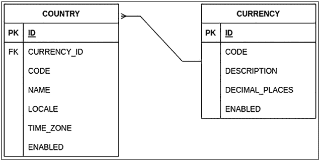

第 4 章 持久化与领域模型

下面描述了实体之间的关系类型。

• **@ManyToOne** 是最常见的关系类型，其中多个实体引用同一个实体；例如，在目录应用中，多个国家可能使用同一种货币。Spring Data 使用一个表中的外键来与另一个表进行连接；例如，国家表使用 currency_id 来与货币表中的 id 列进行连接。

另一种替代方案是 **@OneToMany**，当你试图建立双向关系时使用，但在你的表中，这两种类型实际上是相同的。要建立双向关系，两个实体都需要拥有一个指向另一个实体的属性，其中一个使用 @ManyToOne，另一个使用 @OneToMany。例如，在目录应用中，存在多个 @ManyToOne 关系。让我们来建立 Country 和 Currency 实体之间的连接。

在 Country 实体中，有一个带有 @ManyToOne 注解的 Currency 属性；而在 Currency 中，你可以添加一个带有 @OneToMany 注解的 Country 属性。这就是生成双向关系的方式。一对多关系的示例见图 4-2。

***图 4-2.** 目录应用的两个表*

• **@OneToOne** 不是最常见的关系类型。一个表拥有一个与另一个表主键关联的外键，且无法引用多行。这种类型的一个问题在于，当你创建双向关系时，两个实体都使用非空值来引用对方。这可能会引发异常，因为一个实体需要另一个实体在数据库中存在，反之亦然，这就像死锁一样。为了解决这个问题，其中一个实体需要允许空值。

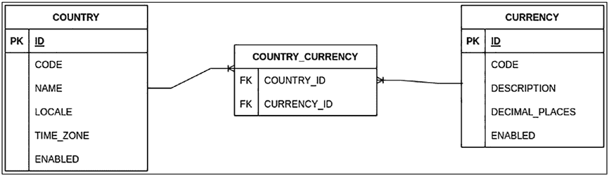

第 4 章 持久化与领域模型


因此，你有一种方法来持久化一个实体，然后使用它来将引用放入另一个实体中。

• **@ManyToMany** 是最复杂的关系之一。如果你之前使用过数据库，你就会知道这种关系意味着创建一个包含两个表主键的中间表。在 JPA 世界中，这三个表变成了两个实体，而 JPA 的具体实现负责理解查询方式，并隐藏或抽象其在数据库中的实现细节。

例如，让我们将 Country 和 Currency 之间的关系转换为多对多关系，这样一个国家可以有多种货币，一种货币也可以与多个国家关联。数据库的结构类似于图 4-3，但在你的目录应用程序中，只有两个实体：Country 和 Currency。

***图 4-3.** 将关系转换为多对多关系的假设情况*

在所有类型的关系中，你都可以指明是否接受空值，这表示数据库中的列是否可以有一个值。当你在关系中指明此信息时，它会影响 Hibernate 为获取信息而生成的查询。例如，在一个 **@ManyToOne** 关系中，如果你允许空值，查询会使用 **LEFT JOIN** 代替，而相反的情况则使用 **INNER JOIN**。如果你在注解中未指明任何内容，则该列接受空值。

**注意** 在某些情况下，实体之间的关系与数据库中的表数量并不直接相关；例如，如果你在两个实体之间建立了多对多关系，它可能会转化为三个表。这种“奇怪”的情况有一个简单的解释：JPA 及大多数实现向开发者隐藏了数据库结构的细节。

在前几章中，你运行了用于填充数据库的脚本，表之间的关系是存在的，但并未在实体中进行映射。现在是时候映射实体关系了，因此让我们移除 Country 中的 @Transient 注解，并包含 **@ManyToOne** 注解，这是一对多关系的一种变体（参见代码清单 4-9）。

***代码清单 4-9.** 两个实体之间关系的定义*

```java
import jakarta.persistence.Column;
import jakarta.persistence.Entity;
import jakarta.persistence.FetchType;
import jakarta.persistence.JoinColumn;
import jakarta.persistence.ManyToOne;
import jakarta.persistence.Table;

@Entity
@Table(name= "country")
public class Country {

    @ManyToOne
    @JoinColumn(name = "currency_id", nullable = false)
    private Currency currency;

    // 所有属性的属性、构造器、setter 和 getter 方法
    // 重写 hashcode 和 equals 方法
}
```

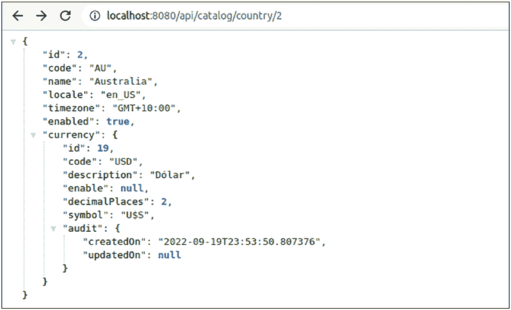

定义 Country 表中作为外键的列名非常重要，以指示 Spring Data 如何匹配表。

让我们运行应用程序，并使用特定的 ID 调用 country 端点。如果你还没有创建所有与 Currency 实体逻辑相同的类来访问信息，那么现在是时候创建了。检查一切是否正常工作的最佳方法是调用端点并检查响应，如图 4-4 所示。

***图 4-4.** 调用 country 端点的结果*

**懒加载与急加载**

图 4-4 显示，当你添加两个或多个实体之间的关系时，端点响应会提供所有信息，而这些信息并非在所有情况下都是必需的。

想象一下，在将信息发送到数据库之前，你想检查一个国家是否存在。因此，你调用一个方法，该方法接收代码并返回这些国家。


特定代码。你无需检查任何与货币关系相关的内容，

因此有必要将货币信息加载到内存中。

JPA 提供了一种机制，可以在你需要之前减少内存中的数据量。

实现方法是在表示两个实体之间关系的注解中添加一个属性 **fetch**。该属性有两个可能的值。

• **FetchType.LAZY** 指示 JPA 实现，在有人调用属性的 get 方法之前，无需获取关系的信息。在幕后，本例中的 Hibernate 会在表示该关系的属性中插入一个代理，该代理知道需要执行哪些查询来获取信息。这种方法在应用程序中占用更少的内存，并能让你更快地加载信息；另一方面，如果你总是需要获取关系的信息，执行操作的成本会增加，耗时也更长。

• **FetchType.EAGER** 指示 JPA 实现，在执行查询时必须获取所有其他实体的信息。使用这种方法，你可以减少初始化时间，因为当你在内存中拥有一个实体时，你就拥有了所有信息；另一方面，查询执行可能会花费更多时间，并对应用程序的性能产生负面影响。

这两种方法在性能方面各有利弊。标准做法是使用所有关系都设为 `FetchType.LAZY` 的方式，以提高应用程序性能，并显式地获取其他实体的信息。

让我们修改 Country 实体，以指示与货币的关系在执行查询时不需要加载所有信息（参见清单 4-10）。

第 4 章 持久化与领域模型

***清单 4-10.*** 加载信息的定义

import jakarta.persistence.Column;

import jakarta.persistence.Entity;

import jakarta.persistence.FetchType;

import jakarta.persistence.JoinColumn;

import jakarta.persistence.ManyToOne;

import jakarta.persistence.Table;

@Entity

@Table(name= "country")

public class Country implements Serializable {

@ManyToOne(fetch = FetchType.LAZY)

@JoinColumn(name = "currency_id", nullable = false)

private Currency currency;

// 所有属性的属性、构造方法、setter 和 getter 方法

*// 重写 hashcode 和 equals 方法*

}

在幕后，根据从 Country 实体获取数据的策略，你会看到一条或两条查询，如表 4-7 所示。

第 4 章 持久化与领域模型

***表 4-7.** 按策略执行的数据库查询*

**FetchType.LAZY**

**FetchType.EAGER**

hibernate: select country0_.id as id1_0_0_, country0_.

hibernate: select country0_.id

code as code2_0_0_, country0_.currency_id as

as id1_0_0_, country0_.code as

currency7_0_0_, country0_.enabled as enabled3_0_0_, code2_0_0_, country0_.currency_id

country0_.locale as locale4_0_0_, country0_.name as

as currency7_0_0_, country0_.enabled

name5_0_0_, country0_.time_zone as time_zon6_0_0_ as enabled3_0_0_, country0_.locale

from country country0_ where country0_.id=?

as locale4_0_0_, country0_.name as

hibernate: select currency0_.id as id1_1_0_, currency0_. name5_0_0_, country0_.time_zone

code as code2_1_0_, currency0_.decimal_places

as time_zon6_0_0_, currency1_.

as decimal_3_1_0_, currency0_.description as

id as id1_1_1_, currency1_.code as

descript4_1_0_, currency0_.enabled as enabled5_1_0_ code2_1_1_, currency1_.decimal_

from currency currency0_ where currency0_.id=?

places as decimal_3_1_1_, currency1_.

description as descript4_1_1_,

currency1_.enabled as enabled5_1_1_

from country country0_ left outer join

currency currency1_ on country0_.

currency_id=currency1_.id where

country0_.id=?

ObjectMapper 使用 GET 方法将值从一个对象复制到另一个对象。

因此，JPA 认为有人需要关于懒加载关系的信息，并获取该信息。


因此，当你调用国家端点时，会获取所有货币信息，因为 MapStruct 未配置为在映射期间忽略某些属性。

**排序**

当你有两个或更多关联实体，且其中一个实体包含另一个实体的元素列表时，JPA 或 Hibernate 执行查询时不会考虑顺序。你有两个选择：在应用程序中对元素进行排序，或者将排序责任委托给数据库。

让我们修改目录应用程序，在国家（country）和州（state）之间建立双向关系，以便更详细地了解情况并学习如何解决（参见清单 4-11）。Country 实体添加了一个类型为 State 的 List 属性。

第 4 章 持久化与领域模型

***清单 4-11.*** 添加双向关系

@Entity

@Table(name= "country")

public class Country implements Serializable {

@OneToMany(fetch = FetchType.LAZY)

@JoinColumn(name = "country_id", nullable = false, updatable = false,

insertable = false)

private List<State> states;

// 所有属性的属性、构造器、setter 和 getter

*// 重写 hashcode 和 equals*

}

**注意** 在 **@JoinColumn** 注解中，属性 **updatable** 和 **insertable** 设置为 false，表明修改关联实体并非该实体的职责。

下一步需要修改 State 实体，使其包含 **updatable** 和 **insertable** 属性，并对 DTO 进行相同处理（参见清单 4-12）。

***清单 4-12.*** 添加双向关系

@Entity

@Table(name= "state")

public class State implements Serializable {

@ManyToOne(fetch = FetchType.LAZY)

@JoinColumn(name = "country_id", nullable = false, updatable = false,

insertable = false)

private Country country;

// 所有属性的属性、构造器、setter 和 getter

*// 重写 hashcode 和 equals*

}

第 4 章 持久化与领域模型

当你使用 MapStruct 并自动执行时，从一个对象到另一个对象的映射器会调用所有 get 方法，因此 Spring Data 会假定你需要所有懒加载集合的信息。这种双向关系的主要问题在于会产生无限循环，因此你需要在 State 实体中排除 country 字段。为了解决这个问题，你必须修改 ApiMapper 类并创建一个自定义映射器（参见清单 4-13）。

***清单 4-13.*** 自定义 Country 实体的映射器

import com.apress.catalog.dto.CountryDTO;

import com.apress.catalog.dto.CurrencyDTO;

import com.apress.catalog.dto.StateDTO;

import com.apress.catalog.model.Country;

import com.apress.catalog.model.Currency;

import com.apress.catalog.model.State;

import org.mapstruct.Mapper;

import org.mapstruct.Mapping;

import org.mapstruct.factory.Mappers;

@Mapper(componentModel = "spring")

public interface ApiMapper {

ApiMapper INSTANCE = Mappers.getMapper( ApiMapper.class );

CurrencyDTO entityToDTO(Currency currency);

Currency DTOToEntity(CurrencyDTO currency);

CountryDTO entityToDTO(Country country);

Country DTOToEntity(CountryDTO country);

@Mapping(target="country", ignore = true) //排除 country 元素以防止递归映射

StateDTO stateToStateDTO(State state);

State stateDTOToState(StateDTO state);

}

现在运行应用程序并请求端点以获取某个国家的所有信息。当你获取端点响应时，所有州的顺序与数据库中按 ID 排序的顺序相同（参见图 4-5）。

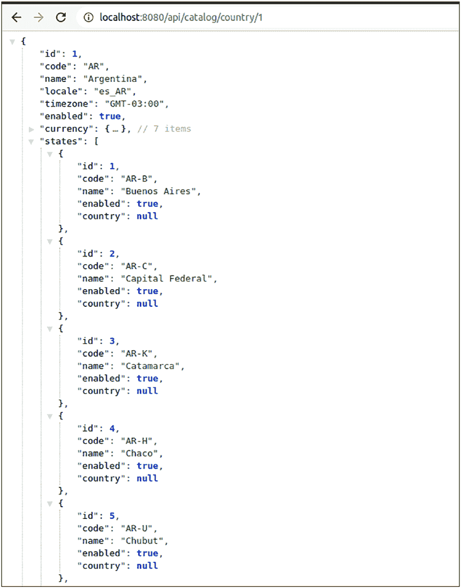

第 4 章 持久化与领域模型

***图 4-5.** 未对州进行排序时调用国家端点的结果。*

第 4 章 持久化与领域模型

为了向 JPA 指示州列表需要按条件排序，请添加带有列名的 **@OrderBy** 注解（参见清单 4-14）。

***清单 4-14.*** 针对特定列的实体排序

@Entity


@Table(name= "country")

public class Country implements Serializable {

@OneToMany(fetch = FetchType.LAZY)

@JoinColumn(name = "country_id", nullable = false, updatable = false,

insertable = false)

@OrderBy(value = "id")

private List<State> states;

// 所有属性的属性、构造方法、setter 和 getter

*// 重写 hashcode 和 equals*

}

在实体中进行此修改后，当你获取状态列表时，Spring Data 会执行一个查询，并根据你在属性值中指定的列名进行排序。

Hibernate: select states0_.country_id as country_5_2_0_, states0_.id as

id1_2_0_, states0_.id as id1_2_1_, states0_.code as code2_2_1_, states0_.

country_id as country_5_2_1_, states0_.enabled as enabled3_2_1_, states0_.

name as name4_2_1_ from state states0_ where states0_.country_id=? **order by**

states0_.code

最后，重新运行应用程序，并发出与图 4-5 相同的请求。如图 4-6 所示，所有状态都按代码排序显示。

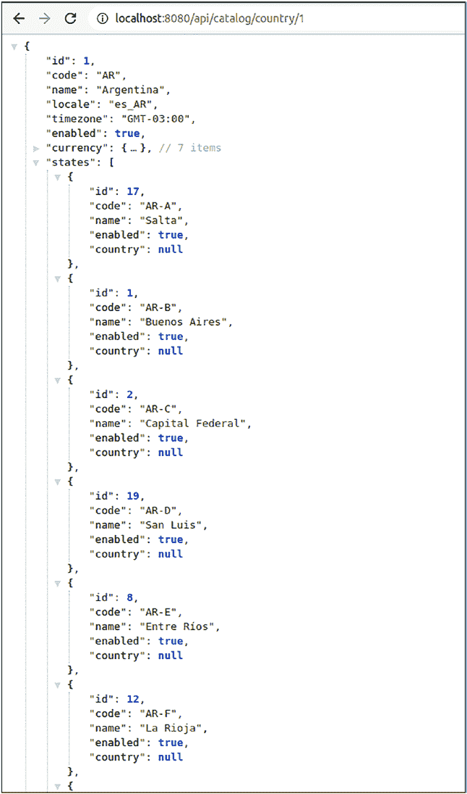

第 4 章 持久化与领域模型

***图 4-6.** 调用带有状态排序的国家/地区端点后的结果* 119

第 4 章 持久化与领域模型

最后，这种排序方式始终按同一方向进行，因此，如果你需要不同的条件来对状态进行排序，最佳解决方案是在仓库中定义一个自定义查询，该查询将排序类型作为参数接收。

**继承类型**

与许多面向对象语言一样，Java 提供了使用继承来减少重复代码和扩展其他类功能的可能性。JPA 并未忽视这一特性，并提供了多种可能性来降低 Java 代码中应用程序领域的复杂性。在底层数据库中，其复杂性与不使用继承时可能相同。

让我们回到目录应用程序，看看一个常见问题。所有实体都有一个 ID 属性，且生成值的策略相同，因此，在多个地方重复此元素并非好事。为了减少重复代码，我们创建一个包含 ID 属性及其生成值注解的基类（参见清单 4-15）。

***清单 4-15.*** 用于减少重复代码的基类实体

@MappedSuperclass

public **abstract** class Base implements Serializable {

@Id

@GeneratedValue(strategy = GenerationType.SEQUENCE)

private Long id;

public Base(){}

public Base(Long id) {

this.id = id;

}

public Long getId() {

return id;

}

第 4 章 持久化与领域模型

public void setId(Long id) {

this.id = id;

}

}

清单 4-15 展示了 **@MappedSuperclass** 注解，它表明该类不是一个最终的实体，因此它在数据库中并不存在。相反，该类是继承它的另一个类的一部分。下一步是修改 Currency 实体，移除 Id 属性，并使其继承新的 Base 类（参见清单 4-16）。

***清单 4-16.*** 继承新基类的 Currency 实体

@Entity

@Table(name= "currency")

public class Currency extends Base implements Serializable {

// 所有属性的属性、构造方法、setter 和 getter

*// 重写 hashcode 和 equals*

}

如果在所有修改之后运行应用程序，一切照旧，因为你只是修改了实体中数据库表的表示方式，仅此而已。

这是一种继承机制，但还有许多其他机制。

**映射超类**

上一节中将 ID 移动到超类的示例被称为映射超类。抽象类（映射超类的一个必要条件）的所有属性，对于 Spring Data 而言，本身并不被视为一个实体。该类的所有属性


抽象类是通过继承关系成为其他实体的一部分。但在数据库中，你会在同一个表中看到所有列，如图 4-7 所示。

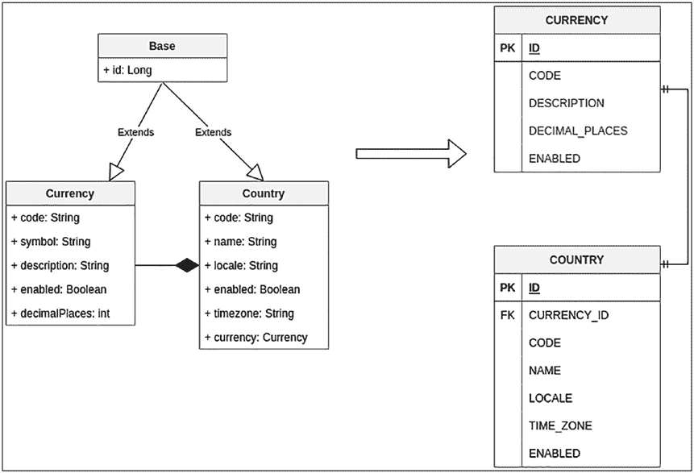

第 4 章 持久化与领域模型

***图 4-7.** 将实体迁移至使用映射超类的策略*

考虑一个假设场景：你想要更改具体类某个属性的名称，而不改动其他任何内容。JPA 提供了覆盖抽象类特定属性并指定新值的可能性；例如，让我们将 Currency 实体中 ID 的名称更改为其他值。

```java
@Entity
@Table(name= "currency")
@AttributeOverride(
    name = "id",
    column = @Column(name = "currency_id", nullable = false))
// 这意味着你将 id 的名称覆盖为另一个值
public class Currency extends Base implements Serializable {
    // 所有属性的属性、构造器、setter 和 getter
    // 重写 hashCode 和 equals
}
```

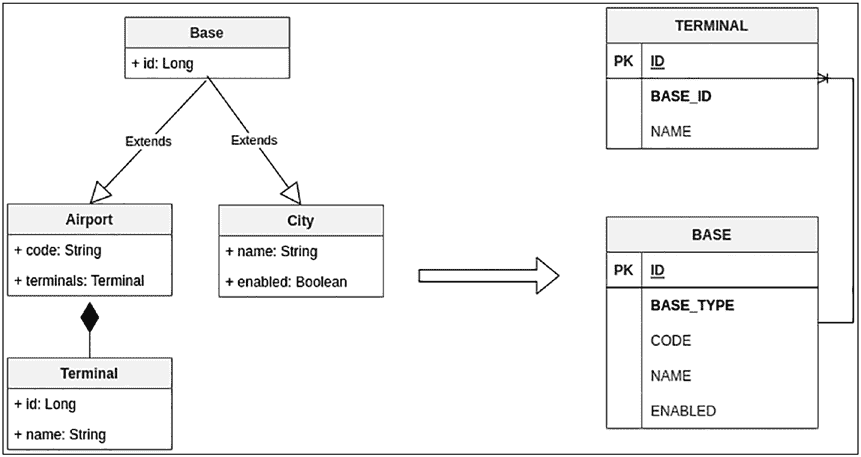

第 4 章 持久化与领域模型

当你有多个类具有某些共同点，但需要对某个特定类设置例外时，此功能极为有用。

**每个类层次结构一张表**

这种方法将整个类层次结构表示在单个表中。此策略的另一个名称是**单表**。如果你没有使用 **@Inheritance** 注解显式指定任何内容，JPA 会默认使用此策略。

每个类层次结构一张表意味着你需要在数据库表中添加一个额外的列，该列不会出现在你的实体中，因为 JPA 需要据此来区分某一行数据属于哪个类。

让我们对目录应用程序进行一些修改，以表示这种特定情况。图 4-8 中出现了一组新的实体，表示你可以拥有不直接相连的城市和机场。这两个实体都继承自 Base 类，而 Base 类不再具有 **@MappedSuperclass** 注解。

***图 4-8.** 具有单表关系的新实体*

这里只有两个表，因为城市和机场属于同一个类，而 BASE_TYPE 列充当鉴别器，用于确定数据库中的一行数据代表哪种实体类型。请记住，在不同表中，code 和 name 属性是唯一的。

第 4 章 持久化与领域模型

```java
@Entity
@Inheritance(strategy = InheritanceType.SINGLE_TABLE)
@DiscriminatorColumn(name = "BASE_TYPE")
public abstract class Base implements Serializable {
    @Id
    @GeneratedValue(strategy = GenerationType.SEQUENCE)
    private Long id;
    // 所有属性的属性、构造器、setter 和 getter
    // 重写 hashCode 和 equals
}
```

现在你唯一需要修改的是 City 和 Airport 实体，为它们添加 **@DiscriminatorValue** 注解，并指定数据库中用于标识应用程序中实体的值。

```java
@Entity
@Table(name= "airport")
@DiscriminatorValue("AIR")
public class Airport extends Base implements Serializable {
    @OneToMany(fetch = FetchType.LAZY)
    @JoinColumn(name = "AIRPORT_ID")
    private List<Terminal> terminals;
    // 所有属性的属性、构造器、setter 和 getter
    // 重写 hashCode 和 equals
}
```

城市代码的写法大致相同，但具有不同的 **@DiscriminatorValue** 注解和属性，其逻辑与本章所有示例中出现的逻辑相同。唯一在目录应用程序中之前不存在的是 Terminal 类，它与 Airport 实体存在关联关系。

第 4 章 持久化与领域模型

```java
@Entity
@Table(name= "terminal")
public class Terminal implements Serializable {
    @ManyToOne(fetch = FetchType.LAZY, optional = false)
    @JoinColumn(name = "AIRPORT_ID")
    private Airport airport;
    // 所有属性的属性、构造器、setter 和 getter
    // 重写 hashCode 和 equals
}
```


**注意**：这些修改仅作为示例，展示如果你希望采用这种继承策略时实体应如何呈现。本书使用了 `@MappedSuperclass` 注解。

采用这种策略存在一些缺点；例如，你会得到多行数据，其中某些行只有部分列包含信息，而其他列则为空值，因此从某种程度上说，你失去了所有关于非空值的约束。另一个问题与信息的规范化有关，由于存在大量属性，这可能会影响查询性能。你需要自行判断哪些属性适合建立索引，哪些不适合。

从长期来看，这种策略会在稳定性、性能和可维护性方面引入问题，因此不建议使用，至少在新系统中不应采用。

**每个子类对应一张表（Table per Subclass）**

这种策略是“每个类层次结构对应一张表”策略的替代方案，旨在解决将所有信息集中在一张表中、导致大量行出现空值列的问题。为了解决前一种策略的问题，该策略会为层次结构中的每个具体类生成一张表。你可以直接通过 Spring Data 提供的仓库访问任何实体。

沿用之前为你的目录应用引入修改以模拟假设场景的示例，让我们对之前的场景稍作变动，以便为每个类生成一张表。

图 4-9 展示了在这种关系类型下，表与类之间的关联。

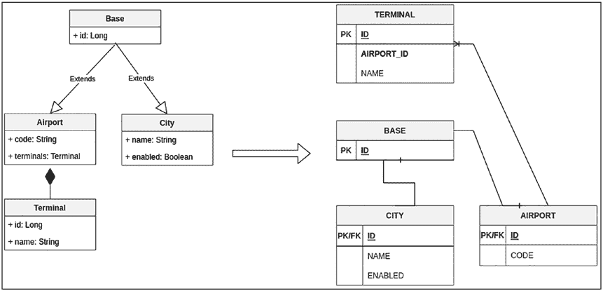

第 4 章 持久化与领域模型

***图 4-9.** 每个子类对应一张表的新实体*

目录模型中存在的实体类数量与类的数量相同，其中 City 和 Airport 的 ID 值与 Base 表的主键值相同。要访问信息，需要在两张表之间进行连接。例如，如果你想访问某个特定城市的信息，你可以像往常一样创建一个仓库，但在后台，它会向 Base 表发起请求，并与 City 表进行连接。

让我们修改 Base 类，仅更改继承策略，其他保持不变。

这两种策略（前一种和当前这种）的一个好处是，它们在 JPA 模型中的表示方式相同，因此你只需要更改数据库脚本即可。

**@Entity**

**@Inheritance(strategy = InheritanceType.JOINED)**

public abstract class Base implements Serializable {

    @Id

    @GeneratedValue(strategy = GenerationType.SEQUENCE)

    private Long id;

    // 所有属性的属性、构造器、setter 和 getter 方法

    *// 重写 hashcode 和 equals 方法*

}

第 4 章 持久化与领域模型

下一步是修改 Airport 类，使用 `@PrimaryKeyJoinColumn` 注解添加用于表间连接的属性。该注解并非必需，因为 JPA 会推断两张表使用相同的 ID，但如果你打算使用 `@AttributeOverride` 注解，则必须声明列名。

@Entity

@Table(name= "airport")

**@PrimaryKeyJoinColumn(name = "ID")**

public class Airport extends Base implements Serializable {

    @OneToMany(fetch = FetchType.LAZY)

    @JoinColumn(name = "AIRPORT_ID")

    private List<Terminal> terminals;

    // 所有属性的属性、构造器、setter 和 getter 方法

    *// 重写 hashcode 和 equals 方法*

}

这种方法的优点在于，你必须对数据库进行规范化，减少包含空值的列的数量，从而允许使用 NOT NULL 验证。

缺点在于，你必须通过表间连接才能获取所有信息，如果记录数量很多，这可能会带来很大麻烦。此外，当你在这种类型的表中插入或更新行时，也会出现这个问题，因为每次操作都会执行两条语句。这种策略的另一个问题是，需要手动编写仓库查询，因为它们更加复杂。

**每个类对应一张表（Table per Class）**

前一种策略的一个问题在于，你需要进行连接才能获取信息。


所有信息；在“每类一表”策略中，主实体与继承类之间存在信息重复。你可以访问两个实体的信息（本例中为 Base 或 Airport/City），而无需在表之间进行连接。这是一种无需在实体中做太多改动的方法。在顶层类中使用 **@Inheritance** 注解，并设置值为 **InheritanceType.TABLE_PER_CLASS**。继承类无需包含任何内容，只需继承自 Base 类即可。

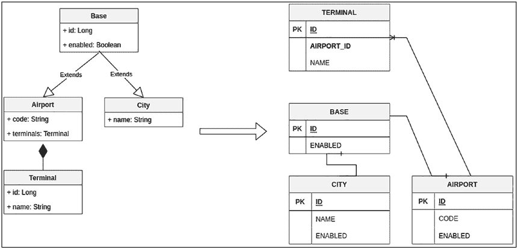

第 4 章 持久化与领域模型

沿用前面的示例，我们通过将“enabled”列移至 Base 类来进行修改，以便更清晰地了解数据库和目录应用程序（见图 4-10） 中的情况。

***图 4-10.** 使用“每类一表”的新实体*

City 和 Airport 表在所有实体中都具有相同的属性——ID 和 ENABLED。你将信息保存在 Base 表中，其中一个表继承自它。这降低了复杂性。在类中，修改很简单。你只需在 Base 类中编写继承策略的类型即可，无需其他操作。

@Entity
@Inheritance(strategy = InheritanceType.TABLE_PER_CLASS)
public abstract class Base {
    @Id
    @GeneratedValue(strategy = GenerationType.SEQUENCE)
    private Long id;
    // 所有属性的属性、构造方法、setter 和 getter
    *// 重写 hashcode 和 equals*
}

第 4 章 持久化与领域模型

在具体类中，你无需包含任何内容。只需移除你在其他策略中使用的所有先前注解即可。

@Entity
@Table(name= "airport")
public class Airport extends Base {
    @OneToMany(fetch = FetchType.LAZY)
    @JoinColumn(name = "AIRPORT_ID")
    private List<Terminal> terminals;
    // 所有属性的属性、构造方法、setter 和 getter
    *// 重写 hashcode 和 equals*
}

通过这种方法，你可以为每个表创建一个仓库，并访问每个实体中你想要的特定信息。

这种策略的缺点之一是，不同表中存在大量重复信息。在执行读取操作（如 select）时，你可以减少获取所有信息所需的查询或连接次数。另一方面，执行写入操作（如 INSERT、DELETE 或 UPDATE）意味着你需要修改两个表以保持数据库的一致性。所有这些考虑都是有效的。你可以直接访问实体的仓库。

**可嵌入类**

之前所有的继承方式都意味着一个类继承自另一个类，以减少重复代码并以更易于理解的方式对系统进行建模。可嵌入类改变了这种范式，因为你可以将一个类包含在另一个类中，就像属性一样，但在数据库中它作为同一张表的一部分出现。

让我们通过修改目录应用程序来实际探索这种方法，以获得类似于图 4-11 的结果。

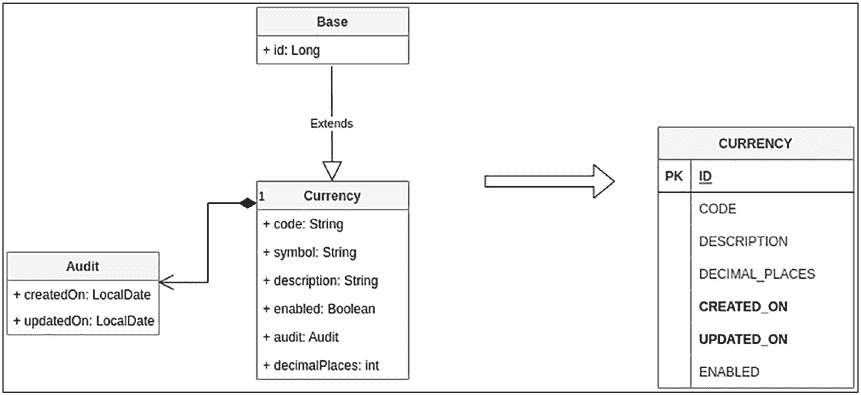

第 4 章 持久化与领域模型

***图 4-11.** 在 Currency 实体中包含一个可嵌入类*

首先要做的是创建一个新类，其中包含两个属性，用于审计数据库中何时创建新行以及何时发生修改。该类需要包含 @Embeddable 注解，这意味着它本身不是一个实体，因为它通过组合方式存在于另一个类内部。清单 4-17 展示了用于审计不同实体的类，你可以将其嵌入到其他类中。

***清单 4-17.*** 包含用于审计变更属性的可嵌入类

@Embeddable
public class Audit implements Serializable {
    @Column(name = "created_on", nullable = false)
    private LocalDateTime createdOn;
    @Column(name = "updated_on", nullable = true) // 需要可为空


因为该属性首次出现时没有值，只有在修改后才会被赋值。

private LocalDateTime updatedOn;

// 所有属性的属性、构造方法、setter 和 getter 方法

*// 重写 hashcode 和 equals 方法*

}

第 4 章 持久化与领域模型

现在你已经有了一个可被多个其他实体包含的类，下一步是修改 Currency 实体，使用@Embedded 注解嵌入 Audit 类（参见清单 4-18）。

***清单 4-18.*** 在 Currency 实体中修改以包含可嵌入类

@Entity

@Table(name = "currency")

public class Currency extends Base implements Serializable {

@Embedded

private Audit audit;

// 所有属性的属性、构造方法、setter 和 getter 方法

*// 重写 hashcode 和 equals 方法*

}

在重新运行应用程序之前，你需要引入两项修改。其一是执行数据库文件夹中名为“**V2.0__audit_tables(run on chapter 4).sql**”的脚本，该脚本包含对数据库的修改，以考虑这些新字段。另一项修改意味着在与 DTO 相同的包中创建一个 AuditDTO 类，该类包含与 Audit 类相同的属性。

**注意** audit 类的属性需要被填充。你需要修改 CurrencyService 的 update 和 save 方法以赋值。下一节将解释如何自动完成此操作。

之后，如果你重新运行应用程序，将会看到类似于图 4-12 的结果，该结果通过调用 http://localhost:8080/api/catalog/currency/1 获得。

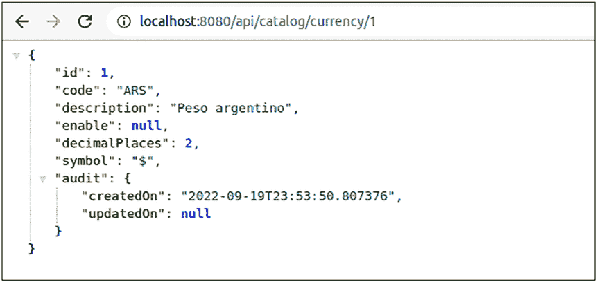

第 4 章 持久化与领域模型

***图 4-12.** 重新运行应用程序并发送请求后的结果*

这种方法提供了一种无需使用继承即可重用类（包括多个实体）的方式。在应用程序内部，你会将这些类视为组合关系，因此你可以以不同的方式拆分或展示模型。

**监听与审计事件**

在上一节中，你为实体添加了属性以审计数据库中的行。但你需要手动设置这些属性的值，这不是最佳方法，并且意味着你需要在所有服务中重复相同的逻辑。

JPA 提供了一组与事件相关的注解，用于检查实体生命周期中发生的情况，并引入日志或修改。让我们看看表 4-8 中可用的部分注解及其具体用途。

第 4 章 持久化与领域模型

***表 4-8.** 生命周期中的可用事件*

**事件**

**描述**

*@jakarta.persistence.PrePersist 和 @jakarta.persistence.*

该事件在实体持久化之后或之前调用

*PostPersist*

*@jakarta.persistence.PreUpdate 和 @jakarta.persistence.* 该事件在实体更新之后或之前调用 *PostUpdate*

*@ jakarta.persistence.PreRemove 和 @jakarta.*

该事件在实体移除之后或之前调用

*persistence.PostRemove*

*@ jakarta.persistence.PostLoad*

该事件在实体成功加载之后调用

**注意** 在一个方法上使用一个或多个注解没有限制，因此你可以为**@PrePersist**和**@PreRemove**设置相同的行为。此外，你可以将所有持久化生命周期的逻辑外部化到一个类中，并使用**@EntityListeners(MyAuditListener.class)**注解该类。

在目录应用程序中，你需要在向数据库发送插入操作之前为**createdOn**赋值，因此让我们将 Audit 属性从 Currency 实体移动到 Base 类，以便所有继承自 Base 的类都具有相同的行为。接下来，创建两个方法：一个使用当前日期为**createOn**赋值，另一个为**updatedOn**赋值。你可以在清单 4-19 中看到所有这些修改。

***清单 4-19.*** 在 Base 类中修改以填充字段

@MappedSuperclass

public abstract class Base {

@Embedded


private Audit audit;

// 所有属性的属性、构造方法、setter 和 getter 方法

*// 重写 hashCode 和 equals 方法*

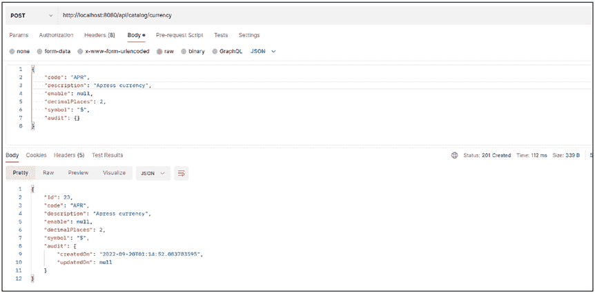

第 4 章 持久化与领域模型

@PrePersist

public void fillCreatedOn() {

audit.setCreatedOn(LocalDateTime. *now*());

}

@PreUpdate

public void fillUpdatedOn() {

audit.setUpdatedOn(LocalDateTime. *now*());

}

}

在 Base 类中，每个方法都带有注解。每个注解都有特定用途，并会拦截持久化生命周期以执行相应操作。让我们检查一切是否正常，重新运行应用程序，并通过向 http://localhost:8080/api/catalog/currency 发送 POST 请求，在 Currency 实体中插入新行，如图 4-13 所示。

***图 4-13.** 在 Currency 实体中执行 POST 请求的结果*

这种监听 JPA 生命周期事件的方法是标准做法。在 Spring Data 中，另一个注解也能实现类似功能，但其核心理念是审计“何时”以及“由谁”进行了修改。你只需在主类中包含 **@EnableJpaAuditing** 注解，并在需要审计的类中使用 **@EntityListeners(AuditingEntityListener.class)** 添加监听器，其使用方式与 JPA 的通用方法大致相同。表 4-9 列出了你可以在应用程序中使用的所有可用事件。

第 4 章 持久化与领域模型

***表 4-9.** Spring Data 生命周期中的可用事件*

**事件**

**描述**

*@CreatedDate 和*

这些注解等同于 *@PreUpdate*、*@PrePersist*

*@LastModifiedDate*

*@CreatedBy 和*

这些注解负责在实体中执行修改。在大多数情况下，这些注解用于字符串

*@LastModifiedBy*

类型的属性。

获取修改责任人的方式与你应用程序中使用的机制无关。Spring Data 与 Spring Security 配合良好，可用于获取此信息。

**验证模式**

当你尝试将一个实体的信息持久化到数据库时，需要确保所有字段的值都是有效的。如果发送了错误的值或空的属性，数据库会因查询无效而抛出异常。这种情况意味着数据会在网络中传输，最终产生与你进行应用层验证相同的结果。像 AWS 和 GCP 这样的云提供商会根据网络传输的数据量收费，因此，如果你能减少直接发往数据库的请求数量，就能降低成本。

为了解决这个问题，Java 引入了 JSR380 规范 2，它提供了一组注解，涵盖了最相关的验证，例如检查某个值是否为空、是否为空字符串或是否具有特定大小。该规范仅声明了接口。多年来，唯一的实现是 Hibernate Validator3。但从 Spring Boot 2 开始，Spring Validator4 成为了一个替代选项。

**注意** 一个好的实践是在第一层（即使用 Spring Boot 作为控制器的微服务层）使用验证，但这并非唯一选择。如果你有相应的实现，也可以在服务层或仓库层等其他层使用验证。

2 [`beanvalidation.org/3.0/`](https://beanvalidation.org/3.0/)

3 [`hibernate.org/validator/`](https://hibernate.org/validator/)

4 [`docs.spring.io/spring-framework/docs/current/javadoc-api/org/`](https://docs.spring.io/spring-framework/docs/current/javadoc-api/org/springframework/validation/Validator.html)

[springframework/validation/Validator.html](https://docs.spring.io/spring-framework/docs/current/javadoc-api/org/springframework/validation/Validator.html)

第 4 章 持久化与领域模型

让我们修改 catalog 应用程序，添加用于验证 Currency 实体字段的依赖项。

***清单 4-20.** 用于验证字段的依赖项*

<dependency>


<groupId>org.springframework.boot</groupId>

<artifactId>spring-boot-starter-validation</artifactId>

</dependency>

下一步是引入实体校验，以覆盖所有可能在数据库中产生异常的潜在场景。因此，我们将其添加到 Currency 实体中。

***清单 4-21.*** 带校验功能的 Currency 实体

import jakarta.persistence.*;

import jakarta.validation.constraints.Max;

import jakarta.validation.constraints.Min;

import jakarta.validation.constraints.NotBlank;

import jakarta.validation.constraints.NotNull;

import java.io.Serializable;

import java.util.Objects;

@Entity

@Table(name = "currency")

public class Currency extends Base implements Serializable {

@Id

@GeneratedValue(strategy = GenerationType. *SEQUENCE*)

private Long id;

**@NotBlank(message = "Code is mandatory")**

@Column(name = "code", nullable = false, length = 4)

private String code;

**@NotBlank(message = "Symbol is mandatory")**

@Column(name = "symbol", nullable = false, length = 4)

private String symbol;

第 4 章 持久化与领域模型

**@NotBlank(message = "Description is mandatory")**

@Column(name = "description", nullable = false, length = 30)

private String description;

**@NotNull(message = "The state of the currency is mandatory")**

@Column(name = "enabled", nullable = false)

private Boolean enabled = Boolean. *TRUE*;

**@Min(value = 1, message = "The minimum value is 1")**

**@Max(value = 5, message = "The maximum value is 5")**

@Column(name = "decimal_places")

private int decimalPlaces;

// 所有属性的属性、构造方法、setter 和 getter 方法

*// 重写 hashcode 和 equals 方法*

}

该注解包含一条消息，当你检查是否存在问题时就会看到它。消息是用英文编写的，但你可以自定义。这种方法涉及大量修改，超出了本书的讨论范围。表 4-10 展示了用于验证字段值的各种注解。

***表 4-10.** 用于验证属性的注解*

**名称**

**描述**

@notBlank

验证字符串不为 null 且不包含空白字符

@notnull

检查属性是否不为 null

@min

检查数值是否大于或等于指定值

@max

检查数值是否小于或等于指定值

@asserttrue

验证属性的值是否为 true

@past 和 @pastorpresent

验证日期是否为过去日期（包括或不包括当前日期）

@Future 和 @Futureorpresent

验证日期是否为未来日期（包括或不包括当前日期）

@positive 和 @positiveorZero

验证数值是否为正数（包括或不包括零）

@negative 和 @negativeorZero 验证数值是否为负数（包括或不包括零） 137

第 4 章 持久化与领域模型

在实体中定义规则后，下一步是在持久化实体并抛出异常之前，在服务中调用验证器。

***清单 4-22.*** 修改后的 CurrencyService，用于验证实体

@Service

public class CurrrencyService {

CurrencyRepository repository; Validator validator;

@Autowired

public CurrrencyService(CurrencyRepository repository, Validator

validator) {

this.repository = repository; this.validator = validator;

}

public CurrencyDTO save(CurrencyDTO currency) {

return saveInformation(currency);

}

public CurrencyDTO update(CurrencyDTO currency) {

return saveInformation(currency);

}

private CurrencyDTO saveInformation(CurrencyDTO currency) {

Currency entity = ApiMapper.INSTANCE.DTOToEntity(currency);

Set<ConstraintViolation<Currency>> violations = validator.

validate(entity);

if(!violations.isEmpty()) {

throw new ConstraintViolationException(violations);

}

Currency savedEntity = repository.save(entity);

return ApiMapper.INSTANCE.entityToDTO(savedEntity);

}

}

第 4 章 持久化与领域模型

如果你不进行其他任何操作，那么当你请求端点来持久化货币信息时，堆栈跟踪就会出现。让我们创建一些类来获得更好的响应。首先，创建返回错误信息的 DTO。


***清单 4-23.*** 包含问题详情的 DTO

public class ViolationDTO {

private String field;

private String message;

public ViolationDTO(String field, String message) {

this.field = field;

this.message = message;

}

// 所有属性的属性、构造方法、setter 和 getter 方法

}

之后，创建一个包含错误列表的 DTO，因为某些属性不符合规则。

***清单 4-24.*** 包含问题列表的 DTO

public class ValidationErrorDTO {

private List<ViolationDTO> violations;

public ValidationErrorDTO() {

violations = new ArrayList<>();

}

// 所有属性的属性、构造方法、setter 和 getter 方法

}

下一步是创建一个类，用于捕获应用程序中出现的所有异常，并根据抛出的异常类型执行相应操作。该类会监听应用程序中出现的所有异常。你需要为每个异常创建特定的行为，否则应用程序只会抛出异常。

第 4 章 持久化与领域模型

***清单 4-25.*** 声明用于捕获应用程序异常的处理器

@ControllerAdvice

public class ErrorHandlingControllerAdvice {

@ExceptionHandler(ConstraintViolationException.class)

@ResponseStatus(HttpStatus.BAD_REQUEST)

@ResponseBody

ValidationErrorDTO onConstraintValidationException(

ConstraintViolationException e) {

ValidationErrorDTO error = new ValidationErrorDTO();

for (ConstraintViolation violation : e.getConstraintViolations()) {

error.getViolations().add(

new ViolationDTO(violation.getPropertyPath().toString(),

violation.getMessage()));

}

return error;

}

}

最后，重新运行应用程序，并使用空请求体调用创建新货币的端点，观察结果。如果一切正常，你将看到类似图 4-14 的结果。

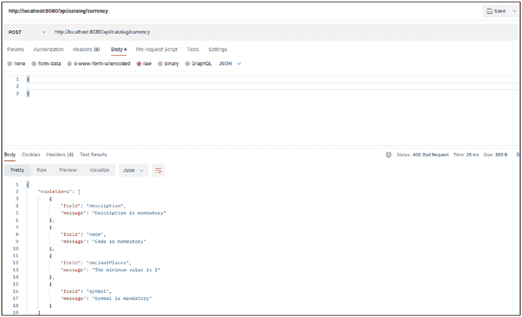

第 4 章 持久化与领域模型

***图 4-14.** 使用空请求体调用货币端点的结果*

为你的实体引入验证，降低以错误格式将信息发送到数据库的风险，这种错误格式可能在执行操作时引发异常。这些异常可能与属性的大小、是否接受 null 值以及其他可验证的内容有关。

**总结**

本章概述了如何创建相互交互的实体结构，以使用策略（如急加载或懒加载）来表示数据库，具体取决于你的业务需求。你还学习了层次化策略及其优缺点。

本章还介绍了在实体中进行验证，以防止将信息发送到数据库时产生异常。你可以在接收请求的第一层（在进入访问数据库的层之前）进行验证。

**第 5 章**

**事务管理**

正如你在本书前几章中所见，你可以执行简单查询来获取信息。然而，在其他情况下，情况可能更复杂，涉及在同一数据库中更新/插入/删除多个表。

关系数据库的一个重要特性是能够提供一种机制，在发生意外时确保安全性且不影响信息质量。这些术语被称为*一致性*和*完整性*。

你可能认为这并非极其重要，但想象一下，你想将钱从银行账户转账给某人。如果没有一种机制来保证错误不会影响你的账户，你可能会损失金钱。

图 5-1 展示了未回滚银行账户状态的问题。

© Andres Sacco 2023

A. Sacco, *Beginning Spring Data*[, https://doi.org/10.1007/978-1-4842-8764-4_5](https://doi.org/10.1007/978-1-4842-8764-4_5#DOI)

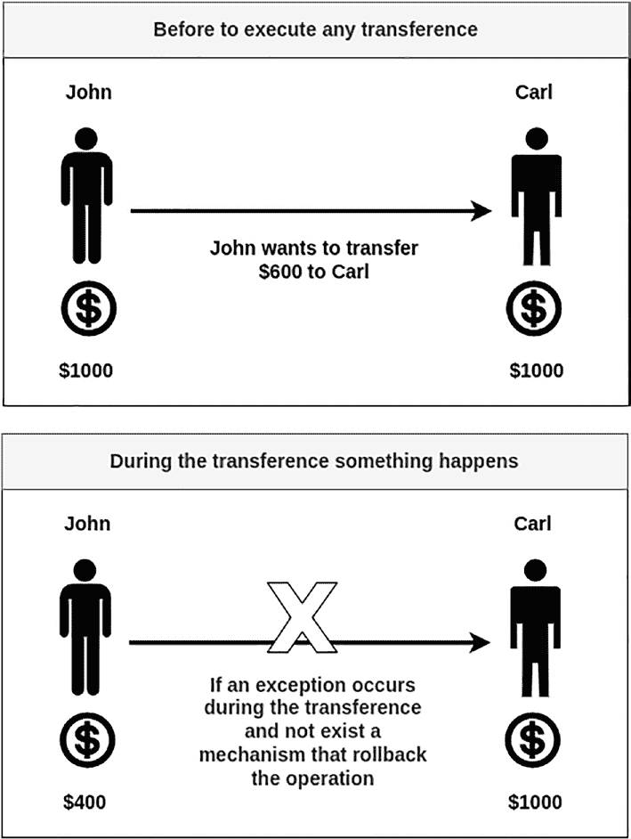

第 5 章 事务管理

***图 5-1.** 未回滚银行账户状态*

另一个问题可能是修改操作的并发性。


一个或多个表中的信息。沿用之前银行账户的例子，如果你与你的男/女朋友共享账户，并且双方同时想要提取一笔超过账户可用余额的金额，会发生什么？

第 5 章 事务管理

这些问题在数据库中是通过事务来解决的。本章讨论涉及事务的基本概念，以及如何将这些概念应用到 Spring Data 中。

**什么是事务？**

关于事务的含义有多种定义。在本书中，事务是一组为了满足特定标准而需要执行的读写操作集合，以确保要么所有操作都执行，要么一个都不执行。

1981 年，吉姆·格雷在其论文《事务的概念：优点与局限》¹中，首次定义了关于事务的大部分概念。这篇论文启发了 1986 年定义的某些 SQL 标准，并影响了后续演进的 SQL 版本。该论文还提到了与事务相关的其他概念，如原子性、一致性和持久性，这些将在下一节讨论。

数据库中的事务以 `BEGIN_TRANSACTION` 关键字开始，并且需要使用 `COMMIT` 关键字来指示所有操作成功结束。然后，数据库接受此指令，并确保受影响的行进入新状态。另一方面，当操作失败时，你需要调用 `ROLLBACK` 关键字，指示数据库需要回滚到所有操作执行之前的状态。图 5-2 展示了事务处理过程。

¹ [`jimgray.azurewebsites.net/papers/thetransactionconcept.pdf`](http://jimgray.azurewebsites.net/papers/thetransactionconcept.pdf)

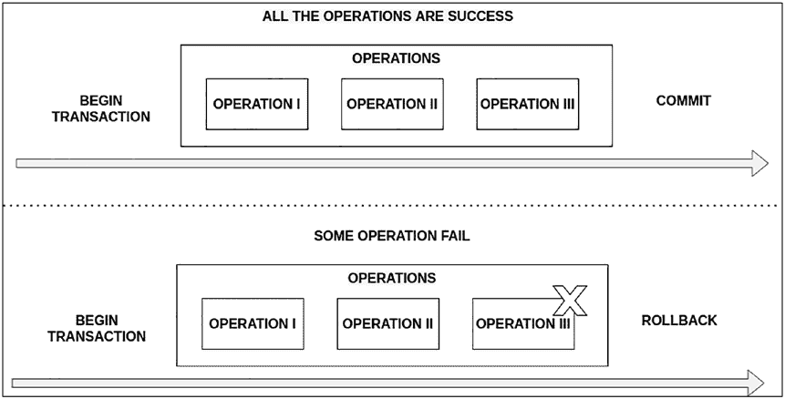

第 5 章 事务管理

***图 5-2.** 事务处理过程*

在将事务概念引入 Spring Data 领域之前，让我们先回顾一些事务主题，以理解其工作原理。

**什么是 ACID？**

ACID 是一个缩写词，指代四个概念：原子性、一致性、隔离性和持久性。这些概念适用于关系型数据库中的所有事务，并且必须被实现以保护信息；让我们看看它们各自的含义。

• **原子性** 是创建一个包含一个或多个操作的单一工作单元。每个操作都必须成功完成，事务才能正常结束。如果其中一个操作失败，则所有操作都必须回滚，以使数据库恢复到之前的状态。

• **一致性** 意味着你需要将数据库从一个有效状态转移到另一个有效状态。每个数据库都有完整性规则，用于在执行插入/更新/删除操作时检查一切是否正常；这些规则会检查列类型、长度和是否可为空是否正确。此外，规则还涵盖诸如与其他表的约束，以及某个表的某列是否需要具有唯一值等内容。

第 5 章 事务管理

**注意** 并非所有数据库都以相同的方式声明列或生成主键，因此验证表结构和查询非常重要。

为了减少在任何操作（插入/更新/删除）期间产生错误的可能性，你可以包含上一章中看到的验证注解，以防止向数据库发送会导致异常的数据。

• **隔离性** 指的是两个或多个操作可能同时尝试修改相同信息的情况。数据库需要保证，只有当事务的所有操作都成功完成后，该信息才对其他人可见。每个数据库都必须提供一种机制来解决或缓解此问题。存在一种锁定机制来解决数据库中的并发问题，这将在本章后面讨论。

• **持久性** 确保所有事务都已完成


成功执行，并将数据库状态更新为新状态

该操作必须是持久性的，并允许你获取之前修改过的相同信息。在某些情况下，修改不会影响到数据库，例如当你使用一个仅可读的数据库副本时。

**注意**：解释关系型数据库的每个概念不在本书的讨论范围内。本节将概述与事务相关的概念，旨在让你掌握基本知识，从而理解在使用 Spring Data 时后台发生的情况。

**隔离问题**

有一组与隔离相关的常见问题会影响同时执行的事务。有时，你会丢失更新或读取数据库中未确认的信息。让我们简要概述每个问题。

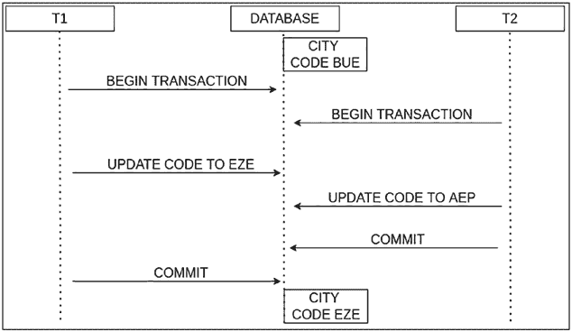

第 5 章 事务管理

• **丢失更新**：假设两个同时进行的事务试图修改表中同一行数据，该行包含目录 API 中某个特定城市的代码。数据库中最后提交的事务获胜，但可能并非正确的那一个。图 5-3 展示了两个同时进行事务时的问题。

***图 5-3.** 两个同时进行的事务*

• **脏读**发生在两个或多个事务同时获取或使用数据库中的信息，而另一个事务的更改尚未提交时。因此，这些事务使用了可能不存在的信息。例如，假设你更新了目录中国家/地区的一个属性，以使用另一个事务中插入的特定货币。如果插入新货币的事务失败，你的数据库将出现不一致，因为大多数国家/地区将拥有一种不存在的货币。如果在事务提交或回滚之前有人选择了一个国家/地区，他们可能会使用不正确的信息。图 5-4 展示了与脏读相关的问题。

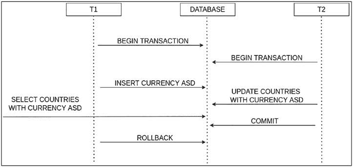

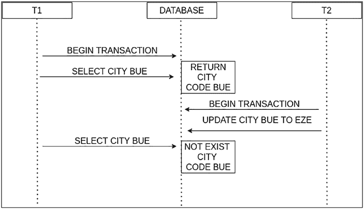

第 5 章 事务管理

***图 5-4.** 与脏读相关的问题*

• **不可重复读**发生在一个事务获取了某些信息，但再次尝试获取相同信息时，另一个事务修改了该信息。图 5-5 展示了与不可重复读相关的问题。

***图 5-5.** 与不可重复读相关的问题*

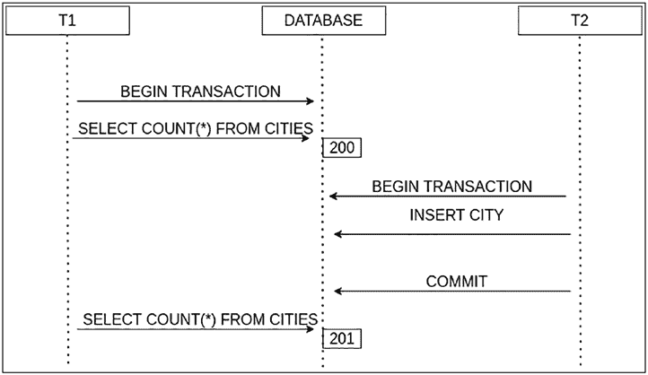

第 5 章 事务管理

• **幻读**发生在一个表中执行两次或多次操作时，第二次获得的值与之前不同，因为另一个事务提交了所有更改。图 5-6 展示了与幻读相关的问题。

***图 5-6.** 与幻读相关的问题*

所有这些问题的出现，都取决于你在应用程序中使用的策略，无论是在 Spring Data 还是其他与数据库交互的框架中；例如，如果你决定在应用程序中使用 Spring Data JDBC，那么大多数这些问题都会出现，你需要决定如何缓解它们。

**隔离级别**

隔离级别指的是同时发生的其他事务的可见性。但解决这个问题并非只有一种方法。有四种隔离级别会影响你能看到的信息。

• **可串行化**发生在一个事务需要等待另一个事务启动后完成时。数据库需要提供一种机制来实现此解决方案，例如，阻塞整个表直到事务完成。这种方法意味着数据库性能会下降。


第 5 章 事务管理

• **可重复读**允许你在一个事务运行时启动多个事务，因此可能会出现幻读。

• **读已提交**允许你访问信息。但存在一个


写入事务中的锁定机制需要阻塞其他试图访问特定行的事务，但不会影响那些仅希望读取信息的事务。

• **读未提交** 是限制最严格的级别之一，因为如果一个事务尚未完成并提交所有更改，另一个事务可能无法写入特定行。这种限制类型不会影响读取操作。

表 5-1 展示了所有隔离级别及其可能出现的潜在问题，其中绿色箭头表示可能出现的问题。

***表 5-1.** 隔离级别及相关问题*

**-**

**级别/问题**

**丢失更新**

**脏读**

**不可重复读**

**幻读**

**可串行化**

**可重复读**

**读已提交**

**读未提交**

没有完美的方法可以解决隔离问题。每种解决方案都有其权衡，你需要牺牲某些方面以获得更好的性能或提高所使用信息的质量。

较高的隔离级别要求数据库阻塞其他可能同时影响相同信息的事务。较低的级别允许用户查找可能未提交的信息，因此你可能会看到某些可能导致异常并回滚的内容。

第 5 章 事务管理

**锁定类型**

锁定是解决与隔离相关的问题的一种方法。当你的应用程序有大量并发操作时，这种方法极为有用。

有两种锁定机制。

• **悲观锁**：这种锁定级别最为常见，因为你假设多个事务之间可能发生问题。你需要创建或使用一种机制，在数据库中指示锁定行或表。这种方法保证了一个事务有机会更新该行，因为你锁定了行/表/数据库，但这种方法的主要问题是事务执行时会出现瓶颈，耗时较长。

• **乐观锁**：这种机制不会在数据库中进行锁定，因为它使用另一种方式来控制更改。每一行都有一个包含行版本号的数字列，因此当需要对某行执行操作时，会检查该列的版本号。每个需要修改该行的操作都会递增版本号，一个事务有机会执行该操作，并且你拥有一种机制来检测应用程序中某行的信息是否为最新版本。

你可以使用另一种类型的列来表示版本，例如时间戳，但这并非好主意，因为该类型的精度取决于数据库。

**这些概念在 Spring Data 中如何工作？**

上一节中出现的所有概念都可以使用 Spring 注解轻松实现，这些注解涵盖了大多数相关场景。

**@Transactional** 是一个重要的注解，可用于方法、类或接口，它会创建一个代理类，负责创建事务并提交/回滚事务内的所有操作。此注解直接与 Spring TX（`org.springframework.transaction.annotation.Transactional`）关联，这与 JEE 不同。该注解仅适用于公有方法，因为这是 Spring 框架代理类的约束条件，因此如果你将注解放在私有/受保护的 Spring 框架方法上，它们会被忽略，而不会在控制台或 IDE 中显示任何错误。

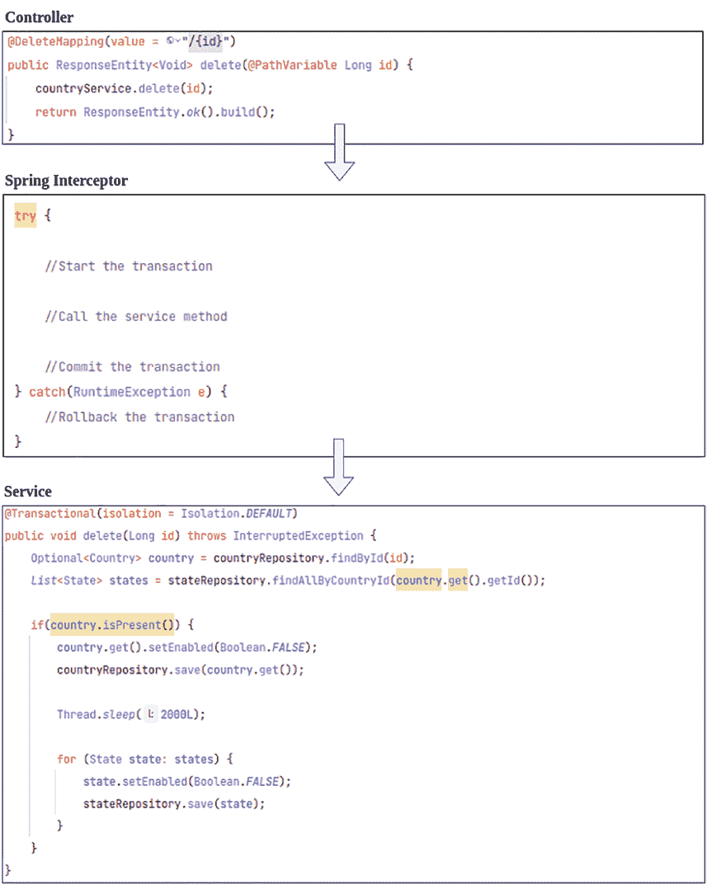

第 5 章 事务管理

图 5-7 展示了事务如何与 Spring 拦截器（Spring Framework 的一部分）协同工作。

***图 5-7.** 事务与 Spring 拦截器协同工作*

第 5 章 事务管理

当你在应用程序中使用 Spring Boot 和 Spring Data 时，无需执行任何额外操作；只需使用 **@Transactional** 注解即可，但如果你未使用 Spring


Boot 中，你需要通过创建遵循 **PlatformTransactionManager**2 w 层次结构的 Bean，并使用 **@EnableTransactionManagement** 注解来启用事务管理器。

**注意**，拦截器仅捕获 `RuntimeException` 及其类层次结构并执行回滚。但是，你可以使用 `rollbackFor` 或 `rollbackForClassName` 属性覆盖默认行为，以便对特定异常执行回滚。如果你不希望回滚，则可以使用 `noRollbackFor` 和 `noRollbackForClassName` 等属性。另一个可能出现的问题是在方法中包含捕获 `RuntimeException` 但不再次抛出的 `try/catch` 块。此时拦截器不会执行任何操作。

清单 5-1 修改了 CountryService 的 DELETE 方法，加入了注解并禁用了与一个国家关联的所有州。

***清单 5-1.*** 一个事务示例

@Service

public class CountryService {

**@Transactional(readOnly = false)**

public void delete(Long id) throws InterruptedException

{ Optional<Country> country = countryRepository.findById(id);

List<State> states = stateRepository.findAllByCountryId(country.

get().getId());

if(country.isPresent()) {

country.get().setEnabled(Boolean.FALSE);

countryRepository.save(country.get());

Thread.sleep(2000L); // 用于模拟不同场景

2 [`docs.spring.io/spring-framework/docs/current/javadoc-api/org/`](https://docs.spring.io/spring-framework/docs/current/javadoc-api/org/springframework/transaction/PlatformTransactionManager.html)

[springframework/transaction/PlatformTransactionManager.html](https://docs.spring.io/spring-framework/docs/current/javadoc-api/org/springframework/transaction/PlatformTransactionManager.html)

第 5 章 事务管理

for (State state: states) {

state.setEnabled(Boolean.FALSE);

stateRepository.save(state);

}

}

}

}

默认情况下，每个使用 `@Transactional` 注解的方法每次只能执行一个事务，以防止你在上一节中读到的任何问题。下一节将解释如何将此行为更改为其他行为。

现在，如果你引入所有更改，并尝试通过 `http://localhost:8080/api/catalog/country/1` 同时多次调用 DELETE 方法，你会看到第一个事务或调用执行了所有修改，而第二个事务则等待开始。这是因为默认隔离级别一次只允许一个事务。

**事务属性**

清单 5-2 列出了你可以使用 **@Transactional** 注解指示的内容。

***清单 5-2.*** 只读属性示例

**@Transactional(readOnly = true)**

public CountryDTO getById(Long id) {

// 方法的所有逻辑

}

如果事务是只读的，框架和数据库会对此类操作引入优化。错误使用此属性的主要问题出现在将其用于在数据库中执行写入修改的方法时。修改不会被持久化，并且会丢失。

你可以使用 **rollbackFor** 或 **rollbackForClassName** 属性（指定异常名称），指示当方法或类内部发生特定异常时，某个事务必须回滚。或者，你可以使用 `noRollbackFor` 或 `noRollbackForClassName` 属性执行相反的操作（参见清单 5-3）。

第 5 章 事务管理

***清单 5-3.*** 回滚示例

**@Transactional(readOnly = true, rollbackFor = { SQLException.class })**

public CountryDTO getById(Long id) {

// 方法的所有逻辑

}

你可以指示在此特定方法/类中要使用的隔离级别，该级别可能与应用程序的其他部分不同（参见清单 5-4）。注解中的隔离级别与本章“隔离级别”部分中的相同。


`Isolation`枚举的值包括 **ISOLATION_DEFAULT**、**ISOLATION_READ_UNCOMMITTED**、**ISOLATION_READ_COMMITTED**、**ISOLATION_REPEATABLE_READ** 和 **ISOLATION_SERIALIZABLE**。默认隔离级别为 **ISOLATION_DEFAULT**，此时将使用数据库自身的默认值。

***清单 5-4.*** 更改隔离级别的示例

**@Transactional(readOnly = true, isolation = Isolation.SERIALIZABLE)**

public CountryDTO getById(Long id) {

// 方法的所有逻辑

}

在 Spring 4.1 之前的版本中，不支持 3 隔离级别。

在普通事务中，有一个没有对应功能的特点是可以设置超时时间以完成整个操作（参见清单 5-5）。如果事务未在超时时间内完成，Spring 会自动执行回滚。默认值为 –1，表示事务可能耗时较长。

***清单 5-5.*** 设置超时的示例

**@Transactional(readOnly = true, timeout = 1000) // 超时时间以毫秒为单位**

public CountryDTO getById(Long id) {

// 方法的所有逻辑

}

3 [`github.com/spring-projects/spring-framework/issues/9687`](https://github.com/spring-projects/spring-framework/issues/9687)

第 5 章 事务管理

另一个与数据库事务世界没有直接关联或非常常见的属性是，当一个事务性方法/类调用另一个方法时，第二个方法将在哪个事务中执行（参见清单 5-6）。

***清单 5-6.*** 设置传播级别的示例

**@Transactional(readOnly = true, propagation = Propagation.MANDATORY)**

public CountryDTO getById(Long id) {

// 方法的所有逻辑

}

在 **org.springframework.transaction.annotation** 包中有一个枚举 **Propagation**，它包含以下值。

• **REQUIRED** 表示方法或类使用同一个事务，并且不会创建新事务。但如果第一个方法不是事务性的，Spring 会创建一个新事务。此值是 Spring 框架采用的默认值。

• **SUPPORTS** 表示如果存在正在进行的事务，则两个方法使用同一个事务；但如果不存在，则不会创建事务。

• **MANDATORY** 与 SUPPORTS 类似，但如果不存在正在进行的事务，则会抛出 **NoTransactionException** 异常。

• **REQUIRES_NEW** 表示当存在正在进行的事务时，会暂停该事务并启动一个新事务；但如果不存在正在进行的事务，则会创建一个新事务。

• **NOT_SUPPORTED** 是前一种情况的变体，因为如果存在正在进行的事务，它会暂停该事务，并且所有事务性方法都在无事务状态下执行。

• **NEVER** 表示如果使用此属性的方法运行时存在正在进行的事务，则会抛出 **IllegalTransactionStateException** 异常。

• **NESTED** 是最复杂的情况之一，因为它意味着创建一个新的子事务来执行所有代码。如果发生异常，所有内容都会回滚到调用该方法之前的状态。

第 5 章 事务管理

你可以修改前面的示例来检查每个特定属性，但在不同情况下并没有通用的魔法规则。在大多数情况下，你必须分析修改每个属性自定义值以使用其他值所带来的权衡。

**事务模板**

在 Spring 中，还有另一种声明事务的方式，无需使用包含上一节所有属性的 **@Transactional**。这种替代方法允许你设置与某个事务相关的所有属性，并在一个代码块中执行它们。你可以像使用 Spring 中的其他模板一样，使用 `TransactionTemplate` 来实现。清单 5-7 将清单 5-1 转换为使用 `TransactionTemplate`。

***清单 5-7.*** 转换清单 5-1

***@Service***

public class CountryService {


private final TransactionTemplate transactionTemplate;

@Autowired

public CountryService(PlatformTransactionManager transactionManager,

CountryRepository countryRepository, StateRepository stateRepository,

Validator validator) {

this.transactionTemplate = new TransactionTemplate(transactionManager);

transactionTemplate.setReadOnly(false);

transactionTemplate.setTimeout(1000);

//设置事务的其他属性和其他属性

}

public void delete(Long id) throws InterruptedException {

Optional<Country> country = countryRepository.findById(id);

List<State> states = stateRepository.findAllByCountryId(country.

get().getId());

this.transactionTemplate.execute(new

TransactionCallbackWithoutResult() {

第 5 章 事务管理

public void doInTransactionWithoutResult(TransactionStatus

status) {

try {

if(country.isPresent()) {

country.get().setEnabled(Boolean.FALSE);

countryRepository.save(country.get());

Thread.sleep(2000L);

for (State state: states) {

state.setEnabled(Boolean.FALSE);

stateRepository.save(state);

}

}

} catch(NoSuchElementException | InterruptedException ex) {

status.setRollbackOnly();

}

}

});

}

}

你可以在方法中只将一段代码包裹在事务中，而不是整个方法，这样作为开发者，你可以控制哪些部分需要包含在事务中。

这种方法的主要问题是难以维护，并且会重复多个代码块。

**乐观锁**

在 Spring Data 中，默认的锁类型是悲观锁，因此你无需做任何操作。你只需要添加机制来解决与隔离相关的冲突或问题。

另一种方法是使用乐观锁，这意味着在你希望使用这种锁类型的每个实体中添加一个带有 `@**Version**` 注解的额外属性，而无需做其他任何事情。让我们用新属性和 setter/getter 方法修改 Base 类（参见清单 5-8）。

第 5 章 事务管理

***清单 5-8.*** Version 属性示例

@MappedSuperclass

public abstract class Base {

//其他属性

@Version

private Long version;

//其他 setter 和 getter 方法

public Long getVersion() {

return version;

}

public void setVersion(Long version) {

this.version = version;

}

}

你需要在数据库中包含用于创建新列的 alter table 语句，该列负责存储行的版本号（参见清单 5-9）。

***清单 5-9.*** 数据库中的 Alter Table 语句

ALTER TABLE currency ADD COLUMN version int NOT NULL DEFAULT 0;

ALTER TABLE country ADD COLUMN version int NOT NULL DEFAULT 0;

ALTER TABLE state ADD COLUMN version int NOT NULL DEFAULT 0;

ALTER TABLE city ADD COLUMN version int NOT NULL DEFAULT 0;

此外，你需要在所有 DTO 中包含 version 属性，且无需任何类型的注解，这样当你执行 GET 方法时，会接收到 version 属性，你需要在所有涉及数据库修改的操作中发送该属性。另一种方法是不暴露 version，而是在微服务内部使用该属性。

第 5 章 事务管理

之后，你可以在更新之前调用 currency 的 GET 方法来获取数据库中的信息（参见清单 5-10）。

***清单 5-10.*** GET 端点的请求/响应

**请求**

GET localhost:8090/api/catalog/currency/1

**响应**

{

"id": 1,

"code": "ARS",

"description": "Peso argentino",

"enable": null,

"decimalPlaces": 2,

"symbol": "$",

"audit": {

"createdOn": "2022-05-01T23:19:52.219215",

"updatedOn": null

},

"version": 0

}

如果你在不更改 version 属性的情况下多次对同一主体执行 PUT 方法，则会抛出一个异常，说明另一个事务已更新了数据库中的信息。你的最后一次请求使用的是旧版本的数据（参见清单 5-11）。

***清单 5-11.*** PUT 端点的请求/响应

**请求**


PUT localhost:8090/api/catalog/currency/1

**响应**

{

"timestamp": "2022-06-23T03:02:16.390+00:00",

"status": 500,

"error": "Internal Server Error",

第 5 章 事务管理

"trace": "org.springframework.orm.

ObjectOptimisticLockingFailureException: Object of class [com.apress.

catalog.model.Currency] with identifier [1]: optimistic locking failed;

nested exception is org.hibernate.StaleObjectStateException: Row was

updated or deleted by another transaction (or unsaved-value mapping was

incorrect)"

}

请记住，一种方法是在端点中暴露“version”属性，但当异常发生时，良好的实践是将消息转换为更易于人类阅读的形式。

**总结**

本章讨论了在应用程序中使用事务的好处。但根据传播方式和隔离级别的不同，你可能会遇到相关问题。你必须根据业务需求为应用程序选择最佳方案。在某些情况下，脏读问题并不严重，但在其他上下文中则可能构成错误。

**第 6 章**

**版本控制或迁移**

**变更**

每个开发者在职业生涯中至少会遇到一次的主要问题之一，就是对数据库进行修改。数据库的变更总会带来问题，例如谁负责执行脚本，或者在不同环境中脚本保存在哪里——因为有些开发者会通过电子邮件或文件将脚本发送给数据库管理员来执行。一个常见的问题是，在部署需要这些变更的应用程序之前，如何确保所有数据库变更都已执行完毕？在大多数情况下，这意味着需要有人手动检查一切是否正常。另一个可能的问题是，当出现问题时如何回滚数据库的变更。如果你发现代码有误或存在问题，可以通过手动回滚来撤销变更，即在数据库中执行一个新脚本，但这种解决方案可能会引入更多故障。

本章将讨论一些工具和策略，以降低因变更引入问题的风险，并介绍如何将这些工具与 Spring Data 集成来执行变更。

你还将学习如何实现功能开关，以降低在生产环境中部署可能失败的内容的风险，从而避免需要重新部署应用程序并撤销变更。

**数据库中的版本控制变更**

你已经简要了解了关系型数据库中与表结构或列变更相关的常见问题。大多数与变更相关的问题都可以通过多种方法缓解；例如，如果需要向表中添加新列，可以先允许空值，检查一切正常后再将其转换为非空列。如果变更简单且可以逐步执行，这类解决方案是可行的。但想象一下，如果变更涉及整个表结构的改动，或者需要添加与现有表存在约束关系的新表，这些场景就不那么容易引入变更了，因为某些环节可能会失败。最后，在应用程序的生命周期中，跟踪数据库模式的变更也很困难。如果没有变更记录，你就无法知道哪些变更影响了应用程序的性能。

现在，数据库中的版本控制变更试图解决前文提到的大多数问题，它将数据库所经历的所有变更以可重现的方式共享出来，使任何人都能在任何环境中复现。其他好处包括创建脚本来引入变更以加载信息或修改数据库结构；当有人想在本地运行整个应用程序时，这一好处尤为实用。


从图 6-1 中，你可以看到对数据库变更进行版本控制的过程。

***图 6-1.** 在数据库中执行变更的过程*

在幕后，后续章节讨论的大多数工具都采用相同的方式：

在文件夹中存放一定数量的脚本，这些脚本具有唯一标识的名称结构。因此，当你执行命令进行新变更的迁移时，工具会读取每个脚本，并检查这些变更是否已在数据库中应用。为了检查脚本是否已执行，大多数工具会创建一个或多个表，其中包含与先前执行相关的所有信息，包括脚本名称以及其他对工具有用的相关信息。凭借这些信息，工具可以了解

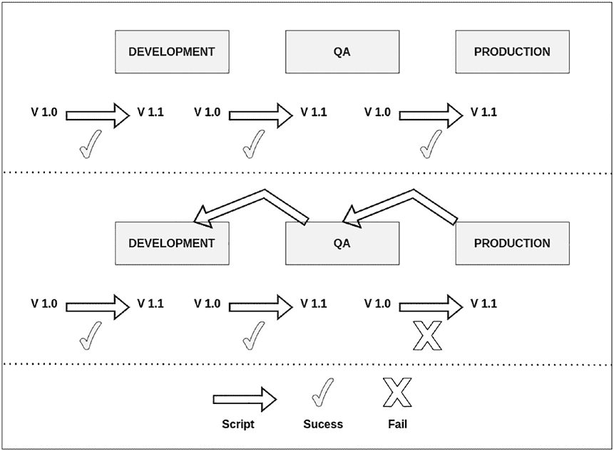

第 6 章 变更的版本控制或迁移

数据库的实际状态，并能回滚到先前有效的状态。所谓有效状态，是指某个脚本中的所有变更都已执行完毕。这种方法类似于事务操作，因为工具必须时刻保持数据库的一致性。

关于如何保持数据库变更一致性的方法示例，如图 6-2 所示。

***图 6-2.** 在不同环境中执行变更的过程*

以下是使用这类工具时需要考虑的事项。

•   所有代表迁移的脚本都需要用 SQL 编写，因为其理念是自动化数据库变更的过程。在某些情况下，开发人员会在本地环境中通过手动修改来测试，因此学习一种新的元语言来执行此操作并非好主意。

第 6 章 变更的版本控制或迁移

•   如果你在列的长度或类型上犯了错误，并且已经在你的环境中执行了变更，那么请创建一个新的脚本来解决问题。切勿在脚本执行后对其进行修改，因为根据你使用的工具不同，这可能会导致异常。有些工具会使用校验和来判断已执行的文件是否相同或发生了更改；其他工具则会忽略这些更改，因为它们不会再次运行相同的脚本。

•   为你的脚本名称定义一个易于理解的格式，例如 `V1.0__create_database.sql`。

•   生成一个包含所有相关变更的迁移文件，并尽量不要将变更拆分到多个文件中。

**实现版本控制的库**

大多数库与你应用程序中使用的语言无关，因为它们提供了一个命令行界面，你可以通过它执行操作，例如引入修改或执行回滚。如果你想在 Spring Boot 应用程序之外使用它，一个好的做法是使用包含所有变更的卷的 Docker 镜像来运行；这种方法是一个不错的选择，因为你可以确保工具配置正确，并且不会遇到与你的机器相关的任何问题。

对于变更的版本控制，并没有一种通用的方法，但大多数方法都建议你将所有脚本纳入一个 Git 仓库中，这样你不仅可以追踪数据库的变更，还可以追踪文件的变更。当你将脚本保存到应用程序的同一仓库中时，就实现了变更的版本控制，并且如果你遵循微服务的原则（即一个应用程序只访问一个数据库模式），这些脚本就能表明哪个应用程序是信息的拥有者。

在生态系统中，有多种选择，例如 Liquibase、1 Flyway2 以及其他一些本书未涵盖的工具，因为它们的用户较少，并且与各种语言或框架集成的文档也不够详尽。

1 [`www.liquibase.org/`](https://www.liquibase.org/)

2 [`flywaydb.org/`](https://flywaydb.org/)

第 6 章 变更的版本控制或迁移

**Flyway**


Flyway3 是众多实现变更版本控制的库之一，它提供了在多种操作系统（如 Windows、macOS 和 Linux）中以命令行方式运行的能力。此外，你也可以通过 Maven/Gradle 将其集成到你的 Java 应用程序中。

**注意**：该工具仅适用于 Java 8 及以上版本，但未提及对 Java 14 及以上版本的支持。不过，在官方仓库中，存在与 Java 17 相关的错误，因此请检查该库的最新版本，因为它有可能解决一些已报告的问题。

该工具提供两种版本：社区版和团队版。两者之间的主要区别在于所提供的功能数量；例如，团队版提供以下功能：

•   一种撤销数据库中变更的机制（你可以指定撤销一定数量脚本的顺序。）
•   一种在实际执行数据库变更前模拟变更，以检查脚本是否一切正常的方法
•   大量的回调或钩子
•   将脚本存储在 AWS 或 GCP 中的可能性

该工具提供了一套默认的命名结构来识别操作类型，但你可以自定义该模式。文件名必须包含四个部分：第一部分表示操作类型，第二部分指明版本号，第三部分简要描述文件，第四部分是后缀（大多数情况下为 `.sql`）。你可以在图 6-3 中看到该工具的文件名结构。

3 [`flywaydb.org/`](https://flywaydb.org/)

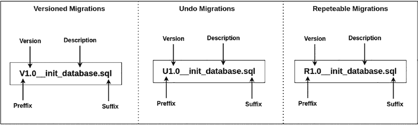

第 6 章 版本控制或迁移变更

***图 6-3.** 操作命名结构*

后缀可以是 `.sql`，但你也可以在继承自 **BaseJavaMigration**.4 的 Java 类中编写语句。在这两种情况下，Flyway 都会生成一个名为 **flyway_schema_history** 的表，其中包含所有已执行脚本的信息。你可以将这个表想象成 Git 仓库的历史记录。

**注意**：在本书的源代码中，与数据库结构相关的文件都遵循此命名模式，因为你将其包含在微服务目录的代码中。

./

├── chapter 1

├── chapter 2

├── chapter X

├── databases

│ ├── docker

│ │ ├── cassandra

│ │ │ └── docker-compose.yml

│ │ ├── mongodb

│ │ │ └── docker-compose.yml

│ │ ├── neo4j

│ │ │ └── docker-compose.yml

│ │ ├── postgres

4 [`flywaydb.org/documentation/usage/api/javadoc/org/flywaydb/core/api/`](https://flywaydb.org/documentation/usage/api/javadoc/org/flywaydb/core/api/migration/BaseJavaMigration)

[migration/BaseJavaMigration](https://flywaydb.org/documentation/usage/api/javadoc/org/flywaydb/core/api/migration/BaseJavaMigration)

第 6 章 版本控制或迁移变更

│ │ │ └── docker-compose.yml

│ │ └── redis

│ │ ├── replication

│ │ │ └── docker-compose.yml

│ │ └── single-node

│ │ └── docker-compose.yml

│ └── scripts

│ ├── mysql

│ │ ├── V1.0__init_database.sql

│ │ ├── V1.1__insert_rows.sql

│ │ ├── V2.0__audit_tables(run on chapter 4).sql

│ │ └── V3.0__version_columns(run on chapter 5).sql

│ └── postgres

│ ├── V1.0__init_database.sql

│ ├── V1.1__insert_rows.sql

│ ├── V2.0__audit_tables(run on chapter 4).sql

│ └── V3.0__version_columns(run on chapter 5).sql

└── README.md

要在数据库中执行脚本，你需要指定一个具有适当权限的用户名和密码来执行特定操作。为了对所有人隐藏此信息，你的 DevOps 团队成员可以将用户名/密码作为变量添加到环境中。这样，如果有人获取到这些信息，也能降低风险。

最后，Flyway 提供了一系列可能有用的命令，例如 **validate** 用于检查所有脚本是否已正确执行，以及 **clean** 用于清除模式中存在的所有信息（仅在测试环境中使用）。

**Liquibase**

Liquibase 提供了在独立操作系统以及使用 Maven/Gradle 的 Java 项目中使用的能力。此外，该工具还允许你在 CI/CD 工具中使用，包括 GitHub Actions5 和 Jenkins.6

5 [`docs.liquibase.com/workflows/liquibase-community/setup-github-actions-`](https://docs.liquibase.com/workflows/liquibase-community/setup-github-actions-workflow.html)
[workflow.html](https://docs.liquibase.com/workflows/liquibase-community/setup-github-actions-workflow.html)

6 [`docs.liquibase.com/workflows/liquibase-community/using-the-jenkins-`](https://docs.liquibase.com/workflows/liquibase-community/using-the-jenkins-pipeline-stage-with-spinnaker.html)
[pipeline-stage-with-spinnaker.html](https://docs.liquibase.com/workflows/liquibase-community/using-the-jenkins-pipeline-stage-with-spinnaker.html)

第 6 章 版本控制或迁移变更

Liquibase 有三个版本：开源版、专业版和企业版。它有一个 UI 界面，可以提供变更执行的报告和监控。你可以回滚数据库中的一个或一组变更。它能检测数据库中的恶意脚本并向你发出警报。

该工具与 Flyway 有很多共同点，例如变更版本控制、将变更信息保存在特定表中，以及拥有独立的版本。

以下是 Liquibase 和 Flyway 之间的主要区别：

•   Liquibase 还支持非关系型数据库，如 MongoDB 和 Cassandra。
•   Flyway 可以使用多种格式编写脚本，例如 JSON、YML、SQL 或 XML。
•   你可以为脚本添加标签或作者，这允许你执行特定的脚本；例如，如果你只想在测试环境中执行脚本，反之亦然。
•   你可以对一个环境中的数据库进行快照，并与另一个环境进行比较。

**哪个库负责版本控制？**

对这个问题的普遍回答是“取决于具体情况”，因为没有一种答案能涵盖所有场景。这两个工具都拥有或多或少相同的基本功能，这些功能涵盖了最常见的场景，并且都得到了 Spring Boot 的支持。在 Spring Initializr 中，唯一可以包含在数据库迁移中的两个库是 Flyway 和 Liquibase。如果你想对非关系型数据库的变更进行版本控制，唯一的选择是 Liquibase。在本书编写时，Flyway 尚不支持。

这两个工具的性能非常相似。目前没有互联网基准测试显示哪个工具使用更少的资源或迁移速度更快。

**在 Spring Boot 中集成库**

Spring Boot 2.0.0 及更高版本支持 Flyway 和 Liquibase。你可以创建一个新项目，在 Spring Initializr 中找到依赖项，或使用你偏好的 IDE 插件（如 IntelliJ）。要集成这些工具中的任何一个，你需要执行以下步骤：

第 6 章 版本控制或迁移变更

1.  向配置管理工具（如 Maven 或 Gradle）添加依赖项。
2.  将脚本包含在一个位置，大多数情况下是 **/src/main/resources**。
3.  在 **application.yml** 中包含修改，以指明所有基本配置并定义任何自定义配置。

让我们看看如何在每个版本控制工具上实现这些步骤。

**Liquibase**

你需要在你的 pom 文件中添加 Liquibase 的依赖项，而无需指定版本，因为 Spring Boot 中的父 pom 包含了与 Liquibase 兼容的正确版本（参见清单 6-1）。

***清单 6-1.*** Liquibase 依赖项

<dependencies>
    <dependency>
        <groupId>org.liquibase</groupId>
        <artifactId>liquibase-core</artifactId>
    </dependency>
    ← 其他依赖项 –>
</dependencies>

下一步是创建文件来填充你在前几章中用于检查概念的数据库。转到你的项目，在 **src/main/** 中创建两个文件夹


**资源：db/migrations**，包含所有脚本，以及 **db/changelog**，包含迁移过程中要执行的文件配置。

最后，在 changelog 文件夹内创建一个名为 **db.changelog-root.xml** 的空文件。

图 6-4 以图形方式展示了引入所有修改后项目的结构。

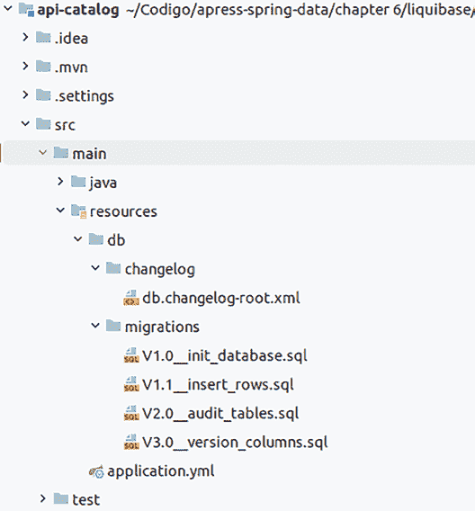

第 6 章 版本控制或迁移变更

***图 6-4.** 包含文件后的项目结构*

之后，你在 `application.yml` 中包含基本配置。如果允许 Liquibase 使用数据源中的用户名、密码和数据库 URL，则配置很短。如果你未指定任何这些信息，则从你在 Spring Boot 中定义的数据源获取信息。出于安全目的，请使用不同的用户名和密码访问数据库，并尽量不要在任何配置文件中直接包含这些值，你可以使用环境变量（参见清单 6-2）。

***清单 6-2.** 工具配置*

spring:

