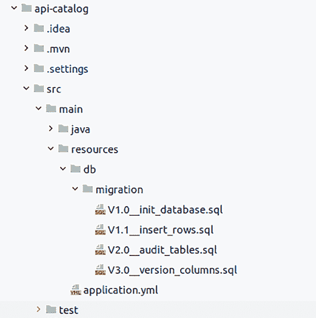

# Spring 的其他配置

liquibase:

change-log: classpath:db/changelog/db.changelog-root.xml

执行应用程序前的最后一步是使用需要由 Liquibase 执行的脚本信息来完善 **db.changelog-root.xml**（参见清单 6-3）。

第 6 章 版本控制或迁移变更

***清单 6-3.** 配置文件*

<?xml version="1.0" encoding="UTF-8"?>

<databaseChangeLog

xsi:schemaLocation="http://www.liquibase.org/xml/ns/dbchangelog

http://www.liquibase.org/xml/ns/dbchangelog/dbchangelog-4.1.xsd

http://www.liquibase.org/xml/ns/pro

http://www.liquibase.org/xml/ns/pro/liquibase-pro-4.1.xsd">

<include file="db/migrations/V1.0__init_database.sql"/>

<include file="db/migrations/V1.1__insert_rows.sql"/>

<include file="db/migrations/V2.0__audit_tables.sql"/>

<include file="db/migrations/V3.0__version_columns.sql"/>

</databaseChangeLog>

你可以指定要包含在迁移中的每个文件。Liquibase 可以指定特定文件夹中所有需要迁移的文件，但一个好的做法是指定文件。这样，你就可以对情况进行精细控制。

当你首次运行应用程序时，会看到大量日志，因为应用程序会执行所有迁移，并且启动时间会更长（参见清单 6-4）。

***清单 6-4.** 首次运行时出现的日志*

2022-07-08 01:04:08.405 INFO 352046 --- [ restartedMain] liquibase.

lockservice : Successfully acquired change log lock

2022-07-08 01:04:08.563 INFO 352046 --- [ restartedMain] liquibase.

changelog : Reading resource: db/migrations/V1.0__

init_database.sql

2022-07-08 01:04:08.574 INFO 352046 --- [ restartedMain] liquibase.

changelog : Reading resource: db/migrations/V1.1__

insert_rows.sql

2022-07-08 01:04:08.608 INFO 352046 --- [ restartedMain] liquibase.

changelog : Reading resource: db/migrations/V2.0__

audit_tables.sql

第 6 章 版本控制或迁移变更

2022-07-08 01:04:08.609 INFO 352046 --- [ restartedMain] liquibase.

changelog : Reading resource: db/migrations/V3.0__

version_columns.sql

2022-07-08 01:04:08.610 INFO 352046 --- [ restartedMain] liquibase.

changelog : Reading resource: db/migrations/

db.changelog-1.0.sql

2022-07-08 01:04:08.611 INFO 352046 --- [ restartedMain] liquibase.

changelog : Reading resource: db/migrations/

db.changelog-1.1.sql

2022-07-08 01:04:08.672 INFO 352046 --- [ restartedMain] liquibase.

changelog : Creating database history table with name:

public.databasechangelog

2022-07-08 01:04:08.679 INFO 352046 --- [ restartedMain] liquibase.

changelog : Reading from public.databasechangelog

2022-07-08 01:04:08.998 INFO 352046 --- [ restartedMain] liquibase.

lockservice : Successfully released change log lock

2022-07-08 01:04:09.003 INFO 352046 --- [ restartedMain] liquibase.

lockservice : Successfully acquired change log lock

跳过自动注册

2022-07-08 01:04:09.003 WARN 352046 --- [ restartedMain] liquibase.

hub : 正在跳过自动注册

2022-07-08 01:04:09.048 INFO 352046 --- [ restartedMain] liquibase.

changelog : 自定义 SQL 已执行

2022-07-08 01:04:09.050 INFO 352046 --- [ restartedMain] liquibase.

changelog : 变更集 db/migrations/V1.0__init_

database.sql::raw::includeAll 在 42ms 内成功运行

下次运行应用程序且所有变更均已存在于数据库中时，

日志数量会减少，应用程序启动时间也会缩短，因为它会锁定数据库，仅执行变更的验证（参见清单 6-5）。

***清单 6-5.*** 第二次运行时出现的日志

2022-07-08 01:07:52.089 INFO 354638 --- [ restartedMain] liquibase.

lockservice : 成功释放变更日志锁

第 6 章 版本控制或迁移变更

2022-07-08 01:07:52.093 INFO 354638 --- [ restartedMain] liquibase.

lockservice : 成功获取变更日志锁

**Flyway**

该工具大体遵循与之前相同的步骤，但 Spring Boot 中的配置

可能更简单，具体取决于你想要使用的方法。Flyway 有多种

执行迁移的方式。

• 仅在 pom 文件中包含依赖项，这样当

应用程序启动时，它会执行所有脚本并验证

数据库的一致性。

• 在 pom 文件中包含一个插件，并以与使用 CLI 界面

相同的方式执行命令。

为降低复杂性，请使用第一种选项，这意味着你只需包含

依赖项，并将执行命令的责任委托给 Spring

Boot。让我们添加清单 6-6 中出现的依赖项。

***清单 6-6.*** Flyway 依赖项

<dependencies>

<dependency>

<groupId>org.flywaydb</groupId>

<artifactId>flyway-core</artifactId>

</dependency>

← 其他依赖项 –>

</dependencies>

之后，在 **src/main/resources/db/migration** 中创建一个新文件夹，并将

上一章中使用的 SQL 文件粘贴到该文件夹内。其结构将类似于图 6-5。

第 6 章 版本控制或迁移变更

***图 6-5.*** 包含文件后的项目结构

有许多可配置的选项。其中大部分都有默认值，例如

用户名/密码和 URL，如果未指定，则会从

数据源获取这些信息。清单 6-7 介绍了 application.yml，这是一个基本配置，用于指示文件所在位置。

***清单 6-7.*** 工具配置

spring:

