# Spring 的其他配置

flyway:

sql-migration-prefix: V

sql-migration-separator: __ # 用于分隔版本/描述的模式

sql-migration-suffixes: .sql

第 6 章 版本控制或迁移变更

locations: classpath:db/migration # 文件所在位置

repeatable-sql-migration-prefix: R

baseline-on-migrate: true

baseline-version: 0 # 用于指示要使用的第一个脚本

使用该工具的最后一步是运行你的 **api-catalog** 应用程序。在删除数据库中所有表（不是模式，因为该工具无法创建

模式，只能创建表或索引）之前，告诉 Flyway 正确创建并填充数据库，以检查脚本是否已执行。

当你执行应用程序时，会看到清单 6-8 中的一些日志，这些日志提供了关于 Flyway 执行了哪些操作的信息。如果在迁移过程中发生任何情况，

控制台会显示与错误相关的所有信息。

***清单 6-8.*** 首次运行时出现的日志

2022-07-08 00:34:06.088 INFO 336864 --- [ restartedMain] o.f.core.

internal.command.DbMigrate : 正在将模式 "public" 迁移到版本

"2.0 - audit tables"

2022-07-08 00:34:06.099 INFO 336864 --- [ restartedMain] o.f.core.

internal.command.DbMigrate : 正在将模式 "public" 迁移到版本

"3.0 - version columns"


2022-07-08 00:34:06.101 INFO 336864 --- [ restartedMain] o.f.c.i.s.Defaul

tSqlScriptExecutor : 0 rows affected

2022-07-08 00:34:06.108 INFO 336864 --- [ restartedMain] o.f.core.

internal.command.DbMigrate : Successfully applied 4 migrations to

schema "public", now at version v3.0 (execution time 00:30.909s)

2022-07-08 00:34:07.987 INFO 336864 --- [ restartedMain] c.apress.

catalog.ApiCatalogApplication : Started ApiCatalogApplication in 35.162

seconds (JVM running for 35.588)

首次执行时，由于需要初始化整个数据库，所有迁移会多花几秒钟时间。但启动时的应用程序如清单 6-9 所示，耗时更少，因为你只需验证数据库中脚本的校验和与名称。

第 6 章 版本控制或迁移变更

***清单 6-9.*** 第二次运行时出现的日志

2022-07-08 00:35:42.479 INFO 337966 --- [ restartedMain] o.f.core.

internal.command.DbValidate : Successfully validated 5 migrations

(execution time 00:00.078s)

2022-07-08 00:35:42.486 INFO 337966 --- [ restartedMain] o.f.core.

internal.command.DbMigrate : Current version of schema "public": 3.0

2022-07-08 00:35:42.487 INFO 337966 --- [ restartedMain] o.f.core.

internal.command.DbMigrate : Schema "public" is up to date. No

migration necessary.

第二次运行应用程序时，验证耗时不到一秒钟，因此这是一种同步数据库并对变更进行版本控制的好方法，且不会影响应用程序的启动时间。

**最佳实践**

以下是使用这些工具时的最佳实践。

•   为文件名称定义一个模式，以帮助你识别执行顺序和文件内容。有些工具有严格的文件命名模式需要遵循；而其他工具则允许你使用任何想要的模式。

•   不要在配置中包含用于执行数据库变更的用户或密码信息；应使用外部变量或配置来降低问题风险。

•   每个文件应包含一定数量有意义的修改。如果因不同原因需要修改两个表，请尝试创建两个文件。

•   不要修改任何之前已在某个环境中部署过的文件。应创建一个包含变更内容的新文件。

•   不要手动运行脚本。将执行脚本并检查一切是否正常的责任委托给你的工具。请记住，大多数工具会创建额外的表来验证脚本是否已执行。

第 6 章 版本控制或迁移变更

•   每个开发者都需要在本地拥有一个数据库，以便检查脚本是否能正常运行，因为多个开发者在同一个数据库中执行变更可能会导致不一致。

**功能开关**

大多数开发者需要在一个微服务的代码中引入改进或修复可能无法按预期工作的问题。

设想一个常见场景：你在仓库中创建了一个新方法，用于替换一个访问方式效率低下的现有方法，但在生产环境中你发现有两种方法可以恢复到系统的先前状态：将代码回滚到之前的版本，或者快速修复另一个问题。

前两种解决方案可以解决问题，但并非所有情况都能快速解决。设想一种情况，你没有发现查询性能问题，那么你的应用程序可能会因为响应时间变长而影响平台的其他部分。一种降低风险的替代方案是采用金丝雀 7 或蓝绿 8 部署等策略来部署变更，让新旧版本共存，这样你可以快速发现问题并降低风险，但并非所有情况下这种方案都有效。设想你在金丝雀部署中没有发现任何异常，并决定在数周后将变更推广到所有微服务实例。


检测到问题。因此，你再次回到第一个场景。

其他替代方案允许你“回滚”更改，而无需重新部署任何内容，只需更改数据库中的一个值。这种解决方案称为特性标志，这是一种旨在降低在生产环境中部署更改可能影响应用程序的风险的模式，并赋予开发人员开启/关闭的责任。此外，这种模式有助于你在微服务中引入 A/B 测试，允许你将一定比例的请求重定向到新功能，或进行金丝雀发布。只有微服务的一个实例启用了新功能。A/B 测试意味着同一个应用程序在生产环境中有两个不同的版本，其中一些用户可以访问一个版本，而其他用户可以访问另一个版本。

7 [`martinfowler.com/bliki/CanaryRelease.html?ref=wellarchitected`](https://martinfowler.com/bliki/CanaryRelease.html?ref=wellarchitected)

8 [`martinfowler.com/bliki/BlueGreenDeployment.html`](https://martinfowler.com/bliki/BlueGreenDeployment.html)

第 6 章 版本控制或迁移变更

**注意** 这种解决方案并非新事物。Martin Fowler 的博客中有一篇关于此主题的长文 9，发表于 2017 年。

另一种情况可能是从关系型数据库迁移到非关系型数据库，或在非关系型数据库之间迁移。你希望将应用程序中出现新问题的风险降至最低。

**注意** 本书涵盖了多种数据库，因此你可以使用这种机制从关系型数据库迁移到非关系型数据库，并进行测试以检查一切是否继续正常运行。

开关或特性标志有几种类型。其中一些会在一定时间后从源代码中移除，而另一些则会长期存在，具体取决于要测试的功能。让我们来看看这些开关选项。

• **发布** 开关非常适合希望创建或修改现有功能，并最大限度降低部署错误风险的开发者。在大多数情况下，这种开关不是永久性的；一段时间后，它会被从源代码中移除。

• **实验性** 开关非常适合进行 A/B 测试，因此你可以使用诸如请求百分比之类的标准来指示将流量导向一个版本而非另一个版本。想象一下，你有两种在数据库中进行操作的方式，但你不确定其性能以及每种方式对整个应用程序的影响。最佳解决方案是将一部分请求发送到一种解决方案，并检查结果。

• **运维** 开关是一种启用或禁用功能的常见方式；只需更改一个变量的值。一个常见的用例是启用或禁用与外部服务的连接，这些连接可能会影响你的微服务并导致服务质量下降。

9 [`martinfowler.com/articles/feature-toggles.html`](https://martinfowler.com/articles/feature-toggles.html)

第 6 章 版本控制或迁移变更

• **权限** 开关是最常见的开关用途，你可以根据用户或应用程序，启用或禁用对平台或微服务某部分的访问权限。

**实现特性标志**

在 Spring Boot 中，这种模式的最初实现是使用配置文件根据环境来启用或禁用功能。如果你想启用一个功能，你需要重新部署整个应用程序，这需要时间，因此这不是一个可扩展且高性能的解决方案。

许多工具都实现了这种模式，但并非所有工具都具有相同数量的功能或相同的成熟度。在 Java 以及与 Spring Boot 的集成中，有两个选项：Togglz10 和 FF4J11。每个都提供了许多教程，并且有许多开发者报告问题并提出新功能，但 FF4J 提供了额外的功能来帮助你。

• 与多种类型的数据库集成，以保存关于特性标志的信息和指标


• 一个良好的 Web 界面，用于查看所有指标并启用/禁用所有功能
• 提供一组带有良好文档（使用 Swagger）的端点
• 能够审计功能发生的变更

让我们创建一个示例，帮助您理解多种实现机制，例如使用标头或库。

**包含一个标头**

首先，创建一个查询 `CountryRepository` 的新方法，该方法通过 ID 获取国家（参见清单 6-10）。

10 [`www.togglz.org/documentation/spring-boot-starter.html`](https://www.togglz.org/documentation/spring-boot-starter.html)
11 [`ff4j.org/`](https://ff4j.org/)

第 6 章 版本控制或迁移变更

***清单 6-10.*** 仓库修改

public interface CountryRepository extends CrudRepository<Country, Long> {

List<Country> findByCode(String code);

// 替换旧查询的新查询

@Query("SELECT c FROM Country c WHERE c.id = ?1")

Optional<Country> findByIdUsingQuery(Long id);

}

清单 6-11 修改了 `CountryService` 代码，使其接收一个参数来指示使用特定的实现。

***清单 6-11.*** 服务修改

@Service

public class CountryService {

CountryRepository countryRepository;

StateRepository stateRepository;

Validator validator;

@Autowired

public CountryService(CountryRepository countryRepository,

StateRepository stateRepository, Validator validator) {

this.countryRepository = countryRepository;

this.stateRepository = stateRepository;

this.validator = validator;

}

@Transactional(readOnly = true)

public CountryDTO getById(Long id, Boolean newImplementation) {

CountryDTO response = null;

Optional<Country> country = Optional.empty();

// 接收参数并选择一种策略来获取信息

第 6 章 版本控制或迁移变更

if(newImplementation) {

country = countryRepository.findById(id);

} else {

country = countryRepository.findByIdUsingQuery(id);

}

if(country.isPresent()) {

response = ApiMapper.INSTANCE.entityToDTO(country.get());

// 这是将实体转换为 DTO 的映射器

}

return response;

}

}

清单 6-12 引入了对 `CountryController` 的修改以接收该参数。

***清单 6-12.*** 控制器修改

@RestController

@RequestMapping("/country")

public class CountryController {

private CountryService countryService;

@Autowired

public CountryController(CountryService countryService) {

this.countryService = countryService;

}

@GetMapping(value = "/{id}")

public ResponseEntity<CountryDTO> getById(@PathVariable Long id,

@RequestParam(value=”false”) Boolean newImplementation) {

CountryDTO response = countryService.getById(id,

newImplementation);

return new ResponseEntity<>(response, HttpStatus.OK);

}

}

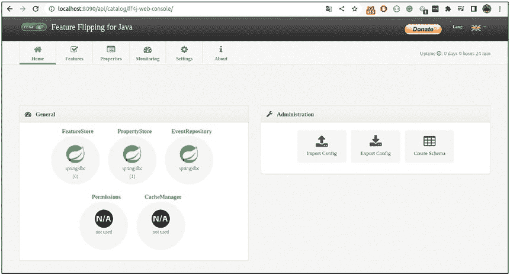

第 6 章 版本控制或迁移变更

现在，您可以使用两种备选方案，并通过标头动态更改 API 的行为。这很棒，但主要问题在于您必须修改这些微服务的消费者以及许多类。

**包含一个库**

解决无需使用标头即可更改应用程序行为这一问题的最佳方法之一是使用像 FF4J12 这样的库，它提供了一个 Web 控制台，可以动态更改值，并对某些用户设置限制。

该库的主要问题是，在编写本书时，它尚不支持 Spring Boot 3.x.x。

***图 6-6.** FF4J Web 控制台*

12 [`ff4j.org/`](https://ff4j.org/)

第 6 章 版本控制或迁移变更

**最佳实践**

功能标志的使用有一些建议或最佳实践。

• **选择正确的位置使用它**。在 Spring Data 中，确定包含它的最佳位置。这种情况并非一成不变，取决于您使用的是 DAO 还是仓库。
• **使用描述性名称**。一个常见的错误是没有创建一个能提供有关该功能所有信息的名称。想象一下


您可能有多个应用程序将开关信息保存在同一个数据库中，这可能导致两个或多个应用程序引用不同内容时出现冲突。

• **为技术和非技术用户提供访问机制。** 其理念是为每个对微服务或平台负有责任的人提供启用或禁用值的机制。主要问题在于，您需要限制哪些功能可以访问数据库，因为并非所有非技术用户都了解查询的性能。

**总结**

对数据库中的变更进行版本控制，可以记录所有发生的修改，以便您检测问题并进行回滚。有许多工具可以解决这种情况。本章介绍了一些工具，但其他工具不太流行，且无法与多种框架集成。不过，Spring Boot 会不时集成新库，因此请定期查看官方文档。

**第 7 章**

**Redis：键/值**

**数据库**

有时，您需要将复杂对象持久化到数据库中，并且/或者需要长时间保存。在这种情况下，键/值存储的作用或多或少类似于 `Map<K,V>` 类，您需要一个键来获取值，但键不必是字符串。它可以是其他类型，而值可以是简单的字符串或复杂的对象。

Redis1 或 Memcached2 是此类数据库的示例，您可以将其与 Spring Boot 的另一个模块（例如缓存机制）一起使用。

这些选项之间的主要区别在于您可以持久化的信息类型数量。Redis 支持哈希、字符串、列表和集合数据类型，而 Memcached 仅支持字符串。另一个重大区别是，如果数据库发生故障，Redis 能够将信息持久化到内存或磁盘中。您肯定不希望丢失所有信息。

还有其他区别，但本章的目的并非比较各种键/值数据库选项。根据上述描述，我们选择使用 Redis。

**什么是 Redis？**

Redis 由 Salvatore Sanfilippo 于 2009 年创建。他开发此解决方案是为了解决其当时所在公司中 Web 分析器的可扩展性问题。该数据库最大的特点之一是其高性能，它是一个轻量级存储，可以保存不同类型的信息。

1 [`redis.io/`](https://redis.io/)

2 [`memcached.org/`](https://memcached.org/)

© Andres Sacco 2023

A. Sacco, *Beginning Spring Data*[, https://doi.org/10.1007/978-1-4842-8764-4_7](https://doi.org/10.1007/978-1-4842-8764-4_7#DOI)

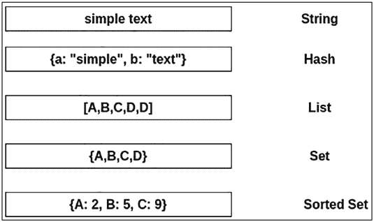

第 7 章 Redis：键/值数据库

让我们深入了解该数据库最相关的特性。

• Redis 支持最大 512 MB 的键/值。

• 它支持字符串、哈希、列表、集合和有序集合数据类型。它还支持保存复杂的数据对象，例如 JSON。

• Redis 是单线程的，并且可以水平扩展。此外，它原生支持集群实例。

图 7-1 反映了这些优势。

***图 7-1.** 不同的数据类型*

Redis 具有用于持久化和检索信息的架构；根据您的方法，所有这些架构都可以将信息保存在内存中并保存到磁盘上。让我们简要介绍一下这些类型。

• **单一数据库**：一个唯一的实例接收所有请求。如果发生故障，则无法访问信息（见图 7-2）。当实例健康时，信息取决于其持久化策略。

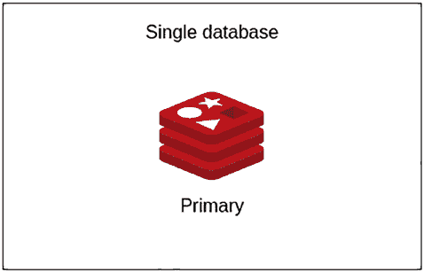

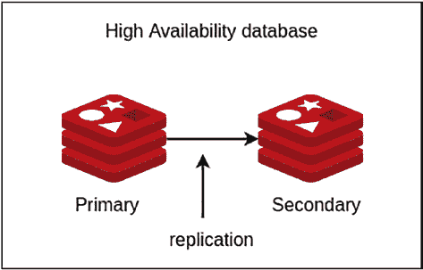

第 7 章 Redis：键/值数据库

***图 7-2.** 包含所有信息的唯一数据库*

• **高可用性**：这种架构意味着您有两个 Redis 实例（见图 7-3）。主实例接收所有


操作并在从库中复制变更，因此如果主数据库不健康，你可以使用另一个实例访问信息。复制过程并非瞬间完成，通常需要几毫秒，因此信息丢失的可能性很小。

***图 7-3.** 具有复制机制的多数据库*

• **哨兵（Sentinel）**：这是对前述方法的一种轻微改进，其中某些节点负责检测主实例和从实例是否正常运行并能响应请求（见图 7-4）。

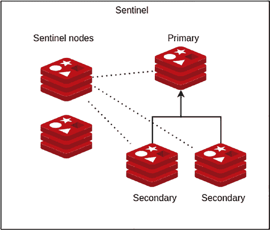

第 7 章 Redis：键/值数据库

***图 7-4.** 具有哨兵机制的多数据库*

• **集群（Cluster）**：这种方法意味着可以拥有多个主实例和从实例，其理念是共享信息，即某些信息存在于一个主实例中，但不在其他主实例中，同时保持信息在一个从实例中的复制机制（见图 7-5）。当请求量巨大且信息量庞大时，这种方法尤其有用。

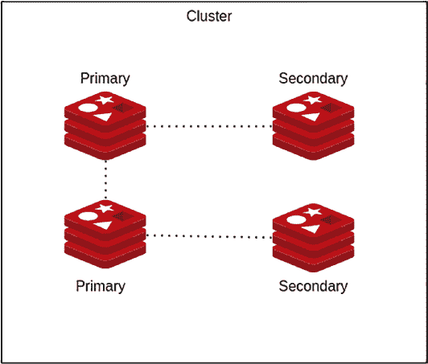

第 7 章 Redis：键/值数据库

***图 7-5.** 主节点之间具有通信机制的多数据库*

Spring Data 支持所有这些方案，你可以通过 **application.yml** 进行配置。

**Spring Data 数据结构**

Spring Data Redis3 与 JPA 版本的理念相同，旨在通过提供一组类或组件来简化与数据库交互的复杂性，从而实现简单交互。它们包含以下组件。

• **驱动程序**负责与数据库交互以执行所有操作。

• **RedisConnection/RedisConnectionFactory** 负责与驱动程序交互，并将所有操作和异常转换为类似于 JPA 仓库的形式。

• **实体**表示并包含你在数据库中持久化的所有信息。这是为 Spring Data（JPA、Redis、Cassandra）实现保持特定标准的好方法。不过，你也可以省略这些类，使用简单的字符串或 DTO 来持久化信息。

3 [`spring.io/projects/spring-data-redis`](https://spring.io/projects/spring-data-redis)

第 7 章 Redis：键/值数据库

• **序列化器**提供了一种以其他格式在数据库中持久化和获取信息的方式。例如，你可以将对象转换为字符串并压缩信息以减小信息体积，当需要持久化大量行时，这极为有用。一些云提供商（如 AWS）会根据 Redis 所需的内存收费。

• **其他组件**（使用哨兵或主/从支持）的连接方式与驱动程序类似。

Spring Data 秉承了为每种数据库引入少量依赖的理念。在 Redis 中，你只需包含 Redis 的特定依赖和驱动程序，后者在后台负责与数据库交互，并执行保存或获取信息的操作。

Spring Data Redis 支持诸如 Jedis、4 Lettuce、5 JRedis6 和 RJC7 等驱动程序，但开发人员中最流行的是前两个选项。这些选项之间的主要区别在表 7-1 中进行了对比。

***表 7-1.** 客户端差异*

**Jedis**

**Lettuce**

不支持响应式连接，会阻塞连接

基于 Netty 的非阻塞 Redis 客户端

每个线程有单独的实例

多个线程共享连接

不支持主/从连接

支持主/从连接

Spring Boot 1.x.x 中的默认驱动程序

Spring Boot 2.x.x 和 3.x.x 中的默认驱动程序

4 [`github.com/xetorthio/jedis`](https://github.com/xetorthio/jedis)


5 [`lettuce.io/`](https://lettuce.io/)

6 [`github.com/alphazero/jredis`](https://github.com/alphazero/jredis)

7 [`github.com/e-mzungu/rjc`](https://github.com/e-mzungu/rjc)

第 7 章 Redis：键/值数据库

**数据库和连接设置**

在本节中，你将看到如何使用 Redis 配置之前的 api-catalog，但排除了有关数据库安装和配置的所有细节，这些内容你可以在附录 E 中查看。

让我们像清单 7-1 所示那样，将**Redis**依赖项添加到**api-catalog**中。完成所有修改后，更改依赖项以观察更换驱动程序带来的影响。不要修改 Spring Data Redis 的版本或驱动程序，因为 Spring Boot 知道哪个版本是兼容的。如果你修改了，可能会导致某些功能无法正常工作。

***清单 7-1.*** 与 Redis 连接的依赖项

<dependency>

<groupId>org.springframework.data</groupId>

<artifactId>spring-data-redis</artifactId>

</dependency>

<dependency>

<groupId>redis.clients</groupId>

<artifactId>jedis</artifactId>

</dependency>

下一步是向**application.yml**中引入配置，以使用你机器上与 Redis 数据库相关的信息（见清单 7-2）。附录 E 解释了如何运行数据库并检查其中的元素。

***清单 7-2.*** Spring Data Redis 的连接信息

spring:

redis:

host: localhost

port: 6379

timeout: 2000 #连接超时时间

jedis:

pool:

max-idle: 6 #最大空闲连接数

max-active: 10 #最大连接数

min-idle: 2 #最小空闲连接数

第 7 章 Redis：键/值数据库

**注意**，使用**application.yml**进行数据库配置是一种方式。另一种方式是创建一个包含所有主机和端口信息的@bean。

//使用 Jedis 配置 Redis 连接的替代方式

@Bean

public JedisConnectionFactory connectionFactory() {

RedisStandaloneConfiguration redisStandaloneConfiguration =

new RedisStandaloneConfiguration("localhost", 6379);

return new JedisConnectionFactory(redisStandaloneConfiguration);

}

//使用 Lettuce 配置 Redis 连接的替代方式

@Bean

public LettuceConnectionFactory connectionFactory() {

RedisStandaloneConfiguration redisStandaloneConfiguration =

new RedisStandaloneConfiguration("localhost", 6379);

return new LettuceConnectionFactory(redisStandaloneConfiguration);

}

这种方法意味着你需要创建类来获取主机名和端口信息，因为将主机名和端口数据硬编码在源代码中并非最佳实践。

假设你通过这些修改运行了应用程序（如果不确定如何操作，请查看附录 C），并且一切运行正常，但你在控制台上看到了一些消息，提示你有存储库和实体未与 Redis 连接。Spring Data 对多种数据库都使用了相同的存储库方法，因此它提示你需要检查要使用的数据库类型是合理的。

2022-08-12 00:01:35.547 INFO 160009 --- [ restartedMain] .s.d.r.c.Reposit

oryConfigurationDelegate : Bootstrapping Spring Data Redis repositories in

DEFAULT mode.

第 7 章 Redis：键/值数据库

2022-08-12 00:01:35.557 INFO 160009 --- [ restartedMain]

.RepositoryConfigurationExtensionSupport : Spring Data Redis - Could not

safely identify store assignment for repository candidate interface com.

apress.catalog.repository.CountryRepository. If you want this repository to

be a Redis repository, consider annotating your entities with one of these

annotations: org.springframework.data.redis.core.RedisHash (preferred), or

consider extending one of the following types with your repository: org.

springframework.data.keyvalue.repository.KeyValueRepository.

下一步是定义一个模板，告诉 Redis 哪个是键以及


数据库保存的特定行的值。在所有 API 实体中，键（key）是 Long 类型，你可以将其值定义为一个对象（参见清单 7-3）。

***清单 7-3.*** Redis 配置的定义

import org.springframework.context.annotation.Bean;

import org.springframework.context.annotation.Configuration;

import org.springframework.data.redis.connection.RedisConnectionFactory;

import org.springframework.data.redis.core.RedisTemplate;

import org.springframework.data.redis.repository.configuration.

EnableRedisRepositories;

@Configuration

@EnableRedisRepositories //此注解启用 Redis 仓库

public class RedisConfiguration {

@Bean

public RedisTemplate<Long, Object> redisTemplate(RedisConnectionFactory

connectionFactory) {

RedisTemplate<Long, Object> template = new RedisTemplate<>();

template.setConnectionFactory(connectionFactory);

// 在此处可以定义自定义序列化

return template;

}

}

第 7 章 Redis：键/值数据库

为了维护微服务，请移除所有与 JPA/PostgreSQL 相关的依赖项以及实体中与关系型数据库相关的注解，但不要移除仓库或服务中用于访问信息的逻辑。

之后，你需要修改之前的 JPA 实体，使用 `@RedisHash` 注解并指定“实体”名称，将其转换为 Redis 实体，如清单 7-4 所示。

***清单 7-4.*** Redis 实体的定义

import org.springframework.data.annotation.Id;

import org.springframework.data.redis.core.RedisHash;

import java.util.List;

import java.io.Serializable;

@RedisHash("country")

public class Country implements Serializable {

@Id

private Long id;

// 之前的源代码

}

在幕后，Spring Data 会获取“country”前缀并将其附加到使用 `@Id` 注解的字段值上，从而减少多个实体或具有相同 ID 的对象之间发生冲突的问题或风险。

如果你完成了上述所有修改，应用程序将继续使用相同的端点工作。但在 Redis 中，实体之间无法建立关联，因为该数据库作为键/值存储工作，所有键之间没有任何关系。

你可以保存元素，但无法引用其他值。如果你的 Country 实体包含一个货币（currency）和一个州（states）列表，那么你会保存多个包含相同信息的元素。不过，让我们再次运行应用程序，并使用 API 中的 **http://localhost:8080/api/catalog/country** POST 方法创建一个新的国家（参见图 7-6）。

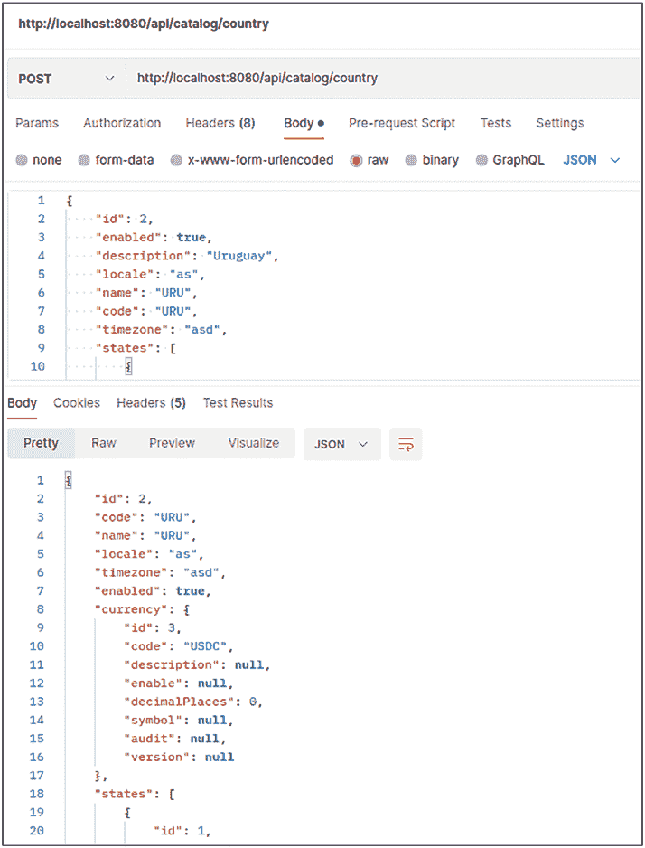

第 7 章 Redis：键/值数据库

***图 7-6.** 执行 POST 方法的结果*

使用 Spring Data 从一个数据库切换到另一个数据库，并不意味着你必须对全部源代码进行大量修改。因此，你可以像在清单 7-5 中看到的那样，以最小的改动使用上一章中仓库的所有优势。有一些类负责映射或转换此数据库中仓库可用的操作。

第 7 章 Redis：键/值数据库

***清单 7-5.*** 使用 Redis 数据库的 Spring Data 仓库

*import com.apress.catalog.model.Country;*

import org.springframework.data.repository.CrudRepository;

import org.springframework.stereotype.Repository;

@Repository

public interface *CountryRepository extends CrudRepository*< *Country*,

*Long*> { }

为了检查一切是否继续正常工作，请尝试执行你在前几章中开发的其他操作。

**注意** 在此类数据库中，没有像 Flyway 或 Liquibase 这样的工具或库用于版本控制变更。相反，你必须创建一个脚本并将其保存在仓库中。

**连接主/从节点**

让我们对之前的示例稍作修改，不再使用单个节点，这取决于你决定在数据库中持久化的信息，该节点可能……


关键与否，不可忽视。

你需要将驱动程序从 Jedis 切换到 Lettuce，以支持最相关的
Redis 高可用性机制。请记住，不要包含库版本，
因为 Spring Boot 和 Spring Data 知道并定义了最佳版本。在应用程序的 `pom` 文件中添加
Redis 驱动程序的依赖项，如清单 7-6 所示。

***清单 7-6.*** Redis 的 Lettuce 驱动程序

<dependency>

<groupId>io.lettuce</groupId>

<artifactId>lettuce-core</artifactId>

</dependency>

第 7 章 Redis：键/值数据库

下一步是移除 `application.yml` 中所有与 Redis 相关的先前配置。
你需要手动创建连接，并指明哪些节点是
主节点，哪些是从节点。之后，创建一个名为 **redis** 的节点，并按照清单 7-7 所示的方式定义主/从节点。

***清单 7-7.*** 应用程序中 Redis 的配置

redis:

master:

host: localhost

port: 6379

slaves:

- host: localhost

port: 6380

下一步是定义一个类（见清单 7-8），该类加载 `application.yml` 中的所有配置，以便在 `RedisConfiguration` 类中使用。这个新类使用了
`RedisProperties`，其中包含了主机/端口以及其他属性的结构。

***清单 7-8.*** 修改后的配置文件

package com.apress.catalog.configuration;

import org.springframework.boot.autoconfigure.data.redis.RedisProperties;

import org.springframework.boot.context.properties.ConfigurationProperties;

import org.springframework.context.annotation.Configuration;

import java.util.List;

@ConfigurationProperties(prefix = "redis")

@Configuration

public class RedisSettings {

private RedisProperties master;

private List<RedisProperties> slaves;

// Setters and getters

}

最后一步是在 **RedisConfiguration** 中引入修改，以指明哪个
节点是主节点，哪些是从节点或副本节点（见清单 7-9）。

第 7 章 Redis：键/值数据库

***清单 7-9.*** Redis 的配置修改

import com.apress.catalog.serializer.LongSerializer;

import io.lettuce.core.ReadFrom;

import org.springframework.context.annotation.Bean;

import org.springframework.context.annotation.Configuration;

import org.springframework.data.redis.connection.RedisConnectionFactory;

import org.springframework.data.redis.connection.

RedisStaticMasterReplicaConfiguration;

import org.springframework.data.redis.connection.lettuce.

LettuceClientConfiguration;

import org.springframework.data.redis.connection.lettuce.

LettuceConnectionFactory;

import org.springframework.data.redis.core.RedisTemplate;

import org.springframework.data.redis.repository.configuration.

EnableRedisRepositories;

@Configuration

@EnableRedisRepositories

public class RedisConfiguration {

final RedisSettings settings;

public RedisConfiguration(RedisSettings settings) {

this.settings = settings;

}

@Bean

public RedisTemplate<Long, Object> redisTemplate(RedisConnectionFactory

connectionFactory) {

RedisTemplate<Long, Object> template = new RedisTemplate<>();

template.setConnectionFactory(connectionFactory);

return template;

}

// 在此 Bean 中，你定义了与主节点以及
// 从节点或副本节点的连接，你可以拥有多个副本节点

@Bean

第 7 章 Redis：键/值数据库

public LettuceConnectionFactory redisConnectionFactory() {

LettuceClientConfiguration clientConfig =

LettuceClientConfiguration.builder()

.readFrom(ReadFrom.REPLICA_PREFERRED)

.build();

RedisStaticMasterReplicaConfiguration

staticMasterReplicaConfiguration = new RedisStaticMasterReplica

Configuration(settings.getMaster().getHost(),

settings.getMaster().getPort());

settings.getSlaves().forEach(slave ->

staticMasterReplicaConfiguration.addNode(slave.getHost(), slave.

getPort()));

return new LettuceConnectionFactory(staticMasterReplica

Configuration, clientConfig);

}

}

该配置可以支持多个从节点或副本节点，因此你可以


减少对数据库操作的影响，这些操作仅需获取信息而无需修改信息。

**注意**：建议始终使用 `application.yml` 中提供的配置。不过，该文件并未涵盖所有情况，例如主/从副本，因此这种情况可以作为定义驱动程序配置的一个良好替代方案。

在 Sentinel 中，Spring Data 可以在 **application.yml** 中指示所有节点，因此至少在你想要配置其他内容时，这种方法并非必需。

**对象映射与转换**

Spring Data Redis 提供了一组模板，负责执行保存/删除/检索/更新信息等操作。在本章前面的部分中，你定义了一个自定义的 `RedisTemplate`，其键为 `Long` 类型，值为对象类型，这是必要的，因为它并非适用于所有可能组合的通用模板。你需要为需要持久化的每种元素类型定义 `RedisTemplate`。你可以创建一些通用的模板，例如键为字符串，值为对象。不过，还有其他模板，例如 **StringRedisTemplate**，其键/值均为字符串，因此无需再创建一个新的 `RedisTemplate` 来覆盖这种元组。

在这两种情况下，你都将信息的序列化和反序列化委托给了 Spring Data。但是，你并不总是希望以特定格式保存信息，因此你可以通过实现 `RedisSerializer<T>` 接口来创建自定义序列化器。

为了通过具体示例说明这一点，让我们为键值（一个 `Long` 值）创建一个基本的序列化器，如清单 7-10 所示。

***清单 7-10.*** Long 类型的自定义序列化器

```java
package com.apress.catalog.serializer;

import org.springframework.data.redis.serializer.RedisSerializer;
import org.springframework.data.redis.serializer.SerializationException;
import org.springframework.stereotype.Component;

@Component
public class LongSerializer implements RedisSerializer<Long> {

    @Override
    public byte[] serialize(Long aLong) throws SerializationException {
        if (null != aLong) {
            return aLong.toString().getBytes();
        } else {
            return new byte[0];
        }
    }

    @Override
    public Long deserialize(byte[] bytes) throws SerializationException {
        if (bytes.length > 0) {
            return Long.parseLong(new String(bytes));
        } else {
            return null;
        }
    }
}
```

之后，你只需修改 `RedisConfiguration` 类，以指定用于键值的序列化器（参见清单 7-11）。

***清单 7-11.*** 添加键序列化器

```java
import org.springframework.data.redis.core.RedisTemplate;
import com.apress.catalog.serializer.LongSerializer;
import org.springframework.context.annotation.Bean;
import org.springframework.context.annotation.Configuration;
import org.springframework.data.redis.connection.RedisConnectionFactory;

@Configuration
@EnableRedisRepositories
public class RedisConfiguration {

    final RedisSettings settings;
    final LongSerializer longSerializer;

    public RedisConfiguration(RedisSettings settings, LongSerializer longSerializer) {
        this.settings = settings;
        this.longSerializer = longSerializer;
    }

    @Bean
    public RedisTemplate<Long, Object> redisTemplate(RedisConnectionFactory connectionFactory) {
        RedisTemplate<Long, Object> template = new RedisTemplate<>();
        template.setConnectionFactory(connectionFactory);
        template.setKeySerializer(longSerializer);
        return template;
    }

    // 之前的源代码
}
```

第 7 章 Redis：键/值数据库


在这种情况下，Redis 为基本数据类型定义了一个序列化器，但你可以更改其行为并创建一个新的序列化器。实现此类序列化器的一个可能原因是为了优化持久化到数据库中的信息大小，你将在最后一章中了解更多相关内容。

**定义自定义仓库**

到目前为止，你已将持久化模型从关系型数据库更改为 Redis，而无需对仓库进行任何更改。但在 Spring Data Redis 中，你可以使用你定义的 `RedisTemplate` 或预定义库来定义自定义仓库。

让我们稍微修改之前的仓库，使其执行相同的操作，但使用 `RedisTemplate` 而不是将所有内容委托给框架。首先要做的是创建一个接口，该接口包含仓库的所有操作，方式与清单 7-12 所示相同。

***清单 7-12.*** 自定义仓库接口的定义

package com.apress.catalog.repository;

import com.apress.catalog.model.Country;

import java.util.Optional;

public interface CustomCountryRepository {

Country save(Country entity);

Optional<Country> findById(Long id);

void deleteById(Long id);

}

下一步是创建一个实现上述接口的具体类，并导入你在 **RedisConfiguration** 类中定义的 **RedisTemplate**。你需要从 `RedisTemplate` 中获取 `HashOperations`，它执行与数据库相关的所有操作。你可以将其视为 JPA 中的 `EntityManager`（参见清单 7-13）。

第 7 章 Redis：键/值数据库

***清单 7-13.*** 自定义仓库具体类的定义

package com.apress.catalog.repository;

import com.apress.catalog.model.Country;

import org.springframework.beans.factory.annotation.Autowired;

import org.springframework.data.redis.core.HashOperations;

import org.springframework.data.redis.core.RedisTemplate;

import org.springframework.stereotype.Repository;

import java.util.Optional;

@Repository

public class CustomCountryRepositoryImpl implements

CustomCountryRepository {

//使用键在数据库中创建唯一元素，例如 country_xxx

private static final Object COUNTRY_KEY = "country";

private final RedisTemplate redisTemplate;

private HashOperations hashOperations;

@Autowired

public CustomCountryRepositoryImpl(RedisTemplate redisTemplate) {

this.redisTemplate = redisTemplate;

//获取 HashOperations 以直接与数据库交互

this.hashOperations = redisTemplate.opsForHash(); }

@Override

public Country save(Country entity) {

*//执行保存操作，该操作不返回任何内容，因此你需要执行查找操作来返回它*

hashOperations.put(COUNTRY_KEY, entity.getId(), (Object) entity);

return findById(entity.getId()).get();

}

第 7 章 Redis：键/值数据库

@Override

public Optional<Country> findById(Long id) {

return Optional.of((Country) hashOperations.get(COUNTRY_KEY, id));

}

@Override

public void deleteById(Long id) {

//此操作只需要键的“前缀”和值 country_xxxx 即可删除

hashOperations.delete(COUNTRY_KEY, id);

}

}

这些方法中没有 `@Transactional` 注解，因为该数据库不支持事务。

最后，更改 **CountryService** 中的仓库，以使用新的仓库，方式与清单 7-14 所示相同。

***清单 7-14.*** 服务修改

@Service

public class CountryService {

CustomCountryRepositoryImpl countryRepository;

// 之前的源代码

@Autowired

public CountryService(CustomCountryRepositoryImpl countryRepository,

StateRepository stateRepository, Validator validator) {

this.countryRepository = countryRepository;

this.stateRepository = stateRepository;

this.validator = validator;

}

// 之前的源代码

}

第 7 章 Redis：键/值数据库

如果你再次运行应用程序，并使用附录 B 中提到的某些工具执行保存或检索信息操作，你将获得与之前仓库相同的行为。

**按示例查询**


查询时最常见的问题之一，就是需要编写完整的待执行语句，即便考虑到 Spring Data 通过参数名称创建方法进行过滤的所有优势也是如此。为了解决这个问题，Spring Data 提供了一种使用用户友好查询技术创建查询的可能性，该技术通过一个简单的接口即可实现动态查询。

要使用此功能，你只需要一个包含值的对象 `ExampleMatcher`，它包含用于过滤结果字段的逻辑；以及 `Example`，它是框架的一部分，负责将信息传递给匹配器。

为了更简单地实现这一点，让我们回到之前使用 Spring Data 提供的仓库访问数据库的实现，并添加 `QueryByExampleExecutor<T>` 接口（参见清单 7-15）。

***清单 7-15.*** 添加接口以使用 QueryByExample

public interface CountryRepository extends CrudRepository<Country, Long>,

QueryByExampleExecutor<Country> {

}

下一步是在你的服务中创建一个新方法，该方法接收一个字符串参数，该参数包含国家名称的一部分。`ExampleMatcher` 需要指明查找条件，方式与清单 7-16 所示相同。

9 [`github.com/spring-projects/spring-data-commons/blob/main/src/main/java/`](https://github.com/spring-projects/spring-data-commons/blob/main/src/main/java/org/springframework/data/repository/query/QueryByExampleExecutor.java)

[org/springframework/data/repository/query/QueryByExampleExecutor.java](https://github.com/spring-projects/spring-data-commons/blob/main/src/main/java/org/springframework/data/repository/query/QueryByExampleExecutor.java)

第 7 章 Redis：键/值数据库

***清单 7-16.*** 使用 ExampleMatcher 的新方法

@Service

public class CountryService {

CountryRepository countryRepository;

// 之前的源代码

public List<CountryDTO> getAll(String name) {

List<CountryDTO> response = null;

// 这里你使用名称作为示例来创建查询以进行搜索，

// 不考虑具有“code”属性的值

ExampleMatcher matcher = ExampleMatcher.matching()

.withIgnorePaths("code")

.withIncludeNullValues()

.withMatcher("name", ExampleMatcher.

GenericPropertyMatcher.of(ExampleMatcher.

StringMatcher.DEFAULT));

Country entity = new Country();

entity.setName(name);

Iterable<Country> country = countryRepository.findAll(Example.

of(entity, matcher));

if(country != null) {

response = mapper.mapAsList(country, CountryDTO.class);

}

return response;

}

// 之前的源代码

}

此示例获取“name”的值并生成查询以查找信息。最后一步是在控制器中创建一个新方法，该方法接收请求并调用服务（参见清单 7-17）。

第 7 章 Redis：键/值数据库

***清单 7-17.*** 控制器中的新方法

@GetMapping(value = "/")

public ResponseEntity<List<CountryDTO>> getAll(@RequestParam String name) {

List<CountryDTO> response = countryService.getAll(name);

return new ResponseEntity<>(response, HttpStatus.OK);

}

完成所有这些修改后，如果你在新端点中发出各种请求来过滤结果，你可能会发现什么也没发生，并且返回了数据库中的所有内容。这是因为你需要添加 Redis 的情况，即存在第二个属性，使用 `@Indexed` 注解来过滤信息。在幕后，它会创建一个新的索引（参见清单 7-18）。

***清单 7-18.*** 添加注解以创建新索引

import org.springframework.data.annotation.Id;

import org.springframework.data.redis.core.RedisHash;

import org.springframework.data.redis.core.index.Indexed;

import java.io.Serializable;

import java.util.List;

@RedisHash("country")

public class Country implements Serializable {

@Id

private Long id;

private String code;

@Indexed


private String name;

//Previous source code

}

此解决方案运行良好，但并非在数据库中创建多个索引的最佳方法。

第 7 章 Redis：键/值数据库

**总结**

本章涵盖了使用 Redis 的各种方法。其中大部分方法在 Spring Data 中均受支持，例如使用单个或多个数据库节点。您学习了如何使用自定义序列化器持久化信息，以及如何在应用程序中进行配置。

关于使用哪种方法，并没有唯一正确的答案，因为这取决于您的业务需求，以及在同一数据库（例如在 AWS 这样的云提供商上）运行多个实例所涉及的成本。

**第 8 章**

**MongoDB：文档**

**数据库**

在创建应用程序时，您可能需要以特定格式持久化信息，而这些格式将来可能需要修改。您可能会认为关系型数据库是保存此类信息的最佳选择。然而，一些非关系型数据库提供了灵活修改“表”结构的能力，并且可以保存复杂的对象，同时还能创建复杂的查询。

非关系型数据库的演进和稳定性使其在处理大量信息时表现出色。但与关系型数据库相比，您也需要做出一些取舍，例如数据冗余。

本章将讨论一种新的非关系型数据库，它可以将所有信息像文档一样保存，并介绍其主要优势。

**什么是文档存储？**

文档存储是一种非关系型数据库，您可以将信息存储为 JSON 文档，而无需像关系型数据库那样拥有严格的模式。因此，您可以灵活地添加、删除或更改属性的格式。当然，您需要修改应用程序，以避免在源代码中产生异常。

这种数据源提供了一种任何人都能读懂的清晰结构，并且根据您应用程序的复杂程度，它甚至可以与某些端点的响应格式相匹配。

如果您想将 **api-catalog** 应用程序从多个表转换为仅一个表，这是可行的，同时还能保持 DTO 的精确结构。然而，主要问题之一是信息的冗余，这在非关系型数据库中很常见。不过，一些实现也提供了创建结构并将其像关系型数据库那样连接起来的可能性。

© Andres Sacco 2023
A. Sacco, *Beginning Spring Data*[, https://doi.org/10.1007/978-1-4842-8764-4_8](https://doi.org/10.1007/978-1-4842-8764-4_8#DOI)

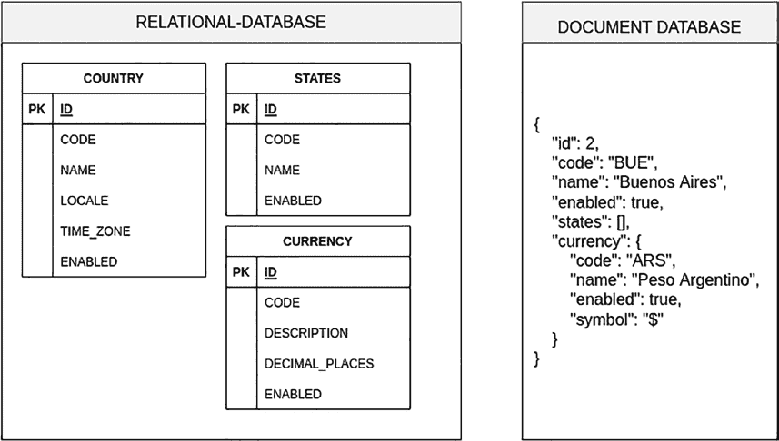

第 8 章 MongoDB：文档数据库

图 8-1 展示了之前的关系型数据库与文档数据库之间的对应关系。

***图 8-1.** 关系型数据库 vs. 文档数据库*

这些结构之间存在一些对应关系；例如，关系型数据库中的表，在 MongoDB（文档存储数据库的一种实现）中就是集合。因此，它并没有完全抛弃您所熟知的所有概念，而是将其转换为不同的形式。

**可能的使用场景**

在某些情况下，这些数据库是很好的候选方案，但并没有限制它们在其他场景中的使用。让我们来看一些用例。

• **目录**：一些应用程序存储电子商务中的产品信息，或与数据库性能相关的地区（如国家/城市/州或机场）信息。同时，您希望享受执行多种类型查询的所有好处。想象一下，需要执行大量查询才能获取某个特定国家的信息。那么，更好的做法是只对一个特定结构执行一次查询，并获取可以作为端点响应的 JSON。

第 8 章 MongoDB：文档数据库

• **内容管理**：如果您有像博客或视频平台这样的应用程序，其结构可能会因为平台本身的修改而发生变化，但您并不需要所有内容都保持相同的结构，那么这（指使用文档数据库）可能是一个不错的选择。修改新


添加或移除属性只会影响部分文档，而不会影响整个数据库。这是相较于关系型数据库的一个优势。

这两个例子是最具代表性的。尽管如此，许多公司仍将文档存储数据库作为保存信息的主要机制，以取代关系型数据库。

**实现方案**

这类数据库有多种实现方案。其中一些已经非常稳定，并被全球众多开发者使用。让我们来看看它们。

•   **MongoDB**¹ 文档完善，被全球众多开发者使用。最新版本提供了多种方式来优化集群实例间的查询、索引、分片、复制和负载均衡。同时，它还允许你在执行查询时进行映射归约和聚合操作，从而减少在应用程序中需要编写的代码量。最后，该数据库支持多种语言，如 Java、PHP、Go、Python 和 .NET，因此，如果数据库的某个版本出现问题，很多开发者都会报告，维护人员会找到解决方案。最后要提的一点是，MongoDB 使用一种名为 BSON 的特殊方式来存储信息，它类似于 JSON，但有所改进。

•   **Amazon DocumentDB**² 类似于 MongoDB 的一个分支，针对 AWS 进行了优化，但该数据库中的某些功能无法使用；例如，BigDecimal 精度尚不支持，你需要将数字存储为字符串。该数据库的主要优势在于性能、在可用区中拥有多个实例的能力，以及与监控相关的所有功能。

•   **Azure Cosmos DB**³ 是多种类型的组合，而不仅仅是文档存储。你可以用它来保存关系型数据库、宽列数据库或像 MongoDB 这样的文档存储数据库中的信息。该数据库针对在 Azure 中使用进行了优化，因此具有与 Amazon DocumentDB 类似的功能，也存在同样的问题。并非所有数据库功能都可用，因此在选择数据库之前需要考虑这一点。

•   **Couchbase**⁴ 与 MongoDB 非常相似。不过，你可以向引擎指示启用或禁用哪些功能，例如索引、搜索和分析，目的是优化操作的执行。该数据库中的信息以 JSON 格式存储（而非 MongoDB 中的 BSON），这限制了某些可执行的操作。

这些可用的选项都是文档存储数据库。本书使用 MongoDB，根据 StackOverflow 的一份报告，27% 的开发者在使用它。⁵ 它是最常用的非关系型数据库。此外，Spring Data 从早期版本开始就对 MongoDB 提供了大力支持，降低了使用的复杂性。

**什么是 MongoDB？**

MongoDB 是最流行的非关系型数据库之一，它使用类似 BJSON 的格式来存储信息。BJSON 是一组键/值元素，类似于 JSON，但其表示方式与键/值数据库无关；在文档存储中，你可以保存复杂的文档并创建不同的查询。

**注意** 该数据库之所以越来越受欢迎，是因为它支持许多


语言。它提供了一系列在线课程，其理念是任何人都可以学习该数据库的大部分相关概念。所有课程都是免费的，并且会颁发证书。

该数据库结构与关系型数据库存在一定的对应关系；例如，数据库的概念在两者中是相同的。不过，表对应的是集合。表 8-1 列出了最相关的对应关系；这有助于你理解 Spring Data Mongo 中出现的许多注解，或者当你在互联网上查找信息时也会有所帮助。

***表 8-1.** 两种数据库类型之间的对应关系*

**关系型数据库**

**MongoDB**

数据库

数据库

表

集合

行

文档

列

字段

MongoDB 支持的数据类型与 JSON 支持的类型类似，但包含了一些额外的类型，例如存储空间数据的可能性。如果你想执行某些考虑某物位置/坐标的查询，这一点就很重要，例如，获取我当前位置附近的所有商店。表 8-2 展示了 MongoDB 支持的不同数据类型及其在 JSON 结构中的样貌。

第 8 章 MongoDB：文档数据库

***表 8-2.** MongoDB 支持的数据类型*

**MongoDB 数据类型**

**JSON**

数字

Bson 数字

{"version": 1}

字符串

Bson 字符串

{"code": "BUE"}

布尔值

Bson 布尔值

{"enabled": true}

日期时间

自定义数据格式 { "createdOn": ISODate("2022-12-

19T02:15:17.171Z")}

空间数据

geoJson

{"geometry": {"type": "Point", "coordinates":

[-104.99404, 39.75621]}}

空值

Json 空值

{"code": null}

对象

灵活 Json 对象

{

"code": "BUE",

"currency": {

"code": "ARS",

"name": "Peso Argentino",

"enabled": true,

"symbol": "$"

}

}

数组

灵活 Json 数组

{

"id": 2,

"code": "BUE",

"name": "Buenos Aires",

"enabled": true,

"states": [

{

"code": "BUE",

"name": "Buenos Aires"

}

]

}

第 8 章 MongoDB：文档数据库

另一个特性是不同实体之间的关系。在 Mongo 中，这是可能的，但存在一些限制。在一对一关系中，你可以包含对另一个集合/文档的引用，例如外键或嵌入对象，但只有一个集合。在一对多或多对多关系中也是如此。你可以嵌入一个对象数组，或者包含一个指向其他集合的引用数组。

**Spring Data Mongo 介绍**

本书的前几章涵盖了与 Spring Data 相关的模块，包括 Spring Data Mongo，6 它降低了数据库配置的复杂性，例如创建查询或配置连接，以及使用索引等性能方面的问题。

MongoDB 有多个复制所有信息的数据库实例。此外，你还可以分片信息，这意味着你在多个实例中拥有某部分信息。在这两种情况下，对实现的影响仅仅是在 **application.yml** 中做一点小改动，因此这超出了本书的范围。

**数据库和连接设置**

在本节中，你将看到如何使用 MongoDB 配置之前的 api-catalog，但排除了关于数据库安装和配置的所有细节，你可以在附录 E 中查看这些内容。

让我们将 MongoDB 依赖项添加到 api-catalog。你不需要显式地包含 Mongo 驱动程序，因为 Spring Data 依赖项已经包含了它。像往常一样，不要包含与 Spring Data MongoDB 相关的依赖版本，只需添加依赖项，如清单 8-1 所示。让 Spring Boot 选择哪个版本最合适。

***清单 8-1.** 与 Mongo 连接的依赖项*

<dependency>

<groupId>org.springframework.boot</groupId>

<artifactId>spring-boot-starter-data-mongodb</artifactId>

</dependency>

6 [`spring.io/projects/spring-data-mongodb`](https://spring.io/projects/spring-data-mongodb)

第 8 章 MongoDB：文档数据库

下一步是将配置引入到 **application.yml** 中，以便使用


您可以在本地运行的 Mongo 数据库相关信息，如清单 8-2 所示。

***清单 8-2.*** Spring Data Mongo 的连接信息

spring:

data:

mongodb:

host: localhost

port: 27017

username: root

password: rootpassword

database: catalog

当您完成所有修改并使用 MongoDB 运行应用程序时，部分日志会引用到新数据库。请记住，您可以使用 Spring Data 的仓库来访问数据库，但您并未配置它们，因此应用程序会继续使用 MongoDB 仓库。您可以在清单 8-3 中看到应用程序的所有输出，其中包含与数据库连接相关的所有信息。

***清单 8-3.*** 运行修改后的应用程序的输出

2022-08-17 00:17:22.608 INFO 223254 --- [ restartedMain] org.

mongodb.driver.cluster : Cluster created with settings

{hosts=[localhost:27017], mode=SINGLE, requiredClusterType=UNKNOWN,

serverSelectionTimeout='30000 ms'}

2022-08-17 00:17:22.683 INFO 223254 --- [localhost:27017] org.

mongodb.driver.connection : Opened connection

[connectionId{localValue:1, serverValue:1}] to localhost:27017

2022-08-17 00:17:22.684 INFO 223254 --- [localhost:27017] org.mongodb.

driver.cluster : Monitor thread successfully connected to

server with description

ServerDescription{address=localhost:27017, type=STANDALONE,

state=CONNECTED, ok=true, minWireVersion=0, maxWireVersion=13,

maxDocumentSize=16777216, logicalSessionTimeoutMinutes=30,

roundTripTimeNanos=20512280}

第 8 章 MongoDB：文档数据库

2022-08-17 00:17:22.684 INFO 223254 --- [localhost:27017] org.

mongodb.driver.connection : Opened connection

[connectionId{localValue:2, serverValue:2}] to localhost:27017

2022-08-17 00:17:23.386 INFO 223254 --- [n(13)-127.0.0.1] org.

mongodb.driver.connection : Opened connection

[connectionId{localValue:3, serverValue:3}] to localhost:27017

移除所有与 MongoDB 无关的内容。删除所有与 JPA/PostgreSQL 相关的依赖项以及实体中与关系型数据库相关的注解。但不要删除仓库或服务中用于访问信息的逻辑。

之后，您需要修改之前的 JPA 实体，使用 `@Document` 注解（名为 *entity*）将它们转换为 MongoDB 实体，如清单 8-4 所示。

***清单 8-4.*** Mongo 实体的定义

import org.springframework.data.annotation.Id;

import org.springframework.data.mongodb.core.index.Indexed;

import org.springframework.data.mongodb.core.mapping.DBRef;

import org.springframework.data.mongodb.core.mapping.Document;

import org.springframework.data.mongodb.core.mapping.Field;

import java.util.List;

import java.io.Serializable;

@Document("country")

*public class Country implements Serializable* {

@Id

private Long id;

//之前的源代码（setter、getter 以及 hashcode/equals 方法）

}


第 8 章 MongoDB：文档数据库

如果您完成了上述所有修改，应用程序将继续使用相同的端点运行，但 MongoDB 中实体之间的连接存在限制。在本例中，您将所有信息存储在一个集合中。为此，请调用 POST 方法，在端点 [`localhost:8080/api/catalog/country`](http://localhost:8080/api/catalog/country) 保存国家实体（参见图 8-2）。

***图 8-2.*** 执行 POST 方法的结果

第 8 章 MongoDB：文档数据库

**实体的注解**

在 Spring Data Mongo 中，有一组注解可以应用于各种实体。表 8-3 描述了最相关的注解。

***表 8-3.*** Mongo 实体中最常用的注解

**Spring Data Mongo 注解** **含义**

@Document

需要持久化到 MongoDB 的领域对象

@Indexed


一个需要建立索引以提升搜索操作性能的特定字段

`@Id`

包含集合标识的属性

`@transient`

在持久化信息过程中忽略某个特定字段

`@IndexDirection`

指示索引的方向：降序或升序

`@Field`

显式指定数据库中属性的名称，类似于 JPA 中的 `@Column`

`@DBref`

用于连接多个集合的注解，类似于 JPA 中的 `@OneToMany` 或 `@ManyToMany`

如果你使用 **@DBRef** 引用另一个实体，对该对象的更改不会持久化到数据库中，因为无法像 JPA 那样实现级联操作。

了解了这些注解后，我将对 Country 实体进行一些小的修改，以便不持久化完整的货币信息。请查看清单 8-5 中对实体的所有修改。

***清单 8-5.*** Mongo 实体的定义

import org.springframework.data.annotation.Id;

import org.springframework.data.mongodb.core.index.Indexed;

import org.springframework.data.mongodb.core.mapping.DBRef;

import org.springframework.data.mongodb.core.mapping.Document;

import org.springframework.data.mongodb.core.mapping.Field;

第 8 章 MongoDB：文档数据库

import java.util.List;

@Document(value = "country")

public class Country implements Serializable {

@Id

private Long id;

@Indexed

@Field(value = "code")

private String code;

@DBRef

private Currency currency;

// 其他字段保持不变

}

通过这个简单的修改，当你在数据库中持久化信息时，会看到 **DBRef('currency', '2')**，这表明该字段与另一个集合存在引用关系。要验证这一点，最佳方式是使用附录 E 中介绍的工具。

**通过 Repository 访问**

之前使用的 Repository 无需做任何改动，它们使用的是 **CrudRepository**，但需要将其修改为继承自 **MongoRepository<T, ID>**，后者在底层继承了 **PaginatingAndSorting<T, ID>** 和 **QueryByExampleExecutor<T>** 7 b，并针对 Mongo 进行了某些改进。清单 8-6 展示了根据 MongoDB 对 Repository 所做的修改。

***清单 8-6.*** Mongo Repository 的定义

public interface CountryRepository extends MongoRepository<Country, Long> {

List<Country> findByCode(String code);

}

7 [`docs.spring.io/spring-data/commons/docs/current/api/org/springframework/`](https://docs.spring.io/spring-data/commons/docs/current/api/org/springframework/data/repository/query/QueryByExampleExecutor.html)

[data/repository/query/QueryByExampleExecutor.html](https://docs.spring.io/spring-data/commons/docs/current/api/org/springframework/data/repository/query/QueryByExampleExecutor.html)

第 8 章 MongoDB：文档数据库

**Repository 的 MongoDB 关键字**

Spring Data Mongo 提供了不必手动编写所有查询的可能性。你可以像使用 Spring Data JPA 一样，在 Repository 中创建一个方法，其中包含数据库中文档需要满足的所有条件。表 8-4 列出了你可以在 Repository 中包含的条件。

***表 8-4.** 无需编写完整语句即可创建查询的关键字*

**关键字**

**示例**

**条件**

equal

findByCodeEquals(String code)

{"code": "Bue"}

and

findByCodeAndEnabled(String code, Boolean

{"code": "Bue", "enabled": true}

enabled)

or

findByCodeOrEnabled(String code, Boolean

{ "$or" : [{ "code" : "Bue"},

enabled)

{ "enabled" : true}]}

not

findByCodeNot(String code)

{"code": {"$ne" :"Bue"}}

startingWith

findByCodeStartingWith(String code)

{ "code" : { "$regularexpression" :

{ "pattern" : "^Bu"}}}

endingWith

findByCodeEndingWith(String code)

{ "code" : { "$regularexpression" :

{ "pattern" : "ue$"}}}

true

findByEnabledTrue()

{"enabled": true}

False

findByEnabledFalse()

{"enabled": false}


有许多关键字，但列表涵盖了最相关的部分；如果你想了解更多其他关键字，请查阅官方文档 8。

**注意** 请记住，你在与 Jpa 相关的章节中定义了自定义方法，这些方法在 MongoDB 中同样有效，因为在大多数数据库中，Spring Data 会将方法名翻译成特定数据库的查询。

8 [`docs.spring.io/spring-data/mongodb/docs/current/reference/html/#appendix.`](https://docs.spring.io/spring-data/mongodb/docs/current/reference/html/#appendix.query.method.subject)
[query.method.subject](https://docs.spring.io/spring-data/mongodb/docs/current/reference/html/#appendix.query.method.subject)

第 8 章 MongoDB：文档数据库

public interface CurrencyRepository extends
MongoRepository<Currency, Long> {
// 此方法等同于使用 **findByCode(String code)**
List<Currency> findByCode(String code);
}

**定义查询**

大多数情况下，Spring Data 通过使用关键字定义新方法所提供的简单查询非常出色，但并非总是如此。有时，由于查询本身的复杂性，或者因为你发现了性能问题，你需要自行定义查询。

如果你不想使用仓库的默认功能，Spring Data 提供了替代方案，例如在仓库中手动创建查询，或使用按示例查询。让我们简要讨论一下。

**使用注解编写查询**

如果你熟悉 MongoDB 并在 Compass 等用户界面上编写查询，那么这种方法对你来说也不会陌生。与 JPA 一样，Mongo 也支持使用注解定义查询。清单 8-7 编写了整个查询，或结合关键字定义编写了部分查询。

***清单 8-7.*** 自定义查询

public interface CountryRepository extends MongoRepository<Country, Long> {
// 这是一个仅针对单个字段进行查询的自定义查询
@Query(value = "{'code': ?0}")
List<Country> findCustom(String code);

// 这是一个将方法名中的条件与查询相结合的自定义查询
@Query(value = "{'code': ?0}")
List<Country> findEnabled(String code);
}

第 8 章 MongoDB：文档数据库

一个良好的可读性实践是使用这些方法之一，而不是创建结合方法名条件的复杂查询。此外，你可以在 JPA 中使用 @Param。

**按示例查询**

这是 Spring Data 的另一个有趣特性，你在 Redis 章节中已经实现过。不过，使用 MongoRepository<T,ID> 有一些优势。你无需做任何更改，因为该接口扩展自 **QueryByExampleExecutor<T>** 。你只需要创建匹配器和对象来执行查询。

使用示例编写查询的逻辑与第 [7](https://doi.org/10.1007/978-1-4842-8764-4_7) 章相同。为简单起见，不要重复底部看到的代码，只需在调用仓库时，在 CountryService 中包含所需的 ExampleMatcher。

ExampleMatcher matcher = ExampleMatcher.matching()
.withIgnorePaths("code")
.withIncludeNullValues()
.withMatcher("name", ExampleMatcher.GenericProperty
Matcher.of(ExampleMatcher.StringMatcher.DEFAULT));

**将 MongoTemplate 与自定义仓库结合使用**

回想一下，Spring Data 提供了两种访问数据库的替代方案；一种是最常见的方法，即创建一个接口作为仓库，并将所有信息转换和操作创建的工作委托给 Spring。另一种替代方案是，你创建一个自定义仓库，并使用一种机制来执行操作，在 Mongo 中，这指的是使用 MongoTemplate。

MongoTemplate 能提高某些数据库操作的性能，而且你可以做很多事情，比如创建查询。表 8-5 详细说明了 MongoRepository<T, ID> 和 MongoTemplate 之间的主要区别，以帮助你更好地理解。


在需要区分使用场景时，应选择合适的方式。

第 8 章 MongoDB：文档数据库

***表 8-5.** 访问 MongoDB 方式的主要区别*

**优点**

**缺点**

Mongotemplate

可以指定需要更新的字段，而非更新整个文档。

代码行数较多，而大部分操作其实很简单。

提供了执行所有 Mongo 操作的可能性，例如`updateFirst`和`upsert`。

Mongorepository

遵循与 Spring Data JPA 相同的方法结构`<T, ID>`，因此你可以使用预定义的方法，或通过关键字创建新方法。

它按标准创建操作并遵循规范，因此某些操作的性能可能不够理想。

为了实际演示，我们创建一个包含 MongoTemplate 的自定义仓库。清单 8-8 展示了如何执行与普通仓库相同的操作。

***清单 8-8.** 自定义仓库接口定义*

```java
package com.apress.catalog.repository;

import com.apress.catalog.model.Country;

import java.util.Optional;

public interface CustomCountryRepository {

    Country save(Country entity);

    Optional<Country> findById(Long id);

    void deleteById(Long id);

}
```

创建仓库接口后，下一步是实现与**MongoTemplate**交互的代码。清单 8-9 演示了这一点。

第 8 章 MongoDB：文档数据库

***清单 8-9.** 自定义仓库的实现*

```java
package com.apress.catalog.repository.impl;

import com.apress.catalog.model.Country;
import com.apress.catalog.repository.CustomCountryRepository;
import org.springframework.beans.factory.annotation.Autowired;
import org.springframework.data.domain.Example;
import org.springframework.data.mongodb.core.MongoTemplate;
import org.springframework.data.mongodb.core.query.Criteria;
import org.springframework.data.mongodb.core.query.Query;
import org.springframework.stereotype.Repository;

import java.util.Optional;

@Repository
public class CustomCountryRepositoryImpl implements
        CustomCountryRepository {

    //此类将帮助你与数据库交互
    private final MongoTemplate mongoTemplate;

    @Autowired
    public CustomCountryRepositoryImpl(MongoTemplate mongoTemplate) {
        this.mongoTemplate = mongoTemplate;
    }

    @Override
    public Country save(Country entity) {
        return mongoTemplate.save(entity);
    }

    @Override
    public Optional<Country> findById(Long id) {
        Country country = mongoTemplate.findById(id, Country.class);
        return Optional.of(country);
    }

    //在此方法中，你将使用 Query 类向数据库发送删除文档的条件
    @Override
    public void deleteById(Long id) {
        Query query = new Query();
        query.addCriteria(Criteria.where("id").is(id));
        mongoTemplate.remove(query, Country.class);
    }
}
```

你可以使用简单的 MongoTemplate 来查找特定元素、将信息持久化到数据库，或使用 Spring Data Mongo 提供的类编写查询。如果你想使用 Query 类编写复杂查询，最佳实践是创建一个包含所有查询定义的新类。

要使用此仓库，你需要像上一章一样修改`CountryService`。如果重新运行应用程序并执行保存或检索操作，你将看到与之前仓库相同的行为。

值得一提的是，在这些修改中并未体现的一点是：MongoDB 支持像 JPA 一样使用`@Transactional`注解。

**本章小结**

本章涵盖了 MongoDB 最相关的方面，这是一个由 Spring Data 支持的流行非关系型数据库。

要使用此数据库，你需要分析持久化信息的方式，因为你可以使用`@DBRef`来链接或引用另一个实体，也可以在不使用它的情况下复制信息。

**第 9 章**

**Neo4j：图数据库**

本书之前介绍的大多数数据库都以类似的结构存储信息。你需要借助图表或工具来帮助理解。


它们组织信息的方式。但当另一种数据组织方式出现——一种能让表示和访问更易于理解的方式时，会发生什么呢？

本章将解释图数据库的工作原理，以及如何使用 Spring Data 进行操作。让我们探索一些用例、实现方式以及 Neo4j。

**什么是图数据库？**

图数据库是一种用节点和连接线表示直接相连实体的图形化表示方式，其中连接线代表实体之间的关系，这与使用表格或文档的其他类型数据库不同。每个节点代表一个实体，并包含该节点内连接的所有信息，而节点之间的关系则代表关联。

让我们将之前的 **api-catalog** 示例转换为一组节点和连接线来阐明这一概念，如图 9-1 所示。

© Andres Sacco 2023

A. Sacco, *Beginning Spring Data*[, https://doi.org/10.1007/978-1-4842-8764-4_9](https://doi.org/10.1007/978-1-4842-8764-4_9#DOI)

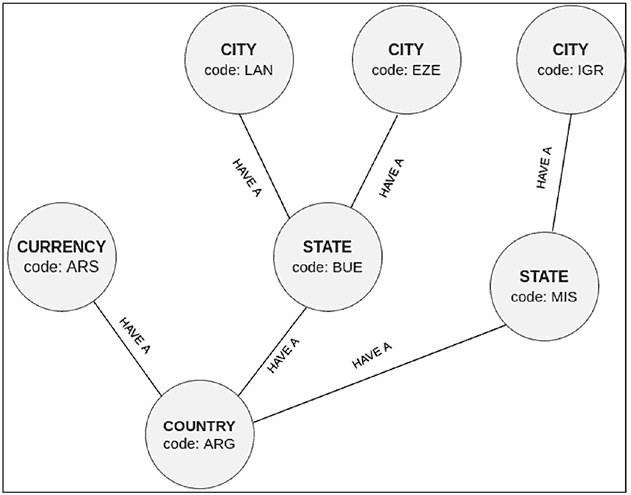

第 9 章 Neo4j：图数据库

***图 9-1.** 节点与连接线表示示例*

这种类型的数据库解决了许多问题，远不止图 9-1 所示的示例，下一节将进行说明。

**可能的用例**

在某些情况下，这些数据库是很好的候选方案，但并没有限制它们在其他场景中的使用。让我们看看几个可能的用途。

• **社交网络**：数据库有助于表示人与人之间的关系，以便查看每个人的动态或发布内容。

• **模拟航班航线**：节点可以是机场和航班。使用节点可以轻松表示或查找特定机场，并检查哪些航班可用于特定目的地。此外，您还可以将此用例应用于其他地面交通方式，如火车或巴士。

• **检测欺诈模式**：您可以对购买行为及其发生的 IP 地址进行建模。如果检测到在短时间内、不同地点发生了多次操作，您可以简化检测过程。

第 9 章 Neo4j：图数据库

• **推荐引擎**：假设您有一个电子商务网站，您的客户购买各种商品。如果产品之间存在一定程度的关联，您可以提供其他可能符合某些条件的选项，例如产品类别。此外，推荐引擎也可用于在 Spotify 上推荐歌曲，或在 Netflix 上推荐新电影。

• **表示层级结构**：如果您是一家大公司的成员，您通常想了解某个人的合作伙伴或上级。通过使用图，您可以轻松地表示和查看公司的组织结构。

**实现方案**

这类数据库有多种实现方案。其中一些已经非常稳定，并被全球众多开发者使用。让我们来了解一下。

• **Neo4j**[¹]：该数据库是最古老的图数据库之一，支持包括 Java 在内的多种语言，并被全球大多数大型公司使用。它提供了使用社区版的可能性，您需要自行负责数据库的管理；或者您也可以选择使用云服务，类似于 MongoDB Atlas。这意味着您需要为服务的使用付费，但可以轻松配置备份、恢复以及运行的实例数量。关于该数据库，有大量的书籍、文章、StackOverflow 讨论和视频。附录 F 列出了一些推荐书籍。

• **Redis Graph**[²]：这个基于 Redis 的数据库提供了使用图的可能性。这个幕后工具实现了 GraphBLAS，它定义了一组矩阵结构（环结构）来进行图的表示。这种数据库模型具有优势，

[¹]: https://neo4j.com/v2/
[²]: https://redis.io/docs/stack/graph/

第 9 章 Neo4j：图数据库


类似于性能，并使用 openCypher3 来编写和执行查询。你可以将其作为一个需要添加到 Redis 实例中的模块来使用，但关于该主题的文章、书籍和视频并不多，因此如果出现异常情况，你可能找不到答案。

• **Amazon Neptune**:4 这是一个图数据库的自定义实现，可在 AWS 环境中运行。在该环境中，你需要为数据库消耗的内存/CPU 付费，并根据数据库接收的入站/出站流量支付一定费用。该数据库的主要特点是易于自动扩展，因为你将所有事务都委托给 AWS，并且可以降低读取实例之间的加载延迟，以及在无需任何操作的情况下增加存储容量。

本书使用 Neo4j，一个流行的图数据库。自早期版本起，Spring Data 就为该数据库提供了广泛支持，从而降低了其使用复杂度。

**什么是 Neo4j？**

Neo4j 是一个图数据库，支持像关系数据库一样的 ACID 属性，你可以在不宕机或丢失信息风险的情况下扩展数据库。该数据库针对跨节点查询以获取特定信息进行了优化。它被用于那些通过 GraphQL 暴露接口的应用程序中。5

以下是其最相关的特性。

• 无需进行连接操作即可获取存储在另一个节点上的信息，因为它可以直接获取相连的邻近节点的信息。

• 它提供了一个灵活且简单的数据模型，可以毫无问题地进行更改。

3 [`opencypher.org/`](https://opencypher.org/)

4 [`aws.amazon.com/neptune`](https://aws.amazon.com/neptune)

5 [`graphql.org/`](https://graphql.org/)

第 9 章 Neo4j：图数据库

• 许多语言都支持它，包括 Java、Scala 和 Node.js。

• 它提供了一种声明式语言来编写人类可读的查询。

关系数据库与 Neo4j 之间存在一定的相似性，这有助于你理解 Neo4j 的组织方式，如表 9-1 所示，该表解释了 Spring Data Neo4j 中出现的一些注解。6

***表 9-1.** 两种数据库之间的等价关系*

**关系数据库**

**Neo4j**

数据库

数据库

表

节点

列

属性

约束

关系

让我们来审视这些概念。

• **节点** 代表一个对象，它可以拥有一个或多个按标准分组的属性。作为 Neo4j 官方文档的建议，名称的定义需要使用驼峰命名法。7

• Neo4j 中的 **属性** 代表一个键值对，用于存储关于一个节点及其关系的信息。例如，在 api-catalog 中，一个属性可以是国家代码或描述。Neo4j 支持的部分属性类型包括字符串、浮点数、长整型、日期（所有变体）和点。

• **关系** 连接一个或多个节点，在大多数情况下是单向的，但也可以实现双向连接。

6 [`spring.io/projects/spring-data-neo4j`](https://spring.io/projects/spring-data-neo4j)

7 [`neo4j.com/developer/cypher/style-guide/`](https://neo4j.com/developer/cypher/style-guide/)

第 9 章 Neo4j：图数据库

**注意** 有许多工具可以在不创建查询的情况下绘制图形。其中最相关的是 arrows，8 Neo4j 支持该工具。你可以拖放节点，包括它们之间的链接，并包含属性，完成后，你可以导出结果，这可以是一个在 Neo4j 浏览器中运行的 Cypher 查询。

**Spring Data Neo4j 简介**

Spring Data 通过直接与驱动程序协作来支持数据库。在 Neo4j 中，Spring Data Neo4j9 项目已经存在多年，旨在帮助降低数据库配置和实体的复杂度。


关于此项目实现的一个考量点是对使用 Neo4j 集群的支持；这是可行的，但需要在数据库和 **application.yml** 中进行额外配置。

**数据库与连接设置**

在本节中，你将了解如何使用 Neo4J 配置之前的 api-catalog，但排除了关于数据库安装和配置的所有细节，这些内容你可以在附录 E 中查看。

让我们将 Neo4j 依赖项添加到 api-catalog 中（参见清单 9-1）。你无需显式包含 Neo4j 驱动程序，因为该依赖项已包含它。遵循同样的规则，不要包含 Spring Data Neo4j 的依赖版本。只需包含该依赖项，并将版本选择委托给 Spring Boot，它会选择最佳版本。

***清单 9-1.*** 与 Neo4j 相关的依赖项

<dependency>

<groupId>org.springframework.boot</groupId>

<artifactId>spring-boot-starter-data-neo4j</artifactId>

</dependency>

8 [`arrows.app/`](https://arrows.app/)

9 [`spring.io/projects/spring-data-neo4j`](https://spring.io/projects/spring-data-neo4j)

第 9 章 Neo4j：图数据库

下一步是向 **application.yml** 引入配置，以使用与你机器上运行的 Neo4j 数据库相关的信息（参见清单 9-2）。

***清单 9-2.*** Spring Data Neo4j 的连接信息

spring:

neo4j:

uri: bolt://localhost:7474

database: catalog

authentication:

username: neo4j

password: changeme

如果仅凭此配置，按照附录 C 中的说明运行应用程序，什么也不会发生。应用程序只会尝试连接数据库。

2022-08-24 17:52:08.996 WARN 1111093 --- [ restartedMain] JpaBaseConfigur
ation$JpaWebConfiguration : spring.jpa.open-in-view is enabled by default.
Therefore, database queries may be performed during view rendering.
Explicitly configure spring.jpa.open-in-view to disable this warning
2022-08-24 17:52:09.353 INFO 1111093 --- [ restartedMain] org.neo4j.
driver.Driver : Direct driver instance 1081373891 created
for server address localhost:7474
2022-08-24 17:52:09.705 INFO 1111093 --- [ restartedMain]
o.s.b.w.embedded.tomcat.TomcatWebServer : Tomcat started on port(s): 8090
(http) with context path '/api/catalog'
2022-08-24 17:52:09.723 INFO 1111093 --- [ restartedMain] c.apress.
catalog.ApiCatalogApplication : Started ApiCatalogApplication in 4.94
seconds (JVM running for 5.543)

为了继续示例，请删除关系数据库中的所有内容，例如 JPA 的依赖项、PostgreSQL 的驱动程序以及 **application.yml** 中的配置。同时，删除实体中的所有注解，但不要更改任何字段的名称，因为下一节将对此进行介绍。

第 9 章 Neo4j：图数据库

**实体的注解**

在 Spring Data Neo4j 中，有一组注解可以应用于实体，以指示每个字段或类的含义。让我们在表 9-2 中探讨一些最相关的注解。

***表 9-2.** 最常见的 Neo4j 实体注解*

**Spring Data Neo4j 注解** **含义**

@Node 此注解向 Spring Data 指示该类是候选对象，用于将信息持久化到数据库中。

@Id 此注解指示该属性需要是唯一的，并充当关系数据库中的主键。

@relationship 使用此注解，你可以指示两个实体之间存在某种程度的关系。你可以将此注解视为 JPA 中 @OneToMany、@OneToOne 和 @ManyToMany 注解的组合。

@GeneratedValue 此注解指示该属性需要使用某种机制生成；它与 JPA 中同名的注解类似。

@property 使用此属性来指示需要持久化的属性名称，使其仅包含特定值。它类似于 JPA 中的普通列。

**注意** 其中一些注解在之前的版本中有所更改，因此如果你有任何


问题可能不尽相同；例如，早期版本中的注解 @**Node** 现在是 @**NodeEntity**。

与 Spring Data 其他数据库实现的主要区别在于，当您指明一个实体与其他实体存在关系时，它会尝试像 JPA 中的级联操作一样持久化所有信息，并检测数据库中是否已存在该节点，以避免重复信息，从而在节点之间创建关系。

清单 9-3 修改了之前的 Country 实体，使用表 9-1 中的 Neo4j 注解来持久化信息。

第 9 章 Neo4j：图数据库

***清单 9-3.*** Neo4j 实体的定义

import org.springframework.data.neo4j.core.schema.*;

import java.io.Serializable;

import java.util.List;

import java.util.Objects;

@Node("Country")

public class Country implements Serializable {

@Id

@GeneratedValue

private Long id;

@Property("code")

private String code;

@Property("name")

private String name;

@Property("locale")

private String locale;

@Property("timezone")

private String timezone;

@Property("enabled")

private Boolean enabled = Boolean.TRUE;

@Relationship("currency")

private Currency currency;

@Relationship("states")

private List<State> states;

// 之前的 setter 和 getter 方法

// 重写 hashCode 和 equals 方法

}

第 9 章 Neo4j：图数据库

注解的使用非常简单。您可以在类的属性中为 @**Property** 或 **@Relationship** 注解指定值，但这是可选的。如果您不指定值，Spring Data Neo4j 会认为数据库中的属性名称与类中的属性名称相同。同样，如果您在某个属性上不使用注解，Spring Data Neo4j 会决定以该属性相同的名称将信息持久化到数据库中。

下一步是声明与 **Country** 存在关系的其他实体，例如 **State** 和 **Currency**。我们以其中一个为例，展示定义所有这些实体的格式，如清单 9-4 所示。

***清单 9-4.*** State Neo4j 实体的定义

import org.springframework.data.neo4j.core.schema.Id;

import org.springframework.data.neo4j.core.schema.Node;

import org.springframework.data.neo4j.core.schema.Relationship;

import java.io.Serializable;

@Node("State")

public class State implements Serializable {

@Id

private Long id;

private String code;

private String name;

private Boolean enabled = Boolean.TRUE;

private @Relationship Country country;

// 之前的 setter 和 getter 方法

// 重写 hashCode 和 equals 方法

}

两个实体的定义没有区别。您需要在另一个类中包含属性，以指明如何建立双向关系。如果您不包含任何用于指明关系的属性并运行应用程序，您将看到一个异常，提示您需要包含 countryId 属性。

第 9 章 Neo4j：图数据库

**使用 Repository 访问**

在这种情况下，Repository 的使用与其他数据库的实现非常相似。但在幕后，Spring Data 使用 Neo4jTemplate10 通过驱动程序的一部分来执行操作。

例如，您可以使用通用的 CrudRepository<T, ID> 和 PagingAndSortingRepository<T, ID> 以与 JPA 相同的方式执行查询，但请注意，只有较新的版本才能通过编写特定查询来限制和跳过节点数量（参见清单 9-5）。

***清单 9-5.*** Neo4j Repository 的定义

public interface CountryRepository extends CrudRepository<Country, Long> {

List<Country> findByCode(String code);

}

启用 Repository 并在数据库中执行操作的最后一步，是在主类或配置类中添加 @**EnableNeo4jRepositories** 注解（参见清单 9-6）。为简单起见，我们仅在主类中添加。


***清单 9-6.*** 为 Neo4j 启用仓库

import org.springframework.boot.SpringApplication;

import org.springframework.boot.autoconfigure.SpringBootApplication;

import org.springframework.data.neo4j.repository.config.

EnableNeo4jRepositories;

@SpringBootApplication

@EnableNeo4jRepositories("com.apress.catalog.repository")

public class ApiCatalogApplication {

public static void main(String[] args) {

SpringApplication.run(ApiCatalogApplication.class, args);

}

}

10 [`docs.spring.io/spring-data/neo4j/docs/current/api/org/springframework/`](https://docs.spring.io/spring-data/neo4j/docs/current/api/org/springframework/data/neo4j/core/Neo4jTemplate.html)

[data/neo4j/core/Neo4jTemplate.html](https://docs.spring.io/spring-data/neo4j/docs/current/api/org/springframework/data/neo4j/core/Neo4jTemplate.html)

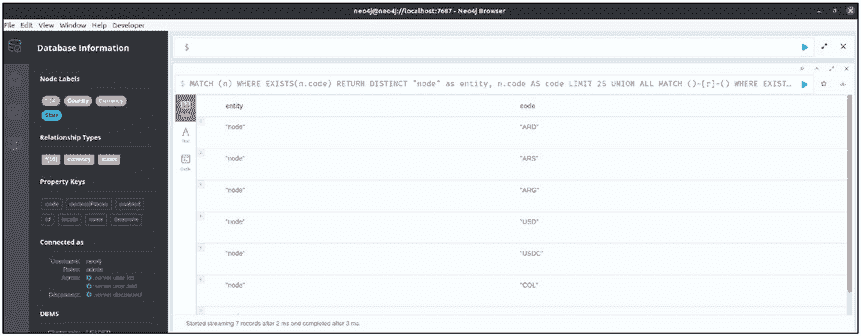

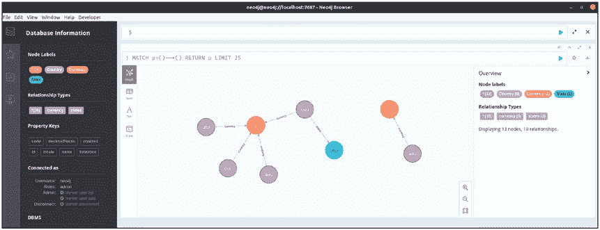

第 9 章 Neo4j：图数据库

最后一步是重新运行应用程序，并在国家端点（即 [`localhost:8080/api/catalog/country`](http://localhost:8080/api/catalog/country)）上执行 POST 操作。这将用信息填充数据库，并使用推荐工具 Neo4j Desktop 检查其显示效果。如果你想了解关于如何运行此工具或 Neo4j 数据库的更多信息，请查看附录 E。

如果你插入具有相同货币对象或州的不同国家，你将得到一个类似于图 9-2 的图。你也可以通过选择屏幕左侧的某个属性，以表格形式查看信息，如图 9-3 所示。

***图 9-2.** 数据库中实体的表示*

***图 9-3.** 数据库中实体的表格形式表示*

第 9 章 Neo4j：图数据库

关于此工具，最后要提的一点是，你可以查看用于显示结果的已执行查询。如果你想编写一个经过测试的特定查询，并将其包含到仓库中，这一点非常重要。例如，以下代码块包含一个查询，用于获取具有相同代码的货币列表。

**使用注解编写查询**

与其他数据库相比，没有显著差异。Spring Data Neo4j 提供了编写查询并将其作为仓库方法的一部分来简单访问数据库的可能性。只需记住，事先在工具中检查查询，以验证语法是否正确。

public interface CurrencyRepository extends

CrudRepository<Currency, Long> {

//之前的源代码

@Query("MATCH(currency:Currency) WHERE currency.code =~code RETURN

currency")

List<Currency> retrieveByCode(String code);

}

作为最后一条建议，如果查询非常复杂且涉及许多属性，请将查询提取到接口内的一个变量中。保持方法声明的简洁性。

**自定义仓库**

Spring Data 的大多数项目都提供了不使用专属仓库的可能性；你可以创建一个使用 Neo4jTemplate 的自定义仓库，它提供了与仓库相同的执行操作的可能性，但无法享受所有逻辑已创建带来的全部好处。

清单 9-7 创建了一个自定义仓库，其中包含使用 **CountryService** 替换它的主要操作。

第 9 章 Neo4j：图数据库

***清单 9-7.*** 自定义仓库接口的定义

package com.apress.catalog.repository;

import com.apress.catalog.model.Country;

import java.util.Optional;

public interface CustomCountryRepository {

Country save(Country entity);

Optional<Country> findById(Long id);

void deleteById(Long id);

}

创建仓库接口后，下一步是定义仓库的实现，该实现使用 Neo4jTemplate（见清单 9-8）。与非关系型数据库的先前示例一样，此仓库不支持 @Transactional。

***清单 9-8.*** 仓库实现

@Repository


public class CustomCountryRepositoryImpl implements

CustomCountryRepository {

private final Neo4jTemplate neo4jTemplate;

@Autowired

public CustomCountryRepositoryImpl(Neo4jTemplate neo4jTemplate) {

this.neo4jTemplate = neo4jTemplate;

}

@Override

public Country save(Country entity) {

return neo4jTemplate.save(entity);

}

@Override

public Optional<Country> findById(Long id) {

return neo4jTemplate.findById(id, Country.class);

}

第 9 章 Neo4j：图数据库

@Override

public void deleteById(Long id) {

neo4jTemplate.deleteById(id, Country.class);

}

}

使用模板定义自定义仓库的方式，与使用查找操作进行删除时的普通仓库方法非常相似。你需要指明要搜索的实体。此外，你还可以使用 Cypher 语言执行 `Neo4jTemplate` 查询。

**按示例查询**

对于此数据库，你可以使用与之前数据库相同的功能，基于一个对象的值来创建查询。你只需让你的仓库继承自 `QueryByExampleExecutor<T>`（参见清单 9-9）。

***清单 9-9.*** 添加接口以使用 QueryByExample<Country>

public interface CountryRepository extends CrudRepository<Country, Long>,

QueryByExampleExecutor<Country> {

}

下一步是在你的服务中创建一个新方法，该方法接收一个包含部分国家名称的字符串作为参数，并且匹配器需要指明查找条件。为避免重复上一章的所有逻辑，清单 9-10 仅展示了负责创建示例并执行查询的代码块。

***清单 9-10.*** 示例

*import com.apress.catalog.dto.CountryDTO*;

import com.apress.catalog.mapper.ApiMapper;

import com.apress.catalog.model.Country;

import com.apress.catalog.model.State;

import com.apress.catalog.repository.CountryRepository;

import com.apress.catalog.repository.StateRepository;

import org.springframework.beans.factory.annotation.Autowired;

import org.springframework.data.domain.Example;

第 9 章 Neo4j：图数据库

import org.springframework.data.domain.ExampleMatcher;

import org.springframework.stereotype.Service;

import org.springframework.transaction.annotation.Isolation;

import org.springframework.transaction.annotation.Transactional;

import jakarta.validation.ConstraintViolation;

import jakarta.validation.ConstraintViolationException;

import jakarta.validation.Validator;

import java.util.List;

import java.util.Optional;

import java.util.Set;

@Service

public class *CountryService* {

*CountryRepository* countryRepository;

*StateRepository* stateRepository;

*Validator* validator;

*@Autowired*

*public* CountryService( *CountryRepository countryRepository*,

*StateRepository stateRepository*,

*Validator validator*) {

*this*.countryRepository = *countryRepository*;

*this*.stateRepository = *stateRepository*;

*this*.validator = *validator*;

}

*public List*< *CountryDTO*> getAll( *String name*) {

*List*< *CountryDTO*> response = *null*;

// 声明示例，包含要在数据库中查找的名称，包括空值

*ExampleMatcher* matcher = *ExampleMatcher*. *matching*()

.withIgnorePaths("code")

.withIncludeNullValues()

.withMatcher("name", *ExampleMatcher*. *GenericPropertyMatcher*. *of* ( *ExampleMatcher*. *StringMatcher*.DEFAULT));

第 9 章 Neo4j：图数据库

*Country* entity = *new* Country();

entity.setName( *name*);

*// 使用示例在仓库中查找*

*Iterable*< *Country*> country = countryRepository.

findAll( *Example*. *of*(entity, matcher));

*if*(country != *null*) {

response = *ApiMapper*.INSTANCE.entityToDTO(country);

}

*return* response;

}

}

你可以通过调用 GET 方法（[`localhost:8080/api/catalog/country`](http://localhost:8080/api/catalog/country)）来测试此逻辑，该方法会返回国家列表，即 GET [`localhost:8080/api/catalog/country`](http://localhost:8080/api/catalog/country)。


[localhost:8080/api/catalog/country p](http://localhost:8080/api/catalog/country) 作为查询参数传递一个名称。

**摘要**

本章概述了 Neo4j。这个数据库并非适用于所有情况的银弹。在许多情况下，Neo4j 并非最佳选择；更好的做法是使用像 Redis 或 MongoDB 这样的数据库。请探索你的选择，以确定最适合解决你特定需求的数据库。

**第 10 章**

**Cassandra：宽列**

**数据库**

到目前为止，你所看到的非关系型数据库可以拥有特定的信息副本，但这意味着你需要配置一个主节点来指示从节点。另一个问题是如何复制信息，这有时需要一定的配置知识。

本章将解释 Cassandra 如何让你能够增加节点数量，而无需指明哪个是主节点，至少在 Spring Data for Apache Cassandra 的配置中是这样。

**什么是 Cassandra？**

Cassandra2 是一个由 Apache 创建的开源宽列数据库。许多开发者使用这个数据库，因为它为某些操作提供了高性能、水平扩展的可能性，以及像非关系型数据库一样的灵活模式。

Cassandra 的理念是拥有一定数量的节点，信息通过分区键（类似于关系数据库中的主键）分布在这些节点上，这样你可以在一台实例中有一行数据，在另一个节点中有另一行数据。图 [10-1 说明了这一点。

1 [`spring.io/projects/spring-data-cassandra`](https://spring.io/projects/spring-data-cassandra)

2 [`cassandra.apache.org/_/index.html`](https://cassandra.apache.org/_/index.html)

© Andres Sacco 2023

A. Sacco, *Beginning Spring Data*[, https://doi.org/10.1007/978-1-4842-8764-4_10](https://doi.org/10.1007/978-1-4842-8764-4_10#DOI)

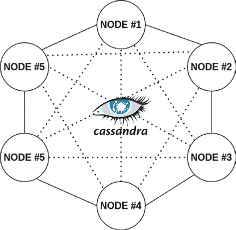

第 10 章 Cassandra：宽列数据库

***图 10-1.** Cassandra 中的节点架构*

以下是这些数据库的一些主要优势。

• **高度可扩展**：你可以无停机地添加或移除节点。每个新节点会向其他已存在的节点报告，以便它们注册并分发信息。

• **高性能**：没有中央节点或主节点来做决策，其他节点进行复制。在这个数据库中，所有节点都扮演相同的角色。图 10-2 展示了信息如何分布在不同节点上。

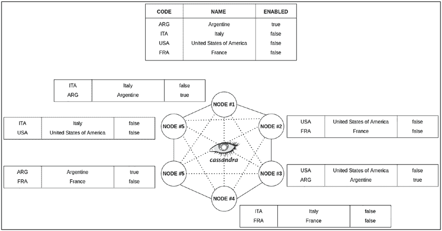

第 10 章 Cassandra：宽列数据库

***图 10-2.** 信息的分布与复制*

• **高可用性**：存储在一个节点上的信息会复制到其他节点上，你可以指定复制因子。此外，你还可以跨不同区域或云提供商复制信息。

• **信息过期**：行可以像 Redis 一样拥有 TTL（生存时间）；之后，该行就会消失。

• **适合分析**：这类数据库非常适合执行与大数据相关的操作。

**注意** 请记住，非关系型数据库并不能涵盖 CAP 定理 3 的所有方面，因为不可能同时保证这三个属性，所以你需要牺牲其中一个。

本书的范围并非解释该定理，只是作为概念的一点回顾。图 10-3 说明了主要思想。

3 [`www.ibm.com/cloud/learn/cap-theorem`](https://www.ibm.com/cloud/learn/cap-theorem)

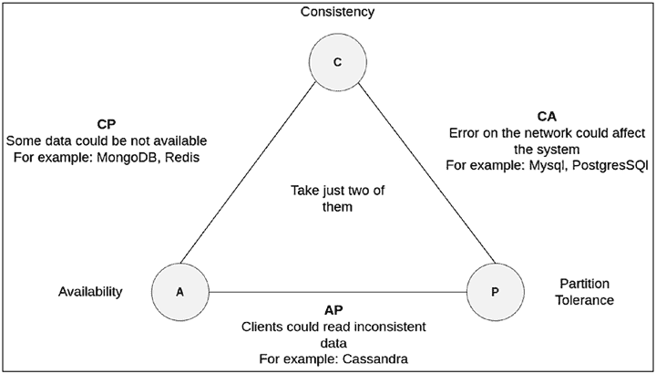

第 10 章 Cassandra：宽列数据库

***图 10-3.** CAP 定理*

**结构**

Cassandra 提供了一种类似于 SQL 的语言，称为 CQL（Cassandra 查询语言），用于执行某些操作，例如向数据库中插入/更新/读取信息。在某些方面，它与关系数据库之间存在一定的对应关系。


以及 Cassandra 在信息组织方式上的异同。表 10-1 对此进行了说明。

***表 10-1.** 模型对应关系*

**关系型模型 Cassandra 模型**

数据库

键空间

表

列族

主键

行键

列名

列名/键

列值

列值

这种对应关系并不意味着所有概念完全相同，而是一种便于建立思维导图的表示方式。下面逐一介绍各个概念。

第 10 章 Cassandra：宽列数据库

• **键空间**：该结构包含表或列族，并指示数据库的复制因子。你可以指定跨数据中心或云提供商存在多少个信息副本。

• **列族**：这是一种存储行和列的类型，具有特定数量的分区，这意味着表中的所有信息并非都存在于同一个节点上。信息可以分布在不同的复制节点中。

• **行键**：该结构包含一个分区键或行键，所有行都必须包含此键，以确定信息存储在哪个节点上。

• **列名/键**：作为辅助键，可用于特定操作。

• **列**：存储特定信息的单个列。

**配置**

在本节中，你将了解如何使用 Cassandra 配置之前的 api-catalog，但省略了数据库安装和配置的所有细节（这些内容可参见附录 E）。

在按建议修改微服务之前，请移除所有与 Spring JPA 相关的依赖项和注解，包括 DB 文件夹中的脚本。

**数据库和连接设置**

让我们以非响应式方式将 Cassandra 依赖项添加到 **api-catalog** 中，因为该数据库（Spring Boot 提供的另一种非关系型数据库）支持这两种方式，这将在下一章中介绍。同样，不要在依赖项中包含版本号（参见清单 10-1），因为 Spring Boot 知道最佳选择。

第 10 章 Cassandra：宽列数据库

***清单 10-1.*** 与 Cassandra 连接的依赖项

<dependency>

<groupId>org.springframework.boot</groupId>

<artifactId>spring-boot-starter-data-cassandra</artifactId>

</dependency>

此依赖项包含一个特定版本的驱动程序，因此你无需在 pom 文件中指定任何版本。如果你对 Spring Boot 提供的驱动程序特定版本有问题，可以在 pom 中包含该依赖项来覆盖它。

下一步是在 **application.yml** 中引入配置，以使用与 Cassandra 数据库相关的机器信息（参见清单 10-2）。

***清单 10-2.*** Apache Cassandra 的 Spring Data 连接信息

spring:

data:

cassandra:

keyspace-name: twa

schema-action: recreate

local-datacenter: datacenter1

contact-points: # Cassandra 的不同节点

- 127.0.0.1:9042

- 127.0.0.1:9043

- 127.0.0.1:9044

**application.yml** 中定义的属性值与 GitHub 仓库中与 Cassandra 相关的 **docker-compose.yml** 中的配置相对应。清单 10-2 中的连接点是你在机器上运行的 Cassandra 实例。为简化讨论，我们使用 schema action 的 **recreate** 值，该值会删除表并重新创建它们。

让我们从实体修改开始，包括添加注解以指示每个集群的主键以及用于分区的键（参见清单 10-3）。

第 10 章 Cassandra：宽列数据库

***清单 10-3.*** Spring Data 和 Apache Cassandra 的连接信息 import com.datastax.oss.driver.api.core.uuid.Uuids;

import org.springframework.data.cassandra.core.cql.Ordering;

import org.springframework.data.cassandra.core.cql.PrimaryKeyType;

import org.springframework.data.cassandra.core.mapping.Column;

import org.springframework.data.cassandra.core.mapping.PrimaryKeyColumn;


import org.springframework.data.cassandra.core.mapping.Table;

import java.io.Serializable;

import java.util.List;

import java.util.UUID;

@Table("country")//与 JPA 的包不同

public class Country implements Serializable {

@PrimaryKeyColumn(

name = "id",

type = PrimaryKeyType.CLUSTERED,

ordering = Ordering.DESCENDING)

private UUID id = Uuids.timeBased();

@PrimaryKeyColumn(

name = "code",

type = PrimaryKeyType.PARTITIONED,

ordering = Ordering.DESCENDING)

private String code;

@Column

private String name;

//其他列

@Column("currency")

private Currency currency;

@Column("states")

private List<State> states;

//之前的 setter 和 getter 方法

}

第 10 章 Cassandra：宽列数据库

JPA 定义事物的方式存在差异。Cassandra 允许你指定信息的顺序，如清单 10-3 所示，但仅限于@**PrimaryKeyColumn**，因为其他列无法进行过滤。普通查询需要使用@**Column**注解来指定，如果列名与数据库中的实际名称不同，你可以在该注解中指定真实名称。

在前面的示例中，有些列是对象，这是与 JPA 的主要区别之一，因为你可以像保存 JSON 一样在列中保存复杂对象。现在，如果你仅修改 Country 实体并运行应用程序，控制台上会出现一个异常，提示某些复杂对象的列存在问题。发生这种情况是因为你需要指定那些非实体的其他对象。为此，你只需在 Currency 类中包含**@UserDefinedType("currency")**注解（参见清单 10-4）。

***清单 10-4.*** Spring Data 与 Apache Cassandra 的连接信息 import org.springframework.data.cassandra.core.mapping.UserDefinedType;

import java.io.Serializable;

@UserDefinedType("currency")

public class Currency implements Serializable {

//之前的属性，无需任何注解

}

下一步是定义仓库，这些仓库在不同数据库之间没有太大变化（参见清单 10-5）。在编写自定义方法执行查询之后，有一些事项需要考虑。

***清单 10-5.*** Cassandra 仓库

public interface CountryRepository extends CrudRepository<Country, Long> {

List<Country> findByCode(String code);

}

**注意** 与其他非关系型数据库的一大区别是，你无需使用特定注解来为 Cassandra 启用仓库。

第 10 章 Cassandra：宽列数据库

这个仓库可以正常工作，因为方法名涉及一个分区键，因此 Spring Data for Apache Cassandra 可以创建并执行查询。如果你尝试按其他属性（如时区）进行过滤，则会抛出一个异常，提示该操作无效。

**注意** 由 com.datastax.driver.core.exceptions.invalidQueryexception 引起：无法执行此查询，因为它可能涉及数据过滤，从而导致不可预测的性能。如果你不顾性能不可预测性而仍想执行此查询，请使用 allow Filtering。

驱动程序建议你在方法中使用**@Query(allowFiltering = true)**注解来执行该操作。此注解可能会引发与性能相关的问题，因为你可能尝试执行驱动程序默认不支持的操作。如果你需要按非分区键的其他属性进行过滤，那么使用像 Cassandra Web 这样的工具来更改数据库中的列定义可能是个好主意。

**注意** 该数据库提供了一种类似于 JPA 的方式来编写完整查询并在仓库中声明。

public interface CountryRepository extends CrudRepository<Country, Long> {

// 手动查询

@Query("SELECT c FROM country c where c.code = :code")

Currency retrieveByCode(@Param("code") String code);

}

现在，如果你运行应用程序，在后台，Spring Data for Apache Cassandra


生成包含关系的表结构，你可以在 Cassandra Web 上通过 localhost:3000 进行查看。如果你想了解更多关于如何运行此工具和数据库的信息，请查看附录 E。

如果你访问可视化工具来检查数据库的状态，你会看到类似图 10-4 的内容。

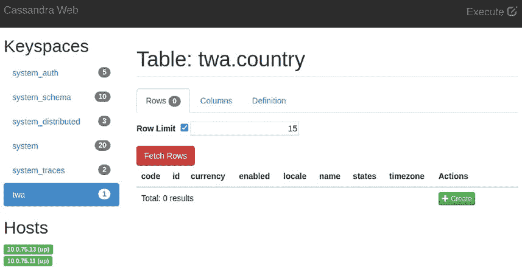

第 10 章 Cassandra：宽列数据库

***图 10-4.** 微服务启动后生成的表*

如果你点击 Definition 链接检查表的定义，你会看到类似如下的结构，你将查询的创建和执行委托给了 Spring Data for Apache Cassandra。

CREATE TABLE twa.country (

code text,

id uuid,

currency frozen <currency>,

enabled boolean,

locale text,

name text,

states list<frozen<twa.state {code text, countryid text, enabled boolean,

id bigint, name text}>>,

timezone text,

PRIMARY KEY ((code, id))

)

WITH bloom_filter_fp_chance = 0.01

AND caching = {'keys': 'ALL', 'rows_per_partition': 'NONE'}

AND comment = ''

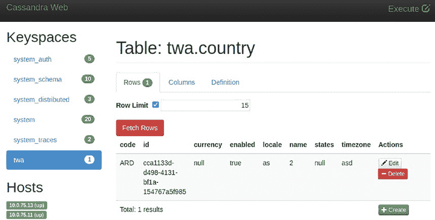

第 10 章 Cassandra：宽列数据库

AND compaction = {'class': 'SizeTieredCompactionStrategy', 'max_

threshold': '32', 'min_threshold': '4'}

AND compression = {'chunk_length_in_kb': '16', 'class': 'LZ4Compressor'}

AND crc_check_chance = 1.0

AND dclocal_read_repair_chance = 0.0

AND default_time_to_live = 0

AND gc_grace_seconds = 864000

AND max_index_interval = 2048

AND memtable_flush_period_in_ms = 0

AND min_index_interval = 128

AND read_repair_chance = 0.0

AND speculative_retry = '99p';

下一步是检查仓库中的方法是否正常工作。通过向 http://localhost:8080/api/catalog/country POST 方法发送请求，执行向数据库插入国家的操作。如果一切正常，你可以进入 Cassandra Web 并检查行数据是如何存储在数据库中的（参见图 10-5）。

***图 10-5.** 信息在表中的存储方式*

第 10 章 Cassandra：宽列数据库

最后一件你可以做的事情是停止其中一个节点，以检查信息会发生什么变化，以及 Spring Data for Apache Cassandra 如何应对。让我们停止 Cassandra 的第一个节点，然后重新运行应用程序进行检查。当你使用 docker-compose 文件时，只需执行 **docker-compose stop** 命令即可停止节点。

2022-08-23 23:07:54.364 WARN 904342 --- [ s0-admin-1]

c.d.o.d.i.c.control.ControlConnection : [s0] Error connecting to

Node(endPoint=/127.0.0.1:9043, hostId=null, hashCode=434203ad), trying

next node (ConnectionInitException: [s0|control|connecting...] Protocol

initialization request, step 1 (OPTIONS): failed to send request (io.netty.

channel.StacklessClosedChannelException))

2022-08-23 23:07:54.564 WARN 904342 --- [ s0-admin-0] c.d.o.d.i.c

.l.h.OptionalLocalDcHelper : [s0|default] You specified datacenter1

as the local DC, but some contact points are from a different DC:

Node(endPoint=/127.0.0.1:9042, hostId=null, hashCode=1a8bfdf6)=null,

Node(endPoint=/127.0.0.1:9043, hostId=null, hashCode=434203ad)=null; please

provide the correct local DC, or check your contact points

应用程序指示其中一个节点出现问题，但仍在继续工作，你可以通过调用 GET 端点来检查信息是否可用。

**定义自定义仓库**

Cassandra 数据库可以创建一个使用 **CassandraTemplate** 场景的自定义仓库，但这意味着你必须定义所有操作。让我们从创建接口开始，该接口包含 api-catalog 工作所需的所有操作（参见清单 10-6）。

***清单 10-6.*** Cassandra 自定义仓库

public interface CustomCountryRepository {

Country save(Country entity);

Optional<Country> findById(Long id);

void deleteById(Long id);

}

第 10 章 Cassandra：宽列数据库

下一步是创建一个实现这些方法的具体类，并执行


使用 CassandraTemplate 的操作（参见清单 10-7）。该模板的主要优势在于，它与常见仓库（如 `findById` 或 `deleteById`）中的方法存在一定的等价性。

***清单 10-7.*** 自定义仓库的实现

import com.apress.catalog.model.Country;

import com.apress.catalog.repository.CustomCountryRepository;

import com.datastax.oss.driver.api.querybuilder.QueryBuilder;

import org.springframework.data.cassandra.core.CassandraOperations;

import org.springframework.data.cassandra.core.mapping.Table;

import org.springframework.stereotype.Repository;

import org.springframework.util.StringUtils;

import java.time.Duration;

import java.util.Optional;

import java.util.UUID;

@Repository

public class CustomCountryRepositoryImpl implements

CustomCountryRepository {

//以简单方式帮助你在数据库上执行操作

private CassandraOperations cassandraTemplate;

public CustomCountryRepositoryImpl(CassandraOperations cassandra

Template) {

this.cassandraTemplate = cassandraTemplate;

}

@Override

public Country save(Country entity) {

return cassandraTemplate.insert(entity);

}

@Override

public Optional<Country> findById(UUID id) {

第 10 章 Cassandra：宽列数据库

return Optional.of(cassandraTemplate.selectOneById(id, Country.

class));

}

@Override

public void deleteById(UUID id) {

cassandraTemplate.deleteById(id, Country.class);

}

}

还有其他方式可以在数据库中执行查询，这些方式并不直接涉及使用 CassandraTemplate。一种替代方案是使用 `QueryBuilder` 类来声明你想要执行的操作。例如，让我们使用数据库驱动中的 `QueryBuilder` 来转换 CassandraTemplate 的插入操作。

import com.apress.catalog.model.Country;

import com.apress.catalog.repository.CustomCountryRepository;

import com.datastax.oss.driver.api.core.cql.Statement;

import com.datastax.oss.driver.api.querybuilder.QueryBuilder;

import org.springframework.data.cassandra.core.CassandraOperations;

import org.springframework.data.cassandra.core.mapping.Table;

import org.springframework.stereotype.Repository;

import org.springframework.util.StringUtils;

@Repository

public class CustomCountryRepositoryImpl implements

CustomCountryRepository {

//之前的源代码

//这是另一种向数据库执行插入操作的方式

*private void* insertByDriver( *Country entity*) {

*//使用驱动进行等价操作*

*Statement* query = *QueryBuilder*

. *insertInto*(toTableName( *Country*. *class*))

.value("id", *QueryBuilder*. *literal*( *entity*.getId()))

.value("code", *QueryBuilder*. *literal*( *entity*.getCode()))

.value("name", *QueryBuilder*. *literal*( *entity*.getName()))

.value("enabled", *QueryBuilder*. *literal*( *entity*.getEnabled())) 262

第 10 章 Cassandra：宽列数据库

.build();

cassandraTemplate.execute(query);

}

//这些方法从实体中获取数据库中的表名

@SuppressWarnings("unused")

private *String* toTableName( *Object obj*) {

*return* toTableName( *obj*.getClass());

}

private *String* toTableName( *Class*<?> *type*) {

*Table* tableAnnotation = *type*.getAnnotation( *Table*. *class*);

*return* tableAnnotation != *null* && StringUtils. *hasText*(

tableAnnotation.value())

? tableAnnotation.value()

: *type*.getSimpleName();

}

}

**定义 TTL**

此特性意味着信息仅在特定时间内可用。之后信息会消失，不建议在应用程序中指定此特性，因为根据驱动和 Spring Data for Apache Cassandra 的版本不同，其工作方式存在相关缺陷。因此，建议使用 CQL 定义能力结构，并在该语句中为所有行指定 TTL。

顺便提一下，你也可以使用 `QueryBuilder` 并编写完整的语句来实现。

Statement query = QueryBuilder

.insertInto("country")

.value("id", QueryBuilder.literal(entity.getId()))

.value("code", QueryBuilder.literal(entity.getCode()))


.value("name", QueryBuilder.literal(entity.getName()))

第 10 章 Cassandra：宽列数据库

.value("enabled", QueryBuilder.literal(entity.getEnabled()))

//声明所有要插入的属性

.build();

query.setTimeout(Duration.ofMillis(100L));

**总结**

Spring Data for Apache Cassandra 提供了许多与数据库交互的功能，且不会出现问题。如果框架提供的通用仓库无法满足您的需求，您可以创建自定义仓库并添加所有逻辑。

与其他非关系型数据库相比，Apache Cassandra 具有一些优势，例如无主节点，因此您可以轻松添加新节点。但在应用程序中声明节点时存在一个问题，因为您需要指定每个节点的主机，因此在某些时候，您需要重新部署应用程序。

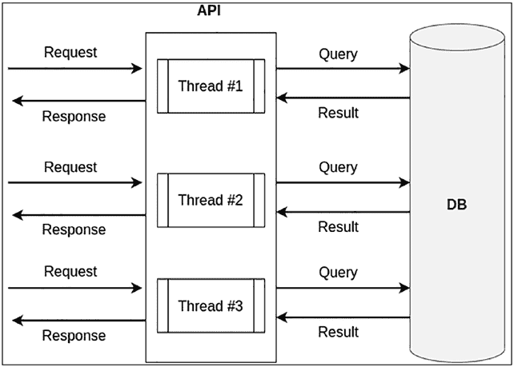

**第 11 章**

**响应式访问**

应用程序通过 HTTP 连接建立的大部分通信都涉及一个请求、一个获取响应的特定过程以及响应（可能是异常或某种类型的信息）。

这种方法会带来一些问题。例如，您需要等待 API 所消费的服务返回结果，然后才能开始处理信息。但如果存在一种机制，能够以流式方式返回信息，从而使您的 API 在获取所有信息之前就能开始执行操作，那会怎样呢？

图 11-1 展示了访问数据库的标准方式。

***图 11-1.** 访问数据库的标准方式*

本章将解释响应式编程如何为这些问题提供解决方案。

© Andres Sacco 2023

A. Sacco, *Beginning Spring Data*[, https://doi.org/10.1007/978-1-4842-8764-4_11](https://doi.org/10.1007/978-1-4842-8764-4_11#DOI)

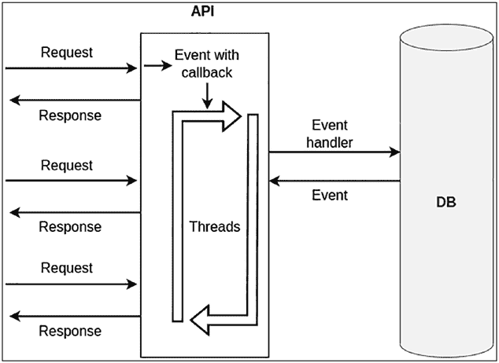

第 11 章 响应式访问

**什么是响应式访问？**

在传统应用程序中，每个请求会在一段时间内分配一个线程来执行特定操作；这种方法被称为“每请求一线程”模型。在此期间，该进程会独占内存和 CPU 资源。图 11-2 展示了大量请求同时访问数据库的情况，在每次操作返回结果之前，会浪费内存/CPU 等资源。响应式编程是一种替代方案，它解决了诸如资源合理利用等问题，从而提高了可扩展性。

***图 11-2.** 访问数据库的响应式方法*

为了从另一个角度理解这个问题，假设您有机会同时接收一千个请求。您的应用程序可能因需要更多资源或需要增加连接池大小等因素而无法扩展。如果减少每个资源的使用时间，您就无需对基础设施或应用程序进行重大更改即可返回结果。

响应式编程背后的理念是不阻塞线程。相反，应用程序将请求视为带有回调的事件。这个概念多年前在 JavaScript 等其他语言中就已流行。它意味着等待直到有结果返回，然后使用回调向请求方发送通知以及操作结果。

第 11 章 响应式访问

在此过程中，应用程序的线程可以用于处理其他请求。信息可以作为信息流返回，这样您可以在收到响应时执行不同的操作，而无需等待获取所有信息。如果在流式处理过程中发生错误，操作将终止，这是合理的，因为在阻塞方法中尝试执行相同操作时也可能发生同样的情况。

在 Spring Boot 中，该框架有一个用于通用响应式编程的项目，称为 Spring WebFlux，它通过使用信息流中的两个事件发布器来实现。

• **Mono<T>** 可以发出零个或一个元素。例如，一个端点


接收一个 id，旨在返回某个实体的所有信息，但可能只返回一个元素。

• **Flux<T>** 表示你将返回零到 N 个元素，直到收到没有更多元素需要发送的通知。

例如，一个端点返回数据库中所有现有的国家。

Spring WebFlux 是返回结果或与其他不直接访问数据库的应用程序进行交互的应用层。对于此操作，有 Spring 项目 1 提供这些能力。

**将查询修改为响应式**

Spring Data 中的响应式支持出现在 2016 年，当时首批访问非关系型数据库（如 MongoDB、Redis、Cassandra 和 Neo4j）的模块版本提供了将查询结果作为信息流获取的可能性。

关系型数据库则是另一种情况。并非所有关系型数据库都支持使用响应式范式。R2DBC2 是与 MySQL、PostgreSQL 和 SQL Server 等数据库进行响应式交互时最常用的库之一，并且有计划增加对其他数据库的支持。

1 [`spring.io/projects/spring-data-r2dbc`](https://spring.io/projects/spring-data-r2dbc)

2 [`r2dbc.io/`](https://r2dbc.io/)

第 11 章 响应式访问

**非关系型数据库**

本节展示了如何在 MongoDB 中实现响应式编程。尽管如此，所有数据库都提供相同的支持，重复四次相同的操作可能会显得冗余。

在 MongoDB 和其他数据库中，将阻塞式应用程序转换为响应式应用程序的复杂性意味着只需进行少量更改。首先，需要引入一个依赖项，该依赖项提供你在仓库中所需使用的所有接口，如清单 11-1 所示。

***清单 11-1.*** MongoDB 响应式依赖项

<dependency>

<groupId>org.springframework.boot</groupId>

<artifactId>spring-boot-starter-data-mongodb-reactive</artifactId>

</dependency>

第二步是启用配置以使用响应式仓库，方法是使用 `@EnableReactiveMongoRepositories` 注解，并创建一个包含配置的特定类，如清单 11-2 所示。

***清单 11-2.*** 启用对响应式访问的支持

import com.mongodb.reactivestreams.client.MongoClient;

import com.mongodb.reactivestreams.client.MongoClients;

import org.springframework.context.annotation.Bean;

import org.springframework.data.mongodb.config.

AbstractReactiveMongoConfiguration;

import org.springframework.data.mongodb.core.ReactiveMongoTemplate;

import org.springframework.data.mongodb.repository.config.

EnableReactiveMongoRepositories;

*//启用对响应式仓库的支持*

@EnableReactiveMongoRepositories

public class MongoReactiveConfiguration

extends AbstractReactiveMongoConfiguration {

*//声明要与数据库一起使用的客户端*

@Bean

public MongoClient mongoClient() {

第 11 章 响应式访问

return MongoClients.create();

}

@Override

protected String getDatabaseName() {

return "catalog";

}

*//声明使用 MongoClient 的响应式 MongoTemplate*

@Bean

public ReactiveMongoTemplate reactiveMongoTemplate() {

return new ReactiveMongoTemplate(mongoClient(), getDatabaseName());

}

}

现在，你的应用程序拥有继承自 **MongoRepository<T, ID>** 的仓库；思路是将其替换为 **ReactiveMongoRepository<T, ID>** 。如果你的仓库继承自 **CrudRepository<T, ID>** ，则需要将它们替换为 **ReactiveCrudRepository<T, ID>** 。

如果你在仓库中定义的自定义方法不做任何更改，那么一切仍将以阻塞方式运行，因此你需要更改每个方法的返回值（参见清单 11-3）。

***清单 11-3.*** 响应式仓库

import com.apress.catalog.model.Country;

import org.springframework.data.mongodb.repository.Query;

import org.springframework.data.mongodb.repository.ReactiveMongoRepository;


import reactor.core.publisher.Flux;

public interface CountryRepository extends ReactiveMongoRepository<Count

ry, Long> {

Flux<Country> findByCode(String code);

//这是一个自定义查询，仅针对单个字段进行查询

@Query(value = "{'code': ?0}")

Flux<Country> findCustom(String code);

第 11 章 响应式访问

//这是一个自定义查询，将方法名称上的条件与查询条件相结合

@Query(value = "{'code': ?0}")

Flux<Country> findEnabled(String code);

}

这些修改会影响期望接收对象而非响应式内容的 Service 类，因此你有两个选择：一是将整个应用程序转换为响应式，这意味着你需要修改所有服务和控制器；二是调用 `block()` 方法，将响应式操作转换为阻塞操作。第二种方法并非最佳方案，因为你虽然支持响应式操作，却以标准方式使用它。这种方法可以作为将 API 转换为响应式的第一步。

本书不会修改所有源代码，因为这样做需要付出大量精力，但源代码的修改实际上只有几行。

**关系型数据库**

关系型数据库与非关系型数据库有很大不同，因为 Spring 默认不提供对响应式方法的支持。在这种情况下，你需要使用一个名为 R2DBC（响应式关系型数据库连接）的库，它为数据库提供了对响应式范式的支持。

该库通过大量会议文章和演讲获得了社区的广泛支持。Spring Data 包含对该库的支持，降低了在 Spring Boot 应用程序中使用的复杂性。不过，目前并非所有关系型数据库供应商都得到支持。每年都会有新的受支持数据库出现，但社区使用最相关的数据库（如 MySQL、PostgreSQL、MariaDB 和 SQL Server）均已获得支持。

以下是编写本书时使用该库的一些限制。

• 你不能使用嵌入式 ID，因此可以生成复合主键。

• 支持 `@Version` 注解，因此你可以继续使用乐观锁。

• 没有自动生成 ID 的功能，因此你需要指明想要使用的 ID 生成策略。

第 11 章 响应式访问

• 如果你的应用程序使用了 `@CreatedDate` 或 `@LastModifiedDate` 注解，仍然可以继续使用，但需要通过 `@EnableR2dbcAuditing` 注解启用 R2DBC 的审计逻辑。

• 你无法通过这种方法自动创建数据库，因此需要一种机制来生成整个数据库结构。一种解决方案是连接到数据库并运行脚本。

在应用程序中使用响应式的第一步是在 `pom.xml` 文件中添加依赖项（参见清单 11-4）。

***清单 11-4.*** 添加在应用程序中使用响应式的依赖项

<dependency>

<groupId>org.springframework.boot</groupId>

<artifactId>spring-boot-starter-data-r2dbc</artifactId>

</dependency>

<dependency>

<groupId>io.r2dbc</groupId>

<artifactId>r2dbc-postgresql</artifactId>

<version>0.8.12.RELEASE</version>

</dependency>

下一步是将 Spring Data 中之前的 `CrudRepository<T, ID>` 替换为新的仓库，这些新仓库提供相同的方法，但以响应式方式实现（参见清单 11-5）。

***清单 11-5.*** 响应式仓库

import com.apress.catalog.model.State;

import org.springframework.data.r2dbc.repository.R2dbcRepository;

import reactor.core.publisher.Flux;

public interface StateRepository extends R2dbcRepository<State, Long> {

Flux<State> findByCode(String code);

Flux<State> findAllByCountryId(Long id);

}

第 11 章 响应式访问

你之前在应用程序中声明的配置不再有效。你需要更改 R2DBC 理解配置的方式（参见清单 11-6）。

***清单 11-6.*** 添加使用响应式的配置

spring:

r2dbc:

username: postgres


password: postgres

url: r2dbc:postgresql://localhost:5432/catalog?autoReconnect=true

pool:

max-create-connection-time: 2s

initial-size: 5

max-size: 10

所有这些改动看起来都很棒，但你需要使用 `@EnableR2dbcRepositories` 注解显式启用对响应式仓库的支持。如果不启用，应用程序会抛出一个异常，提示你未找到任何仓库（参见清单 11-7）。

***清单 11-7.*** 启用对响应式仓库的支持

import org.springframework.boot.SpringApplication;

import org.springframework.boot.autoconfigure.SpringBootApplication;

import org.springframework.data.r2dbc.repository.config.

EnableR2dbcRepositories;

@SpringBootApplication

@EnableR2dbcRepositories(basePackages = "com.apress.catalog")

public class ApiCatalogApplication {

//之前的源代码

}

你的应用程序中存在用于保存审计信息的嵌入式实体，因此在本例中，让我们从所有实体中移除它们。如果你运行应用程序并通过端点开始操作，一切仍能正常工作。

第 11 章 响应式访问

**注意事项**

这种方法具有若干优势。主要问题在于，并非所有数据库都具备全部特性来支持无痛迁移至响应式方法。

存在一些例外情况，例如 MongoDB，其所有特性在两种方法中均可使用。然而，在其他数据库中，迁移意味着数据库层面的变更，例如 **api-catalog** 中的嵌入式对象。这些变更存在一定风险，因此并非轻而易举。

**总结**

本章讨论了响应式方法如何帮助减少应用程序所需的时间和资源数量，因为每个请求并不需要等待所有响应返回结果。非关系型数据库多年前就已支持这种方法。关系型数据库并非所有供应商都提供支持，因此如果你想使用这种方法，请首先检查你的数据库是否支持。

下一章将讨论如何在不将整个应用程序部署到环境中的情况下，测试访问数据库的仓库。

**第 12 章**

**单元测试与集成**

**测试**

测试是你永无止境学习的话题之一，因为新的技术和工具层出不穷，无论是编写测试还是简化执行任务的方式（例如创建模拟对象来检查源代码的某部分是否正常工作）。测试应用程序的原因有很多，并且在无数资源中都有阐述。你希望确保你的逻辑按预期工作，发现潜在的缺陷，并了解是否需要修改源代码以确保一切按计划运行。

**注意** 学习测试的最佳资源之一是 Martin Fowler 的博客 1，其中涉及 BDD、不同类型的测试以及良好实践等主题。

说实话，许多开发者不喜欢编写测试来覆盖基本场景。在这种情况下，花费大量时间测试访问数据库的层（在 Spring Data 中，这通常是一个包含表示自定义查询方法的接口）意义不大。这种方法的主要问题是，你可能会在环境或集成测试中发现查询的问题，而这些测试并不仅仅覆盖数据库访问，例如，我们目录应用程序的端点在保存信息前后会发生变更，因此你可以检查服务层的逻辑是否正常工作。但你无法检查仓库中的一切是否正常。

1 [`martinfowler.com/tags/testing.html`](https://martinfowler.com/tags/testing.html)

© Andres Sacco 2023
A. Sacco, *Beginning Spring Data*[, https://doi.org/10.1007/978-1-4842-8764-4_12](https://doi.org/10.1007/978-1-4842-8764-4_12#DOI)

第 12 章 单元测试与集成测试


不进行正确应用测试的另一个问题是数据库版本。

一些开发者使用像 H2 这样的内存数据库来执行特定测试。这种方法在某些条件下是可行的，但并非所有数据库都具备相同的特性，因此你需要使用应用在所有环境中使用的同一数据库来执行测试。

总而言之，测试数据访问层的主要问题之一是如何*仅*在存储库中执行测试。第二个问题是如何测试数据库访问，以便能够多次执行测试而不会出现问题。在本章中，你将学习这两个问题的解决方案。本书不详细讨论单元测试和集成测试。为此，我建议你查阅 Martin Fowler 的网站。2

**使用 Mock 进行单元测试**

测试 Java/Kotlin 应用最常用的库之一是 JUnit，3 它还有许多其他库可添加额外功能，包括 Spring Boot Test，4 它使用最新版本的 JUnit 来执行某些操作。

**注意** 还有其他 Java 测试替代方案，例如 Spock5 或 TestNG。6

让我们开始创建一个使用 JUnit 的通用单元测试，以检查 **CountryService** 中 **save** 方法的逻辑是否正常工作。首先要做的是添加使用 JUnit 创建和运行单元测试所需的所有依赖项；这些依赖项在最终解决方案中也会复用。清单 12-1 显示了需要在 pom 文件中添加的依赖项，以创建单元测试。

2 [`martinfowler.com/articles/practical-test-pyramid.html`](https://martinfowler.com/articles/practical-test-pyramid.html)

3 [`junit.org/junit5/`](https://junit.org/junit5/)

4 [`docs.spring.io/spring-boot/docs/current/reference/html/features.`](https://docs.spring.io/spring-boot/docs/current/reference/html/features.html#features.testing)

[html#features.testing](https://docs.spring.io/spring-boot/docs/current/reference/html/features.html#features.testing)

5 [`spockframework.org/`](https://spockframework.org/)

6 [`testng.org/doc/`](https://testng.org/doc/)

第 12 章 单元测试与集成测试

***清单 12-1.*** JUnit/Mockito 依赖项

<dependencies>

<dependency>

<groupId>org.mockito</groupId>

<artifactId>mockito-junit-jupiter</artifactId>

<version>4.6.1</version>

<scope>test</scope>

</dependency>

← 其他依赖项 –>

</dependencies>

<build>

<plugins>

← 其他插件 →

<plugin>

<groupId>org.apache.maven.plugins</groupId>

<artifactId>maven-surefire-plugin</artifactId>

<version>${maven-surefire-plugin.version}</version>

</plugin>

</plugins>

</build>

之后，你只需要创建一个测试，检查使用存储库持久化信息的服务是否正常工作（参见清单 12-2）。

***清单 12-2.*** 服务单元测试

import com.apress.catalog.dto.CountryDTO;

import com.apress.catalog.model.Country;

import com.apress.catalog.repository.CountryRepository;

import com.apress.catalog.repository.StateRepository;

import jakarta.validation.Validator;

import org.junit.jupiter.api.BeforeEach;

import org.junit.jupiter.api.Test;

第 12 章 单元测试与集成测试

import static org.junit.jupiter.api.Assertions.assertNotNull;

import static org.mockito.ArgumentMatchers.any;

import static org.mockito.Mockito.mock;

import static org.mockito.Mockito.when;

public class CountryServiceTest {

private CountryService service;

private CountryRepository countryRepository;

private StateRepository stateRepository;

private MapperFacade mapper;

private Validator validator;

@BeforeEach

public void setUp() {

countryRepository = mock(CountryRepository.class);

stateRepository = mock(StateRepository.class);

mapper = mock(MapperFacade.class);

validator = mock(Validator.class);

service = new CountryService(countryRepository, stateRepository,

mapper, validator);

}


//此测试仅检查服务是否正常模拟了所有与数据库的交互

@Test

public void should_save_a_country() {

CountryDTO countryDTO = new CountryDTO();

countryDTO.setEnabled(Boolean.TRUE);

countryDTO.setCode("ARG");

countryDTO.setName("Argentina");

Country country = new Country();

when(countryRepository.save(any())).thenReturn(country);

assertNotNull(service.save(countryDTO));

}

}

第 12 章 单元测试与集成测试

单元测试不检查**CountryRepository**的任何内容，这很合理，因为它不属于类的代码，而是一个接口，这意味着测试这类对象并不简单。有些方法会创建一个继承自该仓库并使用`DataSource`访问数据库的具体类。然而，这种解决方案并非最佳，因为你需要创建额外的对象并修改应用程序的逻辑来进行测试。

**使用数据库进行集成测试**

要对数据库进行测试，你需要进入更高层次的测试，因为你需要运行整个应用程序来测试持久层与数据库之间的交互。在幕后，Spring Data 会生成具体类来访问数据库，因此对你而言，唯一能使用的对象就是带有你定义查询的仓库。当然，你可以直接使用 Spring Boot Test 来检查访问数据库的部分逻辑，但你需要访问一个数据库。因此，如果你插入一行包含表中需要唯一属性的数据，那么在同一数据库中多次运行相同的测试是不可能的，所以你需要另寻他法；例如，使用像 DbUnit 这样的工具。7 另一种解决数据库访问测试问题的方案是使用名为 Testcontainers 的库。

**Testcontainers**

Testcontainers8 是一个轻量级、开源的库，它允许你在应用程序中运行容器并复用测试用例。该库支持多种测试框架，例如不同版本的 Junit 和 Spock。你可以在 Java 或 Kotlin 项目中使用它。

7 [`www.dbunit.org/`](http://www.dbunit.org/)

8 [`www.testcontainers.org/`](https://www.testcontainers.org/)

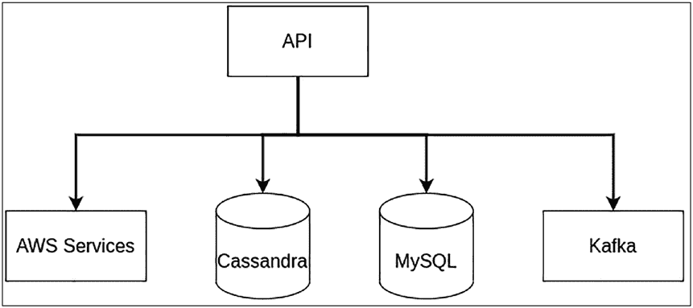

第 12 章 单元测试与集成测试

这些容器可以是数据库，也可以是你的应用程序所需的其他服务；例如，如果你的应用程序需要使用 AWS 的特定服务，你可以使用 LocalStack9 的镜像。Testcontainers 开发了一系列模块，以降低运行容器和配置此镜像的复杂性。这些模块包含了所有常见的关系型数据库，以及一些最相关的非关系型数据库，如 MongoDB、Cassandra、Neo4j 和 ElasticSearch。如果你需要使用模块列表中未包含的数据库，你可以运行任何容器，但需要自行定义所有与配置相关的逻辑。图 12-1 展示了一个 API 可能拥有的不同连接，例如数据库、队列和云服务提供商。

***图 12-1.** 一个 API 可能拥有的所有外部连接示例*

在幕后，该库使用 Docker10 来下载和运行容器，因此在你的项目中使用之前，请检查该库需要满足的 Docker 版本相关的通用要求 11。2020 年 11 月，DockerHub 对仓库中各种镜像的使用（例如下载次数）引入了限制。如果你在流水线中使用此库，运行它的机器必须满足相同的要求。

9 [`github.com/localstack/localstack`](https://github.com/localstack/localstack)

10 [`www.docker.com/`](https://www.docker.com/)


11 [`www.testcontainers.org/supported_docker_environment/`](https://www.testcontainers.org/supported_docker_environment/)

第 12 章 单元测试与集成测试

清单 12-3 是一个简单示例，展示了如何定义一个容器并启动它，而无需任何关于 Docker 或数据库的特殊指令。

***清单 12-3.*** 配置并运行容器的示例

PostgreSQLContainer postgreSQL = new PostgreSQLContainer("postgres:145")

.withDatabaseName("integration-tests-database")

.withUsername("test")

.withPassword("test");

postgreSQL.start();

关于这个库，最后需要考虑的一点是，它拥有像 Elastic 和 Red Hat 这样的赞助公司，这些公司被 Wise、Zalando、Instana 和 Skyscanner 等众多知名企业所使用，因此你可以确信它并非一个缺乏支持的新库。

**Testcontainers vs. 嵌入式数据库**

像 MongoDB 这样的数据库允许你使用另一个需要包含在 pom 文件中的库来运行嵌入式数据库。然而，这种方法存在一些问题。

• 并非所有数据库都支持使用嵌入式数据库，因此这只是一种适用于少数数据库的解决方案。
• 你不知道使用的是哪个版本的数据库，因此可能会遇到前面章节中出现的问题：仓库和查询在测试中运行良好，但在真实环境中却会失败。此外，新版本的数据库可能出现且不受支持，因此其使用会受到一定限制。
• 如果你使用像 Flyway 或 Liquibase 这样的迁移工具，并且使用了 H2 数据库，那么脚本可能会失败，因为你使用了仅在 PostgreSQL 或 MySQL 中有效的特定结构或关键字。

使用 Testcontainers，所有这些问题都会消失，因为你可以使用容器来代表数据库的真实版本。此外，你还可以利用 Docker 的配置，用特定信息来初始化数据库。

第 12 章 单元测试与集成测试

**使用 Testcontainers**

开始使用它很简单；你只需要添加关于 Testcontainers 的基础依赖以及你需要的模块；在**api-catalog**中，你需要使用**PostgreSQL**模块（参见清单 12-4）。

***清单 12-4.*** 需要在应用程序中包含的依赖项

<dependency>

<groupId>org.testcontainers</groupId>

<artifactId>junit-jupiter</artifactId>

<version>1.17.3</version>

<scope>test</scope>

</dependency>

<dependency>

<groupId>org.testcontainers</groupId>

<artifactId>postgresql</artifactId>

<version>1.17.3</version>

<scope>test</scope>

</dependency>

**jupiter**依赖直接与 Junit5 相关联，它在后台包含了 Testcontainers 的核心依赖。如果你想在没有特定实现的情况下使用这个库——例如，你想使用 MySQL 或 MariaDB 的实现——只需包含核心依赖，并添加你想要运行的镜像名称，而无需 Testcontainers 的支持。

运行一个仅启动和停止 PostgreSQL 镜像的容器，可以创建一个如清单 12-5 所示的类，但至少需要添加一个测试。

***清单 12-5.*** 运行数据库的基本单元测试

import org.junit.jupiter.api.AfterAll;

import org.junit.jupiter.api.BeforeAll;

import org.junit.jupiter.api.Test;

import org.springframework.beans.factory.annotation.Autowired;

import org.springframework.boot.test.context.SpringBootTest;

import org.springframework.test.context.DynamicPropertyRegistry;

第 12 章 单元测试与集成测试

import org.springframework.test.context.DynamicPropertySource;

import org.testcontainers.containers.PostgreSQLContainer;

import org.testcontainers.junit.jupiter.Testcontainers;

import static org.junit.jupiter.api.Assertions.*;

//此注解启用 Testcontainers 的支持

@Testcontainers

@SpringBootTest(webEnvironment = SpringBootTest.WebEnvironment.RANDOM_PORT)

public class CountryRepositoryIntegrationTest {

//定义你将使用的容器

public static PostgreSQLContainer postgreSQL =

new PostgreSQLContainer("postgres:14")

.withUsername("postgres")


.withPassword("postgres")

.withDatabaseName("catalog");

//启动容器

static {

postgreSQL.start();

}

//覆盖 Spring Boot 的配置以使用容器

@DynamicPropertySource

static void postgresqlProperties(DynamicPropertyRegistry registry) {

registry.add("spring.datasource.url", postgreSQL::getJdbcUrl);

registry.add("spring.datasource.username",

postgreSQL::getUsername);

registry.add("spring.datasource.password",

postgreSQL::getPassword);

}

@Test

public void should_save_a_country() {

//仅用于检查 TestContainers

assertTrue(Boolean.TRUE);

}

}

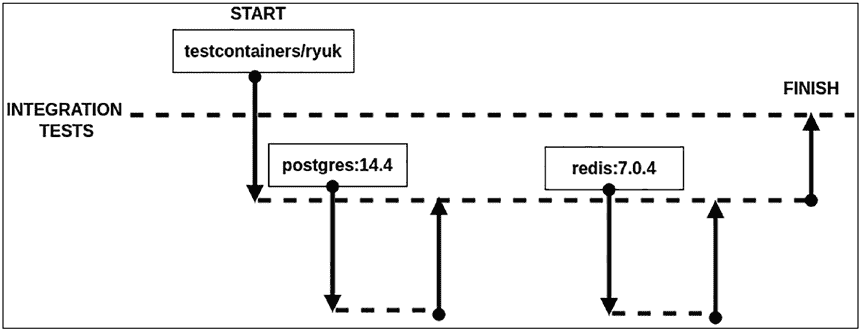

第 12 章 单元测试与集成测试

现在，如果你在终端中运行 **mvn test** 命令，你会在日志中看到类似以下内容。

11:10:21.531 [main] INFO org.testcontainers.DockerClientFactory - Connected

to docker:

Server Version: 20.10.12

API Version: 1.41

Operating System: Ubuntu 20.04.4 LTS

Total Memory: 32032 MB

11:10:21.539 [main] DEBUG org.testcontainers.utility.RyukResourceReaper -

Ryuk is enabled

11:10:21.541 [main] DEBUG org.testcontainers.utility.

PrefixingImageNameSubstitutor - No prefix is configured

11:10:21.541 [main] DEBUG org.testcontainers.utility.

ImageNameSubstitutor - Did not find a substitute image for testcontainers/

ryuk:0.3.3 (using image substitutor: DefaultImageNameSubstitutor

(composite of 'ConfigurationFileImageNameSubstitutor' and

'PrefixingImageNameSubstitutor'))

这些日志表明 Testcontainers 与 Docker 连接，以使用包含你在测试中使用的所有容器的镜像**testcontainers/ryuk**。通过让这个库在 Docker 中运行，你可以在测试之间共享同一个数据库容器。图 12-2 展示了使用 TestContainers 运行集成测试的过程。

***图 12-2.** 容器的执行流程*

第 12 章 单元测试与集成测试

要创建一个检查你的仓库是否正常工作的测试，你只需要对之前的测试类进行一些修改。首先要做的是添加仓库并调用某个方法来简化示例（见清单 12-6）。这里使用了**findById**方法，因为 Flyway 在应用程序启动时会填充数据库。

***清单 12-6.** 检查查询操作是否正常工作的基本单元测试*  
import com.apress.catalog.model.Country;

import org.junit.jupiter.api.AfterAll;

import org.junit.jupiter.api.BeforeAll;

import org.junit.jupiter.api.Test;

import org.springframework.beans.factory.annotation.Autowired;

import org.springframework.boot.test.context.SpringBootTest;

import org.springframework.test.context.DynamicPropertyRegistry;

import org.springframework.test.context.DynamicPropertySource;

import org.testcontainers.containers.PostgreSQLContainer;

import org.testcontainers.junit.jupiter.Testcontainers;

import java.util.Optional;

import static org.junit.jupiter.api.Assertions.*;

@Testcontainers

@SpringBootTest(webEnvironment = SpringBootTest.WebEnvironment.RANDOM_PORT)

public class CountryRepositoryIntegrationTest {

@Autowired

CountryRepository countryRepository;

//之前的代码无需修改

@Test

public void should_get_a_country() {

Optional<Country> country = countryRepository.findById(1L);

assertAll(

()-> assertTrue(country.isPresent()),

()-> assertEquals("AR", country.get().getCode())

);

}

}

第 12 章 单元测试与集成测试

如果你在控制台或 IDE 中运行测试时一切正常，测试会成功完成。但是，正如你在控制台上看到的，其他测试也在用相同的命令运行，因此一个好的做法是将这种类型的测试分离到另一个配置文件中，以减少单元测试的执行时间。清单 12-7 对 pom.xml 文件进行了一些修改，以便使用特定的集成测试配置文件来运行。但你也可以通过 Maven 在某个目标中传递要执行的测试名称来实现同样的效果。

***清单 12-7.** 对 pom 文件进行修改，以便在单独的配置文件中运行集成测试*


<?xml version="1.0" encoding="UTF-8"?>

<project

xsi:schemaLocation="http://maven.apache.org/POM/4.0.0

https://maven.apache.org/xsd/maven-4.0.0.xsd">

<!-- POM 文件其余部分保持不变 -->

<build>

<plugins>

<plugin>

<groupId>org.springframework.boot</groupId>

<artifactId>spring-boot-maven-plugin</artifactId>

</plugin>

<plugin>

<groupId>org.apache.maven.plugins</groupId>

<artifactId>maven-surefire-plugin</artifactId>

<version>${maven-surefire-plugin.version}</version>

<configuration>

<excludes>

<exclude>**/*IntegrationTest.java</exclude>

</excludes>

</configuration>

</plugin>

</plugins>

</build>

<profiles>

第 12 章 单元测试与集成测试

<profile>

<id>IT</id>

<build>

<plugins>

<plugin>

<groupId>org.apache.maven.plugins

</groupId>

<artifactId>maven-failsafe-plugin

</artifactId>

<version>${maven-failsafe-plugin

.version}</version>

<configuration>

<includes>

<include>**/*Integration

Test.java</include>

</includes>

</configuration>

<executions>

<execution>

<id>integration-test</id>

<goals>

<goal>integration-

test</goal>

</goals>

</execution>

<execution>

<id>verify</id>

<goals>

<goal>verify</goal>

</goals>

</execution>

</executions>

</plugin>

</plugins>

</build>

第 12 章 单元测试与集成测试

</profile>

</profiles>

</project>

通过此 pom 文件的修改，你只需使用 **mvn test** 命令即可运行单元测试，使用 **mvn verify -P IT** 命令运行集成测试。该 profile 的定义出现在清单 12-7 中，其目的是执行一组测试，以检查数据库中的所有内容是否正常工作。

如果你的容器出现问题，日志可能会对你有所帮助，但默认情况下这些日志不会显示在测试控制台上。Testcontainers 会导出容器的日志。操作很简单，你只需指定日志的导出位置，并将一个消费者附加到 stdout 即可（参见清单 12-8）。

***清单 12-8.*** 将容器日志导出到文件

import com.apress.catalog.model.Country;

import org.junit.jupiter.api.AfterAll;

import org.junit.jupiter.api.BeforeAll;

import org.junit.jupiter.api.Test;

import org.springframework.beans.factory.annotation.Autowired;

import org.springframework.boot.test.context.SpringBootTest;

import org.springframework.test.context.DynamicPropertyRegistry;

import org.springframework.test.context.DynamicPropertySource;

import org.testcontainers.containers.PostgreSQLContainer;

import org.testcontainers.containers.output.OutputFrame;

import org.testcontainers.containers.output.ToStringConsumer;

import org.testcontainers.junit.jupiter.Testcontainers;

import java.io.IOException;

import java.nio.file.Files;

import java.nio.file.Path;

import java.nio.file.StandardOpenOption;

import java.util.Optional;

import static org.junit.jupiter.api.Assertions.*;

@Testcontainers

@SpringBootTest(webEnvironment = SpringBootTest.WebEnvironment.RANDOM_PORT)

第 12 章 单元测试与集成测试

public class CountryRepositoryIntegrationTest {

// 之前的源代码保持不变

// 该类负责获取容器的所有日志

public static ToStringConsumer consumer = new ToStringConsumer();

// 包含将所有日志从容器发送到消费者的所有定义

@BeforeAll

public static void setUp() {

postgreSQL.start();

postgreSQL.followOutput(consumer,

OutputFrame.OutputType.STDOUT,

OutputFrame.OutputType.STDERR);

}

// 获取消费者中的日志并写入文件

@AfterAll

public static void tearDown() throws IOException {

Path log = Path.of("./logs.log");

byte[] bytes = consumer.toUtf8String().getBytes();

Files.write(log, bytes, StandardOpenOption.CREATE);

}

// 之前的源代码保持不变

}

当你使用命令运行测试时，会看到一个文件，其中仅包含关于 PostgreSQL 数据库的所有信息，这些信息与清单 12-9 中显示的内容相同。

***清单 12-9.*** 运行测试后的文件输出


属于此数据库系统的文件将由用户“postgres”拥有。

该用户还必须拥有服务器进程。

第 12 章 单元测试与集成测试

数据库集群将使用区域设置“en_US.utf8”进行初始化。

默认数据库编码已相应设置为“UTF8”。

默认文本搜索配置将设置为“english”。

数据页校验和已禁用。

正在修复现有目录 /var/lib/postgresql/data 的权限... 完成

正在创建子目录... 完成

正在选择动态共享内存实现... posix

正在选择默认最大连接数... 100

正在选择默认共享缓冲区... 128MB

正在选择默认时区... Etc/UTC

正在创建配置文件... 完成

正在运行引导脚本... 完成

正在执行引导后初始化... 完成

正在将数据同步到磁盘... 完成

成功。您现在可以使用以下命令启动数据库服务器：

pg_ctl -D /var/lib/postgresql/data -l logfile start

initdb: 警告：为本地连接启用“信任”认证

您可以通过编辑 pg_hba.conf 或在下一次运行 initdb 时使用 -A 选项，或

--auth-local 和 --auth-host 选项来更改此设置。

正在等待服务器启动....2022-09-23 15:51:13.348 UTC [47]

日志：正在启动 PostgreSQL 13.1 (Debian 13.1-1.pgdg100+1)，运行于 x86_64-pc-linux-gnu，由 gcc (Debian 8.3.0-6) 8.3.0 编译，64 位

2022-09-23 15:51:13.348 UTC [47] 日志：正在监听 Unix 套接字 "/var/run/postgresql/.s.PGSQL.5432"

2022-09-23 15:51:13.350 UTC [48] 日志：数据库系统已在 2022-09-23 15:51:13 UTC 关闭

2022-09-23 15:51:13.354 UTC [47] 日志：数据库系统已准备好接受连接

完成

服务器已启动

CREATE DATABASE

/usr/local/bin/docker-entrypoint.sh: 忽略 /docker-entrypoint-initdb.d/*

第 12 章 单元测试与集成测试

2022-09-23 15:51:13.579 UTC [47] 日志：收到快速关闭请求

正在等待服务器关闭...2022-09-23 15:51:13.579 UTC [47]

日志：正在中止所有活动事务

.2022-09-23 15:51:13.581 UTC [47] 日志：后台工作进程“逻辑复制启动器”(PID 54) 已退出，退出代码为 1

2022-09-23 15:51:13.581 UTC [49] 日志：正在关闭

2022-09-23 15:51:13.590 UTC [47] 日志：数据库系统已关闭

完成

服务器已停止

PostgreSQL 初始化过程完成；准备启动。

2022-09-23 15:51:13.700 UTC [1] 日志：正在启动 PostgreSQL 13.1 (Debian 13.1-1.pgdg100+1)，运行于 x86_64-pc-linux-gnu，由 gcc (Debian 8.3.0-6) 8.3.0 编译，64 位

2022-09-23 15:51:13.700 UTC [1] 日志：正在监听 IPv4 地址 "0.0.0.0"，端口 5432

2022-09-23 15:51:13.700 UTC [1] 日志：正在监听 IPv6 地址 "::"，端口 5432

2022-09-23 15:51:13.700 UTC [1] 日志：正在监听 Unix 套接字 "/var/run/postgresql/.s.PGSQL.5432"

2022-09-23 15:51:13.702 UTC [75] 日志：数据库系统已在 2022-09-23 15:51:13 UTC 关闭

2022-09-23 15:51:13.706 UTC [1] 日志：数据库系统已准备好接受连接

**多重集成测试**

当您需要测试仓库并将所有运行容器的逻辑放在该类中时，这没有问题，但如果您有很多仓库需要检查，会发生什么？Testcontainers 提供了重用的替代方案：一个容器用于一个类的所有测试，或者一个容器用于所有测试的执行。

在前面的章节中，您看到了在此库中为每个测试使用数据库或容器的策略。但是，您可以明确指示每个测试需要一个全新的容器，或者混合可以重用数据库的测试。为此，请使用 **withReuse** 方法指示 Testcontainers 保持此容器存活以供下次运行。

第 12 章 单元测试与集成测试

public static PostgreSQLContainer postgreSQL =

new PostgreSQLContainer<>("postgres:14")

.withUsername("postgres")

.withPassword("postgres")

.withDatabaseName("catalog")

.withReuse(true); // 这表示您希望保持容器存活

您需要删除显式停止容器的语句，因为该指令在这种情况下不起作用。下一个集成测试将从一个全新的容器开始。

**初始化策略**


在使用数据库时，你需要先通过信息对其进行初始化，然后再运行所有测试来解决这个问题。以下是几种策略。

• 使用像 Flyway 或 Liquibase 这样的数据库迁移工具，但并非在所有情况下都适用。这些工具用于向数据库中填充信息。如果你使用它们来创建表结构，则需要寻找另一种工具，例如 DBUnit。12

• 数据库容器提供了一种方法，可以包含一个脚本来填充所有数据库。

public static PostgreSQLContainer postgreSQL =

new PostgreSQLContainer<>("postgres:14")

.withUsername("postgres")

.withPassword("postgres")

.withInitScript("db/migration/V1.0__init_

database.sql") //初始化脚本的路径

.withDatabaseName("catalog");

12 [`www.dbunit.org/`](https://www.dbunit.org/)

第 12 章 单元测试与集成测试

• 另一种策略是创建一个自定义镜像，并将所有信息预加载到 Docker 仓库中。这种镜像的主要问题在于需要负责维护该自定义镜像中更新的结构和信息。不过，这种方法有助于重现关键错误或异常情况。

public static PostgreSQLContainer postgreSQL =

new PostgreSQLContainer<>("custom-postgres:1.0.0")

.withUsername("postgres")

.withPassword("postgres");

• 最后一种策略是在容器启动后，在容器内部执行命令。这种策略对于像 LocalStack 这样模拟基础设施的容器可能很有用。

**潜在问题**

Testcontainers 并非能解决所有问题的银弹，但它能帮助你检测查询中的问题。

另一方面，它也引入了其他需要考虑的问题。

每次启动容器时，测试的执行时间都会增加。不同数据库的耗时也不同；例如，Cassandra 数据库比 MySQL 数据库运行时间更长。在同一类的方法中重用容器至关重要，以防止每个测试都创建新容器。

• 如果你使用固定端口并在流水线中运行测试（例如使用 Jenkins），则存在两个或多个应用程序使用相同端口而导致端口冲突的风险。此外，如果某个应用程序出现异常且未停止容器，那么下次运行同一应用程序的流水线时，这些端口将不可用，并会出现异常。最佳解决方案是使用一种机制来为容器获取随机端口。

Testcontainers 考虑到可能会发生此问题，因此默认提供随机端口，但你可以设置端口，并且在书籍或文章中出现的示例通常会设置端口。以下是一个定义了镜像端口的容器示例。

第 12 章 单元测试与集成测试

PostgreSQLContainer postgreSQL = new PostgreSQLContainer("postgres:14")

.withDatabaseName("integration-tests-database")

.withUsername("test")

.withPassword("test")

.withExposedPorts(5432); //尽量不要设置此属性，因为默认情况下 Testcontainers 会使用随机端口来运行容器

• 尝试在生产环境中使用相同的数据库版本。如果你在 AWS 上使用 ElasticSearch 等数据库的自定义版本，请使用 LocalStack，这是一个包含大部分 AWS 服务以便在本地运行的容器。

• 集成测试中存在大量重复代码来初始化容器。为了解决这个问题，你可以创建一个抽象类，定义应用程序运行所需的所有容器，以及所有需要继承该类的测试。

• 测试中使用的所有镜像都会下载到机器上，因此你需要定期清理，以防止所有镜像占用大量空间。

• 一个潜在的问题是存在多个不同数据库的连接，因此编写配置并不简单。为了解决这个问题，你可以创建一个 docker-compose 文件并执行，其中包含允许你同时运行多个容器的模块。

*import com.apress.catalog.model.Country;*

import org.junit.jupiter.api.AfterAll;


import org.junit.jupiter.api.BeforeAll;

import org.springframework.beans.factory.annotation.Autowired;

import org.springframework.test.context.DynamicPropertyRegistry;

import org.springframework.test.context.DynamicPropertySource;

import org.testcontainers.containers.DockerComposeContainer;

import org.testcontainers.containers.wait.strategy.Wait;

import java.io.File;

import java.util.Optional;

第 12 章 单元测试与集成测试

import static org.junit.jupiter.api.Assertions.*;

@Testcontainers

@SpringBootTest(webEnvironment = SpringBootTest.WebEnvironment.

RANDOM_PORT)

public class *CountryRepositoryIntegrationTest* {

//运行 Docker Compose

private static final DockerComposeContainer environment = new

DockerComposeContainer(new File("src/test/resources/docker-

compose.yml"))

.withExposedService("postgres", 5432, Wait.

forListeningPort())

.withLocalCompose(true);

//其余源代码相同

@DynamicPropertySource

static void postgresqlProperties(DynamicPropertyRegistry

registry) {

String postgresUrl = environment.getServiceHost

("postgres", POSTGRES_PORT)

+ ":" + environment.getServicePort("postgres",

POSTGRES_PORT);

registry.add("spring.datasource.url", () ->

"jdbc:postgresql://" + postgresUrl + "/catalog");

//其余源代码相同

}

}

考虑到 Testcontainers 的优势，其存在的问题是值得付出的代价，而且大多数问题都有潜在的解决方案。

第 12 章 单元测试与集成测试

**本章小结**

本章介绍了如何创建仅检查应用程序某一部分的测试，并且能够毫无问题地使用真实数据库（而非可能不具备相同特性的内存数据库）进行测试。

不要在 Testcontainers 中为容器设置特定端口，以防止与其他容器或应用程序发生冲突。当在需要许多其他应用程序使用相同端口的流水线中运行此测试时，这一点尤为重要。

**第 13 章**

**检测性能**

**问题**

许多开发人员会创建或修改访问数据库的应用程序逻辑。大多数情况下，这不会引发问题，因为修改很简单，并且开发人员会创建单元测试或集成测试来检查一切是否继续正常运行。然而，大多数与性能或应用程序行为相关的问题，会在数据库拥有成千上万条记录的生产环境中出现。这种场景无法在任何测试环境中复现，包括你在前一章学到的工具。

影响数据访问层性能的因素有很多，包括关系型数据库中缺少正确类型的索引、非关系型数据库（如 MongoDB）的使用、编写低效的查询语句，或者使用了错误的过滤条件。其他因素可能直接与你编写访问数据库层的业务逻辑的方式有关。

针对这两类因素，你可以通过金丝雀部署 1 monit 来观察更改对应用程序性能的影响，或者使用工具来降低在生产环境中部署错误内容的风险。在本章中，你将学习两种使用库来执行性能测试或检测应用程序中资源过度使用的方法。

1 [`semaphoreci.com/blog/what-is-canary-deployment#:~:text=In%20software%20`](https://semaphoreci.com/blog/what-is-canary-deployment#:~:text=In%20software%20engineering%2C%20canary%20deployment,the%20rest%20of%20the%20users)

[engineering%2C%20canary%20deployment,the%20rest%20of%20the%20users](https://semaphoreci.com/blog/what-is-canary-deployment#:~:text=In%20software%20engineering%2C%20canary%20deployment,the%20rest%20of%20the%20users).

© Andres Sacco 2023

A. Sacco, *Beginning Spring Data*[, https://doi.org/10.1007/978-1-4842-8764-4_13](https://doi.org/10.1007/978-1-4842-8764-4_13#DOI)

第 13 章 检测性能问题

**低性能问题**

大多数情况下，应用程序的性能问题并不会立即显现。


与数据库访问或特定操作相关的问题，因为某个执行简单操作的端点开始耗时超过平均水平，所以如果你在应用程序中没有正确的指标或警报，就需要花费更多时间来发现真正的问题。你用于发现真正问题的时间是独一无二的，因为还有其他问题存在。

• 在某些情况下，CPU 或内存使用率会增加，这意味着根据云提供商的自动扩展策略，你可能会花费大量资金添加大量实例来补偿资源的过度使用。大多数云提供商要求你为资源付费，因此保持应用程序的高性能至关重要。

• 在关系型数据库中，查询问题可能在于它们需要很长时间才能完成，这意味着某个连接池可能会长时间不可用。

• 增加微服务之间的延迟。想象一下，在正常情况下，你的某个端点需要一秒钟来响应请求。但是，当你对查询进行修改后，同一个端点需要十秒钟才能响应相同的请求，因此延迟会降低整个平台的性能。

• 在某些极端情况下，当内存使用量迅速增加并耗尽所有可用内存时，应用程序可能会抛出异常并突然停止。

• 当你拥有许多微服务，并且问题随机出现和消失时，调试和重现场景会非常困难。

所有这些你可能会视为开发者能够解决的技术问题，都可能导致公司损失大量资金。例如，假设一家大型电商公司的用户在其网站上搜索产品的端点出现问题。如果平台需要很长时间才能显示结果，用户可能会转向其他网站购买产品。你必须考虑开发一个糟糕功能可能带来的所有影响。

第 13 章 检测性能问题

**检测问题**

没有能应对所有情况的银弹，但有一些工具可以帮助你根据具体情况来最小化和分析问题。另一点需要考虑的是，并非所有的库/工具都能帮助你解决与数据库访问相关的问题，因为它们可能会导致你花费更多时间来开发新功能；仅在数据库访问属于高风险操作或当你修改现有存储库时使用它们。

**注意** 本章中的所有工具都适用于使用 JVM 的语言，例如在 Spring Boot 的具体案例中的 Kotlin/Java，但如果你愿意，也可以与其他框架一起使用。

**分析查询性能**

有一些工具可以直接分析与 JVM 相关的问题，例如 VisualVM，或者负责监控整个应用程序的其他工具，例如 APM。

**注意** 展示所有 APM 替代方案及其各自的优缺点不在本书的讨论范围内。我们的想法是提供一个简要概述，并解释这些工具如何帮助找到解决问题的线索。

使用 VisualVM，你可以查看机器上运行的所有应用程序的情况，或者如果应用程序已开放 JMX 端口，也可以远程查看。这种应用程序性能分析的方法可用于分析内存、CPU 的使用情况，或者应用程序执行的查询，但前提是你的应用程序在后台使用了 JDBC，因为此工具不适用于非关系型数据库。

2 [`visualvm.github.io/`](https://visualvm.github.io/)
3 [`visualvm.github.io/`](https://visualvm.github.io/)

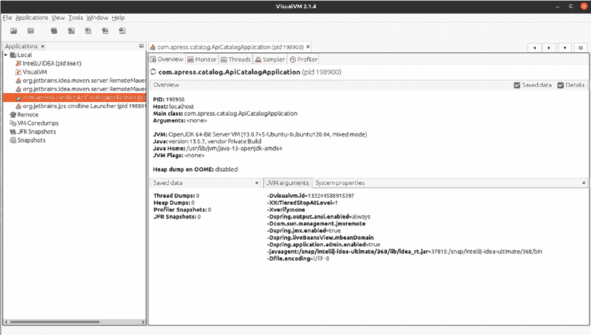

第 13 章 检测性能问题

要查看 VisualVM 中运行应用程序时的界面，请使用第一部分和第二部分中连接到关系型数据库的 **api-catalog**，然后运行该工具。之后


运行应用程序后，打开工具（你已从官方网站[4]下载），](#index_split_004.html#p309)

并在 VisualVM 中检查包名和主类，以分析任何

问题（见图 13-1）。

***图 13-1.** VisualVM 概览视图*

Profiler（分析器）部分显示了执行查询的指标以及所涉及的框架

方法。这种方法对于检测你在哪些地方花费了大量

时间非常有用。不过，远程调试可能会产生额外的问题，例如，由于需要传输大量信息，应用程序可能会变慢。

要获得与图 13-2 相同的结果，请在启用数据库操作分析后，调用任何访问数据库的端点。

4 [`visualvm.github.io/download.html`](https://visualvm.github.io/download.html)

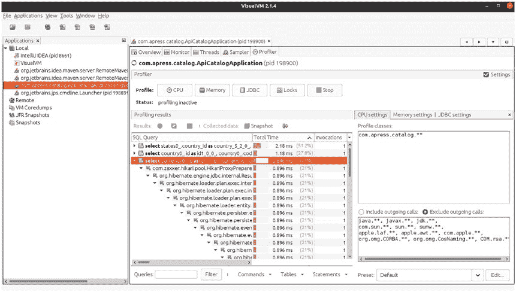

第 13 章 检测性能问题

***图 13-2.** VisualVM JDBC 分析*

在 APM 领域，有许多免费的替代方案，例如 Elastic APM5 或其他需要付费才能拥有全部功能的方案，如 New Relic。6 大多数替代方案都有不同的目的，例如，让你能够以请求所经过的类的粒度来查看微服务的指标，以及每个类上花费的时间。这些工具的精神在于为你提供线索，帮助你找到问题所在，而不是指出应用程序中的具体问题；最后一步是你的责任。

例如，在 Redis 中，某些 APM 工具不会显示哪个操作执行时间更长或更短。图 13-3 展示了这个问题的一个实例，New Relic 向你显示了各种操作，但你没有任何相关信息。

5 [`www.elastic.co/observability/application-performance-monitoring`](https://www.elastic.co/observability/application-performance-monitoring)

6 [`newrelic.com/`](https://newrelic.com/)

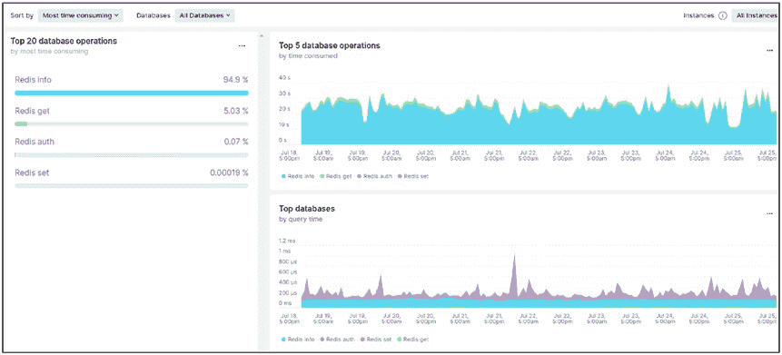

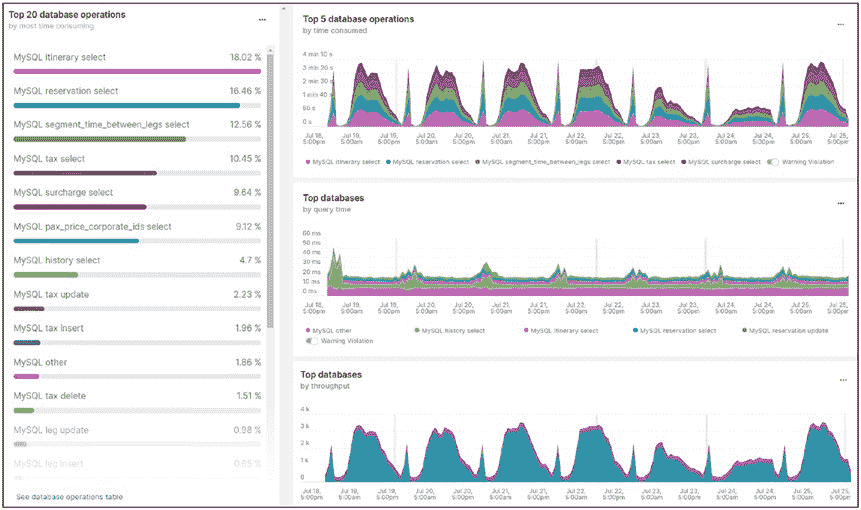

第 13 章 检测性能问题

***图 13-3.** New Relic 数据库视图*

在关系型数据库中的情况则不同，因为代理（即你添加的用于拦截应用程序所有入站或出站流量的应用程序）会提供大量关于执行耗时较长的查询的详细信息。例如，图 13-4 显示了查询的详细程度，这有助于检测问题所在。

***图 13-4.** New Relic 关系型数据库视图*

第 13 章 检测性能问题

使用 APM 的关键点之一是减少对源代码的修改次数，你可以将依赖项作为包含应用程序的 Docker 镜像的一部分包含进来。

这些工具能让你大致了解哪些查询性能不佳。但是，如果你的应用程序有一部分执行了多个操作，那么当你没有检测到任何问题时，就需要其他工具。

另一个需要考虑的问题是，所有这些工具都是被动式的。你需要先检测到应用程序的问题，然后找出原因。在下一节中，你将看到在问题出现之前检测问题的替代方案。

**分析查询复杂度**

QuickPerf7 是一个库，它允许你通过考虑不同方面（如 JVM 的使用情况或代码块执行的查询数量）来分析应用程序各部分的性能。该库支持 JUnit 版本以及 Spring Boot、Quarkus8 和 Microprofile9 等框架。

这个库的好处包括：能够检测代码块中资源的过度使用，并且无需为新测试编写大量代码。你可以重用上一章中使用 Testcontainers 创建的集成测试，并添加注解来验证方法的正确行为。


让我们在 POM 文件中添加依赖项，以分析你在前几章仓库中定义的某些查询是否正常工作（参见清单 13-1）。

***清单 13-1.*** QuickPerf 依赖项

<dependencies>

<dependency>

<groupId>org.quickperf</groupId>

<artifactId>quick-perf-junit5</artifactId>

<version>1.1.0 </version>

<scope>test</scope>

</dependency>

7 [`quickperf.io/`](https://quickperf.io/)

8 [`es.quarkus.io/`](https://es.quarkus.io/)

9 [`microprofile.io/`](https://microprofile.io/)

第 13 章 检测性能问题

<dependency>

<groupId>org.quickperf</groupId>

<artifactId>quick-perf-springboot2-sql-starter</artifactId>

<version>1.1.0</version>

<scope>test</scope>

</dependency>

← 其他依赖项 –>

</dependencies>

接下来，让我们对之前的集成测试进行修改，该测试使用 Testcontainers 来分析仓库是否正常工作。第一个修改是使用 **@QuickPerfTest** 注解整个类，这表明该类中的某些测试需要验证某些内容，并包含库需要使用的配置；在此例中，你使用类 **org.quickperf.spring.sql.QuickPerfSqlConfig** 中存在的默认配置，但你可以扩展此类并指定不同的值。

最后一个修改是包含你想要的数据库操作数量；前面的例子是一个 select 操作，但你可以分析执行了多少 insert、delete 或 update 操作（参见清单 13-2）。

***清单 13-2.*** 对之前集成测试的修改

import org.quickperf.junit5.QuickPerfTest;

import org.quickperf.spring.sql.QuickPerfSqlConfig;

import org.quickperf.sql.annotation.ExpectSelect;

//之前的导入

@Import(QuickPerfSqlConfig.class) //库的配置

@QuickPerfTest //此注解表示你将分析操作

@Testcontainers

@SpringBootTest(webEnvironment = SpringBootTest.WebEnvironment.RANDOM_PORT)

public class CurrencyRepositoryIntegrationTest {

//之前的测试代码

@Test

@ExpectSelect(1) //验证执行的查询数量

第 13 章 检测性能问题

public void should_get_a_currency() {

Optional<Currency> currency = currencyRepository.findById(1L);

assertAll(

()-> assertTrue(currency.isPresent()),

()-> assertEquals("ARS", currency.get().getCode())

);

}

}

如果你使用 **mvn verify –P IT** 再次运行测试，一切仍会像之前一样正常工作。那么你如何确定呢？让我们将 **@ExpectedSelect** 注解的值改为 10，并再次运行相同的测试；如果一切正确，你会在测试中看到一个错误，控制台上显示类似以下的消息。

[PERF] 你可能认为有 <10> 条 select 语句被发送到数据库

但实际上只有 <1> 条...

[JDBC 查询执行 (executeQuery, executeBatch, ...)]

时间:1, 成功:True, 类型:Prepared, 批处理:False, 查询大小:1,

批处理大小:0, 查询:["

select

currency0_.id as id1_1_0_,

currency0_.created_on as created_2_1_0_,

currency0_.updated_on as updated_3_1_0_,

currency0_.version as version4_1_0_,

currency0_.code as code5_1_0_,

currency0_.decimal_places as decimal_6_1_0_,

currency0_.description as descript7_1_0_,

currency0_.enabled as enabled8_1_0_,

currency0_.symbol as symbol9_1_0_

from

currency currency0_

where

currency0_.id=?"], 参数:[(1)]

第 13 章 检测性能问题

此消息表明你只执行了以下语句一次，因此你用注解指示的断言是错误的。该注解仅检查执行的查询数量，而不检查执行期间影响的行数。

另一个可以帮助你检测问题的注解是 **@AnalyzeSql**，它提供查询执行的指标。让我们修改前面的示例以包含该注解（参见清单 13-3）。

***清单 13-3.*** 包含查询分析

//之前的导入


import org.quickperf.sql.annotation.AnalyzeSql;

@Import(QuickPerfSqlConfig.class) // 库的配置

@QuickPerfTest // 此注解表示你将分析操作

@Testcontainers

@SpringBootTest(webEnvironment = SpringBootTest.WebEnvironment.RANDOM_PORT)

public class CurrencyRepositoryIntegrationTest {

// 之前的测试代码

@Test

@ExpectSelect(1) // 验证执行的查询数量

**@AnalyzeSql**

public void should_get_a_currency() {

Optional<Currency> currency = currencyRepository.findById(1L);

assertAll(

()-> assertTrue(currency.isPresent()),

()-> assertEquals("ARS", currency.get().getCode())

);

}

}

如果再次执行相同的测试，一切仍能正常运行，但控制台上会显示所有分析信息。我建议将测试执行输出保存到文件中，这样更容易找到相关指标。

第 13 章 检测性能问题

[QUICK PERF] SQL 分析

* * * * *

SQL 执行次数：1

最大时间：1 毫秒

* * * * *

SELECT 查询：1

* * * * *

查询

时间：1，成功：是，类型：预编译，批处理：否，查询大小：1，

批处理大小：0，查询：["

select

currency0_.id as id1_1_0_,

currency0_.created_on as created_2_1_0_,

currency0_.updated_on as updated_3_1_0_,

currency0_.version as version4_1_0_,

currency0_.code as code5_1_0_,

currency0_.decimal_places as decimal_6_1_0_,

currency0_.description as descript7_1_0_,

currency0_.enabled as enabled8_1_0_,

currency0_.symbol as symbol9_1_0_

from

currency currency0_

where

currency0_.id=?"], 参数：[(1)]

还有许多其他注解可以帮助你的应用程序在数据库中的操作。表 13-1 列出了一些最相关的注解。

第 13 章 检测性能问题

***表 13-1.** 注解*

**注解**

**描述**

[@profileConnection](https://github.com/quick-perf/doc/wiki/@ProfileConnection)

暴露与数据库连接时发生的所有操作

@expectselect

检查执行的某一类型查询的数量

@expectinsert

@expectDelete

@expectupdate

@expectmaxselect

检查执行的语句数量是否不超过

@expectmaxinsert

某个特定数值

@expectmaxDelete

@expectmaxupdate

@expectmaxQueryexecutiontime

指示查询执行所需的时间（毫秒）

@expectselectedColumn

检查与查询相关的列数

@expectupdateColumn

@Disablesameselects

检查同一查询是否执行了两次或更多次

此解决方案仅适用于关系型数据库。你可以通过分析服务或访问非关系型数据库仓库的控制器，检查是否在使用 QuickPerf 提供的 JVM 注解时出现问题。一些例子包括 **@MeasureHeapAllocation** 或 **@HeapSize(value = 1, unit = AllocationUnit.GIGA_**

**BYTE)**，它们用于检查特定方法使用了多少内存空间。

**检查端点的性能**

前面的方法是检查或分析具有一定风险的代码块的最佳选择，因为这些代码块执行了多个关键操作。你可能会花数小时编写一个测试来验证一切是否正常，但你可能并不总有时间这样做。

另一种方法是，为整个微服务或单个端点创建性能测试，为不同的请求提供信息。这些请求可以同时执行，或者每秒增加请求数量，直到达到最终的请求数量。

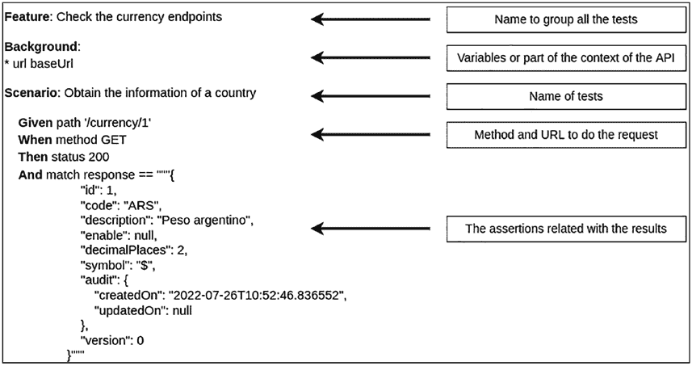

第 13 章 检测性能问题

遵循创建性能测试的原则，有两种工具——Gatling10 和 JMeter11，许多开发者使用它们，因为它们提供了一种简单的方法来为应用程序创建负载测试。你可以创建复杂的场景，按特定顺序调用端点。这两种工具均可免费使用，并且有许多文章或视频详细解释了它们各自的使用方法。Gatling 还提供付费选项，你可以使用该公司的基础设施创建并执行你的场景。


本章使用 Gatling 作为创建性能测试的工具，而非 JMeter，

因为你可以创建一个 Maven 项目，使用 Karate 运行测试，并复用相同的测试来创建性能测试，其理念是不需要维护两个工具来处理所有的请求/响应。总的来说，Karate 并非所有开发者都熟知的流行工具。

但它功能强大，因为它拥有出色的特性，并能与其他工具集成，例如

Gatling。

Karate 可读性强，因为它遵循 BDD 的 Given-When-Then 精神，因此任何人都能理解测试在做什么，并利用它为你的整个平台创建端到端测试，而不仅仅是一组测试。图 13-5 是该工具的一个简单示例，用于测试你的 **api-catalog** 应用的一个端点。

***图 13-5.** Karate 测试*

10 [`gatling.io/`](https://gatling.io/)

11 [`jmeter.apache.org/`](https://jmeter.apache.org/)

12 [`github.com/karatelabs/karate`](https://github.com/karatelabs/karate)

第 13 章 检测性能问题

阅读上一段时，你可能会想：“为什么不是 API 的完整 URL？”其理念是不在每个场景中定义 API 主机，这样你就可以定义自定义变量，并使用关键字 *background* 来引用它们。

每个文件可以包含一个或多个场景，每个场景就像单元测试或集成测试中的一个方法。

**注意** 本书不会解释所有与 Karate 相关的特性，但测试中并不需要包含响应的整个 JSON；你可以将其放在一个外部文件中，并在测试前读取它来进行比较。

另一个相关点是，你可以创建复杂的场景，并多次重复使用 given/When/then 结构；例如，创建一个新的货币并执行更新操作。

让我们创建一个与 **api-catalog** 无关的新项目；其理念是你可以像黑盒测试一样，在你的机器上或其他环境中执行性能测试，而无需拥有应用的源代码。如果你愿意，也可以将其包含在应用内部。为了创建项目，我们使用 Karate 的命令，即 Maven 原型。

mvn archetype:generate \

-DarchetypeGroupId=com.intuit.karate \

-DarchetypeArtifactId=karate-archetype \

-DarchetypeVersion=1.2.0 \

-DgroupId=com.apress \

-DartifactId=karate-gatling

之后，创建项目。你会得到一个包含一些示例的简单结构，你可以使用简单的 **mvn test** 命令来运行它们。

/karate-gatling

├── pom.xml

└── src

└── test

└── java

├── examples

│ ├── ExamplesTest.java

第 13 章 检测性能问题

│ └── users

│ ├── users.feature

│ └── UsersRunner.java

├── karate-config.js

└── logback-test.xml

让我们打开 `karate-config.js`，它包含所有配置并支持多环境，然后引入修改以请求你的 **api-catalog** 应用（参见清单 13-4）。在本书的测试中，dev 和 e2e 两个环境使用相同的 URL。

***清单 13-4.*** 配置修改

function fn() {

var env = karate.env;

karate.log('karate.env system property was:', env);

if (!env) {

env = 'dev';

}

var config = {

env: env,

**AppUrl: '/api/catalog'** //API 的 URL

}

if (env == 'dev') { //开发环境

**config.AppUrl = 'http://127.0.0.1:8080' + config.AppUrl** //包含主机的完整 URL

} else if (env == 'e2e') { //端到端环境

**config.AppUrl = 'http://127.0.0.1:8080' + config.AppUrl**

}

return config;

}

在 **src/test/java** 中创建一个名为 **APITest** 的新类，其理念是查找文件夹中的所有 Karate 测试并运行它们，而无需指定每个特性文件（参见清单 13-5）。

第 13 章 检测性能问题

***清单 13-5.*** 执行所有测试的主类

import com.intuit.karate.junit5.Karate;

class ApiTest {

@Karate.Test

Karate runAllTests() {

return Karate.run().tags("~@ignore").relativeTo(getClass());


// 这将执行所有测试，忽略所有带有 `@ignore` 注解的测试，这些测试位于 **.features** 文件中。

}

}

之后，将所有文件放入 **examples** 文件夹，并创建一个名为 **app/currency** 的新文件夹，以构建一个能正确反映测试内容的结构。下一步是在 **src/test/java/app/currency** 中创建一个名为 **get-currency.feature** 的文件，其中包含所有场景（参见清单 13-6）。

***清单 13-6.*** 场景的结构

Feature: 货币操作

Background:

* url AppUrl

* def get_currency_response = read('./get-currency-response.json')

Scenario: 获取某一种货币的所有信息

Given path 'currency/1'

When method GET

Then status 200

And match response == get_currency_response

测试的结构很简单，没有任何特殊之处。AppUrl 指的是你在 karate-config.js 上下文中定义的变量。**get_currency_response** 变量包含了另一个文件中的所有信息。这样做的目的是减少文件中出现的内容数量，因为一个文件中可以包含多个场景（参见清单 13-7）。

第 13 章 检测性能问题

***清单 13-7.*** 端点的预期响应

{

"id":1,

"code":"ARS",

"description":"Peso argentino",

"enable":null,

"decimalPlaces":2,

"symbol":"$",

"audit":{

"createdOn":"2022-07-26T10:52:46.836552",

"updatedOn":null

},

"version":0

}

现在，要检查一切是否正常，最后一步是运行 **api-catalog**，并在新项目的目录中运行 **mvn test** 命令。控制台会显示已执行测试的相关信息。

feature: classpath:app/currency/get-currency.feature

scenarios: 1 | passed: 1 | failed: 0 | time: 0.2407

Karate version: 1.2.0

======================================================

elapsed: 2.20 | threads: 1 | thread time: 0.24

features: 1 | skipped: 0 | efficiency: 0.11

scenarios: 1 | passed: 1 | failed: 0

======================================================

所有这些信息都很好，但你并没有对应用程序进行性能测试，只进行了这一次测试，所以下一步是为你的应用程序添加 Gatling 支持。让我们对 pom 文件进行修改，以便在配置文件中运行 Karate 测试或 Gatling 测试，因此，删除依赖项和构建部分的所有内容，替换为以下代码块（参见清单 13-8）。

第 13 章 检测性能问题

***清单 13-8.*** Pom 文件修改

<profiles>

<profile>

<id>karate</id>

<dependencies>

<dependency>

<groupId>com.intuit.karate</groupId>

<artifactId>karate-junit5</artifactId>

<version>${karate.version}</version> <!-- 默认版本为 1.2.0 -->

<scope>test</scope>

</dependency>

</dependencies>

<build>

<testResources>

<testResource>

<directory>src/test/java</directory>

<excludes>

<exclude>**/*.java</exclude>

</excludes>

</testResource>

</testResources>

<plugins>

<plugin>

<groupId>org.apache.maven.plugins</groupId>

<artifactId>maven-compiler-plugin</artifactId>

<version>${maven.compiler.version}</version>

<configuration>

<encoding>UTF-8</encoding>

<source>${java.version}</source> <!-- 默认版本为 8 -->

<target>${java.version}</target>

<compilerArgument>-Werror</compilerArgument>

</configuration>

</plugin>

第 13 章 检测性能问题

<plugin>

<groupId>org.apache.maven.plugins</groupId>

<artifactId>maven-surefire-plugin</artifactId>

<version>${maven.surefire.version}</version>

<configuration>

<argLine>-Dfile.encoding=UTF-8</argLine>

</configuration>

</plugin>

</plugins>

</build>

</profile>

<profile>

<id>gatling</id>

<dependencies>

<dependency>

<groupId>com.intuit.karate</groupId>

<artifactId>karate-gatling</artifactId>

<version>${karate.version}</version>

<scope>test</scope>

</dependency>

</dependencies>

<build>

<plugins>

<plugin>

<groupId>net.alchim31.maven</groupId>

<artifactId>scala-maven-plugin</artifactId>

<version>4.5.6</version>

<executions>

<execution>

<goals>

<goal>testCompile</goal>


</goals>

第 13 章 检测性能问题

<configuration>

<args>

<arg>-Jbackend:GenBCode</arg>

<arg>-Jdelambdafy:method</arg>

<arg>-target:jvm-1.8</arg> <!--

这与应用程序的版本无关 -->

<arg>-deprecation</arg>

<arg>-feature</arg>

<arg>-unchecked</arg>

<arg>-

language:implicitConversions</arg>

<arg>-language:postfixOps</arg>

</args>

</configuration>

</execution>

</executions>

</plugin>

<plugin>

<groupId>io.gatling</groupId>

<artifactId>gatling-maven-plugin</artifactId>

<version>${gatling.plugin.version}</version> <!--

默认版本为 4.1.1 -->

<configuration>

<simulationsFolder>src/test/java</

simulationsFolder>

</configuration>

<executions>

<execution>

<phase>test</phase>

<goals>

<goal>test</goal>

</goals>

</execution>

</executions>

第 13 章 检测性能问题

</plugin>

</plugins>

</build>

</profile>

</profiles>

之后，你可以将 Karate 场景作为普通测试或性能测试来执行，只需指定相应的 profile。现在，让我们继续下一步：在与 **get-currency.feature** 文件相同的目录下创建一个名为 **CurrencySimulation.scala** 的文件，该目录为 **src/test/java/app/currency**。此文件包含 Karate 测试以及执行相同操作的用户数量（参见清单 13-9）。

***清单 13-9.*** 使用 Karate 场景的 Gatling 模拟

package app.currency

import com.intuit.karate.Runner

import com.intuit.karate.gatling.PreDef._

import io.gatling.core.Predef._

import scala.concurrent.duration._

//定义模拟，包括 URL 以及在一段时间内的请求数量

class CurrencySimulation extends Simulation {

def urlPattern = "GET /api/catalog/currency/1"

val protocol = karateProtocol(

"/currency/{id}" -> Nil

)

protocol.nameResolver = (req, ctx) => req.getHeader("karate-name")

//运行测试的环境

protocol.runner.karateEnv("dev")

//要运行的文件和场景名称

val get = scenario("获取一种货币的所有信息").exec

(karateFeature("classpath:app/currency/get-currency.feature"))

第 13 章 检测性能问题

setUp(

//在一段时间内接收端点的用户数量

get.inject(rampUsers(10) during (5 seconds)).protocols(protocol)

).assertions(

//你想要验证的条件

details(urlPattern).responseTime.percentile3.lte(3000)

)

}

这个模拟是基础的，但你可以组合多种场景，例如同时创建多种货币（如清单 13-8 中的 rampUsers 所定义），以便获取另一种货币的信息。场景的复杂程度由你决定，并取决于单个端点所执行操作的复杂性。

最后一步是使用 **mvn test -P gatling** 命令运行性能测试，该命令仅使用你之前定义的模拟类。如果一切正常，你将在控制台上看到测试执行的结果。Gatling profile 已在清单 13-7 中定义，因此 Maven 命令可以正常工作。

生成报告...

=========================================================================

---- 全局信息 -------------------------------------------------

> 请求数 10

(成功=10 失败=0 )

> 最小响应时间 4

(成功=4 失败=- )

> 最大响应时间 27

(成功=27 失败=- )

> 平均响应时间 15

(成功=15 失败=- )

> 标准差 10

(成功=10 失败=- )

> 响应时间第 50 百分位 8

(成功=8 失败=- )

第 13 章 检测性能问题

> 响应时间第 75 百分位 27

(成功=27 失败=- )

> 响应时间第 95 百分位 27

(成功=27 失败=- )

> 响应时间第 99 百分位 27

(成功=27 失败=- )

> 平均请求数/秒 2

(成功=2 失败=- )

---- 响应时间分布 ----------------------------------------

> t < 800 毫秒 10 (100%)

> 800 毫秒 < t < 1200 毫秒 0 ( 0%)

> t > 1200 毫秒 0 ( 0%)

> 失败 0 ( 0%)

=========================================================================

报告在 0 秒内生成。

请打开以下文件：/home/apress-spring-data/chapter 13/karate-


gatling/target/gatling/currencysimulation-20220727184940969/index.html

GET /api/catalog/currency/1：响应时间的第 95 百分位数小于或等于 3000.0：true

这些报告可能并非最佳选择，无法很好地理解执行过程中发生的情况。Gatling 在目标文件夹中生成了一个报告，其中包含一个完整的网页，提供相同的信息，但外观和风格不同。

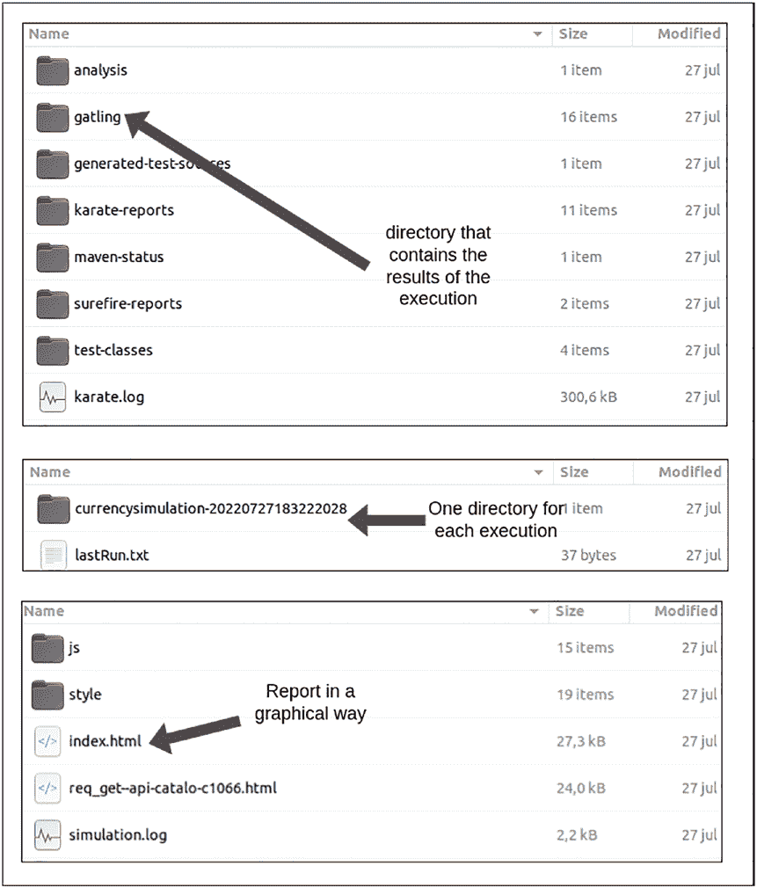

第 13 章 检测性能问题

***图 13-6.** 报告输出的结构*

图 13-7 以图形方式展示了所有结果，因此你可以查看每个端点、执行时间以及其他相关信息。

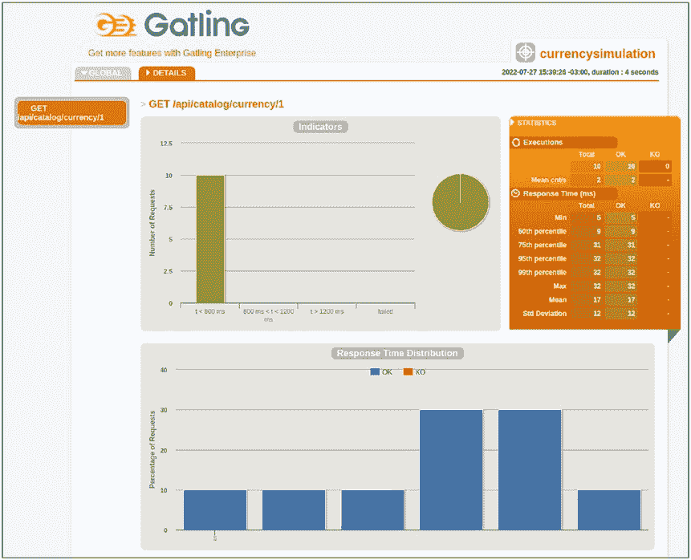

第 13 章 检测性能问题

***图 13-7.** 执行时间的指标*

在本章中，你了解了分析访问数据库的仓库中问题的机制。不过，发现问题的方法还有很多。

**总结**

检测与应用程序性能相关的问题有多种方法。使用哪种工具始终取决于具体问题，因为有些问题只会在生产环境中出现，而另一些问题则可以使用像 Gatling 这样的工具以相同方式复现。

我建议在 Gatling 中创建一个测试，模拟对应用程序进行修改后出现问题的情况。

**第 14 章**

**最佳实践**

开发人员经常实现一个访问数据库的解决方案，但问题会在数月后出现。这些问题可能与解决方案的实现有关，也可能无关，因为许多因素都会影响性能（例如，大量的请求，或需要在短时间内保存大量信息）。

最佳实践可以最大限度地减少影响，或减少数据库中保存的信息量。本章涵盖了许多最常见的实践。其中一些很简单，而另一些则需要更改应用程序。

**压缩信息**

有时，你需要在 Redis 中保存一个庞大而复杂的对象，这本身不是问题。但是，如果你需要在短时间内保存数千个这样的对象，这可能会影响性能或增加内存使用成本。

Redis 允许你定义自定义序列化器，使你能够序列化或反序列化信息。让我们创建一个序列化器，它先压缩对象，然后再解压缩，以节省数据库中的空间。

这个过程意味着要修改你在[第 7 章](https://doi.org/10.1007/978-1-4842-8764-4_7)中实现的代码，但让我们先创建一个类，负责将字节数组转换为压缩对象。这个任务并不复杂，因为你可以使用这个类在将信息持久化到文件之前对其进行压缩。清单 14-1 展示了一个压缩对象所有值的类的可能实现。

***清单 14-1.*** 压缩类

package com.apress.catalog.util;

import java.io.BufferedReader;

import java.io.ByteArrayInputStream;

import java.io.ByteArrayOutputStream;

© Andres Sacco 2023

A. Sacco, *Beginning Spring Data*[, https://doi.org/10.1007/978-1-4842-8764-4_14](https://doi.org/10.1007/978-1-4842-8764-4_14#DOI)

第 14 章 最佳实践

import java.io.IOException;

import java.io.InputStreamReader;

import java.util.zip.GZIPInputStream;

import java.util.zip.GZIPOutputStream;

public class CompressionUtil {

private CompressionUtil() {

// 仅用于避免创建实例

}

*// 此方法将接收一个字节数组，并尝试使用 GZIPInputStream 解压缩信息*

public static String decompress(byte[] compressed) throws IOException {

ByteArrayInputStream bis = new ByteArrayInputStream(compressed);

GZIPInputStream gis = new GZIPInputStream(bis);

BufferedReader br = new BufferedReader(new InputStreamReader(gis,

"UTF-8"));

StringBuilder sb = new StringBuilder();

String line;

while ((line = br.readLine()) != null) {

sb.append(line);

}

br.close();

gis.close();

bis.close();

return sb.toString();

}


*// 此方法接收一个字符串，并尝试使用 GZIPOutputStream 进行压缩*

public static byte[] compress(String data) throws IOException {

ByteArrayOutputStream bos = new ByteArrayOutputStream(data.length());

GZIPOutputStream gzip = new GZIPOutputStream(bos);

gzip.write(data.getBytes());

gzip.close();

byte[] compressed = bos.toByteArray();

第 14 章 最佳实践

bos.close();

return compressed;

}

}

下一步是创建一个包含自定义方法的类，这些方法可以将对象转换为字节数组，反之亦然（参见清单 14-2）。其思路是使用**T**对象委托给另一个类，即需要压缩和解压缩的特定对象类型，而无需为每个需要序列化的类创建特定的类。

***清单 14-2.*** 将字节数组转换为对象的序列化器 package com.apress.catalog.util;

import com.apress.catalog.exception.SerializeException;

import com.fasterxml.jackson.databind.DeserializationFeature;

import com.fasterxml.jackson.databind.MapperFeature;

import com.fasterxml.jackson.databind.ObjectMapper;

import com.fasterxml.jackson.databind.PropertyNamingStrategy;

import com.fasterxml.jackson.datatype.jsr310.JavaTimeModule;

import org.slf4j.Logger;

import org.slf4j.LoggerFactory;

import java.io.IOException;

public class JsonGzipSerializerUtil {

private static final Logger LOGGER = LoggerFactory.getLogger(JsonGzip

SerializerUtil.class);

private static final ObjectMapper OBJECT_MAPPER;

private JsonGzipSerializerUtil() {

// 仅用于避免创建实例

}

// 关于如何将信息转换为字符串或对象的通用定义

static {

OBJECT_MAPPER = new ObjectMapper()

.configure(MapperFeature.USE_GETTERS_AS_SETTERS, false)

第 14 章 最佳实践

.configure(DeserializationFeature.FAIL_ON_UNKNOWN_PROPERTIES,

false)

.setPropertyNamingStrategy(PropertyNamingStrategy.SNAKE_CASE)

.registerModule(new JavaTimeModule());

}

*// 将对象转换为压缩后的字节数组*

public static byte[] serialize(Object object) {

byte[] compressedJson;

try {

String json = OBJECT_MAPPER.writeValueAsString(object);

compressedJson = CompressionUtil.compress(json);

} catch (IOException e) {

LOGGER.error("序列化对象时出错: {}", e.getMessage());

throw new SerializeException("无法序列化对象", e);

}

return compressedJson;

}

*// 将压缩后的字节数组转换为在 <T> 上定义的特定对象*

public static <T> T deserialize(byte[] raw, Class<T> reference) {

if (raw == null)

return null;

T object;

try {

String json = CompressionUtil.decompress(raw);

object = OBJECT_MAPPER.readValue(json, reference);

} catch (IOException e) {

LOGGER.error("无法反序列化对象: {}", e.getMessage());

throw new SerializeException("无法反序列化对象。", e);

}

return object;

}

}

第 14 章 最佳实践

建议创建一个自定义的异常类，以表示所有与对象转换相关的可能问题（参见清单 14-3）。

***清单 14-3.*** 用于表达序列化问题的自定义异常 package com.apress.catalog.exception;

public class SerializeException extends RuntimeException {

public SerializeException(String message, Throwable cause) {

super(message, cause);

}

}

下一步是创建一个自定义序列化器，将特定对象转换为数据库中压缩后的对象。**JsonGzipSerializerUtil** 类只需要传入一个待序列化的对象。如果要反序列化，只需传入一个字节数组及其对应的类类型，如清单 14-4 所示。

***清单 14-4.*** 国家实体的自定义序列化器

package com.apress.catalog.serializer;

import com.apress.catalog.model.Country;

import com.apress.catalog.util.JsonGzipSerializerUtil;

import org.springframework.data.redis.serializer.RedisSerializer;

import org.springframework.stereotype.Component;

@Component


public class CountrySerializer implements RedisSerializer<Country> {

public byte[] serialize(Country country) {

return JsonGzipSerializerUtil.serialize(country);

}

public Country deserialize(byte[] raw) {

return JsonGzipSerializerUtil.deserialize(raw, Country.class);

}

}

第 14 章 最佳实践

现在，你已经为实体创建了特定的序列化器，接下来需要在 `RedisConfiguration` 类中将其声明为一个新的 Redis 模板（参见清单 14-5）。

***清单 14-5.*** 新模板的声明

import com.apress.catalog.model.Country;

import com.apress.catalog.serializer.CountrySerializer;

import com.apress.catalog.serializer.LongSerializer;

import io.lettuce.core.ReadFrom;

import org.springframework.context.annotation.Bean;

import org.springframework.context.annotation.Configuration;

import org.springframework.data.redis.connection.RedisConnectionFactory;

import org.springframework.data.redis.connection.

RedisStaticMasterReplicaConfiguration;

import org.springframework.data.redis.connection.lettuce.

LettuceClientConfiguration;

import org.springframework.data.redis.connection.lettuce.

LettuceConnectionFactory;

import org.springframework.data.redis.core.RedisTemplate;

import org.springframework.data.redis.repository.configuration.

EnableRedisRepositories;

@Configuration

@EnableRedisRepositories

public class RedisConfiguration {

final RedisSettings settings;

final LongSerializer longSerializer;

final CountrySerializer countrySerializer;

public RedisConfiguration(RedisSettings settings, LongSerializer

longSerializer, CountrySerializer countrySerializer) {

this.settings = settings;

this.longSerializer = longSerializer;

this.countrySerializer = countrySerializer;

}

第 14 章 最佳实践

@Bean

public RedisTemplate<Long, Country> countryRedisTemplate(RedisConnection

Factory connectionFactory) {

RedisTemplate<Long, Country> template = new RedisTemplate<>();

template.setConnectionFactory(connectionFactory);

template.setKeySerializer(longSerializer);

//声明负责压缩和解压缩的序列化器

template.setValueSerializer(countrySerializer);

return template;

}

//之前的源代码

}

最后的修改涉及修改 **CustomCountryRepositoryImpl** 类，用一个新的 RedisTemplate 替换通用的 RedisTemplate，方式与清单 14-6 中所示相同。

***清单 14-6.*** 新模板的声明

public class CustomCountryRepositoryImpl implements

CustomCountryRepository {

private static final Object COUNTRY_KEY = "country";

final RedisTemplate<Long, Country> countryRedisTemplate;

private HashOperations hashOperations;

@Autowired

public CustomCountryRepositoryImpl(RedisTemplate

countryRedisTemplate) {

this.countryRedisTemplate = countryRedisTemplate;

this.hashOperations = countryRedisTemplate.opsForHash();

}

//之前的源代码

}

第 14 章 最佳实践

该方案是解决 Redis 中对象大小导致内存使用问题的一种方法。实现相同功能有多种方式，但这种方法使得无法直接读取 Redis 中的信息，因为数据已被压缩。你需要一个工具或机制来手动解压缩，以检查数据库行中的内容。

其他数据库（如 Cassandra）允许显式声明数据库使用的压缩机制。当你插入数据时，Cassandra 会压缩并存储信息。当你尝试获取信息时，它也遵循相同的过程。

**减少传输的信息量**

与微服务性能和延迟相关的关键问题之一是，端点会检索集合中的所有数据。如果元素数量较少且每天对该端点的请求数量不多，这固然很好。但是，当需要通过网络传输大量元素时，这可能会成为问题，因此只返回少量元素即可。


Spring Data 提供了一个名为 **PagingAndSortingRepository<T, ID>** 的接口，该接口继承自 **CrudRepository<T, ID>**。此接口提供了 **findAll** 方法，该方法接收一个名为 **Pageable** 的接口。它包含了要从数据库中获取的元素数量和偏移量。

**在自定义查询中使用 Optional**

许多框架或库将 Optional 类作为防止应用程序中出现 NullPointerException 的“银弹”。Spring Data 采用这种方法来防止开发者犯错，因此当你在仓库中编写自定义查询时，请返回 Optional。

**在关系中使用懒加载**

根据一个实体所拥有的关系集合中的元素数量，明确指定所有关系都使用 **FetchType.Lazy** 可能是一个好选择，以减少内存中的元素数量，并且仅在需要信息时才明确指示加载它。

第 14 章 最佳实践

**持久化多个元素**

另一个常见的问题是，当有一个需要持久化到数据库的元素列表时，开发者会创建一个迭代并逐个持久化每个元素。另一种方法是传递元素列表，并委托给 Spring Data 使用最佳方式来持久化信息。

public void save(List<Country> countries) {

//不要使用这种方法

for (Country entity: countries) {

countryRepository.save(entity);

}

//使用这种方法

countryRepository.saveAll(countries);

}

**使用主/从或副本**

当你的数据库有大量仅访问以获取某些信息而不做任何修改的操作时，出现的一个最相关的问题就是，这些操作可能会影响其他需要执行修改（如插入/更新/删除表中的行）的操作的性能。解决这个问题的正确方法是在数据库中配置主/从架构，并像第 [7](https://doi.org/10.1007/978-1-4842-8764-4_7) 章中配置 Redis 那样，让应用程序考虑这些因素。

在关系型数据库中，Spring Data 没有提供默认的方法来实现同样的功能，因此替代方案意味着你必须定义两个数据源。一个专门用于涉及数据库修改的操作，另一个用于读取信息。这种方法需要创建自定义类来指示 Spring Data，当操作是只读时，使用特定的数据源。

Mongo 是另一种数据库，你可以在 **application.yml** 中配置副本的所有设置，从而减少与创建自定义类来支持相关的问题。

第 14 章 最佳实践

**使用缓存减少访问**

Spring 框架允许你使用一种缓存机制，该机制不仅限于仓库层面，还可以在其他层面使用。你需要使用 **@Cacheable** 注解，并为每种你保存的对象类型定义一个特定的名称。

有两种使用此机制的方法。一种选择是将元素保存在应用程序的内存中，这意味着如果你有同一个应用程序的多个实例，每个实例的缓存中都有不同的元素。另一种选择是使用 Redis 作为缓存机制，这样你就拥有一个分布式模式的缓存机制，所有实例都拥有相同的信息。每种方法都有其优缺点。第二种选择意味着你需要发出一个外部请求来检查信息是否存在于缓存中。如果你想减少应用程序对数据库的操作次数，而又无需访问像 Redis 这样的外部资源，那么最佳选择是使用第一种方法，它能更直接地减少直接访问数据库的操作数量。

让我们在 **api-catalog** 中实现内存缓存机制，该应用使用关系型数据库来持久化信息。自 Spring Boot 2.x.x 起，默认的


依赖项是 Caffeine1 I。它在缓存中保存和检索信息方面表现出色。按照清单 14-7 所示的方式，在 `pom` 文件中添加与缓存相关的依赖项。

***清单 14-7.*** 缓存依赖项

<dependency>

<groupId>org.springframework.boot</groupId>

<artifactId>spring-boot-starter-cache</artifactId>

</dependency>

<dependency>

<groupId>com.github.ben-manes.caffeine</groupId>

<artifactId>caffeine</artifactId>

</dependency>

1 [`github.com/ben-manes/caffeine`](https://github.com/ben-manes/caffeine)

第 14 章 最佳实践

下一步是添加带有名称的 `@Cacheable` 注解，并指定何时保存信息。以 `api-catalog` 应用程序为例，一种可行的方法是在 Service 层中包含该注解，如清单 14-8 所示。

***清单 14-8.*** Service 层修改

// 之前的导入
**import org.springframework.cache.annotation.Cacheable;**

@Service
public class CountryService {

    *// 该注解会在调用实际实现之前，从缓存 CATALOG_COUNTRY 中获取信息*
    *// 如果信息不存在，则尝试获取信息并保存，除非结果为空*
    **@Cacheable(cacheNames = "CATALOG_COUNTRY", unless = "#result == null")**
    @Transactional(readOnly = true)
    public CountryDTO getById(Long id) {
        // 之前的源代码
    }
}

你可以使用注解来存储信息。然而，这种方法存在一些问题；例如，你可能会无限期地存储大量值，这意味着你的应用程序会占用大量内存。最佳做法是创建一个配置来限制元素的数量以及应用程序存储信息的时间。

考虑将缓存添加到 Service 层，而不是 Repository 层，因为你的 Repository 层没有自定义方法。要在 Repository 层中使用缓存，你必须重新声明所有方法，并使用 **@Cacheable** 注解。

让我们通过添加逻辑使缓存内容过期来改进之前的示例。对 **application.yml** 的修改意味着你可以为每种类型的元素进行细粒度配置，在清单 14-8 中，这种元素是 **Country**。不过，你可能还有其他获取城市信息的方法。你需要一种方法来区分这两个缓存。

第 14 章 最佳实践

***清单 14-8.*** 缓存配置

cache:
  configuration:
    CATALOG_COUNTRY:
      refreshAfterWriteTime: 1 # 信息在需要刷新前存在的分钟数
      expireAfterWriteTime: 1 # 分钟
      maxSize: 180 # 内存中保存的元素数量

下一步是创建一个映射所有配置的类，这个类是一个 Map，旨在成为可扩展的解决方案（参见清单 14-9）。

***清单 14-9.*** 加载配置的类

public class CacheSettings {

    private Integer refreshAfterWriteTime;
    private Integer expireAfterWriteTime;
    private Integer maxSize;

    private static final Integer DEFAULT_REFRESH_AFTER = 10;
    private static final Integer DEFAULT_EXPIRE_AFTER = 15;
    private static final Integer DEFAULT_MAX_SIZE = 180;

    public static final CacheSettings DEFAULT_CACHE_SETTINGS = new
        CacheSettings(DEFAULT_REFRESH_AFTER,
                      DEFAULT_EXPIRE_AFTER, DEFAULT_MAX_SIZE);

    public CacheSettings() {
    }

    public CacheSettings(Integer refreshAfterWriteTime, Integer
                         expireAfterWriteTime, Integer maxSize) {
        this.refreshAfterWriteTime = refreshAfterWriteTime;
        this.expireAfterWriteTime = expireAfterWriteTime;
        this.maxSize = maxSize;
    }

    // 定义 setter 和 getter 方法
}

第 14 章 最佳实践

你需要一个类来将配置加载到 Spring 上下文中的 **application.yml** 里。为此，创建一个名为 `CacheConfiguration` 的类，该类按照清单 14-10 所示的方式加载 "cache" 节点的配置。

***清单 14-10.*** 加载配置


import org.springframework.boot.context.properties.ConfigurationProperties;

import org.springframework.context.annotation.Configuration;

import java.util.Map;

@Configuration

@ConfigurationProperties("cache") //仅加载 application.yml 中 "cache" 键的信息

public class CacheConfiguration {

private Map<String, CacheSettings> configuration;

//你可以通过名称获取特定缓存的配置，例如该缓存中可容纳的元素数量

public CacheSettings getCacheSettings(final String cacheName) {

return configuration.getOrDefault(cacheName, CacheSettings.DEFAULT_CACHE_SETTINGS);

}

public Map<String, CacheSettings> getConfiguration() {

return configuration;

}

public void setConfiguration(Map<String, CacheSettings> configuration) {

this.configuration = configuration;

}

}

最后一步是创建一个类来管理缓存的所有内容，例如缓存名称以及如何获取信息（参见清单 [14-11]）。

第 14 章 最佳实践

***清单 14-11.*** 加载配置

package com.apress.catalog.cache;

import com.apress.catalog.repository.CountryRepository;

import com.github.benmanes.caffeine.cache.Caffeine;

import com.google.common.collect.Lists;

import org.springframework.beans.factory.annotation.Autowired;

import org.springframework.cache.CacheManager;

import org.springframework.cache.annotation.EnableCaching;

import org.springframework.cache.caffeine.CaffeineCache;

import org.springframework.cache.support.SimpleCacheManager;

import org.springframework.context.annotation.Bean;

import org.springframework.context.annotation.Configuration;

import java.util.concurrent.TimeUnit;

import java.util.function.Function;

@Configuration

@EnableCaching //启用应用程序的缓存机制

public class CacheManagerConfiguration {

//应用程序中将存在的一个缓存名称

public static final String CATALOG_COUNTRY = "CATALOG_COUNTRY";

private final CacheConfiguration cacheConfiguration;

private final CountryRepository countryRepository;

@Autowired

public CacheManagerConfiguration(final CacheConfiguration

cacheConfiguration, final CountryRepository countryRepository) {

this.cacheConfiguration = cacheConfiguration;

this.countryRepository = countryRepository;

}

// 定义缓存名称及其使用的缓存类型

@Bean

第 14 章 最佳实践

public CacheManager cacheManager() {

CacheSettings cacheCitySettings = cacheConfiguration.

getCacheSettings(CATALOG_COUNTRY);

SimpleCacheManager simpleCacheManager = new SimpleCacheManager();

simpleCacheManager.setCaches(Lists

.newArrayList(buildCaffeineCache(CATALOG_COUNTRY,

cacheCitySettings, countryRepository::findById)));

return simpleCacheManager;

}

*// 定义缓存、过期时间以及缓存中的元素数量。同时，定义获取信息的机制*

public static CaffeineCache buildCaffeineCache(String cacheName,

CacheSettings settings, Function<Long, Object> serviceCall) {

return new CaffeineCache(cacheName,

Caffeine.newBuilder().refreshAfterWrite(settings

.getRefreshAfterWriteTime(), TimeUnit.MINUTES)

.expireAfterWrite(settings

.getExpireAfterWriteTime(), TimeUnit.MINUTES)

.maximumSize(settings.getMaxSize()).build(key ->

serviceCall.apply((Long) key)));

}

}

此方案的主要问题是，如果缓存中包含大量元素，就会遇到内存使用相关的问题。

这些解决方案适用于所有数据库的一般规则，但关系型数据库是使用 Hibernate 提供的缓存级别的绝佳选择。

第 14 章 最佳实践

**总结**

最佳实践能够提升应用程序的质量。许多实践可能对你的应用来说都是最佳的，这取决于具体情境，例如你的应用有多关键，以及每天接收多少请求。

Spring Boot 3 引入了许多特性来提升应用程序的性能，


例如支持使用 GraalVM2 和 r 编译原生方式，以及重构与 Spring Data 相关的项目。我建议阅读官方文档并查看论坛，以

寻找解决奇怪问题的方法，因为该框架的最新版本并不

稳定，可能会出现影响您平台的错误。

2 [`www.graalvm.org/`](https://www.graalvm.org/)

**附录 A**

**环境设置**

**工具**

本书使用了运行所有示例所需的工具。在本附录中，我将向您

介绍如何安装其中最重要的工具，不包括您在章节中看到的工具和数据库。

**安装 Java**

Java JDK 是您在开始尝试任何操作之前需要安装的第一件事。有几种 JDK 版本，但您必须安装版本 17。

• [**OracleJDK**](https://www.oracle.com/java/technologies/)：此版本在 Java 11 之前是免费的。在此版本之后，您可以将其用于开发/测试环境，但需要付费

许可证才能在生产环境中使用。此版本的 JDK 提供最新的

错误补丁和新功能，因为 Oracle 是该语言的所有者。

• [**OpenJDK**](https://openjdk.java.net/)：当 Oracle 收购 Sun Microsystems 时，创建了此开源替代方案，所有开发人员都可以在任何

环境中不受限制地使用它。此版本的主要问题是，在非关键情况下，错误补丁需要一段时间才能出现。

1 [`www.oracle.com/java/technologies/`](https://www.oracle.com/java/technologies/)

2 [`openjdk.org/`](https://openjdk.org/)

© Andres Sacco 2023

A. Sacco, *Beginning Spring Data*[, https://doi.org/10.1007/978-1-4842-8764-4](https://doi.org/10.1007/978-1-4842-8764-4#DOI)

附录 A 环境设置工具

• **其他**：还有许多其他 JDK 替代方案（例如，AWS（亚马逊云服务）有 [Amazon Corretto](https://aws.amazon.com/corretto/?nc1=h_ls)3，它基于 OpenJDK 扩展，并优化了该云提供商环境中的应用程序性能。

本书通篇使用了 OpenJDK，但您可以选择任何替代方案。

根据操作系统的不同，有多种安装 JDK 的方法。

对于 macOS 和 Linux，您可以使用 [Homebrew](https://brew.sh/)4 一个用于安装/更新的工具。

➜ ~ brew install openjdk

另一种可能性是使用 SDKMAN5，它类似于 Homebrew，并且拥有多个版本的 JDK 及其实现。

➜ ~ sdk install java 17.0.35-ms

对于 Windows 平台，您有两种选择。第一种是安装 SDKMAN 并运行与 macOS/Linux 相同的命令。第二种是安装

Adoptium6，它允许您为各种平台下载 OpenJDK。您可以在 Windows 中下载 MSI 文件，使安装变得简单。

安装 JDK 后，检查您的系统上是否可以使用 Java 版本。为此，

请键入以下内容。

➜ ~ java –version

openjdk 17.0.4 2022-07-19 LTS

OpenJDK Runtime Environment Microsoft-38107 (build 17.0.4+8-LTS)

OpenJDK 64-Bit Server VM Microsoft-38107 (build 17.0.4+8-LTS, mixed

mode, sharing)

要执行所有示例，您的机器上需要安装哪个 Java 版本没有限制，但所有示例均使用

JDK 17 编写，这是使用 Spring Boot 3.0 所需的版本。尽管如此，只有少数开发人员在生产环境中使用此版本。根据 Snyk7 的数据，大约 61% 的开发人员在生产环境中使用版本 11。

3 [`aws.amazon.com/corretto/`](https://aws.amazon.com/corretto/)

4 [`brew.sh/`](https://brew.sh/)

5 [`sdkman.io/`](https://sdkman.io/)

6 [`adoptium.net/`](https://adoptium.net/)

7 [`snyk.io/jvm-ecosystem-report-2021/`](https://snyk.io/jvm-ecosystem-report-2021/)


附录 A 设置环境工具

**安装 Maven**

要在你的机器上运行所有示例或跟随示例操作，第二件需要安装的工具是 Maven。该工具提供了一种良好的方式来管理和解决项目中依赖版本之间的冲突。

根据操作系统的不同，有多种安装 Maven 的方法。有些方法需要手动操作，你需要从官方网站 e8 下载并配置环境变量，以便系统能够识别 `mvn` 命令。我们来看看如何使用包管理器工具安装 Maven。

对于 macOS 和 Linux，你可以使用 [Homebrew](https://brew.sh/) 9 这个安装/更新工具。

➜ ~ brew install maven

此外，你也可以使用 SDKman10 来安装，它采用与 Homebrew 类似的方法，并提供了一种安装库或工具的简单方式。

➜ ~ sdk install maven

另一种方法仅适用于特定的 Linux 发行版。

• Ubuntu

➜ ~ sudo apt install maven

• Fedora

➜ ~ sudo dnf install maven

对于 Windows 平台，有两种可能的方式。第一种是安装 SDKMAN! 并运行与 macOS 和 Linux 相同的命令。第二种方式是手动下载，将所有内容解压到一个目录中，然后创建一个名为 `M2_HOME` 的环境变量，其值指向你创建的 Maven 文件夹内的根目录位置。

8 [`maven.apache.org/download.cgi`](https://maven.apache.org/download.cgi)

9 [`brew.sh/`](https://brew.sh/)

10 [`sdkman.io/`](https://sdkman.io/)

附录 A 设置环境工具

完成 Maven 安装后，请检查你系统中可用的版本。为此，请键入以下命令。

➜ ~ mvn --version

Apache Maven 3.8.1

Maven home: /usr/share/maven

**安装 Git**

Git 是一个版本控制系统，用于跟踪人们可能引入的所有修改。阅读本书的源代码并不强制要求使用此工具，因为 GitHub 允许你下载所有仓库。我将其包含在内，是考虑到你可能希望对仓库进行修改。

要安装此工具，你可以使用包管理器工具。

• Homebrew

➜ ~ brew install git

• SDKman

➜ ~ sdk install git

如果你想要其他选择，请查看 Git 官方网站 11，你可以在那里下载一个可执行文件，在 Windows 上完成所有安装。

安装完该工具后，你需要检查系统上的版本。为此，请键入以下命令。

➜ ~ git --version

git version 2.37.1

建议你使用以下命令进行全局配置，这样就不需要在每次提交时都填写用户名和邮箱等信息。

➜ ~ git config --global user.name "John Doe"

➜ ~ git config --global user.email "johndoe@example.com"

11 [`git-scm.com/downloads`](https://git-scm.com/downloads) .

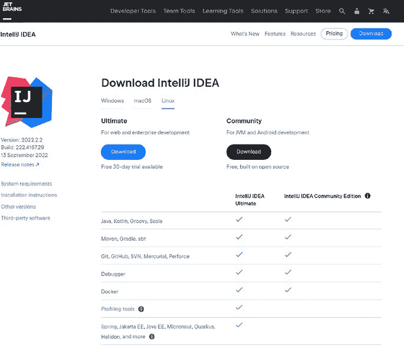

附录 A 设置环境工具

**安装 IntelliJ**

安装 IntelliJ 的说明位于 JetBrains 官方网站 12 上，该网站提到了最低资源要求和操作系统。该 IDE 有两个版本。社区版是免费的，你可以使用并安装多个插件。终极版需要付费，并提供了一些本书不需要的额外功能。

图 A-1 展示了官方网站上两个版本之间的所有差异。

***图 A-1.** 下载 IDE 的官方网站*

12 [`www.jetbrains.com/idea/download/#section=linux`](https://www.jetbrains.com/idea/download/#section=linux)

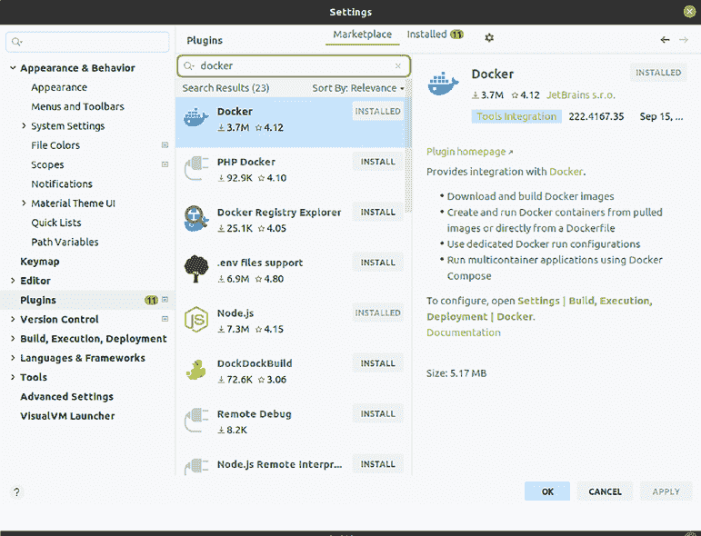

附录 A 设置环境工具

以下插件可能有助于安装在此 IDE 上。

• Maven Helper13

• GitToolBox14

• Docker15

• Spring Tools16

要安装这些插件中的任何一个，请转到“偏好设置” ➤ “插件”，按名称查找插件，然后安装它。


图 A-2 展示了该插件在 IntelliJ 中安装时的显示效果。

***图 A-2.** IntelliJ 插件安装*

13 [`plugins.jetbrains.com/plugin/7179-maven-helper`](https://plugins.jetbrains.com/plugin/7179-maven-helper)

14 [`plugins.jetbrains.com/plugin/7499-gittoolbox`](https://plugins.jetbrains.com/plugin/7499-gittoolbox)

15 [`plugins.jetbrains.com/plugin/7724-docker`](https://plugins.jetbrains.com/plugin/7724-docker)

16 [`plugins.jetbrains.com/plugin/14279-spring-tools`](https://plugins.jetbrains.com/plugin/14279-spring-tools)

附录 A 环境工具设置

**安装 Docker**

Docker 是基于 Linux 运行容器引擎最流行的选择之一。在本书中，你可以用它来降低在系统上安装数据库的复杂性。使用 Docker，你可以轻松运行容器，并在停止时将其移除。

**注意** 本书不会解释使用 Docker 的所有优缺点。许多其他书籍、文章和视频都详细介绍了与此技术相关的所有概念。

安装 Docker 取决于你的操作系统，因为在 Linux 发行版中有几种原生安装方式。在 Windows/macOS 系统中，Docker Desktop 在操作系统和 Docker 之间引入了一个层，以提供运行容器的能力。详情请遵循官方网站.17 上的说明。

安装此工具后，你唯一需要做的就是检查系统上的版本。为此，请输入以下命令。

➜ ~ docker --version

Docker version 20.10.12, build 20.10.12-0ubuntu2~20.04.1

要运行容器，你可以在 Docker Hub18 的官方网页上找到所有可用的镜像。作为示例，运行 hello-world 镜像来测试一切是否正常。

➜ ~ docker pull hello-world:latest

➜ ~ docker run hello-world:latest

Hello from Docker!

这条消息表明你的安装似乎工作正常。

为了生成这条消息，Docker 执行了以下步骤：

1. Docker 客户端联系了 Docker 守护进程。
2. Docker 守护进程从 Docker Hub 拉取了"hello-world"镜像。
17 [`docs.docker.com/install`](http://docs.docker.com/install)
18 [`hub.docker.com/`](https://hub.docker.com/)

附录 A 环境工具设置

(amd64)
3. Docker 守护进程从该镜像创建了一个新容器，该容器运行了可执行文件，并产生了你当前正在阅读的输出。
4. Docker 守护进程将该输出流式传输到 Docker 客户端，客户端再将其发送到你的终端。

要尝试更具挑战性的操作，你可以使用以下命令运行一个 Ubuntu 容器：

$ docker run -it ubuntu bash

使用免费的 Docker ID 共享镜像、自动化工作流等：

https://hub.docker.com/

更多示例和想法，请访问：

https://docs.docker.com/get-started/

有关命令的更多信息，你可以查看这篇博文 19，其中解释了最相关的命令和组件。

19 [`michaelhaar.dev/my-docker-compose-cheatsheet`](https://michaelhaar.dev/my-docker-compose-cheatsheet)

**附录 B**

**推荐工具与**

**替代工具**

本附录讨论了本书中使用的工具以及替代选项。

**集成开发环境（IDE）**

**IntelliJ**1 是 Java 开发中使用最广泛的 IDE。IntelliJ IDEA 社区版提供了开始使用 Java 和 Spring 所需的一切。终极版包含额外功能和其他插件。图 B-1 展示了 IntelliJ 的外观。

1 [`www.jetbrains.com/idea/`](https://www.jetbrains.com/idea/)

© Andres Sacco 2023

A. Sacco, *Beginning Spring Data*, [`doi.org/10.1007/978-1-4842-8764-4`](https://doi.org/10.1007/978-1-4842-8764-4#DOI)

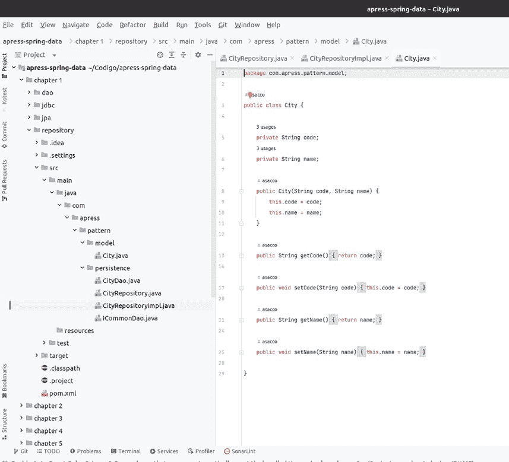

附录 B 推荐工具与替代工具

***图 B-1.** 导入项目后的 IntelliJ 界面*


**Eclipse**2 是大多数老开发人员熟知的另一种 Java 开发 IDE 选项。

大多数插件都是免费的，并且拥有一个庞大的开发者社区，他们会频繁更新这些插件，同时还有大量的 Spring 插件。最相关的插件会出现在 Spring 网站上。3 如果你使用这个工具，请按照说明安装插件。

图 B-2 展示了 Eclipse 的外观。

2 [`www.eclipse.org/downloads/`](https://www.eclipse.org/downloads/)

3 [`spring.io/tools`](https://spring.io/tools)

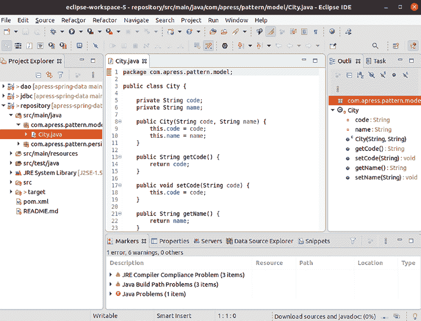

附录 B 推荐及替代工具

***图 B-2.** 导入项目后的 Eclipse*

**NetBeans**4 使用多种编程语言开发应用程序。由于其他选项已经能满足大多数开发者的需求，其用户社区已不再庞大。

一些开发者在开始学习第一门编程语言时会使用它。图 B-3 展示了 NetBeans 的外观。

4 [`netbeans.apache.org/`](https://netbeans.apache.org/)

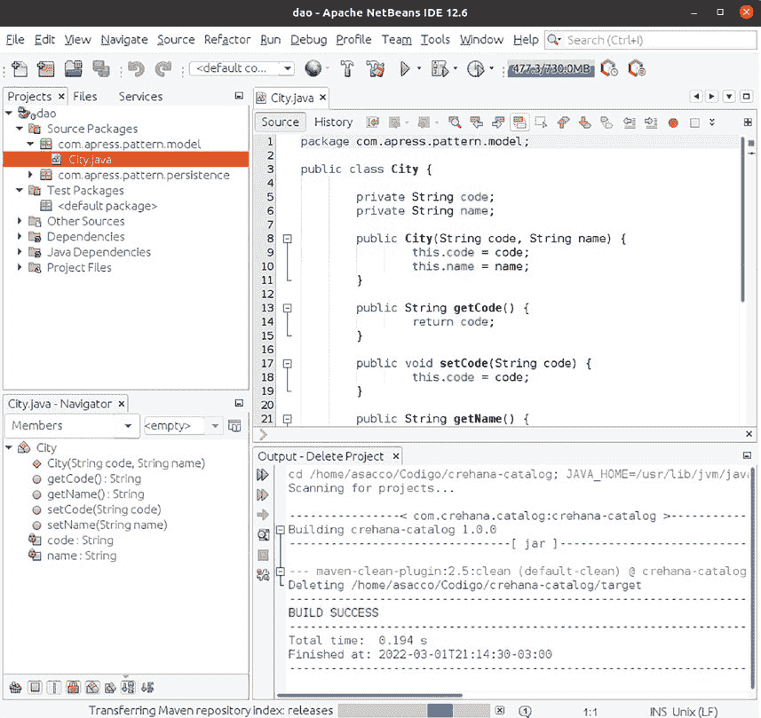

附录 B 推荐及替代工具

***图 B-3.** 导入项目后的 NetBeans*

**REST 工具**

**Postman**5 是一个测试 REST 端点的工具，你可以在其中使用变量来表示环境或实际日期等其他内容。你可以用它来在特定时间执行测试。图 B-4 简要展示了该工具的外观。

5 [`www.postman.com/`](https://www.postman.com/)

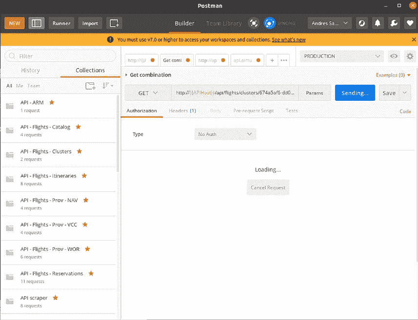

附录 B 推荐及替代工具

***图 B-4.** Insomnia 执行对 API 的调用*

**Insomnia**6 是一个用于 REST 端点请求的工具。它与 Postman 最大的区别之一在于，该工具支持多种协议，如 REST、gRPC、SOAP 和 GraphQL。其功能与 Postman 类似，用户界面也相似，但至少可以拥有两种主题。图 B-5 简要展示了该工具的外观。

6 [`insomnia.rest/`](https://insomnia.rest/)

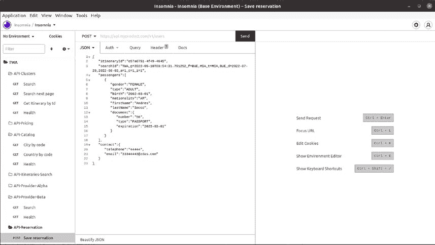

附录 B 推荐及替代工具

***图 B-5.** Insomnia 执行对 API 的调用*

**cURL**7 是一个简单的命令行工具，可用于调用 REST 端点。你可以使用此工具作为替代方案。它适用于大多数常见的操作系统。

**数据库**

本书涵盖了每种数据库类型的示例；其方法类似。

**Cassandra8**

**DataStax Studio**9 由创建 Cassandra 的开发者创建并维护，它提供了在所有操作系统上安装或使用 Docker 的机会。该工具的功能包括：以多种格式导出信息、导出查询或导入到另一台机器的过程，以及一个能验证查询的智能编辑器。图 B-6 简要展示了该工具的外观。

7 [`curl.se/download.html`](https://curl.se/download.html)

8 [`cassandra.apache.org/_/index.html`](https://cassandra.apache.org/_/index.html)

9 [`downloads.datastax.com/#studio`](https://downloads.datastax.com/#studio)

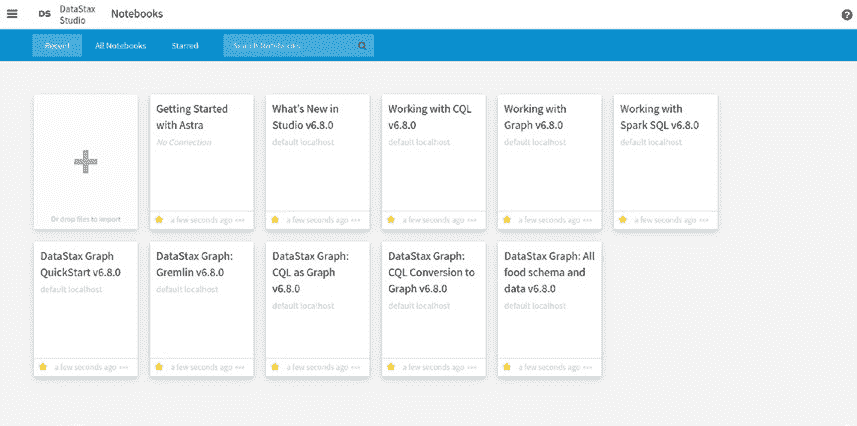

附录 B 推荐及替代工具

***图 B-6.** DataStax 配置页面*

**MongoDB10**

**Compass**11 是用于在 MongoDB 中连接、查询、优化和分析性能的官方解决方案。它提供了在多种操作系统上安装的可能性，并且拥有简单的用户界面。它还提供了一个良好的界面，用于查看执行每个查询的影响。


**Studio 3t**12 是 Compass 的替代品，许多初级开发者都在使用它。

其界面与 MySQL Workbench 或 pgAdmin III 等工具类似。你可以

在不阻塞用户界面的情况下运行查询。图 B-7 简要展示了该工具的外观。

10 [`www.mongodb.com/`](https://www.mongodb.com/)

11 [`www.mongodb.com/products/compass`](https://www.mongodb.com/products/compass)

12 [`studio3t.com/`](https://studio3t.com/)

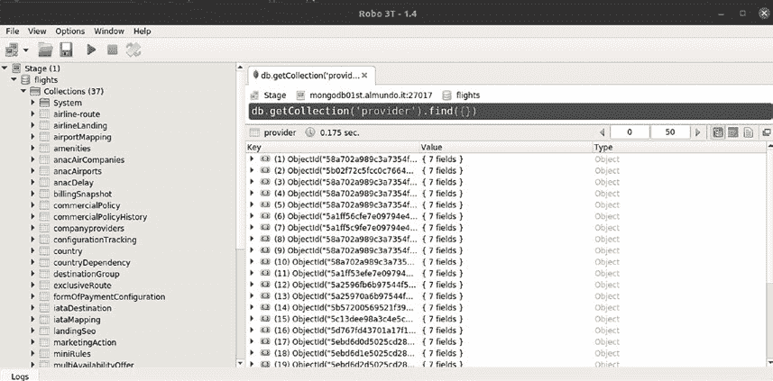

附录 B 推荐及替代工具

***图 B-7.** Studio 3t 查找集合*

**MySQL13**

**MySQL Workbench**14 是执行查询以及对 MySQL 数据库进行一定管理的最常用界面之一。使用此工具，你可以查看

每个数据库的资源使用情况，对表及其之间的关系进行建模，

并解释每个查询。图 B-8 简要展示了该工具的外观。

13 [`www.mysql.com/`](https://www.mysql.com/)

14 [`www.mysql.com/products/workbench/`](https://www.mysql.com/products/workbench/)

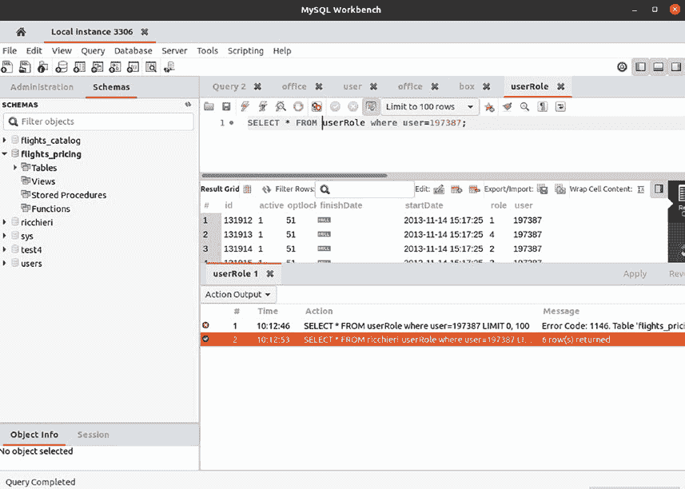

附录 B 推荐及替代工具

***图 B-8.** 显示一个查询结果的 MySQL Workbench*

**Neo4j15**

**Neo4j** **浏览器**16 是连接任何 Neo4j 数据库的默认方式。默认情况下，工具包含 Neo4j Browser。该工具的优点之一是它是免费的，并且由创建 Neo4j 的公司创建和支持。图 B-9 简要展示了该工具的外观。

15 [`neo4j.com/`](https://neo4j.com/)

16 [`neo4j.com/developer/neo4j-browser/`](https://neo4j.com/developer/neo4j-browser/)

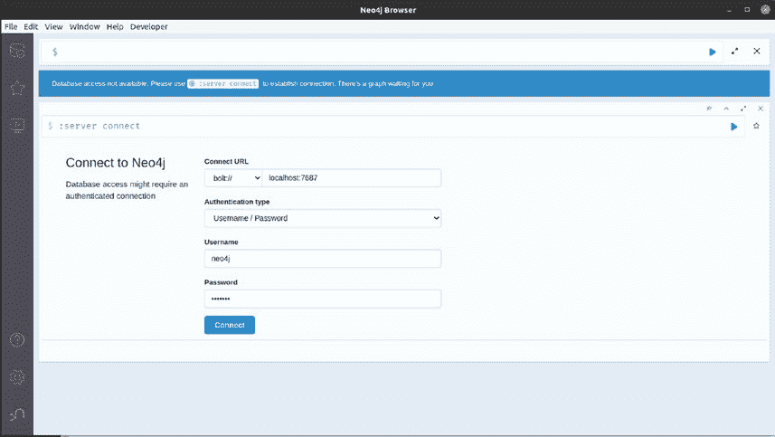

附录 B 推荐及替代工具

***图 B-9.** Neo4j 的配置窗口*

**Graphileon**17 是一款付费工具，用于连接不同类型的非关系型数据库，如 Neo4j、Redis 和 Cassandra。这些工具支持所有操作系统，

并提供一些 Neo4j Browser 不具备的功能，例如创建

库以可视化信息（如图表或图像）。图 B-10 简要展示了该工具的外观。

17 [`graphileon.com/`](https://graphileon.com/)

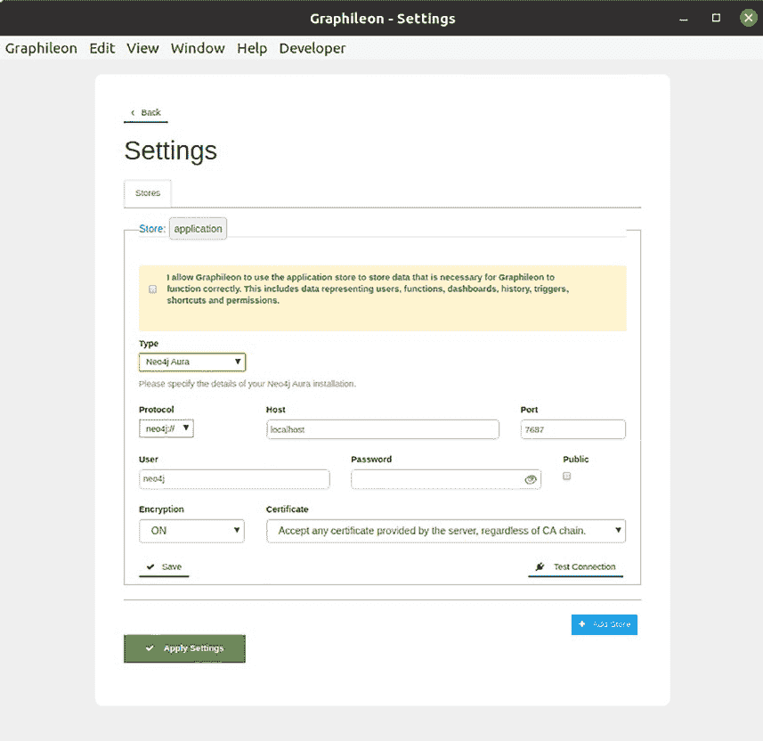

附录 B 推荐及替代工具

***图 B-10.** Neo4j 的设置窗口*

**PostgreSQL18**

**pgAdmin**19 是连接 PostgreSQL 数据库最流行的工具。它提供了一系列功能来检查内存/CPU 的使用情况，并以图形方式解释查询。

图 B-11 简要展示了该工具的外观。

18 [`www.postgresql.org/`](https://www.postgresql.org/)

19 [`www.pgadmin.org/`](https://www.pgadmin.org/)

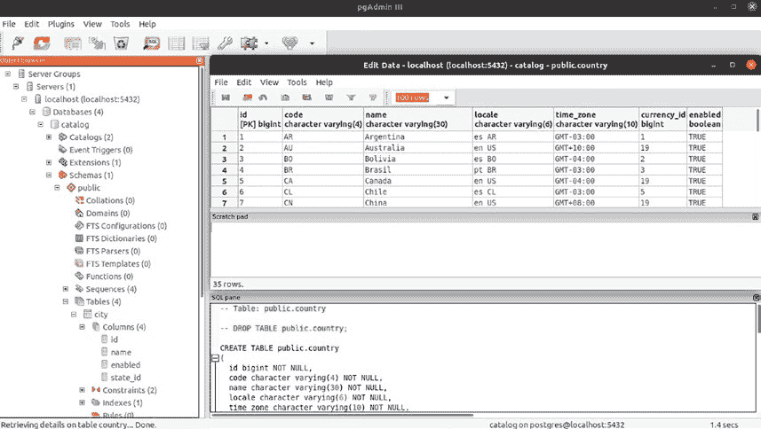

附录 B 推荐及替代工具

***图 B-11.** 显示一个查询结果的 pgAdmin*

**Redis20**

**RedisInsight**21 是连接 Redis 数据库的免费官方工具，可与所有功能进行交互，例如查看已保存信息的大小、检查

使用图表的信息、分析 CPU 和内存等资源的使用情况，以及本地或远程管理 Redis 数据库的所有元素。该工具的一个

有趣功能是，它允许你配置现有数据库，或者你可以使用该工具下载或创建一个数据库。图 B-12 简要展示了该工具的外观。

20 [`redis.io/`](https://redis.io/)


21 [`redis.com/redis-enterprise/redis-insight/`](https://redis.com/redis-enterprise/redis-insight/)

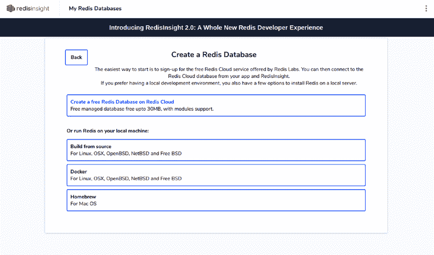

附录 B 推荐及替代工具

***图 B-12.** RedisInsight 的配置页面*

**SQLYog**22 是 MySQL Workbench 和 pgAdmin 的强大替代品，提供了诸如比较数据库或表之间数据等其他功能，允许从 SQL 文件或其他数据库同步模式，并且可以每天在特定时间创建备份。

**Dbeaver**23 是一款免费、开源的工具，用于访问 MariaDB、PostgreSQL 等多种关系型数据库。它提供了一个用户友好且类似于 MySQL Workbench 的界面。

22 [`webyog.com/product/sqlyog/`](https://webyog.com/product/sqlyog/)

23 [`dbeaver.io/`](https://dbeaver.io/)

**附录 C**

**打开项目**

本书展示了使用不同类型数据库的项目示例。您可以按照各章节的说明创建项目，或从官方源代码下载。如果您想下载并将其导入到您的 IDE 中，可以按照本附录中的说明进行操作。

**注意** 本书推荐的 IDE 是 IntelliJ，因此所有说明均与此 IDE 相关。

您的机器上必须安装 JDK 17 或更高版本才能运行本书中的所有项目。对于您需要使用的具体发行版没有限制。附录 A 提供了有关您需要安装的工具的更多信息。

图 C-1 展示了如何在 IntelliJ IDEA 中打开文件或现有项目。要选择您想打开的项目，请选择 **文件** ➤ **打开**。

© Andres Sacco 2023

A. Sacco, *Beginning Spring Data*[, https://doi.org/10.1007/978-1-4842-8764-4](https://doi.org/10.1007/978-1-4842-8764-4#DOI)

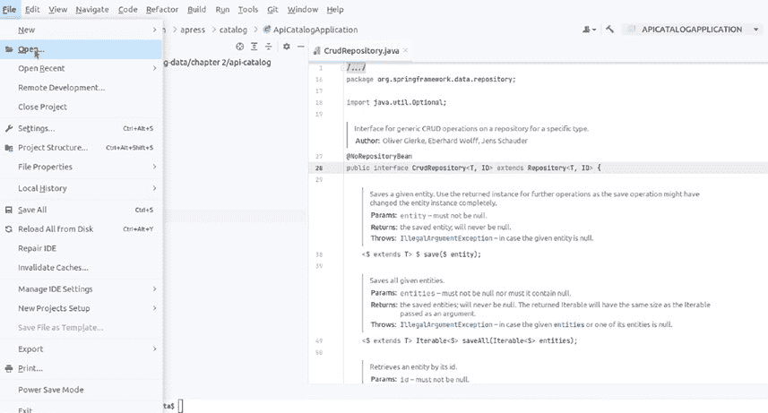

附录 C 打开项目

***图 C-1.** 打开项目的菜单选项*

当您点击“打开”按钮时，会弹出一个窗口，让您选择要导入到 IDE 中的项目位置，如图 C-2 所示。

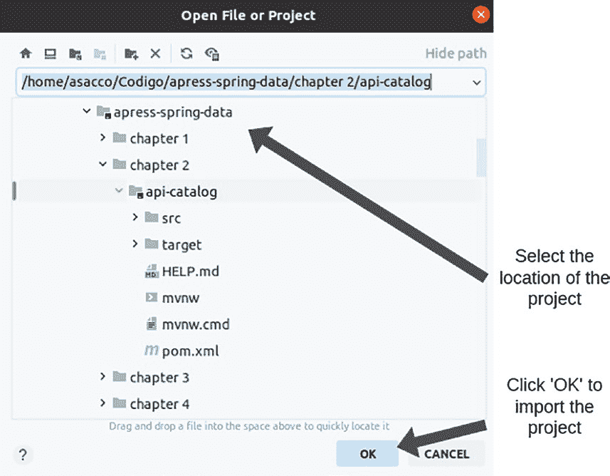

附录 C 打开项目

***图 C-2.** 选择要导入项目的弹出窗口*

将项目导入到您的 IDE 后，您可以打开包来查找主类，它通常位于根包中。图 C-3 显示了第 [2](https://doi.org/10.1007/978-1-4842-8764-4_2) 章中出现的所有项目结构。

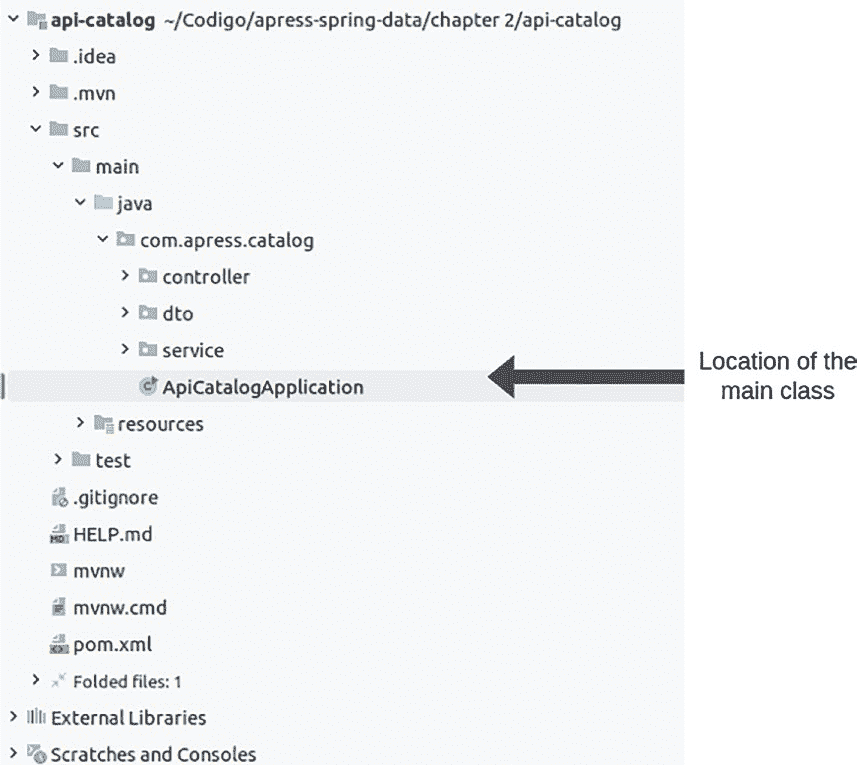

附录 C 打开项目

***图 C-3.** 执行应用程序的主类位置*

要运行应用程序，您只需点击主类并选择“运行应用程序”选项，或使用终端运行它。

**附录 D**

**安装和配置**

**关系型数据库**

本附录解释了如何在本书的第一部分和第二部分中安装 MySQL 和 PostgreSQL 数据库。使用哪种数据库没有限制；本附录展示了两种最流行的免费数据库。如果您可以使用其他数据库，也可以这样做，因为 Spring Data 至少支持所有现有的关系型数据库。

每个部分都包含了您需要执行的步骤，以加载一个功能完备的数据库，其中包含可在微服务中使用的良好数据集。

1.  在您的本地机器上安装数据库。
2.  安装用于访问数据库的客户端。
3.  在客户端应用程序中，配置与数据库的连接。
4.  创建模式。
5.  加载数据。

您可以选择不安装数据库，而是使用 Docker 运行它。有关 Docker 如何在每个数据库上工作的更多信息，请参见附录 F。

**MySQL**

MySQL 是一种关系型数据库，由 Sun Microsystems 于 1994 年发布。以下是使该数据库在开发者中流行的一些特性。

• 免费使用。
• 在处理大量操作时具有出色的性能。

© Andres Sacco 2023


A. Sacco，*Spring Data 入门*[, https://doi.org/10.1007/978-1-4842-8764-4](https://doi.org/10.1007/978-1-4842-8764-4#DOI)

附录 D 安装和配置关系型数据库

• 根据 2021 年 StackOverflow 调查 y,1，50% 的开发者在应用中使用该数据库，这一点很重要，因为许多人能够发现并报告任何问题。

**步骤 1：在本地机器上安装数据库**

该过程的第一步是下载数据库安装程序并运行安装过程。

MySQL 支持多种操作系统，包括 Windows、macOS 和许多 Linux 发行版。你可以从官方网站 e2 下载安装程序，并按照针对每个操作系统的指南 uctions3 进行操作。为 root 用户定义一个用户名/密码，你将在步骤 3 中使用它来连接数据库。

**步骤 2：安装客户端以访问数据库**

要使用 MySQL，你需要一个客户端来帮助你执行某些操作，例如创建模式、插入数据以及检查一切是否运行正常。有许多选项可以安装到你的机器上；有些是免费的，有些则提供短期试用。本书使用 MySQL Workbench，这是 MySQL 中推荐且最流行的工具，但还有其他选项，如附录 B 所述。

要根据你的操作系统下载安装程序，你可以查看 MySQL Workbench 的官方文档.4 如果你想查看安装的系统要求，可以查看 MySQL 安装网页.5

**步骤 3：配置连接**

安装数据库和客户端并访问它之后，下一步是打开 MySQL Workbench，并使用你在步骤 1 中设置的凭据创建一个新连接。如果安装程序没有要求设置用户名和密码，那么数据库可能默认使用 *root* 作为用户名，密码为空。

1 [`insights.stackoverflow.com/survey/2021#technology`](https://insights.stackoverflow.com/survey/2021#technology)
2 [`dev.mysql.com/downloads/mysql/`](https://dev.mysql.com/downloads/mysql/)
3 [`dev.mysql.com/doc/refman/8.0/en/installing.html`](https://dev.mysql.com/doc/refman/8.0/en/installing.html)
4 [`dev.mysql.com/downloads/workbench/`](https://dev.mysql.com/downloads/workbench/)
5 [`dev.mysql.com/doc/workbench/en/wb-installing.html`](https://dev.mysql.com/doc/workbench/en/wb-installing.html)

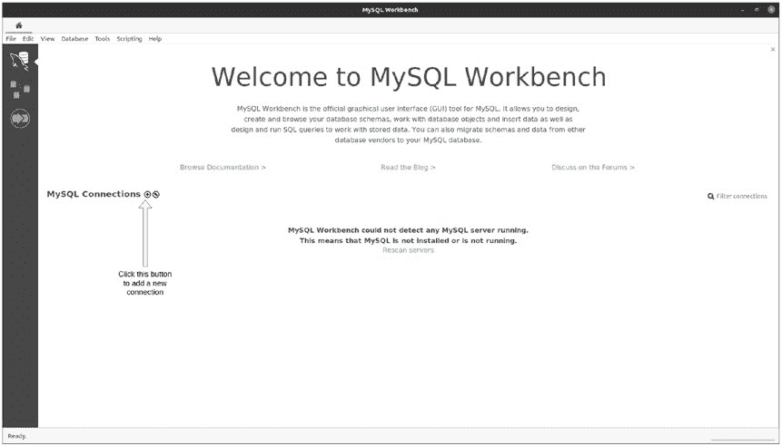

附录 D 安装和配置关系型数据库

图 D-1 显示了 MySQL Workbench 中的加号图标，点击它可以创建一个新连接。

***图 D-1.** 访问数据库的客户端*

图 D-2 显示了填写新连接所有相关信息的界面。在此窗口中，你只需填写用户名信息。主机名为 localhost 或 127.0.0.1，端口在所有情况下均为 3306，以及一个连接名称，该名称可以是任何内容，因为对名称没有限制。

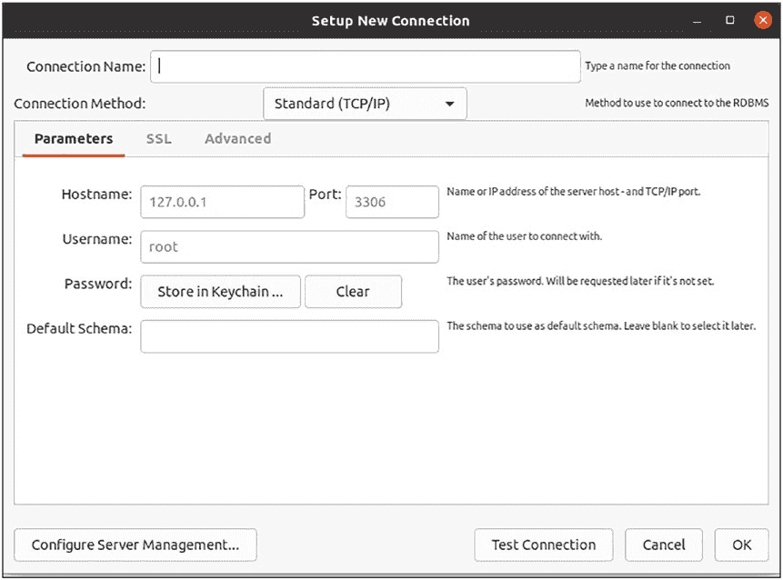

附录 D 安装和配置关系型数据库

***图 D-2.** 创建新连接*

如果你想检查一切是否正常，可以点击“测试连接”按钮，然后会弹出一个窗口要求填写连接的密码。如果你想设置密码并避免每次都弹出窗口，则需要点击“存储在钥匙串中…”按钮，该按钮会要求输入密码并将值保存在你机器上的安全位置。

测试连接后，点击“确定”按钮保存有关连接的所有信息。

**步骤 4：创建模式**

当你在 MySQL Workbench 中创建好连接后（见图 D-3)，双击访问该数据库并执行你想要的任何操作。

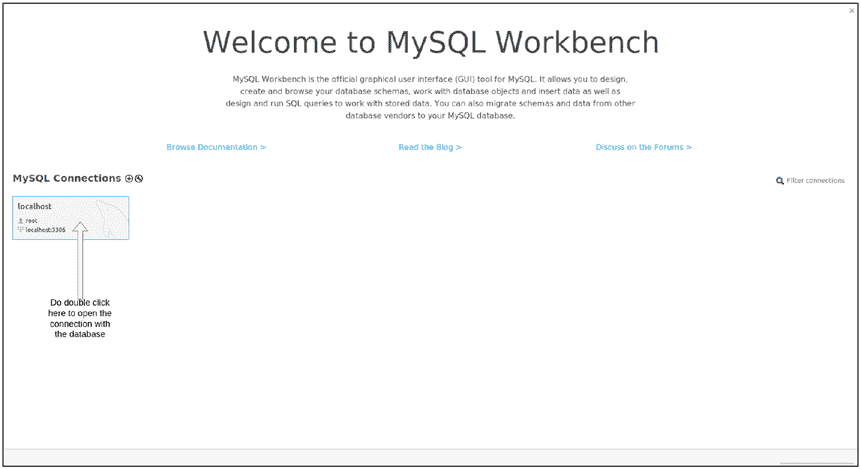


附录 D 安装并配置关系型数据库

***图 D-3.** MySQL Workbench 中的活动连接*

你需要做的第一件事是创建一个包含所有表的新模式。

点击加号图标。当表单出现时，输入数据库的名称。最后，

点击“应用”按钮创建一个空模式，你将在下一步中向其中填充不同的

表。

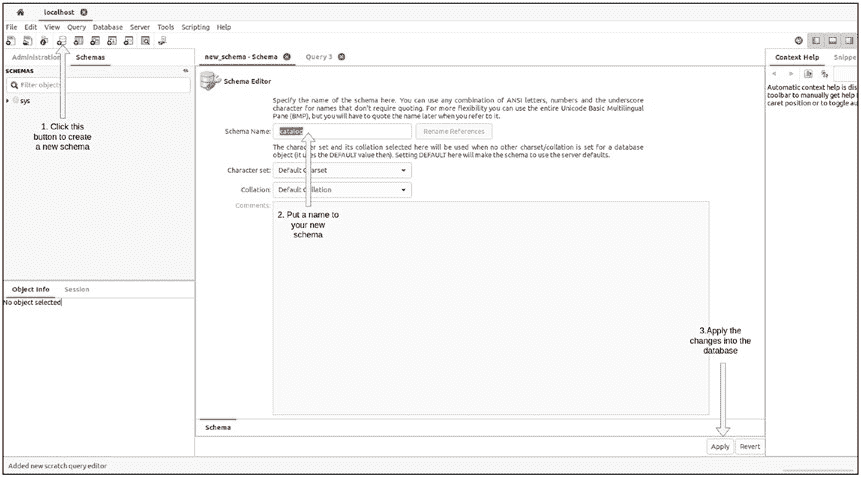

附录 D 安装并配置关系型数据库

***图 D-4.** 创建新模式*

**步骤 5：加载数据**

此过程的最后一步是创建模式的结构，并用你在关系型数据库章节中使用的信息填充它。这些信息位于代码仓库文件夹中（[github.com/apress/beginning-spring-data](http://github.com/apress/beginning-spring-data)）。每个文件夹对应一个章节。你可以在 databases 文件夹中找到所有需要执行的脚本（见图 D-5）。

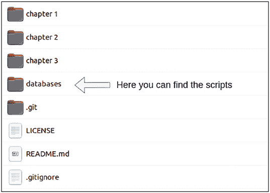

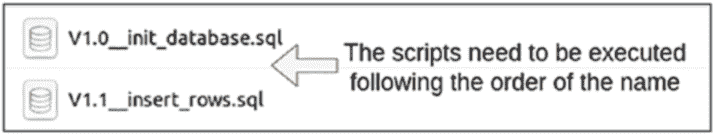

附录 D 安装并配置关系型数据库

***图 D-5.** 包含数据库脚本的源代码仓库*

此文件夹内有多个文件。请按版本号依次执行每个文件（见图 D-6）。第一个要执行的脚本是 `V1.0_init_database.sql`。

***图 D-6.** 需要在数据库中执行的脚本*

最后一步是打开每个脚本并执行它。你可以将文件拖放到 MySQL Workbench 中来完成此操作。应用程序会打开该文件并显示其内容。之后，你只需点击按钮即可将所有脚本运行到数据库中，并对每个脚本重复此过程（见图 D-7）。

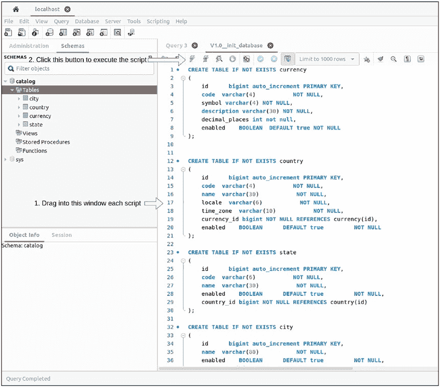

附录 D 安装并配置关系型数据库

***图 D-7.** 在 MySQL Workbench 中加载脚本*

**PostgreSQL**

PostgreSQL 是一款创建于 1996 年的关系型数据库，是 MySQL 的替代品。以下是使该数据库在开发者中广受欢迎的一些特性。

• 免费使用。
• 针对大量读写操作进行了优化的数据库。
• 支持比 MySQL 更多的数据类型，例如枚举值。

附录 D 安装并配置关系型数据库

• 根据 StackOverflow 2021 年的调查 6，PostgreSQL 是仅次于 MySQL 的第二大常用数据库，这意味着如果出现问题，会有很多人报告该错误。

**步骤 1：在本地机器上安装数据库**

此过程的第一步是下载数据库安装程序并运行安装过程。PostgreSQL 支持多种操作系统，包括 Windows 和 macOS，以及许多 Linux 发行版，例如 Debian、Ubuntu、Red Hat 和 Suse。你可以从官方网站 7 下载安装程序，并在点击你的操作系统后按照说明进行操作。说明网页包含了使用每个数据库版本的前提条件。

为 root 用户定义一个用户名/密码，你将在步骤 3 中使用它来连接数据库。

**步骤 2：安装客户端以访问数据库**

要使用 PostgreSQL，你需要一个客户端来帮助你执行某些操作，例如创建模式、插入数据以及检查一切是否正常运行。对于所有关系型数据库，有几种选择；有些是免费的，有些则提供短期试用。本书使用 pgAdmin，这是最流行的选择之一。

通过查看官方文档 8，根据你的操作系统查找并下载安装程序。这个数据库访问客户端与其他客户端的一个巨大区别是它可以通过 Docker 运行，因此如果你不想为本书安装它，你可以使用 Docker 来运行它。

当你选择操作系统时，你会看到在本地机器上安装它的前提条件和说明。


6 [`insights.stackoverflow.com/survey/2021#technology`](https://insights.stackoverflow.com/survey/2021#technology)

7 [`www.postgresql.org/download/`](https://www.postgresql.org/download/)

8 [`www.pgadmin.org/download/`](https://www.pgadmin.org/download/)


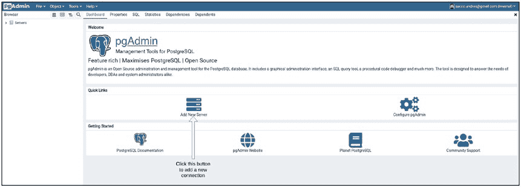

附录 D 安装并配置关系型数据库

**第 3 步：配置连接**

安装数据库和客户端访问工具后，下一步是打开 pgAdmin，并使用你在第 2 步中定义的凭据登录（见图 D-8）。

***图 D-8.** 登录页面*

图 D-9 展示了 pgAdmin 仪表盘。点击图标以添加新连接。

***图 D-9.** 添加新服务器*

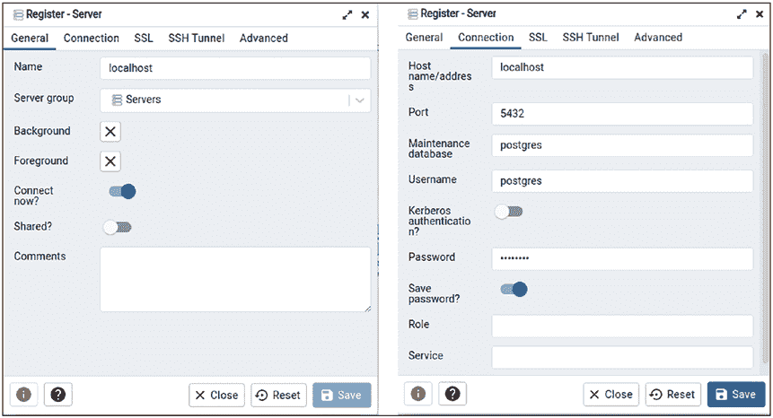

附录 D 安装并配置关系型数据库

接下来，你会看到一个包含所有数据库相关信息的窗口，例如用户名/密码、主机名（localhost 或 127.0.0.1）、端口（5432）以及连接名称。连接名称可以是任意内容，因为名称没有限制。

***图 D-10.** 连接配置*

如果一切正常，点击“保存”按钮。下一步你将创建模式。

**第 4 步：创建模式**

当你连接到在 pgAdmin 中创建的服务器时（见图 D-11），左键单击该服务器，在菜单中选择“创建”，然后选择“数据库”选项。

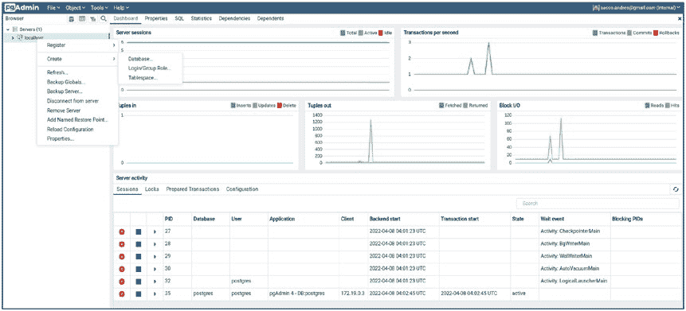

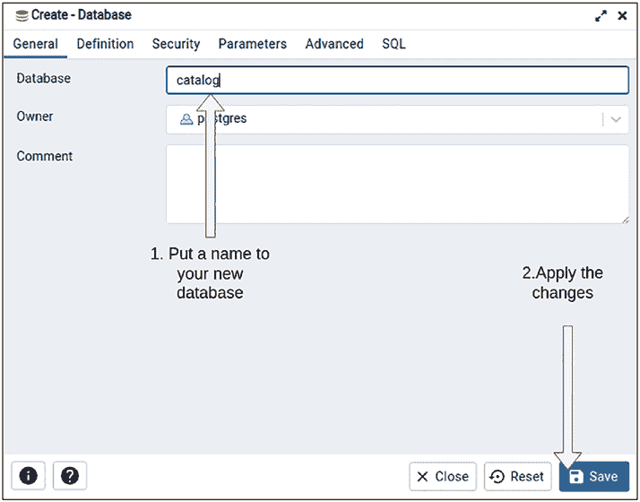

附录 D 安装并配置关系型数据库

***图 D-11.** 创建新数据库*

下一步是填写图 D-12 所示的窗口，并保存更改。

***图 D-12.** 创建新数据库的窗口*

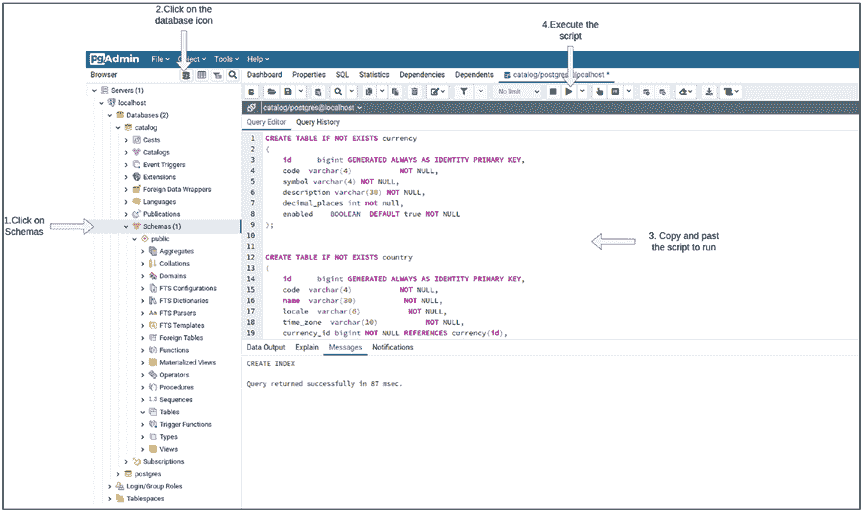

附录 D 安装并配置关系型数据库

**第 5 步：加载数据**

此过程的最后一步是创建模式结构，并用你在关系型数据库章节中使用的信息填充它。在源代码文件夹中有几个文件。你需要按版本号依次执行它们，因此第一个要执行的脚本是 `V1.0_init_database.sql`。

最后，你需要双击所创建数据库中的“模式”部分，并点击数据库图标以打开连接来执行查询。之后，你需要将每个文件的内容复制并粘贴到查询编辑器中，然后点击“播放”按钮来执行查询。你需要对脚本文件夹中的每个文件重复此过程。

***图 D-13.** 创建新数据库的窗口*

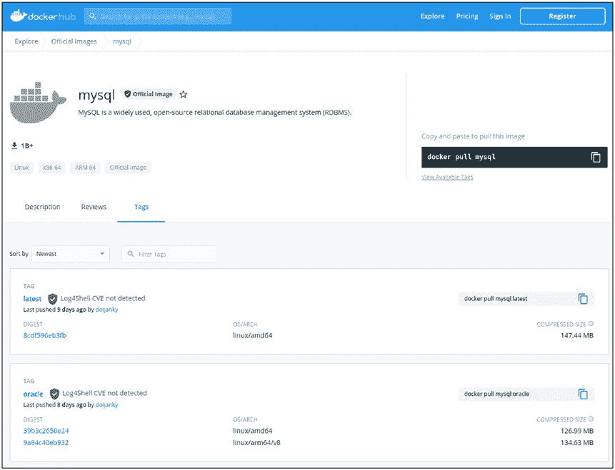

附录 D 安装并配置关系型数据库

**使用 Docker 运行数据库**

许多开发者不想在本地机器上安装数据库，因为它们会消耗资源且并非总是被使用。例如，要完成本书中的练习，你必须在机器上运行一个数据库。完成本书后，你可能不再需要使用 MySQL 或 PostgreSQL。使用 Docker 可以轻松运行一个数据库。

你必须在 Docker Hub 网站上查找特定版本的 MySQL9 或 PostgreSQL.10 我建议你不要使用最新版本，而是使用 Docker Hub 上存在的最后一个版本。

***图 D-14.** Docker Hub 网页*

9 [`hub.docker.com/_/mysql?tab=tags`](https://hub.docker.com/_/mysql?tab=tags)

10 [`hub.docker.com/_/postgres?tab=tag`](https://hub.docker.com/_/postgres?tab=tag)

附录 D 安装并配置关系型数据库

当你决定要运行哪个数据库后，下一步是下载镜像以供本地使用。

asacco@asacco:~/$ docker pull mysql/mysql-server: 8.0.30

8.0.30: Pulling from mysql/mysql-server

221c7ea50c9e: Pull complete

d32a20f3a6af: Pull complete

28749a63c815: Pull complete

3cdab959ca41: Pull complete

30ceffa70af4: Pull complete

e4b028b699c1: Pull complete

3abed4e8adad: Pull complete

Digest: sha256:6fca505a0d41c7198b577628584e01d3841707c3292499baae8703

7f886c9fa2


状态：已下载 mysql/mysql-server:8.0.30 的最新镜像

docker.io/mysql/mysql-server: 8.0.30

最后一步是运行你刚才下载的数据库镜像。

asacco@asacco:~/$ docker run mysql/mysql-server:8.0.30 -e MYSQL_ROOT_

PASSWORD: muppet

[Entrypoint] MySQL Docker 镜像 8.0.30-1.2.7-server

[Entrypoint] 未为新数据库指定密码选项。

[Entrypoint] 将生成一个随机的一次性密码。

[Entrypoint] 正在初始化数据库

………

[Entrypoint] MySQL 初始化进程完成。已准备好启动。

[Entrypoint] 正在启动 MySQL 8.0.30-1.2.7-server

2022-04-08T03:01:52.053869Z 0 [System] [MY-010116] [Server] /usr/sbin/

mysqld (mysqld 8.0.30) 以进程 1 启动

2022-04-08T03:01:52.061845Z 1 [System] [MY-013576] [InnoDB] InnoDB

初始化已开始。

2022-04-08T03:01:52.208388Z 1 [System] [MY-013577] [InnoDB] InnoDB

初始化已结束。

2022-04-08T03:01:52.411922Z 0 [Warning] [MY-010068] [Server] CA 证书

ca.pem 是自签名的。

附录 D 安装和配置关系型数据库

2022-04-08T03:01:52.411987Z 0 [System] [MY-013602] [Server] 通道 mysql_

main 已配置为支持 TLS。此通道现在支持加密连接。

2022-04-08T03:01:52.433058Z 0 [System] [MY-010931] [Server] /usr/sbin/

mysqld: 已准备好接受连接。版本：'8.0.30' 套接字：'/var/lib/mysql/

mysql.sock' 端口：3306 MySQL Community Server - GPL。

2022-04-08T03:01:52.433067Z 0 [System] [MY-011323] [Server] X Plugin 已准备好

接受连接。绑定地址：'::' 端口：33060，套接字：/var/run/mysqld/

mysqlx.sock

当数据库运行时，你可以使用与本地机器上安装的数据库相同的端口来使用它。

**附录 E**

**安装和配置**

**非关系型数据库**

本附录介绍如何安装本书第三部分中使用的非关系型数据库。

这类数据库的主要问题取决于你使用的具体数据库；安装过程需要时间并执行指令。我建议你使用 Docker 来运行镜像。你也可以使用 Docker 的 UI 控制台。

**Redis**

Redis 是一个高性能的非关系型数据库，有多种安装选项。

使用流行的 Homebrew 安装工具是一种选择，这意味着数据库会安装并运行在你的机器上。阅读完本书后，如果你不再使用它，需要将其移除。清单 E-1 展示了如何使用 Homebrew 进行安装。

***清单 E-1.*** 使用 Homebrew 安装

$ brew install redis

==> 正在安装 redis

==> 正在倒入 redis--7.0.4.x86_64_linux.bottle.tar.gz

==> 注意事项

要在升级后重启 redis：

brew services restart redis

或者，如果你不需要/不想使用后台服务，可以直接运行：

/home/linuxbrew/.linuxbrew/opt/redis/bin/redis-server /home/linuxbrew/.

linuxbrew/etc/redis.conf

© Andres Sacco 2023

A. Sacco, *Beginning Spring Data*[, https://doi.org/10.1007/978-1-4842-8764-4](https://doi.org/10.1007/978-1-4842-8764-4#DOI)

附录 E 安装和配置非关系型数据库

==> node

Bash 补全已安装到：

/home/linuxbrew/.linuxbrew/etc/bash_completion.d

当此安装过程完成后，数据库将在端口 5432 上运行。如果你不想使用它或需要移除它，可以在 Homebrew 中调用 remove 或 stop 命令。

如果你想检查机器上安装的 Redis 版本，可以使用以下命令进行查看。同时，此命令也有助于确认安装是否成功。

$ redis-server --version

Redis server v=7.0.4 sha=00000000:0 malloc=jemalloc-5.2.1 bits=64

build=5aabc73c47c29d1e

第二种选择是创建一个 docker-compose 文件，用于运行数据库和 RedisInsight（一种用于访问和操作 Redis 的工具）。清单 E-2 展示了使用 RedisInsight 运行 Redis 数据库的 Docker-compose 文件结构。

***清单 E-2.*** 用于运行 Redis 的 Docker-compose 文件

version: '3.1'

services:

redis-db:

image: redis:6.2

restart: always

ports:

- 6379:6379

redisinsight:


image: redislabs/redisinsight:1.12.1 #此版本对应工具的 2.0 版本

ports:
- '8001:8001'

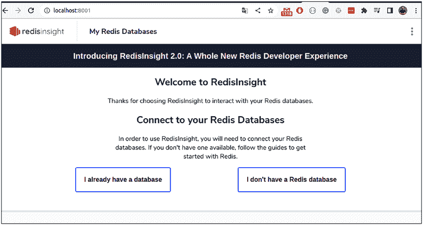

附录 E 安装和配置非关系型数据库

创建文件后，使用 `docker-compose up` 命令运行它。然后，打开浏览器并输入 **localhost:8001**，这是 **RedisInsight** 使用的端口。图 E-1 展示了首次进入网页时 RedisInsight 的界面。

***图 E-1.** RedisInsight 主页*

下一步是将此工具与正在运行的数据库连接，因此你需要点击“我已经有一个数据库”按钮。你会看到一个包含多种连接选项的网页，因为数据库可以托管在不同的位置，例如你的本地机器、专用服务器或 AWS 等云服务提供商。图 E-2 展示了配置数据库访问权限的不同选项。

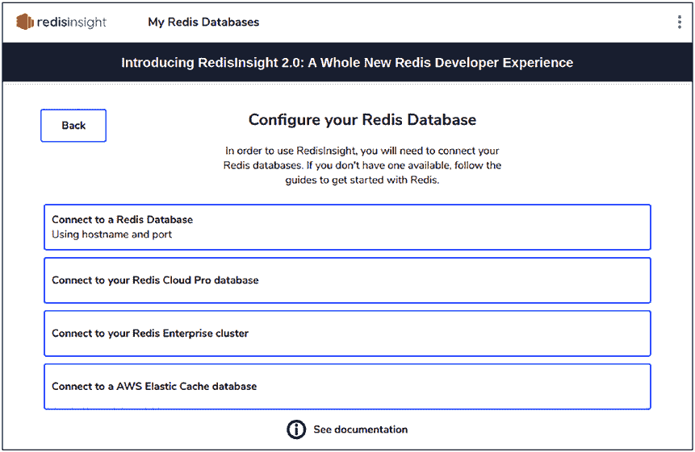

附录 E 安装和配置非关系型数据库

***图 E-2.** 数据库配置*

下一步是点击“连接到 Redis 数据库”按钮，并在弹出的模态框中填写连接信息。

• **host**：redis-db
• **port**：6379
• **name**：catalog（或你希望使用的任何名称）

确认所有信息后，RedisInsight 会在添加数据库之前进行连接验证，检查你提供的信息是否正确。如果一切正常，你将看到一个如图 E-3 所示的界面，其中列出了你在工具中已配置的数据库。

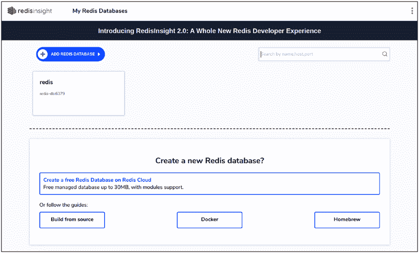

附录 E 安装和配置非关系型数据库

***图 E-3.** 与数据库的连接*

如果你双击该数据库，将进入一个新页面，其中包含你可以针对此特定数据库执行的所有操作，并可以检查其状态。这些操作可以通过命令行或 RedisInsight 中的 CLI 工具从你的应用程序中执行（见图 E-4）。

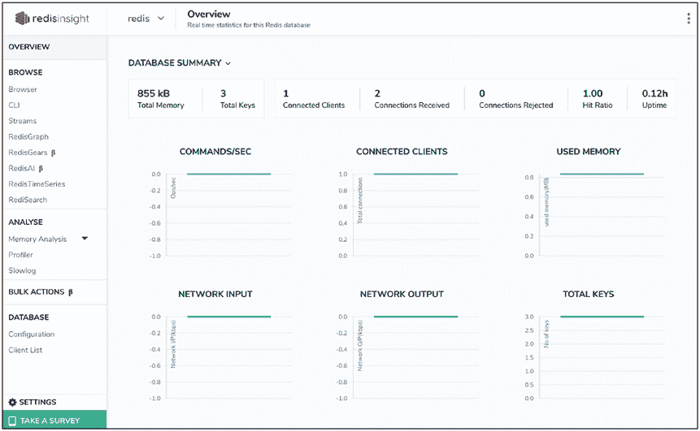

附录 E 安装和配置非关系型数据库

***图 E-4.** 活跃的数据库*

最后，你可以打开“浏览器”选项来向数据库添加新元素或检查现有元素，这有助于检查键的 TTL 是否正常（见图 E-5）。

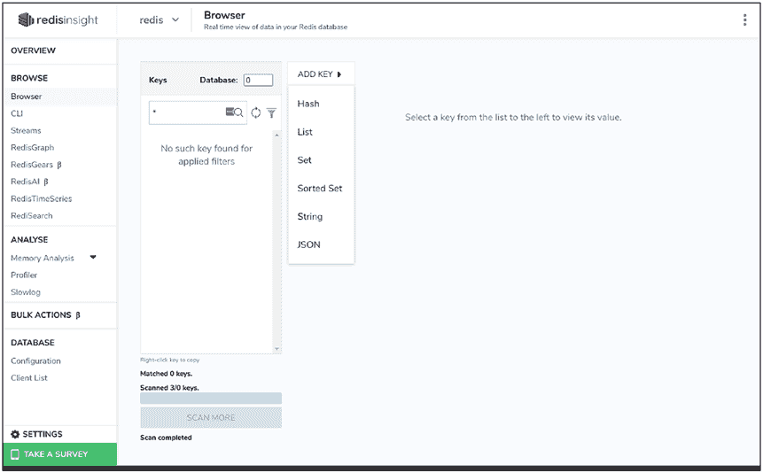

附录 E 安装和配置非关系型数据库

***图 E-5.** 浏览器选项卡，允许添加新键*

**MongoDB**

MongoDB 是一种非关系型数据库，它以文档形式持久化信息，并具备关系型数据库的部分功能。该数据库提供多种安装选项。

该数据库有相关文档 1，介绍了如何根据你的操作系统使用不同的软件包进行安装。不过，根据操作系统的不同，安装过程可能需要额外的步骤。

Homebrew 简化了安装过程的复杂性。第一步是将与 Mongo 相关的仓库添加到 Homebrew 中，默认情况下 Homebrew 并不包含这些仓库（见清单 E-3）。

1 [`www.mongodb.com/docs/v6.0/administration/install-on-linux/`](https://www.mongodb.com/docs/v6.0/administration/install-on-linux/)

附录 E 安装和配置非关系型数据库

***清单 E-3.*** 为 Homebrew 添加 Mongo 仓库

$ brew tap mongodb/brew

Cloning into '/home/linuxbrew/.linuxbrew/Homebrew/Library/Taps/mongodb/
homebrew-brew'...
remote: Enumerating objects: 1017, done.
remote: Counting objects: 100% (302/302), done.
remote: Compressing objects: 100% (105/105), done.
remote: Total 1017 (delta 245), reused 208 (delta 196), pack-reused 715
Receiving objects: 100% (1017/1017), 218.01 KiB | 1.79 MiB/s, done.
Resolving deltas: 100% (540/540), done.
Tapped 18 formulae (36 files, 363.6KB).

之后，你只需更新 Homebrew 中的仓库，然后继续执行


在你的机器上安装 Mongo 的命令（参见清单 E-4）。

***清单 E-4.*** 使用 Homebrew 更新并安装 Mongo

$ brew update

Already up-to-date.

$ brew install mongodb-community@6.0

Warning: mongodb-community provides a launchd plist which can only be used

on macOS!

You can manually execute the service instead with:

mongod --config /home/linuxbrew/.linuxbrew/etc/mongod.conf

最后一种选择是使用 Docker 命令来运行数据库，或者使用一个 docker-compose 文件。清单 E-5 展示了使用 Docker-Compose 配置 MongoDB 的基本方法。

***清单 E-5.*** 用于运行 Mongo 的 Docker-compose 文件

version: '3.1'

services:

mongo-db:

image: mongo:6.0

container_name: mongo-db

restart: always

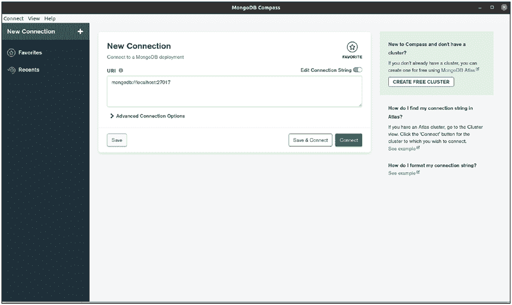

附录 e 安装和配置非关系型数据库

environment:

MONGO_INITDB_ROOT_USERNAME: root

MONGO_INITDB_ROOT_PASSWORD: rootpassword

ports:

- 27017:27017

在你的机器上运行 MongoDB 之后，下一步是使用工具以图形化方式访问数据库。根据你的操作系统，按照官方文档 2 的步骤安装 Mongo Compass（一个官方的 Mongo 工具）。

当你的机器上安装了 Mongo Compass 后，首次打开时会看到一个如图 E-6 所示的界面，该界面允许你配置首次连接。

***图 E-6.** Mongo Compass 首页*

下一步是点击“高级连接选项”，输入你机器上运行的 Mongo 服务器的用户名和密码。如果你使用了 docker-compose 文件，用户名为 **root**，密码为 **rootpassword**。图 E-7 展示了 Mongo Compass 上高级配置的界面。

2 [`www.mongodb.com/try/download/compass`](https://www.mongodb.com/try/download/compass)

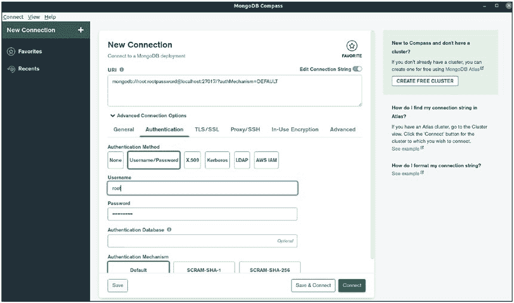

附录 e 安装和配置非关系型数据库

***图 E-7.** 配置与 MongoDB 服务器的连接*

如果你正确输入了所有信息，你会看到一个显示你 MongoDB 服务器上所有可用数据库的界面。默认情况下，有三个数据库，请尽量不要删除它们（参见图 E-8）。

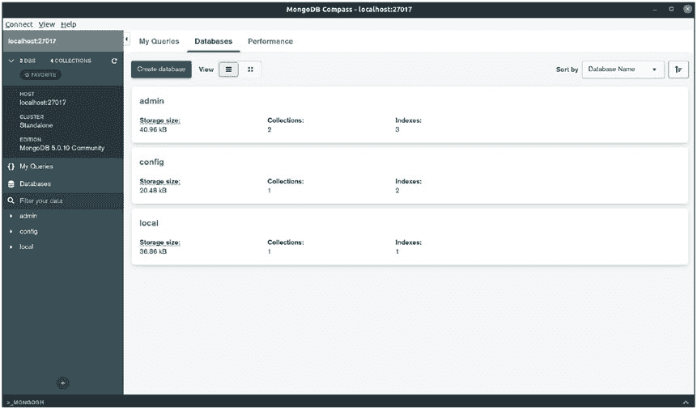

附录 e 安装和配置非关系型数据库

***图 E-8.** 你机器上的可用数据库*

最后一步是创建一个新数据库，用于保存包含目录信息的应用程序相关数据。为此，你只需点击“创建数据库”按钮，并填写字段，如图 E-9 所示。

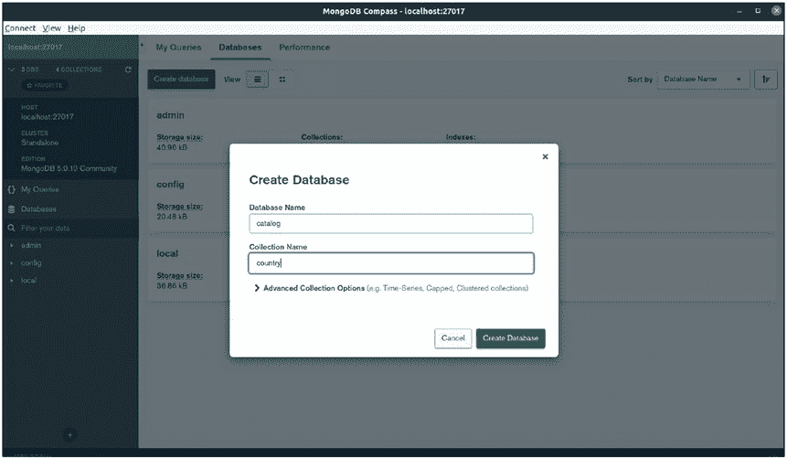

附录 e 安装和配置非关系型数据库

***图 E-9.** 在你的 Mongo 服务器上创建新数据库*

**Cassandra**

Cassandra 数据库的官方文档包含了安装说明。3 最佳选择是使用 Docker 命令或一个 docker-compose 文件。清单 E-6 展示了如何使用 Docker-Compose 配置 Cassandra 的多个实例。

***清单 E-6.*** 用于运行多节点 Cassandra 的 Docker-compose 文件

version: "2.1"

services:

cassandra-1:

image: cassandra:3.11.1

container_name: cassandra-1

environment:

CASSANDRA_CLUSTER_NAME: twa

CASSANDRA_DC: TDC1

3 [`cassandra.apache.org/doc/latest/cassandra/getting_started/installing.html`](https://cassandra.apache.org/doc/latest/cassandra/getting_started/installing.html)

附录 e 安装和配置非关系型数据库

MAX_HEAP_SIZE: 600M

HEAP_NEWSIZE: 100M

ports:

- '9042:9042'

- '9160:9160'

networks:

cassclus:

ipv4_address: 10.0.75.11

#Other nodes of cassandra

cassandra-web:

image: dcagatay/cassandra-web

environment:

CASSANDRA_HOST_IPS: 10.0.75.11,10.0.75.12,10.0.75.13

CASSANDRA_PORT: 9042

ports:

- "3000:3000"

restart: always

depends_on:

- cassandra-1

- cassandra-2

- cassandra-3

networks:

cassclus:

ipv4_address: 10.0.75.15

networks:

cassclus:

driver: bridge

ipam:


driver: default

config:

- subnet: 10.0.75.0/24

gateway: 10.0.75.1

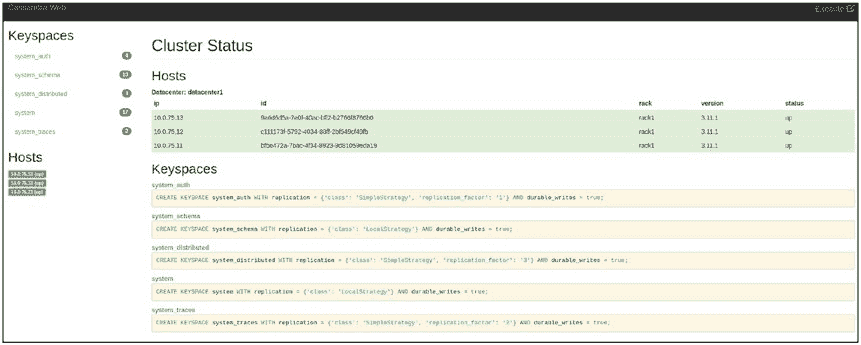

附录 E 安装和配置非关系型数据库

为了模拟真实场景，你使用三个不同的实例，这些实例通过有限的资源连接，以滥用你机器上的资源。docker-compose 文件包含了 Cassandra Web,4，这是一个基于 Ruby 的、用于操作数据库的可视化工具。

***图 E-10.** 显示节点状态的 Cassandra Web*

执行 docker-compose 文件并在浏览器中访问 `localhost:3000` 后，你会看到如图 E-10 所示的结果，其中显示了可用的节点和键空间。

我建议创建一个新的键空间并指定复制因子，因为如果你不指定，数据库会分配一个默认值，这可能不是最佳选择。图 E-11 展示了创建新键空间的页面外观。

4 [`github.com/avalanche123/cassandra-web`](https://github.com/avalanche123/cassandra-web)

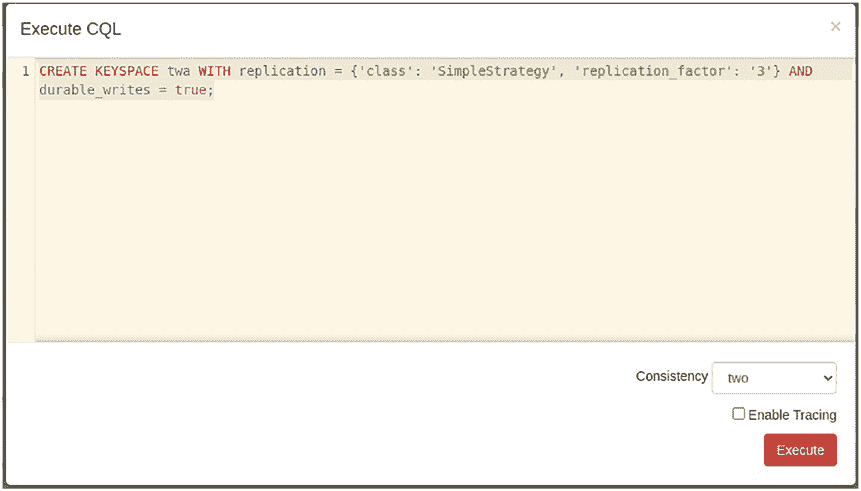

附录 E 安装和配置非关系型数据库

***图 E-11.** 创建一个包含所有表的键空间*

当你创建好新的键空间后，你会看到表。在这种情况下，由于这个结构是新建的，所以没有表。你只需点击左侧菜单中的键空间，就会看到该键空间的详细信息，如图 E-12 所示。

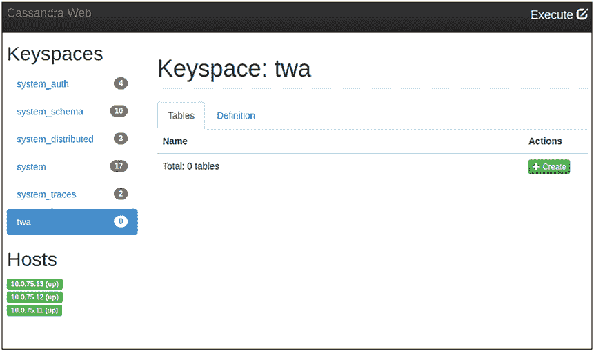

附录 E 安装和配置非关系型数据库

***图 E-12.** 新创建的键空间*

要创建一张表，你只需点击“创建”按钮并完成语句。请指明模态框底部出现的正确的一致性类型。图 E-13 向你展示了创建表时的编辑器外观。

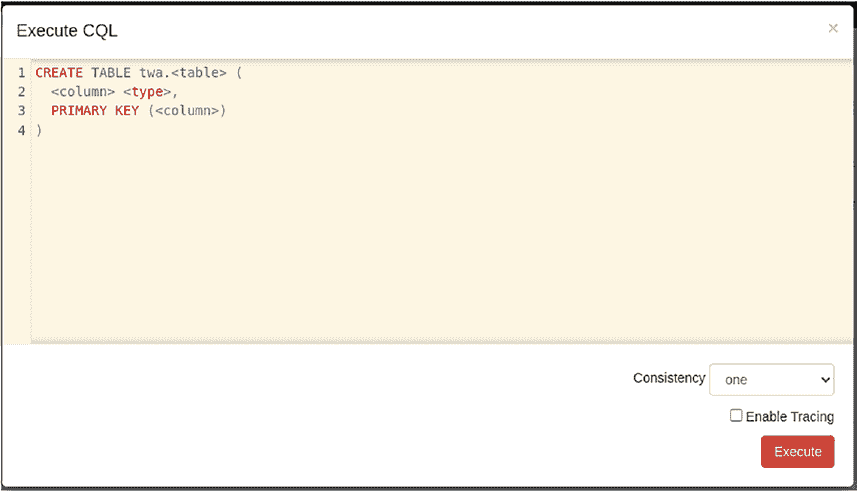

附录 E 安装和配置非关系型数据库

***图 E-13.** 如何创建一张表*

**Neo4j**

Neo4j 提供了多种安装方法；其中一些方法较为复杂。一种基本方法是遵循针对每个操作系统的说明.5

官方文档中还介绍了另一种选择。**Homebrew** 降低了安装过程的复杂性，你可以在列表 E-7 中看到相关步骤。

***列表 E-7.*** 安装 Neo4j

$ brew install neo4j

==> Checking for dependents of upgraded formulae...

==> No broken dependents found!

==> Caveats

==> neo4j

5 [`neo4j.com/docs/operations-manual/current/installation/`](https://neo4j.com/docs/operations-manual/current/installation/)

附录 E 安装和配置非关系型数据库

升级后重启 neo4j：

brew services restart neo4j

或者，如果你不需要后台服务，可以直接运行：

/home/linuxbrew/.linuxbrew/opt/neo4j/bin/neo4j console

官方文档中推荐的最后一个选项是使用 docker-compose 文件以集群方式运行多个实例。6

列表 E-8 展示了使用 Docker-compose 配置该数据库的方法。

***列表 E-8.*** 使用 Docker-compose 运行 Neo4j

version: '3'

networks:

lan:

services:

core1:

image: neo4j:3.5-enterprise

networks:

- lan

ports:

- 7474:7474

- 6477:6477

- 7687:7687

volumes:

- $HOME/neo4j/neo4j-core1/conf:/conf

- $HOME/neo4j/neo4j-core1/data:/data

- $HOME/neo4j/neo4j-core1/logs:/logs

- $HOME/neo4j/neo4j-core1/plugins:/plugins

environment:

- NEO4J_AUTH=neo4j/changeme

- NEO4J_dbms_mode=CORE

- NEO4J_ACCEPT_LICENSE_AGREEMENT=yes

6 [`neo4j.com/docs/operations-manual/current/docker/clustering/`](https://neo4j.com/docs/operations-manual/current/docker/clustering/)

附录 E 安装和配置非关系型数据库

- NEO4J_causal__clustering_minimum__core__cluster__size__at__

formation=3

- NEO4J_causal__clustering_minimum__core__cluster__size__at__

runtime=3


- NEO4J_causal__clustering_initial__discovery__members=core1:5000,core2:5000,core3:5000
- NEO4J_dbms_connector_http_listen__address=:7474
- NEO4J_dbms_connector_https_listen__address=:6477
- NEO4J_dbms_connector_bolt_listen__address=:7687

接下来，在你的本地机器上运行数据库。下一步是下载 Neo4j Browser，这是一个用于管理和查看数据库中信息表示形式的应用程序。官方文档 7 解释了如何根据你的操作系统进行安装。

当你完成 Neo4j Browser 的安装并打开应用程序后，第一步是同意你下载工具网站上显示的密钥所对应的条款和条件（见图 E-14）。

7 [`neo4j.com/download-center/#community`](https://neo4j.com/download-center/#community)

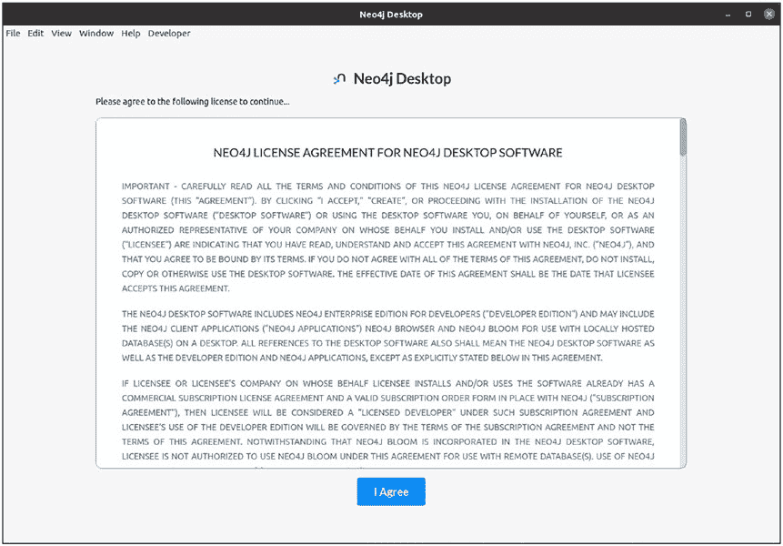

附录 e 安装和配置非关系型数据库

***图 E-14.** 必须接受的条款和条件*

加载你的许可证密钥后，你需要创建一个包含连接到特定数据库的项目。为此，请单击“新建”按钮并选择“创建项目”选项，如图 E-15 所示。

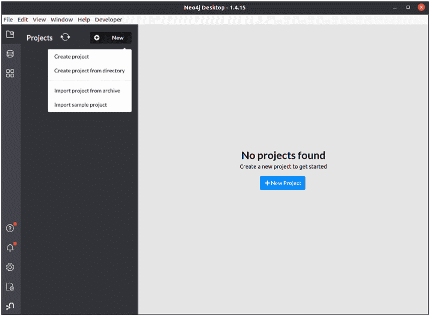

附录 e 安装和配置非关系型数据库

***图 E-15.** 创建一个新项目*

现在你有了一个项目，下一步是将该项目与数据库连接起来。如果你有一个在本地运行的实例，请选择正确的选项。图 E-16 显示了与数据库连接的样子。

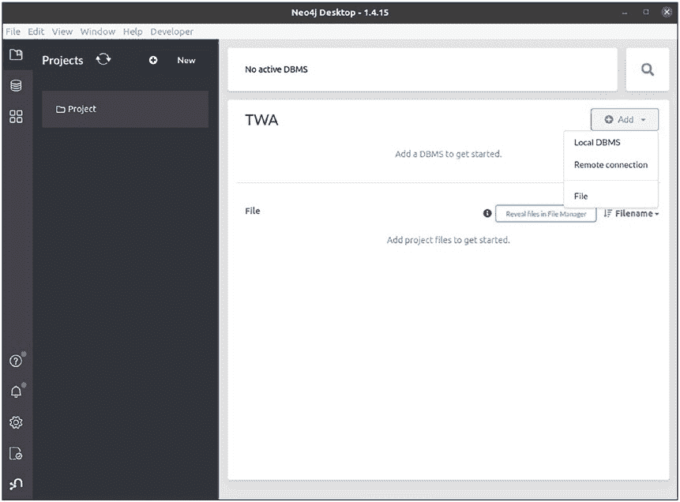

附录 e 安装和配置非关系型数据库

***图 E-16.** 连接到数据库*

当你加载与你的 Neo4j 实例关联的用户名/密码时，你会看到数据库的名称和活动连接。用户名/密码在 docker-compose 文件中定义。如果使用 Homebrew，你必须按照官方文档的说明设置密码。8 图 E-17 显示了活动数据库在工具上的样子。

8 [`neo4j.com/docs/operations-manual/current/configuration/`](https://neo4j.com/docs/operations-manual/current/configuration/set-initial-password/)
[set-initial-password/](https://neo4j.com/docs/operations-manual/current/configuration/set-initial-password/)

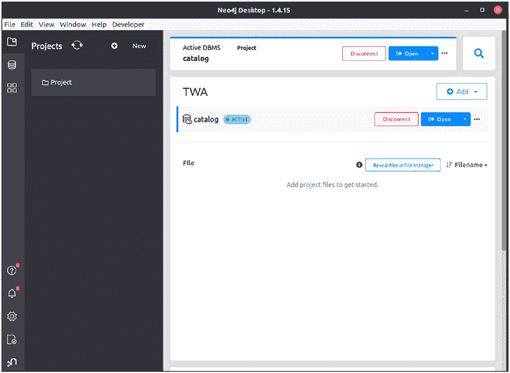

附录 e 安装和配置非关系型数据库

***图 E-17.** 活动数据库*

**附录 F**

**延伸阅读**

本书涵盖了框架、库、技术和数据库，但并未涵盖高级主题。本附录提供了一些书籍和其他资源的列表，你可以深入探索以学习更高级的主题。资源分为三组：通用资源、关系型数据库和非关系型数据库。

**通用资源**

• ***《Beginning IntelliJ IDEA》***，作者 Ted Hagos（Apress，2021 年）。1 本书涵盖了使用 IntelliJ 的所有方面，例如安装过程、如何调试应用程序以及掌握 IDE 基本技能最相关的要素。

• [***《Learn Microservices with Spring Boot》***](https://link.springer.com/book/10.1007/978-1-4842-6131-6) ***3.0***，作者 Moisés Macero García（Apress，2020 年）。2 如果你想了解微服务的所有方面，例如如何创建一个新的微服务，或者使用微服务而非单体架构的理念，本书将帮助你理解这些概念以及如何使用 Spring Boot 实现它们。

• ***《Docker in Action》***，作者 Jeff Nickoloff 和 Stephen Kuenzli（Manning，2019 年）。3 本书详尽解释了 Docker 的所有方面以及它如何与操作系统层交互。此外，你还将学习如何创建镜像或运行现有镜像。


1 [`link.springer.com/book/10.1007/978-1-4842-7446-0`](https://link.springer.com/book/10.1007/978-1-4842-7446-0)

2 [`link.springer.com/book/10.1007/978-1-4842-6131-6`](https://link.springer.com/book/10.1007/978-1-4842-6131-6)

3 [`www.manning.com/books/docker-in-action-second-edition?query=Docker%20`](https://www.manning.com/books/docker-in-action-second-edition?query=Docker%20in%20Action)

[in%20Action](https://www.manning.com/books/docker-in-action-second-edition?query=Docker%20in%20Action)

© Andres Sacco 2023

A. Sacco, *Spring Data 入门*[, https://doi.org/10.1007/978-1-4842-8764-4](https://doi.org/10.1007/978-1-4842-8764-4#DOI)

附录 f 进一步阅读

• [***Spring Boot 持久化最佳实践***](https://link.springer.com/book/10.1007/978-1-4842-5626-8)，作者 Anghel Leonard (Apress,

2020)。4 本书涵盖了提升关系型数据库持久化质量与性能的最相关主题。

大部分概念与关系型数据库相关，但也有一些方面可应用于非关系型数据库。

• ***学习 Spring Boot 3.0***，作者 Greg L. Turnquist (Packt, 2023)。5 本书涵盖了 Spring Boot 新版本中的大部分相关主题，

例如消息传递和响应式应用。

• **Laurentiu Spilca 的 YouTube 频道**。6 该频道提供关于 Spring 相关主题的视频，如安全、性能以及

基础教程。Laurentiu 是最受认可的 Spring 演讲者和作者之一。

**关系型数据库**

• [***SQL 查询入门***](https://link.springer.com/book/10.1007/978-1-4842-1955-3)，作者 Clare Churcher (Apress, 2008)。7 本书涵盖了 SQL 的所有基本方面，从如何编写操作

（插入、更新、选择、删除）到查询的效率或性能。

**非关系型数据库**

• [***Cassandra：权威指南，第 3 版***](https://learning.oreilly.com/library/view/cassandra-the-definitive/9781098115159/)，作者 Jeff Carpenter, Eben Hewitt (O’Reilly, 2020)。8 作者展示了该数据库

相较于其他非关系型数据库所提供的所有优势。此外，本书还涵盖了不常见的主题，如监控、

维护和扩展。

4 [`link.springer.com/book/10.1007/978-1-4842-5626-8`](https://link.springer.com/book/10.1007/978-1-4842-5626-8)

5 [`www.amazon.com/Learning-Spring-Boot-3-0-production-grade/dp/1803233303`](https://www.amazon.com/Learning-Spring-Boot-3-0-production-grade/dp/1803233303)

6 [`www.youtube.com/c/laurentiuspilca`](https://www.youtube.com/c/laurentiuspilca)

7 [`link.springer.com/book/10.1007/978-1-4842-1955-3`](https://link.springer.com/book/10.1007/978-1-4842-1955-3)

8 [`learning.oreilly.com/library/view/cassandra-the-definitive/9781098115159/`](https://learning.oreilly.com/library/view/cassandra-the-definitive/9781098115159/)

附录 f 进一步阅读

• [***Neo4j 入门***](https://link.springer.com/book/10.1007/978-1-4842-1227-1)，作者 Chris Kemper (Apress, 2015)。9 本书是对图数据库以及如何在 Neo4j 中实现它们的基本介绍。

• [***Redis 实战***](https://www.manning.com/books/redis-in-action?query=Redis)，作者 Josiah Carlson (Manning, 2013)。10 本书解释了 Redis 的基本用法，构建了可以保存到数据库中的信息示例。

本书还涵盖了与性能和可扩展性相关的其他方面。

• [***MongoDB 性能调优***](https://link.springer.com/book/10.1007/978-1-4842-6879-7)，作者 Guy Harrison 和 Michael Harrison (Apress, 2021)11。本书涵盖了查询的基本方面以及如何提高性能。还有其他主题，例如

使用不同实例创建集群以及监控数据库资源的使用情况。


9 [`link.springer.com/book/10.1007/978-1-4842-1227-1`](https://link.springer.com/book/10.1007/978-1-4842-1227-1)

10 [`www.manning.com/books/redis-in-action?query=Redis`](https://www.manning.com/books/redis-in-action?query=Redis)

11 [`link.springer.com/book/10.1007/978-1-4842-6879-7`](https://link.springer.com/book/10.1007/978-1-4842-6879-7)

**索引**

**A**

TTL, 263, 264

定义, 249

A/B 测试, 179, 180

节点架构, 250

ACID, 85, 146, 147, 234

关系型数据库, 249

执行器, 40, 44, 46, 53

结构, 252, 253

Adoptium, 342

Cassandra 查询语言 (CQL),

Amazon Document DB, 215

252, 263

Apache Cassandra, 249, 264

CassandraTemplate, 260–262

Apache OpenJPA, 17

CloudWatch, 60

api-catalog 应用, 177, 195, 213, 236,

@Column 注解, 94, 256

253, 275, 311–313, 315, 334

二进制类型, 101

src/test/java 中的 APITest, 313

字符类型, 99

应用架构类型

日期/时间类型, 99, 100

六边形架构, 27, 28

默认值, 96

分层架构, 24, 26

定义, 94

Azure Cosmos DB, 216

原始类型, 96–98

属性, 94

**B**

类型, 102

BEGIN_TRANSACTION 关键字, 145

@ColumnDefinition 注解, 96

columnDefinition 属性, 95

COMMIT 关键字, 145

**C**

一致性与完整性, 143

@Cacheable 注解, 334, 335

Couchbase, 19, 216

Cassandra, 269, 354, 355, 394, 396,

CountryRepository, 181, 281

397, 399

CountryService 的 DELETE 方法, 154

优势, 250, 251, 264

创建、检索/读取、更新、删除

CAP 定理, 252

(CRUD), 15, 19, 29, 32, 40, 54, 62,

配置

64, 67, 73

自定义仓库, 260–262

CrudRepository, 19, 73, 74, 224

数据库/连接

cURL, 354

设置, 253–260

CurrencyRepository, 75

© Andres Sacco 2023

A. Sacco, *Spring Data 入门*[, https://doi.org/10.1007/978-1-4842-8764-4](https://doi.org/10.1007/978-1-4842-8764-4#DOI)

索引

**D**

**E**

数据访问对象 (DAO) 模式,

EclipseLink, 17

22, 29, 32

ElasticSearch, 19, 282, 296

数据库访问

@Embeddable 注解, 130

缓存, 334, 335, 337–339

@EnableJpaAuditing 注解, 134

压缩信息, 325–332

@EnableNeo4jRepositories 注解, 241

自定义查询, 332

@EnableReactiveMongoRepositories

FetchType.Lazy, 332

注解, 270

主/从配置, 333

企业级 JavaBean (EJB), 4

持久化多个元素, 333

应用服务器, 12

减少传输信息, 332

特性, 14

数据库

定义, 12

Cassandra, 354, 355

功能, 13

Docker, 380, 381

类型, 15

MongoDB, 355, 356

实体

MySQL, 356, 357

列, 94–96

Neo4j, 357–359

Java 类, 91

PostgreSQL, 359, 360

非持久化属性, 103

Redis, 360, 361

主键/生成器, 104–106

DataStax Studio, 354

规则, 92

数据传输对象 (DTO) 模式, 34, 35,

表, 91

54, 65, 68, 69, 90, 115, 131, 139, 160

@Entity 注解, 91, 92

Dbeaver, 361

实体关系

DBUnit, 281, 294

两个实体之间, 110

依赖注入 (DI), 38

懒加载/急加载, 112–114

@DiscriminatorValue

排序, 115, 116, 118, 120

注解, 124

结果, 111

Docker, xx, 282, 286, 305, 347–348, 354,

类型, 108, 109

375, 380–382

环境工具

docker-compose stop 命令, 260

Docker, 347, 348

DockerHub, 282

git, 344

Docker 镜像, 166, 305

IDE, 349, 351, 352

文档存储

IntelliJ, 345, 346

定义, 213

Java 安装, 341, 342

实现, 215, 216

Maven, 343, 344

关系型数据库, 214

REST, 352–354

用例, 214, 215

ExampleMatcher, 209, 210, 227

索引

**F**

重复代码, 120

可嵌入类, 129–132

特性标志

列出/审计事件, 132–135

A/B 测试, 179

映射超类, 121, 122

实现, 181–185

每个类一张表, 127, 129

非关系型数据库, 180

每个类层次一张表, 123, 124

回滚, 179

每个类一张表，使用连接, 125, 126

切换选项, 180

@Inheritance 注解, 123, 127

findById 方法, 261, 287

Insomnia, 353, 354

Flyway, 103, 167–169, 175

IntelliJ, 170, 345, 346, 349

IntelliJ IDEA, xix, 349, 363, 407

**G**

Gatling, 311, 315, 320, 321, 323

**J**

@GeneratedValue 注解, 104,

jakarta.persistence 包, 88

107, 238

Java 数据库连接 (JDBC)

GenerationType.SEQUENCE, 105

组件/层, 5, 6

GET 方法, 114, 116, 160, 161, 247

数据库, 9–11


Git, 344

定义, 5

GraalVM, 340

驱动程序, 7

Gradle/Maven, 42, 48, 57, 167

基于客户端的, 8

GraphBLAS, 233

ODBC 访问, 8

图数据库

两层架构, 8

定义, 231

类型, 7

实现, 233

有线协议/原生协议

节点/链接, 232

驱动程序, 8

用例, 232

EJB, 12

Graphileon, 358

结构, 5

Java JDK, xix, 341

**H**

Java/Kotlin 应用, 278, 301

HashCode 和 equals 方法, 91, 93

Java 消息服务 (JMS), 15

Java 持久化 API (JPA), 4

数据库, 17, 18

**I**

定义, 16

@Id 注解, 92, 93, 198, 223, 238

层, 17

@Indexed 注解, 211, 223

SQL 语句, 16

继承

JavaScript, 268

基类, 121

JMapper, 35, 69

索引

JMeter, 311

MySQL

Joda 库, 100

配置连接, 369, 370

JPA 配置, 注解

创建模式, 370, 372

数据库, 88–90

定义, 367

元素和关系, 87

安装, 368

实体, 91–93

加载数据, 372–374

关系, 107

验证模式, 135, 136, 138–141

**N**

Junit, 278, 281, 305

Neo4j, 269, 357–359, 399

数据库/连接设置, 237

**K**

数据库, 235

Karate, 311–313, 315, 319

定义, 234

实体注解, 238–240

**L**

特性, 234

图数据库, 231

Liquibase, 85, 103, 166, 169–175, 283

仓库

LocalStack, 282, 295, 296

自定义仓库, 243–245

锁, 152

数据库, 241

实体, 242

**M**

查询, 245–247

编写查询, 243

macOS/Linux 命令, 342

NetBeans, 351, 352

@ManyToMany, 109, 223, 238

非关系型数据库, 3, 213, 230, 251,

@ManyToOne, 108–110

269, 275, 408, 409

@MappedSuperclass 注解, 121–123

Cassandra, 394, 396, 397, 399

Mapstruct, 35, 68, 114, 116

MongoDB, 389–392, 394

Maven, 57, 288, 311, 312, 343, 344

Neo4j, 399, 400, 402–405

Maven/Gradle, 167, 171

Redis, 383, 384, 386, 387, 389

消息驱动 Bean, 15

NullPointerException, 332

Microprofile, 305

ModelMapper, 35, 69

MongoDB, 215, 216, 218, 219, 247, 269,

**O**

270, 275, 355, 356, 389–392, 394

ObjectInstantiator, 71

MongoTemplate, 62, 227, 228, 230

ObjectMapper, 114

mvn test 命令, 286, 290, 312, 315

对象映射, 20–22, 70–72

mvn test-P gatling 命令, 320

面向对象语言, 120

mvn verify-P IT 命令, 290

@OneToMany, 108, 223

索引

@OneToOne, 108, 238

定义, 374

OpenCypher, 234

特性, 374, 375

OpenJDK, 341, 342

安装, 375

@OrderBy 注解, 118

加载数据, 379

排序方法, 120

POSTMAN, 352, 353

org.springframework.transaction.

POST 方法, 198, 199, 222, 259

annotation 包, 152, 157

POST 操作, 242

Orika, 35, 69

谓词关键字, 78

@PrePersist 和 @PreRemove, 133

**P**

PUT 方法, 161

PagingAndSortingRepository, 19, 74,

241, 332

**Q**

性能测试

Quarkus, 305

检测问题

@Query(allowFiltering = true)

分析查询

注解, 257

性能, 301–304

QueryBuilder, 263

注解, 310

QuickPerf, 305

检查端点, 311–315,

317–320, 322, 323

**R**

查询复杂度, 305–308

低性能问题, 300

响应式访问

持久化

API, 267

数据库设计, 3, 4

数据库, 268

定义, 3

内存/CPU, 268

设计模式

非关系型

DAO, 29, 30

数据库, 270, 271

DTO, 34

关系型数据库, 272–274

仓库, 32, 33

Spring WebFlux, 269

规范, 35

Redis, 61, 247, 269, 325, 383, 384, 386,

微服务与应用, 3

387, 389

对象映射, 20–22

属性, 190

仓库, 23

自定义仓库, 206–208

Spring Data, 19

数据库/连接

@PersistenceCreator 注解, 71

设置, 195, 196, 198, 200

PostgreSQL, 237

数据类型, 190–193

配置连接, 376, 377

定义, 189

创建模式, 377, 378

对象映射/转换, 204, 205

索引

Redis (续)

Spring Data, 19, 20, 23, 36, 37, 111, 277

主/从节点,

API, 70

连接, 200–203

application.yml, 66, 67

查询, 209–211

代码示例, 64, 65

哨兵机制, 192

CRUD 操作, 62

Spring Data, 193, 194

数据库类型, 62

RedisTemplate, 203, 204, 206, 331

定义, 61

关系型数据库, xvii, 1, 9, 19, 61, 146,

示例代码, 69

180, 214, 235, 272, 300, 304, 333,

模块结构, 63

367, 374, 408

对象映射, 70–72

@Relationship 注解, 238, 240

仓库, 68

RestController, 55

自动自定义查询, 74–78

rollbackForClassName 属性,

CRUD, 73

154, 155

定义, 73

rollbackFor/rollbackForClassName

实现方法, 80–83

属性, 154, 155

手动自定义查询, 79

ROLLBACK 关键字, 145, 155

Spring Data Mongo

注解, 223, 224

**S**

自定义仓库, 227–230

数据库/连接设置, 219, 220

save 方法, 278

定义, 219

哨兵机制, 63, 192

实现, 219

@Service 注解, 54

查询

会话 Bean, 15

注解, 226

Spring

示例, 227

应用设置

性能, 226

创建 API, IDE, 45–47

仓库, 224, 225

运行应用, 47–52, 54–56

Spring Data Redis, 63, 193–195, 206

Spring Initalizr, 41, 43–45

Spring Dev Tools, 46

组件, 38

Spring Initializr, 41, 43–45, 48, 60, 170

冲突依赖, 57, 58

Spring WebFlux, 269

CRUD, 40

StackOverflow, 216, 233, 368, 375

定义, 37

StringRedisTemplate, 204

元素, 38, 39

端点, 59, 60

框架, 37

**T**

日志, 59, 60

@Table 注解, 91

Spring Boot, 24, 39–41, 57, 60, 166

Testcontainers, 281–293

索引

测试

TransactionTemplate, 158, 159

应用, 278

@Transient 注解, 103, 110, 223

定义, 277

集成测试

**U**

初始化策略, 294, 295

多个测试, 293

@UserDefinedType(“currency”)

问题, 295–297

注解, 256

Testcontainers, 281–285, 287,

288, 290–293

**V**

单元测试, Mocks, 278–280

@Version 注解, 159, 272

每请求一线程模型, 268

版本控制/迁移变更, 数据库

开关或功能标志, 180

库, 170

@Transactional 注解, 152, 155–158,

Flyway, 167–169

230, 244

Liquidbase, 169, 170

事务管理

关系型数据库, 163

ACID, 146, 147

Spring Boot

银行账户状态, 143, 144

Flyway, 175–178

定义, 145

Liquidbase, 171–174

隔离, 147–150

工具, 165, 166, 178

隔离级别, 150, 151

事务性操作, 165

锁机制, 152

VisualVM, 301, 302

过程, 146

Spring Data

框架, 152

**W, X, Y, Z**

拦截器, 153–155

乐观锁, 159–162

有线协议或原生协议驱动程序, 8

属性, 155–158

withReuse 方法, 293

