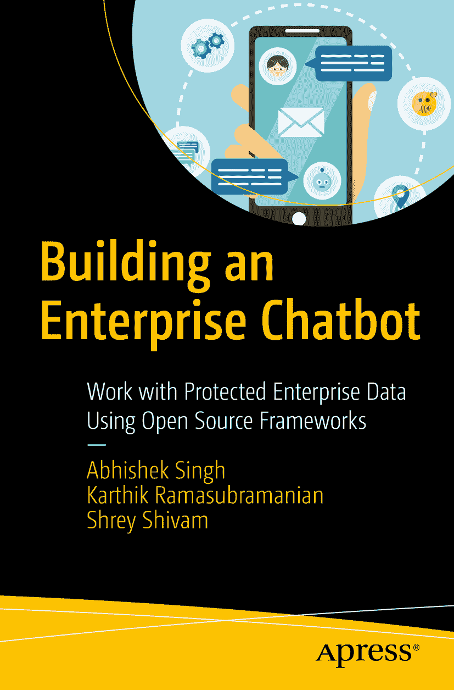

ISBN 978-1-4842-5033-4 e-ISBN 978-1-4842-5034-1 [`doi.org/10.1007/978-1-4842-5034-1`](https://doi.org/10.1007/978-1-4842-5034-1) © Abhishek Singh, Karthik Ramasubramanian, Shrey Shivam 2019 Apress 标准 本书中可能出现商标名称、标识和图像。我们并非在每次出现商标名称、标识或图像时都使用商标符号，而是仅以编辑方式使用这些名称、标识和图像，以维护商标所有者的利益，且无意侵犯商标权。本出版物中使用的商品名称、商标、服务标志及类似术语，即使未明确标识，也不应被视为对其是否受专有权利保护的立场表达。尽管本书中的建议和信息在出版时被认为是真实准确的，但作者、编辑及出版商均不对可能存在的任何错误或遗漏承担法律责任。出版商对本书所含内容不作任何明示或暗示的担保。本书通过 Springer Science+Business Media New York 在全球图书贸易中发行，地址：233 Spring Street, 6th Floor, New York, NY 10013。电话：1-800-SPRINGER，传真：(201) 348-4505，电子邮件：orders-ny@springer-sbm.com，或访问 www.springeronline.com。Apress Media, LLC 是一家加利福尼亚有限责任公司，其唯一成员（所有者）为 Springer Science + Business Media Finance Inc (SSBM Finance Inc)。SSBM Finance Inc 是一家特拉华州公司。

*Abhishek 和 Karthik 将本书献给他们的父母，感谢他们坚定不移的支持与爱。*

*Shrey 将本书献给他的祖父母，已故的 Ravindra Narayan Singh 先生和已故的 Ganga Prasad Singh 博士，以纪念他们，他们是他灵感与骄傲的源泉。*

引言

市面上有众多框架和专有现成的聊天机器人产品，但大多数并未清晰规划出组织对数据这一迫切需求的控制权。通常，专有产品会获取组织的私有数据在云端进行训练，并将结果作为模型提供。在本书中，我们将重点关注数据隐私以及对开发过程的控制。你将学习如何完全在内部使用开源的 JAVA 框架和 Python 的 NLP 库来开发聊天机器人。

本书的开篇将帮助你理解银行业中的流程，并深入探讨如何识别从客户查询中挖掘意图的数据源。第二部分重点介绍自然语言处理、理解和生成，这些内容将使用 Python 进行演示。这三个概念是聊天机器人的核心组成部分。在最后一部分，你将着手使用 JAVA 编写的开源框架开发一个名为 IRIS 的聊天机器人。

以下是本书提供的关键主题：

*   识别行业中可应用聊天机器人的业务流程，并恰当地指导解决方案架构的设计
*   专注于为一个行业和一个用例构建聊天机器人，而不是构建一个通用型的聊天机器人
*   自然语言理解、处理与生成
*   学习如何使用 RASA 和 Botpress 等开源技术栈部署一个完全内部构建的聊天机器人（此类聊天机器人避免与任何第三方工具共享任何个人身份信息）
*   通过定制现有的开源聊天机器人框架，从头开始开发一个名为 IRIS 的聊天机器人
*   使用 API 将聊天机器人与内部数据源集成
*   通过表征学习实现部署和持续改进框架

我们希望你喜欢这段旅程。

致谢

我们感谢各位大学老师在我们职业生涯中持续给予的支持。

Abhishek Singh 感谢他在 Probyto 的同事们，他们激励他撰写有影响力的内容，以更好地将人工智能用于公共用途；本书的想法源于与同事的讨论以及他在欧盟市场的工作。特别感谢他的父母 Charan Singh 先生和 Jayawati 女士，他们就如何思考人工智能在人类中的普遍应用提供了深刻的见解。他们对于使用人工智能生成数据来设计简单解决方案的支持和要求，激励着他日常的数据产品设计。

Karthik 无比感激他的父母 S Ramasubramanian 先生和 Kanchana 女士，感谢他们在他一生中以及本书撰写期间坚定不移的支持。本书的完成得益于数百名研究人员，他们将自己的毕生研究成果作为开源项目分享。他感谢所有让这个世界变得更美好并热情地与大家分享其工作的研究人员。最后，他工作与成功的很大一部分来自于他的导师和同事，他在工作中不断学习和进步。

Shrey 非常感谢他的父母 Vijay Pratap Singh 先生和 Bharti Singh 女士，感谢他们的爱、关怀和牺牲，帮助他实现梦想。他向他的叔叔 Tarun Singh 先生表达感激之情，他一直是力量的支柱。Shrey 还感谢他过去和现在的同事，包括 Dipesh Singh 和 Jaspinder Singh Virdee，感谢他们不断鼓励和支持他将具有挑战性和创新性的想法付诸实践。

最后，没有 Apress 团队的支持，本书不可能完成：Aditee、Celestin、Matthew 以及制作支持人员。我们也感谢并致谢我们的技术审校者，他们的批判性评审使本书更加出色。

### 关于作者与关于技术审校者

### 关于作者

### 关于技术审校者

