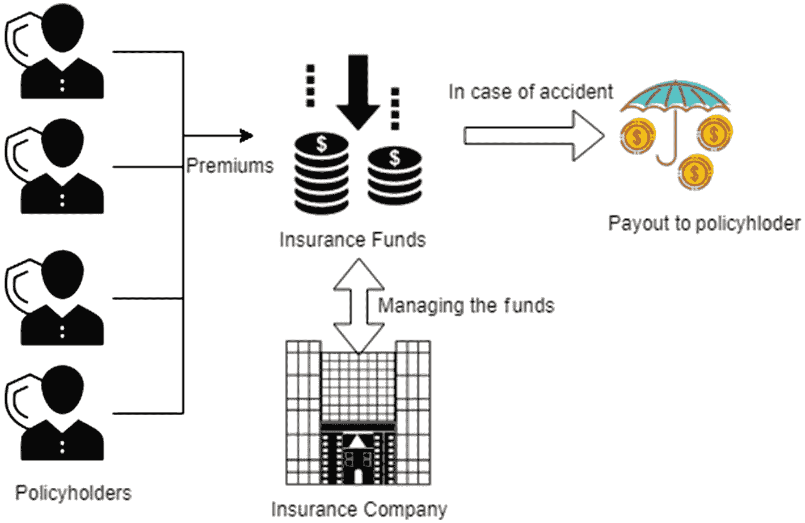
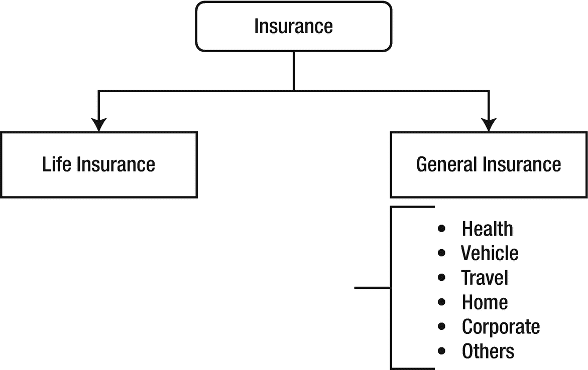
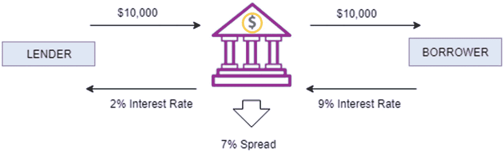
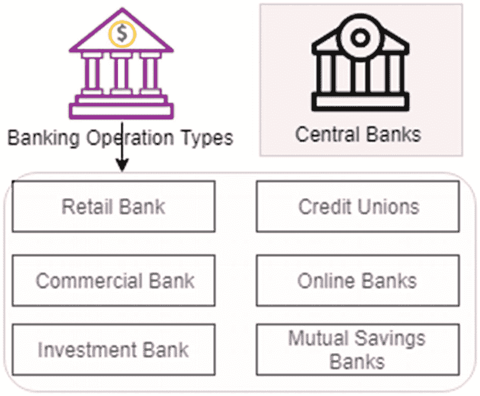
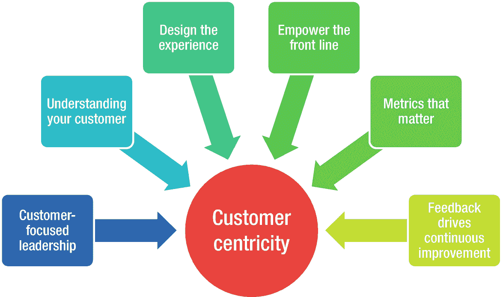
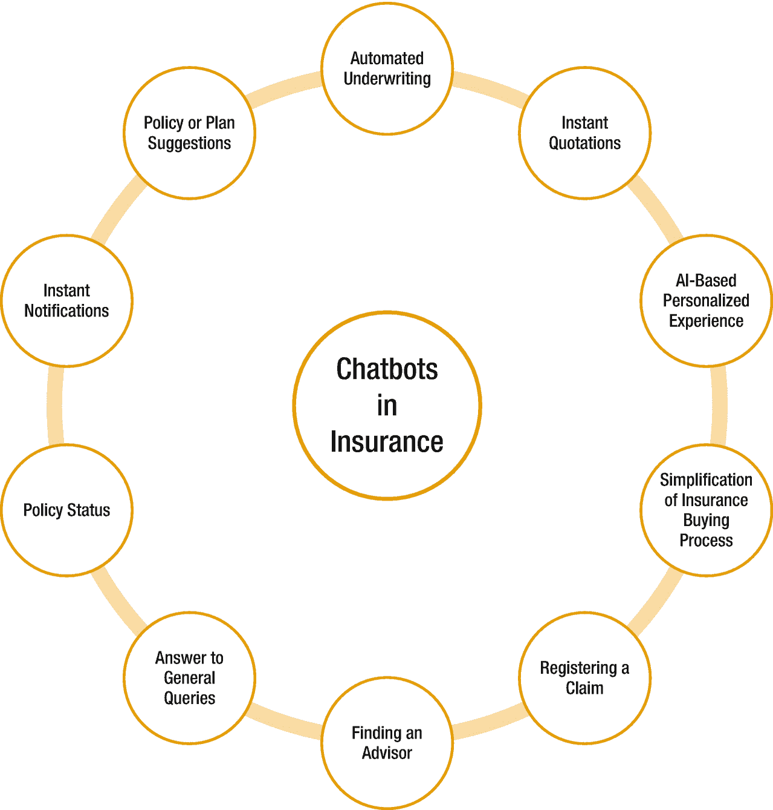
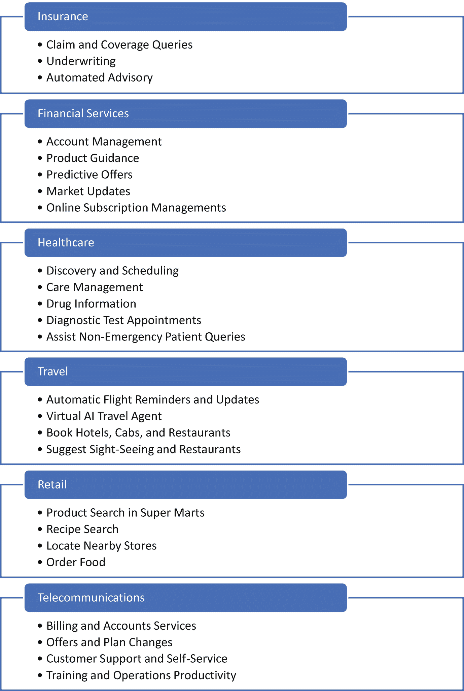

# 1. 银行与保险行业的流程

根据达尔文的《物种起源》，生存下来的不是最聪明的物种，也不是最强壮的物种；生存下来的物种是那个最能适应和调整自身以适应其所处不断变化环境的物种。同样的类比也适用于企业及其在 21 世纪的生存机会。在这个数字时代，企业适应最新趋势和技术进步至关重要。通过本书，我们旨在让你掌握一项新兴技能——在金融服务领域构建聊天机器人，并以保险代理人（同样可复用于银行助理）作为具体用例。

## 银行业与保险业

银行和保险公司历史悠久，为我们的经济活动提供便利。银行业和保险业对一个国家和社会的经济增长起着至关重要的作用。这两类机构都提供商业交易和风险保障等基本服务。

保险服务源于针对不确定性事件进行风险管理的实践。风险被定义为正常过程中结果的不确定性。风险以货币形式量化，并伴随着对过程不利的后果。保险的功能是通过提供一种针对付款的安全网来管理风险。从金融角度来看，保险通过支付保费的方式，将不利事件的风险转移给保险公司。

如图 1-1 所示，保险公司的主要职能是管理由被保险人支付的保费所形成的基金。保险公司的关键职能是衡量来自风险池的损失风险，以决定保费，并在发生事故/不利结果时，向保单持有人支付损失金额。随着人口增加，不利结果的数量减少，可以征收更低的保费，同时向面临不利结果的被保险人支付更高的赔付。

图 1-1

保险的理论框架

保险业由历经数百年演变的金融服务和产品构成。随着技术的发展，保险业见证了大型保险公司数量的激增以及新产品渗透率的加深。集中化经营能为被保险人带来更优惠的保费，并允许公司覆盖更广泛的风险。如图 1-2 所示，保险产品通常可分为两类：人寿保险和一般保险。

图 1-2

保险产品分类

人寿保险为死亡风险提供保障。如果被保险人在保险期间内死亡，指定的受益人将获得保险金额。通过这种方式，该保险产品可以防范因家庭关键成员死亡而造成的经济损失。所覆盖的风险称为死亡风险。精算学是对死亡行为的研究，用于研究人寿保险中针对特定对象公平定价保费的问题。

保险并不仅限于防范死亡风险。保险的概念也已扩展到其他形式的风险。另一类保障被称为一般保险；这包括覆盖健康不佳财务风险的医疗保险、针对事故的车辆保险、针对航班延误的旅行保险等等。成熟的保险公司根据客户和机构的需求提供多种产品。其中一些产品具有标准特征，而另一些保险公司则可以根据客户需求创建定制方案，例如为重大活动期间的恶劣天气风险提供保障。优秀保险公司与糟糕保险公司之间的关键区别在于，其衡量基础事件所涉风险的勤勉程度和准确程度。

另一方面，银行服务并不覆盖不确定的风险，但它们从事金融性质的经济活动。银行业也已演变成多种类型，为不同的商业实体服务。然而，银行的基本前提仍然是作为贷款人和借款人之间的中介。贷款利率和存款利率之间的差额也称为利差，银行通过管理利差在金融体系中创造经济活动。

图 1-3 描绘了银行或银行公司的基本框架。

图 1-3

银行的理论框架

贷款人拥有资本，例如拥有多余现金的机构成员或有一些储蓄的小型零售客户。借款人缺乏资本，但他们有一些能够带来投资回报的经济活动。银行介入以解决金融体系中的这一缺口，为贷款人创造赚取存款利息的机会，并让借款人能够以一定的利率获得所需资本。在图 1-3 的示例中，贷款人将 10,000 美元存入银行并获得 2% 的利息（即 200 美元），而银行以 9% 的利率将 10,000 美元贷给借款人（即在此交易中获得 900 美元）。7% 的利差（即 900-200=700）是银行的收入，银行可以用它来运营业务和创造新产品。

与保险业类似，银行业也已发展出为不同类型的客户和实体提供各种服务的能力。图 1-4 是银行类型的基本分类。这并不是银行类型和银行服务的详尽列表，但它们是主要的银行类型。

图 1-4

常见的银行类型

在本节的范围内，我们将指出终端客户获取金融服务的典型流程。零售银行和人寿保险公司的客户是相同的，除了少数情况。这使得说明保险公司与客户的接触点如何与银行客户的接触点相似变得更加容易。一旦我们确立了这些接触点的通用性质，我们将继续进行聊天机器人的构建过程。

在零售银行业务中，终端客户（通常是一个实体或个人）将储蓄存入银行，而其他实体或个人则将这些资金借出用于其他目的。除此之外，银行还为零售客户提供在线交易、支付账单、向其他实体转账、定期存款以及许多其他服务。

## 金融服务中的以客户为中心的方法

过去二十年间，客户行为与互动方式已演变为个性化模式。竞争加剧以及对技术交付服务的更高依赖，是推动这一客户行为变化的关键因素。如今，产品与服务中贯彻以客户为中心的方法，其重要性远超以往。这种方法通过多种渠道（见图 1-5）实施直接与间接的干预措施。

图 1-5  
金融服务中的客户中心性

客户中心性的核心要素是聚焦客户的领导力。如果领导层将战略调整为打造以客户为中心的组织，那么整体视野与沟通方式都将变得以客户为中心。亚马逊已证明了这一点，如今被视为以客户为中心方法的标杆。理解客户并设计实验来验证假设，是以客户为中心方法的后续步骤。一旦与客户成功建立联系，我们需要赋能一线团队、追踪关键指标并保持反馈循环。这些是实现以客户为中心方法的部分指导性步骤。

在金融服务领域（主要指零售产品/服务），互动触点众多，所有接触点对于保持客户聚焦都至关重要。银行和保险公司每天通过多种渠道与大量个人客户打交道。

数字化干预正在重新定义客户互动的方式。在客户获取银行和保险服务的过程中，存在一些关键趋势。

*   **更自然的互动**：用户体验至关重要。客户希望更便捷地获取产品、获得吸引人的体验，并能通过几次点击轻松完成操作。

*   **更多触点与灵活性**：客户不希望只能在固定时间（如上午 9 点到下午 5 点）前往网点，或周末无法办理业务。他们希望随时通过多种渠道访问和购买产品。无论是移动应用、网页应用还是电话银行，他们都希望在互动方式上拥有更多灵活性。

*   **响应式服务**：客户期望银行/保险公司了解他们，并能响应其需求。他们希望获得个性化关注，并欣赏及时响应的客户服务。

*   **清晰的产品信息**：面对众多参与者和产品，客户希望获得简洁且相关的信息。其他细节可通过后续跟进获取。客户不希望被大量信息淹没或感到困惑。

*   **产品带来的巨大价值**：产品功能繁多，很多时候客户并不清楚如何充分利用它们。客户期望银行/保险公司不断提醒他们如何从产品中获取最大价值，并在可能的情况下提供可能有用的新产品。

金融机构日益增长的数字化存在也要求技术格局进行多重变革。传统的数据库系统和应用正逐渐过时。强大的终端计算设备（如智能手机）、卓越的互联网连接（如 4G/5G）以及云平台，构成了金融领域数字革命的“神奇三位一体”。

在本书中，我们将探讨聊天机器人在与客户的多种终端互动中的演变与运作。虽然对话代理已存在很长时间（还记得 IVRS 系统吗？），但新技术的发展使其由自然语言驱动，能够提供以客户为中心的信息传递。聊天机器人旨在执行特定且结构化的互动；而复杂的服务互动仍由经验丰富的客户服务代表处理更为合适。在接下来的章节中，我们将涵盖为保险代理人构建聊天机器人的不同方面。

## 聊天机器人为企业带来的益处

根据 Grand View Research 2018 年的报告^(¹)，全球聊天机器人市场预计到 2025 年将达到 12.5 亿美元，复合年增长率为 24.3%（平均年增长率）。聊天机器人市场将在金融服务领域显著增长，因为该领域是最大的面向客户的企业之一（在我们的语境中，即保险业务）。为机构创造的直接价值在于大幅降低运营成本并提升客户满意度。

从技术角度讲，聊天机器人是技术、人工智能（AI）和业务流程设计的结合。

*   技术提供了聊天机器人与客户之间、以及聊天机器人与内部系统之间交换信息的载体，通过手机或网络实时传递信息。

*   AI 构建了聊天机器人的核心大脑，它能够理解从机器指令中解码出的自然语言，并在对话过程中做出决策。

*   最关键的部分是业务流程设计，它识别出访问信息的标准流程、哪些信息可以与谁共享，以及购买/销售/查询现有产品的便捷方式。

虽然聊天机器人在降低客户服务成本以及作为销售产品和服务的新收入渠道方面，为公司带来了巨大的货币价值，但它们也为客户体验增添了巨大价值。

*   **全天候可用性**：聊天机器人通过手机或网络提供 7x24 小时服务。这为客户提供了选择何时与服务互动的灵活性。

*   **零人工接触体验**：聊天机器人允许客户在满足基本需求时获得零人工接触的体验。这种无需通过人工途径即可获取必要信息的方式是全新的。

*   **简洁性**：聊天机器人通过将流程分解为清晰的步骤，简化了客户的操作。根据客户的查询，聊天机器人传递的信息也非常简洁且切中要点。

日新月异的聊天机器人市场不断涌现颠覆性创意，并在各个领域创造价值。

## 保险业中的聊天机器人

等待下一个空闲客服代表或费力获取信息的时代已经一去不复返了。以客户为中心的方法是当今企业关键的差异化因素之一。聊天机器人正在帮助提升客户参与度和品牌影响力，并且已被证明在包括保险业在内的大多数行业中非常有用。移动和社交媒体的出现不仅为人们提供了新的沟通渠道，也让人们感觉与企业更加亲近。公司正在大力投资，以建立和维护强大的数字化形象，并实施新的解决方案，以便更好地触达客户。

传统上，保险业变革缓慢。由于保险的复杂性，涵盖了各种各样的风险，其运营模式一直很繁琐，涉及大量文书工作、背景调查和审批。随着数字商业新时代的到来和竞争的加剧，保险业也在满足这个永远在线、永远互联的数字世界的需求。

保险公司呼叫中心接到的电话中，大约有 70%是无需人工介入即可处理的咨询，例如客户询问理赔状态、保单续保或财务顾问信息等细节。根据 World Wide Call Centers 的数据^(²)，在共享呼叫中心，国际低成本机构的呼入电话费率约为每分钟 0.35-0.45 美元，美国/加拿大为每分钟 0.75-0.90 美元；国际长途费用为 8-15 美元，美国/加拿大为 22-28 美元。一家典型的大型保险公司每年会接到超过 1000 万个电话。假设每个电话的成本为 5 美元，即使聊天机器人能处理其中一半的咨询，每年也能节省高达 2500 万美元。

人工客服一次只能处理两到三个对话，而聊天机器人可以不受此类限制地运行，并减少处理此类咨询所需的人力资源。它还可以自动化重复性工作。这些呼叫中心的电话在被分配给客服代表之前，平均等待时间为 3 分钟，而浏览网站的客户通常需要花费 5 到 10 分钟来查找所需信息。像聊天机器人这样的虚拟代理可以实时提供这些信息，这是利用技术使交互更快、更高效的重要应用。这些服务可以通过多种数字交互平台（如移动应用、Facebook Messenger、Twitter、短信、Skype、Alexa 和网页 UI 聊天）全天候访问，为客户提供全渠道支持。

图 1-6 展示了聊天机器人正在改变保险业的方式。

图 1-6

保险业中的聊天机器人

人寿保险行业中聊天机器人一些最常见的应用体现在以下几个方面。

### 自动化核保

利用网络上丰富的个人可用信息，机器学习技术被用于准确评估个人的风险指数。公司正在使用虚拟数字代理（聊天机器人）来提供一种简化的人寿保险购买方式，并能即时获得决策。

### 即时报价

客户可以在自己选择的平台上即时获取保险资格和报价详情。

### 基于 AI 的个性化体验

由于聊天机器人旨在模拟人类交互，它们可以利用人工智能来理解上下文和用户需求，从而提供更好的客户满意度体验。

### 简化保险购买流程

由于表格冗长且难以理解，公众普遍对保险相关的文书工作感到反感。聊天机器人可以用对话式的语言向客户提出简单问题，并利用答案自动填写在线表单中的某些字段，从而加快申请流程。

### 登记理赔

由于聊天机器人是虚拟代理，它们可以全天候提供服务。因此，无论事故发生在何时，它们都能帮助客户处理理赔流程。理赔结案时间是衡量保险业务效率的关键指标，而聊天机器人在缩短整体结案时间方面发挥着重要作用。

### 寻找顾问

一些公司使用保险代理人或顾问。聊天机器人基于自然语言的交互模式，使客户能够方便地根据地点或保险类型快速查询保险代理人或财务顾问。

### 回答一般性咨询

多达 30%的呼叫中心咨询是一般性问题，询问保单现金价值、保单保费到期日、利率、常见问题解答、公司和产品信息、账户相关问题（如密码重置、更新受益人）以及申请流程的细节。这些问题可以通过聊天机器人以客户为中心的方式实时解决。

### 保单状态

客户可以随时随地通过与聊天机器人交互来检查保单状态、理赔状态或其他投诉或请求的状态。

### 即时通知

聊天机器人可以提醒客户保单保费到期日、下一个计费周期等信息。

### 新保单或计划建议

聊天机器人不仅扮演服务代理的角色，还提供了新的营销机会。可以根据用户在 Facebook 等数字平台上的交互和社交媒体行为，量身定制符合其需求的内容、产品或服务建议。

## 对话式聊天机器人概览

在这个互联网时代，每当人们需要某项服务或信息时，都必须找到合适的网站。而在移动时代，原生应用占据了中心地位，其目的与网站相同。如今，每家企业至少拥有一个网站和一个移动应用。现在，在人工智能时代，客户被网站和移动应用上的信息淹没，而能够帮助众多寻求服务或信息的客户的员工却不多。此外，即使公司能找到大量员工，成本也极其高昂。对话机器人或聊天机器人正通过以可承受的成本解决信息过载这一关键问题，在人工智能时代发挥着关键作用。

组织正在经历数字化转型之旅，聊天机器人已成为路线图中的讨论议题。其主要目标是通过简化的接触点和更快的服务时间来改善客户体验。这一目标通常能带来新产品和服务的更高转化率，并降低运营成本。

机器人框架（技术）的迅猛发展以及自然语言理解（人工智能）的进步，促使聊天机器人在众多行业中得到应用。公司正在其客户的整个生命周期内构建聊天机器人，即：

*   获取
*   互动
*   服务
*   反馈

获取和互动有助于公司建立强大的业务收入来源，而服务则有助于降低成本，反馈则能提高客户留存率。

图 1-7 展示了整个行业对聊天机器人的应用情况以及各种用例。

图 1-7

对话式聊天机器人概览

在收益方面，保险公司现在处理索赔的速度提高了 24%^(³)，电信公司的客服电话量减少了高达 90%^(⁴)，其中 75% 的减少归功于自助服务指南和自动提示，另外 15% 的电话减少得益于人工智能代理的帮助。这使得只有 10% 的电话需要昂贵的人工话务员处理。通过回答服务中心多达 80% 的常规问题，客户服务成本降低了 30%^(⁵)，而像 Autodesk 这样的公司，其一级查询的响应时间改善了 99%^(⁶)。随着应用的增加和技术的改进，这些收益还在持续增长。

在接下来的章节中，我们将深入探讨 NLU 的细节以及构建一个功能完善的企业级聊天机器人的各种技术。在下一章中，我们将讨论如何识别客户交互点、数据收集策略、遵守隐私法的重要性，以及理解与客户每次交互的数据流。

## 总结

本章重点介绍了银行业和保险业中聊天机器人正在带来新一轮创新的流程。那些过去被认为只有人类才能完成的任务现在正在实现自动化。这种创新降低了成本，并有助于实现规模化。我们还讨论了聊天机器人在其他各个行业（包括医疗和旅游）中的应用。文中引用了各种行业报告来证明在行业中使用人工智能驱动的聊天机器人的益处。在接下来的章节中，我们将从零开始构建一个对话式聊天机器人，并重点关注银行业和保险业。

脚注 1   2   3   4   5   6

