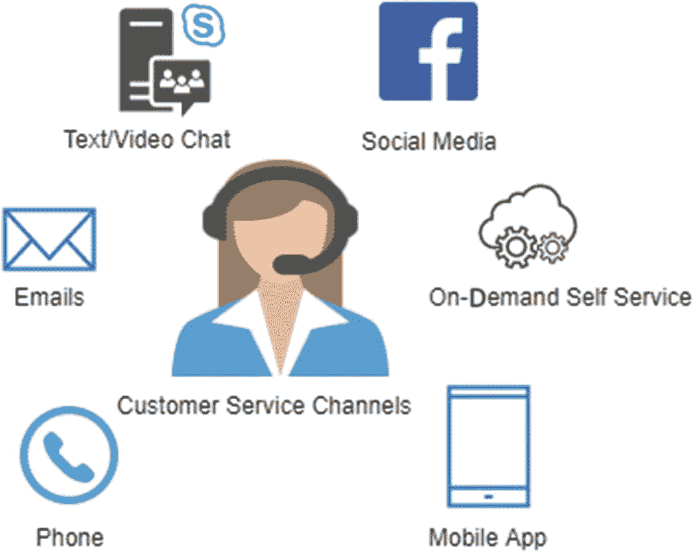

# 2. 识别数据来源

聊天机器人是为客户提供对话流程的又一个渠道。在上一章中，我们讨论了银行业和保险业的结构，以及这些行业中与客户发生的交互类型。银行或保险公司在日常运营中为客户提供多种类型的接触点，从销售新保单到处理索赔升级。所有这些接触点都是构建人工智能助手（即聊天机器人）的数据来源。在本章中，我们将首先介绍聊天机器人的类型和用于训练聊天机器人的数据来源，然后我们将介绍在聊天机器人处理个人数据的背景下，通用数据保护条例（GDPR）。

## 聊天机器人对话

聊天机器人试图模仿真实人类的对话。在与企业互动的背景下，对话可以是广泛、通用的主题，也可以是特定于产品或服务的主题。根据对话的范围，我们可以将对话分为两种类型：通用对话和特定对话。对话类型决定了聊天机器人或人工助手为了与客户互动所需掌握的问题范围和知识。

### 通用对话

通用对话是指客户和助手不局限于特定主题或问题的典型对话。对话可以从任何点开始，并根据助手的知识水平向任何方向发展。

此类对话的一个例子是：

*   一位用户走进银行，想和经理谈谈。在对话开始前，我们不知道这个人是谁，也不知道他为何拜访经理。对话内容可能涉及赞助活动、贷款账户、公用事业缴费或其他事宜。

为了处理此类对话，聊天机器人需要构建多种类型的上下文和适当的回复。此类通用对话的回复本质上也不是启发式的；它们涉及人类的自然智能以及聊天机器人无法获取的信息/经验来构建对话。

人工智能领域正在取得许多进展；我们试图通过使用海量数据集和场景进行训练来模仿完整的人类行为。然而，在拥有完全基于通用对话的聊天机器人用于工业用例方面，我们仍然相距甚远。

### 特定对话

特定对话局限于一些预先设计好的结果。这类对话对谈话范围有更高的清晰度，并有明确的指令用于回退或交叉引用到其他来源。任何偏离设定对话的情况通常都会被引导至预定义的结果。所有其他情况则被重定向到适当的渠道，或者对话结束。

此类对话的一个例子是：

*   一位顾客走进商店，来到退款柜台。在这种情况下，退款柜台有一些处理退款的具体条件，可能还有一些其他特定功能。顾客不能期望在退款柜台得到除退款以外的任何其他服务。如果顾客询问有关折扣的问题，退款柜台会将其引导至另一个柜台。

特定对话更具可预测性，并且可以以更高的准确度进行处理。为特定任务设计的聊天机器人可以利用信息进行交流。这些对话以结果为导向，一旦达成结果，对话即告结束。

## 训练聊天机器人进行对话

聊天机器人需要学习如何进行对话。训练聊天机器人涉及让它们接触规则和自然对话。对于通用对话聊天机器人，所需的训练数据量非常庞大，迄今为止，我们尚未成功创建出精准的通用对话聊天机器人。Alexa、Siri 和 Google Home 是这方面的几个例子。

创建聊天机器人还需要一套成文或默认的规则来推进对话。例如，如果聊天机器人询问客户的姓名，它必须预期得到名和姓。如果没有获取到姓，它必须返回去确认姓名。这对于确保对话针对正确的客户至关重要。

要训练聊天机器人进行对话，我们需要有一个训练数据语料库。根据不同的用例，可以从多个来源获取训练数据。在接下来的章节中，我们将讨论一些用于训练聊天机器人的数据集。

### 自生成数据

聊天机器人开发者需要从一些数据开始，让聊天机器人“活”起来。通常，这些数据是由开发者自己为某些必要的流程生成的。通过这种方式，他们可以定义一些自己设定的高级流程，从而能够基于假设继续开发聊天机器人。

在许多情况下，开发者会创建多个输入并自行标注，用于训练基本流程；这些由开发者生成用于测试流程的数据，并非完整的训练集。这些输入帮助开发者让聊天机器人准备好进行测试版发布，并从真实用户那里收集数据。自生成数据仅仅是启动开发的一种方式，并非用于公开发布。

开发者生成的数据用于建立数据管道和系统集成测试。一旦测试版部署完毕，内部用户就可以接触聊天机器人，从而收集更多数据来持续训练自然语言模块。

### 注意

不要将自生成数据与自然语言生成（NLG）模型混淆。您将在第 5 章中了解更多关于从小数据集进行自然语言生成的内容。

### 客户互动

客户互动是训练聊天机器人的最佳来源。这些对话最适合模仿，主要有两个原因：

*   可以捕获典型查询，并优先针对特定对话进行聊天机器人训练。
*   这些对话捕获了经验丰富的客户代表过去提供的真实解决方案。

客户互动通过多种渠道进行，这些渠道为训练聊天机器人作为客户互动的新渠道提供了数据。图 2-1 展示了任何现代企业的六种主要客户互动渠道类型，也适用于我们讨论的保险和银行案例。

图 2-1

客户互动/服务渠道

#### 电话

电话由经验丰富的呼叫中心代表接听，通常在客户需要立即解决其问题时使用。在现代，这种方式被推荐作为最后一步，因为公司维护成本高昂。

从呼叫中心，我们可以获得通话记录、通话录音、核心问题及其解决方案。通话中识别的核心问题及其解决方案可以帮助我们的聊天机器人学习识别问题并提供解决方案。

#### 电子邮件

电子邮件对话通常很详细，包含事件的时间顺序说明以及客户需求的清晰陈述。这些电子邮件是捕获需要多维数据才能解决的问题的良好来源。

客户电子邮件记录可以以纯文本格式访问，包含原始邮件和后续对话的回复记录。

#### 在线聊天

许多金融机构使用在线网页聊天与客户服务代表沟通，以确保他们能够同时服务多个客户，并减少呼叫中心来电的流失率。

这个数据集非常接近聊天机器人需要模仿的对话。过去的聊天记录可以作为纯文本文件访问。

#### 社交媒体

当社交媒体公司允许在其平台上创建企业账户时，社交媒体变得流行起来。社交媒体的互动往往比较泛化，难以追踪到普通大众中的实际客户。

一些平台允许企业账户下载其数据，而另一些平台则允许通过 API 端点提取数据。

#### 客户自助服务

一些必要的故障排除流程被创建为客户自助服务门户。它们可能像更改 PIN 码一样简单，或者提供常见问题解答以获取更多信息。成功的自助服务案例有助于创建流程来训练聊天机器人，以帮助那些忽略或无法使用自助服务的人。

这些数据通常结构化为一个对话树，通向特定问题的解决方案。

#### 移动端

这里的移动端指的是通过移动应用程序和客户移动浏览历史发生的互动。从这些移动应用程序捕获的数据被记录为客户的活动日志。

### 客户服务专家

客户服务专家在识别典型客户查询以及他们在真实场景中如何处理这些查询方面发挥着重要作用。他们的输入也有助于创建默认回复和设计故障转移选项。多年处理客户的经验可用于训练以及测试初始版本的聊天机器人。

专家需要参与聊天机器人的开发过程，以评估聊天机器人的体验和准确性。

### 开源数据

当您想要创建通用对话聊天机器人，并希望为特定话题加入一些通用风格时，开源数据至关重要。有大量的数据源可用于训练自然语言对话的聊天机器人。

下面列出了一些开源数据源；您可以根据需要获取更多数据集。

*   Yahoo 语言数据，来源于 Yahoo Answers ( [`www.cs.cmu.edu/~ark/QA-data/`](http://www.cs.cmu.edu/%257Eark/QA-data/) )
*   WikiQA 语料库，来源于重定向到包含解决方案的维基页面的必应查询 ( [`http://research.microsoft.com/apps/mobile/download.aspx?p=4495da01-db8c-4041-a7f6-7984a4f6a905`](http://research.microsoft.com/apps/mobile/download.aspx%253Fp%253D4495da01-db8c-4041-a7f6-7984a4f6a905) )
*   Ubuntu 对话语料库，来源于 Ubuntu 技术支持 ( [`www.kaggle.com/rtatman/ubuntu-dialogue-corpus`](http://www.kaggle.com/rtatman/ubuntu-dialogue%25c2%25adcorpus) )
*   Kaggle 上的 Twitter 数据，来源于 Twitter 客户支持 ( [`www.kaggle.com/thoughtvector/customer-support-on-twitter`](http://www.kaggle.com/thoughtvector/customer-support-on-twitter) )

### 众包

最关键的训练数据来自于**真实用户**与您的聊天机器人进行实时互动。这不仅有助于构建训练语料库，还能帮助开发者发现聊天机器人失败的盲区。

在最佳实践中，所有以测试版发布的聊天机器人都会向选定的客户和内部员工开放，进行真实对话。系统会收集数据，并针对每个真实案例重新训练 NLP 模型。众包的另一个成果是制定聊天机器人的指导方针和范围。

客户服务专家也利用众包输入来构建不同对话的回复语言和强度。

如果您正在用某种区域语言构建聊天机器人，您需要依赖训练数据的众包。一些公司可以为您提供接触人群的途径，这些人会与您的聊天机器人互动，以构建训练语料库。

## 聊天机器人中的个人数据

当我们试图用聊天机器人模拟类人对话时，我们允许人类向聊天机器人机器透露关于他们自己的信息。这些信息随后会面临未经授权访问的风险，并可能违反隐私法律和条款。当处理将客户连接到内部数据库、并需要特定客户信息来处理请求的客户查询时，这一关切至关重要。

客户可能有意或无意地透露个人数据：

*   **有意透露**：要获取账户余额，你需要提供账号和 PIN 码。

*   **无意透露**：为了了解理赔流程，你最终可能会透露你的保单号。

在这两种情况下，数据都会被聊天机器人捕获，并且聊天机器人引擎会尝试处理这些数据。即使聊天机器人无法处理这些数据，它仍然会创建一份包含客户私密和个人数据的对话副本。

我们将个人数据暴露给聊天机器人的另一个领域是在训练聊天机器人时。客户的内部数据可能包含个人、财务和人口统计信息，而开发者并不完全知情。例如，关于理赔结算的电子邮件对话包含的细节远不止与客户无关的结算流程。

在部署和训练过程中，个人数据被捕获，容易面临违法和黑客攻击的风险，但这些数据对于开发以客户为中心的聊天机器人至关重要。如果我们不捕获数据，我们将无法设计出一个能够从内部数据库中执行操作并提供信息的聊天机器人。

为了开发一个能够安全且私密地访问客户数据并提供实时信息的聊天机器人，我们需要比普通对话更多的信息。这些个人信息有助于开发：

*   身份验证和访问权限
*   对公司政策的合规性
*   客户信息检索系统
*   第三方 API 检索系统

还有其他相关服务和数据库需要个人信息，才能允许访问私有数据区域中的客户信息。

正如我们刚才解释的，我们需要客户的个人数据和其他私有数据，才能使全天候的 AI 助手利用相关数据运行。这要求我们非常确定客户协议以及本地/国际数据法规。对于银行和保险公司来说，遵守法规对于构建特定的对话聊天机器人至关重要。

这对公司来说是一个挑战，因为它限制了公司使用像 Alexa、Dialogflow 和 Watson 这样成熟的第三方聊天机器人服务。这些服务要求将数据发送到它们的服务器并存储起来用于聊天机器人对话。这些限制造成了一个空白，需要由能够开发公司内部最先进聊天机器人的框架来填补。

了解数据隐私法规在处理客户数据时对公司有何要求至关重要。《通用数据保护条例》（GDPR）是欧盟地区的主要法规，也与世界其他地区相关。在下一节中，我们将对其要求进行一个高层次的概述，这些要求在开发聊天机器人时必须考虑。

## 《通用数据保护条例》（GDPR）简介

GDPR 是 1995 年《数据保护指令》的继承者，它本身是一项条例，而非指令。指令需要由成员国通过立法转化为国内法，而 GDPR 条例则作为法律在所有成员国同时立即生效。它是一项关于欧盟公民数据保护的条例。它也适用于将个人数据传输到欧盟以外的地区。GDPR 赋予用户对其个人信息的控制权，以及他们是否希望共享或保持其数据私密。

它被所有欧盟国家采纳，并于 2018 年 5 月 25 日生效。该条例对不合规的组织处以巨额罚款（最高可达年收入的 4%或 2000 万欧元，以较高者为准）。

### GDPR 保护的数据

GDPR 对数据的定义非常广泛，涵盖了公司生成和捕获的多种数据。根据 GDPR，受保护的数据包括：

*必要的身份信息（姓名和姓氏；出生日期；电话号码；家庭住址；电子邮件地址；身份证号码和社会安全号码等）；网络数据（位置、IP 地址、Cookie 数据）；健康和基因数据；生物识别数据（识别个人的数据）；种族和民族血统；宗教信仰；政治观点。*

这包括聊天机器人在对话过程中处理的数据。

### 数据保护相关方

根据该条例，任何收集和处理欧盟公民个人信息或存储欧盟居民个人数据的公司，无论其是否在欧盟境内，都必须遵守 GDPR。这一范围意味着大多数全球企业都需要符合 GDPR 要求。

该条例定义了 GDPR 的三个相关方：

*   **数据主体**：其数据正被控制者或处理者处理的个人。
*   **数据控制者**：决定从用户处收集和处理个人数据的目的和条件的个人或公司。
*   **数据处理者**：为数据控制者处理个人数据的个人或公司。

相关方的定义直接影响我们如何设计聊天机器人，以及如何确保与聊天机器人互动的客户的权利。例如，与聊天机器人互动的客户是数据主体，而银行、保险公司或公司则成为数据控制者。CRM 或数据库系统的授权人员也成为数据控制者。如果你的聊天机器人使用 Dialogflow 处理数据，那么它就成为了数据处理者。

法律细节可在此处阅读原文：[`https://eur-lex.europa.eu/eli/reg/2016/679/oj`](https://eur-lex.europa.eu/eli/reg/2016/679/oj)。

### GDPR 下的客户权利

聊天机器人开发团队和领导层必须了解 GDPR 为客户赋予了哪些权利。聊天机器人的功能必须遵守这些权利。

GDPR 下的权利如下所示，供您参考：

| # | 权利 | 数据控制者责任 |
| --- | --- | --- |
| 1 | **知情权** | 对你收集和处理个人信息的数量、目的保持透明。告知客户他们的权利以及如何行使这些权利。 |
| 2 | **访问权** | 你的客户有权访问他们的数据。你需要通过业务流程或技术流程来实现这一点。 |
| 3 | **更正权** | 你的客户有权更正他们认为不准确的信息。 |
| 4 | **删除权（被遗忘权）** | 你必须为客户提供被遗忘的权利，前提是你持有此类信息的合法利益不凌驾于他们的权利之上。 |
| 5 | **限制处理权** | 你的客户有权要求你停止处理他们的数据。 |
| 6 | **数据可携权** | 你需要支持以机器和人类可读的格式导出客户的个人信息。 |
| 7 | **反对权** | 你的客户有权反对你使用他们的数据。 |
| 8 | **关于自动化决策的权利** | 你的客户有权不受仅基于自动化处理（包括用户画像）所作出的决定的约束。 |

### 聊天机器人对 GDPR 的合规性

在上述章节中，我们讨论了聊天机器人已不再是单纯的商业沟通工具；其开发者必须以数据控制和处理的方式来考量它们。这就要求聊天机器人必须接受 GDPR 的严格审查。

以下是聊天机器人开发者为了满足 GDPR 合规性所需采取的一些通用且最低限度的步骤。此列表并不全面，仅作为内部评估的参考清单。在将聊天机器人公开发布供大众使用之前，请务必对其进行全面审计。

*   聊天机器人在开始对话前，必须明确说明对话中将收集哪些数据，并且必须能够访问正在收集的数据。

*   必须允许聊天机器人用户访问、查看、下载和删除聊天机器人收集的数据。

*   聊天机器人日志必须安全存储，并可供用户访问。此外，在处理日志以训练聊天机器人之前，必须获得用户的明确许可。

*   提供明确陈述的隐私政策以及数据保护官的联系方式，以便处理任何疑虑。

*   提供与真人客服而非机器聊天机器人对话的选项。

这些项目是聊天机器人所有者需要采取的步骤的指示性清单。全面审计可能会反映出更多需要确保聊天机器人完全合规的领域。

## 总结

在本章中，我们将对话分为通用领域和特定领域。开发通用型聊天机器人需要海量数据，而特定对话型聊天机器人则只需要包含这些对话的语料库。我们介绍了从开发者对功能的理解中获取的不同数据源、从所有渠道的客户互动中生成的数据，并讨论了开放数据的重要性。还讨论了通用型聊天机器人的数据众包。我们通过示例讨论了个人数据的重要性和挑战，并解释了它们对聊天机器人设计的影响。聊天机器人实现中最关键的部分是当聊天机器人处理个人数据时，法规所带来的影响。我们介绍了《通用数据保护条例》（GDPR），该条例不仅保护欧盟境内，也保护欧盟境外欧盟公民的数据。我们提供了一份简短的客户权利清单，以及一些使聊天机器人符合 GDPR 要求的标准步骤。在下一章中，我们将讨论如何设计聊天机器人，并为全天候保险助手创建对话流程。

