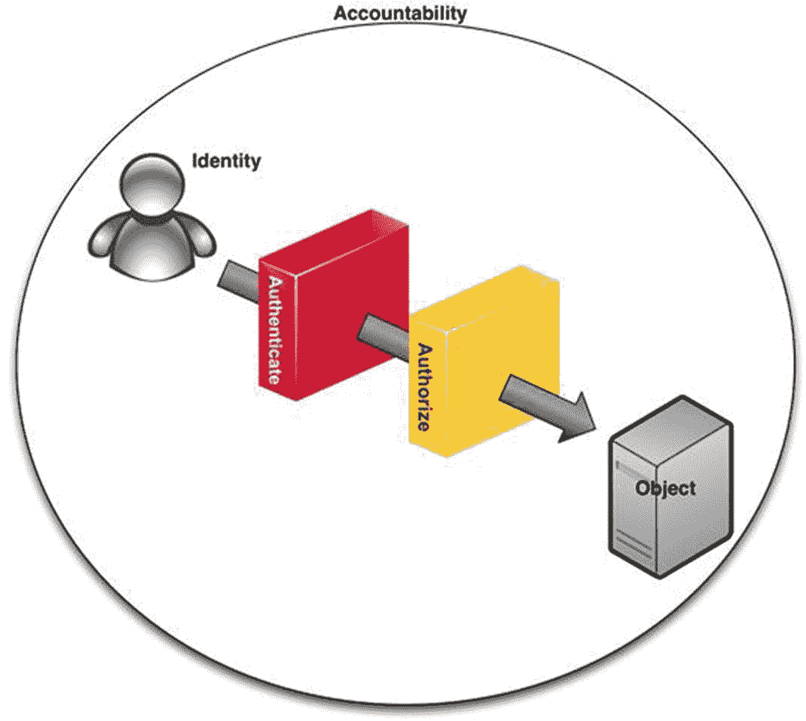
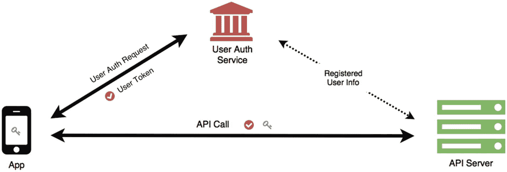
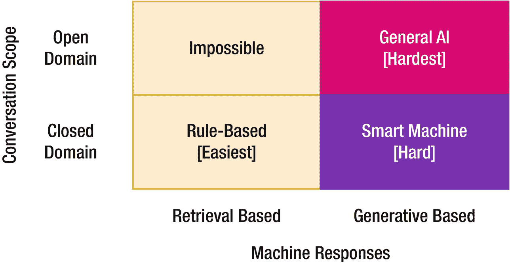
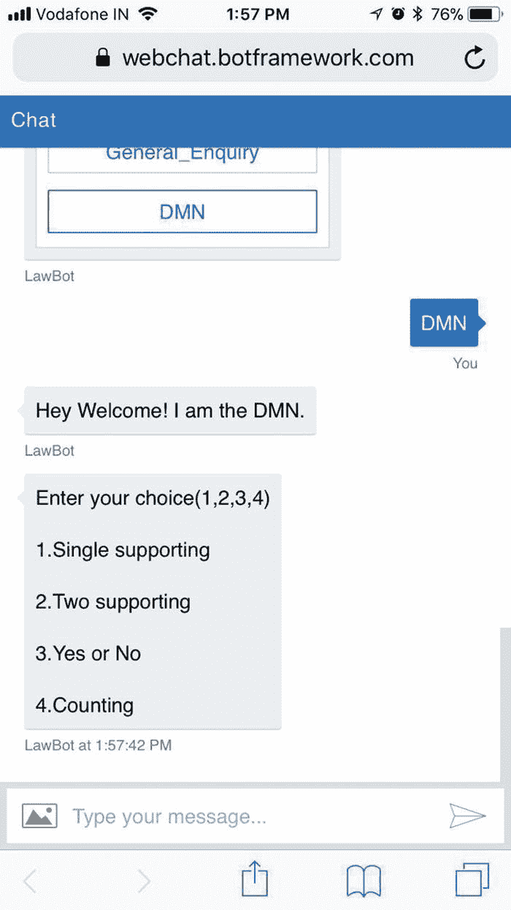
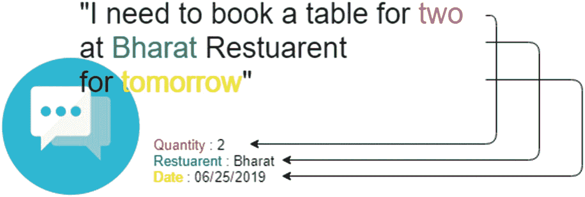
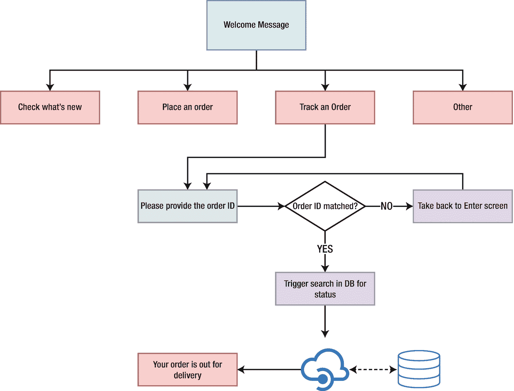

# 3. 聊天机器人开发基础

聊天机器人需要具备能够实现类人对话的功能。目标是让聊天机器人的对话更人性化，从而优于现代应用程序中菜单驱动的方式。在前几章中，我们讨论了聊天机器人的类型以及内部开发聊天机器人时需要考虑的监管限制。在本章中，我们将讨论构建聊天机器人核心组件的简化方法。后续章节将介绍一个示例请求的对话流程，以促进聊天机器人对话中的上下文构建。本章将以介绍“全天候保险代理”聊天机器人结束，该机器人将是本书其余部分讨论的用例。

## 以客户服务为中心的聊天机器人

客户服务流程涉及交换私人客户信息以及访问数据源以获取最新信息。通过聊天机器人进行的信息交换需要准确性，并执行严格的安全和隐私策略。在聊天机器人开发中，有三个关键考量因素，以实现聊天机器人的预期用例：

*   业务上下文

*   策略合规性

*   安全性、身份验证和授权

系统在解析输入查询时的准确性是 NLP 模块的另一个考量因素。

### 业务上下文

业务上下文指的是聊天机器人所服务业务的特殊性。在一般对话中，我们可以推断出未言明或隐含事物的含义。

实时聊天的概念在许多大公司中仍然适用。实时聊天的核心目的是降低呼叫中心成本并提供另一层对话，但它也造成了另一个对话孤岛，并且在许多情况下，导致了糟糕的客户体验。

在实时聊天中，业务上下文由聊天客服维护，客户每次都需要阐明上下文。现代聊天机器人系统需要识别并维持设置，以构建最简对话流程。通常，通过聊天机器人进行的对话取决于显式传递给聊天机器人进行处理的内容（对话历史）、用于对话的渠道（渠道）以及消息的媒介（文本、图像、语音、表情符号等）。未言明的内容就是上下文，这需要成功的聊天机器人来维护。

例如，下面的对话展示了上下文的重要性。

| **案例 1**：未维护上下文 | **案例 2**：维护了对话上下文 |
| **用户**：为什么我的食品订单退款还没处理？**聊天机器人**：请提供您的订单号**用户**：2345**聊天机器人**：您的退款已处理，将在 2 天内更新到您的账户。 | **用户**：为什么我的食品订单退款还没处理？**聊天机器人**：您的退款已处理，将在 2 天内更新到您的账户。 |

*   **对话上下文**：用户正在谈论他昨晚取消的食品订单（2345）。

在案例 1 中，上下文未被维护，因此每次对话都需要向聊天机器人提供所有信息。在案例 2 中，聊天机器人保留了对话开始的上下文，并尝试将查询识别为相同含义。

基于这个通用示例，聊天机器人需要针对特定的业务语言、术语和操作方言进行训练。如果你正在为银行开发聊天机器人，你需要理解“定期存款账户”、“支票账户”和“续存”指的是银行的特定功能。这一点非常重要，因为你的用户不会愿意一次又一次地向聊天机器人解释他们在说什么。

业务上下文是在自然语言处理（NLP）层构建的，而对话框架则管理功能。这种针对全球业务上下文和语言的特定训练需要查看与客户过去的对话。

### 注意

每个对话可能有一个全局上下文和一个特定于对话的上下文。例如，谈论人寿保险是全局上下文，而在其中谈论某个特定保单则是对话上下文。

### 策略合规性

每一次对话都可能引发聊天机器人需要处理的多种请求。关键问题随之而来：为了满足用户请求，处理这些信息的合规方式是什么？政策和政府法规决定了哪些行为被允许、哪些不被允许，如果允许，又该如何访问这些信息。

例如，假设用户想要更新其保险单上的家庭住址。从技术角度来看，这可以简单到（在身份验证后）将以下信息传递给聊天机器人：

*   **用户**：将我的家庭住址更新为印度第八区 XYZ 地址
*   **聊天机器人**：地址已更新为印度第八区 XYZ 地址

但随之而来的是新的问题。客户是否仅凭提供此命令就能更改地址？在真实的银行网点，这一流程是如何进行的？管理地址变更的流程和策略是什么？

一份策略与法规指南对于引导聊天机器人进行对话至关重要。业务流程以及法定合规要求，必须在所有渠道上得到遵循，任何请求才能被持久化到系统中。例如，即使请求已被确认，也不应直接执行地址更新。在更新地址之前，可能需要要求提供地址证明、说明原因、等待三天，或执行其他流程。

为客服创建的聊天机器人需要被仔细教导必须遵守的规则或步骤，以完成请求。这些规则可能因聊天机器人的业务和目的而异。这些步骤需要在聊天机器人逻辑中作为严格的“与”条件来实现。

### 安全性、身份验证与授权

聊天机器人可以被允许访问私人信息，或者停留在另一个渠道上以对话方式分发公共信息。身份验证和授权是保障对话安全的两大关键层。一个安全的通信渠道至关重要，以确保用户与聊天机器人之间交换的数据经过加密，并通过非常安全的媒介进行传输。

可以通过使用 HTTPS 协议进行对话、设置防火墙以及其他行业最佳实践来实施安全策略。安全层必须由网络技术和技术架构来负责，以保护所有对话的安全。在大多数情况下，安全功能可以从现有的业务框架中继承，无需单独设计。

如图 3-1 所示，用户首先需要通过身份验证流程来确立身份。身份验证流程通常涉及提供用户名和密码，而在多因素身份验证中，还需要提供诸如一次性密码或 PIN 码之类的额外信息。成功的身份验证会根据系统记录确立用户身份。接下来的流程是确定用户在系统中的权限。在业务术语中，授权也被称为角色管理，因此，在部署聊天机器人之前，业务方需要为每个经过身份验证的用户分配角色/权限。

图 3-1

参考问责框架

聊天机器人需要对其用户进行身份验证，以确定他们是否有权访问聊天机器人功能，如果允许，还要确定哪些功能对哪些用户开放。当你的聊天机器人连接到后端系统以访问人力资源管理系统、客户关系管理系统等信息时，这一点变得更加重要。在许多情况下，可以使用像 Active Directory 这样的身份管理系统来为聊天机器人创建身份验证和访问控制机制。典型的身份验证可以是多因素登录系统，或为授权用户提供访问 PIN 码。

授权是问责框架中的另一个关键层，它允许企业控制对资源的访问。这也控制了访问控制层，系统在此检查经过身份验证的用户被允许访问哪些区域或功能。这一点非常重要，因为多个用户可能希望在多个独立的对话中使用相同的信息源，我们需要保护数据，并仅根据用户的角色和策略提供其有权访问的内容。

图 3-2 展示了应用程序的典型访问授权方式；这也同样适用于聊天机器人。我们可以创建一套完整的自定义身份验证和授权服务，或者使用像 AuthO、Active Directory 等第三方工具。在所示的方法中，应用程序要求用户提供其凭证，并将其发送到身份验证服务。一旦身份验证成功，它会返回一个包含授权详情的令牌，聊天机器人可以使用该令牌与用户进行交互。

图 3-2

身份验证与授权服务

### 用户输入到系统转换的准确性

聊天机器人逻辑在用户自然语言输入和用于检索信息的机器可执行输入之间创建了一个接口。这个接口需要确保在将输出传递给用户之前，转换是准确的。这是当今基于自然语言处理的聊天机器人面临的最大挑战，因此也是重要的研究领域之一。让我们通过一个例子来说明：

| 输入 | 聊天机器人逻辑生成的查询 | 系统输出 |
| --- | --- | --- |
| 用户：告诉我 2019 年 4 月的工资状态 | 从 payroll_table 中选择状态，其中 empID=UserID 且 month=“April” 且 year=“2019” | 您的工资状态为“<查询响应>” |
| 用户：我什么时候能拿到上个月的工资？ | 从 payroll_table 中选择状态，其中 empID=UserID 且 month=?? 且 year=?? | 您的工资状态为“<查询响应>” |

在这个例子中，输入 1 和输入 2 需要从系统中获得相同的结果。聊天机器人逻辑需要先解析这两个输入，然后才能为用户获取正确的信息。以下是确保查询能为系统响应获取准确数据的挑战和要求。如果聊天机器人逻辑无法构建正确的问题，结果将不正确，甚至可能导致未经授权的信息无意中泄露给用户。

## 聊天机器人开发方法

聊天机器人开发方法指的是如何构建聊天机器人逻辑。选择方法时的关键考量是在自然语言能力和结果准确性之间取得平衡。如你所知，自然语言处理面临着理解自然对话并将其转换为机器操作的挑战；必须保持平衡。

如图 3-3 所示，根据聊天机器人的能力及其内置人工智能的程度，存在一个通用的分类。我们对聊天机器人进行分类的关键轴是对话范围和机器响应。

图 3-3

基于对话类型和响应类型的聊天机器人分类

本书及我们讨论的重点是封闭域对话，在此范围内，我们可以采用基于规则的方法，或者使用基于人工智能的方法来创建智能机器。在本节中，我们将介绍两种流行的开发方法。

### 基于规则的方法

基于规则的方法，也称为菜单驱动方法，是自助门户的扩展，提供了更好的体验。其关键区别在于解决方案的导航方式。在自助门户中，你需要手动导航到正确的选项，而在基于菜单的聊天机器人中，可以使用自然语言进行导航，然后通过菜单执行操作。参见图 3-4。

这类聊天机器人非常普遍，并且在集成客户关系管理（CRM）和其他数据系统的行业用例中，使用率通常很高。

**图 3-4**

菜单驱动型聊天机器人界面

如图 3-4 所示，聊天机器人尝试理解用户问题，然后呈现一个菜单供用户选择下一步操作。该列表确保后端知道需要执行何种具体操作来满足请求。

#### 基于菜单的方法的优势

基于菜单的方法具有一些优势：

*   响应的准确性由设计保证。
*   它基于启发式规则而非复杂的自然语言处理（NLP），易于理解和实现。
*   无需重新训练核心模型即可轻松扩展新的菜单项。

#### 基于菜单的方法的劣势

在拥有出色准确性和易于实现优势的同时，也存在一些局限性：

*   功能严格局限于模板代码。
*   实现分为两步：理解上下文并弹出菜单。点击菜单后，再执行请求。
*   提供的自然语言对话能力有限，因为聊天机器人无法理解编码情境之外的内容。

即使存在这些局限性，当准确性比自然对话体验更重要时，菜单驱动方法仍然非常成功。

### 基于人工智能的方法

基于人工智能的方法基于先进的自然语言处理（NLP）引擎，以支持自然语言，并基于机器学习算法和系统集成进行动态信息检索来满足请求。聊天机器人的准确性在开始时较低，并随时间推移而提高。

基于菜单的方法和基于人工智能的方法之间的关键区别在于 NLP 引擎。NLP 引擎负责提取用户输入中存在的信息。此外，基于提取的信息，聊天机器人需要决定后续步骤。

如图 3-5 所示，NLP 引擎的关键作用是从自然语言输入中提取信息。信息提取的准确性至关重要，因为它将决定对话的结果并持久化到系统中。NLP 引擎需要提取指示系统执行操作所需的信息。在菜单驱动方法中，用户必须先与菜单交互以选择具体细节，系统才能执行操作。

**图 3-5**

NLP 引擎基于机器学习技术提取精确信息

#### 基于人工智能的方法的优势

基于人工智能的方法具有许多优势和以客户为中心的益处：

*   无需用户执行多个步骤即可进行高级对话。
*   NLP 引擎可以处理未见过的场景和大量文本。
*   聊天机器人可以学习从头开始创建自定义回复（自然语言生成）。

#### 基于人工智能的方法的劣势

基于人工智能方法的问题主要源于其复杂性：

*   NLP 引擎的训练、维护和改进都很复杂。
*   由于 NLP 输出并非 100% 正确，响应的准确性会受到影响。
*   构建可用的聊天机器人 NLP 引擎需要海量数据。

## 对话流程

为封闭领域应用构建的聊天机器人具有明确的目的和功能，这些功能将作为特性提供给用户。为了覆盖可能的对话情况或用户输入，我们必须定义范围以及所有可能的流程。流程定义至关重要，因为我们必须遵循策略才能提供对所需数据的访问。

对话流程是一个决策树，描述了对话中任何时间点可能发生的事件、决策和结果列表。当需要维护上下文且系统的响应不是单一步骤时，这种流程能确保更高的相关性。图 3-6 展示了一个对话流程示例。

**图 3-6**

示例对话流程

流程以欢迎消息开始，然后要么提供一个菜单（如果是基于规则的聊天机器人），要么用户输入一个句子（完全由 AI 驱动的聊天机器人）。一旦聊天机器人的 NLP 逻辑识别出用户需要哪个功能，就会有一个决策点将用户引导至该对话路径。如果用户想查看订单状态，他的下一个对话决策点就是输入订单号。一旦聊天机器人收到有效的订单 ID，后端就会调用操作来检索该订单的信息并将其返回给用户。此流程也维护了上下文，因此如果用户需要追踪另一个订单，他无需从头开始，只需输入另一个订单 ID，聊天机器人就会知道要追踪订单状态。

在更高级的聊天机器人中，你可以在一行中传递多个意图，但从技术上讲，聊天机器人会以相同的流程处理请求。因此，“追踪我的订单号 465”是用户的单个输入，它应该获取相同的结果。多意图聊天机器人构建起来很困难，并且出错的可能性很高。

创建聊天机器人流程至关重要，因为它定义了功能范围，并提高了聊天机器人为用户服务的准确性。务必向用户明确说明聊天机器人能为他们做什么，并可能事先定义好功能。异常情况始终可以转移到默认回复或人工客服处理。

## 聊天机器人关键术语

聊天机器人的开发已经成为一个成熟的开发过程，这意味着在尝试开发聊天机器人之前，理解其术语至关重要。聊天机器人开发中使用的关键术语也有多种变体，正如亚马逊、谷歌等领先的聊天机器人平台提供商所宣称的那样。

在本节中，我们将讨论聊天机器人开发中经常使用的一些关键术语。在后续章节中，我们将使用这些概念和术语来展示如何从头开始开发聊天机器人。

### 话语

话语指的是用户输入给聊天机器人的任何内容。完整的端到端输入构成一个话语，例如“获取我订单号 345 的状态”、“今天气温多少？”、“你好”、“早上好”等。

话语用于在开发中为意图构建分类器。聊天机器人将尽可能多的话语存储在数据库中，这些话语是用户提出的问题，并将它们聚类到不同的意图中，这些意图代表了用户想表达的内容。

为了开发保险行业的聊天机器人，我们需要从不同渠道（如聊天、电子邮件、到访、客户价值中心等）捕获用户提出的实际问题。我们将使用所有这些历史数据来训练聊天机器人，使其了解用户的真实需求以及应该使用哪个对话流程。

### 意图

意图是指从聊天机器人捕获的用户话语中识别出的用户目的。识别意图是聊天机器人的核心功能。在菜单驱动的聊天机器人中，菜单帮助用户明确意图；而在基于 AI 的聊天机器人中，识别意图是 NLP 引擎的任务。

意图的成功匹配决定了对话的流程，并向用户提供正确的响应。在特定领域的聊天机器人中，意图可能与通用意图不同，因此需要进行特定领域的训练。

例如，对于“显示苹果公司的股票价格”这句话，其意图是查找股票价格。我们可将此意图命名为 showStockPrice。showStockPrice 是用户的主要意图，而“苹果”一词则是实体，也称为槽位。

### 实体

实体通过为话语提供附加价值来赋予意图具体含义。实体可以被定义为从属于意图，它告诉我们意图与哪个子类相关。在此示例中，“苹果”是意图#showStockPrice 的@company_name 实体。

实体（或槽位）在会话中得以维护时，有助于保留对话的上下文。在此示例中，在第一次话语之后我们回复了价格。紧接着，下一句话可能是“还有微软的”。在这种情况下，聊天机器人已经捕获了意图为 showStockPrice，因此槽位变为微软，聊天机器人便可以获取微软的股票价格。

### 渠道

渠道是聊天机器人用于连接用户并满足其请求的媒介。如今，所有社交媒体即时通讯工具都允许聊天机器人进行对话（例如，Facebook Messenger、Slack、Skype 等）。

然而，对于像我们的“全天候保险代理”这样的应用，我们希望拥有自己开发的渠道，以符合隐私法律，并在访问用户私人信息时提供额外的安全层。

### 人工接管

人工接管是一个术语，用于表示在对话过程中回退到人工服务。现代聊天机器人具备在无法理解意图、提取实体或 NLP 输出置信度较低时，回退到人工协助的功能。

人工接管可分为两种类型：

*   **选择性人工接管**：用户可以在任何时刻选择与人工对话，可能是因为他们更习惯与人交流，或者聊天机器人无法解决他们的问题。

*   **置信度触发的人工接管**：置信度过滤器可以决定我们是否能以高置信度完成请求；如果不能，请求将自动转接给人工，用户没有选择余地。这为用户提供了无缝的体验。

## 用例：全天候保险代理

本书将讨论的聊天机器人基于一个保险代理的用例。我们将从安全、自然语言机器学习技术、部署和业务目的等多个方面来探讨 AI 驱动的聊天机器人。每一章都会讨论开发此聊天机器人的某个组成部分。

现在您已经了解了规划“全天候保险代理”的基本条件，包括设定业务背景、开发策略类型以及其他考量因素。在本节中，我们将定义“全天候保险代理”的各个方面，由于范围限制，并非所有功能都会被明确实现。

*   **业务背景**：“全天候保险代理”将能够在保险领域进行必要的对话。人们可以询问他们的保单、保费等信息。
*   **政策合规性**：政策可以遵循客户服务中心的标准流程。
*   **安全、认证与授权**：我们可以创建基于 PIN 码的授权，如果用户已有产品，也可以使用基于 IDS 的身份验证。
*   **用户输入到系统转换的准确性**：为确保这一点，我们可以创建基于置信度过滤器的人工接管机制。
*   **基于 AI 的方法还是基于菜单的方法**：根据需求，在灵活性和准确性之间取得平衡，两种方法都可以。
*   **对话流程**：流程必须通过与业务部门沟通并探索其政策来创建。
*   NLP 训练需要历史对话数据、意图列表、最频繁出现的实体等。

这些决策将帮助开发者为聊天机器人解决方案选择正确的结构和架构。

## 总结

聊天机器人既带来机遇也带来挑战。机遇大于开发过程中遇到的挑战。在本章中，我们讨论了在开始开发聊天机器人旅程时的重要考量，包括定义业务背景、理解访问数据的策略、采用对话和系统安全的最佳实践，以及确保响应的准确性。接着，我们介绍了两种开发方法及其优缺点：基于菜单的方法和基于 AI 的方法。我们还涵盖了设计对话流程的概念，这有助于创建响应用户的范围和确定性结构。我们解释了聊天机器人开发中常用的关键术语：话语、意图、实体、渠道和人工接管。最后，我们概述了如何为“全天候保险代理”构建解决方案。下一章将介绍解决方案架构以及企业如何内部构建成功的聊天机器人。

