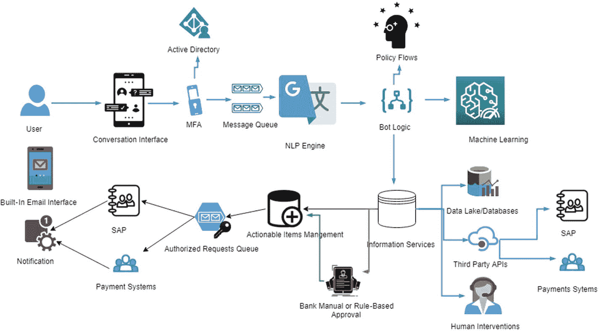

# 4. 构建聊天机器人解决方案

聊天机器人是完整的解决方案，并在任何解决方案中作为一个独立的层存在。高级管理层也将聊天机器人的功能和投资回报率视为一个独立实体。对对话技术的关注进一步要求从解决方案和业务回报的角度对聊天机器人有全面的看法。在前几章中，我们揭开了为封闭领域开发聊天机器人的基本要素。在本章中，我们将重点介绍如何利用最佳可用资源为封闭领域用例构建解决方案。本章还将涵盖如何衡量聊天机器人实施成功与否的思考过程，以及管理与聊天机器人相关的风险。

## 业务考量

任何企业都会问：“聊天机器人能增加什么业务价值？”这个问题需要客观地并设定时间目标来回答。技术进步可能允许我们实现先进的聊天机器人和其他解决方案，但它们如何为企业增加价值是一个非常主观的判断。企业需要评估所有因素，以确定聊天机器人如何对其业务有利。

### 聊天机器人 vs. 应用程序

从技术角度来看，企业必须解决一个重要问题，特别是与封闭领域聊天机器人相关的问题：是选择开发应用程序还是聊天机器人。就功能特性而言，两者都可以为给定的功能集提供相同的信息。关键区别在于聊天机器人本质上是对话式的，而应用程序是自助服务应用。

根据《2018 年聊天机器人现状报告》（[`www.drift.com/wp-content/uploads/2018/01/2018-state-of-chatbots-report.pdf`](https://www.drift.com/wp-content/uploads/2018/01/2018-state-of-chatbots-report.pdf)）中提到的聊天机器人 vs. 应用程序的关键考量是：

*   聊天机器人更受青睐，用于快速获取问题答案和提供 24 小时服务。
*   应用程序更受青睐，因其易用性和便利性。

该报告中的一项调查列出了一些企业必须根据其当前需求进行核实的因素：

*   快速回答简单问题
*   获得 24 小时服务
*   便利性
*   快速回答复杂问题
*   沟通的便捷性
*   能够轻松投诉
*   获得详细/专家级答案
*   良好的客户体验
*   友好性和亲和力
*   快速解决投诉

### 即时通讯应用的兴起

推动聊天机器人需求的另一个因素是即时通讯应用使用量的增长，以及企业采取以移动端为核心策略的稳定增长趋势。如今，客户通过手机 24 小时连接互联网，并希望通过易于使用的界面访问服务。

2011 年初，即时通讯应用开始兴起，并随着移动设备、互联网连接和云计算的同步发展而获得了良好的采用率（[`www.businessinsider.com/the-messaging-app-report-2015-11`](http://www.businessinsider.com/the-messaging-app-report-2015-11)）。大约在 2015 年初，即时通讯应用，特别是 WhatsApp 和 Facebook Messenger，达到了惊人的采用率，其活跃度与社交网络持平。正如趋势所示，人们在即时通讯应用上的活跃度高于社交媒体网络。

这一趋势指出了消费者行为的转变，即聊天成为一种首选的沟通方式。这意味着企业也需要通过聊天机器人或人工聊天，来启用与客户的这种沟通渠道。

### 直接联系 vs. 聊天

即时通讯应用使用量的增长，改变了客户与企业互动的方式。在即时通讯应用的早期，研究显示客户越来越倾向于通过聊天进行联系。

*聊天机器人杂志* 总结的 BI Intelligence 调查（[`https://chatbotsmagazine.com/chatbot-report-2018-global-trends-and-analysis-4d8bbe4d924b`](https://chatbotsmagazine.com/chatbot-report-2018-global-trends-and-analysis-4d8bbe4d924b)）显示，早在 2016 年，成熟市场的客户就非常迅速地接受了聊天方式。消费者认为，通过聊天解决问题比致电客服代表更快。他们也觉得聊天更舒适，因为可以保留聊天记录以便后续跟进，这与电话交谈不同。

## 聊天机器人的商业优势

考虑关键的业务方面，可以让公司决定是继续构建聊天机器人，还是改进现有的应用/渠道。如果公司决定采用聊天机器人解决方案，就需要了解聊天机器人创造的关键价值。目前，不同行业的用户对聊天机器人的接受程度不同，采用率也各不相同。

在上述 *聊天机器人杂志* 的调查问卷中，当被问及“对于由基于 AI 的聊天机器人协助进行商业沟通，你的接受程度如何？”时，受访者表示，他们最愿意在在线零售、一般医疗咨询和电信领域进行此类对话。

此外，在《2018 年聊天机器人现状报告》中，用户不偏好聊天机器人的主要原因包括：需要真人协助、对聊天机器人认知不足，以及因渠道可访问性受限（例如没有 Facebook 账户或无法使用智能手机）而可能产生的障碍。

研究表明，如果聊天机器人能为公司带来高收益，并且你的客户乐于接受基于 AI 的聊天机器人的协助，那么增加这一渠道是有价值的。以下章节将讨论聊天机器人创造的两个最重要的价值。

### 成本节约

毫无疑问，对公司来说最重要的好处是客户服务方面的成本节约。成本节约为将聊天机器人引入公司的服务交付渠道提供了最有力的理由。虽然还有许多其他的战略和增长收益，但成本必须证明用于聊天机器人开发和维护的所有努力和资源是合理的。

一项 BI Intelligence 研究（[`www.businessinsider.com/intelligence/research-store?&vertical=mobile#!/The-Messaging-Apps-Report/p/56901061`](https://www.businessinsider.com/intelligence/research-store%253F%2526vertical%253Dmobile%2523%2521/The-Messaging-Apps-Report/p/56901061)）显示，通过在各个业务职能中引入聊天机器人，每年可节省大量薪资开支。薪资支出最高的领域是客户服务代表，而该领域的节省也最大。成本降低显而易见，这归功于在保险销售、报告、销售和客户服务等职能中使用聊天机器人。

### 客户体验

客户体验是将聊天机器人引入业务的第二大影响因素。客户体验为企业带来多重价值，不仅限于直接销售或成本节约。良好的客户体验带来的好处包括：

*   高品牌价值和品牌回忆度
*   高生命周期价值（提升用户参与度）
*   与竞争对手的品牌差异化

由于愉悦的客户体验，还会衍生出许多其他因素。忠诚的客户群是长期成功的秘诀。

*聊天机器人杂志* 的总结指出了聊天机器人带来的良好且独特的客户体验所具备的特征。关键点如下，供参考：

*   24 小时服务
*   获得即时响应
*   回答简单问题
*   便捷的沟通
*   快速解决投诉
*   良好的客户体验
*   详细/专业的解答
*   回答复杂问题
*   友好且平易近人

这些多样化的新功能吸引了客户，并为公司创造了独特的价值。

## 成功指标

在任何聊天机器人开发之初，定义成功指标都至关重要。这些指标如同指南针，指引着解决方案的方向以及聊天机器人预期带来的收益。虽然存在与 NLP 引擎准确性、意图分类器及其他技术方面相关的成功指标，但本节我们仅从业务角度讨论成功指标。

成功指标需要易于管理和衡量，并能向业务部门进行简单解释。我们将讨论几个可用于跟踪和管理聊天机器人成功与否的指标。这些指标侧重于比较聊天机器人交互与人工交互时的成功程度。

### 客户满意度指数

客户满意度指数（CSI）通过向客户发送简短调查，跟进并收集他们对交互体验的反馈，来衡量客户服务代表的交互质量。CSI 是最具影响力的监控指标之一，因为它不仅提供了满意度量表，还指出了需要改进的领域。

### 完成率

完成率（CR）定义为聊天机器人交互中，以客户问题得到解决而告终的比例。该指标告诉我们，聊天机器人有多少次能够完成对话并向用户提供所需的响应。更高的完成率意味着更高效的聊天机器人服务。

### 跳出率

跳出率（BR）可以定义为用户在向聊天机器人输入一两次信息后便离开聊天的比例。高跳出率意味着聊天机器人未能成功吸引用户，这必然会在一些客户反馈中有所体现。

除了跳出率，我们还会衡量重复使用率（RR），它指的是有多少客户会再次回来使用聊天机器人。BR 是识别那些更倾向于使用聊天机器人的人群，并定位类似客户群体的完美指标。

## 管理聊天机器人服务中的风险

新技术渠道确实会带来风险。客户和公司需要了解，通过聊天机器人进行任何交易或信息交换所涉及的风险。在允许普通客户使用聊天机器人服务之前，必须理解、沟通并缓解这些风险。

### 第三方渠道

银行及其他金融机构深知为用户开辟金融服务新渠道的重要性。虽然这为用户带来了便利，但也伴随着一定风险。技术的发展速度远超我们现有的风险框架。当普通用户能够摸索出使用聊天机器人的风险或最佳实践时，他们可能已经遭遇了安全漏洞。

最大的安全风险源于聊天机器人的通信渠道，因为这些渠道不受银行安全控制的管辖。例如，通过 Facebook Messenger 与银行系统交互的客户，实际上是借助 Facebook 平台进行操作，而该平台可能存在漏洞，且其设计初衷并非用于银行业务，仅适用于普通人际聊天。

Synopsys 在 2018 年进行的一项调查显示，36% 的受访者认为面向客户的 Web 应用仍是亚太地区企业面临的首要安全风险。2018 年 9 月，Facebook 承认其安全漏洞影响了超过 5000 万个账户，这及时提醒我们，即便是科技巨头也无法幸免。（来源：`finews.asia`）。

这些案例要求金融机构限制通过公共渠道使用聊天机器人信使的功能。开发端到端的聊天机器人体验也能降低此类风险，但其普及仍面临挑战。

### 身份冒充

另一个非常突出的风险源于**身份冒充**。身份冒充可能表现为外观相似的聊天机器人，或利用虚假窗口进行对话、入侵社交媒体及其他冒充手段。由于欺诈者的犯罪手段层出不穷，银行已经面临大量欺诈行为，并每年投入数百万资金用于防范网络钓鱼、语音钓鱼及其他冒充攻击的教育。

双因素认证是减少身份冒充攻击的一种可行方法，它通过两个不同来源进行两步验证。在大多数情况下，黑客无法同时破解两个认证因素，因此成功进行欺诈交易的可能性较低。

### 个人信息

通过聊天机器人渠道泄露个人信息是银行管理上面临的一项挑战。控制那些可能为了获取服务而无意中输入个人信息的用户，是一项艰巨的任务。由于聊天机器人由自然语言驱动，泄露个人详细信息的可能性很高。

聊天机器人需要确保尽可能少地使用信息。最好创建一个具有适当访问控制的 PIN 码，这样用户就无需透露个人信息，只需使用 PIN 码即可。教育用户是确保用户对任何欺诈行为保持警惕和警觉的关键步骤。

### 确认核查

确认是最有效、有时也是最后的手段，用以确保通过聊天机器人进行的交易是合法的。使用聊天机器人可能发生欺诈性或错误交易。当新技术投入用户服务时，用户需要时间来理解服务的正确使用方法，在此过程中，他们也可能进行一些非法交易。

对于任何看似异常或意外的交易，最好在处理前致电客户并要求确认。这一核查措施能保护用户和银行免受欺诈。

## 私有聊天机器人的通用解决方案架构

> *解决方案架构是一种实践，用于定义和描述在特定解决方案背景下交付的系统的架构，因此它可能涵盖对整个系统或其特定部分的描述。解决方案架构的定义通常由解决方案架构师主导。*
> 
> 来源：维基百科

在本节中，我们将介绍一个参考解决方案架构，您可以稍作修改后应用于迄今为止提出的各种理念（图 4-1）。

图 4-1

24x7 保险代理的解决方案架构

该架构从高层次上描述了解决方案将如何运作。这与技术架构不同，技术架构解释了使解决方案运作的具体组件及其配置。精确的技术架构是根据需求构建的，不在本书的讨论范围之内。以下小节将通过其他重要信息来扩展和解释该解决方案架构。

### 工作流描述

以下是工作流程：

1.  **对话界面**：我们将从头开始开发界面；它不依赖于第三方界面（例如 Skype、Telegram 等）。这将有助于我们根据组织需求创建定制化界面，并根据需要扩展其他功能。该界面可以是一个全新的、适用于 iOS、Android 和 Windows 平台的移动应用。

2.  **MFA 与 Active Directory**：后端将构建认证系统，用于对设备（MS Intune）、用户（Active Directory）和应用程序（通过 PIN 码）进行身份验证。我们将在 Node 环境下构建该系统，以便也能集成到其他身份管理服务中。在基本形式下，我们仅通过 PIN 码验证来访问应用程序。

3.  **NLP 引擎**：将构建 NLP 引擎，用于从队列中接收文本输入，提取意图，并为传入的查询添加上下文。一旦问题被分解为所需的组成部分，它就会被发送到机器人逻辑模块。

4.  **机器人逻辑**：这是处理传入请求的核心处理器。在处理请求之前，它有两个核心输入。机器人逻辑在满足以下两种方法设定的流程之前，不会调用信息服务。如果机器人逻辑没有足够的信息进行回复，它会向用户询问更多信息。
    1.  **策略交互流程**：这些流程是银行专家为传入请求设计的工作流（例如，如果有人请求更新地址，回复的关键步骤是什么？）。这些步骤将确保用户遵循步骤来获得答案。这确保了机器人遵循所有政策（无论是法定的还是内部的），就像一位非正式的人力资源专员一样。此外，政策和常见问题解答也可以在此处定义。

    2.  **机器学习**：需要机器学习算法来改进输出的请求会在此处发起（例如，我可以申请获取 3 月 15 日到 3 月 18 日的对账单吗？）。这需要机器应用适当的逻辑来提取日期、员工 ID 和现有账户余额，以便向信息系统创建正确的查询。此外，更复杂的功能，如员工的情绪、请求的紧急程度以及问题的情感倾向，也将在此处构建。

5.  **信息服务**：这是为员工请求获取实时信息的地方。该服务处理所有请求并准备回复，同时也可以发送操作请求。信息服务将与三个核心数据服务进行交互：
    1.  **数据湖/数据库**：如果需要从公司的某个数据库或数据湖中获取某些数据。

    2.  **第三方 API/ODBC**：通过 ODBC/API 或其他通过 REST API 暴露自身的方法与人力资源系统进行交互。

    3.  **人力资源人员**：如果回复的可信度评分较低，它将通过聊天界面将请求转交给人力资源人员处理。

6.  **操作**：信息服务还会将请求某些工作的请求路由到操作项管理队列（例如，明天请假的请求）。此请求需要在 PeopleSoft 或人力资源系统中进行更新。所有此类变更请求将被路由到人力资源审批（也可以是直接审批）；一旦获得批准（无论是通过真实的人力资源人员还是基于策略的规则），它将被发送到操作队列。人力资源可以在此处支持广播，并且可以通过操作工作流进行投递。

7.  **实时系统更新**：对于已授权和批准的请求，我们直接在人力资源系统中进行更新，并向聊天机器人用户触发通知，同时触发电子邮件以及银行系统的其他内置流程。

### 关键特性

以下是关键特性：

*   **为您量身打造**：我们将根据特定需求制作机器人，而不是让这些需求去适应现有的机器人框架。

*   **设计即隐私**：机器人的开发遵循设计即隐私原则。它将完全符合当地法律和内部法规。

*   **采用微服务架构开发**：整个应用程序将基于微服务原则，因此将支持面向未来的设计，并允许在此框架之上进行高级应用程序开发。

*   **部署选项**：我们可以选择哪些组件部署在本地或公有云上。根据需求，我们可以制定部署计划。

*   **可扩展**：我们可以根据需要集成任意数量的 API 或 AI/ML 功能。所有未来的新变更都可以作为 API 在框架中使用。

### 技术栈

以下是技术栈：

*   **核心引擎**：Java 和 JavaScript

*   **后端服务器**：NodeJS 和其他 JavaScript

*   **前端服务器**：基于原生框架的移动应用

*   **日志管理**：小型 Hadoop 集群的云存储。此外，这些存储的对话日志为 AI/ML 模型训练提供数据。

*   **可视化**：可以使用 D3 自定义创建；如果需要自助服务，则可以将 Tableau/PowerBI 与日志集成。

*   **搜索**：使用 Elastic Search 搜索对话日志。

### 维护

在维护范围方面，有两个关键流：

*   **技术方面**：应用程序的正常运行时间将借助本地工程师和针对所有查询的待命渠道来维护。

*   **AI/ML 大脑**：这将由数据科学家团队在异地完成，更新将在准备就绪后推送到系统。

## 总结

本章描述了聊天机器人解决方案的业务考量，并列出了聊天机器人的优势。消息应用的市场增长是一个良好信号，表明用户正在适应消息应用，因此服务型聊天机器人可以增强他们的体验并降低公司成本。第三方研究显示了聊天机器人在企业中产生的影响，以及它们如何使数字渠道接近自然语言。下一部分讨论了必须定义的成功指标，以管理和改进聊天机器人。关键指标包括客户满意度指数（CSI）和转化指数（CI）。

此外，本章还讨论了聊天机器人的潜在风险以及如何管理这些风险。最突出的风险是身份冒充和凭证被黑客攻击。这两种风险都需要进行教育并建立安全的认证系统。最后，我们展示了一个开发聊天机器人的参考解决方案。架构、工作流、技术栈和维护说明提供了足够的信息，可以根据特定需求构建您的聊天机器人解决方案。在接下来的章节中，您将了解自然语言科学的关键领域，包括理解（NLU）、处理（NLP）和生成（NLG）。然后，我们将讨论如何使用开源技术和内部开发的框架来实现这些功能。

