# 5. 自然语言处理、理解与生成

人脑是处理、理解和生成（P-U-G）自然语言方面最先进的机器之一。人脑的能力远不止于对一种语言、方言、口音和对话语气进行 P-U-G 操作。迄今为止，还没有任何机器能达到人类无缝完成这三项任务的潜力。然而，机器学习算法和计算能力的进步，正使创造类人机器人的遥远梦想成为可能。

在本章中，我们将结合用例和示例，探讨自然语言的 P-U-G 及其细微差别。表 5-1 快速总结了自然语言处理（NLP）、自然语言理解（NLU）和自然语言生成（NLG）及其一些功能和实际应用。我们将在各自的章节中更详细地介绍自然语言处理、理解和生成。

表 5-1

NLP、NLU 和 NLG

| 类型 | NLP | NLU | NLG |
| --- | --- | --- | --- |
| **简介** | 通过分解、理解其含义并确定适当操作来处理和分析书面或口头文本。它涉及解析、断句和词干提取。 | NLP 的一种特定类型，有助于处理阅读理解，包括从语篇内容中理解含义并识别段落主旨的能力。 | NLG 是 NLP 的任务之一，用于从知识库的结构化数据生成自然语言文本。换句话说，它将数据转换为书面叙述。 |
| **功能** | 词性识别、文本分类、命名实体识别、翻译、语音识别 | 自动摘要、语义解析、问答、情感分析 | 内容确定、文档结构组织、交互式对话中的文本生成 |
| **实际应用** | 数字新闻聚合公司的文章分类 | 构建问答聊天机器人，利用 Twitter 和 Facebook 数据进行品牌情感分析 | 为电子商务网站生成产品描述或金融投资组合摘要 |

## 聊天机器人架构

在构建企业级聊天机器人时，到目前为止，您已经了解了如何识别数据源、设计聊天机器人架构、列出业务用例以及许多其他有助于企业高效处理、减少人工劳动和降低运营成本的概念。在本章中，我们将重点讨论聊天机器人的核心部分：处理文本数据并参与类人对话的能力。图 5-1 展示了一个利用 NLP、NLU 和 NLG 技术构建企业级聊天机器人的架构。

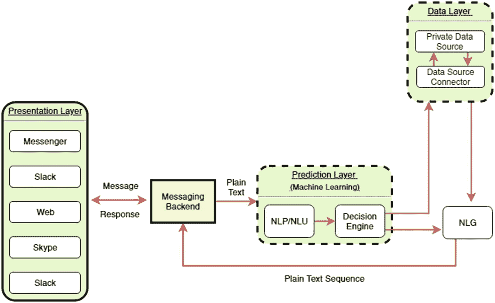

图 5-1

聊天机器人架构图

假设一家航空公司构建了一个聊天机器人，用于通过其网站或社交媒体页面预订航班。以下是按照图 5-1 所示架构的步骤：

1.  客户通过航空公司的 Facebook 页面说：“帮我预订一张明天从伦敦到纽约的机票。”在这种情况下，Facebook 成为表示层。一个功能完备的聊天机器人可以集成到公司的网站、社交网络页面以及 Skype 和 Slack 等即时通讯应用中。

2.  接下来，消息被传送到消息后端，纯文本在此处通过 NLP/NLU 引擎，文本被分解为标记，消息被转换为机器可理解的命令。我们将在本章中更详细地重新讨论这一点。

3.  然后，决策引擎将命令与预配置的工作流进行匹配。例如，要预订航班，系统需要出发地和目的地。这就是 NLG 发挥作用的地方。聊天机器人会问：*“好的，我将帮助您预订从伦敦到纽约的航班。请告诉我您更喜欢从希思罗机场还是盖特威克机场出发？”* 聊天机器人获取出发地和目的地，并自动生成一个后续问题，询问客户偏好哪个机场。

4.  聊天机器人现在访问数据层，并从预置的数据源（通常可以连接到实时预订系统）获取航班信息。数据源根据设计提供航班可用性、价格和许多其他服务。

有些聊天机器人侧重于生成式回复，而另一些则用于检索信息并将其嵌入预设计的对话流程中。例如，在航班预订用例中，我们几乎知道客户可能用来预订航班的所有方式；而如果以一家远程医疗公司的聊天机器人为例，我们则不确定患者可能提出的所有问题。因此，在远程医疗公司的聊天机器人中，我们需要借助使用 NLG 技术构建的生成模型，而在航班预订聊天机器人中，一个结合了 NLP 和 NLP 引擎的、良好的基于检索的系统应该就能工作。

由于本书是关于构建企业级聊天机器人的，我们将更多地关注 P-U-G 在自然语言中的应用，而不是深入探讨该学科的基础知识。在下一节中，我们将使用一些最流行的 Python 工具展示 NLP 和 NLU 的各种技术。还有其他基于 Java 和 C#的库；然而，Python 库提供了更强大的社区支持和更快的开发速度。

此外，为了区分 NLP 和 NLU，图 5-2 中的维恩图展示了 NLP 和 NLU 的一些应用。它显示 NLU 是 NLP 的一个子集。这种区分仅在于任务，而非范围。总体目标是处理和理解自然语言文本，使机器像人类一样思考。

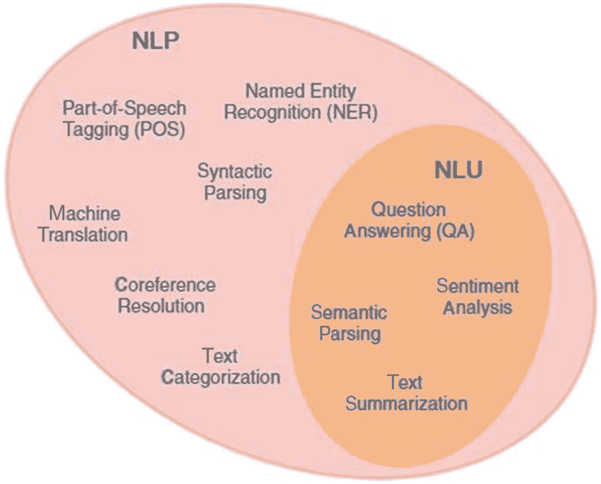

图 5-2

NLP 和 NLU 的应用

## 流行的开源 NLP 和 NLU 工具

在本节中，我们将简要探讨可用于执行自然语言处理、理解和生成的各种开源工具。虽然这些工具中的每一个都不区分自然语言的 P-U-G，但我们将在相应的三个独立标题下展示这些工具的能力。

### NLTK

自然语言工具包（NLTK）是一个用于处理英语词汇的 Python 库。它采用 Apache 2.0 开源许可证。NLTK 使用 Python 编程语言编写。以下是 NLTK 可以执行的一些任务：

*   **文本分类**：将文本分类到不同类别，以便更好地组织和过滤内容
*   **句子分词**：将句子分解为单词，用于符号化和统计自然语言处理
*   **词干提取**：将单词还原为词基或词根形式
*   **词性标注**：将单词标注为词性，从而将单词归类到具有相似语法属性的类别中
*   **文本解析**：基于底层语法确定文本的句法结构
*   **语义推理**：理解单词含义以创建表示的能力

NLTK 是教授 NLP 的首选工具。它也被广泛用作原型设计和研究的平台。


### spaCy

大多数构建涉及自然语言数据产品的组织都在采用 spaCy。它凭借提供准确且快速的生产级 NLP 引擎而脱颖而出。加上详尽的文档，其采用率进一步提高。该库使用 Python 和 Cython 开发。spaCy 中的所有语言模型均使用深度学习进行训练，这为所有 NLP 任务提供了高精度。

目前，spaCy 具备以下一些高级功能：

*   **涵盖 NLTK 功能：** 提供 NLTK 的所有功能，如分词、词性标注、依存句法树、命名实体识别等。

*   **深度学习工作流：** spaCy 支持深度学习工作流，可以连接在 TensorFlow、Keras、Scikit-learn 和 PyTorch 等流行框架上训练的模型。这使得 spaCy 成为构建和部署用于实际应用的复杂语言模型时最强大的库。

*   **多语言支持：** 支持超过 50 种语言，包括法语、西班牙语和希腊语。

*   **处理流水线：** 提供一个易于使用且非常直观的处理流水线，用于以有序的方式执行一系列 NLP 任务。例如，用于执行词性标注、句子解析和命名实体提取的流水线可以像这样定义在一个列表中：`pipeline = ["tagger", "parser", "ner"]`。这使得代码易于阅读且便于调试。

*   **可视化工具：** 使用 displaCy，可以轻松绘制依存句法树和实体识别器。我们可以添加自己的颜色，使可视化效果更美观悦目。它也能在 Jupyter notebook 中快速渲染。

### CoreNLP

Stanford CoreNLP 是所有自然语言任务中最古老、最强大的工具之一。其功能套件提供了许多语言分析能力，包括已讨论过的词性标注、依存句法树、命名实体识别、情感分析等。与 spaCy 和 NLTK 不同，CoreNLP 是用 Java 编写的。它还提供了从命令行使用的 Java API，以及用于与现代编程语言协作的第三方 API。以下是使用 CoreNLP 的核心功能：

*   **快速且稳健：** 由于它使用久经考验且稳健的 Java 编程语言编写，CoreNLP 是许多开发者的最爱。

*   **广泛的语法分析：** 与 NLTK 和 spaCy 一样，CoreNLP 也提供了大量分析能力来处理和理解自然语言。

*   **API 集成：** CoreNLP 拥有出色的 API 支持，可以通过第三方 API 或 Web 服务从命令行以及 Python 等编程语言运行它。

*   **支持多种操作系统：** CoreNLP 可在 Windows、Linux 和 MacOS 上运行。

*   **语言支持：** 与 spaCy 类似，CoreNLP 提供了有用的语言支持，包括阿拉伯语、中文等。

### gensim

gensim 是一个用 Python 和 Cython 编写的流行库。它稳健且可用于生产环境，这使其成为 NLP 和 NLU 领域的另一个热门选择。它可以帮助分析纯文本文档的语义结构，并提炼出重要主题。以下是 gensim 的一些核心功能：

*   **主题建模：** 它自动从文档中提取语义主题。它提供了多种统计模型，包括用于主题建模的潜在狄利克雷分析（LDA）。

*   **预训练模型：** 它拥有许多预训练模型，这些模型提供了开箱即用的能力，可以快速开发通用功能。

*   **相似性检索：** gensim 从任何文档中提取语义结构的能力，使其成为对众多主题进行相似性查询的理想库。

spaCy 网站上的表 5-2 总结了 NLTK、spaCy 和 CoreNLP 中是否提供某个给定的 NLP 功能。

表 5-2

spaCy、NLTK 和 CoreNLP 中可用的功能

| 序号 | 功能 | spaCy | NLTK | CoreNLP |
| --- | --- | --- | --- | --- |
| **1** | 编程语言 | Python | Python | Java/Python |
| **2** | 神经网络模型 | **是** | **否** | **是** |
| **3** | 集成词向量 | **是** | **否** | **否** |
| **4** | 多语言支持 | **是** | **是** | **是** |
| **5** | 分词 | **是** | **是** | **是** |
| **6** | 词性标注 | **是** | **是** | **是** |
| **7** | 句子分割 | **是** | **是** | **是** |
| **8** | 依存句法分析 | **是** | **否** | **是** |
| **9** | 实体识别 | **是** | **是** | **是** |
| **10** | 实体链接 | **否** | **否** | **否** |
| **11** | 共指消解 | **否** | **否** | **是** |

### TextBlob

TextBlob 是一个相对不那么流行但易于使用的 Python 库，它提供了与上述库类似的各种 NLP 能力。它扩展了 NLTK 提供的功能，但形式更为简化。以下是 TextBlob 的一些功能：

*   **情感分析：** 它提供了一种易于使用的方法来计算极性和主观性分数，用于衡量给定文本的情感。

*   **语言翻译：** 其语言翻译由 Google 翻译提供支持，支持超过 100 种语言。

*   **拼写纠正：** 它使用了 Peter Norvig 在其博客 [`http://norvig.com/spell-correct.html`](http://norvig.com/spell-correct.html) 上演示的一种简单的拼写纠正方法。作为现任 Google 工程总监，他的方法准确率可达 70%。

### fastText

fastText 是一个专门用于学习词嵌入和文本分类的库。它由 Facebook 的 FAIR 实验室的研究人员开发。该库使用 C++ 和 Python 编写，使其在处理大量数据时非常高效和快速。以下是 fastText 的一些功能：

*   **词嵌入学习：** 通过无监督训练，使用 skipgram 和连续词袋（CBOW）模型提供多种词嵌入模型。

*   **词汇外单词的词向量：** 即使单词不在训练词汇表中，它也提供获取词向量的能力。

*   **文本分类：** fastText 提供了一个快速的文本分类器，在其题为“Bag of Tricks for Efficient Text Classification”的论文中声称，该分类器在准确率和训练时间上通常能与许多深度学习分类器相媲美。

在接下来的几个部分中，你将看到如何应用这些工具来执行 NLP、NLU 和 NLG 中的各种任务。

## 自然语言处理

语言技能被认为是人类能够执行的最复杂的任务。自然语言处理涉及理解和处理自然语言文本或语音，以执行特定的、有用的、期望的任务。NLP 融合了计算机科学、语言学、数学、人工智能、机器学习和心理学中的思想和概念。

从非结构化的文本数据中挖掘信息并不像使用 SQL 执行数据库查询那样直接。如果我们能够识别出人物、组织和其他有用信息等实体，那么基于关键词对文档进行分类、识别社交媒体帖子中提到的品牌、以及追踪 Twitter 上某位领导人的受欢迎程度，都是可以实现的。

NLP 的主要任务是通过分解书面或口头文本、理解其含义并确定适当的行动来处理和分析它们。这涉及解析、断句、词干提取、依存句法树、实体提取和文本分类。

我们将看到语言中的单词如何被分解成更小的词元，以及各种转换（将文本数据转换为结构化的数值）是如何工作的。我们还将探索 NLTK、TextBlob、spaCy、CoreNLP 和 fastText 等流行库。


### 处理文本数据

本章将使用亚马逊美食评论数据集，通过多种开源工具进行演示。该数据集可从[`www.kaggle.com/snap/amazon-fine-food-reviews`](http://www.kaggle.com/snap/amazon-fine-food-reviews)下载，采用 CC0：公共领域许可协议发布。

#### 读取 CSV 文件

使用 pandas 库中的`read_csv`函数，我们将`Reviews.csv`文件读入`food_review`数据框，并打印前几行（图 5-3）：

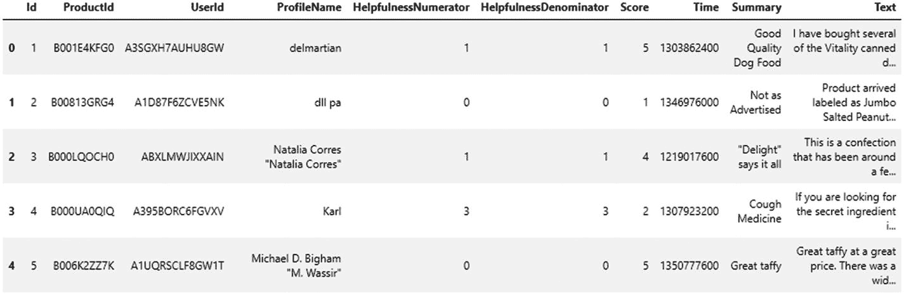

图 5-3

一个 CSV 文件

```
import pandas as pd
food_review = pd.read_csv("Reviews.csv")
food_review.head()
```

可以看出，CSV 包含 ProductID、UserID、产品评分、时间、摘要和评论文本等列。该文件包含近 50 万条针对各种产品的评论。让我们抽取一些评论进行处理。

#### 抽样

使用 pandas 数据框中的`sample`函数，我们随机选取 1000 条评论的文本，并打印前几行（见图 5-4）：

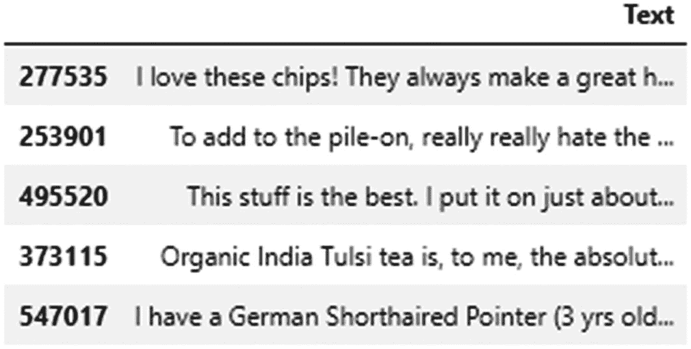

图 5-4

样本

```
food_review_text = pd.DataFrame(food_review["Text"])
food_review_text_1k = food_review_text.sample(n= 1000,random_state = 123)
food_review_text_1k.head()
```

#### 使用 NLTK 进行分词

如前所述，NLTK 提供了许多处理文本数据的功能。处理文本数据的第一步是将句子分割成单个单词。这个过程称为分词。我们将使用 NLTK 的`word_tokenize`函数，在我们上面创建的`food_review_text_1k`数据框中创建一个新列，并打印前六行以查看分词结果（图 5-5）：

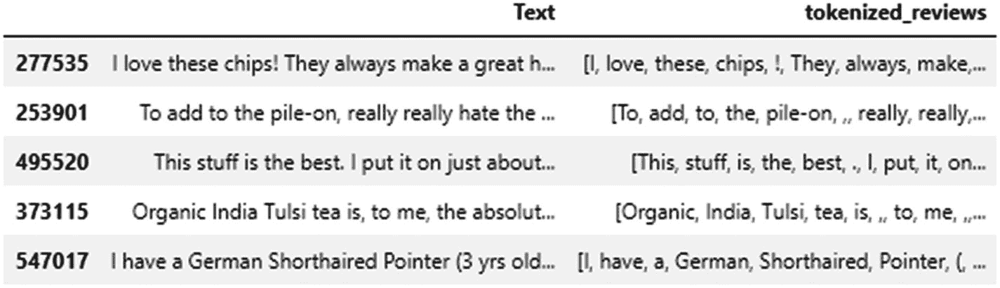

图 5-5

前几行

```
food_review_text_1k['tokenized_reviews'] = food_review_text_1k['Text'].apply(nltk.word_tokenize)
food_review_text_1k.head()
```

### 使用正则表达式搜索单词

现在我们已经获得了每条评论的分词文本，让我们取数据框中的第一行，并使用正则表达式搜索特定单词。该正则表达式搜索任何以**c**为首字符、以**i**为第三字符的单词。我们可以针对感兴趣的模式编写各种正则表达式搜索。这里使用`re.search()`函数执行搜索：

```
#搜索：所有以 c 为首字母、i 为第三字母的五字母单词
search_word = set([w for w in food_review_text_1k['tokenized_reviews'].iloc[0] if re.search('^c.i..$', w)])
print(search_word)
{'chips'}
```

### 使用精确单词搜索

另一种搜索单词的方法是使用精确匹配。这可以通过 pandas 中的`str.contains()`函数实现。在以下示例中，我们在所有评论中搜索单词“great”。包含该单词的评论行将被检索出来。这些评论可以被视为正面评价。见图 5-6。

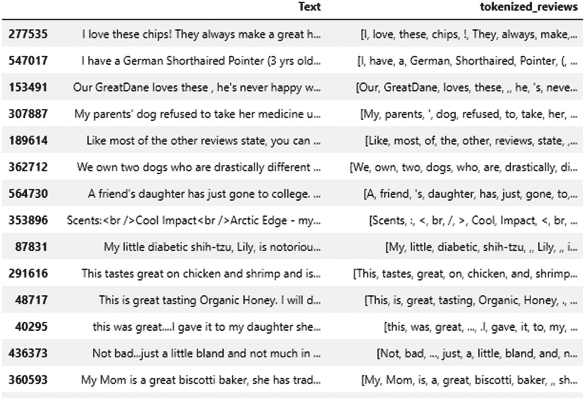

图 5-6

包含特定单词的样本

```
#在评论中搜索单词"great"
food_review_text_1k[food_review_text_1k['Text'].str.contains('great')]
```

### NLTK

在本节中，我们将使用 NLTK 的许多功能进行自然语言处理，例如规范化、名词短语分块、命名实体识别和文档分类器。

#### 使用 NLTK 进行规范化

在许多自然语言任务中，我们经常处理单词的词根形式。例如，对于单词“baking”和“baked”，其词根是“bake”。这种提取词根的过程称为词干提取或规范化。NLTK 提供了两个实现词干提取算法的函数。第一个是 Porter 词干提取算法，第二个是 Lancaster 词干提取器。

两种算法输出的质量略有差异。例如，在以下示例中，Porter 词干提取器将单词“sustenance”转换为“sustain”，而 Lancaster 词干提取器输出“sust”。

```
words = set(food_review_text_1k['tokenized_reviews'].iloc[0])
print(words)
porter = nltk.PorterStemmer()
print([porter.stem(w) for w in words])
处理前
{'when', 'always', 'great', 'vending', 'for', 'make', "'m", 'just', 'I', '.', 'love', 'a', 'They', 'with', 'healthy', 'these', 'snack', 'the', 'at', 'work', 'chips', 'machine', 'stuck', 'sustenance', '!'}
处理后
['when', 'alway', 'great', 'vend', 'for', 'make', "'m", 'just', 'I', '.', 'love', 'a', 'they', 'with', 'healthi', 'these', 'snack', 'the', 'at', 'work', 'chip', 'machin', 'stuck', 'susten', '!']
lancaster = nltk.LancasterStemmer()
print([lancaster.stem(w) for w in words])
['when', 'alway', 'gre', 'vend', 'for', 'mak', "'m", 'just', 'i', '.', 'lov', 'a', 'they', 'with', 'healthy', 'thes', 'snack', 'the', 'at', 'work', 'chip', 'machin', 'stuck', 'sust', '!']
```


#### 使用正则表达式进行名词短语分块

在上述内容中，你将词元视为任何自然语言处理中的基本单元。由于在自然语言中，一组词元的组合往往能揭示含义或代表一个概念，因此我们创建了语块。通过一种称为分块的过程进行分割，从而生成多词元序列。在图 5-7 中，较小的方框表示单词级词元化，较大的方框表示多词元序列，也称为高级语块。此类语块是使用正则表达式或 n-gram 方法（后续章节将详细介绍）创建的。分块对于实体识别至关重要，我们稍后将探讨这一点。

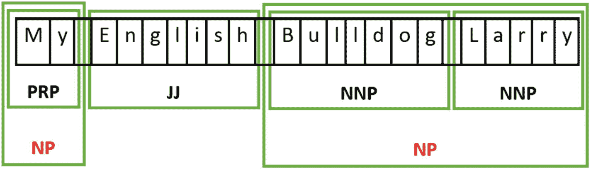

图 5-7

词元与语块

让我们考虑如下代码所示的一条评论。该语法使用一条规则来查找名词，该规则规定：*查找名词语块，其中零个或一个（?）限定词（DT）后跟任意数量（*）的形容词（JJ）和一个名词（NN）*。在以下代码输出中显示的词性标注树中，所有标记为 NP 的语块都是名词短语：

```
import nltk
from nltk.tokenize import word_tokenize
#名词短语分块
text = word_tokenize("My English Bulldog Larry had skin allergies the summer we got him at age 3, I'm so glad that now I can buy his food from Amazon")
#此语法规则：当可选的限定词（DT）后跟任意数量的形容词（JJ）和一个名词（NN）时，查找 NP 语块
grammar = "NP: {<DT>?<JJ>*<NN>}"
#使用上述语法的正则表达式解析器
cp = nltk.RegexpParser(grammar)
#带有词性标注的解析文本
review_chunking_out = cp.parse(nltk.pos_tag(text))
#打印解析后的文本
print(review_chunking_out)
(S
My/PRP$
English/JJ
Bulldog/NNP
Larry/NNP
had/VBD
skin/VBN
allergies/NNS
(NP the/DT summer/NN)
we/PRP
got/VBD
him/PRP
at/IN
(NP age/NN)
3/CD
,/,
I/PRP
'm/VBP
so/RB
glad/JJ
that/IN
now/RB
I/PRP
can/MD
buy/VB
his/PRP$
(NP food/NN)
from/IN
Amazon/NNP)
```

你可以看到许多 NP，例如“the summer”和“age”，其中“the summer”不是一个单词词元。上面你看到词性标注是以树形结构呈现的。另一种表示语块结构的方法是使用标签。IOB 标签表示法是一种通用标准。在这种方案中，每个词元被表示为 I（内部）、O（外部）和 B（开始）。语块标签 B 表示一个语块的开始。语块内的后续词元被标记为 I，所有其他词元被标记为 O。图 5-8 提供了一个 IOB 标签表示法的示例。

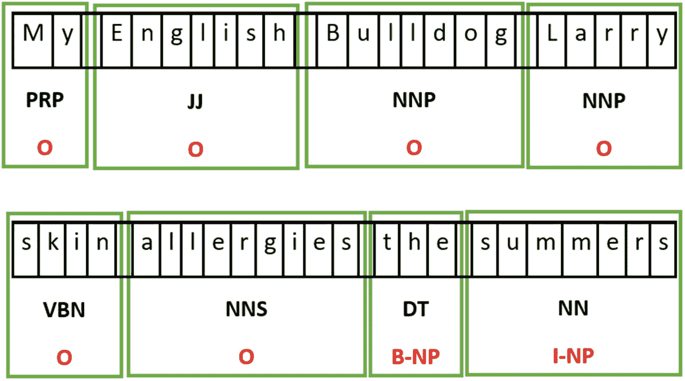

图 5-8

语块结构的 IOB 标签表示法

以下代码使用 CoNLL 2000 语料库，通过函数 `tree2conlltags()` 将树转换为标签。CoNLL 是使用 IOB 符号进行标注和分块的*华尔街日报*文本。

```
from nltk.chunk import conlltags2tree, tree2conlltags
from pprint import pprint
#打印 IOB 标签
review_chunking_out_IOB = tree2conlltags(review_chunking_out)
pprint(review_chunking_out_IOB)
[('My', 'PRP$', 'O'),
('English', 'JJ', 'O'),
('Bulldog', 'NNP', 'O'),
('Larry', 'NNP', 'O'),
('had', 'VBD', 'O'),
('skin', 'VBN', 'O'),
('allergies', 'NNS', 'O'),
('the', 'DT', 'B-NP'),
('summer', 'NN', 'I-NP'),
('we', 'PRP', 'O'),
('got', 'VBD', 'O'),
('him', 'PRP', 'O'),
('at', 'IN', 'O'),
('age', 'NN', 'B-NP'),
('3', 'CD', 'O'),
(',', ',', 'O'),
('I', 'PRP', 'O'),
("'m", 'VBP', 'O'),
('so', 'RB', 'O'),
('glad', 'JJ', 'O'),
('that', 'IN', 'O'),
('now', 'RB', 'O'),
('I', 'PRP', 'O'),
('can', 'MD', 'O'),
('buy', 'VB', 'O'),
('his', 'PRP$', 'O'),
('food', 'NN', 'B-NP'),
('from', 'IN', 'O'),
('Amazon', 'NNP', 'O')]
```

#### 命名实体识别

一旦我们获得了文本的词性标注，就可以提取命名实体。命名实体是指特定个体的明确名词短语，例如 ORGANIZATION 和 PERSON。其他一些实体包括 LOCATION、DATE、TIME、MONEY、PERCENT、FACILITY 和 GPE。设施是指建筑和土木工程领域中任何人造物品，例如泰姬陵或帝国大厦。GPE 指地缘政治实体，例如城市、州和国家。我们可以使用 nltk 库中的 `ne_chunk()` 方法提取所有这些实体。

以下代码使用经过词性标注的句子，并对其应用 `ne_chunk()` 方法。它将 *Amazon* 识别为 GPE，将 *Bulldog Larry* 识别为 PERSON。在这种情况下，结果既有正确也有错误。Amazon 被识别为 ORGANIZATION，这是我们在此处期望的。在本章后面，我们将训练自己的命名实体识别器以提高性能。

```
tagged_review_sent = nltk.pos_tag(text)
print(nltk.ne_chunk(tagged_review_sent))
(S
My/PRP$
English/JJ
(PERSON Bulldog/NNP Larry/NNP)
had/VBD
skin/VBN
allergies/NNS
the/DT
summer/NN
we/PRP
got/VBD
him/PRP
at/IN
age/NN
3/CD
,/,
I/PRP
'm/VBP
so/RB
glad/JJ
that/IN
now/RB
I/PRP
can/MD
buy/VB
his/PRP$
food/NN
from/IN
(GPE Amazon/NNP))
```

### spaCy

虽然 spaCy 提供了 NLTK 的所有功能，但它被认为是 NLP 任务中最好的生产级工具之一。在本节中，我们将了解如何使用 spaCy 库在 Python 中提供的各种方法。

spaCy 提供了三个核心模型：en_core_web_sm（10MB）、en_core_web_md（91MB）和 en_core_web_lg（788MB）。较大的模型在更大的词汇表上训练，因此会提供更高的准确性。因此，根据你的用例，明智地选择适合你需求的模型。

#### 词性标注

使用 `spaCy.load()` 加载模型后，你可以将任何字符串传递给该模型，它会一次性提供所有方法。为了提取词性，使用了 `pos_method`。在以下代码中，分词后，我们打印以下内容：

*   `text`：原始文本
*   `lemma`：词干提取后的词元，即单词的基本形式
*   `pos`：词性
*   `tag`：带有详细信息的词性标注
*   `dep`：词元之间的关系。也称为句法依赖关系。
*   `shape`：单词的形状（即大小写、标点、数字）
*   `is_alpha`：如果词元是字母数字字符，则返回 True
*   `is.stop`：如果词元是停用词（如“at”、“so”等），则返回 True

```
# 词性标注
import spacy
nlp = spacy.load('en_core_web_sm')
doc = nlp(u"My English Bulldog Larry had skin allergies the summer we got him at age 3, I'm so glad that now I can buy his food from Amazon")
for token in doc:
print(token.text, token.lemma_, token.pos_, token.tag_, token.dep_, token.shape_, token.is_alpha, token.is_stop)
My -PRON- DET PRP$ poss Xx True True
English English PROPN NNP compound Xxxxx True False
Bulldog Bulldog PROPN NNP nsubj Xxxxx True False
Larry Larry PROPN NNP nsubj Xxxxx True False
had have VERB VBD ccomp xxx True True
skin skin NOUN NN compound xxxx True False
allergies allergy NOUN NNS dobj xxxx True False
the the DET DT det xxx True True
summer summer NOUN NN npadvmod xxxx True False
we -PRON- PRON PRP nsubj xx True True
got get VERB VBD relcl xxx True False
him -PRON- PRON PRP dobj xxx True True
at at ADP IN prep xx True True
age age NOUN NN pobj xxx True False
3 3 NUM CD nummod d False False
, , PUNCT, punct, False False
I -PRON- PRON PRP nsubj X True True
'm be VERB VBP ROOT 'x False True
so so ADV RB advmod xx True True
glad glad ADJ JJ acomp xxxx True False
that that ADP IN mark xxxx True True
now now ADV RB advmod xxx True True
I -PRON- PRON PRP nsubj X True True
can can VERB MD aux xxx True True
buy buy VERB VB ccomp xxx True False
his -PRON- DET PRP$ poss xxx True True
food food NOUN NN dobj xxxx True False
from from ADP IN prep xxxx True True
Amazon Amazon PROPN NNP pobj Xxxxx True False
```


#### 依存句法分析

spaCy 的依存句法分析器拥有丰富的 API，有助于在依存句法树中导航。它还提供了检测句子边界以及遍历名词短语或语块的功能。在下面的示例中，模型中的 `noun_chunks` 方法是可迭代的，并支持以下方法：

*   `text`：原始名词语块
*   `root.text`：将名词语块与解析中其余部分连接起来的原始单词
*   `root.dep`：将根节点与其中心词连接起来的依存关系
*   `root.head`：根词元的中心词

从示例中可以看出，**“My English Bulldog”** 是一个名词短语，其中 “**Bulldog**” 是根文本，具有 **“nsubj”** 关系，并且 **“had”** 是其根中心词。

```
#Dependency parse
import spacy
nlp = spacy.load("en_core_web_sm")
doc = nlp(u"My English Bulldog Larry had skin allergies the summer we got him at age 3, I'm so glad that now I can buy his food from Amazon")
for chunk in doc.noun_chunks:
print(chunk.text, chunk.root.text, chunk.root.dep_,
chunk.root.head.text)
My English Bulldog Bulldog nsubj had
Larry Larry nsubj had
skin allergies allergies dobj had
we we nsubj got
him him dobj got
age age pobj at
I I nsubj 'm
I I nsubj buy
his food food dobj buy
Amazon Amazon pobj from
```

#### 依存句法树

spaCy 提供了一个名为 `displayCy` 的可视化方法。我们可以使用 displaCy 绘制给定句子的依存句法树（见图 5-9、5-10 和 5-11）。

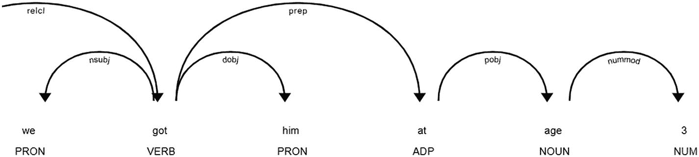

图 5-11

依存句法树，第 3 部分

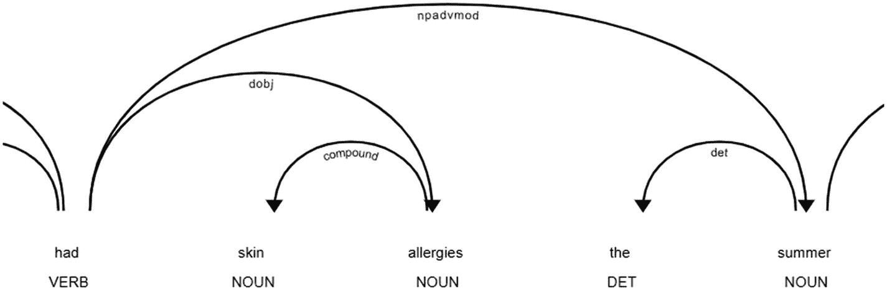

图 5-10

依存句法树，第 2 部分

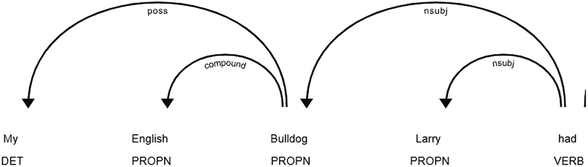

图 5-9

依存句法树，第 1 部分

```
import spacy
from spacy import displacy
nlp = spacy.load("en_core_web_sm")
doc = nlp(u"My English Bulldog Larry had skin allergies the summer we got him at age 3")
displacy.render(doc, style="dep")
```

从依存句法树中，你可以看到有两对复合词：“English Bulldog” 和 “skin allergies”，以及 NUM **“3”** 是 **“age”** 的修饰语。你还可以看到名词短语 “summer” 作为词元 “had” 的状语修饰语 (npadvmod)。你还可以观察到动词短语的许多直接宾语 (dobj)，它们都是名词短语，例如 (got, him) 和 (had, allergies)，以及介词的宾语 (pobj)，例如 (at, age)。关于依存句法树中关系的详细解释，可以在这里找到：[`https://nlp.stanford.edu/software/dependencies_manual.pdf`](https://nlp.stanford.edu/software/dependencies_manual.pdf)。

#### 组块分析

spaCy 提供了一种易于使用的方法，可以从给定文本中检索组块信息，例如 VERB 和 NOUN。`noun_chunks` 方法提供名词短语，通过词性 (pos)，我们可以搜索 VERB。以下代码从组块中提取名词短语和动词：

```
# pip install spacy
# python -m spacy download en_core_web_sm
import spacy
# 加载英文分词器、词性标注器、句法分析器、命名实体识别和词向量
nlp = spacy.load("en_core_web_sm")
# 处理整个文档
text = ("My English Bulldog Larry had skin allergies the summer we got him at age 3, I'm so glad that now I can buy his food from Amazon")
doc = nlp(text)
# 分析句法
print("名词短语:", [chunk.text for chunk in doc.noun_chunks])
print("动词:", [token.lemma_ for token in doc if token.pos_ == "VERB"])
名词短语: ['My English Bulldog', 'Larry', 'skin allergies', 'we', 'him', 'age', 'I', 'I', 'his food', 'Amazon']
动词: ['have', 'get', 'be', 'can', 'buy']
```

#### 命名实体识别

spaCy 在命名实体识别 (NER) 任务中的准确率达到 85.85%。`en_core_web_sm` 模型提供了 *ents*** 函数，该函数可以获取实体。该模型在 OntoNotes 数据集上训练，该数据集可以在 [`https://catalog.ldc.upenn.edu/LDC2013T19`](https://catalog.ldc.upenn.edu/LDC2013T19) 找到。

spaCy 中的默认模型提供了表 5-3 中所示的实体。

表 5-3

类型

| 类型 | 描述 |
| --- | --- |
| PERSON | 人名，包括虚构角色 |
| NORP | 国籍或宗教、政治团体 |
| FAC | 土木工程结构或基础设施，如建筑物、机场、高速公路、桥梁等 |
| ORG | 组织名称，如公司、机构、研究所等 |
| GPE | 地缘政治实体，如国家、城市、州 |
| LOC | 非 GPE 的地点，如山脉、水域 |
| PRODUCT | 物体、车辆、食物等（非服务） |
| EVENT | 命名的飓风、战役、战争、体育赛事等 |
| WORK_OF_ART | 书籍、歌曲等的标题 |
| LAW | 已制定为法律的命名文件 |
| LANGUAGE | 任何命名的语言 |
| DATE | 绝对或相对日期或时间段 |
| TIME | 小于一天的时间 |
| PERCENT | 百分比，包括 % |
| MONEY | 货币价值，包括单位 |
| QUANTITY | 度量，如重量或距离 |
| ORDINAL | “第一”、“第二”等 |
| CARDINAL | 不属于其他类型的数字 |

以下代码将 “English Bulldog Larry” 提取为 PERSON 实体，将 “Amazon” 提取为 ORG 实体。与 NLTK 将 Amazon 识别为 GPE 不同，spaCy 能正确理解句子的上下文，从而判断出 Amazon 在给定句子中是一个组织。

```
import spacy
# 加载英文分词器、词性标注器、句法分析器、命名实体识别和词向量
nlp = spacy.load("en_core_web_sm")
# 处理整个文档
text = ("My English Bulldog Larry had skin allergies the summer we got him at age 3, I'm so glad that now I can buy his food from Amazon")
doc = nlp(text)
# 查找命名实体
for entity in doc.ents:
print(entity.text, entity.label_)
English Bulldog Larry PERSON
Amazon ORG
```

我们还可以使用 `displacy` 方法可视化实体（如图 5-12 所示）：


图 5-12

结果

```
import spacy
from spacy import displacy
from pathlib import Path
text = "I found these crisps at our local WalMart & figured I would give them a try. They were so yummy I may never go back to regular chips, not that I was a big chip fan anyway. The only problem is I can eat the entire bag in one sitting. I give these crisps a big thumbs up!"
nlp = spacy.load("en_core_web_sm")
doc = nlp(text)
svg = displacy.serve(doc, style="ent")
output_path = Path("images/sentence_ne.svg")
output_path.open("w", encoding="utf-8").write(svg)
```


#### 基于模式的搜索

spaCy 也提供基于模式或规则的搜索。我们可以在 `LOWER` 等函数的基础上定义模式。例如，在下面的代码中，我们定义了一个搜索范围，即小写的“Walmart”后跟一个标点符号。这个模式可以写成：

```
pattern = [{"LOWER": "walmart"}, {"IS_PUNCT": True}]
```

在搜索范围内，如果我们想找到单词“Walmart”，我们使用 `matcher.add` 方法来定义，并将 `pattern` 作为参数传递给该方法。

这种语法比难以理解的繁琐正则表达式更友好。搜索结果显示了单词“Walmart”在字符串中的第七个位置开始，并在第九个位置结束。输出还显示了我们在模式中定义的跨度文本为“Walmart &”。

```
# Spacy - 基于规则的匹配
import spacy
from spacy.matcher import Matcher
nlp = spacy.load("en_core_web_sm")
matcher = Matcher(nlp.vocab)
# 将文本转换为小写后搜索 Walmart
pattern = [{"LOWER": "walmart"}, {"IS_PUNCT": True}]
matcher.add("Walmart", None, pattern)
doc = nlp(u"I found these crisps at our local WalMart & figured I would give them a try. They were so yummy I may never go back to regular chips, not that I was a big chip fan anyway. The only problem is I can eat the entire bag in one sitting. I give these crisps a big thumbs up!")
matches = matcher(doc)
for match_id, start, end in matches:
string_id = nlp.vocab.strings[match_id]  # 获取字符串表示
span = doc[start:end]  # 匹配的跨度
print(match_id, string_id, start, end, span.text)
16399848736434528297 Walmart 7 9 WalMart &
```

#### 搜索实体

使用匹配器方法，我们还可以在给定文本中搜索特定类型的实体。在下面的代码中，我们搜索名为“walmart”的实体 ORG（由“label”定义）。

```
from spacy.lang.en import English
from spacy.pipeline import EntityRuler
nlp = English()
ruler = EntityRuler(nlp)
patterns = [{"label": "ORG","pattern":[{"lower":"walmart"}]}]
ruler.add_patterns(patterns)
nlp.add_pipe(ruler)
doc = nlp(u"I found these crisps at our local WalMart & figured I would give them a try. They were so yummy I may never go back to regular chips, not that I was a big chip fan anyway. The only problem is I can eat the entire bag in one sitting. I give these crisps a big thumbs up!")
print([(ent.text, ent.label_) for ent in doc.ents])
[('WalMart', 'ORG')]
```

#### 训练自定义 NLP 模型

在许多现实世界的数据集中，实体检测并不符合预期。spaCy 或 NLTK 中的模型并未针对这些单词或标记进行训练。在这种情况下，我们可以使用私有数据集训练自定义模型。我们必须以特定格式创建训练数据。在下面的代码中，我们选取两个句子，并在文本中标记一个实体 PRODUCT 及其起始和结束位置。语法如下所示：

```
(
u"As soon as I tasted one and it tasted like a corn chip I checked the ingredients. ",
{
"entities": [(45, 49, "PRODUCT")]
}
)
```

我们在两个句子中标记了食品“corn”。这里我们只用了两个句子，spaCy 就能很好地训练模型。如果使用较小的数据集没有得到正确的实体，你可能需要添加更多示例，直到模型能够识别正确的实体。

```
import spacy
import random
train_data = [
(u"As soon as I tasted one and it tasted like a corn chip I checked the ingredients. ", {"entities": [(45, 49, "PRODUCT")]}),
(u"I found these crisps at our local WalMart & figured I would give them a try", {"entities": [(14, 20, "PRODUCT")]})
]
other_pipes = [pipe for pipe in nlp.pipe_names if pipe != "ner"]
with nlp.disable_pipes(*other_pipes):
optimizer = nlp.begin_training()
for i in range(10):
random.shuffle(train_data)
for text, annotations in train_data:
nlp.update([text], [annotations], sgd=optimizer)
nlp.to_disk("model/food_model")
```

我们将训练好的模型保存到磁盘，并将其命名为 `food_model`。在下面的代码中，我们从磁盘加载 `food_model`，并尝试在测试句子上预测实体。我们看到它在将“corn”识别为 PRODUCT 实体方面做得很好。

```
import spacy
nlp = spacy.load("model/food_model")
text = nlp("I consume about a jar every two weeks of this, either adding it to fajitas or using it as a corn chip dip")
for entity in text.ents:
print(entity.text, entity.label_)
corn PRODUCT
```

### CoreNLP

CoreNLP 是另一个流行的语言分析工具包，用于词性标注、依存句法树、命名实体识别、情感分析等。我们将通过一个名为 Stanford-corenlp 的第三方封装器从 Python 中使用 CoreNLP 功能。它可以通过命令行使用 `pip install` 安装，或者从 GitHub 克隆：[`https://github.com/Lynten/stanford-corenlp`](https://github.com/Lynten/stanford-corenlp)。

安装或下载代码后，你需要指定 Stanford-corenlp 代码的路径，以便它为各种 NLP 任务获取必要的模型。

#### 分词

与 NLTK 和 spaCy 一样，你可以提取单词或标记。该模型提供了一个名为 `word_tokenize` 的方法来执行分词：

```
# 简单用法
from stanfordcorenlp import StanfordCoreNLP
nlp = StanfordCoreNLP()
sentence = 'I consume about a jar every two weeks of this, either adding it to fajitas or using it as a corn chip dip'
print('Tokenize:', nlp.word_tokenize(sentence))
Tokenize: ['I', 'consume', 'about', 'a', 'jar', 'every', 'two', 'weeks', 'of', 'this', ',', 'either', 'adding', 'it', 'to', 'fajitas', 'or', 'using', 'it', 'as', 'a', 'corn', 'chip', 'dip']
```

#### 词性标注

可以使用 stanford-corenlp 中的 `pos_tag` 方法提取词性：

```
print('Part of Speech:', nlp.pos_tag(sentence))
Part of Speech: [('I', 'PRP'), ('consume', 'VBP'), ('about', 'IN'), ('a', 'DT'), ('jar', 'NN'), ('every', 'DT'), ('two', 'CD'), ('weeks', 'NNS'), ('of', 'IN'), ('this', 'DT'), (',', ','), ('either', 'CC'), ('adding', 'VBG'), ('it', 'PRP'), ('to', 'TO'), ('fajitas', 'NNS'), ('or', 'CC'), ('using', 'VBG'), ('it', 'PRP'), ('as', 'IN'), ('a', 'DT'), ('corn', 'NN'), ('chip', 'NN'), ('dip', 'NN')]
```

#### 命名实体识别

Stanford-corenlp 提供了 `ner` 方法来提取命名实体。注意，默认输出是 IOB（内部、外部和开始）格式。

```
print('Named Entities:', nlp.ner(sentence))
Named Entities: [('I', 'O'), ('consume', 'O'), ('about', 'O'), ('a', 'O'), ('jar', 'O'), ('every', 'SET'), ('two', 'SET'), ('weeks', 'SET'), ('of', 'O'), ('this', 'O'), (',', 'O'), ('either', 'O'), ('adding', 'O'), ('it', 'O'), ('to', 'O'), ('fajitas', 'O'), ('or', 'O'), ('using', 'O'), ('it', 'O'), ('as', 'O'), ('a', 'O'), ('corn', 'O'), ('chip', 'O'), ('dip', 'O')]
```

#### 成分句法分析

成分句法分析从给定句子中提取基于成分的句法树，该树根据短语结构语法表示句法结构。参见图 5-13 的简单示例。

```
print('Constituency Parsing:', nlp.parse(sentence))
Constituency Parsing: (ROOT
(S
(NP (PRP I))
(VP (VBP consume)
(PP (IN about)
(NP (DT a) (NN jar)))
(NP
(NP (DT every) (CD two) (NNS weeks))
(PP (IN of)
(NP (DT this))))
(, ,)
(S
(VP (CC either)
(VP (VBG adding)
(NP (PRP it))
(PP (TO to)
(NP (NNS fajitas))))
(CC or)
(VP (VBG using)
(NP (PRP it))
(PP (IN as)
(NP (DT a) (NN corn) (NN chip) (NN dip)))))))))
```

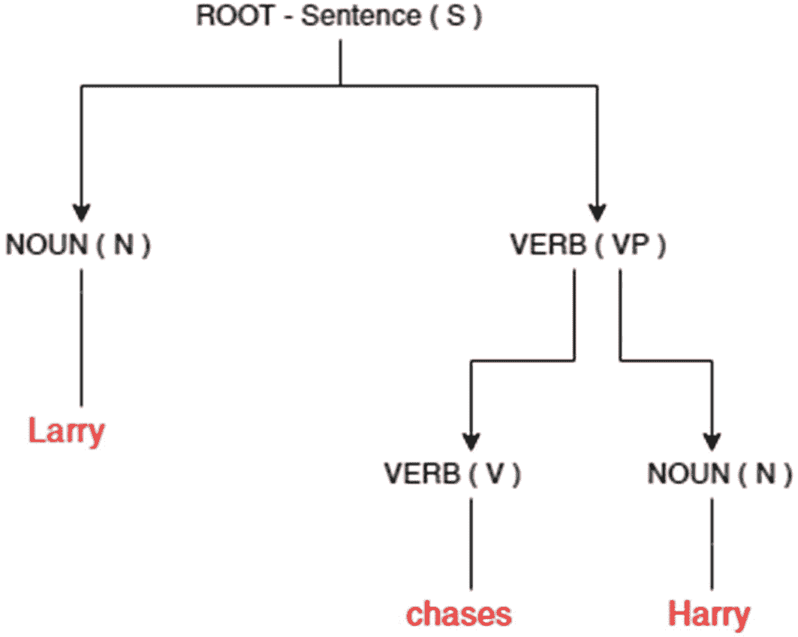

图 5-13

成分句法分析的一个简单示例


#### 依存句法分析

依存句法分析旨在提取句子的句法结构。它展示了给定句子中词语之间存在的有向二元语法关系集合。在 spaCy 的依存树中，我们展示了其可视化表示。

```
print('Dependency Parsing:', nlp.dependency_parse(sentence))
Dependency Parsing: [('ROOT', 0, 2), ('nsubj', 2, 1), ('case', 5, 3), ('det', 5, 4), ('nmod', 2, 5), ('det', 8, 6), ('nummod', 8, 7), ('nmod:tmod', 2, 8), ('case', 10, 9), ('nmod', 8, 10), ('punct', 2, 11), ('cc:preconj', 13, 12), ('dep', 2, 13), ('dobj', 13, 14), ('case', 16, 15), ('nmod', 13, 16), ('cc', 13, 17), ('conj', 13, 18), ('dobj', 18, 19), ('case', 24, 20), ('det', 24, 21), ('compound', 24, 22), ('compound', 24, 23), ('nmod', 18, 24)]
```

由于 Stanford-corenlp 是一个基于 Java 实现的 Python 封装库，你应在处理完成后关闭服务器。否则，Java 虚拟内存（JVM）堆将被持续占用，从而影响你机器上的其他进程。

```
nlp.close() # 关闭服务器，否则会消耗大量内存。
```

### TextBlob

TextBlob 是一个适合 NLP 初学者的简单库。尽管它提供了一些高级功能（如机器翻译），但这些功能是通过 Google API 实现的。它主要用于初步了解 NLP 的用例以及在通用数据集上的应用。对于更复杂的应用，请考虑使用 spaCy 或 CoreNLP。

#### 词性标注与名词短语

与其他库类似，TextBlob 提供了 `tags` 方法来提取给定句子中的词性。它还提供了 `noun_phrase` 方法。

```
#首先，导入
from textblob import TextBlob
#创建我们的第一个 TextBlob
s_text = TextBlob("Building Enterprise Chatbot that can converse like humans")
#可以通过 tags 属性访问词性标注
s_text.tags
[('Building', 'VBG'),
('Enterprise', 'NNP'),
('Chatbot', 'NNP'),
('that', 'WDT'),
('can', 'MD'),
('converse', 'VB'),
('like', 'IN'),
('humans', 'NNS')]
#类似地，可以通过 noun_phrases 属性访问名词短语
s_text.noun_phrases
WordList(['enterprise chatbot'])
```

#### 拼写纠正

拼写纠正是 TextBlob 的一个令人兴奋的特性，本章描述的其他库并未提供此功能。其实现基于 Peter Norvig 提供的一种简单技术，准确率仅为 70%。TextBlob 中的 `correct` 方法提供了此实现。

在以下代码中，单词 “converse” 被错误拼写为 “converce”，`correct` 方法能够正确识别。然而，它在将单词 “Chatbot” 改为 “Whatnot” 时犯了错误。

```
# 拼写纠正
# 使用 correct() 方法尝试拼写纠正。
# 拼写纠正基于 Peter Norvig 的《如何编写拼写纠正器》，该算法在 pattern 库中实现，准确率约为 70%。
b = TextBlob("Building Enterprise Chatbot that can converce like humans. The future for chatbot looks great!")
print(b.correct())
Building Enterprise Whatnot that can converse like humans. The future for charcot looks excellent!
```

#### 机器翻译

以下代码展示了一个将文本从英语翻译成法语的简单示例。`translates` 方法调用了 Google 翻译 API，该方法接收一个参数 “to”，用于指定目标翻译语言。此实现并无新奇之处，只是一个简单的 API 调用。

```
#翻译与语言检测
# Google 翻译 API 为语言翻译和检测提供支持。
en_blob = TextBlob(u'Building Enterprise Chatbot that can converse like humans. The future for chatbot looks great!')
en_blob.translate(to='fr')
TextBlob("Construire un chatbot d'entreprise capable de converser comme un humain. L'avenir de chatbot est magnifique!")
```

### 多语言文本处理

在本节中，我们将探讨处理英语以外其他语言的各种库及其能力。我们发现 spaCy 库在支持的语言数量方面表现最佳，目前支持超过 50 种语言。我们将尝试对来自法国知名新闻网站 [`www.lemonde.fr/`](http://www.lemonde.fr/) 的文本进行语言翻译、词性标注、实体提取和依存句法分析。

#### 用于翻译的 TextBlob

如上例所示，我们使用 TextBlob 进行机器翻译，以便非法语读者能够理解我们处理的文本。

文本的英文翻译显示，这条新闻是关于周五在罗兰·加洛斯举行的两位法国网球选手帕尔和马胡之间的比赛。

```
from textblob import TextBlob
#来自法国新闻网站的一条新闻简报：https://www.lemonde.fr/
fr_blob = TextBlob(u"Des nouveaux matchs de Paire et Mahut au retour du service à la cuillère, tout ce qu'il ne faut pas rater à Roland-Garros, sur les courts ou en dehors, ce vendredi.")
fr_blob.translate(to='en')
TextBlob("New matches of Paire and Mahut after the return of the service with the spoon, all that one should not miss Roland-Garros, on the courts or outside, this Friday.")
```

#### 词性标注与依存关系

我们使用 spaCy 的 `fr_core_news_sm` 模型来提取给定文本的词性标注和依存关系。要下载该模型，请在命令行中输入：

```
python -m spacy download fr_core_news_sm
```

```
import spacy
#下载：python -m spacy download fr_core_news_sm
nlp = spacy.load('fr_core_news_sm')
french_text = nlp("Des nouveaux matchs de Paire et Mahut au retour du service à la cuillère, tout ce qu'il ne faut pas rater à Roland-Garros, sur les courts ou en dehors, ce vendredi.")
for token in french_text:
print(token.text, token.pos_, token.dep_)
Des DET det
nouveaux ADJ amod
matchs ADJ nsubj
de ADP case
Paire ADJ nmod
et CCONJ cc
Mahut PROPN conj
au CCONJ punct
retour NOUN ROOT
du DET det
service NOUN obj
à ADP case
la DET det
cuillère NOUN obl
, PUNCT punct
tout ADJ advmod
ce PRON fixed
qu' PRON mark
il PRON nsubj
ne ADV advmod
faut VERB advcl
pas ADV advmod
rater VERB xcomp
à ADP case
Roland PROPN obl
- PUNCT punct
Garros PROPN conj
, PUNCT punct
sur ADP case
les DET det
courts NOUN obl
ou CCONJ cc
en ADP case
dehors ADP conj
, PUNCT punct
ce DET det
vendredi NOUN obl
. PUNCT punct
```

它在法语词性标注和依存关系方面的表现非常准确。它能够识别几乎所有动词、名词、形容词、专有名词以及许多其他标签。接下来，让我们看看它在实体识别任务上的表现。

#### 命名实体识别

检索命名实体识别的语法保持不变。我们在此看到，模型将 Paire、Mahur、Roland 和 Garros 识别为人物实体。我们期望模型给出事件实体，因为罗兰·加洛斯是一项网球锦标赛，属于体育赛事。或许你可以考虑训练一个自定义模型来提取这个实体。

```
# 查找命名实体、短语和概念
for entity in french_text.ents:
print(entity.text, entity.label_)
Paire PER
Mahut PER
Roland PER
Garros PER
```

#### 名词短语

可以使用 spaCy 库中法语模型提供的 `noun_chunks` 方法提取名词块：

```
for fr_chunk in french_text.noun_chunks:
print(fr_chunk.text, fr_chunk.root.text, fr_chunk.root.dep_,
fr_chunk.root.head.text)
et Mahut Mahut conj matchs
du service service obj retour
il il nsubj faut
```


## 自然语言理解

近年来，工业界和学术界都对自然语言理解表现出了极大的兴趣。这导致了大量文献和工具的出现。NLU 的一些主要应用包括：

*   问答系统
*   自然语言搜索
*   网络级关系抽取
*   情感分析
*   文本摘要
*   法律发现

上述应用主要可以归纳为四个主题：

*   **关系抽取**：寻找实例与数据库元组之间的关系。输出结果为离散值。
*   **语义解析**：解析句子以生成文本理解的逻辑形式，这是人类所擅长的。同样，此处的输出也是离散值。
*   **情感分析**：分析句子，在连续值范围内给出一个分数。低分表示轻微负面情绪，高分表示正面情绪。
*   **向量空间模型**：将单词表示为向量，这有助于寻找相似单词和上下文含义。

在本节中，我们将探讨上述部分应用。

### 情感分析

TextBlob 提供了一个易于使用的情感分析实现。`sentiment` 方法将句子作为输入，并输出两个结果：极性（polarity）和主观性（subjectivity）。

#### 极性

一个在 [-1.0, 1.0] 范围内的浮点值。该评分使用一个包含正面、负面和中性词汇的语料库（称为极性），并检测单词是否属于这三个类别中的任何一个。在一个简单的例子中，正面词汇得分为 1，负面词汇得分为 -1，中性词汇得分为 0。我们将句子的极性定义为平均得分，即每个单词得分之和除以句子中的总单词数。

如果该值小于 0，则句子情感为负面；如果大于 0，则为正面；否则为中性。

#### 主观性

一个在 [0.0, 1.0] 范围内的浮点值。完美得分 1 表示“非常主观”。与揭示句子情感的极性不同，主观性不表达任何情感。如果句子包含个人观点或信念，得分趋向于 1。整个句子的最终得分是通过为每个单词分配主观性得分并计算平均值得到的，方法与极性相同。

TextBlob 库内部调用 pattern 库来计算句子的极性和主观性。pattern 库使用 [SentiWordNet](http://sentiwordnet.isti.cnr.it/)，这是一个用于意见挖掘的词汇资源，包含了所有 WordNet 同义词集的极性和主观性得分。以下是 SentiWordNet 的链接：[`https://github.com/aesuli/sentiwordnet`](https://github.com/aesuli/sentiwordnet) 。

在下面的例子中，句子的极性为 0.5，表示“更正面”，主观性为 0.4375，表示“非常主观”。

```
s_text = TextBlob("Building Enterprise Chatbot that can converse like humans. The future for chatbot looks great!")
s_text.sentiment
Sentiment(polarity=0.5, subjectivity=0.4375)
```

### 语言模型

任何 NLP 建模的首要任务是将给定的文本片段分解为标记（或单词），这是任何语言中句子的基本单位。有了单词之后，我们希望找到单词的最佳数值表示，因为机器不理解单词，它们需要数值来进行计算。我们将讨论两种模型：Word2Vec（词到向量）和 GloVe（用于词表示的全局向量）。关于 Word2Vec，将在下一节中提供详细解释。

#### Word2Vec

Word2Vec 是一种机器学习模型（使用神经网络在大量词汇上进行训练），它生成词嵌入，即词汇表中单词的向量表示。Word2Vec 模型被训练用于构建单词的语言上下文。我们将使用 Python 中的 gensim 库来看一些例子，以理解语言上下文的含义。图 5-14 展示了用于训练 Word2Vec 模型的神经网络架构。

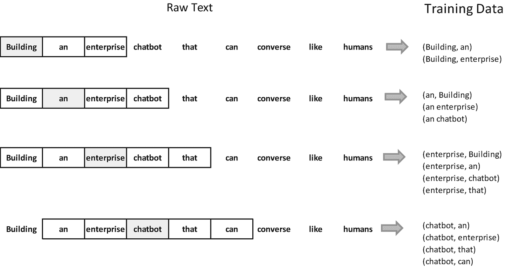

图 5-14

使用窗口大小为 2 为神经网络生成训练样本

用于 Word2Vec 的 skip-gram 神经网络模型会计算词汇表中每个单词成为我们选择的“附近单词”的概率。单词的邻近程度可以通过一个称为窗口大小的参数来定义。图 5-14 展示了使用窗口大小为 2 训练神经网络时可能的单词对。

可以使用任何一种工具来生成这样的 n-gram。在下面的代码中，我们使用 Python 中的 TextBlob 库来生成窗口大小为 2 的 n-gram。

```
#n-grams
#TextBlob.ngrams() 方法返回一个由 n 个连续单词组成的元组列表。
#首先，导入
from textblob import TextBlob
blob = TextBlob("Building an enterprise chatbot that can converse like humans")
blob.ngrams(n=2)
[WordList(['Building', 'an']),
WordList(['an', 'enterprise']),
WordList(['enterprise', 'chatbot']),
WordList(['chatbot', 'that']),
WordList(['that', 'can']),
WordList(['can', 'converse']),
WordList(['converse', 'like']),
WordList(['like', 'humans'])]
```

在输入句子“Building an enterprise chatbot that can converse like humans”中，它被分解成单词，并且使用窗口大小为 2，我们从输入单词的左右两侧各取两个单词。因此，如果输入单词是“chatbot”，那么单词“enterprise”的输出概率会很高，因为它在窗口大小为 2 的范围内与单词“chatbot”邻近。这只是一个示例句子。在给定的词汇表中，我们会有成千上万个这样的句子；神经网络将从每个配对出现的次数中学习统计规律。因此，如果我们提供更多像图 5-14 中所示的训练样本，它将能够计算出单词“chatbot”和“enterprise”同时出现的可能性有多大。


#### 神经网络架构

神经网络的输入向量是一个独热向量，用于表示输入词“chatbot”，方法是在向量的第 i 个位置存储 **1**，在所有其他位置存储 **0**，其中 0 ≤ *i* ≤ *n*，n 是词汇表（所有唯一词的集合）的大小。

在隐藏层中，每个大小为 **n** 的词向量会与一个特征向量相乘，假设该特征向量的大小为 **1000**。训练开始时，大小为 **1000** 的特征向量中的所有值都会被随机赋值。相乘的结果将选择 **n x 1000 矩阵**中与独热向量值为 1 的位置相对应的那一行。

最后，在输出层，会应用像 softmax 这样的激活函数，将输出值压缩到 0 到 1 之间。以下公式表示了 softmax 函数，其中 K 是输入向量的大小：

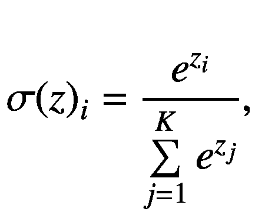

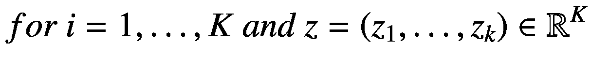

因此，如果表示“chatbot”的输入向量与表示“enterprise”的输出向量相乘，softmax 函数的结果将接近 1，因为在我们的词汇表中，这两个词经常同时出现。

神经网络通过多次迭代训练来训练网络并更新边的权重。最终的权重集合代表了学习成果。图 5-15 展示了用于训练 Word2Vec 模型的神经网络架构。

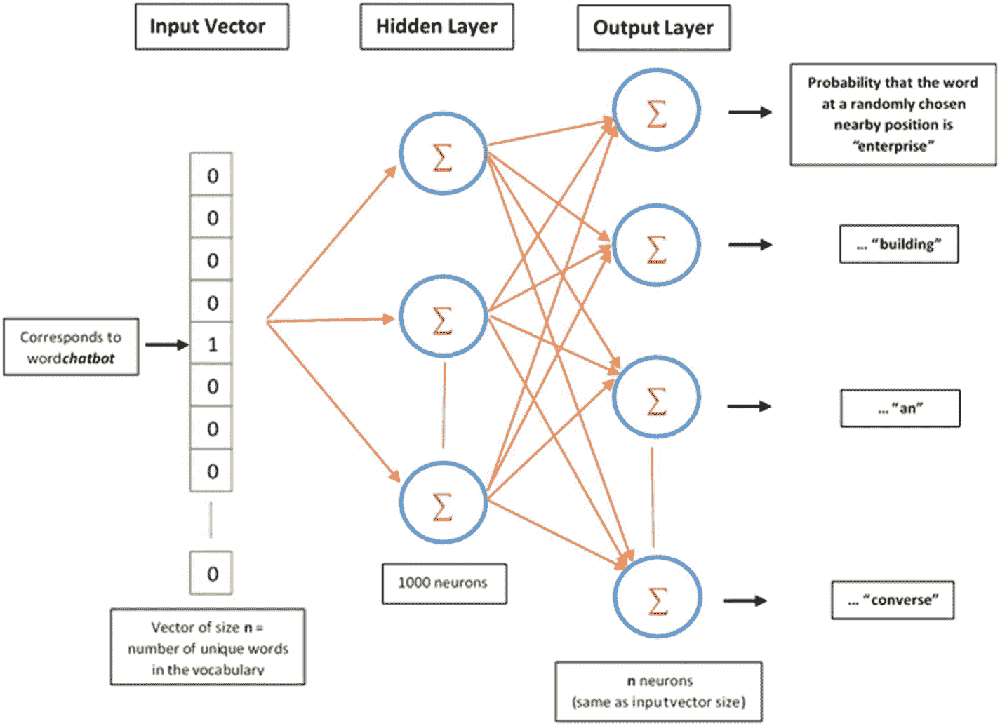

图 5-15

用于训练 Word2Vec 模型的神经网络架构

#### 使用预训练的 Word2Vec 模型

在以下代码中，我们使用来自一个名为 gensim 的常用 Python 库的预训练 Word2Vec 模型。Word2Vec 模型提供了词的向量表示，使得各种自然语言任务成为可能，例如识别相似词、查找同义词、词向量运算等等。最流行的 Word2Vec 模型包括 GloVe、CBOW 和 skip-gram。在本节中，我们将使用所有这三个模型来执行 NLU 的各种任务。

在演示中，我们使用该模型来执行许多句法/语义层面的 NLU 词汇任务。

**步骤 1：** 加载所需的库：

```
from gensim.test.utils import get_tmpfile
from gensim.models import Word2Vec
import gensim.models
```

**步骤 2：** 从亚马逊食品评论中挑选一些词并创建一个列表：

```
review_texts = [['chips', 'WalMart', 'fajitas'],
['ingredients', 'tasted', 'crisps', 'Chilling', 'fridge', 'nachos'],
['tastebuds', 'tortilla', 'Mexican', 'baking'],
['toppings', 'goodness', 'product, 'fantastic']]
```

**步骤 3：** 训练 Word2Vec 模型并将模型保存到临时路径。函数 `Word2Vec` 在提供给它的输入词汇表上训练神经网络。以下是各个参数的含义：

*   `review_texts`：输入给神经网络（NN）的词汇表。

*   `size`：神经网络层的大小，对应于算法拥有的自由度。通常，网络越大越准确，前提是有足够大的数据集进行训练。建议的范围在十到数千之间。

*   `min_count`：此参数有助于从词汇表中修剪掉不太重要的词，例如在数百万词的语料库中只出现一两次的词。

*   `workers`：函数 `Word2Vec` 提供了训练并行化的功能，这可以显著加快训练过程。根据 gensim 的官方文档，你需要安装 Cython 才能以并行化模式运行。

```
path = get_tmpfile("word2vec.model")
model = Word2Vec(review_texts, size=100, window=5, min_count=1, workers=4)
model.save("word2vec.model")
```

### 注意

安装 Cython 后，你可以运行以下代码来检查是否安装了 word2vec 的 FAST_VERSION。

```
from gensim.models.word2vec import FAST_VERSION
FAST_VERSION
```

**步骤 4：** 加载模型并使用词向量模型中的属性 `wv` 获取输出词向量。词“tortilla”是词汇表中的词之一。你可以检查向量的长度，根据训练期间设置的参数 size，该长度为 100；向量的类型是 numpy 数组。

```
model = Word2Vec.load("word2vec.model")
vector = model.wv['tortilla']
vector
Out[6]:
array([ 3.4357556e-03,  3.0461869e-03, -1.4244991e-03, -4.6549197e-03,
-1.8324883e-03,  1.9077188e-04, -1.7216217e-03, -4.5330520e-03,
3.5653920e-03,  1.4612208e-03,  2.3089715e-03, -2.7617093e-03,
6.8887050e-04, -5.6756934e-04,  1.1901358e-03,  8.0038357e-04,
3.0033696e-03, -6.6507862e-05, -4.9998574e-03, -3.6887771e-03,
2.9287676e-03,  3.6550803e-06, -6.3992629e-04,  4.0531787e-04,
7.9464359e-04,  3.8370243e-03,  1.5980378e-03,  3.2125930e-03,
-4.0334738e-03,  2.2513322e-03,  1.6611509e-03, -1.8190868e-03,
6.9712318e-04,  4.2551439e-03,  1.5517352e-03, -2.8593470e-03,
3.2627038e-03, -3.9196378e-03,  2.0745063e-04, -2.4973995e-03,
-1.9995500e-03,  4.3865214e-03,  2.7636185e-03,  4.1850037e-03,
-4.4220770e-03, -1.9331808e-03, -2.4466095e-03,  3.4395256e-03,
2.7979608e-03,  7.6796720e-04, -2.2225662e-03, -2.3218829e-03,
1.4716865e-03,  2.5831673e-03, -2.7626422e-03, -3.8978728e-03,
-7.1556045e-05, -5.0603821e-06,  3.7337472e-03,  1.7892369e-03,
9.4844203e-04,  4.2107059e-03,  2.0532655e-03,  4.8830300e-03,
3.9778049e-03,  7.7870529e-04, -3.0672669e-03,  2.4687734e-03,
-5.6728686e-04, -3.1949261e-03, -3.5277463e-03, -2.8095061e-03,
1.9295703e-03, -2.7000166e-03,  3.8331877e-03, -3.7821392e-03,
-2.8160575e-03, -2.1306602e-03, -3.4921553e-03,  1.4594033e-03,
2.9177510e-03, -7.1679556e-04, -4.6973061e-03, -5.6215626e-04,
-4.7952992e-05,  1.4449660e-03,  3.9334581e-03, -4.7264448e-03,
1.3655510e-03,  3.0361500e-03, -3.9414247e-03, -2.2786416e-03,
-2.0382130e-03,  1.2625570e-03,  3.3640184e-03,  3.2833132e-03,
-4.9897577e-03,  1.3328259e-03, -3.8654597e-03, -3.4675971e-03],
dtype=float32)
type(vector)
numpy.ndarray
len(vector)

```

**步骤 5：** 我们在步骤 3 中保存的 Word2Vec 模型可以重新加载，并且我们可以使用 Word2Vec 模型中的 `train` 函数在更多词上继续训练。

```
more_review_texts = [['deceptive', 'packaging', 'wrappers'],
['texture', 'crispy', 'thick', 'cruncy', 'fantastic', 'rice']]
model = Word2Vec.load("word2vec.model")
model.train(more_review_texts, total_examples=2,epochs=10)
(2, 90)
```


#### 使用预训练模型执行开箱即用任务

gensim 的实用特性之一，是它通过 gensim-data 提供了多个预训练的词向量。除了 Word2Vec，它还提供了 GloVe，这是另一种用于寻找词向量的强大无监督学习算法。以下代码从 gensim-data 下载一个 `glove-wiki-gigaword-100` 词向量，并执行一些开箱即用的任务。

**步骤 1：** 使用 `gensim.downloader` 模块下载一个预训练的 GloVe 词向量：

```
import gensim.downloader as api
word_vectors = api.load("glove-wiki-gigaword-100")
```

**步骤 2：** 计算最近邻。如你所见，词向量包含一组代表单词的数字数组。现在，对向量进行数学计算成为可能。例如，我们可以计算任意两个词向量之间的欧几里得距离或余弦相似度。由此我们得到了一些有趣的结果。以下代码展示了部分结果。

图 5-14 展示了一个示例，说明了如何通过移动大小为 2 的窗口来创建用于训练神经网络的数据。在下面的例子中，你会看到互联网上的“apple”不再是水果；它已成为苹果公司的代名词，并且当我们计算与“apple”相似的词时，会显示出许多类似的公司。产生这种相似性的原因在于训练所用的词汇表，本例中是一个包含近 60 亿个未大小写标记的维基百科转储文件。更多此类预训练模型可在 [`https://github.com/RaRe-Technologies/gensim-data`](https://github.com/RaRe-Technologies/gensim-data) 获取。

在第二个例子中，当我们寻找与“orange”相似的词时，得到了对应颜色的词，如红色、蓝色、紫色，以及像柠檬这样的水果，它是一种像橙子一样的柑橘类水果。这种关系对人类来说很容易理解。然而，Word2Vec 模型能够破解它，这令人兴奋。

```
result = word_vectors.most_similar('apple')
print(result)
[('microsoft', 0.7449405789375305), ('ibm', 0.6821643114089966), ('intel', 0.6778088212013245), ('software', 0.6775422096252441), ('dell', 0.6741442680358887), ('pc', 0.6678153276443481), ('macintosh', 0.66175377368927), ('iphone', 0.6595611572265625), ('ipod', 0.6534676551818848), ('hewlett', 0.6516579389572144)]
result = word_vectors.most_similar('orange')
print(result)
[('yellow', 0.7358633279800415), ('red', 0.7140780687332153), ('blue', 0.7118035554885864), ('green', 0.7111418843269348), ('pink', 0.6775072813034058), ('purple', 0.6774232387542725), ('black', 0.6709616184234619), ('colored', 0.665260910987854), ('lemon', 0.6251963376998901), ('peach', 0.616862416267395)]
```

**步骤 3：** 识别线性子结构。使用相似度或距离度量很容易计算两个词的相关性，而要以更定性的方式捕捉词对或句子中的细微差别，我们需要进行操作。让我们看看 gensim 包为实现此任务提供的方法。

##### 词对相似度

在下面的例子中，我们计算一个词对之间的相似度。例如，词对 [‘sushi’, ‘shop’] 与词对 [‘japanese’, ‘restaurant’] 的相似度高于与 [‘Indian’, ‘restaurant’] 的相似度。

```
sim = word_vectors.n_similarity(['sushi', 'shop'], ['indian', 'restaurant'])
print("{:.4f}".format(sim))
0.6438
sim = word_vectors.n_similarity(['sushi', 'shop'], ['japanese', 'restaurant'])
print("{:.4f}".format(sim))
0.7067
```

##### 句子相似度

我们还可以计算两个句子之间的距离或相似度。gensim 提供了一种称为词移距离（Word Mover’s distance）的距离度量，它已被证明是找出包含多个句子的两个文档之间相似度的有用工具。距离越小，两个文档越相似。词移距离在底层使用 Word2Vec 模型生成的词嵌入，首先理解查询句子（或文档）的概念，然后找出所有相似的句子或文档。例如，当我们计算两个不相关句子之间的词移距离时，与比较两个上下文相关的句子相比，距离会更高。

在第一个例子中，sentence_one 谈论的是印度烹饪艺术的多样性，而 sentence_two 具体谈论的是德里的食物。在第二个例子中，sentence_one 和 sentence_two 不相关，因此我们得到的词移距离比第一个例子更高。

```
sentence_one = 'India is a diverse country with many culinary art'.lower().split()
sentence_two = 'Delhi offers many authentic food'.lower().split()
similarity = word_vectors.wmdistance(sentence_one, sentence_two)
print("{:.4f}".format(similarity))
4.8563
sentence_one = 'India is a diverse country with many culinary art'.lower().split()
sentence_two = 'The all-new Apple TV app, which brings together all the ways to watch TV into one app'.lower().split()
similarity = word_vectors.wmdistance(sentence_one, sentence_two)
print("{:.4f}".format(similarity))
5.2379
```

##### 算术运算

更令人印象深刻的是，能够对词向量执行加法和减法等算术运算，从而通过运算获得某种形式的线性子结构。在第一个例子中，我们计算 *woman + king – man*，与该运算最相似的词是 *queen*。其基本概念是，man 和 woman 是性别，这可以由其他词如 queen 和 king 等价地指定。因此，当我们从 woman 和 king 的加法中减去 man 时，得到的词是 queen。GloVe 词表示在 [`https://nlp.stanford.edu/projects/glove/`](https://nlp.stanford.edu/projects/glove/) 提供了一些示例。

类似地，该模型擅长捕捉语言和国家等概念。例如，当我们把 French 和 Italian 相加时，得到 Spanish，这是一种在邻近国家西班牙使用的语言。

```
result = word_vectors.most_similar(positive=['woman', 'king'], negative=['man'])
print("{}: {:.4f}".format(*result[0]))
queen: 0.7699
result = word_vectors.most_similar(positive=['french', 'italian'])
print("{}: {:.4f}".format(*result[0]))
spanish: 0.8312
result = word_vectors.most_similar(positive=['france', 'italy'])
print("{}: {:.4f}".format(*result[0]))
spain: 0.8260
```

##### 找出异常词

该模型能够适应在给定的单词序列中找出不符合语境的词。其工作方式是，`doesnt_match` 方法通过计算给定单词列表中所有词向量的均值来确定中心点，然后找出与中心点的余弦距离。余弦距离最大的词被返回为不适合该列表的异常词。

在以下两个例子中，模型能够从国家列表中找出食物 pizza 作为异常词。类似地，在第二个例子中，模型从所有美国总统的列表中找出了印度总理莫迪。

```
print(word_vectors.doesnt_match("india spain italy pizza".split()))
pizza
print(word_vectors.doesnt_match("obama trump bush modi".split()))
modi
```

像 Word2Vec 和 GloVe 这样的语言模型在生成词与词之间有意义的关联方面非常强大，这对人类来说很自然，因为我们理解语言。对于机器来说，能够以这种智能水平理解单词在各种句法和语义形式中的使用，是一项了不起的成就。


#### fastText 词表示模型

与 gensim 类似，fastText 也提供了许多预训练的词嵌入模型。其快速高效的处理能力使其成为文本分类和词表示相关任务（如查找相似文本）中非常流行的库。fastText 中的模型使用了子词信息，即一个单词中所有介于最小长度（minn）和最大长度（maxn）之间的子字符串，这带来了更好的性能。

```
import fasttext
# Skipgram 模型
model_sgram = fasttext.train_unsupervised('dataset/amzn_food_review_small.txt', model="skipgram")
# 或者，cbow 模型
model_cbow = fasttext.train_unsupervised('dataset/amzn_food_review_small.txt', model="cbow")
print(model_sgram['cakes'])
[ 0.00272718  0.01386657  0.00484232 -0.01444803  0.00204112  0.00787148
-0.00759551  0.00263086 -0.01182229 -0.00530771 -0.02338764  0.01398039
0.00218989  0.0154795  -0.01450872 -0.01040525 -0.00762093 -0.01090531
0.00802671 -0.02447837  0.00507444  0.01049152 -0.00054866  0.01148072
-0.02119654 -0.01219683  0.00658704 -0.00171852  0.01495257  0.00328717
-0.01289422  0.01350378 -0.01774059  0.01281367  0.00123221 -0.01672287
-0.00940464 -0.01039432 -0.00618952  0.01418524 -0.03802125  0.00976629
0.01477897  0.01039862  0.02141832 -0.01620196  0.00617392 -0.01073407
-0.00289557 -0.00856876 -0.00785293 -0.01535104  0.00439641 -0.00760364
0.00825184  0.03034449 -0.00980587  0.01319963 -0.00710381  0.00040615
-0.0074836   0.01588171  0.03172321  0.00821354  0.00569351 -0.00976394
-0.00666583  0.00810414 -0.00969361 -0.00378272  0.00782087  0.01669582
0.01114488  0.00669733 -0.0053518  -0.0059374  -0.00554186  0.01869696
0.01529924 -0.00877811  0.03367095  0.01772366  0.0037948   0.01354953
-0.0086841   0.01565165 -0.0031147   0.00028975 -0.00047118 -0.00779429
-0.00646258  0.00798804  0.04278774 -0.00381226 -0.01868668 -0.01809955
-0.02041707 -0.00328311 -0.01909724 -0.01288191]
print(model_sgram.words)
['the', 'I', 'a', 'and', 'to', '', 'of', 'for', 'it', 'in', 'is', 'was', 'are', 'not', 'this', 'that', 'but', 'on', 'my', 'have', 'as', 'they', 'like', 'you', 'great', 'This', 'so', 'them', 'than', 'body', 'soap', 'just', 'The', 'very', 'find', 'with', 'taste', 'cake', 'what', 'these', 'had', 'when', 'buy', 'get', 'be', 'It', 'sprinkles', 'from', 'really', "it's", 'Great', 'other', 'Giovanni', 'best', 'we', 'good', 'all', 'were', 'out', 'wash', 'one', 'only', 'their', 'make', 'about', 'or', 'color', 'bag', '/><br', 'some', 'These', 'using', 'bought', 'tried', 'your', 'more', 'same', 'any', "I've", 'also', 'love', 'has', 'washes']
```

与本节讨论的示例类似，使用 skip-gram 或 CBOW 模型可以执行各种任务。我们可以评估性能，为最终实现选择最佳模型。

可以通过导入 fastText 模块，在 gensim 库中使用 fastText 模型：

```
from gensim.models.fasttext import FastText
```

### 使用 OpenIE 进行信息抽取

开放信息抽取器（OpenIE）标注器用于抽取开放领域的、表示主语、谓语和宾语的关系三元组，通常称为三元组。当可用的训练数据很少时，OpenIE 是一个非常有用的工具。

Python 中没有稳定的 OpenIE 实现。为了使用 CoreNLP 库提供的 OpenIE，请下载 corenlp，并在命令行中 `cd` 进入 CoreNLP 目录。然后运行以下命令。请注意，此过程需要足够的内存。在以下代码中，我们为此过程设置了 2GB 内存。否则，JVM 可能会抛出内存溢出错误。

```
java -mx2g -cp "*" edu.stanford.nlp.naturalli.OpenIE
```

上述命令运行后，它会接受一个句子作为输入。请提供一个你选择的句子。为了重现表 5-3 所示的结果，请使用以下示例句子：

```
Narendra Modi is an Indian politician serving as the 14th and current Prime Minister of India since 2014
```

表 5-4 展示了从给定句子中可能抽取出的三元组。起初，许多三元组看起来可能相同。仔细检查后，你会发现所有宾语都是唯一的，它们都使用主语“Narendra Modi”或“Modi”以及谓语或关系“is”。

表 5-4

使用 OpenIE 从示例句子中可能抽取出的三元组

| 序号 | 主语 | 谓语 | 宾语 |
| --- | --- | --- | --- |
| 1 | Narendra Modi | is | politician serving as 14th Prime Minister |
| 2 | Narendra Modi | is | Indian politician serving as 14th Prime Minister |
| 3 | Narendra Modi | is | politician serving as Prime Minister |
| 4 | Narendra Modi | is | Politician |
| 5 | Modi | is | Indian |
| 6 | Narendra Modi | is | Indian politician serving as 14th Prime Minister of India |
| 7 | Narendra Modi | is | Indian politician serving as Prime Minister |
| 8 | Narendra Modi | is | Indian politician serving as Prime Minister of India since 2014 |
| 9 | Narendra Modi | is | Indian politician serving as Prime Minister since 2014 |
| 10 | Narendra Modi | is | politician serving as Prime Minister of India since 2014 |
| 11 | Narendra Modi | is | politician serving as 14th Prime Minister of India since 2014 |
| 12 | Narendra Modi | is | politician serving as 14th Prime Minister since 2014 |
| 13 | Narendra Modi | is | Indian politician serving as 14th Prime Minister since 2014 |
| 14 | Narendra Modi | is | politician serving as Prime Minister of India |
| 15 | Narendra Modi | is | politician serving as Prime Minister since 2014 |
| 16 | Narendra Modi | is | Indian politician |
| 17 | Narendra Modi | is | Indian politician serving as Prime Minister of India |
| 18 | Narendra Modi | is | Indian politician serving since 2014 |
| 19 | Narendra Modi | is | politician serving as 14th Prime Minister of India |
| 20 | Narendra Modi | is | politician serving since 2014 |
| 21 | Narendra Modi | is | Indian politician serving as 14th Prime Minister of India since 2014 |

### 使用潜在狄利克雷分配进行主题建模

主题建模是理解自然语言的典型应用之一。给定一组文档，我们可以提取一个代表该集合中所有文档的“抽象主题”。潜在狄利克雷分配（LDA）是一种用于主题建模的常用统计模型。它有助于发现给定文本中的语义结构。

在本节中，为了演示，我们将使用 Amazon Fine Food 评论数据集中的三条示例评论来训练一个 LDA 模型。我们将在“应用”部分看到另一个使用 spaCy、NLTK 和 gensim 等额外工具进行主题建模的示例。

#### 文档集合

数据集中的三条评论被赋值给一个名为 `documents` 的变量。我们期望主题中包含诸如“chips”、“fajitas”和“crisps”之类的词，因为这三条评论似乎都在谈论“玉米片”。我们不太关心评论中的情感倾向。

```
documents = ["I consume about a jar every two weeks of this, either adding it to fajitas or using it as a corn chip dip,"
"As soon as I tasted one and it tasted like a corn chip I checked the ingredients",
"I found these crisps at our local WalMart & figured I would give them a try"
]
```

#### 加载库并定义停用词

作为第一个预处理步骤，我们从给定的文本中移除所有停用词。为了简单实现，我们只在一个列表中定义了几个停用词：

```
# 导入漂亮打印机
from pprint import pprint
from collections import defaultdict
stoplist = set('for a of the and to in'.split())
```


#### 移除常见词与分词

我们使用上述停用词列表，通过一个 for 循环来移除这些词。请注意，这是一个简单的实现，并非移除停用词的最高效方法。

```
# 移除常见词并分词
texts = [
[word for word in document.lower().split() if word not in stoplist]
for document in documents
]
```

#### 移除低频词

现在我们已经移除了停用词，接下来计算文档集合中每个词的出现频率。同样，我们使用一个简单的双层 for 循环结构来实现，该结构读取文档中的每个词，并在遇到重复词时递增计数。

```
# 移除仅出现一次的词
frequency = defaultdict(int)
for text in texts:
for the token in text:
frequency[token] += 1
texts = [
[token for token in text if frequency[token] > 1]
for text in texts
]
pprint(texts)
[['i', 'it', 'it', 'as', 'corn', 'chip'],
['as', 'as', 'i', 'tasted', 'it', 'tasted', 'corn', 'chip', 'i'],
['i', 'i']]
```

现在我们看到了出现次数超过一次的词。在我们的示例中，似乎没有太多词出现超过一次。我们预计模型的表现不会很好。不过，我们还是继续训练模型。

#### 将训练数据保存为字典

gensim 库提供了 `Dictionary` 方法，该方法将词元存储到字典中。我们将从评论中提取的词元保存到磁盘上的 `review.dict` 文件中。

```
from gensim import corpora
dictionary = corpora.Dictionary(texts)
dictionary.save('review.dict')
print(dictionary)
Dictionary(6 unique tokens: ['as', 'chip', 'corn', 'i', 'it']...)
print(dictionary.token2id)
{'as': 0, 'chip': 1, 'corn': 2, 'i': 3, 'it': 4, 'tasted': 5}
new_doc = "tasty corn"
new_vec = dictionary.doc2bow(new_doc.lower().split())
print(new_vec)
[(2, 1)]
```

#### 生成词袋

字典中的词可以使用 `doc2bow` 方法转换为词袋（BOW）表示。然后，可以使用 MmCorpus 对 BOW 进行序列化，并存储为 `review.mm`。另一种流行的方法是将词表示为 n-gram，与 BOW 中文本无序的情况不同，n-gram 中文本是有序的。N-gram 有助于发现词之间的共现关系。

```
corpus = [dictionary.doc2bow(text) for text in texts]
corpora.MmCorpus.serialize('review.mm', corpus)
```

#### 使用 LDA 训练模型

最后，我们使用词袋字典来训练潜在狄利克雷分配模型。LDA 是一种生成式统计模型，给定输入变量 X 和目标变量 Y，该模型基于联合概率 *X* ∗ *Y*， *P*(*X*, *Y*)。LDA 是一种广受欢迎的机器学习模型，广泛应用于主题建模。每个文档（在我们的示例中，每条评论）都是各种主题的混合体，LDA 会为每个文档分配一组主题。

例如，LDA 模型可能会为一条评论（文档）分配一个类似“玉米片”相关的主题。该主题具有生成诸如“酥脆”、“美味”等各种词的概率。

```
from gensim import models
tfidf = models.TfidfModel(corpus)
corpus_tfidf = tfidf[corpus]
lsi = models.LsiModel(corpus_tfidf, id2word=dictionary, num_topics=2)
corpus_lsi = lsi[corpus_tfidf]
lsi.print_topics(2)
[(0,
'0.556*"it" + 0.542*"tasted" + 0.428*"as" + 0.328*"chip" + 0.328*"corn" + 0.000*"i"'),
(1,
'-0.804*"tasted" + 0.528*"it" + 0.190*"corn" + 0.190*"chip" + 0.041*"as" + 0.000*"i"')]
```

gensim 库提供了一个名为 `LsiModel()` 的方法，用于训练 LDA 模型。潜在语义索引（LSI）用于 LDA 在信息检索中的应用场景。

在上面的模型中，我们设置了 `num_topics = 2`，要求模型生成两个主题。以下两个主题赋予了“corn”和“chip”权重，这似乎是我们用于训练的三条评论中的主题。

1.  **主题 1:** 0.556∗“it” + 0.542∗“tasted” + 0.428∗“as” + ***0.328*“chip” + 0.328*“corn”*** + 0.000∗“i”

2.  **主题 2:** -0.804∗“tasted” + 0.528∗“it” + ***0.190*“corn” + 0.190*“chip”*** + 0.041∗“as” + 0.000∗“i”

请注意，更准确的模型需要大量的数据进行训练，并且可能会产生更多有趣的主题。

## 自然语言生成

自然语言生成是 NLP 和计算语言学的一个子领域，能够生成各种语言的可理解人类文本。利用语言表示和领域知识来生成文档、解释、帮助信息、报告甚至诗歌的能力，使得 NLG 成为目前研究最多的领域。^(⁷) 未来，NLG 将在人机交互界面中发挥至关重要的作用。

NLU 和 NLG 之间的显著区别在于，NLP 将句子映射到内部语义表示（在 NLU 系统中称为解析），而 NLG 将语义表示映射到表层句子（在 NLG 系统中称为实现）。这两种映射都是通过双向语法实现的，该语法使用语言语法的声明式表示。

我们将使用基于 Python 和 Java 的库（如 markovify 和 simpleNLG）来演示 NLG 应用。我们还将使用深度学习模型进行文本生成。这些深度学习模型正是机器在拥有大量语料库的情况下写诗或生成音符等流行应用背后的技术。

NLG 的一些流行应用包括：

*   自动生成代码和流程文档

*   根据财务数据或年度报告生成报告

*   汇总表格数据的图形报告和数字

*   生成出院小结和病理报告

*   帮助气象学家撰写天气预报

还有更多用例正在快速发展，尤其是在深度学习算法日益复杂和机器计算能力不断增强的背景下。

### 基于马尔可夫链的标题生成器

马尔可夫链模型是一种描述可能事件序列的随机模型，其中每个事件的概率仅取决于前一个状态达到的状态。马尔可夫链对随机过程进行统计建模。马尔可夫链由转移概率和状态定义，过程根据预设的概率值从一个状态转移到另一个状态。

马尔可夫链模型在数学上是一种稳健的方法，如果建模正确，可以产生出色的结果。与许多采用蛮力方法的机器学习算法不同，马尔可夫链需要精心设计才能对随机过程进行建模。

以下是马尔可夫链的一些应用：

*   对众多现实世界现象进行计算机模拟，例如天气建模、股票市场波动和水坝水流

*   生物建模，例如种群过程

*   算法音乐创作

*   棋盘游戏建模，例如蛇梯棋或 Hi Ho! Cherry-O

*   群体遗传学，用于描述受遗传漂变影响的小种群中基因频率的变化

让我们使用 Python 的 markovify 库来生成一些标题。

#### 加载库

加载 pandas 和 markovify 等库。我们使用 pandas 从 ABC 新闻数据集中读取和处理 CSV 文件。markovify 库是一个简单的马尔可夫链生成器，用于生成随机文本。

```
#加载所需包
import pandas as pd # 数据处理，CSV 文件 I/O（例如 pd.read_csv）
import markovify #马尔可夫链生成器
```


#### 加载文件并打印标题

使用 `read_csv()` 方法从 CSV 文件中读取 ABC 新闻数据集，并打印前三条新闻标题。该数据集包含澳大利亚广播公司（Australian Broadcasting Corp.）发布的超过 15 年的新闻标题，总计超过 100 万条。该数据集可从 [`www.kaggle.com/therohk/million-headlines/data`](https://www.kaggle.com/therohk/million-headlines/data) 下载。参见图 5-16。

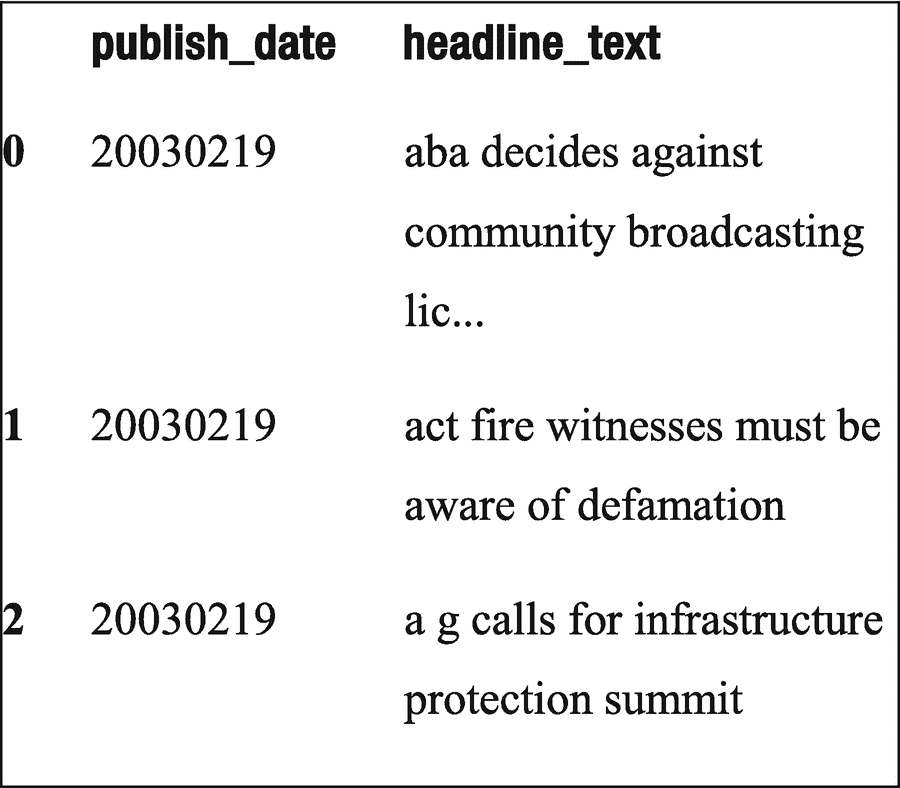

图 5-16

输出

```
#读取输入文本文件
Input_text = pd.read_csv('data/abcnews-date-text.csv')
Input_text.head(3)
```

#### 使用 Markovify 构建文本模型

Markovify 提供了一种名为 `NewlineText` 的方法，该方法将数据集中的 headline_text 作为输入，并将 state_size 参数值设为 2。此方法在处理大量且标点规范的文本时效果最佳。每个单词都是序列中的一个状态，概率则衡量某个单词出现后下一个单词可能出现的可能性。

```
#使用 markovify 构建文本模型
text_model = markovify.NewlineText(input_text.headline_text, state_size = 2)
```

#### 生成随机标题

一旦你对文本进行了 markovify 处理，就可以使用 `make_sentence()` 方法让模型生成句子。该方法利用 markovify 库中 `Newlinetext()` 方法构建的模型随机生成句子。下面随机生成的句子中，许多示例构成了有意义的标题。

```
#生成随机文本
# 使用构建好的模型打印十个随机生成的句子
for i in range(10):
print(text_model.make_sentence())
coalitions grand plan for fertiliser price hurting jewellers
police seek 18 over brawl outside black magic rape sentencing
dojokvic eases past querrey; murray wins at ascot
life at the waca
police shoot terrorism suspect to undergo mental check
beazley stands by online petition to stop roxon
ocean queen docks in fremantle with yacht damaged in downpour
ministerial clout needed to beat deadline
port macquarie waterfront land row
```

### SimpleNLG

与基于状态转移概率生成随机文本的马尔可夫链不同，SimpleNLG 提供了一种生成语法正确的英文句子的实用工具。它使用 Java 编写，专为 NLG 设计。为了生成句子，我们指定句子的内容，并将这些信息编码为 SimpleNLG 语法，然后 SimpleNLG 会根据语法规范生成语法正确的句子。SimpleNLG 执行的主要任务包括：

*   **正字法**：指书写语言的惯例。包括大小写、句子和段落中的空格、标点、强调以及连字符的使用。

*   **形态学**：研究单词、单词的构成以及同一语言中单词与其他单词的关系。它分析单词和单词组成部分的结构，例如词干、词根、前缀和后缀。

*   **简单语法**：确保语法正确性，如名词-动词一致性和创建结构良好的动词组（例如“does not play”）。

在 NLG 的术语中，SimpleNLG 是一个用于简单语法的实现器。它对于创建需要使用语法正确句子的文档和报告非常有用。本节中的演示使用了 nlglib，这是一个主要围绕 SimpleNLG 封装的 Python 库。

#### 加载库

从 nlglib 库中加载 SimpleNLG 实现器。将 `Realiser()` 类中的 host 参数设置为 `nlg.kutlak.info`。接下来，我们为 SimpleNLG 能够执行的各种任务定义方法。

```
import logging
from nlglib.realisation.simplenlg.realisation import Realiser
from nlglib.microplanning import *
realise = Realiser(host='nlg.kutlak.info')
```

#### 时态

名为 `tense()` 的方法定义了一个子句以及我们想要转换成的时态。在以下代码中，子句声明了“主语”、“谓语”（或关系）和“宾语”，然后我们分别将子句对象中的 TENSE 属性设置为 PAST 和 FUTURE。

```
def tense():
c = Clause('Harry', 'bought', 'these off amazon')
c['TENSE'] = 'PAST'
print(realise(c))
c['TENSE'] = 'FUTURE'
print(realise(c))
Harry bought these off amazon.
Harry will buy these off amazon.
```

#### 否定

与 `tense()` 方法类似，我们定义 `negation()` 方法，该方法同样接收一个三元组并创建句子的否定形式。

```
def negation():
c = Clause('Harry', 'bought', 'these off amazon')
c['NEGATED'] = 'true'
print(realise(c))
Harry does not buy these off amazon.
```

#### 疑问句

我们还可以生成 YES/NO 类型的疑问句或像 WHO 这样的问句。以下代码展示了两个示例。请注意，在示例中，WHO 与“Harry”搭配并不合适。

```
def interrogative():
c = Clause('Harry', 'bought', 'these off amazon')
c['INTERROGATIVE_TYPE'] = 'YES_NO'
print(realise(c))
c['INTERROGATIVE_TYPE'] = 'WHO_OBJECT'
print(realise(c))
Does Harry buy these off amazon?
Who does Harry buy?
```

#### 补足语

在给定的子句中，还可以添加某些补足语短语。在以下代码中，我们展示了添加到主句中的两个补足语短语。SimpleNLP 的优点在于，给定子句和补足语后，它可以形成语法正确的句子。

```
def complements():
c = Clause('Harry', 'bought', 'these off amazon',
complements=['on first day of sales', 'despite high price'])
print(realise(c))
Harry buys these off amazon on first day of sales despite high price.
```

#### 修饰语

在以下代码中，我们首先将形容词添加到主语或名词上，然后将副词添加到动词上。在示例中，形容词“impulsive”被添加到名词“Harry”上，副词“quickly”被添加到动词“buys”上。形容词和副词都被称为修饰语。注意，句子的语法仍然保持完整。

```
def modifiers():
subject = NP('Harry')
verb = VP('bought')
objekt = NP('these', 'off','amazon')
subject += Adjective('Impulsive')
c = Clause()
c.subject = subject
c.predicate = verb
c.object = objekt
print(realise(c))
verb += Adverb('quickly')
c = Clause(subject, verb, objekt)
print(realise(c))
Impulsive Harry buys this off amazon.
Impulsive Harry quickly buys this off amazon.
```

#### 介词短语

使用 SimpleNLP 可以轻松地将包含“at”、“on”、“in”和“by”的介词短语添加到子句中。在介词短语中，你还可以单独定义名词项，它会根据语法适当地组织其结构。

```
def prepositional_phrase():
c = Clause('Harry', 'bought', 'these off amazon')
c.complements += PP('by', 'surprise')
print(realise(c))
c = Clause('Harry', 'bought', 'these off amazon')
c.complements += PP('for', NP('Eva'))
print(realise(c))
Harry buys these off amazon by surprise.
Harry buys these off amazon for Eva.
```

#### 并列子句

在并列子句中，可以将两个或多个句子（子句）组合成一个句子。在以下代码中，两个子句使用连词组合在一起。每个子句可以有自己的结构。例如，在一个子句“He likes jeans”中，我们使用 PRESENT 时态；在第二个子句“He will return t-shirt”中，我们使用 FUTURE 时态。

```
def coordinated_clause():
s1 = Clause('Harry', 'buy', 'these off amazon', features={'TENSE': 'PAST'})
s2 = Clause('he', 'like','jeans', features={'TENSE': 'PRESENT'})
s3 = Clause('he', 'return', 't-shirt', features={'TENSE': 'FUTURE'})
c = s1 + s2 + s3
c = CC(s1, s2, s3)
print(realise(s1))
print(realise(s2))
print(realise(s3))
print(realise(s1 + s2))
print(realise(c))
Harry bought these off amazon.
He likes jeans.
He will return t-shirt.
Harry bought these off amazon and he likes jeans
Harry bought these off amazon and he likes jeans and he will return t-shirt
```


#### 从属从句

我们可以通过像“because”这样的**标句词**在从句中引入连词，并将句子置于过去时态。我们称这种从句为从属从句。

```
def subordinate_clause():
p = Clause('Harry', 'like', 'amazon')
q = Clause('product', 'is', 'good')
q['COMPLEMENTISER'] = 'because'
q['TENSE'] = 'PAST'
p.complements += q
print(realise(p))
Harry likes amazon because product was good.
```

#### 主方法

如果我们需要一次性运行所有代码，`main` 方法会调用我们上面创建的方法。

```
def main():
c = Clause('Harry', 'bought', 'these off amazon')
print(realise(c))
tense()
negation()
interrogative()
complements()
modifiers()
prepositional_phrase()
coordinated_clause()
subordinate_clause()
```

#### 打印输出

让我们在 `main` 方法中一起打印所有方法的输出：

```
if __name__ == '__main__':
logging.basicConfig(level=logging.WARNING)
main()
Harry buys these off amazon.
Harry bought these off amazon.
Harry will buy these off amazon.
Harry does not buy these off amazon.
Does Harry buy these off amazon?
Who does Harry buy?
Harry buys these off amazon on first day of sales despite high price.
Impulsive Harry buys this off amazon.
Impulsive Harry quickly buys this off amazon.
Harry buys these off amazon by surprise.
Harry buys these off amazon for Eva.
Harry bought these off amazon.
He likes jeans.
He will return t-shirt.
Harry bought these off amazon and he likes jeans
Harry bought these off amazon and he likes jeans and he will return t-shirt
Harry likes amazon because product was good.
```

如你所见，SimpleNLG 提供了一种易于使用的语法，可以通过编程方式生成语法正确的英文句子。接下来，让我们深入一个深度学习模型，根据给定的文本预测下一个单词。与 SimpleNLG 不同，我们无法确定在这种深度学习模型中是否能得到语法正确的句子。

### 用于文本生成的深度学习模型

使用深度学习进行文本生成是为语言模型以及语音转文本、对话式聊天机器人和文本摘要等应用而构建的。这类语言模型根据前面的单词序列来预测下一个单词的出现。许多深度学习网络架构，如循环神经网络，都可用于语言建模。

RNN 被部署在多种应用中，例如语音识别、语言建模、翻译、图像描述等。图 5-17 展示了 RNN 中的隐藏层是如何在链式序列中堆叠的。展开和未展开的版本有助于理解内部处理过程是如何发生的。

在演示代码中，我们使用了一种称为长短期记忆模型的深度学习模型。LSTM 是一种特殊类型的 RNN，能够学习长期依赖关系，而这正是 RNN 不太擅长的。RNN 和 LSTM 在能力上的一个显著区别在于理解单词上下文的能力，这种上下文可能并非来自其直接前驱词，而是可能来自前面几个词。例如，如果我们试图根据前面的词预测下一个词，在“我在法国长大……我说一口流利的法语”这句话中，“法语”的上下文在句子中比前一个词更靠前。图 5-17 展示了展开后的 RNN 网络。请注意，每个标记为 N 的神经网络块都是完全相同的。

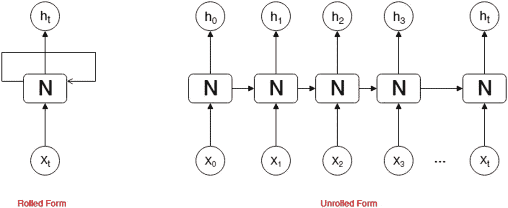

图 5-17

RNN 架构的展开与未展开形式

尽管 RNN 能够捕捉句子中的这种长期依赖关系，但它们需要仔细选择参数，这在许多实际问题中往往很困难。这正是 LSTM 发挥作用的地方。

图 5-18 展示了 LSTM 网络的架构。

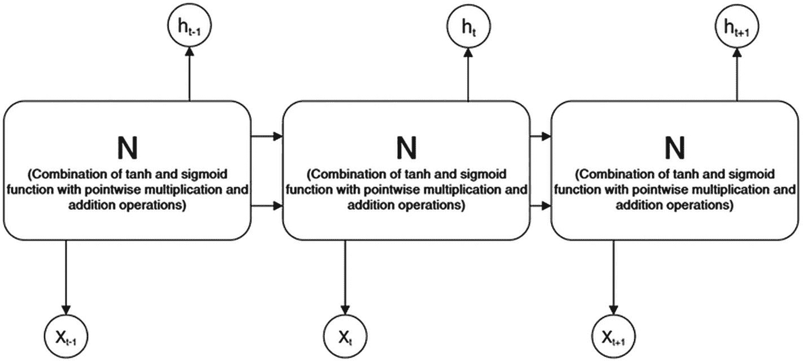

图 5-18

LSTM 的架构

LSTM 网络有四个主要部分：

*   **细胞状态**：从顶部贯穿的一条线，只有少数直接交互，如逐对乘法和加法，可以向细胞状态添加或移除任何信息。

*   **遗忘门层**：门是一种机制，LSTM 通过它来控制有多少信息应该通过细胞状态。这里使用了一个 sigmoid 函数，其输出值在 0 到 1 之间。如果值为 1，表示让所有信息通过；0 表示不让任何信息通过。

*   **输入门层**：这个称为输入门层的 sigmoid 层决定我们将更新哪些值。

*   **Tanh 层**：tanh 激活函数层根据上一时间步的输入和隐藏状态值，创建一个新的候选值向量。

#### 加载库

从 Keras 加载所需的库，Keras 是一个用 Python 构建的开源神经网络库。它是一个流行的库，用于以独立模式或在 TensorFlow、CNTK 和 Theano 等框架之上构建深度学习模型。它提供了用户友好、模块化和可扩展的语法与结构，能够快速进行深度学习模型的实验。

```
from keras.preprocessing.sequence import pad_sequences
from keras.layers import Embedding, LSTM, Dense, Dropout
from keras.preprocessing.text import Tokenizer
from keras.callbacks import EarlyStopping
from keras.models import Sequential
import keras.utils as ku
import numpy as np
```

#### 定义训练数据

我们从亚马逊美食评论数据集中选取了一条评论。不过，更多的数据会带来更好的结果。

```
review_data = ""Chilling in the fridge seems to boost the flavor even more;
and using them, rather than corn chips, to make nachos will have your tastebuds
singing like Janet Jackson but without any of the associated wardrobe risks."
```


#### 数据准备

让我们定义一个名为 `dataset_preparation` 的方法来执行以下主要任务：

1.  将输入的评论文本转换为小写，并按换行符 `\n` 将评论拆分为句子。拆分函数在语料库中创建了三个句子。以下是操作结果：

1.  对数据集中的输入评论进行分词。使用 Keras 的 `fit_on_text()` 方法。该方法在内部将单词表示为一个字典，每个单词根据其出现频率获得一个索引。因此，如果评论文本中的单词“the”出现次数最多，它将获得一个最小的索引值，例如 `word_index["the"] = 0`。在我们的评论中，除了单词“the”和“to”之外，所有其他单词都只出现一次。以下是操作的输出：

```
corpus = review_data.lower().split("\n")
print(corpus)
['chilling in the fridge seems to boost the flavor even more; ', 'and using them, rather than corn chips, to make nachos will have your tastebuds ', 'singing like janet jackson but without any of the associated wardrobe risks.']
```

1.  将评论中的每个单词转换为整数序列。每个单词获得与使用 `fit_on_text()` 获取的索引相对应的整数值。以下是输出：

```
review_tokenizer.fit_on_texts(corpus)
print(review_tokenizer.word_index)
{'the': 1, 'to': 2, 'chilling': 3, 'in': 4, 'fridge': 5, 'seems': 6, 'boost': 7, 'flavor': 8, 'even': 9, 'more': 10, 'and': 11, 'using': 12, 'them': 13, 'rather': 14, 'than': 15, 'corn': 16, 'chips': 17, 'make': 18, 'nachos': 19, 'will': 20, 'have': 21, 'your': 22, 'tastebuds': 23, 'singing': 24, 'like': 25, 'janet': 26, 'jackson': 27, 'but': 28, 'without': 29, 'any': 30, 'of': 31, 'associated': 32, 'wardrobe': 33, 'risks': 34}
```

```
token_list = review_tokenizer.texts_to_sequences([line])[0]
print(token_list)
[3, 4, 1, 5, 6, 2, 7, 1, 8, 9, 10]
[11, 12, 13, 14, 15, 16, 17, 2, 18, 19, 20, 21, 22, 23]
[24, 25, 26, 27, 28, 29, 30, 31, 1, 32, 33, 34]
```

请注意，我们使用 `fit_on_text()` 生成一次索引，然后可以根据需要多次使用 `texts_to_sequence()`。分配给每个单词的整数值使得神经网络中的计算成为可能。这种方法优于在神经网络训练开始时为每个单词分配一个随机数。

1.  使用语料库中每个句子的整数序列生成 n-gram 值。在 *for* 循环的每次迭代中，列表 `input_review_sequences` 都会更新。在最终输出中，会生成从 1 到 len(token_list) 的所有可能的 n-gram。

1.  对序列进行填充。由于每个 n-gram 序列的长度不同，神经网络中的矩阵计算将无法进行。因此，每个 n-gram 序列都用 0 填充，使其长度相等。例如，列表中的第一个序列 [3, 4] 被填充为 [ 0 0 0 0 0 0 0 0 0 0 0 0 3 4]。以下是填充后的矩阵视图：

```
for line in corpus:
token_list = review_tokenizer.texts_to_sequences([line])[0]
for i in range(1, len(token_list)):
n_gram_sequence = token_list[:i+1]
input_review_sequences.append(n_gram_sequence)
print(input_review_sequences)
迭代 1:
[[3, 4], [3, 4, 1], [3, 4, 1, 5], [3, 4, 1, 5, 6], [3, 4, 1, 5, 6, 2], [3, 4, 1, 5, 6, 2, 7], [3, 4, 1, 5, 6, 2, 7, 1], [3, 4, 1, 5, 6, 2, 7, 1, 8]]
迭代 2:
[[3, 4], [3, 4, 1], [3, 4, 1, 5], [3, 4, 1, 5, 6], [3, 4, 1, 5, 6, 2], [3, 4, 1, 5, 6, 2, 7], [3, 4, 1, 5, 6, 2, 7, 1], [3, 4, 1, 5, 6, 2, 7, 1, 8], [3, 4, 1, 5, 6, 2, 7, 1, 8, 9], [3, 4, 1, 5, 6, 2, 7, 1, 8, 9, 10], [11, 12], [11, 12, 13], [11, 12, 13, 14], [11, 12, 13, 14, 15], [11, 12, 13, 14, 15, 16], [11, 12, 13, 14, 15, 16, 17], [11, 12, 13, 14, 15, 16, 17, 2], [11, 12, 13, 14, 15, 16, 17, 2, 18], [11, 12, 13, 14, 15, 16, 17, 2, 18, 19], [11, 12, 13, 14, 15, 16, 17, 2, 18, 19, 20], [11, 12, 13, 14, 15, 16, 17, 2, 18, 19, 20, 21], [11, 12, 13, 14, 15, 16, 17, 2, 18, 19, 20, 21, 22], [11, 12, 13, 14, 15, 16, 17, 2, 18, 19, 20, 21, 22, 23]]
...
```

1.  将每个 n-gram 序列的最后一个单词设置为标签。例如，在对应于单词 [“chilling,” “in”] 的 n-gram 序列 [3,4] 中，标签是“in”。此外，在对应于单词 [“chilling,” “in,” “the”] 的 n-gram 序列 [3,4,1] 中，标签是“the”。由于模型旨在预测下一个可能的单词作为文本生成过程的一部分，因此预测变量和标签的序列将帮助神经网络训练，了解在给定单词序列后，下一个最可能出现的单词是哪个。以下代码是上述矩阵中每个 n-gram 序列的标签；请注意，它是上述矩阵每一行中的最后一个整数：

```
    predictors, label = input_review_sequences[:,:-1],input_review_sequences[:,-1]
    print(label)
    [ 4  1  5  6  2  7  1  8  9 10 12 13 14 15 16 17  2 18 19 20 21 22 23 25 26 27 28 29 30 31  1 32 33 34]
    ```

2.  作为预处理的最后一步，我们将每个标签转换为独热编码向量，使其适用于神经网络训练中的矩阵计算。`to_categorical()` 是 keras.utils 库中的一个方法。以下是输出：

```
    label = ku.to_categorical(label, num_classes=total_words)
    print(label)
    [[0\. 0\. 0\. ... 0\. 0\. 0.]
    [0\. 1\. 0\. ... 0\. 0\. 0.]
    [0\. 0\. 0\. ... 0\. 0\. 0.]
    ...
    [0\. 0\. 0\. ... 1\. 0\. 0.]
    [0\. 0\. 0\. ... 0\. 1\. 0.]
    [0\. 0\. 0\. ... 0\. 0\. 1.]]
    ```


```
max_sequence_len = max([len(x) for x in input_review_sequences])
input_review_sequences = np.array(pad_sequences(input_review_sequence,
maxlen=max_sequence_len, padding="pre"))
print(input_review_sequences)
[[ 0  0  0  0  0  0  0  0  0  0  0  0  3  4]
[ 0  0  0  0  0  0  0  0  0  0  0  3  4  1]
[ 0  0  0  0  0  0  0  0  0  0  3  4  1  5]
[ 0  0  0  0  0  0  0  0  0  3  4  1  5  6]
[ 0  0  0  0  0  0  0  0  3  4  1  5  6  2]
[ 0  0  0  0  0  0  0  3  4  1  5  6  2  7]
[ 0  0  0  0  0  0  3  4  1  5  6  2  7  1]
[ 0  0  0  0  0  3  4  1  5  6  2  7  1  8]
[ 0  0  0  0  3  4  1  5  6  2  7  1  8  9]
[ 0  0  0  3  4  1  5  6  2  7  1  8  9 10]
[ 0  0  0  0  0  0  0  0  0  0  0  0 11 12]
[ 0  0  0  0  0  0  0  0  0  0  0 11 12 13]
[ 0  0  0  0  0  0  0  0  0  0 11 12 13 14]
[ 0  0  0  0  0  0  0  0  0 11 12 13 14 15]
[ 0  0  0  0  0  0  0  0 11 12 13 14 15 16]
[ 0  0  0  0  0  0  0 11 12 13 14 15 16 17]
[ 0  0  0  0  0  0 11 12 13 14 15 16 17  2]
[ 0  0  0  0  0 11 12 13 14 15 16 17  2 18]
[ 0  0  0  0 11 12 13 14 15 16 17  2 18 19]
[ 0  0  0 11 12 13 14 15 16 17  2 18 19 20]
[ 0  0 11 12 13 14 15 16 17  2 18 19 20 21]
[ 0 11 12 13 14 15 16 17  2 18 19 20 21 22]
[11 12 13 14 15 16 17  2 18 19 20 21 22 23]
[ 0  0  0  0  0  0  0  0  0  0  0  0 24 25]
[ 0  0  0  0  0  0  0  0  0  0  0 24 25 26]
[ 0  0  0  0  0  0  0  0  0  0 24 25 26 27]
[ 0  0  0  0  0  0  0  0  0 24 25 26 27 28]
[ 0  0  0  0  0  0  0  0 24 25 26 27 28 29]
[ 0  0  0  0  0  0  0 24 25 26 27 28 29 30]
[ 0  0  0  0  0  0 24 25 26 27 28 29 30 31]
[ 0  0  0  0  0 24 25 26 27 28 29 30 31  1]
[ 0  0  0  0 24 25 26 27 28 29 30 31  1 32]
[ 0  0  0 24 25 26 27 28 29 30 31  1 32 33]
[ 0  0 24 25 26 27 28 29 30 31  1 32 33 34]]
```

将上述所有预处理步骤整合到一个方法中，得到如下代码：

```
#Tokenization to extract terms or words from a corpus
review_tokenizer = Tokenizer()
def dataset_preparation(review_data):
corpus = review_data.lower().split("\n")
review_tokenizer.fit_on_texts(corpus)
total_words = len(review_tokenizer.word_index) + 1
#Convert the corpus into a flat dataset
input_review_sequences = []
for line in corpus:
token_list = review_tokenizer.texts_to_sequences([line])[0]
for i in range(1, len(token_list)):
n_gram_sequence = token_list[:i+1]
input_review_sequences.append(n_gram_sequence)
#Pad the sequences
max_sequence_len = max([len(x) for x in input_review_sequences])
input_review_sequences = np.array(pad_sequences(input_review_sequences, maxlen=max_sequence_len, padding="pre"))
#Predictor and label data
predictors, label = input_review_sequences[:,:-1],input_review_sequences[:,-1]
label = ku.to_categorical(label, num_classes=total_words)
return predictors, label, max_sequence_len, total_words
```

#### 使用 LSTM 网络创建 RNN 架构

如引言所述，利用上述数据集预处理步骤中生成的预测变量和标签，我们通过以下层创建模型：

1.  **嵌入层**：这是每个词索引的密集向量表示。预测变量中的固定整数被转换为随机选择的密集向量。例如，`[3,4]` 可能被转换为 `[[0.26, 0.14], [0.2, -0.4]]`。密集向量的维度由 Keras 中 `embedding` 方法的第二个参数 `output_dim` 提供。该方法的第一个参数是 `input_dim`，即评论中的总词数。参数 `input_length` 设置为最大序列长度减 1。

2.  **LSTM 层**：长短期记忆层将 `units` 作为输出空间的维度。默认的激活函数是 tanh，循环激活函数默认是 hard sigmoid 函数。其他可用的激活函数包括 softmax、修正线性单元（ReLU）等。对于 LSTM，建议使用 tanh 和 sigmoid。

3.  **Dropout 层**：RNN 网络容易过拟合数据。在 Keras 的 `dropout` 方法中，它根据参数 `rate` 的值随机将一部分输入单元设置为 0。在示例中，rate 设置为 0.1，这意味着随机丢弃 10% 的输入单元。

4.  **全连接层**：`dense` 方法创建一个常规的全连接神经网络。它包含输出层，在该层应用 `softmax` 激活函数以生成 0 到 1 之间的值。根据输入的预测变量，值接近 1 的词很可能是序列中的下一个词。

最后，使用 `fit` 方法训练模型。在 `fit` 函数中，我们提供预测变量、标签和 epochs 作为输入参数。Epochs 决定训练的迭代次数。达到预定义的 epochs 后，训练停止。`compile()` 方法将 `loss` 函数设置为 `categorical_crossentropy`，并选择 `adam` 优化器作为学习算法，该算法基于随机梯度下降方法。设置指标 accuracy 以观察随着 epochs 增加训练精度的提升。

```
#RNN model
def create_model(predictors, label, max_sequence_len, total_words):
input_len = max_sequence_len - 1
model = Sequential()
model.add(Embedding(input_dim = total_words, output_dim = 10, input_length=input_len))
model.add(LSTM(150))
model.add(Dropout(0.1))
model.add(Dense(total_words, activation="softmax"))
model.compile(loss='categorical_crossentropy', optimizer="adam")
model.fit(predictors, label, epochs=100, verbose=1)
return model
```

#### 定义文本生成方法

以下方法利用训练好的模型预测最可能的下一个词。概率最高的词作为模型的输出。由于模型的输入是来自词索引的整数序列，因此在以下代码的 for 循环中执行到对应词的最终映射。预测中使用一个示例种子文本来生成文本。我们可以控制想要生成的词的数量。

```
def generate_text(seed_text, next_words, max_sequence_len, model):
for j in range(next_words):
token_list = review_tokenizer.texts_to_sequences([seed_text])[0]
token_list = pad_sequences([token_list], maxlen=
max_sequence_len-1, padding="pre")
predicted = model.predict_classes(token_list, verbose=0)
output_word = ""
for word, index in review_tokenizer.word_index.items():
if index == predicted:
output_word = word
break
seed_text += " " + output_word
return seed_text
```


#### 训练 RNN 模型

最后，我们使用 `dataset_preparation()` 方法准备数据，然后将输出传递给 `create_model()` 方法开始训练。训练会在 100 个 epoch 后自动停止。由于 epoch 是一个超参数，我们可以更改其值以进一步降低损失值。

```
X, Y, max_len, total_words = dataset_preparation(review_data)
model = create_model(X, Y, max_len, total_words)
Epoch 1/100
34/34 [==============================] - ETA: 0s - loss: 3.5555 - acc: 0.0000e+0 - 4s 129ms/step - loss: 3.5560 - acc: 0.0000e+00
Epoch 2/100
34/34 [==============================] - ETA: 0s - loss: 3.5527 - acc: 0.093 - 0s 1ms/step - loss: 3.5528 - acc: 0.0882
Epoch 3/100
34/34 [==============================] - ETA: 0s - loss: 3.5514 - acc: 0.093 - 0s 1ms/step - loss: 3.5513 - acc: 0.0882
Epoch 4/100
34/34 [==============================] - ETA: 0s - loss: 3.5492 - acc: 0.187 - 0s 1ms/step - loss: 3.5497 - acc: 0.1765
...
Epoch 79/100
34/34 [==============================] - ETA: 0s - loss: 2.2720 - acc: 0.312 - 0s 1ms/step - loss: 2.3008 - acc: 0.2941
Epoch 80/100
34/34 [==============================] - ETA: 0s - loss: 2.4143 - acc: 0.250 - 0s 1ms/step - loss: 2.4352 - acc: 0.2647
Epoch 81/100
34/34 [==============================] - ETA: 0s - loss: 2.2882 - acc: 0.187 - 0s 2ms/step - loss: 2.2994 - acc: 0.1765
Epoch 82/100
34/34 [==============================] - ETA: 0s - loss: 2.6602 - acc: 0.187 - 0s 1ms/step - loss: 2.7360 - acc: 0.1765
Epoch 83/100
34/34 [==============================] - ETA: 0s - loss: 2.5597 - acc: 0.250 - 0s 1ms/step - loss: 2.5235 - acc: 0.2353
Epoch 84/100
34/34 [==============================] - ETA: 0s - loss: 2.2769 - acc: 0.218 - 0s 1ms/step - loss: 2.2392 - acc: 0.2353
Epoch 85/100
34/34 [==============================] - ETA: 0s - loss: 2.4094 - acc: 0.218 - 0s 1ms/step - loss: 2.4340 - acc: 0.2059
Epoch 86/100
34/34 [==============================] - ETA: 0s - loss: 2.4646 - acc: 0.187 - 0s 1ms/step - loss: 2.4646 - acc: 0.1765
Epoch 87/100
34/34 [==============================] - ETA: 0s - loss: 2.3705 - acc: 0.218 - 0s 1ms/step - loss: 2.3532 - acc: 0.2353
Epoch 88/100
34/34 [==============================] - ETA: 0s - loss: 2.2616 - acc: 0.312 - 0s 1ms/step - loss: 2.2674 - acc: 0.2941
Epoch 89/100
34/34 [==============================] - ETA: 0s - loss: 2.3206 - acc: 0.156 - 0s 1ms/step - loss: 2.3513 - acc: 0.1765
Epoch 90/100
34/34 [==============================] - ETA: 0s - loss: 2.3629 - acc: 0.187 - 0s 1ms/step - loss: 2.3760 - acc: 0.2059
Epoch 91/100
34/34 [==============================] - ETA: 0s - loss: 2.3248 - acc: 0.218 - 0s 1ms/step - loss: 2.3491 - acc: 0.2059
Epoch 92/100
34/34 [==============================] - ETA: 0s - loss: 2.1996 - acc: 0.218 - 0s 1ms/step - loss: 2.2334 - acc: 0.2059
Epoch 93/100
34/34 [==============================] - ETA: 0s - loss: 2.2162 - acc: 0.156 - 0s 1ms/step - loss: 2.2047 - acc: 0.1765
Epoch 94/100
34/34 [==============================] - ETA: 0s - loss: 2.2623 - acc: 0.250 - 0s 1ms/step - loss: 2.2318 - acc: 0.2647
Epoch 95/100
34/34 [==============================] - ETA: 0s - loss: 2.3510 - acc: 0.218 - 0s 1ms/step - loss: 2.3256 - acc: 0.2353
Epoch 96/100
34/34 [==============================] - ETA: 0s - loss: 2.3909 - acc: 0.218 - 0s 1ms/step - loss: 2.3408 - acc: 0.2647
Epoch 97/100
34/34 [==============================] - ETA: 0s - loss: 2.1507 - acc: 0.250 - 0s 1ms/step - loss: 2.1700 - acc: 0.2353
Epoch 98/100
34/34 [==============================] - ETA: 0s - loss: 2.2254 - acc: 0.218 - 0s 1ms/step - loss: 2.1525 - acc: 0.2353
Epoch 99/100
34/34 [==============================] - ETA: 0s - loss: 2.1904 - acc: 0.281 - 0s 1ms/step - loss: 2.1384 - acc: 0.2941
Epoch 100/100
34/34 [==============================] - ETA: 0s - loss: 2.1210 - acc: 0.281 - 0s 1ms/step - loss: 2.1275 - acc: 0.2941
```

#### 生成文本

现在，利用模型，我们可以根据给定的种子文本预测下一个单词。在下面的示例中，种子文本是“signing like”，我们要求预测接下来的三个单词。结果接近我们的预期。不过，模型预测的是“jackson”，而不是“janet”。请注意，我们只用了少量数据样本来训练模型。更多的数据将进一步提升性能。正如我们在训练过程中观察到的，100 个 epoch 结束时的训练准确率保持在 29%，这个数值并不算高。

```
text = generate_text("singing like", 3, max_len, model)
print(text)
singing like jackson jackson the
```

## 应用

在本节中，我们将利用目前已掌握的知识，构建以下四个 NLP 应用：

*   **使用 spaCy、NLTK 和 gensim 库进行主题建模：** 这是本章前面使用 LDA 进行主题建模的扩展。在此演示中，我们将结合使用 spaCy、NLTK 和 gensim 的知识，在主题建模中执行各种任务。

*   **通过人名区分男性和女性性别：** 利用名字的最后一个字母等特征，以及男性和女性名字的语料库，我们将对男性和女性名字进行分类。这可能有助于筛选评论，并识别产品评论中任何基于性别的差异。

*   **给定文档，将其分类到不同类别：** 将评论分为正面和负面。我们将使用 NLTK 库，通过朴素贝叶斯分类器执行预处理和分类。

*   **意图分类与问答：** 在此应用中，我们将构建一个意图分类器和基于上下文的问答工具，该工具可与任何聊天机器人应用集成。我们将使用 Python 中的 DeepPavLov 库提供的预训练深度学习模型。

### 使用 spaCy、NLTK 和 gensim 库进行主题建模

在演示中，我们将使用 spaCy 对评论文本进行分词，使用 NLTK 进行词形还原和文本预处理，并使用 gensim 中的 LDA 模型来训练模型。

#### 分词与文本清洗

使用 spaCy 中的 `en_core_web_md` 语言模型（这是一个比 `sm` 稍大的预训练模型，意味着它在更大的词汇量上进行了训练），我们将在清洗过程中对每个词元执行以下操作：

1.  检测 URL 和屏幕名称，并将它们分别追加到 `lda_review_tokens` 列表中。这是为了确保 URL 和屏幕名称不会被进一步处理。

2.  将其余词元转换为小写。

```
# Clean
import spacy
spacy.load('en_core_web_md')
from spacy.lang.en import English
parser = English()
def tokenize_review_text(text):
lda_review_tokens = []
review_tokens = parser(text)
for token in review_tokens:
if token.orth_.isspace():
continue
elif token.like_url:
lda_review_tokens.append('URL')
elif token.orth_.startswith('@'):
lda_review_tokens.append('SCREEN_NAME')
else:
lda_review_tokens.append(token.lower_)
return lda_review_tokens
```

#### 词形还原

使用 `wordnet` 方法，返回每个单词的词元。词形还原只保留单词的词根，而不是其不同形式。

```
import nltk
nltk.download('wordnet')
from nltk.corpus import wordnet as wordNet
def get_lemma(word):
lemma = wordNet.morphy(word)
if lemma is None:
return word
else:
return lemma
```


#### LDA 文本预处理方法

在预处理步骤中，我们执行以下功能：

1.  移除英语词汇中的所有停用词。我们需要先下载名为 `stopwords` 的数据集，才能检查词元中是否包含它们。

2.  移除停用词后，提取每个词元的词元（lemma）。

以下代码展示了样本文本的预处理结果：

```
from nltk.stem.wordnet import WordNetLemmatizer
def get_lemma2(word):
return WordNetLemmatizer().lemmatize(word)
# 移除英语停用词
nltk.download('stopwords')
en_stop = set(nltk.corpus.stopwords.words('english'))
def preprocess_text_for_lda(input_review_text):
tokens = tokenize_review_text(input_review_text)
tokens = [token for token in tokens if len(token) > 4]
tokens = [token for token in tokens if token not in en_stop]
tokens = [get_lemma(token) for token in tokens]
return tokens
preprocess_text_for_lda("I consume about a jar every two weeks of this, either adding it to fajitas or using it as a corn chip dip")
['consume', 'every', 'week', 'either', 'add', 'fajitas', 'using']
```

#### 读取训练数据

我们读取名为 `corn_review.txt` 的评论文件，该文件包含亚马逊美食评论数据集中与“玉米”相关产品的一些样本评论。以下代码打印了从文件中预处理评论后的前几条评论：

```
review_text_data = []
with open('data/corn_review.txt') as f:
for line in f:
tokens = preprocess_text_for_lda(line)
print(tokens)
review_text_data.append(tokens)
['consume', 'every', 'week', 'either', 'add', 'fajitas', 'using']
['taste', 'taste', 'check', 'ingredient']
['found', 'crisp', 'local', 'walmart', 'figure', 'would']
...
```

#### 词袋模型

现在，我们使用 gensim 库，将上一步处理后的评论文本转换为词袋语料库，并将其作为 pickle 文件存储在磁盘上。之后，我们加载该文件并训练 LDA 模型。同时，我们保存使用 `corpora.Dictionary` 创建的词典。

```
#LDA gensim
from gensim import corpora
corn_review_dict = corpora.Dictionary(review_text_data)
corn_review_corpus = [corn_review_dict.doc2bow(text) for text in review_text_data]
import pickle
pickle.dump(corpus, open('corn_review_corpus.pkl', 'wb'))
dictionary.save('corn_review_dict.gensim')
```

#### 训练并保存模型

最后，我们使用 gensim 中的 `ldamodel` 训练模型，生成五个主题，并将模型保存到磁盘以供后续使用。请注意，模型通过词语及其在决定主题时的权重来呈现主题表示。

```
import gensim
number_of_topics = 5
corn_review_ldamodel = gensim.models.ldamodel.LdaModel(corn_review_corpus, num_topics = number_of_topics, id2word=corn_review_dict, passes=15)
corn_review_ldamodel.save('corn_review_ldamodel.gensim')
topics = corn_review_ldamodel.print_topics(num_words=4)
for topic in topics:
print(topic)
(0, '0.020*"ginger" + 0.018*"flavor" + 0.015*"recipe" + 0.015*"syrup"')
(1, '0.021*"chips" + 0.014*"tortilla" + 0.014*"flavor" + 0.014*"rather"')
(2, '0.016*"using" + 0.016*"add" + 0.016*"fajitas" + 0.016*"consume"')
(3, '0.003*"ginger" + 0.003*"vernor" + 0.003*"taste" + 0.003*"sugar"')
(4, '0.034*"taste" + 0.019*"check" + 0.019*"ingredient" + 0.003*"product"')
```

从上面的输出来看，主题 0 和主题 3 似乎与“姜味玉米糖浆”有关，而主题 2 和主题 4 所传达的含义则不太明确。此外，主题 1 提到了“玉米片”。

#### 预测

现在，我们使用上述模型，看看它在处理新文本时的表现如何。为了预测主题，我们需要先对语料库进行预处理，并将其转换为词袋表示。从预测结果来看，第一个示例与主题 0 更相关，其概率最高。此外，第二个示例提到了“玉米片”，这由上面的主题 1 表示。

```
#预测
new_doc = 'Corn is typically yellow but comes in a variety of other colors, such as red, orange, purple, blue, white, and black.'
new_doc = preprocess_text_for_lda(new_doc)
new_doc_bow = corn_review_dict.doc2bow(new_doc)
print(new_doc_bow)
print(corn_review_ldamodel.get_document_topics(new_doc_bow))
[(100, 1), (219, 1)]
[(0, 0.73304677), (1, 0.066701755), (2, 0.0667417), (3, 0.066757984), (4, 0.066751845)]
new_doc = 'corn tortilla or just tortilla is a type of thin, unleavened flatbread'
new_doc = preprocess_text_for_lda(new_doc)
new_doc_bow = corn_review_dict.doc2bow(new_doc)
print(new_doc_bow)
print(corn_review_ldamodel.get_document_topics(new_doc_bow))
[(230, 2)]
[(0, 0.06699851), (1, 0.73296124), (2, 0.066678636), (3, 0.06668124), (4, 0.06668032)]
```

### 性别识别

在此应用中，我们使用一个包含男性和女性名字的语料库来构建一个模型，用于根据给定姓名预测性别。这是一个简单的模型，唯一的特征是名字的最后一个字母。其核心思想是，女性和男性的名字通常表现出某些独特的特征。例如，大多数女性名字以 a、e 和 i 结尾。我们使用 NLTK 库来构建此模型。

#### 加载 NLTK 库并下载名字语料库

从 NLTK 库下载男性和女性名字语料库。该语料库主要由英语名字组成。该模型是通用的，也适用于非英语名字。但是，请注意，我们提取的特征可能不适用于所有名字。

```
import nltk
nltk.download('names')
[nltk_data] Downloading package names to
[nltk_data]     C:\Users\KARTHIK\AppData\Roaming\nltk_data...
[nltk_data]   Unzipping corpora\names.zip.
```

#### 加载男性和女性名字

下载完成后，我们分别创建男性和女性名字的列表，以便进一步处理。

```
names = nltk.corpus.names
names.fileids()
male_names = names.words('male.txt')
female_names = names.words('female.txt')
```

#### 常见名字

我们可以打印一些在男性和女性语料库中都存在的常见名字，例如 Abbie、Andy 和 Barrie。

```
#常见名字
print([w for w in male_names if w in female_names])
['Abbey', 'Abbie', 'Abby', 'Addie', 'Adrian', 'Adrien', 'Ajay', 'Alex', 'Alexis', 'Alfie', 'Barrie', 'Ariel', 'Allie', 'Angel', 'Angie', 'Andrea', 'Andy', 'Allyn', 'Andie', 'Alix', 'Ashley', 'Aubrey', 'Augustine', 'Austin', 'Averil', 'Ali', 'Barry', 'Beau', 'Bennie', 'Benny',...]
```

#### 提取特征

作为模型的一个特征，我们提取每个名字的最后一个字母。通常，名字的最后一个字母是判断一个人性别的一个良好指标。我们将在模型的输出中进一步看到，名字的最后一个字母在性别预测模型中如何发挥重要作用。

```
def gender_features(word):
return {'last_letter': word[-1]}
gender_features('Shrek')
{'last_letter': 'k'}
```

#### 随机拆分为训练集和测试集

现在我们训练模型。我们将男性和女性名字语料库拆分为训练集和测试集。拆分是在使用 Python 的 `random` 库随机打乱名字后进行的。从生成的语料库中，我们将前 500 个名字分配给训练集，接下来的 500 个名字分配给测试集。

```
from nltk.corpus import names
labeled_names = ([(name, 'male') for name in names.words('male.txt')] + [(name, 'female') for name in names.words('female.txt')])
import random
random.shuffle(labeled_names)
featuresets = [(gender_features(n), gender) for (n, gender) in labeled_names]
train_set, test_set = featuresets[500:], featuresets[:500]
```


#### 训练模型

我们使用朴素贝叶斯（NB）分类器在训练数据集上训练模型。NB 基于贝叶斯定理，根据给定名字是男性还是女性来计算先验概率和后验概率。关于 NB 的讨论超出了本书的范围。感兴趣的读者可以参考以下链接中的 NLTK 文档，其中解释了实现方法：[`www.nltk.org/_modules/nltk/classify/naivebayes.html`](http://www.nltk.org/_modules/nltk/classify/naivebayes.html)。

```
classifier = nltk.NaiveBayesClassifier.train(train_set)
```

#### 模型预测

使用上面构建的模型，我们预测一些名字（如 John 和 Sascha）的性别。此外，我们尝试一些常见的名字，看看模型预测它们属于哪个类别。

```
classifier.classify(gender_features('John'))
'male'
classifier.classify(gender_features('Sascha'))
'female'
```

#### 模型准确率

该模型的准确率似乎达到了 81.6%，这是一个相当不错的模型。如果我们希望预测更精确，需要加入更多特征。

```
print(nltk.classify.accuracy(classifier, test_set))
0.816
```

#### 最具信息量的特征

使用模型中的 `show_most_informative_features()` 方法，我们可以看出名字的哪些最后一个字母对于区分男性和女性名字至关重要。

观察以下输出，以 **a** 作为最后一个字母的名字是女性的可能性几乎是男性的 36 倍，而以 **k** 作为最后一个字母的名字是男性的可能性是女性的 32 倍。该模型的准确率超过 80%。

```
classifier.show_most_informative_features(5)
Most Informative Features
last_letter = 'a'          female : male =     35.7 : 1.0
last_letter = 'k'          male : female =     32.0 : 1.0
last_letter = 'p'          male : female =     19.7 : 1.0
last_letter = 'f'          male : female =     15.8 : 1.0
last_letter = 'v'          male : female =      9.8 : 1.0
```

### 文档分类

NLP 中的一个常见任务是将文档（也可以是句子集合）标记到特定类别。例如，新闻聚合器将文章分类为政治、体育和商业。当存在大量非结构化的文本数据，且没有人工进行标记时，这种分类非常有用。自动文档分类器可以加速标记过程。另一个应用领域是将电影和产品评论分类为正面和负面情感。

#### 加载库

我们将使用 NLTK 库中的 `CategorizedPlaintextCorpusReader` 方法来创建一个包含类别信息的评论语料库。

```
import os
import random
from nltk.corpus.reader.plaintext import CategorizedPlaintextCorpusReader
```

#### 将数据集读入分类语料库

我们创建了两组评论：负面和正面。每条正面和负面评论都存储在单独的文本文件中，文件名如 `1_neg.txt` 和 `1_pos.txt`，并放入一个公共文件夹中。以下代码读取每个文件，并将评论分类为“pos”（正面）或“neg”（负面）。每个类别有 10 个文本文件。这些数据存储为 `CategorizedPlaintextCorpusReader`。

```
# Directory of the corpus
corpusdir = 'corpus/'
review_corpus = CategorizedPlaintextCorpusReader(corpusdir, r'.*\.txt', cat_pattern=r'\d+_(\w+)\.txt')
# list of documents(fileid) and category (pos/neg)
documents = [(list(review_corpus.words(fileid)), category)
for category in review_corpus.categories()
for fileid in review_corpus.fileids(category)]
random.shuffle(documents)
for category in review_corpus.categories():
print(category)
output:
neg
pos
type(review_corpus)
nltk.corpus.reader.plaintext.CategorizedPlaintextCorpusReader
len(documents)

```

#### 计算词频

现在我们使用 NLTK 的 `FreqDist()` 方法统计给定语料库中每个单词出现的频率。以下代码按出现频率降序打印前 200 个单词：

```
import nltk
all_words = nltk.FreqDist(w.lower() for w in review_corpus.words())
word_features = list(all_words)[:200]
print(word_features)
['warning', '!', '-', 'alcohol', 'sugars', '!,"', 'buyer', 'beware', 'please', 'this', 'sweetener', 'is', 'not', 'for', 'everybody', '.', 'maltitol', 'an', 'sugar', 'and', 'can', 'be', 'undigestible', 'in', 'the', 'body', 'you', 'will', 'know', 'a', 'short', 'time', 'after', 'consuming', 'it', 'if', 'are', 'one', 'of', 'unsuspecting', 'many', 'who', 'cannot', 'digest', 'by', 'extreme', 'intestinal', 'bloating', 'cramping', 'massive', 'amounts', 'gas', 'person', 'experience', 'nausea', ',', 'diarrhea', '&', 'headaches', 'also', 'experienced', 'i', 'learned', 'my', 'lesson', 'hard', 'way', 'years', 'ago', 'when', 'fell', 'love', 'with', 'free', 'chocolates', 'suzanne', 'sommers', 'used', 'to', 'sell', 'thought', "'", 'd', 'found', 'chocolate', 'nirvana', 'at', 'first', 'taste', 'but', 'bliss', 'was',..]
```

#### 检查高频词是否存在

我们定义了一个名为 `document_features()` 的方法，该方法检查之前读取的负面和正面评论文本文件中是否存在某个高频词。如果找到，打印语句将输出该词。

```
#Check whether most frequent word is present in the doc or not
def document_features(document):
document_words = set(document)
features = {}
for word in word_features:
features['contains({})'.format(word)] = (word in document_words)
return features
print(document_features(review_corpus.words('1_pos.txt')))
{'contains(warning)': False, 'contains(!)': False, 'contains(-)': False, 'contains(alcohol)': False, 'contains(sugars)': False, 'contains(!,")': False, 'contains(buyer)': False,...}
print(document_features(review_corpus.words('1_neg.txt')))
{'contains(warning)': False, 'contains(!)': False, 'contains(-)': False, 'contains(alcohol)': False, 'contains(sugars)': False, 'contains(!,")': False,...}
```

#### 训练模型

我们随机选取 15 个文档用于训练，5 个用于测试。然后使用朴素贝叶斯分类器进行分类。我们还打印了测试数据和训练数据的准确率。测试准确率似乎很低，只有 20%，训练准确率为 67%。增加训练数据量可以提高准确率。

```
featuresets = [(document_features(d), c) for (d,c) in documents]
train_set, test_set = featuresets[5:], featuresets[:5]
classifier = nltk.NaiveBayesClassifier.train(train_set)
print(nltk.classify.accuracy(classifier, test_set))
0.2
print(nltk.classify.accuracy(classifier, train_set))
0.6666666666666666
```


#### 最具信息量的特征

同样，使用模型中的 `show_most_informative_features` 方法，我们可以检查哪些词语更有可能决定一条评论是负面还是正面。这为评论被分类为负面或正面提供了解释。

```
classifier.show_most_informative_features(5)
Most Informative Features
contains(not) = True            neg : pos    =      5.2 : 1.0
contains(this) = False           neg : pos    =      5.2 : 1.0
contains(like) = True            neg : pos    =      4.3 : 1.0
contains(not) = False           pos : neg    =      4.0 : 1.0
contains(this) = True            pos : neg    =      4.0 : 1.0
contains(so) = True            neg : pos    =      3.3 : 1.0
contains(me) = True            neg : pos    =      3.3 : 1.0
contains(good) = True            neg : pos    =      2.6 : 1.0
contains(have) = True            neg : pos    =      2.6 : 1.0
contains(much) = True            neg : pos    =      2.4 : 1.0
```

在这个语料库中，提到 **“not”** 的评论是负面的可能性几乎是正面的五倍，而提到 **“good”** 的评论是负面的可能性仅为正面的三倍左右。也许“good”这个词的负面倾向源于那些评论内容为“产品不错，但是……”的客户，他们可能有一两个抱怨。

如果我们向这个正面和负面评论的语料库中添加更多评论，准确率将会开始提升。

### 意图分类与问答

一个聊天机器人应良好执行的两个最重要的 NLU 任务是：对给定用户查询的意图进行分类，以及通过理解上下文来回答问题。虽然围绕这两个任务有许多专有框架，但它们无法提供幕后情况的可见性。在本节中，我们将使用一个名为 `deeppavlov` 的 Python 库。这是一个用于端到端对话系统和聊天机器人的开源深度学习库。该库提供了许多预训练的深度学习模型作为其产品的一部分。

#### 意图分类

我们需要将给定的查询（用户输入）分类到一个意图类别中。一旦识别出意图类别，聊天机器人就可以触发相应的逻辑来响应用户查询。例如，如果查询是“今天天气怎么样”，意图分类应触发聊天机器人内部的天气服务 API 并获取结果。

`deeppavlov` 库提供了许多内置的意图分类模型。在下面的演示中，我们将使用一个名为 SNIPS 的预训练 NLU 基准数据集。它针对以下七种意图进行了训练：

*   GetWeather

*   BookRestaurant

*   PlayMusic

*   AddToPlaylist

*   RateBook

*   SearchScreeningEvent

*   SearchCreativeWork

##### 设置 tensorflow 作为后端

为了在 Windows 平台上使用 `KerasClassificationModel`，我们需要将 `KERAS_BACKEND` 设置为 “tensorflow”。以下代码用于实现此目的：

```
import os
os.environ["KERAS_BACKEND"] = "tensorflow"
```

##### 构建模型

我们在 virtualenv 或 conda 环境中安装 `deeppavlov`。在下面的命令行示例中，我们创建了一个名为 `deeppavlov` 的 conda 环境，然后安装并下载了使用 SNIPS 意图所需的库和模型文件：

```
(deeppavlov) C:\Users\Karthik\ Code>python -m deeppavlov install "C:\ProgramData\Anaconda3\Lib\site-packages\deeppavlov\configs\classifiers\intents_snips.json"
(deeppavlov) C:\Users\Karthik\ Code>python -m deeppavlov download "C:\ProgramData\Anaconda3\Lib\site-packages\deeppavlov\configs\classifiers\intents_snips.json"
```

安装和下载成功后，以下代码使用 `build_model` 方法构建模型。请注意，首次运行此代码时，需要设置 `download = True` 以下载所有必需的预训练模型。下载大小约为 3GB。

```
from deeppavlov import build_model, configs
CONFIG_PATH = configs.classifiers.intents_snips  # 也可以是配置字典、字符串路径或 `pathlib.Path` 实例
#model = build_model(CONFIG_PATH, download=True)  # 运行一次
model = build_model(CONFIG_PATH, download=False)  # 否则
2019-07-02 19:48:10.74 INFO in 'deeppavlov.models.embedders.fasttext_embedder'['fasttext_embedder'] at line 67: [loading fastText embeddings from `C:\Users\Karthik\.deeppavlov\downloads\embeddings\dstc2_fastText_model.bin`]
Using TensorFlow backend.
2019-07-02 19:51:04.703 INFO in 'deeppavlov.models.classifiers.keras_classification_model'['keras_classification_model'] at line 273: [initializing `KerasClassificationModel` from saved]
2019-07-02 19:51:05.866 INFO in 'deeppavlov.models.classifiers.keras_classification_model'['keras_classification_model'] at line 283: [loading weights from model.h5]
2019-07-02 19:51:07.653 INFO in 'deeppavlov.models.classifiers.keras_classification_model'['keras_classification_model'] at line 134: Model was successfully initialized!
Model Summary:
...
Total params: 235,475
Trainable params: 233,725
Non-trainable params: 1,750
```

##### 分类意图

现在我们可以使用该模型了。在以下代码中，我们尝试了几个意图，如 `GetWeather`、`BookRestaurant`、`RateBook` 和 `SearchScreeningEvent`。

```
print(model(["will it rain in Edgbaston, Birmingham today?"]))
[['GetWeather']]
print(model(["book one table at a good restaurant?"]))
[['BookRestaurant']]
print(model(["Give Da Vinci Code a 5 star on my amazon purchase"]))
[['RateBook']]
print(model(["what are the show times for The Lion King"]))
[['SearchScreeningEvent']]
```

你可以训练一个自定义模型来为特定用例分类意图。有关训练自定义模型的更多详细信息，请参见 [`http://docs.deeppavlov.ai/en/latest/components/classifiers.html#how-to-train-on-other-datasets`](http://docs.deeppavlov.ai/en/latest/components/classifiers.html%2523how-to-train-on-other-datasets) 。训练自定义模型是一个资源密集型过程。因此，如果你正在尝试构建一个通用聊天机器人，我们建议你在决定构建自己的模型之前，先探索此处展示的所有预训练模型：[`http://docs.deeppavlov.ai/en/latest/components/classifiers.html#pre-trained-models`](http://docs.deeppavlov.ai/en/latest/components/classifiers.html%2523pre-trained-models) 。

#### 问答

聊天机器人通常需要理解对话的上下文才能回答用户的特定查询。`deeppavlov` 库提供了一个在斯坦福问答数据集（SQuAD）上训练的预训练模型，该数据集是一个阅读理解数据集，包含基于一组维基百科文章的众包问题。有关该数据集的更多详细信息，请参见 [`https://rajpurkar.github.io/SQuAD-explorer/`](https://rajpurkar.github.io/SQuAD-explorer/) 。

在 SQuAD 数据集上训练的模型的主要任务是识别给定的上下文，并在该上下文中回答问题。

##### 构建模型

与意图分类类似，我们使用带有 SQuAD 预训练模型配置的 `build_model` 方法。运行以下代码一次，并将 `download = True` 设置为获取所有必需的模型。同时，运行以下命令安装 `squad_bert` 预训练模型：

```
python -m deeppavlov install squad_bert
from deeppavlov import build_model, configs
#model = build_model(configs.squad.squad, download=True)
model = build_model(configs.squad.squad)
```


##### 上下文与问题

模型构建完成后，以下是给定上下文和问题的一些示例。接下来我们将观察模型的表现。在第一个示例中，我们提供了一个名为 IRIS 的聊天机器人的上下文，然后向模型提问“IRIS 是什么？”模型正确地从上下文中提取了最相关的部分，并从第八个字符开始给出了输出。

```
model(['IRIS 是一个完全内部构建的企业级聊天机器人，使用私有数据'], ['IRIS 是什么？'])
[['一个完全内部构建的企业级聊天机器人'], [8], [832987.875]]
```

在下一个示例中，我们提供了亚马逊食品评论数据集中的一条评论作为上下文，然后提问“做了多少个蛋糕？”模型能够给出正确答案 20。

```
model(['很棒的早餐蛋糕！去年秋天我们大概做了 20 个这种蛋糕，味道非常好。而且制作非常简单。早上搭配培根和鸡蛋吃很棒。作为甜点也很不错（我相信它本来就是这么设计的；）。我们没有按建议加糖霜，因为蛋糕本身已经很好吃了。现在天气转凉，我们很期待再次制作我们最爱的秋季蛋糕。'], ['做了多少个蛋糕？'])
[['20'], [44], [42414.3046875]]
```

在接下来的示例中，我们测试模型是否能够从给定上下文中识别出能回答“客户对购买是否满意？”的短语。模型正确提取了表达特定情感的短语：“失望”。它告诉我们客户对购买是满意的。在这个问题中，我们没有使用上下文中的任何词语，但模型仍然能够提取出最合适的短语。

```
model(['我用这些彩虹糖针装饰了彩虹纸杯蛋糕，并添加到米花糖中，为女儿庆祝六岁生日。显然，这是一个彩虹主题派对。包装看起来和图片不一样，但我对产品并不失望。我会再次购买这家公司的产品。'], ['客户对购买是否满意？'])
[['我并不失望'], [209], [2021.420166015625]]
```

##### 部署 DeepPavlov 模型

在 DeepPavlov 术语中，每个技能或组件都可以作为 REST API 提供。一旦技能或组件被托管为服务，任何应用程序或服务都可以调用该 API 来获取响应。在以下示例中，如果我们使用以下命令行参数托管“intents_snips”组件：

```
(deeppavlov) C:\Users\Karthik\ Code>python -m deeppavlov riseapi "C:\ProgramData\Anaconda3\Lib\site-packages\deeppavlov\configs\classifiers\intents_snips.json"
```

执行完上述命令后，我们应该看到以下输出，其中创建了一个 Flask 应用，API 在本地主机上运行。您可以指定自己的端口和 URL 来托管 API。更多信息请参见[`http://docs.deeppavlov.ai/en/latest/devguides/rest_api.html`](http://docs.deeppavlov.ai/en/latest/devguides/rest_api.html)。

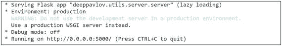

现在，像下面这样的 POST 请求应该会返回一个包含意图类别`[['SearchScreeningEvent']]`的 JSON 响应：

```
{"context":["《狮子王》的放映时间是什么时候"]}
```

在下一章中，我们将介绍名为 IRIS 的企业级聊天机器人，届时可以直接调用上述 REST API 进行意图分类。请注意，您仍然需要在私有企业数据上训练自己的模型，才能将其与聊天机器人集成。尽管我们将使用 Java 框架构建 IRIS，但上面创建的 REST API 可以轻松地从 Java 应用程序中调用。我们可以利用 Python 强大的 NLP、NLU 和 NLG 库创建许多应用程序，并将它们全部托管为 REST API，这种方式与语言和平台无关。

## 总结

我们首先识别了自然语言处理、自然语言理解和自然语言生成之间的区别，然后讨论了可用于处理和理解自然语言的各种开源工具。

接着我们深入探讨了 NLP，展示了如何使用 NLTK、spaCy、CoreNLP、genism 和 TextBlob 等工具执行各种任务，例如处理文本数据、文本规范化、词性标注、依存句法分析、拼写纠正、机器翻译和命名实体识别。

在 NLU 部分，我们展示了 Word2Vec 和 GloVe 等语言模型，用于执行开箱即用的任务，如词语和句子相似度计算、寻找词语间的线性子结构，以及对词嵌入向量进行算术运算以发现词语间有意义的语义关系。作为 NLG 的重要组成部分，我们使用 OpenIE 工具从给定句子中探索关系抽取，并使用潜在狄利克雷分配（LDA）构建了主题建模工具。

随后我们进入 NLG 部分，探索了使用 Python 中的 markovify 库生成随机标题等用例。接着我们探索了 SimpleNLG，这是一个基于英语语法的自然语言生成工具。它提供了语法结构，如生成过去时、否定形式、补语和介词短语。在 NLG 部分，我们构建了一个基于深度学习的模型，用于预测给定短语或句子中的下一个词。该模型使用了名为长短期记忆网络的流行深度学习架构。

在最后一部分，我们涵盖了 NLP 和 NLU 的应用：主题建模、性别识别、文档分类、意图分类和问答系统。在主题建模中，我们利用了本章前面部分所有可用的开源工具。

总体而言，在本章中我们深入探索了自然语言的 P-U-G。Python 和 Java 提供的众多开源工具为我们理解和建模自然语言提供了大量演示。我们涵盖了从解析文本数据到使用深度学习模型构建生成模型等不同层次的主题。本章的目标是提供一套详尽的方法和工具，使您能够构建具备基础及高级自然语言处理、理解和生成能力的聊天机器人。

接下来，我们将在私有数据集上构建并部署一个功能完善的企业级内部聊天机器人。由于许多聊天机器人框架都支持 NLP 和 NLU，本章讨论的方法起初可能看起来不那么直接可用；然而，在底层，许多框架（如 RASA 和 LUIS）内部都使用了本章讨论的技术。此外，NLG 的许多思想在任何标准聊天机器人框架中仍然不可用，因此它们通常需要从头构建。我们相信，当您构建企业级聊天机器人时，本章所教授的思想将非常有用。

脚注 1


