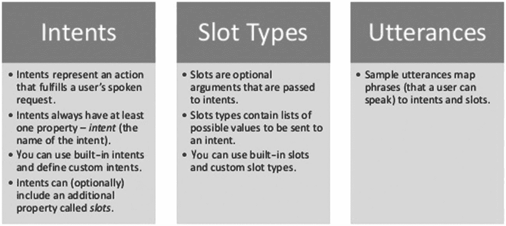
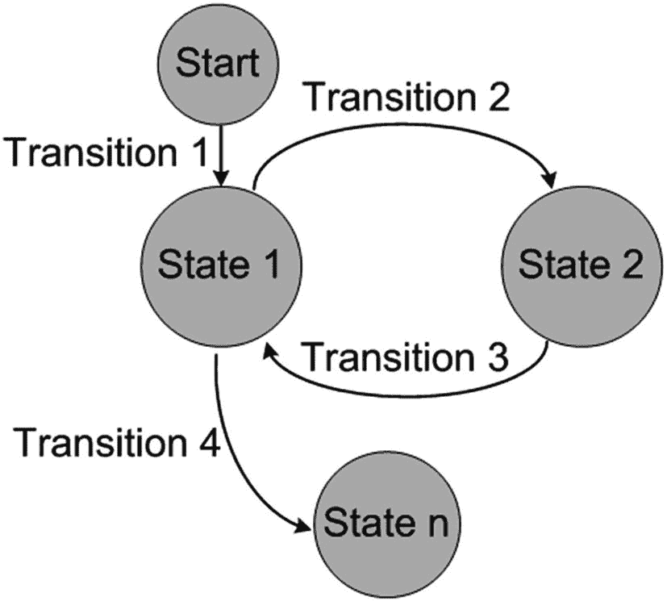
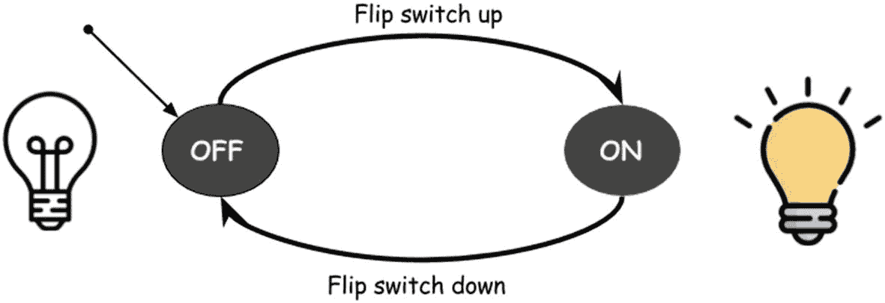
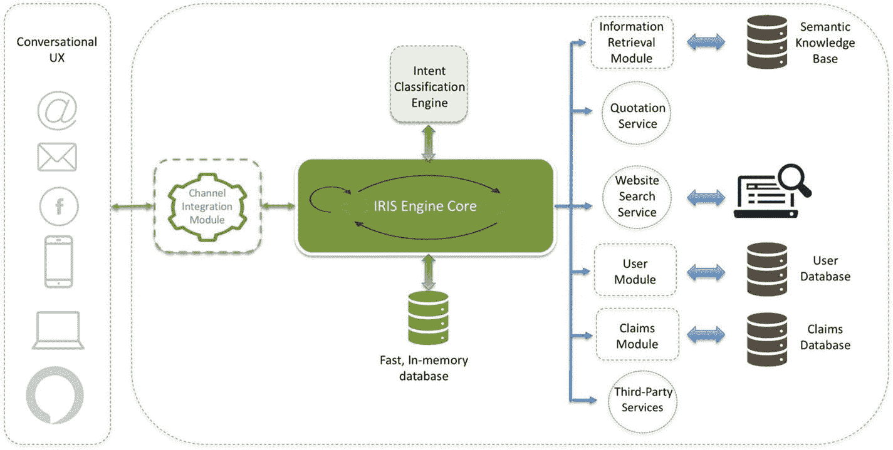

# 6. 一种新颖的自研聊天机器人框架实现

在前几章中，我们解释了意图以及使用自然语言技术对意图进行分类的不同方法。我们还讨论了设计企业级聊天机器人时可用的各种数据源。市面上有许多可用于构建聊天机器人的平台和框架。这些框架抽象了许多复杂功能，并提供了可复用、可扩展且可伸缩的组件。

在不使用框架的情况下设计企业级聊天机器人具有以下优势：

*   提供更好的安全性和控制力
*   防止第三方供应商泄露数据
*   降低运营成本
*   深度分析能力
*   灵活的架构设计
*   变更控制管理
*   互操作性
*   与企业级现有服务和框架的轻松快速集成
*   与即时通讯平台集成
*   与自定义机器学习模型集成
*   根据组织变化灵活定制

在本章中，我们将讨论并实现一个名为 IRIS（意图识别与信息服务）的自定义聊天机器人。我们将解释前几章所阐述概念的具体实现。我们将讨论对话式聊天机器人中状态机的设计与实现、状态间的转换，以及它们对于维护用户话语上下文的关键作用，同时探讨如何让聊天机器人通过短期记忆和长期记忆模拟人类对话。

在 IRIS 中，聊天机器人的核心引擎使用 Java 编写，而集成模块则负责将 IRIS 与 Facebook Messenger 等不同即时通讯平台连接。该集成模块使用 NodeJS 编写，将在下一章中讨论。

## IRIS 简介

我们开发 IRIS 作为一个开源聊天机器人框架，旨在提供从零开始理解和实现聊天机器人的入门级指导。IRIS 支持使用我们的模板，通过机器学习从用户话语中提取信息，例如使用命名实体识别（NER）。它还提供了自定义增强功能，如自定义意图匹配实现、对话状态管理以及许多其他特性。

其设计灵感来源于我们集体经验的积累，以及对亚马逊 Echo 自然语言理解模型、Alexa Skills、RASA、Mutters、Dialogflow 和 Microsoft Bot Builder 等其他流行框架设计与实现方式的探索。IRIS 借鉴了 Mutters（一个基于 Java 的开源机器人大脑构建框架）的许多方法和实现，并复用了其部分设计和代码概念，以创建一个简单且经过修改的后端代码库。像 Mutters 这样的平台提供了大量开箱即用的功能、支持以及便捷的集成。除了我们自定义的聊天机器人框架，我们将在下一章讨论广泛流行的平台和框架及其工作原理。

## 意图、槽位与匹配器

在上一章中，我们指出意图是用户话语行为和焦点的结果。在本章中，我们将描述意图的各个组成部分，并讨论创建和分类意图的实现方法。意图由以下组件定义：

*   名称
*   示例话语
*   槽位（实体）
*   槽位匹配器

每个意图可以有零个或多个槽位，用于从用户话语中提取实体。例如，如果一个聊天机器人帮助我们查找附近的餐厅，其中一个意图可以定义如下：

| 意图名称 | 餐厅搜索 |
| --- | --- |
| 示例话语 | 查找我周围的餐厅<br>附近的餐厅<br>我附近最好的餐厅<br>附近不错的欧陆餐厅<br>最好的中餐馆 |
| 槽位/实体 | 菜系 |
| 槽位匹配器 | 自定义实体匹配模型 |

图 6-1 解释了意图、槽位和话语的含义。



图 6-1

意图、槽位和话语的含义

现在，我们将逐步介绍在 Java 中创建意图、槽位和匹配器类的所有步骤。

在我们的新 Java 项目中，我们将创建一个名为 `com.iris.bot.intent` 的包，并在其中定义意图创建和分类所需的类。

### 意图类

我们定义一个名为 `Intent` 的 Java 类，其中包含一个 `name` 变量用于存储意图名称。`Intent` 包含槽位，这些槽位包含为此特定意图定义的零个或多个槽位列表。我们为名称和槽位提供了 getter 和 setter 方法。

```
public class Intent {
/** 意图的名称。 */
protected String name;
/** 意图的槽位。
* 每个意图可以定义零个或多个槽位。
* 槽位包含一个 Slot 列表以及添加和获取 Slot 的方法  */
protected Slots slots = new Slots();
/**
* 以名称作为参数的构造函数。
* 在意图创建时设置意图名称。
*/
public Intent(String name) {
this.name = name;
}
/**
* 返回意图的名称。
*/
public String getName() {
return name;
}
/**
* 向意图添加一个槽位。
*/
public void addSlot(Slot slot) {
slots.add(slot);
}
/**
* 返回意图的槽位。
*/
public Collection getSlots() {
return Collections.unmodifiableCollection(slots.getSlots());
}
}
```

现在我们已经定义了 `Intent`，接下来需要定义 `IntentMatcherService` 类。


### IntentMatcherService 类

该服务接收用户语句并返回匹配的意图。如前一章所述，有多种方式可以对意图进行分类。在本示例中，我们有一个独立的意图分类服务，它会将用户语句以一定的概率或分数分类到用户定义的某个意图中（有关意图分类的更多详细信息，请参阅第 5 章）。

```
public class IntentMatcherService {
/** 一个映射，存储 Iris 配置中定义的可能意图名称和意图对象 */
private HashMap intents = new HashMap();
/** 用于命名实体识别的槽位匹配器方法 */
private CustomSlotMatcher slotMatcher;
/** IntentMatcherService 构造函数，设置槽位匹配器 */
public IntentMatcherService(CustomSlotMatcher slotMatcher) {
this.slotMatcher = slotMatcher;
}
/*
* RestTemplate 是一个同步的 Java 客户端，用于执行 HTTP 请求，它通过底层 HTTP 客户端库暴露了一个简单的模板方法 API。RestTemplate 除了提供支持较少常见场景的通用 exchange 和 execute 方法外，还按 HTTP 方法为常见场景提供了模板。
*/
protected RestTemplate restTemplate = new RestTemplate();
/** 该方法接收用户语句和会话作为输入，从意图分类服务获取匹配的意图，对匹配意图定义的槽位执行命名实体识别，并将匹配的意图设置到用户会话中。会话是一种服务器端存储机制，用于存储用户的交互，并根据交互时长和信息类型重置信息或持久化信息。
*/
public MatchedIntent match(String utterance, Session session) {
// getIntent 方法返回匹配的意图。
Intent matchedIntent = getIntent(utterance);
/*
* 我们在 Iris 配置类中定义了与每个意图关联的槽位。每个槽位都定义了一个匹配方法，用于描述如何匹配实体。根据实体和实现方式，可以使用各种 NER 模型来识别实体。该方法返回一个槽位与匹配槽位对象的映射。槽位包含槽位名称和匹配方法，MatchedSlot 包含匹配到的槽位、用于匹配的值以及匹配到的值。
*/
HashMap matchedSlots = slotMatcher.match(session, matchedIntent, utterance);
/*
* 一旦我们获取到匹配的意图，我们就在会话中设置该意图的值。我们将在 IRIS 内存主题下讨论会话。
*/
session.setAttribute("currentIntentName", matchedIntent.getName());
/*
* 最后，返回一个包含匹配意图、匹配槽位以及用于匹配意图和槽位的用户语句的对象。
*/
return new MatchedIntent(matchedIntent, matchedSlots, utterance);
}
}
```

在上面的代码片段中，`Intent matchedIntent = getIntent(utterance)` 是提供意图分类的方法。

### IntentMatcherService 类的 getIntent 方法

如前所述，实现此方法有多种方式。它接收用户语句作为输入，并返回一个由意图引擎以最大概率分类的 `Intent`。现在，让我们看看如何以一种简单的方式定义此方法：

```
/*
* getIntent 方法接收用户语句并返回一个 Intent 类型的对象。然后 match 方法使用该对象来匹配该意图的槽位。
*/
public Intent getIntent(String utterance) {
/*
* IntentResponse 是一个普通的 Java 对象，包含三个属性：用户语句、意图名称以及意图服务返回的概率。
*/
IntentResponse matchedIntent = new IntentResponse();
/*
* 如果意图分类引擎无法将用户语句以某个阈值分类到某个意图，或者引擎无法返回有效响应，为了安全起见，我们会将其回退为通用查询意图。
*/
String defaultIntentName = "generalQueryIntent";
String matchedIntentName = null;
/*
* ObjectMapper 提供读写 JSON 的功能，既可以与基本的 POJO（普通 Java 对象）之间进行转换，也可以与通用的 JSON 树模型（JsonNode）之间进行转换，同时还提供执行转换的相关功能。ObjectMapper 是 com.fasterxml.jackson.databind 包的一部分，这是一个用于 Java 的高性能 JSON 处理器。
*/
ObjectMapper mapper = new ObjectMapper();
/*
* 有一个特定的枚举定义了为 ObjectMapper 设置的简单开/关特性。ACCEPT_CASE_INSENSITIVE_PROPERTIES 是一个允许对传入 JSON 进行更宽容反序列化的特性。
FAIL_ON_UNKNOWN_PROPERTIES 是一个特性，它决定遇到未知属性（即那些无法映射到属性，且没有“任何 setter”或处理程序可以处理的属性）时是否应该失败（通过抛出 JsonMappingException）。
*/
mapper.configure(MapperFeature.ACCEPT_CASE_INSENSITIVE_PROPERTIES, true)
.configure(DeserializationFeature.FAIL_ON_UNKNOWN_PROPERTIES, false);
try {
matchedIntent = restTemplate.getForObject("http://localhost:8080" + "/intent/" + utterance, IntentResponse.class);
if(matchedIntent != null && matchedIntent.getIntent()!=null){
matchedIntentName = matchedIntent.getIntent();
}
else
// 如果匹配的意图为空，我们将默认意图视为匹配的意图。
matchedIntentName = defaultIntentName;
} catch (Exception e) {
// 即使出现异常，我们也使用默认意图。
matchedIntentName = defaultIntentName;
}
// 最后，我们将包含匹配意图名称的意图对象返回给 IntentMatcherService 的 match 方法。
return intents.get(matchedIntentName);
}
```

在 `getIntent` 方法中，有两个基本要点需要讨论，我们将在接下来的章节中介绍它们。

#### 意图分类服务

这里我们假设有一个意图分类服务运行在本地主机的 8080 端口上，它接受 HTTP GET 请求并返回 JSON 响应：

```
http://localhost:8080/intent/user-utterance
```

以下是响应的 JSON 表示形式：

```
{
"utterance": "i want a life insurance quote",
"intent": "QUOTE",
"probability": 89.5,
}
```

#### 通用查询意图

如今大多数聊天机器人都基于通用查询，看起来像一个自动问答系统。原因是大多数开发者不确定如何将聊天机器人建模成交互式的。此外，他们发现让机器人具有交互性很困难。

在模拟人类对话（建模为对话）的交互式聊天机器人中，通用查询从来不是一个明确的意图。因此，当分类引擎没有匹配到任何意图，或者该用户语句的匹配概率不够高时，我们倾向于将其分类为通用意图。我们发现在实际情况下这种方法非常有效。换句话说，如果意图引擎无法对用户语句进行分类，那么该语句可能是一个通用提问，而非针对特定操作。我们稍后将展示如何首先在 FAQ 知识库中查找答案，然后作为回退，执行通用搜索以尽可能返回相关响应。


### 匹配意图类

我们需要在 `com.iris.bot.intent` 包中最后包含一个 `MatchedIntent` 类。它保存了匹配到的意图、与为该意图定义的槽位相匹配的槽位映射，以及用于匹配的用户表述。

```
public class MatchedIntent {
/** 匹配到的意图。 */
private Intent intent;
/** 匹配到的槽位映射。 */
private HashMap slotMatches;
/** 用于匹配的用户表述。 */
private String utterance;
/**
* 构造函数。
*
* @param intent
*            匹配到的意图。
* @param slotMatches
*            匹配到的槽位。
* @param utterance
*            用于匹配的用户表述。
*/
public MatchedIntent(Intent intent, HashMap slotMatches, String utterance) {
this.intent = intent;
this.slotMatches = slotMatches;
this.utterance = utterance;
}
/**
* 返回匹配到的意图。
*/
public Intent getIntent() {
return intent;
}
/**
* 返回匹配到的槽位。
*/
public Map getSlotMatches() {
return Collections.unmodifiableMap(slotMatches);
}
/**
* 如果槽位匹配成功，则返回指定的槽位匹配结果。
*
* @param slotName
*            要返回的槽位名称。
* @return 槽位匹配结果，如果槽位未匹配则返回 null。
*/
public MatchedSlot getSlotMatch(String slotName) {
for (MatchedSlot match : slotMatches.values()) {
if (match.getSlot().getName().equalsIgnoreCase(slotName)) {
return match;
}
}
return null;
}
/**
* 返回用于匹配的用户表述。
*
* @return 用于匹配的用户表述。
*/
public String getUtterance() {
return utterance;
}
}
```

### 槽位类

到目前为止，我们已经介绍了意图、意图匹配器服务和匹配意图。设计槽位类与设计意图类类似。我们在 `com.iris.bot.slot` 包中定义与槽位相关的类：

```
/*
* Slot 被定义为一个抽象类。Slot 的具体子类实现了一个包含实体识别逻辑的 match 方法。
getName 返回在具体槽位类中描述的槽位名称。
*/
public abstract class Slot {
public abstract MatchedSlot match(String utteranceToken);
public abstract String getName();
}
```

定义了 `Slot` 之后，我们为意图创建槽位。`Slots` 是在 `Intent` 类中指定的一个属性，槽位详情在 IRIS 配置中提供。

```
/** 意图的槽位。
* 每个意图可以定义 0 个或多个槽位。
* Slots 包含一个 Slot 列表以及添加和获取 Slot 的方法  */
public class Slots {
/** 槽位映射。 */
private HashMap slots = new HashMap();
/**
* 向映射中添加一个槽位。
*/
public void add(Slot slot) {
slots.put(slot.getName().toLowerCase(), slot);
}
/**
* 从映射中获取指定的槽位。
*/
public Slot getSlot(String name) {
return slots.get(name.toLowerCase());
}
/**
* 返回映射中的所有槽位。
*/
public Collection getSlots() {
return Collections.unmodifiableCollection(slots.values());
}
}
```

与 `MatchedIntent` 类类似，我们创建 `MatchedSlot` 类来保存匹配到的槽位的详细信息：

```
/*
* MatchedSlot 包含与槽位相关的信息，例如匹配到的槽位、用于匹配的原始值以及匹配到的值。
*/
public class MatchedSlot {
/** 匹配到的槽位。 */
private Slot slot;
/** 用于匹配的原始值。 */
private String originalValue;
/** 匹配到的值。 */
private Object matched value;
public MatchedSlot(Slot slot, String originalValue, Object value) {
this.slot = slot;
this.originalValue = originalValue;
this.setMatchedValue(value);
}
/**
* 返回匹配到的槽位。
*/
public Slot getSlot() {
return slot;
}
/** 返回原始值。
*/
public String getOriginalValue() {
return originalValue;
}
/*
* 返回匹配到的值。
*/
public Object getMatchedValue() {
return matched value;
}
/*
* 在构造函数中设置匹配到的值。该方法声明为私有，因为该值仅在构造函数中设置。
*/
private void setMatchedValue(Object matchedValue) {
this.matchedValue = matchedValue;
}
}
```

到目前为止，我们在 `com.iris.bot.slot` 包下定义了 `Slot`、`Slots` 和 `MatchedSlot`。现在让我们看看如何定义自定义槽位匹配器。一旦从意图分类服务中获取到意图，`IntentMatcherService` 就会调用 `CustomSlotMatcher` 来获取槽位匹配信息：

```
/*
* CustomSlotMatcher 类用于遍历匹配意图的所有槽位，并执行每个槽位的 match 方法，以返回所有匹配到的槽位。此类可以进一步定制和设计，以拥有多种类型的槽位匹配器实现。
*/
public class CustomSlotMatcher {
/*
* match 方法将会话、意图和用户表述作为输入，并返回一个包含 Slot 和 MatchedSlot 详细信息的映射。
* 此方法可以根据实现进一步包含业务逻辑。
*/
public HashMap match(Session session, Intent intent, String utterance) {
HashMap matchedSlots = new HashMap();
// 遍历意图，获取为此匹配意图定义的所有槽位。
for (Slot slot : intent.getSlots()) {
/*
* 特定用例的业务逻辑处理。askQuoteLastQuestion 是一个会话变量，其逻辑将在我们讨论状态机和对话流管理时解释。
*/
String slotCheck = String.valueOf(session.getAttribute("askQuoteLastQuestion"));
if (slot.getName().equalsIgnoreCase(slotCheck) || slotCheck.equalsIgnoreCase("null")) {
// 执行每个槽位中定义的 match 方法，并返回 MatchedSlot。
MatchedSlot match = slot.match(utterance);
if (match != null && match.getMatchedValue() != "null") {
matchedSlots.put(slot, match);
}
}
}
return matchedSlots;
}
}
```

到目前为止，我们已经介绍了如何为 IRIS 定义与意图和槽位相关的类。我们简要讨论了 IRIS 内存如何通过会话属性进行管理。让我们更详细地了解一下。

## IRIS 内存

对话式聊天机器人需要保存某些信息，以便能够紧密模拟类人响应。IRIS 被设计为通过会话在内存中保存信息。

### 长期和短期会话

`Session` 包含两种类型的属性：

*   长期属性

*   短期属性

#### 长期属性

某些实体，如用户的姓名、出生日期和性别，是随时间不变的信息。此外，在现实世界中，我们期望顾问和代理不会在我们每次与他们互动时都询问这些细节。在 IRIS 的当前设计中，我们展示的是并非所有属性都会在用户会话结束后重置。跨越会话的长期属性应保存在快速、可靠且持久的存储数据库中，例如 Redis。Redis 是一个内存数据库。在下面的代码片段中，我们使用 HashMap 来展示这一点。HashMap 中的信息在应用程序运行时存储在 JVM 中，并在应用程序关闭时被清除。因此，即使它们是长期属性，除非我们将它们持久化到像 SQL 数据库这样的永久存储中，否则我们无法再次检索它们。

#### 短期属性

与姓名和性别不同，某些属性仅限于用户会话的范围。在大多数情况下，预期这些值在每个会话中都会变化。例如，用户在询问附近的保险代理人时提供邮政编码，或者为寿险资格报价提供面值金额。此外，为了管理对话流程，某些值（如当前意图、状态和最后提出的问题）会作为短期属性存储。短期属性会在每个新会话开始时或会话过期时重置。


### 会话类

`Session` 类通过在属性中存储状态和意图相关信息来帮助管理对话流程。它还通过充当临时存储层来帮助维护用户和服务器之间的信息交换。其中有一个 `reset` 方法，调用时会重新初始化属性。会话在创建时会带有当前时间戳和一个空的属性映射表。

```
public class Session {
/*
* 我们将会话时长定义为 30 分钟，此数值应根据具体用例以及您希望会话保持活跃的时长而变化。
*/
public long expiryTimeinMilliSec = 30 * 60 * 1000l;
private HashMap attributes = new HashMap();
/*
* 长期属性在会话过期或调用 reset 方法时不会被重置。
*/
private HashMap longTermAttributes = new HashMap();
// 会话创建时的时间（毫秒）。用于检查会话是否有效。
private long timestamp;
/*
* 调用默认会话构造函数，并将当前时间（毫秒）赋值给 timestamp 变量。
*/
public Session() {
this.timestamp = System.currentTimeMillis();
}
public void updateCurrentState(State currentState) {
attributes.put("current_state", currentState);
}
public void updateCurrentIntent(String currentIntent) {
attributes.put("current_intent", currentIntent);
}
/*
* 检查是否为有效会话。返回布尔值。
*/
public boolean isValid() {
if (timestamp + expiryTimeinMilliSec ();
}
}
```

我们还需要一个名为 `SessionStorage` 的辅助类来创建会话并为每个用户维护 `Session`。在 `match` 方法中匹配到的槽位也会保存到会话中，以供后续使用。

```
/*
* 辅助类，用于保存所有用户会话，并提供获取或创建会话的方法。
*/
public class SessionStorage {
// 用户 ID 与会话的映射表。
HashMap userSession = new HashMap();
/*
* 此方法首先检查是否存在该用户（用户 ID）的会话。同时检查该会话是否有效。
* 如果该用户没有会话或会话已过期，则会创建一个新会话。否则，返回当前活跃的会话。
*/
public Session getOrCreateSession(String userId) {
if (!userSession.containsKey(userId) || !userSession.get(userId).isValid()) {
Session session = new Session();
userSession.put(userId, session);
}
return userSession.get(userId);
}
/**
* 从会话（如果存在）或槽位（如果存在匹配）中获取字符串值。
*
* @param match
*            意图匹配结果。
* @param session
*            会话对象。
* @param slotName
*            槽位名称。
* @param defaultValue
*            在会话或槽位中未找到值时的默认值。
* @return 字符串值。
*/
public static String getStringFromSlotOrSession(MatchedIntent match, Session session, String slotName,
String defaultValue) {
String sessionValue = (String) session.getAttribute(slotName);
if (sessionValue != null) {
return sessionValue;
}
return getStringSlot(match, slotName, defaultValue);
}
/**
* 从意图匹配结果中获取基于字符串的槽位值。
*
* @param match
*            从中获取槽位值的意图匹配结果。
* @param slotName
*            槽位名称。
* @param defaultValue
*            未找到槽位时使用的默认值。
* @return 字符串值。
*/
public static String getStringSlot(MatchedIntent match, String slotName, String defaultValue) {
if (match.getSlotMatch(slotName) != null && match.getSlotMatch(slotName).getMatchedValue() != null) {
return (String) match.getSlotMatch(slotName).getMatchedValue();
} else {
return defaultValue;
}
}
/**
* 将 IntentMatch 的所有匹配槽位保存到会话中。
*
* @param match
*            意图匹配结果。
* @param session
*            会话对象。
*/
public static void saveSlotsToSession(MatchedIntent match, Session session) {
for (MatchedSlot matchedSlot : match.getSlotMatches().values()) {
session.setAttribute(matchedSlot.getSlot().getName(), matchedSlot.getMatchedValue());
}
}
}
```

到目前为止，我们展示了如何创建意图和槽位类以及匹配器，并讨论了 IRIS 的长期和短期记忆。现在，我们将讨论聊天机器人的一个核心概念：对话管理。在下一节中，我们将解释如何将对话建模为有限状态机并在 IRIS 中使用。

## 对话即有限状态机

通常，一个简单的基于问答的聊天机器人或基于常见问题解答的聊天机器人不具备对话能力。一个能够进行对话的聊天机器人应支持用户与机器人之间复杂的对话流程，我们的目标是构建一个能够尽可能模仿人类对话的聊天机器人。通常，聊天机器人局限于基于请求-响应的流程，而非由对话驱动。

通过对话状态管理来构建聊天机器人有助于实现从一个状态到另一个状态的转换。如图 6-2 所示，状态机读取一系列输入，并在接收到执行该转换所需的输入后切换到另一个状态。



图 6-2

展示了一个具有状态及状态间转换的有限状态机

我们将用一个简单的例子来解释这一点。在图 6-3 中，我们有一个开关灯泡的有限状态表示。存在两个状态：关和开。

如同在有限状态图中，你一次只能处于一个状态。在灯泡的例子中，如图 6-3 所示，它要么是关，要么是开，但不能同时处于两者。此外，要从一个状态移动到另一个状态，必须发生一次转换。如果灯泡处于关状态，我们需要转换到开状态，就需要将开关向上拨动，这是转换到开状态的一个动作/条件/前提。



图 6-3

开关的状态机

一个状态机包含以下组件：

*   **状态**：机器人可以处于并转换到的不同状态。

*   **初始状态**：这是用户首次与 IRIS 交互时的起始状态。

*   **转换**：应触发可能状态变更的动作。

*   **防护条件**：转换到目标状态的前提或条件。

状态机可以通过多种方式设计。它可以建模为图，对话可以建模为脚本，或者可以使用非常朴素的方法来实现，比如我们接下来要讨论的 `HashMap` 和一些类。

我们需要在项目中创建一个名为 `com.iris.bot.state` 的新包，用于存放状态机的基础类。

### 状态

让我们首先定义 `State`：

```
/*
* State 是一个抽象类。具体的 State 类实现一个 execute 方法，当转换到该状态时会触发此方法。
*/
public abstract class State {
String name;
public String toString() {
return name;
}
public State(String stateName) {
name = stateName;
}
public String getName() {
return name;
}
/*
* execute 方法接收一个会话和匹配的意图作为参数。状态的动作在此方法中定义。
*/
public abstract String execute(MatchedIntent matchedIntent, Session session);
}
```

从一个状态到另一个状态的转换有时可能需要一个验证条件。我们将用一个例子来解释这一点。如果你通过与餐厅订位聊天机器人交互来搜索心仪的餐厅，只有当你已经在某家餐厅预订了座位时，你才能请求取消。否则，你无法到达取消状态。


### 防护盾

为了维护可能包含业务逻辑的任何前置条件，我们引入了`Shield`（防护盾），它用于验证是否能够转换到目标状态。

```
/*
* Shield 是一个接口。实现 Shield 的类需要实现 validate 方法，如果验证条件满足则返回 true。
* 否则返回 false，并且不会发生到该状态的转换。
*/
public interface Shield {
public boolean validate(MatchedIntent match, Session session);
}
```

### 转换

`Transition`（转换）类负责持有`Shield`和目标状态信息。转换是一个基础类，包含两个成员变量`toState`和`shield`，以及它们的 getter 和 setter 方法，定义如下：

```
/*
* Transition 类持有目标状态和防护盾信息
*/
public class Transition {
private State toState;
private Shield shield;
/*
* 构造函数，设置目标状态 (toState) 和防护盾 (shield)。
*/
public Transition(State toState, Shield shield) {
super();
this.shield = shield;
this.toState = toState;
}
public State getToState() {
return toState;
}
public void setToState(State toState) {
this.toState = toState;
}
public Shield getShield() {
return shield;
}
public void setShield(Shield shield) {
this.shield = shield;
}
}
```

### 状态机

所有这些组件都在`StateMachine`（状态机）中整合在一起。`StateMachine`是 IRIS 中状态管理的核心，它知道起始状态、已定义的状态列表、IRIS 配置中定义的所有状态转换，并提供了添加状态、添加转换的方法，最重要的是，在成功转换后触发执行`execute`方法：

```
/*
* StateMachine 是 IRIS 状态管理的核心类。它包含起始状态、状态映射表
* 以及状态转换映射表，所有这些都在 Iris 配置中定义。
*/
public class StateMachine {
/*
* 起始状态始终是一个预定义的初始状态，它将是对话的初始状态。
* 起始状态在 Iris 配置类中初始化。
*/
private State startState;
// 所有已定义状态的映射表。
private HashMap states = new HashMap();
// 转换键与可能转换列表的映射表。
private HashMap> stateTransitions = new HashMap>();
public void setStartState(State state) {
this.startState = state;
}
// 向状态映射表中添加状态的方法。
private void addState(State state) {
states.put(state.getName(), state);
if (startState == null) {
startState = state;
}
}
/*
* addTransition 方法用于添加从一个状态到另一个状态的转换。它需要意图名称、起始状态和目标状态来定义转换。
*/
public void addTransition(String intentName, State fromState, State toState) {
// 当未传入 Shield 时，将其作为 null 传入。
addTransition(intentName, fromState, toState, null);
}
/*
* 重载的 addTransition 方法，与上述方法类似，但此转换需要验证 Shield。
*/
public void addTransition(String intentName, State fromState, State toState, Shield shield) {
if (!states.containsKey(fromState.getName())) {
addState(fromState);
}
if (!states.containsKey(toState.getName())) {
addState(toState);
}
String key = makeTransitionKey(intentName, fromState);
List transitionList = stateTransitions.get(key);
if (transitionList == null) {
transitionList = new ArrayList();
stateTransitions.put(key, transitionList);
}
transitionList.add(new Transition(toState, shield));
}
/*
* 此方法是状态机的核心。它接收匹配的意图作为输入，并连同会话一起用于了解当前状态。然后执行一系列操作：从会话中获取当前状态，如果没有当前状态则初始化起始状态；接着获取匹配的意图，生成转换键以在转换映射表中查找，最后触发目标状态的 execute 方法并更新会话中的状态。
*/
public String trigger(final MatchedIntent matchedIntent, final Session session) {
State currentState = startState;
// 从会话中获取当前状态。如果是新会话，则为 null。
String currentStateName = (String) session.getAttribute("currentStateName");
if (currentStateName != null) {
currentState = states.get(currentStateName);
// 此时当前状态不应为 null，因此抛出异常，因为此情况的处理方式未知。
if (currentState == null) {
throw new IllegalStateException("会话中的当前状态非法:" + currentStateName);
}
}
Intent intent = matchedIntent.getIntent();
String intentName = (intent != null) ? intent.getName() : null;
// 此处 intent 不应为 null，因为预期匹配的意图是已定义意图列表中的意图。
if (intentName == null) {
throw new IllegalArgumentException("请求缺少意图。" + matchedIntent.toString());
}
// 使用模式 "intentname-statename" 生成转换键。
String key = makeTransitionKey(intentName, currentState);
// 从状态转换映射表中获取目标状态转换列表。
List transitionToStateList = stateTransitions.get(key);
/*
* 如果出现意图有效且当前状态有效，但未定义转换，且没有定义目标状态的情况，则属于非法状态条件，无法处理。
*/
if (transitionToStateList == null) {
throw new IllegalStateException("找不到要转换到的状态。意图: " + intentName
+ " 当前状态: " + currentState);
}
State transitionToState = null;
// 查找第一个匹配的目标状态并检查防护盾条件。此方法逐个迭代以找到成功的转换目标状态。
for (Transition transition : transitionToStateList) {
if (transition.getShield() == null) {
// 如果没有防护盾条件且存在有效转换，则将 transitionToState 赋值为该目标状态。
transitionToState = transition.getToState();
break;
} else {
// 如果有防护盾条件，则进行验证，验证成功后，将目标状态赋值为 transitionToState。
if (transition.getShield().validate(matchedIntent, session)) {
transitionToState = transition.getToState();
break;
}
}
}
// 如果状态机未找到任何匹配状态，则属于非法状态，因为未定义。
if (transitionToState == null) {
throw new IllegalStateException("找不到要转换到的状态。所有防护盾均未通过。意图: "
+ intentName + " 当前状态: " + currentState);
}
// 成功转换后执行的操作并返回响应。
String response = transitionToState.execute(matchedIntent, session);
// 现在在会话中更新当前状态。
session.setAttribute("currentStateName", transitionToState.getName());
return response;
}
/*
* 定义转换键，用于存储转换键和转换列表。
*/
private String makeTransitionKey(String intentName, State state) {
return intentName + '-' + state.getName();
}
}
```

至此，我们已经完成了基础类及其实现的定义。到目前为止，我们所讨论的内容构成了 IRIS 框架的核心。现在，让我们通过一个示例业务用例进一步深入，利用这些细节来创建特定的意图类、它们的槽位、不同的状态以及它们可能的转换。


## 为保险用例构建自定义聊天机器人

我们在第 1 章中讨论了聊天机器人在人寿保险行业中的一些最常见应用。现在，既然我们对 IRIS 核心有了一定了解，就让我们深入探讨如何使用 IRIS 框架构建一个专注于保险领域的聊天机器人。

在本练习结束时，我们的聊天机器人应能够提供以下信息：

*   账户余额
*   人寿保险报价
*   理赔状态
*   顾问推荐
*   一般咨询解答
*   市场趋势
*   股票价格
*   天气详情

高层功能架构如图 6-4 所示。存在诸如 Facebook Messenger、网页聊天和 Alexa 等通信客户端渠道，用户可通过这些渠道连接到 IRIS。在图 6-4 中，一个*渠道集成模块*充当网关模块。它与 Facebook Messenger 等服务集成，接收请求，并将请求委托给 IRIS 进行响应。该模块再将响应发送回 Messenger。

然后是 IRIS 引擎核心，它处理所有特定领域的业务逻辑，这些逻辑控制着聊天机器人平台的行为，并定义和管理从一个状态到另一个状态的转换。核心与*意图分类引擎*连接，该引擎从用户的表述中预测意图。我们讨论过的 IRIS 功能需要一个信息检索模块，该模块可以查询其语义知识库；一个报价服务，根据用户输入提供人寿保险报价；一个网站搜索服务；一个连接到用户数据库以获取账户余额信息的用户模块；一个用于获取理赔详情的理赔模块；以及其他用于获取市场趋势、股票价格和天气信息的第三方服务。



图 6-4
高层功能架构

我们需要为示例用例定义以下意图：

*   `AccountBalanceIntent`
*   `AskForQuoteIntent`
*   `ClaimStatusIntent`
*   `ExitIntent`
*   `FindAdvisorIntent`
*   `GeneralQueryIntent`
*   `GetAccTypeIntent`
*   `GetClaimIdIntent`
*   `MarketTrendIntent`
*   `StockPriceIntent`
*   `WeatherIntent`

### 创建意图

让我们创建一个名为 `AccountBalanceIntent` 的用户意图类：

```
public class AccountBalanceIntent extends Intent {
public AccountBalanceIntent() {
super("accountBalanceIntent");
}}
```

所有其他意图类都以相同的方式创建，并带有各自的意图名称。其中一些意图还将定义一个或多个槽位。

在我们的示例中，`AskForQuoteIntent` 需要四个槽位来提供人寿保险报价：

*   年龄（`CustomNumericSlot` 类型）
*   身高（`CustomNumericSlot` 类型）
*   是否吸烟（`BooleanLiteralSlot` 类型）
*   体重（`CustomNumericSlot` 类型）

`AccountBalanceIntent` 需要两个槽位：需要查询余额的账户类型，以及用于验证用户身份的用户 PIN 码。ipin 只是演示如何执行非常基本的身份验证的一种方式。在实际实现中，应使用更复杂的身份验证形式。

*   账户类型（`AccTypeSlot` 类型）
*   ipin（`IPinSlot` 类型）

`ClaimStatusIntent` 和 `GetClaimIdIntent` 意图需要 claimId（`AlphaNumericSlot` 类型）

#### CustomNumericSlot

接下来，让我们看看展示如何实现上述槽位类型以满足我们需求的代码：

```
/*
* 自定义数字槽位
*/
public class CustomNumericSlot extends Slot {
private String name;
public CustomNumericSlot(String name) {
super();
this.name = name;
}
/*
* match CustomNumericSlot 接收用户表述，如果存在槽位匹配，则返回 MatchedSlot。
* 在此方法中，我们使用正则表达式和硬编码的单词转数字逻辑来识别是否存在数字。
* 示例 - 18, eighteen
*/
public MatchedSlot match(String utterance) {
String token = utterance.replaceAll("[⁰-9]+", "");
if (token.isEmpty()) {
token = String.valueOf(wordStringToNumber(utterance));
}
return new MatchedSlot(this, token, token.toLowerCase());
}
/*
* 此方法将单词转换为数字。逻辑源自 https://stackoverflow.com/questions/26948858/converting-words-to-numbers-in-java。
*/
public Number wordStringToNumber(String wordString) {
if (wordString == null || wordString.length() < 1) {
return null;
}
wordString = wordString.replaceAll("-", " ");
wordString = wordString.replaceAll(",", " ");
wordString = wordString.toLowerCase().replaceAll(" and", " ");
String[] splittedParts = wordString.trim().split("\\s+");
long finalResult = 0;
long result = 0;
for (String str : splittedParts) {
if (str.equalsIgnoreCase("zero")) {
result += 0;
} else if (str.equalsIgnoreCase("one")) {
result += 1;
} else if (str.equalsIgnoreCase("two")) {
result += 2;
} else if (str.equalsIgnoreCase("three")) {
result += 3;
} else if (str.equalsIgnoreCase("four")) {
result += 4;
} else if (str.equalsIgnoreCase("five")) {
result += 5;
} else if (str.equalsIgnoreCase("six")) {
result += 6;
} else if (str.equalsIgnoreCase("seven")) {
result += 7;
} else if (str.equalsIgnoreCase("eight")) {
result += 8;
} else if (str.equalsIgnoreCase("nine")) {
result += 9;
} else if (str.equalsIgnoreCase("ten")) {
result += 10;
} else if (str.equalsIgnoreCase("eleven")) {
result += 11;
} else if (str.equalsIgnoreCase("twelve")) {
result += 12;
} else if (str.equalsIgnoreCase("thirteen")) {
result += 13;
} else if (str.equalsIgnoreCase("fourteen")) {
result += 14;
} else if (str.equalsIgnoreCase("fifteen")) {
result += 15;
} else if (str.equalsIgnoreCase("sixteen")) {
result += 16;
} else if (str.equalsIgnoreCase("seventeen")) {
result += 17;
} else if (str.equalsIgnoreCase("eighteen")) {
result += 18;
} else if (str.equalsIgnoreCase("nineteen")) {
result += 19;
} else if (str.equalsIgnoreCase("twenty")) {
result += 20;
} else if (str.equalsIgnoreCase("thirty")) {
result += 30;
} else if (str.equalsIgnoreCase("forty")) {
result += 40;
} else if (str.equalsIgnoreCase("fifty")) {
result += 50;
} else if (str.equalsIgnoreCase("sixty")) {
result += 60;
} else if (str.equalsIgnoreCase("seventy")) {
result += 70;
} else if (str.equalsIgnoreCase("eighty")) {
result += 80;
} else if (str.equalsIgnoreCase("ninety")) {
result += 90;
} else if (str.equalsIgnoreCase("hundred")) {
result *= 100;
} else if (str.equalsIgnoreCase("thousand")) {
result *= 1000;
finalResult += result;
result = 0;
} else if (str.equalsIgnoreCase("million")) {
result *= 1000000;
finalResult += result;
result = 0;
} else if (str.equalsIgnoreCase("billion")) {
result *= 1000000000;
finalResult += result;
result = 0;
} else if (str.equalsIgnoreCase("trillion")) {
result *= 1000000000000L;
finalResult += result;
result = 0;
} else {
// 未知单词
return null;
}
}
finalResult += result;
result = 0;
return finalResult;
}
@Override
public String getName() {
return name;
}
}
```


#### BooleanLiteralSlot

这里我们高亮显示了 `BooleanLiteralSlot` 类中的一个 `match` 方法片段：

```
/*
* BooleanLiteralSlot 的 match 方法。我们需要识别用户是否以任何方式表达了“否”或“是”。实现此功能的最简单方法之一是通过字符串匹配最常用的词汇来进行验证。
*/
@Override
public MatchedSlot match(String utterance) {
if (utterance.toLowerCase().contains("yes") || utterance.toLowerCase().contains("yeah")
|| utterance.toLowerCase().contains("ya") || utterance.toLowerCase().contains("yup")) {
return new MatchedSlot(this, utterance, "yes");
} else if (utterance.toLowerCase().contains("no") || utterance.toLowerCase().contains("na")
|| utterance.toLowerCase().contains("nopes") || utterance.toLowerCase().contains("noo")
|| utterance.toLowerCase().contains("nope") || utterance.toLowerCase().contains("dont")
|| utterance.toLowerCase().contains("don't") || utterance.toLowerCase().contains("do not")) {
return new MatchedSlot(this, utterance, "no");
}
return null;
}
```

#### AccTypeSlot

`AccTypeSlot` 用于理解账户类型。如果没有匹配到任何槽位，状态引擎将重新提示，因为系统无法识别账户类型：

```
/*
* 对于需要理解用户正在查询哪种账户余额的意图，一种直接的方法是对可能的账户类型进行字符串匹配。由于我们只关心话语中是否包含这些关键词，
* 以下所有可能性都被覆盖：
* 我正在查找年金账户余额
* 年金
* 年金余额
* 查询 401k 余额
* 想要我的退休金余额等。
*/
@Override
public MatchedSlot match(String utterance) {
if (utterance.toLowerCase().contains("annuities") || utterance.toLowerCase().contains("annuity")) {
return new MatchedSlot(this, "annuities", "annuities");
} else if (utterance.toLowerCase().contains("401k") || utterance.toLowerCase().contains("retirement")
|| utterance.toLowerCase().contains("401") || utterance.toLowerCase().contains("401 k")) {
return new MatchedSlot(this, "401k", "401k");
}
return null;
}
```

#### IPinSlot

在实际实现中，可能不会定义这种类型的槽位，但为了说明如何实现基本身份验证，我们使用了这个实体。在示例中，我们假设用户会通过某种方式生成自己的 IPIN 并存储在后台，且该 IPIN 是一个六位数字。在现实世界中，会存在更复杂的数字和一套身份验证机制，例如用户名、密码和邮政编码。

在下面的方法片段中，只有当值为 123456 时，才会显示账户余额。任何其他数字都将导致用户提供的 IPIN 错误。

### 警告

切勿实现如此弱身份验证系统。这会危及您的企业安全。此处目的仅为完成讨论流程。我们绝不认可这种弱身份验证方式。

```
@Override
public MatchedSlot match(String token) {
if (token.matches("[0-9]+") && token.length() == 6 && token.equalsIgnoreCase("123456")) {
return new MatchedSlot(this, token, token);
}
return null;
}
```

#### AlphaNumericSlot

顾名思义，该实体应为字母数字混合类型，如果存在一个字母数字混合的单词，则返回 `MatchedSlot`。在示例中，`AlphaNumericSlot` 用于处理字母数字混合的索赔单。

```
@Override
public MatchedSlot match(String utterance) {
/*
* 用户话语被分割成话语令牌。我们需要查看话语中是否有任何字母数字混合的单词。
* 此实现适用于以下场景：
* 我的索赔 ID 是 gi123，能告诉我索赔状态吗
* 查询 abc123 的状态
*/
ArrayList utteranceTokens = new ArrayList(Arrays.asList(utterance.split("\\s+")));
String claimId = null;
for (String token : utteranceTokens) {
if (!token.matches("[a-zA-Z]+")) {
token = token.replace(".", "");
token = token.trim();
claimId = token;
return new MatchedSlot(this, claimId, claimId);
}
}
return null;
}
```

现在我们已经定义了所有可能的意图（这些意图将由我们的意图分类服务进行分类）、槽位和槽位类型，让我们看看 IRIS 配置是什么样的。如前所述，意图、意图匹配器、槽位匹配器以及不同的槽位和槽位类型都在 `IrisConfiguration` 类中定义。

### IrisConfiguration

我们将 `IrisConfiguration` 类放在一个名为 `com.iris.bot.config` 的独立包中：

```
public class IrisConfiguration {
public IntentMatcherService getIntentMatcherService() {
CustomSlotMatcher slotMatcher = new CustomSlotMatcher();
IntentMatcherService intentMatcherService = new IntentMatcherService(slotMatcher);
Intent findAdvisorIntent = new FindAdvisorIntent();
Intent askForQuoteIntent = new AskForQuoteIntent();
// 用于 askForQuote 意图完成的槽位。
askForQuoteIntent.addSlot(new CustomNumericSlot("age"));
askForQuoteIntent.addSlot(new CustomNumericSlot("height"));
askForQuoteIntent.addSlot(new CustomNumericSlot("weight"));
askForQuoteIntent.addSlot(new BooleanLiteralSlot("smoked"));
Intent generalQueryIntent = new GeneralQueryIntent();
Intent stockPriceIntent = new StockPriceIntent();
Intent marketTrendIntent = new MarketTrendIntent();
Intent accountBalanceIntent = new AccountBalanceIntent();
accountBalanceIntent.addSlot(new AccTypeSlot("accType"));
accountBalanceIntent.addSlot(new IpinSlot("ipin"));
Intent getAccTypeIntent = new GetAccTypeIntent();
getAccTypeIntent.addSlot(new AccTypeSlot("accType"));
getAccTypeIntent.addSlot(new IpinSlot("ipin"));
Intent weatherIntent = new WeatherIntent();
Intent claimStatusIntent = new ClaimStatusIntent();
claimStatusIntent.addSlot(new AlphaNumericSlot("claimId"));
Intent getClaimIdIntent = new GetClaimIdIntent();
getClaimIdIntent.addSlot(new AlphaNumericSlot("claimId"));
Intent exitIntent = new ExitIntent();
/*
* 我们上面定义的所有意图都被添加到意图匹配器服务中。
*/
intentMatcherService.addIntent(findAdvisorIntent);
intentMatcherService.addIntent(askForQuoteIntent);
intentMatcherService.addIntent(generalQueryIntent);
intentMatcherService.addIntent(stockPriceIntent);
intentMatcherService.addIntent(marketTrendIntent);
intentMatcherService.addIntent(exitIntent);
intentMatcherService.addIntent(getAccTypeIntent);
intentMatcherService.addIntent(accountBalanceIntent);
intentMatcherService.addIntent(weatherIntent);
intentMatcherService.addIntent(claimStatusIntent);
return intentMatcherService;
}
public StateMachine getStateMachine() {
// 下面详细讨论
return null;
}
}
```


#### 添加状态

在添加状态机配置之前，我们先看看有多少种可能的状态：

1.  开始状态
2.  询价状态
3.  获取报价状态
4.  寻找顾问状态
5.  通用查询状态
6.  股票价格状态
7.  市场趋势状态
8.  获取账户余额状态
9.  获取账户类型状态
10. 获取天气状态
11. 获取理赔状态状态
12. 退出状态

**getStateMachine** 方法现已添加到 `IrisConfiguration` 中，并包含上述状态：

```
public StateMachine getStateMachine() {
/*
创建一个 StateMachine 实例，该实例包含开始状态、状态映射表以及状态转换映射表，所有这些都在下面的 IrisConfiguration 中定义。
*/
StateMachine stateMachine = new StateMachine();
State startState = new StartState();
State askforQuoteState = new AskForQuoteState();
State getQuoteState = new GetQuoteState();
Shield haveQuoteDetailShield = new HaveQuoteDetailShield();
Shield dontHaveQuoteDetailsShield = new DontHaveQuoteDetailsShield();
State findAdvisorState = new FindAdvisorState();
State generalQueryState = new GeneralQueryState();
State stockPriceState = new StockPriceState();
State marketTrendState = new MarketTrendState();
State getAccountBalanceState = new GetAccountBalanceState();
Shield haveAccTypeShield = new HaveAccTypeShield();
Shield dontHaveAccTypeShield = new DontHaveAccTypeShield();
State getAccTypeState = new GetAccTypeState();
State getWeatherState = new GetWeatherState();
State getClaimStatusState = new GetClaimStatus();
Shield haveClaimIdShield = new HaveClaimIdShield();
State getClaimIdState = new GetClaimIdState();
State exitState = new ExitState();
/*
* 这里我们初始化开始状态。开始状态的 execute 方法不应被调用。
*/
stateMachine.setStartState(startState);
/*
* 我们需要在此处定义状态转换。
*/
}
```

在 **getStateMachine** 方法中，我们定义了状态类和 `Shields`。

#### Shields

如前所述，`Shields` 为从一个状态转换到另一个状态提供了布尔条件。如果转换到另一个状态所需的所有信息都可用，`Shields` 返回 true。

在我们的示例中，我们在 **getStateMachine** 方法中实现了五个 shield，每个都实现了 **validate** 方法。

##### DontHaveAccTypeShield

我们需要 `accType` 和一个有效的 `ipin` 才能转换到 `GetAccountBalanceState`。如果其中任何一个未提供，此 shield 返回 `true`。

```
public boolean validate(MatchedIntent match, Session session) {
// 将槽位保存到会话中
SessionStorage.saveSlotsToSession(match, session);
// 从会话中获取所有验证实体。
String accType = SessionStorage.getStringFromSlotOrSession(match, session, "accType", null);
String ipin = SessionStorage.getStringFromSlotOrSession(match, session, "ipin", null);
// 如果 accType 或 ipin 为 null，则返回 true。
return (accType == null || ipin == null);
}
```

##### DontHaveQuoteDetailsShield

我们需要年龄、吸烟信息、身高和体重来提供保险报价资格。如果我们缺少其中任何一项信息，此 shield 返回 true。状态将保持在 `AskForQuoteState`，直到我们获得所有问题的答案，然后转换到 `GetQuoteState`。

```
Public boolean  validate(MatchedIntent match, Session session) {
// 将槽位保存到会话中。
SessionStorage.saveSlotsToSession(match, session);
String age = SessionStorage.getStringFromSlotOrSession(match, session, "age", null);
String smoked = SessionStorage.getStringFromSlotOrSession(match, session, "smoked", null);
String height = SessionStorage.getStringFromSlotOrSession(match, session, "height", null);
String weight = SessionStorage.getStringFromSlotOrSession(match, session, "weight", null);
/*
* 如果我们没有填满所有槽位，则需要返回 true，以便再次执行 askForQuote 状态。由于 askForQuote 状态中会询问多个问题，除非所有问题都得到回答并且所有值都已填充，否则状态保持不变，除非用户的意图发生变化。
*/
return (age == null || smoked == null || height == null || weight == null);
}
```

##### HaveAccTypeShield

如果用户提供了 `accType` 和 `ipin`，此 shield 返回 `true`，并允许转换到 `GetAccountBalanceState`：

```
Public boolean validate(MatchedIntent match, Session session) {
SessionStorage.saveSlotsToSession(match, session);
String accType = SessionStorage.getStringFromSlotOrSession(match, session, "accType", null);
String ipin = SessionStorage.getStringFromSlotOrSession(match, session, "ipin", null);
// 仅当 accType 和 ipin 都可用时才返回 true。
return (accType != null && ipin != null);
}
```

##### HaveClaimIdShield

如果 claimId 不为 null，此 shield 返回 `true`，从而允许转换到 `GetClaimStatus` 状态：

```
public boolean validate(MatchedIntent request, Session session) {
SessionStorage.saveSlotsToSession(request, session);
String claimId = SessionStorage.getStringFromSlotOrSession(request, session, "claimId", null);
// 仅当 claimId 不为 null 时才返回 true。
return (claimId != null);
}
```

##### HaveQuoteDetailShield

如果转换到 `GetQuoteState` 所需的所有值都存在，此 shield 返回 `true`：

```
public boolean validate(MatchedIntent match, Session session) {
// 将槽位保存到会话中。
SessionStorage.saveSlotsToSession(match, session);
// 从会话中获取所有验证实体。
String age = SessionStorage.getStringFromSlotOrSession(match, session, "age", null);
String smoked = SessionStorage.getStringFromSlotOrSession(match, session, "smoked", null);
String height = SessionStorage.getStringFromSlotOrSession(match, session, "height", null);
String weight = SessionStorage.getStringFromSlotOrSession(match, session, "weight", null);
//如果所有值都存在则返回 true，否则返回 false。
return (age != null && smoked != null && height != null && weight != null);
}
```

要完成 `IrisConfiguration` 相关概念，我们还有两件事需要讨论：

*   每个状态的 execute 方法
*   状态转换

#### 添加 Execute 方法

让我们从实现示例中描述的每个状态的 execute 方法开始。

##### 退出状态

`ExitState` 的 execute 方法用一个简单的回复来响应。在实际实现中，它还可以在重置会话和上下文之前，支持将会话和上下文保存到持久化存储中。

```
public class ExitState extends State {
public ExitState() {
super("exitState");
}
/*
* 当到达此状态时，会调用 execute 方法。结果，会发送一个回复。
*/
@Override
public String execute(MatchedIntent matchedIntent, Session session) {
String reply = "还有什么其他事情我可以帮您吗？";
return reply;
}
}
```

##### 寻找顾问状态

`FindAdvisorState` 的 execute 方法通常会使用必要的参数（如顾问姓名、邮政编码等）调用搜索 API，以向用户返回相关的顾问。我们演示了如何到达这里，但跳过了实现。

```
public String execute(MatchedIntent matchedIntent, Session session) {
String reply = "您知道吗，我手头没有关于财务顾问的数据。"
+ "\n 但我希望您明白，如果我连接了数据库，我肯定能为您提供这些信息。\n"
+ "我会告诉我的老板您询问了这件事。我保证，下次您不会失望的。\n 现在，请随便问我其他问题吧！";
return reply;
}
```


##### GetAccountBalanceState

此状态的 execute 方法返回账户余额。仅当防护机制验证我们拥有账户类型和 IPIN 时，才会转换到此状态。

```
Public String execute(MatchedIntent matchedIntent, Session session) {
String reply = null;
Random rand = new Random();
String accType = SessionStorage.getStringFromSlotOrSession(matchedIntent, session, "accType", null);
if (accType.equalsIgnoreCase("Annuities")) {
/*
* 在实际应用中，我们会调用服务或查询数据库来获取账户余额。出于本实现示例的目的，我们返回一个随机整数。
*/
reply = "您的年金账户余额为：" + (rand.nextInt(1000) + 100) + "."
+ "\n 还有其他我能帮您的吗？";
} else if (accType.equalsIgnoreCase("401k"))
reply = "您的 401K 账户余额为：" + (rand.nextInt(4000) + 500) + "."
+ "\n 您还想了解什么？";
else
reply = "抱歉，我现在无法检索您的 " + accType + " 余额。\n 还有什么其他方式可以帮助您？";
/*
* 之前保存在会话属性中的槽位详细信息现在被移除。即使在会话级别，我们也不能存储这些详细信息，因为用户可能会再次请求账户余额，但这次他可能需要不同类型账户的余额详情。然而，在到达此处之前，我们仍将这些值存储在会话中，以便我们知道这些信息已被用户回答，并且防护机制可以随后进行验证。
*/
session.removeAttribute("acctype");
session.removeAttribute("getaccTypeprompt");
session.removeAttribute("getipinprompt");
session.removeAttribute("ipin"s);
return reply;
}
```

##### GetAccTypeState

此状态的 execute 方法提示用户提供 IPIN 和账户类型信息。

```
public String execute(MatchedIntent matchedIntent, Session session) {
SessionStorage.saveSlotsToSession(matchedIntent, session);
String reply = null;
if (SessionStorage.getStringFromSlotOrSession(matchedIntent, session, "ipin", null) == null) {
if (SessionStorage.getStringFromSlotOrSession(matchedIntent, session, "getipinprompt", null) == null)
reply = "当然，我很乐意帮您！由于这是机密信息，我需要额外的详细信息来验证您的身份。请告诉我您的 6 位 IPIN 好吗？";
else
reply = "您可能没有输入 6 位代码，或者输入的 IPIN 不正确。请验证并重新输入！";
session.setAttribute("getipinprompt", "flag1");
}
else if (SessionStorage.getStringFromSlotOrSession(matchedIntent, session, "accType", null) == null) {
if (SessionStorage.getStringFromSlotOrSession(matchedIntent, session, "getaccTypeprompt", null) == null)
reply = "您的 IPIN 已成功验证。您是在查询年金余额还是 401k 账户余额？";
else
reply = "我没听明白。您说的是年金还是 401k？";
session.setAttribute("getaccTypeprompt", "flag1");
}
return reply;
}
```

##### GetClaimIdState

此状态的 execute 方法从用户的表述中获取索赔 ID，并将其设置在会话属性中。

```
public String execute(MatchedIntent matchedIntent, Session session) {
SessionStorage.saveSlotsToSession(matchedIntent, session);
if (SessionStorage.getStringFromSlotOrSession(matchedIntent, session, "claimId", null) == null) {
if (SessionStorage.getStringFromSlotOrSession(matchedIntent, session, "getclaimidprompt", null) == null)
reply = "没问题。请告诉我索赔 ID 好吗？";
else
reply = "抱歉，我没有获取到索赔 ID。请您重新输入好吗？";
}
session.setAttribute("getclaimidprompt", "flag1");
return reply;
}
```

##### AskForQuote State

此状态的 execute 方法从用户处获取年龄、吸烟信息、身高和体重。它还会存储最后提出的问题，以便映射回后续的回答。

```
public String execute(MatchedIntent matchedIntent, Session session) {
SessionStorage.saveSlotsToSession(matchedIntent, session);
// 默认回复
String reply = "我理解起来有困难...";
// 检查年龄
if (SessionStorage.getStringFromSlotOrSession(matchedIntent, session, "age", null) == null) {
// 此时，在 askQuote 中将年龄设置为会话中最后提出的问题。
session.setAttribute("askQuoteLastQuestion", "age");
/*
* 为了区分我们是第一次问这个问题，还是之前问过但用户没有回答，我们使用 "getageprompt"。如果 "getageprompt" 值为空，则表示我们在该特定会话中之前没有问过用户这个问题。这有助于区分回复消息。
*/
if (SessionStorage.getStringFromSlotOrSession(matchedIntent, session, "getageprompt", null) == null)
reply = "当然，我很乐意帮您。请问您的年龄是？";
else
/*
* 假设我们期望用户输入他的年龄，并且这是对话中的当前问题。然而，用户没有回答年龄，而是通过询问天气改变了意图。IRIS 被设计为处理从一个上下文到另一个上下文的意图切换。但是，下次如果用户想要再次获取报价，我们将不会询问已经回答过的问题，并且询问消息也会不同，就像此处 if-else 回复消息中提到的那样。
*/
reply = "我不确定上次是否正确获取了您的年龄。请重新输入";
// 在会话中设置 getageprompt，以记录年龄之前已被询问过。
session.setAttribute("getageprompt", "flag1");
// 同样的逻辑适用于用户是否回答了他的吸烟状况。
} else if (SessionStorage.getStringFromSlotOrSession(matchedIntent, session, "smoked", null) == null) {
session.setAttribute("askQuoteLastQuestion", "smoked");
if (SessionStorage.getStringFromSlotOrSession(matchedIntent, session, "getsmokedprompt", null) == null)
reply = "您在过去 12 个月内吸过烟吗？";
else
reply = "上次您没有告诉我您在过去 12 个月内是否吸过烟，您吸过吗？";
session.setAttribute("getsmokedprompt", "flag1");
// 同样的逻辑适用于身高。
} else if (SessionStorage.getStringFromSlotOrSession(matchedIntent, session, "height", null) == null) {
session.setAttribute("askQuoteLastQuestion", "height");
if (SessionStorage.getStringFromSlotOrSession(matchedIntent, session, "getheightprompt", null) == null)
reply = "您的身高是多少（厘米）？";
else
reply = "您的身高是多少（厘米）？请再告诉我一遍好吗？";
session.setAttribute("getheightprompt", "flag1");
// 最后，同样的逻辑适用于体重。
} else if (SessionStorage.getStringFromSlotOrSession(matchedIntent, session, "weight", null) == null) {
session.setAttribute("askQuoteLastQuestion", "weight");
if (SessionStorage.getStringFromSlotOrSession(matchedIntent, session, "getweightprompt", null) == null)
reply = "您的体重是多少（磅）？";
else
reply = "请再次告诉我您的体重（磅）。我上次没听清楚";
session.setAttribute("getweightprompt", "flag1");
}
return reply;
}
```


##### GetQuote 状态

该状态的 `execute` 方法根据年龄、吸烟信息、身高和体重提供报价资格。该方法实现了一个简单的业务逻辑来判断用户是否符合资格。然而，在真实场景中，存在更复杂的业务逻辑，所有这些信息将被传递给另一个 API，由该 API 提供资格信息。

```
Public String execute(MatchedIntent matchedIntent, Session session) {
SessionStorage.saveSlotsToSession(matchedIntent, session);
Boolean eligible = true;
String answer = "";
int age = Integer.parseInt(SessionStorage.getStringFromSlotOrSession(matchedIntent, session, "age", null));
String smoked = SessionStorage.getStringFromSlotOrSession(matchedIntent, session, "smoked", null);
int weight = Integer.parseInt(SessionStorage.getStringFromSlotOrSession(matchedIntent, session, "weight", null));
int height = Integer.parseInt(SessionStorage.getStringFromSlotOrSession(matchedIntent, session, "height", null));
/*
* 检查业务逻辑并计算 BMI（身体质量指数）。
* 在此示例中，资格是根据 BMI 是否小于或大于 33 来定义的。
*/
if (age > 60 || age  33)
eligible = false;
if (eligible) {
answer = "好消息！您有资格获得加速核保决定。\n 请通过此链接继续您的申请：https://www.dummylink.com \n"
+ "还有其他我能帮您的吗？";
} else {
answer = "很遗憾，您没有资格获得加速核保决定。\n 请在 https://www.dummylink.com 注册，"
+ "我们的代表将很快与您联系，以进一步处理您的申请\n"
+ "还有其他我能帮您的吗？";
}
/*
* 移除存储在会话中的属性。在此示例中，这四个属性均被视为短期属性。我们还使用会话来存储详细信息，例如根据用户是否回答了某个槽位来决定提示哪些槽位以及不提示哪些槽位。
*/
session.removeAttribute("getageprompt");
session.removeAttribute("getsmokedprompt");
session.removeAttribute("getheightprompt");
session.removeAttribute("getweightprompt");
session.removeAttribute("askquotelastquestion");
session.removeAttribute("height");
session.removeAttribute("age");
session.removeAttribute("smoked");
session.removeAttribute("weight");
return answer;
}
```

##### Start 状态

此状态是起始状态，并且当用户在新会话中进行交互时，默认情况下为“当前”状态。起始状态永远不会因任何行为的结果而执行。

```
public String execute(MatchedIntent matchedIntent, Session session) {
throw new IllegalStateException("You shouldn't be executing this state!");
}
```

##### GeneralQuery 状态

我们提到，在一个包含多种意图（例如用户查询账户余额、理赔状态、天气详情、人寿保险报价等）的聊天机器人中，通用查询并非一个明确的意图。如果没有其他意图明确匹配，我们将用户表述归类为通用查询。

在通用查询状态中，我们执行两个步骤：

1.  匹配用户表述是否为一个在我们的知识库中有答案的问题。知识库中存储了最常见的问题及其答案。知识库也可以将解析后的通用用户信息以可查询的方式存储，以便找到有意义的答案。知识库可以以图、RDF 语义网的形式表示，或者使用简单的搜索引擎实现。

2.  如果我们的知识库中没有匹配的答案，我们会在门户网站上执行搜索，以查找任何可以回复给用户的匹配结果。如果搜索服务也没有返回结果，我们会回复用户，告知我们目前没有关于此问题的足够信息，无法提供帮助。

```
public String execute(MatchedIntent matchedIntent, Session session) {
String answer = "非常抱歉，我没有与您查询相关的任何信息。我能帮您处理其他事情吗？";
String uri = "https://www.dummy-knowledge-base-service-url?inputString=";
uri = uri + matchedIntent.getUtterance();
RestTemplate restTemplate = new RestTemplate();
String result = restTemplate.getForObject(uri, String.class);
ObjectMapper mapper = new ObjectMapper();
try {
if(result!=null){
/*
* 如果结果不为空且包含响应（答案），我们解析该信息并将其赋值给 answer 变量 answer = "来自结果的已解析信息" + "\n 您还有什么想问的吗？";
*/
}
else{
/*
* 如果从知识库未获得答案，为了用一些有效的响应进行补充，我们调用企业搜索 API，并将用户表述作为搜索字符串传递。
*/
uri = "https://www.my-enterprise-website.com/searchservice/fullsearch?&inputSearchString=";
/*
*  用户表述被添加到 HTTP GET 请求中。根据实现方式，它可以是 GET 或 POST，并且服务可能有不同的参数。
*/
uri = uri + matchedIntent.getUtterance();
result = restTemplate.getForObject(uri, String.class);
mapper = new ObjectMapper();
try {
/*
* 这里我们尝试解析 JSON 响应，如果搜索引擎返回的结果具有合理的分数，我们会读取结果的标题和描述，并在发送响应之前将其添加进去。
*/
answer = "抱歉，我现在没有这个问题的确切答案。"
+ "您可能在以下页面找到一些详细信息 - " + "从响应中获取的页面标题"
+ ". 点击此处 -> " + "URL 链接" + " 获取更多信息。"
+ "\n 您还有什么想问的吗？";
} catch (Exception e) {
answer = "非常抱歉，我没有与您查询相关的任何信息。我能帮您处理其他事情吗？";
}
}
} catch (Exception e) {
e.printStackTrace();
answer = "非常抱歉，我没有与您查询相关的任何信息。我能帮您处理其他事情吗？";
}
return answer;
}
```

市场趋势、股票价格、天气状态和理赔状态需要与第三方数据源集成或连接到数据库。我们将在下一章详细讨论这一点。


#### 添加状态转换

在 `IrisConfiguration` 类的 `getStateMachine` 方法中，我们定义了从一个状态到另一个状态的转换。例如，我们可以从起始状态转换到任何状态，如下面的代码片段所示。`addTransition` 方法的第一个参数是意图名称，第二个参数是当前状态，第三个参数是目标状态，第四个参数是一个可选的防护条件。

在这个例子中，由于我们正在定义从 `startState` 和 `fromState` 开始的转换，所有转换都将以 `startState` 为起点。

```
/*
* 此转换表示：如果我们处于起始状态，并且获取到了 generalQueryIntent，
* 我们将保持在 generalQueryState（并触发该状态的 execute 方法）。
*/
stateMachine.addTransition("generalQueryIntent", startState, generalQueryState);
/*
* 此转换表示：如果我们处于起始状态，并且获取到了 askForQuoteIntent，
* 如果防护条件验证通过，我们将转换到目标状态 getQuoteState。
* 否则，我们将检查下一个转换条件。
*/
stateMachine.addTransition("askForQuoteIntent", startState, getQuoteState, haveQuoteDetailShield);
/*
* 如果 askForQuoteIntent 的防护条件未验证通过，这意味着我们尚未拥有
* 切换到 getQuoteState（提供报价详情）所需的全部信息。因此，在这种情况下，
* 我们无需防护条件即可切换到 askforQuoteState。
*/
stateMachine.addTransition("askForQuoteIntent", startState, askforQuoteState);
stateMachine.addTransition("findAdvisorIntent", startState, findAdvisorState);
stateMachine.addTransition("stockPriceIntent", startState, stockPriceState);
stateMachine.addTransition("marketTrendIntent", startState, marketTrendState);
/*
* 如果我们处于起始状态，并且用户意图获取账户余额，我们将使用防护条件验证
* 是否拥有账户类型和 IPIN 详细信息，以切换到 getAccountBalanceState 并触发其 execute 方法。
*/
stateMachine.addTransition("accountBalanceIntent", startState, getAccountBalanceState, haveAccTypeShield);
/*
* 否则，如果防护条件未验证通过，意味着我们没有所有详细信息，因此我们切换到 getAccTypeState
* 以获取所有详细信息。
*/
stateMachine.addTransition("accountBalanceIntent", startState, getAccTypeState);
stateMachine.addTransition("weatherIntent", startState, getWeatherState);
stateMachine.addTransition("claimStatusIntent", startState, getClaimStatusState, haveClaimIdShield);
stateMachine.addTransition("claimStatusIntent", startState, getClaimIdState);
```

类似地，我们可以定义从 `findAdvisor` 状态出发的状态转换：

```
stateMachine.addTransition("exitIntent", findAdvisorState, exitState);
stateMachine.addTransition("marketTrendIntent", findAdvisorState, marketTrendState);
stateMachine.addTransition("findAdvisorIntent", findAdvisorState, findAdvisorState);
stateMachine.addTransition("askForQuoteIntent", findAdvisorState, askforQuoteState);
stateMachine.addTransition("generalQueryIntent", findAdvisorState, generalQueryState);
stateMachine.addTransition("weatherIntent", findAdvisorState, getWeatherState);
stateMachine.addTransition("claimStatusIntent", findAdvisorState, getClaimStatusState, haveClaimIdShield);
stateMachine.addTransition("claimStatusIntent", findAdvisorState, getClaimIdState);
stateMachine.addTransition("accountBalanceIntent", findAdvisorState, getAccountBalanceState, haveAccTypeShield);
stateMachine.addTransition("accountBalanceIntent", findAdvisorState, getAccTypeState);
stateMachine.addTransition("stockPriceIntent", findAdvisorState, stockPriceState);
```

让我们看看从 `GetAccountBalance` 状态出发的状态转换是怎样的：

```
stateMachine.addTransition("accountBalanceIntent", getAccountBalanceState, getAccountBalanceState, haveAccTypeShield);
stateMachine.addTransition("accountBalanceIntent", getAccountBalanceState, getAccTypeState);
stateMachine.addTransition("askForQuoteIntent", getAccountBalanceState, askforQuoteState);
stateMachine.addTransition("marketTrendIntent", getAccountBalanceState, marketTrendState);
stateMachine.addTransition("findAdvisorIntent", getAccountBalanceState, findAdvisorState);
stateMachine.addTransition("stockPriceIntent", getAccountBalanceState, stockPriceState);
stateMachine.addTransition("weatherIntent", getAccountBalanceState, getWeatherState);
stateMachine.addTransition("claimStatusIntent", getAccountBalanceState, getClaimStatusState, haveClaimIdShield);
stateMachine.addTransition("claimStatusIntent", getAccountBalanceState, getClaimIdState);
```

类似地，我们可以为其他状态创建转换。

但是，请注意 `GetAccountBalanceState` 和 `FindAdvisorState` 定义的状态转换存在差异。你可以从 `FindAdvisorState` 进入 `GeneralQueryState`，但不能从 `GetAccountBalanceState` 进入。这就是我们定义每个状态允许哪些转换的地方。在此示例中，我们不希望用户在询问账户余额详情后提出一般性问题。

对此更好的解释是：当用户想知道其账户余额时，IRIS 会提示用户是想了解退休账户余额还是年金账户余额，并且应该期望得到如下之一的回复：

*   *我正在查找退休账户余额*
*   *退休*
*   *401k 余额*
*   *年金余额*
*   *想知道 401k 账户余额*
*   *401k*
*   *年金*

现在，对于“年金”或“401k”的回复，很难理解用户的意图是回答所问的问题，还是用户切换了上下文，正在询问一些非常通用、可以由 IRIS 在其知识库中搜索的问题。例如，用户也可能回复如下内容：

*   *都柏林的天气怎么样*
*   *我的索赔 ID 是 abc123，你能告诉我索赔状态吗*
*   *保险*
*   *401k*
*   *退休基金*

现在，从上下文来看，很难区分一般性查询搜索与对账户类型的回复。在这里，我们可以决定不允许转换到 `GeneralQueryState`。

另一个问题是如何理解这是否是一般性查询。一般性查询从来不是一个意图。如果没有其他意图（例如询问天气详情、股票价格、市场趋势、索赔状态等）适用，并且意图分类引擎无法以高概率将用户话语分类到这些意图类别中，我们默认将其切换为一般性查询。

至此，我们已经完成了 `IrisConfiguration` 类的实现，并在该类中定义了意图、匹配器、槽位、槽位类型、状态、不同的状态转换以及防护条件。


### 管理状态

我们现在需要一个辅助层来持有此配置，无缝执行意图匹配，然后将此信息传递给状态机以触发动作。这个辅助层就是 `StateMachineManager`：

```
public class StateMachineManager {
/** IRIS 机器人的意图匹配服务。 */
protected IntentMatcherService intentMatcherService;
/** 状态机 */
protected StateMachine stateMachine;
/**
* 通过传递一个配置类来构建机器人，该配置类用于设置意图匹配服务和状态机。
*
*/
public StateMachineManager(IrisConfiguration configuration) {
intentMatcherService = configuration.getIntentMatcherService();
stateMachine = configuration.getStateMachine();
}
public String respond(Session session, String utterance) throws Exception {
try {
/*
* 调用 intentMatcherService.match 方法，该方法返回匹配到的意图。
* 此方法将用户话语和会话作为输入，并从意图分类服务中获取匹配到的意图。
*/
MatchedIntent matchedIntent = intentMatcherService.match(utterance, session);
/*
* 此方法将匹配到的意图与会话一起作为输入发送，并从状态机获取响应。
*/
String response = stateMachine.trigger(matchedIntent, session);
// 返回响应。
return response;
} catch (IllegalStateException e) {
throw new Exception("遇到非法状态", e);
}
}
```

至此，我们已经为保险行业准备好了 IRIS。然而，为了使其具备功能性，我们将其暴露为一个 REST 服务。我们需要创建 `ConversationRequest`、`ConversationResponse`、`ConversationService` 和 `ConversationController`。

### 暴露 REST 服务

IRIS 被暴露为一个 REST 服务，并接受 HTTP GET 请求。以下是在 localhost 的 8080 端口上运行以接受 HTTP GET 请求的服务示例：

```
http://localhost:8080/respond?sender=sender-id&message=user-message
```

这是一个 JSON 表示形式：

```
{"message":"response-message-from-service"}
```

#### ConversationRequest

我们在 `com.iris.bot.request` 包中创建一个示例 `ConversationRequest` 类，前端客户端可以通过集成模块使用它向 IRIS 机器人引擎后端发送请求。在示例客户端中，我们与 Facebook Messenger 集成。Facebook Messenger 提供了一个发送者 ID，这是一个唯一的用户 ID。这个单一的用户标识符有助于为用户创建和维护会话，并在内存中存储长期和短期属性。

```
public class ConversationRequest {
/**
* 根据 Facebook 定义的发送者 ID。
*/
private String sender;
/**
* 实际的文本消息。
*/
private String message;
/**
* Facebook 发送的时间戳。
*/
private Long timestamp;
/**
* 消息的序列号。
*/
private Long seq;
}
```

#### ConversationResponse

`ConversationResponse` 创建于 `com.iris.bot.response` 包中。来自 IRIS 机器人的响应通过此类的对象发送到集成模块。

```
public class ConversationResponse {
/**
* 来自机器人的实际回复
*/
private String message;
}
```

#### ConversationService

`ConversationService` 创建状态机管理器的静态实例，该实例在构造函数参数中传递给 `IrisConfiguration`。它还创建了 `SessionStorage` 类的静态实例。这些类被创建为静态的，因为只应实例化此类的一个实例。此外，也可以使用单例设计模式来设计这些单一实例。`ConversationService` 调用 `StateMachineManager` 的 `respond` 方法，并将响应返回给控制器。控制器通过传递 `ConversationRequest` 来调用 `ConversationService` 的 `getResponse` 方法。

```
public class ConversationService {
private static StateMachineManager irisStateMachineManager = new StateMachineManager(new IrisConfiguration());
private static SessionStorage userSessionStorage = new SessionStorage();
public ConversationResponse getResponse(ConversationRequest req) {
// 如果出现服务器端异常，则发送默认响应。
String response = "嗯...抱歉。要么是我还没学会回答这个问题，要么是我觉得我今天喝多了健力士。"
+ "我目前无法回答这个问题。 " + "您能换个问题试试吗？";
// 如果请求消息是问候语，例如 hi 或 hello，则不将此信息传递给状态机管理器，而是从服务层返回一个硬编码的问候语响应。
if (req.getMessage().equalsIgnoreCase("hi") || req.getMessage().equalsIgnoreCase("hey iris")) {
response = "你好！我叫 IRIS（这名字不错吧！我的创造者给我起的）。我在这里帮助您解答疑问，查询索赔状态，"
+ "告诉您股票价格，为您寻找财务顾问，告知您当前市场趋势，帮助您检查人寿保险资格 "
+ "或为您提供账户余额信息。\n"
+ "嘿，你知道吗，我还可以告诉您所在城市的当前天气。试试找我聊天吧！ ";
}
// 获取请求发送者的会话对象。
Session session = userSessionStorage.getOrCreateSession(req.getSender());
// 创建一个响应对象。
ConversationResponse conversationResponse = new ConversationResponse();
try {
// 通过传递会话和消息（用户话语）来调用状态管理器的 respond 方法。
response = irisStateMachineManager.respond(session, req.getMessage());
// 将响应设置到 conversationResponse 并返回给控制器。
conversationResponse.setMessage(response);
} catch (Exception e) {
conversationResponse.setMessage(response);
}
return conversationResponse;
}
}
```

#### ConversationController

最后，是控制器，它通过创建一个端点 `/respond` 将 `ConversationService` 暴露为 REST API。实现很简单：控制器接收 GET 请求，将其传递给服务，服务用响应消息进行回复。

### 添加服务端点

让我们使用 Spring Boot 创建 REST 服务端点。在 Spring 构建 RESTful Web 服务的方法中，HTTP 请求由控制器处理。这些组件很容易通过 `@RestController` 注解识别。`@RequestMapping` 注解确保对 `/respond` 的 HTTP 请求被映射到 `getKeywordresults()` 方法。

有关如何使用 Java 和 Spring 构建 RESTful Web 服务的更多信息，请访问 [`https://spring.io/guides/gs/rest-service/`](https://spring.io/guides/gs/rest-service/) 。

```
@RestController
public class ConversationController {
@Autowired
ConversationService conversationService;
@RequestMapping(value = "/respond", method = RequestMethod.GET, produces = MediaType.APPLICATION_JSON_VALUE)
@ResponseBody
public  ConversationResponse getKeywordresults(@ModelAttribute ConversationRequest request) {
return conversationService.getResponse(request);
}
}
```

如果我们在 localhost 上运行它，一个示例 GET 请求将是：

```
http://localhost:8080/respond?sender=SENDER_ID&message=USER_MESSAGE&timestamp=TIMESTAMP&seq=MESSAGE_SEQUENCE
```

我们根据 Facebook 发送的属性来创建 `ConversationRequest` 的属性。因此，在请求结构中，我们包含了 `timestamp` 和 `seq`。但是，在用于意图分类或状态转换的演示实现中，我们并未使用这两个属性。请注意，Messenger webhook 事件的这些属性可能会随着 Facebook API 的新版本而改变，您可以根据需求在代码中使用它们。


## 总结

让我们总结一下本章讨论的内容。我们从构建基本聊天机器人框架的想法以及企业为何需要定制设计的聊天机器人开始。然后，我们讨论了该框架的核心组件。

首先，我们讨论了意图、话语和槽位，并定义了一个自定义的意图和槽位匹配器。我们还创建了 `MatchedSlot` 和 `MatchedIntent` 类。

接着，我们讨论了 IRIS 内存，以及如何利用会话来长期和短期存储属性。我们讨论了 `Session` 和 `SessionStorage` 类。

然后，我们讨论了如何将对话建模为一个状态机问题。我们讨论了状态机的不同组件，例如状态、转换、防护条件以及 `StateMachine` 骨干类。

之后，我们讨论了一个以保险为中心的用例，该用例能够根据不同的意图和状态执行特定操作。我们为该用例定义了各种意图、槽位和槽位类型。我们将这些定义添加到了配置类中。

接着，我们讨论了该用例所有可能的状态，并解释了所有这些状态的执行部分。由于某些状态在转换前需要验证器，我们讨论了示例用例所需的防护条件。我们简要介绍了通用查询状态，以及如何在话语未被归类到任何明确意图且与知识库中的任何文档都不匹配时，利用企业搜索。

然后，我们描述了根据用户意图从一个状态到另一个状态的可能转换。

接着，我们讨论了 `StateMachineManager`，它使用配置并在触发状态动作之前执行意图匹配。

最后，我们讨论了如何使 IRIS 具备功能性。我们简要解释了如何通过创建服务层和控制器层，将 IRIS 作为 REST 服务暴露出来。

在下一章中，我们将讨论市场上其他可用的聊天机器人框架，例如 RASA、Google Dialogflow 和 Microsoft Bot Framework。与我们从头构建的方法不同，这些框架提供了许多即插即用的功能，并能加快开发速度。然而，我们建议您在现有框架中做出选择之前，彻底了解您企业的需求。

