# 7. Microsoft Bot、RASA 和 Google Dialogflow 简介

在上一章中，我们讨论了如何构建一个具有自然语言和对话能力的内部聊天机器人框架。我们之前讨论了从头构建解决方案的优势。然而，在某些用例和范围内，使用现成的在线意图分类和对话管理框架来构建您的聊天机器人客户端可能更简单、更快捷、成本也更低。

在本章中，我们将介绍一些流行的在线聊天机器人框架以及如何使用它们。

## Microsoft Bot Framework

Microsoft Bot Framework 是一个用于构建企业级对话式 AI 体验的综合框架。它通过其名为 Azure 的云托管服务提供了一套认知服务。Azure 认知服务使我们能够构建智能的企业级机器人。我们可以使用其 QnA Maker 服务来构建一个快速的常见问题解答机器人，或者使用 LUIS（语言理解智能服务）来构建一个复杂的虚拟助手。图 7-1 展示了机器人框架的各种认知服务以及实现端到端对话式 AI 体验所需的其他组件。

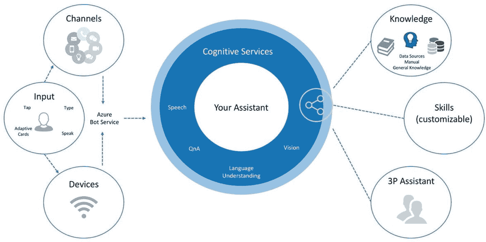

图 7-1

机器人框架的组件

### QnA Maker 简介

Microsoft 的 QnA Maker 提供了一种快速构建基于常见问题解答 URL、结构化文档、手册等内容的机器人的方法。其强大的爬虫和解析引擎从内容中提取所有可能的问题和答案，并通过机器人提供这些内容。它是一种认知服务工具，用于构建和训练一个简单的 QnA 机器人。

QnA Maker 是一项免费服务，能够以自然的对话方式回应用户的话语或提问。它能够利用其基于语言处理技术的问题/答案机制，为半结构化数据提供有用的答案。

大多数信息型机器人场景的一个常见挑战是将内容管理与机器人设计和开发分开，因为内容所有者通常是可能不具备技术背景的领域专家。QnA Maker 通过提供无代码的 QnA 管理体验来解决这个问题。

QnA Maker 允许您使用易于使用的界面编辑、删除或添加 QnA 对，然后将您的知识库作为机器人服务的 API 端点发布。使用熟悉的聊天界面训练机器人非常简单，主动学习功能会随着时间的推移自动从用户那里学习问题变体，并将其添加到知识库中。使用 QnA Maker 端点可以无缝集成其他 API，例如语言理解服务和语音 API，以不同的方式解释和回答用户的问题。

我们之前讨论过，拥有知识库对于回答用户的查询至关重要。它是提供用户查询答案的基础信息存储库。知识库是一个逻辑术语，指代各种类型的结构化、半结构化和非结构化信息，这些信息可以存储在具有文本处理能力的底层数据库中。QnA Maker 通过 API 服务暴露其知识库/数据库。

一旦我们创建账户并登录到 [`www.qnamaker.ai`](https://www.qnamaker.ai)，它会要求我们创建一个新的知识库。

第一步是为我们的知识库创建一个新的 Azure QnA 服务，这需要在 Azure 中创建以下内容：

1.  **创建资源组**：目前，QnA Maker 的某些服务并非在所有区域都可用，因此我们使用了（美国）西部美国区域来创建和部署演示所需的所有组件，如图 7-2 所示。

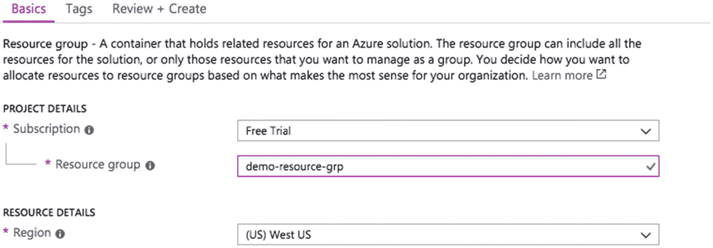

图 7-2

资源组创建步骤

2.  **创建 QnA Maker 资源**：如图 7-3 所示，我们需要为资源创建提供名称和其他详细信息。请注意，我们为演示使用了 Azure 免费层订阅。定价层和订阅可能因您的账户而异。

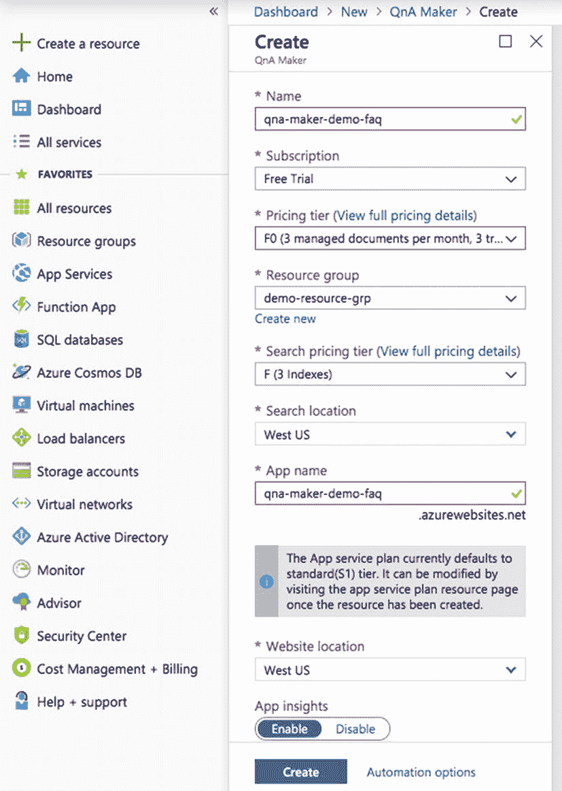

图 7-3

创建 QnA Maker

一旦 QnA Maker 资源创建完成，不同的资源组件将显示在 Azure 所有资源仪表板中，如图 7-4 所示。

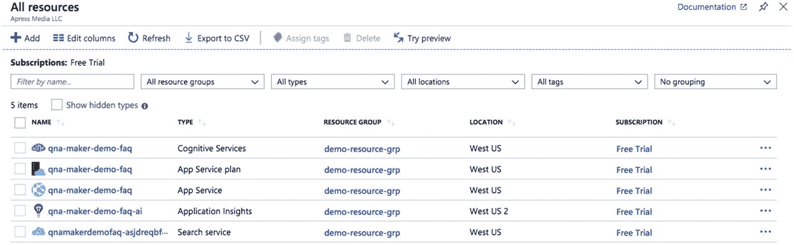

图 7-4

所有资源仪表板

现在，我们登录到 [`www.qnamaker.ai/Create`](https://www.qnamaker.ai/Create)，并按照创建知识库所需的五个步骤进行操作：

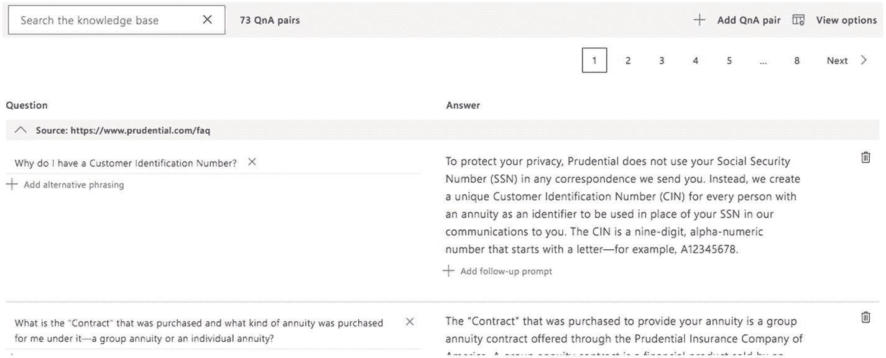

图 7-7

QnA 服务提取问题/答案对

1.  在 Microsoft Azure 中创建一个 QnA 服务（我们刚刚完成了这一步）。

2.  将 QnA 服务连接到知识库。

如图 7-5 所示，刷新此页面后，您可以选择之前创建的 Azure QnA 服务。

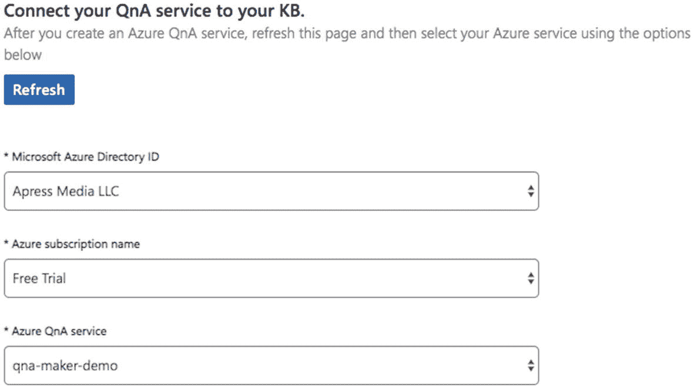

图 7-5

将 QnA 服务连接到知识库

3.  为知识库命名。

4.  填充知识库。

我们在财富 500 强保险公司保德信金融的网站上找到了一个常见问题解答页面。该页面包含 73 个问答，可用于演示。这些信息将被添加到知识库中，如图 7-6 所示。用于演示的参考页面网址为 [`www.prudential.com/faq`](http://www.prudential.com/faq) `.`

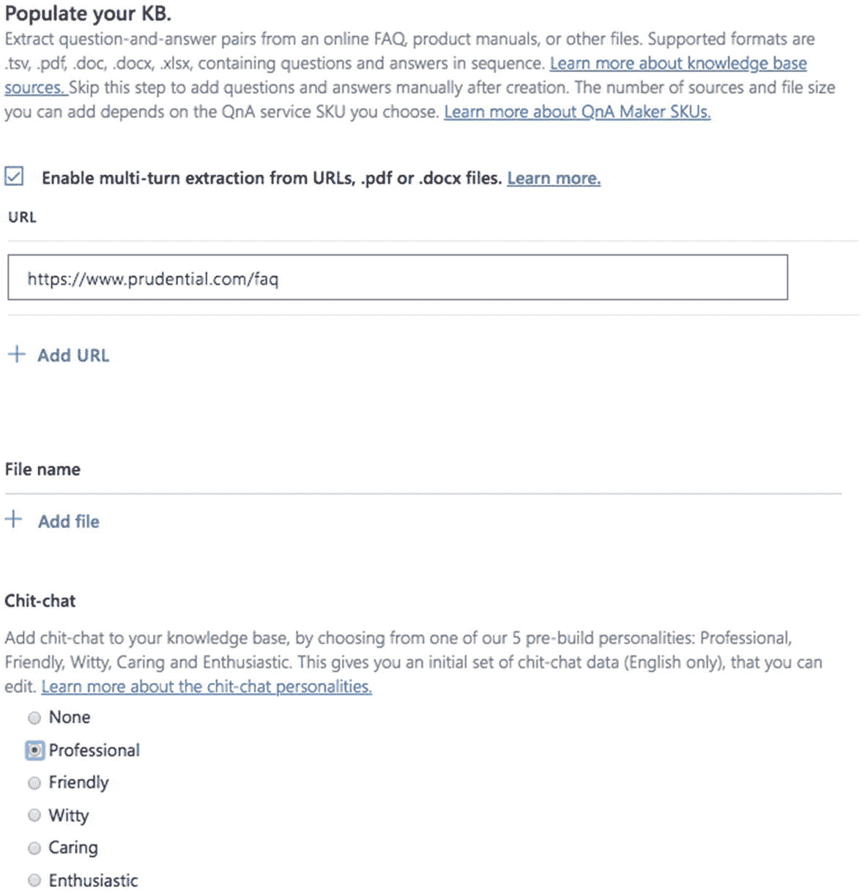

图 7-6

从 URL 源填充知识库

5.  创建知识库。

QnA Maker 服务会抓取提供的 URL，并以问答形式提取信息，供我们审阅、添加更多数据、保存和训练，如图 7-7 所示。还有更多选项，例如在发布前测试服务。

下一步是点击“发布”按钮来发布此知识库，以供机器人使用，如图 7-8 所示。

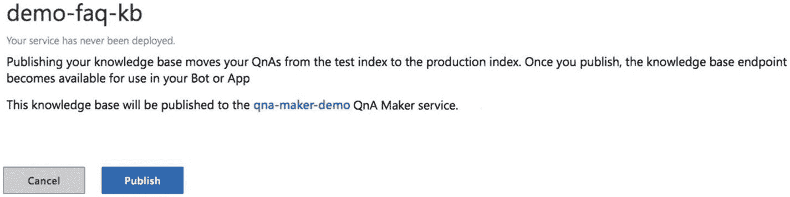

图 7-8

发布知识库

发布知识库后，之前创建的 `qna-maker-demo` QnA 服务即可使用。然后，我们可以向该服务发送一个 POST 请求，用问题查询知识库，它将返回一个答案。图 7-9 和 7-10 展示了通过 POSTMAN 针对所提问题（“更改受益人”）发出的示例请求，QnA 服务将其与知识库中的类似问题（“如何更改我的受益人？”）进行了匹配。

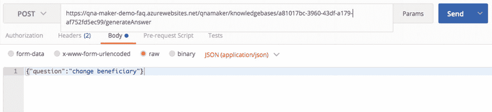

图 7-10

针对图 7-9 所示响应所提出的问题

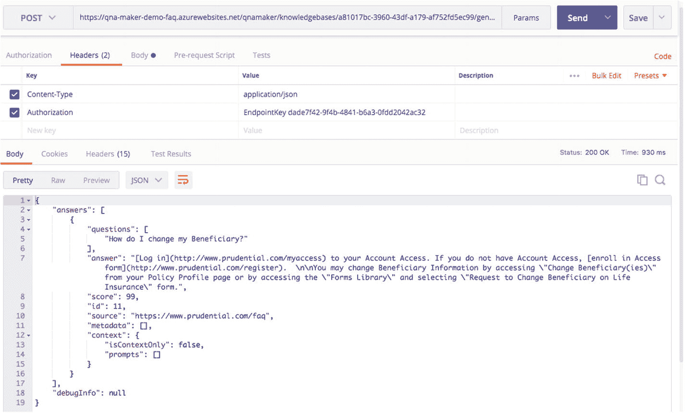

图 7-9

向 demo-faq-kb 知识库发送的带授权的 HTTP POST 请求

您可以看到如何使用 Azure 上的 Microsoft QnA Maker 快速构建一个功能完备的问答服务。该服务可以与 WebApp 机器人客户端、Facebook Messenger 或任何其他第三方消息服务集成。

QnA Maker 服务的功能本质上是一个后端的相关搜索引擎，它对内容数据进行索引，并使用基于文本的评分逻辑对最佳匹配内容进行排序。然而，此服务不具备对话能力，也无法在执行操作前通过语言理解来识别用户意图。微软提供了另一种名为 LUIS 的认知服务，正是为此目的而创建的。

### LUIS 简介

语言理解智能服务 (LUIS) 是一种基于云的 API 服务，也是认知服务的一个组件，如图 7-1 所示。它接收用户输入，并应用机器学习技术来预测用户意图。它还使用其命名实体识别 (NER) 匹配技术来识别用户话语中的命名实体，以提供有意义的响应。如图 7-11 所示。简而言之，LUIS 是一个意图分类引擎，它根据用户话语提供最佳匹配（得分最高）的意图。

该过程的第一步是创建一个包含特定领域语言模型的 LUIS 应用。在创建应用时，我们可以选择预构建的领域模型，构建我们自己的自然语言模型，或者在我们自己的定制基础上利用预构建的领域。

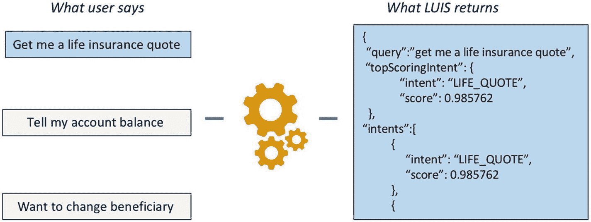

图 7-11

LUIS 意图分类示意图

*   **预构建模型**：LUIS 提供了许多预构建的领域模型，包括带有各种话语的常用意图预定义以及各种领域的预构建实体。这些预构建实体也可以在不使用预构建模型的意图和话语的情况下使用。根据预构建模型是否适合您的用例，预构建模型可以是一个很好的快速入门选择。

*   **自定义实体**：LUIS 提供了多种方式来定义我们的自定义意图以及示例话语。我们还可以利用 NER 匹配能力来定义我们以领域为中心的自定义实体。

创建 LUIS 应用很简单，与我们将在第 9 章中讨论的创建 Alexa 应用（用于与 IRIS 集成）类似，因此我们将在本章中跳过对其的解释。

一旦使用自定义或预构建模型定义了意图、话语和领域相关实体，LUIS 应用就会被发布。发布应用意味着使其可供使用。发布后，客户端应用程序可以将话语发送到 LUIS 服务端点，如图 7-12 所示。LUIS 会以 JSON 响应进行回复。

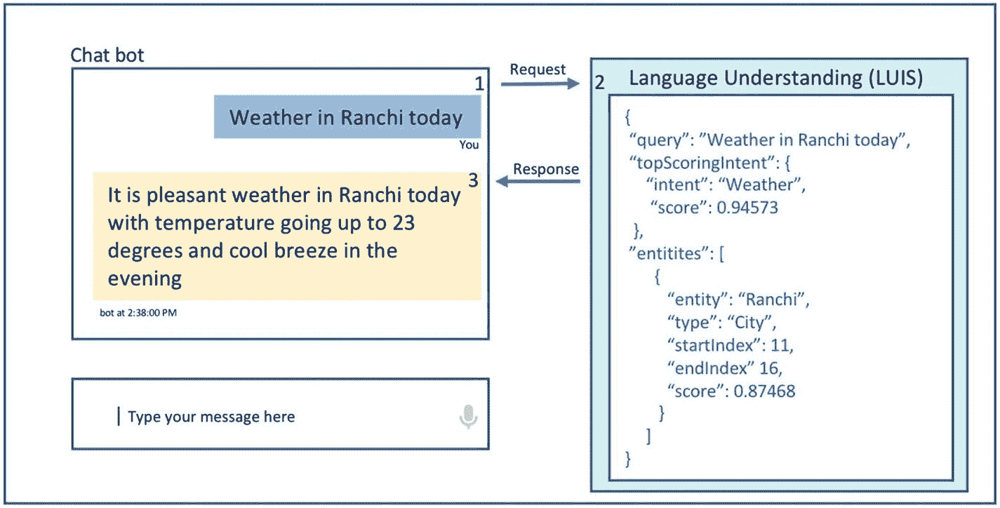

图 7-12

LUIS 机器人流程示例

## RASA 简介

RASA 是一个开源的机器学习库栈，供开发者创建上下文聊天机器人。RASA 也提供付费的企业级平台。客户端服务可以连接 RASA 平台中的各种 API。有关 RASA 平台的更多详细信息，请参见 [`https://rasa.com/products/rasa-platform/`](https://rasa.com/products/rasa-platform/) `.`

RASA 栈包含两个主要组件：

*   **Core**：一个类似于 Mutters 的聊天机器人框架，具有基于机器学习的对话管理功能
*   **NLU**：一个意图分类模块，提供意图分类和实体提取功能。

如图 7-13 所示，Core 和 NLU 模块都提供了各种功能，这些功能可以在自定义数据集上进行定制、训练和集成，用于构建基于上下文的 AI 虚拟助手。

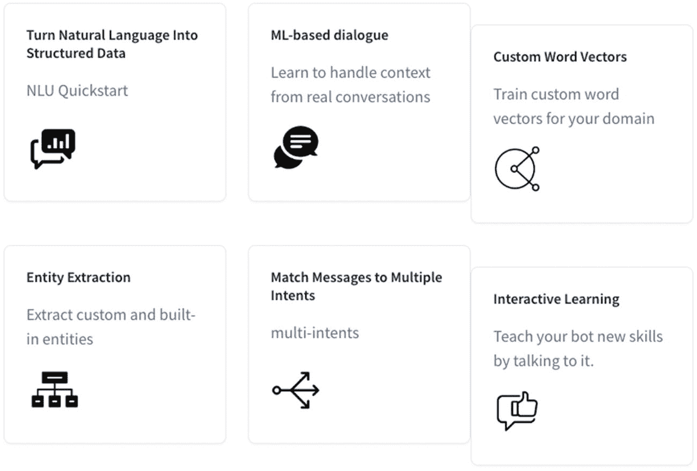

图 7-13

Core 和 NLU 模块的功能

*   **将自然语言转化为结构化数据**：此功能类似于我们在 QnA Maker 示例中讨论的内容，在该示例中，结构化、半结构化和非结构化数据被解析为知识库中某种有意义的形式以供查询。
*   **基于机器学习的对话**：RASA 提供了自己的对话管理模块，可以通过一系列简单的步骤进行定制和建模。我们在第 6 章中讨论了使用有限状态机在 IRIS 中实现对话管理。
*   **自定义词向量**：RASA 提供了为我们的领域训练词向量的定制功能。在此过程中会生成多个词嵌入，这有助于引擎更好地进行意图分类。Word2vec 是一个流行的神经网络模型，它从用户文本中生成词嵌入。
*   **实体提取**：通过使用内置或自定义构建的实体识别模型，RASA 可以识别用户话语中的实体。
*   **将消息匹配到多个意图**：一条用户话语可以匹配到多个意图，并且会返回不同的匹配分数以及最佳匹配意图作为响应。
*   **交互式学习**：我们在上一章讨论了如何通过扩展设计来增强 IRIS，以支持通过交互式学习实现持续改进框架。RASA 也提供了简单的方法来启用交互式学习，从而教会机器人新技能。

用于聊天机器人的 RASA 框架利用这两个模型来有效地引导对话流程，如图 7-14 所示。

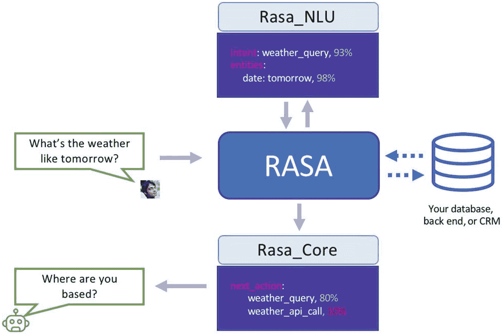

图 7-14

使用 RASA 的 Core 和 NLU 模块的对话流程

消息基本上在两个阶段进行处理：一个在管理对话的 Core 模块，另一个在提供基本语言服务的 NLU 模块。外部 API 调用或 CRM 连接由 RASA 平台借助 RASA Core 跟踪器处理。下一节将更详细地讨论这两个模块的工作方式。

### RASA Core

RASA Core 指的是主要组件，它接收并响应请求。该模块非常健壮，并采用基于流程的方法来处理所有请求，如图 7-15 所示。

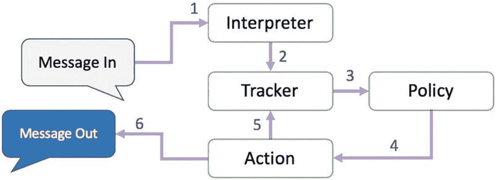

图 7-15

RASA 框架的工作方式

RASA 框架有一个六步流程来处理所有传入的消息请求并对其进行响应。步骤如下所述；然而，更多详细信息可以在 [`http://rasa.com/docs/#rasa_core.agent.Agent`](http://rasa.com/docs/%2523rasa_core.agent.Agent) 找到。

解释器接收消息并将其转换为一个字典，其中包含原始文本、意图以及找到的任何实体。跟踪器跟踪对话，并将新消息的状态传递给策略。策略模块为请求准备响应。一旦策略模块中准备好响应，它就会被传递给跟踪器和动作。跟踪器更新对话状态，动作将响应发送回用户。

上述实现有助于所有对话通过 RASA 进行，同时跟踪对话以维护对话状态。

### RASA NLU

RASA 自然语言理解（NLU）模块是一个工具，用于对来自用户的所有消息进行意图分类和实体提取。它是一个完全开源的工具，其核心目的是用于聊天机器人开发。

RASA NLU 可以作为服务托管给你的聊天机器人使用。RASA NLU 还允许你使用自己的数据训练不同类型的模型。从聊天机器人开发者的角度来看，RASA NLU 模块包含两部分：

*   **训练**：此模块允许你在自己的数据上训练模型。拥有自己的数据进行训练可以让你开发出特定于业务的 NLU。
*   **服务器**：此模块作为训练模型服务于聊天机器人。它可以作为 API 服务托管并在后端运行。

使用开源 NLU 模块的主要好处是，你无需将数据发送到 Google 或 Amazon 等外部平台来训练意图和实体。而且，由于是开源的，你可以根据需要调整模型或开发自己的模型。RASA NLU 的架构也使其可以作为服务在任何地方运行。如果你的架构要求如此，你可能不需要进行网络调用。

请参阅 RASA 的详尽文档，网址为 [`https://rasa.com/docs/`](https://rasa.com/docs/) `.`

## Dialogflow 简介

Dialogflow 是 Google 提供的一项用于开发人机交互的产品。它最初名为 API.ai，是一个用于管理聊天机器人 API 的平台。Google 于 2016 年 9 月收购了该公司，并于 2017 年将其更名为 Dialogflow。如今，它是 Google 在其所有平台（包括 Google Home、Google Assistant 和其他支持语音的服务）上进行语音应用开发的核心产品。Dialogflow 能够与几乎所有平台（包括可穿戴设备、家庭应用、音箱、智能设备等）集成，这使其成为最流行的聊天机器人开发平台之一。

Google Dialogflow 的工作原理与之前讨论过的聊天机器人类似，但在命名技术以及实现流程的技术架构上存在一些差异。在 Dialogflow 中与聊天机器人进行典型对话的界面如图 7-16 所示。

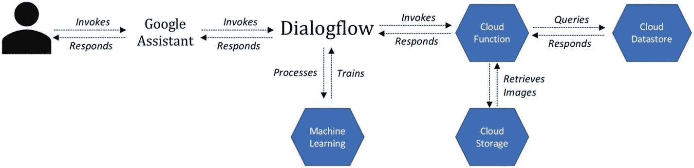

图 7-16

基于 Dialogflow 的聊天机器人

用户响应既支持书面形式，也支持语音/讲话形式。这些响应由 Google Assistance 模块捕获，然后转换为文本，从而使聊天机器人具备语音功能。Google Assistance 也可以被其他集成选项替代。

下面讨论使用 Dialogflow 构建聊天机器人的关键步骤。建议您查阅 Dialogflow 的官方文档，网址为 [`https://dialogflow.com/`](https://dialogflow.com/) 。

*   第一步是创建一个 Dialogflow 账户，然后创建一个 Dialogflow Agent，它允许您定义一个自然语言理解模型。

*   第二步是定义如何从用户话语中提取信息。这是通过为实体定义提取参数来完成的。这有助于理解用户话语中的重要属性，并根据提取的实体提供更好的匹配。

*   为了使聊天机器人具备对话能力，我们需要在下一步中使用上下文来定义和管理状态。

*   最后，可以将 Dialogflow Agent 与 Google Assistant 集成，从而部署该 Agent。这允许用户通过助手调用操作进行交互。

上述教程详情可在 [`https://dialogflow.com/docs`](https://dialogflow.com/docs) 找到。下面我们介绍使用 Dialogflow 构建聊天机器人过程中的部分步骤。

创建一个 Agent 意味着创建一个 NLU 模型，该模型将理解与该 Agent 进行的聊天内容。因此，如果您想为两个不同的领域创建聊天机器人，您可能需要创建两个不同的 Agent 并分别进行训练。见图 7-17。

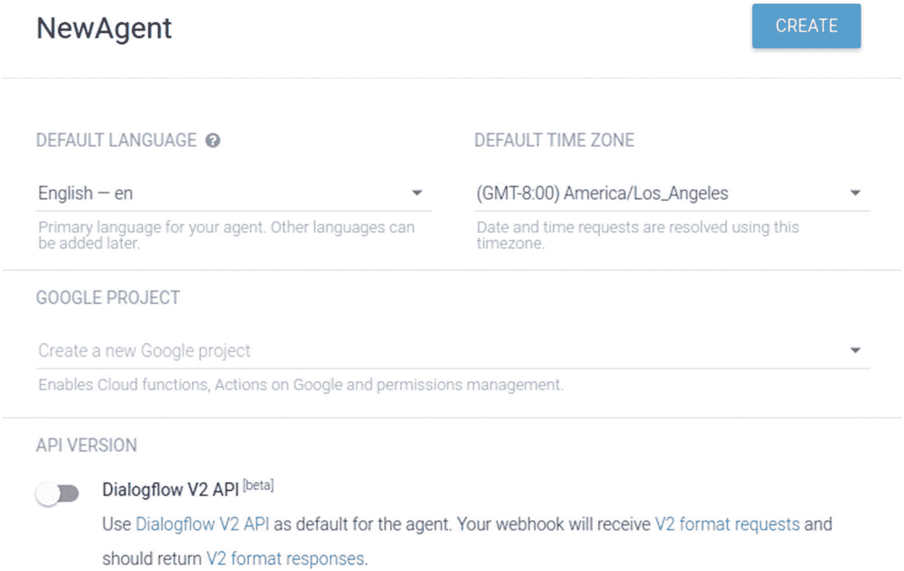

图 7-17

在 Dialogflow 中创建 Agent

下一步是使用 Dialogflow 控制台创建意图。可以使用 Dialogflow 丰富的用户界面，连同话语一起定义意图。控制台窗口类似于图 7-18。

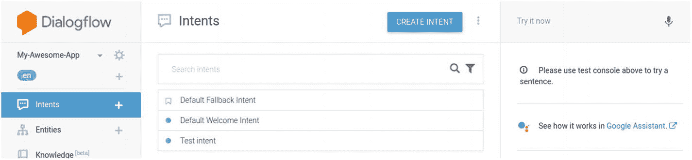

图 7-18

在 Dialogflow 中创建意图

Dialogflow 控制台还在窗口右侧提供了一个模拟器，用于在模拟环境中测试训练好的意图。这有助于您在将模型部署到生产环境之前对其进行测试。模拟窗口类似于图 7-19。

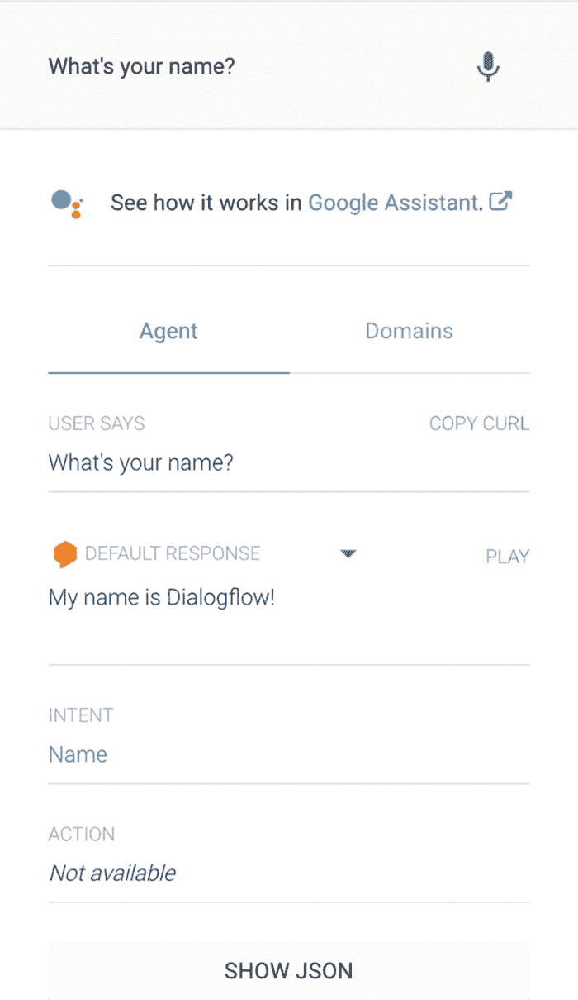

图 7-19

Dialogflow 模拟窗口

操作和参数是从 Dialogflow 的实体提取模块中提取的。提取出的参数随后可用于实现响应和生成回复。实体提取机制由强大的 Google ML 模型驱动。Dialogflow 中的基本训练阶段和实体提取如图 7-20 所示。

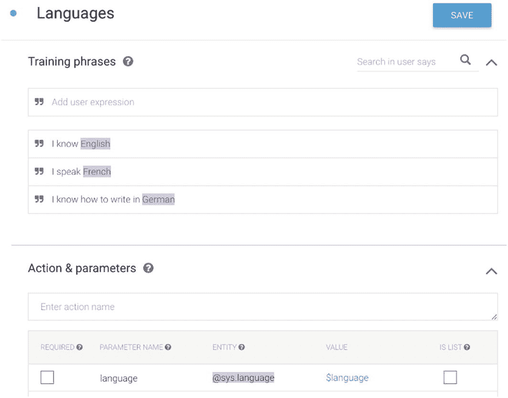

图 7-20

Dialogflow 中的实体提取

上下文也可以通过控制台进行管理，并且您的机器人可以针对聊天机器人无法理解的未命中意图进行训练。每次您模拟模型时，它都会根据提供给其意图引擎的最新数据进行训练。

Dialogflow 使用其实现服务与外部服务和 CRM 连接。实现服务允许您创建自定义 API 端点并将其暴露给您的聊天机器人。Dialogflow 中的实现服务称为 Web Hooks。

其一大特色是能够通过几次点击就将聊天机器人与多个平台集成。图 7-21 显示了 Dialogflow 可用的集成选项。Dialogflow 的生态系统非常强大，它为开发者提供了良好的 Nodejs 集成模型，以便根据需求构建聊天机器人和功能。

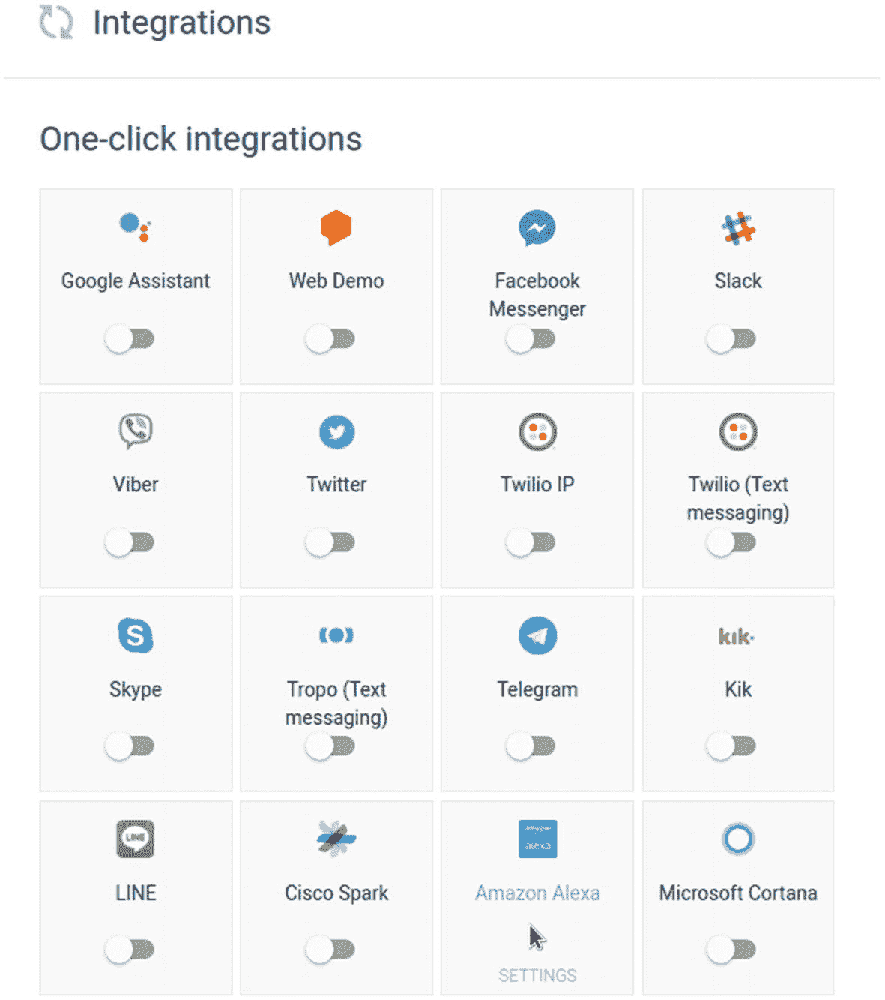

图 7-21

Dialogflow 中的集成选项

## 总结

我们讨论了不同的聊天机器人框架，以及它们如何用于构建简单的聊天机器人客户端。然而，这些框架各有优缺点。

**Microsoft Bot Framework** 是开源的，可在 GitHub 上获取，但其某些服务（如 Lex 或 Azure）需要额外付费。它被设计为一组易于使用的服务。

**RASA** 也是开源的，并提供企业级平台支持。它需要开发和编程知识，因为它是为开发者设计的。它不提供与其他消息客户端的开箱即用集成。它可以本地部署，但不提供直接的用户信息管理支持。

**Dialogflow** 提供与一些流行消息平台（如 Facebook Messenger、Skype 和 Google Assistant）的开箱即用集成，并提供构建机器人所需的完整工具包。但是，它无法在本地运行。

本章还讨论了各个平台的关键特性，并提供了开发者开始使用这些平台所需的基本信息。本章最后介绍了一个企业级的付费平台。

在下一章中，我们将讨论如何扩展前几章设计的自定义聊天机器人，使其能够与各种第三方服务和企业数据库集成，从而为客户提供响应。

