# 8. 聊天机器人集成机制

在第 6 章中，我们设计了一个简单的 Java 聊天机器人框架，我们称之为 IRIS（意图识别与信息服务）框架。我们讨论了 IRIS 的核心组件，例如如何定义意图，以及如何实现状态机来定义构建对话式聊天机器人的状态和转换。一个示例用例聚焦于保险领域。在该示例中，我们概述了 IRIS 应执行的特定功能，例如提供市场趋势详情、股票价格信息、天气详情和理赔状态。

在本章中，我们将重点介绍 IRIS 的集成模块，展示如何连接外部数据源和第三方 API 以进行信息检索。


## 与第三方 API 的集成

在我们的示例中，IRIS 的三个功能需要与第三方 API 集成（图 8-1）：

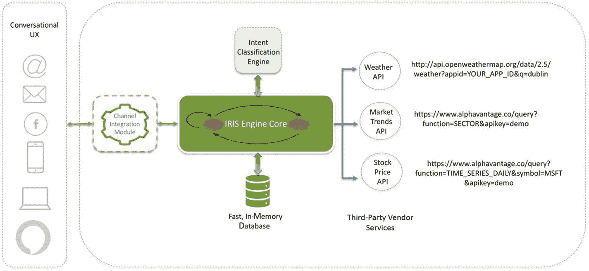

图 8-1

IRIS 与第三方 API 的集成

*   市场趋势

*   股票价格

*   天气信息

### 市场趋势

网上有许多免费和付费的 API 可以提供这些详细信息。我们探索了 [`www.alphavantage.co`](http://www.alphavantage.co) ，它提供免费的 API 来获取实时和历史股票市场数据。Alpha Vantage API 分为四类：

*   股票时间序列数据

*   实物与数字/加密货币（例如比特币）

*   技术指标

*   行业表现

所有 API 均为实时：最新数据点来自当前交易日。

只需提供三个必要信息，即用户类型、机构/组织名称和电子邮件地址，我们就能获得一个 API 密钥，并且根据网站说明，该密钥终身免费。可以通过在 [`www.alphavantage.co/support/#api-key`](http://www.alphavantage.co/support/%2523api-key) 提供详细信息来获取免费的 API 密钥。

一旦我们拥有 API 密钥，Alpha Vantage 的各种 API 就会分组到多个 API 套件下，如图 8-2 所示。

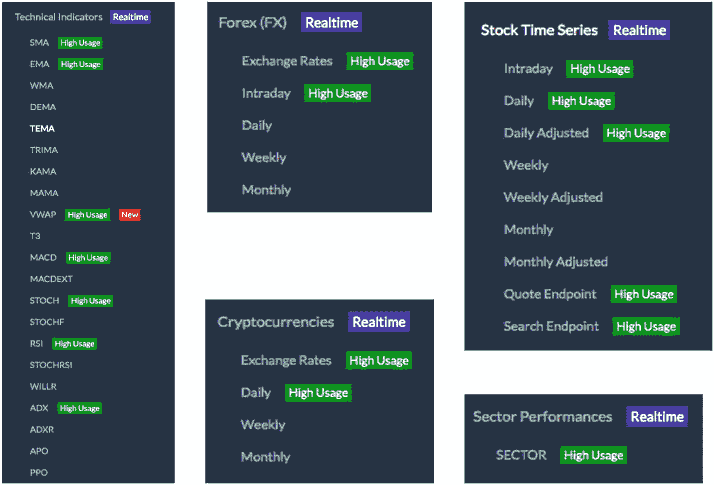

图 8-2

Alpha Vantage 的多个 API 套件

*   股票时间序列

*   外汇

*   技术指标

*   加密货币

*   行业表现

有关这些 API 的更多详细信息，请访问 [`www.alphavantage.co/documentation/`](http://www.alphavantage.co/documentation/) 。

对于我们的示例用例，我们想知道如何获取特定股票的当前市场趋势和股票价格。对于当前市场趋势，我们利用行业表现 API，其详细信息可在 [`www.alphavantage.co/documentation/#sector-information`](http://www.alphavantage.co/documentation/%2523sector%25c2%25adinformation) 找到。

用于获取实时行业表现详细信息的示例 HTTP GET 请求位于 [`www.alphavantage.co/query?function=SECTOR&apikey=demo`](http://www.alphavantage.co/query%253Ffunction%253DSECTOR%2526apikey%253Ddemo) 。

从 API 接收到的 JSON 响应如下：

```
{
Meta Data:
{
Information: "US Sector Performance (realtime & historical)",
Last Refreshed: "03:44 PM ET 03/04/2019"
},
Rank A: Real-Time Performance:
{
Real Estate: "0.47%",
Materials: "0.39%",
Utilities: "0.11%",
Energy: "-0.10%",
Communication Services: "-0.10%",
Consumer Staples: "-0.22%",
Consumer Discretionary: "-0.23%",
Industrials: "-0.33%",
Information Technology: "-0.50%",
Financials: "-0.65%",
Health Care: "-1.49%"
},
Rank B: 1 Day Performance:
{
Energy: "1.81%",
Health Care: "1.41%",
Consumer Discretionary: "0.92%",
Communication Services: "0.78%",
Information Technology: "0.71%",
Financials: "0.54%",
Utilities: "0.19%",
Industrials: "0.09%",
Real Estate: "-0.13%",
Materials: "-0.16%",
Consumer Staples: "-0.17%"
},
Rank C: 5 Day Performance:
{},
Rank D: 1 Month Performance:
{},
Rank E: 3 Month Performance:
{},
Rank F: Year-to-Date (YTD) Performance:
{},
Rank G: 1 Year Performance:
{},
Rank H: 3 Year Performance:
{},
Rank I: 5 Year Performance:
{},
Rank J: 10 Year Performance:
{}
}
```

在此响应中，提供了一些数据点，例如实时表现、一天、五天和一个月的表现。JSON 响应中的 **Real-Time Performance** 键描述了市场的不同行业及其实时百分比变化。我们使用此信息在 `MarketTrendState` 中提供当前市场趋势信息：

```
public String execute(MatchedIntent matchedIntent, Session session) {
// 提供当前市场趋势的第三方 API
String uri = "https://www.alphavantage.co/query?function=SECTOR&apikey=YOUR_KEY";
// 执行 HTTP 请求并通过向 URL 执行 GET 调用来获取响应的 Java 客户端
RestTemplate restTemplate = new RestTemplate();
/*
* 下面将响应映射到字符串对象。然而，在实际开发中，我们应该创建一个 Java Bean (POJO)，通过使用 getForObject 方法将响应映射到 Java 响应对象。
*/
String result = restTemplate.getForObject(uri, String.class);
String answer = "";
/*
* ObjectMapper 提供读写 JSON 的功能，可以读写基本 POJO。它是 Jackson 的一部分，Jackson 是用于解析 JSON 的标准 Java 库。
*/
ObjectMapper mapper = new ObjectMapper();
try {
/*
* JsonNode 用于通过 Jackson 将响应解析为 JSON 树模型表示。JsonNode 是所有 JSON 节点的基类，这些节点构成了 Jackson 实现的 JSON 树模型的基础。可以将这些节点视为类似于 XML DOM 树中的 DOM 节点。
*/
JsonNode actualObj = mapper.readTree(result);
JsonNode jsonNode1 = actualObj.get("Rank A: Real-Time Performance");
answer = "能源板块为 " + jsonNode1.get("Energy").textValue() + "。公用事业为 "
+ jsonNode1.get("Utilities").textValue() + "。房地产为 "
+ jsonNode1.get("Real Estate").textValue() + "。必需消费品为 "
+ jsonNode1.get("Consumer Staples").textValue() + "。医疗保健为 "
+ jsonNode1.get("Health Care").textValue() + "。原材料为 "
+ jsonNode1.get("Materials").textValue() + "。电信服务为 "
+ jsonNode1.get("Telecommunication Services").textValue() + "。工业为 "
+ jsonNode1.get("Industrials").textValue() + "。信息技术为 "
+ jsonNode1.get("Information Technology").textValue() + "。非必需消费品为 "
+ jsonNode1.get("Consumer Discretionary").textValue() + "。金融为 "
+ jsonNode1.get("Financials").textValue() + "\n 您还想了解什么？";
} catch (Exception e) {
e.printStackTrace();
Result = "我现在无法检索此信息。我这边出现了一些问题。\n 请尝试询问其他内容！";
}
return answer;
}
```

### 股票价格

用户可以与 IRIS 交互并询问股票价格信息。话语可能包括：

*   微软的当前股价是多少

*   Pru 股票价格

*   Infy 今日股票

*   hdfc 的股价

当 IRIS Core 接收到话语时，它会将话语传递给意图分类引擎，该引擎知道用户正在查找 `'STOCK_PRICE'`。基于此意图和当前状态，会转换到 `StockPriceState`。然后，此状态的 execute 方法会调用第三方 API。

为了检索股票价格详细信息，我们使用 Alpha Vantage 股票时间序列 API 套件中的 `TIME_SERIES_DAILY` API。

示例 HTTP GET 请求：

[`www.alphavantage.co/query?function=TIME_SERIES_DAILY&symbol=MSFT&apikey=demo`](http://www.alphavantage.co/query%253Ffunction%253DTIME_SERIES_DAILY%2526symbol%253DMSFT%2526apikey%253Ddemo)

示例 API 响应：

```
{
Meta Data:
{
1\. Information: "Daily Prices (open, high, low, close) and Volumes",
2\. Symbol: "MSFT",
3\. Last Refreshed: "2019-03-04 16:00:01",
4\. Output Size: "Compact",
5\. Time Zone: "US/Eastern"
},
Time Series (Daily):
{
2019-03-04:
{
1\. open: "113.0200",
2\. high: "113.2000",
3\. low: "110.8000",
4\. close: "112.2600",
5\. volume: "25684300"
},
2019-03-01:
{
1\. open: "112.8900",
2\. high: "113.0200",
3\. low: "111.6650",
4\. close: "112.5300",
5\. volume: "23501169"
},
2019-02-28:
{
1\. open: "112.0400",
2\. high: "112.8800",
3\. low: "111.7300",
4\. close: "112.0300",
5\. volume: "29083934"
},
2019-02-27:
{},
2019-02-26:
{}
}
}
```

`StockPriceState` 的示例 `execute` 方法可能如下所示：


```
public String execute(MatchedIntent matchedIntent, Session session) {
/*
* 在下面的 URL 中，我们硬编码了 symbol=MSFT。MSFT 是微软的股票代码。在实际实现中，我们应该从用户话语中提取公司名称，找到其股票代码，然后将其传入下面的 GET 请求中。从公司名称转换为股票代码有多种方法，例如调用公开可用的服务或维护一个映射表。
*/
String uri = "https://www.alphavantage.co/query?apikey=YOUR_KEY&function=TIME_SERIES_DAILY&outputsize=compact&symbol=MSFT";
RestTemplate restTemplate = new RestTemplate();
String result = restTemplate.getForObject(uri, String.class);
// 当第三方 API 无响应或出现任何网络相关问题时使用的默认回答
String answer = "我现在暂时无法获取股票价格详情。但我可以帮您处理其他查询。";
ObjectMapper mapper = new ObjectMapper();
try {
/*
* 众所周知，股票市场在周末和某些节假日不交易。IRIS 需要提供实时的股票表现数据。在正常工作日，我们解析当天的表现详情；但对于节假日、股市休市或当天无交易的情况，我们则获取前一日的表现详情。
*/
Date date = new Date();
String today = new SimpleDateFormat("yyyy-MM-dd").format(date);
String yday = new SimpleDateFormat("yyyy-MM-dd").format(yesterday(1));
String dayBeforeYday = new SimpleDateFormat("yyyy-MM-dd").format(yesterday(2));
JsonNode actualObj = mapper.readTree(result);
JsonNode jsonNode1 = actualObj.get("Time Series (Daily)");
JsonNode jsonNode2 = jsonNode1.get(today);
JsonNode jsonNode3 = jsonNode1.get(yday);
JsonNode jsonNode4 = jsonNode1.get(dayBeforeYday);
if (jsonNode2 != null) {
answer = "今日微软股票开盘价为 " + jsonNode2.get("1\. open").textValue() + "，收盘价为 "
+ jsonNode2.get("4\. close").textValue();
answer = answer + " 日内最高价达到 " + jsonNode2.get("2\. high").textValue()
+ "，日内最低价为 " + jsonNode2.get("3\. low").textValue();
answer = answer + "。总成交量为 " + jsonNode2.get("5\. volume").textValue() + "\n"
+ "还有什么我可以帮您的吗？";
} else if (jsonNode3 != null) {
answer = "我目前没有今天的交易信息，但昨日保诚股票开盘价为 "
+ jsonNode3.get("1\. open").textValue() + "，收盘价为 "
+ jsonNode3.get("4\. close").textValue();
answer = answer + " 日内最高价达到 " + jsonNode3.get("2\. high").textValue()
+ "，日内最低价为 " + jsonNode3.get("3\. low").textValue();
answer = answer + "。总成交量为 " + jsonNode3.get("5\. volume").textValue() + "\n"
+ "还有什么我可以帮您的吗？";
} else if (jsonNode4 != null) {
answer = "在周末前的周五，保诚股票开盘价为 " + jsonNode4.get("1\. open").textValue()
+ "，收盘价为 " + jsonNode4.get("4\. close").textValue();
answer = answer + " 日内最高价达到 " + jsonNode4.get("2\. high").textValue()
+ "，日内最低价为 " + jsonNode4.get("3\. low").textValue();
answer = answer + "。总成交量为 " + jsonNode4.get("5\. volume").textValue() + "\n"
+ "还有什么我可以帮您的吗？";
}
} catch (Exception e) {
e.printStackTrace();
}
return answer;
}
/*
*  一个返回当前日期前'days'天日期的方法。如果'days'值为 1，则返回昨天的日期。
*  如果值为 2，则返回前天的日期，以此类推。
*/
private Date yesterday(int days) {
final Calendar cal = Calendar.getInstance();
cal.add(Calendar.DATE, -days);
return cal.getTime();
}
```

### 天气信息

市面上有许多提供天气详情的数字机器人。人们经常向 Siri、谷歌语音助手和 Alexa 询问天气详情。让我们看看如何使用第三方 API 将天气信息集成到 IRIS 中。

为了获取天气报告，我们利用了[`http://openweathermap.org`](http://openweathermap.org)，该网站提供了获取所请求城市天气详情的 API。它提供多个数据点，例如当前天气数据、5 天预报、16 天预报以及其他关于该城市的历史信息。目前它涵盖了全球超过 20 万个城市的天气详情。当前天气数据基于全球模型和来自超过 4 万个气象站的数据进行频繁更新。OpenWeather 还提供了用于救援地图、管理个人气象站、批量下载、天气预警、紫外线指数和空气污染的 API。

在我们的示例中，我们需要获取指定城市的当前天气。我们需要获取一个 API 密钥。OpenWeather 提供多种 API 计划，详情可在[`https://openweathermap.org/price`](https://openweathermap.org/price)找到。

有一个免费计划，允许每分钟最多 60 次调用，这对于演示来说绰绰有余。我们使用当前天气数据 API，该 API 可以通过多种方式调用以获取天气详情，例如：

*   调用单个位置的当前天气数据：
    *   按城市名称

    *   按城市 ID

    *   按地理坐标

    *   按邮政编码

*   调用多个城市的当前天气数据：
    *   矩形区域内的城市

    *   循环中的城市

    *   按多个城市 ID 调用

按城市名称（通过 q 参数传递）查询时的 HTTP GET 请求示例：[`http://api.openweathermap.org/data/2.5/weather?appid=YOUR_APP_ID&q=dublin`](http://api.openweathermap.org/data/2.5/weather%253Fappid%253DYOUR_APP_ID%2526q%253Ddublin)

JSON 响应：

```
{
coord:
{},
weather:
[
{
id: 501,
main: "Rain",
description: "moderate rain",
icon: "10n"
}
],
base: "stations",
main:
{
temp: 277.07,
pressure: 993,
humidity: 100,
temp_min: 275.93,
temp_max: 278.15
},
visibility: 10000,
wind:
{
speed: 6.2,
deg: 230
},
rain:
{
1h: 1.14
},
clouds:
{
all: 75
},
dt: 1551735821,
sys:
{
type: 1,
id: 1565,
message: 0.0045,
country: "IE",
sunrise: 1551683064,
sunset: 1551722984
},
id: 2964574,
name: "Dublin",
cod: 200
}
```

`GetWeatherState`的`execute`方法示例可能包含以下代码片段：

```
public String execute(MatchedIntent matchedIntent, Session session) {
/*
* 当出现网络问题、第三方 API 响应超时或其他异常时的默认响应
*/
String answer = "我现在无法获取天气报告。但我希望今天对你来说是美好而迷人的一天 :) ";
/*
* 提供天气详情的 GET API
*/
String uri = "http://api.openweathermap.org/data/2.5/weather?appid=YOUR_API_KEY&q=";
String cityName = "dublin";
try {
RestTemplate restTemplate = new RestTemplate();
String result = restTemplate.getForObject(uri, String.class);
ObjectMapper mapper = new ObjectMapper();
JsonNode actualObj = mapper.readTree(result);
ArrayNode jsonNode1 = (ArrayNode) actualObj.get("weather");
JsonNode jsonNode2 = actualObj.get("main");
String description = jsonNode1.get(0).get("description").textValue();
String temperature = jsonNode2.get("temp").toString();
Double tempInCelsius = Double.parseDouble(temperature) - 273.15;
double roundOff = Math.round(tempInCelsius * 100.0) / 100.0;
String humidity = jsonNode2.get("humidity").toString();
answer = "目前" + cityName + "的天气似乎是" + description + "。温度为 "
+ roundOff + " 摄氏度。湿度接近 " + humidity
+ "。\n 真希望我是人类，能亲身感受一下。总之，您还想从我这里了解什么？ ";
} catch (Exception e) {
}
return answer;
}
```


## 连接到企业数据存储

在我们的示例中，我们使用 `GetClaimStatus` 来演示如何连接到数据库并查询索赔信息。

请注意，尽管我们在此演示了直接查询数据库的能力，但业界现代设计方法并不推荐这样做。任何数据库都应仅通过在其上层创建的服务进行查询。原因有多方面，例如安全性与访问控制、数据库负载与连接处理、封装性以及可移植性。

```
public class GetClaimStatus extends State {
/*
*  Java 数据库连接（JDBC）是一种用于 Java 编程语言的应用程序编程接口（API），它定义了客户端如何访问数据库。它是一种基于 Java 的数据访问技术，用于 Java 数据库连接。它是 Oracle 公司 Java 标准版平台的一部分。
*  DB_URL 是数据库连接 URL。
*  所使用的 URL 取决于特定的数据库和 JDBC 驱动程序。它总是以"JDBC:"协议开头，但其余部分由具体供应商决定。在我们的示例中，我们使用 MySQL 数据库。
*/
static final String JDBC_DRIVER = "com.mysql.jdbc.Driver";
// 数据库名称为 test
static final String DB_URL = "jdbc:mysql://localhost/test";
/*
*  数据库访问凭证
*/
static final String USERNAME = "ClaimsReadOnlyUser";
static final String PASSWORD = "**********";
public GetClaimStatus() {
super("getClaimStatus");
}
@Override
public String execute(MatchedIntent matchedIntent, Session session) {
Connection conn = null;
Statement stmt = null;
String status = null;
/*
* 从匹配意图的会话或槽位中检索索赔 ID。如果此状态被执行，意味着我们已拥有索赔 ID；否则 Shield 不会验证转换到此状态。
*/
String claimId = SessionStorage.getStringFromSlotOrSession(matchedIntent, session, "claimId", null);
// 默认回答
String answer = "我们系统中没有与 " + claimId + " 相关的任何信息。\n"
+ "请于周一至周五上午 8:30 至下午 5:30 拨打 1800 333 0333 联系我们的客服代表进行进一步查询。\n"
+ "如果您从海外或通过公用电话拨号，请拨打+65 633 30333。\n 还有其他问题我可以帮您吗？";
try {
//注册 JDBC 驱动程序
Class.forName("com.mysql.jdbc.Driver");
// 打开连接（正在连接数据库...）
conn = DriverManager.getConnection(DB_URL, USERNAME, PASSWORD);
// 执行查询
stmt = conn.createStatement();
/*
* SQL 查询，用于从 test 数据库和 claims 表中查询行。此查询的含义是——从 claims 表中返回索赔 ID 为给定索赔 ID 的行的状态。
*/
String sql = "SELECT status FROM claims where claimId='" + claimId + "'";
//执行 SQL
ResultSet rs = stmt.executeQuery(sql);
//从结果集中提取数据
while (rs.next()) {
//记录已获取
status = rs.getString("status");
}
//清理环境并关闭活动连接。
rs.close();
stmt.close();
conn.close();
} catch (Exception e) {
e.printStackTrace();
} finally {
/*
* 在 try-catch 中，即使发生异常，finally 块也始终会被执行。如果上述代码因任何原因出现异常，语句和连接将不会关闭。因此我们在 finally 块中额外检查并关闭它们。
*/
try {
if (stmt != null)
stmt.close();
} catch (SQLException se2) {
}
try {
if (conn != null)
conn.close();
} catch (SQLException se) {
se.printStackTrace();
}
}
// 如果我们从数据库中收到了该索赔的状态，则用实际状态详情覆盖默认回答。
if (status != null) {
answer = "您的索赔 ID " + claimId + " 的状态是 - " + status
+ "。\n 如果您想了解更多信息，请在周一至周五上午 8:30 至下午 5:30 期间拨打 HELPLINE-NUMBER 联系我们的代表。现在还有其他您想了解的吗？";
}
// 从会话中移除与索赔 ID 相关的属性
session.removeAttribute("getclaimidprompt");
session.removeAttribute("claimid");
return answer;
}
}
```


## 集成模块

集成模块是连接 IRIS 核心与不同消息平台（如 Facebook Messenger、Twitter、Web、移动应用、Alexa 等）的组件。每个平台都有各自的集成机制，为每个渠道构建定制化的集成层非常困难，且并非本书的核心目标。集成模块是一个对外暴露的中间层服务，充当 IRIS 的网关，如图 8-3 所示。

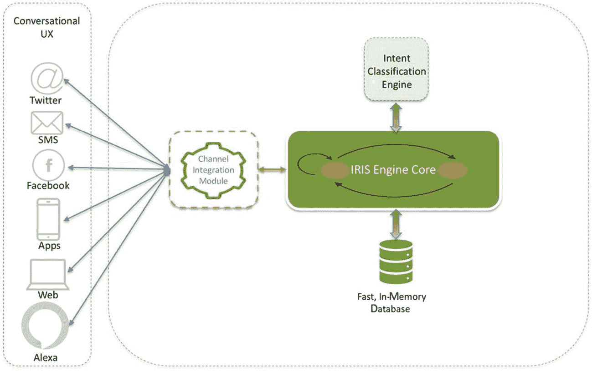

图 8-3

IRIS 渠道集成模块

许多开源工具无需我们编写大量代码，就能提供与各种渠道的简单定制化集成，并处理集成所需的大量复杂工作。在本示例中，我们重点介绍 **botkit**，这是一款领先的开发工具，可提供与多个消息平台的定制化组合：

[`https://github.com/howdyai/botkit`](https://github.com/howdyai/botkit) 。

在本章中，我们将讨论 IRIS 与 Facebook Messenger 的集成。在深入集成代码之前，我们需要确保具备以下条件，以便能够将 IRIS 部署到 Facebook Messenger 页面：

*   **一个 Facebook 页面**：Facebook 页面用作机器人的身份标识。当用户与您的应用聊天时，他们会看到页面名称和个人资料图片。

*   **一个 Facebook 开发者账户**：您需要开发者账户来创建新应用，这是任何 Facebook 集成的核心。您可以前往 Facebook for Developers 并点击“开始使用”按钮来创建新的开发者账户。

*   **用于 Web 的 Facebook 应用**：Facebook 应用包含 Messenger 机器人的设置，包括访问令牌。

*   **一个 webhook URL**：与机器人对话中发生的操作（例如新消息）会作为事件发送到您的 webhook。这是我们集成模块的 URL，我们将在下一节介绍。

设置过程需要将 Messenger 平台添加到您的 Facebook 应用中，配置应用的 webhook，并将您的应用订阅到 Facebook 页面。有关设置 Facebook 应用的详细信息，请访问 [`https://developers.facebook.com/docs/messenger-platform/getting-started/app-setup/`](https://developers.facebook.com/docs/messenger-platform/getting-started/app-setup/) 。

有关配置 botkit 和 Facebook Messenger 的分步指南，请访问 [`www.botkit.ai/docs/provisioning/facebook_messenger.html`](https://www.botkit.ai/docs/provisioning/facebook_messenger.html) 。

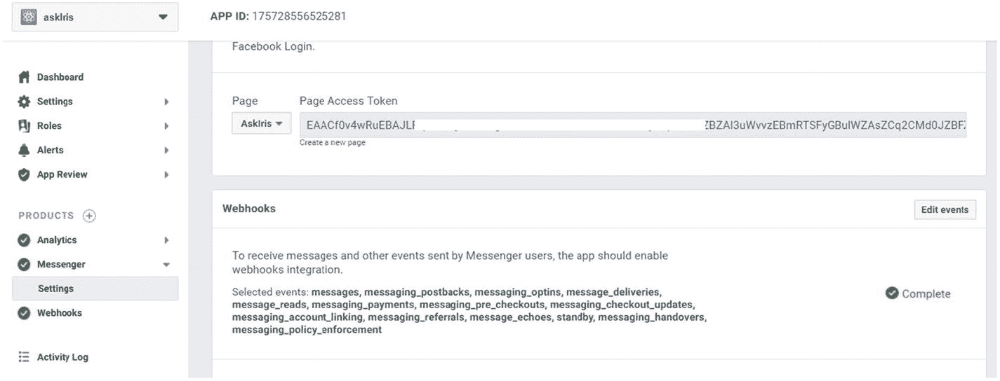

图 8-5

显示页面访问令牌屏幕

1.  创建应用并选择 Messenger 平台。参见图 8-4。

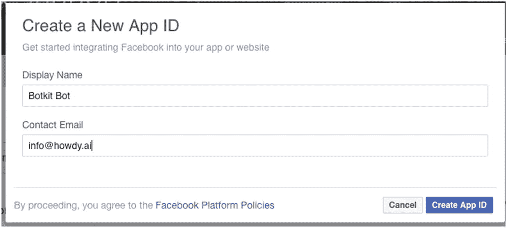

图 8-4

在 Facebook 上创建新的应用 ID

2.  我们创建了一个名为 AskIris 的 Facebook 页面，并为该应用生成了一个页面访问令牌。参见图 8-5。

回调 URL 是 `https://YOURURL/facebook/receive`。参见图 8-6。此 URL 必须可公开访问且受 SSL 保护。我们提供了一个 `localtunnel` 回调 URL；在我们的案例中，它是隧道连接到 localhost 的 NodeJs 服务器 URL。我们将在下一节讨论如何创建此端点以及如何使用 `localtunnel`。

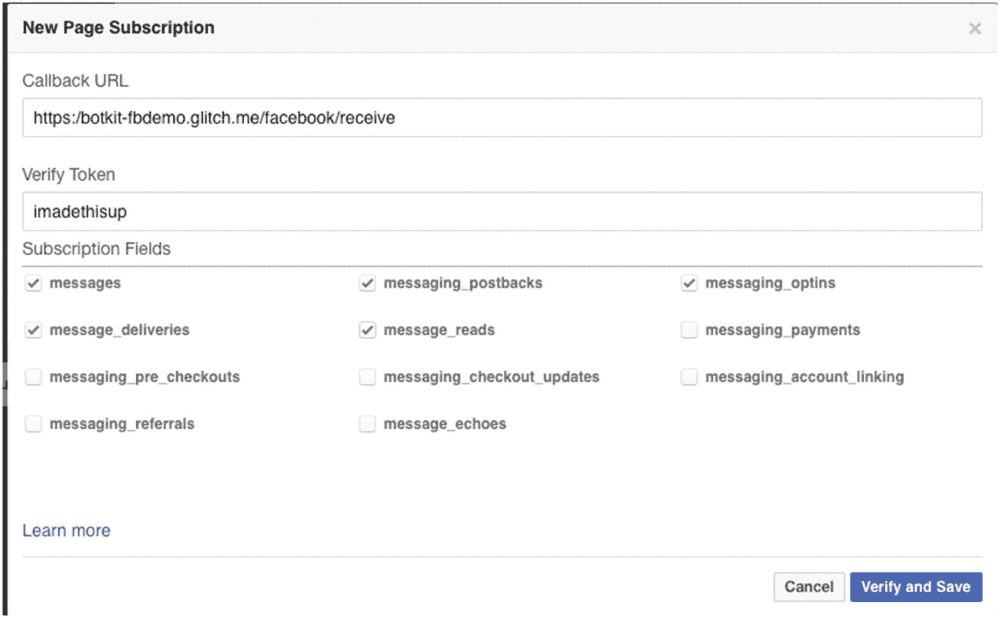

图 8-6

显示页面订阅详情以及我们的回调 URL

AskIris 页面应连接到新创建的应用，并且设置应显示应用详情。参见图 8-7。

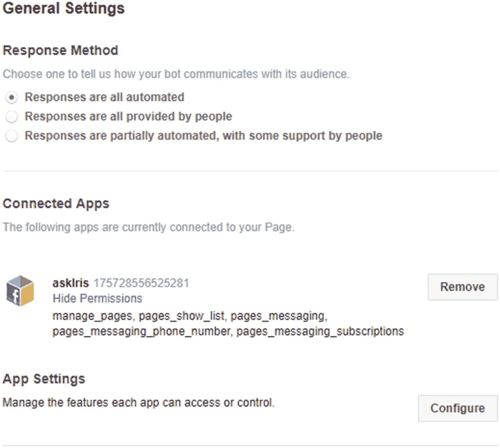

图 8-7

AskIris 页面设置

如上所述，设置 webhook 需要一个 HTTPS 回调 URL。此 URL 是我们集成模块的 API 端点，它将接收来自 Messenger 的消息。为此，我们创建了一个 NodeJS 应用程序，因为这是设置 webhook 的要求。

更多设置细节请参见 Facebook 开发者页面：

[`https://developers.facebook.com/docs/messenger-platform/getting-started/webhook-setup`](https://developers.facebook.com/docs/messenger-platform/getting-started/webhook-setup) 。

以下是创建一个简单 NodeJS 应用程序的步骤：

1.  创建一个 HTTP 服务器（`server.js`）：

```
    // 导入 server.js 所需的模块
    var express = require('express');
    var bodyParser = require('body-parser');
    var https = require('https');
    var http = require('http');
    var fs = require('fs');
    var localtunnel = require('localtunnel');
    // 自定义 JavaScript
    var conf = require(__dirname + '/conf.js');
    function server(ops) {
    // 创建应用
    /* Express 是一个流行的 Node Web 框架，提供了一种编写处理程序的机制。
    */
    var app = express();
    /* body-parser 是 Node.js 中间件，在处理程序之前解析传入的请求体。
    */
    // 解析 JSON
    app.use(bodyParser.json());
    // 返回仅解析 urlencoded 主体的中间件
    app.use(bodyParser.urlencoded({
    // 此对象将包含键值对，当 extended 为 false 时，值可以是字符串或数组；当 extended 为 true 时，值可以是任何类型。
    extended: true
    }));
    // 静态文件路径
    app.use(express.static(__dirname + conf.static_dir));
    /* 声明选项并通过从配置文件中读取 SSL 密钥和 SSL 证书路径来创建 HTTPS 服务器。
    */
    var options = {
    port : conf.securePort,
    key : fs.readFileSync(conf.sslKeyPath),
    cert : fs.readFileSync(conf.sslCertPath),
    requestCert : false,
    rejectUnauthorized : false
    };
    https.createServer( options, app)
    .listen(conf.securePort,  conf.hostname, function() {
    console.log('** 在端口 ' + conf.securePort + ' 上启动安全 Web 服务器');
    });
    http.createServer(app)
    .listen(conf.port, conf.hostname, function() {
    console.log('** 在端口 ' + conf.port + ' 上启动 Web 服务器');
    });
    /*
    localtunnel 将 localhost 暴露给外部世界，以便于测试和共享。它将连接到隧道服务器，设置隧道，并告诉您用于测试的 URL。我们使用 localtunnel 在 http://localhost:9080/respond 上获取一个 https 端点，以便与 Facebook Messenger 进行测试。
    */
    if(ops.lt) {
    var tunnel = localtunnel(conf.port, {subdomain: 'askiris'}, function(err, tunnel) {
    if (err) {
    console.log(err);
    process.exit();
    }
    console.log("您的机器人可通过以下 URL 在 Web 上访问: " + tunnel.url + '/facebook/receive');
    });
    tunnel.on('close', function() {
    console.log("您的机器人不再可通过 localtunnel.me URL 在 Web 上访问。");
    process.exit();
    });
    }
    return app;
    }
    /* module.exports 是当前模块在被另一个程序或模块 "require" 时返回的对象
    */
    module.exports = server;
    ```

2.  添加 Facebook webhook 端点（`Webhooks.js`）：


```
    const fetch = require("node-fetch");
    // 这是 IRIS API 的 URL 端点
    const url = "http://localhost:9080/respond";
    function webhooks(controller){
    /* 这是用户首次与 Iris 交互前看到的初始消息。
    */
    controller.api.messenger_profile.greeting('你好，我叫 IRIS。我正在持续训练，以成为你的数字虚拟助手。');
    // 所有消息都将发送到 API。
    controller.hears(['.*'], 'message_received,facebook_postback', function(bot, message) {
    // Facebook 请求消息包含文本、发送者 ID、序列号和时间戳。
    var params = {
    message: message.text,
    sender: message.sender.id,
    seq: message.seq,
    timestamp: message. timestamp
    };
    var esc = encodeURIComponent;
    var query = Object.keys(params)
    .map(k => esc(k) + '=' + esc(params[k]))
    .join('&');
    /* fetch 发起 HTTP GET 调用，接收响应并将 'message' 传回 Facebook。
    */
    fetch(url +query)
    .then(response => {
    response.json().then(json => {
    bot.reply(message, json.message);
    });
    })
    .catch(error => {
    bot.reply(message, "");
    });
    });
    }
    module.exports = webhooks;
    ```

3.  添加 Webhook 验证。有关 botkit-facebook 集成的更多详细信息，请参阅 [`www.botkit.ai/docs/readme-facebook.html`](http://www.botkit.ai/docs/readme-facebook.html) 。

```
var Botkit = require('botkit');
var commandLineArgs = require('command-line-args');
var localtunnel = require('localtunnel');
// 读取静态文件
var server = require(__dirname + '/server.js');
var conf = require(__dirname + '/conf.js');
var webhook = require(__dirname + '/webhooks.js');
// 命令行参数，用于在本地模式或服务器模式下运行；在本地模式下，我们需要使用 localtunnel 连接到 Facebook Messenger webhook，因为它需要一个 HTTPS 端点。
const ops = commandLineArgs([
{name: 'lt', alias: 'l', args: 1, description: '使用 localtunnel.me 使你的机器人可在网络上访问。',
type: Boolean, defaultValue: false},
{name: 'ltsubdomain', alias: 's', args: 1,
description: 'localtunnel.me URL 的自定义子域名。此选项只能与 --lt 一起使用。',
type: String, defaultValue: null},
]);
// 创建 Botkit 控制器，它控制机器人的所有实例。
var controller = Botkit.facebookbot({
debug: true,
log: true,
access_token: conf.access_token,
verify_token: conf.verify_token,
app_secret: conf.app_secret,
validate_requests: true
});
// 创建服务器
var app = server(ops);
// 从 FB 接收 POST 数据；这将是你收到的消息。
app.post('/facebook/receive', function(req, res) {
if (req.query && req.query['hub.mode'] == 'subscribe') {
if (req.query['hub.verify_token'] == controller.config.verify_token) {
res.send(req.query['hub.challenge']);
} else {
res.send('OK');
}
}
// 向 Facebook 响应，表示已收到 webhook。
res.status(200);
res.send('ok');
var bot = controller.spawn({});
// 现在，将 webhook 传递给处理程序。
controller.handleWebhookPayload(req, res, bot);
});
// 使用你的验证令牌执行 FB webhook 验证握手。验证令牌存储在 conf.js 文件中。
app.get('/facebook/receive', function(req, res) {
if (req.query['hub.mode'] == 'subscribe') {
if (req.query['hub.verify_token'] == controller.config.verify_token) {
res.send(req.query['hub.challenge']);
} else {
res.send('OK');
}
}else{
res.send('NOT-OK');
}
});
// Ping URL
app.get('/ping', function(req, res) {
res.send('{"status":"ok"}');
});
webhook(controller);
```

完成上述所有步骤并测试端点后，我们就可以开始在 Facebook Messenger 上与 IRIS 进行交互了。

## 在 Facebook Messenger 中演示 AskIris 聊天机器人

让我们看一些交互示例。我们可以通过简单的问候开始与 IRIS 交互，IRIS 会回复关于她自己的详细信息。参见图 8-8。

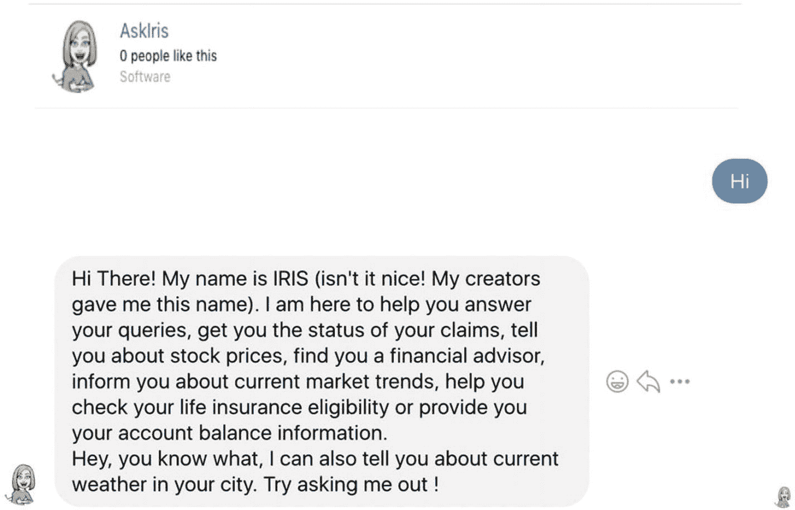

图 8-8

与 IRIS 交互

### 账户余额

当用户向 IRIS 询问账户余额时，它会回复一条消息，要求提供机密的 IPIN 以继续操作。如前所述，不应将演示实现作为设置 PIN 的实践。应遵循更复杂和标准的安全认证机制。在成功输入 IPIN（在示例用例中为硬编码值）后，IRIS 将检索用户所询问账户类型的余额。参见图 8-9。

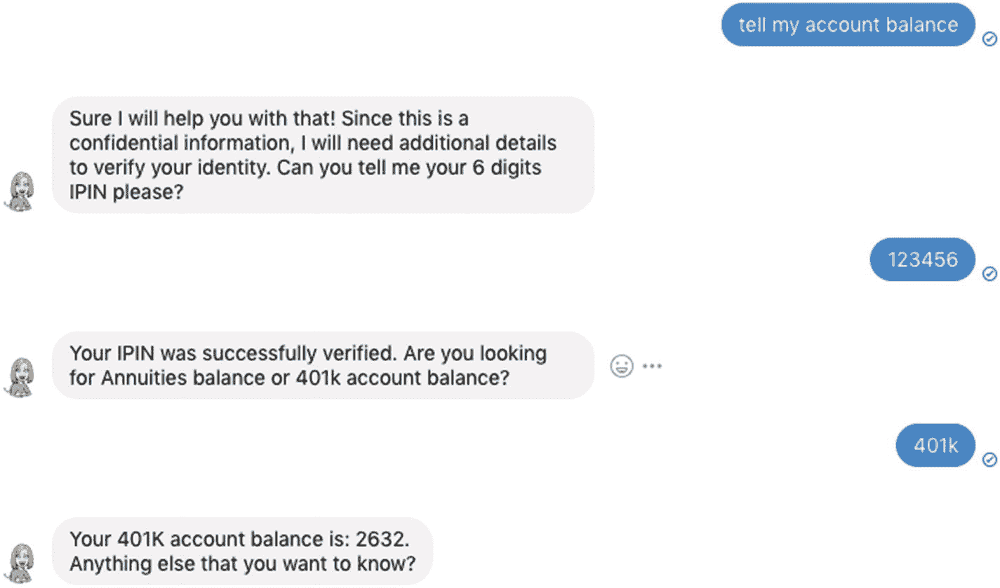

图 8-9

询问账户余额详情

### 索赔状态

索赔示例演示了

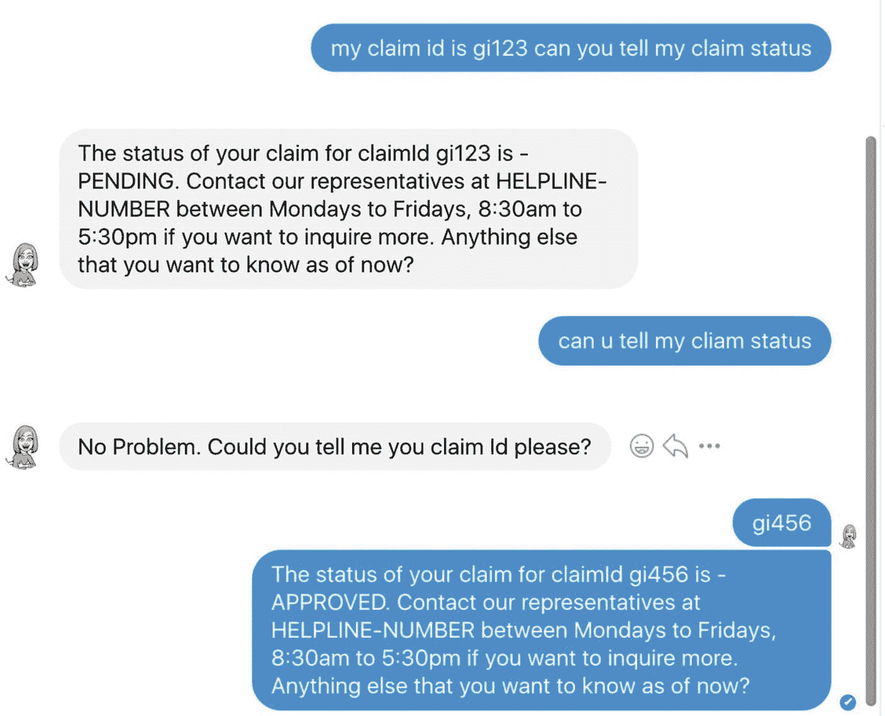

图 8-10

请求索赔状态

*   在一次表述中识别意图以及实现意图所需的槽位。在下面的示例 1 中，意图（CLAIM_STATUS）和索赔 ID（gi123）是同时获取的。

*   这展示了自然语言处理分析用户自然表述（包括拼写错误）的潜力。

*   此外，它还展示了处理用户询问相同信息时不同变体的能力。在示例 1 中，我们基于自然语言推断意图和槽位。在示例 2 中，由于未获取到槽位，IRIS 会像其他典型对话一样提示用户提供此信息。参见图 8-10。

### 今日天气

天气示例演示了如何构建一个实时集成第三方服务的聊天机器人。诸如以下用户表述会返回 API 提供的实时温度信息（参见图 8-11）：

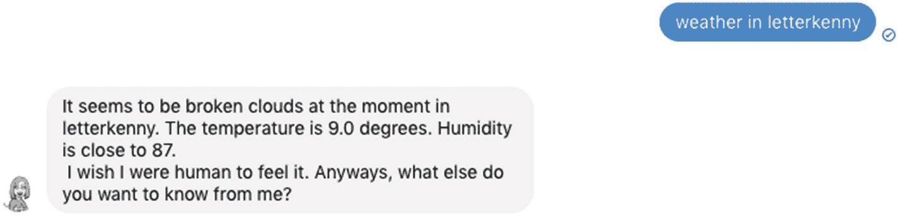

图 8-11

来自 IRIS 的实时天气信息

*   今天莱特肯尼的天气怎么样

*   都柏林今天的天气

*   兰契现在的天气

### 常见问题解答

首先，你可以看到对常见问题的正确回答。然后，当用户表述（401k）既不匹配任何明确意图，也不匹配知识库中的任何文档时，IRIS 会执行搜索。参见图 8-12。

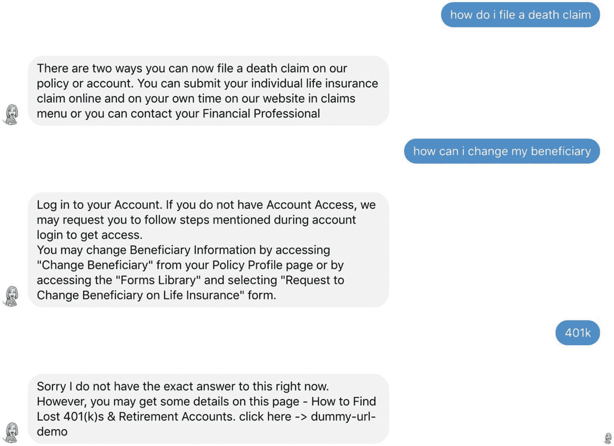

图 8-12

常见问题解答示例

### 上下文切换示例

在图 8-13 中，用户首先询问人寿保险报价。IRIS 提示输入年龄、吸烟者信息、身高和体重。用户按预期提供了除体重外的所有其他信息。用户没有提供体重，而是询问股票价格。IRIS 没有回复用户输入体重不正确或无法识别体重，而是理解了上下文的切换，从而理解了意图的切换，并无缝地提供了所请求的详细信息。随后，当用户再次询问人寿保险时，请注意，已经回答过的问题不会再次询问。这是因为短期记忆中存储了这些详细信息。

当用户提供了之前未回答的问题的答案时，意图得以实现，并获得了响应。

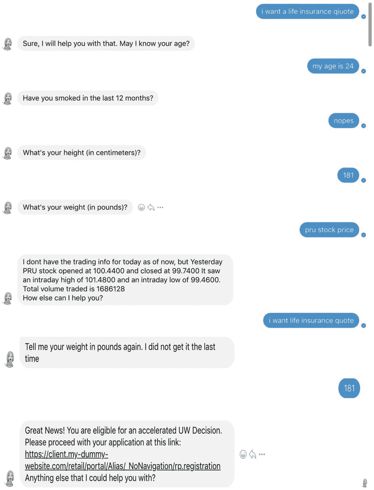

图 8-13

说明上下文切换的人寿保险示例


## 总结

在本章中，我们展示了如何扩展 IRIS 的功能以支持与各种第三方服务的集成。同时，也解释了如何连接企业数据库以获取用户数据。我们讨论了 IRIS 对外暴露的集成模块，并实现了 IRIS 与 Facebook Messenger 的集成，遵循了成功集成所需的逐步流程。

最后，我们演示了与 Facebook Messenger 和 IRIS 交互的实际效果，通过示例展示了几种用例，并解释了前几章讨论内容在后台的实现原理。

在下一章中，我们将讨论如何将这个内部框架部署到云端。我们将探索将服务部署到 AWS 的多种方式，并逐步介绍如何在 5 分钟内将 IRIS 与 Alexa 集成。最后，我们将讨论如何改进该框架，以及进一步优化的空间，例如实现反馈循环。

