# 9. 部署与持续改进框架

在前几章中，我们从零开始设计了一个基础聊天机器人框架，并探索了与第三方服务及其他后端系统的集成选项。同时，我们也解释了如何将 IRIS 聊天机器人框架以 Spring Boot REST API 的形式对外暴露。

在本章中，我们将讨论将 IRIS 部署到远程服务器的不同方式，并介绍如何在 5 分钟内将 IRIS 与 Alexa 集成。在本章末尾，我们将讨论如何通过实现自学习模块并将人工介入纳入循环，将 IRIS 扩展为持续改进框架的一部分。

## 部署到云端

通过 RESTful API 暴露的 IRIS 框架可以通过多种方式部署到远程服务器。在本节中，我们将讨论三种不同的方式。

### 在 AWS EC2 上作为独立的 Spring Boot JAR 运行

这是 Spring Boot JAR 最基本的安装和部署方式。我们只需几个步骤即可让 JAR 在 EC2 机器的 8080 端口上运行。

我们登录 AWS 账户，从图 9-1 所示的服务列表中选择 EC2。EC2 代表 AWS 提供的弹性计算云服务器。更多关于 EC2 的详细信息，请访问 [`https://aws.amazon.com/ec2/`](https://aws.amazon.com/ec2/)。

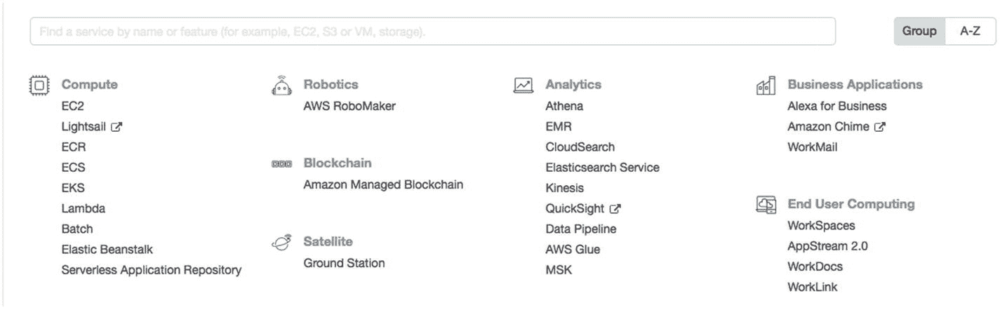

图 9-1

不同的 AWS 服务

我们从 EC2 控制台启动一个 EC2 实例，如图 9-2 所示。


图 9-2

在 AWS 上启动 EC2 实例向导

启动 EC2 实例需要七个步骤：

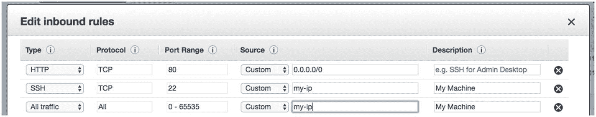

图 9-3

EC2 安全组入站规则配置

1.  我们选择一个 AMI（Amazon 机器镜像）。我们使用 Amazon Linux 2 AMI (HVM)，SSD 卷类型，64 位 x86。

2.  我们选择实例类型。我们选择 **t2.micro**（如果您是首次使用 AWS 服务，该类型也符合免费套餐资格）。t2.micro 实例具有一个 vCPU 和 1 GB 内存，足以运行 API。

3.  下一步需要配置实例详细信息。我们可以使用检查清单来防止意外终止。此步骤为可选。

4.  下一步我们添加存储详细信息。默认情况下，我们获得 8GB 的 SSD，并且该卷已挂载到实例。但是，如果需要，我们可以添加更多卷或增加默认卷的存储空间。此步骤也是可选的，对于演示部署来说，8GB 的存储空间已足够。

5.  我们为实例和存储卷添加标签，以便更好地管理 EC2 资源。这也是可选的。

6.  如图 9-3 所示，此步骤需要配置安全组。安全组是一组防火墙规则，用于控制实例的流量。

我们希望将端口 80 暴露给所有来源访问，而端口 22（安全 Shell 端口）仅允许从我们的本地机器访问。

1.  我们审查配置并启动实例。每个 EC2 实例都需要一个密钥对 PEM 文件，以便我们安全地登录实例。系统会要求我们生成一个新文件，或者我们可以使用现有文件。

    现在，一旦实例启动，它将拥有一个公共 DNS 名称或 IPv4 公共 IP，我们可以使用它来登录。

2.  从任何 Unix 机器登录的命令：

    ```
    ssh -i chatbot-iris.pem ec2-user@ec2-instance-ip.compute-1.amazonaws.com
    ```

3.  登录后，我们可以使用 SCP 命令从本地复制 Spring Boot JAR：

    ```
    scp -i chatbot-iris.pem /path/to/iris.jar ec2-user@ec2-instance-ip.compute-1.amazonaws.com:/path/to/your/jarfile
    ```

4.  复制 JAR 后，我们可以通过执行以下命令来运行它：

    ```
    java -jar path/to/your/jarfile.jar fully.qualified.package.Application
    ```

5.  默认情况下，服务器在端口 8080 上启动。但是，如果我们想更改端口设置，可以使用命令行选项（例如 `-DServer.port=8090`）将 `server.port` 设置为系统属性，或者在 `src/main/resources/` 中添加包含 `server.port=8090` 的 `application.properties` 文件。

如果我们使用 Maven 构建代码，也可以使用：

```
mvn spring-boot:run
```


### 在 AWS EC2 上作为 Docker 容器运行

Docker 实现了操作系统级别的虚拟化。它用于运行被称为容器的软件包。从运维角度来看，Docker 使工作更加简便，因为它将代码、库和运行时组件打包成 Docker 镜像，从而可以轻松部署。有关 Docker 的更多详细信息，请访问 [`www.docker.com/`](https://www.docker.com/) 。

我们执行以下步骤，在 EC2 上的 Docker 中运行应用程序：

1.  更新实例上已安装的软件包和软件包缓存：

    ```
    sudo yum update -y
    ```

2.  安装最新的 Docker 社区版软件包：

    ```
    sudo amazon-linux-extras install docker
    ```

3.  启动 Docker 服务：

    ```
    sudo service docker start
    ```

4.  将 `ec2-user` 添加到 Docker 组，以便无需使用 `sudo` 即可执行 Docker 命令：

    ```
    sudo usermod -a -G docker ec2-user
    ```

5.  注销并重新登录，以获取新的 Docker 组权限。为此，请关闭当前的 SSH 终端窗口，并在新窗口中重新连接到实例。新的 SSH 会话将拥有适当的 Docker 组权限。

6.  验证 `ec2-user` 是否可以在不使用 sudo 的情况下运行 Docker 命令。

7.  在代码库的根目录中创建一个 Dockerfile。Dockerfile 是一个清单文件，描述了 Docker 镜像要使用的基础镜像，以及其上安装和运行的内容。此 Dockerfile 使用 `openjdk:8-jdk-alpine` 镜像，因为我们正在构建一个 Java 应用程序的镜像。`VOLUME` 指令创建一个具有指定名称的挂载点，并将其标记为保存来自本地主机或其他容器的外部挂载卷。`ARG` 指令定义一个变量，用户可以在构建时将其传递给构建器。JAR 文件被命名为 `app.jar`，`ENTRYPOINT` 允许我们配置一个将作为可执行文件运行的容器。它包含运行 JAR 的命令：

    ```
    FROM openjdk:8-jdk-alpine
    VOLUME /tmp
    ARG JAR_FILE
    ADD ${JAR_FILE} app.jar
    ENTRYPOINT ["java","-Djava.security.egd=file:/dev/./urandom","-jar","/app.jar"]
    ```

8.  通过执行以下命令构建 Docker 镜像：

    ```
    docker build -t iris --build-arg JAR_FILE=”JAR_NAME”.
    ```

    以下是在机器上执行构建命令的输出：

    ```
    Sending build context to Docker daemon   21.9MB
    Step 1/5 : FROM openjdk:8-jdk-alpine
    8-jdk-alpine: Pulling from library/openjdk
    bdf0201b3a05: Pull complete
    9e12771959ad: Pull complete
    c4efe34cda6e: Pull complete
    Digest: sha256:2a52fedf1d4ab53323e16a032cadca89aac47024a8228dea7f862dbccf169e1e
    Status: Downloaded newer image for openjdk:8-jdk-alpine
    ---> 3675b9f543c5
    Step 2/5 : VOLUME /tmp
    ---> Running in dc2934059ab8
    Removing intermediate container dc2934059ab8
    ---> 0c3b61b6f027
    Step 3/5 : ARG JAR_FILE
    ---> Running in 36701bf0a68e
    Removing intermediate container 36701bf0a68e
    ---> da1c1f51c29d
    Step 4/5 : ADD ${JAR_FILE} app.jar
    ---> 0aacdba5baf0
    Step 5/5 : ENTRYPOINT ["java","-Djava.security.egd=file:/dev/./urandom","-jar","/app.jar"]
    ---> Running in f40f7a276e18
    Removing intermediate container f40f7a276e18
    ---> 493abfce6e8c
    Successfully built 493abfce6e8c
    Successfully tagged iris:latest
    ```

9.  通过以下命令运行新创建的 Docker 镜像：

    ```
    docker run -t -i -p 80:80 iris
    ```

### 作为 ECS 服务运行

在前两种方法中，您已经了解了如何将 Spring Boot JAR 作为独立服务部署和运行，或者通过安装 Docker 并在 Docker 容器中运行 API。本方法将讨论 AWS 的一项名为 ECS（弹性容器服务）的服务。请参见图 9-4。


图 9-4

ECS 对象及其关系图

Amazon ECS 使得部署、管理和扩展运行应用程序、服务和批处理任务的 Docker 容器变得简单。Amazon ECS 会根据您的资源需求将容器放置到集群中，并与弹性负载均衡、EC2 安全组、EBS 卷和 IAM 角色等熟悉的功能集成。有关 ECS 的更多详细信息，请访问 [`https://aws.amazon.com/ecs/`](https://aws.amazon.com/ecs/) 。

在 ECS 上运行 Docker 镜像需要多个步骤。以下是通过 AWS 管理控制台进行部署的逐步说明：

1.  在讨论如何将 JAR 作为 Docker 容器部署在 AWS EC2 上时，我们创建了一个 Docker 镜像。我们需要将这个先前创建的 Docker 镜像添加到 ECR。Amazon Elastic Container Registry (ECR) 是一个完全托管的容器注册表，使开发人员能够轻松地存储、管理和部署容器镜像。

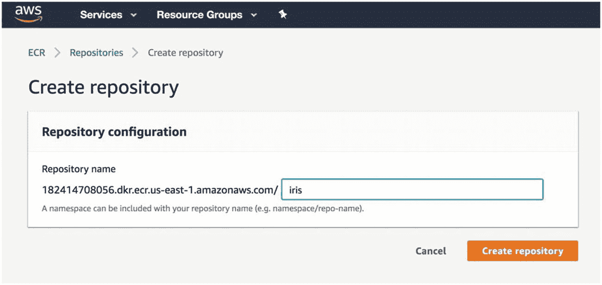

图 9-5

在 AWS 中创建 ECR 仓库

如图 9-5 所示创建仓库后，下一步是标记 Docker 镜像，以便我们可以将镜像推送到此仓库：

```
docker tag iris:latest aws_account_id.dkr.ecr.us-east-1.amazonaws.com/iris:latest
```

然后，我们运行以下命令将此镜像推送到 ECR 仓库：

```
docker push aws_account_id.dkr.ecr.us-east-1.amazonaws.com/iris:latest
```

有关将 Docker 镜像推送到 ECR 的更多详细信息，请访问 [`https://docs.aws.amazon.com/AmazonECR/latest/userguide/docker-push-ecr-image.html`](https://docs.aws.amazon.com/AmazonECR/latest/userguide/docker-push-ecr-image.html) 。

1.  然后，我们需要定义容器定义。在 AWS 管理控制台的 ECS 服务中，在“入门”下，我们可以选择要使用的容器定义。我们需要提供 ECR 仓库 URL 以及 Docker 镜像名称和标签，如图 9-6 所示。

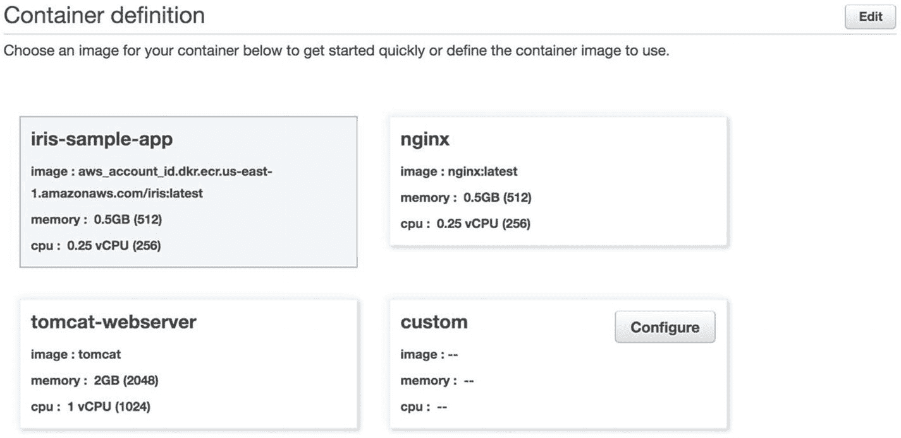

图 9-6

容器定义配置

2.  我们定义任务定义。任务定义是应用程序的蓝图，通过属性描述一个或多个容器。某些属性在任务级别配置，但大多数属性是按容器配置的。在图 9-7 中，我们为 IRIS 创建了一个任务定义。

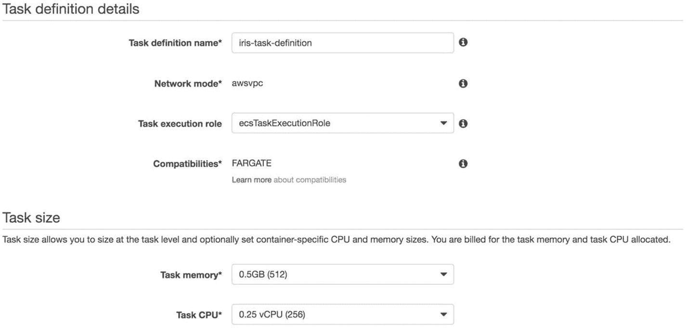

图 9-7

任务定义

3.  定义一个服务。服务允许我们在 ECS 集群中运行并维护指定数量（期望计数）的任务定义并发实例。请参见图 9-8。

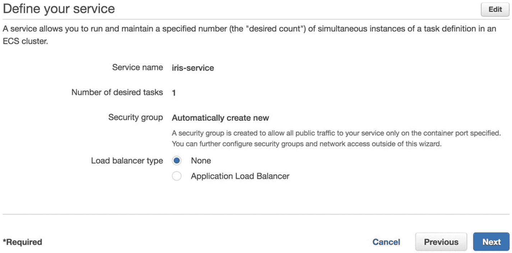

图 9-8

服务定义详情

4.  我们配置一个集群。Fargate 集群中的基础设施完全由 AWS 管理。我们的容器在运行，无需我们管理和配置单个 Amazon EC2 实例。请参见图 9-9。

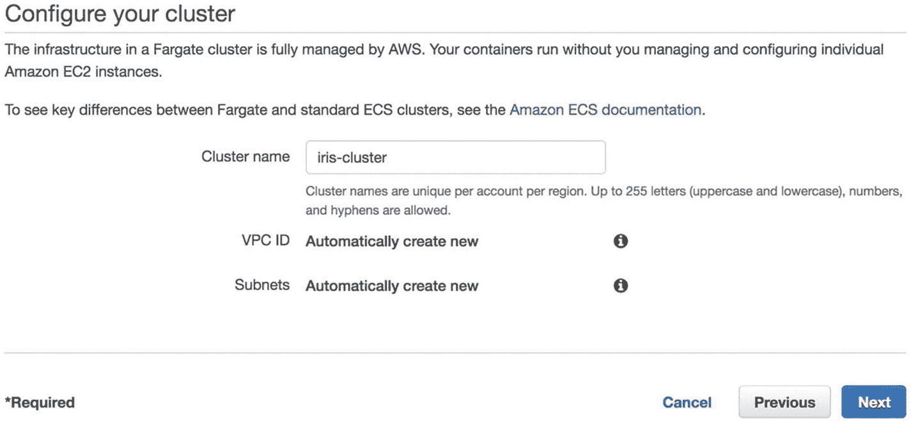

图 9-9

集群配置详情


5.  当我们审核并点击“创建”后，应该能看到 ECS 的创建进度。一旦集群设置完成且任务定义就绪，Spring Boot 服务就会启动并运行。

图 9-10 是一个使用上述任务定义创建基本 ECS 集群的示例。

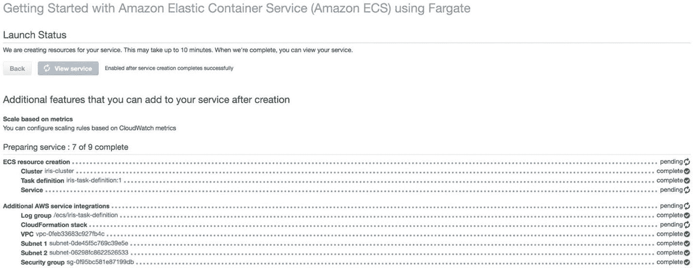

图 9-10

ECS 启动状态界面

## 在 5 分钟内创建 Smart IRIS Alexa 技能

我们将探讨如何通过几个简单步骤将 IRIS 与 Amazon Alexa 集成。为此，第一步是登录 Alexa 开发者控制台 [`https://developer.amazon.com/alexa`](https://developer.amazon.com/alexa) 并创建一个技能。创建技能需要提供技能名称和默认语言。我们将选择一个自定义模型添加到技能中。见图 9-11。

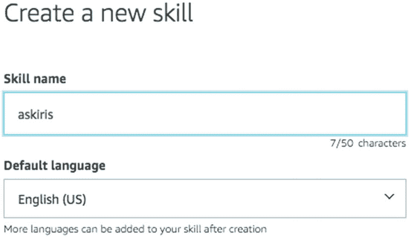

图 9-11

创建 Alexa 技能名称

自定义模型需要提供一些清单项才能使技能正常工作：

*   调用名称
*   意图、示例和槽位
*   构建交互模型
*   设置 Web 服务端点

在我们的 IRIS 用例示例中，由于我们已经自定义了不同的可能意图、意图槽位和以状态机形式建模的对话，我们的目标是将用户在 Alexa 上的话语重定向到 IRIS 后端 API，以便其处理话语并做出响应。

我们将调用名称设置为 Iris。这将使用户能够通过要求 Alexa *“询问”* Iris 来调用此技能。见图 9-12。

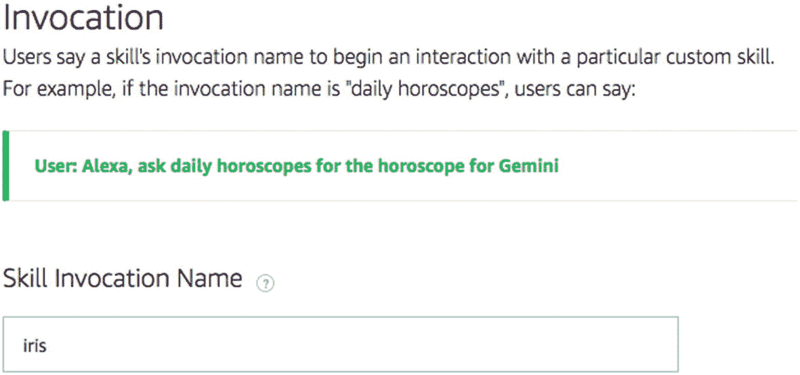

图 9-12

添加技能调用名称

接下来，我们定义一个自定义意图和一个自定义槽位类型，以便所有用户的话语都能匹配到这个意图和槽位类型。目标是将话语重定向到 IRIS，而不在 Alexa 层进行任何意图分类相关的处理。

我们首先创建一个名为 `IrisCustomSlotType` 的自定义槽位类型；见图 9-13。

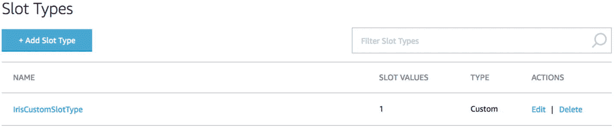

图 9-13

自定义槽位类型

现在，我们定义一个名为 `IrisAllIntent` 的自定义意图。该意图有一个名为 `utteranceSlot` 的槽位。最重要的是 `{utteranceSlot}`。我们打算将所有用户话语都放入这个槽位中，如图 9-14 所示。它是一个正则表达式，意味着整个话语值都在 `utteranceSlot` 槽位下。稍后在 Alexa 请求 IRIS HTTPS 端点时，读取用户话语时会用到它。

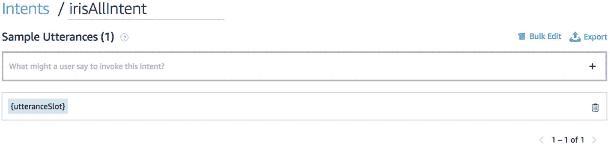

图 9-14

IrisAllIntent 中的 utteranceSlot

`utteranceSlot` 被定义为槽位类型 `IrisCustomSlotType`，如图 9-15 所示。

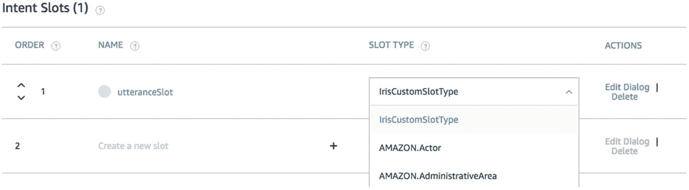

图 9-15

为 IRIS 集成创建的自定义槽位及其类型

此时，我们应该已经在 Alexa 技能的交互模型中创建了意图、槽位和槽位类型，如图 9-16 所示。在图中，您可以看到除了用于与 Alexa 设备进行标准交互（如停止或取消）的内置意图外，还有其他内置意图。

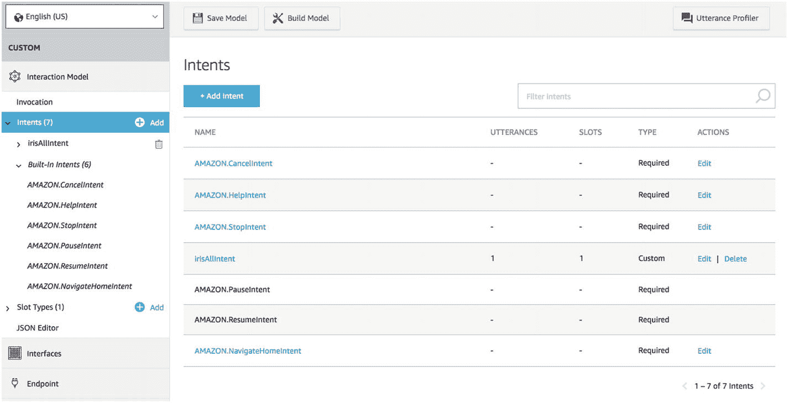

图 9-16

交互模型界面

一旦我们为自定义交互模型定义了所有必需的属性，就可以构建模型了。构建模型需要我们点击“构建模型”按钮，该按钮会保存技能清单并构建模型。见图 9-17。

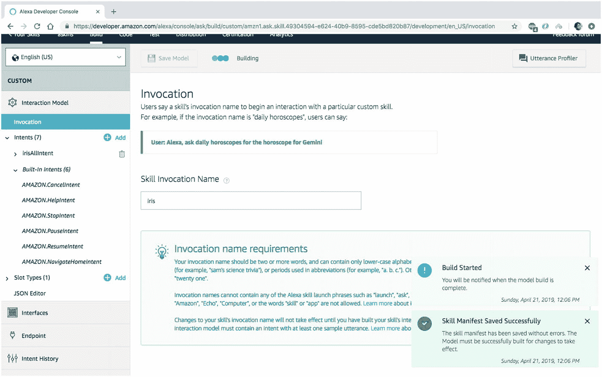

图 9-17

IRIS 自定义交互模型的构建过程进度

完成设置的最后一步是提供 IRIS 的 HTTPS 端点，以托管所有意图分类和响应生成逻辑，并接收来自 Alexa 的 POST 请求。见图 9-18。

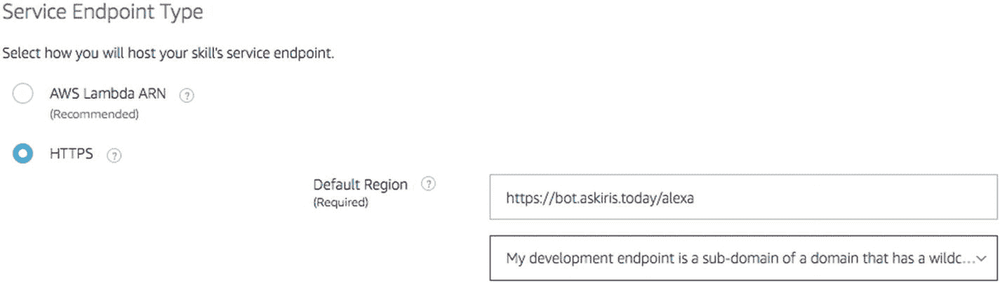

图 9-18

技能的服务端点配置

现在，让我们使用开发者控制台上可用的模拟器来测试设置，如图 9-19 所示。我们让 Alexa 询问 Iris“都柏林的天气”。Iris 的响应如下，可以通过 Alexa 的声音听到。

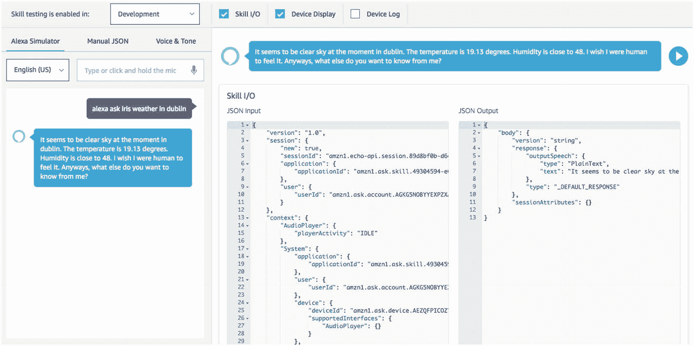

图 9-19

Alexa 开发者控制台上的模拟器

从 Alexa 发送到 IRIS API 的请求详情如下：

```
{
"version": "1.0",
"session": {
"new": true,
"sessionId": "amzn1.echo-api.session.XXXXXXX-2b66-XXXX-XXX-XXXXXXXXX",
"application": {
"applicationId": "amzn1.ask.skill.XXXXXX-e624-XXXXXX-XXX-XXXXXXX"
},
"user": {
"userId": "amzn1.ask.account.XXXXXXXX"
}
},
"context": {
"AudioPlayer": {
"playerActivity": "IDLE"
},
"System": {
"application": {
"applicationId": "amzn1.ask.skill.XXXXXXX-XXX-XXXXX-XXXX-XXXXXXXXX"
},
"user": {
"userId": "amzn1.ask.account.XXXXXX"
},
"device": {
"deviceId": "amzn1.ask.device.XXXXX",
"supportedInterfaces": {
"AudioPlayer": {}
}
},
"apiEndpoint": "https://api.eu.amazonalexa.com",
"apiAccessToken": "XXXXXXXX"
},
"Viewport": {
"experiences": [
{
"arcMinuteWidth": 246,
"arcMinuteHeight": 144,
"canRotate": false,
"canResize": false
}
],
"shape": "RECTANGLE",
"pixelWidth": 1024,
"pixelHeight": 600,
"dpi": 160,
"currentPixelWidth": 1024,
"currentPixelHeight": 600,
"touch": [
"SINGLE"
]
}
},
"request": {
"type": "IntentRequest",
"requestId": "amzn1.echo-api.request.XXXXXXXXXXX",
"timestamp": "2019-04-21T11:22:56Z",
"locale": "en-US",
"intent": {
"name": "irisAllIntent",
"confirmationStatus": "NONE",
"slots": {
"utteranceSlot": {
"name": "utteranceSlot",
"value": "weather in Dublin",
"resolutions": {
"resolutionsPerAuthority": [
{
"authority": "amzn1.er-authority.echo-sdk.amzn1.ask.skill.XXXXXXXX-XXXX-XXXX-XXXX-XXXXXXX.IrisCustomSlotType",
"status": {
"code": "ER_SUCCESS_NO_MATCH"
}
}
]
},
"confirmationStatus": "NONE",
"source": "USER"
}
}
}
}
}
```

来自 IRIS 的响应：

```
{
"body": {
"version": "string",
"response": {
"outputSpeech": {
"type": "PlainText",
"text": "It seems to be clear sky at the moment in dublin. The temperature is 19.13 degrees. Humidity is close to 48.\n I wish I were human to feel it. Anyways, what else do you want to know from me? "
},
"type": "_DEFAULT_RESPONSE"
},
"sessionAttributes": {}
}
}
```

在第 6 章中，我们创建了一个 NodeJS 应用程序，为 Facebook Messenger 提供了一个外部 API 端点。为了与 Alexa 集成，我们需要添加如下所述的 Alexa 端点：


```javascript
// 新的 API 端点 'alexa'，用于处理 POST 请求
app.post('/alexa', function(req, res) {
// 通过从 JSON 中读取 utteranceSlot 值来获取用户的表述
var text = req.body.request.intent.slots.utteranceSlot.value;
var session = req.body.session.user.userId;
var timestamp = req.body.request.timestamp;
/* 向 IRIS 后端服务发送 GET 请求参数。'Message' 参数包含用户表述
*/
var params = {
message: text,
sender: session,
seq: 100,
timestamp: 1524326401
};
var esc = encodeURIComponent;
var query = Object.keys(params)
.map(k => esc(k) + '=' + esc(params[k]))
.join('&');
//url 是 IRIS API 的 URL
fetch(url + query).then(response => {
response.json().then(json => {
var alexaResp = {
"version": "string",
"sessionAttributes": {},
"response": {
"outputSpeech": {
"type": "PlainText",
"text": json.message,
"ssml": "<speak>" + json.message + "</speak>"
}
}
}
res.json(alexaResp);
});
})
.catch(error => {
var alexaResp = {
"version": "string",
"sessionAttributes": {},
"response": {
"outputSpeech": {
"type": "PlainText",
"text": "抱歉，我的团队今天状态不佳，无法为您获取此信息。请稍后再试。",
"ssml": "<speak>抱歉，我的团队今天状态不佳，无法为您获取此信息。请稍后再试。</speak>"
}
}
}
res.json(alexaResp);
});
});
```

关于将自定义技能托管为 Web 服务的详细信息，请参阅 [`https://developer.amazon.com/docs/custom-skills/host-a-custom-skill-as-a-web-service.html`](https://developer.amazon.com/docs/custom-skills/host-a-custom-skill-as-a-web-service.html) 。

## 持续改进框架

在实际案例中，用户的表述很可能由于多种原因而未被我们的意图引擎分类或理解，例如该表述属于意图引擎范围之外的外部意图，或者由于意图匹配分数过低导致引擎信心不足。在生产环境中，我们观察到有相当数量的用户表述被引擎误解或完全无法理解。我们提出了一个框架，可以帮助 IRIS 变得更智能、更聪明，从而模拟自然的对话。

在自学习模块中，我们提出了三个改进组件，如图 9-20 所示：

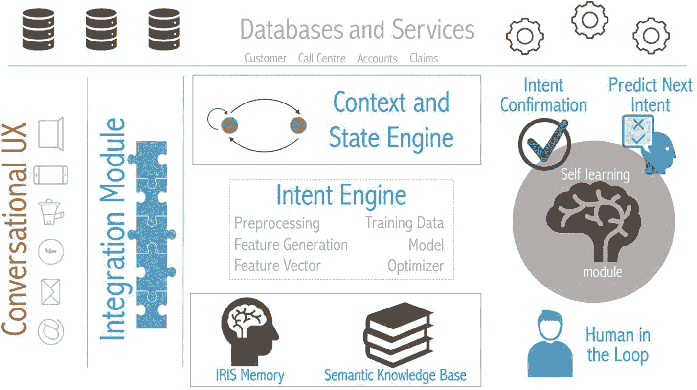

图 9-20

用于持续改进的 IRIS 功能组件

*   意图确认（二次核对）

*   下一意图预测

*   人工介入

### 意图确认（二次核对）

我们以用户表述“人寿保险”为例，该表述可能匹配到某个可能的意图场景；参见图 9-21。


图 9-21

意图匹配及对应分数

当我们将用户表述与图 9-21 中列出的可能意图进行匹配时，会得到一系列意图及其各自的匹配分数。IRIS 的意图引擎模块仅在匹配分数高于 0.75 时才会返回意图匹配结果。我们也将此称为最低阈值分数，低于该分数的意图匹配将不会在响应中被考虑。在“人寿保险”这个例子中，意图引擎返回了 `LIFE_INSURANCE_QUOTE_INTENT` 作为响应。

对此实现的一种优化是引入一个低于阈值分数但足够相关以供进一步处理的最低匹配分数。我们之前提到，最低阈值分数是指低于该分数的意图匹配不会从意图分类引擎的响应中返回。而最低匹配分数是指，如果一个意图未达到最低阈值分数，但分数高于此值，则会被考虑进行进一步处理。

让我们通过另一个用户表述的例子来理解：“人寿保险费用”，其匹配分数如图 9-22 所示。


图 9-22

另一个示例，展示不同的意图匹配及对应分数

在这个例子中，分数低于最低阈值分数，在当前实现中，由于意图分类引擎未返回明确的意图，用户表述将默认执行搜索。如果我们考虑将最低匹配分数设为 0.5，那么意图 `LIFE_INSURANCE_QUOTE_INTENT` 就可以被考虑进行进一步确认。

这些分数（0.75 作为最低阈值分数，0.5 作为最低匹配分数）应基于训练和测试数据集得出，并且后续也可能根据实际用户表述数据和意图分类引擎的性能进行调整。

因此，我们可以对 IRIS 进行修改，当表述的分类分数在 0.5 到 0.75 之间时，提示用户进行确认。

通过上述实现，典型的对话流程可以如下进行：

```
用户：你好
IRIS：你好
用户：人寿保险费用
IRIS：我未能准确理解您的查询。您是否需要人寿保险报价？
用户：是的
IRIS：好的，我可以帮您处理。请问您的年龄是？
```

### 预测下一意图

此功能使 IRIS 能够利用日志来理解和预测用户可能的下一个最佳意图。图 9-23 展示了用户日志。

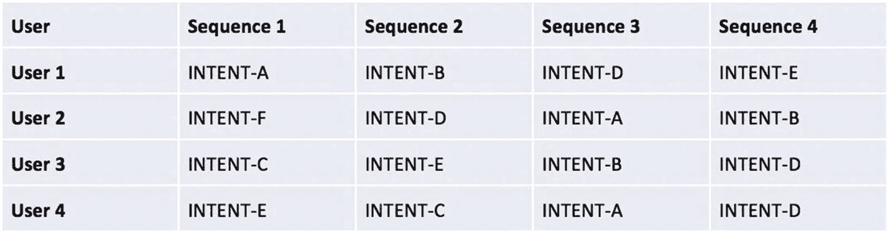

图 9-23

包含意图和序列的用户日志

在对 INTENT-A 的简单汇总中，如图 9-24 所示，我们发现 INTENT-B 是整体上最常见的下一个意图。

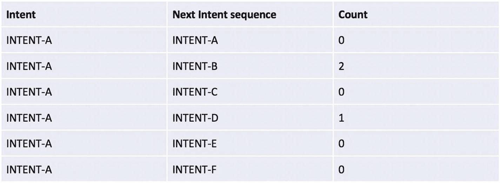

图 9-24

用于预测下一意图序列的日志汇总

我们还可以使用路径预测、关联规则和频繁项集等技术来获取最可预测的用户下一个意图。

在没有预测意图功能的情况下，与 IRIS 的典型对话可能如下进行：

```
用户：嗨
IRIS：你好
用户：我想要一个人寿保险报价
IRIS：好的，我来帮您处理。请问您的年龄是？
用户：我 24 岁
IRIS：您在过去 12 个月内是否吸烟？
用户：没有
IRIS：您的身高是多少？
用户：我身高 181 厘米
IRIS：您的体重是多少？
用户：163 磅
IRIS：好消息！您有资格获得加速核保决定。
用户：谢谢。我想购买人寿保险单。
IRIS：好的。您能提供您的电子邮件地址以便我开始申请流程吗？
用户：user@gmail.com
....
```

借助预测下一意图功能，对话将如下进行：

```
用户：嗨
IRIS：你好
用户：我想要一个人寿保险报价
IRIS：好的，我来帮您处理。请问您的年龄是？
用户：我 24 岁
IRIS：您在过去 12 个月内是否吸烟？
用户：没有
IRIS：您的身高是多少？
用户：我身高 181 厘米
IRIS：您的体重是多少？
用户：163 磅
IRIS：好消息！您有资格获得加速核保决定。请问您的电子邮件地址是什么，以便我开始申请流程？
用户：user@gmail.com
....
```


### 人在回路中

我们在本章中引入的框架的第三项改进是人在回路中。图 9-20 展示了用于持续改进的各种功能组件。无论我们使用何种技术来让 IRIS 更好地理解意图，总会有一些对话是 IRIS 无法理解的。原因很简单：IRIS 并不拥有宇宙中的所有信息，并且它始终被设计为仅执行一组已知的功能。

我们知道 IRIS 被设计用于执行某些操作，例如计算保险资格、提供账户余额、理赔状态等。假设有一定比例的用户正在向 IRIS 请求更改其保险单的地址。IRIS 目前不支持此功能，并且机器解释这类新信息具有挑战性。

假设部分用户话语如图 9-25 所示。

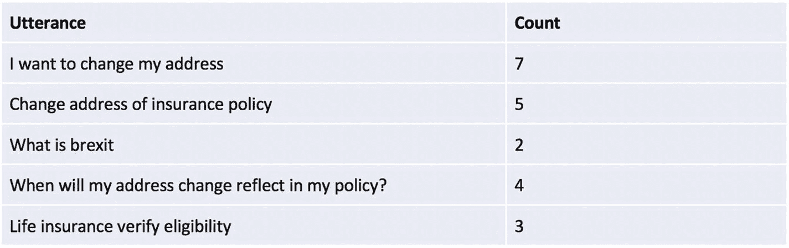

图 9-25

话语及计数

通过人在回路中，可以进一步分析这些话语。在图 9-26 中，前两个话语可以归类为一个意图。由于此意图占总日志的 66%，因此可以根据产品决策增强 IRIS 以支持 `ADDRESS_CHANGE`。在某些情况下，一个话语可以映射到现有意图，例如最后一个话语。这将有助于意图分类引擎由于更多数据集的可用性而更好地对意图进行分类。

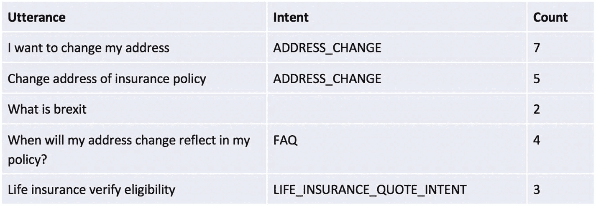

图 9-26

话语、意图及计数

也会出现诸如用户询问板球比赛比分、英国脱欧细节或火车时刻表等无关问题的话语。这些日志无需进一步处理，将被增强 IRIS 反馈循环的领域专家忽略。

## 总结

在本结论章中，我们讨论了将聊天机器人部署到云端的各种方法，演示了将 IRIS 与 Alexa 集成的 5 分钟入门介绍，并讨论了通过日志文件和人在回路中的反馈循环对 IRIS 进行持续改进。

在本书中，我们在三个支柱之间保持了良好的平衡：业务背景、机器处理自然语言的理论基础，以及从头开始开发真实世界聊天机器人的实践。我们相信这三个支柱将有助于构建一个真正企业级的聊天机器人，并具有明确的投资回报率。此外，我们还关注了使用个人数据时的伦理问题，以及欧盟国家如何同意 GDPR 法规来保护人们的隐私。

### 索引

### A

AccTypeSlot addTransition 方法 技术的出现 AphaNumericSlot 架构，私有聊天机器人 关键特性 维护 技术栈 工作流 AskIris 聊天机器人，Facebook Messenger 账户余额 理赔状态 IRIS 人寿保险 天气 身份验证 授权

### B

词袋模型 (BOW) 银行与保险公司 聊天机器人 构建流程 商业交易 贷款人与借款人 死亡率 损失风险 理论框架 银行类型 跳出率 (BR)

### C

CategorizedPlaintextCorpusReader 方法 聊天机器人 代理人/顾问，保险 基于 AI 的方法 优势 劣势 NLP 引擎 *vs.* 应用 架构 参见架构，私有聊天机器人 自动核保 收益，业务 成本节约 客户体验 业务渠道 对话 *vs.* 直接联系 实体 人工接管 保险购买流程 保险行业 意图 机器响应 消息应用 NLP *vs.* NLU 个人数据 计划建议 保单状态 质量评估 查询 报价详情 登记理赔 风险 确认 冒充 个人信息 第三方渠道 基于规则的方法 参见菜单驱动方法 成功指标 话语 全天候保险代理人，用例 聊天机器人，以客户服务为中心 活动目录 身份验证 授权 业务上下文 对话 实时聊天 NLP 层 信息交换 保单合规 安全渠道 用户输入 组块分析 CoNLL IOB 标签 名词短语 词元 云部署 AWS 服务 Docker 容器 EC2 实例向导 启动 EC2 安全组 ECS 完成率 (CR) 确认检查 成分分析 连续词袋模型 (CBOW) 持续改进框架 功能组件 意图确认 IRIS 功能组件 预测下一个意图 序列 自学习模块 话语与计数 对话式聊天机器人格局 对话流程 聊天机器人流程 定义 示例 多意图聊天机器人 NLP 逻辑 CoreNLP 成分分析 依存分析 NER POS 词元化 create_model() 方法 众包 客户中心化，金融服务 客户 访问核心要素 服务交付 客户互动 聊天 电子邮件 移动电话 自助服务 社交媒体 客户满意度指数 (CSI) 客户服务专家

### D

dataset_preparation() 方法 深度学习模型，NLG 数据准备 数据训练 生成文本 方法 库 LSTM 架构 网络 RNN 架构，LSTM 网络 RNNs 文本生成 训练 RNN 模型 依存分析 Dialogflow 智能体创建 基于聊天机器人 定义 文档 实体提取 集成选项 意图创建 模拟 文档分类 分类语料库 信息特征 NLTK 库 训练模型 词频

### E

弹性容器服务 (ECS) 集群配置 容器定义配置 ECR 仓库，创建对象 服务定义 任务定义 企业数据存储

### F

FasText FreqDist() 方法

### G, H

性别识别 常见名称 提取特征 信息特征 男性/女性，名称 模型准确率 模型预测 NB NLTK 库 训练/测试集 通用数据保护条例 (GDPR) 聊天机器人合规性 客户权利 数据保护 利益相关者 用户控制 一般保险 Gensim getIntent 方法 getKeywordresults() 方法 getResponse 方法 getStateMachine 方法


### I

身份管理系统（IMS）  
模拟保险聊天机器人  
添加执行方法  
添加状态转换  
AskForQuote 状态  
ExistSate 状态  
FindAdvisorState 状态  
GeneralQuery 状态  
GetAccountBalanceState 状态  
GetAccTypeState 状态  
GetClaimIdState 状态  
GetQuote 状态  
管理状态  
Start 状态  
添加服务端点  
创建意图  
AccountBalanceIntent 意图  
AccTypeSlot 槽位  
AphaNumericSlot 槽位  
AskForQuoteIntent 意图  
BooleanLiteralSlot 槽位  
类 CustomNumericSlot  
IPinSlot 槽位  
高级功能架构  
意图  
IrisConfiguration 类  
添加状态机  
DontHaveAccTypeShield 防护  
DontHaveQuoteDetailsShield 防护  
HaveAccTypeShield 防护  
HaveClaimIdShield 防护  
HaveQuoteDeatilShield 防护  
包 shields  
REST 服务  
ConversationController 类  
ConversationRequest 类  
ConversationResponse 类  
ConversationService 类  
集成模块  
应用 ID  
AskIris  
Facebook Messenger  
IRIS 通道  
NodeJs HTTP 服务器  
Webhook 端点，添加 webhook 验证  
订阅详情  
意图分类  
SNIPS  
TensorFlow  
virtualenv/conda 环境  
意图识别与信息服务（IRIS）  
意图/槽位/匹配组件  
getIntent 方法  
分类服务  
通用查询  
用户话语  
intent 类  
意图匹配器服务类  
MatchedIntent 类  
槽位的含义  
类 IRIS  
Alexa 技能创建  
自定义模型  
自定义槽位类型  
开发者控制台  
端点配置  
交互模型  
调用名称  
名称创建  
NodeJS 应用程序  
utteranceSlot  
IRIS 第三方集成  
市场趋势  
Alpha Vantage  
类别  
JSON 响应  
MarketTrendState 状态  
实时表现  
股票价格  
API 响应  
HTTP GET 请求  
StockPriceState 状态  
天气信息  
GetWeatherState 状态  
HTTP GET 请求  
JSON 响应  
一个地点  
OpenWeather  
多个城市  

### J

Java 虚拟机（JVM）

### K

KERAS_BACKEND

### L

语言模型，NLU  
fastText  
神经网络架构  
开箱即用任务  
参见开箱即用任务  
预训练模型  
预训练模型  
Word2Vec  
Word2Vec  
语言理解智能服务（LUIS）  
机器人流程  
构建自然语言模型  
意图分类  
NES  
潜在狄利克雷分配（LDA），NLU  
BOW  
文档集合  
gensim  
停用词  
主题建模  
潜在狄利克雷分析（LDA）  
潜在语义索引（LSI）  
词形还原  
在线聊天  
长短期记忆模型（LSTM）  
LsiModel() 方法  

### M

马尔可夫链模型，NLG  
库  
markovify  
随机标题，生成  
read_csv() 方法  
Markovify  
match 方法  
菜单驱动方法  
优势  
局限性  
界面  
自助门户  
Microsoft Bot 框架  
组件  
QnA Maker  
创建知识库  
在 Azure 中创建  
定义  
知识库  
发布  
知识资源  
仪表板  
死亡率风险  
多语言文本处理  
NER  
名词块  
词性/依存关系  
TestBlob，翻译  

### N

朴素贝叶斯（NB）  
命名实体识别（NER）  
自然语言生成（NLG）  
自然语言处理（NLP）  
应用  
分块  
参见分块  
CoreNLP  
参见 CoreNLP  
多语言文本处理  
参见多语言文本处理  
NER  
NLTK，词干提取/标准化  
spaCy  
参见 spaCy，NLP  
TextBlob  
参见 TextBlob  
文本数据  
参见文本数据  
单词搜索  
正则表达式（regex）  
特定单词  
自然语言工具包（NLTK）  
自然语言理解（NLU）  
应用  
语言模型  
参见语言模型，NLU  
LDA  
参见潜在狄利克雷分配（LDA），NLU  
OpenIE，提取  
情感分析  
极性  
主观性  
negation() 方法  
NLP 引擎  
noun_chunks 方法  
新颖的内部实现  
有限状态机  
组件  
防护  
State  
StateMachine  
transition 类  
保险用例  
参见模拟保险聊天机器人  
IRIS 内存  
长期属性  
session 类  
短期属性  

### O

开源数据  
开箱即用任务，预训练模型  
算术运算  
找出不同类单词  
句子相似度  
单词对相似度  

### P

词性标注（POS）  
基于模式/规则搜索  
个人数据，聊天机器人  
个人信息  
处理、理解与生成（P-U-G）  

### Q

QnA Maker  

### R

RASA 核心框架  
NLU 模块  
Realiser() 类  
正则表达式（regex）  
@RequestMapping 注解  
@RestController 注解  
复用率（RR）  

### S

自学习模块  
show_most_informative_features() 方法  
SimpleNLG  
补足短语  
并列从句  
疑问句  
main 方法  
修饰语  
否定  
nlglib 库  
输出  
介词短语  
从属从句  
tense 方法  
spaCy  
spaCy，NLP  
分块  
自定义模型  
依存句法分析  
依存树  
实体搜索  
NER  
基于模式/规则搜索  
词性标注  
SQuAD 数据集  
build_model 方法  
上下文/问题  
DeepPavlov  
术语  
斯坦福问答数据集（SQuAD）  
str.contains() 函数  

### T, U

tense() 方法  
TextBlob  
机器翻译  
词性标注  
拼写纠正  
文本数据  
CSV 文件  
采样  
分词，NLTK  
主题建模  
BOW  
ldamodel  
词形还原  
预测  
预处理，LDA  
读取，训练数据  
spaCy  
训练聊天机器人进行对话  
众包  
客户互动  
客户服务专家  
开源数据  
规则文档  
自生成数据  

### V, W, X, Y, Z

validate 方法
