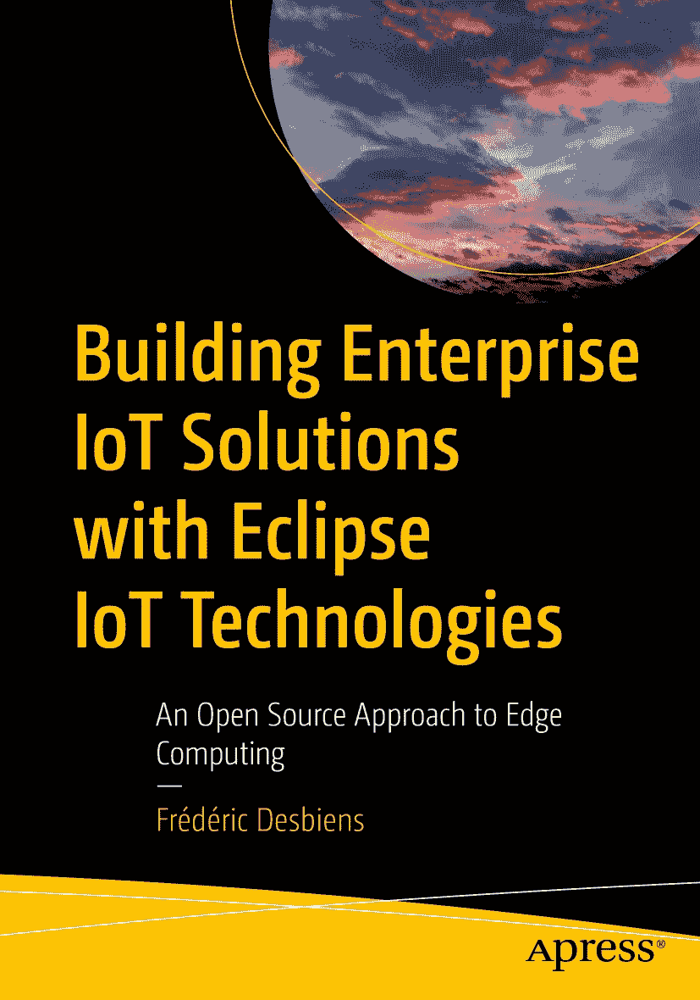

ISBN 978-1-4842-8881-8e-ISBN 978-1-4842-8882-5 [`doi.org/10.1007/978-1-4842-8882-5`](https://doi.org/10.1007/978-1-4842-8882-5) © Frédéric Desbiens 2023 本作品受版权保护。所有权利均由出版商独家授权，无论涉及材料的全部或部分，具体包括翻译、重印、插图复用、朗诵、广播、微缩胶片或其他任何物理形式的复制权，以及传输或信息存储与检索、电子改编、计算机软件，或目前已知或未来开发的类似或不同方法的权利。本出版物中使用通用描述性名称、注册商标名称、商标、服务标志等，即使未作明确声明，也不意味着此类名称可免于相关保护法律和法规的约束，因此可自由用于一般用途。出版商、作者和编辑均假定，本书中的建议和信息在出版之日是真实准确的。出版商、作者或编辑均不对本书所含材料或可能存在的任何错误或遗漏提供明示或暗示的担保。出版商对已出版地图中的管辖权主张和机构归属保持中立。

本 Apress 印记由注册公司 APress Media, LLC（斯普林格自然集团的一部分）出版。

注册公司地址为：1 New York Plaza, New York, NY 10004, U.S.A.

*Avec tout ce que je sais, on pourrait faire un livre... il est vrai qu'avec tout ce que je ne sais pas, on pourrait faire une bibliothèque.*

*以我所知，可成一书……诚然，以我所不知，可成一馆。*

*——* *萨沙·吉特里，《Le KWTZ》，出自《独幕剧集》*

*谨以此书献给 Eclipse 基金会的贡献者、提交者和项目负责人。没有你们对开源的奉献与承诺，本书将无法问世。*

引言

那是 1985 年。几周前，父亲从办公室带回一台电脑。那是一台 IBM 便携式个人电脑，型号 5155。“便携”在此是相对而言的；这台机器重达 13.6 公斤（30 磅）。父亲把它放在我们家未完工的地下室里，搁在一张旧餐桌上。即便以当时的标准来看，这台机器的性能也相当低下。我编写的简单 BASIC 程序几乎无法让那可怜的 4.77 MHz 8088 CPU 忙碌起来。内置的 256 KB 内存绰绰有余。我的 IT 职业生涯还要等上十多年才开始。

那是 2015 年。几周前，我买了第一块 Arduino 板和几个传感器。我把板子放在书桌上。与我那配备 3.2 GHz 六核 CPU 和 128 GB 内存的台式电脑相比，小小的 Arduino 简直被彻底碾压。然而，毫无疑问，它才是两者中最令人兴奋的那个。我为它编写的 Python 程序很简单。它的 16 MHz 8 位处理器比老 IBM 的 8088 更强大，但只能访问 2 KB 内存。硬件限制非常严苛，但可能性却是无限的。

在我生命中的这两个时刻之间，互联网诞生了。更准确地说，它走出了国防和学术领域，彻底改变了我们的生活。起初，它的影响仅限于我们的电脑；随后，它的影响力扩展到了我们的手机。如今，它无处不在。无论你走到哪里，都会发现连接着网络、收集数据并与物理世界交互的设备。我们称之为*物联网*（IoT）。这一趋势是真实的，并且将持续存在。本书旨在为你提供你的组织所需利用这一趋势的工具和知识。

## 为何物联网至关重要

没有哪家企业是纯粹虚拟的。云本身是遍布全球数据中心的数百万台服务器的集合。这些数据中心受到持续监控。温度、湿度、空气质量和振动传感器确保设备在最佳条件下运行。监控摄像头和其他安全系统则防止入侵者进入。因此，即使你的组织严格专注于提供数字服务，它仍将从物联网中受益。原因很简单：我们的世界如今以数据为中心。

你的组织需要数据来做出更好的决策，无论决策者是人工智能还是人类。你的组织需要数据来支持流程自动化，并改善你的工作生活质量。最后，你的组织需要数据来提高效率和效能。物联网是获取这些数据的工具。用 Eurotech 首席技术官 Marco Carrer 的话来说，*“实际上有海量的数据被困在现场，物联网之所以重要，是因为它能够提取这些数据。”* ^(¹)

这些数据以前很难获取，或者根本无法获取。让它们变得可获取的是计算设备惊人的价格下降和小型化。我那小小的 Arduino，2015 年售价约 20 加元，比 1985 年我摆弄的那台电脑便宜了一个数量级。此外，Arduino 的能效要高得多，使其适用于各种部署场景。

## 物联网：适用于所有行业和用例

低功耗、价格低廉且联网设备的普及意味着你可以为各种行业和横向用例构建物联网解决方案。

从行业角度来看，2021 年版的*Eclipse 物联网与边缘开发者调查* ^(²)发现，工业自动化、农业、楼宇自动化、能源管理和智慧城市是受访者最关注的五大行业领域。这些行业的共同点是对大规模自动化的需求，以及从机器学习和人工智能中获益的潜力。例如，在工厂中，安装在机器上的传感器可以收集数据，用于安排预防性维护并防止设备故障。在农场中，视频分析可以提供动物健康状况的洞察，而传感器则可以检测影响作物生长的问题。这样的例子不胜枚举。

此外，还有许多物联网横向用例。边缘 AI 是最常被引用的例子，开发者将模型部署在尽可能靠近数据源的服务器上（如果不是在物联网设备本身上）。但控制逻辑、数据交换和传感器融合也是其他重要的用例。事件流处理可用于算法证券交易、欺诈检测、基于位置的服务和许多其他应用，是另一个通用用例，它极大地受益于通过物联网设备获取的丰富数据。

## 物联网项目的独特之处

大多数（即便不是全部）物联网项目都会与基于云的组件和平台交互。然而，在云或企业数据中心的边界之外，盲目地使用标准的 *DevOps* 方法部署云原生应用注定会失败。这是为什么呢？部署物联网设备和边缘基础设施的边缘环境，在宏观层面上与云环境截然不同。

云是同质的、集中式的，并且大规模运行；资源可按需获取。另一方面，边缘是分布式的、异构的，并且小规模运行；资源可用性有限。换句话说，边缘与云截然相反，这使得物联网项目大相径庭。

物联网项目与其他典型 IT 项目的不同之处还体现在其他方面：

**物联网项目的时间跨度长达数年甚至数十年。** 更换一栋数字建筑中的所有传感器将是一项昂贵且耗时的工作。从工厂车间拆除机器设备的频率则更低。

**物联网项目涉及异构的硬件和软件组件。** 物联网领域不存在“一站式商店”。当然，许多集成商服务于市场，但与他们合作是封装异构性，而非消除它。

**物联网组件面临独特的限制。** 物联网和边缘计算几乎总是涉及加固型硬件。当在数据中心之外部署计算、存储和网络资源时，它们会面临温度波动、湿度、灰尘以及许多其他危险。此外，许多设备需要部分或完全依靠电池供电运行。这在许多细微的方面影响着软件层面。例如，振动可能会影响传感器读数，物联网设备需要考虑到这一点。

**连接性是前提；稳定性和可靠性则不是。** 物联网中的“I”代表“Internet”（互联网）。虽然并非所有物联网解决方案都通过公共互联网运行，但它们都利用了各种连接技术。物联网开发者需要假设网络的性能和可靠性会毫无征兆地变化，这对解决方案设计有着深远的影响。

## 企业级物联网有何不同？

企业级物联网与爱好者级物联网之间的差距，与物联网项目和其他 IT 项目之间的差距一样大，甚至更大。

大量价格实惠的硬件和传感器意味着任何人都可以在家尝试物联网，尤其是因为所需的许多软件构建模块都是开源的。Arduino 和 Raspberry Pi 因其成本和丰富的连接性而成为理想的实验平台。甚至可以说，这些设备已经取代了昔日的 Commodore 64 和 TRS-80 彩色电脑，成为通往 IT 职业生涯的门户。然而，企业级物联网项目有其特定要求。其中一些要求源于企业级物联网通常涉及关键任务和实时应用。

*   **可靠性：** 所使用的传感器和微控制器需要长期面对恶劣的物理环境。设备本身可能相对便宜，但维修或更换它们所涉及的人工成本可能很高，尤其是在偏远地区。此外，某些应用可能容忍一定程度的数据丢失，但许多应用则不能。

*   **可持续性：** 硬件组件的可用性和软件组件的可支持性必须与解决方案的时间跨度兼容。

*   **安全性：** 安全性对消费者和组织来说都是一个日益增长的担忧。企业级物联网项目的规模意味着安全漏洞会产生更严重的后果。在工业自动化和自动驾驶汽车等应用中，它们甚至可能危及生命。

## 开源：最佳方法

考虑到所涉及的要求，企业级物联网项目必须利用生产级、商业品质的硬件和软件组件。有些人可能认为这是采用开源方法的障碍。然而，事实远非如此。其核心是，开源意味着自由地访问、修改和重新分发源代码。^(³) 如果你需要维护一个解决方案长达数年甚至数十年，那么能够访问源代码就非常有价值。希望集成来自不同供应商的组件？有了源代码就简单得多。需要针对特定类型的应用调整解决方案的堆栈？源代码让你可以自由地这样做。开源确实是物联网的最佳方法。

最重要的是，开源是一种商业模式 `–` 而且是一种成功的模式。随着时间的推移，任何创新都会变成商品；价值线缓慢但坚定地向上移动。其结果是，各类组织可以通过协作和汇集资源来构建标准的开源组件，从而降低风险并保持创新能力。这些组件为他们提供了将差异化商业解决方案推向市场的坚实基础。换句话说，利用开源构建模块是组织将有限资源集中于竞争性工作的有力方式。开放协作创造了成功竞争的条件。

## 关于本书

本书旨在教你如何使用开源组件构建企业级物联网解决方案。具体而言，它聚焦于在 [Eclipse 基金会](https://eclipse.org) 旗下 [Eclipse IoT](https://iot.eclipse.org)、[Edge Native](https://edgenative.eclipse.org) 和 [Sparkplug](https://sparkplug.eclipse.org) 工作组中发现的众多库和平台。Eclipse IoT 于 2021 年庆祝了其十周年纪念，是业界规模最大、最成功的物联网开源社区。本书也讨论了相关的非 Eclipse 开源项目。

尽管本书涉及硬件问题，但其重点在于软件及相关开放标准。如果你是物联网爱好者，你将学会如何在企业环境中应用你的技能。如果你是物联网新手，你将了解许多成熟技术的优缺点。这两类读者都将理解如何使用最广泛应用的物联网技术的 Eclipse 开源实现。

在整本书中，概念将通过实际部署的示例加以说明。所提供的示例涵盖了多种用例，例如工业自动化、智慧农业、数字建筑、车联网等。

本书包含三个主要部分：

*   **基础与协议：** 本部分介绍了贯穿全书使用的参考架构，以及适用于受限设备、边缘设备和物联网平台的通用技术。

*   **受限设备：** 本部分讨论了如何选择将在现场部署的硬件和软件组件。

*   **边缘计算与物联网平台：** 本部分解释了边缘计算本身以及为何应依赖它。它还涵盖了边缘工作负载编排和网关，然后介绍了几个基于微服务的物联网云平台，这些平台暴露了定义明确、稳定的 API。这些平台不绑定到特定的云提供商，适用于私有云、混合云或公有云环境。

大多数章节都包含代码示例或分步说明，以帮助你开始使用所讨论的组件和平台。我真诚地希望你会发现它们有所帮助。

现在，让我们开始吧！

致谢

衷心感谢我的妻子 Roxanne。她知道这个项目需要占用我多少时间，却始终如一地支持我。你真是我的辉夜姬。

感谢 Eclipse 基金会中支持本书的每一位同仁。我感谢我们的执行董事 Mike Milinkovich 以及生态系统发展副总裁兼我的经理 Paul Buck 给予的鼓励。

特别感谢我在 Eclipse 基金会市场团队的搭档 Hassan Jaber。他足够疯狂，竟让他的妻子阅读了引言部分的早期草稿，他们热情洋溢的反馈给了我急需的信心提升。

为本书一个或多个章节提供反馈的技术审阅者们鼓掌。他们中的一些人甚至中断假期来进行审阅。这真是敬业精神！

感谢 Apress 的 Jill Balzano 和 Jonathan Gennick。Jonathan 向我提出了撰写本书的想法，我将永远感激这次机会。

最后，我怎能不在此提及我亲爱的 Ashitaka 呢？这个项目可能是我那台 2012 年值得信赖的联想 ThinkStation S30 的最后一个大项目了。

关于作者 关于技术审阅者 脚注 1   2   3

