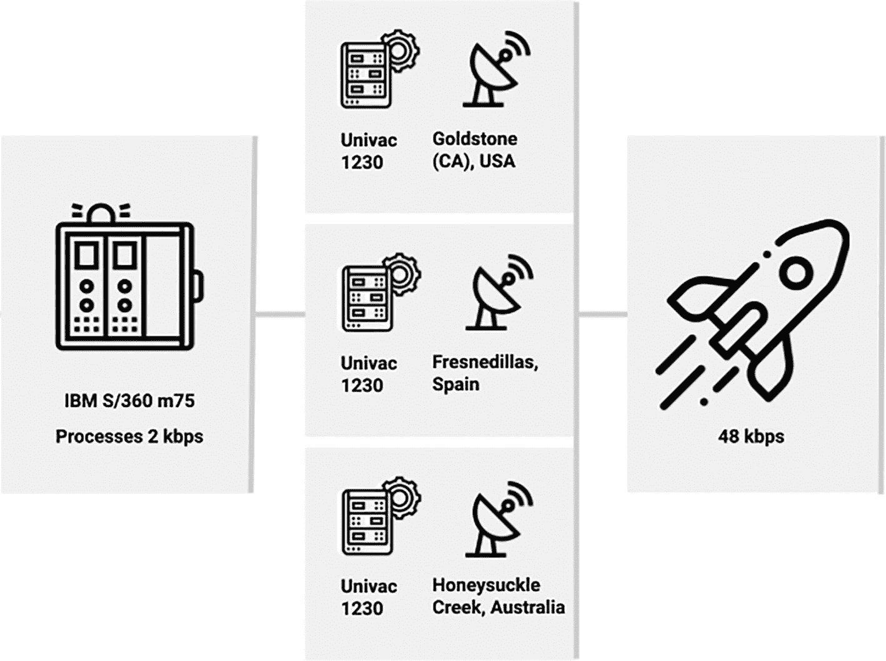
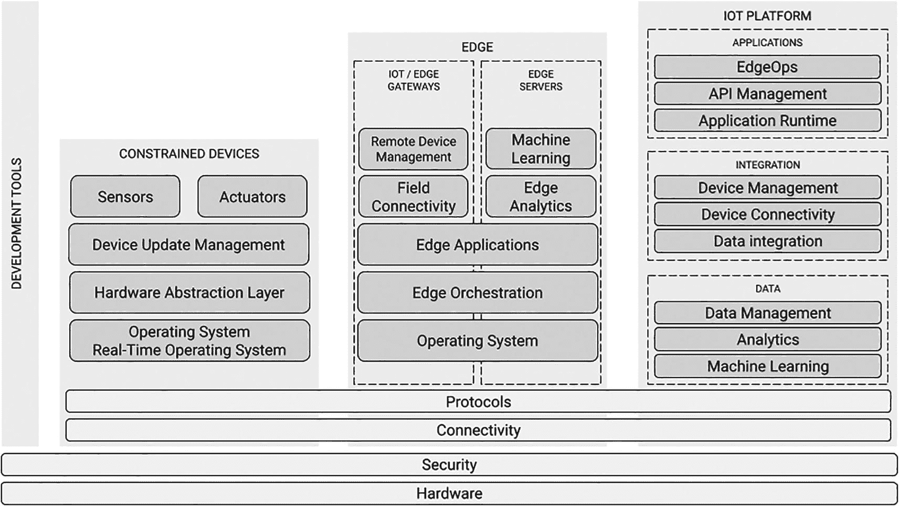
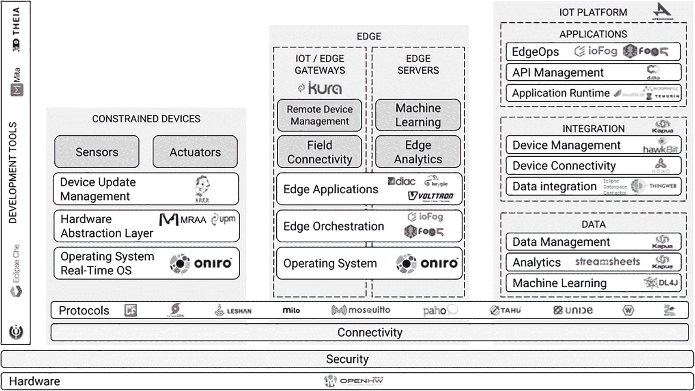

# 1. 什么是物联网？

> *Un tas de pierres cesse d'être un tas de pierres dès lors qu'un seul homme le contemple avec, en lui, l'image d'une cathédrale.*

> *一堆石头，一旦有一个人心中怀着大教堂的形象去凝视它，就不再是一堆石头了。*
> 
> ——安托万·德·圣-埃克苏佩里，《战斗飞行员》

物联网是数百年演进的顶峰。像轮子和简单机械这样的创新，其起源如今已被遗忘，消失在史前的迷雾中。人类很早就学会了利用水和风的力量。历史学家将水车的起源追溯到 3000 多年前的古希腊；至于风车，它们以我们今天所知的形式开始出现在公元 8 世纪和 9 世纪的中东和西亚。1712 年，托马斯·纽科门发明了第一台商业上成功的蒸汽机。因此，18 世纪是机械化的世纪。19 世纪和 20 世纪见证了两次根本性的技术转型：电气化和计算机化。到 20 世纪 80 年代，计算机开始接管工厂和办公室。

尽管我们可以将其根源追溯到 20 世纪 60 年代，但互联网是在 20 世纪 90 年代初腾飞的。它逐渐从一个基于文档的平台转变为一个动态的应用平台。然而，与此同时，经济实惠的无线数据连接的出现——移动宽带互联网接入随着 1991 年第二代（2G）移动连接的出现而诞生——是使物联网成为可能的关键性进步。2G，连同 Wi-Fi 网络和蓝牙，改变了游戏规则。尽管“物联网”一词是由凯文·阿什顿在 1999 年创造的，^(⁴) 但许多人仍然不确定其含义。我的目标就是改变这一点。

为了实现这一目标，我将首先解释什么是物联网，以及它与其他当前技术趋势有何不同。其次，我将定义边缘计算以及物联网如何利用它。然后，我将介绍一个跨越受限设备、边缘节点和物联网平台的物联网参考架构。最后，我将讨论物联网协议，这些协议在架构中扮演着横向角色，并将其他组件整合在一起。

## 物联网与当前其他趋势

在进一步深入之前，我们先来定义一下物联网本身。目前存在许多不同的定义。以下是我认为有意义的几个：

*   **高德纳咨询公司：**^(⁵) *物联网（IoT）是包含嵌入式技术的物理对象网络，这些技术用于通信、感知或与其内部状态或外部环境进行交互。*

*   **维基百科：**^(⁶) *物联网（IoT）描述了嵌入传感器、处理能力、软件和其他技术的物理对象（或此类对象的集合），这些对象通过互联网或其他通信网络与其他设备和系统连接并交换数据。*

*   **亚历山大·S·吉利斯：**^(⁷) *物联网（IoT）是一个由相互关联的计算设备、机械和数字机器、物体、动物或人员组成的系统，这些实体被赋予唯一标识符（UID），并具备通过网络传输数据的能力，无需人与人之间或人与计算机之间的交互。*

虽然这些定义是一个很好的起点，但上述定义并未捕捉到我认为至关重要的一些细微差别。以下是这些定义中缺失的三个主要细微之处：

*   **物联网中的“I”代表“****网络****”：** 在处理物联网时，连接性是既定前提。然而，并非所有部署都依赖运营商网络或公共互联网。许多窄带技术可以直接集成到本地有线或无线网络中，而无需互联网连接。

*   **这不仅仅是关于****传感器****：** 大多数物联网设备可以依靠一系列传感器来报告物理世界的状态。然而，它们能做的远不止收集数据。当配备执行器时，物联网设备可以接收命令并与环境进行交互。它们可以打开灯、调整阀门的位置、提高通风机的速度；可能性是无限的。

*   **存在人为因素：** 物联网设备与人类一样存在于物理世界中。在某些用例中，为设备添加人机界面控制是有意义的。在某些情况下，例如在仓库或工业场所周围使用的自动叉车和卡车，工人甚至可以使用控制装置来接管车辆。人类与设备之间的有序共存将变得越来越重要。

鉴于我之前提出的观点，我认为以下定义可能是最佳的折中方案：

> *物联网（IoT）是一个由联网物理对象组成的系统，这些对象包含嵌入式硬件和软件，用于感知物理世界（包括人类）或与之交互。*

现在我们对物联网有了清晰的理解，让我们将其与一些相关概念区分开来。

*   **M2M（机器对机器）通信：** 这个术语已经使用了一段时间；事实上，Eclipse M2M 是 Eclipse IoT 工作组的初始名称。随着工业计算的兴起，机器最初通过点对点连接进行连接。如今，工业网络在工厂中已司空见惯。M2M 是一个植根于工业自动化的概念，与操作技术密切相关。

*   **Web of Things（万维物联）：** [万维物联](https://www.w3.org/WoT/)（WoT）是来自[万维网联盟](https://www.w3.org/)（W3C）的一套标准，旨在实现“跨物联网平台和应用领域的轻松集成”。WoT 严格专注于软件，其范围比物联网窄得多。[Eclipse Thingweb 项目](https://www.thingweb.io/)是 W3C WoT 工作组的官方参考实现。

*   **工业 4.0：** 工业领域正在进行的数字化使一些人认为第四次工业革命正在进行中。“工业 4.0”这个名称指的就是这一点。M2M 和物联网代表了实现传统制造业和工业流程自动化的技术方法。最终，工业 4.0 将导致能够通过人工智能（AI）自行决策的智能机器得到广泛采用。

*   **工业物联网（IIoT）：** 这一点相对直接。IIoT 是将物联网技术应用于工业应用，例如制造业、资产跟踪和能源管理。IIoT 解决方案通常取代传统控制系统，旨在提高生产力和效率。

最终，物联网设备必须将数据发送到某个地方；它们接收的命令必须有来源。云通常是数据的目的地和命令的来源；无论这个云是私有云、混合云还是公有云都无关紧要。然而，将物联网设备直接连接到云并不总是可能或可取的。因此，当代物联网解决方案通常依赖于边缘计算。

## 边缘计算与物联网

边缘计算是一种分布式计算形式，它将计算、存储和网络资源更靠近数据产生和命令执行的物理位置。其起源可追溯至计算早期。例如，阿波罗时代任务控制中心使用的控制台并非显示从航天器实时传输的数据。位于澳大利亚、西班牙和美国的三个天线捕获遥测数据，并在本地由 Univac 1230 大型机进行处理，之后才转发至驱动休斯顿控制台的 IBM S/360。图 1-1 展示了该架构。

架构包含：IBM S/360（75 个进程，2 千比特/秒）、位于美国加州戈尔德斯通的 Univac 1230、西班牙弗雷斯内迪利亚斯的 Univac 1230、澳大利亚蜜溪的 Univac 1230，以及 48 千比特/秒的链路。

图 1-1

阿波罗登月任务的 IT 架构（来源：Eclipse 基金会）

如今边缘计算的不同之处在于，它并非直接依赖云原生和 DevOps 方法，而是采用针对边缘环境的适应性方案，如边缘原生和 EdgeOps。

在此，我想先解释为何边缘计算技术对成功实施物联网至关重要。在众多可能的原因中，我认为以下几点最具说服力：

*   **优化带宽使用：** 5G 以及 Dash7、LoRaWAN、Zigbee 等经济型窄带连接选项的出现，使得在需要的地方部署物联网设备变得更简单、更经济。许多物联网用例每天会产生千兆甚至万亿字节的数据。从成本角度看，传输全部数据并不合理。

*   **降低延迟：** 大多数企业和工业网络的延迟变化很大。通过公共互联网访问云端会引入不可预测的延迟。确定性局域网可以在特定位置实现可预测的延迟，但互联网服务提供商无法提供这种可预测性。低延迟对于关键任务和实时用例至关重要。假设你在自动化一座发电厂、一家工厂或一辆自动驾驶汽车，那么你无法承受因互联网延迟而在遥远的云端做出时间敏感型决策。

*   **支持数据主权：** 数据在收集、存储甚至处理过程中受到多层法律法规的约束。数据主权描述了多个国家或地区政府为保护其公民和企业数据所做的努力。在医疗等高度监管的行业，这转化为加密和数据驻留要求：数据在传输和静态时必须加密，并存储在特定的地理区域内。这个区域可以是一栋建筑、一座城市，或者在联邦制国家中，可能是一个州或省。边缘计算提供了基础设施，使解决方案更容易实现数据主权和数据驻留要求。

*   **实现异常报告：** 物联网解决方案中设备收集的数据价值并非始终相同。对于某些用例，需要处理每一次读数或将其归档到历史数据库中供将来参考。对于其他用例，只有超出正常运行阈值的读数才重要。换句话说，只报告异常情况。开发人员可以直接在驱动传感器的设备上实现异常报告。然而，在涉及复杂数据模型、机器学习和视频分析的场景中，最好将此类决策卸载到附近的边缘节点。当设备依靠电池供电时，异常报告尤其有用，因为它减少了通过网络发送数据的需求，而发送数据始终是一项耗电操作。

本节的要点是：边缘计算对大多数物联网解决方案（除了最简单的方案）都非常有益。这解释了为何参考架构将边缘计算置于核心位置。

## 物联网参考架构

我在 Eclipse 基金会的大部分工作是向新用户介绍我们的物联网和边缘计算技术。在撰写本文时，这涵盖了 50 多个各种规模和类型的开源项目。为了帮助开发者了解可用的技术，我们的社区整理了一个物联网参考架构，如图 1-2 所示。

物联网参考架构包括：受限设备、边缘、物联网平台、协议、开发工具中的连接性，以及安全与硬件概念。

图 1-2

物联网参考架构（来源：Eclipse 基金会）

关于此图的一个重要事实是，它并非一个蓝图。Eclipse 社区是一个代码优先的社区，开发者们聚集在一起构建组件和平台。参考架构是他们所构建生态系统的地图，而非我们的提交者和贡献者遵循的某种宏大架构愿景。话虽如此，让我们仔细看看架构的每个主要部分以及相关的 Eclipse 开源项目。

### 通用层

参考架构定义了三种环境类型：受限设备、边缘节点和物联网平台。大多数概念都存在于这三种环境的范畴内。然而，该架构包含五个适用于所有三种环境的概念，分别是：硬件、安全、连接、协议和开发工具。

硬件对物联网解决方案的设计影响深远，尤其是在考虑受限设备和边缘节点时。物联网开发者大部分时间都在优化代码体积，并力求将功耗降至最低`–`至少对于使用电池供电的设备而言是如此。出于同样的原因，设备设计者通常选择基于节能处理器架构（如 Arm）的微控制器。因此，物联网和边缘计算市场的多样性远超云端市场，后者仍由基于 x86-64 架构的服务器主导。此外，开源硬件近年来日益流行。例如，开源 RISC-V 架构得到了广泛采用，在 2021 年 Eclipse 物联网与边缘开发者调查中，9% 的受访者表示正在使用该架构，另有 8% 提到了 CORE-V。[OpenHW Group](https://www.openhwgroup.org/) 的 CORE-V 系列内核是基于 RISC-V 的开源处理器设计。Eclipse 基金会与 OpenHW Group 紧密合作，旨在构建一个涵盖硬件和软件的综合性物联网与边缘开源生态系统。

安全是物联网开发者关注的根本问题。受限设备和边缘节点比基于云端的服务器更容易受到攻击，因为它们部署在物理世界中。加密通信、静态数据加密以及信任根，只是开发者可以用来保护数据和设备自身完整性的几种技术。如今，许多人认为零信任方法更安全，因为它意味着软件默认从不信任任何设备。安全涉及众多方面，没有任何单一平台或开源项目能够涵盖所有方面。坚持使用活跃、维护良好且保持依赖项更新的项目，将有助于降低部分风险。

连接性指的是解决方案所使用的有线或无线网络技术。2021 年 Eclipse 物联网与边缘开发者调查发现，大多数开发者使用成熟的有线连接选项，如以太网、Wi-Fi 和蓝牙。5G 覆盖范围的不断扩大可能很快会改变这一现状。此外，许多窄带技术，如 Dash7、LoRa 和 Sigfox，非常适合涉及传感器数据收集的物联网项目。Zigbee 和 Z-Wave 也值得一提，因为它们仅消耗 Wi-Fi 所需功率的一小部分。对大多数专用连接选项的支持，通常是在通过更传统的连接方式接入互联网`–`进而接入云端`–`的网关中实现的。

协议在大多数物联网架构中扮演着关键角色。由于相关内容繁多，我将在后文进行更详细的介绍。好东西总是要留到最后！

最后，开发工具是 Eclipse 物联网与边缘社区关注的一个核心问题。传统的 Eclipse 集成开发环境（IDE）依然强劲，拥有超过六百万用户。它在嵌入式开发领域广受欢迎，这使其成为物联网开发者的一个强力选择。[Eclipse CDT](https://www.eclipse.org/cdt/) 和 [Eclipse Embedded CDT](https://eclipse-embed-cdt.github.io/) 项目就是证明，由 OpenHW Group 团队构建的 [CORE-V IDE](https://github.com/openhwgroup/core-v-ide-cdt) 亦是如此。然而，向基于云的开发环境发展的全球趋势在物联网和边缘计算市场也在增长。[Eclipse Che](https://www.eclipse.org/che/) 是一个面向开发团队的、基于 Kubernetes 原生技术的浏览器端 IDE，在过去几年中，它在物联网开发者中得到了广泛采用。[Eclipse Theia](https://theia-ide.org/) 是一个基于 Web 技术的可扩展云和桌面 IDE 平台，被 Che 以及越来越多的产品（如 Arduino IDE）所采用。开发者还可以通过 [Eclipse Theia Blueprint](https://theia-ide.org/docs/blueprint_download) 使用 Theia 的通用版本，这是一个基于 Eclipse Theia 平台构建桌面产品的模板。值得一提的是，由 Eclipse 物联网与边缘原生工作组托管的极少数技术与特定的 IDE 绑定。

注意

不要混淆 Eclipse IDE 和 Eclipse 基金会。IBM 于 2001 年将 Eclipse IDE 开源。该项目的参与者于 2004 年创建了 Eclipse 基金会，作为 Eclipse IDE 的供应商中立管理者。随着时间的推移，Eclipse 基金会实现了多元化发展，并成立了多个覆盖不同技术领域的工作组。例如，Eclipse 物联网工作组在 2021 年庆祝了其成立十周年。

截至撰写本文时，Eclipse 基金会托管了超过 425 个开源项目，并拥有四个战略领域：汽车、云原生 Java、物联网与边缘计算，以及开发工具。

### 受限设备

从某种意义上说，受限设备将我们带回了计算的早期阶段。32 位处理器在它们中仍然很常见，并且它们通常只有很少的内存和存储空间。它们的独特之处在于能够依靠电池供电运行数月甚至数年，以及其丰富的输入和输出能力。嵌入式开发者长期以来一直在对受限设备进行编程。物联网受限设备的不同之处在于，它们能够使用互联网类技术连接到互联网或隔离网络。

虽然一些开发者仍然在裸硬件上部署他们的受限设备代码，但大多数人会利用*操作系统*（OS）或*实时操作系统*（RTOS）。市场上有多种选择，既有商业产品也有开源产品。在 2021 年 Eclipse 物联网和边缘开发者调查中，最受欢迎的开源选项是 [FreeRTOS](https://www.freertos.org/)、[Mbed OS](https://os.mbed.com/) 和 [Zephyr](https://zephyrproject.org/)。Linux 也被广泛采用，尽管它需要更强大的处理器和更多的内存。对于开发者来说，利用操作系统或实时操作系统非常有意义，因为它们实现了应用程序可以利用的通用底层功能。

注意

实时操作系统与传统操作系统有两个不同之处：它们是可预测的和确定性的。可预测意味着系统会在严格的时间限制内响应特定事件。确定性意味着实时操作系统调度器的行为是可以预测的。换句话说，我们知道一个操作系统级操作需要多长时间（可预测），并且结果总是相同的（确定性）。

虽然操作系统为开发者提供了标准的应用程序编程接口（API），但处理传感器和执行器通常需要自定义代码。此外，将应用程序从一个微控制器移植到另一个微控制器`–`甚至只是迁移到不同的修订版本`–`可能很繁琐。这就是硬件抽象层（HAL）发挥作用的地方。HAL 提供了与硬件无关且与操作系统无关的 API，使应用程序更易于移植。由于物联网解决方案的生命周期很长，您需要将代码移植到不同硬件或您使用的实时操作系统新版本的可能性很高。因此，可移植性是一个重要问题。在 Eclipse 物联网工具包中，[Eclipse MRAA](https://projects.eclipse.org/projects/iot.mraa) 项目为各种开发板的 I/O 引脚和总线（例如树莓派）提供了抽象，而 [Eclipse UPM](https://projects.eclipse.org/projects/iot.upm) 则与传感器和执行器进行交互。

注意

一些操作系统正在将抽象层提升到新的水平，它们允许开发者选择最适合其用例的内核，并为应用程序提供统一的高级 API。这种方法的一个极好例子是 [Oniro 项目](https://oniroproject.org/)。Oniro 可以使用 Linux、Zephyr 或 LiteOS 内核。它拥有一个内核抽象层，统一了进程和线程管理、内存管理、文件系统、网络管理和外设管理。Oniro 是面向全球市场的 OpenHarmony 的兼容实现，OpenHarmony 是一个由 [OpenAtom 基金会](https://OpenAtomFoundation.org/) 规范并托管 的开源操作系统。

物联网受限设备的一个关键问题是保持其更新。随着时间的推移，您编写的代码和使用的操作系统中都会出现漏洞。恶意行为者随时准备[利用这些漏洞进行网络攻击](https://www.zdnet.com/article/your-insecure-internet-of-things-devices-are-putting-everyone-at-risk-of-attack/)。^(⁸) 如果您是一名物联网开发者或立志成为一名物联网开发者，认真对待安全更新至关重要。一些实时操作系统和协议具有内置的更新管理功能，可以与各种服务器端平台集成。[Eclipse hawkBit](https://www.eclipse.org/hawkbit/) 就是此类平台的一个例子。[Eclipse Hara](https://projects.eclipse.org/projects/iot.hawkbit.hara) 项目提供了一个 hawkBit API 的示例客户端实现，您可以在您的受限设备上利用它`–`或者至少从中获得灵感`–`。有些人会（并且有理由地）说，零信任方法有助于减轻受损设备带来的危险。然而，恶意行为者可能会利用此类设备攻击他人，而不仅仅是您的组织。因此，[拥有负责任的安全态势至关重要](https://www.zdnet.com/article/the-iot-is-getting-a-lot-bigger-but-security-is-still-getting-left-behind/)。^(⁹) 这包括至少为您的客户和最终用户提供一个报告安全漏洞的渠道，并承诺在收到报告后采取行动。

最后是传感器和执行器。选择合适的组件可能是一项复杂的任务。对于传感器而言，其精度、耐用性和采样率都是关键的考虑因素。至于执行器，它们接收电信号并将其与能源相结合。有几种类型，包括电动、液压和气动等。市场上大多数带有微控制器的开发板都提供一系列内置传感器，以及用于连接传感器和执行器的 I/O 和总线。

### 边缘计算

我在前文中将边缘计算描述为分布式计算的一种形式。然而，并非所有分布式计算都是边缘计算——即便在工业背景下也是如此。现代边缘计算强调使用部署在容器中的微服务，或较少情况下使用虚拟机。它还依赖于受*DevOps*启发的方法和技术。仅仅让软件运行在连接到驱动机械设备的*可编程逻辑控制器*（PLC）的计算机上，并不算边缘计算。

边缘计算节点主要有两种类型：网关和服务器。边缘服务器可以运行多个工作负载，是实现工作负载整合的一种方式。它们可用于连接受限设备或其他边缘服务器。而网关则进一步分为物联网网关和纯边缘网关。物联网网关是一组传感器和执行器的中心节点。它为这些设备提供彼此之间以及与外部网络的连接。它可以是一个物理硬件，也可以嵌入在网络连接设备中。边缘网关是边缘服务器与云端或更广泛网络之间的连接点。

无论类型如何，边缘节点通常都运行一个操作系统。2021 年 Eclipse 物联网与边缘开发者调查发现，Linux 在边缘节点上占据主导地位，微软 Windows 紧随其后，位居第二。诸如托管在 LF Edge（Linux 基金会）的[EVE-OS](https://www.lfedge.org/projects/eve/)等项目，旨在为 Linux 内核之上的这一领域提供一致的系统与编排服务。我之前提到的[Oniro 项目](https://oniroproject.org/)同样适用于边缘节点。

由于边缘计算依赖于微服务，因此需要自动配置、管理和协调它们。这就是**边缘编排**。虽然自动化通常针对单个任务，但编排关注的是涉及多个服务中多个步骤的流程。在云端领域，对工作负载编排的需求越来越多地由[*Kubernetes*](https://kubernetes.io/)（也称为 K8s）来满足。然而，Kubernetes 的复杂性和资源需求使其并不适合多种边缘用例。一些开源项目正在解决这个问题。[K3s](https://k3s.io/)是 Kubernetes 的一个轻量级发行版，打包为单个二进制文件，最大限度地减少了外部依赖。另一方面，[KubeEdge](https://kubeedge.io/en/)提供了一个容器化的边缘计算平台，并配有一个与 Kubernetes API 服务器集成的云端组件。尽管如此，越来越多的边缘开发者社区倾向于使用那些在需要时能与 Kubernetes 集成，但也能独立运行的边缘平台。这正是两个归属于 Eclipse Edge Native 工作组的边缘编排项目的情况。[Eclipse ioFog](https://iofog.io)专注于边缘的容器编排，代表了边缘计算的集中式方法，因为边缘节点与中央控制器通信。[Eclipse fog05](https://fog05.io)（发音为 fogOS；05 代表 5G）支持容器、虚拟机甚至二进制文件（可执行文件）；它通过将资源整合到统一结构中，以去中心化的方式管理节点。

注意

关于 Kubernetes 是否适合您的项目的深入讨论，您可以观看我于 2021 年发表的题为“我们真的需要在边缘使用 Kubernetes 吗？”的演讲（[`https://youtu.be/u8BDtSP7Dfg`](https://youtu.be/u8BDtSP7Dfg)）。

边缘编排平台旨在支持边缘应用的部署。这类应用形态各异、规模不一，涵盖广泛的用例，并适用于几乎所有行业。Eclipse 物联网工作组托管了一些开源边缘应用。[Eclipse 4diac](https://www.eclipse.org/4diac)提供了与 IEC 61499 兼容的开发工具和运行时环境；换句话说，它是一个完整的工具包，用于构建驱动工业设备的定制可编程逻辑控制器。[Eclipse Keyple](https://keyple.org)是一个广泛采用的解决方案，用于构建复杂的非接触式票务、交通和活动门禁系统。如果您曾在巴黎乘坐地铁或公交车，或从终端机购买过 SNCF 火车票，那么您就在不知不觉中使用了 Keyple。最后，[Eclipse VOLTTRON](https://volttron.org/)是一个分布式控制和传感软件。VOLTTRON 分析并转换数字建筑数据流，将其转化为可操作信息，以改善建筑运营、管理能耗，并实现建筑与电网的集成。

鉴于物联网/边缘网关和边缘服务器在架构中各自扮演的角色，它们具有不同的功能集。网关是受限设备与边缘到云端连续体上其他资源之间的桥梁。除了现代现场连接选项外，它们通常还配备串行端口和其他类型的传统接口，使组织能够在物联网背景下利用现有资产。由于网关是受限设备的连接点，它们通常提供远程设备管理功能。Eclipse 物联网项目中历史最悠久的项目之一，名为[Eclipse Kura](https://www.eclipse.org/kura/)，是一个使用 Java 语言和 OSGi 框架构建基于 Linux 的网关的平台。Kura 提供对硬件的 API 访问，并支持多种现场协议，包括 Modbus、MQTT、OPC UA 和 S7。Kura 可以运行边缘应用并编排工作负载，使其成为网关的全面解决方案。

虽然网关在架构中扮演特定角色，但边缘服务器提供了执行工作负载所需的资源。图表将机器学习和边缘分析确定为最关键的两项。然而，实际情况要更微妙一些。2021 年 Eclipse 物联网与边缘开发者调查的受访者将人工智能、控制逻辑、数据分析和传感器融合列为他们最重要的边缘计算工作负载——按此顺序。无论如何，边缘服务器是降低人工智能和机器学习延迟、同时提升隐私保护的有力工具，尤其适用于部署在公共空间的解决方案。

### IoT 平台

如果说受限设备负责收集数据，边缘节点在靠近数据源的物理位置进行处理，那么可以说 IoT 平台负责管理和分析数据。然而，这种说法仅表达了 IoT 平台功能的一部分。它们还提供运行应用程序所需的基础设施，这些应用程序利用数据以及集成功能，将受限设备和边缘节点与企业 IT 管理的其他基础设施连接起来。

在我们的架构中，与 IoT 平台相关的第一组概念涉及数据。数据是 IoT 的核心组成部分。传感器生成数据，执行器则执行由数据驱动决策所产生的命令。在此背景下，机器学习（ML）是 IoT 平台的一项关键能力，因为它旨在将原始数据转化为知识。开发者可以利用许多流行的开源机器学习框架，例如 [TensorFlow](https://www.tensorflow.org/) 和 [scikit-learn](https://scikit-learn.org/stable/)。有些 ML 框架甚至从一开始就为边缘部署而设计，例如 [TensorFlow Lite](https://www.tensorflow.org/lite) 和 [Apache MXNet](https://mxnet.apache.org/versions/1.8.0/)。Eclipse 基金会旗下有多个与 ML 相关的项目，其中最为成熟且被广泛采用的是 [Eclipse Deeplearning4j](https://deeplearning4j.org)。Deeplearning4j 是一套用于在 JVM 上运行深度学习的工具集，它允许开发者使用 Java 语言训练模型，并提供与 Python 生态系统的互操作性。

分析是描述使用数据分析工具和流程的另一个术语。该领域存在一个蓬勃发展的解决方案市场，既有专有软件也有开源软件。Bruce Sinclair 区分了三类分析：^(¹⁰)

*   **实时分析：** 在数据获取后立即执行分析，以发现异常情况。
*   **预测分析：** 分析当前和历史数据以生成预测和置信度。
*   **描述性分析：** 报告过去、现在或未来数据的分析，通常是可视化的基础。

[Eclipse Streamsheets](https://docs.cedalo.com/streamsheets/2.5/introduction) 是一个用于访问、创建和管理基于服务器的电子表格的平台，这些电子表格可以消费、处理并生成实时数据流。除了数值数据外，这些电子表格还可以包含多种类型的图表，使用户能够创建交互式仪表板。Streamsheets 开箱即用地支持多种 IoT 协议。

数据管理将数据视为宝贵资源，并提供治理、工具和方法来访问、集成、清理和存储数据。数据管理是一个庞大的功能领域，涵盖数据库管理系统、大数据系统、数据仓库和数据湖。数据建模也是一个至关重要的问题，因为模型是开发者在构建软件时使用的有用抽象。[Eclipse Kapua](https://www.eclipse.org/kapua/) 项目提供了一个模块化的 IoT 平台，具备强大的数据管理功能。Kapua 用户还可以通过构建动态仪表板来执行 IoT 分析。

现在让我们关注集成，这是参考架构中 IoT 平台特有的第二组概念。这组概念包含三个子概念：数据集成、设备连接和设备管理。值得一提的是，Eclipse Kapua 实现了所有这三个概念，并与运行 Eclipse Kura 的网关提供了简化的集成。

数据集成是从多个数据源创建统一信息源的过程。数据管理技术和方法的多样性使得数据集成成为架构中的关键功能。当然，模型和数据共享框架也是数据集成的关键组成部分，因为如果数据没有以标准化和一致的方式表达，整合数据将相当困难。[Eclipse Dataspace Connector](https://dataspace-connector.io/) 项目提供了一个基于通用身份模型构建的可互操作数据共享框架。它将实现[国际数据空间标准 (IDS)](https://internationaldataspaces.org/) 和 [GAIA-X](https://www.gaia-x.eu/) 欧洲项目的协议。另一个相关项目是 [Eclipse Thingweb](https://www.thingweb.io/)，它是万维网联盟 (W3C) 提出的[*物联万维网* (WoT)](https://www.w3.org/WoT/wg/) 模型的一个实现。WoT 旨在提供标准元数据和 API，以实现跨 IoT 平台和应用领域的集成。如果你对 WoT 感兴趣，可能还想了解 [Eclipse EdiTDor](https://github.com/eclipse/editdor)，这是一个用于创建和编辑 WoT 工件的工具，可[在线使用](https://eclipse.github.io/editdor/)。

虽然网络和协议提供了基本的设备连接能力，但大规模部署 IoT 解决方案通常需要连接到大量受限设备。此外，这些设备可能来自不同的供应商，并且不一定使用相同的协议——无论是由于限制还是设计决策。[Eclipse Hono](https://www.eclipse.org/hono/) 提供了远程服务接口，以协议无关的方式与 IoT 设备交互。设备可以向 Hono 发送*遥测*和*事件*消息以报告传感器读数；应用程序可以向设备发送*命令*消息。在后台，Hono 支持 AMQP、CoAP、HTTP 和 MQTT 协议，开发者可以根据需要构建自定义协议适配器。

设备管理的核心涵盖设备的操作和维护。IoT 平台需要维护设备注册表并记录每个设备的更新历史以实现这一目标。由于 IoT 设备在硬件、配置和能力方面差异巨大，用于控制计算机和移动设备的设备管理平台的许多功能在 IoT 环境中并不需要。然而，一个强大的软件更新交付后端是必不可少的。最先进的解决方案支持部分下载，并允许设备恢复中断的文件传输。[Eclipse hawkBit](https://www.eclipse.org/hawkbit/) 是一个领域无关的后端框架，用于向受限设备推出软件更新，它提供了上述功能以及更多。特别是，hawkBit 的设备管理联盟 (DMF) API 使得利用包含设备管理功能的协议（例如轻量级 M2M (LwM2M)）中的设备管理特性成为可能。

归根结底，应用程序是 IoT 平台需要收集数据并提供集成能力的原因。在现场部署受限设备是达到目的的一种手段，为应用程序提供了所需的基础设施。Eclipse 生态系统提供了应用程序运行时和 API 管理能力。此外，ioFog 和 fog05 边缘计算平台实现了 EdgeOps 的核心原则，EdgeOps 是专门针对边缘环境演进而来的 DevOps 方法。

2021 年 Eclipse IoT 与边缘开发者调查发现，在物联网平台领域，开发者最青睐的三大语言分别是 Python（22%）、Java（18%）和 JavaScript（16%）。但运行时环境呢？就 Python 而言，Python 解释器就是运行时；对于 JavaScript，Node.js 是最流行的运行时。那么 Java 呢？过去几年中，Java 生态系统见证了 Eclipse 基金会成为其核心枢纽。这一切始于[Mircoprofile](https://microprofile.io/)项目的创建，这是一个为微服务架构优化企业级 Java 的平台定义。随着 Oracle 将 Java 企业版及其他技术贡献给 Eclipse，这一趋势得以延续；如今这些技术以新名称蓬勃发展：[Jakarta EE](https://jakarta.ee)。2020 年底，OSGi 联盟宣布将过渡到 Eclipse 基金会。OSGi 是一个广受欢迎的 Java 动态模块系统，在物联网市场得到了广泛应用，其中 Eclipse Kura 是最著名的采用者之一。随后在 2021 年初，AdoptOpenJDK 计划成为 Eclipse 旗下的[Adoptium 工作组](https://adoptium.net/index.html)。[Eclipse Temurin](https://www.Eclipse.org/Temurin/)是 Adoptium 提供的 OpenJDK 发行版名称。Eclipse 基金会是云原生 Java 的大本营，我之前讨论过的多个物联网平台都使用了这项技术。

注意

关于 Eclipse 开源项目的一个常见误解是，基金会强制要求使用 Java 编程语言和[Eclipse 公共许可证](https://www.eclipse.org/org/documents/epl-2.0/EPL-2.0.html)（EPL）。实际上并无此类限制。项目可以自由选择其使用的语言。至于许可协议，虽然可以使用 EPL v2.0，但项目也可以根据需要选择 Apache 2.0、MIT 和 BSD 许可证。双重许可也是可行的，EPL v2.0 甚至支持将通用公共许可证（GPL）2.0 版或更高版本作为次要许可证。

从宏观角度来看，API 管理是一种创建、发布和监控服务接口运行时性能的方式。在大多数情况下，API 管理平台会强制执行使用策略和访问控制。过去几年中，数字孪生的概念在物联网市场日益流行。数字孪生简单来说就是物理设备或资产的虚拟表示，通过实时数据进行更新。[Eclipse Ditto](https://www.eclipse.org/ditto/)项目提供同步和异步 API 来与数字孪生交互，并在每次 API 调用时执行基于资源的访问检查。因此，Ditto 是一个专注于数字孪生的 API 管理平台。此外，它还执行状态管理；Ditto 会跟踪其监控设备的报告状态、期望状态和当前状态，并负责发布状态变更。

最后是 EdgeOps。也许你会问，既然 DevOps 已经改变了我们构建、部署和监控软件的方式，为什么还需要这样一个概念？答案很简单。纯粹的 DevOps 方法在云环境或企业数据中心之外无法奏效。当然，容器化微服务在边缘计算中至关重要，基础设施即代码也是如此。无论你的组织是否合并了开发与运维团队，两者之间的紧密协作也是一大优势。然而，许多物联网和边缘部署具有严格的实时性要求，或承担着关键任务角色。在这种情况下，持续集成与交付（CI/CD）必须考虑环境的限制。这解释了我之前为什么说 EdgeOps 是 DevOps 在边缘场景的适配。ioFog 和 fog05 之所以成为强大的边缘计算平台，正是因为它们的贡献者从一开始就为边缘场景构建了这些平台。它们是 EdgeOps 的具体体现。

还有一个 Eclipse 项目我尚未提及，但你应该了解：[Eclipse Arrowhead](https://www.arrowhead.eu/eclipse-arrowhead)。Arrowhead 是一个框架，使开发者能够构建、设计、实现和部署自动化系统之系统。从物联网的角度来看，你可以用它来编排物联网平台的各个组件。它甚至提供了多种有价值的服务，例如事件处理器、设备注册表和设备管理器。

现在我们已经完成了对参考架构的巡览，让我们回到协议这个话题。正是协议将受限设备、边缘节点和物联网平台连接在一起。

## 协议：基础构建模块

从云端领域转向物联网和边缘计算的开发者有时会认为，HTTP 和 REST 这些现代微服务构建者的瑞士军刀，就是他们所需的一切。当然，这是一个错误。物联网和边缘设备运行在这样一个环境中：减少电池消耗和带宽使用至关重要。因此，许多解决方案使用 UDP 而非 TCP 作为其传输协议（尽管许多物联网专用协议同时支持两者）。此外，在边缘端，拓扑结构和交互模型的种类也更加丰富。设备网状网络在物联网项目中很常见，发布/订阅交互也是如此。其结果是，存在许多物联网专用协议。其中一些，如 MQTT 和 OPC UA，甚至已经存在了 20 多年。与工业自动化中传统使用的协议（如 Modbus 和 Profinet）相比，现代物联网协议更安全，并且可以通过公共互联网安全地路由。因此，大多数云端物联网中间件都支持它们。

当前的物联网协议利用两种主要的交互模型之一：请求/响应或发布/订阅。在请求/响应模型中，客户端与特定服务器建立连接，发送请求，并最终得到响应——无论同步与否。HTTP 是请求/响应模型的典型例子。在发布/订阅模型中，发送者（发布者）与接收者（订阅者）完全解耦。发布者将消息发送到特定位置，如果订阅者注册接收消息，他们将收到发送到该位置的消息。因此，发布者并不知道是否有订阅者存在。MQTT 是发布/订阅模型最广泛使用的实现。

在撰写本文时，Eclipse 基金会共有 11 个物联网和边缘协议实现项目。其中八个实现了外部标准机构管辖下的标准。它们列于表 1-1 中。

表 1-1

外部管辖协议的实现

| 协议 | 组织 | 模型 | Eclipse 项目 |
| --- | --- | --- | --- |
| 受限应用协议 (CoAP) | 互联网工程任务组 (IETF) | 请求/响应 | [Eclipse Californium](https://www.eclipse.org/californium/) |
| 数据分发服务 (DDS) | DDS 基金会 (对象管理组织) | 发布/订阅 | [Eclipse Cyclone DDS](https://projects.eclipse.org/projects/iot.cyclonedds) |
| 轻量级 M2M (LwM2M) | OMA SpecWorks | 请求/响应 | [Eclipse Leshan](https://www.eclipse.org/leshan/)[Eclipse Wakaama](https://www.eclipse.org/wakaama/) |
| OPC UA | OPC 基金会 | 请求/响应发布/订阅 | [Eclipse Milo](https://projects.eclipse.org/projects/iot.milo) |
| MQTT | OASIS Open | 发布/订阅 | [Eclipse Amlen](https://www.eclipse.org/amlen/)[Eclipse Mosquitto](https://mosquitto.org/)[Eclipse Paho](https://www.eclipse.org/paho/) |

此外，还有三个协议实现完全由 Eclipse 基金会管理。这些详见表 1-2。

表 1-2

Eclipse 基金会管理的协议

| **协议** | **模型** | **Eclipse 项目** |
| --- | --- | --- |
| 生产性能管理协议 (PPMP) | 仅数据格式 | [Eclipse Unide](https://www.eclipse.org/unide/) |
| Sparkplug | 发布/订阅 | [Eclipse Sparkplug Specification](https://projects.eclipse.org/projects/iot.sparkplug)[Eclipse Tahu](https://projects.eclipse.org/projects/iot.tahu) |
| zenoh | 发布/订阅 | [Eclipse zenoh](https://zenoh.io/) |

在这三个协议中，目前只有 Sparkplug 是根据 [Eclipse 基金会规范流程](https://www.eclipse.org/projects/efsp/) 进行管理的。该流程是对 [Eclipse 开发流程](https://www.eclipse.org/projects/dev_process) 的补充，定义了 Eclipse 基金会规范项目的开源参与规则、组织框架和工作流程。Eclipse 规范项目以透明、供应商中立的方式公开运作。任何人都可以通过在规范的公共仓库中提出问题或提交拉取请求来提议对规范进行更改。这些提议是否会被考虑，取决于规范项目的提交者。

面对如此多的选择，为你的解决方案挑选最合适的协议可能看起来是一项艰巨的任务。以下是一些可以引导你做出选择的自问问题：

*   **我想要实现什么目标？** 如果你只是收集传感器数据，发布/订阅协议可能是最佳选择。请求/响应协议更适合命令——至少在你有时效性要求的情况下是这样。

*   **我的约束条件是什么？** 某些协议更适合优化吞吐量；其他协议则有助于减少延迟或功耗。不要盲目相信他人的断言，要亲自测试！

*   **我的生态系统是什么？** 你可以选择传感器、执行器或其他硬件，然后使用它们支持的协议。反之，你也可以选择一个协议，然后寻找合适的产品。无论哪种方式，你都将定义你生态系统的边界。

## 广泛的物联网和边缘工具包

我们对参考架构以及 Eclipse 基金会物联网和边缘生态系统的巡览到此结束。如你所见，你可用的工具包相当广泛。Pierre Aucoin 咨询公司的首席物联网和数字化转型分析师 Arnold Vogt 在一份报告中写道：*“在我们看来，Eclipse 基金会的物联网工作组无疑是领先的开源物联网社区。我们最好的两家供应商都是该社区的一部分，这并不令我们惊讶。”*^(¹¹)

但在这件事上，你不必只相信我的话，甚至也不必只相信 Arnold 的话。图 1-3 展示了我们的参考架构，其中包含了前面讨论过的项目的标志。

一个物联网参考架构展示了受限设备、边缘、物联网平台、协议、连接性、开发工具、安全性和硬件的标志。

图 1-3

带有项目标志的物联网参考架构（来源：Eclipse 基金会）

眼见为实。我们的物联网和边缘社区不仅建造了一堆岩石，更建造了一座代码的大教堂。

脚注 1   2   3   4   5   6   7   8

