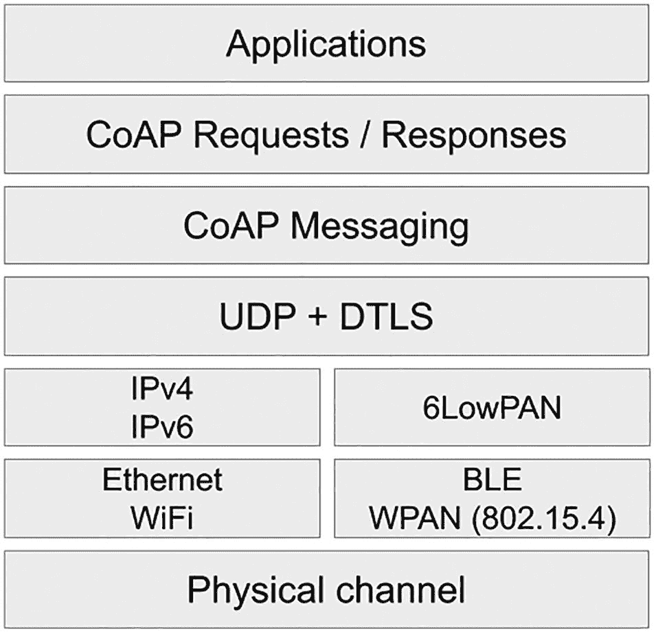

# 2. CoAP

> *文明如同建筑的石块，由一代代人相互支撑、相继贡献而建成。*

> *A civilization is built by the successive contribution of generations leaning on each other like the stones of a building.*
> 
> ——安德烈·弗罗萨尔，《让-保罗二世的世界》

开源的本质在于利用实现共享功能的构建模块。这使你能够专注于自己的应用场景，而无需重复实现无数人已经完成的工作。由于时间是一种极其有限的资源，你通过使用开源组件节省的每一分钟，都可以投入到为解决方案创造有意义的差异化价值上。

开源项目和标准同样受益于我刚才描述的方法。当一个开源项目将另一个项目作为依赖项时，它会强化各自所属的社区。拥有一个开源采用者，对于被依赖的项目而言，是宝贵的反馈来源和新需求的来源。对于采用者来说，利用开源依赖项提供了专有组件无法提供的灵活性和控制力。Eclipse IoT 和 Edge 的多个构建模块都依赖于它们的同类项目。

本章和下一章将介绍两种密切相关的协议：CoAP 和 LwM2M。在本章中，我将教你如何使用 [Eclipse Californium](https://www.eclipse.org/californium/)，一个成熟的 CoAP 实现；在下一章中，你将了解 [Eclipse Leshan](https://www.eclipse.org/leshan/)，这是一个使用 Californium 作为其 CoAP 实现来构建 LwM2M 解决方案的框架。

## CoAP：更精简的 HTTP

与 HTTP 类似，*受限应用协议*（CoAP）在由*互联网工程任务组*（IETF）发布的*征求意见稿*（RFC）中进行了描述。在撰写本文时，CoAP 是一项提议的互联网标准。CoAP 的初始 RFC，即 2014 年 6 月发布的 [RFC 7252](https://www.rfc-editor.org/info/rfc7252)，已由以下 RFC 更新：

*   **RFC 7641：** [*受限应用协议（CoAP）中的资源观察*](https://www.rfc-editor.org/info/rfc7641)，2015 年 9 月

*   **RFC 7959：** [*受限应用协议（CoAP）中的块传输*](https://www.rfc-editor.org/info/rfc7959)，2016 年 8 月

*   **RFC 8613：** [*受限 RESTful 环境中的对象安全（OSCORE）*](https://www.rfc-editor.org/info/rfc8613)，2019 年 7 月

*   **RFC 8974：** [*受限应用协议（CoAP）中的扩展令牌和无状态客户端*](https://www.rfc-editor.org/info/rfc8974)，2021 年 1 月

所有这四个 RFC 都代表了可选功能，在特定实现中可能不存在。

值得一提的是，加密的 CoAP 连接依赖于*数据报传输层安全*（DTLS）协议 1.2 版本，该协议最初于 2012 年 1 月作为 [RFC 6347](https://www.rfc-editor.org/info/rfc6347) 发布。DTLS 基于通常用于保护 HTTP 连接的*传输层安全*（TLS）协议，但侧重于数据报协议，例如*用户数据报协议*（UDP）。

## 特性

CoAP 的创建者明确将其设计为类似于 HTTP。与 HTTP 一样，它是一种请求/响应协议，依赖于*统一资源定位符*（URL）、内容类型和选项。你可以像处理 HTTP 流量一样，为 CoAP 流量使用代理和缓存。CoAP 请求依赖于与 HTTP 相同的 GET、PUT、POST 和 DELETE 方法，尽管在涉及的语义上存在细微差别。CoAP 和 HTTP 之间的关系在 RFC 7252 中描述如下：

> *CoAP 的目标不是盲目地压缩 HTTP [RFC2616]，而是实现 REST 的一个子集，该子集与 HTTP 通用，但针对 M2M 应用进行了优化。尽管 CoAP 可用于将简单的 HTTP 接口改造为更紧凑的协议，但更重要的是，它还提供了针对 M2M 的特性，例如内置发现、多播支持和异步消息交换。*

客户端向服务器发送 CoAP 请求，以执行通过方法代码在特定资源上指定的操作。URI 标识该资源。服务器发回由响应代码描述的响应，该响应可能包含资源的表示。CoAP 请求和响应是异步的。由于该协议运行在 UDP 或 UDP 等价协议之上，而 UDP 本质上不可靠，因此消息可能乱序到达、重复甚至丢失。CoAP 实现了一种轻量级的可靠性机制来解决这些问题。

注意

与 TCP 相比，UDP 是一种简单得多的协议。它是无连接的，不执行网络握手，这意味着它不提供排序、可靠性和数据完整性功能。这是设计使然，因为 UDP 将实现此类功能的任务委托给了协议栈的更高层。许多物联网协议利用 UDP 作为其传输层，因为其简单性降低了资源需求。CoAP 实现了简单的可靠性和完整性功能，这些功能即使在导致更高消息丢失的较弱网络上也能正常工作。

CoAP 的可靠性行为取决于所选的消息类型。目前有四种可用的消息类型：

*   **可确认：** 消息可靠传输。可确认消息的接收者必须通过确认消息进行确认，或者拒绝该消息。如果消息被拒绝，接收者将忽略该消息并发送回一个匹配的重置消息。

*   **不可确认：** 消息不可靠传输。接收者不得确认该消息。如果消息被拒绝，接收者可以选择发送回一个匹配的重置消息。

*   **确认：** 该消息作为对可确认消息的响应而发送。它必须回显原始消息 ID，并且必须包含一个响应或为空。有两种类型的确认：捎带确认和空确认。捎带确认携带对请求的响应。另一方面，空确认消息仅确认接收者收到了可确认消息，而不确认可确认消息中包含的请求的成功或失败。

*   **重置：** 该消息作为对可确认或不可确认消息的响应而发送。重置消息表示接收者收到了原始消息，但缺乏适当处理它的上下文。

在没有确认消息的情况下，可确认消息的发送者将以递增的间隔重新传输该消息，直到收到确认或达到允许的最大尝试次数。CoAP 实现还必须检测可确认和不可确认消息的重复消息。


如果你是一名开发者，何时应选择可确认消息而非不可确认消息？最简单的判断方法是查看所发送命令或数据的价值。如果丢失一次读数或某个命令未被执行也无大碍，那么不可确认消息就足够了。当你希望数据和命令最终能到达目的地时，确认和重传机制无疑会很有帮助。

使用 CoAP `–` 或大多数物联网协议 `–` 时的一个最佳实践是保持消息体量小巧。RFC 7959 于 2016 年为 CoAP 增加了块传输支持，使得 CoAP 能够传输设备固件更新等较大的有效载荷。然而，该协议更适合小载荷场景，如果你经常需要在有限数量的消息中传输大量数据，则应考虑其他替代方案。

CoAP 与 HTTP 的一个关键区别在于，CoAP 不使用头部（headers），而是使用消息选项（message options）。这些选项同时适用于请求和响应。例如，请求的 URI 通过多个选项传输，从而使解析更高效。[RFC 7252 第 5.4 节](https://www.rfc-editor.org/rfc/rfc7252.html%2523page-36)列出了可用的选项。另一个需要考虑的方面是，消息选项是二进制的，而非类似 HTTP 的文本头部，这显著减小了消息体积。

[RFC 7641](https://www.rfc-editor.org/info/rfc7641) 中增加了一个有趣的选项，标题为“*受限应用协议（CoAP）中的资源观察*”。*观察*选项是 CoAP 的一个广泛支持的扩展，它允许请求者获取资源表示，并在指定时间段内保持其更新。可以说 CoAP 的观察功能类似于订阅，尽管 RFC 7641 明确指出该特性的意图并非取代发布/订阅网络。

最后，值得一提的是，CoAP 允许请求者发现特定服务器暴露的资源。这是通过向 `/.well-known/core` URI 发送请求实现的，该 URI 将响应一个资源列表，并附带各自的媒体类型。要发现所有可达网络上的可用服务器，你可以向相关的 IP 多播组发送一个不可确认请求。对于 IPv4，地址为 `224.0.1.187`。对于 IPv6，地址为 `FF0X::FD`；服务器应仅在链路本地和站点本地范围内监听。请注意，每个服务器可以选择是否监听这些多播请求。

注意

许多网络会过滤或阻止多播流量，因为它很容易被用来发起*拒绝服务*攻击。在依赖多播请求进行发现之前，请务必与你友好的网络管理员确认他们允许此类流量。

## 协议栈

CoAP 与 IP 网络协议紧密相关。图 2-1 展示了 CoAP 的协议栈，下面我将进行讨论。



该架构图由以下层组成：应用层、CoAP 请求或响应、CoAP 消息、UDP 加 DTLS、IPv4 或 IPv6、6LoWPAN、以太网 Wi-Fi、BLE WPAN 以及物理信道。

图 2-1

CoAP 协议栈

在传统有线（以太网）和无线（Wi-Fi）网络上，CoAP 同时支持 IPv4 和 IPv6。然而，在 IPv6 之上使用 CoAP 更为简便，因为所有设备都是直接可路由的；在*网络地址转换*（NAT）代理后面使用 IPv4 总是更复杂。无论使用哪种 IP 版本，对于协议栈的其他层来说都无关紧要，并且除了 URI 的格式之外，在你编写的代码中也不会产生差异。

CoAP 也可以运行在 *6LoWPAN* 之上，这是 IPv6 在*无线个域网*（WPAN）上的绑定。6LoWPAN 允许基于 IEEE 802.15.4 标准 `–` 这也是 Zigbee、Thread 和 Snap 的基础 `–` 或基于具有许多相似特性的*低功耗蓝牙*（BLE）的网络发送和接收 IPv6 数据包。Linux 内核已经支持 6LoWPAN，这意味着你可以在大多数配备蓝牙无线电的单板计算机上，通过 6LoWPAN 使用 CoAP。

*互联网号码分配机构*（IANA）为协议分配了以下端口和服务名称：

*   端口号 5683 和服务名称 "coap" 用于常规流量
*   端口号 5684 和服务名称 "coaps" 用于 DTLS 加密流量


## 安全性

CoAP 中的大部分安全措施都依赖于 DTLS。DTLS 旨在为 UDP 等数据报协议提供安全特性。其设计者特意使其尽可能接近 TLS，以便利用后者丰富的实践经验，并最大限度地复用现有基础设施和代码。RFC 7252 [明确指出](https://www.rfc-editor.org/rfc/rfc7252.html%2523page-69)：“*实际上，DTLS 就是在 TLS 基础上增加了处理 UDP 传输不可靠特性的功能。*”

CoAP 提供了一种机制，用于向新设备提供配置值，包括设备所需的安全信息，例如加密密钥和访问控制列表。配置完成后，设备将在四种安全模式之一中运行。具体如下：

*   **NoSec（无安全模式）**：禁用安全性（不使用 DTLS）。仍然可以通过利用底层安全性来保护流量；IPsec 是一种可选方案。我强烈建议您不要使用此模式，即使是用于原型开发。从一开始就建立适当的安全性才是更好的方法。

*   **PreSharedKey（预共享密钥模式）**：启用 DTLS，并提供预共享密钥列表。每个密钥指定了其适用的节点列表。此模式最容易实现，但随着设备数量的增加，其扩展性不佳。

*   **RawPublicKey（原始公钥模式）**：启用 DTLS，设备拥有一个原始公钥——一个没有证书的非对称密钥对。设备拥有一个从其持有的公钥派生出的计算身份。它还维护着一个允许与之通信的设备身份列表。此模式与*公钥基础设施*（PKI）配合良好，并避免了与证书相关的复杂性。

*   **Certificate（证书模式）**：启用 DTLS，设备拥有一个非对称密钥对，并附带一个 X.509 数字证书，该证书绑定到其主体并由信任根签名。设备还拥有一个可以联系以验证证书的信任根锚点列表。每个设备应有一个在证书主体中使用的唯一 ID；依赖 IP 地址将是一个坏主意，因为 IP 地址可能会随时间变化。证书模式带来了更高的复杂性，并要求您的组织管理自己的 PKI。但是，如果您正在构建企业级物联网解决方案，则应尽可能采用此模式。

RFC 7252 规定，只有 NoSec 和 RawPublicKey 模式是强制实现的。在做出任何与安全相关的决策之前，请仔细检查您计划使用的任何实现的文档。

当启用 DTLS 时，在将 CoAP 响应与请求匹配时，DTLS 会话和时期必须相同。将确认消息或重置消息与可确认消息匹配，或将重置消息与不可确认消息匹配时，也是如此。

OSCORE 扩展（RFC 8613）代表了保护 CoAP 消息的另一种方式。OSCORE 保护端点之间的消息。具体来说，它保护请求方法、资源标识符、内容类型和消息的有效载荷。为了实现这一点，OSCORE 利用*简洁二进制对象表示*（CBOR）格式进行编码，并使用*CBOR 对象签名与加密*（COSE）进行加密。OSCORE 的开销可能低至标准 CoAP 之上的 11 字节。OSCORE 在逐字段的基础上应用保护。受保护字段的值被加密，其完整性得到保证。当消息在传输过程中时，代理仍然可以访问未受保护的字段。

## Eclipse Californium

Eclipse Californium 是一个用 Java 编写、广泛使用且成熟的 CoAP 实现。该项目自 2014 年 4 月以来一直活跃，并被其他几个 Eclipse 物联网项目所使用。Californium 在两种许可证下可用：Eclipse 分发许可证 v1.0（类似于 [3-Clause BSD 许可证](https://opensource.org/licenses/BSD-3-Clause)）和 Eclipse 公共许可证 v2.0。

Californium 的官方网络资源如下：

*   **网站：**[`https://eclipse.org/californium`](https://eclipse.org/californium)

*   **Eclipse 项目页面：**[`https://projects.eclipse.org/projects/iot.californium`](https://projects.eclipse.org/projects/iot.californium)

*   **代码仓库：**[`https://github.com/eclipse/californium`](https://github.com/eclipse/californium)

*   **维基：**[`https://github.com/eclipse/californium/wiki`](https://github.com/eclipse/californium/wiki)

截至撰写本文时，Californium 的最新版本是 v3.0.0，于 2021 年 11 月 3 日发布。Californium 集成了其自己的 DTLS v1.2 实现。该实现名为 Scandium，可在主要的 Californium 仓库中找到。

Californium v.3.0.0 提供以下稳定特性：

*   CoAP（RFC 7252）

*   观察/通知（RFC 7641）

*   分块传输（RFC 7959）

*   无服务器响应（RFC 7967）

*   资源目录草案（draft-ietf-core-resource-directory-20）实现

*   通过 Scandium 实现的 DTLS 1.2（RFC 6347）

*   DTLS 1.2 连接 ID（draft-ietf-tls-dtls-connection-id-13）

*   DTLS 记录大小限制扩展（RFC 8449）

*   DTLS 扩展主密钥（RFC 7627）

它还包含一些实验性特性，这些特性可能在未来的版本中变得稳定：

*   DTLS 中的 RSA 支持

*   DTLS 中的 Bouncy Castle（OpenJDK JCE 的替代方案）支持

*   基于 TCP 的 CoAP（RFC 8323）支持 `–` 不完整

*   OSCORE 支持

现在，让我们看看您是否可以使用 Californium 框架构建您的 CoAP 应用程序。为此，我将使用取自 Californium 本身附带的[众多演示应用](https://github.com/eclipse/californium/tree/3.0.0/demo-apps)的代码片段。

### 沙箱服务器

一个公共沙箱服务器可在 `coap://californium.eclipseprojects.io:5683/` 访问。它依赖于 `cf-plugtest-server` 演示应用程序，并且始终使用提交到主分支的最新代码。

### 入门指南

由于 Californium 是用 Java 编写的，它使用 *Apache Maven* 作为其构建系统。假设您有一个可用的 Maven 安装并且路径中有 JDK，您可以通过克隆 GitHub 仓库并从根文件夹运行 `mvn clean install -DskipTests` 来创建一个可执行的 JAR 文件。这样做还会在 `demo-apps/run` 子文件夹中为您提供各种演示应用程序的 JAR 文件。

如果您计划为项目使用 Maven，则需要向相关的 `pom.xml` 文件添加依赖项，如代码清单 2-1 所示。

```
...

org.eclipse.californium
californium-core
3.0.0

...

...
代码清单 2-1
Californium 的 Maven 依赖声明
```


### 简单 GET 请求：演示

[`cf-helloworld-client`](https://github.com/eclipse/californium/tree/3.0.0/demo-apps/cf-helloworld-client) 演示了如何向 CoAP 服务器发送请求。如果你已克隆仓库并构建了 Californium，可以通过执行以下命令来运行演示客户端：

```
java -jar cf-helloworld-client-3.0.0.jar GETClient coap://californium.eclipseprojects.io:5683/
```

在此示例中，我将请求发送到了公共沙箱。

如果没有问题，你将看到类似如下的输出：

```
10:21:07.463 INFO [Configuration]: defaults added COAP.
10:21:07.466 INFO [Configuration]: defaults added SYS.
10:21:07.466 INFO [Configuration]: defaults added UDP.
10:21:07.468 INFO [Configuration]: loading properties from file
...
10:21:07.699 INFO [CoapEndpoint]: coap Started endpoint at coap://[0:0:0:0:0:0:0:0]:39470
10:21:07.699 INFO [EndpointManager]: created implicit endpoint coap://[0:0:0:0:0:0:0:0]:39470 for coap
2.05
{"Content-Format":"text/plain", "Size2":457}
****************************************************************
CoAP RFC 7252                                  Cf 3.1.0-SNAPSHOT
****************************************************************
This server is using the Eclipse Californium (Cf) CoAP framework
published under EPL+EDL: http://www.eclipse.org/californium/
(c) 2014-2021 Institute for Pervasive Computing, ETH Zurich and others
****************************************************************
```

你可以在底部看到服务器的响应。

### 简单 GET 请求：代码

现在，让我们看看[简单 GET 请求演示的代码](https://github.com/eclipse/californium/blob/3.0.0/demo-apps/cf-helloworld-client/src/main/java/org/eclipse/californium/examples/GETClient.java)的主要部分。

默认情况下，Californium 将各种配置参数存储在一个 Java `.properties` 文件中。不过，可以覆盖这些默认值。以下代码片段展示了如何实现这一点，它重现了包含简单 GET 请求演示的类的顶部部分：

```
private static final File CONFIG_FILE = new File("Californium3.properties");
private static final String CONFIG_HEADER = "Californium CoAP Properties file for client";
private static final int DEFAULT_MAX_RESOURCE_SIZE = 2 * 1024 * 1024; // 2 MB
private static final int DEFAULT_BLOCK_SIZE = 512;
static {
CoapConfig.register();
UdpConfig.register();
}
private static DefinitionsProvider DEFAULTS = new DefinitionsProvider() {
@Override
public void applyDefinitions(Configuration config) {
config.set(CoapConfig.MAX_RESOURCE_BODY_SIZE, DEFAULT_MAX_RESOURCE_SIZE);
config.set(CoapConfig.MAX_MESSAGE_SIZE, DEFAULT_BLOCK_SIZE);
config.set(CoapConfig.PREFERRED_BLOCK_SIZE, DEFAULT_BLOCK_SIZE);
}
};
```

你可以看到，`DefinitionsProvider` 静态内部类为某些配置参数应用了特定的默认值；对于用户未指定的每个参数，Californium 将自行分配默认值。

在执行任何其他操作之前，`main (String args[])` 方法会初始化配置。`createWithFile` 方法会在文件不存在时创建一个 `.properties` 文件，如果文件已存在则从现有文件读取。

```
Configuration config = Configuration.createWithFile(CONFIG_FILE, CONFIG_HEADER, DEFAULTS);
Configuration.setStandard(config);
```

一旦我们有了有效的配置，向命令行指定的 URI 发送 GET 请求就很简单了。类型为 `CoapResponse` 的 `response` 变量使我们能够访问服务器响应的内容。以下代码片段展示了如何发送 GET 请求并处理响应：

```
CoapClient client = new CoapClient(uri);
try {
CoapResponse response = client.get();
if (response != null) {
System.out.println(response.getCode());
System.out.println(response.getOptions());
if (args.length > 1) {
...
} else {
System.out.println(response.getResponseText());
...
}
} else {
System.out.println("No response received.");
}
} catch (ConnectorException | IOException e) {
System.err.println("Got an error: " + e);
}
client.shutdown();
```

### 简单服务器：演示

构建 CoAP 服务器涉及更多工作，因为你需要绑定到网络接口并实现资源。幸运的是，Californium 演示应用提供了几个服务器示例。首先，让我们看看如何运行 [`cf-helloworld-server`](https://github.com/eclipse/californium/blob/3.0.0/demo-apps/cf-helloworld-server/src/main/java/org/eclipse/californium/examples/HelloWorldServer.java)，这是一个简单的实现。要启动它，只需执行以下命令：

```
java -jar cf-helloworld-server-3.0.0.jar HelloWorldServer
```

你应该会看到以下输出。请注意，由于我们之前运行了客户端，Californium 会通知我们它正在从 `Californium3.properties` 加载配置。

```
11:51:01.585 INFO [Configuration]: defaults added COAP.
11:51:01.588 INFO [Configuration]: defaults added SYS.
11:51:01.588 INFO [Configuration]: defaults added UDP.
11:51:01.589 INFO [Configuration]: defaults added TCP.
11:51:01.590 INFO [Configuration]: loading properties from file /home/fdesbiens/californium/demo-apps/run/Californium3.properties
11:51:01.626 INFO [RandomTokenGenerator]: using tokens of 8 bytes in length
...
11:51:01.685 INFO [CoapEndpoint]: coap Started endpoint at coap://127.0.0.1:5683
11:51:01.686 DEBUG [UDPConnector]: Starting network stage thread [UDP-Sender-/127.0.0.1:5683[1]]
```

默认情况下，此服务器将仅以 UDP 模式启动；如果需要，你也可以启用实验性的 TCP 支持。要验证服务器是否正常运行，你可以使用 `cf-helloworld-client` 向其暴露的资源发送 GET 请求。该资源的名称为 `helloWorld`。打开一个新的命令提示符并执行以下命令：

```
java -jar cf-helloworld-client-3.0.0.jar GETClient coap://127.0.0.1/helloWorld
```

由于你在同一台机器上运行客户端和服务器，因此不应遇到网络问题。用于调用客户端的命令提示符上应该会输出几行信息。我重现了输出的关键部分：

```
...
2.05
{"Content-Format":"text/plain"}
Hello World!
...
```

在此示例中，服务器返回了一个简单的文本响应。你看到的 2.05 是成功 CoAP GET 请求的响应代码之一——类似于 HTTP 中的 200。


### 简易服务器：代码解析

现在，我将与您一同探索 cf-helloworld-server 代码中最关键的部分。为简化起见，作者将所有内容都放在一个名为 `HelloWorldServer` 的类中，该类继承了 Californium 的 `CoapServer` 类。这个类包含了用于初始化和启动服务器的 `main` 方法。以下是该方法的核⼼代码：

```
try {
// 创建服务器
boolean udp = true;
boolean tcp = false;
int port = Configuration.getStandard().get(CoapConfig.COAP_PORT);
...
HelloWorldServer server = new HelloWorldServer();
// 在所有 IP 地址上添加端点
server.addEndpoints(udp, tcp, port);
server.start();
} catch (SocketException e) {
System.err.println("初始化服务器失败: " + e.getMessage());
}
```

`HelloWorldServer` 类的构造函数仅实例化服务器暴露的 CoAP 资源。您可以在以下代码中看到：

```
public HelloWorldServer() throws SocketException {
// 提供一个 Hello-World 资源的实例
add(new HelloWorldResource());
...
}
```

正如您在下一个代码片段中所见，`HelloWorldResource` 仅处理 GET 请求。您需要重写其他方法来处理 POST、PUT 和 DELETE 请求。基类 `CoapResource` 提供了默认实现，返回响应码 `4.05 (方法不允许)`。

```
static class HelloWorldResource extends CoapResource {
public HelloWorldResource() {
// 设置资源标识符
super("helloWorld");
// 设置显示名称
getAttributes().setTitle("Hello-World 资源");
}
@Override
public void handleGET(CoapExchange exchange) {
// 响应请求
exchange.respond("Hello World!");
}
}
```

最后，`addEndpoints` 方法为设备上可用的每个网络接口创建 `CoapEndpoint` 实例。整个交互依赖于著名的*构建器*模式。在此例中，构建器是定义在 `CoapEndpoint` 中的一个静态嵌套类。该方法也可以在需要时实例化 TCP 端点。以下是 `addEndpoints` 的代码：

```
private void addEndpoints(boolean udp, boolean tcp, int port) {
Configuration config = Configuration.getStandard();
for (InetAddress addr : NetworkInterfacesUtil.getNetworkInterfaces()) {
InetSocketAddress bindToAddress = new InetSocketAddress(addr, port);
if (udp) {
CoapEndpoint.Builder builder = new CoapEndpoint.Builder();
builder.setInetSocketAddress(bindToAddress);
builder.setConfiguration(config);
addEndpoint(builder.build());
}
if (tcp) {
TcpServerConnector connector = new TcpServerConnector(bindToAddress, config);
CoapEndpoint.Builder builder = new CoapEndpoint.Builder();
builder.setConnector(connector);
builder.setConfiguration(config);
addEndpoint(builder.build());
}
}
}
```

### 关于 DTLS

到目前为止，我展示的示例都使用纯 CoAP。幸运的是，Californium 团队还构建了一个 DTLS 演示[客户端](https://github.com/eclipse/californium/blob/3.0.0/demo-apps/cf-secure/src/main/java/org/eclipse/californium/examples/SecureClient.java)和[服务器](https://github.com/eclipse/californium/blob/3.0.0/demo-apps/cf-secure/src/main/java/org/eclipse/californium/examples/SecureServer.java)。查看客户端代码的核心部分，您会发现发送 GET 请求的主要区别在于使用了 `DTLSConnector` 而不是 `UDPConnector`。

```
public class SecureClient {
...
private final DTLSConnector dtlsConnector;
private final Configuration configuration;
public SecureClient(DTLSConnector dtlsConnector, Configuration configuration) {
this.dtlsConnector = dtlsConnector;
this.configuration = configuration;
}
public void test() {
CoapResponse response = null;
try {
URI uri = new URI(SERVER_URI);
CoapClient client = new CoapClient(uri);
CoapEndpoint.Builder builder = new CoapEndpoint.Builder().setConfiguration(configuration)
.setConnector(dtlsConnector);
client.setEndpoint(builder.build());
response = client.get();
client.shutdown();
} catch (URISyntaxException e) {
System.err.println("无效 URI: " + e.getMessage());
System.exit(-1);
} catch (ConnectorException | IOException e) {
System.err.println("发送请求时发生错误: " + e);
System.exit(-1);
}
}
}
```

`DTLSConnector` 实例在 `SecureClient` 类的 `main` 方法中初始化。相关代码如下所示：

```
DtlsConnectorConfig.Builder builder = DtlsConnectorConfig.builder(configuration);
CredentialsUtil.setupCid(args, builder);
...
CredentialsUtil.setupCredentials(builder, CredentialsUtil.CLIENT_NAME, modes);
DTLSConnector dtlsConnector = new DTLSConnector(builder.build());
SecureClient client = new SecureClient(dtlsConnector, configuration);
client.test();
```

该演示的作者将处理安全凭证（无论是密钥还是证书）的逻辑整合到了 [CredentialsUtil](https://github.com/eclipse/californium/blob/3.0.0/demo-apps/cf-secure/src/main/java/org/eclipse/californium/examples/CredentialsUtil.java) 类中。该类又依赖于 Californium 仓库中 [`demo-certs`](https://github.com/eclipse/californium/tree/3.0.0/demo-certs) 子文件夹下的资源。该文件夹中的 `README` 讨论了演示密钥和证书的结构，以及如何利用 [create-keystores.​sh](https://github.com/eclipse/californium/blob/3.0.0/demo-certs/src/main/resources/create-keystores.sh) 脚本来创建您自己的凭证。该脚本依赖于您已安装的 *Java 开发工具包* (JDK) 提供的密钥和证书管理工具。


## CoAP 与受限设备

虽然 Californium 是一个成熟且功能完备的 CoAP 实现，但它无法在无法运行 Linux 或 Windows 等高级操作系统的受限设备上使用。这是因为实时操作系统通常缺少所需的 Java 运行时环境。幸运的是，有一些可用的库，甚至某些实时操作系统本身就内置了对 CoAP 的支持。

在受限设备的上下文中，你需要回答的一个重要设计问题是：该设备是否应该作为 CoAP 服务器。运行服务器会比偶尔作为客户端发送请求消耗更多资源。如果你只需要报告传感器数值，那么运行服务器可能有些大材小用 `–` 尤其是在需要最大化电池续航的场景下。然而，如果设备需要执行命令，那么通过服务器暴露 CoAP 资源则是有意义的。例如，LwM2M 就采用了这种方法。

Linux 基金会的 [Zephyr RTOS](https://www.zephyrproject.org/) [内置了一个 CoAP 库](https://docs.zephyrproject.org/latest/reference/networking/coap.html)；该实现支持块传输（RFC 7959）和观察（RFC 7641）。此外，它还同时支持客户端和服务器角色。Zephyr CoAP 库使用纯缓冲区实现，并要求开发者直接操作套接字。提醒一下，Zephyr 是用 C 语言实现的。

GitHub 上的 Zephyr 仓库包含大量示例，包括一个 CoAP [客户端](https://github.com/zephyrproject-rtos/zephyr/blob/zephyr-v2.7.0/samples/net/sockets/coap_client/src/coap-client.c)和[服务器](https://github.com/zephyrproject-rtos/zephyr/blob/main/samples/net/sockets/coap_server/src/coap-server.c)。现在让我们快速浏览一下客户端代码，看看向远程服务器发送 GET 请求涉及哪些步骤。

首先是套接字声明。

```
static int sock;
```

`start_coap_client` 函数由 `main` 函数调用，用于设置套接字。请注意，该示例假设使用 IPv6 网络。

```
static int start_coap_client(void)
{
int ret = 0;
struct sockaddr_in6 addr6;
addr6.sin6_family = AF_INET6;
addr6.sin6_port = htons(PEER_PORT);
addr6.sin6_scope_id = 0U;
inet_pton(AF_INET6, CONFIG_NET_CONFIG_PEER_IPV6_ADDR,
&addr6.sin6_addr);
sock = socket(addr6.sin6_family, SOCK_DGRAM, IPPROTO_UDP);
if (sock < 0) {
LOG_ERR("Failed to create UDP socket %d", errno);
return -errno;
}
ret = connect(sock, (struct sockaddr *)&addr6, sizeof(addr6));
if (ret < 0) {
LOG_ERR("Cannot connect to UDP remote : %d", errno);
return -errno;
}
prepare_fds();
return 0;
}
```

实际发送请求的代码位于 `send_simple_coap_request` 函数中，以下是一个简化版本：

```
static int send_simple_coap_request(uint8_t method)
{
uint8_t payload[] = "payload";
struct coap_packet request;
const char * const *p;
uint8_t *data;
int r;
data = (uint8_t *)k_malloc(MAX_COAP_MSG_LEN);
if (!data) {
return -ENOMEM;
}
r = coap_packet_init(&request, data, MAX_COAP_MSG_LEN,
COAP_VERSION_1, COAP_TYPE_CON,
COAP_TOKEN_MAX_LEN, coap_next_token(),
method, coap_next_id());
if (r < 0) {
LOG_ERR("Failed to init CoAP message");
goto end;
}
for (p = test_path; p && *p; p++) {
r = coap_packet_append_option(&request, COAP_OPTION_URI_PATH,
*p, strlen(*p));
if (r < 0) {
LOG_ERR("Unable add option to request");
goto end;
}
}
...
net_hexdump("Request", request.data, request.offset);
r = send(sock, request.data, request.offset, 0);
end:
k_free(data);
return 0;
}
```

