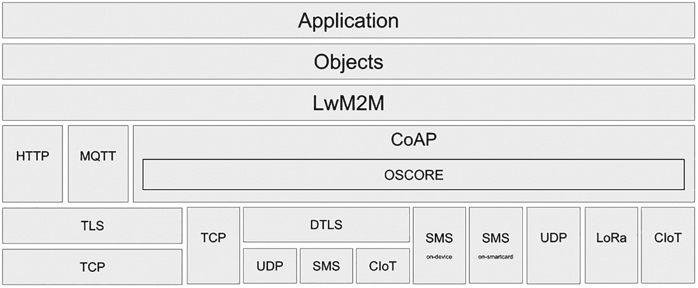
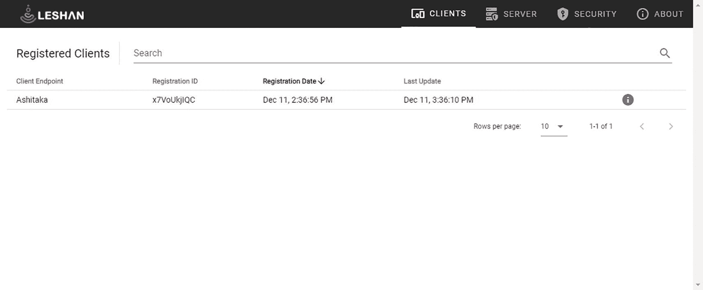
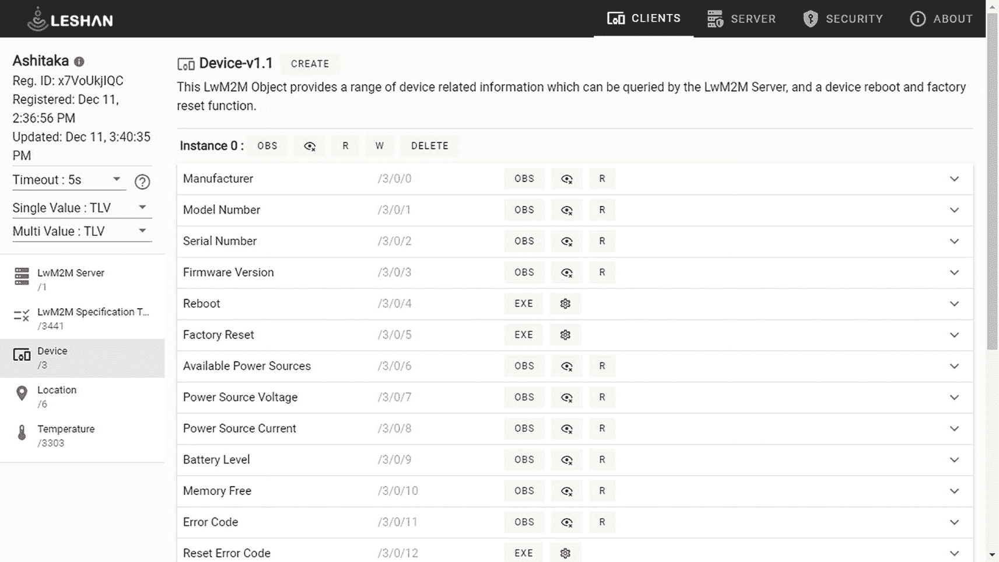
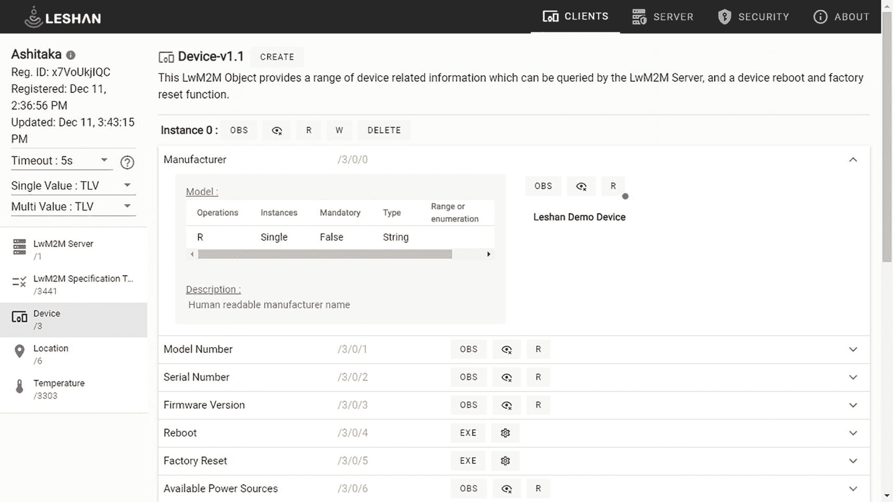
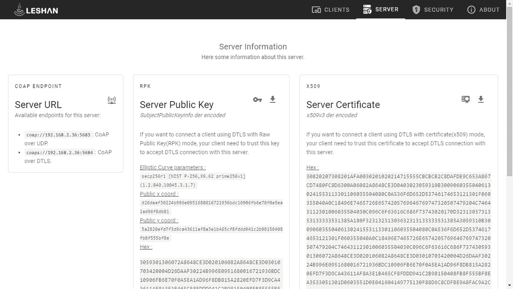

# 3. LwM2M

> *Nous avons besoin les uns des autres. L'être humain n'est pas fait pour s'isoler, mais pour partager.*

> *我们彼此需要。人类生来不是为了孤立自己，而是为了分享。*
> 
> ——爱丽丝·帕里佐，《野猪的重负》

现代应用程序通常有众多依赖项。作为开发者，你我都站在巨人的肩膀上。或者更确切地说，我们自己的代码是建立在我们使用的众多库之上的。本书中我介绍的许多技术都建立在先前进步的基础上。本章的重点 LwM2M 就是一个很好的例子。

历史上，LwM2M 专门使用 CoAP 作为传输层。虽然 LwM2M 1.2 版本在 2020 年底[增加了对 HTTP 和 MQTT 传输的支持](https://omaspecworks.org/lwm2m-v1-2-is-now-available/)，但 CoAP 仍然是使用最广泛的一种。因此，我的代码示例将利用 [Eclipse Leshan](https://www.eclipse.org/leshan/)，这是一个用于构建 LwM2M 解决方案的框架，它使用 Californium 作为其 CoAP 实现。

## LwM2M：建立在 CoAP 基础之上

CoAP 为构建物联网解决方案提供了坚实的基础。特别是，描述该协议的各种 RFC 并未定义消息负载，这一事实意味着 CoAP 非常灵活。同样的灵活性也适用于资源；开发者可以以他们认为合适的任何方式组织资源。其结果是，开箱即用的情况下，支持 CoAP 的设备和软件栈之间无法互操作。你至少需要处理负载并调整一些参数，以确保消息以正确的格式发送到正确的资源。

*轻量级机器对机器*（LwM2M）协议旨在通过提供可扩展的资源和数据模型来解决这种互操作性缺失的问题。它由 [OMA SpecWorks](https://omaspecworks.org/)（前身为开放移动联盟 OMA，一个非营利性标准组织）管理。该协议 1.0 版本于 2017 年 2 月发布，截至撰写本文时，最新版本是 2020 年 11 月发布的 1.2 版本。


## 数据模型：对象与资源

LwM2M 数据模型基于*资源*：即设备提供的各类信息元素。资源按逻辑分组为*对象*。每个资源在所属对象内被分配一个唯一标识符。OMA SpecWorks 为所有作为 LwM2M 规范及对象规范核心组成部分的对象分配并维护唯一的*对象标识符*。对象规范定义了对象资源所支持的操作（读取、写入、执行），并规定了这些资源是强制性的还是可选的。此外，规范还说明了每个资源的数据类型，以及是否支持多实例。

第三方组织，如标准机构、个人或供应商，可以向 OMA SpecWorks 提议对象规范。一旦被采纳，这些对象规范将被收录到官方 LwM2M 注册表中，并分配一个唯一 ID。例如，LwM2M 规范定义了一个 `Device` 对象（ID: 3），用于向相关方公开设备信息。`Device` 对象包含用于表示设备制造商名称、型号和序列号等信息的资源。此外，注册表中还包含可重用的资源定义，您可以在自己的对象规范中使用它们。这些资源定义也被分配了唯一的 ID 以供引用。典型的例子包括数字输入、数字输出、模拟输入、模拟输出、调光值和测量单位。`Sensor Value`（ID: 5700）是注册表中定义的可重用资源之一，并被用于许多报告传感器读数的对象中。其中一个对象是 `Temperature`（ID: 3303）。值得一提的是，对象规范是有版本管理的，而资源定义则没有。

注意

官方 LwM2M 注册表位于

[`https://technical.openmobilealliance.org/OMNA/LwM2M/LwM2MRegistry.html`](https://technical.openmobilealliance.org/OMNA/LwM2M/LwM2MRegistry.html)

在运行时，客户端和服务器会实例化对象及其资源。一个对象可以包含同一资源的多个实例，并且同一对象的多个实例可以同时存在。对象及其包含的资源通过其分配的数字 ID 进行引用，而对象和资源实例则在运行时获得一个实例编号。实例编号从 0 开始——这符合常规。所有 ID 和实例编号均为无符号整数。

LwM2M 资源模型包括用于创建、更新和检索资源的操作，并支持资源变更的异步通知。一个资源可以支持三种操作：读取、写入和执行。支持读取或写入的资源称为*值*资源。支持执行的资源称为*可执行资源*；它们用于触发动作，不包含值。

要访问一个资源，您只需使用一个简单的 URI 来引用它。应遵循以下模式：

```
/[对象 ID]/[对象实例]/[资源 ID]/[资源实例]
```

这一切听起来可能有点抽象。那么，让我们来看一个具体的例子。LwM2M 规范定义了一个名为 `Device`（ID: 3）的对象，该对象定义了一组提供设备信息的资源，以及用于重启设备或执行恢复出厂设置的可执行资源。表 3-1 列出了 LwM2M v1.1 版本中 `Device` 对象的部分资源。

表 3-1

Device LwM2M 对象的资源列表（部分）

| ID | 名称 | 操作 | 实例 | 强制性 | 类型 |
| --- | --- | --- | --- | --- | --- |
| 0 | 制造商 | 读取 | 单实例 | 可选 | 字符串 |
| 1 | 型号 | 读取 | 单实例 | 可选 | 字符串 |
| 2 | 序列号 | 读取 | 单实例 | 可选 | 字符串 |
| 3 | 固件版本 | 读取 | 单实例 | 可选 | 字符串 |
| 4 | 重启 | 执行 | 单实例 | 强制 |   |
| 5 | 恢复出厂设置 | 执行 | 单实例 | 可选 |   |

LwM2M 规范规定，设备必须实现 `Device` 对象，并且只存在一个实例。因此，任何设备都会暴露一个 `Device` 对象的实例，其路径为

```
/3/0
```

如果该设备实现了 `Manufacturer` 资源，则该资源将位于

```
/3/0/0
```

让我们再看另一个例子。LwM2M 注册表中包含一个 `Temperature` 对象，用于报告温度传感器的数值。该对象的 ID 是 `3303`。该对象声明了多个资源，其中之一是 `Sensor Value`。`Sensor Value` 是注册表中定义的可重用资源之一，其 ID 为 `5700`。因此，要检索配备单个温度传感器的设备报告的当前温度，您可以按如下方式查询该资源：

```
/3303/0/5700
```

LwM2M 可以利用多种序列化格式来处理数据：纯文本、不透明格式、TLV、LwM2M TS 1.0 JSON、CBOR、LwM2M CBOR、SenML JSON 和 SenML CBOR。像 CBOR 这样的二进制格式效率更高，因为它们压缩了有效载荷的大小。规范规定，服务器必须支持所有格式。

## 基于 CoAP 的额外能力

LwM2M 的消息模型深受 CoAP 的 RESTful 模型启发。LwM2M 在设备和服务器之间定义的额外接口使其与众不同——并且可以说，更加出色。这些接口包括：

*   引导

*   客户端注册

*   设备管理与服务启用

*   信息报告

下面我将详细介绍每一项。

### 引导

引导接口用于在客户端中配置参数，使其能够向一个或多个 LwM2M 服务器执行客户端注册。

共有四种不同的引导模式：

*   **出厂引导：** 设备在部署前已完成配置。配置的信息可以与 LwM2M 引导服务器或 LwM2M 服务器相关。

*   **智能卡引导：** 设备从智能卡读取配置信息。这假设设备具备读取此类卡所需的硬件。理想情况下，信息通过安全通道读取，并且设备将验证其与智能卡上存储的信息是否匹配。

*   **客户端发起引导：** 设备将从 LwM2M 引导服务器检索配置信息。这要求客户端上存在 LwM2M 引导服务器账户。客户端还需要安全凭据才能连接到引导服务器，无论是 TLS/DTLS 还是 OSCORE 类型。

*   **服务器发起引导：** 一个授权的 LwM2M 服务器在设备中触发引导序列。然后，设备将切换模式以执行客户端发起的引导。

客户端必须至少支持其中一种模式。

### 客户端注册

客户端使用此接口向一个或多个服务器进行注册、维护其注册状态，以及从服务器注销。

当设备注册时，它会提供其支持的对象列表及其当前的对象实例。注册后，设备将根据其配置（通常是时间间隔或安全上下文）更新其注册信息。注册具有生命周期；服务器将认为在时限内未发送注册更新的设备已注销。

当设备关闭或断开连接时，它应执行注销操作——尽管这不是强制性的。


### 设备管理与服务启用

服务器通过设备管理与服务启用接口，访问已注册客户端暴露的对象实例和资源。该接口定义了用于实现此目的的具体操作：`Create`、`Read`、`Read-Composite`、`Write`、`Write-Composite`、`Delete`、`Execute`、`Write-Attributes` 和 `Discover`。在客户端完成与相关服务器的注册之前，客户端将忽略服务器在此接口上执行的所有操作。

常规的 `Read` 操作可应用于资源的值、资源实例、资源实例数组、对象实例或特定对象的所有实例。`Write` 操作的范围大致相同，但侧重于单个对象实例。另一方面，`Read-Composite` 可以在单个请求中针对任意对象、对象实例、资源或资源实例的组合，无论这些组合来自同一对象还是不同对象。至于 `Write-Composite`，它可以跨一个或多个对象的不同实例，更新多个不同资源的值。

### 信息报告

LwM2M 服务器使用此接口来观察已注册客户端暴露的特定资源的值变化。观察可以针对单个资源，也可以是复合观察，针对客户端上跨多个对象实例的一组资源或一组资源实例。

## LwM2M 版本

在撰写本文时，OMA SpecWorks 已发布了三个版本的 LwM2M。鉴于其快速的发布节奏，并非所有实现都支持该协议的最新版本。因此，您需要了解您所使用设备和软件支持的版本，以确定哪些功能可用。

### LwM2M v1.0（2017 年 2 月）

LwM2M 的初始版本包含以下功能：

*   基于对象的资源模型
*   资源操作：创建、检索、更新、删除和配置
*   资源观察与通知
*   数据序列化格式：TLV、JSON、纯文本和 Opaque
*   UDP 和 SMS 传输
*   基于 DTLS 的安全性
*   队列模式（适用于休眠设备）
*   核心 LwM2M 对象：LwM2M 安全、LwM2M 服务器、访问控制、设备、连接监控、固件更新、位置、连接统计

### LwM2M v1.1（2018 年 6 月）

LwM2M 在 v1.0 基础上增加了多项功能：

*   改进的引导程序，支持增量升级
*   增强对公钥基础设施（PKI）部署的支持
*   增强的注册序列机制
*   支持基于 TCP/TLS 的 LwM2M，以更好地支持防火墙和 NAT
*   支持基于 OSCORE 的应用层安全
*   改进对低功耗广域网的支持，特别是 3GPP CIoT 和 LoRaWAN
*   支持使用基于 CBOR 序列化的 SenML 格式的 JSON
*   新增数据类型

### LwM2M v1.2（2020 年 11 月）

LwM2M 在强制性功能层面与 v1.0 和 v1.1 向后兼容。它引入了以下新功能：

*   支持 MQTT 和 HTTP 作为传输协议。
*   优化的引导、注册和信息接口。
*   支持 LwM2M 网关，允许集成和管理非 LwM2M 设备。
*   基于 CBOR 的新型优化序列化格式：LwM2M CBOR。
*   增强的固件更新功能。
*   定义新的通知属性（边缘、可确认通知和最大历史队列）。
*   现在支持 TLS 和 DTLS v1.3。

## LwM2M 协议栈

LwM2M 协议栈因版本而异。这里我将重点介绍 1.2 版本的协议栈，因为它最为全面。



图示包括应用层、对象、LwM2M、HTTP、MQTT、CoAP、OSCORE、TLS、TCP、DTLS、UDP、SMS、CIoT、设备及智能卡上的 SMS、UDP、LoRa 和 CIoT。

图 3-1
LwM2M 1.2 协议栈（来源：OMA SpecWorks）

在 1.2 版本之前，LwM2M 系统性地依赖 CoAP 作为其传输协议。然而，LwM2M 始终支持选择底层传输协议来运行 CoAP。最初，可选范围仅限于 UDP 和蜂窝网络上的*短消息服务*（SMS）。在 1.1 版本中增加了对 TCP 的支持，以提供与防火墙更好的集成，并支持 NAT 穿越场景。1.1 版本还引入了 CoAP 在非 IP 协议上的选项，即来自*第三代合作伙伴计划*（3GPP）的*蜂窝物联网*（CIoT）和 *LoRaWAN*。开发者可以在 LwM2M 1.1 及更高版本中利用 OSCORE 安全模型，而无需考虑所选的底层传输协议。

1.2 版本将 LwM2M 与 CoAP 解耦，引入了 HTTP 和 MQTT 作为替代传输协议。在所有版本中，安全性均基于 DTLS 或 TLS，具体取决于所使用的传输协议。

## Eclipse Leshan

Eclipse Leshan 项目提供了 Java 库，您可以使用这些库构建自己的 LwM2M 客户端和服务器，或为现有平台添加 LwM2M 支持。该项目自 2014 年就已存在，并使用 Eclipse Californium 作为其 CoAP 实现。Leshan 在 [Eclipse 公共许可证 v2.0](https://www.eclipse.org/legal/epl-2.0/) 和 [Eclipse 分发许可证 v1.0](https://www.eclipse.org/org/documents/edl-v10.php)（BSD）下提供。

Leshan 的官方网络资源如下：

*   **网站：**[`https://eclipse.org/leshan`](https://eclipse.org/leshan)
*   **Eclipse 项目页面：**[`https://projects.eclipse.org/projects/iot.leshan`](https://projects.eclipse.org/projects/iot.leshan)
*   **代码仓库：**[`https://github.com/eclipse/leshan`](https://github.com/eclipse/leshan)
*   **维基：**[`https://github.com/eclipse/leshan/wiki`](https://github.com/eclipse/leshan/wiki)

Leshan 项目团队还维护着一个演示客户端、服务器和引导服务器。这些是使用 Leshan API 的宝贵示例，也可用于故障排除或测试目的。

在撰写本文时，Leshan 有两个主要版本正在积极维护中：

*   **版本 1.x。** 该系列实现了 LwM2M 规范 v1.0.2。
*   **版本 2.x。** 该系列实现了 LwM2M 规范 v1.1.1。

Leshan 维基描述了每个版本支持哪些 LwM2M 功能。

### 沙盒服务器

Leshan 项目团队维护着一对公开可用的服务器，您可以使用它们进行演示和测试。这些服务器始终运行来自 `master` 分支的最新成功构建。

*   **LwM2M 服务器：**[`https://leshan.eclipseprojects.io/`](https://leshan.eclipseprojects.io/)。`coap` 使用端口 `5683`，`coaps` 使用端口 `5684`。
*   **引导服务器：**[`https://leshan.eclipseprojects.io/bs/`](https://leshan.eclipseprojects.io/bs/)。`coap` 使用端口 `5783`，`coaps` 使用端口 `5784`。

如果您更倾向于使用 C 语言而非 Java 来构建 LwM2M 解决方案，[Eclipse Wakaama](https://www.eclipse.org/wakaama/) 是一个 LwM2M 的 C 语言实现，旨在可移植到符合 POSIX 标准的系统上。


### 快速试用

试用 Leshan 最简单的方法是在本地机器上运行演示客户端和服务器实例。为此，你只需要在路径中配置好 JDK；Leshan 要求 Java 8 或更高版本。

要在 Linux 上下载并启动最新版本的 Leshan 演示服务器二进制文件，只需运行以下两条命令：

```
wget https://ci.eclipse.org/leshan/job/leshan/lastSuccessfulBuild/artifact/leshan-server-demo.jar
java -jar ./leshan-server-demo.jar
```

这将以默认模式启动服务器；它将监听所有可用的 IPv4 和 IPv6 接口，分别处理端口 `5683` 和 `5684` 上的 `coap` 和 `coaps` 流量。

要在 Linux 上下载并启动客户端，请在另一个命令提示符下执行以下命令：

```
wget https://ci.eclipse.org/leshan/job/leshan/lastSuccessfulBuild/artifact/leshan-client-demo.jar
java -jar ./leshan-client-demo.jar
```

完成后，你可以通过浏览器访问 `http://localhost:8080` 来打开服务器的图形界面。你应该会看到一个如图 3-2 所示的页面。



一张屏幕截图显示了 LESHAN 的界面。它显示了客户端端点、注册 ID 和日期，以及已注册客户端的最后更新时间。界面提供了客户端、服务器、安全性和关于等选项。

图 3-2

Eclipse Leshan 测试服务器 `–` 设备列表

默认情况下，客户端将使用其运行所在机器的主机名。在本例中，我可靠的工作站名为 `Ashitaka`。

注意

Ashitaka 是宫崎骏执导的《幽灵公主》中的主角。你应该看看这部电影！

如果你点击该设备，将进入一个页面，可以访问其对象和资源。图 3-3 显示了 `Device` 对象的属性列表。



一张屏幕截图显示了 LESHAN 的界面，其中包含已注册客户端的设备详细信息，包括制造商、型号和序列号、固件版本、重启、恢复出厂设置、电源电压和电流以及电池电量。

图 3-3

Eclipse Leshan 测试服务器 `–` 资源列表，Device 对象

如果你点击资源行末尾的箭头，将看到该资源的详细信息。在图 3-4 中，我查看了 `Manufacturer` 资源的详细信息。它是一个只读的单例资源，类型为 `String`。`OBS` 和 `“眼睛”` 按钮可以开始和停止对该资源的观察。R 按钮读取其值，值为“Leshan Demo Device”。按钮上有一个圆圈，表示我已经点击过它。



一张屏幕截图显示了 LESHAN 的界面，其中包含已注册客户端设备 v1.1 的描述和型号、制造商、型号和序列号、固件版本、重启、恢复出厂设置以及可用电源。

图 3-4

Eclipse Leshan 测试服务器 `–` 资源值和详细信息

Leshan 演示服务器的 UI 使得访问服务器的各种信息变得非常容易，包括其端点 URL、公钥（用于原始公钥模式）以及 X.509 服务器证书。图 3-5 展示了该页面的外观。



一张屏幕截图显示了 LESHAN 界面上的服务器信息页面，包含服务器 URL、服务器公钥和服务器证书。页面顶部提供了客户端、服务器、安全性和关于等选项。

图 3-5

Eclipse Leshan 测试服务器 `–` 服务器信息

### 构建你的客户端

与 Californium 一样，Leshan 依赖于 Maven 构建系统。要开始构建你自己的客户端，你需要将清单 3-1 中所示的依赖项添加到你的 `pom.xml` 文件中：

```

org.eclipse.leshan
leshan-client-cf

org.slf4j
slf4j-simple
1.7.30
runtime

清单 3-1
Leshan 客户端的 Maven 依赖声明
```

要创建 Leshan 客户端实例，你需要利用 `LeshanClientBuilder` 类。之后，你只需调用 `client` 对象的 `start` 方法即可。默认情况下，如果未提供其他参数，Leshan 将连接到位于 leshan.eclipseprojects.io 的公共演示服务器。以下代码示例展示了如何创建并启动客户端：

```
String endpoint = "..." ; // 选择一个端点名称
LeshanClientBuilder builder = new LeshanClientBuilder(endpoint);
LeshanClient client = builder.build();
client.start();
```

`LeshanClientBuilder` 会创建填充了默认值的 `Security`、`Server` 和 `Device` 对象实例。假设我们希望覆盖这三个对象的默认值，并自行实现另一个对象 `ConnectivityStatistics`。`ConnectivityStatistics` 的代码如下所示：

```
public class ConnectivityStatistics extends BaseInstanceEnabler {
@Override
public ReadResponse read(ServerIdentity identity, int resourceid) {
switch (resourceid) {
case 0:
return ReadResponse.success(resourceid, getSmsTxCounter());
}
return ReadResponse.notFound();
}
@Override
public WriteResponse write(ServerIdentity identity, int resourceid, LwM2mResource value) {
switch (resourceid) {
case 15:
setCollectionPeriod((Long) value.getValue());
return WriteResponse.success();
}
return WriteResponse.notFound();
}
@Override
public ExecuteResponse execute(ServerIdentity identity, int resourceid, String params) {
switch (resourceid) {
case 12:
start();
return ExecuteResponse.success();
}
return ExecuteResponse.notFound();
}
}
```

请注意，代码中的所有数字标识符均引用自 LwM2M 注册表。

Leshan 提供了 `ObjectsInitializer` 类来创建 LwM2M 对象的实例以及 Security、Server 和 `Device` 的实现。在调用 `build` 获取客户端实例之前，我们需要在构建器（`LeshanClientBuilder`）上调用 `setObjects`。以下代码片段说明了如何利用 `ObjectsInitializer`：

```
ObjectsInitializer initializer = new ObjectsInitializer();
initializer.setInstancesForObject(LwM2mId.SECURITY, Security.noSec("coap://localhost:5683", 12345));
initializer.setInstancesForObject(LwM2mId.SERVER, new Server(12345, 5 * 60, BindingMode.U, false));
initializer.setInstancesForObject(LwM2mId.DEVICE, new Device("Ghibli Savoia", "S.21", "12345", "U"));
initializer.setInstancesForObject(7, new ConnectivityStatistics());
// 将其添加到客户端
builder.setObjects(initializer.createAll());
LeshanClient client = builder.build();
client.start();
```

你应该研究一下 [Leshan 客户端演示的代码](https://github.com/eclipse/leshan/tree/master/leshan-client-demo) 以获取完整的参考。


### 构建你自己的服务器

使用 Leshan 构建一个基础的 LwM2M 服务器甚至比构建客户端还要简单。Maven 依赖看起来相同，但 `artifactId` 不同。客户端和服务器库是分开的。

```

org.eclipse.leshan
leshan-server-cf

org.slf4j
slf4j-simple
1.7.30
runtime

清单 3-2
Leshan 服务器的 Maven 依赖声明
```

使用默认设置创建一个基础服务器仅需三行代码：

```
LeshanServerBuilder builder = new LeshanServerBuilder();
LeshanServer server = builder.build();
server.start();
```

这个服务器会接受注册，但除此之外不会做太多事情。

Leshan API 中的关键 Java 对象允许你使用监听器来处理特定事件。实现 [`RegistrationService`](https://github.com/eclipse/leshan/blob/master/leshan-server-core/src/main/java/org/eclipse/leshan/server/registration/RegistrationService.java) 接口的类就是这种情况，该接口涉及设备注册。以下是你如何创建监听器，这些监听器将在设备注册、更新其注册以及注销时触发：

```
Server.getRegistrationService().addListener(new RegistrationListener() {
public void registered(Registration registration, Registration previousReg,
Collection previousObsersations) {
System.out.println("新设备: " + registration.getEndpoint());
}
public void updated(RegistrationUpdate update, Registration updatedReg, Registration previousReg) {
System.out.println("设备仍在: " + updatedReg.getEndpoint());
}
public void unregistered(Registration registration, Collection observations, boolean expired,
Registration newReg) {
System.out.println("设备离开: " + registration.getEndpoint());
}
});
```

可以在监听器执行时向设备发送请求。以下是你可以在前面代码片段中附加到 `registered` 方法的代码，用于检索其 `Device` 对象中客户端设备的当前 UNIX 时间值（`Current Time` 资源）。该资源的 URI 是 `3/0/13`。

```
Try {
ReadResponse response = server.send(registration, new ReadRequest(3,0,13));
if (response.isSuccess()) {
System.out.println("设备时间:" + ((LwM2mResource)response.getContent()).getValue());
}else {
System.out.println("读取失败:" + response.getCode() + " " + response.getErrorMessage());
}
} catch (InterruptedException e) {
e.printStackTrace();
}
```

你可以通过向 `send` 方法提供响应回调和错误回调作为额外参数来改进前面的示例。如果这样做，请求将被异步发送，从而避免超时和其他问题。

Leshan 服务器演示是学习 Leshan API 的有用资源。特别是，[`LeshanServerDemo`](https://github.com/eclipse/leshan/blob/master/leshan-server-demo/src/main/java/org/eclipse/leshan/server/demo/LeshanServerDemo.java) 类展示了如何创建 DTLS 配置并加载原始公钥和 X.509 安全模式所需的密钥和证书。

## LwM2M 与受限设备

使用 LwM2M 时，受限设备被视为客户端。考虑到带宽和处理能力要求，LwM2M 服务器只有在部署在网关或边缘服务器上时才有意义。

由于 [Zephyr RTOS](https://www.zephyrproject.org/) 支持 CoAP，因此它也附带了一个 [LwM2M 客户端库](https://docs.zephyrproject.org/latest/reference/networking/lwm2m.html) 也就不足为奇了。该库实现了 LwM2M v1.0.2 并具有以下特性：

*   用于处理网络事件和核心功能的引擎
*   资源目录 (RD) 客户端，执行 BOOTSTRAP 和 REGISTER 功能
*   支持 TLV、JSON 和纯文本序列化格式
*   核心 LwM2M 对象的实现，例如安全、服务器、设备和固件更新
*   扩展 IPSO 对象的实现，例如灯光控制、温度传感器和定时器

Zephyr 团队编写了一个[示例应用程序](https://github.com/zephyrproject-rtos/zephyr/blob/main/samples/net/lwm2m_client/src/lwm2m-client.c)，展示了该库的大部分功能。我现在将讨论其最相关的部分。

如下所示的主函数，首先调用 `lwm2m_setup`。然后，它将通过向 `lwm2m_rd_client_start` 传递一些与硬件相关的信息来启动 LwM2M 客户端。

```
Static struct lwm2m_ctx client;
void main(void)
{
ret = lwm2m_setup();
(void)memset(dev_id, 0x0, sizeof(dev_id));
length = hwinfo_get_device_id(dev_id, sizeof(dev_id));
for (i = 0 ; i < length ; i++) {
sprintf(&dev_str[i*2], "%02x", dev_id[i]);
}
lwm2m_rd_client_start(&client, dev_str, rd_client_event);
k_sem_take(&quit_lock, K_FOREVER);
}
```

`lwm2m_setup` 函数的作用是声明设备公开的对象及其值。在以下代码片段中，资源值从文件顶部声明的常量中检索。可执行资源被分配了回调引用。

```
static int lwm2m_setup(void)
{
...
/* 设置 DEVICE 对象 */
lwm2m_engine_set_res_data("3/0/0", CLIENT_MANUFACTURER, sizeof(CLIENT_MANUFACTURER), LWM2M_RES_DATA_FLAG_RO);
lwm2m_engine_set_res_data("3/0/1", CLIENT_MODEL_NUMBER, sizeof(CLIENT_MODEL_NUMBER), LWM2M_RES_DATA_FLAG_RO);
lwm2m_engine_set_res_data("3/0/2", CLIENT_SERIAL_NUMBER, sizeof(CLIENT_SERIAL_NUMBER), LWM2M_RES_DATA_FLAG_RO);
lwm2m_engine_set_res_data("3/0/3", CLIENT_FIRMWARE_VER, sizeof(CLIENT_FIRMWARE_VER), LWM2M_RES_DATA_FLAG_RO);
lwm2m_engine_register_exec_callback("3/0/4", device_reboot_cb);
lwm2m_engine_register_exec_callback("3/0/5", device_factory_default_cb);
...
return 0;
}
```

传递给 `lwm2m_rd_client_start` 的参数之一是对 `rd_client_event` 的引用。这个函数是你处理特定事件的地方。如下面的清单所示，当前的实现只是记录错误消息。

```
static void rd_client_event(struct lwm2m_ctx *client,
enum lwm2m_rd_client_event client_event)
{
switch (client_event) {
[...]
case LWM2M_RD_CLIENT_EVENT_REGISTRATION_FAILURE:
LOG_DBG("注册失败!");
break;
case LWM2M_RD_CLIENT_EVENT_REGISTRATION_COMPLETE:
LOG_DBG("注册完成");
break;
[...]
}
}
```

### 使用 6LoWPAN

如果你在配备蓝牙的设备上部署 Zephyr LwM2M 示例，你可以尝试在受限设备和 LwM2M 服务器之间建立 6LoWPAN 连接。为此，你需要在烧录受限设备时在配置中启用蓝牙覆盖。然后，你需要登录到托管 LwM2M 服务器的 Linux 机器并激活 6LoWPAN 内核模块，如下所示：

```
sudo su
modprobe bluetooth_6lowpan
echo 1 > /sys/kernel/debug/bluetooth/6lowpan_enable
hcitool lescan
```

最后一个命令将返回托管服务器的机器检测到的蓝牙设备列表。在输出中，你需要找到名为 `LWM2M IPSP node` 的设备的 MAC 地址。此名称在示例应用程序中是硬编码的。例如：

```
LE Scan ...
C2:FA:8D:93:21:DD LWM2M IPSP node
D8:0F:99:79:2C:DA (unknown)
...
```

然后，你需要做的就是建立该 MAC 地址与内核模块之间的连接，并为服务器的蓝牙适配器分配一个 IPv6 地址。Zephyr 示例 LwM2M 应用程序使用硬编码地址 `2001:db8::1`。在此示例中，机器的蓝牙适配器被标识为 `bt0`。

```
echo "connect C2:FA:8D:93:21:DD 2" > /sys/kernel/debug/bluetooth/6lowpan_control
ip address add 2001:db8::2/64 dev bt0
```

完成此操作后，受限设备应在服务器上注册。

[此文件](https://github.com/zephyrproject-rtos/zephyr/tree/main/samples/net/lwm2m_client) 提供了更多信息，并描述了如何在 Zephyr 示例应用程序中启用 DTLS。我将让你猜猜文档编写者使用的是哪个 LwM2M 服务器。


