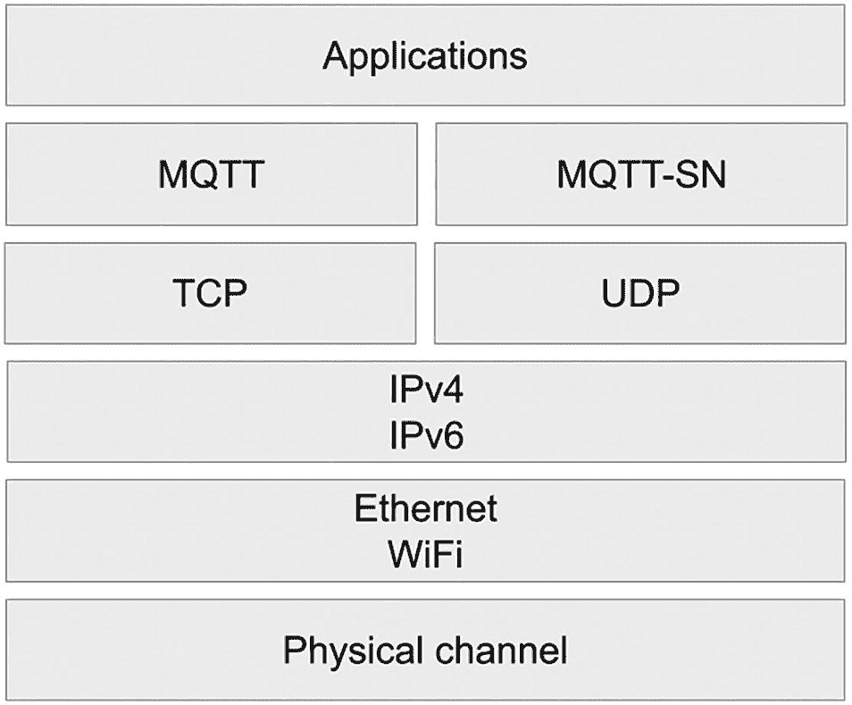

# 4. MQTT

> *当你不去观察事物时，无人知晓它们的确切状态。*

> *No one knows how things exactly are when you don’t look at them.*
> 
> —休伯特·里夫斯，《苍穹之耐心》

要理解 MQTT 的重要性，你需要先了解物联网与嵌入式计算之间的区别。微控制器和通用微处理器在大型机械或电子系统中已应用多年；20 世纪 60 年代用于征服月球的阿波罗导航计算机便是这一概念的早期范例。如今，嵌入式系统为各种设备提供动力，从个人小型设备到工业机器人和装配线等大型机器。它们也是复杂机器特定子系统的核心，例如你汽车上的防抱死制动系统。

工厂、水处理设施和电网中的嵌入式系统几乎总是网络的一部分。自 20 世纪 70 年代中期以来，随着*监控与数据采集*（SCADA）解决方案的出现，情况一直如此。那么，是什么让嵌入式系统与物联网解决方案有所不同呢？在第 1 章中，我写道物联网设备*“*包含嵌入式硬件和软件*”*。因此，物联网显然是嵌入式技术的一种特定应用。然而，嵌入式系统通常是为特定应用量身定制的，其软件在制造商发货后不会频繁更新。另一方面，物联网设备受益于永久网络连接，并经常通过软件更新获得新功能。归根结底，*互联网*连接，而不仅仅是网络连接，才是物联网区别于早期嵌入式计算努力的关键。

在接下来的两章中，我将介绍两项处于从传统嵌入式系统向物联网转型前沿的技术。第一个是 [MQTT](https://www.oasis-open.org/committees/tc_home.php%253Fwg_abbrev%253Dmqtt)，它诞生于 20 世纪末，现已成为物联网应用的主要协议。第二个是 [Sparkplug](https://sparkplug.eclipse.org)，它为 MQTT 用户开辟了新的可能性。两者在使工业流程更易于观察方面发挥了重要作用。换句话说，它们加速了工业从模拟技术向数字技术的转型。

## 什么是 MQTT？

MQTT 是一项 [OASIS Open](https://www.oasis-open.org/committees/download.php/49028/OASIS_MQTT_TC_minutes_25042013.pdf) 标准和 ISO 建议（ISO/IEC 20922）。在撰写本文时，最新版本是 2019 年 3 月发布的 [5.​0 版](https://docs.oasis-open.org/mqtt/mqtt/v5.0/mqtt-v5.0.html)。除非特别说明，本章均指规范版本 3.1.1。

注意

MQTT 最初代表 *“*MQ 遥测传输”。名称中的“MQ”指的是曾启发 MQTT 的 IBM 消息队列产品。OASIS Open 的 MQTT 技术委员会于 2013 年决定将 MQTT 作为该技术的名称，并且 [MQTT 不应代表任何含义](https://www.oasis-open.org/committees/download.php/49028/OASIS_MQTT_TC_minutes_25042013.pdf)。^(¹²)

MQTT 协议由 Andy Stanford-Clark 和 Arlen Nipper 于 1999 年发明。他们需要通过卫星连接监控石油管道，而现有协议无法胜任此任务，因为它们需要持续轮询传感器。因此，他们决定创建一种新协议，以最大限度地延长部署在现场的受限设备的电池寿命，同时消耗尽可能少的带宽。

MQTT 在集中式架构中利用发布/订阅交互模型。消息发布者和订阅者是*客户端*。这些客户端连接到一个或多个*代理*，接收发布的消息并将其路由到适当的客户端。因此，一个客户端可以是发布者、订阅者，或两者兼是。在 MQTT 中，发布者和订阅者完全解耦。这意味着多个客户端可以接收特定消息，并向同一目的地发布消息。通常，发布者不知道是否有任何订阅者会接收他们的消息。

## 消息

MQTT 消息（在规范中也称为*数据包*）具有简单的结构。

1.  **固定报头：** 存在于所有消息中，固定报头长度为 1 字节。前四位（位 7 到 4）表示*数据包类型*的无符号值。这些数据包类型包括 `PUBLISH`、`SUBSCRIBE` 和 `CONNECT` 等。其余位（位 3 到 0）包含特定于每种数据包类型的*标志*。截至 MQTT 5.0，规范作者保留了大多数标志供将来使用，但 `PUBLISH` 数据包类型除外。

2.  **可变报头：** 仅存在于某些消息中。可变报头可以包含一个*数据包标识符*和一组*属性*。这组属性包含一个长度指示符（可变字节整数）和任意数量的属性。每个属性由一个标识符（可变字节整数）和一个值组成。值的类型取决于所设置的特定属性，并且属性可以按任意顺序设置。

3.  **有效载荷：** 仅存在于某些消息中。某些消息，例如 ping（`PINGREQ`、`PINGRESP`）和各种类型的确认，没有有效载荷。

[MQTT 规范的第 2 节](https://docs.oasis-open.org/mqtt/mqtt/v5.0/os/mqtt-v5.0-os.html%2523_Toc3901019)详细描述了数据包类型标志和可变报头的值。

注意

可变字节整数是对 64 位无符号整数的编码，使用 1 到 9 个字节。其优点在于对于小数值占用空间更少。

MQTT 中的一个关键设计决策是使协议有效载荷与格式无关。具体来说，`PUBLISH` 数据包包含一个字节格式的有效载荷。发布者可以传输任何内容作为有效载荷；纯文本或二进制编码均可。因此，你可以使用 XML、JSON 或你选择的任何格式来表示数据。MQTT 5.0 版添加了名为 `Payload Format` 和 `Content Type` 的属性。`Payload Format` 是一个字节值。当设置为 0 时，表示“未指定的字节流”；当设置为 1 时，表示“UTF-8 编码的有效载荷*”*。如果缺少有效载荷指示符，代理将假定其设置为 0，以保证与先前协议版本的向后兼容性。至于 `Content Type`，它是一个 UTF-8（Unicode）编码的字符串。应用程序通常期望使用 MIME 内容类型，但你也可以使用任意值。


## 主题与主题过滤器

由于 MQTT 发布者和订阅者相互解耦，代理需要一种方式来确定哪些消息应提供给每个客户端。为此，代理将消息组织在*主题*的层级结构中。在 MQTT 中，主题就是一个 UTF-8 字符串，代理将用它来确定哪些订阅者会收到特定消息的副本。当客户端发布消息时，它必须指定一个主题。另一方面，订阅者通过*主题过滤器*来表达他们对哪些主题感兴趣。

MQTT 客户端在发布或订阅主题之前，无需创建主题。代理会接受任何有效的主题名称，无需事先准备或初始化。主题名称支持的最大长度是 UTF-8 字符串的最大大小：65,535 字节。不过，我强烈建议保持克制，让主题名称简短，因为较长的名称会影响性能和资源利用率。

要建立主题层级结构，你只需使用正斜杠（“`/`” `U+002F`）来分隔层级中的各个级别。以下是一些有效主题名称的示例：

```
Louvre/1/101/temperature
Sites/USA/California/SanFrancisco/SiliconValley/
e31a57ef-936b-46b8-ac89-3f39c8489f5f/status
vehicles/trucks/647/speed
```

主题过滤器可以包含通配符。规范定义了两种通配符。“`+`”是单级通配符，而“`#`”是多级通配符，只能用在过滤器的末尾。理解它们之间区别的最佳方式是通过一个示例。假设客户端将传感器读数发布到以下主题：

```
Louvre/1/101/temperature
Louvre/1/101/humidity
Louvre/1/102/temperature
Louvre/1/102/humidity
Louvre/2/201/temperature
Louvre/2/201/humidity
```

主题名称中的第一个数字代表楼层，第二个数字是房间号。假设一个订阅者使用了以下主题过滤器：

```
Louvre/1/+/temperature
```

那么，它将收到以下主题的数据：

```
Louvre/1/101/temperature
Louvre/1/102/temperature
```

它不会收到二楼房间或湿度传感器的消息。另一方面，如果过滤器如下所示：

```
Louvre/2/#
```

那么订阅者将收到发送到这些主题的消息：

```
Louvre/2/201/temperature
Louvre/2/201/humidity
```

在这种情况下，订阅者不会收到任何在 `Louvre/1/` 下发送的消息。

MQTT 规范定义了适用于主题名称和主题过滤器的规则：

*   它们必须至少包含一个字符。
*   它们区分大小写。
*   它们可以包含空格字符。
*   它们不得包含空字符（Unicode `U+0000`）。

此外，主题名称不得包含主题过滤器通配符（“`#`”和“`+`”）。

主题名称是完全任意的。以下是在为主题选择名称或进行订阅时应遵循的一些建议：

*   **避免使用不可打印字符：** UTF-8 包含许多不可打印字符，包括制表符、空格和换行符。请避免使用它们，因为你将无法区分它们。仅仅因为规范说明可以使用空格，并不意味着这是个好主意。

*   **不要订阅“#”：** 仅使用“`#`”作为主题过滤器意味着客户端订阅了发布到代理的所有消息。这可能会压垮客户端，或在生产环境中需要大量的计算资源。我强烈建议采用替代策略。例如，假设你需要将每条消息记录到历史数据库中。在这种情况下，你可以使用提供此类功能的代理`–`这并非 MQTT 本身的一部分`–`或者利用 Eclipse Hono 和 Apache Kafka 来部署一个合适的流事件处理解决方案。

*   **构建合理且可扩展的主题层级结构：** 主题层级结构的目标是为消息提供相关上下文。因此，你的主题应尽可能具体。订阅者不应通过解析消息负载来弄清消息的上下文。此外，你的主题层级结构应能适应未来的发展。如果你向机器添加传感器，或者只是希望报告新事件，你应该能够扩展现有的主题层级结构来容纳这些新消息。

*   **标识符在主题名称中很有用：** 在主题层级结构中使用设备的唯一标识符，可以更容易地通过访问控制列表实现授权。大多数代理实现了各种授权机制，尽管这些机制并未在 MQTT 规范中定义。

*   **小心使用主题分隔符（正斜杠）：** 在主题名称中，不要将正斜杠用作开头或结尾字符。MQTT 规范 v5.0 的第 4.7.3 节指出：“开头或结尾的‘/’会创建一个不同的主题名称或主题过滤器”，并且“仅由‘/’字符组成的主题名称或主题过滤器是有效的。”这意味着 `sensors/humidity`、`/sensors/humidity`、`sensors/humidity/` 和 `/sensors/humidity/` 都会被代理视为不同的主题。避免潜在的混淆，保持简单。此外，使用开头斜杠会在主题层级结构的第一级引入一个无用的零字符级别。亲爱的读者，这可不是 LwM2M！

注意

许多代理会在 `$SYS/` 前缀下暴露特定于服务器的信息或控制 API，尽管 MQTT 规范并未强制要求这样做。名称以 `$` 开头的主题将不会匹配以通配符（`#` 或 `+`）开头的订阅。


## 服务质量

与 CoAP 中的基本可靠性机制不同，MQTT 在单个发送方和单个接收方之间提供了[三种交付保障级别](https://docs.oasis-open.org/mqtt/mqtt/v5.0/os/mqtt-v5.0-os.html%2523_Toc3901234)。这三种交付保障级别如下：

*   **至多一次（QoS 0）：** 消息以尽力而为的方式交付。接收方可能会收到一次消息，也可能根本收不到。可能发生消息丢失；发送方不会重试发送消息。接收方不会发送响应。当数据丢失可以接受时，此级别是合适的，例如在非关键任务场景中报告传感器读数时。

*   **至少一次（QoS 1）：** 消息至少交付一次，但可能出现重复。当你需要保证交付但不介意收到同一消息的多个副本时，此级别效果很好。

*   **恰好一次（QoS 2）：** 消息将仅交付一次。但是，延迟无法保证；由于拥塞、网络问题或客户端或代理端的中断，消息可能会延迟几分钟甚至几小时。

发布者和订阅者彼此独立地指定其服务质量。当两者不匹配时，代理将降低整个交互的服务质量。如果客户端以 QoS 2 级别向某个主题发布消息，那么在订阅中指定了 QoS 1 级别的订阅者将至少收到一次该消息。换句话说，即使消息是以“恰好一次”的交付保障发布的，订阅者仍有可能收到重复的消息。

在 QoS 1 和 2 下，如果订阅客户端长时间离线，排队的消息将在代理上累积。在高吞吐量环境中，这意味着代理可用的内存和存储资源可能会不堪重负。MQTT 规范没有指定排队消息应保留多长时间——尽管 MQTT v5 引入了消息过期属性。但是，你可以配置大多数代理来对分配给排队消息的资源施加限制。例如，[Eclipse Mosquitto](https://mosquitto.org/man/mosquitto-conf-5.html) 可以限制排队消息的数量或分配给排队消息的字节数。超过这些阈值的消息将被静默丢弃。你还可以对 Mosquitto 的内存使用施加硬性限制，如果超过该限制，将导致消息被丢弃和客户端断开连接。

总的来说，更高的服务质量会增加延迟和资源消耗，从而限制基础设施的整体可扩展性。只有在需要其优势时才选择 QoS 1 或 2。

## 发布与订阅

当 MQTT 客户端希望发布消息、订阅主题或取消订阅时，它们会发送特定的数据包。

要发布消息，客户端需要发送一个 `PUBLISH` 数据包。此数据包最常见的属性如下：

*   **packetId：** 消息的唯一标识符。它在交付保障的上下文中使用，通常由 MQTT 客户端库或代理为你设置。

*   **topicName：** 消息发布到的主题的完整名称。

*   **qos：** 一个介于 0 和 2 之间的数字。它表示消息的服务质量级别。

*   **retainFlag：** 指示消息是否将被保存为特定主题的最后一个值的标志。我稍后将讨论保留消息。

*   **payload：** 消息的实际内容。MQTT 规范规定最大消息大小为 268,435,456 字节，相当于 256 mebibytes (MiB) 或 268 megabytes (MB)。然而，如此大的消息大小并不实用，如果你希望解决方案具有可扩展性，则应坚持使用更精简的有效载荷。

*   **dupFlag：** 指示消息是否为重复消息的标志。这仅与特定的交付保障相关。MQTT 客户端库或代理将处理它。

在 QoS 1 级别下，发送方将存储消息，直到收到确认交付的 `PUBACK` 数据包。`PUBLISH` 和 `PUBACK` 数据包之间的关联依赖于 `packetId` 属性。但是，仅当当前 TCP 连接断开并建立新连接时，才会重新发送 `PUBLISH` 数据包。客户端可以立即处理它们在 QoS 1 级别下接收到的消息。

QoS 2 级别的流程更为复杂。同样，原始 `PUBLISH` 数据包的 `packetId` 属性用于关联。在任何特定交互的范围内，数据包标识符在特定客户端和代理之间是唯一的。一旦交互结束，它们可以被重用。`packetId` 属性的最大值为 65535，并且不允许使用 0。

在 QoS 2 下发布消息涉及以下四个步骤：

1.  发送方传输一个 `qos` 属性设置为 2 的 `PUBLISH` 数据包。它将存储该数据包，直到步骤 2 完成。

2.  接收方获取 `PUBLISH` 数据包并处理它。它存储 `packetId` 并回复一个 `PUBREC` 数据包以确认接收。`PUBLISH` 数据包将以 `dupFlag` 设置为 `true` 的方式重新发送，但仅当当前 TCP 连接断开并建立新连接时才会如此。

3.  发送方在收到 `PUBREC` 后丢弃其 `PUBLISH` 数据包的副本。发送方存储 `PUBREC`。发送方传输一个 `PUBREL` 数据包以授权处理（释放）`packetId`。如果在连接关闭前未收到 `PUBCOMP`，则在会话启动时也会重新发送 `PUBREL`。

4.  收到 `PUBREL` 后，接收方丢弃 `packetId` 并回复一个 `PUBCOMP`（完成）数据包。在接收方收到 `PUBREL` 之前收到的任何重复的 `PUBLISH` 数据包都不会被处理。当发送方收到 `PUBCOMP` 时，它会丢弃与该交互相关的所有状态信息。此时，`packetId` 可以用于新的交互。

要订阅，客户端需要发送一个 `SUBSCRIBE` 数据包。此类数据包使你可以指定要订阅的主题过滤器列表，并为每个主题过滤器指定一个不同的服务质量级别。`SUBSCRIBE` 数据包也包含一个 `packetId` 属性，就像 `PUBLISH` 数据包一样。

当代理收到 `SUBSCRIBE` 数据包时，它将处理每个请求的订阅。完成后，它将向客户端发送一个 `SUBACK` 确认数据包。此消息将包含与 `SUBSCRIBE` 数据包中相同的 `packetId` 以用于关联目的。它还将包含一个返回码列表，对应于每个请求的订阅——顺序相同。表 4-1 列出了这些代码及其含义。

表 4-1

MQTT 订阅返回码

| 返回码 | 含义 |
| --- | --- |
| 0 | 订阅成功；最大 QoS 级别为 0 |
| 1 | 订阅成功；最大 QoS 级别为 1 |
| 2 | 订阅成功；最大 QoS 级别为 2 |
| 128 | 订阅失败 |

订阅失败通常源于主题名称格式错误或缺乏适当的访问权限。

客户端可以随时通过向代理发送 `UNSUBSCRIBE` 数据包来取消订阅任何主题。`UNSUBSCRIBE` 数据包包含一个 `packetId` 和一个要取消订阅的主题列表。代理将发回一个具有相同 `packetId` 的 `UNSUBACK` 数据包以确认取消订阅请求。


## 连接与会话

在发送或接收消息之前，MQTT 客户端需要与代理建立连接。MQTT 连接会保持开启状态，直到客户端发送断开连接消息，除非网络问题导致连接中断。由于连接保持开启，即使客户端位于 NAT 基础设施之后，它们也能连接到代理。

默认情况下，代理不会持久化会话信息。这意味着订阅者每次连接时都需要重新建立订阅。对于资源受限的设备来说，这会造成资源浪费。幸运的是，MQTT 规范定义了*持久会话*的概念。当客户端使用持久会话连接时，代理会跟踪该客户端的所有订阅。此外，当涉及特定的服务质量等级时，代理还会存储相关消息：

*   客户端离线期间发布的 QoS 1 或 QoS 2 消息
*   已发布但尚未被客户端确认的 QoS 1 或 QoS 2 消息
*   已发布但尚未被客户端完全确认的 QoS 2 消息

持久会话很有用，但会消耗托管代理的机器上的资源。只有在需要时才应使用它们。以下是使用持久会话的合理理由列表：

*   您的解决方案涉及资源受限的客户端，这些客户端可以通过依赖持久会话延长电池寿命或减少带宽消耗。
*   您的用例要求订阅客户端不丢失任何一条消息。
*   您的用例涉及“至少一次”（QoS 1）或“恰好一次”（QoS 2）的消息传递。

相反，对于仅发布消息（无订阅）且用例允许消息丢失的客户端，应避免使用持久会话。

一旦会话建立，客户端和代理将在后台协同工作，通过*保活*流程确保会话保持活跃。客户端应在定义的保活间隔内向代理发送 `PINGREQ` 数据包；代理必须回复一个 `PINGRESP` 数据包。这两种数据包都不包含有效载荷。已知某些卫星和蜂窝链路会以网络堆栈未必能察觉的方式中断 TCP/IP 套接字连接。MQTT 的保活功能在此类环境中非常有用。但是，如果需要，也可以停用它。如果选择利用此功能，应根据设备和网络限制调整保活间隔的值。较高的值有助于克服信号强度波动或其他导致数据包丢失的原因。

MQTT 定义了遗嘱消息（LWT）功能，使您能够通知订阅者某个发布者客户端已意外断开连接。这是通过一条消息实现的。为此，客户端需要在连接时提供消息的有效载荷和主题。代理将存储该消息，并在发生意外断开连接时将其发布到指定的主题。如果客户端通过发送 `DISCONNECT` 数据包正常断开连接，代理将丢弃该消息。以下是会触发发送客户端 LWT 的情况列表：

*   代理检测到 I/O 错误或网络故障。
*   客户端未能在定义的保活间隔内发送消息。
*   客户端在关闭网络连接前未发送 `DISCONNECT` 数据包。
*   代理从客户端收到无效数据包并强制关闭连接。

MQTT 客户端会向由其 IP 地址或 DNS 主机名标识的特定代理发送类型为 `CONNECT` 的数据包以建立连接。`CONNECT` 数据包通常在可变头部中设置以下属性：

*   **clientId：** 客户端标识符，代理可用其将特定客户端与其状态匹配。它应该是唯一的。在 MQTT v5.0 中，可以将其留空，此时代理会为客户端分配一个标识符，并在 CONNACK 数据包中返回。在 MQTT v3.1.1 中，如果连接不是持久的，则可以将其留空。
*   **cleanSession：** 指示代理是否应为提供的 `clientId` 恢复会话信息的属性。如果设置为 `true`，则会话是非持久的，并且任何先前持久会话的信息都将被清除。如果设置为 `false`，则会话是持久的；将恢复先前的订阅，并传递、确认或确认已排队的消息。
*   **username/password：** 用于身份验证的可选属性。MQTT 将以明文形式传输这些值；因此，您至少应使用 TLS 来确保其安全。MQTT 5.0 版本引入了[增强的身份验证工作流](https://docs.oasis-open.org/mqtt/mqtt/v5.0/os/mqtt-v5.0-os.html%2523_Enhanced_authentication)，支持实现质询/响应身份验证。
*   **lastWillTopic/lastWillMessage/lastWillQos：** 用于设置发布者客户端的遗嘱消息的主题、有效载荷和 QoS 级别的属性。

## 保留消息

MQTT 代理只能在订阅者连接时向其分发消息。默认情况下，如果客户端订阅了一个主题，它只会收到接下来要发布的消息。对于某些用例，这是不希望的。保留消息允许新订阅者获取发布到某个主题的最后一条消息的副本。

要为某个主题创建保留消息，发布者需要发送一个 `retainFlag` 属性设置为 `true` 的 `PUBLISH` 数据包。代理将存储该消息以及该主题对应的 QoS。在保留消息发送后订阅该主题的客户端，一旦订阅就会收到该消息的副本。这消除了关于该主题最后已知良好值的不确定性。您必须记住，如果发布者在发送保留消息后发送了 `retainFlag` 设置为 `false` 的 `PUBLISH` 数据包，则该主题的保留消息不会改变。结果是，新订阅的客户端将获得保留消息的副本，但不会获得在建立订阅之前发送的其他消息。

顺便提一下，保留消息与持久会话无关。无论选择何种会话类型，它们都会传递给订阅者。可以通过发送一个有效载荷长度为零且 `retainFlag` 属性设置为 `true` 的消息来清除保留消息。

## 协议栈

在 20 世纪 90 年代末，像 CAN 和 Modbus 这样的特定领域专有现场总线被基于 TCP/IP 的替代方案（如 Modbus TCP、Profinet 和 OPC UA）所取代。与这些协议类似，MQTT 支持 TCP/IP。然而，规范并未强制要求使用它，而是指出客户端或服务器必须支持*“提供从客户端到服务器以及从服务器到客户端的有序、无损字节流的传输协议。”*^(¹³) 图 4-1 展示了 MQTT 的协议栈。



MQTT 协议栈示意图，包括应用层、MQTT、MQTT-SN、TCP、UDP、IPv4、IPv6、以太网、Wi-Fi 和物理信道。

图 4-1

MQTT 和 MQTT-SN 协议栈

MQTT 规范在一条非规范性注释中提到，TLS 和 WebSocket 也是合适的传输层协议。这是意料之中的，因为这两种协议都利用了 TCP/IP。几乎所有代理都支持 TLS，并且有多个代理实现了对 WebSocket 的支持。Eclipse 基金会托管的两个代理就是如此：[Eclipse Mosquitto](https://mosquitto.org) 和 [Eclipse Amlen](https://www.eclipse.org/amlen)。

由于 TCP/IP 提供有序和无损的传递能力，对于通过无线网络运行的电池供电的受限设备而言，它不如 UDP 合适。这正是 MQTT-SN 发挥作用的地方。


## MQTT-SN

MQTT-SN 可视为 MQTT 针对无线网络进行优化、面向电池供电设备的版本。在撰写本文时，MQTT-SN 正在 OASIS Open 进行[标准化工作](https://www.oasis-open.org/committees/tc_home.php%253Fwg_abbrev%253Dmqtt-sn)。此项工作的起点是 IBM 于 2013 年发布的 [MQTT-SN 1.2 版](https://www.oasis-open.org/committees/download.php/66091/MQTT-SN_spec_v1.2.pdf)。

MQTT-SN 支持 UDP。它最初设计用于在 Zigbee 网络上运行。此类网络依赖 IEEE 802.15.4 作为物理层和 MAC 层协议。其基本设计目标是在降低功耗和带宽消耗的前提下，减小消息大小。

在架构层面，MQTT-SN 定义了三种组件类型：*客户端*、*网关*和*转发器*。MQTT-SN 客户端通过 MQTT-SN 网关连接到 MQTT 代理，该网关可以集成到 MQTT 代理中，也可以作为独立组件运行。如果网关是独立的，它会使用 MQTT 与代理通信。网关有两种类型：*透明网关*和*聚合网关*。透明网关为每个连接的客户端创建一个到代理的 MQTT 连接。聚合网关使用单个 MQTT 连接到代理，这有助于在涉及大量 MQTT-SN 设备时提升代理的扩展性。至于转发器，它们封装从无线网络上的客户端接收到的 MQTT-SN 帧，并将其传输到网关。当客户端和网关无法处于同一网络时，转发器对于桥接网络间的流量非常有用。

以下是 MQTT 与 MQTT-SN 的主要区别列表：

*   **CONNECT 报文：** CONNECT 报文被拆分为三个。新增的两个报文分别用于 LWT 主题和消息传输。

*   **主题 ID：** 在大多数消息中，一个 2 字节的主题 ID 取代了主题名称。存在一个注册过程，允许客户端注册其主题名称，获取一个 ID 作为回报，并查询某个主题的 ID。

*   **预定义主题 ID 和短主题名称：** 客户端、网关和代理可以就主题 ID 与实际 MQTT 主题之间的映射达成一致。因此，它们可以使用这些具有预定义含义的主题 ID，而无需注册。至于短主题名称，它们只是固定长度为两个八位字节（16 位）的主题名称。它们可以用来代替主题 ID。

*   **发现过程：** 客户端可以发现网关或代理的网络地址。网关会定期广播 `ADVERTISE` 报文以宣告其存在，客户端可以发送 `SEARCHGW` 报文来获取网关的 ID。

*   **持久遗嘱：** 当使用持久会话时，在遗嘱特性上下文中定义的主题和消息会被存储。

*   **离线保活：** 现在支持休眠客户端。发往这些客户端的消息会在网关或代理上缓冲，并在客户端重新上线时投递。

*   **QoS 等级 -1：** 这是一个面向最小化实现的功能。没有连接、没有注册、也没有订阅。客户端只需将其消息发布到已知地址的网关，但不会检查地址是否准确，甚至不检查网关是否存活。也可以使用多播地址。

从开发者的角度来看，MQTT-SN 感觉就像普通的 MQTT。然而，该协议的采用率远低于 MQTT 本身。因此，其软件生态系统要有限得多。Eclipse Mosquitto 团队维护着 [Really Small Message Broker](https://github.com/eclipse/mosquitto.rsmb) (RSMB)，这是一个支持 MQTT 和 MQTT-SN 的轻量级代理。Eclipse Paho 项目提供了一个[可用于 Eclipse Mosquitto 的 MQTT-SN 透明网关](https://www.eclipse.org/paho/index.php%253Fpage%253Dcomponents/mqtt-sn-transparent-gateway/index.php)。尽管如此，如果你正在部署电池供电的受限设备，绝对应该了解一下 MQTT-SN。

注意

历史上，RSMB 是 Mosquitto 的灵感来源。这两个代码库分别由 IBM 和 Roger Light 贡献给 Eclipse 基金会。

## MQTT v5 的新特性

我之前提到过，当前版本的 MQTT，即 5.0 版，是在 2019 年引入的。尽管版本号跳跃很大，但新版本更像是 MQTT 3.1.1 的演进。在本节中，我将概述 MQTT v5.0 中引入的大部分新特性。规范的[附录 C](https://docs.oasis-open.org/mqtt/mqtt/v5.0/os/mqtt-v5.0-os.html%2523_Toc3901293) 提供了一个全面的列表。在 OASIS Open 将其正式纳入规范之前，一些代理已经实现了其中的部分特性。

我强烈建议你尽可能使用 MQTT v5.0。仅在你需要集成绝对无法升级以支持 v5 的遗留软件或设备时，才使用之前的版本。

注意

你可能注意到没有 MQTT 版本 4。这是为什么呢？MQTT `CONNECT` 报文的可变头部包含一个[1 字节无符号值](http://docs.oasis-open.org/mqtt/mqtt/v5.0/csprd02/mqtt-v5.0-csprd02.html%2523_Toc498345322)来表示协议版本。MQTT v3.1 被分配了值“3”，而 v3.1.1 被分配了值“4”。MQTT v5 使用与其名称匹配的值。这看起来可能是一个无聊的琐事，但比解释为什么从来没有 Windows 9 要有趣得多。MQTT 标准化委员会决定，对于未来的版本，网络上的字节将始终与协议版本匹配。

### 用户自定义属性

客户端和代理现在可以向报文添加任意数量的自定义头部。这些自定义头部通过一种新的键值数据类型定义，其中键和值都表示为 UTF-8 字符串。

MQTT 规范没有为用户自定义属性分配特定含义。由客户端和代理自行决定如何处理它们。

### 原因码

在 MQTT 的早期版本中，错误处理不够精细。例如，客户端会知道其订阅请求失败，但不会被告知确切原因。MQTT v5.0 改变了这一点。在 v5.0 中，许多 MQTT 报文现在包含一个预定义的代码，允许客户端或代理获取关于错误情况的上下文信息。以下报文可以携带原因码：

*   `CONNACK`

*   `PUBACK/PUBREC`

*   `PUBREL/PUBCOMP`

*   `SUBACK/UNSUBACK`

*   `AUTH`

*   `DISCONNECT`

规范中定义了超过 20 个原因码，典型的例子包括“超出配额”和“协议错误”。

### 可选功能的可用性

MQTT 规范中定义的某些功能是可选的。一些代理和*软件即服务* (SaaS) IoT 产品并未实现其中一些可选功能，包括 QoS 2、保留消息和持久会话。因此，MQTT v5.0 定义了一种方式，让部分实现可以向客户端发出信号，表明它们不支持特定功能。涉及的功能包括：最大 QoS、保留可用、通配符订阅可用、订阅标识符可用和共享订阅可用。

### 消息过期

此功能允许发布者设置消息过期的时间间隔。代理需要删除尚未开始投递的过期消息。

### 请求/响应

此功能是对 [MQTT 中请求/响应模式](https://docs.oasis-open.org/mqtt/mqtt/v5.0/os/mqtt-v5.0-os.html%2523_Toc3901252)的形式化。^(¹⁴) MQTT v5.0 定义了客户端和代理可以用来实现请求/响应交互的属性：`响应主题`、`关联数据`、`请求响应信息`和`响应信息`。规范在几个非规范性章节中描述了如何使用这些属性。


### 清理会话

*清理会话*标志已被拆分为两个：一个`Clean Start`标志，用于指示会话是否应重用现有会话；以及一个`Session Expiry Interval`，用于指示断开连接后会话保留多长时间。会话到期间隔可以在发送`DISCONNECT`报文时更改。在 MQTT v3.1.1 中，将`Clean Start`设置为 1 并将`Session Expiry Interval`设置为 0，等同于将`Clean Session`设置为 1。

此变更的实际效果是，在 MQTT v5.0 中，会话默认是非持久的，因为如果在`CONNECT`报文中未指定`Session Expiry Interval`，则其将被设置为零，从而导致非持久会话。如果客户端希望获得持久会话，则需要显式地将`Session Expiry Interval`设置为非零值。

### 服务器断开连接

代理现在可以通过向客户端发送`DISCONNECT`报文来通知它们即将断开连接。此类报文通常包含断开连接的原因代码，使故障排除更加容易。

### AUTH 报文

新的`AUTH`报文支持当前的质询/响应安全流程，例如 Kerberos 或 SCRAM。您也可以在面向令牌的流程（如 OAuth）中利用它。

`AUTH`报文可用于对当前已连接的客户端进行重新认证。以前，客户端必须关闭连接才能获得相同的结果。

### 无用户名的密码

`AUTH`报文非常灵活，但即使没有它们，仍然可以实现面向令牌的安全流程。为了使其更简单一些，现在可以在`CONNECT`报文中指定密码而无需提供用户名。

### 共享订阅

客户端现在可以共享相同的订阅。实际上，共享订阅代表了一种为 MQTT 订阅者客户端实现负载均衡的方式。

为了实现这一点，MQTT v5.0 引入了*订阅组*的概念。订阅组就是一组共享一个或多个订阅的客户端。

要使用共享订阅，客户端需要按以下方式指定主题：

```
$share/GROUPID/TOPIC
```

结构中的三个元素如下：

*   `$share`，预定义的共享订阅标识符
*   组标识符，是任意的且不能包含通配符
*   实际主题，可以包含通配符

让我再次以卢浮宫为例进行具体说明。如果您还记得，我曾为博物馆每个房间的传感器创建了一个虚构的部署，其主题层次结构如下：

```
/Louvre/floor/room/sensor
```

鉴于此，针对二楼所有内容的通配符订阅将是：

```
Louvre/2/#
```

假设博物馆的大部分房间都在这一层，并且由于发布的消息数量众多，您希望有多个客户端订阅该主题。如果订阅组的名称为`LouvreSecondFloor`，那么共享订阅的主题将是：

```
$share/LouvreSecondFloor/Louvre/2/#
```

规范并未强制要求代理以特定方式选择订阅组中的哪个客户端将获得某条消息。轮询方法是典型的，但其他方法也是可能的。

### 流量控制

代理及其客户端可以指定它们允许的进行中的可靠消息（QoS > 0）数量。这是一种速率限制机制。发送方将暂停消息传输，以保持在允许的阈值以下。

### 遗嘱延迟

MQTT v5.0 引入了在意外断开连接的情况下，在发送遗嘱消息之前指定延迟的能力。如果在延迟到期前重新建立连接，则不会发送遗嘱消息。这在网络短暂中断频繁的环境中，减轻了 MQTT 基础设施的负载。

### 代理引用

代理可以在发送`CONNACK`和`DISCONNECT`报文时指定一个备用代理。例如，这可以用于配置目的或在代理组之间执行负载均衡。您可以将代理引用视为一种重定向形式。

## 安全性

核心 MQTT 协议包含的安全特性很少。这并非因为规范作者不关心安全性，而是为了让从事代理和客户端库开发的开发者有机会实现对他们有意义的的安全特性。这也有利于保持 MQTT 规范的简洁性，因为安全主题通常很复杂。MQTT v5.0 的规范文档包含一个专门讨论安全性的[非规范性章节](https://docs.oasis-open.org/mqtt/mqtt/v5.0/os/mqtt-v5.0-os.html%2523_Toc3901293)。

默认情况下，MQTT 不加密通信。这意味着在大多数情况下，您应该通过 TLS 使用 MQTT。诚然，TLS 因其所需的握手以及线路上加密数据包尺寸较大而带来开销。然而，长寿命的 TCP 连接通过减少握手频率来减轻其开销。此外，*TLS 会话恢复*允许重用先前协商的 TLS 会话，进一步减少了客户端重新连接时所需的时间和资源。即便如此，资源非常受限的设备可能难以应对 TLS 带来的 CPU 和带宽消耗。在这些极端情况下，您至少应该加密`PUBLISH`消息的有效载荷和`CONNECT`消息中传输的密码。利用`AUTH`消息和质询/响应认证也是一个选项。

如果您决定使用 TLS，请确保始终运行您的代理和客户端支持的最新版本，并验证证书链。由内部或开发 CA 签名的证书适用于开发和实验，但绝不应在生产环境中部署。生产环境中使用的证书应由受信任的证书颁发机构签名。此外，您应密切关注您用于 TLS 的密码套件中发现的任何漏洞。通常，迁移到更安全的套件是非常值得的。

大多数代理和客户端与通常用于处理身份验证和授权的 IT 基础设施（如 LDAP 和 OAuth 授权服务器）集成。MQTT v5.0 新增的`AUTH`报文简化了这些类型的集成。您应始终研究您选择的代理和客户端库的文档，以了解它们支持哪些身份验证技术以及具备哪些授权功能。此外，您应注意代理提供的限流功能，这有助于减轻恶意客户端发起的、旨在使代理过载的攻击的影响。如果可能，限制消息大小也是一个好主意。


## Broker: Eclipse Mosquitto

理论部分已经足够；现在该通过实践来运用我们对 MQTT 的知识了。我们将使用 [Eclipse Mosquitto](https://mosquitto.org/man/mosquitto-conf-5.html) 进行实验，这是一个轻量级的 Broker，体积小巧，足以在单板计算机上运行。Mosquitto 使用 C 语言编写，因此具有高度的可移植性。Mosquitto 在 Eclipse 分发许可证 v1.0 和 Eclipse 公共许可证 v2.0 下提供。

Mosquitto 的官方网络资源如下：

*   **网站：** [`https://mosquitto.org`](https://mosquitto.org)

*   **Eclipse 项目页面：** [`https://projects.eclipse.org/projects/iot.mosquitto`](https://projects.eclipse.org/projects/iot.mosquitto)

*   **代码仓库：** [`https://github.com/eclipse/mosquitto`](https://github.com/eclipse/mosquitto)

在撰写本文时，Mosquitto 的最新版本是 2.0.14，于 2021 年 11 月 17 日发布。

注意

Eclipse IoT 家族中还有另一个 MQTT Broker：[Eclipse Amlen](https://www.eclipse.org/amlen/)。IBM 贡献了其 IBM Watson IoT Platform Message Gateway 的源代码来启动该项目。Amlen 除了支持 JMS 和自定义协议外，还支持 MQTT v3.1.1 和 v5.0。它的体积比 Mosquitto 大，但可以配置为集群和高可用性。

### 安装

Mosquitto 可用于 Microsoft Windows、macOS 以及大多数 Linux 发行版。当然，也可以从源代码编译。

如果你运行 Windows，可以从 Mosquitto 网站[下载安装程序](https://mosquitto.org/download/)。提供 32 位和 64 位版本，它们可以在 Windows Vista 及更高版本上运行。

如果你使用的是 macOS，可以通过 [Homebrew](https://brew.sh/) 安装 Mosquitto。如果已经安装了 Homebrew，你只需打开一个终端窗口并执行以下命令：

```
brew install mosquitto
```

在 Linux 上安装 Mosquitto 有多种方法；其中一些方法可能在你选择的发行版上不可用。如果你运行的是 Debian 或其衍生版，如 Ubuntu、Raspbian 或 Raspberry Pi OS，Mosquitto 是官方仓库的一部分。你可以使用以下命令安装它：

```
sudo apt install mosquitto
```

如果你想更快地获取最新版本，Mosquitto 团队维护了一个 [Debian 仓库](https://mosquitto.org/2013/01/mosquitto-debian-repository)，你可以将其添加到你的源列表中。

Mosquitto 也可以在 Fedora 仓库中找到。如果你使用的是 Workstation 或 Server 版本，以下命令可以完成安装：

```
sudo dnf install mosquitto
```

另一方面，Fedora IoT 不依赖 `dnf`。软件包通过 `rpm-ostree` 管理：

```
sudo rpm-ostree install mosquitto
```

如果你的发行版支持 snap 打包格式，你也可以通过这种方式安装：

```
snap install mosquitto
```

### 配置

Mosquitto 开箱即用。如果没有提供配置文件，Broker 将以仅本地模式启动。这意味着部署在非你本机上的客户端将无法访问它。此行为背后的意图是强制你在生产环境中使用 Mosquitto 之前构建一个合适的配置。

安装后启动 Broker，打开命令提示符，并执行以下命令：

```
mosquitto
```

如果一切设置正确，你应该会看到类似如下的输出：

```
1640704397: mosquitto version 2.0.14 starting
1640704397: Using default config.
1640704397: Starting in local only mode. Connections will only be possible from clients running on this machine.
1640704397: Create a configuration file which defines a listener to allow remote access.
1640704397: For more details see https://mosquitto.org/documentation/authentication-methods/
1640704397: Opening ipv4 listen socket on port 1883.
1640704397: Opening ipv6 listen socket on port 1883.
1640704397: mosquitto version 2.0.14 running
```

到目前为止，一切顺利。现在我将通过订阅 Mosquitto 暴露的系统指标主题来执行一次健全性检查。为此，我将使用 Mosquitto 团队开发的 [mosquitto_​sub](https://mosquitto.org/man/mosquitto_sub-1.html) 简单客户端。该团队还构建了 [mosquitto_​pub](https://mosquitto.org/man/mosquitto_pub-1.html)，你可以用它向 MQTT v3 和 v5 Broker 发布消息。这两个工具都支持 TLS 通信，并利用了大多数 MQTT 特性，如 QoS 和保留消息。在 Debian 及其衍生版上，`mosquitto_pub` 和 `mosquitto_sub` 不属于核心 mosquitto 软件包，而是位于 `mosquitto_clients` 软件包中。

在你安装了 mosquitto 的机器上打开第二个命令提示符，并执行以下命令：

```
mosquitto_sub -h localhost -p 1883 -t \$SYS/# -C 20 -v
```

`-C` 开关限制了命令退出前接收的消息数量，`-v` 则在消息负载之前打印主题。输出应该如下所示：

```
$SYS/broker/version mosquitto version 2.0.14
$SYS/broker/uptime 22 seconds
$SYS/broker/clients/total 0
$SYS/broker/clients/inactive 0
$SYS/broker/clients/disconnected 0
...
```

如果你回到启动 Mosquitto 的命令提示符，你会发现日志中反映了你刚刚建立的连接的行：

```
1640704494: New connection from 127.0.0.1:39616 on port 1883.
1640704494: New client connected from 127.0.0.1:39616 as auto-56DAB577-D439-8D76-09BA-C3094A714D74 (p2, c1, k60).
```

该工具会自动生成客户端 ID。我本可以使用 `-i` 开关指定一个。

到目前为止，我只是使用了 Mosquitto 的默认配置。为了使 Broker 在我的本地网络上可访问，我需要创建一个配置文件并将其传递给 Mosquitto 进程。配置文件的格式在 Mosquitto 网站上有[详细文档](https://mosquitto.org/man/mosquitto-conf-5.html)。需要记住的一点是，以“`#`”开头的行被视为注释。

以下是一个基本配置，它将使端口 1883 和 8883 在所有网络接口上可访问。你可能在想 `cafile`、`keyfile` 和 `certfile` 引用的文件来自哪里。我将在下一节中解释如何创建这些文件。

```
# Standard MQTT traffic on port 1883, all interfaces
listener 1883
protocol mqtt
# MQTT over TLS traffic on port 8883, all interfaces
listener 8883
protocol mqtt
require_certificate true
cafile /etc/mosquitto/ca_certificates/mosquitto_ca.crt
keyfile /etc/mosquitto/certs/mosquitto_server_nopass.key
certfile /etc/mosquitto/certs/mosquitto_server.crt
```

要使用此配置文件，请将内容复制到一个文件中（我选择了 `/etc/mosquitto/mosquitto.conf`），然后按如下方式启动 Mosquitto：

```
mosquitto -c ./mosquitto.conf
```

如果你希望允许对 Broker 进行匿名访问，可以在配置文件顶部添加以下行：

```
allow_anonymous true
```


### 设置 TLS

要使用 TLS，你需要一个 CA 证书，以及用于代理的密钥和证书。自签名证书（未经证书颁发机构验证）将无法使用。此外，你应确保密钥未加密或未受密码保护。不同的代理可能对证书有不同的要求。请务必仔细阅读文档，以生成适合你所用代理的证书和密钥。

该过程的第一步是为证书颁发机构生成证书和密钥。这是你需要运行的命令：

```
openssl req -new -x509 -days 365 -extensions v3_ca -keyout mosquitto_ca.key -out mosquitto_ca.crt
```

在生成产物之前，你需要回答几个问题。示例如下：

```
Generating a RSA private key
...+++++
...............................................................+++++
writing new private key to 'mosquitto_ca.key'
Enter PEM pass phrase:
Verifying - Enter PEM pass phrase:

You are about to be asked to enter information that will be incorporated
into your certificate request.
What you are about to enter is what is called a Distinguished Name or a DN.
There are quite a few fields but you can leave some blank
For some fields there will be a default value,
If you enter '.', the field will be left blank.

Country Name (2 letter code) [AU]:CA
State or Province Name (full name) [Some-State]:Ontario
Locality Name (eg, city) []:Ottawa
Organization Name (eg, company) [Internet Widgits Pty Ltd]:Phantom Thieves
Organizational Unit Name (eg, section) []:P5 Royal
Common Name (e.g. server FQDN or YOUR name) []:blueberrycoder.com
Email Address []:
```

第二步是为我们的代理生成一个密钥。这是命令：

```
openssl genrsa -out mosquitto_server.key 2048
```

你将得到如下输出：

```
Generating RSA private key, 2048 bit long modulus (2 primes)
....+++++
...........+++++
e is 65537 (0x010001)
```

第三步是使用代理密钥创建一个证书签名请求。执行此命令：

```
openssl req -out mosquitto_server.csr -key mosquitto_server.key -new
```

同样，你需要回答关于国家、州、地区以及通用名称（CN）的问题。请确保指定代理的主机名或域名。在本例中，我选择了 `fedora`，这是我一个可靠的树莓派的主机名。

现在，我可以使用证书颁发机构的密钥和证书来创建并签署代理的证书。

```
openssl x509 -req -in mosquitto_server.csr -CA mosquitto_ca.crt -CAkey mosquitto_ca.key -CAcreateserial -out mosquitto_server.crt -days 365
```

输出应如下所示：

```
Signature ok
subject=C = CA, ST = Ontario, L = Ottawa, O = Phantom Thieves, OU = P5 Royal, CN = fedora
Getting CA Private Key
Enter pass phrase for mosquitto_ca.key:
```

呼！至此，我们拥有了代理所需的一切。你可以在开发机器上创建这些文件，然后使用 `scp` 将它们传输到托管代理的机器上。

每个客户端也需要一个证书。创建这些证书的过程与用于代理的过程类似。我提供的说明将创建适用于 `mosquitto_sub` 和 `mosquitto_pub` 的证书。

首先，让我们创建一个客户端密钥：

```
openssl genrsa -out mqtt_client.key 2048
```

你应该会看到类似这样的内容：

```
Generating RSA private key, 2048 bit long modulus (2 primes)
..........................................................+++++
........................................+++++
e is 65537 (0x010001)
```

现在，让我们创建一个签名请求。

```
openssl req -out mqtt_client.csr -key mqtt_client.key -new
```

同样，你需要回答一连串的问题。在本例中，我为我心爱的 Ashitaka 工作站创建了一个证书。情况应如下所示：

```
You are about to be asked to enter information that will be incorporated
into your certificate request.
What you are about to enter is what is called a Distinguished Name or a DN.
There are quite a few fields but you can leave some blank
For some fields there will be a default value,
If you enter '.', the field will be left blank.

Country Name (2 letter code) [AU]:CA
State or Province Name (full name) [Some-State]:Ontario
Locality Name (eg, city) []:Ottawa
Organization Name (eg, company) [Internet Widgits Pty Ltd]:Phantom Thieves
Organizational Unit Name (eg, section) []:P5 Royal
Common Name (e.g. server FQDN or YOUR name) []:Ashitaka
Email Address []:
Please enter the following 'extra' attributes
to be sent with your certificate request
A challenge password []:
An optional company name []:
```

我使用 CA 的密钥和证书来签署这个签名请求。

```
openssl x509 -req -in mqtt_client.csr -CA mosquitto_ca.crt -CAkey mosquitto_ca.key -CAcreateserial
-out mqtt_client.crt -days 365
```

输出应类似于：

```
Signature ok
subject=C = CA, ST = Ontario, L = Ottawa, O = Phantom Thieves, OU = P5 Royal, CN = Ashitaka
Getting CA Private Key
Enter pass phrase for mosquitto_ca.key:
```

此时，你可以使用客户端证书在代理上发布或订阅。务必使用代理的主机名，而不是其 IP 地址；你可能需要调整内部 DNS 服务器或在 `/etc/hosts` 中添加条目等。

例如，你可以像这样订阅：

```
mosquitto_sub -h fedora -p 8883 -t wisdom/# -v --cafile mosquitto_ca.crt -–cert mqtt_client.crt -i Ashitaka
```

要发布一些智慧，你可以使用此命令：

```
mosquitto_pub -h fedora -p 8883 -t wisdom/Rome -m 'Carpe Diem' --cafile mosquitto_ca.crt -–cert mqtt_client.crt
```

### 沙箱服务器

在 `test.mosquitto.org` 上有一个公开可用的 Mosquitto 实例，端口为 1883 和 8883。它支持纯 MQTT、基于 TLS 的 MQTT、基于 TLS（带客户端证书）的 MQTT、基于 WebSocket 的 MQTT 以及基于 TLS 的 WebSocket MQTT。

Eclipse Paho 团队也维护着一个 Mosquitto 沙箱。可以在 `mqtt.eclipseprojects.io` 上找到它，端口为 1883 和 8883。它支持纯 MQTT 和基于 TLS（带客户端证书）的 MQTT。

这两个服务器始终运行最新版本。请负责任地使用它们，并且不要在生产应用程序中依赖它们。这些服务器上没有配置访问控制，因此你发布的任何数据都将对所有用户可见。

## 使用 Eclipse Paho 构建客户端

`mosquitto_pub` 和 `mosquitto_sub` 是基于 [libmosquitto](https://mosquitto.org/man/libmosquitto-3.html) 构建的有用故障排除工具，libmosquitto 是一个 C 语言库，你可以使用它将 MQTT 支持集成到你的程序中。

libmosquitto 的一个替代方案是 Eclipse Paho [MQTT 客户端库集合](https://www.eclipse.org/paho/index.php%253Fpage%253Ddownloads.php)。Paho 提供以下语言的 MQTT 客户端库：C、C# (.Net)、C++、GoLang、嵌入式 C/C++（适用于受限设备）、Java、JavaScript、Python 和 Rust。还有一个可用的 Android 服务。每个库都是独立开发的，并且至少支持 MQTT 3.1.1。Paho 提供许多高级功能，例如自动重连、离线缓冲、高可用性以及阻塞和非阻塞 API 的选择。并非所有库都支持所有可能的功能，但 Java、C 和 C++ 版本支持。

与 Mosquitto 一样，Paho 根据 Eclipse 分发许可证 v1.0 和 Eclipse 公共许可证 v2.0 发布。

现在，我将向你展示如何利用 Paho 的 Java 和 Python 版本来构建简单的 MQTT 程序。


### Java

[Paho 的 Java 版本](https://github.com/eclipse/paho.mqtt.java)依赖 Apache Maven 作为其构建系统，二进制文件发布在 Maven Central 上。清单 4-1 展示了您应添加到 `pom.xml` 中的依赖声明。

```

org.eclipse.paho
org.eclipse.paho.mqttv5.client
1.2.5

清单 4-1
Paho Java 的 Maven 依赖声明
```

请注意，该库的 MQTT v3 版本的 artifactId 是 `org.eclipse.paho.client.mqttv3`。

清单 4-2 是一些示例代码，演示了如何使用阻塞 API 发布消息。其灵感来源于该库仓库中 `README.md` 文件里的示例。我在此处使用了我的代理服务器的 IP 地址，但您可以将其替换为 `mqtt.eclipseprojects.io` 或 `test.mosquitto.org`。

```
String topic        = "wisdom/Rome";
String content      = "Omnium Rerum Principia Parva Sunt";
int qos             = 2;
String broker       = "tcp://192.168.2.16:1883";
String clientId     = "JavaSample";
MemoryPersistence persistence = new MemoryPersistence();
try {
MqttClient sampleClient = new MqttClient(broker, clientId, persistence);
MqttConnectionOptions connOpts = new MqttConnectionOptions();
connOpts.setCleanStart(true);
System.out.println("Connecting to broker: "+broker);
sampleClient.connect(connOpts);
System.out.println("Connected");
System.out.println("Publishing message: "+content);
MqttMessage message = new MqttMessage(content.getBytes());
message.setQos(qos);
sampleClient.publish(topic, message);
System.out.println("Message published");
sampleClient.disconnect();
System.out.println("Disconnected");
System.exit(0);
} catch(MqttException me) {
System.out.println("reason "+me.getReasonCode());
System.out.println("msg "+me.getMessage());
System.out.println("loc "+me.getLocalizedMessage());
System.out.println("cause "+me.getCause());
System.out.println("excep "+me);
}
清单 4-2
简单的 Paho Java 发布客户端
```

代码流程非常直接。以下是上述示例中的主要步骤列表：

1.  创建一个 `MqttClient` 类的实例。构造函数需要代理服务器的 URI、一个客户端 ID 以及一个持久化类的实例。该示例使用了内存持久化，但也支持文件持久化。

2.  创建一个 `MqttConnectionOptions` 的实例并设置我们需要的选项。在此例中，我们选择了清洁会话（`setCleanStart(true)`）。

3.  通过调用 MqttClient 的 `connect` 方法连接到代理服务器，并将我们的 `MqttConnectionOptions` 作为参数传入。

4.  创建一条消息。`MqttMessage` 类的构造函数只接受字节数组形式的有效载荷。这就是为什么我对包含有效载荷的 `String` 调用了 `getBytes()` 方法。

5.  在我们的 MqttClient 实例上调用 `publish` 和 `disconnect` 方法。

如果您需要一个更全面的示例，可以研究 Paho Java 库的 GitHub 仓库中提供的 [Paho mqtt-client CLI 应用程序](https://github.com/eclipse/paho.mqtt.java/tree/master/org.eclipse.paho.sample.mqttclient)的代码。

### Python

Python 版本的 Paho 功能相当全面。它提供了阻塞和非阻塞 API，并支持 MQTT v3 和 v5。然而，在撰写本文时，它尚未实现消息持久化或高可用性。在 [QoS 1 和 QoS 2 消息](https://github.com/eclipse/paho.mqtt.python/blob/master/README.rst)方面也存在一些限制。该库可在 *Python 包索引* (PyPI) 中找到，您可以使用 `pip` 依赖管理器进行安装。需要 Python 2.7.9+ 或 3.6+ 版本。

要安装该库，请执行以下命令：

```
pip install paho-mqtt
```

现在让我们来看一下清单 4-3：这是一个订阅特定主题并在消息到达时打印有效载荷的小程序。

```
import paho.mqtt.client as mqtt
# 当客户端收到来自服务器的 CONNACK 响应时的回调函数。
def on_connect(client, userdata, flags, rc, properties):
print("Connected with result code "+str(rc))
# 在 on_connect() 中订阅意味着如果我们失去连接并
# 重新连接，订阅将会被续订。
client.subscribe("wisdom/#")
# 当从服务器收到 PUBLISH 消息时的回调函数。
def on_message(client, userdata, msg):
print(msg.topic+" "+str(msg.payload))
client = mqtt.Client("PythonSample", protocol=mqtt.MQTTv5)
client.on_connect = on_connect
client.on_message = on_message
# 使用您代理服务器的 IP 或主机名。
# 您也可以使用 mqtt.eclipseprojects.io 的沙箱环境。
client.connect("192.168.2.16", 1883, 60)
# 阻塞调用，用于处理网络流量、分发回调并
# 处理重连。
# 还有其他 loop*() 函数可用，提供线程化接口和
# 手动接口。
client.loop_forever()
清单 4-3
简单的 Paho Python 发布客户端
```

同样，此示例的灵感来源于该库仓库的 README 文件中的代码。我对其进行了修改以使用 MQTT v5。现在让我们仔细看看代码的流程。上述代码的主要步骤如下：

1.  声明一个名为 `on_connect` 的回调函数，该函数将在客户端连接到代理服务器后被调用。此回调函数包含订阅一个主题（`wisdom/Rome`）的逻辑。

2.  声明一个名为 `on_message` 的回调函数，该函数将在收到消息后被调用。我只是打印了消息的主题和有效载荷。

3.  创建一个 `Client` 对象的实例。构造函数中的两个参数分别是客户端 ID 和我希望使用的 MQTT 版本，此处为 v5。我还分配了之前声明的两个回调函数。

4.  在我们的 `Client` 实例上调用 `connect` 方法。最后一行确保程序循环运行直到被中断（Ctrl+C）。

如果您将代码粘贴到一个 `.py` 文件中并执行它，如果连接成功，您将看到以下内容：

```
Connected with result code Success
```

假设我使用 mosquitto_pub 在 `wisdom/Rome` 主题上发布一条消息：

```
mosquitto_pub -h 192.168.2.16 -p 1883 -t wisdom/Rome -m 'Timendi Causa Est Nescire'
```

那么，输出将是：

```
wisdom/Rome b'Timendi Causa Est Nescire'
```

## MQTT 与受限设备

功能强大到足以运行完整 TCP/IP 协议栈的受限设备可以与 MQTT 代理服务器进行交互。有多个针对此类设备的开源和商业库可用，并且一些 RTOS 内置了对 MQTT 的支持。如果最大化电池寿命至关重要，那么选择 MQTT-SN 可能是更好的选择。

我现在将解释如何利用 Eclipse Paho 嵌入式客户端，并为您提供在 Zephyr RTOS 上入门的指导。


### Eclipse Paho 嵌入式客户端

Eclipse Paho 项目为 MQTT 和 MQTT-SN 分别维护了独立的嵌入式库。两者均采用分层方法构建；它们不依赖特定的网络、线程或内存管理依赖项。此外，它们使用 ANSI 标准 C 编写，以确保代码的可移植性。

[Paho 嵌入式 MQTT 客户端](https://www.eclipse.org/paho/index.php%253Fpage%253Dclients/c/embedded/index.php)由三个不同的组件组成：

*   **MQTTPacket：** 一个专注于 MQTT 数据包序列化和反序列化的小型库。

*   **MQTTClient：** 一个基于 MQTTPacket 的 C++ 库，最初为 Arm mbed RTOS 编写。此后已被移植到其他平台，例如 Linux 和 Arduino。它避免了动态分配，并且不使用 STL。

*   **MQTTClient-c：** 用 C 语言编写的 MQTTClient 的直接翻译版本。它可在 FreeRTOS 内核上运行，并可用于类似的环境。

MQTTPacket 支持所有当前版本的 MQTT，而另外两个仅支持 MQTT v3.1 和 v3.1.1。为了保持更小的代码体积，与完整的 C 和 C++ 实现相比，它们还移除了一些功能：消息持久化、自动重连、离线缓冲和 WebSocket 支持。此外，MQTTClient 和 MQTTClient-C 仅提供阻塞 API。[GitHub 仓库](https://github.com/eclipse/paho.mqtt.embedded-c)包含了这三个组件在各种操作系统上的示例。

[Paho 嵌入式 MQTT-SN 客户端](https://www.eclipse.org/paho/index.php%253Fpage%253Dclients/c/embedded-sn/index.php)采用了与其 MQTT 同类产品相同的方法。它支持 MQTT-SN v1.2。该客户端包含两个主要组件：

*   **MQTTSNPacket：** 一个用于处理 MQTT-SN 数据包序列化和反序列化的库。它还提供了许多辅助函数。

*   **MQTTSNClient：** 一个基于 MQTTSNPacket 的 C++ 库。它仍在开发中。

该客户端的仓库还包含了之前提到的 Paho [MQTT-SN 透明网关](https://github.com/eclipse/paho.mqtt-sn.embedded-c/tree/master/MQTTSNGateway)的代码。

### Zephyr RTOS

来自 Linux 基金会的 [Zephyr RTOS](https://www.zephyrproject.org/) 附带了一个内置的 MQTT 库；该实现仅支持 MQTT v3.1.0 和 v3.1.1。该库构建在 BSD 套接字之上，并支持 TLS。

GitHub 上的 Zephyr 仓库包含一个[示例发布客户端](https://github.com/zephyrproject-rtos/zephyr/tree/main/samples/net/mqtt_publisher)。

脚注 1   2   3

