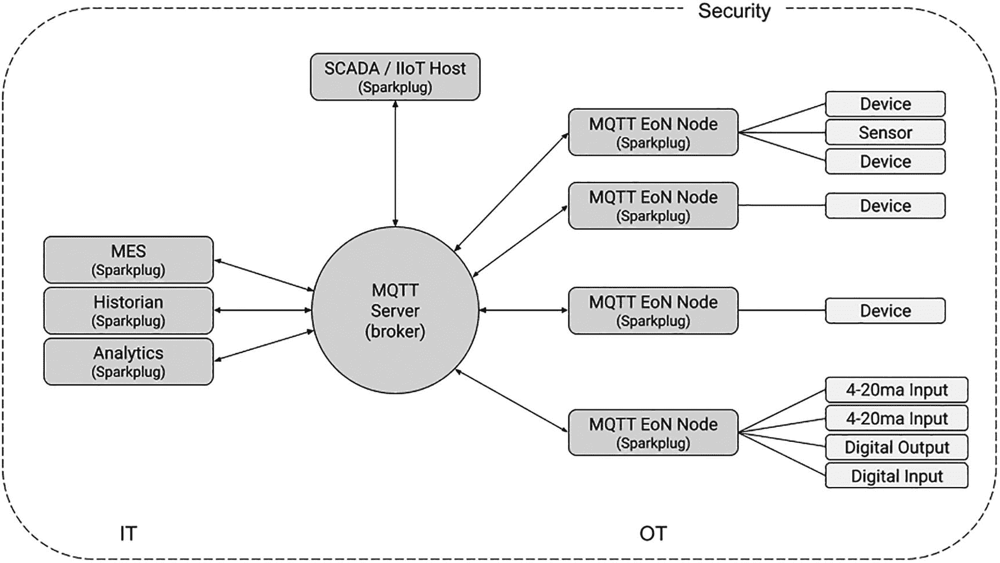

# 5. Sparkplug

> *在某些时刻，我们自己的光芒会熄灭，然后被另一个人的火花重新点燃。*

> *At certain times in our life, our own light is extinguished and rekindled by the spark of another person.*
> 
> —阿尔伯特·史怀哲

自 1999 年以来，MQTT 经历了巨大的增长和采用。2012`–`2013 年，Eclipse 基金会启动了 Mosquitto 和 Paho 项目，围绕该协议创建了一个开放的、供应商中立的社区。最成功的生态系统是那些从一开始就保持开放的生态系统。

正如我之前所解释的，MQTT 中有许多事情需要你自行决定。MQTT 规范没有说明你应该如何构建主题层次结构，也没有说明有效负载的格式和编码。你想使用纯文本吗？没问题！Base64 编码的图像？当然可以！JSON、YAML 或 XML？没问题！在讨论的这一点上，你可能已经看到了问题所在。依赖 MQTT 的设备和应用程序不知道要发布或订阅哪个主题。至于有效负载，它们可以是任何东西，也将会是任何东西。开箱即用，MQTT 基础设施是不可互操作的。

当然，你可以设计设备和应用程序，通过配置机制来获取主题名称。你甚至可以实施巧妙的方法来处理有效负载，或者实现自定义逻辑来与共享数据模型进行相互转换。但做这些事情需要时间。更重要的是，随着你添加设备和应用程序，任务会变得更加复杂。幸运的是，有一种更好的方法：[Eclipse Sparkplug](https://sparkplug.eclipse.org/)。

Sparkplug 是托管在 Eclipse 基金会的一个开源规范，“*[…] 为 MQTT 客户端提供了一个框架，使其能够无缝集成来自其应用程序、传感器、设备和网关的数据到 MQTT 基础设施中*。”^(¹⁵) 它是公开开发的，[在 GitHub 上](https://github.com/eclipse/Sparkplug)。Sparkplug 的演进由 [Eclipse 基金会规范流程](https://www.eclipse.org/projects/efsp/) (EFSP) 管理。详细描述 EFSP 流程超出了本书的范围，但你应该记住的主要一点是，生成的文档是开放的，软件是开源的。任何人都可以出于任何目的、免费且无需版税，以任何媒介复制和分发规范文档。

注意

虽然你可能以前没有听说过，但 EFSP 自 2018 年以来一直在使用。接替 Java Enterprise 版本的 Jakarta EE 规范就是在 EFSP 下管理的。

Sparkplug 并非市场上某个花哨的新来者。该规范的第一个版本可以追溯到 2016 年，当时 Arlen Nipper 和他的团队在 Cirrus Link Solutions 将其发布。此后它已被广泛采用，并且有许多商业和开源实现可用。[Eclipse Tahu](https://projects.eclipse.org/projects/iot.tahu) 是 Eclipse 基金会的开源实现，但 Linux 基金会的 [Fledge 项目](https://www.lfedge.org/projects/fledge/) 也有一个可用的 [Sparkplug 连接器](https://fledge-iot.readthedocs.io/en/v1.8.2/plugins/fledge-south-mqtt-sparkplug/index.html)。


## Sparkplug 与互操作性

MQTT 固有的互操作性缺失正是 Sparkplug 试图解决的问题。它是如何应对这一挑战的呢？让我们看看 Sparkplug 规范的作者是怎么说的：

> *Sparkplug 规范的意图和目的是定义一个 MQTT 主题命名空间、有效载荷和会话状态管理，这些可以普遍应用于整个工业物联网市场领域，但特别满足实时 SCADA/控制 HMI 解决方案的需求。满足这些系统的运营要求将使基于 MQTT 的基础设施能够为业务线和 MES 解决方案需求提供更有价值的实时信息。*^(¹⁶)

其逻辑如下：如果 MQTT 设备和应用程序共享一个主题命名空间、状态管理和有效载荷，它们就能简单高效地集成。以下是这三个概念的高级概述：

*   **主题命名空间：** Sparkplug 定义了一个可扩展的主题命名空间，针对 SCADA 和工业物联网领域进行了优化。该命名空间允许 MQTT 客户端之间的自动发现和双向通信。

*   **状态管理：** Sparkplug 充分利用 MQTT 的“持续会话感知”能力，在涉及带宽有限的不可靠网络场景中减少延迟，使其成为实时 SCADA 和工业物联网解决方案的理想选择。这一点尤其重要，因为 Sparkplug 依赖于*例外报告*方法，即不向订阅者提供周期性更新。数据更新仅在发生时发送，而之所以能可靠地做到这一点，完全归功于 Sparkplug 的状态管理功能。

*   **有效载荷：** Sparkplug 定义了一种二进制消息编码，非常适合传统的基于寄存器的过程变量，例如 Modbus 寄存器值。有效载荷专注于称为*指标*的过程变量变更事件。有效载荷格式支持复杂数据类型、数据集、指标、指标元数据和指标别名。有效载荷格式是版本化的，并在主题结构中引用，以确保客户端能够轻松推断特定消息所使用的编码。

在我详细解释 Sparkplug 的主题结构、状态管理和有效载荷之前，让我们先了解一下该协议的架构、要求和基本原则。

## 架构

除了设备和传感器，Sparkplug 的参考架构定义了三种类型的组件：MQTT 服务器、MQTT 边缘节点和主机应用程序。图 5-1 说明了这些组件是如何组织的。



架构流程图包括 IT 层，包含 Sparkplug 的 MES、历史数据库和分析系统。SCADA 或工业物联网主机。MQTT 服务器（代理）。OT 层包含四个 MQTT 边缘节点（Sparkplug）。该架构受安全措施保护。

图 5-1

Sparkplug 架构（来源：Eclipse 基金会）

MQTT 服务器（代理）是架构的核心组件。它需要支持 MQTT 的特定功能子集，我将在下一节讨论这些功能。Sparkplug 支持使用多个代理来满足高可用性和冗余需求，这使得基础设施更具可扩展性。

MQTT 边缘节点是在架构中扮演网关角色的 MQTT 客户端应用程序。它们实现与可编程逻辑控制器、远程终端单元、流量计算机和传感器等传统设备的本地接口。它们通常与本地离散 I/O 和逻辑内部过程变量进行交互。边缘节点使非 Sparkplug 组件能够参与 Sparkplug 主题命名空间并使用 Sparkplug 有效载荷格式。

Sparkplug 主机应用程序是消费实时 Sparkplug 消息的 MQTT 客户端。主机应用程序必须按照协议规定通告其在线或离线状态。在典型的 SCADA 或工业物联网实现中，单个主主机应用程序负责监控和控制给定的边缘节点。边缘节点指示其主主机应用程序，并使用特定的 Sparkplug `STATE` 消息来通知边缘节点主主机是否已连接并订阅了 MQTT 服务器。然而，Sparkplug 支持在监控或备用模式下添加额外的主机应用程序——无论其范围是全部边缘节点还是特定子集。边缘节点可以配置为在其主主机应用程序在线或离线时具有不同的行为。

## Sparkplug MQTT 要求

目前，Sparkplug 明确绑定 MQTT 作为其传输协议。理论上它可以移植到其他协议，但它依赖于 MQTT 的特定行为来实现其某些功能。

Sparkplug 支持 MQTT v3.1.1 和 v5.0。它可以在完全实现以下功能的代理和客户端库的任何组合上运行：

*   使用 QoS 级别 0 和 1 进行发布和订阅

*   保留消息

*   遗嘱和遗言

此外，在关于安全的非规范性章节中，规范建议依赖访问控制列表来限制客户端可以交互的主题，并在 MQTT 上运行 TLS。这些建议可能会影响您为实现方案选择的 MQTT 代理或 SaaS 解决方案。

Eclipse Mosquitto 和 Eclipse Amlen 都满足前面列出的要求，可用于实现基于 Sparkplug 的解决方案。

## 基本原则

Sparkplug 规范强调了一些重要的设计原则。这些原则如下：

*   发布/订阅方法

*   例外报告

*   持续会话感知

*   出生和死亡证书

*   支持持久和非持久连接

继承自 MQTT 的发布/订阅方法的主要优势在于，设备与消费数据的应用程序完全解耦。与之前点对点的集成方法相比，Sparkplug 中的 MQTT 服务器（代理）扮演了集线器的角色。

对于受限设备而言，一个关键问题是尽可能降低功耗和带宽消耗。例外报告是实现这一目标的优雅方式。在大多数情况下，边缘节点仅在其报告的值发生变化时才需要发送消息。这之所以可能，是因为 Sparkplug 强制要求有状态的 MQTT 会话。也就是说，当例外报告没有意义时，开发者可以自由使用周期性报告。

Sparkplug 的一个基本规则是，边缘节点或主机应用程序必须通告它们即将上线或即将离线。这是通过使用出生和死亡证书来实现的。死亡证书总是在 `CONNECT` 数据包中注册为节点或应用程序的遗嘱消息。至于出生证书，规范规定它们必须是任何节点或应用程序发布的第一条消息。

最后，Sparkplug 让开发者自行决定边缘节点是应永久连接到 MQTT 基础设施，还是仅在需要时连接。在周期性连接的情况下，节点需要做的就是发布自己的死亡证书，然后发送一个适当的 `DISCONNECT` 数据包以优雅地关闭连接。这确保了 MQTT 服务器稍后不会发送死亡证书。主机应用程序随后会将从该节点接收到的指标视为“最后已知良好”值，直到该节点重新上线并刷新这些值。无论选择持续连接还是周期性连接，边缘节点都绝不能使用 MQTT 持久会话。换句话说，边缘节点必须始终将 `cleanSession`（MQTT v3）或 `cleanStart`（MQTT v5）标志设置为 `true`。


## 主题命名空间

Sparkplug 主题命名空间的目标是以逻辑清晰且简洁的方式组织从边缘节点和设备接收到的数据。主题层级结构如下所示：

```
namespace/group_id/message_type/edge_node_id/[device_id]
```

接下来我将解释层级结构中每个元素的含义。

### 命名空间

命名空间元素是一个常量，用于表示所使用的 Sparkplug 版本。它向消息消费者表明主题层级中其他级别的结构以及有效载荷数据的编码方式。在撰写本文时，命名空间元素如下所示：

```
spBv1.0
```

其采用的结构是

```
sp[有效载荷编码方案][有效载荷编码方案版本]
```

因此，本章的其余部分将描述有效载荷编码方案“`B`”的 v`1.0` 版本，也称为 *Sparkplug B*。

注意

Sparkplug 规范的第一个版本定义了有效载荷编码方案“`A`”。然而，实现者发现了一些问题，它很快就被有效载荷编码方案“`B`”所取代。有效载荷编码方案“`A`”已停止使用，并且不再记录在规范中。请勿使用它。

### 组 ID

主题命名空间的组 ID 元素用于逻辑上对边缘节点进行分组。它必须是一个有效的 UTF-8 MQTT 字符串；因此，它不能包含主题过滤器通配符（“`+`”和“`#`”），也不能包含主题级别分隔符“`/`”。

规范建议使用描述性的组 ID 名称，但应尽可能简短。

### 消息类型

Sparkplug 规范定义了多种消息类型。这模仿了 MQTT 数据包的定义方式。由于其结构，主题命名空间根据消息的类型对其进行分类。我将在下一节详细讨论消息类型。

### edge_node_id

此元素是基础设施中边缘节点的 ID。它必须是一个有效的 UTF-8 MQTT 字符串。规范规定，组 ID 和边缘节点 ID 的组合必须是唯一的。它还建议尽可能保持边缘节点 ID 简短，因为它们会随每条发布的消息一起传输。

### device_id

设备 ID 用于标识物理或逻辑上连接到边缘节点的设备。这是命名空间中的一个可选元素，因为某些消息的目标是边缘节点，而不是特定设备。如果使用设备 ID，则它必须在边缘节点的范围内是唯一的。它必须是一个有效的 UTF-8 MQTT 字符串。

内置 Sparkplug 支持的设备可以决定将自己呈现为边缘节点而不是设备。在这种情况下，它们不会生成或处理与设备相关的消息，也不会使用设备 ID。

## 消息类型

Sparkplug 定义并记录了多种类型的消息。使用这些消息，主机应用程序可以：

*   发现元数据并监控连接到 MQTT 基础设施的所有边缘节点和设备的状态
*   发现设备或边缘节点收集的所有指标，包括诊断信息、属性、元数据和当前状态值
*   如果实施的安全模型允许，可以向任何边缘节点或设备指标发出命令消息

以下是 Sparkplug 消息类型的完整列表，以及对其内容的简要说明：

*   **NBIRTH****：** Sparkplug 边缘节点的出生证书。该消息列出了边缘节点本身将报告的所有内容（节点指标），但不包括设备指标。至少，它将包含每个指标的指标名称、数据类型和当前值。

*   **NDEATH****：** Sparkplug 边缘节点的死亡证书。此消息在客户端连接时被设置为遗嘱消息。有效载荷包含一个关联标识符，使主机应用程序能够匹配出生证书和死亡证书。收到后，主机应用程序将把该节点的指标值标记为过时。

*   **NDATA****：** 边缘节点数据消息。这些消息的有效载荷包含需要报告给订阅客户端的边缘节点指标值，因为这些值已更改。有效载荷中可以包含一个或多个指标。

*   **NCMD****：** 边缘节点命令消息。此类消息用于为边缘节点上的指标写入新值。

*   **DBIRTH****：** 设备的出生证书。主机应用程序仅在收到相关的 `DBIRTH` 时才会创建或更新设备的指标结构。除了值指标外，DBIRTH 消息还可以包含设备控制指标和设备属性的定义。设备控制指标用于诸如重启或设置扫描速率等任务。设备属性可以记录设备的制造商、型号和固件版本等信息。

*   **DDEATH****：** 设备的死亡证书。边缘节点发送此消息以向主机应用程序指示设备不可用。收到后，主机应用程序将把该设备的指标值标记为过时。

*   **DDATA****：** 设备数据消息。这些消息的有效载荷包含需要报告给订阅客户端的设备指标值，因为这些值已更改。有效载荷中可以包含一个或多个指标。

*   **DCMD****：** 设备命令消息。此类消息用于为设备上的指标写入新值。

*   **STATE****：** Sparkplug 主机应用程序状态消息。此消息类型用于主机应用程序的出生证书和死亡证书。出生证书将是主机应用程序上线时发送的第一条消息。它将是一条保留消息，通过 QoS 级别 1 传递，有效载荷为 UTF-8 字符串“`ONLINE`”。至于死亡证书，它只是将有效载荷替换为字符串“`OFFLINE`”，并在 MQTT `CONNECT` 数据包中注册为主机应用程序的 MQTT 遗嘱消息。

    `STATE` 消息发布在它们自己的主题层级中。使用的结构是：`/STATE/sparkplug_host_application_id`。应用程序 ID 是任意的，但对于基础设施中的每个 Sparkplug 主机应用程序必须是唯一的。

## 有效载荷定义

Sparkplug 的有效载荷定义使应用程序构建者和设备制造商能够以非常灵活的方式传输值及其元数据。

在技术层面，Sparkplug 规范的作者选择 [Google Protocol Buffers](https://developers.google.com/protocol-buffers) 作为结构化 Sparkplug 有效载荷以及处理其序列化和反序列化的解决方案。Protocol Buffers 是一种语言中立、平台中立、可扩展的机制，用于序列化结构化数据。协议缓冲区数据使用领域特定语言进行结构化，并存储在 `.proto` 文件中。Google 提供了一个编译器，用于从这些文件生成数据访问类。

Sparkplug 规范包含一份以 `.proto` 格式呈现的 Sparkplug 有效载荷的完整副本。Eclipse Tahu 项目[在其仓库中也有一份副本](https://github.com/eclipse/tahu/blob/master/sparkplug_b/sparkplug_b.proto)。

注意

你在 Sparkplug 中看到的任何时间戳属性都是一个无符号 64 位整数，表示自 UNIX 纪元（1970 年 1 月 1 日，UTC）以来的毫秒数。

以 JSON 表示的有效载荷的顶层结构如下所示：

```
{
"timestamp": 1641948773752,
"metrics": [],
"seq": 1,
"uuid": "base64png",
"body": "an array of bytes"
}
```

可选的 uuid 表示一个模式或任意信息，使消息接收者能够解析 `body` 属性。body 是一个字节数组，可以接受任何二进制编码的数据。


### 指标

Sparkplug 指标本质上是键/值/数据类型值。你可以为其添加可选的元数据和键/值属性。以下是一个示例：

```
{
"name": "exterior_temperature",
"alias": 130870,
"timestamp": 1641950175801,
"datatype": "Int8",
"is_historical": false,
"is_transient": false,
"is_null": false,
"metadata": {},
"properties": {},
"value": 23
}
```

在这个例子中，我将 `metadata` 和 `properties` 留空，以便你能直观地看到它们的位置。元数据属性可以描述通过 Sparkplug 消息传输的二进制数据，尤其是文件。

Sparkplug 负载还可以包含数据集和模板。数据集用于编码数据矩阵。要定义一个数据集，除了数据本身之外，你还需要提供列数、列名及其类型。至于模板，它们允许你定义自定义数据类型。这使得 Sparkplug 负载编码既灵活又可扩展。

## 会话管理

会话管理是 Sparkplug 的核心功能之一。规范作者解释了为什么这个功能如此重要：

> *由于实时 SCADA 解决方案的特性，主主机应用程序和所有连接的 Eclipse Sparkplug 边缘节点彼此拥有 MQTT 会话状态信息非常重要。为了实现这一点，Sparkplug 主题命名空间中关于出生/死亡证书的定义以及定义的负载，在主主机应用程序和相关边缘节点之间提供了状态和上下文。*^(¹⁷)

也就是说，主主机应用程序与任何其他 Sparkplug 主机应用程序之间的主要区别在于，边缘节点在开始发布数据之前会检查主主机应用程序是否在线。请注意，主主机是由每个边缘节点标识的。例如，在给定的 Sparkplug 基础设施中，一个边缘节点的主主机可能与另一个边缘节点的主主机不同。

## 示例

假设我希望将*卢浮宫*迁移到 Sparkplug。情况会是什么样？提醒一下，我之前是从位于不同楼层的房间报告温度和湿度值的。一个示例传感器的主题结构将是：

```
/Louvre/2/201/humidity
```

这里，两个最大的因素是我们的边缘节点的数量和位置。我们是每个房间一个节点？还是每层一个？考虑到每个房间只有两个传感器，我假设每层有一个边缘节点。基于此，边缘节点 ID 可以代表楼层，设备 ID 可以传达房间。

那么组 ID 呢？在这种情况下，我正在*卢浮宫*部署，但接下来是*加拿大国家美术馆*。所以我将使用 Louvre 作为组 ID。

好了，决定了这些之后，让我们看看我们的主机应用程序、边缘节点和设备的主题。

### 主机应用程序

假设这里的主机应用程序叫做 `GLaDOS`。在这种情况下，我们可以将其用作应用程序 ID。主题将是：

```
STATE/GLaDOS
```

### 边缘节点

我决定每层有一个边缘节点，并使用节点 ID 来表示楼层号。我的边缘节点的主题将遵循以下模式：

```
spBv1.0/Louvre/message_type/floor
```

或者更具体地说，对于一楼的边缘节点：

```
spBv1.0/Louvre/NBIRTH/1
spBv1.0/Louvre/NDEATH/1
spBv1.0/Louvre/NDATA/1
spBv1.0/Louvre/NCMD/1
```

### 设备

为了这个示例，我假设我的温度传感器和湿度传感器是连接到其所在楼层边缘节点的不同设备。为简单起见，我假设每个设备只暴露一个过程变量。现实世界中的设备通常暴露数百甚至数千个变量。我想通过设备名称传达房间号。主题模式将是：

```
spBv1.0/Louvre/message_type/floor/device
```

所以对于 101 房间，我将有：

```
spBv1.0/Louvre/DBIRTH/1/temp-101
spBv1.0/Louvre/DDEATH/1/temp-101
spBv1.0/Louvre/NDATA/1/temp-101
spBv1.0/Louvre/NCMD/1/temp-101
spBv1.0/Louvre/DBIRTH/1/hum-101
spBv1.0/Louvre/DDEATH/1/hum-101
spBv1.0/Louvre/NDATA/1/hum-101
spBv1.0/Louvre/NCMD/1/hum-101
```

现在，我们唯一需要做的就是通过网络发送一些数据。`DBIRTH` 负载可能如下所示：

```
{
"timestamp": 1641940113424,
"metrics": [ {
"name": "temp-value",
"alias": 1,
"timestamp": 1641940113424,
"dataType": "Int8",
"value": -24,
"transient": false,
"null": false,
"historical": false
}],
"seq" : 1,
"metricCount" : 1
}
```

这是我们温度传感器的 `DDATA` 消息的 Sparkplug 负载：

```
{
"timestamp": 1641940114576,
"metrics": [{
"name": "",
"alias": 1,
"timestamp": 1641940024394,
"dataType": "Int8",
"value": -25
}],
"seq": 1
}
```


## 利用 Eclipse Tahu

[Eclipse Tahu](https://github.com/eclipse/tahu/blob/master/sparkplug_b/sparkplug_b.proto) 是 Eclipse 基金会开发的一个 Sparkplug 开源实现。它包含五个不同的客户端库，分别用 C、C#、Java、JavaScript 和 Python 编写，每个库的成熟度和采用程度各不相同。在撰写本文时，Java 和 C 版本的维护情况最好。

注意

EFSP 要求所有 Eclipse 规范都必须附带一个兼容的开源实现，即通过该规范的*技术兼容性工具包*（TCK）的实现。TCK 是一套软件和文档化的需求，用于支持对实现进行测试，以确保它们与规范兼容。TCK 由相关的 Eclipse 规范项目团队构建。

在撰写本文时，开始使用 Tahu 的最佳方式是克隆仓库并自行编译你感兴趣的版本。Java 版本使用 Apache Maven 作为其依赖管理系统。要编译，请进入你克隆仓库的文件夹并执行

```
mvn clean install
```

这将构建 Java 版本以及 Java 示例应用程序。完成后，你可以在自己的 `pom.xml` 中添加此依赖项：

```

org.eclipse.tahu
tahu
0.5.12

```

当你尝试时，请确保将版本号更新为当前版本。

为了结束本章，让我们看看 Tahu 附带的一个简单的 Sparkplug Java 应用程序。名为 [SparkplugListene​r](https://github.com/eclipse/tahu/blob/master/sparkplug_b/tools/java_sparkplug_b_listener/src/main/java/org/eclipse/tahu/SparkplugListener.java)，它展示了如何订阅代理上的 Sparkplug 消息并解析它们。

文件中包含的大部分代码都利用 Eclipse Paho 连接到代理并订阅 `spBv1.0/#` 主题。我复制的 `messageArrived` 方法包含了 Sparkplug 特定的逻辑：

```
@Override
public void messageArrived(String topic, MqttMessage message) throws Exception {
Topic sparkplugTopic = TopicUtil.parseTopic(topic);
ObjectMapper mapper = new ObjectMapper();
mapper.setSerializationInclusion(Include.NON_NULL);
System.out.println("Message Arrived on Sparkplug topic " + sparkplugTopic.toString());
SparkplugBPayloadDecoder decoder = new SparkplugBPayloadDecoder();
SparkplugBPayload inboundPayload = decoder.buildFromByteArray(message.getPayload());
// Convert the message to JSON and print to system.out
try {
String payloadString = mapper.writeValueAsString(inboundPayload);
System.out.println(mapper.writerWithDefaultPrettyPrinter().writeValueAsString(inboundPayload));
} catch (Exception e) {
e.printStackTrace();
}
}
```

关键的一行代码是这一行，其中使用 `SparkplugBDecoder` 类的实例将来自负载的原始字节转换为 Jackson 的 `ObjectMapper` 可以转换为 JSON 的内容：

```
SparkplugBPayload inboundPayload = decoder.buildFromByteArray(message.getPayload())
```

如你所见，Tahu 库抽象了操作 Sparkplug 负载的复杂性。Tahu 仓库包含几个 [Sparkplug 发布者](https://github.com/eclipse/tahu/tree/master/sparkplug_b)的示例，你可以从中获得灵感。有些是独立的并模拟设备，而另一些则可以在树莓派上运行。

脚注 1   2   3

