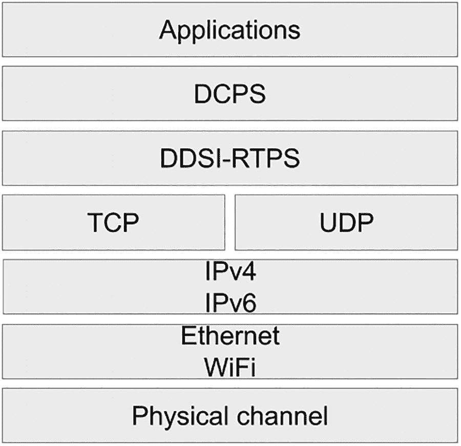
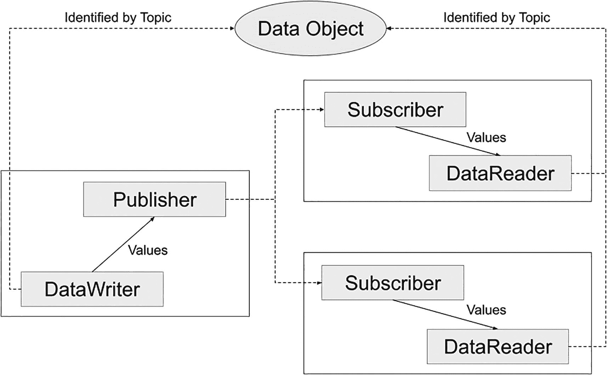
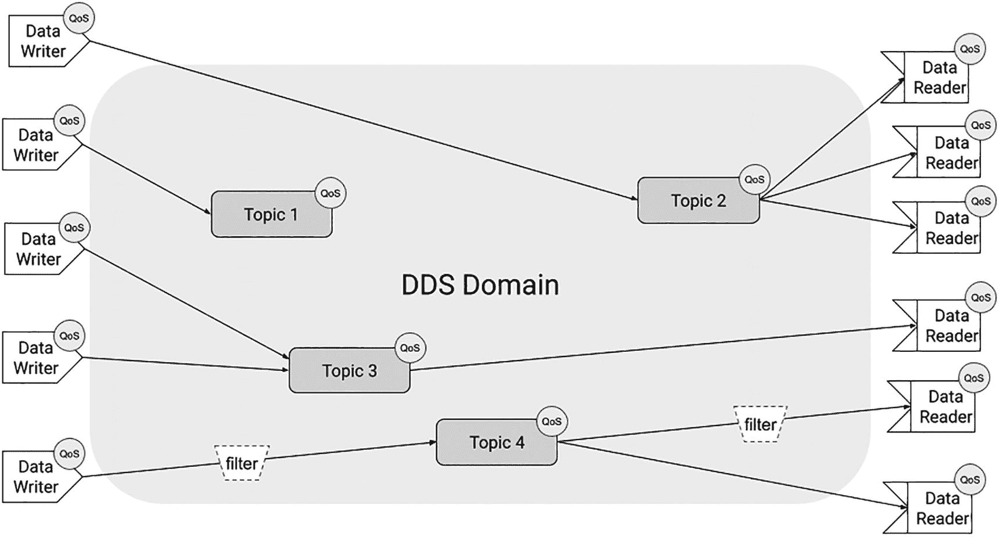

# 6. DDS

> *沟通，就是分享；而分享，是构成我们的行为。*

> *To communicate is to share, and sharing is the act that constitutes us.*
> 
> ——阿尔贝·雅卡尔，《非哲学家的微小哲学》

无论其工作负载或物理位置如何，服务器都是潜在的故障点。互联网和 TCP/IP 的设计目的是，如果特定节点或网络的较大区域发生故障，流量能够通过备用路径到达目的地。然而，我们迄今为止共同探讨的协议都依赖于某种服务器。当然，你可以通过利用高可用性功能和部署冗余网络连接来使这些服务器更具弹性。但是，你离云或企业数据中心越远，环境就越严苛。对于许多实时和关键任务用例来说，架构中存在单点故障是不可接受的，尤其是因为代理和服务器还会给数据流增加延迟和抖动。

长期以来，点对点网络一直是集中式方法的一种更具容错性的替代方案。在这种网络中，节点直接连接到尽可能多的其他节点。此外，点对点网络增加了架构中的并行性，因为从性能角度来看不存在单一瓶颈。

在物联网和边缘计算领域，DDS 无疑是依赖去中心化方法的最成熟的协议示例之一。在本章中，你将了解 DDS 的基础知识，并发现 [Eclipse Cyclone DDS](https://github.com/eclipse-cyclonedds/cyclonedds)，这是一个该协议的可移植实现。


## 什么是 DDS？

*OMG 数据分发服务*（DDS）是一种以数据为中心的连接协议和 API 标准，由[对象管理组织 (OMG)](https://www.omg.org/) 制定。DDS 规范的开发始于 2001 年。当时的主要贡献者是 Real-Time Innovations (RTI) 和泰雷兹集团。OMG 于 2004 年 12 月发布了 DDS 规范 1.0 版。随后在 2005 年 12 月发布了 1.1 版，2006 年 12 月发布了 1.2 版。DDS 核心规范的最新版本是 [2015 年 3 月发布的 1.4 版](https://www.omg.org/spec/DDS/1.4/)。

DDS 依赖于一种以数据为中心的发布/订阅方法，有时用缩写 DCPS 表示。与 MQTT 类似，消息被发布到客户端可以订阅的主题上。然而，在 DDS 中，实体存在于全局数据空间（域）中，这些域可以进一步划分为分区。

DDS 与其他物联网协议的一个显著区别在于其对负载定义的高度重视。DDS 主题不仅仅是用于确定哪些订阅者将收到消息的简单过滤器。它们由名称、类型和一组 QoS 策略共同定义。由于 DDS 是语言无关的，主题类型可以用多种语法表示，其中 *接口定义语言* (IDL) 是最常见的选择。

注意

如果你已经熟悉 IDL，你可能会想知道 DDS 与 CORBA 的关系。DDS 与 CORBA 仅有的两个共同点是：它使用了 IDL 的一个子集，并且两者都是 OMG 规范。另外，如果你熟悉 CORBA，那么你的年龄可能和我差不多，甚至比我还大。

随着时间的推移，DDS 规范通过以下三个配套规范得到了增强：

*   **DDSI-RTPS：** 定义了 *实时发布-订阅协议* (RTPS) DDS 互操作性线协议。[最新版本是 v2.5](https://www.omg.org/spec/DDSI-RTPS/)。实现由 OMG 分配的 RTPS 供应商 ID 标识。

*   **DDS-XTypes：** 为 DDS 主题类型定义了可扩展的类型系统。[最新版本是 v1.3](https://www.omg.org/spec/DDS-XTypes/)。

*   **DDS-Security：** 定义了 DDS 实现可以使用的安全模型和服务插件接口 (SPI) 架构。[最新版本是 v1.1](https://www.omg.org/spec/DDS-SECURITY/)。

DDS 规范及其前面列出的三个配套规范通常被称为 DDS 核心规范。

OMG 还发布了 DDS 规范的扩展。它们引入了一个分布式服务框架 (DDS-RPC)，以及用于表示 DDS 资源的 XML 和 JSON 语法。此外，还提供了一些网关，包括一个支持 OPC UA 协议的网关。有关这些资源的信息可以在 [`www.dds-foundation.org/omg-dds-standard/`](http://www.dds-foundation.org/omg-dds-standard/) 找到。

本章将只关注 DDS 核心规范的最新版本。在选择 DDS 实现时，应始终注意它们所支持的规范和扩展。

理解核心规范如何协同工作的最佳方式是查看 DDS 网络协议栈。请注意，诸如增加对时间敏感网络 (TSN) 支持等正在进行中的计划不在考虑之列。

## 协议栈

图 6-1 展示了 DDS 协议栈。请注意，DDS 需要 IP。核心规范强制要求支持 UDP 作为传输层协议，但 Cyclone DDS 也支持 TCP。这使得它既适用于电池供电的受限设备，也适用于功能更强大的设备。值得一提的是，一些供应商特定的扩展支持非 IP 网络。



DDS 协议栈的示意图，包括应用层、DCPS、DDSI-RTPS、TCP、UDP、IPv4、IPv6、以太网、WiFi 和物理信道。

图 6-1
DDS 网络协议栈

DDSI-RTPS 是一种线协议；缩写中的 DDSI 代表 *DDS 互操作性*，而 RTPS 代表 *实时发布-订阅*。最初，DDS 只是一个 API，实现者使用了多种不兼容的线协议。这导致了碎片化。DDSI-RTPS 旨在促进不同实现之间的互操作性。

以下是 RTPS 主要特性的列表：

*   **性能和服务质量属性：** 这些特性为实时应用实现了尽力而为和可靠的发布/订阅通信。

*   **容错性：** 通过设计，DDSI-RTPS 允许创建没有单点故障的网络。

*   **可扩展性：** 该协议可以在不牺牲向后兼容性或互操作性的情况下进行扩展和增强。

*   **即插即用连接：** 节点会被自动发现，并且可以随时加入或离开网络，无需重新配置。

*   **模块化：** 受限设备可以实现协议子集，并且仍然可以加入网络。

*   **类型安全：** 防止类型错误意味着整个基础设施更加可靠。

DDSI-RTPS 之上的层是 DDS API 本身，也称为 *以数据为中心的发布-订阅* (DCPS)。它的重点是应用之间的数据分发。其特性可以分为以下三类：

*   **发布应用：** DCPS 使您能够识别应用发布的数据对象，并为这些对象提供值。

*   **订阅应用：** DCPS 允许您识别要订阅的数据对象并访问它们的值。

*   **基础设施：** DCPS 提供了支持发布和订阅应用所需的一切。您将使用它来定义主题、将类型信息附加到主题、创建发布者和订阅者实体，以及为所有这些实体附加 QoS 策略。

当使用 DCPS 时，底层的 DDSI-RTPS 协议对程序员是不可见的。现在，让我们更深入地了解 DCPS 的特性，从其概念模型开始。


## 发布与订阅

DDS 规范定义了信息传输中涉及的几个概念。发送信息需要*发布者*和*数据写入器*；接收信息需要*订阅者*和*数据读取器*。*主题*使得订阅与发布能够匹配。你可以在发布端和订阅端应用不同的 QoS 属性来控制其行为。如果需要，发布者和订阅者可以在运行时重复使用。图 6-2 展示了 DCPS 各概念如何协同工作。



图示说明了从数据写入器到发布者、从发布者到两个订阅者的值传递，以及从订阅者到数据读取器的值传递，并通过主题从数据写入器和数据读取器标识到数据对象。

图 6-2
DCPS 概念概览

图中存在一些不易察觉的细微差别。以下列表提供了关于数据读取器、数据写入器、发布者和订阅者的更多细节：

*   **数据写入器始终与单个主题关联。** 然而，一个应用程序可以包含多个向同一主题发送数据的数据写入器。

*   **发布者负责数据传输。** 发布者管理并拥有数据写入器。单个发布者可以拥有多个数据写入器，但数据写入器仅属于一个发布者。

*   **数据读取器始终与单个主题关联。** 一个应用程序可以包含多个从同一主题读取数据的数据读取器。

*   **订阅者负责数据接收。** 订阅者管理并拥有数据读取器。单个订阅者可以拥有多个数据读取器，但数据读取器仅属于一个订阅者。

我将在本章后面部分详细描述读写数据的具体细节。目前，请注意，各种 DDS 规范并未将对主题的数据更新描述为消息，而是描述为*样本*。

注意

术语*样本*源自数据采集领域。数据采集是使用传感器对表达现实世界物理条件的信号进行采样，并将生成的样本转换为数字值的过程。

数据读取器和数据写入器是强类型的。它们使用的类型是为主题定义的类型。在构建 DDS 应用程序时，你将使用支持的语法之一自行定义主题类型，其中 IDL 是最典型的选择。

清单 6-1 展示了一个温度传感器的 IDL 类型定义。你会注意到它看起来与 C 或 C++结构非常相似。

```
// TempSensor.idl
enum TemperatureScale {
CELSIUS,
FAHRENHEIT,
KELVIN
};
@topic struct TempSensorType {
@key short id;
float temp;
TemperatureScale scale;
};
清单 6-1
温度传感器的 IDL 定义
```

在应用程序中使用该类型之前，你需要使用适当的预处理器来生成实现类。此类预处理器通常支持多种编程语言。

在 DDS 中，发布和订阅发生在完全分布式的全局数据空间（GDS）的上下文中。我现在将解释这意味着什么。

## 全局数据空间

DDS 应用程序将所有数据视为本地数据；换句话说，当 DDS 应用程序读取数据时，它从一个看似本地数据存储的地方读取。DDS 负责数据传输，确保订阅者获得他们请求的数据。GDS 还负责执行发布者和订阅者的自动发现。没有像 MQTT 中的代理那样的连接客户端中央注册表。这种方法的优点是客户端在连接前无需进行配置。作为 DDS 一部分的自动发现机制会处理一切。

尽管 GDS 中的“G”代表“全局”，但 DDS 建立了两种限定信息访问范围的方式：*域*和*分区*。我现在将解释每种方式的具体含义。

### 域

你可以将域视为特定于加入它的应用程序的虚拟网络。域之间无法相互通信。如果你的应用程序需要跨多个域执行操作，你必须维护与两个域的单独连接，并自行协调数据交换。

图 6-3 展示了在 GDS 内单个未分区域的上下文中，数据写入器和数据读取器的交互。该图强调了不同的参与者可以使用不同的 QoS 属性。



图示描绘了 DDS 域，表明数据写入器 QoS 与主题 1、2、3 和 4 的 QoS 交互，以及这四个主题与数据读取器 QoS 的交互。主题 4 的 QoS 对数据写入器和读取器应用了过滤器。

图 6-3
DDS 的数据中心模型

图 6-3 还显示可以对订阅应用过滤器。我将在后面介绍这个概念。

### 分区

分区是域内主题的逻辑分组。分区由名称标识，你的应用程序需要在发布或订阅分区内的主题之前显式加入它们。一个有趣的特性是，应用程序可以通过使用精确名称或指定通配符来加入分区。此类通配符必须符合 POSIX `fnmatch` API（[1003.​2-1992 Section B.​6](https://standards.ieee.org/standard/1003_2-1992.html)）。^(¹⁸) 如果需要，你还可以通过定义命名约定来分层组织分区名称；在这种情况下，冒号是一个很好的分隔符。

为了更具体地说明，让我们回到关于博物馆的例子。在前面的章节中，我们正在部署基础设施来监控*卢浮宫*每个房间的温度和湿度。针对这个用例，一个可能的 DDS 分区命名约定可以是：

```
m-[博物馆名称]:fl-[楼层]:rm-[房间]
```

实际的分区名称可能如下所示：

```
m-Louvre:fl-1:rm-101
m-Louvre:fl-2:rm-205
```

那么，`temperature`和`humidity`可以是这些分区内的主题。

一个希望获取特定楼层所有读数的订阅者可以使用以下表达式来指定分区：

```
m-Louvre:fl-*
```

## 服务质量

在 DDS 中，服务质量通过多个细粒度的属性来指定。这些属性涵盖了非功能性关注点，例如数据可用性、数据传递、时效性、资源使用和配置。

当数据读取器和数据写入器的 QoS 不匹配时，只有当数据读取器请求的 QoS 不比数据写入器提供的 QoS 更严格时，数据才会被传输。这确保了更高质量服务级别的保证得以保留。

现在让我们回顾一下 DDS 提供的最常用的 QoS 策略。


### 数据可用性

数据可用性组的策略使得应用程序能够跨越时间和空间进行解耦。

`DURABILITY`（持久性）策略决定了写入域的数据的生命周期。它定义了以下四个持久性级别：

*   **VOLATILE（易失性）：** 数据仅传输给当前已连接的订阅者。不会为离线订阅者保留副本。

*   **TRANSIENT_LOCAL（本地临时性）：** 发布者将数据存储在本地，以便离线订阅者在重新连接到域后能获取到最新发布数据的副本。但是，如果发布者离线，则不会传输任何数据。

*   **TRANSIENT（临时性）：** 最新发布数据的副本保存在本地范围之外的 GDS（全局数据空间）中。这确保了离线订阅者在重新连接到域后能获取到数据的副本。如果系统关闭，数据将不会持久保存。

*   **PERSISTENT（持久性）：** 最新发布数据的副本保存在本地范围之外的 GDS 中，并写入持久化存储 `–` 通常是文件系统或数据库。这确保了离线订阅者在重新连接到域后能获取到数据的副本。系统在关闭后重新上线时，数据将被恢复。

`LIFESPAN`（生命周期）QoS 策略控制已发布数据的有效时间间隔。此策略的默认值为 `infinite`（无限），意味着数据永不过期。如果指定了值，则早于 `LIFESPAN` 阈值的数据元素将被清除。

`HISTORY`（历史记录）QoS 策略控制读取者或写入者必须存储的样本数量（对同一主题进行的后续写入）。可能的值为：最新写入、最近 *n* 次写入或所有写入。

### 数据交付

此组的策略影响已发布数据如何提供给订阅者。它们直接影响 DDS 系统的可扩展性。

*   **PRESENTATION（呈现）：** 此策略影响数据更新的顺序和一致性。`access_scope`（访问范围）属性决定了所选设置的粒度。支持的粒度级别为 `INSTANCE`（实例）、`TOPIC`（主题）和 `GROUP`（组）。该策略有两个设置：`ordered_access`（有序访问）和 `coherent_access`（连贯访问）。前者控制更新的顺序是否得以保留；后者确定通过 `begin_coherent_change`（开始连贯更改）和 `end_coherent_change`（结束连贯更改）操作指定的更改分组是否得以维持。最终，如果启用了 `coherent_access`，该策略允许在范围内原子性地读取或写入多个样本；如果启用了 `ordered_access`，则保留它们被发布的确切顺序。如果 `access_scope` 的值为 `INSTANCE`，则这适用于具有相同键值的样本。如果值为 `TOPIC`，则适用于特定 DataWriter 发布的所有样本。最后，如果范围为 `GROUP`，则这些设置适用于属于该发布者的所有 DataWriters。

*   **RELIABILITY（可靠性）：** 此策略控制数据传输的可靠性级别。可能的值为 `BEST_EFFORT`（尽力而为）和 `RELIABLE`（可靠）。`BEST_EFFORT` 设置不提供交付保证；发布者不会尝试重传订阅者未收到的样本。当选择 `RELIABLE` 设置时，发布者将尝试重传丢失的样本，直到订阅者收到为止。在这两种情况下，样本的顺序都得以保持；数据值不会从新值回退到旧值。

*   **PARTITION（分区）：** 此策略指定发布者或订阅者的实例与分区之间的关联。这依赖于分区的名称，该名称可以包含通配符。在匹配发布者和订阅者时，DDS 会同时考虑主题和分区。

*   **DESTINATION_ORDER（目标顺序）：** 此策略定义样本是按接收时间（`BY_RECEPTION_TIMESTAMP`，默认值）排序，还是按源端设置的时间戳（`BY_SOURCE_TIMESTAMP`）排序。当同一数据有多个发布者，或者在非易失性数据的订阅是在发布者开始发布数据之后进行时，需要使用 `BY_SOURCE_TIMESTAMP` 设置来维护样本之间的最终一致性。

*   **OWNERSHIP（所有权）：** 此策略确定由主题和键确定的特定数据对象实例是否接受多个 DataWriter 的并发更新。如果设置为 `SHARED`（共享），则多个 DataWriter 可以写入。如果设置为 `EXCLUSIVE`（独占），则在任何给定时间只有一个 DataWriter “拥有”该数据对象。`OWNERSHIP_STRENGTH`（所有权强度）策略决定哪个 DataWriter 将获得写入权限。DDS 规范不要求实现通知 DataWriter 它们不拥有其试图更新的数据对象。

### 数据时效性

此组的策略影响传输的时间方面，并且当 `OWNERSHIP` 策略为 `EXCLUSIVE` 时，可能影响数据对象的所有权。

*   **DEADLINE（截止时间）：** 当主题需要定期更新时，此策略非常有用。该策略定义了一个契约，应用程序必须在发布端履行该契约。在订阅端，它定义了提供数据值的发布者的最低要求。DDS 应用程序可以收到错过截止时间的通知。

*   **LATENCY_BUDGET（延迟预算）：** 此策略为应用程序提供了一种向 DDS 告知传输数据紧急程度的方法。DDS 规范指出，该值是一个提示，留待实现方解释。某些实现会将其视为数据传输的交付窗口。

*   **TRANSPORT_PRIORITY（传输优先级）：** 此策略允许应用程序指示与主题关联的数据的相对优先级。该值是一个 32 位有符号整数；值越高表示优先级越高。DDS 规范指出，此策略是一个提示，实际的运行时行为取决于实现。

### 资源

此组的策略使您能够定义 DDS 系统消耗资源的限制。这使得即使在带宽和存储有限的情况下，也能保持基础设施的响应能力。

*   **TIME_BASED_FILTER（基于时间的过滤器）：** 此策略控制 DataReader 的采样率。当订阅者缺乏处理超过特定速率的数据所需的网络带宽、内存或处理能力时，此策略非常有用。具体来说，该策略使您能够定义主题上两个样本之间的 `minimum_separation`（最小间隔）时间。换句话说，此策略充当速率限制机制。

*   **RESOURCE_LIMITS（资源限制）：** 此策略允许应用程序定义最大样本数和每个实例的样本数。在适用的情况下，这有效地定义了用于保存主题实例及其相关历史样本的存储空间。

### 配置

此组的策略侧重于用户定义值的定义和传输。这些值在引导过程中尤其有用。

*   **USER_DATA（用户数据）：** 此策略允许应用程序将元数据关联到域参与者、DataReader 和 DataWriter。然后，此元数据通过系统主题进行分发。该策略代表了一种通用的可扩展性机制，通常用于配置安全凭证。

*   **TOPIC_DATA（主题数据）：** 此策略允许应用程序将元数据关联到主题。然后，此元数据通过系统主题进行分发。该策略代表了一种通用的可扩展性机制。

*   **GROUP_DATA（组数据）：** 此策略允许应用程序将元数据关联到发布者和订阅者。然后，此元数据通过系统主题进行分发。应用程序可以利用此类元数据来获得对订阅匹配的额外控制。


## 主题

正如你现在所意识到的，DDS QoS 策略比 MQTT 中的 QoS 级别要精细得多。主题（Topics）代表了两者之间的另一个区别。正如我之前提到的，DDS 主题由名称、类型和一组 QoS 策略定义。接下来我们将一起探讨这意味着什么。

### 主题类型

尽管有其他替代方案，IDL 仍然是定义 DDS 主题类型最常用的选择。当用 IDL 表达时，主题类型由一个键（key）和一个 IDL `struct` 组成。该 `struct` 可以包含任意数量的字段。这些字段可以是原始类型、模板类型或构造类型。

表 6-1 展示了定义 DDS 主题时可用的 IDL 原始类型。

表 6-1

用于定义 DDS 主题的 IDL 原始类型

| 原始类型 | 大小（位） |
| --- | --- |
| `boolean` | 8 |
| `octet` | 8 |
| `char` | 8 |
| `short` | 16 |
| `unsigned short` | 16 |
| `long` | 32 |
| `unsigned long` | 32 |
| `long long` | 64 |
| `unsigned long long` | 64 |
| `float` | 32 |
| `double` | 64 |

如你所见，IDL 中没有 `int` 类型。你可以使用 `short`、`long` 或 `long long` 来代替；只需根据你想要传输的数据选择合适的大小即可。

有两种可用的模板类型。一种可以定义长度确定或未定义（无界）的字符串。另一种是一种随机访问的有序容器，称为 *sequence*，概念上类似于大多数高级编程语言中的 vector。表 6-2 提供了更多细节。

表 6-2

用于定义 DDS 主题的 IDL 模板类型

| 模板格式 | 示例声明 |
| --- | --- |
| `String<length = UNBOUNDED$>` | `string museumName;``string<32> museumShortName;` |
| `sequence<T,length = UNBOUNDED>` | `sequence<octet> floorRooms``sequence<octet, 5> lastFive``sequence<TempSensorType> tSens``sequence<TempSensorType, $5>$ tS` |

最后，你可以在你的 DDS 类型中使用三种不同的 IDL 构造类型：`enum`、`struct` 和 `union`。IDL 枚举只是可能预定义值的枚举。IDL 结构体等同于 C 语言中的相同结构。至于 IDL 联合体，它们定义了一种只能包含多个备选成员之一的结构。表 6-3 包含了这三种允许的构造类型的示例。

表 6-3

用于定义 DDS 主题的 IDL 构造类型

| 构造类型 | 示例声明 |
| --- | --- |
| `enum` | `enum TemperatureScale {``CELSIUS,``FAHRENHEIT,``KELVIN``};``enum SensorType {SIMPLE, TEMP};` |
| `struct` | `struct Sensor { short id;};``struct TempSensor {``short id;``TemperatureScale scale;``};` |
| `union` | `union RoomSensors switch(SensorType){``case SIMPLE: Sensor simpleSensor;``case TEMP: TempSensor tSensor;``};` |

最终，任何 DDS 主题类型都只是一个包含如前所述的嵌套原始类型、模板类型和构造类型的结构体。

DDS-XTypes 规范在该领域带来了额外的灵活性。例如，它引入了单继承和可选字段。此外，它还增加了对 DataReader 和 DataWriter 端类型之间细微差异的容忍度。这使得你可以在不同时更新所有组件的情况下，逐步演进系统中的各个组件。

### 主题键、实例和样本

在定义 DDS 主题类型时，你需要决定是否希望该类型拥有一个键。无键的主题将只有一个实例；换句话说，它们将是单例。另一方面，有键的主题在运行时将拥有与键值数量一样多的实例。

在清单 6-1 中，我定义了一个包含名为 `id` 的 `short` 值的温度传感器。`@key` 注解用于表示键的组成部分：

```
@key long userID;
```

主题键可以是原始类型、枚举（`enum`）或嵌套在类型声明任意层级的字符串。例如，如果我希望同时使用 `id` 和 `scale`（类型为 `TemperatureScale`，这是一个 `enum`）作为主题键，我会用 `@key` 注解这两个属性：

```
@topic struct TempSensorType {
@key short id;
float temp;
@key TemperatureScale scale;
};
```

要使 DDS 类型无键，你只需省略 `@key` 注解即可。

DDS 主题类型可比作关系数据库中的表，而 DDS 主题实例可比作行。DDS 主题类型也映射到面向对象语言中的类，DDS 主题实例则映射到对象实例。

### 过滤

通常，订阅者只关心发布到某个主题的样本的一个子集。一个典型的用例是当数值超出特定范围时采取特定操作。DDS 提供了内容过滤功能，允许订阅者只获取相关的样本。DDS 规范将其描述为基于内容的订阅。

在 DDS 中，过滤涉及通过对现有主题应用过滤器来创建一个内容过滤主题。过滤器通过使用一个或多个支持的过滤运算符的表达式来指定。表 6-4 列出了 DDS 支持的过滤运算符。

表 6-4

DDS 过滤器和查询条件支持的运算符

| 过滤运算符 | 含义 |
| --- | --- |
| = | 等于 |
|   | 不等于 |
| > | 大于 |
| < | 小于 |
| >= | 大于或等于 |
| <= | 小于或等于 |
| BETWEEN | 介于（包含边界）范围之间 |
| LIKE | 匹配字符串模式 |

过滤表达式还可以包含逻辑运算符，例如 `AND`、`NOT` 和 `OR`。

假设我希望订阅一个过滤后的主题，以便在卢浮宫博物馆内某个房间的温度超出可接受范围时得到通知。主题的类型是 `TempSensorType`，如清单 6-1 中所定义。过滤表达式可能如下所示：

```
temp NOT BETWEEN 22.5 AND 23
```

大多数 DDS 实现都允许将过滤表达式创建为参数化字符串，稍后可将实际值传递给该字符串。

## 读取和写入数据

过滤是一种有效的策略，通过只向订阅者传输其关心的样本来最小化带宽和内存消耗。然而，应用程序代码也可以选择只处理 DataReader 缓存中存在的样本子集。要理解这是如何工作的，你首先需要更多地了解数据在 DDS 中是如何写入的。


### 写入

在 DDS 中写入基本数据很简单：只需在 DataWriter 上调用 `write` 函数或方法即可。在幕后，主题实例的生命周期会影响本地节点和远程节点的资源消耗。

主题实例的生命周期包含三种状态。以下列表描述了这三种状态：

*   **ALIVE（活跃）：** 至少有一个 DataWriter 已注册了该主题实例。这意味着该 DataWriter 打算提供数据更新，并已为该实例预留了相关资源。

*   **NOT_ALIVE_NO_WRITERS（非活跃且无写入者）：** 没有更多的 DataWriter 注册该主题实例。与该实例相关的所有 DataWriter 资源已被释放。DataReader 不再期望新的样本。当 DataWriter 不再需要主题实例时，需要注销它们，因为这会导致发布者及其所有相关订阅者发生资源泄漏。对于崩溃的应用程序，其主题实例通常会处于 `NOT_ALIVE_NO_WRITERS` 状态，但一旦应用程序重新上线，可能会恢复到 `ALIVE` 状态。

*   **NOT_ALIVE_DISPOSED（非活跃且已处置）：** 此状态表示该主题实例需要被丢弃。在正常终止时，或者例如当实例所描述的对象不再存在时，应用程序应将其主题实例设置为该状态。

**DDS** 为主题实例提供了一种自动生命周期管理形式。默认情况下，当销毁一个 DataWriter 对象时，如果没有其他活跃的 DataWriter 注册了该主题实例，DDS 会将其设置为 `NOT_ALIVE_DISPOSED` 状态。通常可以通过配置设置来覆盖此行为，使 DDS 将实例置于 `NOT_ALIVE_NO_WRITERS` 状态。

作为开发者，你可以通过使用 DataWriter 暴露的 API 来显式管理主题实例的生命周期。这将使你对主题实例的注册和处置拥有完全控制权。通常，这种方法可以实现对系统资源更细粒度的管理。注册会导致资源分配；当 DataWriter 注销时，这些资源会被释放。

注意

对于无键主题，主题实例是单例的。这本质上意味着该主题的生命周期与 DataWriter 的生命周期相同。

### 读取

DataReader 暴露了两种允许你访问数据的操作：*read* 和 *take*。这两种操作都会给你一份数据的副本。但 `read` 会将数据保留在 DataReader 的缓存中，而 `take` 则会将其从缓存中移除。使用 `read` 类似于在 MQTT 的主题上设置保留消息。使用哪一种取决于你的用例。当你的 DDS 主题代表分布式状态时，`Read` 很有用；而当它们代表分布式事件时，`take` 则更有用。

DataReader 接收到的每个样本都有一个伴随的 `SampleInfo`，用于描述该样本的属性。以下是最重要的属性列表：

*   **sample_state（样本状态）：** 样本状态可以是 `READ`（已读）或 `NOT_READ`（未读）。当然，`READ` 状态只有在数据是通过 `read` 操作（而非 `take` 操作）获取时才可能出现。

*   **instance_state（实例状态）：** 这表示主题实例的状态。可能的值有 `ALIVE`、`NOT_ALIVE_NO_WRITERS` 和 `NOT_ALIVE_DISPOSED`。

*   **view_state（视图状态）：** 如果该样本是主题实例上接收到的第一个样本，则此属性的值为 `NEW`（新），否则为 `NOT_NEW`（非新）。

*   **disposed_generation_count（处置代数计数）和 no_writers_generation_count（无写入者代数计数）：** `SampleInfo` 包含计数器，用于记录主题实例状态变化的次数。例如，你可以使用它们来了解一个主题实例在处于 `NOT_ALIVE_DISPOSED` 状态后，进入 `ALIVE` 状态的次数。

*   **source_timestamp（源时间戳）：** 时间戳很重要，因为数据时效性 QoS 策略依赖于它。应用程序也经常用它来表示观测发生的时间。

*   **valid_data（有效数据）：** 此标志指示样本是否包含数据。有些样本不包含数据，因为它们是为了传达 `instance_state` 值的变化而发送的。

DDS 允许你在读取时选择数据的子集，无论你使用的是 `read` 还是 `take`。你可以基于*状态*或*内容*进行数据选择。基于状态的选择涉及 `SampleInfo` 的 `view_state`、`instance_state` 和 `sample_state` 属性。例如，你可以通过发出一个读取请求，要求 `view_state` 为 `NEW`、`sample_state` 为 `NOT_READ` 且 `instance_state` 为 `ALIVE` 的样本，来读取刚刚出现在 GDS 中的实例所提供的数据。另一方面，基于内容的选择则涉及实际的样本数据。DDS 通过查询提供基于内容的选择，查询使用的语法与 DDS 过滤器相同。表 6-4 列出了支持的运算符。

从概念上讲，过滤器和查询非常接近。那么，它们有何不同呢？过滤控制着数据读取器接收的数据：不匹配过滤条件的数据不会被插入到 DataReader 缓存中。另一方面，查询则用于选择已存在于 DataReader 缓存中的传输数据。

DDS 应用程序可以定期轮询 DataReader，以检查是否有样本被发布。在大多数情况下，这种方法会浪费 CPU 时间，并在资源受限设备上缩短电池寿命。DDS 提供了两种替代轮询的方法来检查数据可用性：*监听器*和*等待集*。你可以向 DataReader 注册监听器，以便在数据可用或某些 QoS 策略被违反时得到通知。至于等待集，它们提供了一种更通用的机制，用于在满足特定条件时执行逻辑。它们使得将回调函数或方法绑定到各种事件成为可能。


## 安全性

DDS 规范本身对安全性着墨甚少，仅提及可以使用 `USER_DATA` QoS 策略来传输安全令牌。考虑到此类令牌将以明文形式传输，这或许有些天真。另一方面，DDS 安全规范定义了*安全模型与服务插件接口*（SPI）架构。DDS 实现可以通过调用这些 SPI 来强制执行安全模型。该规范还定义了一组 SPI 的内置实现。

SPI 架构是通用的，并不强制要求特定的安全技术。安全功能的具体细节以及不同插件的实现方式，取决于所使用的具体 DDS 实现和应用程序。

DDS 安全架构的核心由五个插件组成：

*   **认证服务插件：** 提供单向和双向认证算法。

*   **访问控制服务插件：** 处理发布/订阅操作以及特定于实现的操作的授权。

*   **加密服务插件：** 提供密钥生成和交换接口、加密、哈希和数字签名。它还处理消息认证码。

*   **日志服务插件：** 实现事件日志记录。它使得审计所有 DDS 安全相关事件成为可能。

*   **数据标记插件：** 提供一种向样本添加标签的方法。从安全角度来看，这意味着你可以将安全标签附加到数据上。

其中，日志服务插件和数据标记插件是可选的。

以下是这些插件启用的安全流程的高级概述。加入 DDS 域的每个实体都必须进行身份验证；作为回报，它们会获得一个安全令牌。基础设施可以在身份验证过程中生成一个共享密钥，加密服务插件可以使用该密钥来创建派生的加密密钥并将其分发给其他实体。例如，这可以支持建立 TLS 安全通信通道。此外，加密服务插件提供了一个 API，应用程序可以利用它来强制执行消息的机密性、完整性、真实性和不可否认性。另一方面，访问控制插件确保只有经过授权的实体才能发布或订阅特定主题。它依赖于在身份验证时获得的令牌来建立实体的身份。DDS 内置的自动发现过程也可以通过访问控制服务插件得到保护。

大多数 DDS 实现可以与各种认证服务器集成，使用 OAuth 令牌或等效物，并使用 TLS（TCP）或 DTLS（UDP）加密流量。

## Eclipse Cyclone DDS

[Eclipse Cyclone DDS](https://projects.eclipse.org/projects/iot.cyclonedds) 是一个成熟且功能完备的 DDS 实现，托管于 Eclipse 基金会。它已被用于多个商业实现中。该项目专注于遵守所有核心 DDS 规范，即：

*   [数据分发服务](https://www.omg.org/spec/DDS/About-DDS/) (DDS)

*   [DDS 互操作性线协议](https://www.omg.org/spec/DDSI-RTPS/About-DDSI-RTPS/) (DDSI-RTPS)

*   [DDS 安全](https://www.omg.org/spec/DDS-SECURITY/About-DDS-SECURITY/) (DDS-SECURITY)

*   [DDS 的可扩展和动态主题类型](https://www.omg.org/spec/DDS/About-DDS/) (DDS-XTypes)

Cyclone DDS 核心库使用 C 语言编写。Cyclone DDS 项目团队还维护了 [Python](https://github.com/eclipse-cyclonedds/cyclonedds-python) 和 [C++](https://github.com/eclipse-cyclonedds/cyclonedds-cxx)（[ISO/​IEC C++ PSM](https://www.omg.org/spec/DDS-PSM-Cxx/)）的绑定。Cyclone DDS 根据 Eclipse 分发许可证 v1.0 和 Eclipse 公共许可证 v2.0 提供。

Cyclone DDS 的官方网络资源如下：

*   **网站：** [`https://cyclonedds.io`](https://cyclonedds.io)

*   **Eclipse 项目页面：** [`https://projects.eclipse.org/projects/iot.cyclonedds`](https://projects.eclipse.org/projects/iot.cyclonedds)

*   **代码仓库：** [`https://github.com/eclipse-cyclonedds/cyclonedds`](https://github.com/eclipse-cyclonedds/cyclonedds)

在撰写本文时，当前版本是 0.8.2，于 2022 年 1 月 10 日发布。0.8.x 系列的创新之一是通过与 [Eclipse iceoryx](https://github.com/eclipse-iceoryx/iceoryx) 集成，支持零拷贝共享内存方法。

### 安装

在撰写本文时，Cyclone DDS 项目尚未为其二进制文件发布软件包。因此，你需要自行编译。幸运的是，这个过程很简单。

#### 先决条件

可以在 Linux、macOS 和 Windows 上构建 Cyclone DDS。在某些限制下，它也可以在 *BSD 操作系统上构建。你需要安装以下软件包：

*   **C 编译器：** 在 Linux 上通常是 GCC，在 Windows 上是 Microsoft Visual C++ (MSVC) 编译器。在 macOS 上，随 XCode 命令行工具一起提供的 LLVM 编译器是典型选择。

*   **GIT：** 你需要 GIT 版本控制系统来克隆 Cyclone DDS 仓库。

*   **CMake：** Cyclone DDS 利用 CMake 作为其构建系统。你需要 CMake 3.10 或更高版本。

*   **OpenSSL：** 你需要 OpenSSL 来支持 TLS 通信。理想情况下，你应该安装 OpenSSL v1.1 或更高版本。在某些系统上，你还需要安装 libssl。你可以通过在 Debian 及其衍生版上执行 `apt-get install libssl-dev`，在 Fedora 及其衍生版上执行 `yum install openssl-devel` 来安装后者。

*   **Bison：** GNU Bison 是一个通用的解析器生成器。它用于解析 Cyclone DDS 中的 IDL 类型定义。

#### 克隆仓库

Cyclone DDS 在 GitHub 上可用。克隆仓库并准备构建源代码很简单。以下是你应在所选目录中执行的命令：

```
git clone https://github.com/eclipse-cyclonedds/cyclonedds.git
cd cyclonedds
mkdir build
```

#### 编译代码

在 Linux 和 macOS 上，你需要传递给构建系统的唯一参数是你希望安装二进制文件的目录。在我的例子中，我选择了 `/opt/cyclone`。以下是配置构建需要运行的命令：

```
cd build
cmake -DCMAKE_INSTALL_PREFIX=/opt/cyclone -DBUILD_EXAMPLES=ON ..
```

如果所有先决条件都正确安装，你应该会看到类似这样的输出：

```
-- The C compiler identification is GNU 11.2.0
-- Detecting C compiler ABI info
-- Detecting C compiler ABI info - done
-- Check for working C compiler: /usr/bin/cc - skipped
-- Detecting C compile features
-- Detecting C compile features – done
...
-- Found BISON: /usr/bin/bison (found suitable version "3.7.6", minimum required is "3.0.4")
-- Configuring done
-- Generating done
-- Build files have been written to: /home/fdesbiens/cyclonedds/build
```

如果一切顺利，你可以使用以下命令编译代码：

```
cmake --build .
```

你应该会看到类似这样的输出：

```
Scanning dependencies of target ddsrt-internal
[  0%] Building C object src/ddsrt/CMakeFiles/ddsrt-internal.dir/src/atomics.c.o
[  1%] Building C object src/ddsrt/CMakeFiles/ddsrt-internal.dir/src/avl.c.o
[  1%] Building C object src/ddsrt/CMakeFiles/ddsrt-internal.dir/src/bswap.c.o
[  2%] Building C object src/ddsrt/CMakeFiles/ddsrt-internal.dir/src/io.c.o
...
Scanning dependencies of target schema
[100%] Generating cyclonedds.rnc, cyclonedds.xsd, manual/options.md
[100%] Built target schema
```

如果没有编译错误，恭喜你！你现在已经准备好构建自己的 DDS 应用程序了。剩下的唯一步骤是将二进制文件复制到指定的文件夹。为此，只需运行以下命令：

```
cmake --build . --target install
```

如果安装文件夹需要管理员权限，你应该在命令前加上 `sudo`。


#### 测试你的环境

由于我在配置构建时使用了 `-DBUILD_EXAMPLES=ON` 开关，现在我可以访问 `bin` 子目录中 Cyclone DDS 示例的二进制文件。换句话说，如果构建目录是 `/home/fdesbiens/cyclonedds/build`，那么构建完成后，示例的二进制文件就位于 `/home/fdesbiens/cyclonedds/build/bin` 中。

`roundtrip` [示例应用程序](https://github.com/eclipse-cyclonedds/cyclonedds/tree/master/examples/roundtrip) 允许你通过发送和接收单个消息来衡量环境的性能。该应用程序由两个可执行文件组成：`RoundtripPong` 和 `RoundtripPing`。要运行该示例，请打开一个命令行并启动 `Pong` 组件：

```
./RoundtripPong
```

你应该会看到以下输出：

```
Waiting for samples from ping to send back...
```

打开第二个命令行并启动 Ping 组件：

```
./RoundtripPing 0 0 0
```

这将以一种模式启动示例，在该模式下，将无限期地发送带有空负载的样本。第一个数字控制负载大小，第二个数字指定发送的样本数量，第三个数字定义以秒为单位的超时时间。执行 Ping 将产生类似如下的输出：

```
# payloadSize: 0 | numSamples: 0 | timeOut: 0
# Waiting for startup jitter to stabilise
# Warm up complete.
# Latency measurements (in us)
...
```

几秒钟后，你应该会看到有关延迟、写入访问时间和读取访问时间的信息。

注意

为了更精确地评估你的 DDS 环境的性能，你可以使用 Cyclone DDS 团队构建的 `ddsperf` 工具。项目仓库包含项目团队用于对库进行基准测试的一系列脚本。

### Hello World! 示例

编译并安装好库之后，你现在可以开始开发你的应用程序了。为了解释使用 Cyclone DDS 在 C 语言中编写发布者和订阅者的基础知识，我将与你一起探索 [“Hello World!” Cyclone DDS 示例应用程序](https://github.com/eclipse-cyclonedds/cyclonedds/tree/master/examples/helloworld) 的代码。[Cyclone DDS 网站](https://cyclonedds.io/docs/cyclonedds/latest/GettingStartedGuide/helloworld.html)^(¹⁹) 详细解释了如何构建 “Hello World!” 示例。

“Hello World” 应用程序包含一个订阅者和一个发布者。发布者在一个主题上发送单个样本，然后由正在运行的订阅者（如果有）接收。

#### 数据模型

“Hello World!” 中使用的主题类型名为 `Msg`。它定义在 [HelloWorldData.​idl](https://github.com/eclipse-cyclonedds/cyclonedds/blob/master/examples/helloworld/HelloWorldData.idl) 文件中，如代码清单 6-2 所示。

```
module HelloWorldData
{
@topic struct Msg
{
@key long userID;
string message;
};
};
Listing 6-2
HelloWorldData.idl
```

顶部的模块声明类似于作用域或命名空间。被定义为两个属性之一的数字 `userID` 被声明为类型 `Msg` 的键。

在编译过程中，IDL 将被转换为如下所示的 C 语言 `struct`：

```
typedef struct HelloWorldData_Msg
{
int32_t userID;
char * message;
} HelloWorldData_Msg;
```

#### 发布

“Hello World!” 订阅者代码包含在 [subscriber.​c](https://github.com/eclipse-cyclonedds/cyclonedds/blob/master/examples/helloworld/subscriber.c) 中。该文件包含一个单一的 main 方法。变量声明位于顶部。以下是主要的变量：

```
dds_entity_t participant;
dds_entity_t topic;
dds_entity_t reader;
HelloWorldData_Msg *msg;
void *samples[MAX_SAMPLES];
dds_sample_info_t infos[MAX_SAMPLES];
dds_return_t rc;
dds_qos_t *qos;
```

前三个 `dds_entity_t` 类型的变量是创建 DataReader 所必需的。接下来的三个是用于保存消息、消息样本和 `sample_info` 的缓冲区。`MAX_SAMPLES` 是一个常量，其值为 1。最后，`dds_return_t` 是读取操作的返回值，而 `dds_qos_t` 指定了 QoS。

要创建一个数据读取器，你需要一个域参与者、一个主题以及定义的 QoS 属性。以下是实现此目的的代码（已移除错误处理）：

```
participant = dds_create_participant (DDS_DOMAIN_DEFAULT, NULL, NULL);
topic = dds_create_topic (
participant, &HelloWorldData_Msg_desc, "HelloWorldData_Msg", NULL, NULL);
qos = dds_create_qos ();
dds_qset_reliability (qos, DDS_RELIABILITY_RELIABLE, DDS_SECS (10));
reader = dds_create_reader (participant, topic, qos, NULL);
```

创建主题所需的主要参数是 DDS 类型的名称（`HelloWorldData_Msg`）。至于 QoS，它被设置为 `RELIABLE` 传递，最大阻塞时间为十秒。如果不需要超时，可以使用 `DDS_INFINITY` 作为值。

现在我们有了一个 DataReader。是时候通过调用 `dds_read` 来读取已发布的值（如果有的话）了。

```
rc = dds_read (reader, samples, infos, MAX_SAMPLES, MAX_SAMPLES);
```

读取操作是在一个 `while(true)` 循环中执行的，但以下代码中的 `break` 指令确保在读取到消息时继续执行。程序会打印接收到的第一个样本中的 userID 和消息。

```
if ((rc > 0) && (infos[0].valid_data))
{
/* Print Message. */
msg = (HelloWorldData_Msg*) samples[0];
printf ("=== [Subscriber] Received : ");
printf ("Message (%"PRId32", %s)\n", msg->userID, msg->message);
fflush (stdout);
break;
}
else
{
/* Polling sleep. */
dds_sleepfor (DDS_MSECS (20));
}
```

我强调了在使用 DDS 时释放不再需要的资源是多么重要。囤积应该被处理的 DataReader 会导致本地和远程内存泄漏。在这种情况下，应用程序首先调用 `HelloWorldData_Msg_free`。这是一个根据所使用的 DDS 类型定制的生成函数。然后，应用程序在域参与者上调用 `dds_delete`。这样做会递归地删除它包含的所有内容。在这种情况下，这意味着我们刚刚创建的主题实例和 DataReader。

```
HelloWorldData_Msg_free (samples[0], DDS_FREE_ALL);
rc = dds_delete (participant);
```

关于 “Hello World!” 示例应用程序，需要注意的重要一点是它依赖于轮询方法。它在一个循环中调用 `dds_read`，如果没有可用的消息样本，则会休眠 20 毫秒（`dds_sleepfor`）。另一方面，`roundtrip` 示例采用了不同的方法，并利用了监听器和等待集。你可以在 [RoundtripPong](https://github.com/eclipse-cyclonedds/cyclonedds/blob/master/examples/roundtrip/pong.c) 的代码中看到这一点。


#### 发布

“Hello World!” 发布者的代码包含在 [publisher.​c](https://github.com/eclipse-cyclonedds/cyclonedds/blob/master/examples/helloworld/publisher.c) 文件中。该文件包含一个单一的 main 方法。变量声明位于文件顶部。以下是主要变量：

```
dds_entity_t participant;
dds_entity_t topic;
dds_entity_t writer;
dds_return_t rc;
HelloWorldData_Msg msg;
uint32_t status = 0;
```

如您所见，它们与订阅者中使用的变量非常相似。主要区别在于 `status` 变量，它是一个无符号整数，将包含 DataWriter 的当前状态集。

在创建 DataWriter 之前，您需要先创建一个域参与者和主题，如下所示：

```
participant = dds_create_participant (DDS_DOMAIN_DEFAULT, NULL, NULL);
topic = dds_create_topic (
participant, &HelloWorldData_Msg_desc, "HelloWorldData_Msg", NULL, NULL);
writer = dds_create_writer (participant, topic, NULL, NULL);
```

当没有人在监听时发送数据是浪费资源的。DDS DataWriter 知道是否存在匹配的 DataReader，即在域中同一主题实例上定义的 DataReader。因此，应用程序将循环并休眠，直到 DataWriter 收到发布匹配的通知。以下是简化版逻辑（已移除错误处理）：

```
rc = dds_set_status_mask(writer, DDS_PUBLICATION_MATCHED_STATUS);
...
while(!(status & DDS_PUBLICATION_MATCHED_STATUS))
{
rc = dds_get_status_changes (writer, &status);
...
/* 轮询休眠。 */
dds_sleepfor (DDS_MSECS (20));
}
```

构建并发送消息非常简单。只需设置 `msg` 变量上的 `userID` 和 `message`，然后调用 `dds_write`。

```
msg.userID = 1;
msg.message = "Hello World";
rc = dds_write (writer, &msg);
```

完成此操作后，剩下的唯一事情就是清理。对域参与者调用 `dds_delete` 将释放 DataReader 和主题实例资源。

```
rc = dds_delete (participant);
```

如您所见，发布者和订阅者的代码非常接近。QoS 设置存在于订阅者中，但不存在于发布者中。这是为什么呢？解释是，Cyclone DDS 应用于 DataWriter 的默认 QoS 策略足以匹配订阅者中的 DataReader。

#### 运行示例

打开命令行，进入您为编译 Cyclone DDS 而创建的 `build` 文件夹中的 `bin` 子目录。然后，像这样执行订阅者：

```
./HelloworldSubscriber
```

您将看到以下输出：

```
=== [Subscriber] Waiting for a sample ...
```

然后，打开另一个命令行并执行此命令以启动发布者：

```
./HelloworldPublisher
```

您将看到以下输出：

```
=== [Publisher]  Waiting for a reader to be discovered ...
=== [Publisher]  Writing : Message (1, Hello World)
```

如果您回到运行订阅者的命令行，您将看到：

```
=== [Subscriber] Received : Message (1, Hello World)
```

此演示和 `roundtrip` 示例的一个显著特点是，您无需配置任何东西即可使其工作。没有涉及 IP 地址或主机名。这就是 DDS 自动发现机制的神奇之处。

#### Python 版本

我之前提到过，Cyclone DDS 团队维护了该库的 Python 和 C++ 绑定。这些绑定的仓库也包含示例应用程序。为了结束本节，让我们看看 [“Hello World!” 示例应用程序的 Python 版本](https://github.com/eclipse-cyclonedds/cyclonedds-python/blob/master/examples/helloworld/helloworld.py)。^(²⁰)

要使用 Python 绑定（也称为 `cyclonedds-python`），您首先需要按照本章前面所述在您的环境中安装 Cyclone DDS。然后，按照绑定 [GitHub 仓库](https://github.com/eclipse-cyclonedds/cyclonedds-python/) 中 `README.MD` 的安装说明进行操作。^(²¹) 强烈建议在使用 `cyclonedds-python` 时使用虚拟环境、poetry、pipenv 或 pyenv。

在撰写本文时，OMG 尚未提供 IDL 和 Python 之间的官方映射。Cyclone DDS 团队构建了工具来解决这一差距；不幸的是，这些工具特定于 `cyclonedds-python`，不适用于其他 DDS 实现或绑定。`cyclonedds-python` 的文档[提供了更多详细信息](https://github.com/eclipse-cyclonedds/cyclonedds-python/)。^(²²)

`Cyclonedds-python` 包含一个命令行 IDL 编译器，它将从 IDL 文件生成一个包含您类型的 Python 模块。或者，该绑定在 `cyclonedds.idl` 包中提供了 IDL 数据类型。这就是“Hello World!”示例的 Python 版本所采用的方法。您将在 `helloworld.py` 文件的顶部找到 `Msg` 类型的声明。

```
@dataclass
class HelloWorld(IdlStruct, typename="HelloWorld.Msg"):
data: str
```

发布样本的基本步骤与 C 版本示例相同。如下所示，您需要创建一个域参与者、主题和 DataWriter。

```
dp = DomainParticipant()
tp = Topic(dp, "Hello", HelloWorld)
dw = DataWriter(dp, tp)
```

发布样本非常简单。您需要做的就是将 HelloWorld 对象的实例传递给 DataWriter 的 `write` 方法。

```
sample = HelloWorld(data='Hello, World!')
dw.write(sample)
```

读取数据也非常简单。您只需要一个 DataReader 实例。在这种情况下，代码仅打印 `read` 方法返回的第一个样本中的 `data` 成员。

```
dr = DataReader(dp, tp)
sample = dr.read()[0]
print(sample.data)
```

就是这样！我相信您能体会到与 C 版本相比的简洁性和可读性。目前，您只能从源代码安装 `cyclonedds-python`，但团队的目标是将来将包发布到 `pip` 仓库。计划中还包括使开发人员能够使用 PyPI 从源代码安装。


### Cyclone DDS 与机器人技术

自项目启动以来，Cyclone DDS 已获得[广泛采用](https://iot.eclipse.org/adopters/)。机器人技术是该项目声名鹊起的领域之一。从宏观层面看，将 DDS 应用于机器人领域意义重大。毕竟，机器人通常在同一物理空间中近距离运行；将它们纳入网状网络是合理的。自主机器人与机器的出现，增加了实时安全传输大量数据的需求。鉴于此，Cyclone DDS 对 ROS 2 生态系统产生重大影响也就不足为奇了。

[ROS](https://www.ros.org/)（机器人操作系统）是一个面向机器人应用的开源软件开发工具包。其最新版本 ROS 2 支持 Linux、Windows 和 macOS。此外，[micro-ROS](https://micro.ros.org/) 项目则针对运行 RTOS 的嵌入式平台。[Open Robotics](https://www.openrobotics.org/) 与 [ROS 2 技术指导委员会](https://docs.ros.org/en/rolling/Governance.html)成员共同维护着 ROS 的核心源代码。

ROS 客户端库定义了一个 API，向开发者公开诸如发布/订阅等通信概念。在 ROS 2 中，这些功能构建于 DDS 之上。更确切地说，ROS 2 团队在客户端库与特定 DDS 实现之间构建了一个[抽象中间件接口](https://design.ros2.org/articles/ros_middleware_interface.html)^(²³)。这使得开发者能够选择符合其需求的实现方案。官方 ROS 2 文档更详细地描述了如何[使用中间件实现](https://docs.ros.org/en/galactic/Concepts/About-Middleware-Implementations.html)^(²⁴)。

2020 年 12 月，ROS 2 TSC 选定 Cyclone DDS 作为 Galactic Geochelone 版本的[默认中间件实现](https://discourse.ros.org/t/ros-2-galactic-default-middleware-announced/18064)^(²⁵)，该版本于 2021 年 5 月发布。

脚注 1   2   3   4   5   6   7   8

