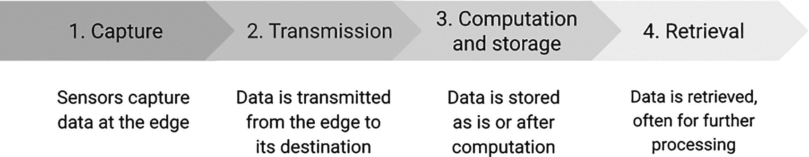
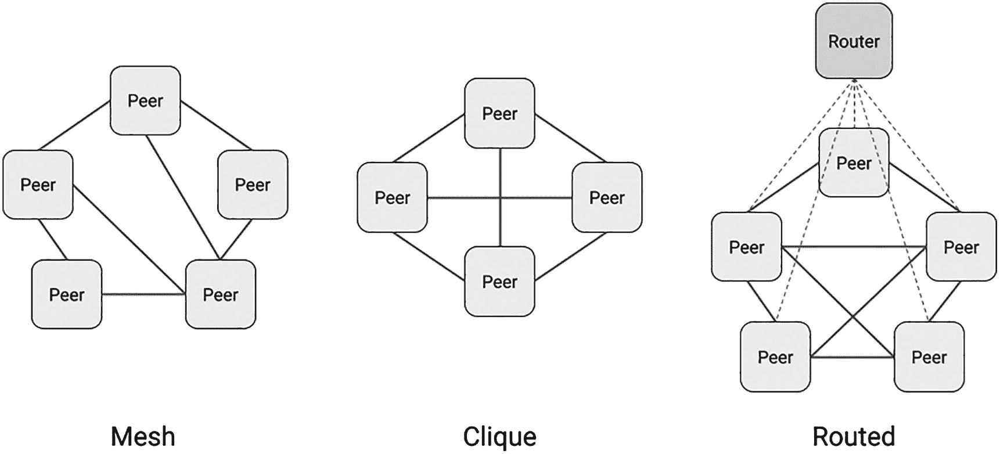
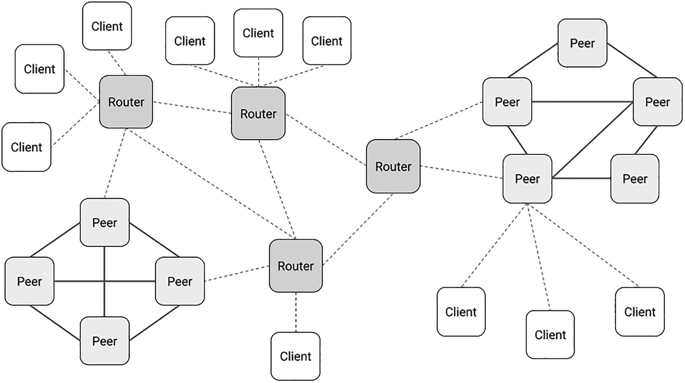
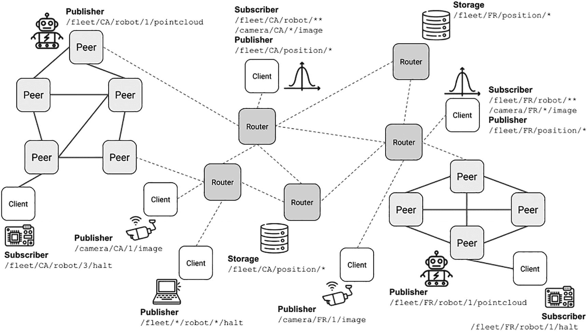
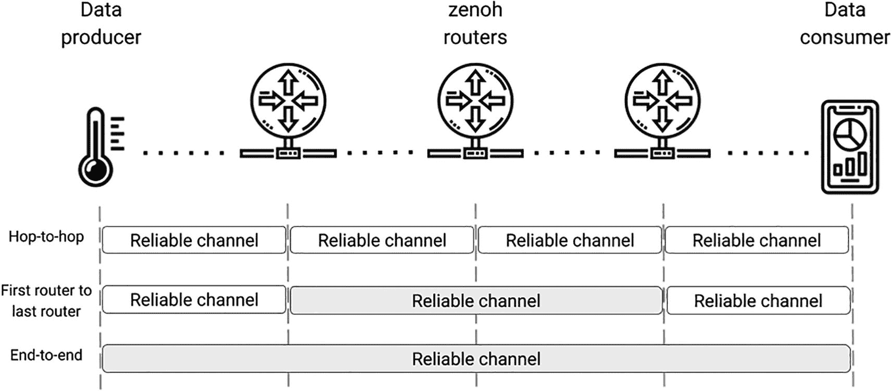
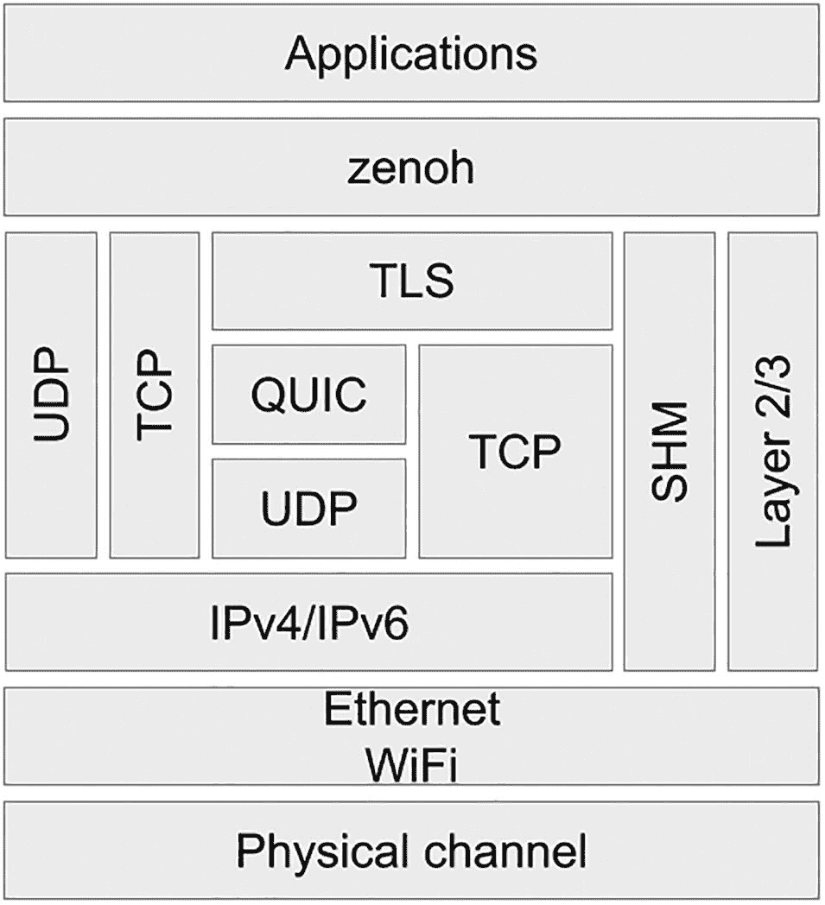

# 7. zenoh

> *On aimerait tant pouvoir inventer le dragon qui fera de nous des princes charmants.*

> *我们多么希望能发明那条让我们变成迷人王子的龙。*
> 
> —贝尔纳·阿尔康，《新陈词滥调》

这种事连我们中最优秀的人也难免遇到。我打开一份旧文档；浏览几个月或几年前写的代码。起初，只有一种模糊的不安感。然后，开始挠头。最后，喃喃自语甚至大喊：“我当时在想什么？”时间的流逝常常对我们曾经的创作毫不留情。这大概就是为什么我在整个职业生涯中做了如此多的重构和重写。

DDS 无疑是灵活且强大的。然而，它也很复杂，学习曲线陡峭。弄清楚如何匹配 QoS 策略可能是一项挑战。此外，通过公共互联网路由 DDS 流量可能很困难。归根结底，该协议并非为解决受限设备的问题而设计。自动发现功能很棒，但在 DDS 的情况下，它会产生大量网络流量，显著缩短现场部署设备的电池寿命。DDS 于 2003 年首次标准化，其时代烙印显而易见。

Eclipse zenoh 协议通过发布/订阅模型为动态数据提供位置透明的原语，并通过支持地理分布式存储为静态数据提供支持。它被有意设计为从微控制器扩展到云端。从某种程度上说，zenoh 吸收了 DDS 的最佳理念，加入了自己的创新，并去除了复杂性，从而交付了一个从头开始为物联网和边缘计算用例构建的协议。

与本书涵盖的其他协议相比，zenoh 没有正式规范文档。项目团队用 Rust 实现了核心库，由于该语言不允许悬空指针或空指针，这使得协议在内存管理方面更加安全。核心 zenoh 实现伴随着越来越多的语言绑定，其中 C 和 Python 绑定最为成熟。项目网站提供了 [API 的完整文档](https://zenoh.io/docs/apis/apis/)。^(²⁶)

## zenoh 基础

关于 zenoh，最重要的一点是它的范围比大多数其他物联网协议更广。这在考虑数据生命周期时变得显而易见，如图 7-1 所示。如果你想到另一种流行的发布/订阅协议 MQTT，你会注意到它严格专注于传输——即图中的步骤 2。即使它为离线订阅者存储数据，MQTT 代理也总是以临时方式进行。Zenoh 则不同：它还支持静态数据和计算——即图中的步骤 3 和 4。



一幅插图展示了四个阶段。1. 采集。2. 传输。3. 计算与存储。4. 检索。

图 7-1

数据的生命周期

除了普通的订阅之外，在 zenoh 中还有两种检索和计算数据的方式。一种是分布式查询，其中 zenoh 基础设施中的各个节点将提供部分结果集。另一种是分布式计算值，其中触发一个或多个计算函数来返回结果。

数据检索意味着数据存储。Zenoh 通过一个专门的插件来支持这一点，我将在后面介绍。目前，我只想说 zenoh 使您能够在基础设施中的任何位置定义存储单元。这些存储单元可以驻留在数据库（关系型和非关系型）、内存或节点的文件系统中。


### 核心抽象概念

键/值范式是 zenoh 的核心。现在我将解释其实现方式，并描述一些相关的抽象概念。

Zenoh 的*键*构建方式类似于类 Unix 操作系统上的文件系统路径，可与 MQTT 主题相类比。它们是层级结构的字符串，层级之间由正斜杠字符（“`/`”）分隔。以下是几个 zenoh 键的示例：

```
/museums/Louvre/floors/1/rooms/101/sensors/temperature
/museums/Louvre/floors/2/rooms/202/sensors/humidity
```

上述键指向特定的*资源*；在 zenoh 术语中，它们也被称为*命名数据*项。可以构建涉及一组键的表达式。这种*键表达式*可以包含通配符。单个星号（“`*`”）是单级通配符，而双星号（“`**`”）是多级通配符。例如，以下键表达式可用于订阅 101 房间的所有传感器：

```
/museums/Louvre/floors/1/rooms/101/sensors/*
```

另一个表达式可以返回所有温度传感器的数据，无论其位置如何：

```
/museums/Louvre/**/temperature
```

您将在以下场景中使用键表达式：

*   订阅数据
*   创建存储实例
*   注册分布式计算（eval）

zenoh 还拥有*选择器*。这些是标识一组资源的键表达式。zenoh 文档描述了选择器的结构，如下所示：

```
/s1/s2/.../sn?x>1&y<2&...&z=4(p1=v1;p2=v2;...;pn=vn)[#a;b;x;y;...;z]
|           | |             | |                   |  |            |
|-- expr ---| |--- filter --| |---- properties ---|  |--fragment -|
```

现在让我们看看选择器结构的每个组成部分。请记住，路径表达式之后的每个部分都是可选的。

*   **expr（表达式）：** 一个标准的 zenoh 键表达式。
*   **filter（过滤器）：** 由与号（“`&`”）分隔的谓词列表。过滤器将应用于匹配路径表达式的值。每个谓词的形式为“字段-运算符-字段值”。支持的运算符有 `<`、`>`、`<=`、`>=`、`=` 和 `!=`。
*   **properties（属性）：** 一个字符串，表示由分号分隔的键/值对。
*   **fragment（片段）：** 一个字段名称列表，允许返回每个值的子集。仅当使用诸如 JSON 或 XML 等自描述编码时，此功能才有效。

在撰写本文时，zenoh 团队已记录但尚未实现过滤器和片段。在实际应用中，选择器可能如下所示：

```
/museums/**/sensors/temperature?celcius>23.5
```

您将使用选择器来运行分布式查询。

分布式查询的结果可以包含从存储实例获取的值，或由计算（eval）产生的值，前提是创建它们时使用的键路径与所使用的选择器匹配。因此，在 zenoh 文档中，存储和 eval 有时被描述为*可查询对象*。

与 MQTT 类似，zenoh 值作为字节流传输。值不像 DDS 中的样本那样具有强类型。然而，zenoh 值包含一个字段，用于指定用作 MIME 类型的编码。可以使用任何编码，但 zenoh 为某些编码提供了额外支持，这些编码可以由 zenoh 库本身进行序列化和反序列化。受益于此额外支持的编码包括：

*   **application/octet-stream：** 该值是一个字节流。
*   **text/plain; charset=utf-8：** 该值是一个 UTF-8 字符串。
*   **application/json：** 该值是一个 JSON 字符串。
*   **application/properties：** 该值是一个字符串，表示由分号分隔的键/值对列表（例如，“id=002;squad=13...”）。
*   **application/integer：** 该值是一个整数。
*   **application/float：** 该值是一个浮点数。

所有 zenoh 值都会由接收它的第一个路由器打上时间戳。该时间戳由[混合逻辑时钟](https://zenoh.io/docs/apis/rust)^(²⁷)生成。它是一个 64 位的值，结构类似于 NTP 时间戳，尽管它基于 UTC 时间 1970 年 1 月 1 日的 UNIX 纪元。它还包含路由器的 UUID。鉴于生成它们所使用的方法，zenoh 时间戳是唯一的。换句话说，zenoh 系统中存在的每个值都拥有一个唯一的时间戳。这意味着您可以使用时间戳在系统中的任何位置对值进行排序，而无需利用共识算法。

在无路由器拓扑中，对等节点可以自行生成时间戳。在这种情况下，它们将使用自己的混合逻辑时钟。要激活此行为，您只需在节点的 JSON5 配置文件中添加以下设置：

```
add_timestamp:true
```

### 基本操作

zenoh API 很简单。数据操作只涉及少数几个操作。主要操作如下：

*   **get：** 执行分布式查询。
*   **pull：** 为订阅拉取数据。此机制对于实现*拉取订阅者*非常有用，即那些仅部分时间处于唤醒或连接状态的订阅者。
*   **put：** 为键表达式发布一个值。
*   **subscribe：** 声明一个订阅者。您需要传递一个回调函数的引用，该函数在接收到数据时被触发。

还有一些操作不专注于数据本身。其中最常用的操作如下：

*   **close：** 关闭一个 zenoh 会话。
*   **open：** 打开一个 zenoh 会话。
*   **queryable：** 声明一个分布式计算，当发起查询时该计算将被触发。您需要传递一个回调函数的引用。
*   **scout：** 在本地网络上搜索 zenoh 节点。返回的节点类型（客户端、对等节点、路由器）通过一个位掩码指定。

请记住，操作的实际名称可能因您使用的特定 zenoh 语言绑定而异。


## 部署单元

在部署 zenoh 基础设施时，您可以根据需求混合搭配不同的拓扑结构。这种灵活性得益于 zenoh 节点类型的特定功能。

zenoh 中有三种类型的节点。具体如下：

*   **客户端：** 仅连接到一个对等节点或路由器的节点。在 zenoh 中，客户端通常是运行 [zenoh-pico](https://github.com/eclipse-zenoh/zenoh-pico)（一种轻量级协议版本）的、资源极度受限的设备。Zenoh-pico 可以以客户端或点对点模式连接，但不能参与网状拓扑。

*   **对等节点：** 支持点对点通信的节点。Zenoh 对等节点可以代表其他对等节点路由数据。此外，zenoh 客户端可以连接到一个对等节点，以便与系统的其余部分进行通信。

*   **路由器：** 能够独立于拓扑结构，在客户端和对等节点之间路由 zenoh 流量的节点。路由器在多站点部署中尤其有用，因为它们可以通过公共互联网进行连接，而无需复杂的网络设置。Zenoh 路由器还通过插件提供特定功能，例如分布式存储实例。我将在下一节中描述路由器插件。

图 7-2 展示了 zenoh 对等节点和路由器节点可以共同部署的几种方式。支持网状拓扑，即对等节点直接且非层次化地连接到多个其他节点。团簇（Clique）是一种特殊的网状结构，其中所有节点形成一个完全图，换句话说，就是每个节点都与其他所有节点直接相连。最后，对等节点可以连接到一个或多个路由器。



三种拓扑结构。1. 网状，连接了 5 个对等节点。2. 团簇，连接了 4 个对等节点。3. 路由式，5 个对等节点连接到一个路由器。

图 7-2

几种 zenoh 拓扑结构

Zenoh 客户端节点可以连接到对等节点或路由器。Zenoh 对等节点可以连接到其他对等节点、路由器，或两者都连接。这使您可以安排节点以满足您的非功能性需求。例如，在特定位置部署一个对等节点网状结构可以消除基础设施中单点故障的威胁。类似地，在不同的网络连接上部署冗余路由器可以使多站点通信更具弹性，同时实现更好的系统扩展。图 7-3 展示了利用这三种节点类型的各种潜在拓扑结构。



一个网络由 4 个路由器组成。第一个路由器连接了 3 个客户端和 1 个对等节点。第二个路由器连接了 3 个客户端。第三个路由器连接了 2 个对等节点。第四个路由器连接了 1 个客户端和 1 个对等节点。

图 7-3

示例 zenoh 部署

关于 zenoh 客户端和对等节点，一个重要细节是它们的类型并不限制它们所支持的操作。它们可以根据您的需求进行发布、订阅，或两者兼有。

### 设备发现

与 DDS 类似，zenoh 实现了强大的自动发现机制。然而，为了保持协议的高效性，其创建者特意努力将发现流量降至最低。当然，第一步是优化发现消息的大小。但他们并未止步于此。Zenoh 仅通告资源兴趣，而非特定的发布者。此外，此类资源兴趣由协议本身进行泛化；这意味着，如果一个设备为诸如 `/T800/sensors/lidar`、`/T800/sensors/camera` 和 `/T800/position/latitude` 等值发布数据，zenoh 可能会决定将该设备通告为 `/T800/**`。最后，zenoh 的可靠性特性是在节点（或运行时）级别运行的，而不是像 DDS 那样在单个读取器或写入器级别运行。

总的来说，zenoh 中资源兴趣的泛化简化了发现过程，并使该协议能够支持互联网规模的应用。所有路由和匹配都利用集合论操作和集合覆盖。例如，这对于找出能够回答特定查询的最小存储集非常有用。Zenoh 会自动执行资源泛化，但您可以根据需要使用 API 向基础设施提供提示。

### 示例：工厂中的机器人

现在，让我们说明一个真实的 zenoh 部署会是什么样子。假设您的组织管理着大西洋两岸的几家工厂。一些在加拿大，另一些在法国。这些工厂配备了视频监控系统，并有自主机器人在内部工作。几个路由器节点构成了该系统的骨干。图 7-4 提供了该系统的简化视图。



一个网络描绘了 zenoh 部署。它由七个发布者、四个订阅者、两个存储、九个对等节点、五个路由器和七个客户端组成。

图 7-4

两个 zenoh 机器人车队的故事^(²⁸)

系统设计者决定使用 `/fleet` 作为所有机器人相关键的前缀，使用 `/camera` 作为所有视频监控摄像头的前缀。键结构的第二层表示部署国家，使用 `CA` 表示加拿大，`FR` 表示法国。在该系统中，机器人被定义为对等节点。机器人之间不一定相互连接。

机器人通过向名为 `pointcloud` 的子键发布信息来不断更新其位置。键的某一层还包含机器人的数字 ID，该 ID 在整个车队范围内是唯一的。以下是该发布内容的完整键的两个示例：

```
/fleet/CA/robot/1867/pointcloud
/fleet/FR/robot/1789/pointcloud
```

每个机器人包含两台不同的计算机：一台是承载应用程序的通用单板计算机，另一台是充当机器人控制模块的专用板卡。控制模块是可编程的，并配备了大量的 I/O 接口，使其能够接收原始传感器数据并控制机器人的执行器。在此示例中，`pointcloud` 值由运行在单板计算机上的应用程序计算并发布。另一方面，控制模块订阅由中央远程控制应用程序发送到诸如以下键的命令：

```
/fleet/CA/robot/1867/halt
/fleet/FR/robot/1789/halt
```

例如，这个远程控制应用程序可以通过向选择器发布适当的值来阻止*审判日*，从而立即停止所有机器人：

```
/fleet/*/robot/*/halt
```

两个客户端，一个在加拿大，另一个在法国，订阅机器人及摄像头发布的所有内容。具体来说，它们订阅以下选择器：

```
/fleet//robot/**
/camera//*/image
```

这些分析客户端连接到本地路由器；它们聚合机器人的位置信息，并将其发布到 `/fleet/<国家代码>/position/*` 下。两个存储使用相同的键路径作为其选择器。因此，针对 `/fleet/*/position/*` 的查询将合并来自这两个存储的数据，这两个存储连接到与分析客户端不同的路由器。


## 插件

Zenoh 路由器节点可以通过插件向其他节点提供功能，这些插件是路由器在启动时加载的库，或者由管理员在运行时通过 REST API 加载。它们与路由器共享运行时，允许它们使用与路由器进程自身相同的对等 ID 来调用 zenoh Rust API。

在撰写本文时，zenoh 团队维护了两个提供基础设施核心功能的插件。这两个插件如下：

*   **REST 插件：** 该插件实现了 [zenoh 的 REST API](https://zenoh.io/docs/apis/rest/)，^(²⁹) 你可以使用它来操作基础设施或与 zenoh 系统交互以操作数据。稍后我将演示如何使用它。

*   **存储插件：** 该插件管理分布式存储实例。该插件支持多种存储*后端*，涵盖了多种数据管理方法。

这两个插件随标准 zenoh 发行版一起提供。zenoh 团队还维护了另外两个托管在独立仓库中的插件。你可以根据需要将它们添加到你的基础设施中。这两个插件如下：

*   **DDS 插件：** 在广域网或多个局域网之间扩展 DDS 流量非常复杂。这是由于 DDSI-RTPS 的核心设计及其对 UDP/IP 多播数据包的依赖。另一方面，DDS 最近在 ROS 2 生态系统中得到了广泛采用。[zenoh DDS 插件](https://github.com/eclipse-zenoh/zenoh-plugin-dds)^(³⁰) 旨在封装 DDS 流量，以简化远程机器人集群的集成。该插件透明地将 DDS 发布和订阅映射到 zenoh 资源。[这篇博客文章](https://zenoh.io/blog/2021-04-28-ros2-integration/)^(³¹) 详细解释了如何利用该插件。

*   **Web 服务器插件：** 该插件提供了一个 HTTP 服务器，将 URL 映射到 zenoh 键。这使得可以提供从分布式 zenoh 存储实例中检索到的文件。典型的部署利用文件系统存储后端来提供静态文件。但是，该插件也可以与利用任何受支持存储后端的存储一起工作。

### 存储插件深度解析

鉴于分布式存储在 zenoh 中的重要性，我现在将更详细地介绍存储插件。

该插件实现的核心概念是*存储*和*后端*。存储实例只是在特定后端上存储键/值对，你需要在创建时为它们分配一个选择器。后端是 zenoh 支持的一种存储技术。后端抽象了实际使用的存储技术的细节。在撰写本文时，zenoh 团队正在积极维护以下后端：

*   **文件系统：** 值存储在主机文件系统的特定文件夹中。每个值都是一个单独的文件，使用与传输时相同的编码写入。键反映在每个文件的路径中。有关更多详细信息，请参阅[后端仓库](https://github.com/eclipse-zenoh/zenoh-backend-filesystem)^(³²)。

*   **InfluxDB：** InfluxDB 是一个时间序列数据库。每个存储实例对应一个数据库。可以连接到现有数据库或创建一个新数据库。后端将为每个键创建 InfluxDB 测量值。值作为 InfluxDB 数据点记录在这些测量值上。有关更多详细信息，请参阅[后端仓库](https://github.com/eclipse-zenoh/zenoh-backend-influxdb)^(³³)。

*   **内存：** 键和值存储在内存中的哈希映射中。该后端的实现是存储插件本身的一部分。

*   **RocksDB：** RocksDB 是一个可嵌入的键/值存储。该存储位于一个文件中。每个存储对应一个特定的数据库文件。Zenoh 键和值直接使用，无需映射。有关更多详细信息，请参阅[后端仓库](https://github.com/eclipse-zenoh/zenoh-backend-rocksdb)^(³⁴)。

Zenoh 后端被打包为库，由存储插件加载。没有标准的配置方法，因为底层技术差异太大。后端和存储可以通过路由器启动时加载的 JSON5 配置文件或 zenoh REST API 创建。

提供的每个后端都具有特定的性能和持久性特征。内存后端不提供长期持久性，但可以用作基础设施中的快速缓存。文件系统后端易于部署，但从性能角度来看，无法像数据库那样扩展。如果你构建的系统需要历史数据库来支持数据分析（正如许多 SCADA 用例所做的那样），那么使用 InfluxDB 后端是合理的。最后，RocksDB 后端提供了一个可扩展的数据库引擎，如果你需要对数据执行大量随机访问查询，它将提供最佳性能。

zenoh 团队还计划在未来引入一个支持 SQL 数据库的后端。这样的后端将提供与典型 IT 基础设施更好的集成。


## 可靠性与拥塞控制

要理解 zenoh 如何实现其可靠性与拥塞控制功能，首先需要更深入地了解 zenoh 的内部机制。zenoh 协议由两个不同的层组成：

*   **会话协议：** 会话协议管理节点（运行时）之间的一对一双向会话。无论涉及的是客户端、对等节点还是路由器，这些会话都是相同的。你可以将这些会话配置为尽力而为或可靠传输。

*   **路由协议：** 路由协议传播兴趣并将数据从生产者路由到消费者。它利用了会话协议。

鉴于 zenoh 会话的工作方式，默认的可靠性策略被称为*逐跳*，因为交付保证仅存在于两个特定节点之间。这在大多数情况下已经足够，因为基础设施在部署后应该是稳定的。然而，如果节点发生故障，则可能出现数据丢失。流量将被重新路由，但无法保证故障发生时所有在途数据都能被送达。

逐跳策略具有高度可扩展性，但对于某些关键任务应用来说还不够。因此，zenoh 提供了两种可通过 API 配置的替代策略。第一种是*首路由器到尾路由器*，它依赖于每条路由上首尾路由器之间的可靠通道。第二种称为*端到端*，其可扩展性差得多，并且消耗更多资源。这是因为 zenoh 会在基础设施中的*每一对发布者和订阅者之间创建可靠通道*。图 7-5 比较了 zenoh 中可用的三种可靠性策略。



一幅插图展示了数据生产者、Zenoh 路由器和数据消费者的逐跳、首路由器到尾路由器以及端到端可靠通道。

图 7-5

Zenoh 可靠性策略

除了提供的可靠性策略之外，zenoh 还将消息重发、内存使用（缓冲）和消息丢弃的控制分离开来。订阅者通过选择重发策略来控制可靠性。他们声明是否需要发布者重发丢失的消息。另一方面，发布者和路由器各自决定分配多少内存来支持可靠性。这使得资源受限的设备可以分配更少的资源，而路由器则会分配更多资源以缓解拥塞问题。最后，发布者通过选择消息丢弃策略来控制检测到拥塞时的行为。在 zenoh 中，计划进行可靠传输的消息会被排队。当发生拥塞时，专用于该队列的内存会被耗尽。发布者需要指定基础设施是丢弃无法排队的消息，还是阻塞发布操作。消息丢弃策略从发布者传播到所有相关的路由器，并应用于整个路由路径。

## zenoh-flow

zenoh 协议是构建各种分布式系统（不仅仅是物联网相关系统）的绝佳基础。一个很好的证明是 [zenoh-flow 数据流编程框架](https://github.com/eclipse-zenoh/zenoh-flow)，它使开发者能够部署从云端到资源受限设备的计算任务。

数据流编程将程序表示为并发执行的连接节点图。使用数据流编程语言时，开发者专注于节点及其互连关系，这表达了应用程序的逻辑。此类语言共享函数式语言的一些特性。常用于设计处理器内核和其他电子系统的 SystemVerilog 和 VHDL 硬件描述语言，就是数据流编程语言的例子。

在 zenoh-flow 中，一个数据流由三种不同类型的节点组成。这三种节点类型如下：

*   **算子：** 此节点实现计算。它还定义了决定触发节点条件的输入规则，以及确定哪些输出值将传递给图中后续算子的输出规则。

*   **汇点：** 此节点消费数据流产生的数据。

*   **源点：** 此节点生成将通过数据流处理的数据。

这些节点在运行时动态加载。

要使用 zenoh-flow，你必须通过一个 YAML 文件来指定数据流图。你将使用标签来表达算子的位置亲和性和需求。图可以包含*循环*，支持迭代处理和控制机制。它们还可以包含*截止时间*（超时值），使你能够利用时间感知计算并实现适当的容错。图也是*可组合的*；换句话说，它们可以通过引用包含其他图。这使得它们可重用且可扩展。当你部署数据流图时，zenoh-flow 将通过 zenoh 链接远程算子，自动处理软件组件的分发。在运行时，源点、算子和汇点利用 zenoh 协议以位置透明的方式进行通信。它们可以以多种方式部署以支持特定需求。

zenoh 团队维护了一个专门的 [zenoh-flow 示例](https://github.com/atolab/zenoh-flow-examples)仓库。你可以浏览它以学习如何定义算子、源点和汇点；它还包含 YAML 格式的数据流图示例。在撰写本文时，zenoh-flow 仍处于 alpha 阶段，这就是为什么我没有在此处重现具体示例的原因。

## zenoh 协议栈

当前物联网协议的一个趋势是支持更广泛的网络传输。例如，MQTT 可以通过 MQTT-SN 在 UDP 上运行。鉴于此，作为一项较新的技术，zenoh 开箱即用地支持多种传输方式也就不足为奇了。图 7-6 展示了 zenoh 协议栈。



一个架构由以下层组成：应用程序、zenoh、UDP、TCP、TLS、QUIC、SHM、第 2 层或第 3 层、IPv4 或 IPv6、以太网 Wi-Fi 以及物理通道。

图 7-6

zenoh 协议栈

zenoh 的不同之处在于它可以直接在 OSI 第 2 层数据链路上运行，而无需中间传输层。当然，zenoh 也可以在 IP 之上支持 TCP 和 UDP。如果你选择 TCP，可以使用 TLS 进行加密通信。此外，如果你使用依赖于 UDP 的 QUIC 协议，也可以使用 TLS。最后，zenoh 还可以利用共享内存和 UNIX 套接字传输。

注意

QUIC（发音为“quick”）是 Google 的 Jim Roskind 创建的一种通用传输层网络协议。QUIC 利用两个端点之间的多路复用 UDP 连接。QUIC 现已成为 IETF 的拟议标准，并在 [RFC 9000](https://www.rfc-editor.org/rfc/rfc9000.txt) 中进行了记录。

zenoh 文档包含关于[设置 TLS](https://zenoh.io/docs/manual/tls/) 以用于 TCP 的详细说明。如果你选择使用 QUIC，则适用相同的配置。

## 使用 Eclipse zenoh 进行编码

zenoh 核心库是用 Rust 实现的。因此，该团队为该语言支持的主要平台（Linux、macOS 和 Windows）发布二进制文件。在撰写本文时，C 和 Python 语言绑定在目标语言和 Rust 都受支持的所有平台上都受支持。本节将重点介绍 Python 代码示例。

zenoh 的官方网络资源如下：

*   **网站：** [`https://zenoh.io`](https://zenoh.io)

*   **Eclipse 项目页面：** [`https://projects.eclipse.org/projects/iot.zenoh`](https://projects.eclipse.org/projects/iot.zenoh)

*   **代码仓库：** [`https://github.com/eclipse-zenoh/zenoh`](https://github.com/eclipse-zenoh/zenoh)


### 安装

开发 zenoh 应用的第一步是安装 Rust 本身。虽然核心库有二进制文件可用，但你仍需要 Rust 编译器来设置语言绑定。

鉴于 zenoh 团队依赖 Cargo 包管理器，在 Linux 和 macOS 上搭建 Rust 环境最简单的方式是使用 `rustup` 脚本。你可以通过运行以下命令来完成：

```
curl https://sh.rustup.rs -sSf | sh
```

`rustup` 也有 Windows 版本可用；请查阅 [Cargo 的文档](https://doc.rust-lang.org/cargo/getting-started/installation.html) 获取最新说明。

#### 核心库

zenoh 核心库可通过 Homebrew 包管理器在 macOS 上获取。要安装最新版本，请执行以下命令：

```
brew tap eclipse-zenoh/homebrew-zenoh
brew install zenoh
```

在 Linux 上，zenoh 团队维护着一个私有仓库，其中包含 DEB 格式的包。你可以用它来在 Debian 及其众多衍生版上安装 zenoh。使用以下命令将该仓库添加到你的源列表中：

```
echo "deb [trusted=yes] https://download.eclipse.org/zenoh/debian-repo/ /" | sudo tee -a /etc/apt/sources.list > /dev/null
sudo apt update
```

然后，你可以使用 apt 来安装 zenoh：

```
sudo apt install zenoh
```

你可以从 Eclipse 基金会的下载网站下载核心库的 Windows 二进制文件。URL 为：

```
https://download.eclipse.org/zenoh/zenoh/latest/
```

文件名将遵循以下模式：

```
x86_64-pc-windows-msvc/zenoh--x86_64-pc-windows-msvc.zip
```

从源码构建也是可行的。

#### C 绑定

在撰写本文时，安装 C 绑定的唯一方法是从源码构建。要开始，你需要通过执行以下命令来克隆仓库：

```
git clone https://github.com/eclipse-zenoh/zenoh-c.git
```

由于 Rust 已经安装，我们可以立即构建代码。在 Linux 和 macOS 上，执行以下命令：

```
cd zenoh-c
make
make install # 在 Linux 上需在命令前加 sudo
```

你也可以执行以下命令来构建示例：

```
make examples
```

#### Python 绑定

安装 Python 绑定有两种方法：通过 `pip` 或从源码安装。该绑定已在 Python 3.6、3.7、3.8 和 3.9 上测试通过。

要使用 `pip` 安装，你的包管理器版本至少需要为 19.3.1。如果你的环境满足此要求，那么你只需执行以下命令：

```
pip install eclipse-zenoh
```

我建议你利用某种虚拟环境。

要从源码安装，你需要克隆仓库：

```
git clone https://github.com/eclipse-zenoh/zenoh-python.git
```

完成后，通过运行以下命令安装所需的依赖项：

```
cd zenoh-python
pip install -r requirements-dev.txt
```

然后你可以执行以下命令来构建并安装绑定：

```
python setup.py develop
```

#### 测试你的环境

zenoh 核心库以及 zenoh 团队提供的语言绑定都包含一套全面的示例程序。这些程序展示了 API 中最常用的函数，并且在不同实现之间保持一致。现在我将向你展示如何使用 Python 示例来测试你的环境。

与 DDS 一样，zenoh 支持点对点通信。因此，执行测试最简单的方法是启动一个订阅者和一个发布者。

要启动订阅者，打开一个命令行并导航到你克隆 Python 绑定 GIT 仓库的文件夹。示例可以在仓库的 `examples` 子文件夹中找到。然后，通过执行以下命令启动发布者：

```
python z_sub.py
```

你应该会看到如下输出：

```
Openning session...
Creating Subscriber on '/demo/example/**'...
Enter 'q' to quit...
```

然后，打开另一个命令提示符，进入相应的文件夹，并执行以下命令：

```
python z_pub.py
```

如果一切顺利，你应该会看到类似如下的输出：

```
Openning session...
Declaring key expression '/demo/example/zenoh-python-pub'... => RId 1
Declaring publication on '1'...
Putting Data ('1': '[   0] Pub from Python!')...
Putting Data ('1': '[   1] Pub from Python!')...
Putting Data ('1': '[   2] Pub from Python!')...
```

并且在订阅者一侧应该会有新的输出，显示它接收到了这些发布内容：

```
>> [Subscriber] Received PUT ('/demo/example/zenoh-python-pub': '[   0] Pub from Python!')
>> [Subscriber] Received PUT ('/demo/example/zenoh-python-pub': '[   1] Pub from Python!')
>> [Subscriber] Received PUT ('/demo/example/zenoh-python-pub': '[   2] Pub from Python!')
```

Zenoh 对自动发现的支持使得发布者和订阅者无需任何配置即可通信。当然，这假设网络不会阻塞流量；如果你在不同机器上部署节点，可能需要根据你将使用的受支持传输方式来调整防火墙设置。


#### 测试 Zenoh 路由器

大多数 Zenoh 部署至少需要几个路由器。因此，即使在开发机器上运行路由器实例也是很有用的。

如果你从仓库安装了 Zenoh 二进制文件，路由器可执行文件应该已经在你的路径中。如果你从源代码编译了 Zenoh 核心库，可执行文件位于仓库克隆的 `target/release` 子文件夹中。要启动一个配置了内存存储实例的路由器，只需执行以下命令：

```
./zenohd --cfg='plugins/storages/backends/memory/storages/demo/key_expr:"/demo/example/**"'
```

默认情况下，路由器不会产生任何控制台输出。要验证其是否正常工作，你可以调用 REST API。假设已安装 `jq` 工具，请执行以下命令：

```
curl http://localhost:8000/@/router/local |jq
```

你应该会得到类似这样的输出：

```
[
{
"key": "/@/router/AFF09D2102A34B96A4DF00DEF13A0F5F",
"value": {
"locators": [
"tcp/172.19.19.252:7447"
],
"pid": "AFF09D2102A34B96A4DF00DEF13A0F5F",
"plugins": [
{
"name": "rest",
"path": "/home/fdesbiens/zenoh/target/release/libzplugin_rest.so"
},
{
"name": "storages",
"path": "/home/fdesbiens/zenoh/target/release/libzplugin_storages.so"
}
],
"sessions": [],
"version": "v0.6.0-dev-160-ga2f190f1 built with rustc 1.59.0 (9d1b2106e 2022-02-23)"
},
"encoding": "application/json",
"time": "None"
}
]
```

你可以在前面的 JSON 中看到，存储插件已被加载，因为我在启动时定义了一个内存存储实例。默认情况下，路由器只加载 HTTP 插件。然而，`memory` 后端内置于存储插件中，不需要加载外部库即可工作。

你可以使用以下命令列出 Zenoh 路由器上存在的后端：

```
curl 'http://localhost:8000/@/router/local/**/backends/*' |jq
```

使用我启动路由器时的配置，你应该会得到类似这样的输出：

```
[
{
"key": "/@/router/AFF09D2102A34B96A4DF00DEF13A0F5F/status/plugins/storages/backends/memory",
"value": {},
"encoding": "application/json",
"time": "None"
}
]
```

你也可以使用 REST API 列出路由器上定义的存储。这是相应的请求：

```
curl 'http://localhost:8000/@/router/local/**/storages/*' |jq
```

输出应该类似这样：

```
[
{
"key": "/@/router/AFF09D2102A34B96A4DF00DEF13A0F5F/status/plugins/storages/backends/memory/storages/demo",
"value": {
"key_expr": "/demo/example/**"
},
"encoding": "application/json",
"time": "None"
},
{
"key": "/@/router/AFF09D2102A34B96A4DF00DEF13A0F5F/status/plugins/storages/__path__",
"value": "/home/fdesbiens/zenoh/target/release/libzplugin_storages.so",
"encoding": "application/json",
"time": "None"
},
{
"key": "/@/router/AFF09D2102A34B96A4DF00DEF13A0F5F/status/plugins/storages/version",
"value": "v0.6.0-dev-160-ga2f190f1",
"encoding": "application/json",
"time": "None"
}
]
```

你需要配置路由器以利用其他存储后端。Zenoh 仓库包含一个[示例配置文件](https://github.com/eclipse-zenoh/zenoh/blob/master/EXAMPLE_CONFIG.json5)，你可以从中获取灵感。[文件系统](https://github.com/eclipse-zenoh/zenoh-backend-filesystem%2523examples-of-usage)、[InfluxDB](https://github.com/eclipse-zenoh/zenoh-backend-influxdb%2523examples-of-usage) 和 [RocksDB](https://github.com/eclipse-zenoh/zenoh-backend-rocksdb%2523examples-of-usage) 后端仓库也提供了配置信息。如果路由器的运行时能够加载相应的库，也可以使用 REST API 来定义此类存储实例。

注意

Zenoh 路由器也可以作为容器使用。只需运行以下命令即可部署：`docker run --init -p 7447:7447/tcp -p 8000:8000/tcp eclipse/zenoh`。请注意，由于 Docker 不支持容器与主机之间的 UDP 多播，你可能需要调整配置。[Zenoh 文档](https://zenoh.io/docs/getting-started/quick-test/)提供了相关细节。

Zenoh REST API 可用于发布值并向基础设施发出查询。它在实际应用中很有用，也适用于测试和故障排除。例如，假设各个节点在 `/demo/wisdom/*` 键下发布智慧格言，并且已创建一个存储实例来保存它们。如下所示，向相应的端点发送 PUT 请求以发布一个值。在本例中，该值是一个发布到 `/demo/wisdom/rome` 键的 UTF-8 字符串。

```
curl -X PUT -d 'Qui acceperint gladium, gladio peribunt.' http://localhost:8000/demo/wisdom/rome
```

相反，以下 HTTP GET 请求将返回所有可用的值：

```
curl http://localhost:8000/demo/wisdom/**
```

以下是示例结果：

```
[
{ "key": "/demo/wisdom/rome", "value": Qui acceperint gladium, gladio peribunt., "encoding": "application/x-www-form-urlencoded", "time": "2022-03-03T15:13:27.872392699Z/940FD467605F4D38934F3419A2C12E6F" }
]
```

现在我们有了一个可用的环境，是时候编写一些代码了！我们将探索 Python 语言绑定中捆绑的几个示例。

### 侦察

Zenoh 中的 `scout` 原语操作使节点能够确定本地网络上哪些其他节点可用。[展示它的示例程序](https://github.com/eclipse-zenoh/zenoh-python/blob/master/examples/z_scout.py)的简洁性证明了协议中自动发现机制的能力。我复现了该程序：

```
import sys
import time
import argparse
import zenoh
from zenoh import WhatAmI
# initiate logging
zenoh.init_logger()
print("Scouting...")
hellos = zenoh.scout(WhatAmI.Peer | WhatAmI.Router, 1.0)
for hello in hellos:
print(hello)
```

在本例中，程序只查找对等体和路由器。第三个参数指定侦察操作的持续时间（以秒为单位）；调整此持续时间有助于缓解延迟或捕获重新上线的休眠节点。

以下是我机器上该程序的输出。当时，我只运行了一个路由器和一个订阅者。

```
Scouting...
Hello { pid: Some(6806944733A149B3B0A65991E9B43EC4), whatami: "peer", locators: ["tcp/172.19.19.252:33293"] }
Hello { pid: Some(9863FA443A6749A89B4927D89EFF8716), whatami: "router", locators: ["tcp/172.19.19.252:7447"] }
```

### 订阅

在 Zenoh 上创建订阅几乎和侦察一样简单。[订阅示例程序](https://github.com/eclipse-zenoh/zenoh-python/blob/master/examples/z_sub.py)首先定义了一个名为 `listener` 的回调函数，该函数在每次接收到值时被调用。它所做的只是打印键和值，如下面列表顶部所示：

```
def listener(sample):
time = '(not specified)' if sample.source_info is None or sample.timestamp is None else datetime.fromtimestamp(
sample.timestamp.time)
print(">> [Subscriber] Received {} ('{}': '{}')"
.format(sample.kind, sample.key_expr, sample.payload.decode("utf-8"), time))
# initiate logging
zenoh.init_logger()
print("Openning session...")
session = zenoh.open(conf)
print("Creating Subscriber on '{}'...".format(key))
sub = session.subscribe(key, listener, reliability=Reliability.Reliable, mode=SubMode.Push)
print("Enter 'q' to quit...")
c = '\0'
while c != 'q':
c = sys.stdin.read(1)
if c == '':
time.sleep(1)
sub.close()
session.close()
```

建立订阅是一件简单的事情。你只需要打开一个 Zenoh 会话，并在结果对象上调用 `subscribe` 方法。在本例中，程序指定了可靠交付和推送订阅。


### 发布

使用 zenoh Python API 进行发布，只需调用会话实例的 `put` 方法即可。然而，通常更推荐在调用 `put` 之前先声明键表达式和发布。当你声明键表达式时，zenoh 会为其分配一个整数 ID，并在发布消息中使用该 ID。这可以节省带宽并提高吞吐量。此外，声明发布可以确保在没有匹配的订阅者在线时，节点不会发送消息，从而减少带宽使用。[发布示例程序](https://github.com/eclipse-zenoh/zenoh-python/blob/master/examples/z_pub.py)展示了如何利用键表达式和发布声明。我复现了其核心逻辑：

```
# initiate logging
zenoh.init_logger()
print("Openning session...")
session = zenoh.open(conf)
print("Declaring key expression '{}'...".format(key), end='')
rid = session.declare_expr(key)
print(" => RId {}".format(rid))
print("Declaring publication on '{}'...".format(rid))
session.declare_publication(rid)
for idx in itertools.count() if args.iter is None else range(args.iter):
time.sleep(1)
buf = "[{:4d}] {}".format(idx, value)
print("Putting Data ('{}': '{}')...".format(rid, buf))
session.put(rid, bytes(buf, encoding='utf8'))
session.undeclare_publication(rid)
session.undeclare_expr(rid)
session.close()
```

该程序通过调用会话对象的 `put` 基本方法，在循环中每秒发布一个值。该值存储在一个字符串变量中，并以 UTF-8 字节形式写入。

## 受限设备上的 zenoh

虽然 zenoh 作为物联网协议已经足够轻量，但在极度受限的设备上支持其全部功能集是不可能的。因此，zenoh 团队创建了 [zenoh-pico 库](https://github.com/eclipse-zenoh/zenoh-pico)，这是一个轻量级的 C 语言实现的 zenoh 客户端 API。Zenoh-pico 非常适合部署在运行实时操作系统的设备上。

### 安装

如果你运行 Linux，可以从 [Eclipse 基金会下载网站](https://download.eclipse.org/zenoh/zenoh-pico/)^(³⁵) 下载 DEB、RPM 和 tgz 格式的 zenoh-pico 二进制文件。也可以通过克隆仓库从源代码构建该库。在撰写本文时，zenoh-pico 尚不支持 Windows。在支持的平台上，你只需在相应文件夹中执行 `make` 和 `make install`（在 Linux 上为 `sudo make install`）即可。

### Zephyr 开发环境

为了在 Zephyr RTOS 上使用 zenoh-pico，zenoh 团队建议利用 [PlatformIO 平台](https://platformio.org/)。如果你已安装该平台，可以执行以下命令来创建项目结构：

```
mkdir -p /path/to/project_dir
$ cd /path/to/project_dir
$ platformio init -b reel_board
$ platformio run
```

当然，你应该将所选开发板的标识符作为 `-b` 开关的值传入。zenoh 团队已使用[以下硬件](https://github.com/eclipse-zenoh/zenoh-pico/tree/master/docs/zephyr)测试了 zenoh-pico：nRF52840（例如 Adafruit Feather nRF52840）、STM32 Nucleo-144（Nucleo-F767ZI MCU）和 Reel Board。其他开发板也可能正常工作，但你需要调整 zenoh 团队提供的配置文件。

现在我将向你展示如何在 Reel Board 上进行操作。安装 PlatformIO 并创建项目结构后，你需要执行以下命令：

```
cp /path/to/zenoh-pico/docs/zephyr/reel_board/CMakelists.txt /path/to/project_dir/zephyr/
$ cp /path/to/zenoh-pico/docs/zephyr/reel_board/prj.conf /path/to/project_dir/zephyr/
$ ln -s /path/to/zenoh-pico /path/to/project_dir/lib/zenoh-pico
```

完成后，你的 PlatformIO 项目在磁盘上应具有以下结构：

```
project_dir
├── include
├── src
│    └── main.c
├── zephyr
│    ├── prj.conf
│    └── CMakeLists.txt
└── platformio.ini
```

然后，你可以直接将代码添加到 `main.c` 文件中，或者根据需要，在 src 文件夹中创建其他文件。一旦应用程序准备就绪，只需执行以下两个命令即可部署：

```
platformio run
platformio run -t upload
```

当然，在本地环境中测试此类程序最简单的方法是运行一个 zenoh 路由器。

### 订阅

zenoh API 在不同实现中具有显著的一致性。以下是简化的 [zenoh-pico 声明订阅的代码](https://github.com/eclipse-zenoh/zenoh-pico/blob/master/examples/net/zn_sub.c)。为了保持代码片段简短，我删减了一些声明并移除了部分错误处理代码。

```
void data_handler(const zn_sample_t *sample, const void *arg)
{
(void)(arg); // Unused argument
printf(">> [Subscription listener] Received (%.*s, %.*s)\n",
(int)sample->key.len, sample->key.val,
(int)sample->value.len, sample->value.val);
}
...
int main(int argc, char **argv)
{
zn_session_t *s = zn_open(config);
znp_start_read_task(s);
znp_start_lease_task(s);
zn_subscriber_t *sub = zn_declare_subscriber(s, zn_rname(uri), zn_subinfo_default(), data_handler, NULL);
... // Some kind of loop here
zn_undeclare_subscriber(sub);
znp_stop_read_task(s);
znp_stop_lease_task(s);
zn_close(s);
return 0;
}
```

如你所见，其总体结构与之前介绍的 Python 示例类似。文件顶部有一个回调声明，该声明在调用 `zn_declare_subscriber` 函数时被引用。

### 发布

在 zenoh-pico 中发布遵循与 zenoh API 其他实现相同的通用逻辑。你需要使用 `zn_declare_resource` 声明发布，然后通过调用 `zn_write` 发布值。我复现了 [zenoh-pico 发布示例](https://github.com/eclipse-zenoh/zenoh-pico/blob/master/examples/net/zn_pub.c)中 `main` 函数最有趣的部分：

```
zn_session_t *s = zn_open(config);
if (s == 0)
{
printf("Unable to open session!\n");
exit(-1);
}
// Start the receive and the session lease loop for zenoh-pico
znp_start_read_task(s);
znp_start_lease_task(s);
printf("Declaring Resource '%s'", uri);
unsigned long rid = zn_declare_resource(s, zn_rname(uri));
printf(" => RId %lu\n", rid);
zn_reskey_t reskey = zn_rid(rid);
char buf[256];
for (int idx = 0; idx < 5; ++idx)
{
sleep(1);
sprintf(buf, "[%4d] %s", idx, value);
printf("Writing Data ('%lu': '%s')...\n", rid, buf);
zn_write(s, reskey, (const uint8_t *)buf, strlen(buf));
}
znp_stop_read_task(s);
znp_stop_lease_task(s);
zn_close(s);
return 0;
```

与 Python 版本一样，该程序循环运行，每秒发布一个值。

脚注 1   2   3   4   5   6   7   8   9   10

