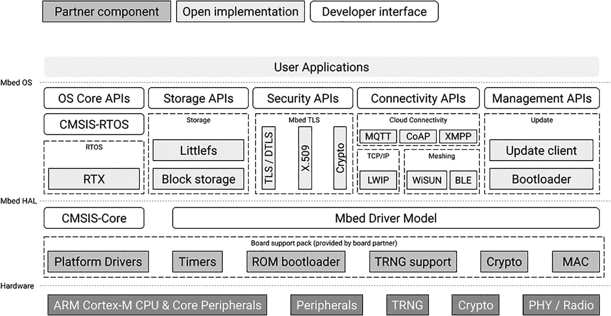
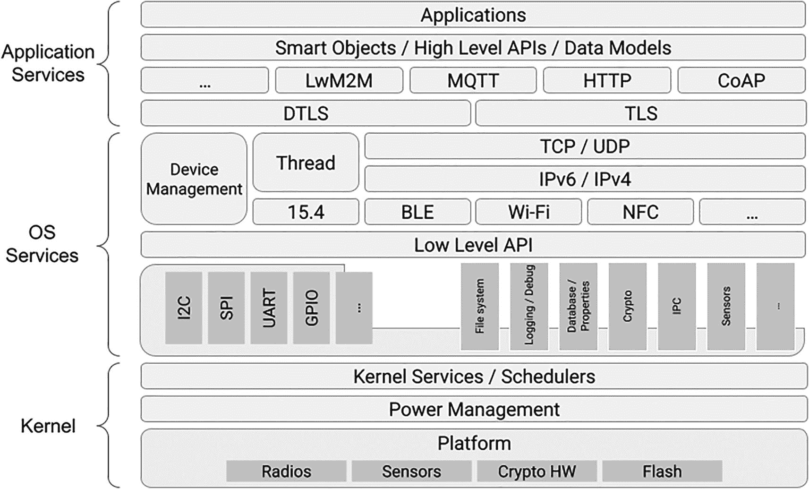

# 10. 操作系统

> *Informatique : Alliance d'une science inexacte et d'une activité humaine faillible.*

> *计算机科学：一门不精确科学与一种易错的人类活动的结合。*
> 
> —吕克·法亚尔

操作系统（OS）是管理计算机硬件和软件资源，并为其他程序提供共享服务的软件。换句话说，它是硬件和软件之间的接口。自 20 世纪 90 年代以来，市场上大多数计算机都运行着操作系统。然而，情况并非总是如此。20 世纪 50 年代早期的大型机没有操作系统，一次只能运行一个程序。IBM 是第一个引入单一操作系统概念以覆盖整个产品线的硬件制造商，并于 1964 年推出了 OS/360 `–` 尽管由于存储限制和项目的整体复杂性，该公司发布了三个软件变体。在 20 世纪 70 年代和 80 年代，许多流行的家用微型计算机在没有操作系统的情况下使用。几乎所有机器都附带了一个内置的 BASIC 解释器，该解释器兼作机器的命令行界面。由于软盘驱动器价格昂贵，盒式磁带是最常见的存储介质。因为这些家用计算机具有固定的配置，并且一次只能运行一个程序，所以操作系统并非严格必要。

本章将介绍各种操作系统及其功能集。我还将花时间向你介绍一些*裸机*选项，即构建无需操作系统支持即可直接在硬件上运行的应用程序的方法。最后，我将向你展示如何作为开发者开始使用 Drogue IoT 项目和 Zephyr 操作系统。


## 操作系统是否必要？

在进一步探讨之前，我们先问问自己：对于企业级物联网和边缘计算部署而言，操作系统是否必要？简而言之：对于执行简单任务的受限设备，或许可以不用操作系统。此外，还有一种名为 *单内核* 的开发框架，它将操作系统通常提供的服务作为库函数，与应用程序代码组合在一起。如果你能找到一款满足需求、且能在目标硬件上运行的此类框架，那么无操作系统方案是可行的。

从上一段以及本章的存在本身，你大概已经推断出，在许多企业级物联网用例中，操作系统或实时操作系统（RTOS）都发挥着重要作用。以下是操作系统可能对你的项目具有价值的功能列表：

*   **API：** 应用程序编程接口（API）隐藏了系统的内部细节，并通常支持互操作性。当不同的操作系统实现相同的 API 时，应用程序或库便可以在不同操作系统之间移植。一个很好的例子是 [可移植操作系统接口（POSIX）](http://get.posixcertified.ieee.org/)，这是由 IEEE 维护的一系列标准。Zephyr RTOS 实现了 POSIX 嵌入式配置文件 PSE51 和 PSE52 的子集，以及 BSD Sockets API。^(⁴⁶) RIOT OS 也提供了一个 POSIX 封装，实现了信号量、套接字和线程。^(⁴⁷)

*   **硬件支持：** 操作系统通过设备驱动程序支持众多硬件组件。驱动程序是一种程序，用于控制通过总线或通信子系统连接到计算机的组件。它们通过实现操作系统暴露的、定义明确但特定于操作系统的接口，来抽象硬件细节。应用程序只需与这些接口交互即可。

*   **内存管理：** 桌面级和服务器级操作系统可以为应用程序提供虚拟地址空间并处理页面错误。另一方面，RTOS 可以静态或动态地为应用程序及其自身服务分配内存。其中最高级的 RTOS 能够创建和管理内存域与分区。内存域确保每个用户线程拥有自己的堆栈缓冲区，而分区则控制对特定内存区域的访问。虽然大多数 MCU 缺乏内存管理单元，但其中相当一部分配备了内存保护硬件（MPU）。MPU 监控指令读取和数据访问等事务，当检测到访问违规时，会触发故障异常。

*   **多任务处理：** 并发执行多个任务（进程）的能力是操作系统的一大优势。将并发进程和线程的控制权委托给操作系统（如在抢占式多任务处理中），通常会使解决方案更加健壮。当内存保护等功能可用时，这一点尤为突出。另一方面，协作式多任务处理（应用程序自愿将计算时间让给其他程序）则更为脆弱，因为单个编写不佳的应用程序就可能导致系统死锁。

*   **实时性要求：** 实时系统旨在在定义、有限且可预测的时间范围内响应事件。换句话说，它们具有可预测的延迟。此外，实时系统会显式地实时管理资源。正确实现实时延迟和资源管理非常复杂。因此，将这些职责委托给操作系统是合理的。

*   **共享服务：** 网络、安全、存储访问、文件系统管理和用户界面只是操作系统提供的部分服务。利用这些服务可以使应用程序更小、更简单，帮助你专注于要解决的业务问题。

总体而言，操作系统能提供很多功能。尽管如此，也存在可行的替代方案，我们将在本章后面部分一起探讨。

## 实时操作系统

目前市场上的 RTOS 种类繁多，令人眼花缭乱。截至撰写本文时，[维基百科整理的列表](https://en.wikipedia.org/wiki/Comparison_of_real-time_operating_systems) 列出了超过 150 个活跃的 RTOS，包括开源和专有产品。我决定详细介绍三个开源选项，它们都得到积极维护，拥有强大的生态系统，支持广泛的硬件，并为开发者提供了稳健的工具包。以下按字母顺序介绍。当然，还有一些我没有介绍的替代方案，它们可能非常适合你的项目。请在做选择前花时间探索各种可能性。


### Arm Mbed OS

鉴于基于 Cortex-M 架构的微控制器非常流行，你看到我在此介绍 Arm 的 RTOS 可能并不意外。Arm Mbed OS 于 2009 年首次发布，是一款面向基于 Cortex-M MCU 的物联网设备的开源操作系统。该项目在[GitHub 上公开开发](https://github.com/ARMmbed/mbed-os)^(⁴⁸)，由 Arm 及其硬件合作伙伴共同管理。代码采用 Apache 许可证 2.0 版授权，这使得它非常适合开源和商业项目。在撰写本文时，Mbed OS 的当前版本为 v6.15.1，于 2021 年 11 月发布。

Mbed OS 的架构高度模块化，如图 10-1 所示。



该架构包括合作伙伴组件、开放实现、开发者接口、用户应用程序、Mbed OS 各层、Mbed HAL、硬件、OS 核心 API、存储与安全 API 以及连接 API。

图 10-1

Arm Mbed OS 6 架构（图片来源：Arm^(⁴⁹)）

请注意，此图是对 Arm 提供的示意图的简化。具体来说，我移除了与 Trusted-Firmware Cortex-M 技术相关的细节。这些技术，连同某些 Cortex-M 内核中的 TrustZone 指令，通常用于创建可信执行环境（TEE）实例，以保护加载其中的代码和数据的机密性与完整性。

自然，鉴于 Arm 专注于硬件知识产权许可，Mbed 的特性高度依赖于 Cortex-M 内核所提供的功能。然而，其他组件，如无线射频和真随机数生成器（TRNG），也起着至关重要的作用。由于基于 Cortex-M 的 MCU 在布局和功能上差异很大，对特定开发板的支持通常通过由硬件供应商维护的*板级支持包*来提供。

注意

TRNG 由构成 MCU 的集成电路中的多个子模块组成，这些子模块协同工作以生成加密安全的随机数。

Mbed OS 提供了两组 API（在图 10-1 中称为开发者接口），用于向 OS 上层抽象硬件细节。第一组是[通用微控制器软件接口标准（CMSIS）](https://developer.arm.com/tools-and-software/embedded/cmsis)：一个面向基于 Arm Cortex 内核的微控制器的、与供应商无关的抽象层。第二组是 Mbed 驱动模型，你可以在编写新驱动程序时加以利用。这两组 API 共同构成了 Mbed OS 硬件抽象层（HAL）。这一基础层简化了应用程序的编写，因为它为标准 MCU 外设（如 I²C、总线、SPI）提供了库和驱动程序。借助 HAL，你可以用 C 和 C++编写应用程序，这些程序将能在任何支持 Mbed OS 的开发板上运行。

Mbed OS 可以配置为符合两种不同的配置文件。*完整*配置文件是一个包含[Keil RTX](https://www2.keil.com/mdk5/cmsis/rtx)和所有相关 RTOS API 的 RTOS。此配置文件支持确定性、多线程、实时的应用程序。驱动程序和应用程序可以利用线程、信号量、互斥锁以及其他 RTOS 特性。另一种配置文件称为*裸机*，专注于最小化代码体积。它仅实现了 Mbed OS RTOS API 的一个子集，这些 API 在非线程应用程序中很有用，例如信号量和定时器。因此，在裸机配置文件下，所有活动都通过轮询或中断驱动。

注意

Keil 是 Arm 在德国的子公司。它提供广泛的开发工具（编译器、汇编器、调试器、IDE），支持 Arm 硬件和评估板。

其余的高级 Mbed OS API 属于以下四个类别：

*   **存储**：Mbed OS 支持多种文件系统。其中之一是 LittleFS，一个针对在有限 RAM 上运行而优化的高完整性嵌入式文件系统。它能抵抗断电并确保数据完整性。对流行的 FAT 文件系统的支持确保了与大多数其他操作系统的互操作性。Mbed 还可以管理块存储，从而能够创建原始存储卷。

*   **安全**：Mbed OS 开箱即用地支持加密技术，并能管理 X.509 证书。它还提供了 TLS 和 DTLS 实现，使应用程序能够进行加密通信。

*   **连接**：Mbed OS 通过移植的[lwIP 项目](http://www.nongnu.org/lwip/2_1_x/index.html)支持 TCP/IP，lwIP 是 TCP/IP 协议栈的一个小型独立实现。该操作系统可与两种网状网络技术配合使用：蓝牙 BLE 和 Wi-SUN。Wi-SUN 场域网（FAN）基于 IEEE 802、IETF、ANSI/TIA 和 ETSI 的开放标准。Mbed OS 的 Wi-SUN 协议栈构建于 6LoWPAN 之上，而 6LoWPAN 又依赖于 IEEE 802.15.4。Mbed OS 还支持 NFC（用于非接触式支付和访问控制）和 LoRaWAN。

*   **管理**：Mbed OS 附带管理 API，支持空中固件更新。要利用此功能，你需要在设备上使用 Mbed OS 提供的引导加载程序。

Mbed OS 的工具生态系统非常丰富。你可以使用 Arm 的商业 C/C++编译器（Arm Compiler）或 GNU Arm 嵌入式工具链来构建应用程序。在开发工具方面，你有三个主要选择：

*   **Arm Keil Studio**^(⁵⁰)：一个免费使用的、基于浏览器的 IDE。它支持 Mbed OS 项目以及其他符合 CMSIS 标准的目标，如 FreeRTOS。Keil Studio 是 Arm Mbed 在线编译器的后继产品，后者已于 2021 年底弃用。

*   **Mbed CLI 2**^(⁵¹)：一个命令行环境，使用 Ninja 构建系统和 CMake 来创建构建环境并独立于编译器管理构建过程。

*   **Mbed Studio**^(⁵²)：适用于 Windows、Linux 和 macOS 的桌面 IDE。

也可以使用多种第三方开发工具来处理 Mbed OS 项目。^(⁵³)

注意

Keil Studio 和 Mbed Studio 都集成了来自[Eclipse Theia 项目](https://theia-ide.org/)的技术。Theia 提供了一个可扩展的平台，用于构建云 IDE 和桌面 IDE。

如果你想利用基于 Cortex-M 系列的 MCU，Mbed OS 是一个强有力的选择。然而，Arm 仍然牢牢控制着该项目。从社区角度来看，缺乏围绕该操作系统的供应商中立治理机制无疑是一个令人担忧的问题。


### FreeRTOS

长期以来，FreeRTOS 一直是面向受限设备的市场中占主导地位的 RTOS，无论其是否开源。在 [2021 年 Eclipse IoT 与边缘开发者调查](https://outreach.eclipse.foundation/iot-edge-developer-2021)中，近 30% 的受访者表示正在使用它。其受欢迎的部分原因在于其历史悠久。FreeRTOS 内核由 Richard Barry 于 2003 年左右创建，随后由 Barry 的公司 Real Time Engineers 维护。2017 年，该项目的管理权移交给了亚马逊云服务（AWS）。Barry 仍以 AWS 员工的身份参与其中。FreeRTOS 大部分是用 C 语言编写的，但在特定架构的调度器例程中使用了汇编语言。在撰写本文时，内核的最新版本是 v10.4.6，于 2021 年 11 月发布。完整操作系统包（包括示例项目和附加库）的最新版本是 v202112.00。内核以及 FreeRTOS 团队维护的所有其他组件均根据 [MIT 许可证](https://opensource.org/licenses/MIT)提供。

FreeRTOS 拥有广泛的硬件支持。在撰写本文时，FreeRTOS 网站上列出了 24 个硬件合作伙伴，并且开源社区还支持其他几个平台。^(⁵⁴) 该团队将每种架构和编译器的组合视为一个独立的移植版本。这些移植版本属于以下四个类别之一：

*   由 FreeRTOS 团队创建和维护的移植版本（官方支持的移植版本）
*   由合作伙伴贡献并由 FreeRTOS 团队维护的移植版本
*   由合作伙伴贡献并由该合作伙伴维护的移植版本
*   社区支持的移植版本

这些移植版本保存在独立的 Git 仓库中，但在[主 FreeRTOS 仓库](https://github.com/FreeRTOS/FreeRTOS)中作为子模块暴露。长期支持（LTS）版本仅包含 FreeRTOS 团队维护的移植版本。此外，商业支持也是可用的，但仅针对官方支持的移植版本。

FreeRTOS 团队不直接提供开发工具。项目主 Git 仓库中的大多数演示都配置为使用 [Eclipse IDE](https://eclipseide.org/release/)，特别是 [Eclipse CDT](https://www.eclipse.org/cdt/)（C/C++ 开发工具）版本。也可以使用专门的 [Eclipse Embedded CDT](https://eclipse-embed-cdt.github.io/) 版本，该版本附带用于创建、构建和管理针对 Arm 和 RISC-V 平台应用程序的插件。许多硬件提供商也提供基于 Eclipse IDE 或 Eclipse Theia 的自己的 IDE。当然，鉴于代码库的简洁性，大多数支持 C 语言的 IDE 都可以使用。

与我在此部分介绍的其他操作系统相比，FreeRTOS 的结构非常简单。除了内核本身之外，该团队还维护着三个特定的库集。让我们仔细看看这四个组件。

#### FreeRTOS 内核

FreeRTOS 内核所需资源极少。一个典型的二进制映像通常大小在 6 到 12 KiB 之间。核心实现很简单，因为它只包含在三个 C 文件中。

FreeRTOS 提供了操作任务、互斥量、信号量和软件定时器的原语。开发者可以指定线程优先级。内核支持静态内存分配。动态分配也是可能的，并且内核附带了五种示例内存管理方案。这五种方案如下：

*   **heap_1**：内核将分配内存，但无法释放。
*   **heap_2**：内核将分配和释放内存，但不会将已释放的内存块与相邻的空闲块合并。此方案是遗留方案，推荐使用 heap_4。
*   **heap_3**：内核将依赖于编译器提供的标准 C 库中的 malloc() 和 free() 实现。这些调用被包装以实现线程安全。
*   **heap_4**：内核将分配和释放内存。它还会将已释放的内存块与相邻的空闲块合并以避免碎片化。
*   **heap_5**：内核将像 heap_4 一样管理内存，并且可以将堆分布在非连续的区域。

当然，你也可以提供自己的内存管理实现。在静态和动态内存分配之间的选择，将归结于你是更倾向于简单性以及可能更低的内存使用量，还是更倾向于对内存位置的控制。

可以想象，鉴于其大小，FreeRTOS 内核的功能范围非常小。幸运的是，该团队还提供了几个实现有用连接和安全功能的库。

#### FreeRTOS+ 库

此类别中的库依赖于 FreeRTOS 内核。在撰写本文时，FreeRTOS+ 类别中有两个库：

*   **FreeRTOS+TCP**：一个完整的 TCP/IP 协议栈，基于广泛使用的 Berkeley 套接字接口，提供可重入且线程安全的 API。它包括 DHCP 和 DNS 等功能。还提供了一个可选的回调接口。启用所有功能后的代码大小在 20.1 到 34.9 KiB 之间，具体取决于所选的编译器优化。
*   **FreeRTOS+CLI**：一个小型且可扩展的框架，用于向 FreeRTOS 应用程序添加命令行界面（CLI）。

第三个库 FreeRTOS+IO 曾提供类似 POSIX 的 API 用于外设驱动库，但现已弃用。


#### FreeRTOS 核心库

此类别中的库基于开放标准实现连接与安全功能。它们仅依赖标准 C 库，因此可与 FreeRTOS 之外的其他内核配合使用。以下是此类别中的库列表：

*   **coreMQTT：** 一个轻量级 MQTT 客户端。该库实现了 MQTT 3.1 协议，并支持所有 QoS 级别。它还支持用于加密通信的 TLS。代码大小根据优化程度不同，介于 5.7 KiB 到 6.9 KiB 之间。

*   **coreMQTT Agent：** 一个通过添加线程安全 API 来扩展 coreMQTT 的库。您可以使用它在应用程序中创建一个专用任务来处理 MQTT 流量；其他任务将不允许使用 coreMQTT API。CoreMQTT Agent 包含了 coreMQTT 的代码。代码大小介于 7.4 KiB 到 8.9 KiB 之间。

*   **coreHTTP：** HTTP 协议的一个部分客户端实现。该库公开了一个同步 API，您可以使用它来序列化标头、向远程服务器发送请求并处理响应。该库可与 TLS 配合使用，并可用于调用 REST Web 服务。代码大小介于 15.6 KiB 到 18.9 KiB 之间。

*   **coreSNTP：** 简单网络时间协议（SNTP）的客户端实现。该库实现了 [RFC 4330](https://tools.ietf.org/html/rfc4330) 中定义的 SNTP v4 版本。同步受限设备的时钟可确保您的应用程序报告的时间准确无误，并能缓解某些设备缺乏实时时钟的问题。SNTP 是个人计算机和服务器上使用的网络时间协议（NTP）的子集；它比 NTP 需要更少的内存和计算资源。代码大小介于 2.0 KiB 到 2.5 KiB 之间。

*   **传输接口：** 一种将协议实现与底层网络驱动程序解耦的方式。该接口的实现包含用于通过网络连接发送和接收数据的函数指针和上下文数据。FreeRTOS 提供了示例实现，您也可以提供自己的实现。由于依赖于传输接口，coreMQTT 和 coreHTTP 不依赖于任何特定的 TCP/IP 协议栈，包括 FreeRTOS+TCP。

*   **coreJSON：** 一个符合 JSON 数据交换语法标准（[ECMA-404](https://www.ecma-international.org/publications-and-standards/standards/ecma-404/)）的 JSON 解析器。该库支持键查找，并依赖内部堆栈来跟踪嵌套结构。代码大小介于 2.4 KiB 到 2.9 KiB 之间。

*   **corePKCS #11：** PKCS#11 API 的一个硬件无关实现，该 API 为存储加密信息并执行加密功能的设备指定了接口。通常，加密硬件（如可信平台模块（TPM）和硬件安全模块（HSM））的制造商会随其产品提供 PKCS#11 实现。corePKCS11 库允许您在切换到生产代码中特定于供应商的 PKCS#11 库之前，快速进行原型设计和构建应用程序。

*   **FreeRTOS 蜂窝接口库：** 一个封装了三种主流蜂窝调制解调器的 TCP/IP 协议栈并公开统一 API 的库。支持的三种调制解调器是 [Quectel BG96](https://www.quectel.com/product/lte-bg96-cat-m1-nb1-egprs/)、[Sierra Wireless HL7802](https://www.sierrawireless.com/products-and-solutions/embedded-solutions/products/hl7802/) 和 [U-Blox Sara-R4](https://www.u-blox.com/en/product/sara-r4-series)。

#### 适用于 AWS IoT 的 FreeRTOS

此类别中的库为各种特定于 AWS 的 IoT 云服务提供客户端。功能涵盖空中升级（AWS IoT OTA）、数字孪生（AWS IoT Device Shadow）、任务通知（AWS IoT Jobs）、安全指标报告（AWS IoT Device Defender）、设备预配置（AWS IoT Fleet Provisioning）和数字签名（AWS Signature Version 4）。这些库仅依赖标准 C 库，并且可以与 FreeRTOS 之外的其他内核一起使用。

#### 总结

总体而言，FreeRTOS 是一个灵活且占用空间极小的操作系统。它在行业中的广泛支持意味着有丰富的兼容库和多个硬件供应商可供选择。然而，该项目缺乏供应商中立的治理是一个问题。此外，与 AWS 生态系统的紧密集成既是生产力的提升，也可能成为长期的潜在负担。虽然官方支持的移植版本和库来源明确且没有知识产权问题，但对于合作伙伴或社区维护的移植版本，情况未必如此。其较小的功能占用也意味着您需要寻找第三方库来支持特定的硬件或功能，这可能会导致维护问题。


### Zephyr

我将详细介绍的最后一个 RTOS 是 Zephyr。Zephyr 的根源可追溯至比利时软件公司 Eonic Systems 的 Virtuoso RTOS，该公司于 2001 年被 Wind River Systems 收购。Wind River 将 Virtuoso 更名为 Rocket，并于 2015 年将其作为开源软件发布。2016 年，Wind River 将该贡献给 Linux 基金会，并命名为 Zephyr。Zephyr 采用 Apache v2.0 许可证，并在[GitHub 上开发](https://github.com/zephyrproject-rtos/zephyr)。^(⁵⁵)

Zephyr 的功能集非常广泛。它包括一个微小的单体内核、一套连接协议实现（包括 MQTT、CoAP 和 LwM2M）、一个支持多种闪存存储的虚拟文件系统接口，以及内置的设备管理和软件更新机制。它还完全支持蓝牙 BLE，包括网状网络。Zephyr 高度可配置且模块化；你可以只集成所需的功能。因此，运行时内存使用量可低至 8 KiB。图 10-2 总结了 Zephyr 的架构。



一个由具有高级 API 的应用服务、具有低级 API 和设备管理的操作系统服务，以及具有电源管理的内核服务或调度器组成的架构。

图 10-2

Zephyr RTOS 架构（来源：Linux 基金会^(⁵⁶)）

图 10-2 中未直接体现的一个元素是内核服务套件。以下是完整的服务列表：

*   **多线程：** 提供协作式、基于优先级、非抢占式和抢占式线程。轮转时间片是可选的。该服务还提供 POSIX 兼容的 API。

*   **中断：** 在编译时实现中断处理程序的注册。

*   **内存分配：** 提供动态内存分配。无论内存块大小是固定还是可变，都可以释放。

*   **线程间同步：** 提供二进制信号量、计数信号量和互斥信号量。

*   **线程间数据传递：** 实现消息队列和字节流。

*   **电源管理：** 提供高级空闲特性和无滴答空闲模式。

Zephyr 内核支持多种线程调度方式。在高级层面，协作式和抢占式调度都可用。时间片（即处理时间在同优先级的所有可抢占线程之间平均分配）与最早截止时间优先（EDF）和元 IRQ 调度一起提供。此外，内核还提供强大的特定于架构的内存保护机制。在 x86、ARC 和 Arm 处理器上，Zephyr 实现了栈溢出保护、内核对象和设备驱动程序的权限跟踪，以及通过线程级内存保护实现的线程隔离。

Zephyr 支持多种硬件，包括大多数 Arm Cortex-M 内核。所有官方支持的开发板^(⁵⁷)都有一个文档页面，说明其哪些功能对开发者可用以及如何暴露这些功能。此外，多个扩展板也得到明确支持，并像开发板一样有文档记录。

注意

扩展板是安装在微控制器板顶部的扩展板。它们相当于 Raspberry Pi 生态系统中的 HAT（硬件附加在顶部）。

从开发工具的角度来看，Zephyr 团队维护着一个软件开发工具包，为每个支持的架构提供完整的工具链。SDK 的主要依赖项是 CMake、Python 和设备树编译器。这三个工具都支持多个平台；SDK 可以安装在 Linux、macOS 和 Windows 上。在 Windows 的情况下，建议使用[Chocolatey](https://chocolatey.org/)包管理器；你也可以利用 Windows 10 及更高版本中可用的 Windows Subsystem for Linux (WSL)功能，但在撰写本文时，在该环境中无法进行应用程序烧录。Zephyr 团队不提供 IDE，但一些开发板制造商在其基于[Eclipse CDT](https://www.eclipse.org/cdt/)的 IDE 中支持 Zephyr。使用[PlatformIO](https://platformio.org/)及其同名的 IDE 也是一种选择。

Zephyr 的一个有趣特性是其配套元工具[West](https://docs.zephyrproject.org/latest/develop/west/index.html)。West 使开发者能够处理多个 Git 仓库。它还通过用户友好的命令行界面支持开发者工作流程。West 与 CMake 兼容，这意味着你可以使用任一工具执行构建、烧录和调试等操作。West 的使用是可选的，尽管绕过它可能对你来说不太方便。

Zephyr 是一个文档完善的 RTOS，具有全面的功能集和成熟的代码库。Linux 基金会对该项目的中立管理确保了没有任何一个组织能从开源社区手中夺走该项目。Zephyr 为应用程序开发者提供了一个稳定的目标，因为它按既定计划发布长期支持（LTS）版本。该项目的治理是透明的，团队非常重视安全性。该项目的长期目标是维护一个安全分支，以创建一个可认证的系统，或至少一个可认证子模块的子集。

基于所有这些原因，并且鉴于 Eclipse 基金会是 Zephyr 项目的成员，本书中大多数受限设备代码示例都基于 Zephyr。然而，Arm Mbed 和 FreeRTOS 是强大的替代方案。还有其他值得关注的开源 RTOS，如 Contiki 和 RIOT OS，但我没有时间介绍。最终，你应该选择能为你的项目提供最佳功能和硬件支持平衡的方案。

## 裸机选项

虽然 RTOS 提供了很多功能，但对于受限设备一次只执行简单任务的简单用例来说，它们可能过于复杂。在这种情况下，RTOS 的开销可能超过其带来的好处。此外，越来越多的框架提供了 RTOS 的大部分功能，并生成直接在硬件上运行而无需操作系统参与的程序。在本节中，我将回顾几个选项。

### Arduino

开箱即用，Arduino 开发板可以直接执行程序，无论是否有引导加载程序的协助。^(⁵⁸) 在 Arduino 术语中，此类程序称为*sketch*。引导加载程序的作用是允许你将 sketch 上传到开发板，而无需硬件编程器（一种可以将软件烧录到开发板上的专用设备）。如果你有编程器并且需要 Arduino 的所有资源用于你的程序，你可以在没有引导加载程序的情况下操作开发板。

Arduino sketch 使用简化版的 C++编写。在编译时，预处理器将 sketch 转换为标准 C++代码。目标文件与标准 Arduino 库链接。结果是一个单一的 hex 文件，将由开发板直接执行。由于 Arduino 和更广泛的社区提供了[大量可选库](https://www.arduino.cc/reference/en/libraries/)，这种方法功能强大且模块化。这些库涵盖通信、连接、数据处理、存储和设备控制等多个领域。Arduino CLI 命令行工具和 Arduino IDE 使得为你选择的开发板安装核心支持文件以及你需要的库变得容易。

Arduino 是一个面向简单用例的精简开源环境的绝佳示例。尽管如此，包括 FreeRTOS 在内的多个 RTOS 都可以在 Arduino 开发板上运行。


### Drogue IoT

如果你是 Rust 编程语言的爱好者（即便不是，至少也该考虑一下），Drogue IoT 提供了为受限设备构建安全高效固件所需的一切。该项目由红帽创建；它并非 Eclipse 基金会项目，但其多位贡献者在 Eclipse IoT 与 Edge 生态系统中扮演着重要角色。你可以在 [`www.drogue.io/`](http://www.drogue.io/) 找到 Drogue IoT 网站。

过去几年中，Rust 在 IoT 和嵌入式领域的应用持续增长。这在一定程度上归功于该语言的诸多安全特性。Rust 的类型系统能在编译时防止数据竞争，并执行静态检查。例如，可以利用这些静态检查来强制正确配置 I/O 接口，并确保操作仅在正确配置的外设上执行。这些检查还能实现访问控制，确保只有程序的特定部分才能修改外设状态。此外，Rust 开发工具在所有主流操作系统上均可使用，能针对多种硬件平台，且不绑定任何特定项目或框架。开发者可以从 [crates.​io](https://crates.io/)（相当于 Rust 版的 Maven Central）上发布的大量开源库中进行选择。不出所料，这些库被称为 *crates*。

使用 Rust 构建设备固件无需特定于供应商的 SDK 或 RTOS 专用工具。不过，Rust 嵌入式开发者社区已经标准化了一些概念。这些概念如下：

*   **外设访问 crate (PAC)：** 允许访问芯片特定寄存器的库。静态检查确保开发者正确使用外设。

*   **硬件抽象层 (HAL)：** 基于特定芯片的 PAC 构建的库，提供对 I²C、SPI 和 UART 等通用特性和总线的抽象。HAL 通常可跨芯片系列成员使用。

*   **嵌入式 HAL：** 作为构建平台无关驱动基础的库。它们定义了接口，随后由 HAL 实现。

Drogue IoT 有两个主要组件：Drogue Device 和 Drogue Cloud。Drogue Device 是一套用于构建 IoT 应用的库和驱动分发版。其底层依赖于 [Embassy 项目](https://embassy.dev/)。Embassy 是一个异步编程框架，包含一个执行器和一个硬件访问层 (HAL)。执行器是一个调度器。它在启动时执行一组定义好的任务，尽管之后也可以添加更多任务。HAL 提供了一个 API，封装了对 USART、UART、I²C、SPI、CAN 和 USB 等外设的访问。在合理的情况下，Embassy API 会同时提供同步和异步两种形式。Embassy 是[实时中断驱动并发](https://rtic.rs/1/book/en/) (RTIC) 库的替代方案，后者是一个提供任务调度器和 RTOS 中常见的许多核心功能的运行时。

异步 Rust 相比传统的同步方法有几个优势。首先，它能生成节能且资源高效的应用程序，因为异步任务可以通过触发中断来完成。其次，它简化了开发者的工作，无需在复杂场景（例如同时使用多个 DMA 通道）中实现状态机。Rust 编译器会根据实现逻辑的“线性”Rust 异步代码生成状态机。最后，异步 Rust 任务可以通过一种称为 *futures* 的结构受益于完美大小的栈，它代表“……由异步计算产生的单个最终值。”^(⁵⁹) 可以对 future 状态进行分段，并仅在需要时分配内存。这再次带来了更高效的代码。

Embassy 是一个基于任务的框架。Drogue Device 编程模型支持这一点，并额外提供了一个 actor 框架。Actor 系统将状态隔离在狭窄的作用域内；actor 代表了状态使用的边界。在 Drogue Device 中，actor 使得使用消息传递构建并发系统更加容易。每个 actor 拥有一个唯一的地址。Actor 彼此解耦，并且一次只处理一条消息。具体来说，它们利用 Rust 的 async/await 原语来处理消息。因此，事件总是按顺序处理。

Drogue Device 附带可选的板级支持包，为最常用的外设提供了样板代码。该项目还包括针对 Wi-Fi、LoRaWAN 和蓝牙 BLE 结合各种传感器的驱动、actor 和示例。你也可以利用第三方驱动或自行编写。在撰写本文时，Drogue Device 可以在 Embassy 支持的任何硬件上运行。列表包括意法半导体的 STM32 系列以及 Nordic Semiconductor 的 nRF52、nRF53 和 nRF91 系列。一个支持良好且功能齐全的板卡示例是 micro:bit 版本 2。

Drogue Device 是一个强大的框架，用于构建面向嵌入式及 IoT 受限设备的 Rust 应用。该语言提供了低占用运行时、内存安全性和线程安全性，考虑到目标用例，这是一个制胜组合。至于配套的 Drogue Cloud 平台，它向设备暴露 HTTP、MQTT 和 CoAP 端点，并通过 Cloud Events 和 Knative 事件驱动执行协议标准化。Drogue Device 与 Drogue Cloud 之间的集成意味着 Drogue Cloud 可以提供有效的设备管理，包括凭证和配置属性。


### Espressif IDF (ESP-IDF)

乐鑫物联网开发框架（[ESP-IDF](https://docs.espressif.com/projects/esp-idf/en/latest/esp32/get-started/index.html)）是面向受限设备的裸机框架的另一个优秀范例。它开箱即用地支持多款搭载乐鑫 [ESP32 MCU](https://www.espressif.com/en/products/socs/esp32) 的开发板，该芯片集成了 Wi-Fi、蓝牙以及两个 Xtensa LX6 32 位处理器核心。该框架基于 Apache v2.0 许可证发布，你可以在以下 GitHub 仓库中找到其源代码：[`https://github.com/espressif/esp-idf`](https://github.com/espressif/esp-idf)。相关文档可在 [`https://docs.espressif.com/projects/esp-idf/en/latest/esp32/index.html`](https://docs.espressif.com/projects/esp-idf/en/latest/esp32/index.html) 获取。

注意

Xtensa 处理器基于一种与 Arm 和 RISC-V 不同的 32 位 RISC 架构。鉴于 ESP32 的普及程度，可以推测 Xtensa 核心是除这两者之外应用最广泛的替代方案之一。

ESP-IDF 拥有全面的功能集。它内置了 HTTP 和 MQTT 客户端，并且可以实例化 HTTP 和 HTTPS 服务器。同时，它也支持 Modbus 等传统协议。由于 ESP32 是一款 MCU，你可以利用多种外设接口，例如 GPIO、I²C、SPI 和 UART。存储 API 支持多种设备类型，包括 SD 卡和闪存。

ESP-IDF 的一个特殊性在于，它依赖一个修改版的 FreeRTOS 作为其调度器。由于 ESP32 是双核芯片，乐鑫为其增加了对称多处理（SMP）支持。因此，纯 FreeRTOS 代码与 ESP-IDF 代码之间存在一些差异。考虑到这些，你可能会质疑 ESP-IDF 是否真的是一个裸机框架。我认为它符合条件，因为其组件之间集成紧密，且功能集丰富。

安装乐鑫提供的工具有两种方式：通过 IDE 或手动安装。该团队为[桌面版 Eclipse IDE](https://docs.espressif.com/projects/esp-idf/en/latest/esp32/get-started/eclipse-setup.html) 和 [Microsoft Visual Studio Code 扩展](https://docs.espressif.com/projects/esp-idf/en/latest/esp32/get-started/vscode-setup.html)提供了插件。你可以使用 Linux、macOS 或 Microsoft Windows 作为操作系统。

毫无疑问，ESP-IDF 是一个强大且灵活的框架。当然，它与特定 CPU 架构绑定的特性限制了其吸引力，不过，如果你正在寻找一款 32 位 MCU，ESP32 值得你考虑。

## 边缘节点：Linux 的领域

到目前为止，我仅讨论了受限设备上的操作系统。现在，让我们来看看边缘节点的格局。2021 年版的 Eclipse IoT 与边缘开发者调查发现，Linux 是网关和边缘服务器的首选，Microsoft Windows 位居第二。这并不令人意外。Linux 的模块化和广泛的硬件支持使其成为各种工作负载的强力选择。即便是 Microsoft 的 Azure Sphere（一个将安全 MCU 与定制软件栈紧密结合的平台）等产品，也依赖于 Linux 内核。

在同一项调查中，我们还询问了受访者在边缘运行哪些工作负载，以及他们如何打包所部署的边缘服务。工作负载相当多样化；我们将在专注于边缘计算的章节中重新讨论它们。至于服务打包，容器显然是首选。这类工作负载与 Linux 的使用密切相关。

我尚未涉及的一点是 Linux 在受限设备中的应用。毕竟，Linux 在嵌入式系统中很普遍，并且可以在任何配备合适 32 位处理器和至少 4 MB 内存的设备上启动内核。具体来说，处理器核心必须配备硬件内存管理单元（MMU）。许多片上系统（SOC）满足这些要求，并且适用于嵌入式用途。然而，这类 SOC 的功耗远高于大多数 MCU。最终，Linux 是否适用于受限设备，在很大程度上取决于你最初如何定义这类设备。

当然，标准 Linux 内核针对吞吐量进行了优化；它无法提供开发者期望从 RTOS 中开箱即得的那种可预测延迟。然而，在主内核树中激活特定的抢占模型，允许高优先级任务抢占当前正在运行的进程。此外，流行的 PREEMPT_RT 补丁集正在集成到主线中。PREEMPT_RT 使 Linux 内核完全可抢占，其运行时行为非常接近纯 RTOS。话虽如此，并非所有 Linux 设备驱动程序都兼容，这可能会降低其对某些人的吸引力。

## Zephyr 入门

Zephyr 团队构建的 SDK 支持开发者使用的三种主流操作系统：Linux、macOS 和 Windows。所有依赖项都是跨平台的。但是，你必须注意所支持的最低版本号。表 10-1 列出了 SDK 三个主要依赖项的最低版本号。

表 10-1

Zephyr SDK 主要依赖项的最低支持版本

| 依赖项 | 最低版本 |
| --- | --- |
| CMake | 3.20.0 |
| Python | 3.6 |
| 设备树编译器 | 1.4.6 |

获取最新版本的 CMake 至关重要。在 Ubuntu 上，你可以依赖由该项目的主要贡献者 [Kitware](https://www.kitware.com/) 提供的 APT 仓库。对于其他发行版或操作系统，你也可以从其网站下载二进制发行版。


### Linux

要在 Ubuntu 上安装 SDK 依赖项，请执行以下命令：

```
sudo apt-get install --no-install-recommends git cmake \
ninja-build gperf ccache dfu-util device-tree-compiler wget \
python3-dev python3-pip python3-setuptools python3-tk \
python3-wheel xz-utils file libpython3.8-dev \
make gcc gcc-multilib g++-multilib libsdl2-dev
```

对于 Fedora，命令如下：

```
sudo dnf group install "Development Tools" \
"C Development Tools and Libraries"
sudo dnf install git cmake ninja-build gperf ccache dfu-util \
dtc wget python3-pip python3-tkinter xz file glibc-devel.i686 \
libstdc++-devel.i686 python38 SDL2-devel
```

包管理器完成操作后，你必须准备 Python，因为 West 依赖于它。在处理 Zephyr 项目时，利用 Python 虚拟环境是一种最佳实践。你可以像这样创建并激活一个虚拟环境：

```
python3 -m venv ~/zephyrproject/.venv
source ~/zephyrproject/.venv/bin/activate
```

将 `zephyrproject` 替换为你选择的名称。请记住，每次启动新的 shell 实例来处理代码时，都要激活虚拟环境。

完成此操作后，你必须将 West 工具添加到你的 Python 环境中。相关命令如下：

```
pip install west
```

下一步是获取 Zephyr 源代码。你可以克隆仓库，但 West 也能完成此操作。

```
west init ~/zephyrproject
cd ~/zephyrproject
west update
```

West 可以配置环境，使 CMake 能够加载构建过程所需的 Zephyr 样板代码。运行以下命令：

```
west zephyr-export
```

在继续之前，你需要安装一些额外的 Python 依赖项。它们位于项目文件夹中的 `zephyr/scripts/requirements.txt` 文件中。

```
pip install -r ~/zephyrproject/zephyr/scripts/requirements.txt
```

之后，就该下载并安装 SDK 本身了。

```
wget https://github.com/zephyrproject-rtos/sdk-ng/releases/download/v0.14.2/zephyr-sdk-0.14.2_linux-x86_64.tar.gz
wget -O - https://github.com/zephyrproject-rtos/sdk-ng/releases/download/v0.14.2/sha256.sum | shasum --check --ignore-missing
```

你可以通过将上述命令中的 `0.14.2` 替换为正确的版本号来下载特定版本的 SDK。你可以在此处访问版本列表：[`https://github.com/zephyrproject-rtos/sdk-ng/releases`](https://github.com/zephyrproject-rtos/sdk-ng/releases)。

在下载 SDK 的文件夹中，你可以通过执行以下命令来解压并运行安装程序：

```
tar xvf zephyr-sdk-0.14.2_linux-x86_64.tar.gz
cd zephyr-sdk-0.14.2
./setup.sh
```

为避免出现问题，请将 SDK 解压到以下位置之一：

*   `$HOME`

*   `$HOME/.local`

*   `$HOME/.local/opt`

*   `$HOME/bin`

*   `/opt`

*   `/usr/local`

顺便提一下，你需要根据开发机器的架构下载 SDK。对于配备 Intel 或 AMD 处理器的工作站，请获取 x86_64 版本；对于使用 Arm ISA 处理器的工作站，请获取 aarch64 版本。

### macOS

Zephyr 团队假设你在 macOS 上使用 Brew 包管理器。要安装依赖项，请执行以下命令：

```
brew install cmake ninja gperf python3 ccache qemu dtc wget
```

其余过程与 Linux 上使用的命令相同；请参考上一节。对于 SDK，请为 Intel Mac 选择 `x86_64` 版本，为 Apple Silicon Mac（M1 及后续型号）选择 `aarch64` 版本。

### Windows

Windows 上的过程遵循类似的流程，但命令当然略有不同。Zephyr 团队提供的说明使用了 [Chocolatey](https://chocolatey.org/) 包管理器。我在此假设你已经设置好了它。

打开提升的命令提示符（具有管理员权限的提示符）并执行以下命令：

```
choco install cmake --installargs 'ADD_CMAKE_TO_PATH=System'
choco install ninja gperf python git dtc-msys2 wget unzip
```

完成后，你可以关闭提升的 shell；其余步骤可以在标准 shell 下执行。要创建并激活 Python 虚拟环境，请执行以下命令：

```
cd %HOMEPATH%
python3 -m venv zephyrproject\.venv
zephyrproject\.venv\Scripts\activate.bat
```

将 `zephyrproject` 替换为你选择的名称。如果你使用 PowerShell 而不是标准命令行解释器（cmd.exe），则最后一个命令应为：

```
zephyrproject\.venv\Scripts\Activate.ps1
```

请记住，每次启动新的 shell 实例来处理代码时，都要激活虚拟环境。

下一步是安装 West：

```
pip install west
```

完成后，你可以使用它来获取 Zephyr 源代码：

```
west init zephyrproject
cd zephyrproject
west update
```

一个快速命令，使 Zephyr 样板代码对 CMake 可用：

```
west zephyr-export
```

现在，你可以获取 SDK 剩余的 Python 依赖项。

```
pip install –r ^
%HOMEPATH%\zephyrproject\zephyr\scripts\requirements.txt
```

此时，你可以下载并安装 TCK。与 Linux 的情况一样，你需要使用 wget 获取 SDK 包。

```
cd %HOMEPATH%
wget https://github.com/zephyrproject-rtos/sdk-ng/releases/download/v0.14.2/zephyr-sdk-0.14.2_windows-x86_64.zip
```

你可以使用以下命令解压存档：

```
unzip zephyr-sdk-0.14.2_windows-x86_64.zip
```

只有两个位置适合解压 SDK：

*   `%HOMEPATH%`

*   `%PROGRAMFILES%`

现在，你可以运行 SDK 的设置脚本：

```
cd zephyr-sdk-0.14.2
setup.cmd
```

脚注 1   2   3   4   5   6   7   8   9   10   11   12   13   14

