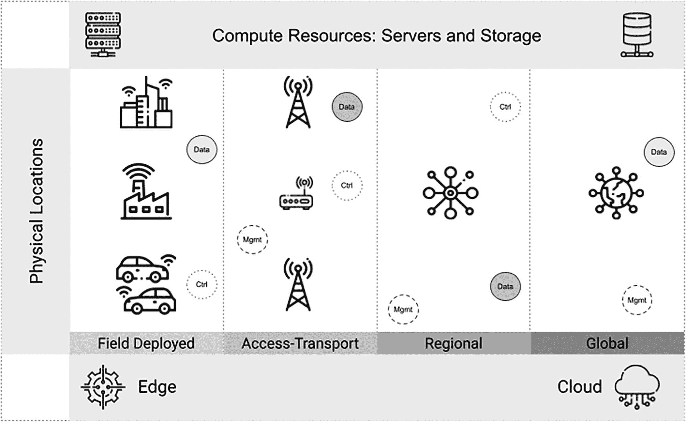
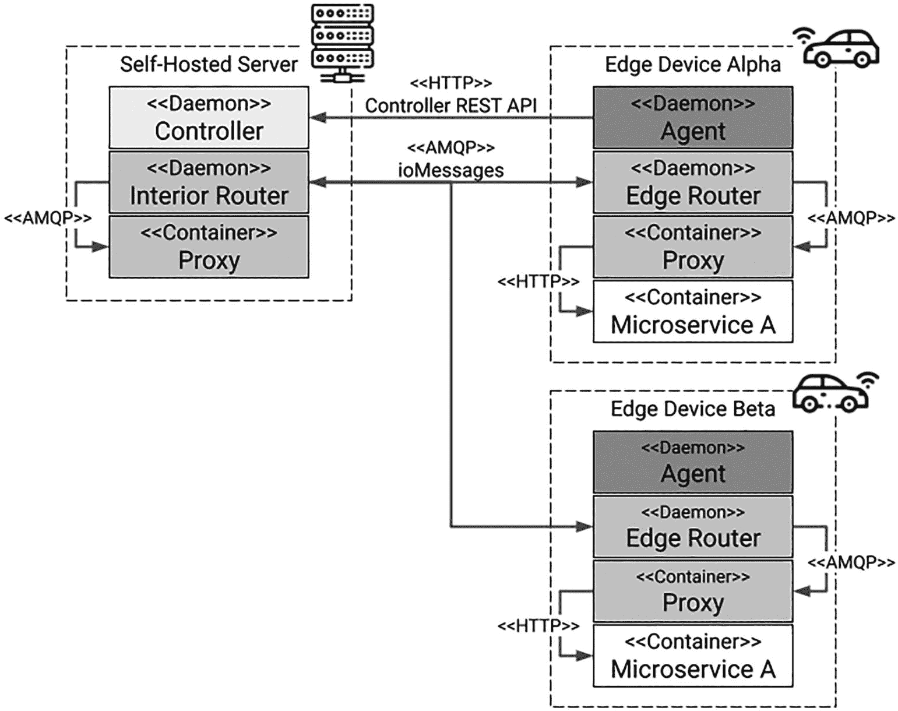
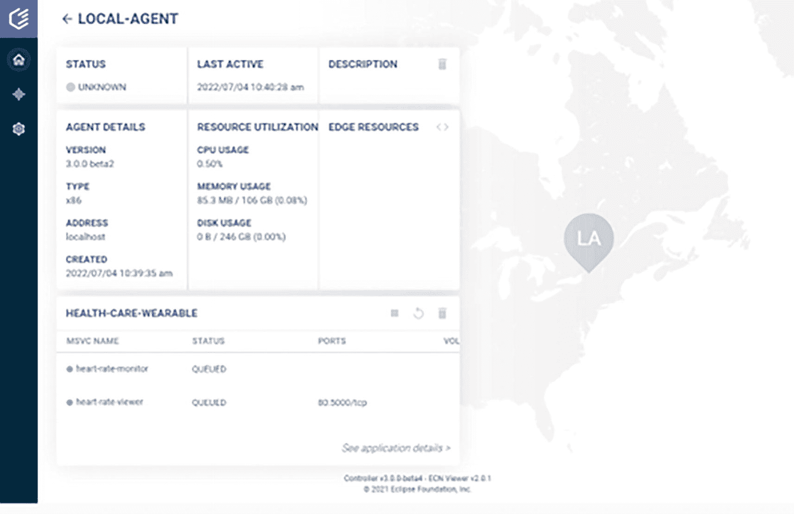
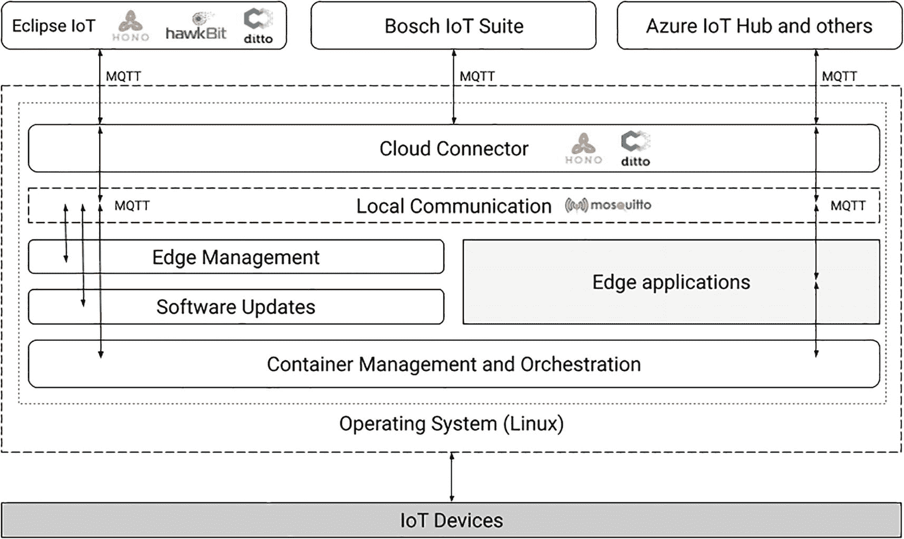
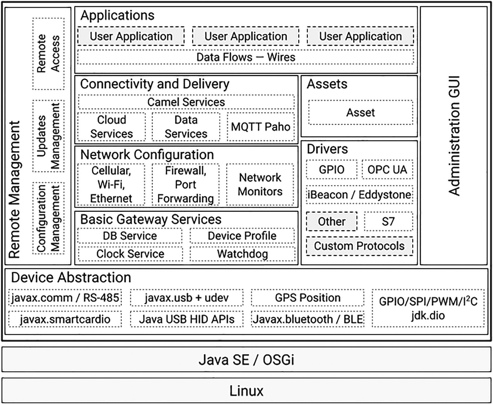
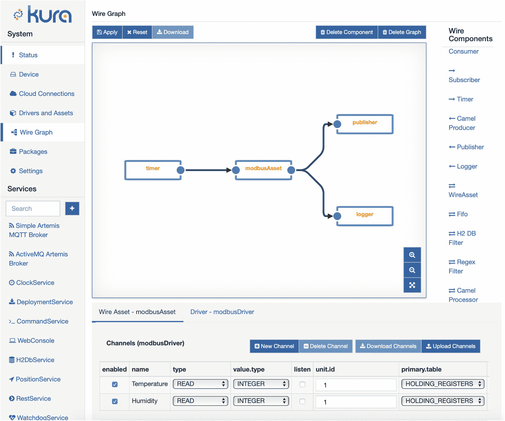
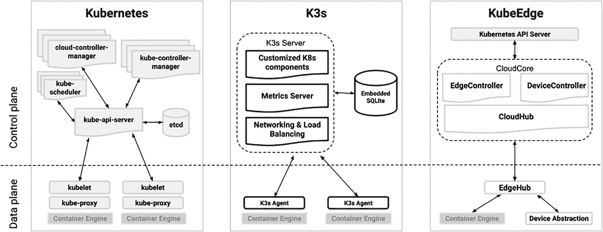

# 11. 边缘计算

> *L'extrême limite de la sagesse, voilà ce que le public baptise folie.*

> *智慧的极致边缘，正是公众所命名的疯狂。*
> 
> ——让·科克托，《无礼》

物联网中的“I”代表*互联网*。在此语境下，互联网即*网络*。正如我之前所写，对连接性的关注使物联网设备有别于嵌入式设备。物联网设备需要传输传感器收集的数据，并通过执行器作用于物理世界。它们需要网络来实现这一点。但数据去向何处？命令又来自何方？互联网？当然不是。试想一下，当你驾车出行时，你的目的地并非道路本身，而是通过道路可抵达的某个地点。当你将数据发送至互联网时，其目的地并非互联网，而是云端。

此处我提及的云端，涵盖其所有变体：公有云、混合云和私有云。三者均提供按需计算、存储和网络资源，以及软件服务。其区别在于规模和位置。公有云托管于第三方提供商拥有的数据中心；其资源和服务由多个客户共享。大多数公有云实例提供的规模，只有最大的组织才能企及。在规模的另一端，私有云托管于你自己的设施中。它与传统基础设施的区别在于，资源以类似云的方式（“云化”？）提供。自然，大多数私有云实例的规模远小于典型的公有云实例。至于混合云，它只是两种方式的混合，工作负载可在私有与公共基础设施之间迁移。

注意

尽管公有云提供丰富的资源，但这些资源并非无限。我过去曾任职的一家公司，其合作伙伴曾耗尽市场领先的公有云提供商在特定区域内提供的某种虚拟机类型的所有实例。我们谈论的是数万台虚拟机。如果他们读到此处，我确信他们能认出自己。

此时，你可能会问自己，这与边缘计算有何关联。你看，在边缘部署资源和服务意味着你在云端和企业数据中心的边界之外运营。事实上，从运营角度来看，边缘与云端是对立面。但在详细阐述之前，明智的做法是先定义我所说的边缘计算。

## 什么是边缘计算？

从最简形式而言，边缘计算是一种分布式计算形式，它将计算、存储和网络资源更靠近数据产生和命令执行的物理位置。然而，仅仅遵循这样的架构还不够。你还需要构建和部署*边缘原生*应用程序。此类应用程序与云原生应用程序有几个共同特征：

*   它们依赖微服务。
*   它们暴露 API，通常采用 RESTful 方式。
*   它们由松散耦合的服务组成，以避免产生亲和性并增强应用程序的弹性。
*   它们由采用 DevOps 方法的团队构建，重点关注持续集成和持续部署（CI/CD）。

然而，边缘原生应用程序在几个方面与云原生应用程序有所不同。让我们看看边缘和云环境有何不同，以理解其差异。

### 边缘 vs. 云端

从本质上讲，云端是一种依赖大规模交付的按需模型的环境。特别是公有云，提供了数量惊人的计算、存储和网络资源。这些资源是同质的，并对应预定义的类型。例如，特定虚拟机类型的所有实例将提供相同的基本能力，有时可通过配置进行扩展。虽然资源在许多情况下可以地理分布，但它们始终以集中方式进行管理。

边缘环境则相反。边缘节点无处不在。换句话说，边缘是分布式计算与现实世界交汇的地方（实际上是任何地方）。尽管边缘节点通常大量部署，但任何给定位置可用的计算、存储和网络资源都是有限的。可以说，边缘计算是在大规模范围内部署本地有限的资源。鉴于需要面对的操作约束，边缘节点通常是异构的。有些必须针对特定的环境威胁进行加固，例如进水、温度、电磁干扰或振动。另一些则配备支持特定工作负载的专用硬件，例如人工智能（AI）加速器。当然，大多数边缘节点需要控制功耗，因为它们依靠电池供电，或者需要控制散热。后者通常很重要，因为无源冷却设计通常更可靠，但需要功耗更低的组件。


### 边缘到云连续体

如果边缘节点无处不在，那么边缘本身又在哪里？如果你在互联网上搜索这个问题的答案，你会找到几种不同的说法。表 11-1 列出了其中一些答案。对于每种类型，我列出了数据源与处理节点之间的典型延迟和距离。

表 11-1

常见的边缘类型

| 边缘类型 | 延迟 | 距离 |
| --- | --- | --- |
| 微边缘 | 低于 1 毫秒 | 几厘米到 15 米 |
| 深边缘 | 2 到 5 毫秒 | 低于 1 公里 |
| 元边缘 | 低于 10 毫秒 | 低于 50 公里 |
| 雾计算 | 10–20 毫秒 | 超过 50 公里 |
| 多接入边缘计算 (ETSI) | 10–20 毫秒 | 100 公里 |
| 远边缘 | 20–50 毫秒 | 500 公里 |

现在，你可能会问自己，这些中哪一个才是*真正*的边缘。套用一位著名绝地武士的话来说，从某种角度来看，它们*都*是真实的。它们的主要缺点在于都局限于某种特定的边缘计算实现方式。因此，Eclipse 基金会的边缘原生工作组采用了不同的世界观。对他们和我来说，边缘设备是沿着边缘到云连续体部署的。它们所运行的应用程序也是如此。

边缘原生应用程序本质上是分布式的。它们通常包含三个不同的平面。这些平面如下：

*   **数据平面：** 包括网络、计算和存储资源，用于根据从控制平面接收到的命令来管理数据。

*   **控制平面：** 决定数据平面在接收数据时如何处理和响应数据。

*   **管理平面：** 配置每个资源。它还监控并维护它们的状态。

请注意，这些定义并非我的发明，而是取自 [RFC 7426](https://tools.ietf.org/html/rfc7426)，该文档专注于软件定义网络（SDN）的术语。

边缘原生应用程序的组件独立于它们所属的平面，部署在整个边缘到云连续体中。图 11-1 展示了这一现实情况。



一幅插图展示了从边缘到云的计算机资源、服务器和存储以及物理位置。物理位置包括现场部署、接入传输、区域和全球。

图 11-1

边缘到云连续体（来源：Eclipse 基金会）

该图突出了边缘原生应用与云原生应用的第一个区别：它们与物理位置的关系。对于云应用来说，资源的确切物理位置无关紧要。当然，像可用区这样的概念是以粗粒度方式指代地理位置的。然而，作为一名云开发者，如果你的目标是将代码部署在加拿大东部，你不会关心服务器是在蒙特利尔、魁北克市还是希库蒂米。另一方面，边缘原生应用则完全关乎位置。你部署边缘节点是为了聚合来自*这栋*建筑、*这个*工厂或*这座城市*的数据。可以说，如果你关心计算或存储资源的精确位置，那么你就是在做边缘计算。

### 是什么让边缘与众不同？

在第 1 章中，我列出了一些理由，激励你在项目中利用边缘计算。这些理由如下：

*   优化带宽使用
*   降低延迟
*   支持数据主权
*   实现异常报告

我不会在此详细重述。只需说它们适用于大多数企业物联网部署，尤其是那些需要满足关键任务和实时要求的部署。优化带宽使用至关重要，因为它既昂贵又稀缺。

在比较边缘计算项目与 IT 项目时，还需要考虑一些额外因素。

*   **生命周期：** 像受限设备一样，边缘节点通常部署在难以到达的位置。无论它们是受你直接控制还是属于服务提供商，这一点都适用。因此，耐用性是一个重要的考虑因素，底层硬件组件的长期可用性也是如此。

*   **异构性：** 边缘节点通常需要承载受益于甚至需要特定硬件的专业化工作负载。例如，人工智能极大地受益于能够减少处理时间和功耗的加速器。控制逻辑和传感器融合涉及在普通 IT 设备中不常见的现场总线，例如 Modbus 和 Canbus。这意味着边缘节点的硬件配置可能因其在基础设施中的角色而有很大差异。因此，你需要考虑各种各样的处理器架构、外设和网络技术。

*   **物理约束：** 你在现场部署的任何设备都必须面对温度、湿度、振动、灰尘和许多其他威胁。这自然会影响硬件的性能和耐用性。例如，过高的温度可能导致处理器或其他组件发生热节流。软件也需要适应这种不利条件。例如，传感器读数可能需要根据当前环境因素进行校正。

*   **连接性：** 边缘计算作为一种分布式计算形式，完全受制于网络。你必须假设网络随时可能降级或故障，并据此架构你的服务。对不可靠网络的容忍度是高质量边缘计算实现的关键特征。这并非理所当然，需要对基础设施和软件组件进行精心设计和部署。然而，市场上最好的边缘计算平台会让事情变得稍微容易一些。

注意

我的弟弟在一家大型网络基础设施供应商工作，其名字与 Crisco 押韵。他讨厌我说我们不应该信任网络。然而，事实是，你唯一注意到网络的时候就是它出故障的时候。


### 什么是边缘原生应用？

至此，我们已有足够视角来尝试对边缘原生应用给出一个正式定义。它们本质上是具有特定特征的基于微服务的分布式应用。这些特征包括：

*   **针对现场使用进行优化：** 由于边缘原生应用通常运行在资源受限的硬件上，因此从一开始就针对体积和功耗进行了优化。

*   **具有弹性：** 边缘原生应用假设单个节点、完整服务甚至网络都可能随时发生灾难性故障。

*   **适应移动性：** 边缘原生应用不仅能够连接到移动（蜂窝）网络，还可以部署在各种交通工具的节点上。这意味着它们不仅具有位置感知能力，还能在需要时利用基于位置的路由。

*   **可编排：** 边缘原生应用的组件通常部署在容器内，但也可能涉及虚拟机、无服务器函数和二进制文件。所有这些部署工件的生命周期都必须精心编排，无论是为了扩展或缩减某些服务，还是为了对部分节点进行增量更新。

*   **零信任安全模型：** 应用于边缘原生应用时，零信任模型意味着默认情况下不信任任何设备。这意味着需要进行系统的设备身份验证和授权，同时限制所授予访问权限的范围和时限。数据保护在该模型中也扮演着重要角色，这意味着数据在传输和静态存储时都应加密。

*   **零接触入网：** 边缘原生应用需要用于身份验证、授权甚至设备证明的凭证。后者涉及使用证书或类似手段来证明设备的唯一身份和可信度。手动在设备上部署凭证会带来重大安全风险。零接触入网意味着，一旦设备连接到网络，就可以从中心位置部署此类凭证。这极大地简化了大规模部署基础设施的流程，因为人工干预被减少到最低限度。由于流程是精简和自动化的，部署成本也显著降低。

我刚才介绍的许多特性都涉及一定程度的复杂性。边缘计算平台可以减轻开发人员的部分负担，因为他们可以依赖平台功能，而不是自己实现逻辑。此外，由于平台提供了通用功能的通用实现，它们可以推动跨行业、不同技能水平的开发人员采用特定的软件开发模式。边缘计算平台允许你以结构化的方式学习边缘软件开发。

## 对 EdgeOps 的需求

DevOps 改变了我们构建、部署和运行应用的方式。与其灵感来源之一的敏捷开发一样，DevOps 是一个松散关联的实践集合的总称，大多数组织会根据自身文化和优先级对其进行调整和塑造。DevOps 的主要目标是通过持续交付来缩短开发生命周期。为此，它致力于打破开发人员和系统管理员（运维人员）之间传统的劳动分工。在一些组织中，这是通过合并开发人员和运维人员团队来实现的；在另一些组织中，则保留了职能区分，但消除了协作障碍。

在技术层面，DevOps 倾向于部署在容器中的微服务；这些容器由持续集成流水线构建，并通过持续部署几乎立即提供给最终用户。其目标是避免过去的运维模式，这种模式的特点是很少部署大型单体软件组件的大版本。而 DevOps 则强调实时、增量地交付小变更。如果你使用任何现代的软件即服务（SaaS）Web 平台，你可能曾被提示重新加载页面以体验新功能。这就是 DevOps 在幕后运作的一个明显迹象。

EdgeOps 同样依赖于基于容器的微服务和持续集成。然而，差异体现在部署模型上。对于许多边缘计算用例，例如联网车辆、工业自动化和患者监护，持续部署并不可取，甚至不可能实现。通常，涉及关键任务和实时要求的用例依赖于谨慎的、增量的软件更新部署模型。此外，由于边缘几乎没有弹性，新版本在推送到生产节点之前，会经过严格的性能和功耗测试。直接的空中下载（OTA）更新有时是不可能的，因为节点运行在“物理隔离”环境中，不直接连接到公共互联网或公司网络。在这种情况下，部署新版本的软件组件需要派遣人员到现场；然后节点将逐个更新，或通过本地环境中的 OTA 服务进行更新。可以说，边缘的更新速度通常要慢得多。在这方面，它更接近运营技术而非信息技术。

EdgeOps 是 DevOps 的演进，它考虑了边缘计算所解决的 IT 挑战以及边缘计算解决方案的具体特征。换句话说，它是经过调整以支持边缘原生应用的 DevOps。与 DevOps 一样，它是一套实践；然而，这些实践体现在一流边缘计算平台的功能集中。


## 边缘计算平台

如今，无论问题是什么，Kubernetes 似乎都是答案。这一点在边缘计算领域与在云端同样适用。然而，在边缘运行普通的 Kubernetes（K8s）或其商业发行版，只有在具备充足计算资源时才有意义。在资源受限的节点上，最好部署更轻量级的版本，例如 [K3s](https://k3s.io)、[KubeEdge](https://kubeedge.io/en/) 或 [MicroShift](https://microshift.io)。如果将边缘计算平台的搜索范围局限于 K8s 及其衍生品，那将是目光短浅的。某些工作负载并不适合容器化，因为它们需要直接与硬件交互。此外，从头为边缘构建的平台具有特定优势，例如能够在未连接到云的环境中运行，以及自动选择适合特定节点硬件配置的容器镜像。基于这些以及许多其他原因，在选择边缘计算平台时，您应该评估广泛的选择。

表 11-2 比较了几个边缘计算平台的主要特性。

表 11-2

流行边缘计算平台的特性^(⁶⁰)

| 平台 | 云管理 | 仅限边缘 | K8s 集成 | 重点领域 |
| --- | --- | --- | --- | --- |
| AWS Outposts | 是 | 否 | 提供 K8s | 容器、虚拟机 |
| Eclipse ioFog | 是 | 是 | 是 | 容器 |
| Eclipse Kanto | 是 | 是 | 否 | 容器、物联网 |
| Eclipse Kura | 是 | 是 | 否 | 容器、网关 |
| EdgeX Foundry | 是 | 否 | 否 | 物联网 |
| Fledge | 是 | 否 | 否 | 工业 4.0 |
| K3s | 否 | 是 | 本身就是 K8s | 容器 |
| KubeEdge | 是 | 可能 | 本身就是 K8s | 容器 |
| Open Horizon | 是 | 否 | 是 | 容器 |

如您所见，有丰富的平台可供选择，每个平台都有其重点领域和功能集。其中三个平台以 Eclipse 基金会为家：Eclipse ioFog、Eclipse Kanto 和 Eclipse Kura。我现在将详细解释它们的架构和功能集。当然，我也会概述主要的专注于边缘的 Kubernetes 发行版。最后，我将向您介绍 Project Eve，这是一种针对边缘节点操作系统的有趣方法。

### Eclipse ioFog

Eclipse ioFog 是一个成熟的边缘计算平台，用于在边缘部署、运行和连接分布式微服务。它由位于加利福尼亚州的初创公司 Edgeworx 贡献给 Eclipse 基金会。

ioFog 的官方网络资源如下：

*   **网站：** [`https://iofog.org`](https://iofog.org)

*   **Eclipse 项目页面：** [`https://projects.eclipse.org/projects/iot.iofog`](https://projects.eclipse.org/projects/iot.iofog)

*   **代码仓库：** [`https://github.com/eclipse-iofog`](https://github.com/eclipse-iofog)

在撰写本文时，该团队即将发布 ioFog 版本 3，该版本已处于测试阶段数月。本节基于版本 3，因为它显著改进了该平台。ioFog 根据 [Eclipse 公共许可证版本 2](https://www.eclipse.org/legal/epl-2.0/) 提供。

#### ioFog 概念与架构

ioFog 的核心概念是边缘计算网络（ECN）。每个 ECN 由一个或多个节点组成。节点是运行 Linux 的设备，其上部署了 ioFog Agent。Agent 是一个守护进程，负责管理特定节点上运行的一组微服务。另一个 ioFog 组件——Controller，负责编排这些 Agent。它代表了 ioFog 的控制平面。

默认情况下，Controller 部署在独立主机上。这就是 ioFog 文档所称的*远程*部署。也可以将 Controller 部署到 Kubernetes 集群上。在这种情况下，ioFog 依赖一个[自定义 Kubernetes Operator](https://github.com/eclipse-iofog/iofog-operator)^(⁶¹) 来与集群集成，并部署用于路由的资源。请注意，ioFog 控制平面适用于大多数 Kubernetes 发行版，包括托管发行版。但是，不支持轻量级实现，例如 MicroK8s 和 K3s——尽管支持 Minikube。在 ioFog 中，微服务始终部署在容器内。这些容器的生命周期由 ioFog Agent 控制，该 Agent 依赖于 Docker 容器运行时。

图 11-2 说明了当 Controller 部署在独立服务器上（远程部署）时，这些概念如何在 ioFog 平台中协同工作。



架构包括一个带有 Controller、内部路由器和代理的自托管服务器，以及带有 Agent、边缘路由器、代理和微服务 A 的边缘设备 alpha 和 beta。

图 11-2

远程部署的 ioFog 架构（来源：Eclipse 基金会）

另一个重要的 ioFog 概念是*应用程序*。应用程序代表为特定目的而部署在一起的一组微服务。应用程序和微服务都使用 YAML 定义文件进行描述。应用程序扮演着重要角色，因为默认情况下，微服务之间无法相互通信。应用程序指定其名称、微服务实例以及微服务之间的路由。如果没有路由，网络流量将被阻止。ioFog 版本 3 还为应用程序引入了强大的模板机制。

ioFog Controller 提供完整的 REST API 和一个名为 ECN Viewer 的图形化 Web 界面，用于检查每个 Agent、应用程序和微服务的状态。您可以在图 11-3 中看到 ECN Viewer 的截图。



标题为“本地 Agent”的截图，包含状态、最后活动时间、描述、Agent 详情、资源利用率、边缘资源和 healthcare-wearable。

图 11-3

ioFog 的 ECN Viewer 截图

在使用 ioFog 时，您大部分时间都会使用 `iofogctl` 命令行工具。您可以使用它来创建、配置和操作 ECN 及其资源，例如 Controller、Agent、应用程序和微服务。


#### ioFog 入门指南

ioFog 本身运行在 Linux 上。不过，`iofogctl` 有适用于 Linux、macOS 和 Windows 的版本。在 Windows 上，你只需下载可执行文件并将其放入你的路径中即可。

要使用 Homebrew 包管理器在 macOS 上安装 ioFog，请执行以下命令：

```
brew tap eclipse-iofog/iofogctl
brew install iofogctl@3.0
```

在 Linux 上，ioFog 团队为基于 Debian 和 RPM 的发行版维护了软件包仓库。你也可以选择直接安装二进制文件。为此，请执行以下命令：

```
curl -LO \
https://storage.googleapis.com/iofogctl/linux/3.0/iofogctl
sudo install -o root -g root -m 0755 iofogctl \
/usr/local/bin/iofogctl
rm ./iofogctl
```

你可以通过运行 `iofogctl version` 来测试 CLI 是否安装正确。输出应如下所示：

```
version: 3.0.1
platform: linux/amd64
commit: 302077d2d66a0d788e7b6de99e65be8dc633f09e
date: 2022-05-27T02:06:35+0000
```

为了测试目的，在你的工作站上部署控制器和一个代理实例，请将以下 YAML 粘贴到合适位置的文件中。ioFog 文档建议使用 `/tmp/quickstart.yaml`。

```

apiVersion: iofog.org/v3
kind: LocalControlPlane
metadata:
name: ecn
spec:
iofogUser:
name: Quick
surname: Start
email: user@domain.com
password: q1u45ic9kst563art
controller:
container:
image: iofog/controller:3.0.0

apiVersion: iofog.org/v3
kind: LocalAgent
metadata:
name: local-agent
spec:
container:
image: iofog/agent:3.0.0
```

然后，你可以通过执行以下命令来部署控制器和代理：

```
iofogctl deploy -f /tmp/quick-start.yaml
```

一旦容器启动，你可以通过以下 URL 访问 ECN Viewer：

```
http://localhost:8008/#/overview
```

用户名和密码已在上述 YAML 描述符中指定。

### Eclipse Kanto

Eclipse Kanto 是贡献给 Eclipse 基金会的最新边缘计算平台。该项目由博世专注于物联网的子公司 Bosch.IO 发起。因此，它与多个其他 Eclipse IoT 项目（如 Eclipse hawkBit（软件更新）、Eclipse Hono（设备连接）和 Eclipse Ditto（数字孪生））有着出色的集成。Kanto 在 Eclipse 公共许可证版本 2 下提供。在撰写本文时，Kanto 的初始版本 v. 0.1.0-M1 刚刚可用。

Kanto 的官方网络资源如下：

*   **网站：** [`https://eclipse.org/kanto`](https://eclipse.org/kanto)

*   **Eclipse 项目页面：** [`https://projects.eclipse.org/projects/iot.kanto`](https://projects.eclipse.org/projects/iot.kanto)

*   **代码仓库：** [`https://github.com/eclipse-kanto`](https://github.com/eclipse-kanto)

#### Kanto 概念与架构

项目团队将 Kanto 描述为一个模块化平台，为物联网设备提供云连接、数字孪生、本地通信、容器管理和软件更新等基本功能。这些设备可以从所选的云物联网平台进行远程配置和管理。图 11-4 总结了 Kanto 的架构。该平台严重依赖 MQTT 协议，并捆绑了 [Eclipse Mosquitto](https://mosquitto.org) 代理来处理组件之间的内部消息传递。



架构包括 Eclipse IoT、Bosch IoT Suite、Azure IoT Hub 等，云连接器、本地通信、边缘管理、软件更新、操作系统和物联网设备。

图 11-4

Eclipse Kanto 架构（来源：Eclipse 基金会）

如你所见，该平台有四个主要功能模块。这些模块如下：

*   **连接器：** 处理云连接。它可以与 Eclipse IoT 开源物联网平台（Ditto、hawkBit、Hono）、它们在 Bosch IoT Suite 中的商业等价物或微软的 Azure IoT Hub 进行交互。

*   **容器管理：** 暴露一个统一的 API，抽象了容器管理的核心操作，包括生命周期、状态、网络、主机资源访问和使用管理。Kanto 支持多种容器运行时，无论是符合 OCI 标准的（containerd、runc、kata）还是 Linux 原生的（LXC、LXD）。

*   **文件上传：** 提供文件上传到 AWS s3 存储桶或普通 HTTP 服务器的功能。Kanto 可以按指定间隔上传文件，或等待云端后端发送的显式触发。该功能支持多种用例，例如诊断、监控、节点备份和系统恢复。

*   **软件更新：** 为边缘节点及其连接的设备下载、验证和安装软件更新。Kanto 可以监控这些操作的进度，并可以恢复中断的下载。

系统管理员通常通过另一个物联网平台与 Eclipse Kanto 交互。该项目的网站提供了 Eclipse Hono 和商业版 Bosch IoT Suite 的示例。

#### Kanto 入门指南

目前，你只能在 Linux 上部署 Kanto。二进制文件以 Debian 软件包（`.deb`）的形式发布，适用于 x86_64、armv7（32 位）和 arm64 架构。你可以在项目的主 GitHub 仓库中访问这些发布版本：[`https://github.com/eclipse-kanto/kanto/releases`](https://github.com/eclipse-kanto/kanto/releases)。

目前 Kanto 的唯一先决条件是 `containerd` 运行时。你可以使用发行版的包管理器或 Kanto 团队提供的脚本来安装它，如下所示：

```
curl -fsSL https://github.com/eclipse-kanto/kanto/raw/main/quickstart/install_ctrd.sh | sh
```

要安装 Kanto 本身，请下载与你的节点架构匹配的 `.deb` 文件，然后使用 apt 安装。例如：

```
sudo apt install ./kanto_0.1.0-M1_linux_x86_64.deb
```

每个组件都将作为服务安装。你可以使用以下命令检查它们的状态：

```
systemctl status \
suite-connector.service \
container-management.service \
software-update.service \
file-upload.service
```

Kanto 现在可以使用了！使用公共的 Eclipse Hono 沙箱是测试它的一个好方法。Kanto 团队在此处提供了相关说明：[`www.eclipse.org/kanto/docs/getting-started/hono/`](http://www.eclipse.org/kanto/docs/getting-started/hono/)。当然，你也可以使用 Eclipse IoT Packages 项目中的 [Cloud2Edge 包](https://www.eclipse.org/packages/packages/cloud2edge/) 部署一个本地的 Hono 实例。

### Eclipse Kura

物联网网关是边缘节点吗？从很多方面来说，是的，尽管传统的网关无法运行容器化的边缘原生应用程序。这种情况在 2021 年发生了变化，当时 Eclipse Kura 获得了容器编排提供程序。

作为 Eclipse IoT 最早的项目之一，[Eclipse Kura](https://www.eclipse.org/kura/) 自 2013 年以来一直蓬勃发展。该项目最初由 Eurotech 创建，多年来吸引了多个第三方贡献。它在 Eclipse 公共许可证版本 2 下提供。在我撰写本文时，最新版本是 2022 年 4 月 26 日发布的 5.1.1 版，并且 5.1.2 版的候选构建版本也已可用。Eclipse Kura 是 Eurotech 商业产品 [Everyware Software Framework](https://esf.eurotech.com/) (ESF) 的核心。

Kura 的官方网络资源如下：

*   **网站：** [`https://eclipse.org/kura`](https://eclipse.org/kura)

*   **Eclipse 项目页面：** [`https://projects.eclipse.org/projects/iot.kura`](https://projects.eclipse.org/projects/iot.kura)

*   **代码仓库：** [`https://github.com/eclipse-kura`](https://github.com/eclipse-kura)


#### Kura 概念与架构

Eclipse Kura 是一个用于构建智能互联边缘系统和物联网网关的平台与应用程序框架。它提供了远程管理接口，并公开了许多支持物联网应用的 API。Kura 与 [Eclipse Kapua](https://www.eclipse.org/kapua/) 相辅相成，后者是一个物联网平台，为基于 Kura 的边缘设备提供数据和设备管理后端。我将在下一章介绍 Kapua。Kura 使用 Java 编写；其运行所需的一切就是一个在 Linux 操作系统上的 Java 标准版运行时。该平台利用了 OSGi 组件模型，这简化了编写可重用软件构建块的过程。Kura 与硬件深度集成，包括串口、GPS、USB、GPIO、I²C 等。

图 11-5 展示了 Kura 的架构和功能集。



该架构包括应用程序、连接与交付、网络配置、基本网关服务、远程管理、设备抽象、资产、驱动程序、管理 GUI 和 Linux。

图 11-5

Eclipse Kura 架构（图片来源：Eclipse 基金会）

Kura 为开发者提供了一套广泛的服务，包括配置、设备生命周期管理、远程访问功能、日志管理、健康监控、网络以及边缘 AI 支持。以下是关于其他几个突出服务的更多细节：

*   **数据：** Kura 定义了通用数据 API，对底层数据库进行了抽象。这提供了灵活性，可以在不更改应用程序本身的情况下更换 SQL 数据库提供商。Kura 提供了一个内置的 SQL 数据库引擎（H2）和 MQTT 代理（ActiveMQ Artemis）。您还可以在本地部署 Apache Camel 或与远程实例集成。Camel 提供了一个基于规则的路由和中介引擎。Kura 还为消息提供了临时存储。这使其能够应对分布式边缘部署中的网络中断。即使设备重启，本地持久化但未能传输的消息也会被保留。一旦网络条件允许，它们就会被发送到云端。这确保了遥测数据历史得以保存。

*   **云：** Kura 的云 API 对实际的云提供商进行了抽象；应用程序并不知道实际使用的是哪个提供商。这使得在需要时更容易切换提供商。与远程云服务的连接可以在部署在网关上的多个应用程序之间共享。同时连接到多个云（多云）也是可能的。开箱即用，Kura 可以连接到以下云服务：AWS IoT、Azure IoT Hub 和 Eurotech Everyware Cloud 平台。通过 Eclipse Marketplace 可以获得额外的连接器，您也可以开发自定义连接器。基于 Kura 的网关已准备好连接到 Eclipse Kapua 物联网平台和 Eclipse Hono 设备连接平台的本地或远程实例。

*   **安全：** Kura 在开发时就考虑到了安全性。Eurotech 基于 Kura 的商业产品，结合其最新的物联网网关硬件平台之一，已获得 PSA 1 级和 IEC 62443-4-2 认证。

*   **连线：** 这一创新功能提供了一个可视化数据流编程工具，用于定义数据收集和处理管道。

从开发角度来看，Kura 应用程序使用 Java 编写，并打包在 OSGi 包中。然而，最近增加的容器支持意味着您也可以使用其他语言构建应用程序。如果部署了，这些容器化应用程序可以使用 REST API 和 JDBC 与 Kura 框架交互，或直接连接到 AMQ 代理和 Camel。

Kura 还附带了一个丰富的 Web 图形界面。图 11-6 展示了连线图编辑器。



Kura 系统的屏幕截图包括一个带有定时器、Modbus 资产、发布器和记录器的连线图，以及一个连线组件、通道和系统与服务选项的列表。

图 11-6

Eclipse Kura 图形界面（图片来源：Eurotech）

#### Kura 入门指南

部署 Kura 实例最快的方法是使用由项目团队维护并发布到 [Docker Hub](https://hub.docker.com/r/eclipse/kura/) 的容器镜像。在已安装 Docker 的工作站上，您只需执行以下命令：

```
docker run -d -p 443:443 -t eclipse/kura
```

容器启动后，您可以在 `https://localhost` 访问 Web 用户界面。默认凭据是 `admin/admin`。

如果您更倾向于在 Raspberry Pi 上进行测试，该团队为 Raspbian 和 Ubuntu 提供了 `.deb` 软件包。您可以从以下位置下载它们：[`http://download.eclipse.org/kura/releases/`](http://download.eclipse.org/kura/releases/)。

在最新更新的系统上下载与您的操作系统匹配的最新 Kura 版本。例如，您可以使用以下命令安装 Raspbian 版本：

```
sudo apt-get install ./kura__raspberry-pi_installer.deb
```

在 Raspbian 上，您需要确保 SSH 守护进程已启动。您还需要通过在 `/boot/cmdline.txt` 文件末尾添加 `net.ifnames=0` 参数来禁用一致的设备命名。

Kura 文档提供了额外的指导和注意事项。您可以在以下位置找到完整详情：

*   **Raspbian：** [`http://eclipse.github.io/kura/intro/raspberry-pi-quick-start.html`](http://eclipse.github.io/kura/intro/raspberry-pi-quick-start.html)

*   **Ubuntu：** [`http://eclipse.github.io/kura/intro/raspberry-pi-ubuntu-20-quick-start.html`](http://eclipse.github.io/kura/intro/raspberry-pi-ubuntu-20-quick-start.html)

该团队还为 Nvidia 的 Jetson Nano 平台制作了一个构建版本。


### Kubernetes

如果不概述在边缘运行 Kubernetes 的选项，本章节将是不完整的。在具备一定弹性的环境中，运行 Kubernetes 的开源发行版或任何可用的商业发行版（例如 Red Hat OpenShift）当然是可行的。然而，这通常需要在各种数据中心部署服务器。我在本节中将重点介绍那些可以在*野外*部署的节点上运行的轻量级替代方案，特别是 K3s 和 KubeEdge。当然，还有其他几种方案，例如 Canonical 的 [MicroK8s](https://microk8s.io/) 或 Red Hat 的 [MicroShift](https://microshift.io/)。

注意

如果你对该平台不太熟悉，[Kubernetes](https://kubernetes.io/) 是一个容器编排系统，用于自动化软件部署、扩缩容和管理。它最初由 Google 构建，现在由隶属于 Linux 基金会的 [云原生计算基金会](https://www.cncf.io/) (CNCF) 维护。截至 2022 年，Kubernetes 已成为编排云原生应用的*事实上的*行业标准。

K3s 和 KubeEdge 代表了两种为边缘环境精简 Kubernetes 的不同方式。它们的治理模式也不同。前者是由 [Rancher Labs](https://rancher.com/)（后被 SUSE 收购）发起的项目。后者则由 CNCF 管理。两个代码库均根据 [Apache 许可证版本 2](https://www.apache.org/licenses/LICENSE-2.0.txt) 提供。

[K3s](https://k3s.io/) 将每个组件打包成一个单独的二进制文件，并且可以利用 SQLite 嵌入式数据库替代 etcd，从而减少了运行时占用空间。它还从上游 Kubernetes 中移除了一些特性，即云提供商和存储驱动程序。K3s 与上游代码库略有不同，但这些更改有意保持最小化。该项目明确表示不打算更改任何核心 Kubernetes 功能。

[KubeEdge](https://kubeedge.io/en/) 采用了不同的方法。它提供了一组云端和边缘组件协同工作，以在边缘扩展 Kubernetes。KubeEdge 允许在边缘节点上部署和编排服务，并与云端同步元数据。它还支持通过基于云的 Kubernetes 控制平面集中管理边缘节点。管理边缘节点上容器化应用程序的 Edged 代理，其运行时占用空间可低至 10 MiB。

图 11-7 对比了 K3s 和 KubeEdge 与上游 Kubernetes 发行版的架构。



一幅插图展示了 Kubernetes、K3s 和 KubeEdge 的控制平面和数据平面。数据平面包括容器引擎。

图 11-7

Kubernetes、K3s 和 KubeEdge 架构对比^(⁶²)

K3s、KubeEdge 及其替代方案代表了编排运行在边缘节点上的容器的有效方式。然而，此类平台会引入额外的延迟，使其不适合涉及关键任务和实时性要求的用例。毕竟，Kubernetes 最适合无状态工作负载和微服务。而许多边缘应用在设计上是有状态的。

### Project EVE

到目前为止我介绍的所有平台都运行在操作系统之上，通常是 Linux。来自 LF Edge 的 Project EVE 更进一步，因为它将应用编排集成到了基础操作系统中。EVE 及其配套项目由 Zededa 贡献给 LF Edge：这是一家专注于边缘计算解决方案的加州初创公司。该代码库在 GitHub 上根据 Apache 许可证版本 2 提供。

EVE 的官方网络资源如下：

*   **网站：** [`www.lfedge.org/projects/eve/`](http://www.lfedge.org/projects/eve/)

*   **代码仓库：** [`https://github.com/lf-edge/eve`](https://github.com/lf-edge/eve)

EVE 代表 *边缘虚拟化引擎*，它通过运行在占用空间小且经过加固的 Linux 内核上的 1 级虚拟机监控程序（目前基于 Xen）来支持虚拟机和容器。由于依赖于虚拟机监控程序，EVE 比利用 KVM（Linux 内核内置的虚拟化解决方案）的其他解决方案更适合涉及关键任务和实时性要求的用例。此外，EVE 具有与硬件信任根解决方案的深度集成，为直接在物理硬件（裸机）上运行时进行设备认证和其他安全措施提供了坚实基础。它还可以禁用边缘节点上未使用的端口以防止设备篡改。

EVE 运行时没有用户界面以保持其轻量级。边缘节点通过 RESTful API 进行管理。另一方面，管理功能被捆绑到一个中央控制器中。EVE 团队维护着一个名为 Adam 的开源控制器实现。它实现了基本功能，是开始使用该平台的好方法。这种节点运行时和控制器之间的关注点分离意味着用户可以根据需要选择开源或商业控制器，例如 Zededa 自己的控制器。出于安全原因，EVE 节点在初始配置时会与特定控制器关联，并且此关联无法更改。


#### Eve 入门指南

开始使用 EVE 最简单的方法是借助一个名为 Eden 的配套项目。Eden 可以轻松部署一个 Adam 控制器实例和一组 EVE 节点。最低配置需要两台设备，可以是实体硬件或虚拟化设备。其中一台运行 Eden，另一台运行 Eve。在此上下文中，承载 Eden 组件的设备被称为*管理器*。管理器上的基本前提条件是 Eden 二进制文件（可从其 GitHub 仓库下载）以及一个可正常运行的 Docker 运行时环境。在 Linux 上，你需要运行以下命令以确保 Docker 具备执行命令的权限：

```
sudo usermod -aG docker $USER
newgrp docker
```

Eden 管理器运行着几个重要组件。这些组件如下：

*   **Adam：** 控制器，以守护进程方式运行
*   **Redis：** 用于日志记录的数据库实例，以守护进程方式运行
*   **Eserver：** 一个文件及 EVE 设备镜像仓库，可通过 HTTP 和 FTP 协议下载
*   **Registry：** 一个符合 OCI 标准的容器镜像仓库，用于向边缘节点提供镜像

运行 EVE 的设备则有一组不同的前提条件。以下是针对虚拟设备（即你将在同一台物理硬件上并行运行管理器和 EVE 节点）的完整列表：

*   qemu，版本 4.x 或更高
*   telnet
*   squashfs 工具（根据操作系统不同，可能为 squashfs 或 squashfs-tools）

在 Linux 上，你还需要确保 KVM 可用并能执行命令。安装（如果需要）后，执行以下命令：

```
sudo usermod -aG kvm $USER
newgrp kvm
```

在 macOS 上，你需要 [machyve](https://github.com/machyve/xhyve) 或 Parallels 来提供虚拟化支持。

接下来，我将提供有关设置基础设施并部署运行 Nginx 网络服务器的 EVE 镜像的说明。第一步是创建默认配置：

```
eden config add default
```

然后，执行以下命令来设置管理器的组件并启动它们：

```
eden setup
eden start
```

既然我们现在有了一个正在运行的控制器和一个 EVE 节点，就可以将两者关联起来：

```
eden eve onboard
```

下一步是在 EVE 上部署一个 Nginx 容器。请注意，我们挂载了一个本地文件夹，以便为网络服务器提供内容。这假设你已经克隆了 Eden 仓库，并且正在从克隆的顶层文件夹运行命令。

```
eden pod deploy docker://nginx -p 8028:80 --mount=src=./data/helloeve,dst=/usr/share/nginx/html
```

最后，你可以使用以下命令检查一切是否正常运行：

```
eden status
```

现在可以访问由 EVE 节点提供的网络内容了。以下命令应该可以完成此操作：

```
curl http://:8028
```

你现在拥有一个可正常运行的 Eden 环境，可以用来探索 EVE 的各种可能性。如果你想停止组件并进行清理，请执行以下命令：

```
eden stop && eden clean --current-context=false
```

脚注 1   2   3

