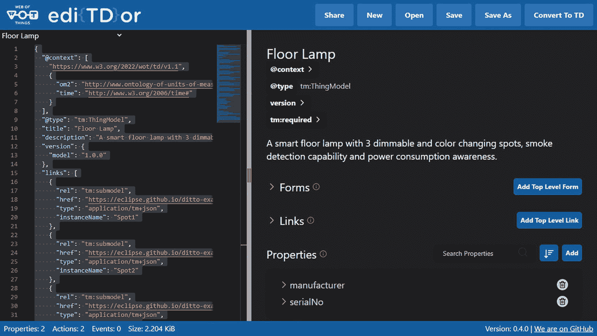
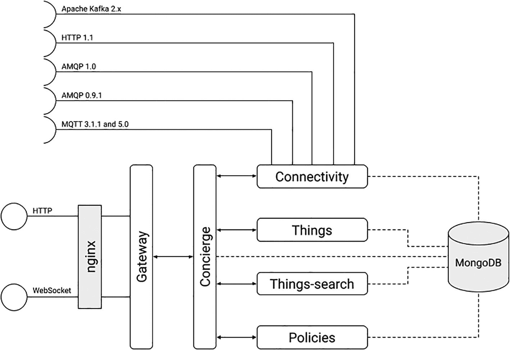
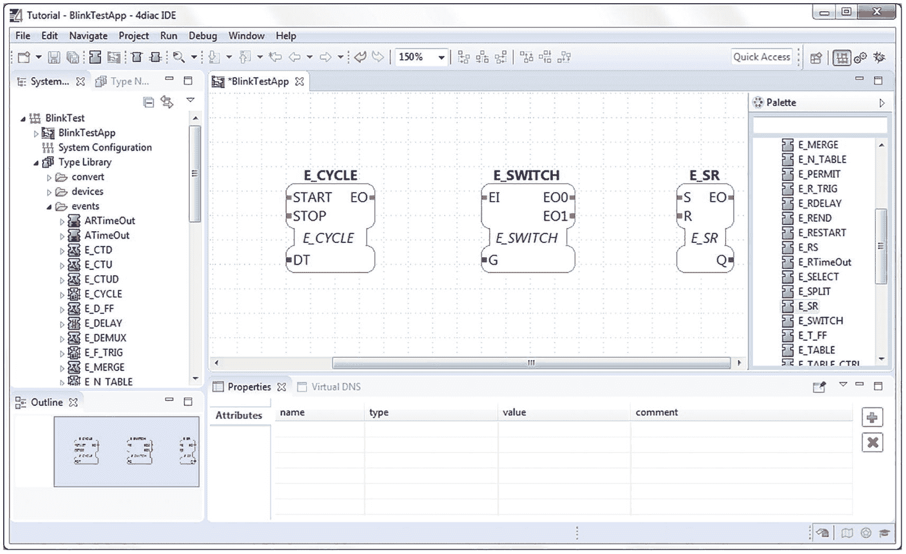
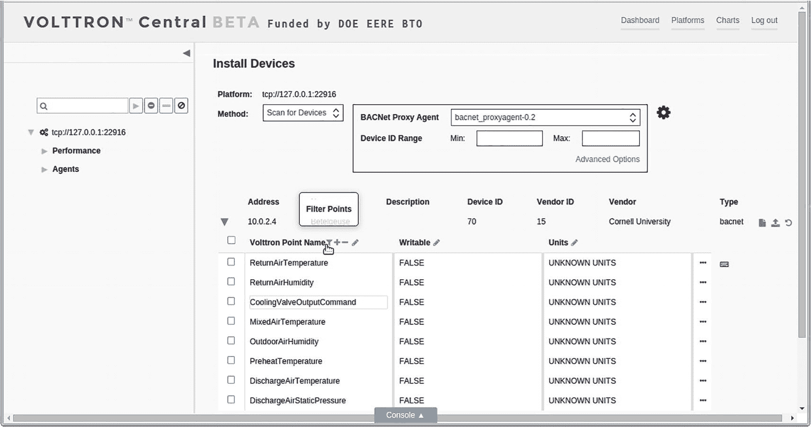

# 12. 应用程序

> *从意愿到意志，从意志到决心，从决心到手段选择，从手段选择到应用，其间路途遥远。*

> *There is a difference between feebleness by the impotence of the will, of the will to the resolution, of the resolution to the choice of means, of the choice of the means to the application.*
> 
> —让·弗朗索瓦·保罗·德·贡迪，雷茨枢机主教

在 20 世纪 90 年代，当我头上还有（一些）头发时，IT 领域要多样化得多。多种 UNIX 变体争夺主导地位。多种处理器架构，如 DEC 的 Alpha、HP 的 PA-RISC 和 Sun 的 SPARC，在数据中心中很常见，而如今它们要么已经消失，要么正走向淘汰。在桌面端，IBM 的 OS/2 曾是未来的操作系统，直到 Windows 抢走了它的午餐。在我撰写本文的 2022 年，每个类别中只剩下少数几个可行的选择。为什么会这样？哪个因素最终决定了哪些处理器架构和操作系统能够存活下来？自然，相关组织的商业策略以及所涉及技术的质量和特性都发挥了作用。然而，决定性的因素是别的。最终，用户选择了那些能够运行他们所需应用程序的处理器和操作系统。从这个意义上说，Word 和 Excel 在确保微软在桌面端的统治地位方面，比 Windows 本身做得更多。

微控制器、边缘节点、协议和操作系统：这些构建模块本身并非目的，而是运行应用程序的方式。本章将介绍三个托管在 Eclipse 基金会的特定开源边缘应用程序或应用程序框架。第一个是 Eclipse 4diac，一个用于可编程逻辑控制器的设计环境和运行时。第二个是 Eclipse Keyple，一种实现非接触式支付的技术。最后，我将介绍 Eclipse VOLTTRON，一个偏向能源管理的分布式传感平台。

如果你是一名开发者，你可能正在或将要自己构建此类应用程序。或者，你可能会开发自己的物联网平台。如果是这样，你必须选择一个运行时，以便在你的边缘和云应用程序中加以利用。我将讨论最广泛使用的那些。

无论你选择何种运行时，你都需要将使用各种协议的设备集成到你的其余基础设施中。实现这一目标主要有两种方法。第一种是使用像 Eclipse Hono 这样的设备连接平台。此类平台提供统一的接口，业务应用程序可以使用这些接口来接收遥测数据和发送命令。然后，平台会抽象化所使用的物联网协议。第二种方法是让设备本身暴露一个与协议无关的接口。万维网联盟（W3C）的 Web of Things（WoT）规范就是一个很好的例子。这两种方法都支持数字孪生模式，这可能是你也会想要利用的东西。

在本章中，我将重点介绍第一种方法。我将讨论 WoT、数字孪生以及相关的 Eclipse IoT 项目。在下一章中，我将介绍物联网平台，包括设备连接平台。

## 应用程序运行时

让我明确一点：我在本节中提到的所有运行时都是编写边缘应用程序或云物联网平台的不错选择。话虽如此，其中一些可能不是针对受限边缘节点的最佳选择。此外，它们在物联网协议实现方面的开源生态系统的健壮性，在多样性、质量和成熟度方面也有所不同。我将尝试为每个运行时涵盖这些方面。


### .NET

传统上，微软的开发工具和运行时是专有的，并且仅支持 Windows 操作系统。这一情况在 2016 年随着 .NET Core（该框架的开源版本）的推出而改变。微软甚至成立了 .NET 基金会，为其提供供应商中立的治理模式。这无疑激发了开源贡献者对其日益增长的兴趣。2020 年，微软宣布 .NET Core 将更名为 .NET，并且未来的所有工作都将集中在这个更名后的开源版本上。截至 2022 年，可以在 Linux、macOS 和 Windows 上编写和部署针对 .NET 的代码。该运行时支持 C#、F# 和 Visual Basic 编程语言。

**注意**

你可能仍然对 .NET 的更名感到困惑。这里有一个简单的方法来区分各个版本。在微软的资料中，专有的仅限 Windows 的 .NET 版本被称为 .NET Framework。当前版本是 4.8。开源的多平台版本被称为 .NET，即以前的 .NET Core。.NET 的 5.x 及更高版本指的是开源版本。

从纯技术角度来看，.NET 是一个优秀的框架，C# 和 F# 语言的实现也是一流的。然而，开源物联网协议实现的可用性参差不齐。例如，Eclipse Paho MQTT 客户端的 C# 实现缺乏常规贡献者，并且不支持 MQTT v5。自然，完整的 .NET Core 运行时的大小在资源受限的设备上也是一个问题。此外，尽管 .NET Core 是开源的并且采用供应商中立的治理模式，但微软在整个生态系统中仍然扮演着举足轻重的角色。

### Java SE 和 Jakarta EE

Java 虚拟机（Java 标准版）和 Java 企业版（Java EE）运行时最初是作为 Sun Microsystems 的专有产品进入市场的。2007 年，Sun 将 Java 标准版运行时和开发工具包开源，从而诞生了 OpenJDK。2018 年，Oracle 决定在 Eclipse 基金会将 Java 企业版规范开源。由于 Oracle 决定保留原始 Java 企业版商标的所有权，该技术被更名为 Jakarta EE。

**注意**

如果你正在寻找预构建的 OpenJDK 二进制文件，可以查看 Adoptium 市场。该市场推广来自不同供应商、支持多种架构的高质量、经过 TCK 认证和 AQAvit 验证的运行时。你可以在以下网址找到它：[`https://adoptium.net/marketplace`](https://adoptium.net/marketplace)。[Adoptium](https://adoptium.net/marketplace) 是 Eclipse 基金会的一个工作组，其自身的 OpenJDK 发行版称为 [Eclipse Temurin](https://adoptium.net/temurin/)。

尽管 Java 不像 1998 年左右那样流行，但其生态系统提供了大量高质量且成熟的物联网协议实现。在 Eclipse 基金会找到的许多开源物联网平台都是用 Java 构建的。此外，Java 虚拟机支持除 Java 之外的语言，例如 Kotlin、Ruby 和 Scala。可以在利用现有 Java 库生态系统的同时使用这些语言。

对 Java 的一个持续批评是虚拟机的启动时间，这使得该运行时不太适合实现部署到容器的无状态微服务。Java EE/Jakarta EE 运行时的庞大体积加剧了这个问题。多年来，人们做出了多项努力，以使 Java SE 更加模块化并精简 Jakarta EE。后者一个很好的例子是 [Microprofile](https://microprofile.io/)，这是一个用于企业 Java 微服务的开源规范。Microprofile 运行时实现仅包含完整 Jakarta EE 平台的一个严格子集，以支持 JSON REST 微服务。其他开源项目，例如 Red Hat 的 [Quarkus](https://quarkus.io/)，会在构建时执行尽可能多的操作，以便在构建输出中仅包含运行时实际使用的类。Quarkus 还强调通过 [GraalVM](https://www.graalvm.org/) 或其下游发行版 [Mandrel](https://github.com/graalvm/mandrel) 编译为原生可执行文件。

尽管其语法比更新的编程语言更冗长，但鉴于其广泛的支持和成熟度，Java 仍然值得你关注。Microprofile 和 Quarkus 等创新解决了它的一些弱点。如今，新语言版本的发布节奏更加可预测，并且开发过程是公开进行的。Java SE 和 Jakarta EE 有多个实现，其中许多是开源的。

### Node.js

JavaScript 是万维网的核心技术之一。与 HTML 和 CSS 一样，其根源可以追溯到 20 世纪 90 年代。Netscape 的 Brendan Eich 最初设计了这种语言。几乎所有现代网站都使用 JavaScript，并且所有主流网络浏览器都拥有专门的 JavaScript 引擎来执行客户端逻辑。JavaScript 遵循 ECMAScript 标准，该标准定义了脚本语言的核心特性。ECMAScript 不涵盖网络、存储或图形等 I/O 设施。大多数 JavaScript 引擎自行提供此类功能。

**注意**

JavaScript 的语法类似于 Java，但这两种语言从未有过直接关系。Netscape 最初选择的名称是 LiveScript，在 1995 年 12 月为了利用 Java 的市场势头而更改。更令人困惑的是，Sun Microsystems 将 JavaScript 名称注册为商标，而 Oracle 仍然拥有该商标。

2009 年，随着 [Node.​js 运行时环境](https://nodejs.org/) 的出现，服务器端的 JavaScript 成为一个严肃的选择。Node.js 是一个基于事件驱动架构构建的开源运行时，支持异步 I/O。Node.js 应用程序是解释执行的。该运行时可在大多数现代操作系统上使用，包括 Linux、macOS 和 Windows。Node.js 仅支持 JavaScript，但有多种语言可以转译成它，例如 CoffeeScript、Dart、TypeScript 等。Node.js 由 [OpenJS 基金会](https://openjsf.org/) 进行供应商中立的治理，该基金会隶属于 Linux 基金会。

**注意**

转译器是一种软件，它接收用一种语言编写的源代码，并生成用另一种语言编写的等效源代码。因此，例如，尽管 JavaScript 是弱类型语言，但 TypeScript 拥有强大的类型系统。

Node.js 在需要非阻塞 I/O 和异步请求处理的应用程序中表现出色。从这个角度来看，它非常适合物联网应用程序和微服务。旧版本在处理处理器密集型任务时存在问题，但第 12 版中引入的工作线程缓解了这个问题。代码是解释执行的这一事实并不意味着性能更低或运行时占用空间更大。尽管 Node.js 的模块（包）生态系统非常庞大，但许多模块并未受益于及时的安全更新或定期维护。换句话说，一个模块在 Node 的包管理器（NPM）索引中可用，并不意味着你应该盲目信任它。此外，涉及代码来源或不兼容许可证的知识产权问题并不少见。如果你使用 Node.js，你需要对你的直接和间接依赖项进行额外的审查。

有适用于最流行物联网协议的 JavaScript 实现。在选择一个时，请确保它与你要使用的特定 Node.js 版本兼容。你还应尽可能彻底地检查所有直接和间接依赖项，以确保你可以信任它们的来源，并且使用的许可证彼此兼容。由于我们强大的知识产权管理流程，Eclipse 基金会提供的 JavaScript 模块通常不会遇到此类问题。


### Python

Python 既是一种编程语言，也是一个运行时。它是 Guido van Rossum 的智慧结晶，他于 20 世纪 80 年代末开始开发 Python，并于 1991 年发布了第一个版本。Python 由成立于 2001 年的 [Python 软件基金会](https://www.python.org/psf/) 管理。

与 Java 和 .NET 类似，Python 被编译为字节码。运行时的参考实现 [CPython](https://github.com/python/cpython) 在其虚拟机上执行该字节码。Python 存在多个可投入生产环境的替代运行时：[Jython](https://www.jython.org/)，用 Java 编写，运行于 Java 虚拟机（JVM）上；[PyPy](https://pypy.org/)，用 RPython 编写并翻译为 C 语言；以及 [IronPython](https://ironpython.net/)，用 C# 编写。这些替代运行时支持其所模拟的 Python 版本的语法和特性，但可能会缺少某些特性或在行为上存在差异。此外，[MicroPython](https://micropython.org/) 和 [CircuitPython](https://circuitpython.org/) 变体拥有针对微控制器运行而优化的运行时。但请注意，这些替代运行时不一定实现了 CPython 中的所有语言特性；这会影响生态系统中库与特定运行时的兼容性。

这种多样化的运行时意味着 Python 是业界最广泛可用的语言之一。例如，CPython 不仅支持 Linux、macOS 和 Windows，还支持一些不太常见的操作系统，如 AIX、FreeBSD、Solaris 和 z/OS。针对资源受限环境的运行时变体进一步扩展了 Python 的适用范围，甚至提供了对硬件的底层访问。然而，Python 通常被认为不适合计算密集型应用。当然，这取决于实际选择的运行时及其配置方式。

Python 提供了全面的标准库和庞大的第三方包生态系统。它是数据科学领域的*事实*标准，并且本书中提到的所有物联网协议都有维护良好的实现。Eclipse Paho 的 Python 版本甚至位列下载量最高的前 1% 的包中。因此，作为物联网应用的运行时，Python 非常值得你关注。然而，Python 包索引（PyPI）与 Node.js 生态系统中的 NPM 存在相同的问题：来源可疑或缺乏维护的包比比皆是，许可或其他知识产权问题也频繁出现。2022 年 7 月，Python 软件基金会宣布，被认定为关键包的维护者需要使用双因素认证（2FA）来防止其代码被恶意行为者劫持。^(⁶³)

### Rust

Rust 是本节中最新出现的语言之一，是一种编译型编程语言。它始于 2006 年，是 Mozilla 员工 Graydon Hoare 的个人项目。编译器的第一个编号版本于 2012 年发布。Rust 专注于类型安全和并发。Rust 提供内存安全；所有引用在运行时都指向有效的内存。这一点在编译时得到强制执行。Rust 由成立于 2021 年的 Rust 基金会拥有和维护。

与本节中提到的其他语言相反，Rust 不提供传统意义上的运行时。Rust 全面的标准库的某些部分提供了通常与运行时相关的特性，例如堆、回溯、展开和栈保护。标准库（或用 Rust 的说法，crate）假设应用程序将部署在桌面级或服务器级的操作系统上，例如 Linux。此外，Rust 标准库还会链接到 C 标准库。对于部署在裸机微控制器上的应用程序，也可以选择不使用标准 crate，而是链接到核心 crate。核心 crate 是标准 crate 的一个平台无关的子集，它不对程序将要运行的系统做任何假设。因此，仅依赖核心 crate 的 Rust 程序可以成为引导加载程序、固件或操作系统内核等底层组件。

Rust 被纳入本节是因为它在物联网和边缘计算领域日益流行。诸如 [Drogue IoT](https://www.drogue.io/) 等项目展示了 Rust 在编写面向受限设备、边缘或云的应用方面的适用性。在 Rust 中，代码包被称为 *crates*。由于 Python 和 JavaScript 存在的时间长得多，它们各自的库生态系统远超 Rust。然而，大多数物联网协议都有维护良好的实现。需要提醒的是，Eclipse 基金会自己的 [zenoh 协议](https://zenoh.io/) 的核心实现就是用 Rust 编写的。

### WebAssembly

WebAssembly（Wasm）与我讨论的其他运行时不同，因为它不绑定于任何特定的编程语言。其网站将其描述为“*一种基于栈的虚拟机的二进制指令格式*”。它于 2015 年宣布，2017 年首次发布。WebAssembly 于 2019 年成为[万维网联盟推荐标准](https://www.w3.org/TR/2019/REC-wasm-core-1-20191205/)^(⁶⁴)。规范 2.0 版本的第一个公开工作草案于 2022 年 4 月发布。

最初，WebAssembly 被设计为一个内存安全、沙盒化的执行环境，能够在 Web 浏览器内提供接近原生的代码执行速度。然而，其使用虚拟机所带来的可移植性使其在其他用途上也颇具吸引力。现在市场上已有许多通用运行时实现，使你能够在边缘或云端部署 WebAssembly 代码。

WebAssembly 实现依赖于提前编译（AOT）或即时编译（JIT）。然而，有些实现则利用了解释器。在撰写本文时，大约有 40 种编程语言支持将 WebAssembly 作为编译目标。较为知名的选项包括 C/C++、C#、F#、Go、Kotlin、Rust 和 Swift。无论使用何种原始语言，WebAssembly 代码都可以通过一种由属性文法定义的[文本格式](https://webassembly.github.io/spec/core/text/conventions.html)进行美化打印。^(⁶⁵)

由于它纯粹是一个运行时，支持你首选物联网协议的库的可用性将取决于你选择的编程语言。鉴于开发人员对在浏览器之外部署 WebAssembly 代码的兴趣日益增长，针对边缘和云环境的编排平台生态系统正在蓬勃发展。然而，在这一点上，没有一个平台能达到虚拟机或容器编排领域领先平台的成熟度。尽管如此，如果你想构建可移植、高性能的应用程序，WebAssembly 仍然是一个强有力的竞争者。我强烈建议你尝试几个开源的运行时实现，以找到适合你需求的那一个。

### 如何选择你的运行时

我讨论的所有选项都是构建边缘和物联网云应用的不错选择，它们都拥有强大的开源库生态系统。选择其中任何一个都不会出错。最终，你应该选择你熟悉且能让你高效工作的编程语言。当然，具备所需技能的开发人员的可用性也是一个考虑因素。从长远来看，如果可能的话，你应该认真考虑 Rust 和 WebAssembly。前者的内存安全特性使其比替代方案更安全，而后者则提供了应用程序的可移植性。无论你选择哪个选项，只需确保你依赖的依赖项来源可靠，并且至少能及时收到安全更新。关注知识产权和许可问题也会带来长期回报。


## 物联网（Web of Things）

本质上，物联网和边缘计算的部署是异构的。这一点我已经多次强调。当前市场上的设备和软件平台涉及多种协议、数据模型和安全要求。鉴于其复杂性，自 21 世纪初以来，开发者和研究人员一直在探索通过 Web 技术连接物理对象的想法。随着时间的推移，这些努力不断加强，最终促成了万维网联盟（W3C）于 2016 年成立了物联网（WoT）工作组。

物联网提供了一套标准化的构建模块，通过利用成熟的 Web 范式来简化物联网应用的开发。具体来说，它建立了一个由属性、动作和事件组成的交互模型。属性反映了“物”的状态；它们可以是传感器数值、配置设置或某些计算的结果。根据所使用的 TD 提供者，属性可以是可观察的。另一方面，动作通常涉及与物理世界的交互。典型的例子包括启动电机、打开阀门或解锁门。最后，事件用于传达设备检测到的特定用例情况，例如“燃油不足”、“阀门已打开”或“检测到入侵者”。你可以在此处访问 WoT 架构规范：[`www.w3.org/TR/wot-architecture11/`](http://www.w3.org/TR/wot-architecture11/)。

WoT 是一个开放标准。它依赖于许多成熟的 Web 标准，如 HTTP、JSON、JSON-LD、JsonSchema、JsonPointer 等。它由一个多元化的社区积极开发。与 Eclipse 基金会规范流程一样，W3C 的规范流程是透明且开放的。决策公开进行，会议记录对所有人开放，规范也在公开的 GitHub 仓库中开发。

WoT 模型在*WoT 物描述*（TD）中描述物理对象。TD 是 WoT 的核心支柱。由于它提供了对物元数据的访问，你可以将其视为网站主页的等价物。WoT TD 描述了该物提供哪些数据和功能、使用何种协议访问它们、数据的结构和编码方式，以及所涉及的访问控制机制。该物还可以以机器可读或人类可读的格式提供额外的元数据。你可以从设备本身、存储库（TD 目录）或第三方中介（如 Eclipse Ditto）获取物的 TD。TD 使用 JSON-LD 表示。

WoT 物描述规范的下一个修订版（[1.1 版](https://www.w3.org/TR/wot-thing-description11/)）将引入物模型（TM）概念。TM 定义了物的属性、动作和事件，但不提供实例特定的细节，例如可用的协议或绑定模板。在撰写本文时，WoT 物描述规范 1.1 版仍为工作草案。

WoT 与协议无关。然而，它提供了一种机制来定义 WoT 的属性-动作-事件抽象与特定协议实现（如 CoAP、HTTP 和 MQTT）之间的映射。这种机制的名称是*WoT 绑定模板*。绑定模板定义了物实例的消费者如何通过协议接口激活 TD 中指定的 WoT 交互。

除了 TD 和绑定模板，WoT 工作组还维护了一个针对 JavaScript（ECMAScript）的 WoT 脚本 API。该 API 实现了属性-动作-事件抽象，并定义了一个基于脚本的运行时可以利用的接口。当然，也可以在非脚本语言（如 Java、Python 或 Rust）中实现相同的 API。在撰写本文时，该 API 还不是一个完整的 WoT 规范，而是作为工作组备忘录提供。工作组还为 WoT 实现提供了安全和隐私指南。

WoT 提供了有用的抽象，使开发者能够实现互联对象。我将在后面详细介绍的[Eclipse Thingweb](https://www.thingweb.io)项目是 WoT 脚本 API 的参考实现。

### Eclipse EdiTDor

[Eclipse EdiTDor](https://github.com/eclipse/editdor)使用 JavaScript 编写，可以创建、渲染、编辑和验证 WoT 物描述。它使用 React 作为其 UI 框架，并且需要 Node.js 来构建 Web 应用程序。EdiTDor 具有用于创建属性、动作和事件的向导。它还附带了一个 JSON 编辑器，支持通过 JSON 模式进行验证和自动补全。EdiTDor 提供了与表示为 JSON-LD 的 TM/TD 格式的双向绑定，这提供了一种使用 JSON 编码链接数据的方法。图 12-1 展示了 EdiTDor 的外观。



Web of Things EdiTDor 0.4.0 版本的屏幕截图，左侧显示落地灯的代码，右侧显示上下文、类型、添加顶层表单和链接的选项，以及制造商和序列号的属性。

图 12-1

EdiTDor 用户界面

当你对物模型或物定义满意后，让消费者能够访问它们的一种方法是将文件部署到 HTTP 服务器上。为此，你可以保存你在 EdiTDor 中创建的 TM 或 TD 的副本。

#### EdiTDor 入门

EdiTDor 团队在以下位置提供了一个应用程序实例：[`https://eclipse.github.io/editdor/`](https://eclipse.github.io/editdor/)。假设你的工作站上安装了 Node.js 10 或更高版本。在这种情况下，你也可以通过克隆项目的 Git 仓库并从根文件夹执行以下命令，轻松地运行一个本地实例：

```
yarn start
```

启动后，你可以通过以下 URL 访问它：`http://localhost:3000/`。

### Eclipse Thingweb

Eclipse Thingweb 是一个提供实现 WoT 规范的软件平台的项目。在撰写本文时，唯一发布的平台是 node-wot，即 WoT 规范的参考实现。

Thingweb 的官方 Web 资源如下：

*   **网站：** [`www.thingweb.io/`](http://www.thingweb.io/)

*   **Eclipse 项目页面：** [`https://projects.eclipse.org/projects/iot.thingweb`](https://projects.eclipse.org/projects/iot.thingweb)

*   **代码仓库：** [`https://github.com/eclipse/thingweb.node-wot`](https://github.com/eclipse/thingweb.node-wot)

node-wot 提供了一个 WoT 物描述解析器和序列化器、多个绑定模板实现（包括 HTTPS、CoAP 和 MQTT 等），以及一个符合 WoT 脚本 API 的应用程序运行时系统。node-wot 还包含一个 Web 用户界面，用于可视化 TD 并实现与物实例的交互。node-wot 可根据[Eclipse 公共许可证 2.0 版](https://www.eclipse.org/legal/epl-2.0/)或[W3C 软件声明和文档许可证（2015-05-13）](https://www.w3.org/Consortium/Legal/2015/copyright-software-and-document)使用。在撰写本文时，当前版本为 v0.8.1，于 2022 年 5 月 19 日发布。

node-wot 使用 JavaScript 编写，并运行在 Node.js 运行时上。这意味着你可以通过三种方式使用它：作为库、作为独立应用程序，或在浏览器内部使用。后者将可用的绑定模板限制为 HTTPS 和 WebSocket。node-wot 可以消费（客户端）和暴露（服务器）物实例。

除了 node-wot，Thingweb 团队还计划在未来开发一个物目录。物目录是 WoT TD 的目录服务，提供用于注册和查找 TD 的服务接口。Thingweb 目录将符合[RFC 9176](https://www.rfc-editor.org/info/rfc9176)（受限 RESTful 环境（CoRE）资源目录）。


#### node-wot 入门指南

如何开始使用 node-wot 取决于你将如何利用该平台。我将重点介绍将其作为库或独立应用程序使用的情况，因为这是两种最常见的用例。

由于 node-wot 依赖于 Node.js，开发团队通过 NPM 包管理器将其作为依赖项提供。鉴于 node-wot 的模块化特性，有多个可用包。核心平台位于 `node-wot-core` 中，每个绑定模板都有独立的包。你可以通过执行以下命令列出所有相关包：

```
npm search @node-wot
```

假设你只想使用 HTTP 绑定模板。那么，你可以通过以下命令安装相关依赖：

```
npm i @node-wot/core @node-wot/binding-http –save
```

库安装完成后，你就可以构建应用程序了。以下代码片段展示了如何实例化一个 WoT 服务器。

```
const Servient = require('@node-wot/core').Servient;
const HttpServer = require('@node-wot/binding-http').HttpServer;
const servient = new Servient();
servient.addServer(new HttpServer());
servient.start().then((WoT) => {
let thing = WoT.produce({
title: "ThingTThing",
description: " Beware of the Thing.",
});
// 在此处添加定义属性、操作和事件的代码
thing.expose();
});
```

服务器启动后，上述代码使用 `WoT.produce` 创建一个 Thing 实例，该实例将通过配置的绑定模板可用。Thing 的标题决定了其 URL。默认情况下，HTTP 模板将使用端口 8080。

假设你已经在工作站上启动了一个运行上述代码的服务器。你将如何通过 HTTP 消费刚刚创建的 Thing 实例？以下代码片段实现了这一功能：

```
const { Servient, Helpers } = require("@node-wot/core");
const { HttpClientFactory } = require('@node-wot/binding-http');
const servient = new Servient();
servient.addClientFactory(new HttpClientFactory(null));
const WoTHelpers = new Helpers(servient);
WoTHelpers.fetch("http://localhost:8080/ThingTThing").then(async (td) => {
try {
servient.start().then(async (WoT) => {
let thing = await WoT.consume(td);
// 在此处使用 Thing 的属性和操作
});
}
catch (err) {
console.error("脚本错误:", err);
}
}).catch((err) => { console.error("获取错误:", err); });
```

当然，你能用 Thing 实例实现什么功能取决于它实现了哪些属性和操作。GitHub 上的 node-wot 仓库包含了暴露和消费 Thing 所涉及 API 的概述。你可以在此处找到：[`https://github.com/eclipse/thingweb.node-wot/blob/master/API.md`](https://github.com/eclipse/thingweb.node-wot/blob/master/API.md)。

## 数字孪生

到目前为止，我已经讨论了微服务中的物联网应用以及支持它们的运行时平台。虽然这种方法可行，但过去几年中一些更高级的抽象概念已经流行起来。其中最突出的是数字孪生。

数字孪生的核心是一个虚拟模型，它精确反映物理对象的属性和状态。数字孪生的*概念*最早由大卫·格勒恩特尔在 1991 年出版的《镜像世界》一书中提出。然而，直到 2002 年，时任密歇根大学教员的迈克尔·格里夫斯博士才将其应用于制造业。*术语*“数字孪生”最终由 NASA 的约翰·维克斯在 2010 年创造。话虽如此，NASA 早在 20 世纪 60 年代的任务就已经采用了这种方法。该航天局为其发射的每个航天器都建造了复制品，用于学习和模拟目的。令人着迷的是，太空探索在边缘计算（如第 1 章所述）和数字孪生的诞生中发挥了重要作用。

注意

数字孪生适用于许多行业。制造业、建筑业、医疗保健和汽车行业是一些最好的例子。像[工业数字孪生协会](https://industrialdigitaltwin.org/en/)（IDTA）这样的组织正在努力定义互操作性规范并集成协调的子模型。这促成了 Eclipse 基金会[数字孪生顶级项目](https://projects.eclipse.org/projects/dt)的创建。

许多产品都在提出数字孪生的方法。在本节的剩余部分，我将提出一种利用现有标准和开源项目来实现它们的方法。


### Eclipse Ditto

Eclipse Ditto 是一个数字孪生平台，通过数字孪生体抽象设备交互。它支持设备到云端和云端到设备两种交互方式。使用 Ditto，你可以为新的或现有的设备构建数字孪生体；换句话说，它同时支持棕地（brownfield）和绿地（greenfield）部署。由于所有设备交互都通过其数字孪生体进行编排，Ditto 对所有 API 调用强制执行授权。该平台还提供了通过 HTTP、WebSockets 以及 MQTT 和 Apache Kafka 等其他广泛使用的协议与数字孪生实例交互的 SDK。Ditto 被明确设计为云后端。它可以水平扩展，并能够同时为数百万个连接的设备提供数字孪生体。

博世（Bosch）于 2017 年将 Ditto 项目贡献给了 Eclipse 基金会。Ditto 采用 Eclipse 公共许可证 2.0 版进行许可。在我撰写本文时，当前版本是 v2.4.0，于 2022 年 4 月 14 日发布。

Ditto 的官方网络资源如下：

*   **网站：** [`https://eclipse.org/ditto`](https://eclipse.org/ditto)

*   **Eclipse 项目页面：** [`https://projects.eclipse.org/projects/iot.ditto`](https://projects.eclipse.org/projects/iot.ditto)

*   **代码仓库：** [`https://github.com/eclipse/ditto`](https://github.com/eclipse/ditto)

Ditto 是一个经过深思熟虑的职责分离的典型例子。它的重点仅在于提供数字孪生后端，将设备连接和软件更新留给其他专门的平台。Ditto 的功能范围可以概括如下：

*   提供 API，抽象物理设备所使用的物联网协议细节

*   在应用程序与设备之间路由请求，或路由到 Ditto 中持久化的设备最后已知状态

*   强制执行授权

*   持久化设备发送的最后已知值

*   通知相关方有关数字孪生体持久化状态的变更

*   建立并维护与消息代理的连接，支持第三方应用程序与数字孪生体进行异步交互

*   在需要时应用负载转换，将现有棕地设备的负载映射为 Ditto 可以理解的格式

*   维护所有持久化孪生数据的搜索索引

*   公开 API，用于处理针对整个设备群的传感器数据的查询

Ditto 中有几个核心实体。以下是这些主要实体的列表：

*   **Thing（事物）：** 代表设备（物理或虚拟）、交易、主数据或任何可以建模的事物的通用实体。Thing 是数字孪生实例；其交互能力可以通过例如 WoT Thing Model 来定义。一个 Thing 拥有属性和特征。属性是静态元数据，例如序列号。特征反映 Thing 的状态；例如，这可以是传感器值或配置设置。

*   **Message（消息）：** 发送到 Thing 所代表实体或从该实体接收的任意负载。发送到设备的消息是应触发操作的操作。从设备接收的消息是由实体传播的事件。Ditto 不对离线实体执行消息保留。默认情况下，每条消息最多投递一次，这意味着没有投递保证。然而，Ditto 通过确认（acknowledgments）提供了“至少一次”投递的机制。

*   **Policy（策略）：** 为 Thing、Feature、Message 以及 Policy 本身指定细粒度的访问控制。

在内部，Ditto 依赖一个基于信号的系统来跟踪数字孪生体（Thing）及其所代表的实体。这些信号包括命令、命令响应、错误响应、事件和公告。Ditto 还管理着指示信号已成功接收或处理的确认。此外，Ditto 拥有连接（connection）的概念，这是一个具有不同生命周期的独立实体，代表用于交换消息的通道。此类连接可以与设备连接平台（如 Eclipse Hono）、MQTT 代理或消息服务（如 RabbitMQ 或 Apache Kafka）建立。

Ditto 还定义了一个同名的协议，已注册为官方的 IANA 媒体类型。该协议依赖 JSON 负载，并且可以在多种网络传输协议上运行，即 AMQP（0.9 和 1.0）、HTTP 1.1、MQTT（3.1.1 和 5.0）、Kafka 2.x 和 WebSocket。负载代表应用程序数据，并被封装到一个用于将请求路由到其目的地的信封中。为了简化 Ditto 协议的使用，项目团队维护了 Java 和 JavaScript SDK，你可以在需要创建数字孪生体或与之交互的应用程序中使用它们。你也可以使用 Ditto REST 和 WebSocket API 达到相同目的。

Ditto 平台采用微服务实现，这些微服务通过预定义的信号进行异步通信。你可以根据可扩展性需求对每个服务进行水平扩展。以下是这些服务的列表：

*   **Policies（策略服务）：** 负责 Policy 的持久化。

*   **Things（事物服务）：** 负责 Thing 及其 Feature 的持久化。

*   **Things-Search（事物搜索服务）：** 跟踪 Thing、Feature 和 Policy 的变更。该服务还维护一个搜索索引并对其执行查询。

*   **Concierge（礼宾服务）：** 编排执行持久化的服务，并授权对它们的请求。

*   **Gateway（网关服务）：** 公开 REST 和 WebSocket API。

*   **Connectivity（连接服务）：** 通过建立到多个外部消息系统的通道来发送和接收消息。

图 12-2 展示了这些微服务在 Ditto 架构上下文中是如何交互的。



一个架构包括带有 HTTP 和 WebSocket 的 Nginx；网关；礼宾服务；Apache Kafka 2.x、HTTP 1.1、AMQP 1.0 和 0.9.1、MQTT 3.1.1 和 5.0 的连接服务；事物服务；事物搜索服务；策略服务；以及 MongoDB。

图 12-2

Eclipse Ditto 架构（图片来源：Eclipse 基金会）

你可能注意到架构中包含了两个第三方组件。一个是 Nginx，用作反向代理；另一个是 MongoDB，用于持久化 Policy、Thing、Connection 以及 Thing 搜索索引。


#### Ditto 入门指南

Ditto 所需的资源比本书介绍的其他平台略多一些。其微服务通过容器镜像交付，并可在多种引擎上运行，包括 Docker、Kubernetes 和 OpenShift。Podman 也是一个备选方案，因为它致力于与 Docker 兼容。Ditto 团队建议，至少分配 2 个 CPU 核心和 4 GB 内存，以便在工作站上启动本地实例。如果使用 Kubernetes 发行版编排容器，则可能需要更多资源。或者，你也可以在实验中使用 Ditto 公共沙箱。该沙箱可通过 HTTP 和 WebSocket 在 `ditto.eclipseprojects.io` 访问。

Ditto 团队在此处提供了安装说明：[`https://github.com/eclipse/ditto/blob/master/deployment/README.md`](https://github.com/eclipse/ditto/blob/master/deployment/README.md)。或者，你也可以在 Kubernetes 集群上部署 [Eclipse IoT 软件包](https://www.eclipse.org/packages/)项目中的 [Cloud2Edge 软件包](https://www.eclipse.org/packages/packages/cloud2edge/)。Cloud2Edge 提供了预配置且集成的 Eclipse Ditto 和 Eclipse Hono 实例。我将在下一章介绍 Hono。目前，我将仅说明如何在 Linux 或 macOS 平台上使用 Docker 独立部署 Ditto。

与 Docker 部署相关的文件位于 GitHub 仓库的 [`https://github.com/eclipse/ditto/tree/master/deployment/docker`](https://github.com/eclipse/ditto/tree/master/deployment/docker) 路径下。将它们获取到工作站的最简单方法是克隆该仓库。完成后，打开命令行提示符，并进入 `deployment/docker` 子文件夹。

第一步是在 Nginx 反向代理上配置安全设置。Ditto 团队提供的 `nginx.conf` 文件在 HTTP 和 WebSocket 端点上均设置了基本认证。你需要为 `ditto` 用户以及任何你想添加的账户分配密码。要创建此类密码，请运行以下命令：

```
openssl passwd -quiet
Password: 
Verifying - Password: 
```

确认密码后，该命令将打印一个哈希值。你应该将该哈希值粘贴到 `nginx.httpasswd` 文件中。以下是一个示例。你可以通过将新用户及其哈希值添加到该文件中来创建更多用户。

```
ditto:ZKrYJB4LjwQMQ
```

现在，你可以启动 Ditto 实例了。只需运行以下命令即可：

```
docker-compose up -d
```

为确保一切正常运行，你可以使用以下命令：

```
docker-compose logs -f
```

#### 客户端 SDK 入门指南

如前所述，Ditto 客户端 SDK 适用于 Java、JavaScript、Go 和 Python。我将在此展示如何使用 Java 版本。

Ditto 团队在 Maven Central 上发布了其 Java 客户端 SDK。要将其添加到你的项目中，你只需将以下依赖项添加到你的 `pom.xml` 文件中：

```
org.eclipse.ditto
ditto-client
${ditto-client.version}

```

SDK 的新版本会与 Ditto 版本同步发布。建议保持两者版本一致，尽管 Ditto 团队致力于使 SDK 与后端向前兼容。

在开始任何操作之前，你需要创建并配置一个 Ditto 客户端实例。相关类属于 `org.eclipse.ditto.client.configuration` 包。此过程的第一步是创建 AuthenticationProvider 和 MessagingProvider 的实例。对于 `AuthenticationProvider`，当使用基本认证时，配置如下所示：

```
AuthenticationProvider authProvider =
AuthenticationProviders.basic(
BasicAuthenticationConfiguration.newBuilder()
.username("ditto")
.password("ditto")
.build());
```

`MessagingProvider` 同样简单明了。在以下代码片段中，我使用公共 Ditto 沙箱的 WebSocket URL 作为目标端点：

```
MessagingProvider messProvider =
MessagingProviders.webSocket(
WebSocketMessagingConfiguration.newBuilder()
.endpoint("wss://ditto.eclipseprojects.io")
.build(), authProvider);
DittoClient client =
DittoClients.newInstance(messProvider);
```

获得客户端后，你就可以操作 Thing 和 Policy 了。例如，要创建一个 Thing 实例并将其持久化到后端，你可以使用以下代码：

```
final Thing thing = Thing.newBuilder()
.setId(ThingId.of(
"com.blueberrycoder:LaserShark-93110798"))
.setFeature("Laser",
FeatureProperties.newBuilder()
.set("Power", 9001)
.build())
.build();
// 战斗力超过 9000！
client.twin().create(thing).get(1, SECONDS);
```

在上面的示例中，我创建了一个包含单个 Feature 的 Thing，该 Feature 本身又由一个 Property 组成。只有当调用 `create()` 方法时，该 Thing 才会持久化到 Ditto 后端。

Ditto 团队为所有 SDK 维护了大量示例，这些示例位于 `ditto-examples` 仓库中。该仓库的地址是：[`https://github.com/eclipse/ditto-examples`](https://github.com/eclipse/ditto-examples)。

## 整体架构如何协同工作

EdiTDor、Thingweb node-wot 和 Ditto 可以在以 WoT 为中心的工作流中协同使用。我现在将解释如何实现。基本上，Ditto 可以不依赖 WoT 来创建和管理数字孪生。然而，当 Ditto 孪生实例引用 WoT Thing Model 时，Ditto 可以为它们生成 TD。WoT 消费者可以通过 HTTP 绑定模板访问这些 TD 及其属性、动作和事件。自然，整个工作流依赖于 TM 的可用性。由于手动编写 TM 需要对完整的 WoT TD 和 TM 规范有深入理解，Eclipse 社区的成员创建了 Eclipse EdiTDor 图形化编辑器来简化此任务。

因此，作为开发者，你可以使用 EdiTDor 创建 TM。然后，你可以通过 HTTP 服务器使其可用。这将使你能够通过 Ditto SDK 或平台的 REST API 创建引用这些 TM 的 Thing 实例（孪生）。Ditto 可以为孪生实例生成 TD，你可以从 node-wot 或其他符合 WoT 规范的平台消费这些 TD。

以下是一个示例。Ditto 团队在以下 URL 提供了一个描述落地灯的 TM：

[`https://eclipse.github.io/ditto-examples/wot/models/floor-lamp-1.0.0.tm.jsonld`](https://eclipse.github.io/ditto-examples/wot/models/floor-lamp-1.0.0.tm.jsonld)

我们可以使用一个简单的 `curl` 请求通过 REST API 创建一个 Ditto Thing。

```
curl --location --request PUT -u ditto:ditto 'https://ditto.eclipseprojects.io/api/2/things/com.blueberrycoder:floor-lamp-0813' \
--header 'Content-Type: application/json' \
--data-raw '{
"definition": "https://eclipse.github.io/ditto-examples/wot/models/floor-lamp-1.0.0.tm.jsonld"
}'
```

如果成功，该请求将返回 201 响应码，并且你将在响应正文中看到 JSON 格式的 Ditto Thing 负载定义。

此时，可以通过 HTTP 绑定模板将 Ditto Thing 作为 WoT TD（Thing Description）来消费，这是 Ditto 目前唯一支持的绑定模板。以下 curl 请求将检索我刚刚创建的 Thing 的 TD 定义：

```
curl --location --request GET -u ditto:ditto 'https://ditto.eclipseprojects.io/api/2/things/com.blueberrycoder:floor-lamp-0813' \
--header 'Accept: application/td+json'
```

该请求将返回 200 响应码，并在响应正文中返回 WoT TD 格式的 Thing 定义。这是因为我在请求中指定了适当的 MIME 类型（`application/td+json`）。

此时，你可以从 node-wot 消费该 Thing 实例。这样做的意义在于，Ditto 可以在更广泛的系统中托管作为数字孪生的 Thing，而 node-wot 则负责代理访问真实设备和其他非孪生软件组件。


## 几个应用示例

数字孪生以及我之前介绍的运行时，为构建企业级物联网应用和平台提供了途径。随后，你可以将这些应用的组件部署在边缘到云端连续体中的各个位置。在本章的剩余部分，我们将探讨三个应用或应用框架，它们展示了你可以构建或运行的内容。

### Eclipse 4diac

Eclipse 4diac 为分布式工业过程测量与控制系统提供了开源基础设施。它基于 [IEC 61499](https://webstore.iec.ch/publication/5506) 标准，该标准定义了一种基于功能块的领域特定建模语言，用于构建分布式工业控制解决方案。该项目由 Thomas Strasser 和 Alois Zoitl 于 2007 年宣布，并于 2015 年贡献给 Eclipse 基金会。其代码采用 Eclipse 公共许可证 2.0 版发布。

4diac 包含两个主要组件：Forte 和 IDE。Forte 是符合 IEC 61499 标准的运行时的一个可移植、占用空间小的实现。它使用 C++ 编写，面向 16 位和 32 位受限控制器。它可以在多种操作系统上运行，其中 Linux、VxWorks 和 Windows 是较为知名的选择。对 FreeRTOS 的支持正在开发中。从协议角度来看，Forte 支持基于 IP 的 TCP 和 UDP，以及 MQTT 和 OPC UA 等协议。也可以使用串行（RS-232）通信。另一方面，IDE 是一组用 Java 编写的 Eclipse 桌面 IDE 插件。它为面向 Forte 运行时的开发者提供了一个设计环境。

图 12-3 展示了运行中的 4diac IDE。



一张屏幕截图显示了 Tutorial-BlinkTestApp-4diac IDE 的界面，中央是 E_CYCLE、E_SWITCH 和 E_SR 的图表，左侧是系统配置、类型库和大纲，底部是属性。

图 12-3

4diac IDE（图片来源：Eclipse 基金会）

4diac 的官方网络资源如下：

*   **网站：** [`https://eclipse.org/4diac`](https://eclipse.org/4diac)
*   **Eclipse 项目页面：** [`https://projects.eclipse.org/projects/iot.4diac`](https://projects.eclipse.org/projects/iot.4diac)
*   **代码仓库：** [`https://git.eclipse.org/c/4diac/org.eclipse.4diac.forte.git/`](https://git.eclipse.org/c/4diac/org.eclipse.4diac.forte.git/)（运行时）
    [`https://git.eclipse.org/c/4diac/org.eclipse.4diac.ide.git/`](https://git.eclipse.org/c/4diac/org.eclipse.4diac.ide.git/)（IDE）

4diac IDE 通过提供可视化编辑器来构建功能块图，从而支持开发过程。IDE 自带多个预定义的功能块，但你也可以设计自定义功能块。

4diac Forte 通常部署在可编程逻辑控制器上。这些是用于控制制造过程的加固型工业计算机。项目文档提供了在各种硬件平台上工作的说明。此外，4diac IDE 还配备了一个设备模拟器，使你无需专用硬件即可运行和调试面向 Forte 的应用。

制造和过程控制通常是高度分布式的，PLC 充当边缘节点，本地或远程的监控与数据采集系统协调操作。由于 4diac 的运行时是用 C++ 编写的，因此它依赖于目标操作系统或编译器提供的标准 C 库。

### Eclipse Keyple

如果你去过法国，乘坐过法国国家铁路公司的火车，或在巴黎搭乘过地铁或公交车，那么你已经在不知不觉中使用了基于 Eclipse Keyple 的边缘应用。Keyple 是一个开源框架，用于简化支持基于智能卡流程并实现安全票务交易的终端实现。Keyple 于 2018 年由 [Calypso 网络协会](https://calypsonet.org/) 贡献给 Eclipse 基金会。它根据 Eclipse 公共许可证 2.0 版发布。

Keyple 的官方网络资源如下：

*   **网站：** [`https://keyple.org`](https://keyple.org)
*   **Eclipse 项目页面：** [`https://projects.eclipse.org/projects/iot.keyple`](https://projects.eclipse.org/projects/iot.keyple)
*   **代码仓库索引：** [`https://github.com/eclipse/keyple`](https://github.com/eclipse/keyple)

Keyple 主要有两种实现：一种用 Java，另一种用 C++。两者在功能上大致相当。在撰写本文时，该框架的当前版本是 v2.0，这是对先前版本进行完全模块化重写的版本。你应该使用这个版本。尽管代码库现在分布在多个仓库中，但项目团队提供了工具和说明，以便轻松获取你的应用所需的组件。

Keyple 的核心功能集中在智能卡读卡器上。Keyple 提供了支持多种读卡器接口标准的插件，包括 PC/SC、NFC（在 Android 上）和 OMAPI。读卡器可以是本地的或远程的，从而能够在边缘创建高度分布式的解决方案。Keyple 还支持 Calypso 处理 API，用于管理 Calypso 命令和安全功能。这实质上意味着，你的应用可以实时确定车票余额、确认持票人权限，并更新车票数据以扣除行程费用并计算新余额，等等。

你会在边缘的各种场景中找到基于 Keyple 的应用。它们可以处理各种基于智能卡的使用场景，而不仅仅是票务。Java 版本使你可以轻松地将代码移植到新硬件上，而 C++ 版本则可以支持更广泛的读卡器和设备，包括那些无法支持 Java 运行时占用空间的、资源非常受限的设备。


### Eclipse VOLTTRON

Eclipse VOLTTRON 是一个用于分布式感知和控制的**开源平台**。它提供从设备和建筑中收集和存储数据的服务，以及一个用于开发与这些数据交互的应用程序的环境。VOLTTRON 由太平洋西北国家实验室（PNNL）的一个团队创建，并于 2019 年贡献给 Eclipse 基金会。它采用 Apache 许可证 2.0 版本进行授权。

VOLTTRON 的官方网络资源如下：

*   **网站：** [`https://volttron.org`](https://volttron.org)

*   **Eclipse 项目页面：** [`https://projects.eclipse.org/projects/iot.volttron`](https://projects.eclipse.org/projects/iot.volttron)

*   **代码仓库：** [`https://github.com/eclipse-volttron`](https://github.com/eclipse-volttron)

VOLTTRON 使用 Python 编写，并面向 Linux 操作系统。该平台由几个不同的组件构成。以下是主要组件的列表：

*   **代理：** 代表用户执行任务的软件组件。常见的用例包括数据收集、设备控制和平台管理。

*   **消息总线：** 系统的骨干。它允许代理发布其结果和消息，并订阅数据源。您可以配置 VOLTTRON 使用 ZeroMQ 或 RabbitMQ 来提供消息总线。

*   **驱动框架：** VOLTTRON 代理与设备之间的接口。该平台自带丰富的驱动程序集，您也可以开发自己的驱动程序。

*   **历史记录框架：** 代理可以利用的 API，用于自动从消息总线上定义的特定主题子集收集数据，并将其持久化到历史记录数据库中。项目团队目前维护着针对 SQL 数据库、MongoDB 和 CrateDB 等的历史记录器。您当然也可以构建自己的历史记录器。

*   **用户界面：** 用于从一个中心实例管理分布式实例的 Web 图形化管理界面。

图 12-4 展示了 VOLTTRON 用户界面的概览。



一张屏幕截图显示了 VOLTTRON Central BETA 的界面，包含平台、方法、BACnet 代理、地址、描述、设备 ID、供应商 ID、供应商、类型、Volttron 点名称、可写性以及已安装设备的单位。

图 12-4

VOLTTRON 管理用户界面（来源：Eclipse 基金会）

VOLTTRON 是一个支持开发分布式物联网应用的平台和框架的绝佳范例。您可以使用它来构建自己特定任务的代理，以覆盖众多用例。PNNL 及其合作伙伴已成功使用它来构建针对数字建筑的能源管理解决方案。

脚注 1   2   3

