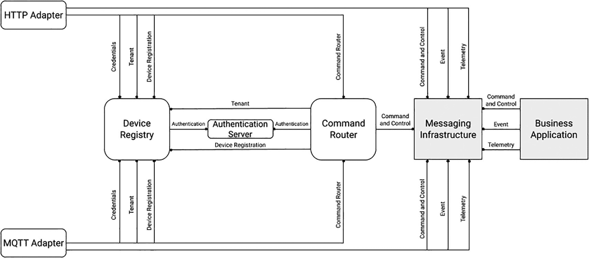
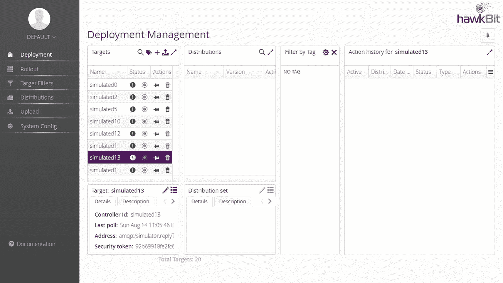
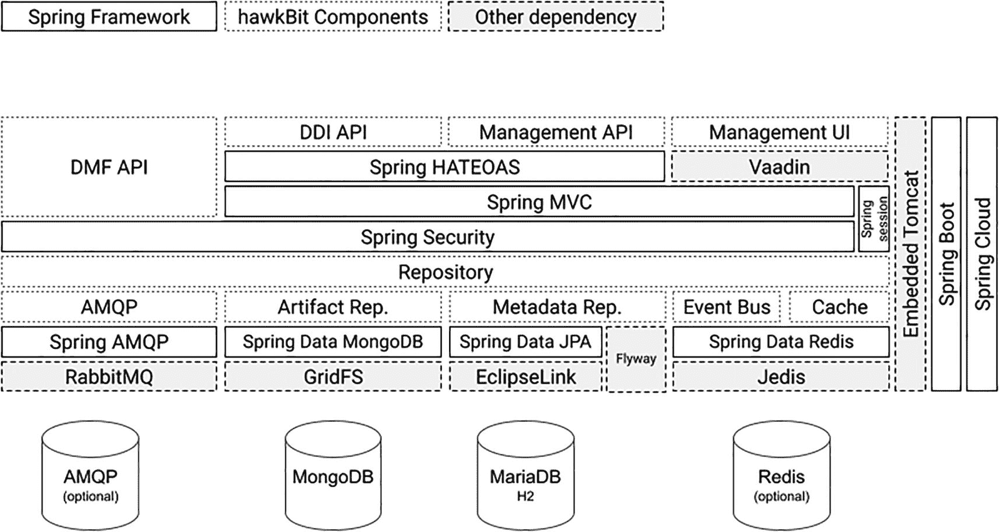
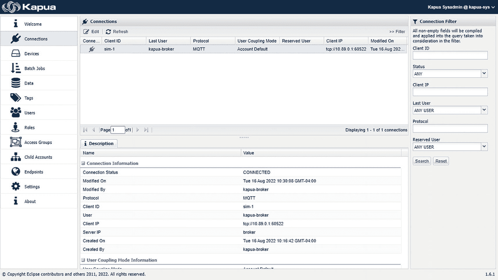
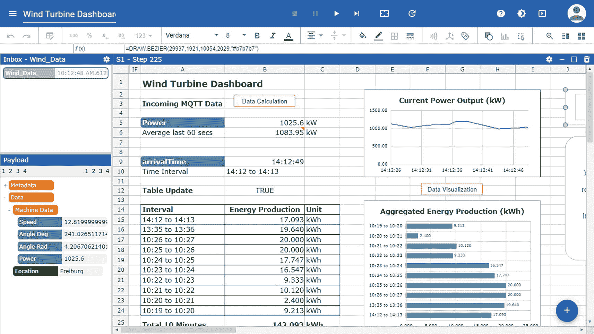

# 13. 集成与数据

> *Il ne faut pas uniquement intégrer. Il faut aussi désintégrer. C'est ça la vie. C'est ça la philosophie. C'est ça la science. C'est ça le progrès, la civilisation.*

> *仅仅整合是不够的，还必须解构。这就是生活。这就是哲学。这就是科学。这就是进步，是文明。*
> 
> ——尤金·尤内斯库，《课程》

物联网和边缘计算基础设施可能部署在企业数据中心或云之外，但它是组织的关键组成部分。高管和流程负责人需要来自受限设备的数据来做出明智的决策。他们需要通过执行器在现场执行这些决策。边缘节点在其中扮演着至关重要的角色，因为它们有助于提供实现实时、关键任务应用部署所需的延迟、弹性和数据主权。然而，这还不足以使您的物联网应用成为*企业级*物联网应用。

在大多数工业化国家，组织的逐步计算机化始于 20 世纪 60 年代。尽管工业和业务流程都受到了影响，但它们以不同的方式演变。业务流程成为信息技术（IT）的领域。IT 专注于通过标准化数据格式表达的数据建模和数据对象；它早期采用了发布/订阅等模式，并利用了集成网络。另一方面，工业流程属于运营技术（OT）。OT 专注于与流程直接耦合的应用，导致产生特定于市场的协议和数据格式，这些通常是专有的。OT 通常在独立于 IT 网络的隔离网络上运行。

IT 和 OT 的不同演变导致它们之间长期存在差距。企业物联网必须弥合这一差距，以提供集成的设备连接、管理和数据集成。本章将探讨提供这些能力的 Eclipse 基金会开源项目。

## 设备连接

典型的业务应用不理解物联网协议。即使是像 Jakarta EE 这样面向企业的运行时，也不原生支持 MQTT 或 CoAP 等协议。那么，您如何将受限设备和边缘节点连接到业务应用呢？这就需要引入物联网设备连接平台。

设备连接平台的核心功能是提供一个简单统一的 API，业务应用可以独立于设备实际使用的物联网协议来使用它。因此，此类平台将支持本书讨论的大部分（如果不是全部）物联网协议，以扩大其吸引力。通常，它们将使设备能够传输传感器读数或其他数据。业务应用也可以使用它们来调用设备上的操作。

在 Eclipse 物联网生态系统中，有两个项目可以充当设备连接平台的角色：Eclipse Hono 和 Eclipse Kapua。由于 Kapua 的功能集扩展到了设备管理，因此我目前将重点介绍 Hono。


### Eclipse Hono

Eclipse Hono 是一个纯设备连接平台，能够同时支持数百万台设备。该项目于 2016 年由博世旗下专注于物联网技术的子公司 Bosch.IO 贡献给 Eclipse 基金会。Hono 采用 Eclipse 公共许可证 2.0 版发布。该平台使用 Java 编写，需要 Java 17 或更高版本才能编译和运行。

Hono 的官方网络资源如下：

*   **网站：** [`https://eclipse.org/hono`](https://eclipse.org/hono)

*   **Eclipse 项目页面：** [`https://projects.eclipse.org/project/iot.hono`](https://projects.eclipse.org/project/iot.hono)

*   **代码仓库：** [`https://github.com/eclipse/hono`](https://github.com/eclipse/hono)

Hono 的架构基于微服务。该平台定义了一种特殊类型的微服务，称为*协议适配器*，它将特定的物联网协议映射到 Hono 的 API。Hono 内置了针对 AMQP 1.0、CoAP、HTTP 和 MQTT 的协议适配器。您也可以实现自己的适配器。用 Hono 的术语来说，平台中有两种类型的 API：*北向* API 将 Hono 暴露给业务应用程序，而协议适配器则使用*南向* API。在 Hono 中，所有交互都通过一个中央消息系统交换的消息进行。大多数消息从设备流向业务应用程序；这些消息被称为*下游*消息。相反，由业务应用程序发送给设备的消息被称为*上游*消息。

Hono 定义了三种不同的消息传递 API：

*   **遥测：** 通过遥测 API 发送的消息通常是传感器读数。它们发送频率很高。

*   **事件：** 事件 API 保留给频率较低、但更重要的消息。如果业务应用程序离线，Hono 可以持久化事件消息，并在稍后将其投递。

*   **命令与控制：** 此 API 由北向应用程序用于向上游向设备发送包含命令的消息。设备可以选择性地返回响应。命令路由器组件将消息传输到目标设备所连接的协议适配器。

Hono 本质上是一个多租户平台。换句话说，平台的单个实例可以同时管理属于多个组织的设备。因此，除了加密通信之外，Hono 还提供了一个内聚的安全模型，通过设备注册表对设备进行身份验证和授权。

Hono 的设备注册表公开了用于管理租户、设备注册和凭据的 API。默认情况下，设备无法连接到任何协议适配器。您必须先向系统中配置租户和设备，然后它们才能连接。对于设备而言，如果通过 X.509 客户端证书进行身份验证，或者设备通过网关连接到 Hono，则配置可以自动化。注册表有两种不同的实现，每种都使用不同的数据库引擎进行持久化。一种使用 MongoDB NoSQL 数据库。另一种可以使用任何具有 JDBC 驱动程序的数据库，项目团队官方支持的选项是 H2 和 PostgreSQL。请注意，目前基于 JDBC 的注册表不支持搜索设备。

由于 Hono 旨在支持高度可扩展的云服务，因此它可以为您部署的每个协议适配器强制执行每个租户的资源消耗限制。您可以定义连接数量、连接持续时间以及在定义的时间间隔内发布的数据量的限制。还可以定义每个租户注册的最大设备数量和每个设备的最大凭据数量。

图 13-1 展示了 Hono 的组件如何在其架构中组合。为了便于说明，所示的实例运行了 HTTP 和 MQTT 协议适配器。



一个 Eclipse Hono 架构包括 HTTP 适配器、MQTT 适配器、设备注册表、认证服务器、命令路由器、消息传递基础设施以及一个业务应用程序。

图 13-1

Eclipse Hono 架构（图片来源：Eclipse 基金会）

关于 Hono 的一个重要细节是，它可以与两种不同类型的消息传递基础设施配合使用。第一种选择是 AMQP 1.0，使用 [Apache Qpid Dispatch Router](https://qpid.apache.org/components/dispatch-router/index.html) 和 Apache ActiveMQ Artemis。示例部署目前使用一个连接到单个 Apache ActiveMQ Artemis 代理的 Qpid Dispatch Router 实例。第二种是 [Apache Kafka](https://kafka.apache.org/)。示例部署目前利用 [Bitnami 的 Kafka Helm chart](https://bitnami.com/stack/kafka/helm) 来安装单节点 Apache Kafka 代理实例。两种设置仅适用于开发目的。Hono 无法为您完成将这些选项之一扩展到生产工作负载的任务。


### Hono 入门指南

要使用 Hono，你至少需要能够访问该平台的一个实例。项目团队维护了一个公开可用的沙箱供你使用。当然，你也可以安装一个本地实例。该平台由多个容器化的微服务组成。Hono 团队提供了一个 Helm Chart 来帮助你在 Kubernetes 集群上安装它们。此 Chart 是在 Eclipse IoT Packages 项目的背景下开发的，可在 [`https://github.com/eclipse/packages/blob/master/charts/hono/README.md`](https://github.com/eclipse/packages/blob/master/charts/hono/README.md) 获取。如果你没有 Kubernetes 实例，也可以自己搭建一个。Hono 团队提供了使用 Minikube 在本地虚拟机中部署单节点集群的说明，请参见：[`www.eclipse.org/hono/docs/deployment/create-kubernetes-cluster/`](http://www.eclipse.org/hono/docs/deployment/create-kubernetes-cluster/)。

Hono CLI 工具是另一个你应该在工作站上拥有的有用工具。它可以与实现了 Hono 北向遥测、事件以及命令与控制 API 的消息基础设施进行交互。此外，它还可以与 AMQP 协议适配器交互。你可以从 Hono 网站的此页面下载它：[`www.eclipse.org/hono/downloads`](http://www.eclipse.org/hono/downloads)。或者，如果你的操作系统支持，也可以使用 `wget`。请确保将以下 URL 调整为该工具的最新版本。在我撰写本文时，最新版本是 2.0.1。

```
wget "https://www.eclipse.org/downloads/download.php?file=/hono/hono-cli-2.0.1-exec.jar&r=1" -O hono-cli-2.0.1-exec.jar
```

由于它以可执行 JAR 的形式提供，CLI 需要 Java 运行时才能运行。下载完成后，你可以通过运行以下命令来测试该 JAR：

```
java -jar hono-cli-2.0.1-exec.jar -V
```

你应该会看到类似如下的输出：

```
hono-cli 2.0.1
running on Linux 5.10.102.1-microsoft-standard-WSL2 amd64
```

在本节的剩余部分，我将演示一些针对 Hono 沙箱的基本交互。你可以在以下位置找到完整的教程：[`www.eclipse.org/hono/docs/getting-started/`](http://www.eclipse.org/hono/docs/getting-started/)

Hono 沙箱使用自定义 TCP 端口；如果你在公司网络内工作，可能会被阻止访问。要验证你的工作站能否正常访问沙箱，请在命令行中执行以下请求：

```
curl -sIX GET http://hono.eclipseprojects.io:28080/v1/tenants/DEFAULT_TENANT
```

如果你的网络管理员没有阻止这些端口，该命令应返回类似如下的输出：

```
HTTP/1.1 200 OK
etag: aee7809e-ca66-4e5d-b722-f2f2c5661f87
content-type: application/json; charset=utf-8
content-length: 445
```

如果得到其他结果，你应该设置自己的本地实例。

下一步是创建一个用于设置所需 shell 环境变量的文件。通常，它被命名为 `hono.env`。使用沙箱时，你可以使用以下命令创建它：

```
cat  hono.env
export REGISTRY_IP=hono.eclipseprojects.io
export HTTP_ADAPTER_IP=hono.eclipseprojects.io
export MQTT_ADAPTER_IP=hono.eclipseprojects.io
export KAFKA_IP=hono.eclipseprojects.io
export APP_OPTIONS="--sandbox"
EOS
```

由于 Hono 是一个多租户平台，你需要先在沙箱上创建自己的租户，然后才能进行其他操作。幸运的是，Hono 设备注册表为此目的暴露了一个 REST API。你可以使用以下命令调用它：

```
source hono.env
curl -i -X POST -H "content-type: application/json" --data-binary '{
"ext": {
"messaging-type": "kafka"
}
}' http://${REGISTRY_IP}:28080/v1/tenants
```

如果一切顺利，你将收到 201 响应码和类似如下的输出：

```
HTTP/1.1 201 Created
etag: c11c7413-e019-4ef1-b984-5d8244aa1b2f
location: /v1/tenants/6e3eec20-3795-4f35-812a-4b45dabaffdf
content-type: application/json; charset=utf-8
content-length: 45
{"id":"6e3eec20-3795-4f35-812a-4b45dabaffdf"}
```

响应体中的 JSON 负载包含你唯一的随机生成的租户 ID。你需要将其添加到你的 shell 环境文件中。例如：

```
echo "export MY_TENANT=6e3eec20-3795-4f35-812a-4b45dabaffdf" >> hono.env
```

将你在此处看到的值替换为前面 curl 请求返回的值。

下一步是创建设备并为其分配密码。别担心；你不需要物理设备来完成这些步骤。Hono CLI 工具既可以消费设备发送的消息，也可以扮演虚拟设备的角色。

要向你的租户添加设备，请执行此 `curl` 请求：

```
source hono.env
curl -i -X POST http://${REGISTRY_IP}:28080/v1/devices/${MY_TENANT}
```

同样，响应体将包含一个 JSON 结构，提供新创建设备的 ID。在我的例子中：

```
{"id":"53a3b746-d138-4f3c-8087-b580e241c9d2"}
```

你需要将此 ID 添加到你的 `hono.env` 文件中，如下所示：

```
echo "export MY_DEVICE=53a3b746-d138-4f3c-8087-b580e241c9d2" >> hono.env
```

Hono 沙箱需要身份验证。你必须为你的设备定义并分配一个密码。当然，Hono 也支持用于生产部署的客户端证书；为了简单起见，我在这里只使用密码认证。

选择一个密码并将其添加到你的 `hono.env` 文件中，如下所示：

```
echo "export MY_PWD=requin!" >> hono.env
```

然后，通过此 REST API 调用将密码分配给设备：

```
source hono.env
curl -i -X PUT -H "content-type: application/json" --data-binary '[{
"type": "hashed-password",
"auth-id": "'${MY_DEVICE}'",
"secrets": [{
"pwd-plain": "'${MY_PWD}'"
}]
}]' http://${REGISTRY_IP}:28080/v1/credentials/${MY_TENANT}/${MY_DEVICE}
```

响应码应为 204（已更新），响应体为空。

现在你已经准备好启动你的虚拟设备了。打开一个命令行提示符，导航到你下载 Hono CLI 的文件夹。然后，执行以下命令：

```
java -jar hono-cli-*-exec.jar app ${APP_OPTIONS} consume --tenant ${MY_TENANT}
```

如果你一切操作正确，你应该会看到类似如下的输出：

```
Connecting to Kafka based messaging infrastructure [hono.eclipseprojects.io:9092,hono.eclipseprojects.io:9094]
Consuming messages for tenant [6e3eec20-3795-4f35-812a-4b45dabaffdf], ctrl-c to exit.
```

现在，让我们进行一次 API 调用，模拟设备发送遥测数据。在这种情况下，负载是一个简单的 JSON 结构，包含一个温度值。打开第二个命令提示符并执行此命令：

```
source hono.env
curl -i -u ${MY_DEVICE}@${MY_TENANT}:${MY_PWD} -H 'Content-Type: application/json' --data-binary '{"temp": 5}' http://${HTTP_ADAPTER_IP}:8080/telemetry
```

你应该会在运行 Hono CLI 的 shell 中看到类似这样的消息：

```
t 53a3b746-d138-4f3c-8087-b580e241c9d2 application/json {"temp": 5} {orig_adapter=hono-http, qos=0, device_id=53a3b746-d138-4f3c-8087-b580e241c9d2, creation-time=1660328357552, traceparent=00-fbc396794954547a68db4c1e0a6b8831-cfd5b098412f5788-01, content-type=application/json, orig_address=/telemetry}
```

Hono 沙箱也提供了一个 MQTT 协议适配器。我现在将向你展示如何模拟一个 MQTT 设备接收命令。

要在你的工作站上接收命令，你必须订阅相关的 MQTT 主题。最简单的方法是使用 Mosquitto 团队提供的 `mosquitto_sub` CLI 工具。如果需要安装，请参考关于 MQTT 的章节。

在一个全新的命令提示符下运行以下命令以启动 MQTT 订阅：

```
source hono.env
mosquitto_sub -v -h ${MQTT_ADAPTER_IP} -u ${MY_DEVICE}@${MY_TENANT} -P ${MY_PWD} -t command///req/#
```


您可以通过 `Ctrl+C` 组合键停止之前启动的 Hono CLI。在同一提示符下，执行以下命令：

```
source hono.env
java -jar hono-cli-*-exec.jar app ${APP_OPTIONS} command
```

这将以命令模式启动 Hono CLI，您可以通过命令解释器向设备发送命令。您应该会看到以下提示符：

```
hono-cli/app/command>
```

执行以下命令，模拟将远程音响系统的音量设置为 11：

```
ow --tenant ${MY_TENANT} --device ${MY_DEVICE} -n setVolume --payload '{"level": 11}'
```

如果 Hono 成功路由该命令，您将在运行 `mosquitto_sub` 的 shell 中看到以下内容：

```
command///req//setVolume {"level": 11}
```

奈吉尔·塔夫内尔（Nigel Tufnel）会为此感到自豪！

## 设备管理

在实际部署解决方案时，将物联网设备和边缘节点连接到企业应用只是第一步。您还需要监控它们、更新其软件，并随着时间的推移调整其设置和配置。当然，有多种方法可以实现这一点。某些物联网协议（如 LwM2M）内置了对固件更新的支持。然而，在开源生态系统中，存在范围更广的设备管理构建模块。在本节中，我将重点介绍其中两个：Eclipse hawkBit 和 Eclipse Kapua。

### Eclipse hawkBit

Eclipse hawkBit 是一个领域无关的框架，用于向连接到基于 IP 网络的物联网设备、边缘节点和网关推送软件更新。该项目于 2015 年由 Bosch.IO 贡献给 Eclipse 基金会。hawkBit 使用 Java 编写，并利用了 Spring 框架和 Spring Boot。请注意，与许多其他 Eclipse 基金会项目不同，其代码是根据 [Eclipse 公共许可证 1.0 版](https://www.eclipse.org/legal/epl-v10.html) 发布的，而非 2.0 版。

hawkBit 的官方网络资源如下：

*   **网站：** [`https://eclipse.org/hawkbit`](https://eclipse.org/hawkbit)

*   **Eclipse 项目页面：** [`https://projects.eclipse.org/project/iot.hawkbit`](https://projects.eclipse.org/project/iot.hawkbit)

*   **仓库：** [`https://github.com/eclipse/hawkbit`](https://github.com/eclipse/hawkbit)

hawkBit 的核心概念是*软件模块*。一个模块包含一个或多个*工件*，即将要部署到设备上的文件。hawkBit 允许您根据需要将软件模块分组到*分发集*中。在执行部署时，您可以明确指定目标，或通过目标过滤器选择目标。

与 Eclipse Hono 和 Eclipse Ditto 类似，hawkBit 由多个微服务组成。该平台的功能集既专注又全面。以下是 hawkBit 的主要功能列表：

*   **设备和软件仓库：** hawkBit 为作为配置目标的设备和可部署的软件分发维护独立的列表。可以预先配置设备；这对于支持零接触部署场景非常有用。hawkBit 会维护仓库中所有设备的完整软件更新历史记录。

*   **软件更新管理：** hawkBit 可以将软件分发部署到设备。此操作可以通过 Web 用户界面或 REST API 发起。有趣的是，hawkBit 支持最初在 [RFC 7233](https://www.rfc-editor.org/info/rfc7233) 中定义的下载续传机制。设备只能访问其被授权的分发。您可以向设备部署增量更新，这意味着工件仅包含两个特定软件版本之间的差异。工件的完整性也可以通过数字签名进行验证。

*   **推送和活动管理：** hawkBit 提供了处理大规模部署（也称为*推送*）的方法。如果您需要一次性更新成百上千台设备，您需要确保您的 hawkBit 实例和网络基础设施能够承受负载。此外，向设备子集部署软件更新可以维持一定的服务水平，并确保在部署失败时不会立即丧失全部能力。要执行推送，您需要将设备群划分为*部署组*；或者，hawkBit 可以根据预定义的组大小自动生成这些组。在推送过程中，平台将按顺序逐个处理组；如果某个组的错误率超过您提供的阈值，推送将中止。

hawkBit 提供了一个功能齐全的 Web 界面，使您能够使用上述大部分功能。图 13-2 展示了其外观。



hawkbit 的部署管理页面屏幕显示了目标的名称、状态和操作；分发；按标签过滤；simulated13 的操作历史；以及目标和分发集的详细信息和描述。

图 13-2

Eclipse hawkBit 用户界面

从架构角度来看，hawkBit 向使用者暴露了三个不同的 API。以下是每个 API 的主要特征：

*   **管理 API：** 一个 REST API，使您能够创建、读取、更新或删除（CRUD）配置目标（设备）和仓库内容（软件）。


*   **直接设备集成（DDI）API：** 一种支持设备交互的 REST API。它使用 JSON 负载，并为设备向平台发送反馈提供通道。自然，这对于监控部署进度等情况非常有用。

*   **设备管理联合（DMF）API：** 一种 AMQP API，使 hawkBit 能够管理由其他设备管理服务或应用程序控制的设备的软件更新。

每个 API 的文档可在 hawkBit 网站的以下位置获取：[`www.eclipse.org/hawkbit/apis/`](http://www.eclipse.org/hawkbit/apis/)。

hawkBit 的直接设备集成（DDI）API 有多个客户端实现。其中最著名的是来自 [Eclipse Hara 子项目](https://projects.eclipse.org/projects/iot.hawkbit.hara)，该子项目专注于一个名为 [hara-ddiclient](https://github.com/eclipse/hara-ddiclient) 的 Kotlin 库。Hara 可以从任何支持 Java 虚拟机（JVM）的语言中使用。该子项目于 2019 年由来自加利福尼亚的初创公司 Kynetics 贡献给 Eclipse 基金会。Hara 在 Eclipse 公共许可证 2.0 版下提供。还有一些非 Eclipse 的 DDI 客户端库。这些库中的主要库如下：

*   **SWupdate：** 一个基于 Linux 的代理，专注于嵌入式系统的更新。参见 [`https://github.com/sbabic/swupdate`](https://github.com/sbabic/swupdate)。

*   **rauc-hawkbit-updater：** 一个用于 [RAUC](https://github.com/rauc/rauc) 更新框架的 hawkBit 客户端，使用 C 语言编写。参见 [`https://github.com/rauc/rauc-hawkbit-updater`](https://github.com/rauc/rauc-hawkbit-updater)。

*   **rauc-hawkbit：** 一个用于 RAUC 更新框架的 hawkBit 客户端演示应用程序和库，使用 Python 编写。参见 [`https://github.com/rauc/rauc-hawkbit`](https://github.com/rauc/rauc-hawkbit)。

*   **hawkbit-rs：** 一个提供 Rust crates 的项目，用于帮助实现和测试 hawkBit 客户端。参见 [`https://github.com/collabora/hawkbit-rs`](https://github.com/collabora/hawkbit-rs)。

从代码角度来看，hawkBit 依赖于多个第三方软件组件和平台。图 13-3 展示了它们在整体架构中的位置。



一个架构图，包含 DMF API、DDI API、管理 API 和 UI、Spring HATEOAS、Spring MVC 和安全、存储库、嵌入式 Tomcat、Spring Boot 和 Cloud、AMQP、MongoDB、MariaDB H2 以及 Redis。

图 13-3

Eclipse hawkBit 架构（图片来源：Eclipse 基金会）

项目团队支持多种 SQL 数据库引擎选择。当时，MySQL、MariaDB 和 Microsoft SQL Server 被认为是适合生产部署的选择。您也可以在开发和测试环境中使用 H2、IBM DB2 或 PostgreSQL。

#### 开始使用 hawkBit

试用 hawkBit 最简单的方法是使用项目团队维护的公共沙箱。您可以通过 [`https://hawkbit.eclipseprojects.io`](https://hawkbit.eclipseprojects.io) 访问它。您也可以使用项目团队整理的容器镜像来启动本地环境。如果您只想在 Docker 引擎下启动核心引擎本身，可以使用以下命令：

```
docker run -p 8080:8080 hawkbit/hawkbit-update-server:latest
```

为了获得更接近生产环境的环境，您可以通过 Docker compose 在 hawkBit 本身旁边启动 MySQL 和 RabbitMQ 容器。使用以下命令：

```
git clone https://github.com/eclipse/hawkbit.git
cd hawkbit/hawkbit-runtime/docker
docker-compose up -d
```

最后，您可以利用 Docker swarm 来启动 hawkBit 设备模拟器以及更新服务器、MySQL 和 RabbitMQ。只需运行以下命令：

```
git clone https://github.com/eclipse/hawkbit.git
cd hawkbit/hawkbit-runtime/docker
docker swarm init
docker stack deploy -c docker-compose-stack.yml hawkbit
```

该模拟器支持 DDI 和 DMF API，并且可以模拟多达 4000 个设备的存在。

### Eclipse Kapua

Eclipse Kapua 是一个模块化的物联网云平台，用于管理和集成设备及其数据。它在一个单一平台上整合了设备连接和管理，同时提供了与基于 Eclipse Kura 的网关的开箱即用集成。Kapua 于 2016 年由 Eurotech 贡献给 Eclipse 基金会，代码在 Eclipse 公共许可证 2.0 版下提供。在撰写本文时，当前版本是 v1.6.1，于 2022 年 7 月 1 日发布。对于加拿大日来说，这是一份多么棒的礼物！

Kapua 的官方网络资源如下：

*   **网站：** [`www.eclipse.org/kapua/`](http://www.eclipse.org/kapua/)

*   **Eclipse 项目页面：** [`https://projects.eclipse.org/projects/iot.kapua`](https://projects.eclipse.org/projects/iot.kapua)

*   **存储库：** [`https://github.com/eclipse/kapua`](https://github.com/eclipse/kapua)

以下是 Kapua 主要功能的列表：

*   **设备连接：** 现场设备可以使用 MQTT over TCP/IP 或 WebSockets 连接到 Kapua。设备连接服务在执行身份验证和授权的同时维护设备注册表。

*   **设备管理：** Kapua 可以对连接的设备执行各种远程操作，无论它们运行的是何种软件栈。这包括管理设备的配置、服务和应用程序。例如，您可以启动或停止服务，以及安装、更新或删除应用程序。您还可以远程执行操作系统命令，并为设备提供初始配置。

*   **数据管理：** 设备发送的遥测数据持久化存储到 Elasticsearch 数据库中，并建立完整索引。

*   **安全：** Kapua 的安全模型涵盖租户、账户和用户。在 Kapua 中，账户支持分层访问控制结构。该平台还为用户身份实现了基于角色的访问控制（RBAC），这意味着权限是根据“最小权限”原则授予的。

*   **应用程序集成：** Kapua 公开了一个全面的 REST API，第三方应用程序可以使用该 API 与平台及其连接的设备进行交互。

Kapua 还提供了一个 Web 图形用户界面，管理员可以使用它来执行设备和数据管理操作。图 13-4 向您展示了它的外观。



Kapua 的一个屏幕显示了连接页面，包含连接过滤器以及连接状态、修改时间和修改者、协议、客户端 ID、用户、客户端和服务器 IP、创建时间和创建者的描述。

图 13-4

Eclipse Kapua Web 用户界面

如图所示，Kura 允许您调度批处理作业和定义自定义标签。


#### Kapua 入门指南

Kapua 以一组容器镜像的形式提供，你可以将其部署在 Docker 或 OpenShift（包括轻量级的 MiniShift 版本）上。你可以在任何 x86_64 系统上部署它们。请确保分配至少 6 GB 内存和 2 个 CPU 核心，以保证 Kapua 的性能足够。

要在 Docker 上开始使用，请在 Linux 或 macOS 上执行以下命令：

```
git clone https://github.com/eclipse/kapua.git kapua
cd kapua/deployment/docker/unix
./docker-deploy.sh
```

你也可以在 Windows 上使用 PowerShell 提示符执行部署。使用以下命令即可：

```
git clone https://github.com/eclipse/kapua.git kapua
cd kapua\deployment\docker\win
./docker-deploy.ps1
```

我确认，如果你安装了额外的 `podman-docker` 包并手动获取一份 docker-compose CLI 的副本，上述操作在 Linux 上使用 Podman 也能正常工作。例如：

```
curl -SL "https://github.com/docker/compose/releases/download/v2.9.0/docker-compose-linux-x86_64" -o docker-compose
```

使该文件可执行，并将其放置在 PATH 环境变量中的适当文件夹内；一切就能正常运行。

容器运行后，你可以通过 `http://localhost:8081/` 访问 Kapua 控制台，使用 `kapua-sys` 作为用户名，`kapua-password` 作为密码登录。你可以在以下位置找到关于容器、它们暴露的端口以及平台各组件的凭据的更多信息：[`https://github.com/eclipse/kapua/tree/develop/deployment/docker`](https://github.com/eclipse/kapua/tree/develop/deployment/docker)。

## 数据

数据是任何物联网部署的核心。归根结底，你部署传感器是为了收集数据；你现场的设备将与物理世界交互，因为它们会接收由数据触发的命令。鉴于此，大多数物联网设备会产生大量数据，并且未来还会产生更多。例如，IDC 在 2019 年的一项预测指出：“*互联物联网设备的增长预计将在 2025 年产生 79.4ZB 的数据*。”^(⁶⁶) 无论这一预测是否会成真，都无关紧要。物联网就是关于数据的。有人可能会说，数据领域是信息技术和运营技术最有可能交汇的地方。

从技术角度来看，管理物联网数据与企业数据并无不同。你可以使用 SQL、NoSQL 或其他类型的数据库，扩展它们的方式也大致类似于企业 IT 中的常见做法。真正的选择不在于查询语言，而在于你是必须处理静态数据还是动态数据。传统数据库处理静态数据。要处理动态数据，你需要利用流处理平台。在开源世界中，这通常意味着要去拜访一下 [Apache 基金会](https://apache.org/)。Apache 生态系统包含几个相关的项目，例如 [Apache Spark Streaming](https://spark.apache.org/streaming/)、[Apache Flink](https://flink.apache.org/)、[Apache Kafka](https://kafka.apache.org/) 和 [Apache Storm](https://storm.apache.org/)。组织主要使用流处理平台来支持实时决策并满足低延迟需求。

解释我提到的这些 Apache 平台中该使用哪一个，可能需要一本专门的书籍。话虽如此，你可能已经注意到 Eclipse Hono 和 Eclipse Ditto 与 Kafka 有开箱即用的集成。这很可能是一个很好的起点。其他 Eclipse 项目提供了与企业应用程序的不同集成点。例如，Eclipse Amlen MQTT 代理提供了一个[与 Java 消息服务（JMS）规范兼容的消息系统的桥接](https://www.eclipse.org/amlen/docs/Developing/devjms_working.html)。^(⁶⁷)

在许多情况下，物联网部署会同时依赖多个数据库来满足不同的需求。例如，原始传感器数据通常存储在历史数据库中以便安全保管。许多组织会利用此类数据库作为机器学习和分析的数据源。

注意

历史数据库是一种专门为存储运营过程数据而开发的时间序列数据库。与其他类型的数据库相比，它们提供了更强的数据捕获、验证和聚合能力。它们通常具有内置的数据压缩功能。大多数工业自动化专家使用术语“标签”来指代过程数据流。这指的是在计算机用于自动化工业流程之前，用于手动捕获数据的仪器上的物理标签。顾名思义，历史数据库中的记录在初始插入后不会被更新。

大多数物联网设备收集的数据具有很高的粒度，这在工厂外部通常是不必要的。因此，任何物联网解决方案设计的一个重要部分是弄清楚哪些值从业务角度来看是有意义的，以及它们合适的刷新率是多少。

Eclipse 基金会生态系统包含几个涉及数据管理和分析的项目。最著名的是 Eclipse Streamsheets，我现在将详细介绍它。


### Eclipse Streamsheets

Eclipse Streamsheets 是一个提供基于服务器的电子表格的平台，用于消费、处理并生成实时数据流。该项目于 2020 年由德国初创公司 [Cedalo](https://cedalo.com/) 贡献给 Eclipse 基金会，该公司同时也支持 Eclipse Mosquitto MQTT 代理的开发。Streamsheets 使用 JavaScript 编写，运行在 Node.js 运行时上。其代码根据 Eclipse 公共许可证 2.0 版发布。

Streamsheets 的官方网络资源如下：

*   **网站：** [`https://docs.cedalo.com/Streamsheets/2.5/installation/`](https://docs.cedalo.com/streamsheets/2.5/installation/)

*   **Eclipse 项目页面：** [`https://projects.eclipse.org/projects/iot.Streamsheets`](https://projects.eclipse.org/projects/iot.streamsheets)

*   **仓库：** [`https://github.com/eclipse/Streamsheets`](https://github.com/eclipse/streamsheets)

Streamsheets 可以独立于数据源消费数据流。默认情况下，开源版本可以使用以下协议进行连接：MQTT、REST 和 SMTP/IPOP3（电子邮件）。Streamsheets 还可以连接到 MongoDB 数据库和 Apache Kafka 实例。在 Cedalo 的商业支持版本中提供了更多选项。

在 Streamsheets 中，数据流的处理、分析和可视化完全通过无代码电子表格（你猜对了，就叫 Streamsheets）完成。自然，你可以依赖一系列常见的电子表格公式来建模和格式化数据。每当有新消息到达时，电子表格会重新计算；你也可以按计划刷新它们。因此，电子表格中的条件和公式会被频繁重新评估，这意味着其中包含的可视化内容会实时更新。如果需要，可以暂停电子表格，使其冻结在特定时刻。

虽然易于使用，但 Streamsheets 提供了全面的安全性。当底层协议支持时，它可以通过 TLS 连接到数据流，并定义了保护电子表格完整性的用户角色。拥有开发者角色的用户可以创建新的数据流和电子表格；拥有查看者角色的用户只能查看他人构建的内容。当然，还有一个拥有所有访问权限的管理员角色。

Streamsheets 的用户界面模仿了流行的网络电子表格服务，桌面电子表格软件的用户也能轻松上手。图 13-5 展示了 Streamsheets 显示实时电子表格的用户界面。



一个风力涡轮机仪表盘的电子表格显示了传入的 MQTT 数据；功率；到达时间；一个包含间隔、能量产生和单位的更新表格；以及当前功率输出和总能量产生的图表。

图 13-5

Eclipse Streamsheets 用户界面

#### Streamsheets 入门

Streamsheets 以一组容器的形式提供，可以在任何支持 Docker 引擎的环境中运行。项目团队建议使用四核处理器和 4 GB 内存以获得可接受的性能。树莓派也有可用的容器镜像。最低要求是配备 1 GB 内存和 4 GB 存储空间的 3B 型号；推荐配置是配备 2 GB 内存和至少 10 GB 存储空间的 4B 型号。你的树莓派需要运行 32 位操作系统。

启动并运行这些容器很简单。首先，你需要执行 Cedalo 安装程序。在 Linux 上，执行以下命令：

```
docker run -it -v ~/cedalo_platform:/cedalo cedalo/installer:2-linux
```

在 macOS 上，命令如下：

```
docker run -it -v ~/cedalo_platform:/cedalo cedalo/installer:2-macos
```

最后，在 Windows 上的命令是：

```
docker run -it -v C:\cedalo_platform:/cedalo cedalo/installer:2-win
```

在这三种情况下，你都会看到类似这样的提示：

```
? Select what to install › - Space to select. Return to submit
◉   Management Center for Eclipse Mosquitto
◉   Eclipse Streamsheets
◉   Eclipse Mosquitto 2.0
◯   Eclipse Mosquitto 1.6
```

至少，你应该安装 Mosquitto 2.0 和 Streamsheets。如果你希望为 Mosquitto 代理提供一个强大的图形界面，管理中心会很有用，但在资源受限的环境中，可以移除它。将光标移动到任何你不想安装的组件上，按空格键取消选择。当你准备好开始安装时，按回车键。

几分钟后，容器镜像应该会出现在你的机器上。在后台，Cedalo 安装程序依赖于 Docker Compose。一旦命令提示符返回，你可以进入 `cedalo_platform` 文件夹并执行启动脚本。在 Linux 和 macOS 上，你需要执行以下命令：

```
cd ~/cedalo_platform
sh start.sh
```

在 Windows 上，命令则是：

```
cd C:\cedalo_platform
start.bat
```

一旦容器运行起来，你就可以通过以下 URL 访问 Streamsheets：`http://localhost:8081`。默认凭据是用户名为 admin，密码为 1234。你应该尽快更改密码。

脚注 1   2


