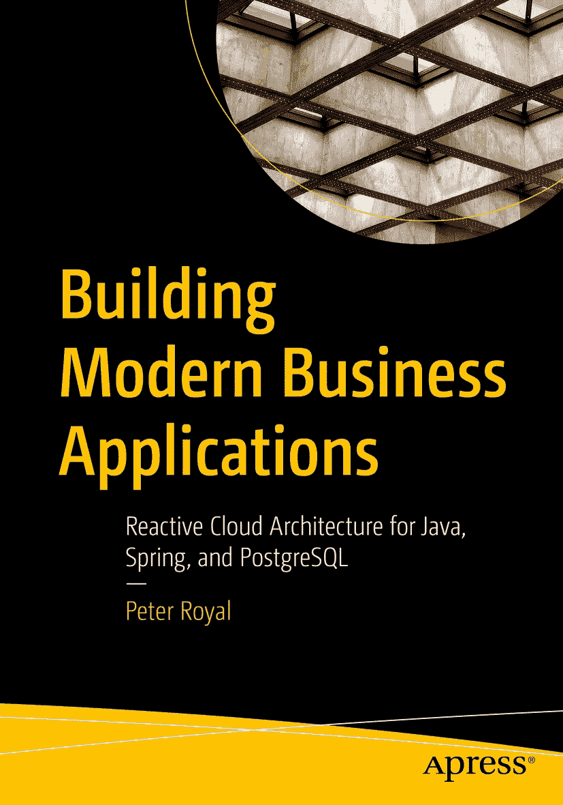

ISBN 978-1-4842-8991-4（印刷版）e-ISBN 978-1-4842-8992-1（电子版） [`doi.org/10.1007/978-1-4842-8992-1`](https://doi.org/10.1007/978-1-4842-8992-1) © Peter Royal 2023
本作品受版权保护。所有权利均由出版商独家许可，无论涉及材料的全部或部分，具体包括翻译、重印、插图复用、朗诵、广播、微缩胶片或其他任何物理形式的复制、传输或信息存储与检索、电子改编、计算机软件，或目前已知或未来开发的类似或不同方法。使用本出版物中的通用描述性名称、注册商标、商标、服务标志等，即使未作特别声明，也不意味着这些名称可免于相关保护法律和法规的约束，因此可自由用于一般用途。出版商、作者和编辑可合理假设，本书中的建议和信息在出版之日是真实准确的。出版商、作者或编辑均不对本书所含材料或可能存在的任何错误或遗漏提供明示或暗示的担保。出版商对已出版地图中的管辖权主张和机构归属保持中立。

本 Apress 印记由注册公司 APress Media, LLC（Springer Nature 的一部分）出版。

注册公司地址为：1 New York Plaza, New York, NY 10004, U.S.A.

*献给特丽莎，没有她多年来的支持，我无法走到能够完成这本书的境地。*

引言

我的第一份工作之一是在一家咨询公司，我们协助客户实现软件现代化。该客户拥有一家成功的企业，销售和支持特定领域的 ERP（企业资源规划）系统。该系统可追溯到 20 世纪 70 年代，代码使用 BASIC-2C 编写，运行在王（Wang）小型机上。当我在 20 世纪 90 年代末参与其中时，该软件通过模拟器在 Windows 上运行，其基于文本的界面被困在一个窗口中。公司所有者不想再次被锁定在专有平台上。出于非常前瞻的考虑，我们被明确要求创建一个基于 Web 的用户界面和一个基于 Java 的后端。

当我们逐步将模块从旧系统迁移到新系统时，我们收到了用户关于新界面可用性的反馈。旧系统的文本界面允许高级用户快速导航。新的图形界面最初不具备同样的能力。我们添加了广泛的键盘快捷键以简化导航，但界面的本质使我们无法匹配旧系统的体验。现有用户珍视旧系统的原有方式，而新客户则被新的基于 Web 的界面所吸引。

这段经历对我而言极具启发性：我的工作性质如何深刻影响他人的工作，以及人们如何对熟悉的事物产生依恋。我也曾依恋熟悉的事物。虽然我们创建的新系统使用了比旧系统更现代的技术和技巧，但其范式在根本上是一样的。在我从事那个系统之后的二十年里，技术和技巧再次发生了变化，但同样的范式依然存在。当我观察到这一点并反思我所做的工作时，我意识到还有其他构建系统的方法。这正是本书要探讨的内容。

本书首先定义和界定业务应用的范围，然后阐述我对现状的看法。下一部分讨论我认为适用于前瞻性系统的架构原则，以及为什么在构建业务应用时应考虑这些原则。业务应用编码了业务规则，而业务规则会随时间变化。理解这两点都很重要，我分别用一章来阐述。本书的第三部分是我对现代业务应用架构的提议。我描述了我为自己设定的约束以及该架构旨在维护的原则。该架构从概念和数据流的角度进行了详细描述。该架构可以用你喜欢的语言实现。它有技术上的要求，但你可以选择你最熟悉的实现方式。已有生产系统使用此架构，最后一部分是关于我所做的实现选择。最后一章讨论了可以对架构进行的补充以及替代的实现方式。我的目标是展示该架构实际上是系统的起点，而非终点。你的系统将拥有自己的生命周期，并需要以适合其环境的独特方式成长。

理解本书不需要了解任何特定的计算机语言。熟悉系统构建是有价值的，但也不是必需的。我描述的是*是什么*，而不是*怎么做*，因为我相信前者会随着时间的推移更具持久性。正如我在职业生涯早期所学到的，实现决策会改变，但范式会持久。

感谢您花时间阅读本书。我希望我的推理能引起您的共鸣。我很想听听您如何将本书中的想法应用到工作中的故事。

——皮特

致谢

本书中的想法是我职业生涯中遇到的各种概念的融合，其中许多概念的出处已随时间流逝。我珍视每一位花时间写作并与他人分享知识的人，深知他们永远无法完全了解自己产生的影响。

感谢约翰·卡鲁索和加里·福斯特，没有你们在我职业生涯早期的支持和信任，我就不会走到今天。感谢保罗·哈曼特，你是我思想、灵感和鼓励的源泉。感谢我在 Apache 软件基金会的所有朋友，特别是早期的 Avalon 和 Cocoon 社区，你们是我无意识的导师，塑造了我思考问题的方式。感谢斯内哈尔·切内鲁和迈克尔·李，没有你们的帮助和支持，我们永远无法构建本书所描述的系统。

练习巴西柔术塑造了我对持续学习、谦逊和解决问题的看法。感谢我的老师安德烈、桑德罗和克里斯，你们分享知识的方法塑造了我的方法。

如果没有乔纳森·根尼克联系我，问我是否考虑过写一本书，这本书就不会存在。你有一种远见，认为有些东西值得以比会议演讲更持久的形式分享。你和你在 Apress 的团队帮助促成了这本书的出版。

特丽莎、波比和皮克尔斯，感谢你们在我利用夜晚和周末写作时给予的支持。你们是最棒的。

关于作者
关于技术审校

