好的，作为一名高级文档工程师和翻译员，我将严格遵循您提供的注意事项和示例，将给定的英文文本翻译成中文。


**构建**

**Telegram 机器人**

使用 Telegram Bot API

用 12 种编程语言

开发机器人

—

Nicolas Modrzyk

**构建 Telegram**

**机器人**

**使用 Telegram Bot API**

**用 12 种编程语言**

**开发机器人**

**Nicolas Modrzyk**

***构建 Telegram 机器人：使用 Telegram Bot API 用 12 种编程语言开发机器人***

Nicolas Modrzyk

日本东京

ISBN-13 (平装): 978-1-4842-4196-7

ISBN-13 (电子版): 978-1-4842-4197-4

[`doi.org/10.1007/978-1-4842-4197-4`](https://doi.org/10.1007/978-1-4842-4197-4)

美国国会图书馆控制号: 2018965498

版权所有 © 2019 归 Nicolas Modrzyk 所有

本作品受版权保护。出版商保留所有权利，无论是涉及材料的全部或部分，特别是翻译权、重印权、插图重用权、朗诵权、广播权、缩微胶片复制权或任何其他物理形式的复制权，以及信息存储和检索、电子改编、计算机软件，或现在已知或以后开发的类似或不同方法的权利。

本书中可能出现商标名称、标识和图像。我们仅在编辑风格中使用这些名称、标识和图像，以利于商标所有者，并无意侵犯商标权，而非在每次出现商标名称、标识或图像时都使用商标符号。

在本出版物中使用商品名称、商标、服务标记和类似术语，即使它们未被标识为此类，也不应被视为对其是否受所有权保护的看法。

尽管本书中的建议和信息在出版时被认为是真实和准确的，但作者、编辑和出版商均不对可能出现的任何错误或遗漏承担法律责任。出版商对本书所含材料不作任何明示或暗示的保证。

Apress Media LLC 董事总经理：Welmoed Spahr

采购编辑：Nikhil Karkal

开发编辑：Matthew Moodie

协调编辑：Divya Modi

封面设计：eStudioCalamar

封面图片设计：Freepik (www.freepik.com)

全球图书贸易由 Springer Science+Business Media New York 发行，地址：233 Spring Street, 6th Floor, New York, NY 10013。电话：1-800-SPRINGER，传真：(201) 348-4505，电子邮件：orders-ny@springer-sbm.com，或访问 www.springeronline.com。Apress Media, LLC 是加利福尼亚州的有限责任公司，其唯一成员（所有者）是 Springer Science+Business Media Finance Inc (SSBM Finance Inc)。SSBM Finance Inc 是一家**特拉华州**公司。

有关翻译信息，请发送电子邮件至 rights@apress.com，或访问 www.apress.com/rights-permissions。

Apress 图书可批量购买用于学术、企业或促销用途。大多数图书也提供电子书版本和许可证。有关更多信息，请参阅我们的印刷版和电子版批量销售网页：www.apress.com/bulk-sales。

作者在本书中引用的任何源代码或其他补充材料，读者均可通过本书的产品页面在 GitHub 上获取，该页面位于 www.apress.com/978-1-4842-4196-7。

有关更详细的信息，请访问 www.apress.com/source-code。

印刷于无酸纸上

**目录**

关于作者 ���������������������������������������������������������������������������������ix

关于技术审校者 ���������������������������������������������������������������������������xi

致谢 ���������������������������������������������������������������������������������������������xiii

引言 ����������������������������������������������������������������������������������������xv

第 1 章：第 1 周：Ruby ����������������������������������������������������������������������1

与 BotFather 聊天 ����������������������������������������������������������������������������������1

设置 Ruby ����������������������������������������������������������������������������������������������������7

你的第一个 Telegram 机器人 �������������������������������������������������������������������������8

理解接收到的消息字段 �������������������������������������������������������������������������14

首次回复 �����������������������������������������������������������������������������������������������������������15

第 2 章：第 2 周：Nim ����������������������������������������������������������������������17

安装 Nim ������������������������������������������������������������������������������������������������������17

Visual Studio Code 的 Nim 插件 ���������������������������������������������������������������������18

你好，Nim ������������������������������������������������������������������������������������������������������������20

第二个 Nim 程序（仍然不是机器人） ��������������������������������������������������������������������23

创建 Visual Studio Code 构建任务 �������������������������������������������������������������25

使用 Nimble 安装 Nim 包 �����������������������������������������������������������������29

第一个 Nim 机器人 ���������������������������������������������������������������������������������������31

回复 Nim 机器人 ��������������������������������������������������������������������������������������������33

猫和狗 Nim 机器人 ���������������������������������������������������������������������������������������34

iii

目录

第 3 章：第 3 周：Crystal �����������������������������������������������������������������37

设置 Crystal �����������������������������������������������������������������������������������������������38

在游乐场小试牛刀 ����������������������������������������������������������������������������������������������39

再次使用 Visual Studio Code ��������������������������������������������������������������������������41

创建一个 Crystal 项目 �����������������������������������������������������������������������������������46

回声机器人 ��������������������������������������������������������������������������������������������������������������50

命令机器人 �����������������������������������������������������������������������������������������������������52

第 4 章：第 4 周：Rust ���������������������������������������������������������������������57

Rust 安装和第一步 �������������������������������������������������������������������������58

安装 �����������������������������������������������������������������������������������������������������58

第一个或两个 Rust 程序 ���������������������������������������������������������������������������������62

你好 Rust ������������������������������������������������������������������������������������������������������62

斐波那契 �������������������������������������������������������������������������������������������������������64

驾驭 cargo �����������������������������������������������������������������������������������������������������66

我们有时间 ������������������������������������������������������������������������������������������������66

多个 Cargo 目标 ����������������������������������������������������������������������������������������70

Rust 机器人 1 号：回复我 �������������������������������������������������������������������������74

Rust 机器人 2 号：东京在哪里？ ������������������������������������������������������������������77

Rust 机器人 3 号：连锁反应 ����������������������������������������������������������������82

为发布编译 �����������������������������������������������������������������������������������������84

第 5 章：第 5 周：D 语言 ��������������������������������������������������������������������������85

安装和 D 语言第一步 ������������������������������������������������������������������������������86

D 语言并发的一些要点 ��������������������������������������������������������������������������91

简单线程 �������������������������������������������������������������������������������������������91

带状态的线程 ���������������������������������������������������������������������������������������92

共享状态 ��������������������������������������������������������������������������������������������������94

iv

目录

更多 D 语言示例 ���������������������������������������������������������������������������������95

温柔地排序，真实地排序 �������������������������������������������������������������������������95

我对斐波那契的爱 �����������������������������������������������������������������������������������98

D 语言中的 Telegram 机器人 ����������������������������������������������������������������������������100

认识 dub �����������������������������������������������������������������������������������������������������������100

第一个 D 语言机器人 ������������������������������������������������������������������������������������105

更多机器人 API 使用 �������������������������������������������������������������������������������������107

第 6 章：第 6 周：C++ ��������������������������������������������������������������������111

要求、安装和第一个机器人 ��������������������������������������������������������������������������111

安装 tgbot-cpp ������������������������������������������������������������������������������������������112

安装 OpenCV ���������������������������������������������������������������������������������������������113

文件下载程序 �����������������������������������������������������������������������������������������������113

回声机器人 ������������������������������������������������������������������������������������������������������������119

C++ 机器人 �����������������������������������������������������������������������������������������������������������123

带内联键盘的机器人 �����������������������������������������������������������������������������123

照片机器人 �����������������������������������������������������������������������������������������������������126

OpenCV 实战 �����������������������������������������������������������������������������������������������128

OpenCV 示例程序 ��������������������������������������������������������������������������������������������128

OpenCV 机器人 �������������������������������������������������������������������������������������������������������131

第 7 章：第 7 周：Clojure ���������������������������������������������������������������135

初始设置和第一个 Clojure 机器人 ���������������������������������������������������������������������136

Visual Studio Code ���������������������������������������������������������������������������������������141

project.clj 中的项目元数据 ������������������������������������������������������������������������������142

core.clj 中的 Clojure 代码 �������������������������������������������������������������������������143

令牌！ ���������������������������������������������������������������������������������������������������146

调试 Telegram 消息 �����������������������������������������������������������������������������������146

v

目录

创建反转机器人 ��������������������������������������������������������������������������������148

内联处理器 ����������������������������������������������������������������������������������������������149

一个简单的天气机器人 ���������������������������������������������������������������������������������������150

OpenCV 和 Telegram：折纸机器人 ������������������������������������������������������������������154

第 8 章：第 8 周：Java �������������������������������������������������������������������159

安装 ��������������������������������������������������������������������������������������������������������159

项目结构 ���������������������������������������������������������������������������������������������������161

build.gradle 文件 �������������������������������������������������������������������������������������161

Visual Studio Code 设置 ����������������������������������������������������������������������������164

第一个 Java 机器人 ������������������������������������������������������������������������������������165

发送一些文本 �������������������������������������������������������������������������������������������167

发送照片 �����������������������������������������������������������������������������������������������169

具有发票功能的机器人 �����������������������������������������������������������������������������170

请求权限 ���������������������������������������������������������������������������������������170

发送发票消息 ��������������������������������������������������������������������������������������������173

第 9 章：第 9 周：Go 语言 ����������������������������������������������������������������������181

安装 Go 语言 �����������������������������������������������������������������������������������������������182

让我们开始 Go 语言 ���������������������������������������������������������������������������������������������184

让我们计算斐波那契 ���������������������������������������������������������������������������������������������190

Go 语言中的第一个机器人 �����������������������������������������������������������������������������������193

仅发送图片 �������������������������������������������������������������������������������������������������������197

第 10 章：第 10 周：Elixir ��������������������������������������������������������������201

安装 ��������������������������������������������������������������������������������������������������������202

使用 iex ������������������������������������������������������������������������������������������������������203

使用 mix �����������������������������������������������������������������������������������������������������204

使用 mix 运行 iex �����������������������������������������������������������������������������������205

vi

目录

mix 项目的项目结构 �������������������������������������������������������������������������������������206

config.exs ����������������������������������������������������������������������������������������������������207

mix.exs ��������������������������������������������������������������������������������������������������������208

依赖项 ��������������������������������������������������������������������������������������������������������������209

telegrambox.ex ��������������������������������������������������������������������������������������������212

（回到）依赖项 �����������������������������������������������������������������������������������������������213

获取一些东西 ��������������������������������������������������������������������������������������������������216

GetMe ����������������������������������������������������������������������������������������������������������216

GetChat ��������������������������������������������������������������������������������������������������������217

GetFile ���������������������������������������������������������������������������������������������������������218

使用 Elixir 的系统 �����������������������������������������������������������������������������������219

SendPhoto ���������������������������������������������������������������������������������������������������220

Telegram 机器人 �����������������������������������������������������������������������������������������������������221

机器人 1：一切皆有可能 �������������������������������������������������������������������������������������221

机器人 2：斐波那契 ��������������������������������������������������������������������������������������������222

第 11 章：第 11 周：Node.js �����������������������������������������������������������225

认识 RunKit ������������������������������������������������������������������������������������������������������226

创建账户 ����������������������������������������������������������������������������������������������������226

RunKit 上的第一个代码 ������������������������������������������������������������������������������������229

某种说不清道不明的东西 �����������������������������������������������������������������������������230

发布一些 Koa 代码 �����������������������������������������������������������������������������������232

使用 Webhooks 的 Telegram 机器人 ��������������������������������������������������������������������234

更多关于 Telegraf 库的内容 �����������������������������������������������������������������������������239

图像到聊天示例 �����������������������������������������������������������������������������������������������239

RegExp、内联键盘和嵌入式表情符号 �����������������������������������������������������������������������240

vii

目录

本地运行 Node.js ������������������������������������������������������������������������������������242

设置 Node.js �������������������������������������������������������������������������������������������������������243

使用本地隧道 �������������������������������������������������������������������������������������������������������244

第 12 章：第 12 周：Python �����������������������������������������������������������247

安装 ��������������������������������������������������������������������������������������������������������248

几个 Python 程序 ������������������������������������������������������������������������������������250

斐波那契 1 ��������������������������������������������������������������������������������������������������250

斐波那契 2 ��������������������������������������������������������������������������������������������������252

斐波那契 3 ��������������������������������������������������������������������������������������������������253

斐波那契 4 ��������������������������������������������������������������������������������������������������254

斐波那契 5 ��������������������������������������������������������������������������������������������������255

第一个使用 Python 的 Telegram 机器人 ���������������������������������������������������������������256

第一个机器人：发送随机照片 ���������������������������������������������������������������������������������������258

第一个 OpenCV 机器人：更改图片的颜色空间 �������������������������������������������������260

第二个 OpenCV 机器人：统计人脸 ���������������������������������������������������������������������262

TensorFlow 压轴 ������������������������������������������������������������������������������������������265

索引 �������������������������������������������������������������������������������������������������271

viii


**关于作者**

**Nicolas Modrzyk** 在亚洲、欧洲和美国拥有超过 15 年的 IT 经验，目前是日本东京一家国际咨询公司的首席技术官。他是另外四本已出版书籍的作者，主要专注于 Clojure 语言和富有表现力的代码。当不为客户带来新想法时，他会陪伴他的两个出色的女儿 Mei 和 Manon，并在国际上演奏现场音乐。

ix


**关于技术审校者**

**Dushyant Rathore** 目前在 Western Digital 担任固件工程师。他的经验包括全栈 Web 开发、机器学习、去中心化应用等。Dushyant 曾在多家初创公司从事与物联网、聊天机器人、网站、爬虫、命令行工具和机器学习项目等相关的各种项目。他参加过国内和国际黑客马拉松，并赢得过其中一些。他是一位云计算爱好者。

**Sham Satyaprasad** 拥有超过四年的全栈软件开发经验，并拥有 Manipal 大学嵌入式系统硕士学位。他为自己编写高效、可读和可维护的代码而自豪，并坚信编码既是科学也是艺术。Sham 最近对 NLP、ML 和数据科学产生了浓厚的兴趣，并一直忙于钻研这些主题。

xi

**致谢**

为了按时完成这本书并克服困难，这又是一场打字比赛。Divya 和 Nikhil，非常感谢你们再次合作。我真的很期待我们的下一次合作！

我得到了太多人的支持，以至于写名字列表就需要另一本书。尽管如此……

感谢我的妹妹 Emily，我的兄弟 Gregor，爸爸妈妈，家人，堂表兄弟姐妹，叔叔阿姨，朋友们，Abe-san，Sawada-san，Gucci，Marshall，Momo，我的灵魂伴侣 Sachiko，足球朋友们（我愿意为你们摔断膝盖），仍在享受健力士啤酒的爱尔兰团队（再为我喝一杯！），美国那些了不起的人（他们总能找到我缺少的黑胶唱片），Chris 和 Biners 团队，总是无条件支持我的法国团队，以及我内心深处的人们，感谢你们*永不停止*的支持。没有你们，我无法完成这本书。

我非常感激你们所有人。

当然，还要感谢我两个出色的女儿 Mei 和 Manon，感谢你们坚持不懈，即使在困难时期也总是尽力而为。你们太棒了！我爱你们。

xiii

**引言**

*有一百种方法可以做十几件事，为什么不都试试呢？*

[—Julian Casablancas](https://www.goodreads.com/author/show/16643925.Napz_Cherub_Pellazo)

你有没有想过，如何通过做更少的事情来完成更多的事情，如何拥有一个替身，在你享受凉爽的海滩或与可爱的孩子共度更多户外时光时，替你完成所有工作？我一直都在想。

我是 Telegram 聊天平台的忠实粉丝。我们称它为一个平台，因为它不仅仅是一个简单的聊天服务，让你与最重要的人保持联系。它还能让你以以前从未有过的方式思考。

例如，住在东京，你总是关心最后一班回家的火车什么时候发车。我想全球大城市的多数人可能都有同样的担忧。不经常看表可能会导致一次糟糕和/或昂贵的出租车之旅，所以我开始想要一些能自动为我提供一系列回家选择的东西。

我写的第一个机器人是告诉我最后几班回家的火车时刻表以及不同的选择，从最容易赶上的到最后几班，到最晚的、我必须冲刺才能赶上的。这为我节省了不少钱。

我写的第二个机器人稍微偏向物联网。它使用网络摄像头，通过 Telegram 向我发送按门铃的人的照片。

第三个，我还记得，有点傻。它是用迷你投影仪显示通过 Telegram 聊天室发送的最新消息。（在家里的一个小派对上查看随机消息非常有趣。）

xv

引言

但是，有很多事情可以尝试构建机器人——搜索机票、检查冰箱等。拥有一个机器人是一种简单的方法，可以简化你每天做的所有事情，使用同样简单的 Telegram 聊天室来获取与日常生活相关问题的答案，或发出命令并征服世界。

这本相对简短的书是关于学习如何用几种不同的编程语言编写 Telegram 机器人。你可能会问，为什么不用一种语言并坚持使用它呢？嗯，因为没有一个答案能回答所有问题，对别人正确的东西可能不适合你。探索不同的编程语言也是一种有趣的方式，可以在执行相同任务的同时检查每种语言的优势。每个 Telegram 概念都可以一个接一个地、以简单的方式引入。

或者，你也可以直接跳进去，选择你想尝试的语言，并立即开始。有些人希望它发生；有些人希望它会实现；而另一些人则让它发生。所以，享受阅读这本书，并让它发生吧。

xvi

**第 1 章**

**第 1 周：Ruby**

*正念星期一 人类，愿你们的咖啡在现实到来之前发挥作用。*

[—Napz Cherub Pellazo](https://www.goodreads.com/author/show/16643925.Napz_Cherub_Pellazo)

Ruby 曾因其代码的易用性和简洁性而风靡全球。大多数程序员对 Ruby 情有独钟，当他们的 shell 脚本和日常生活变得过于混乱时，他们通常会很快转向 Ruby。

第一章有点特别，因为除了为我们的机器人创建客户端之外，我还必须向你介绍如何创建机器人本身。在整本书中，这个第一个机器人将被随意重用，当然，制作它所使用的相同步骤也可以用来创建一支机器人军队并征服世界！

**与 BotFather 聊天**

要注册你自己的 Telegram 机器人，你必须与所有机器人的父亲交谈。这个机器人父亲有一个名字，BotFather；叫 Brad 或 Vladimir 都不行。你可以通过 Telegram 上的 @BotFather 联系到他。

BotFather 不睡觉，可以在一天中的任何时间联系到。BotFather 会洗澡，并且总是看起来精神焕发。这是我们拥有的这位英俊机器人的最新头像（图 1-1）。

© Nicolas Modrzyk 2019
N. Modrzyk, *构建 Telegram 机器人*, `doi.org/10.1007/978-1-4842-4197-4_1`


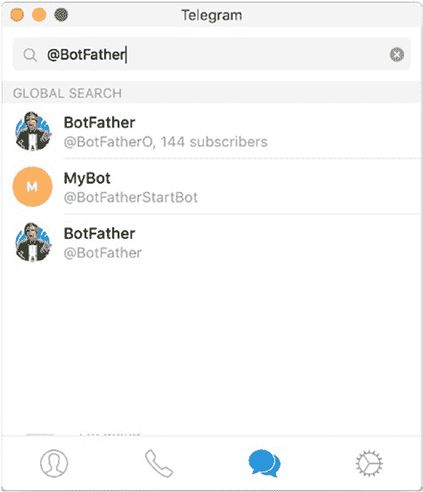

第 1 章 第 1 周：Ruby

***图 1-1.** BotFather 的最新头像*

找到 BotFather 并不难；你只需在 Telegram 联系人列表的搜索框中输入他的名字“@BotFather”（图 1-2）。

***图 1-2.** 寻找 BotFather*

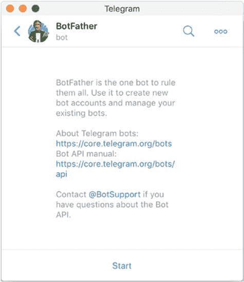

第 1 章 第 1 周：Ruby

在上面的列表中，名字是底部的那个。接下来，点击它，与 BotFather 开始一个新的聊天。

一旦聊天开始，我们英俊的机器人也会欢迎你，并附上关于 API、免费帮助的亲切消息，以及开始聊天的邀请（图 1-3）。

***图 1-3.** 准备好了吗？*

一旦聊天开始（通过按下你可以在底部看到的“开始”按钮），BotFather 会欢迎你，并提供一系列关于如何创建或编辑你的机器人列表的选项（图 1-4）。

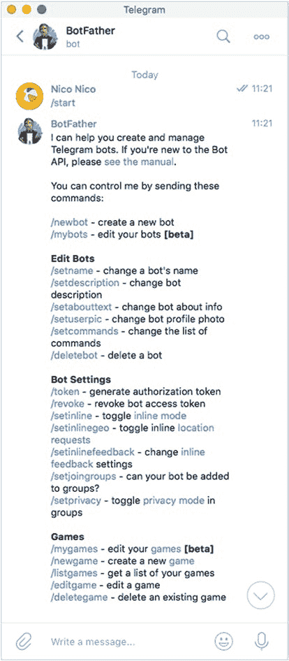

第 1 章 第 1 周：Ruby

***图 1-4.** 向 BotFather 问好*

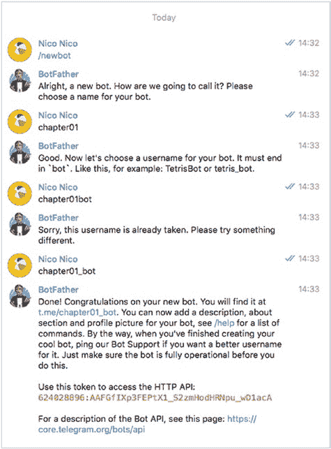

第 1 章 第 1 周：Ruby

太好了！我现在不会回顾完整的选项列表，而是直接开始创建我们的新机器人。这里通过输入 `/newbot` 命令，然后按照一个简单的对话进行，如图 1-5 所示。

***图 1-5.** 请求 BotFather，请，请，创建一个新机器人*

你的机器人现在可以使用了。你能看到红色的类似秘密代码的东西吗？这是机器人令牌，它是一个字符串，将用于在 Telegram 平台上唯一标识和验证你的机器人。**不要泄露这个令牌**。不要把它写在书里，也不要让它挂在 GitHub 上的某个地方，尤其是现在微软拥有它之后。

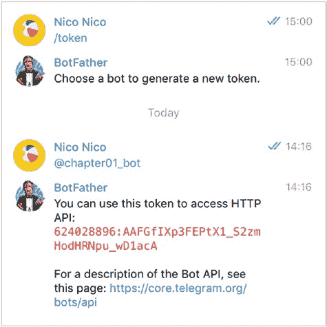

第 1 章 第 1 周：Ruby

在我们的例子中，在上面的聊天中，生成并给我们的令牌如下：

624028896:AAFGfIXp3FEPtX1_S2zmHodHRNpu_wD1acA

如果你的令牌（像这个一样）曾经被泄露，你可以使用 `/token` 命令与机器人父亲对话，以生成一个新令牌，如图 1-6 中的对话所示。

***图 1-6.** 聊天以生成新令牌*

好了，我们的 Telegram 机器人注册全部完成了。那么，让我们切换到一点 Ruby 编码吧。

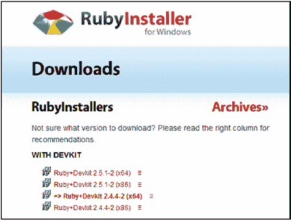

第 1 章 第 1 周：Ruby

**设置 Ruby**

在大多数类 Unix 平台上，包括 OS X，Ruby 已经安装，或者可以使用包管理器安装。对于那些运行不太主流的操作系统（如 Windows）的用户，你可以从 Ruby 下载页面 [www.ruby-lang.org/en/downloads/](http://www.ruby-lang.org/en/downloads/) 下载并安装 Ruby 安装程序（图 1-7）。下载最新版本。

***图 1-7.** 寻找 Windows Ruby 安装程序*

安装完成后，如果你打开一个终端（在 macOS 上）或 Windows 上的命令提示符（图 1-8），并且可以输入以下命令而不出错，那么你就准备好了：

ruby -v
gem -v

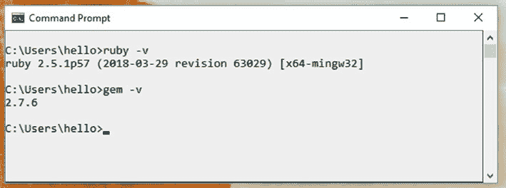

第 1 章 第 1 周：Ruby

***图 1-8.** 检查 ruby 和 gem 版本*

如果你以前从未使用过 Ruby，你可能想知道 `gem` 可执行文件是什么？它只是一个 Ruby 特定的库安装程序（就像 `npm` 用于 Node，`pip` 用于 Python），所以当你需要一些别人编写的开源库时，你会使用 `gem` 将它下载到你的机器上，并使用 `ruby` 可执行文件来运行它。

除了 Ruby，为了在记事本之外获得一些编码乐趣，你还需要一个文本编辑器，所以我建议使用微软的 Visual Studio Code ([`code.visualstudio.com/`](https://code.visualstudio.com/))，当然，任何你喜欢的文本编辑器都可以。

好了，让我们开始编码我们的第一个机器人吧。

**你的第一个 Telegram 机器人**

为了与我们的第一个机器人对话，我们将使用名为 `telegram_bot` 的 Ruby 库。你可以在 RubyGems ([`rubygems.org/`](https://rubygems.org/)) 上找到其他一些著名的库，但我发现这个库是一个容易上手和开始的库，我希望你最终也会同意我的看法。

实际上，你可以自己查看，并通过查询 RubyGems 网站（图 1-9）找到你最喜欢的 Telegram 库。


第 1 章 第 1 周：Ruby

***图 1-9.** 寻找 gems*

要在 Ruby 中使用一个库，你首先在你的机器上安装它，使其对你的计算机可用，使用 `gem install` 命令，然后在你的 Ruby 代码中，使用 `require` 函数，使该库对你的 Ruby 程序可用。

让我们为这第一个机器人创建一个新文件夹。更改目录，然后使用 `gem` 安装 Telegram 库，如下所示：

mkdir chapter-01
cd chapter-01
gem install telegram_bot

第 1 章 第 1 周：Ruby

在终端中，输出应该类似于这样：

SuperPinkicious:chapter-01 niko$ gem install telegram_bot
Successfully installed telegram_bot-0.0.8
Parsing documentation for telegram_bot-0.0.8
Done installing documentation for telegram_bot after 0 seconds
1 gem installed

`gem` 现在已安装，并准备好在你的代码中使用。

现在，你将编写一些代码来唤醒你的机器人并使其活跃起来。在该文件夹的一个新文件中，你可以将其命名为 `step0.rb`，让我们编写以下 Ruby 代码行：

```ruby
require 'telegram_bot'

bot = TelegramBot.new(token: ENV['BOT_TOKEN'])

bot.get_updates() do |message|
    puts message.to_s
end
```

这段代码的作用是：

• 使通过 `gem` 安装的 `telegram_bot` 库对你的程序可用。
• 创建一个新的 Ruby 机器人对象，使用通过外部变量暴露的 Telegram 令牌。这通常是共享你的机器人代码而不将机器人令牌泄露给所有人的推荐方式。
• 实例化机器人实例，以监听传入消息，使用机器人对象的 `get_updates()` 方法。
• 确保现在每当有消息发送给机器人时，机器人都会将其打印到控制台。

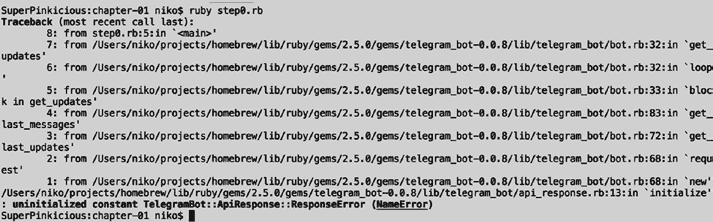

第 1 章 第 1 周：Ruby

要在你的机器上运行上面编写的程序，你将程序文件名 `step0.rb` 传递给 `ruby` 可执行文件。让我们来做吧。

在终端中，执行以下命令：

```bash
ruby step0.rb
```

观察输出（图 1-10）。

***图 1-10.** 有时，它就是不行*

哎呀！进展不太顺利。我们忘记将 Telegram 令牌传递给我们的程序了。

这可以在 Linux 或 OS X 上通过以下方式完成：

```bash
export BOT_TOKEN='585672177:AAHswpmdA2zP52ZWoJMdteGa0xQ8KeynWvE'
```

在 Windows 上通过以下方式完成：

```bash
set BOT_TOKEN=585672177:AAHswpmdA2zP52ZWoJMdteGa0xQ8KeynWvE
```

让我们再次运行程序。这次，看起来命令没有结束……这是意料之中的，因为机器人现在实际上正在等待消息。

让我们成为开始对话的人，所以让我们发送一条问候消息。

在 Telegram 窗口中，搜索机器人并开始聊天（图 1-11）。

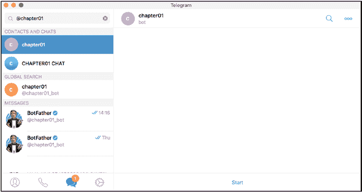

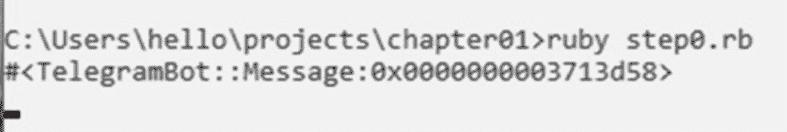

第 1 章 第 1 周：Ruby

***图 1-11.** 发送给我们机器人的第一条消息*

通过按下那个“开始”按钮，机器人已经收到了一条消息（图 1-12）！

***图 1-12.** 来自我们机器人的第一条消息！*

嗯，这不太可读。使用 Ruby，你可以通过使用 `to_yaml` 函数来显示任何对象的更易读的版本。让我们更新代码，看看会发生什么。

我们调用 `require 'yaml'` 将其导入 Ruby 命名空间，现在我们可以对机器人收到的消息调用 `to_yaml`。

```ruby
require 'telegram_bot'
require 'yaml'

bot = TelegramBot.new(token: ENV['BOT_TOKEN'])
```


第 1 章 第 1 周：Ruby

```ruby
bot.get_updates() do |message|
    # puts message.to_s
    puts message.to_yaml
end
```

你需要先按 Ctrl-C 终止正在运行的机器人版本，然后通过再次执行 `ruby` 命令来启动新机器人。图 1-13 显示了结果。

***图 1-13.** 你好吗？*

在控制台或启动机器人的终端中，你现在可以看到收到的消息的更详细版本。

```
SuperPinkicious:chapter-01 niko$ ruby step0.rb
--- !ruby/object:TelegramBot::Message
message_id: 191
from: !ruby/object:TelegramBot::User
  id: 121843071
  first_name: Nico
  last_name: Nico
  username: hellonico
chat: !ruby/object:TelegramBot::Channel
  id: 121843071
  username: hellonico
  title:
date: !ruby/object:DateTime 2018-08-31 07:42:26.000000000 Z
text: how are you?
reply_to_message:
```

第 1 章 第 1 周：Ruby

实际上，无论使用哪种编程语言，这种消息格式都将非常一致，因此查看消息字段是个好主意。

**理解接收到的消息字段**

表 1-1 简要解释了我们刚刚通过 Telegram 机器人接收到的字段。

***表 1-1.** 从 Telegram 机器人接收到的字段*

| **字段** | **示例值** | **解释** |
| :--- | :--- | :--- |
| message_id | 191 | 机器人消息的唯一标识符 |
| from | !ruby/object:TelegramBot::User | 发送消息的用户 |
| chat | !ruby/object:TelegramBot::Channel | 聊天/频道信息 |
| date | !ruby/object:DateTime 2018-08-31 07:42:26.000000000 Z | 消息发送的时间 |
| text | how are you? | 消息的文本 |
| reply_to_message | <empty> | 此消息所回复的消息 |

对于标准消息，除了你对聊天消息对象的预期之外，没有太多其他内容。你可能大部分时间会使用 `date`、`text` 和 `from` 字段。


第 1 章 第 1 周：Ruby

**首次回复**

再次，Ruby 的简洁性使得从对象创建字符串变得非常容易。通过以下方式，你可以直接在字符串中使用可执行代码块：`#{}`。

这使得它对于模板化消息非常强大，在我们的例子中，对于机器人编程也是如此。在 `get_updates()` 调用块中，让我们现在编写并发送一个回复。

```ruby
    message.reply do |reply|
        reply.text = "Hello, #{message.from.first_name}!"
        reply.send_with(bot)
    end
```

重启机器人后（Ctrl-C，`ruby step0.rb`），我们可以启动这个 Ruby 机器人的一个更健谈的版本（图 1-14）。

***图 1-14.** 你好，Nico！*

这运行得非常顺利，我很高兴地宣布，你已经进入了这个机器人大师课程的第二级。

第 1 章 第 1 周：Ruby

你在第一章中学到了很多东西，其中包括：

• 如何向机器人父亲注册一个机器人
• 如何在我们的程序中使用机器人令牌
• 启动机器人并监听消息
• 查看传入消息的字段
• 回复传入消息

下周，我们将在下一章中使用不同的编程语言，在这些相同概念的基础上进行构建。

**第 2 章**

**第 2 周：Nim**

*[Jenner: 我学到了这么多：能拿的时候就拿，能拿多少拿多少。]*

*[Justin: 那你什么也没学到。]*

—《NIMH 的秘密》

在过去的两年里，Nim 一直在我采用的编程语言列表中。在视觉上，它看起来和感觉上非常像 Python，但它也可以编译成二进制文件，通过 C、C++、Objective-C 甚至 JavaScript。我见过编译后的 Nim 二进制程序运行得*非常*快，我真的希望 Nim 能够达到下一个采用水平。

今天，我们将专注于构建机器人，作为二进制文件运行，用 Nim 构建。当然，我们将从在你的本地机器上设置 Nim 环境开始。

**安装 Nim**

Nim 可以从以下位置手动下载：[`nim-lang.org/docs/re.html`](https://nim-lang.org/docs/re.html)。它也可以通过你的平台包管理器获得。

确保你同时安装了 Nim（编译器）和 Nimble（包管理器）。在撰写本文时，这些是两个可执行文件的最新可用版本。

```
SuperPinkicious:APRESS niko$ nim -v
Nim Compiler Version 0.18.0 [MacOSX: amd64]
Copyright (c) 2006-2018 by Andreas Rumpf
```

© Nicolas Modrzyk 2019
N. Modrzyk, *构建 Telegram 机器人*, `doi.org/10.1007/978-1-4842-4197-4_2`

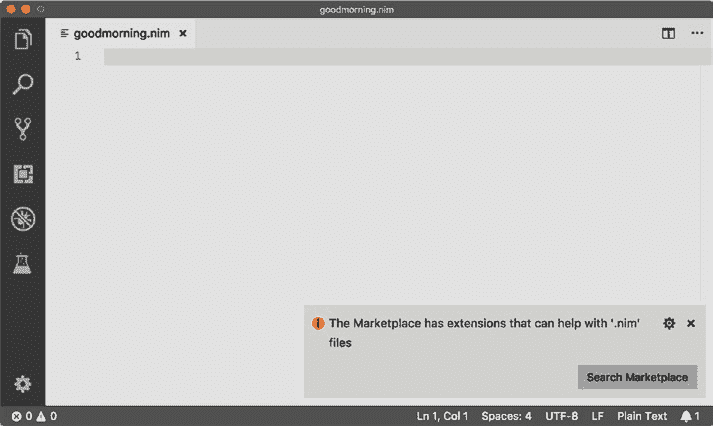

第 2 章 第 2 周：Nim

```
active boot switches: -d:release -d:useLinenoise
SuperPinkicious:APRESS niko$ nimble -v
nimble v0.8.10 compiled at 2018-03-11 16:16:29
git hash: couldn't determine git hash
```

本书中使用的设置（因此也适用于 Nim 编程）基于 Visual Studio Code，你将了解从 Visual Studio Code 内部开始使用 Nim 的基础知识。

**Visual Studio Code 的 Nim 插件**

在编写一个完整的 Telegram 机器人之前，你将通过编写一些 Hello World 代码来了解 Nim。让我们从在 Visual Studio Code 中创建一个名为 `goodmorning.nim` 的文件开始，来编写我们的前几行代码（图 2-1）。

***图 2-1.** goodmorning.nim 文件*

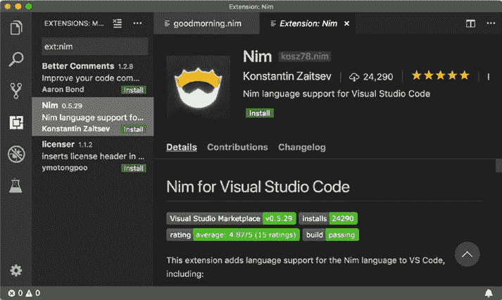

第 2 章 第 2 周：Nim

正如你在图 2-1 的右下角所看到的，Visual Studio Code 识别出新文件的扩展名，并建议你去 Marketplace 寻找一个支持 Nim 文件编辑的扩展。这对于其他每种语言都是一样的，因此你可能需要在之后为其他语言重复这些步骤。

要安装的插件是 Konstantin Zaitsev 编写的那个，如图 2-2 所示。

***图 2-2.** Nim 插件*

一旦 Visual Studio Code 安装了该插件，你必须点击“重新加载”按钮来激活该插件（图 2-3）。

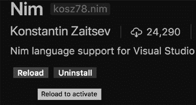

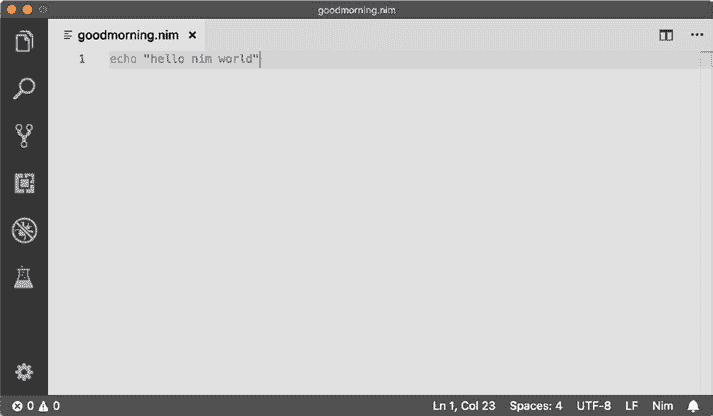

第 2 章 第 2 周：Nim

***图 2-3.** 激活 Nim 插件*

现在，让我们写一些代码吧！

**你好，Nim**

如果安装成功，你现在拥有一个支持 Nim 的编辑器，这意味着语法高亮和从编辑器内部编译。`echo` 是 Nim 中最简单的打印到标准输出的函数，我们将用它来打印一些正式的问候语（图 2-4）。

***图 2-4.** hello nim world 问候语*

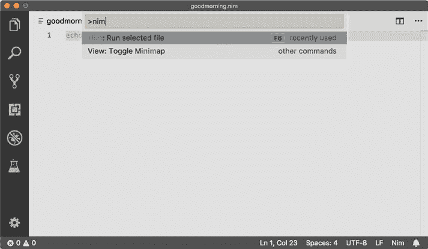

第 2 章 第 2 周：Nim

一旦你在文件中写好了代码，你现在就可以执行它了。

与 Ruby 不同，在 Ruby 中你可以将代码传递给 `ruby` 可执行文件执行，Nim 是一种编译型语言，所以它首先被转换成二进制文件。这是计算机能够理解并自行执行的形式，包括第三方库，然后执行该文件。

要在 Visual Studio Code 中激活执行这两个步骤的命令，你可以使用以下任一方式：

1. Command+Shift+P 或
2. Ctrl+Shift+P

这将弹出一个菜单，其中包含所有可用的 Visual Studio Code 命令。你想要用来编译和运行位于打开文件中的 Nim 代码的命令名为 `Nim: Run Selected file`，一旦你在弹出的类似搜索的文本框中开始输入“nim”，它将是第一个选项（图 2-5）。

***图 2-5.** 从弹出菜单中运行选定的文件*

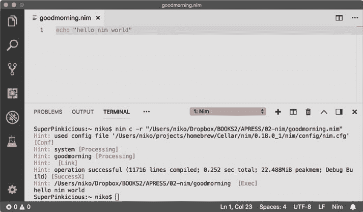

第 2 章 第 2 周：Nim

执行该命令将在触发命令时刚刚打开的终端或命令提示符中打印出几行编译信息。在底部，你可以看到问候消息。代码已从文本编辑器内部编译并执行（图 2-6）。

***图 2-6.** hello nim world*

请注意，插件实际执行的命令类似于：

```
nim c -r goodmorning.nim
```

这是以下命令的快捷方式：

• `c`: 编译
• `-r`: 运行
• `goodmorning.nim`: 要编译和运行的文件

第 2 章 第 2 周：Nim

在 `goodmorning.nim` 文件所在的文件夹中，你会看到创建了一个新文件，名为 `goodmorning`，没有文件扩展名。

当然，你可以直接重新执行编译后的文件，而无需再次从命令行重新编译。

```
SuperPinkicious:02-nim niko$ ./goodmorning
hello nim world
```

尝试稍微更改代码并重新编译几次，以掌握从 Visual Studio Code 进行编译的步骤。接下来，让我们超越问候语，转向更有意义的代码。

**第二个 Nim 程序（仍然不是机器人）**

在第二个示例中，我们将向一个远程站点发送 HTTP 请求，并将结果打印在命令行上。这个新程序需要来自不同 Nim 模块 `httpclient` 的一些代码，该模块包含可以发送 HTTP 请求并读取返回值的对象。你将使用关键字 `import` 来实现这一点。

代码的其余部分与 Python 语法非常相似，很容易阅读。

```nim
import httpclient

const URL = "https://api.github.com/search/repositories" &
            "?q=cat" &
            "&sort=stars" &
            "&order=desc"

let
    client = newHttpClient()
echo client.getContent(URL)
```


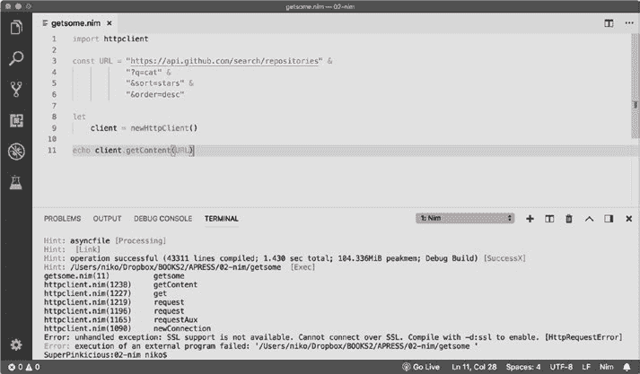

第 2 章 第 2 周：Nim

我们首先看到创建了一个常量字符串 `URL`，它将是 HTTP 请求的目标。`let` 定义了一个作用域变量，即 HTTP 客户端。最后，我们通过调用 HTTP 客户端的 `getContent` 方法，检索来自 HTTP `get` 请求的响应体。

现在让我们运行它，通过从命令面板调用 `Nim: Run selected file` 命令（图 2-7）。

***图 2-7.** 运行 HTTP 客户端*

不幸的是，事情似乎进展不顺利，一条红色文本的消息显示出来，如图 2-8 所示。

***图 2-8.** 执行失败*

幸运的是，它明确地告诉了你哪里出了问题，这对于一种编程语言来说相当不寻常。去问问 Java 开发者吧。


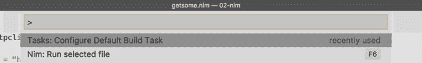

第 2 章 第 2 周：Nim

发生的情况是，HTTP 连接需要 SSL，因为我们是通过 HTTPS 连接的。在 Nim 源文件的编译步骤中，默认情况下不包含 SSL。

要包含 SSL 支持，我们必须为 `nim` 命令定义一个符号，使用 `-d:ssl` 标志，这样它将包含执行 HTTPS 请求所需的代码。

如果你想在命令行或终端中尝试这个，你可以使用以下完整命令：

```
nim c -d:ssl -r getsome.nim
```

上述命令将按预期编译并运行代码，最终输出从 `get` 请求返回的多行 JSON。

但是……我知道你的感受。你想从 Visual Studio Code 本身运行这个命令。这可以通过使用 Visual Studio Code 自定义任务来完成。

**创建 Visual Studio Code 构建任务**

要在 Visual Studio Code 中创建你自己的任务，请从命令面板中按照几个步骤操作，这将从一个模板创建一个 JSON 文件（图 2-9、2-10、2-11）。

***图 2-9.** 从模板创建 tasks.json 文件*

***图 2-10.** 配置默认构建任务*

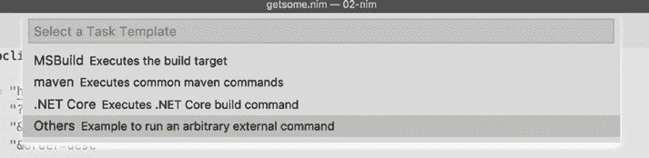

第 2 章 第 2 周：Nim

***图 2-11.** 运行任意外部命令*

在此序列结束时，你将拥有一个新文件 `.vscode/tasks.json`，其内容类似于以下内容：

```json
{
    // See https://go.microsoft.com/fwlink/?LinkId=733558
    // for the documentation about the tasks.json format
    "version": "2.0.0",
    "tasks": [
        {
            "label": "echo",
            "type": "shell",
            "command": "echo Hello",
            "problemMatcher": []
        }
    ]
}
```

基本上，这个任务执行一个 shell 命令，在终端或命令提示符上显示“hello”。通常来说，它本身不是一个非常有用的命令，但是，谁知道呢。

现在，我们想用它作为默认的构建命令，所以让我们再次用 Command+Shift+B、Ctrl+Shift+B 触发命令面板。

这会再问你几个问题，类似于图 2-12 和 2-13 所示。

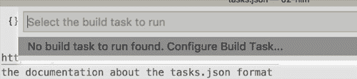

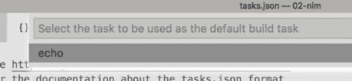

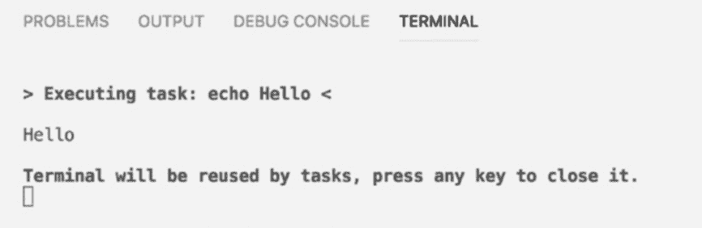

第 2 章 第 2 周：Nim

***图 2-12.** 配置构建任务*

***图 2-13.** echo*

自定义构建任务 hello 现在已在 Visual Studio Code 中配置完成。下次你输入“Command+Shift+B”时，将出现一个终端，显示 `echo` 命令的输出（图 2-14）。

***图 2-14.** Hello*

“Hello”对于第一次来说通常已经足够好了，但是，是的，现在可能是时候回到编译和执行 Nim 文件了。

第 2 章 第 2 周：Nim

所以，让我们将 `.vscode/tasks.json` 文件的内容替换为以下内容：

```json
{
    "version": "2.0.0",
    "tasks":
        [
          {
            "label": "nim",
            "command": "nim",
            "args": [
              "c",
              "-d:ssl",
              "-r",
              "${file}"
            ],
            "options": {
              "cwd": "${workspaceRoot}"
            },
            "group": {
              "kind": "build",
              "isDefault": true
            }
          }
        ]
      }
```

请注意，你刚刚创建了一个标记为 `nim` 的任务，其命令就是你几页前看到的那个。

```
nim c -d:ssl -r ${file}
```

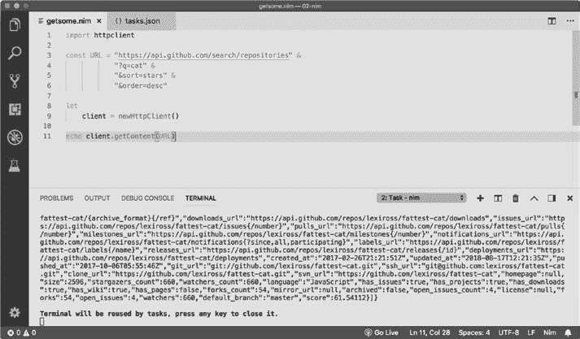

第 2 章 第 2 周：Nim

在 Visual Studio Code 中，`${file}` 是一个参数，包含当前打开的文件。现在，我们可以直接从编辑器执行 `getsome.nim`（图 2-15）。

***图 2-15.** 直接从 Visual Studio Code 执行 getsome*

太好了！这个自定义任务实际上是编译和运行包含我们将要使用的第三方 Telegram 库的代码所必需的。但是我们如何安装外部包呢？

这是通过 Nimble 完成的。让我们看看它是如何工作的。

**使用 Nimble 安装 Nim 包**

记住，你在本章开头安装了 Nimble。你现在将使用它来安装一个 Telegram API 的包装器。

你可以使用 `search` 子命令通过 Nimble 查找包，如下所示：

```
nimble search telegram
```

第 2 章 第 2 周：Nim

这将返回一个匹配搜索关键字的库列表，以及每个库的一些相关信息。

```
SuperPinkicious:02-nim niko$ nimble search telegram
telebot:
  url:         https://github.com/ba0f3/telebot.nim (git)
  tags:        telebot, telegram, bot, api, client, async
  description: Async Telegram Bot API Client
  license:     MIT
  website:     https://github.com/ba0f3/telebot.nim

nim_telegram_bot:
  url:          https://github.com/juancarlospaco/nim-telegram-bot  (git)
  tags:        telegram, bot, telebot, async, multipurpose, chat
   description:  Generic Configurable Telegram Bot for Nim, with builtin basic functionality and Plugins
  license:     MIT
  website:      https://github.com/juancarlospaco/nim-telegram-bot
```

为了构建我们的机器人，我们将使用第一个、使用最广泛的库 `telebot`，这可以通过使用 Nimble 的 `install` 命令来完成。

```
nimble install telebot
```

这会产生以下输出：

```
SuperPinkicious:02-nim niko$ nimble install telebot
Downloading https://github.com/ba0f3/telebot.nim using git
  Verifying dependencies for telebot@0.4.2
 Installing telebot@0.4.2
   Success: telebot installed successfully.
```

当然，你可以检查包是否已安装到你的机器上，使用：

```
nimble list -i
```

第 2 章 第 2 周：Nim

或者使用 `uninstall` 移除包：

```
nimble uninstall telebot
```

现在，你所需的一切都已安装到你的机器上，让我们终于开始用 Nim 编写我们的机器人吧！

**第一个 Nim 机器人**

在 Nim 中，你使用 `proc` 定义一个函数或过程。`proc` 接受一个函数名，这里是 `updateHandler`；一些参数，这里是类型为 `telebot` 的 `b` 和类型为 `Update` 的 `u`（都来自 `telebot` 模块）；以及有时一些元数据（或 pragma），这里是 `{.async.}`。

你可以在 `nim-lang.org` 上找到任何模块的文档。例如，`asyncdispatch` 模块在这里：

[`nim-lang.org/docs/asyncdispatch.html`](https://nim-lang.org/docs/asyncdispatch.html)

我们在这里使用 async 模块的原因是为了编写我们的 Telegram 机器人。

**注意** 异步过程消除了处理回调的痛苦。它们允许你以与编写同步代码相同的方式编写异步代码。

`slurp` 函数获取文件的内容并将其转换为字符串——这里，是你在上一章中从 BotFather 收到的机器人 `API_KEY`。是的，你应该将你的密钥粘贴到一个新的 `secret.key` 文件中。以下是一个简单机器人的几行代码，它对你发送给它的任何内容都回复“hello”。

```nim
import telebot, asyncdispatch, options

const API_KEY = slurp("secret.key")

proc updateHandler(b: Telebot, u: Update) {.async.} =
```

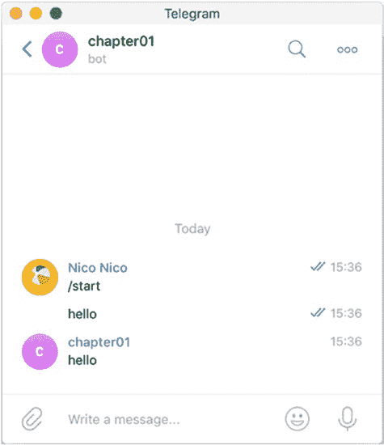

第 2 章 第 2 周：Nim

```nim
    let
     response = u.message.get
     message = newMessage(response.chat.id, "hello")
    discard await b.send(message)

let bot = newTeleBot(API_KEY)
bot.onUpdate(updateHandler)
bot.poll(300)
```

与你现有的机器人或向机器人父亲注册的新机器人开始一个新的聊天，将产生如图 2-16 所示的对话。

***图 2-16.** hello*

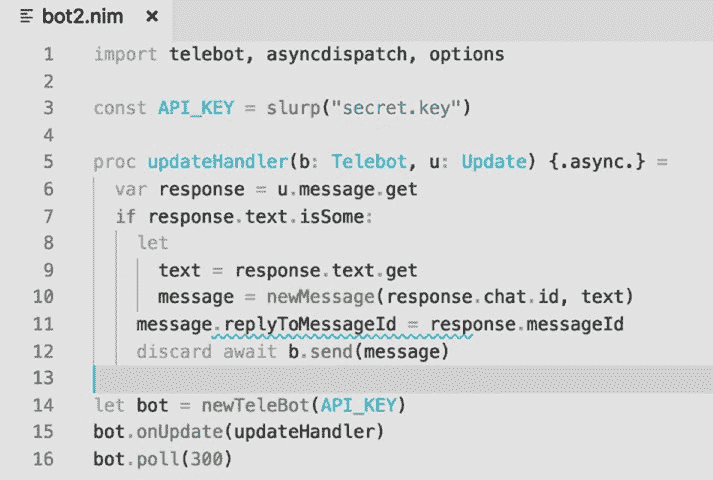

第 2 章 第 2 周：Nim

**回复 Nim 机器人**

既然你已经掌握了整个设置，创建第二个 Nim 机器人将相当简单。这个新机器人将内联回复，就像你直接回复另一个用户发送的消息一样。这是通过设置创建的消息对象上的 `replyToMessageId` 属性来完成的。

请注意，如果你将消息对象保留在 `let` 块中声明，编译器会“抱怨”（双关语）该消息无法更新，因为它是不可变的（图 2-17）。

***图 2-17.** 使用 `let` 而不是 `var` 导致的编译错误*

这是因为它是用 `let` 创建的，这使得对象不可变。为了解决这个问题，你只需用 `var` 声明消息对象即可。


第 2 章 第 2 周：Nim

```nim
import telebot, asyncdispatch, options

const API_KEY = slurp("secret.key")

proc updateHandler(b: Telebot, u: Update) {.async.} =
  var response = u.message.get
  if response.text.isSome:
    let
      text = response.text.get
    var message = newMessage(response.chat.id, text)
    message.replyToMessageId = response.messageId
    discard await b.send(message)

let bot = newTeleBot(API_KEY)
bot.onUpdate(updateHandler)
bot.poll(300)
```

机器人现在会告诉你它正在回复哪条消息（图 2-18）。

***图 2-18.** hello, hello*

**猫和狗 Nim 机器人**

下一个机器人只是对前一个机器人的轻微更新。我们将使用 `newPhoto` 而不是 `newMessage` 来创建消息，这允许我们在发送给用户的消息中嵌入一张图片。

为此，你必须在 Nim 文件旁边有动物的图片（例如 `cat.jpg` 和 `dog.jpg`）。

第 2 章 第 2 周：Nim

在 Nim 代码中，文件的路径以 `file://` 为前缀，我们还通过设置照片消息的 `caption` 字段为图片添加标题。

这给出了：

```nim
import telebot, asyncdispatch, options

const API_KEY = slurp("secret.key")

proc updateHandler(bot: TeleBot, update: Update) {.async.} =
  var response = update.message.get
  if response.text.isSome:
    let
         animal = response.text.get
         file = "file://" & animal & ".jpg"
    var message = newPhoto(response.chat.id, file)
    message.caption = animal
    discard await bot.send(message)

let
  bot = newTeleBot(API_KEY)
bot.onUpdate(updateHandler)
bot.poll(300)
```

启动这个机器人后，当你向它发送关键字时，它会回复一张给定关键字的加载好的图片，并附上动物的标题（图 2-19）。

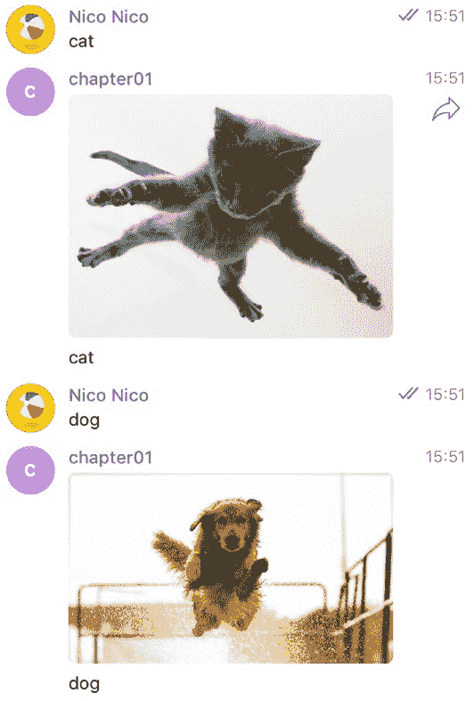

第 2 章 第 2 周：Nim

***图 2-19.** 猫和狗*

当然，如果你输入一个没有对应文件的动物，机器人将无法回答。

所以，一个小练习是向用户发送一个回复，例如“找不到该文件。”

在这个 Nim 章节中，我们花了很多时间设置 Visual Studio Code，但现在你比以往任何时候都更有准备去应对其他语言的机器人。

**第 3 章**

**第 3 周：Crystal**

*彗星，带来时代和状态的变迁，*

*在天空中挥舞你水晶般的发丝，……*

—William Shakespeare
《亨利六世》第一部，第一幕，第一场

Crystal 是一种新的编程语言，其语法深受 Ruby 影响，以至于感觉就像在写 Ruby。与 Ruby 的主要区别在于 Crystal 被编译成 C，因此速度非常快。

Crystal 具有许多优点，例如完全支持简单的并发模型、宏、强类型检查，以及我最喜欢的一点：通过直接 Git 访问完全支持依赖项，无需打包，也无需总是中断的中央仓库。

在本章中，除了使用 Crystal 开发机器人之外，你还将学习编写你的第一个机器人命令。你会记得我们在与机器人父亲对话时使用过命令来创建我们的机器人。是的，它们是相同的！（见图 3-1）。

© Nicolas Modrzyk 2019
N. Modrzyk, *构建 Telegram 机器人*, `doi.org/10.1007/978-1-4842-4197-4_3`

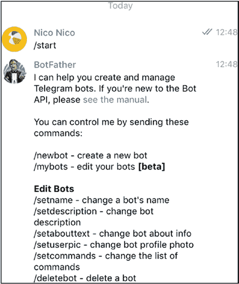

第 3 章 第 3 周：Crystal

***图 3-1.** BotFather 命令*

**设置 Crystal**

Crystal 网站上已经有一堆安装步骤，所以我们在这里尽量简化。

[`crystal-lang.org/docs/installation/index.html`](https://crystal-lang.org/docs/installation/index.html)

但是请注意，对于 Windows 用户，Crystal 只能与 Windows Subsystem for Linux (WSL) 一起使用，这需要最新版本的 Windows 10。在 macOS 上，Crystal 可以通过 homebrew 轻松安装，如下所示：

```
brew install crystal
```

第 3 章 第 3 周：Crystal

当你使用 homebrew 安装 Crystal 时，你可以看到 Crystal 编译器本身是用 Crystal 编写的，`.cr` 是 Crystal 文件的常见扩展名。

```
bin/crystal build -D without_openssl -D without_zlib -o .build/crystal src/compiler/crystal.cr --release --no-debug
```

在我最喜欢的基于 Arch Linux 的 Manjaro Linux 上，Pacman 也直接提供了它。

```
pacman -S crystal shards
```

在其他发行版上，你必须在运行 `yum`、`apt-get` 等之前安装一个新的仓库。

一旦 Crystal 安装完毕，你应该检查 `crystal` 以及 Crystal 包管理器 `shards` 是否已安装。

```
SuperPinkicious:withcrystal niko$ crystal --version
Crystal 0.26.1 (2018-09-06)
LLVM: 6.0.1
Default target: x86_64-apple-macosx

SuperPinkicious:withcrystal niko$ shards --version
Shards 0.8.1 (2018-09-06)
```

**在游乐场小试牛刀**

安装后，Crystal 实际上可以作为独立环境在所谓的游乐场中使用。你可以使用 `play` 命令将训练环境作为 Web 服务器启动。

```
crystal play
```

这将在默认端口 8080 上启动一个 Web 服务器。你也可以使用 `-p` 标志在不同的端口上启动游乐场。

```
crystal play -p 8090
```

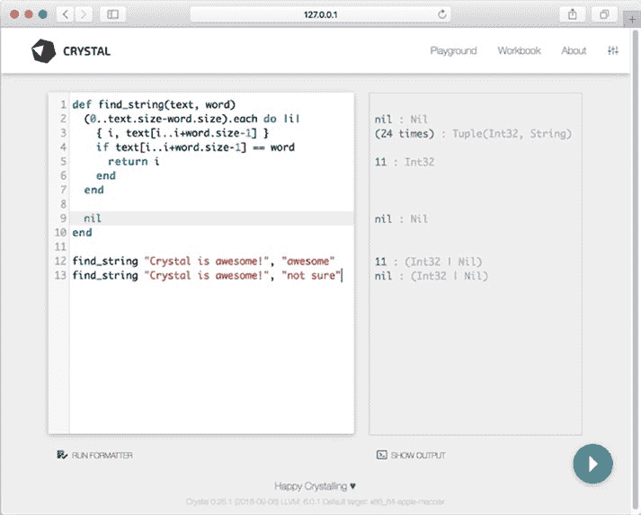

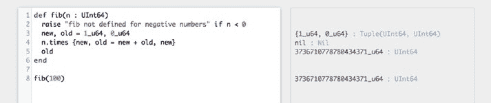

第 3 章 第 3 周：Crystal

你可以在左侧面板中键入代码，并直接在右侧看到逐行执行的结果（图 3-2）。

***图 3-2.** Crystal 嵌入式开发环境*

Crystal 的纯粹速度可以通过运行一些 CPU 密集型函数来快速体会到，例如，老牌的斐波那契数列（图 3-3）。

***图 3-3.** 斐波那契*

第 3 章 第 3 周：Crystal

包含基准测试代码的列表如下：

```crystal
require "benchmark"

def fib(n : UInt64)
  raise "fib not defined for negative numbers" if n < 0
  new, old = 1_u64, 0_u64
  n.times {new, old = new + old, new}
  old
end

def time(&block)
  puts Benchmark.measure(&block).real
end

time { fib(1000000000_u64) }
```

当执行时，就像这里一样，在一台简单的 MacBook 上，它花费的时间远少于五秒。所以，我们在这里，Crystal 是一种简单而快速的语言。

但是，让我们回过头来，在使用 Visual Studio Code 编写和键入代码时欣赏它。

**再次使用 Visual Studio Code**

你将编写一个小程序，根据 GitHub 搜索查询获取 GitHub 项目的 URL。从对 GitHub 的 HTTP 请求返回的数据将是 JSON 格式，因此我们也必须使用一些 JSON 解析来解码它。

在一个新文件 `requesting.cr` 中，让我们编写将发送请求并在控制台中显示它的代码。

```crystal
require "http/client"
require "json"
```

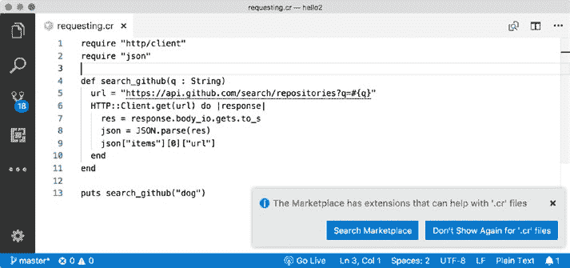

第 3 章 第 3 周：Crystal

```crystal
def search_github(q : String)
  url = "https://api.github.com/search/repositories?q=#{q}"
  HTTP::Client.get(url) do |response|
    res = response.body_io.gets.to_s
    json = JSON.parse(res)
    json["items"][0]["url"]
  end
end

puts search_github("dog")
```

正如你所欣赏的，语法真的、真的非常接近 Ruby。同时，请注意参数的可选类型标注 `q : String`。

HTTP 客户端和 JSON 解析器是核心语言的一部分，因此，运行此代码片段不需要第三方库。

一旦你在文件中键入了代码，Visual Studio Code 会像往常一样，建议你在 Marketplace 中寻找一个插件（图 3-4）。

***图 3-4.** 在 Marketplace 中寻找 crystals*


第 3 章 第 3 周：Crystal

我使用 Gerardo Ortega 的 Crystal 插件体验非常好（图 3-5），当然，你也可以随意尝试其他的。

***图 3-5.** Crystal 插件*

你可能还记得第 2 章，你还需要一个 `tasks.json` 文件，与用于 Nim 的文件非常相似，用于运行和执行代码，但这次是针对 Crystal 的。从命令行执行/运行文件的命令直接使用 `crystal` 命令。

```
crystal run <file_name>
```

所以，让我们在 Visual Studio Code 的任务文件中编写等效的命令。

```json
{
    "version": "2.0.0",
    "tasks":
        [
            {
                "label": "cr",
                "command": "crystal",
                "args": [
                    "run",
                    "${file}"
                ],
```

第 3 章 第 3 周：Crystal

```json
                "options": {
                    "cwd": "${workspaceRoot}"
                },
                "group": {
                    "kind": "build",
                    "isDefault": true
                }
            }
        ]
    }
```

**注意** 实际上，在 macOS 上，你必须修改 `LIBRARY_PATH` 变量，以便 Crystal 能够正确编译 C 代码。

这可以通过将以下行添加到 Visual Studio Code 用户设置中来完成。

```json
  "terminal.integrated.env.osx": {
        "LIBRARY_PATH": "/Users/niko/projects/homebrew/lib"
}
```

设置可以如图 3-6、3-7 和 3-8 所示进行编辑。

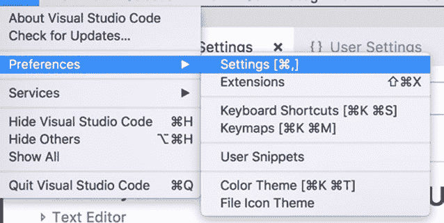


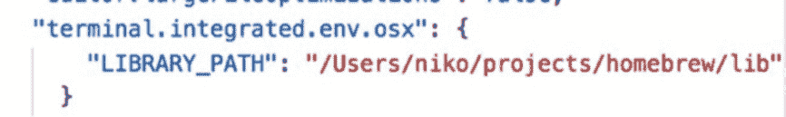

第 3 章 第 3 周：Crystal

***图 3-6.** 访问设置*

***图 3-7.** 编辑 json 文件*

***图 3-8.** 添加该行*

请注意，当你从命令行执行时，你也必须在你的 shell 环境中的某个地方设置相同的变量，使用以下命令：

```
export LIBRARY_PATH=/Users/niko/projects/homebrew/lib
```

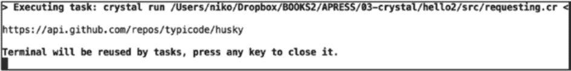

第 3 章 第 3 周：Crystal

这是 macOS 特有的解决方法，在其他环境中可以安全地忽略。

你现在都准备好了，所以熟悉的 Command+Shift+B (Ctrl+Shift+B) 将执行 Crystal 代码。

Visual Studio Code 的集成控制台/终端将执行该命令并显示 GitHub 查询的结果（图 3-9）。

***图 3-9.** 第一个 Crystal 命令*

现在，为了编写 Telegram 机器人，我们将需要一个第三方库。为此，我们将使用内置命令创建一个 Crystal 项目。

**创建一个 Crystal 项目**

要为新的 Crystal 项目创建文件布局，你可以使用 `init` 子命令。

```
SuperPinkicious:crystal niko$ crystal init app mybot
    create  mybot/.gitignore
    create  mybot/.editorconfig
    create  mybot/LICENSE
    create  mybot/README.md
    create  mybot/.travis.yml
    create  mybot/shard.yml
    create  mybot/src/mybot.cr
    create  mybot/spec/spec_helper.cr
    create  mybot/spec/mybot_spec.cr
Initialized empty Git repository in /Users/niko/APRESS/crystal/mybot/.git/
```

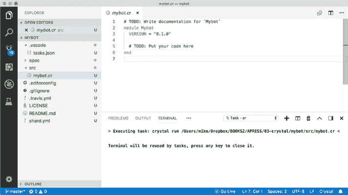

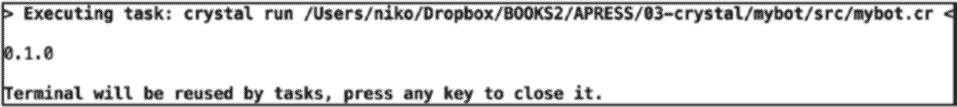

第 3 章 第 3 周：Crystal

现在，如果你在 Visual Studio Code 中打开该文件夹并重新创建 `tasks.json` 以运行 Crystal 代码，你应该能够打开并执行（几乎为空的）`mybot.cr` 文件（图 3-10）。

***图 3-10.** 空的——真的，真的，空的——机器人*

这可能不是你见过的最激动人心的程序。让我们稍微更新一下 `mybot.cr` 的代码，在文件底部添加一个打印语句。

```crystal
puts Mybot::VERSION
```

当然，你可以直接从 Visual Studio Code 执行它（图 3-11）。

***图 3-11.** 打印版本*

第 3 章 第 3 周：Crystal

你也可以使用 `run` 子命令从命令行执行。

```
SuperPinkicious:mybot niko$ crystal run src/mybot.cr
0.1.0
```

有趣的是，你也可以使用 `build` 命令将相同的代码编译成二进制文件。

```
crystal build src/mybot.cr
```

然后，直接调用编译后的文件将执行相同的打印语句，但这次是作为二进制文件，不依赖于 Crystal 构建系统。

```
./mybot
>0.1.0
```

你用 `build` 命令编译的任何代码都会给你一个可以随意重用的可执行文件。这包括即将到来的 Telegram 机器人。太棒了。

现在，我们最初想要创建一个 Crystal 项目的原因是为了能够添加机器人 API 依赖项来编写 Crystal 代码。在项目文件夹中，有一个名为 `shard.yml` 的文件。这是负责处理项目的元数据文件，类似于 Java 中的 `pom.xml` 或 `build.gradle`，或 JavaScript 中的 `package.json` 文件。

`shard.yml` 文件的内容如下所示，末尾添加了 `telegram_bot` 依赖项。

```yaml
name: mybot
version: 0.1.0
authors:
  - Nicolas Modrzyk <hellonico at gmail.com>
targets:
  mybot:
    main: src/mybot.cr
```

第 3 章 第 3 周：Crystal

```yaml
crystal: 0.26.1
license: MIT
dependencies:
  telegram_bot:
    github: hangyas/telegram_bot
```

依赖项在项目的 `shard.yml` 文件中定义后，你现在可以使用 Crystal 的包管理器 `shards` 命令来检索该依赖项。

```
SuperPinkicious:mybot niko$ shards
Fetching https://github.com/hangyas/telegram_bot.git
Installing telegram_bot (0.1.0 at HEAD)
```

你会注意到已经创建了一个锁文件，其中包含依赖项以及每个依赖项所引用的提交哈希。

```yaml
version: 1.0
shards:
  telegram_bot:
    github: hangyas/telegram_bot
    commit: 722bab24876d13a661f513b09c4569916f7a81c1
```

这几乎就是你编写基于 Crystal 的 Telegram 机器人所需的全部内容，所以让我们通过一个简单的回声机器人来看看所有这些是如何运作的。

第 3 章 第 3 周：Crystal

**回声机器人**

结合你在本章和上一章中看到的所有内容，接下来的代码应该不难阅读。我们首先在构造函数 `initialize` 函数中设置机器人的名称和秘密的 Telegram API 密钥。然后我们继续实现 `handle` 函数，该函数接收一个消息作为参数，并使用传入消息中读取的文本进行回复。最后，我们创建一个新的机器人，并将其连接定义为轮询。

```crystal
require "telegram_bot"

class EchoBot < TelegramBot::Bot
  def initialize
    super("MyBot", File.read("secret.key"))
  end

  def handle(message : TelegramBot::Message)
    if text = message.text
      reply message, text
    end
  end
end

EchoBot.new.polling
```

然后我们再次使用 Command(Ctrl)+Shift+B 快捷键执行机器人（图 3-12）。

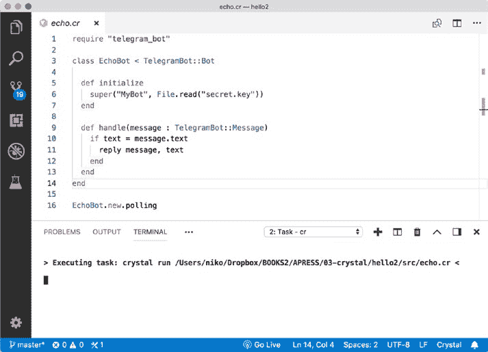

第 3 章 第 3 周：Crystal

***图 3-12.** 启动机器人*

回到与这个新机器人的聊天。你可以确认找到了一只漂亮的鹦鹉，无论你说什么，它都会重复（图 3-13）。

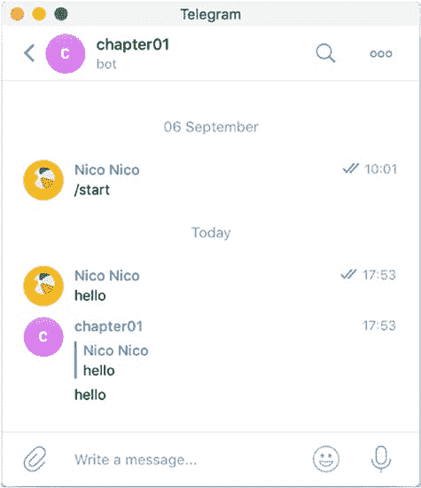

第 3 章 第 3 周：Crystal

***图 3-13.** echo, echo, hello, hello*

那是一个简单的机器人。让我们继续做一些更令人兴奋的事情，使用命令机器人。

**命令机器人**

Telegram 理解命令的概念。简单地说，命令就是发送给机器人的一条消息。然而，我们知道，它接受一系列参数，这有助于我们编写更易读的代码，而无需对消息进行复杂的解析。

当收到一条传入消息时，机器人会首先尝试为其找到一个已实现的命令。如果没有找到，它将使用标准的 `handle` 函数。

第 3 章 第 3 周：Crystal

我们的第一个机器人将实现一个 `hello` 命令，该命令不接受参数，只回复消息，就像 `handle` 函数会做的那样。

代码如下：

```crystal
require "telegram_bot"

class CommandOneBot < TelegramBot::Bot
  include TelegramBot::CmdHandler

  def initialize
    super("MyBot", File.read("secret.key"))
    cmd "hello" do |msg|
      send_message msg.chat.id, "world"
    end
  end
end

my_bot = CommandOneBot.new
my_bot.polling
```

与你目前看到的代码的唯一区别是 `cmd` 块。该块接受一个字符串作为标识符，在其最简单的形式中，消息作为块的参数。从聊天中发送命令只需要一个前缀和发送给机器人的命令名称（图 3-14）。


第 3 章 第 3 周：Crystal

***图 3-14.** hello 命令*

现在，进入我们的第二个机器人。第二个机器人将使用传递给命令的参数来发送图像作为回复。

这次，我们将使用 `send_photo` 而不是 `send_message`，根据参数将图像发送回聊天。

```crystal
require "telegram_bot"

class CommandOneBot < TelegramBot::Bot
  include TelegramBot::CmdHandler

  def initialize
    super("MyBot", File.read("secret.key"))
    cmd "animals" do |msg, params|
        send_photo msg.chat.id, File.new("#{params[0]}.jpg")
    end
  end
end

my_bot = CommandOneBot.new
my_bot.polling
```

现在，假设你的项目文件夹中有一些与动物名称匹配的图片，`/animals` 命令将获取图像文件并将其发送回聊天室（图 3-15）。

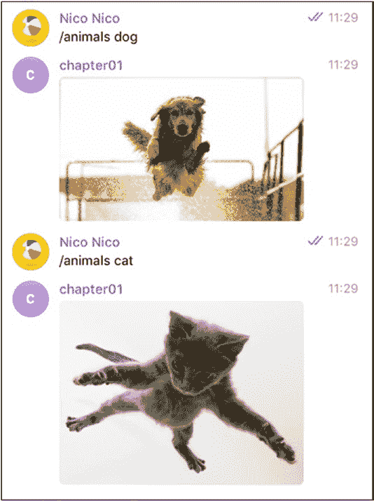

第 3 章 第 3 周：Crystal

***图 3-15.** /animals 很可爱！*

现在，你可以尝试一些不同的命令，使用其他机器人 API 功能。

Crystal 的 `telegram_bot` 实现了大部分 Telegram 机器人 API，以下是可用于向聊天发送消息和媒体类型的不同函数列表。

• `send_message`
• `send_photo`

第 3 章 第 3 周：Crystal

• `send_audio`
• `send_document`
• `send_sticker`
• `send_video`
• `send_voice`
• `send_video_note`
• `send_media_group`
• `send_location`
• `send_venue`
• `send_contact`
• `send_chat_action`
• `send_game`
• `send_invoice`

但是，你必须等到下周，才能看到内联消息的实际应用。

**第 4 章**

**第 4 周：Rust**

*没有一项旨在改变世界的伟大运动能够承受被嘲笑或贬低。嘲弄是一种锈蚀，会腐蚀它所触及的一切。*

—米兰·昆德拉

如果你还没有听说过 Rust 编程语言，我认为你应该了解一下。Rust 在 2016、2017 和 2018 年的 [Stack Overflow 开发者调查](https://en.wikipedia.org/wiki/Stack_Overflow)中获得了“最受喜爱的编程语言”第一名。

正如 Rust 网站 ([www.rust-lang.org](http://www.rust-lang.org)) 所指出的，该语言具有一长串优点，例如：

• 零成本抽象
• 移动语义
• 保证内存安全
• 无数据竞争的线程
• 基于 trait 的泛型
• 模式匹配
• 类型推断
• 最小运行时
• 高效的 C 绑定

© Nicolas Modrzyk 2019
N. Modrzyk, *构建 Telegram 机器人*, `doi.org/10.1007/978-1-4842-4197-4_4`

第 4 章 第 4 周：Rust

Rust 由 Mozilla 赞助，但不仅仅由一家公司支持，它还有一个非常支持和活跃的社区共同编写。Rust 非常关注健壮的线程环境和相关的内存安全问题。这些特别适合解决与为机器人开发并发端点相关的问题，本章将对此进行探讨。

**Rust 安装和第一步**

Rust 在你的本地机器上使用 `rustup` 进行维护和管理。是的，这是一个特定于 Rust 的环境管理器。它类似于 Ruby Version Manager (RVM)，但完全是 Rust 工具链的一部分，而不是第三方团队，所以感觉非常集成。

**安装**

以下两个链接是获取 `rustup` 并在你的机器上安装 Rust 的入口点：

www.rust-lang.org/en-US/install.html
www.rust-lang.org/en-US/other-installers.html

根据你使用的是 macOS/Linux（图 4-1）还是 Windows（图 4-2），你会看到不同的页面，但安装过程非常相似。

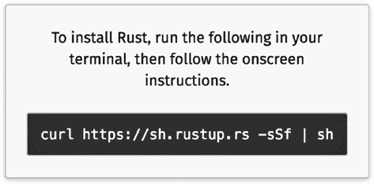

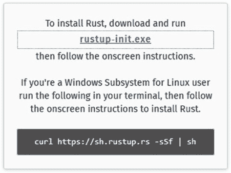

第 4 章 第 4 周：Rust

***图 4-1.** OSX/Linux 上的安装框*

***图 4-2.** Windows 上的安装框*

在 Windows 上，你还需要一些额外的工具，例如 Microsoft C++ 构建工具（图 4-3）。

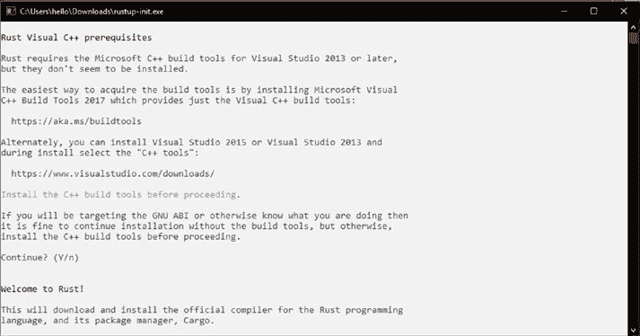


第 4 章 第 4 周：Rust

***图 4-3.** Windows 上需要 C++ 工具*

如控制台输出所示，Microsoft 构建工具可以在以下网站上找到：[`aka.ms/buildtools`](https://aka.ms/buildtools)。你可以通过下载链接下载并安装（图 4-4 和图 4-5）。

***图 4-4.** Visual Studio 的构建工具*


第 4 章 第 4 周：Rust

***图 4-5.** 安装构建工具*

Rust 有一个快速的六周更新周期，所以当你读到这篇文章时，版本会有所不同，但在撰写本文时，这是通过 `rustup show` 命令获得的 Rust 当前版本：

```
SuperPinkicious:rust-01 niko$ rustup show
Default host: x86_64-apple-darwin
stable-x86_64-apple-darwin (default)
rustc 1.28.0 (9634041f0 2018-07-30)
```

现在让我们看看如何编译你的第一个 Rust 程序。

第 4 章 第 4 周：Rust

**第一个或两个 Rust 程序**

第一个 Rust 程序将打印一条简单的 Hello World 消息。这并不复杂，但它将帮助你熟悉 Rust 的编译和执行工具链。

**你好 Rust**

这个，我们的第一个 Rust 程序：

• 使用 `fn` 声明一个 `main` 函数
• 使用 `println!` 函数（注意感叹号）打印到标准输出
• 语句以分号 (`;`) 结束

这给你提供了以下简单而简短的代码片段：

```rust
fn main() {
    println!("Hello World!");
}
```

你可以将代码片段保存在一个文件中，例如命名为 `first.rs`。

顺便提一下，如果你在 Visual Studio Code 中键入上述代码片段，编辑器会识别出 `rs` 文件扩展名，并会要求你安装一个相关的插件来处理 `rs` 文件（图 4-6）。

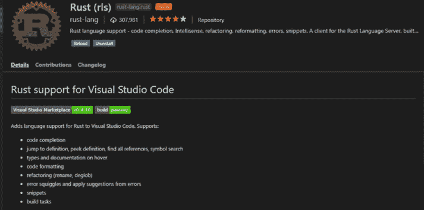

第 4 章 第 4 周：Rust

***图 4-6.** Visual Studio Code Rust 插件*

Rust 是一种编译型语言，因此在执行代码之前，你必须先处理编译步骤。这是通过 `rustc` 命令完成的，该命令在你安装 `rustup` 时已安装。命令如下：

```
rustc first.rs
```

在你运行该命令的同一个文件夹中，你会注意到现在有一个新的二进制文件，没有 `.rs` 文件扩展名。执行二进制文件只需输入命令名称。

```
$ ./first
Hello World!
```

这适用于 Windows 和 macOS/Linux，但是，当然，你不能将一个平台上的二进制文件直接拿到另一个平台上运行。你必须重新编译。虽然 `rustup` 可以帮助你为其他平台进行交叉编译，但这超出了本书的范围。

第 4 章 第 4 周：Rust

对于其他入门示例，请务必查看优秀的 Rust by Example 网站 ([`doc.rust-lang.org/rust-by-example/hello.html`](https://doc.rust-lang.org/rust-by-example/hello.html))，它包含了你开始学习该语言结构所需的一切。

接下来，让我们回顾一下如何使用 Rust 富有表现力地生成老牌的斐波那契数列。

**斐波那契**

Rust 有非常方便的模式匹配分支，可以用恰如其名的 `match` 来编写。我们将使用这个结构来编写斐波那契生成器。

在一个新文件 `fibo.rs` 中，我们声明 `fibonacci` 函数，包括输入和输出的参数类型——这里，输入和输出都是 64 位整数——以避免溢出。

另外，请注意在以下代码片段中，你如何使用 `_` 来匹配 `n` 的任何其他值。

```rust
fn fibonacci(n: u64) -> u64 {
    match n {
        0 => 0,
        1 => 1,
        _ => fibonacci(n - 1) + fibonacci(n - 2)
    }
}
```

让我们将这段代码与一个 main 函数放在一起，这样我们就可以通过命令行输入来调用该程序。

```rust
use std::env;

fn main() {
    if let Some(arg1) = env::args().nth(1) {
        let myint = arg1.parse().unwrap();
```

第 4 章 第 4 周：Rust

```rust
        println!("{}", fibonacci(myint));
    } else {
        println!("missing input")
    }
}
```

在上面的代码片段中，请注意如何通过使用 `Some` 来避免显式的空值检查，以及如何使用 `parse` 和 `unwrap` 将字符串参数转换为整数 `myint`。

`unwrap` 用于将 `Some(something_inside)` 转换为 `something_inside`。这里，我们有一个 `if/else` 块来确认我们是否有一个值作为参数。

如果你不确定在 `Some` 之后是否有值，你也可以使用 `unwrap_or` 来提供一个默认值。

编译会像之前的 Hello World 示例一样生成一个可执行文件。

```
rustc fibo.rs
```

运行显示斐波那契生成器程序按预期工作。

```
$ ./fibo 10
$ ./fibo 15
$ ./fibo 30
```

虽然 Rust 可以独立使用，但你通常会使用 Rust 构建工具 `cargo` 来创建项目结构和管理项目依赖项。

第 4 章 第 4 周：Rust

**驾驭 cargo**

`cargo` 是一个命令行工具，也由 `rustup` 安装和设置。`cargo` 负责创建新项目、管理项目结构、添加依赖项、生成二进制文件、运行代码、测试代码等。

以下是一些最重要的 `cargo` 子命令的列表：

一些常见的 cargo 命令是（使用 --list 查看所有命令）：

    build       编译当前项目
    clean       移除 target 目录
    doc         构建此项目及其依赖项的文档
    new         创建一个新的 cargo 项目
    init        在现有目录中创建一个新的 cargo 项目
    run         构建并执行 src/main.rs
    test        运行测试
    bench       运行基准测试
    update      更新 Cargo.lock 中列出的依赖项
    search      在注册表中搜索 crates
    publish     打包并将此项目上传到注册表
    install     安装一个 Rust 二进制文件
    uninstall   卸载一个 Rust 二进制文件

作为第一个 `cargo` 测试，让我们编写一个程序，使用名为 `chrono` 的第三方库来显示协调世界时 (UTC) 和本地时间。

**我们有时间**

显然，在向项目添加库之前，我们首先需要一个项目。这是通过 `cargo` 的 `new` 子命令完成的。

第 4 章 第 4 周：Rust

```
$ cargo new we-have-time
Created binary (application) `we-have-time` project
```

`cargo` 生成的项目类型默认是二进制应用程序，但你也可以准备一个没有可运行入口点的库。

一旦生成了项目，你可以看到一个非常基本的项目结构和一些文件和文件夹。

```
$ tree -L 2
.
├── Cargo.toml
└── src
    └── main.rs
```

上面，`Cargo.toml` 是项目元数据，`main.rs` 是我们到目前为止看到的同一种 Rust 源文件。`Cargo.toml` 是添加依赖项的地方。

```
$ cat Cargo.toml
[package]
name = "we-have-time"
version = "0.1.0"
authors = ["Nicolas Modrzyk <myemail@gmail.com>"]

[dependencies]
```

现在，因为我们想处理日期和时区，让我们再次使用 `cargo` 来搜索一个 `time` 库。

```
$ cargo search time
     Updating registry `https://github.com/rust-lang/crates.io-index`
time = "0.1.40"              # Utilities for working with time-related functions in Rust.
```

第 4 章 第 4 周：Rust

```
exonum-time = "0.9.2"        #  The time oracle service for Exonum.
chrono = "0.4.6"            # Date and time library for Rust
faster_path = "0.0.2"       # Alternative to Pathname
specs_time = "0.5.1"        # time resource for specs
... and 1738 crates more (use --limit N to see more)
```

`chrono` 使得在不同时区显示日期变得容易，所以我们就使用这个库。要使 `chrono` 对你的项目可用，你将其名称和版本添加到 `Cargo.toml` 文件的 dependencies 部分。

这给出了：

```toml
[dependencies]
chrono = "0.4.6"
```

在添加库之后，或者为了验证项目中编写的代码，你通常可以使用 `cargo check`。这在添加依赖项后也很有用，以确保它已正确下载并安装到你的本地机器上。

```
$ cargo check
   Compiling num-traits v0.2.5
   Compiling num-integer v0.1.39
    Checking libc v0.2.43
    Checking time v0.1.40
    Checking chrono v0.4.6
     Checking we-have-time v0.1.0 (file:///Users/niko/Dropbox/BOOKS2/APRESS/04-rust/we-have-time)
    Finished dev [unoptimized + debuginfo] target(s) in 7.69s
```

现在让我们继续编码，并更新位于 `main.rs` 中的 Rust 代码，以使用 `chrono` 库。

第 4 章 第 4 周：Rust

1. 首先，我们必须告诉程序我们正在使用一个外部库，Rust 称之为 `crate`。这是使用 `extern crate chrono` 表示法完成的。这在程序的生命周期中只执行一次。
2. 接下来，我们必须将 Rust 符号导入到当前文件/命名空间中，这是通过 `use` 完成的。
3. `let` 定义不可变变量，每个变量都有自己的类型。
4. 并且，和之前一样，`println!` 将其打印到标准输出。

这给出了以下代码片段（同样在 `main.rs` 文件中）：

```rust
extern crate chrono;

use chrono::prelude::*;

fn main() {
    let utc: DateTime<Utc> = Utc::now();
    println!("{}", utc);
    let local: DateTime<Local> = Local::now();
    println!("{}", local);
}
```

因为我们使用 `cargo` 来管理我们的项目，现在有一些快捷方式可以利用来运行代码，例如直接使用 `cargo run` 运行代码。

```
$ cargo run
   Compiling num-traits v0.2.5
   Compiling num-integer v0.1.39
   Compiling libc v0.2.43
   Compiling time v0.1.40
   Compiling chrono v0.4.6
```

第 4 章 第 4 周：Rust

```
   Compiling we-have-time v0.1.0 (file://we-have-time)
    Finished dev [unoptimized + debuginfo] target(s) in 9.11s
     Running `target/debug/we-have-time`
2018-09-12 05:41:56.872180 UTC
2018-09-12 14:41:56.872309 +09:00
```

看到编译步骤结束时显示的两个日期了吗？这些是程序的标准输出。

`run` 是快速编写和运行 Rust 程序的事实上的子命令。要创建最终版本，`cargo` 有内置的子任务 `build`。`build` 负责创建一个独立的二进制文件。

```
$ cargo build
Finished dev [unoptimized + debuginfo] target(s) in 0.16s
```

还要注意，`cargo` 支持增量编译，只会重新编译自上次执行以来更改过的代码。

运行二进制文件会得到相同的输出——一切运行得如此顺利。这实际上令人耳目一新。

```
$ ./target/debug/we-have-time
2018-09-12 06:01:54.100082 UTC
2018-09-12 15:01:54.100176 +09:00
```

稍后你还会看到如何使用相同的 `cargo build` 命令生成程序的发布版本，但带有额外的标志。

现在，让我们先绕个弯，看看如何在同一个 cargo 项目中声明多个目标，即不同的执行入口点。

**多个 Cargo 目标**

你可能已经注意到，每个运行的命令都将 `main.rs` 文件作为默认输入。有一段时间，我一直在寻找一种运行不同文件的方法，实际上你不能直接将文件传递给 `cargo`。在 70

第 4 章 第 4 周：Rust

`Cargo.toml` 文件中，你必须定义所谓的二进制目标。这是通过在 `.toml` 文件中使用 `[[bin]]` 定义一个块来完成的。

至少，该块需要一个名称和一个路径，所以让我们定义两个二进制目标，一个使用现有的 `main.rs` 文件，另一个使用一个新的 Rust 源代码文件：`main2.rs`。

```toml
[[bin]]
name = "main1"
path = "src/main.rs"

[[bin]]
name = "main2"
path = "src/main2.rs"
```

为了多个目标的目的，我们将在此处保持 `main2.rs` 源代码极其精简，仅输出 UTC 时区的当前日期，但当然，它可以像你能编码的那样复杂。

```rust
extern crate chrono;

use chrono::prelude::*;

fn main() {
    let utc: DateTime<Utc> = Utc::now();
    println!("{}", utc);
}
```

现在，在运行 cargo 命令时，你可以通过向 `cargo` 指定 `--bin` 标志来指定要运行哪个二进制目标，如下面的代码中所示两次，一次使用目标二进制 `main1`：

```
$ cargo run --bin main1
    Finished dev [unoptimized + debuginfo] target(s) in 0.16s
     Running `target/debug/main1`
```

第 4 章 第 4 周：Rust

```
2018-09-12 06:26:11.634208 UTC
2018-09-12 15:26:11.634336 +09:00
```

第二次使用目标二进制 `main2`：

```
$ cargo run --bin main2
    Finished dev [unoptimized + debuginfo] target(s) in 0.05s
     Running `target/debug/main2`
2018-09-12 06:26:13.387135 UTC
```

作为奖励，这里是你可以用于 Virtual Studio Code 的 `tasks.json`，以便从 Visual Studio Code 运行两个二进制目标中的任何一个。

```json
{
    "version": "2.0.0",
    "tasks":
        [
            {
                "label": "main1",
                "command": "cargo",
                "args": [
                    "run",
                    "--bin",
                    "main1"
                ],
                "options": {
                    "cwd": "${workspaceRoot}"
                },
                "group": {
                    "kind": "build",
                    "isDefault": true
                }
            },
```

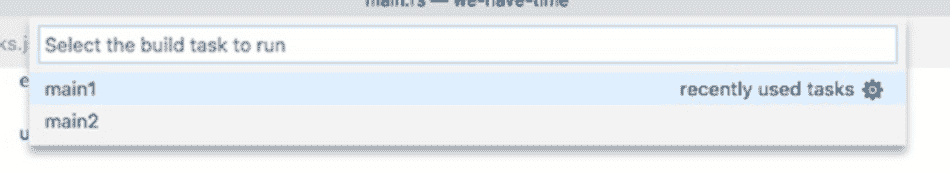

第 4 章 第 4 周：Rust

```json
            {
                "label": "main2",
                "command": "cargo",
                "args": [
                    "run",
                    "--bin",
                    "main2"
                ],
                "options": {
                    "cwd": "${workspaceRoot}"
                },
                "group": {
                    "kind": "build",
                    "isDefault": true
                }
            }
        ]
    }
```

此外，通过使用 Command(Ctrl)+Shift+B，你现在可以选择要运行哪个 `cargo` 二进制目标（图 4-7）。

***图 4-7.** 来自 Visual Studio Code 的二进制目标*

现在你已经拥有了开始享受用 Rust 编写机器人所需的一切。那么，让我们开始吧。

第 4 章 第 4 周：Rust

**Rust 机器人 1 号：回复我**

为了创建机器人，我们将再次使用一个 Telegram 包装器。要找到一个，记住你是如何使用 `cargo` 搜索依赖项的：`cargo search` 命令。

```
$ cargo search telegram
     Updating registry `https://github.com/rust-lang/crates.io-index`
telegram = "0.2.0"                # Unofficial Telegram API Library
telegram-bot = "0.6.1"            # A library for creating Telegram bots
telegram-bot-raw = "0.6.1"       # Telegram Bot API types
teleborg = "0.1.32"              # A Telegram bot API.
... and 35 crates more (use --limit N to see more)
```

我们将选择 `telegram-bot` 版本 `"0.6.1"`。因此，使用 `cargo` 创建一个新项目后，我们将相应地更新 `Cargo.toml`。

```toml
[dependencies]
telegram-bot = "0.6"
tokio-core = "0.1.17"
futures = "0.1.23"
```

啊，是的，你还需要生成线程（futures）并拥有一个很酷的消息传递系统（tokio-core），所以我们也把这两个添加到 dependencies 部分。

在同一个 `Cargo.toml` 文件中，我们还将定义第一个二进制目标。

```toml
[[bin]]
name = "bot1"
path = "src/bot1.rs"
```

第 4 章 第 4 周：Rust

当你进一步深入本章时，我会让你定义更多的二进制目标（并更新 `tasks.json`）。

机器人的核心目的，像往常一样，是通过轮询从 Telegram 服务器获取更新，并处理与更新关联的消息。在这里，我们检索纯文本消息的文本，以及编写消息的人的名字的引用。你之前在斐波那契数列中见过的 `match`，再次用于匹配消息类型——这里是 `MessageKind::Text`。

最后，一旦我们拥有了所有元素，我们必须发送一个回复（first_name, test data），然后在一个新生成的线程中调用 `text_reply`——这里，采用即发即弃模式。

```rust
if let UpdateKind::Message(message) = update.kind {
            match message.kind {
                MessageKind::Text {ref data, ..} => {
                        api.spawn(message.text_reply(
                             format!("Hi, {}! You just wrote '{}'",
&message.from.first_name, data)
                        ));
                },
                _ => {println!("which message?")}
            }
}
```

如果消息的类型不是文本消息，我们就完全忽略它，使用 `match` 块的默认部分 `_`。代码的其余部分涉及一些技巧，以使机器人处于带有消息传递的线程环境中，如 `telegram_bot` GitHub 页面上更详细描述的那样。

第 4 章 第 4 周：Rust

这对于编写机器人来说并不那么重要，所以我们假设我们必须编写它。最后，`bot1.rs` 的完整列表如下所示：

```rust
extern crate futures;
extern crate telegram_bot;
extern crate tokio_core;

use std::env;
use futures::Stream;
use tokio_core::reactor::Core;
use telegram_bot::*;

fn main() {
    let mut core = Core::new().unwrap();
    let token = env::var("TELEGRAM_BOT_TOKEN").unwrap();
    let api = Api::configure(token).build(core.handle()).unwrap();
    let future = api.stream().for_each(|update| {
        if let UpdateKind::Message(message) = update.kind {
             if let MessageKind::Text {ref data, ..} = message.kind {
                 println!("<{}>: {}", &message.from.first_name, data);
                api.spawn(message.text_reply(
                    format!("Hi, {}! You just wrote '{}'",
                          &message.from.first_name, data)
                ));
            }
        }
```


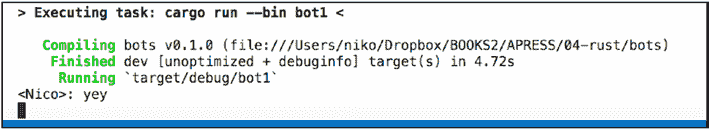

第 4 章 第 4 周：Rust

```rust
        Ok(())
    });
    core.run(future).unwrap();
}
```

现在，你可以从命令行或 Visual Studio Code 启动这个机器人（图 4-8）。

***图 4-8.** 从 Visual Studio Code 启动 Rust 机器人*

并确认来自 Telegram 聊天的通常输出，如图 4-9 所示。

***图 4-9.** 你的第一个 Rust 机器人*

**Rust 机器人 2 号：东京在哪里？**

有一个能告诉你某物在哪里或该去哪里的机器人总是很好的。下一个机器人将向你发送一个实时位置，并直接在聊天中设置超时。

第 4 章 第 4 周：Rust

虽然 `main` 函数在准备机器人和设置通道方面与上一个示例几乎相同，但以下练习的重点实际上是发送实时位置。

这是通过 Rust 对象 `message` 上的 `location_reply` 函数完成的。我们也可以在这里直接指定位置实时流将运行多长时间。

在下面的代码中，我们流式传输东京的位置（北纬 35.652832°，东经 139.839478°），持续 60 秒。

同样，这个 Rust Telegram API 的大部分内容都基于准备 futures，这是一个来自 `futures` 库的对象，准备在单独的线程中执行，并使用 `tokio` 句柄生成。

核心机器人句柄和消息答案就是这样完成的。以下是位置机器人的代码片段。

```rust
extern crate futures;
extern crate telegram_bot;
extern crate tokio_core;

use std::env;
use futures::{Future, Stream};
use tokio_core::reactor::{Handle, Core};
use telegram_bot::*;

fn where_is_tokyo(api: Api, message: Message, handle: Handle) {
    let api_future = || Ok(api.clone());
     let future = api.send(message.location_reply(35.652832, 139.839478).live_period(60)).join(api_future());
    handle.spawn(future.then(|_| Ok(())))
}

fn main() {
    let token = env::var("TELEGRAM_BOT_TOKEN").unwrap();
    let mut core = Core::new().unwrap();
```

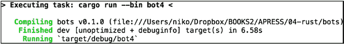

第 4 章 第 4 周：Rust

```rust
    let handle = core.handle();
     let api = Api::configure(token).build(core.handle()).unwrap();
    let future = api.stream().for_each(|update| {
         if let UpdateKind::Message(message) = update.kind {
where_is_tokyo(api.clone(), message.clone(), handle.clone())
        }
        Ok(())
    });
    core.run(future).unwrap();
}
```

再次从 Visual Studio Code 启动机器人（任务设置留给读者），我们可以看到编译步骤成功并直接运行编译后的目标（图 4-10）。

***图 4-10.** 启动位置机器人*

我没有指定任何过滤或特定的消息处理，所以向机器人发送任何消息都可以。这里，一条简短的“hello”消息通知机器人我们想知道它在哪里（图 4-11）。

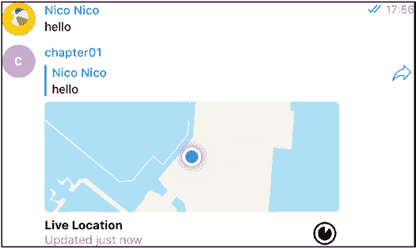

第 4 章 第 4 周：Rust

***图 4-11.** 来自东京的直播*

另外，请注意图中看起来像时钟的计时器是如何根据我们告诉实时位置运行的时间量缓慢减少的。使用这个机器人的第一个版本的一个有趣练习是沿途编辑位置。

现在，假设我们想先发送东京市中心的一个位置，然后慢慢向东移动穿过日本。我们将使用一系列相同的模式来异步运行一个调用，在新生成的线程上加入一个超时，确保调用完成，再次加入，然后继续下一个位置更新。

这处理如下：

```rust
let future = api.send(message.location_reply(35.652832, 139.839478).live_period(60))
        .join(api_future()).join(timeout(10))
         .and_then(|((message, api), _)| api.send(message.edit_live_location(35.652832, 138.839478)))
        .join(api_future()).join(timeout(10))
         .and_then(|((message, api), _)| api.send(message.edit_live_location(35.652832, 137.839478)))
        .join(api_future()).join(timeout(10))
         .and_then(|((message, api), _)| api.send(message.edit_live_location(35.652832, 136.839478)));
```


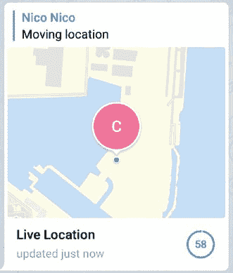

第 4 章 第 4 周：Rust

在 Telegram 桌面客户端上，Telegram 地图似乎没有很好地实时更新，但在原生的 Android 和 iOS 应用程序上，位置是实时更新的。基于 Android 的手机上的更新如图 4-12 和 4-13 所示。

***图 4-12.** 东京*

***图 4-13.** 东京以东*

第 4 章 第 4 周：Rust

**Rust 机器人 3 号：连锁反应**

同样，你也可以根据需要为你的聊天流程链接消息。这个新的 `multiple_messages` 函数提供了多种发送消息并将其一个接一个链接到聊天的方法。

在这里，我们将采用类似的结构，但在发送消息之前对文本的解析方式（或不解析）进行一些更改。`text_reply` 可以替换为 `message.from.text`，以避免在许多示例中看到的这种类似回复的消息。

```rust
fn multiple_messages(api: Api, message: Message, handle: &Handle) {
    let simple =
        api.send(message.text_reply("Simple message"));
    let markdown =
         api.send(message.text_reply("- Markdown message \n- line 2\n- line 3").parse_mode(ParseMode::Markdown));
    let html =
         api.send(message.text_reply("<b>Bold HTML message </b>").parse_mode(ParseMode::Html));
    let private =
        api.send(message.from.text("Private text"));
    let private_html =
         api.send(message.from.text(format!("<b>Private text </b>")).parse_mode(ParseMode::Html));
    let preview =
         api.send(message.text_reply("Message with preview https://telegram.org"));
    handle.spawn({
        let future = simple
            .and_then(|_| markdown)
```

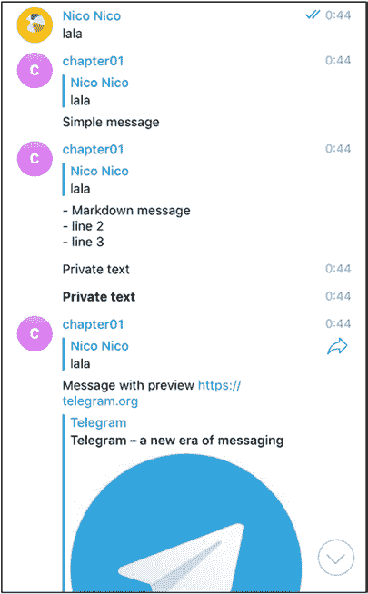

第 4 章 第 4 周：Rust

```rust
            .and_then(|_| private)
            .and_then(|_| private_html)
            .and_then(|_| preview)
            .and_then(|_| html);
        future.map_err(|_| ()).map(|_| ())
    })
}
```

现在，最后，当与这个新的 Telegram 机器人聊天时，你可以观察到所有消息一个接一个地弹出，如图 4-14 所示。

***图 4-14.** 来自 Rust 的所有不同类型的发送请求*

第 4 章 第 4 周：Rust

一旦你完全完成了 Rust 机器人的开发，不要忘记为其生成一个二进制文件。

**为发布编译**

使用 `cargo` 为发布编译比看起来要容易。只需将 `--release` 标志传递给 `cargo build` 命令即可。这也会导致以发布模式重新构建所有依赖项。

```
$ cargo build --bin bot2 --release
```

在下面，你可以看到这个发布模式的构建命令后面跟着一堆编译行：

```
Compiling nodrop v0.1.12
   Compiling cfg-if v0.1.4
   Compiling libc v0.2.42
   Compiling byteorder v1.2.3
   Compiling scopeguard v0.3.3
   Compiling memoffset v0.2.1
   Compiling lazy_static v1.0.2
   Compiling lazycell v0.6.0
   Compiling slab v0.4.0
   Compiling futures v0.1.23
   ...
```

优化后的编译代码可以像其调试版本一样运行。

```
$ ./target/release/bot2
```

你还应该欣赏程序的调试版本和发布版本之间的大小差异。发布版本的大小至少是调试版本的三分之一。

**第 5 章**

**第 5 周：D 语言**

*“至于困难，”弗格森用严肃的语气回答道，“它们就是用来被克服的。”*

—儒勒·凡尔纳
《气球上的五星期》

老实说，我还没有将 D 语言用于重量级项目，但在经历了一些小的编码挑战之后，D 语言的纯粹执行速度给我留下了深刻的印象。

D 是一种静态类型语言，非常类似于 C++ 和 Java，并带有一些额外的便利。对于有这两种语言经验的人来说，学习曲线不会那么陡峭。

在 D 语言网站 ([`tour.dlang.org/`](https://tour.dlang.org/)) 上列出的功能中，强调了以下特点：

• *高级* 构造，提供强大的建模能力
• *高性能*，编译型语言
• 静态类型
• 直接接口到操作系统 API 和硬件
• 极快的编译速度
• 内存安全子集 (SafeD)

© Nicolas Modrzyk 2019
N. Modrzyk, *构建 Telegram 机器人*, `doi.org/10.1007/978-1-4842-4197-4_5`

第 5 章 第 5 周：D 语言

• *可维护*、*易于理解* 的代码
• 渐进式学习曲线（类似 C 的语法，类似于 Java 等）
• 与 C 应用程序二进制接口兼容
• 与 C++ 应用程序二进制接口有限兼容
• 多范式（命令式、结构化、面向对象、泛型、函数式编程纯度，甚至汇编）
• 内置错误检测（契约、单元测试）

D 语言还附带一个高度多线程的 Web 框架，名为 vibe.d，我不会在这里详细介绍，但你应该看看用它构建的服务器的简洁性。

在我进入机器人编程之前，我们将回顾一些基本的 D 语言结构和代码示例，当然，包括一些斐波那契数列。

此外，一旦你掌握了一些 D 语言编码和项目依赖管理，我们将进入本书每一章的核心内容：Telegram 机器人编码。

**安装和 D 语言第一步**

D 语言带有各种包和安装程序，可以从其网站 [`dlang.org.html`](https://dlang.org.html) 获得（图 5-1）。

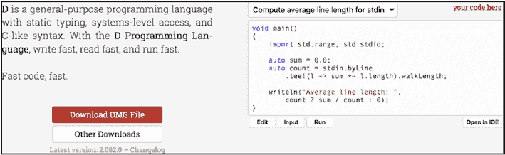

第 5 章 第 5 周：D 语言

***图 5-1.** D 语言下载页面，带有示例*

完成下载和安装后，你应该有两个主要的二进制文件可用，即：

• `dmd`: 参考 D 编译器
• `dub`: 与 `dmd` 配套的构建工具

我们的第一个 D 程序将展示一些礼貌，通过说 hello，就像每个第一个程序应该做的那样。

导入语句使用 `import` 非常直观地完成，程序的主入口点通过 `main()` 函数定义。请注意，不需要为此 main 函数定义字符串参数数组。`main` 函数的返回值也是可选的。

打印到标准输出使用 `writeln` 完成，它位于 `std.stdio` 包中，我们将事先导入它。

你可以将以下示例代码保存在一个 `hello.d` 文件中，其中 `.d` 是 D 源代码的默认扩展名。

```d
import std.stdio;

void main() {
    writeln("hello D!");
}
```

第 5 章 第 5 周：D 语言

D 源代码使用 `dmd` 命令编译。在其两种最简单的形式中，该命令可以以下任一方式运行：

```
dmd <source_file>
dmd -run <source_file>
```

第一种形式将生成一个与入口源文件同名的二进制文件。然后你可以直接在主机上执行该二进制文件。

第二种形式不生成中间文件，并一次性完成编译，然后执行循环。

你通常会使用第一种形式来准备你的代码以供发布。第二种形式是从命令行或 Visual Studio Code 编译和运行代码时首选的形式。

现在，让我们让代码同时编译和运行，使用第二种形式，带有 `-run` 标志。

```
$ dmd -run hello.d
hello D!
```

hello 消息显示在标准输出上，我们的程序现在很有礼貌。

趁我们还在，让我们也设置一下 Visual Studio Code，通过安装 D 语言插件，如图 5-2 所示。

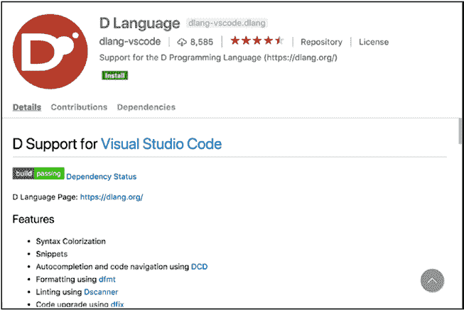

第 5 章 第 5 周：D 语言

***图 5-2.** D 语言插件*

与插件一起，你还需要一个 `tasks.json` 文件，以便从编辑器内部运行 `build` 命令。与前面的代码一样，我们将使用 `-run` 标志调用 `dmd` 编译器，以便直接执行代码。

```json
{
    "version": "2.0.0",
    "tasks":
        [
          {
            "label": "dmd",
            "command": "dmd",
            "args": [
              "-run",
              "${file}"
            ],
```

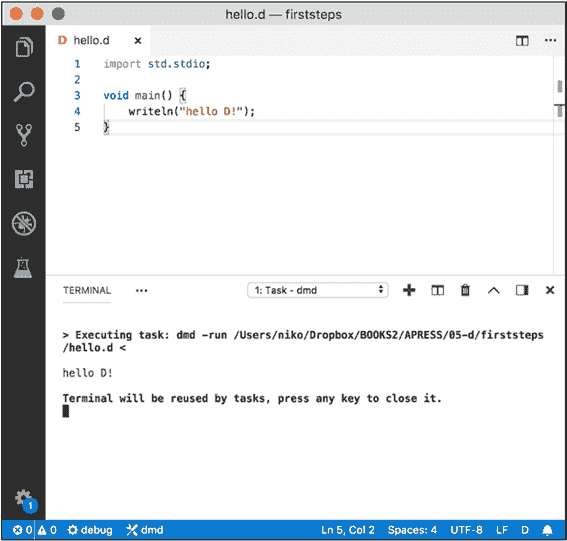

第 5 章 第 5 周：D 语言

```json
            "options": {
              "cwd": "${workspaceRoot}"
            },
            "group": {
              "kind": "build",
              "isDefault": true
            }
          }
        ]
      }
```

一切就绪，可以开始愉快的编码了。再按一次 Command(Ctrl)+Shift+B 来测试我们从编辑器构建的设置（图 5-3），我们就可以开始了。

***图 5-3.** 直接从 Visual Studio Code 运行 D 源文件*

第 5 章 第 5 周：D 语言

**D 语言并发的一些要点**

从 Java 线程的烦恼中走出来，你会对 D 语言的并发特性感到兴奋。D 语言中的线程可以像常规 D 函数一样被创建和*生成*。

**简单线程**

负责并发的命名空间恰如其分地命名为 `std.concurrency`，我们将在这个第一个线程测试中使用它。

要从一个函数生成一个线程，我们将简单地使用 `spawn`，它接受一个函数的引用作为参数。这是通过在任何标准 D 函数前面使用 & 符号 (`&`) 来完成的。代码片段的其余部分很容易理解，所以这里是带线程的程序：

```d
import std.concurrency : spawn, thisTid;
import std.stdio : writeln;

void worker()
{
    writeln("Thread ", thisTid);
}

void main()
{
    int TOTAL_WORKERS=5;
    for (int i = 0; i < TOTAL_WORKERS; ++i) {
        spawn(&worker);
    }
}
```

第 5 章 第 5 周：D 语言

从 Visual Studio Code 执行会得到类似于以下的输出，其中每个线程简单地打印自己的 `id`。

```
> Executing task: dmd -run APRESS/05-d/firststeps/threads1.d <
Thread Tid(109655000)
Thread Tid(109655200)
Thread Tid(109655300)
Thread Tid(109655400)
Thread Tid(109655500)
```

从这个简短的例子中，有几点值得注意。

• 每个线程都有一个独立的、唯一分配的 `id`，标记为 `thisTid`。
• 传递给 `spawn` 的函数实际上是对该函数的引用，使用 `&worker`。

接下来，让我们看看如何保持每个线程的内部状态。

**带状态的线程**

在第二个例子中，我们在将为线程生成的函数内部定义了一个静态字段。定义的 `threadState` 整数作为 `ThreadLocal` 存储在本地线程中。还要注意，整数 `threadState` 只创建一次。每次线程通过 `worker()` 调用自身时，线程状态不会被重新初始化。

以下是带有线程本地状态的代码片段：

```d
import std.concurrency : spawn, thisTid;
import std.stdio : writeln;

void worker()
{
    static int threadState = 0;
```

第 5 章 第 5 周：D 语言

```d
    writeln("Thread ", thisTid,": My state = ", threadState++);
    if (threadState < 5) worker();
}

void main()
{
    for (int i = 0; i < 5; ++i) {
        spawn(&worker);
    }
}
```

以下是稍微缩短的输出：

```
> Executing task: dmd -run APRESS/05-d/firststeps/threads1.d <
Thread Tid(109a2d000): My state = 0
Thread Tid(109a2d000): My state = 1
...
Thread Tid(109a2d300): My state = 3
Thread Tid(109a2d500): My state = 2
Thread Tid(109a2d400): My state = 3
Thread Tid(109a2d300): My state = 4
Thread Tid(109a2d500): My state = 3
Thread Tid(109a2d400): My state = 4
Thread Tid(109a2d500): My state = 4
```

你可以看到每个线程都有一个独立的状态，并且每次线程通过再次调用 workers 进行循环时，该状态都会递增。

现在，让我们看看如何在这些线程之间共享状态，并执行一些安全的多线程数据共享。

第 5 章 第 5 周：D 语言

**共享状态**

我们 D 语言线程子节的最后一个示例是关于共享状态的，其中有一个公共计数器，由每个线程分别递增。要创建这样一个共享数据，D 语言要求你特别将数据标记为 `shared`。

一旦完成，你可以使用 `core.atomic` 命名空间中的操作来安全地更新该共享数据的值。我们将使用的原子操作是 `atomicOp` 和 `+=` 的组合，编写如下：

```d
atomicOp!"+="
```

这将创建一个线程安全的 `+=` 函数版本。

让我们看看这在以下代码片段中是如何实际使用的。

```d
import std.concurrency : spawn, thisTid;
import std.stdio : writeln;
import core.atomic : atomicOp;

shared int flag = 0;

void worker()
{
    atomicOp!"+="(flag, 1);
    writeln("Thread ", thisTid,":global>",flag);
}

void main()
{
    for (int i = 0; i < 20; ++i) {
        spawn(&worker);
    }
}
```

第 5 章 第 5 周：D 语言

`atomicOp!"+="` 接收两个参数，要更新的共享数据变量和刚刚创建的原子函数 `+=` 的参数。

当你运行上述程序时，输出应该类似于以下内容。注意线程代码的安全性。

```
> Executing task: dmd -run APRESS/05-d/firststeps/threads3.d <
Thread Tid(10e05c000):global>1
Thread Tid(10e05c200):global>2
Thread Tid(10e05c300):global>3
Thread Tid(10e05c400):global>4
Thread Tid(10e05c500):global>5
```

显然，D 语言具有本章简单示例中未展示的全功能线程能力，但它们应该足够简单，以便你可以使用它们执行多线程任务。

现在让我们绕开线程代码，回到一些更简单的单线程示例。

**更多 D 语言示例**

首先，让我们回到学校学习基础知识，以排序为例。

**温柔地排序，真实地排序**

在 D 语言中对数组进行排序只需使用 `std.algorithm` 命名空间中的 `sort` 函数。另外，在下面的代码片段中，请注意第一次使用 `writefln`，它代表“write format”，允许你将各种数据结构和类型转换为字符串进行打印。

```d
import std.stdio;
import std.algorithm;
```

第 5 章 第 5 周：D 语言

```d
void main()
{
    int[] arr1 = [4, 9, 7];
    writefln("%s\n", sort(arr1));
}
```

执行上面的排序代码，令人惊讶地（！）会得到一个排序后的数组。

```
> Executing task: dmd -run APRESS/05-d/firststeps/simplesort0.d <
[4, 7, 9]
```

反向排序可以通过将排序函数直接作为参数传递给 `sort` 来完成。

```d
import std.stdio;
import std.algorithm;

void main()
{
    int[] arr1 = [4, 9, 7];
    writefln("%s\n", arr1.sort!("a > b"));
}
```

执行后，反转后的数组会显示在输出中。

```
> Executing task: dmd -run APRESS/05-d/firststeps/simplesort0.d <
[9, 7, 4]
```

我还偶然发现了这个很棒的示例，在向人群展示 D 语言时一定要分享。下面的代码使用了来自 `std.range` 命名空间的名为 `chain` 的函数来对三个不同数组进行排序，每次都重用为排序分配的内存。

第 5 章 第 5 周：D 语言

```d
import std.stdio;
import std.algorithm;
import std.range;

void main()
{
    int[] arr1 = [4, 9, 7];
    int[] arr2 = [5, 2, 1, 10];
    int[] arr3 = [6, 8, 3];
    sort(chain(arr1, arr2, arr3));
    writefln("%s\n%s\n%s\n", arr1, arr2, arr3);
}
```

执行后，虽然输出符合预期，但在排序大型数组时，内存消耗应该会显著减少。

```
> Executing task: dmd -run APRESS/05-d/firststeps/simplesort1.d <
[1, 2, 3]
[4, 5, 6, 7]
[8, 9, 10]
```

当排序 `arr1`、`arr2` 和 `arr3` 时，程序可以原地排序，这占用更少的内存，但速度较慢，或者使用临时内存空间。使用 `chain`，你可以告诉编译器重用该临时内存来排序后续数组，从而同时提供内存使用和 CPU 速度的优势。

最后，在进入机器人编程之前，让我们看看在 D 语言中实现斐波那契数列的示例。

第 5 章 第 5 周：D 语言

**我对斐波那契的爱**

在永无止境地寻找最有效的斐波那契代码片段的过程中，我们可能在 D 语言中找到了一个令人瞩目的东西。第一个片段是通常的迭代实现，其中算法循环遍历不同的值并迭代计算斐波那契序列的元素。

```d
auto fib(const int n)
{
    import std.bigint;
    if (n == 0)
        return BigInt(0);
    if (n == 1)
        return BigInt(1);
    BigInt next;
    for (BigInt i = 0, j = 1, count = 1; count < n; ++count)
    {
        next = i + j;
        i = j;
        j = next;
    }
    return next;
}

void main()
{
    import std.stdio;
    writeln(fib(100_000));
}
```

第 5 章 第 5 周：D 语言

当你执行上述代码时，你会发现它非常快。但下一个实现（在论坛中找到，由 Biotronic 实现）简直是快得惊人。

```d
auto fib(ulong n) {
    import std.bigint : BigInt;
    import std.meta : AliasSeq;
    import std.typecons : tuple;
    BigInt a = 0;
    BigInt b = 1;
    auto bit = 63;
    while (bit > 0) {
        AliasSeq!(a, b) = tuple(
            a * (2*b - a),
            a*a + b*b);
        if (n & (BigInt(1) << bit)) {
            AliasSeq!(a, b) = tuple(b, a+b);
        }
        --bit;
    }
    return a;
}
```

这个生成斐波那契数的版本使用了以下内容：

• 一种不同的生成斐波那契数的基本算法，称为快速平方算法。
• 来自 `std.meta` 命名空间的 `AliasSeq`，与模板一起工作，允许在编译器的帮助下进行编译时改进。

第 5 章 第 5 周：D 语言

在不深入讨论算法所有细节的情况下，这个版本即使在标准 MacBook 上也运行得非常快。你会欣赏到 `fib(1_000_000)` 的以下时间：

2 秒, 415 毫秒, 140 微秒, 和 4 百纳秒

而在同一台机器上，1 千万的时钟时间不到 50 秒！

但是，速度性能的展示已经足够了。让我们准备好一个项目模板，以便用 D 语言进行一些 Telegram 机器人的乐趣。

**D 语言中的 Telegram 机器人**

要用 D 语言编写 Telegram 机器人，我们将需要通常的能够处理依赖项的构建工具。在 D 语言中，这个工具叫做 `dub`，我相信你和我一样喜欢这个工具的名字。

`dub` 应该已经（或者应该已经）在本章前面与 D 语言一起安装了。

`dub` 负责：

• 处理你的项目元数据需求
• 管理依赖项
• 编译和运行代码

**认识 dub**

`dub init <projectname>` 几乎会像一个机器人一样，问你一些问题，以便为你的新项目生成文件。

请注意，在这里我们将在项目创建期间直接声明我们需要 `telega` 作为依赖项。`telega` 是 D 语言中 Telegram 机器人 API 的一个包装器。

第 5 章 第 5 周：D 语言

```
$ dub init hellobot
Package recipe format (sdl/json) [json]: json
Name [hellobot]:
Description [A minimal D application.]:
Author name [niko]:
License [proprietary]:
Copyright string [Copyright © 2018, niko]:
Add dependency (leave empty to skip) []: telega
Added dependency telega ~>0.0.3
Add dependency (leave empty to skip) []:
Successfully created an empty project in 'hellobot'.
Package successfully created in hellobot
```

`dub` 然后会创建你的基本项目结构，在这个阶段只包含 `dub.json` 中的项目元数据和 `app.d` 中的主源文件，如下所示：

```
$ tree
.
├── dub.json
└── source
    └── app.d
1 directory, 2 files
```

检查 `dub.json` 文件，你可以看到它包含了所需的项目元数据和指定的 `telega` 依赖项，以及找到的最新版本。

```json
{
    "name": "hellobot",
    "authors": [
        "niko"
    ],
```

第 5 章 第 5 周：D 语言

```json
    "dependencies": {
        "telega": "~>0.0.3"
    },
    "description": "A minimal D application.",
    "copyright": "Copyright © 2018, niko",
    "license": "proprietary"
}
```

**注意** 这几乎可以工作——除了那些它不工作的情况——在撰写本文时，*它确实不工作*。你可能需要引用 `telega`（或任何其他依赖项）的特定构建。

安装自定义版本的依赖项分两步完成。

1. 检出你想要的包，在这种情况下是 `telega`：
   ```
   git clone https://github.com/nexor/telega.git
   ```
2. 使用以下代码片段告诉 `dub` 你有一个该包的新版本：
   ```
   [niko@niko-pc hellobot]$ dub add-local ../../RESEARCH/telega
   Registered package: telega (version: 0.0.3+commit.6.g87f37af)
   ```

然后项目应该可以正常工作了。你可以使用 `dub list` 验证依赖项是否正确安装。

第 5 章 第 5 周：D 语言

```
$ dub list  | grep telega
   telega 0.0.3+commit.6.g87f37af: APRESS/RESEARCH/telega/
   telega 0.0.3: /Users/niko/.dub/packages/telega-0.0.3/telega/
```

当然，如果你没有收到错误消息，则不需要所有这些。`dub` 的默认子命令是 `dub run`，这告诉你的项目运行位于 `source/app.d` 文件中的代码，依赖项从 `dub.json` 解析。

创建项目后，默认的 D 源文件应该如下所示：

```d
import std.stdio;

void main()
{
    writeln("Edit source/app.d to start your project.");
}
```

然后你可以在项目中使用以下命令执行上述默认的 D 文件：

```
dub run
```

这将选取你项目文件夹中的 `source/app.d` 文件。最后，你的项目输出就准备好了！

```
hellobot ~master: building configuration "application"...
Linking...
To force a rebuild of up-to-date targets, run again with --force.
Running ./hellobot
Edit source/app.d to start your project.
```

第 5 章 第 5 周：D 语言

像往常一样，你可以使用一个简单的 `tasks.json` 文件从 Visual Studio Code 运行所有这些。从 Visual Studio Code 使用 `dub` 运行机器人项目所需的文件如下所示：

```json
{
    "version": "2.0.0",
    "tasks":
        [
          {
            "label": "dub",
            "command": "dub",
            "args": [
              "run"
            ],
            "options": {
              "cwd": "${workspaceRoot}"
            },
            "group": {
              "kind": "build",
              "isDefault": true
            }
          }
        ]
      }
```

请注意，使用 `dub` 查找其他包就像运行 `dub search` 一样简单。所以，对于 Telegram，我们只需使用以下命令查找包：

```
$ dub search telegram
==== registry at https://code.dlang.org/ (fallback ["registry at http://code.dlang.org/", "registry at https://code-mirror.
```

第 5 章 第 5 周：D 语言

```
dlang.io/", "registry at https://code-mirror2.dlang.io/", "registry at https://dub-registry.herokuapp.com/"]) ====
paper_plane_bot (0.0.5) Telegram Dlang news notify bot
telega (0.0.3)          Telegram Bot API implementation
tg-d (0.0.2)             Telegram Bot API client library for the D programming language
delegram (0.1.3)        dlang Telegram bot api
dtd (0.0.1)              A D wrapper to TDLib (Telegram Database library)
```

在这种情况下，`telega` 是最新的包，已经实现了广泛的完整 Telegram 机器人 API。你也可以尝试查找日志记录之类的包。

```
$ dub search log | grep color
colored-logger (0.1.0)          Colored logger for TTY
```

现在进入我们的第一个 D 语言机器人！

**第一个 D 语言机器人**

这第一个机器人将执行聊天消息的通常回声。

这里需要注意几点：

• 你之前没有见过的主要导入是来自 `telega` 库的 `botapi`。我们使用包含在 `secret.key` 文本文件中的密钥创建一个机器人客户端。
• 更新以消息批次的形式出现，因此在 `listenUpdates` 函数中，我们创建一个循环来逐一处理这些消息。
• 为了告诉机器人 API 我们已完成更新处理，我们调用 `updateProcessed`，并将原始更新作为参数。

第 5 章 第 5 周：D 语言

从 `telega` 示例中裁剪掉额外的代码，得到以下代码片段：

```d
import std.typecons;
import std.file;
import std.stdio;
import telega.botapi;

int main()
{
    auto botToken = readText("secret.key");
    listenUpdates(botToken);
    return 0;
}

void handleUpdate(BotApi api, Update msg) {
    if (!msg.message.isNull) {
       writefln("Update %s:%s", msg.message.chat.id, msg.message.text);
       api.sendMessage(update.message.chat.id, msg.message.text);
    }
    api.updateProcessed(update);
}

void listenUpdates(string token)
{
    auto api = new BotApi(token);
    while(true) {
        auto updates = api.getUpdates();
        writefln("Got %d updates", updates.length);
        foreach (update; updates) {
            handleUpdate(api, update);
        }
    }
}
```


第 5 章 第 5 周：D 语言

使用通常的 Visual Studio Code 设置和 `dub run` 运行机器人，显然会让你屏息以待（见图 5-4）。

***图 5-4.** D 语言中的回声文本消息机器人*

**更多机器人 API 使用**

为了更有趣，你现在可以替换 `handleUpdate` 函数的内部。

下面重写的函数为你提供了一些示例：

• 发送消息
• 发送照片
• 发送文档
• 发送位置

另外，请注意，虽然我们使用 `update.message.chat.id` 回复同一个聊天室，但我们也可以回复不同的聊天室，记录我们到目前为止看到的 `id`。

还要注意，`telega` 的大部分实现使用公共 URL 来检索对象，并且还不允许你发送本地文件。

```d
void handleUpdate(BotApi api, Update update) {
 if (!update.message.isNull) {
   api.sendMessage(update.message.chat.id, update.message.text);
    api.sendPhoto(update.message.chat.id, "https://pbs.twimg.com/tweet_video_thumb/Dm_YlIgXgAAbxZu.jpg");
```

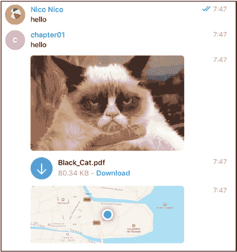

第 5 章 第 5 周：D 语言

```d
    api.sendDocument(update.message.chat.id, "https://ibiblio.org/ebooks/Poe/Black_Cat.pdf");
   api.sendLocation(update.message.chat.id, 45.8992, 6.1294);
  }
  api.updateProcessed(update);
   }
```

使用新的 `handleUpdate` 函数重新运行机器人，会给你一系列消息、图像、文档和位置，如图 5-5 所示。

***图 5-5.** 来自你的 D 语言机器人的消息、图像、文档和位置*

第 5 章 第 5 周：D 语言

作为参考，`telega` 当前实现的方法集列在项目网站上，但你可能会想快速应用下面介绍的函数。

• `sendMessage`
• `forwardMessage`
• `sendPhoto`
• `sendAudio`
• `sendDocument`
• `sendVideo`
• `sendVoice`
• `sendVideoNote`
• `sendMediaGroup`
• `sendLocation`
• `editMessageLiveLocation`
• `stopMessageLiveLocation`
• `sendVenue`
• `sendContact`
• `setChatPhoto`

至于这本书，现在是时候继续前进到下周了。

**第 6 章**

**第 6 周：C++**

*用 C 或 C++ 编程就像使用一把没有安全防护的链锯。*

—Bob Gray

有一章关于 C++ 是不可避免的，尤其是在处理了 D 语言之后。然而，令人惊讶的是，市场上有一个可用的 Telegram 机器人 API 包装器，更令人惊讶的是，它运行得非常好。

C++ 通常被认为是一种参考语言，用来指出什么不该编码，但我认为把它放在你的工具箱里总是一个加分项。

本章将重点介绍从通常的回声机器人发送图片，最后对接收到的图像应用基本的 OpenCV 调用。如果你不熟悉 OpenCV 这个框架，它是一个广为人知的成像库，可以做从改变颜色和大小到在图片和视频中查找对象等各种事情。

**要求、安装和第一个机器人**

使用 C++ 通常需要相当多的设置工作。为了使用 Telegram，我们将使用 `tgbot-cpp`，为了使用 `opencv`，你还将在本地机器上安装成像框架。

© Nicolas Modrzyk 2019
N. Modrzyk, *构建 Telegram 机器人*, `doi.org/10.1007/978-1-4842-4197-4_6`

第 6 章 第 6 周：C++

`cmake` 是一个低级工具，用于组织你的项目元数据和第三方库，以及生成一个使构建工具本身工作的文件。

`boost` 是一套维护良好且干净的 C++ 库。

**安装 tgbot-cpp**

克隆 `tgbot-cpp` 仓库将是本章的第一步。C++ 的 Telegram 包装器的代码可以在 GitHub 上找到，如下所示。

```
git clone https://github.com/reo7sp/tgbot-cpp.git
```

要编译和安装该库，你需要一些工具，例如 `make`、`cmake`、`ssl` 开发库和 `boost`。

在 Debian/Ubuntu 上，这将是：

```
apt-get install g++ make binutils cmake libssl-dev libboost-system-dev
```

然后，一旦进入克隆的 `tgbot-cpp` 目录，机器人库可以通过以下三组命令轻松安装：

```
cmake .
make
sudo make install
```

安装默认到 `/usr/lib/`，你可以通过查找以下文件的存在来检查 Telegram 库是否正确安装：

```
/usr/local/lib/libTgBot.a
```

第 6 章 第 6 周：C++

**安装 OpenCV**

成像库 OpenCV 现在安装起来容易得多，虽然选项仍然有点难以弄清楚，但我们将把它们留到本周，并保留默认设置来编译和安装该库。这实际上只是按照 OpenCV 网站上的安装说明进行操作的问题。作为参考，以下是 Linux 和 macOS 的步骤：


