# 作为库安装

sudo make install

请记住你安装 `opencv` 及其 `build` 文件夹的位置，因为在之后编译 C++ 程序时会用到。

为了验证我们的设置并稍微兴奋一下，让我们先编写一个简单的程序，使用系统命令 `curl` 来下载一个文件。

**文件下载程序**

我们稍后会在 OpenCV 机器人中重用这段代码，所以请确保你理解了它的工作原理。要使用 `cmake` 编写一个项目，我们首先创建一个简单的文件夹结构，包含 `CmakeLists.txt` 文件和一个源文件夹，C++ 代码就放在源文件夹中。

第 6 章   第 6 周：C++

[niko@niko-pcsamplecmake]$ tree

.

├──  CMakeLists.txt

└──  src

    └──  main.cpp

1 directory, 2 files

`CMakeLists.txt` 包含你的项目元数据，而 `main.cpp` 包含 C++ 代码。下面的 `CMakeLists.txt` 文件是我们稍后用于运行 `tgbot-cpp` 的简化版本。让我们来看一下。

cmake_minimum_required(VERSION 2.8.4)

project(samplecmake)

set(CMAKE_CXX_FLAGS "${CMAKE_CXX_FLAGS} -std=c++11 -Wall") set(Boost_USE_MULTITHREADED ON)

find_package(Threads REQUIRED)

find_package(OpenSSL REQUIRED)

find_package(Boost COMPONENTS system REQUIRED)

find_package(CURL)

include_directories(/usr/local/include ${OPENSSL_INCLUDE_DIR} 

${Boost_INCLUDE_DIR})

if (CURL_FOUND)

include_directories(${CURL_INCLUDE_DIRS})

add_definitions(-DHAVE_CURL)

endif()

add_executable(samplecmakesrc/main.cpp)

target_link_libraries(samplecmake ${CMAKE_THREAD_LIBS_INIT} 

${OPENSSL_LIBRARIES} ${Boost_LIBRARIES} ${CURL_LIBRARIES})

第 6 章   第 6 周：C++

表 6-1 列出了 `cmake` 定义文件中使用的命令及其用途。

***表 6-1. 理解 `cmake` 文件***

**命令**

**用途**

cmake_minimum_

定义要使用的 `cmake` 版本

required

project

定义项目名称

set

设置构建过程中使用的变量

find_package

查找外部库，即在搜索路径中查找 `cmake` 文件并检索符号

include_directories

用于检索头文件和包的更多文件夹

add_executable

从给定的源文件创建可执行文件，此处为 `samplecmake`

target_link_

标识要链接到给定可执行文件的库，此处同样为 `samplecmake`

libraries

有了这个 `CMakeLists.txt`，你就可以运行 `cmake` 命令并准备编译项目了。以下是命令执行的简化输出：

$ cmake .

-- The C compiler identification is GNU 8.2.1

-- The CXX compiler identification is GNU 8.2.1

-- Check for working C compiler: /usr/bin/cc

-- Check for working C compiler: /usr/bin/cc -- works

...

-- Looking for pthread_create in pthreads

-- Looking for pthread_create in pthreads - not found

-- Looking for pthread_create in pthread

第 6 章   第 6 周：C++

-- Looking for pthread_create in pthread - found

-- Found Threads: TRUE

--  Found OpenSSL: /usr/lib/libcrypto.so (found version 

"1.1.0i")

-- Boost version: 1.67.0

-- Found the following Boost libraries:

--   system

-- Found CURL: /usr/lib/libcurl.so (found version "7.61.1")

-- Configuring done

-- Generating done

--  Build files have been written to: /home/niko/Dropbox/BOOKS2/

APRESS/06-cplusplus/samplecmake

如果你再次使用 Visual Studio Code 编写代码，有一个由微软创建的专用插件可以安装（图 6-1）。

***图 6-1. Visual Studio Code 的 C/C++ 插件***

第 6 章   第 6 周：C++

安装好插件后，你就可以开始输入 C++ 代码，编写你今天的第一个 C++ 程序了。

在查看代码之前，这里有一些提醒事项：

•  `#include` 用于包含命名空间

•  使用 `namespace` 可以避免在每个给定命名空间的符号前插入命名空间，例如，`std::string` 将变成 `string`。

•  `intmain(intargc, char* argv[])` 是主入口点，你可以检索参数的数量以及参数数组。请注意，第一个参数的索引为 0，并且是命令名称本身。在这里，它将是 `samplecmake`，正如在项目元数据文件 `CMakeLists.txt` 中定义的那样。

•  `auto url` 意味着我们不自己指定变量的类型；编译器会做这件事。在这里，它实际上将是一个 `char*`，即指向字符数组的指针。

•  我们将使用系统命令 `curl` 来下载文件（该命令应已安装在你的机器上）。

•  使用 `system` 函数调用 shell 命令 `curl`，并将 `url` 作为 `curl` 命令的参数。

现在，我们得到了以下稍微可读的代码片段，应保存在名为 `main.cpp` 的文件中。

#include <string>

using namespace std;

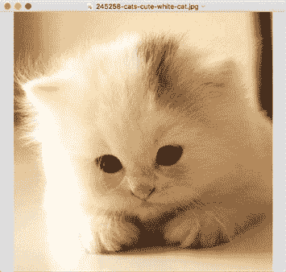

第 6 章   第 6 周：C++

intmain(intargc, char* argv[])

{

    auto url = argv[1];

printf("Downloading: %s\n", url);

    string command = string("curl --silent -O ");

const char* cmd = command.append(url).c_str();

    system(cmd);

    return 0;

}

为了创建可执行文件，`cmake` 生成了一个 `Makefile`，这是 `make` 命令能理解的文件。运行 `make` 将创建一个可执行文件。

make

为了测试我们的程序，我们可以为刚刚编译和链接的程序传递一个包含图片（或任何文件）的 URL。

 ./samplecmakehttp://stuffpoint.com/cats/image/245258-cats-cute- 

white-cat.jpg

这将下载图 6-2 中所示的猫咪图片。

***图 6-2. 可爱的猫咪***

第 6 章   第 6 周：C++

继续尝试其他几个 URL，你会看到文件按预期下载到项目文件夹中。

现在开始我们的第一个机器人！

**回声机器人**

回声机器人当然会原样回复我们发送给它的任何消息。我们将基于下载文件项目进行构建，因此你可以重用该项目，或者创建一个具有相同文件和结构的新文件夹。

在新的 `CMakeLists.txt` 中，你会立即注意到三件事：

•  项目名称已更改。

•  可执行文件的名称已更改为 `echobot`。

•  `target_link_libraries` 部分包含对我们安装的 `tgbot-cpp` 库的引用，该库打包在 `/usr/local/lib/libTgBot.a` 中。

其余部分完全相同，应该不会有什么意外。

cmake_minimum_required(VERSION 2.8.4)

project(echobot)

set(CMAKE_CXX_FLAGS "${CMAKE_CXX_FLAGS} -std=c++11 -Wall") set(Boost_USE_MULTITHREADED ON)

find_package(Threads REQUIRED)

find_package(OpenSSL REQUIRED)

find_package(Boost COMPONENTS system REQUIRED)

find_package(CURL)

include_directories(/usr/local/include ${OPENSSL_INCLUDE_DIR}

  ${Boost_INCLUDE_DIR})

if (CURL_FOUND)

第 6 章   第 6 周：C++

include_directories(${CURL_INCLUDE_DIRS})

add_definitions(-DHAVE_CURL)

endif()

add_executable(echobotsrc/main.cpp)

target_link_libraries(echobot /usr/local/lib/libTgBot.a

  ${CMAKE_THREAD_LIBS_INIT} ${OPENSSL_LIBRARIES}

  ${Boost_LIBRARIES} ${CURL_LIBRARIES})

同样，让我们运行 `cmake` 命令

cmake .

来生成必要的项目文件。

现在来看代码。接下来的代码主要取自 `tgbot-cpp` 项目示例，但有一些需要注意的地方。

•  机器人令牌从环境变量中读取。

•  你可以使用 `.getEvents.onCommand` 或 `.getEvents.onAnyMessage` 注册任意数量的回调。在这里，机器人被定义为响应名为 `start` 的命令以及任何发送的消息。

•  在每个回调中，你必须指定一个将在回调中使用的指针向量，即 `[&bot]`。稍后我们会添加更多。

•  在每个回调中，你会得到一个指向消息的指针，其结构与之前看到的相同。

•  最后，机器人被设置为像往常一样进行轮询，但使用这个 C++ 库必须显式地进行设置。

•  回声机器人的代码片段如下所示：

第 6 章   第 6 周：C++

#include <tgbot/tgbot.h>

using namespace std;

using namespace TgBot;

intmain() {

    string token(getenv("TOKEN"));

printf("Token: %s\n", token.c_str());

    Bot bot(token);

bot.getEvents().onCommand("start", &bot 

{

bot.getApi().sendMessage(message->chat->id, "Hi!");

    });

bot.getEvents().onAnyMessage(&bot {

printf("User wrote %s\n", message->text.c_str());

        if (StringTools::startsWith(message->text, "/start")) {

            return;

        }

bot.getApi().sendMessage(message->chat->id, "Your message is: " 

+ message->text);

    });

signal(SIGINT,  {

printf("SIGINT got\n");

exit(0);

    });

    try {

printf("Bot username: %s\n", bot.getApi().getMe()->username. 

c_str());

bot.getApi().deleteWebhook();

第 6 章   第 6 周：C++

TgLongPolllongPoll(bot);

        while (true) {

printf("Long poll started\n");

longPoll.start();

        }

    } catch (exception& e) {

printf("error: %s\n", e.what());

    }

    return 0;

}

编译和运行的步骤相同。在运行新创建的可执行文件之前，你必须在当前 shell 中将机器人令牌暴露为 `TOKEN`。

export TOKEN=...

./echobot

启动时，机器人会输出简短的信息，表明它已开始正常轮询。

Token: ...

Bot username: chapter01bot

Long poll started

图 6-3 显示了一个与此新机器人的示例聊天会话。

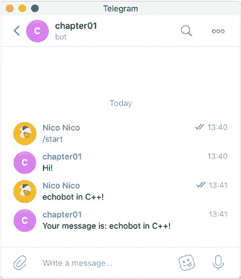

第 6 章   第 6 周：C++

***图 6-3. C++ 回声机器人***

**C++ 机器人**

现在，我们的任务是尽可能多地部署 Telegram 机器人，我们将创建两个机器人。

•  一个带有 Telegram 内联键盘的机器人

•  另一个向聊天发送图片的机器人

**带内联键盘的机器人**

这第二个机器人也取自项目的示例，此处添加以供参考。内联键盘基本上就是发送到聊天室的按钮，当用户按下时，会分配回调函数，就像机器人父亲一样。如果你从头开始一个项目，除了更改项目名称外，无需向 `CMakeLists.txt` 添加任何新内容。

这个机器人有趣的地方在于键盘的注册方式。代码的其余部分与回声机器人相同，为清晰起见已省略。

键盘使用 `InlineKeyboardMarkup` 创建，然后使用 `InlineKeyboardButton` 构造函数创建按钮行。每个按钮都有一个回调函数，此处为 `check`，必须像命令和消息一样在 `onCallbackQuery` 块中注册。

最后，你使用 `sendMessage` 的长版本将键盘发送到聊天，该版本接受创建的键盘作为参数。

 bot.getApi().sendMessage(chatid,response,false,0,keyboard,"Mark down");

这给出了以下代码片段，应位于程序的主方法中：

    // Thanks Pietro Falessi for code

InlineKeyboardMarkup::Ptr keyboard(new InlineKeyboardMarkup);

    vector<InlineKeyboardButton::Ptr> row0;

InlineKeyboardButton::PtrcheckButton(new InlineKeyboardButton);

checkButton->text = "check";

checkButton->callbackData = "check";

    row0.push_back(checkButton);

    keyboard->inlineKeyboard.push_back(row0);

bot.getEvents().onCommand("check", [&bot, &keyboard]

(Message::Ptr message) {

        string response = "ok";

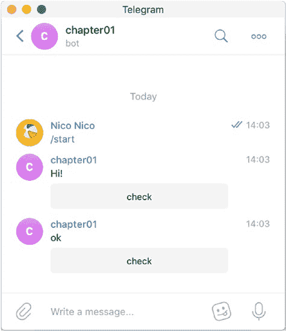

第 6 章   第 6 周：C++

bot.getApi().sendMessage(message->chat->id, response, false, 0, keyboard, "Markdown");

    });

bot.getEvents().onCallbackQuery([&bot, &keyboard]

(CallbackQuery::Ptr query) {

        if (StringTools::startsWith(query->data, "check")) {

            string response = "ok";

bot.getApi().sendMessage(query->message->chat->id, response, false, 0, keyboard, "Markdown");

        }

    });

现在让我们编译并看看这个新机器人的运行情况（图 6-4）。

***图 6-4. 带内联键盘的机器人***

第 6 章   第 6 周：C++

**图片机器人**

图片机器人用于演示如何使用 C++ API 向聊天发送图片。Telegram API 对于任何语言都是相同的，你会注意到方法名称与其他语言中使用的方法名称相似。

在这里，我们发送一张位于项目根目录的 `example.jpg` 图片。

const string photoFilePath = "example.jpg";

const string photoMimeType = "image/jpeg";

  bot

.getEvents()

.onCommand("photo", [&bot, &photoFilePath, &photoMimeType]

(Message::Ptr message) {

bot.getApi().sendPhoto(message->chat->id, InputFile::fromFile(p hotoFilePath, photoMimeType));

    });

库中不需要额外的更改，所以这里也只需 `make` 和 `run`。你可以在图 6-5 中看到图片机器人的运行情况。

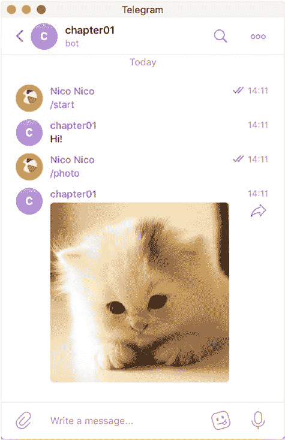

第 6 章   第 6 周：C++

***图 6-5. 给我一只猫，c++ 机器人***

现在，让我们重复这种从图片机器人发送图片的技术，并结合 OpenCV 示例，对发送到聊天的图片进行转换，然后直接将其重新发送给猫咪。

第 6 章   第 6 周：C++

**OpenCV 实战**

在创建机器人之前，让我们先尝试执行一个简单的 OpenCV 转换。

**OpenCV 示例程序**

这次，你需要稍微更新一下 `CMakeLists.txt`。特别是，你需要包含 OpenCV 头文件和库文件所在的位置，并指定在链接最终二进制文件时包含它们。

因此，基于之前的 `CMakeLists.txt`，将进行以下更改：

•  更改项目名称！虽然不是必需的，但对我们人类来说总是有用的。

•  将 `opencv/build/include` 文件夹添加到 `include_directories`。

•  添加一个针对 OpenCV 的 `find_package` 指令（注意大小写）。

•  在 `target_link_libraries` 中，添加已安装 OpenCV 版本中不同的所需 `.so` 文件。（当然，库也可以从 `opencv/build/lib` 文件夹中获取。）这里，OpenCV 使用了三个库文件：`core`、`imgcodecs` 和 `highgui`。将来，如果你处理视频，可能需要其他库，因此应相应地进行调整。

在对此新项目运行 `cmake` 之前，让我们回顾一下 `CMakeLists.txt` 文件。

cmake_minimum_required(VERSION 2.8.4)

project(opencvdemo)

set(CMAKE_CXX_FLAGS "${CMAKE_CXX_FLAGS} -std=c++11 -Wall") set(Boost_USE_MULTITHREADED ON)

第 6 章   第 6 周：C++

include_directories($HOME/projects/opencv/build/include )

include_directories(/usr/local/include ${OPENSSL_INCLUDE_DIR} 

${Boost_INCLUDE_DIR})

if (CURL_FOUND)

include_directories(${CURL_INCLUDE_DIRS})

add_definitions(-DHAVE_CURL)

endif()

find_package(Threads REQUIRED)

find_package(OpenSSL REQUIRED)

find_package(Boost COMPONENTS system REQUIRED)

find_package(CURL)

find_package(OpenCV)

add_executable(opencvdemosrc/main.cpp)

target_link_libraries(opencvdemo /usr/local/lib64/libopencv_

core.so /usr/local/lib64/libopencv_imgcodecs.so /usr/local/

lib64/libopencv_highgui.so /usr/local/lib/libTgBot.a ${CMAKE_

THREAD_LIBS_INIT} ${OPENSSL_LIBRARIES} ${Boost_LIBRARIES} 

${CURL_LIBRARIES})

运行 `cmake` 后，我们可以专注于编写一小段 OpenCV 编程代码，该代码将处理指定为输入的图片，并将其转换为灰度版本。在 OpenCV 中，这是通过一个中间的 `Mat` 对象完成的，该对象是一个用于在内存中表示图像的矩阵对象。

你需要一个新的 `include` 语句，包含 `opencv2/highgui`，而且，是的，我们都喜欢这样一个事实：尽管它是 `opencv4`，但命名空间仍然版本化为 2。

第 6 章   第 6 周：C++

`imread` 和 `imwrite` 是用于读写图片的两个 `opencv` 方法，`imread` 的第二个参数告诉它在解码图片时使用多少种颜色。这给出了非常简短的代码片段：

#include "opencv2/highgui.hpp"

using namespace cv;

intmain(intargc, char* argv[])

{

    auto bw = imread(argv[1],0);

imwrite("saved.jpg", bw);

    return 0;

}

现在使用 `make` 编译并运行这个简短的程序。

make

./opencvdemo cat.jpg

输入的图片 `cat.jpg` 如图 6-6 所示。

***图 6-6. 彩色输入猫咪***

第 6 章   第 6 周：C++

应用 OpenCV 颜色更改后，猫咪的灰度版本如图 6-7 所示。

***图 6-7. 如果你能看到区别，说明你正在以彩色阅读本书***

现在我们知道如何从程序中使用 `opencv`，让我们整合所有部分，创建一个能转换发送到聊天的图片的机器人。

**OpenCV 机器人**

完整 OpenCV 机器人的 `cmake` 设置与上一个相同，因此除了项目名称外，无需更改 `CMakeLists.txt`。在编写此机器人之前需要知道的是，当聊天收到带有图片的消息时，消息中包含一个对应于已保存文件的 `fileId`。

在 Telegram 架构中，这些文件托管在不同的服务器上，因此需要不同的 API。新的位置是 `api.telegramorg/file/bot`。

然后，检索文件的 URL 由此基础 URL 构建，附加机器人令牌，最后是 `fileId`。

第 6 章   第 6 周：C++

要读取文件并处理图片或文件，我们必须执行一个不同的请求来检索该文件。因此，在此示例中，你将重用从 C++ 代码运行 `curl` 命令的技巧来执行此请求。

以下函数 `applyOpenCV` 从 Telegram 服务器下载一个静态文件，应用将图片转换为灰度阴影的 `opencv` 过程，最后将其保存到名为 `saved.jpg` 的文件中。

const string telegram_url = "https://api.telegram.org/file/bot"; const string tmp_file = "download.jpg";

const string saved_file = "saved.jpg";

string applyOpenCV(string token, string path) {

    string command = string("curl --silent ");

    command

.append(telegram_url)

.append(token)

.append("/")

.append(path)

.append(" -o ")

.append(tmp_file);

const char* cmd = command.c_str();

    system(cmd);

    Mat bw = imread(tmp_file,0);

imwrite(saved_file, bw);

    return saved_file;

}

现在，我们只需要一个入口点来调用此函数。当在聊天中检测到图片时，将调用此函数。

第 6 章   第 6 周：C++

因此，在处理聊天消息的机器人回调中，要检测是否存在图片，我们可以检查消息中包含的图片尺寸数量。一旦我们知道存在图片，我们就可以检索其 `fileId`，然后使用 `filePath` 和令牌调用我们刚刚定义的 `applyOpenCV` 函数。

另外，请注意，正如我之前提到的，引用向量中添加了一个指向令牌的新指针。如果你忘记这样做，回调将无法访问令牌变量，并且编译会失败。

bot.getEvents().onAnyMessage(&bot, &token {

 if(message->photo.size() != 0) {

PhotoSize::Ptr s = message->photo[2];

    if(s!=NULL) {

     string fileId = message->photo[2]->fileId;

File::Ptr file = bot.getApi().getFile(fileId);

     string filepath = applyOpenCV(token.c_str(), file-

>filePath.c_str());

bot.getApi().sendPhoto(

        message->chat->id,

InputFile::fromFile(filepath, "image/jpeg"));

    }

  }

}

机器人的其余代码与其他机器人相同。执行 `make` 并启动机器人后，你可以看到发送到聊天的图片变为黑白，如图 6-8 所示。

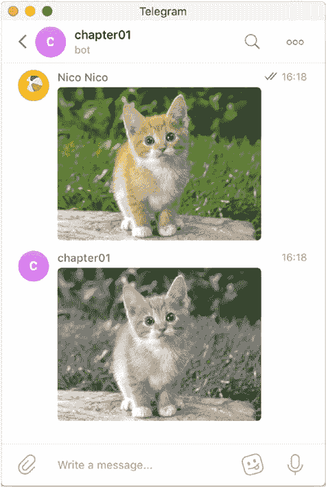

第 6 章   第 6 周：C++

***图 6-8. 彩色和灰色的猫咪***

显然，下一步是尝试更多的 OpenCV 转换，并将它们输入到你的机器人中。创建一个机器人来识别每张图片中的特定对象现在已触手可及。

**第 7 章**

**第 7 周：Clojure**

*有时，在找到结局之前，需要先开启一些东西。*

—休·豪伊

*转变*

Clojure 是本书中唯一基于 LISP 的语言，但它是我日常使用的语言。Clojure 带有大量的左右括号，可能会让一些人望而却步，但它绝不会在翻译中迷失。

Clojure 开发几乎总是使用读取-求值-打印-循环（REPL），或者简单地说，一个逐行理解 Clojure 代码的 shell。当然，在编辑器中，你可以直接执行代码块，我将再次向你展示如何在 Visual Studio Code 中做到这一点。

Clojure 使得理解通过 Telegram 服务器传递的数据结构变得容易，因此我们将查看一些来自 Telegram 的 JSON 更新。为了用 Clojure 语言编写 Telegram 机器人，我们将使用另一个名为 Morse 的 Telegram 封装器，它通过为你准备一个模板项目，使得设置你自己的自定义机器人变得非常容易。

© Nicolas Modrzyk 2019 

N. Modrzyk, 《构建 Telegram 机器人》，`doi.org/10.1007/978-1-4842-4197-4_7`

第 7 章   第 7 周：Clojure

**初始设置和第一个 Clojure 机器人**

Clojure 运行在 Java 虚拟机之上，所以如果你还没有安装它，请访问 [`jdk.java.net`](http://jdk.java.net)，并安装一个适合你机器的 `openjdk` 版本。在 Linux 机器上，几乎每个包管理器都有 `openjdk` 的版本。例如，在 Manjaro/Arch Linux 上，你可以使用 `yaourt -S java-openjdk-ea-bin`。

就本书测试的设置而言，JDK 8 到 11-ea 版本都通过了测试。

现在你已经有了 Java 编译器，你只需要 Leiningen，这是 Clojure 事实上的构建工具。安装说明很短，可以从网站 [`leiningen.org/`](https://leiningen.org/) 获得。

主要任务是安装一个为你下载和引导 Leiningen 的包或 shell 脚本。在 Manjaro/Arch 上，命令如下：

yaourt -S leiningen

如果设置一切顺利，你现在应该可以在命令行上使用 Leiningen 了（图 7-1）。

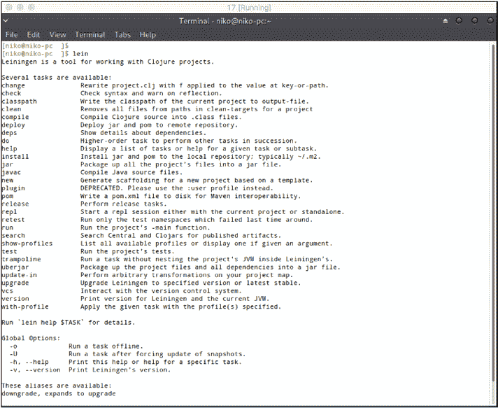

第 7 章   第 7 周：Clojure

***图 7-1. 你好 Leiningen***

Leiningen 拥有开始使用 Clojure 编码所需的一切，特别是能够为你提供一个 REPL，即执行 Clojure 代码的 shell。你可以使用 Leiningen 的 `repl` 子命令启动此 REPL。

lein repl

一旦 REPL 准备就绪，你就可以直接在提示符下输入代码。

[niko@niko-pc ~]$ lein repl

nREPL server started on port 46749 on host 127.0.0.1 - 

nrepl://127.0.0.1:46749

REPL-y 0.3.7, nREPL 0.2.12

Clojure 1.8.0

第 7 章   第 7 周：Clojure

OpenJDK 64-Bit Server VM 11+28

    Docs: (doc function-name-here)

          (find-doc "part-of-name-here")

  Source: (source function-name-here)

 Javadoc: (javadoc java-object-or-class-here)

    Exit: Control+D or (exit) or (quit)

  Results: Stored in vars *1, *2, *3, an exception in *e

user=> (+ 1 1)

user=> (println "hello world")

hello world

nil

user=>

除了直接编写 Clojure 代码，Leiningen 还可以通过使用 Leiningen 模板生成完整的项目布局。我们想要用于与 Telegram 通信的第三方库 Morse 有一个准备新机器人的模板。这是通过使用 Leiningen 的以下子命令完成的：

lein new morse mytelegrambot

这将下载所有 Clojure 依赖项并为机器人创建项目结构。

$ lein new morse mytelegrambot

Retrieving morse/lein-template/0.1.1/lein-template-0.1.1.pom 

from clojars

Retrieving morse/lein-template/0.1.1/lein-template-0.1.1.jar 

from clojars

Generating fresh 'lein new' morse project.

第 7 章   第 7 周：Clojure

项目创建后，你可以检查项目文件的存在，即：

•  `project.clj`：通常的主项目元数据。它包含项目名称、编译细节、依赖项等。

•  `core.clj`：项目的主源文件（除非在 `project.clj` 中另有指定）

•  `core_test.clj`：你可以在此编写 Clojure 测试

生成的项目树结构如下：

$ tree

.

├──  CHANGELOG.md

├──  LICENSE

├──  project.clj

├──  README.md

├──  resources

├──  src

│   └──  mytelegrambot

│       └──  core.clj

└──  test

    └──  mytelegrambot

        └──  core_test.clj

5 directories, 6 files

你的 Clojure 机器人已准备好启动，这次使用 Leiningen 的 `run` 子命令。

这将执行 `core.clj` 文件中定义的主函数，并提供你的 Telegram 令牌，这应该能让一切开箱即用。

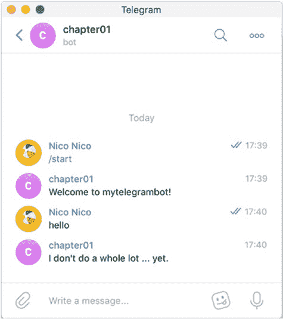

第 7 章   第 7 周：Clojure

$ export TELEGRAM_TOKEN="585672177:..."

$ lein run

Starting the mytelegrambot

基本设置就绪后，你可以立即开始与你的 Clojure Telegram 机器人聊天（图 7-2）。

***图 7-2. 好久不见***

在启动机器人的控制台中，你还可以看到以下调试消息打印到标准输出：

Bot joined new chat:  {:id 121843071, :first_name Nico, :last_

name Nico, :username hellonico, :type private}

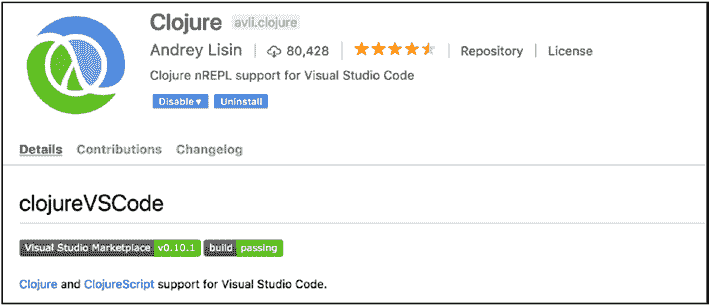

第 7 章   第 7 周：Clojure

Intercepted message:  {:message_id 675, :from {:id 121843071, 

:is_bot false, :first_name Nico, :last_name Nico, :username 

hellonico, :language_code en-JP}, :chat {:id 121843071, 

:first_name Nico, :last_name Nico, :username hellonico, :type 

private}, :date 1537519211, :text hello}

**Visual Studio Code**

作为开发机器人的快速工作流程，你可以像我们之前看到的那样启动一个带有 `lein repl` 的 REPL，或者使用图 7-3 中所示的 Visual Studio Code 插件。

***图 7-3. Visual Studio Code 的 Clojure 插件***

接下来要做的三件事是

•  查看 `project.clj`，项目的元数据文件。

•  查看处理 Telegram 请求的 Clojure 代码。

•  查看来自 Telegram 的消息。

第 7 章   第 7 周：Clojure

*深入观察自然，然后你会更好地理解一切。*

—阿尔伯特·爱因斯坦

我们现在将按照提到的顺序查看所有这些内容。

**project.clj 中的项目元数据**

Leiningen 和 Clojure 的一个优点是项目元数据使用与代码相同的语言，这意味着项目配置是用 Clojure 编写的。它实际上或多或少是一个大的哈希映射。一致性是关键（双关语），找到具有这种恒定结构的文件是令人安心的。

在 `project.clj` 中，你首先使用 `defproject` 定义一个 Clojure 项目，传递项目名称（此处为 `mytelegrambot`）、版本号以及一个包含不同事物的映射，其中每个键都以 `:` 为前缀。

在用于定义项目的不同事物中，我们可以找到

•   *依赖项*：要导入并在项目中使用的第三方库列表

•   *插件*：Leiningen 的插件列表

•  main：要编译和/或运行的主文件，实际上是命名空间

就像项目名称一样，依赖项带有项目名称和版本号，这实际上使用了相同的格式。生成的完整 `project.clj` 文件复制如下。

(defproject mytelegrambot "0.1.0-SNAPSHOT"

  :description "FIXME: write description"

  :url "http://example.com/FIXME"

第 7 章   第 7 周：Clojure

  :license {:name "Eclipse Public License"

            :url "http://www.eclipse.org/legal/epl-v10.html"}

  :dependencies [[org.clojure/clojure "1.8.0"]

                 [environ            "1.1.0"]

                 [morse              "0.2.4"]]

  :plugins [[lein-environ "1.1.0"]]

  :main ^:skip-aot mytelegrambot.core

  :target-path "target/%s"

  :profiles {:uberjar {:aot :all}})

现在，让我们看看位于 `core.clj` 中的代码本身。

**core.clj 中的 Clojure 代码**

让我们将这个源文件分解成更小的部分。首先，Clojure 项目源文件以命名空间定义 `ns` 开头，然后是在当前上下文中使用的其他命名空间列表。

(ns mytelegrambot.core

  (:require [clojure.core.async :refer [<!!]]

            [clojure.string :as str]

            [environ.core :refer [env]]

            [morse.handlers :as h]

            [morse.polling :as p]

            [morse.api :as t])

  (:gen-class))

你会注意到用于异步代码、字符串操作、轻松检索环境变量的命名空间，以及来自 Morse 的不同命名空间，Morse 是负责与 Telegram API 进行低级通信的第三方库。还要注意每个命名空间如何定义一个前缀，例如 `p`、`t` 或 `h`，你可以使用它们作为快捷方式，而不是使用完整的命名空间名称。最后，`gen-class` 用于告诉 Clojure 代码它必须将自己转换为 Java 运行时原生理解的东西，即一个 Java 类。

即使了解不多，你也能感觉到以下代码将从我们稍后将设置的 Clojure 环境变量中检索令牌。`environ` 库将外部 shell 环境中的变量“关键字化”，或使其对 Clojure 友好。在这里，`TELEGRAM_TOKEN` 将被转换为 `:telegram-token`。

; TODO: fill correct token

(def token (env :telegram-token))

我将暂时搁置处理程序的定义，但现在，要知道这是你将编写机器人核心代码的地方。

(h/defhandler handler

...

)

最后，`main`，顾名思义，是程序的 `main` 函数。它检查 Telegram 令牌是否存在，然后使用函数 `p/start` 开始轮询更新，参数为 `telegram token` 和 `telegram handler`。

(defn -main

  [& args]

  (when (str/blank? token)

     (println "Please provde token in TELEGRAM_TOKEN environment variable!")

    (System/exit 1))

  (println "Starting the mytelegrambot")

  (<!! (p/start token handler)))

第 7 章   第 7 周：Clojure

我说过我们稍后会更详细地查看处理程序代码，而稍后就是现在。提醒：每个命令通过一个 `command-fn` 指令处理，所有这些都在文件的 `defhandler` 部分中定义。

(h/defhandler handler

   ; your handlers here.

)

首先，我们为机器人定义一个简单的 `"start"` 命令。一个命令接受一个 Clojure 函数作为回调，该函数的参数从传入的消息中（解）构造。

  (h/command-fn "start"

    (fn [{{id :id :as chat} :chat}]

      (println "Bot joined new chat: " chat)

      (t/send-text token id "Welcome to mytelegrambot!"))) 一旦 `start` 命令在聊天中触发，我们只需使用来自 `morse.api` 命名空间（由 `t` 前缀，如命名空间的 `require` 部分所定义）的 `send-text` 函数向聊天发送一条消息。

生成的代码还定义了一个 `help` 命令，它的定义方式完全相同，实际上做的事情与 `start` 命令几乎完全相同，即发回一条文本消息。

  (h/command-fn "help"

    (fn [{{id :id :as chat} :chat}]

      (println "Help was requested in " chat)

      (t/send-text token id "Help is on the way")))

第 7 章   第 7 周：Clojure

最后，我们定义一个通用的消息处理程序，并且我们还在回调函数中使用关键字 `:as` 直接获取消息数据结构的快捷方式。

  (h/message-fn

    (fn [{{id :id} :chat :as message}]

      (println "Intercepted message: " message)

       (t/send-text token id "I don't do a whole lot ...

yet.")))

**令牌！**

你可能还记得在 `project.clj` 文件中定义了一个 `lein-environ` 插件。这个插件从不同的地方读取环境变量，例如 `project.clj`，然后用所有必要的环境变量填充一个名为 `.lein-env` 的文件。

因此，你可以在你的 `project.clj` 中（针对一个项目）添加如下内容：

(defproject mytelegrambot "0.1.0-SNAPSHOT"

   ...

:env

  {:telegram-token "585672177:..."})

或者在 `$HOME/.lein/profiles` 中（针对多个项目）

{:user {:env{:telegram-token "585672177:..."}}}

**调试 Telegram 消息**

为了查看来自 Telegram 的消息，我们将它们格式化并输出到一个日志文件中。为此，我们将创建一个追加写入的文件。在 `core.clj` 文件中，让我们在令牌定义的正下方声明一个写入器。

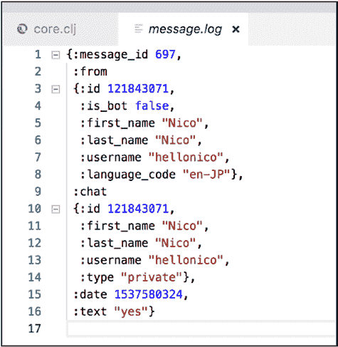

第 7 章   第 7 周：Clojure

(def writer (clojure.java.io/writer "message.log " :append true))

在接收消息的回调函数中，让我们输出接收到的消息。

Clojure 使用来自 `clojure.pprint` 命名空间的 `pprint` 函数为你格式化，你可以告诉它在哪里写入消息。

(clojure.pprint/pprint message writer)

在下一条消息发送给机器人时，`message.log` 文件将被填充传入的消息，如图 7-4 所示。

***图 7-4. 格式化后的传入消息***

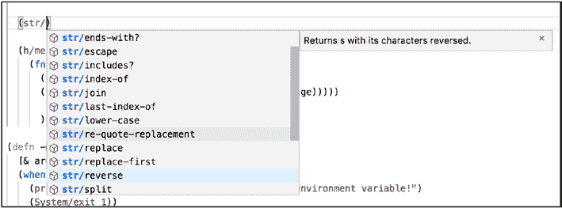

第 7 章   第 7 周：Clojure

**创建一个反转机器人**

现在让我们创建一个文本反转机器人。你会记得你可以访问 Clojure 的字符串命名空间，前缀为 `str/`。这个命名空间有许多函数，其中之一是 `reverse`（图 7-5）。

***图 7-5. `reverse` 函数，与所有 `str/` 函数一起显示***

要创建一个用于反转文本的处理程序，你可以在接收到的文本上调用这个 `reverse` 函数。如果你再次查看图 7-4 中的映射，接收到的文本本身可以从消息中通过键 `:text` 获取。

以下是新的消息处理程序，用于反转发送到聊天的文本：

(h/message-fn

    (fn [{{id :id} :chat :as message}]

      (clojure.pprint/pprint message writer)

      (t/send-text token id (str/reverse (:text message)))))

现在，这在 Telegram 聊天中运行良好，你可以尝试发送任何类型的文本（图 7-6）。

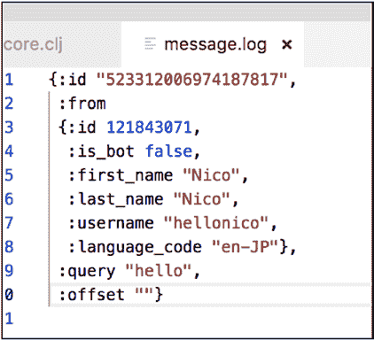

第 7 章   第 7 周：Clojure

***图 7-6. 反转的文本***

**内联处理程序**

你可能还记得之前章节中如何定义内联处理程序。以下是在 Clojure 中使用 Morse 实现的一种方法。

这个内联处理程序首先记录消息。

  (h/inline-fn

  (fn [inline]

    (clojure.pprint/pprint inline writer)

    inline))

内联消息的内容如图 7-7 所示。

***图 7-7. 内联消息内容***

第 7 章   第 7 周：Clojure

请注意，关于如何回答内联查询，Morse 库的文档有点简略。查看 Telegram 关于内联结果的文档使这一点更加明确。

[`core.telegram.org/bots/api#inlinequeryresultgif`](https://core.telegram.org/bots/api#inlinequeryresultgif)

从官方文档中，你会注意到

•  你不能指定除 gif 以外的任何其他类型。

•  `thumb_url` 和 `gif_url` 都是必需的。

因此，要发送内联答案，你可以编写类似于以下代码片段的代码。在这里，我们总是发送相同的 gif。

(t/answer-inline

     token

     (:id inline)

    [{:type "gif"

      :id "gif1"

      :thumb_url "https://bit.ly/2DtXcIi"

      :gif_url "https://bit.ly/2DtXcIi"}])

运行处理程序看看是哪一个！

**一个简单的天气机器人**

接下来，我们将创建一个机器人来接收包含位置的消息，并通过向 OpenWeather（[`openweathermap.org/`](https://openweathermap.org/)）发送请求来检索该位置的天气信息。

显然，你必须注册才能从 OpenWeather 网站获取 API 令牌，如图 7-8 所示。

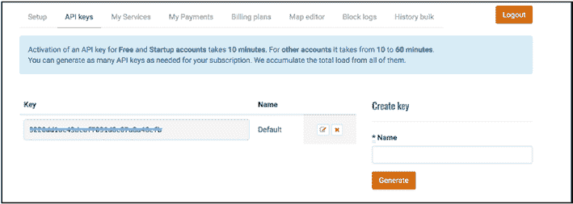

第 7 章   第 7 周：Clojure

***图 7-8. OpenWeather API 令牌***

注册是免费的，获取令牌只需几分钟。

一旦你有了 OpenWeather 的令牌，只需发送一个类似于以下的 HTTP 查询即可：

[`api.openweathermap.org/data/2.5/weather?q=<city>&units=`](http://api.openweathermap.org/data/2.5/weather?q=%3Ccity%3E&units=metric&APPID=openweather-api-token)

[metric&APPID=openweather-api-token](http://api.openweathermap.org/data/2.5/weather?q=%3Ccity%3E&units=metric&APPID=openweather-api-token)

如果你使用 `curl` 或 `httpie` 对东京尝试此操作，你将得到类似于以下的 JSON 响应：

{

    "base": "stations",

    "clouds": {

        "all": 75

    },

    "cod": 200,

    "coord": {

        "lat": 35.68,

        "lon": 139.76

    },

    "dt": 1537583700,

    "id": 1850147,

第 7 章   第 7 周：Clojure

    "main": {

        "humidity": 88,

        "pressure": 1009,

        "temp": 22.18,

        "temp_max": 24,

        "temp_min": 21

    },

    "name": "Tokyo",

    "sys": {

        "country": "JP",

        "id": 7619,

        "message": 0.0056,

        "sunrise": 1537561714,

        "sunset": 1537605508,

        "type": 1

    },

    "visibility": 10000,

    "weather": [

        {

            "description": "light intensity shower rain",

            "icon": "09d",

            "id": 520,

            "main": "Rain"

        }

    ],

    "wind": {

        "deg": 340,

        "speed": 4.1

    }

}

第 7 章   第 7 周：Clojure

为了在 Clojure 中做到这一点，我们将

•  简单地使用 Clojure 的 `slurp` 执行 HTTP 请求，它会检索文件或 URL 的全部内容

•  使用 Clojure 的 JSON Cheshire 库及其 `parse-text` 函数解析 `slurp` 到的消息，以生成 Clojure 数据结构

•  将所有内容转换为字符串以将消息发送回聊天

检索天气的函数是

(defn weather[city]

   (let [request

    (str

        "http://api.openweathermap.org/data/2.5/weather?q="

        city

        "&units=metric&APPID="

        openweather-api-token )]

    (:main

        (parse-string (slurp request)

           (fn [k] (keyword k))))))

而可以调用它的 Morse/Telegram 处理程序，从聊天消息中检索城市名称，并使用上面定义的 `weather` 函数发送请求。

(defhandler handler

  (message-fn

    (fn [{{id :id} :chat :as message}]

      (let [place (:text message)]

      (try

       (api/send-text token id

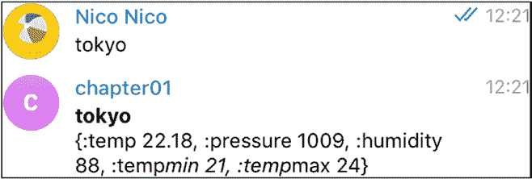

第 7 章   第 7 周：Clojure

        {:parse_mode "Markdown"}

        (str "*" place "*" "\n" (weather place))) (catch Exception e))))))

结果如图 7-9 所示。

***图 7-9. 发送城市名称，接收温度*** 太棒了！最后，让我们转向一个折纸机器人。

**OpenCV 和 Telegram：折纸机器人**

Origami 是围绕 OpenCV 库的 Clojure 封装器。要在你的机器上设置任何东西，通常只需下载一个通过 Clojure 依赖项交付的封装好的 `opencv` 即可。

为此，我们将稍微更新 `project.clj`，以检索 Origami 库并引导 `opencv` 环境。

(defproject origamibot "0.1.0-SNAPSHOT"

  :injections [

    (clojure.lang.RT/loadLibrary org.opencv.core.Core/NATIVE_

LIBRARY_NAME)

  ]

第 7 章   第 7 周：Clojure

   :repositories [["vendredi" "https://repository.hellonico.

info/repository/hellonico/"]]

  :main origamibot.core

  :license {:name "Eclipse Public License"

            :url "http://www.eclipse.org/legal/epl-v10.html"}

  :plugins [[lein-environ "1.1.0"]]

  :dependencies [

  [environ "1.1.0"]

  [cheshire "5.6.1"]

  [origami "0.1.11"]

  [hellonico/morse "0.2.4"]

  [org.clojure/clojure "1.8.0"]])

现在，要检索图片，请记住如何访问 Telegram 静态文件：通过聊天消息中检索到的文件 `id`，当图片发送到聊天时，如下所示。

{:message_id 851,

 :from

 {:id 121843071,

  :is_bot false,

  :first_name "Nico",

  :last_name "Nico",

  :username "hellonico",

  :language_code "en-JP"},

 :chat

 {:id 121843071,

  :first_name "Nico",

  :last_name "Nico",

  :username "hellonico",

  :type "private"},

 :date 1537587499,

第 7 章   第 7 周：Clojure

 :photo

  [{:file_id "AgADBQADTqgxGxauIVWm22ogiY88fiZL1TIABM- 

as8GGX14indYDAAEC",

   :file_size 1022,

   :width 90,

   :height 57}

  ; other files

]}

要从 Telegram 下载文件，请记住官方文档：[`core.telegram.org/bots/api#file`](https://core.telegram.org/bots/api#file)。

另外，记住从文件路径检索文件的请求：[`api.telegram.org/file/bot<token>/<file_path>`](https://api.telegram.org/file/bot%3Ctoken%3E/%3Cfile_path%3E)，其中此文件路径是在调用 `getFile` 并使用聊天消息中包含的 `file_id` 后检索到的。

这可以通过使用 Morse 的 `api/download-file`（实际上是库的自定义版本：`hellonico/morse`）来实现，该版本已添加到 `project.clj` 中。自定义版本的差异可以在网上找到，使用它的原因是为了将文件下载到本地文件系统。这只是为了方便，当然，经过几天的 Clojure 练习，你也可以自己编写代码。

一切就绪后，让我们将 `origami` 包作为 `origami` 添加到命名空间部分，`origami` 是 `opencv` 的核心封装器。

(ns origamibot.core

  (:require

    [opencv3.core :as origami]

    ;….

     [clojure.string :as str])

  (:gen-class))

第 7 章   第 7 周：Clojure

然后你可以应用任何你想要的 `opencv` 转换。让我们定义一个名为 `apply-cv` 的函数，它对从文件加载的图片应用 Canny 效果。请注意，转换是在文件上就地完成的。

(defn apply-cv [filename]

         (->  filename

           (origami/imread)

           (origami/cvt-color! origami/COLOR_RGB2GRAY)

           (origami/canny! 300.0 100.0 3 true)

           (origami/bitwise-not!)

           (origami/imwrite filename)))

最后，你通过调用之前定义的 `apply-cv` 函数和下载的文件，对从聊天中检索到的文件应用 OpenCV 转换。

(defhandler handler

  (message-fn

    (fn [{{id :id} :chat :as message}]

      (let [fid (-> message :photo last :file_id)

filename (str fid ".png")]

       (api/download-file token fid)

       (apply-cv filename)

        (api/send-photo token id (clojure.java.io/as-file 

filename))))))

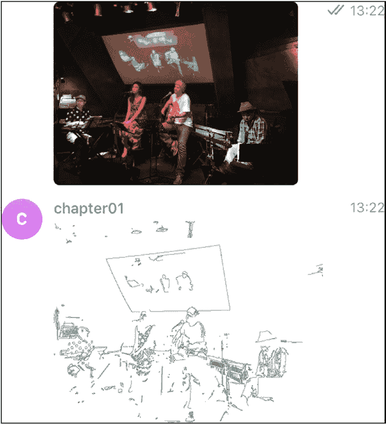

第 7 章   第 7 周：Clojure

故事的其余部分是在聊天中上传另一张图片。你可以在图 7-10 中看到它的运行情况。

***图 7-10. 直接从机器人处理程序应用 OpenCV 转换***

**第 8 章**

**第 8 周：Java**

*咖啡本身就是一种语言。*

—成龙

在本章中，我们将用 Java 构建一个 Telegram 机器人。Java 中的 API 并没有看起来那么糟糕，在 Visual Studio Code 中调试 Java 代码也比预期的要好一些。

该项目将使用 Java 事实上的构建工具 Gradle。使用的库将是 `java-telegram-bot-api`。

Telegram 现在提供了一个支付 API，因此你可以直接通过 Telegram 开始销售商品。这对于销售服务尤其有效。

虽然本章的第一部分将回顾基础知识，但我们随后将实现一个机器人，它能够应对使用 Telegram 支付 API 的挑战，并创建一个完整的支付生命周期示例。

**安装**

除了 Apache Maven，Gradle 是 Java 领域事实上的构建工具。它实际上是构建 Android 应用程序的主要构建工具。

你可以通过下载不同包管理器提供的二进制文件，手动在你的机器上下载并安装 Gradle。

Gradle 网站（[`gradle.org/install/`](https://gradle.org/install/)）有一个关于如何安装该软件的详尽章节。

© Nicolas Modrzyk 2019 

N. Modrzyk, 《构建 Telegram 机器人》，`doi.org/10.1007/978-1-4842-4197-4_8`

第 8 章   第 8 周：Java

现在使用 `sdkman` 很不错：

sdk install gradle 4.10.2

Homebrew 是 macOS 上的标准方式。

brew install gradle

Chocolatey 是 Windows 上的标准方式。

choco install gradle

安装后，你可以检查是否拥有最新的可用版本，对于 Gradle，在撰写本文时，版本是 4.10.2

$ gradle -v

Welcome to Gradle 4.10.2!

Here are the highlights of this release:

 - Incremental Java compilation by default

 - Periodic Gradle caches cleanup

 - Gradle Kotlin DSL 1.0-RC6

 - Nested included builds

 - SNAPSHOT plugin versions in thèplugins {}` block

For more details see https://docs.gradle.org/4.10.2/release- 

notes.html

Gradle 4.10.2

Build time:   2018-09-19 18:10:15 UTC

Revision:     b4d8d5d170bb4ba516e88d7fe5647e2323d791dd

Kotlin DSL:   1.0-rc-6

Kotlin:       1.2.61

第 8 章   第 8 周：Java

Groovy:       2.4.15

Ant:          Apache Ant(TM) version 1.9.11 compiled on  

March 23 2018

JVM:         1.8.0_171 (Oracle Corporation 25.171-b11)

OS:          Mac OS X 10.13.6 x86_64

**项目结构**

使用 Gradle 的 Java 项目主要由 `build.gradle` 文件组成，该文件包含 Gradle 可以理解的元数据和构建信息，以及位于 `src/main/java`（默认情况下）的源文件。

.

├──  build.gradle

├──  resources

│   ├──  cat.jpg

│   └──  token

└──  src

    └──  main

        └──  java

            └──  com

                └──  hellonico

                    ├──  Invoice.java

                    └──  MyMain.java

6 directories, 5 files

**build.gradle 文件**

Gradle 非常通用，你可以用它构建几乎任何东西。在我们的例子中，我们将构建一个 Java 项目，因此我们将使用 Gradle 的 Java 插件，并附带一些用于编译的标准设置，例如文件编码和编译兼容性。

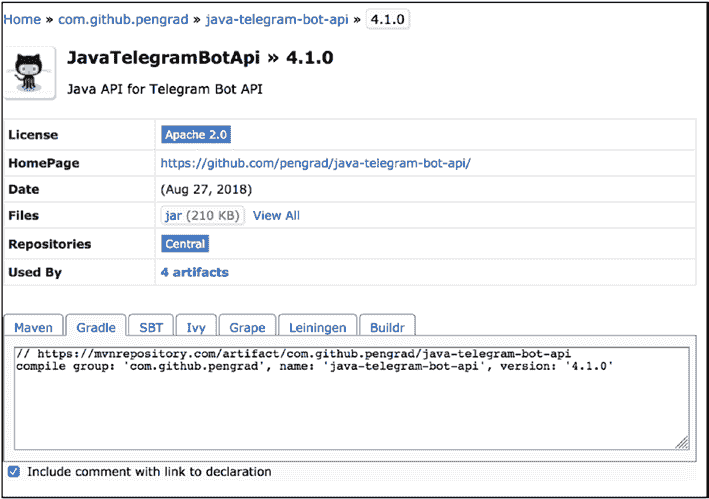

第 8 章   第 8 周：Java

依赖项在 `dependencies` 部分中定义，每个依赖项由以下格式标识：

<group>:<name>:<version>。

如果你不记得依赖项格式，你可以在 `mvnrepository.com` 上搜索并找到任何 Java 依赖项，如图 8-1 所示。

***图 8-1. 来自 MvnRepository 的 `java-telegram-bot-api` 详细信息***

以下是 `build.gradle` 文件的内容：

apply plugin: 'java'

sourceCompatibility = 1.8

targetCompatibility = 1.8

第 8 章   第 8 周：Java

compileJava {

    options.encoding = "UTF-8"

}

repositories {

    jcenter()

}

dependencies {

    compile  'com.github.pengrad:java-telegram-bot-api:4.1.0'

    compile 'com.sparkjava:spark-core:2.2'

    compile 'org.jsoup:jsoup:1.8.3'

    compile 'io.reactivex:rxjava:1.0.16'

}

apply plugin: 'application'

mainClassName = "com.hellonico.Simple"

最后两行（应用程序插件和 `mainClassName`）不是必需的，但如果你想通过简单地使用以下命令启动程序，它们会有所帮助：

gradle run

例如，给定以下简单的 Java 类和程序：

package com.hellonico;

public class Simple {

    public static void main(String[] args) {

        System.out.println("hello nico");

    }

}

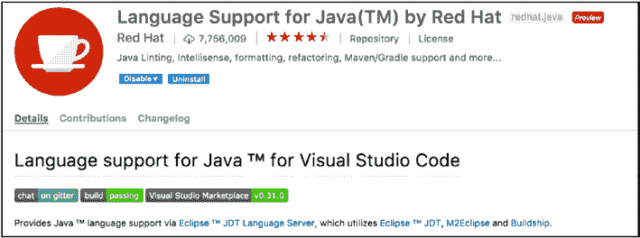

第 8 章   第 8 周：Java

如果你执行 `run` 命令，程序将执行，并且以下输出将显示在终端或命令提示符中：

$ gradle run

> Task :run

hello nico

BUILD SUCCESSFUL in 1s

2 actionable tasks: 2 executed

这将执行 `com.hellonico.Simple` 类的 main 方法。有关应用程序插件的更多信息，请访问 Gradle 网站（[`docs.gradle.org/current/userguide/application_plugin.html`](https://docs.gradle.org/current/userguide/application_plugin.html)）。

**Visual Studio Code 设置**

因为我建议在本章中使用 Gradle 作为 Java 的构建工具，Visual Studio Code 可以识别该构建工具，并使用 Java 工具集以近乎完美的集成来设置项目。

Java 的主要插件如图 8-2 所示，可以通过通常的 Visual Studio Code 市场安装。

***图 8-2. Visual Studio Code Java 插件***

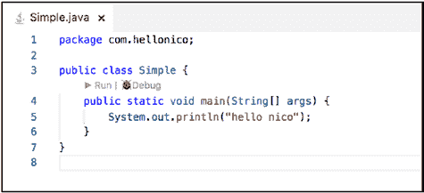

第 8 章   第 8 周：Java

上面编写的同一个简单 Java 类产生了如图 8-3 所示的结果。

***图 8-3. hello nico Java 程序***

你现在看到两个用于运行和调试代码的图标。它们在你编写 Telegram 机器人时会很有用。

现在尝试一下，点击 Run，它将执行程序并在 Visual Studio Code 控制台上显示正确的输出（图 8-4）。

***图 8-4. 从 Visual Studio Code 运行 Java***

**第一个 Java 机器人**

我们的第一个 Java 机器人将发送一些文本和一张图片，只是为了确保完整的 Java 设置正常工作。机器人将使用从 `resources/token` 文件加载的令牌进行初始化，你应将机器人的令牌粘贴到该文件中。

在此过程中，你可能会发现 Java 导入有点难找，但可以使用 Visual Studio Code 的“组织导入”功能自动导入，如图 8-5 所示。

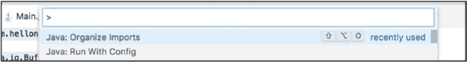

第 8 章   第 8 周：Java

***图 8-5. 组织导入***

对于这第一个机器人，代码中最困难的部分可能是下面这一行：

bot.setUpdatesListener(new UpdatesListener() {..}

这就是你告诉机器人轮询并监听更新的地方。在其最简单的形式中，机器人代码如下：

package com.hellonico;

import java.io.BufferedReader;

import java.io.FileReader;

import java.io.IOException;

import java.util.List;

import java.util.stream.Collectors;

import com.pengrad.telegrambot.TelegramBot;

import com.pengrad.telegrambot.UpdatesListener;

import com.pengrad.telegrambot.model.Update;

public class Main {

    public static String streamFile_Buffer(String file) throws 

Exception{

        BufferedReader reader =

new BufferedReader(new FileReader(file));

        return reader

.lines()

.collect(Collectors.joining(System.lineSeparator()));

    }

第 8 章   第 8 周：Java

    public static void main(String[] args) throws Exception {

        TelegramBot bot =

new TelegramBot(streamFile_Buffer("resources/token"));

bot.setUpdatesListener(new UpdatesListener() {

@Override

            public int process(List<Update> updates) {

                System.out.println(updates.toString());

                  // DO SOMETHING HERE.

                return UpdatesListener.CONFIRMED_UPDATES_ALL;

            }

        });

    }

}

**发送一些文本**

我们的第一个交互将是向聊天发送一些文本。你可以像使用其他语言一样浏览来自 Telegram 的更新消息。你会找到与之前看到的相同结构的常见消息。

Update{update_id=573518674, message=Message{message_id=956, 

from=User{id=121843071, is_bot=false, first_name='Nico', last_

name='Nico', username='hellonico', language_code='en-JP'} , 

date=1537602748, chat=Chat{id=121843071,..

从那里，我们可以获取聊天 ID

int id = updates.get(0).message().chat().id().intValue();

并向聊天室发送一条消息。请注意，我们使用 `bot.execute` 并带有一个请求和一个回调，因此结果是异步的。

第 8 章   第 8 周：Java

SendMessage requestText =

new SendMessage(id, "*hello from java*").parseMode(ParseMode.

Markdown);

bot.execute(requestText, new Callback<SendMessage, 

SendResponse>() {

@Override

public void onResponse(SendMessage request, SendResponse 

response) {}

@Override

  public void onFailure(SendMessage request, IOException e) {}

});

在启动机器人之前，你必须组织导入或手动完成列表。完整的列表如下所示，应位于源文件的顶部。

import java.io.BufferedReader;

import java.io.FileReader;

import java.io.IOException;

import java.util.List;

import java.util.stream.Collectors;

import com.pengrad.telegrambot.Callback;

import com.pengrad.telegrambot.TelegramBot;

import com.pengrad.telegrambot.UpdatesListener;

import com.pengrad.telegrambot.model.Update;

import com.pengrad.telegrambot.model.request.ParseMode;

import com.pengrad.telegrambot.request.SendMessage;

import com.pengrad.telegrambot.response.SendResponse;

通过点击 Run 或 Debug 启动机器人，这将在聊天中显示一些 Markdown 格式的文本（图 [8-6）。

第 8 章   第 8 周：Java

***图 8-6. 你的 Java 机器人正在运行！***

**发送图片**

发送图片和发送文本一样简单，这次我们将使用同步版本来向 Telegram 发送请求。因为代码不再是异步的，所以在异步版本中可用的 `onFailure` 回调中无法处理失败。因此，最好用 `try/catch` 块包围请求。

SendPhoto requestPhoto = new SendPhoto(id, new File("resources/

cat.jpg"));

try {

SendResponse response = bot.execute(requestPhoto);

} catch (Exception e) {

e.printStackTrace();

}

猫咪图片被发送到聊天，如图 8-7 所示。

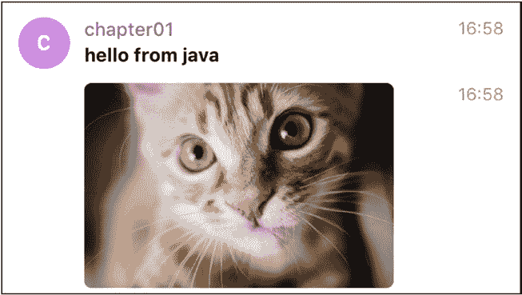

第 8 章   第 8 周：Java

***图 8-7. 猫咪回来了！***

现在让我们尝试生成一个发票并使用 Java 机器人进行一些支付。

**具有发票功能的机器人**

Telegram 添加了一个支付 API，可以直接从聊天室接受付款。这是一个非常棒的汇款设置，服务领域的交易将大大受益于其扩展。

**请求权限**

在使用这些功能之前，你必须再次从万能的 BotFather 那里获得权限，方法是更改你机器人的支付设置（见图 8-8）。

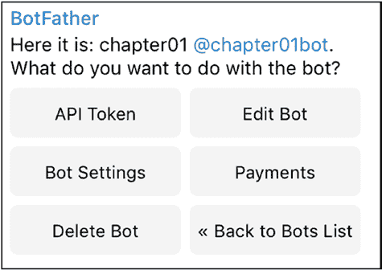

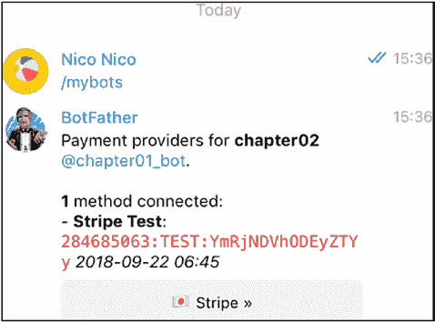

第 8 章   第 8 周：Java

***图 8-8. BotFather 机器人设置中的支付部分*** 更新机器人的支付设置后，BotFather 会给你一个支付令牌，如图 8-9 所示。

***图 8-9. 支付详情已更新***

请注意，这里给了你另一个令牌。这是你在发送发票消息时必须使用的令牌。

第 8 章   第 8 周：Java

在此过程中，你将需要使用你喜欢的提供商设置一个支付账户。这里我们使用 Stripe 并测试其功能，如图 8-10 和 8-11 所示。

***图 8-10. Stripe 设置***

***图 8-11. Stripe 仪表板***

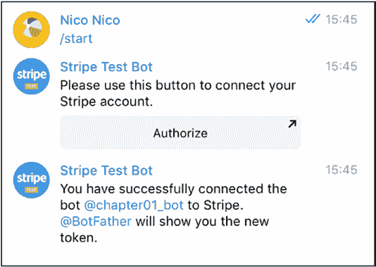

第 8 章   第 8 周：Java

如果设置正确完成，你将收到来自 Stripe 测试机器人的确认，如图 8-12 所示。

***图 8-12. Stripe 测试机器人已连接***

现在你的机器人可以发送发票消息，并尝试从与它交谈的人那里获取资金。

**发送发票消息**

与发送图片或文本类似，你可以使用 `SendInvoice` 消息向聊天发送发票。

SendInvoice sendInvoice

= new SendInvoice(id, "Lemon", "desc", "hello","2846850

63:TEST:NDBlMjliMGM2YmQ0", "my_start_param", "JPY", new LabeledPrice("label", 2000))

.needPhoneNumber(false)

.needShippingAddress(false)

第 8 章   第 8 周：Java

.isFlexible(true)

.replyMarkup(new InlineKeyboardMarkup(new InlineKeyboardButton[] 

{ new InlineKeyboardButton("just pay").pay(),

new InlineKeyboardButton("google it").url("www.google.com") })); 同样，你可以同步或异步执行查询。建议避免阻塞主线程上的执行。

// sync version

SendResponse response = bot.execute(sendInvoice);

// async version

bot.execute(sendInvoice, new Callback<SendInvoice, SendResponse>() {

@Override

public void onResponse(SendInvoice request, SendResponse 

response) {}

 @Override

 public void onFailure(SendInvoice request, IOException e) {}});

支付只能使用 Telegram 应用的移动版本进行，用户还需要提供他们的配送详情（图 8-13）。

***图 8-13. 给我开柠檬的发票***

在此步骤中，点击“just pay”将让支付机器人发送一个配送查询请求。（实际上，仅当设置了 `.isFlexible (true)` 时才会发生。）在此阶段，我们可以发送一些配送选项并将其发送回聊天。

第 8 章   第 8 周：Java

ShippingQuery shipping= updates.get(0).shippingQuery();

if (shipping!= null) {

    ShippingOption option =

new ShippingOption("fedex", "FedEx", new LabeledPrice("JOY", 2000)); AnswerShippingQuery query =

new AnswerShippingQuery(shipping.id(), option);

    bot.execute(query);

    return UpdatesListener.CONFIRMED_UPDATES_ALL;

}

配送选项随后将显示在聊天中，如图 8-14 所示。

***图 8-14. 配送选项***

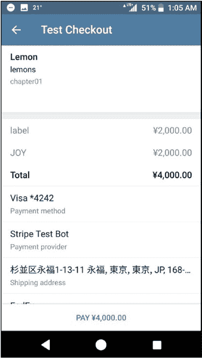

第 8 章   第 8 周：Java

图 8-15 和 8-16 显示了填写支付流程剩余信息的过程。

***图 8-15. 完整结账屏幕***

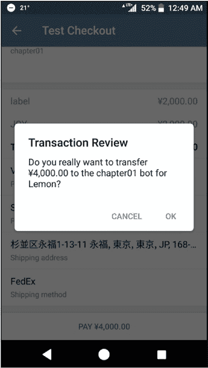

第 8 章   第 8 周：Java

***图 8-16. 交易验证***

最后，支付机器人将向你的机器人发送一个预结账请求，其中包含所有支付详情。你必须尽快响应此请求，实际上最长时间限制是 10 秒，否则支付将被取消。

当收到 `preCheckoutQuery` 元素时，通过发送带有查询 ID 的 `PreCheckoutQuery` 来完成交易。

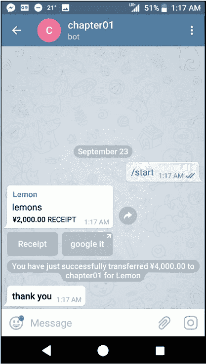

第 8 章   第 8 周：Java

PreCheckoutQuery query = updates.get(0).preCheckoutQuery();

if (query != null) {

    AnswerPreCheckoutQuery apcq =  new AnswerPreCheckoutQuery 

(query.id());

    bot.execute(apcq);

    return UpdatesListener.CONFIRMED_UPDATES_ALL;

}

图 8-17 显示了支付完成后的聊天界面。

***图 8-17. 支付完成***

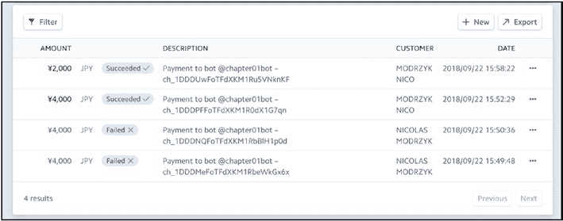

第 8 章   第 8 周：Java

在 Stripe 仪表板的支付部分，启用测试数据后，你可以看到不同的订单通过，如图 8-18 所示。

***图 8-18. Stripe 测试日志***

这相当顺利。这就是 Java 中完整的支付流程生命周期。现在轮到你去卖柠檬了……然后变得富有！

**第 9 章**

**第 9 周：Go**

*我有九张扶手椅，可以从中进行批评。*

—里克·莫拉尼斯

Go 最初是由不太喜欢 C++ 编程语言的人创建的。Go 是一种强类型编译语言，主要目标是既易于学习又执行快速。Go 也是少数拥有出色标志的语言之一！

该标志如图 9-1 所示，由 [Renée French](http://reneefrench.blogspot.com) 设计，据我所知，在注明出处的情况下，我可以在此使用它。

***图 9-1. Gopher，Renée French 为 Go 语言设计的标志***

© Nicolas Modrzyk 2019 

N. Modrzyk, 《构建 Telegram 机器人》，`doi.org/10.1007/978-1-4842-4197-4_9`

第 9 章   第 9 周：Go

在本章中，我将回顾如何安装 Go 二进制文件，然后介绍第一步和基本的 Go 示例，接着编写一个 Telegram 机器人，最后编写一个命令行二进制文件，通过 API 发送不同的 Telegram 对象。

**安装 Go**

要下载 Go，你可以使用 Go 网站上的预打包版本，位于 [`golang.org/dl/`](https://golang.org/dl/)。大多数平台都有可用的下载选项，如图 9-2 所示。

***图 9-2. 适用于你首选平台的 Go 包***

你喜欢的包管理器也应该有可用的 Go 包。

