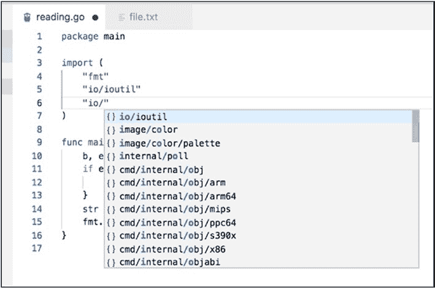
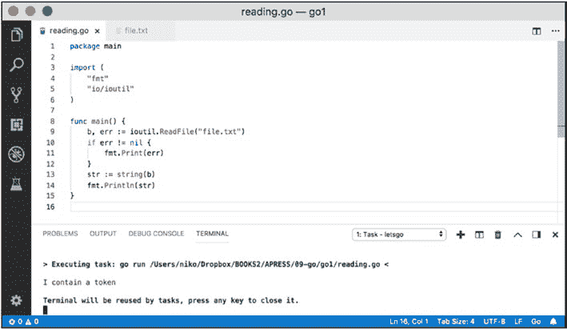
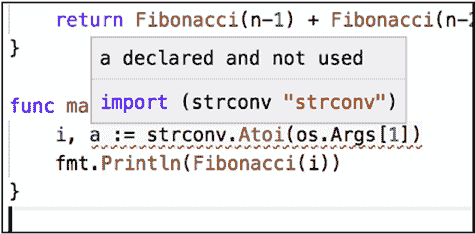
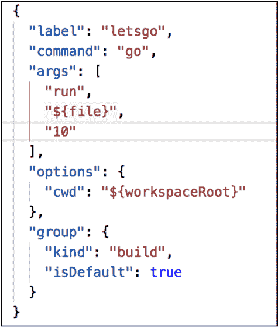
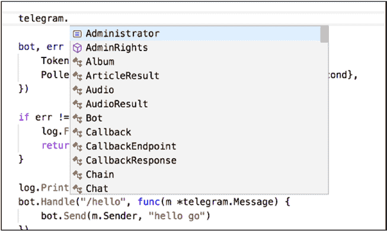
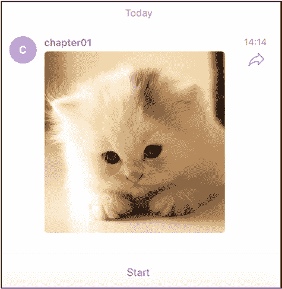

# 当前版本

$ go version

go version go1.11 linux/amd64

通常建议你创建一个 `GOPATH` 变量，用于让你的 Go 包能够下载并存储在一个已知的位置。

export GOPATH=$HOME/go

Visual Studio Code 有一个适用于 Go 的插件，要安装它，建议你按照以下步骤操作。Go 有多个插件，但微软提供的那个非常稳定，如图 9-3 所示。

***图 9-3.  **Visual Studio Code 的 Go 插件*

为了方便，下面编写了与 Visual Studio Code 构建任务相关的 `tasks.json` 文件及其 `Command+Shift+B` 快捷键，用于在 Visual Studio Code 中执行代码。

{

    "version": "2.0.0",

    "tasks":

第 9 章   第 9 周：Go

        [

          {

            "label": "letsgo",

            "command": "go",

            "args": [

              "run",

              "${file}"

            ],

            "options": {

              "cwd": "${workspaceRoot}"

            },

            "group": {

              "kind": "build",

              "isDefault": true

            }

          }

        ]

      }

从 `tasks.json` 文件中，你会注意到构建 Go 程序的命令是 `go run<filename>`。

现在，让我们进入第一个 Go 程序。

** 让我们开始 Go**

Go 程序的基本结构分为三个主要部分。

•  包定义，使用 `package` 完成
•  导入，全部定义在一个块中
•  运行 `go run` 命令时执行的主函数

第 9 章   第 9 周：Go

我们将从一个从文件读取文本的程序开始我们的 Go 探索之旅。本章稍后，我们将复用此技术来为我们的机器人读取令牌。

Go 项目的项目结构依赖于一个只包含一个主函数和一系列 Go 源文件的文件夹，每个文件都以 `.go` 扩展名结尾。我们的第一个设置将包含一个用于编写 Go 源代码的 `reading.go` 文件和一个用于读取示例文本的文本文件 `file.txt`。

$ tree

.

├── file.txt

└── reading.go

0 directories, 2 files

现在来看 Go 代码本身。如前面的列表所示，源文件包含三个部分，从包定义开始。

你还会注意到，如果你忘记编写包定义，Visual Studio Code 插件会在保存时自动为你添加。

我们将使用两个导入：

•  `io/ioutil`，用于读取文件内容
•  `fmt`，非常经典，用于在标准输出上打印

借助自动补全功能，你可以轻松浏览 Go 中的不同包，如图 9-4 所示。

第 9 章   第 9 周：Go

***图 9-4.  **通过补全在 Visual Studio Code 中导入包**

在继续解释主函数之前，让我们将以下代码复制并粘贴到 `reading.go` 文件中，并先执行代码。

package main

import (

    "fmt"

    "io/ioutil"

)

func main() {

    b, err := ioutil.ReadFile("file.txt")

    if err != nil {

        fmt.Print(err)

    }

第 9 章   第 9 周：Go

    str := string(b)

    fmt.Println(str)

}

现在打开包含 `reading.go` 和 `file.txt` 文件的文件夹，并使用安装过程中定义的 Visual Studio Code `build` 命令，如图 9-5 所示。

***图 9-5.  **我们的第一个 Go 程序从文件读取内容** 所以，该文件目前还没有令牌，但它确实包含一些由程序从主函数读取的文本。顺便问一下，这个函数在做什么？

首先，我们使用了 `ioutil` 包中的 `ReadFile` 来打开并将文件的全部内容读取到一个字节数组中。

b, err := ioutil.ReadFile("file.txt")

第 9 章   第 9 周：Go

`ReadFile` 实际上返回两个值，一个用于文件内容的字节，另一个用于在从文件读取这些字节时可能发生的错误。如你所见，Go 使得将返回结果分配给多个变量变得很容易。

现在，让我们通过检查 `err` 是否为 `nil` 来查看是否发生了错误。如果不是，让我们使用 `fmt` 及其 `Print` 函数，在标准输出中显示 `err` 变量本身的内容。

if err != nil {

fmt.Print(err)

}

如果代码执行到了这个 `if` 语句，说明我们进展顺利。让我们将 `ReadFile` 返回的字节内容转换为字符串，并再次使用 `fmt` 的 `Println` 显示字符串的内容。

str := string(b)

fmt.Println(str)

太棒了。我们已经全部设置好，并且我们的第一个 Go 程序成功执行了。

请注意，你可以使用 Go 的 `build` 子命令，从此文件夹中包含的所有源文件生成一个二进制文件。

`go build` 有两种形式，一种是指定文件名，另一种是不指定。通常最好将项目分隔到不同的文件夹中，并使用不带参数的 `build` 命令版本。

go build

执行该命令后，一个名为 `go1` 的新文件将生成在项目文件夹中，如图 9-6 所示。

第 9 章   第 9 周：Go

***图 9-6.  **由 `build` 命令生成的可执行二进制文件 `go1`**

另请注意，生成的二进制文件的文件名默认是包含代码的文件夹的名称，而不是包含主函数的 Go 源文件的名称。

让我们快速确认二进制文件按预期工作。

$ ./go1

I contain a token

如果你向上移动一级文件夹，到不包含 `file.txt` 的文件夹中，你还可以确认程序会崩溃并显示一条错误消息，即来自检查 `err` 的 `if` 块中的消息。

$ ./go1/go1

open file.txt: no such file or directory

太棒了！现在让我们进入斐波那契部分！

第 9 章   第 9 周：Go

** 让我们开始斐波那契**

对于这个斐波那契 Go 程序，我们将使用递归方法。与我们刚刚执行的第一个简单程序相比，此实现引入了四个新步骤。

首先，我们将定义一个与 `main` 分离的新函数，名为 `Fibonacci`，它将简单地使用不同的参数 `n-1` 和 `n-2` 递归调用自身。然后，我们将实现 `main` 函数，该函数将检索发送给程序的第一个参数。接着，我们将使用 `strconv` 包中名为 `Atoi` 的函数，将其值从字符串转换为整数。

最后，我们将使用整数参数调用 `Fibonacci` 函数，并将调用 `Fibonacci` 函数的结果打印到标准输出。

Go 代码片段如下：

package main

import (

    "fmt"

    "os"

    "strconv"

)

// Fibonacci computes fibonacci by recursion

func Fibonacci(n int) int {

    if n <= 1 {

        return n

    }

    return Fibonacci(n-1) + Fibonacci(n-2)

}

func main() {

    i, _ := strconv.Atoi(os.Args[1])

    fmt.Println(Fibonacci(i))

}

第 9 章   第 9 周：Go

在现阶段，代码相对容易理解，主要点在于将参数转换为整数。`os.Args` 检索参数数组，该数组从索引 0 的命令路径本身开始。请注意，如果你尝试使用以下代码打印索引 0 处的参数：

fmt.Println(os.Args[0])

你将得到 Visual Studio Code 自动生成的路径。

/var/folders/8g/42979vpd0ml_ly722rgl3x780000gp/T/go- 

build290797788/b001/exe/fib

更仔细地查看 `main` 函数，你会发现使用 `Atoi` 进行的转换也返回两个参数，并且你可以使用符号 `_` 忽略可能出现的错误情况。如果你尝试输入一个变量名但不使用它，Go 编译器会报错，如图 9-7 所示。

***图 9-7.  **在 Go 中，你不能声明一个变量而不使用它** 在 Visual Studio Code 中，如果你想构建并避免在代码中硬编码参数，你可以稍微更新一下 `tasks.json`，如图 9-8 所示。

第 9 章   第 9 周：Go

***图 9-8.  **添加 `10` 作为程序的参数，以便在 Visual Studio Code 中执行**

当然，你也可以使用 `go build` 从命令行编译和运行。

$ go build

$ ls

fib.go go2

$ ./go2 10

$ ./go2 100

... 等待很久

递归斐波那契似乎性能不佳。但我让你自己实现一个更快的版本，然后继续学习 Telegram 机器人。

第 9 章   第 9 周：Go

** Go 中的第一个机器人**

Go 语言拥有与 Telegram Bot API 交互的最佳库之一。它的名字是 `telebot`，你可以在 GitHub 上找到它，地址是 [`github.com/tucnak/telebot#overview`](https://github.com/tucnak/telebot#overview)。

你实际上不必下载它，因为 Go 命令行可以使用 `get` 子命令为你完成。要在本地机器上安装 `telebot`，请使用以下命令：

go get -u gopkg.in/tucnak/telebot.v2

`-u` 告诉 `go get` 命令连接到网络并在需要时查找更新。

接下来的代码基于本章的前两个示例构建。

在这个第一个机器人中，我们将：

•  引入 `telebot` 库
•  从文件读取令牌
•  使用此令牌初始化一个轮询机器人
•  为机器人命令添加一个基本处理程序

注意如何为导入的包指定前缀。下面的命令显示了要导入的包名以及用于所有函数的前缀，这里是 `telegram`。

telegram "gopkg.in/tucnak/telebot.v2"

你还会注意到，Visual Studio Code 的自动补全功能为你提供了对 `telebot` 库所暴露函数的清晰便捷的视觉访问，如图 9-9 所示。

第 9 章   第 9 周：Go

***图 9-9.  **熟悉的 API 和结构**

在接下来的代码清单中，主要有两个你之前没有真正见过的新结构。首先，你可以使用 `&` 符号（与符号）为自定义数据类型或结构体分配引用，而不是引用结构体本身。

Poller: &telegram.LongPoller{Timeout: 10 * time.Second}

你主要在两种情况下使用指针而不是结构体字面量：

•  当结构体很大并且你将其传递时
•  当结构体需要被共享时，即所有修改都影响该结构体，而不是影响其副本

第二个新代码片段涉及使用匿名函数定义回调。在这种情况下，你获得一个指向 Telegram 消息对象的指针，而不是传递消息的副本。

第 9 章   第 9 周：Go

    bot.Handle("/hello", func(m *telegram.Message) {

                // 在此处实现逻辑

    })

现在困难的部分已经过去，这就是我们的第一个 Go 机器人。每当向聊天发送 `/hello` 命令时，它将回复“hello go”。

package main

import (

    "io/ioutil"

    "log"

    "time"

    telegram "gopkg.in/tucnak/telebot.v2"

)

func main() {

    token, _ := ioutil.ReadFile("token")

    bot, err := telegram.NewBot(telegram.Settings{

        Token:  string(token),

        Poller: &telegram.LongPoller{Timeout: 10 * time.Second},

    })

    if err != nil {

        log.Fatal(err)

        return

    }

    log.Println("Starting GO bot")

    bot.Handle("/hello", func(m *telegram.Message) {

        bot.Send(m.Sender, "hello go")

    })

    bot.Start()

}

第 9 章   第 9 周：Go

如果你从 Visual Studio Code（Command+Shift+B）或从命令行（在 `go build` 之后）执行，你将收到一条机器人正在启动的消息，如图 9-10 所示，并且机器人会正确回复，如图 9-11 所示。

***图 9-10.  **启动 Go 机器人**

***图 9-11.  **hello go**

`telebot` 文档的其余部分组织得很好，你可以参考它以获取更多详细信息。为方便起见，可用于捕获不同类型消息的主要处理程序如下所示：

b.Handle(tb.OnText, func(m *tb.Message) {

       // 所有未被现有处理程序捕获的文本消息

})

b.Handle(tb.OnPhoto, func(m *tb.Message) {

       // 仅照片

})

b.Handle(tb.OnChannelPost, func (m *tb.Message) {

       // 仅频道帖子

})

第 9 章   第 9 周：Go

b.Handle(tb.Query, func (q *tb.Query) {

       // 传入的内联查询

})

** 仅发送图片**

第二个示例不会创建一个轮询机器人，而是使用从命令行传递的参数，向指定用户发送一张图片。

正如你所记得的，在从 Telegram API 下载文件时，`filepath` 和 `fileid` 等之间存在一些魔法。`telebot` 有一个非常清晰的实现来正确处理这些文件和媒体文件，而无需重复工作。

在 `telebot` 文档中，示例展示了如何从磁盘读取，或从 URL 读取文档，根据需要填充照片或视频的 Go 结构体。

p := &tb.Photo{File: tb.FromDisk("chicken.jpg")}

v := &tb.Video{File: tb.FromURL("http://video.mp4")}

一旦媒体对象创建完成，你就可以通过 `SendAlbum` 函数发送它。以下是通过聊天向群组发送照片和视频的示例。

msgs, err := b.SendAlbum(user, tb.Album{p, v})

我们将使用这些函数来创建一个对象并将其发送到聊天。

调用我们的程序时，我们需要两个参数。用户的 id 将是第一个参数，我们将使用之前见过的 `os.Args` 并根据 `User` 结构体将 id 转换为整数。

idd, _ := strconv.Atoi(os.Args[1])

第 9 章   第 9 周：Go

然后，我们使用 `User` 结构体创建一个用户，并仅填充用户的 `ID` 字段。

user := telegram.User{ID: idd}

然后，为了加载照片，我们将使用 `telegram.Photo` 结构体，并传入程序的第二个参数，同样通过 `os.Args` 检索。

p := &telegram.Photo{File: telegram.FromDisk(os.Args[2])}

最后，如文档所示，`SendAlbum` 函数同时使用准备好的用户和照片结构体，将媒体对象发送到 Telegram 机器人。

以下是图片发送程序的完整清单。

package main

import (

    "io/ioutil"

    "os"

    "strconv"

    telegram "gopkg.in/tucnak/telebot.v2"

)

func main() {

    token, _ := ioutil.ReadFile("token")

     bot, _ := telegram.NewBot(telegram.Settings{Token: 

string(token)})

    idd, _ := strconv.Atoi(os.Args[1])

    user := telegram.User{ID: idd}

p := &telegram.Photo{File: telegram.FromDisk(os.Args[2])}

    bot.SendAlbum(&user, telegram.Album{p})

}

第 9 章   第 9 周：Go

在 Visual Studio Code 中预编译代码后，你可以在命令行上使用 `go` 二进制文件构建程序。

go build

最后，执行新创建的二进制文件，将任意照片发送到聊天室。

./thirdbot <user_id><picture_filename>

并在图 9-12 中查看图片是如何出现的，即使用户之前没有发送过消息。

***图 9-12.  **从机器人发送的图片**

**第 10 章**

**第 10 周：Elixir**

*杯中清澈。灵魂透明。自我明晰。*

*时代的灵药。茶使我们皆成智者。*

—Dharlene Marie Fahl

Elixir ([`elixir-lang.org/`](https://elixir-lang.org/)) 是一种编程语言，其语法与 Ruby 非常相似，但运行在高度分布式的 Erlang VM 上。

Erlang VM 由爱立信开发，已经存在了很久，确切地说是自 1986 年以来，并且随着时间的推移，它在异构和高度并发的环境中证明了其弹性。通常，Erlang 用于需要以下特性的程序：

•  分布式
•  容错性
•  （软）实时能力
•  高可用性不间断应用
•  热交换

Erlang 有两个主要特性：

•  Erlang 运行时，或虚拟机 (VM)
•  Erlang 编程语言

© Nicolas Modrzyk 2019 

N. Modrzyk,  *《构建 Telegram 机器人》*, `doi.org/10.1007/978-1-4842-4197-4_10`

第 10 章   第 10 周：Elixir

因为我不希望本章仅仅是一系列要点，我将重点放在 Erlang 运行时——虚拟机，而不是语言上。为了在 Erlang VM 上编码，我们将使用前缀为 Elixir 的语言，该语言学习曲线较低，但也展现了强大的函数式编程概念（参见图 10-1 的漂亮徽标）。

***图 10-1.  **Elixir 徽标**

与 Clojure 一样，Elixir 附带了一个非常适合作为读取-求值-打印-循环 (REPL) 或逐行编辑的环境，因此你在本章中会看到这两种方式。并且，正如论坛中所写：

*现在是投入 Elixir 的最佳时机——这种函数式语言正在席卷编程世界。*

让我们继续安装 Elixir。

** 安装**

Elixir 安装页面可以在 [`elixir-lang.org/install.html`](https://elixir-lang.org/install.html) 找到。该链接描述了安装 Elixir 工具的每一种可能方式，从 macOS、Linux 和 Windows 一直到树莓派和 Docker。

#macOS with homebrew

brew install elixir

第 10 章   第 10 周：Elixir

