#     Application.get_env(:telegrambot, :key)

因此，在接下来的教程中，你可以像这样定义你的令牌：

config :telegrambot, token: "secret_token"

在 `iex` 会话中（通过 `iex -S mix` 启动），你可以直接这样检索令牌：

iex(1)> Application.get_env(:telegrambot, :token)

"secret_token"

配置文件中没有太多其他内容可看，接下来我们进入项目元数据部分。

第 10 章 第 10 周：Elixir

** mix.exs**

为方便起见，这里展示了该文件的简化版本。

defmodule Telegrambot.MixProject do

  use Mix.Project

  def project do

    [

      app: :telegrambot,

      version: "0.1.0",

      elixir: "~> 1.7",

      start_permanent: Mix.env() == :prod,

      deps: deps()

    ]

  end

  ...

  # 运行 "mix help deps" 了解依赖项。

  defp deps do

    [

      # {:dep_from_hexpm, "~> 0.3.0"},

       # {:dep_from_git, git: "https://github.com/elixir-lang/

my_dep.git", tag: "0.1.0"},

    ]

  end

end

这个 `mix.exs` 文件中的每个 `def` 都是一个 Elixir 函数。`project` 函数返回一个包含元数据的映射，包括应用名称、项目版本以及所需的最低 Elixir 版本。

`defp` 用于定义私有的 Elixir 函数，而 `dep()` 仅在 `project` 函数内部被调用，这样可以将依赖项单独放在一个部分中。我们稍后会看到依赖项。

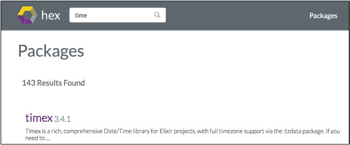

第 10 章 第 10 周：Elixir

`:app` 是从 `lib` 文件夹加载的文件的名称。虽然本章未使用，但你可以根据环境变量切换入口点。

你会再次注意到，Elixir 项目使用 Elixir 本身作为配置语言。保持一致性总是令人愉悦的。

** 依赖项**

正如你刚才所见，依赖项是在 `mix.exs` 文件的 `deps` 块中定义和列出的。你通常可以在 hexdocs 上找到你的依赖项。

[`hexdocs.pm/timex/getting-started.html`](https://hexdocs.pm/timex/getting-started.html)

例如，假设你想将 `timex` 库添加到你的项目中，这就是在你的项目中导入和使用它的方法。

为什么选择 `timex`？因为如果你在 hexdocs.pm 上搜索时间库，你会发现 `timex` 是第一个出现的。它也是下载量最多的，如图 10-2 所示。

***图 10-2. 永无止境的时间搜索***

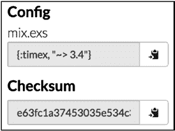

第 10 章 第 10 周：Elixir

导航到 `timex` 页面，你可以在右侧看到将其添加到 `mix.exs` 文件的方法（图 10-3）。

***图 10-3. timex 坐标***

你现在可以将 `mix` 的配置复制到 `mix.exs` 中，此时 `mix.exs` 文件的 `dep` 部分应如下所示：

  defp deps do

    [

      {:timex, "~> 3.0"}

    ]

  end

完成此操作后，你可以让 `mix` 为你检索、下载并准备第三方库，使用 `mix deps.get` 命令。

哦，顺便提一下，这里快速回顾一下与依赖项相关的 `mix` 命令列表。

$ mix help | grep deps

mix deps              # 列出依赖项及其状态

mix deps.clean        # 删除给定依赖项的文件

mix deps.compile      # 编译依赖项

mix deps.get          # 获取所有过期的依赖项

mix deps.tree         # 打印依赖树

mix deps.unlock       # 解锁给定的依赖项

第 10 章 第 10 周：Elixir

mix deps.update       # 更新给定的依赖项

mix hex.audit          # 显示当前项目已弃用的 Hex 依赖项

mix hex.outdated       # 显示当前项目过时的 Hex 依赖项

因此，一旦你运行了 `deps.get`，你就可以知道依赖项是否被你的项目正确识别。在下面的依赖树中查看 `timex`。

$ mix deps.tree

telegrambot

└── timex ~> 3.0 (Hex package)

    ├── combine ~> 0.10 (Hex package)

    ├── gettext ~> 0.10 (Hex package)

    └── tzdata ~> 0.1.8 or ~> 0.5 (Hex package)

        └── hackney ~> 1.0 (Hex package)

            ├── certifi 2.4.2 (Hex package)

            │   └── parse_trans ~>3.3 (Hex package)

            ├── idna 6.0.0 (Hex package)

            │   └── unicode_util_compat 0.4.1 (Hex package)

            ├── metrics 1.0.1 (Hex package)

            ├── mimerl 1.0.2 (Hex package)

            └── ssl_verify_fun 1.1.4 (Hex package)

你已经很久没有写代码了，现在一定有点兴奋了。让我们启动一个 Elixir REPL：

iex -S mix

第 10 章 第 10 周：Elixir

看看 `timex` 是否已正确加载。`now` 是 `timex` 中用于检索当前时区当前时间的函数，但在使用单独的模块之前，你必须先 `use` 它，如下所示：

$ iex -S mix

iex(1)> use Timex

Timex.Timezone

iex(2)> Timex.now

#DateTime<2018-09-24 02:31:42.450412Z>

现在，让我们看看代码在哪里编写。

** telegrambox.ex**

最后，在项目的文件列表中，你有 `telegrambot.ex`，你所有的自定义代码都放在这里。与 Ruby 以及 `mix.exs` 文件一样，很多工作都是通过 `defmodule` 和 `def` 完成的。每个 `def` 块定义一个函数。`mix new` 生成的默认文件如下所示，其中 `Telegrambot` 有一个函数。

defmodule Telegrambot do

  def hello do

    :world

  end

end

在 `iex` 会话中，你可以这样调用该函数：

iex(1)> Telegrambot.hello

:world

第 10 章 第 10 周：Elixir

结合我们之前学习 `Timex` 依赖项的知识，我们可以使用 `Timex` 和一个新的 `def` 块来提供时间。

defmodule Telegrambot do

  use Timex

  def hello do

    :world

  end

  def timexnow do

    IO.puts Timex.now

  end

end

在一个新的 `iex` 会话中：

iex(2)> Telegrambot.timexnow

2018-09-24 02:38:15.954175Z

:ok

** （回到）依赖项**

是的，我们回来了！你刚刚快速了解了如何向项目添加依赖项，但 Elixir/mix 还有一种绝妙的方式，可以直接从 Git 项目（以及其他源代码控制仓库）添加依赖项。

在 hex.pm 上搜索库非常容易（图 10-4）。

第 10 章 第 10 周：Elixir

***图 10-4. 使用 Hex 查找库***

是的，我们想要用于 Telegram 机器人的库就是找到的那个，所以请访问：

[`github.com/visciang/telegram`](https://github.com/visciang/telegram)

按照库网站的建议，你可以使用 Git 仓库地址和标签，直接将库添加到 `mix.exs` 文件中，如下所示：

{:telegram, git: "https://github.com/visciang/telegram.git", tag: "0.5.0"}

到目前为止，你的 `deps` 块应该如下所示：

defp deps do

    [

      {:timex, "~> 3.0"},

       {:telegram, git: "https://github.com/visciang/telegram.

git", tag: "0.5.0"}

    ]

  end

第 10 章 第 10 周：Elixir

再次使用 `mix deps.get` 来检索依赖项，它会透明地在本地为你检出 Telegram 项目。下面的 `mix deps.tree` 命令确认了该库的存在，你还可以在命令的输出中看到 Telegram 的 Git 仓库。

$ mix deps.tree

telegrambot

├── timex ~> 3.0 (Hex package)

│   ├── combine ~> 0.10 (Hex package)

│   ├── gettext ~> 0.10 (Hex package)

│   └── tzdata ~> 0.1.8 or ~> 0.5 (Hex package)

│       └── hackney ~> 1.0 (Hex package)

│           ├── certifi 2.4.2 (Hex package)

│           │   └── parse_trans ~>3.3 (Hex package)

│           ├── idna 6.0.0 (Hex package)

│           │   └── unicode_util_compat 0.4.1 (Hex package)

│           ├── metrics 1.0.1 (Hex package)

│           ├── mimerl 1.0.2 (Hex package)

│           └── ssl_verify_fun 1.1.4 (Hex package)

└── telegram (https://github.com/visciang/telegram.git)

    ├── tesla ~> 1.0 (Hex package)

    │   ├── hackney ~> 1.6 (Hex package)

    │   ├── jason >= 1.0.0 (Hex package)

    │   └── mime ~> 1.0 (Hex package)

    ├── hackney ~> 1.9 (Hex package)

    └── jason ~> 1.0 (Hex package)

Telegram 有时似乎也需要事先重新编译依赖项，这可以通过 `mix deps.compile` 完成（如果需要，也可以事先执行 `mix deps.clean`）。

第 10 章 第 10 周：Elixir

$ mix deps.compile

===> Compiling parse_trans

===> Compiling mimerl

===> Compiling metrics

===> Compiling unicode_util_compat

===> Compiling idna

===> Compiling ssl_verify_fun

===> Compiling certifi

===> Compiling hackney

现在，终于到了更有趣的部分：使用 `mix` 和 Telegram。

** 获取某些内容**

在本节中，我们将直接向 Telegram API 发送一些请求。为了进行身份验证，所有这些调用都将使用机器人令牌。

** GetMe**

让我们尝试使用我们的本地机器人向 Telegram API 发送一个简单的请求。你会记得下面的 `GetMe` 方法：

[`core.telegram.org/bots/api#getme`](https://core.telegram.org/bots/api#getme).

我们将从一个 `iex/mix` 会话发送请求。

$ iex -S mix

首先，我们从配置文件中加载令牌，所以请确保此时你已经将令牌正确插入到 `config/config.exs` 中。

iex(1)> token = Application.get_env(:telegrambot, :token)

"585672177:.."

第 10 章 第 10 周：Elixir

然后，我们可以使用令牌和 `getMe` 请求调用 Telegram API。

iex(2)> Telegram.Api.request(token, "getMe")

{:ok,

 %{

   "first_name" => "chapter01",

   "id" => 585672177,

   "is_bot" => true,

   "username" => "chapter01bot"

 }}

请求已成功发送，我们可以使用标准的 Telegram `User` 对象，其中包含机器人名称和机器人 ID。

** GetChat**

`getChat` Telegram 函数的文档位于 [`core.telegram.org/bots/api#getchat`](https://core.telegram.org/bots/api#getchat)。与无需参数即可调用的 `getMe` 函数不同，`getChat` 需要一个 `chat_id`。

使用 Telegram 库发送请求时附带的参数只需附加到请求调用中即可。

让我们在同一个 `iex` 会话中看看实际效果。

iex(8)> Telegram.Api.request(token, "getChat", chat_id: 121843071)

{:ok,

 %{

   "first_name" => "Nico",

   "id" =>1218430..,

   "last_name" => "Nico",

   "photo" => %{

     "big_file_id" =>

"AQADBQADQakxG38tQwcACAox1TIABLM4sAnsmf3pPM4AAgI",

第 10 章 第 10 周：Elixir

     "small_file_id" =>

"AQADBQADQakxG38tQwcACAox1TIABCSohuBN4Zh1Os4AAgI"

   },

   "type" => "private",

   "username" => "hellonico"

 }}

像往常一样，响应状态和结构会打印在会话的输出中。

** GetFile**

你可能已经注意到，在前面的代码片段中调用 `getChat` 时，用户资料中有一个文件 ID。让我们尝试使用 `getFile` 检索该文件。

`getFile` 函数的详细信息位于机器人 API 中：

[`core.telegram.org/bots/api#getfile`](https://core.telegram.org/bots/api#getfile)

因此，在同一个 `iex` 会话中，我们使用以下代码：

Telegram.Api.request(token, "getFile", file_id:

"AQADBQADQakxG38tQwcACAox1TIABLM4sAnsmf3pPM4AAgI")

{:ok,

 %{

   "file_id" =>

"AQADBQADQakxG38tQwcACAox1TIABLM4sAnsmf3pPM4AAgI",

   "file_path" => "profile_photos/file_10.jpg",

   "file_size" => 35814

 }}

啊，对了……Telegram API 总是返回一个文件路径，用于从其网站下载。

第 10 章 第 10 周：Elixir

** 使用 Elixir 的系统命令**

要下载上述文件路径，请记住之前使用的技巧，避免需要额外的第三方库。我们只需使用 `curl`，此时它应该已经安装在本地机器上。

在 Elixir 中，调用系统命令是通过 `System.cmd` 完成的。从 `file_path` 下载文件的 HTTP URL 使用以下规则构建：

[`api.telegram.org/file/bot<token>/<file_path>`](https://api.telegram.org/file/bot)

其中 `file_path` 的形式为：`profile_photos/file_10.jpg`。这样就得到了完整的代码。

{:ok, res} = Telegram.Api.request(token, "getChat", chat_id: 121843071)

fileId = res["photo"]["big_file_id"]

{:ok, res2} = Telegram.Api.request(token, "getFile", file_id:

"#{fileId}")

System.cmd("curl",

["-O", "https://api.telegram.org/file/bot#{token}/#{res2["file_

path"]}"])

然后显示了作者的个人资料图片（图 10-5）。

***图 10-5. 沙滩球，不是 OS X 的那个***

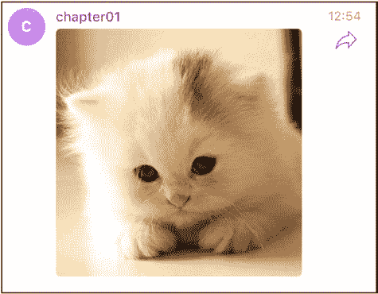

第 10 章 第 10 周：Elixir

** SendPhoto**

有时候，重要的不是你能得到什么，而是你能给予什么。遵循相同的模式，你可以使用 `sendPhoto` 发送图片，其构造完全相同。

token = Application.get_env(:telegrambot, :token)

chat_id = 121843071

photo = "cat.jpg"

Telegram.Api.request(token, "sendPhoto", chat_id: chat_id, photo: {:file, photo})

只要你已将 `cat.jpg` 复制到你的项目文件夹中，Telegram 聊天中就会显示常见的猫咪图片（图 10-6）。

***图 10-6. 这不是 Marcel，但这是一只猫***

你可能已经意识到，所有这些都可以直接从 Visual Studio Code 中运行，使用本章开头定义的用于运行 .exs 文件的任务。试试看（图 10-7）。

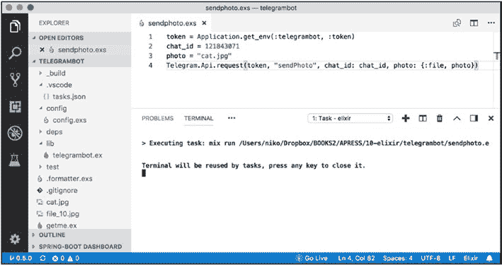

第 10 章 第 10 周：Elixir

***图 10-7. 直接从你的编辑器运行……***

** Telegram 机器人**

本章的篇幅已经超出了最佳页数，所以我将快速介绍一下如何创建和运行一个机器人，以及如何为这个新机器人实现几个命令。

** 机器人 1：无所不包**

第一个机器人会将接收到的更新的完整数据结构发送回聊天。看看在调用 `use` 之后，令牌是如何传递给 `Telegram.Bot` 库的？

defmodule Bot1 do

  use Telegram.Bot,

    token: Application.get_env(:telegrambot, :token),

    username: "chapter01bot",

    purge: true

第 10 章 第 10 周：Elixir

  message do

    request(

      "sendMessage",

      chat_id: update["chat"]["id"],

      text: "嘿！你发给我一条消息：#{inspect(update)}"

    )

  end

end

{:ok, _} = Bot1.start_link()

Process.sleep(:infinity)

最后两行在一个单独的线程中启动机器人，并告诉主线程永远休眠。还要注意，对 `sendMessage` 的请求是上一节所做操作的重复。

** 机器人 2：斐波那契**

我们的第二个机器人将实现一个命令，可以为你计算斐波那契数并将结果发送回聊天。使用 Telegram 库的命令只需使用 `command` 定义即可。命令名称是 `command` 的第一个参数，后面跟着可能的参数。

`command` 块本身可以访问来自 Telegram 的更新对象。尽管你不太容易看到，但 Elixir 在底层具有函数式编程的基因，大多数调用都是使用 `apply` 完成的。

这一点在你必须使用 `Enum.at` 来获取列表中特定元素的索引时尤为明显，这里是第一个元素，所以索引为 0。

    command "fib", args do

        {intVal, ""} = Integer.parse(Enum.at(args,0))

         request("sendMessage", chat_id: update["chat"]["id"], text: "Fib[#{intVal}] = #{Fib.fib(intVal)}")

    end

第 10 章 第 10 周：Elixir

这里，`Fib` 在一个单独的 `Fib` 模块中定义，如下面的完整代码所示，其中添加了一个简单的递归斐波那契实现。

defmodule Fib do

    def fib(0) do 0 end

    def fib(1) do 1 end

    def fib(n) do fib(n-1) + fib(n-2) end

end

defmodule Bot2 do

  use Telegram.Bot,

    token: Application.get_env(:telegrambot, :token),

    username: "chapter01bot",

    purge: true

    command "fib", args do

        {intVal, ""} = Integer.parse(Enum.at(args,0))

         request("sendMessage", chat_id: update["chat"]["id"], text: "Fib[#{intVal}] = #{Fib.fib(intVal)}")

    end

    any do

       IO.puts "not found"

    end

end

{:ok, _} = Bot2.start_link()

Process.sleep(:infinity)

另外，避免在第二个机器人的底部使用 `any` 函数来处理所有消息。

最后，你可以在你的新机器人中定义 Telegram API 支持的所有其他消息，为了方便起见，这里直接从 Telegram 库中重新列出了可以放在机器人中的可能块列表。

第 10 章 第 10 周：Elixir

  edited_message do

    # 处理代码

  end

  channel_post do

    # 处理代码

  end

  edited_channel_post do

    # 处理代码

  end

  inline_query _query do

    # 处理代码

  end

  chosen_inline_result _query do

    # 处理代码

  end

  callback_query do

    # 处理代码

  end

  shipping_query do

    # 处理代码

  end

  pre_checkout_query do

    # 处理代码

  end

此外，`api.ex` 文件中的代码还有一些与键盘和内联查询相关的代码结构示例。

[`github.com/visciang/telegram/blob/master/lib/api.ex`](https://github.com/visciang/telegram/blob/master/lib/api.ex)

**第 11 章**

**第 11 周：Node.js**

*“JavaScript 的优势在于你可以做任何事情。*

*其劣势在于你确实会去做。”*

—Reg Braithwaite

为了内容的完整性，本书也介绍了 Node.js 和 Telegraf，这是从 Node.js 处理 Telegram 的库。使用 Telegraf，Node.js 可能拥有与 Telegram 交互的最简单的库之一的特权。

在本章中，我将主要关注如何在 RunKit.com 上运行 Telegram Bot。RunKit 是一项云服务，允许你在云端运行一个 Node.js 实例，而无需在本地安装任何东西，从而将编写和部署 Telegram 机器人所需的时间缩短到几分钟。

在云端运行也使我们能够为 Telegram 设置必要的 webhook。基本上，webhook 是对你迄今为止看到的 Telegram 机器人轮询方法的替代，它使用一个 URL，Telegram API 会在有新消息时调用该 URL，从而避免不必要的轮询流量。为了提供一个能够响应 Telegram 的 POST 请求的最小运行服务器，我们将使用 Koa 库（ExpressJS 的替代品）来设置与 Telegraf 的集成。

兴奋吗？让我们踏上 Node.js 之路。

© Nicolas Modrzyk 2019

N. Modrzyk, *构建 Telegram 机器人*, `doi.org/10.1007/978-1-4842-4197-4_11`

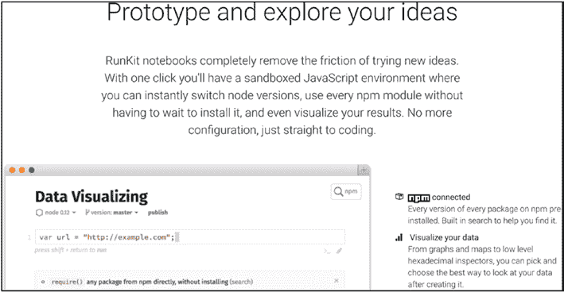

第 11 章 第 11 周：Node.js

** 认识 RunKit**

在本节中，你将了解如何创建 RunKit 帐户、运行第一个 Node.js 程序，然后编写并发布一个基于 Koa 的简单服务。

RunKit 最初是一个浏览器中的 Node.js 游乐场。你可以访问 RunKit 主页 [`runkit.com`](https://runkit.com)（图 11-1）。

***图 11-1. RunKit 主页***

RunKit 用于编写测试代码、获取和显示数据、共享代码以及直接在云端运行服务器代码。

** 创建帐户**

要创建帐户，你可以在 RunKit.com 上注册，使用你的 GitHub 帐户或标准的用户名密码组合（图 11-2）。

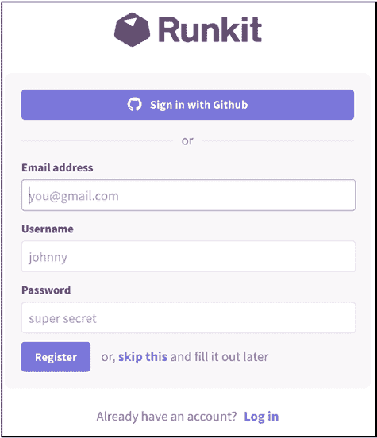

第 11 章 第 11 周：Node.js

***图 11-2. 创建你的 RunKit 帐户***

登录后，你会看到一个简单的界面，左侧有一个菜单，主要用于创建新的游乐场，页面中央是你已经（将要）创建的游乐场列表（图 11-3）。

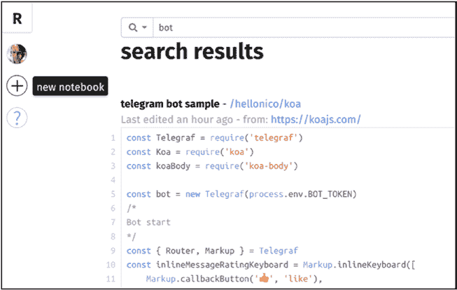

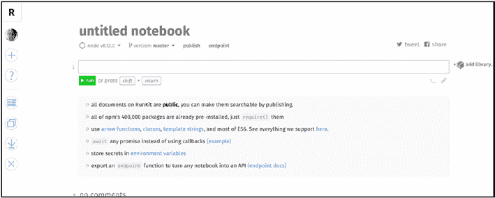

第 11 章 第 11 周：Node.js

***图 11-3. RunKit 个人页面***

如果你按下左侧的 + 按钮，你会被引导到一个空的游乐场页面（图 11-4）。

***图 11-4. RunKit 空游乐场页面***

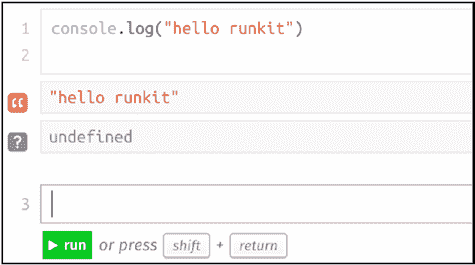

第 11 章 第 11 周：Node.js

** RunKit 上的第一段代码**

毫不意外，你可以直接输入任何你想写的 JavaScript 代码。那么，让我们从打个招呼开始，如图 11-5 所示。

***图 11-5. 用 RunKit 说“hello”***

执行可以通过点击运行按钮或按 shift+return 键完成。执行的每一行结果都会显示在下方。

假设你想快速计算一些斐波那契数……你可以自己实现，一个可能的实现如下所示。

function myfibonacci(num) {

  if (num <= 1) return 1;

  return myfibonacci(num - 1) + myfibonacci(num - 2);

}

console.log(myfibonacci(39));

或者，你也可以通过 RunKit 引入一个 Node.js 库（你可以在 [`npm.runkit.com`](https://npm.runkit.com) 查看）。

例如，你可以简单地引入一个库，比如 `fibonacci-fast`，直接从游乐场计算这些数字。

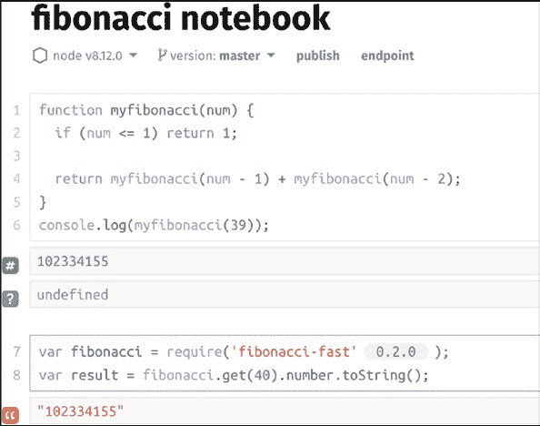

第 11 章 第 11 周：Node.js

var fibonacci = require('fibonacci-fast');

var result = fibonacci.get(39    ).number.toString();

console.log(result);

游乐场会使该库对你的笔记本可用，而无需你安装或下载任何东西。无论是否使用库，效果都一样，如图 11-6 所示。

***图 11-6. 自己编写或引入库***

注意，导入到笔记本中的库版本会显示在 `require` 语句旁边。

** 某种 Koa 框架**

Koa 是 Node.js 的下一代 Web 框架。它建立在 Express JS 多年经验的基础上，更易于学习和维护。Koa 的主页可以在 [`koajs.com/#application`](https://koajs.com/#application) 找到。

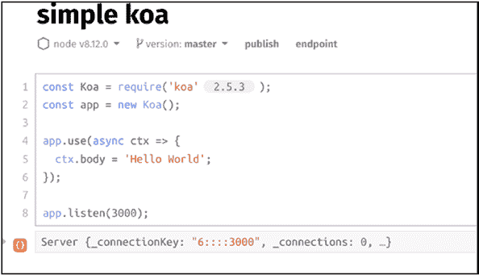

第 11 章 第 11 周：Node.js

根据你对 RunKit 游乐场的了解，你可能已经感觉到你可以引入 Koa 库并启动一个服务器。

下面是从 Koa 示例中摘取的一个简短代码片段：

const Koa = require('koa');

const app = new Koa();

app.use(async ctx => {

  ctx.body = 'Hello World';

});

app.listen(3000);

创建一个简单的 Koa 应用程序有四个主要步骤。

• 引入 `koa`

• 创建一个新的 Koa 应用

• 创建一个异步处理器

• 让应用开始监听（在一个端口上）

如果你在一个新的笔记本中执行上述代码片段，你可以直接从浏览器实例化一个服务器（图 11-7）。

***图 11-7. 在 RunKit 上运行服务器***

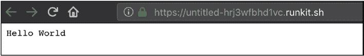

第 11 章 第 11 周：Node.js

是的，这个服务器已经在监听请求了。所以，如果你点击笔记本中可用的端点，你将打开一个页面，其中包含一个分配给 Koa 应用程序的临时 URL，预期的 Hello World 消息会再次显示在这里（图 11-8）。

***图 11-8. 在云端运行的 Koa***

** 发布一些 Koa 代码**

发布到临时 URL 是可以的，但要与 Telegram Bot 一起工作，你必须有一个相对永久且公开的 URL。这可以通过在 RunKit 中使用“发布”链接来实现。点击该链接会弹出一个对话框，要求你为应用程序输入一个语义化的版本号（图 11-9）。

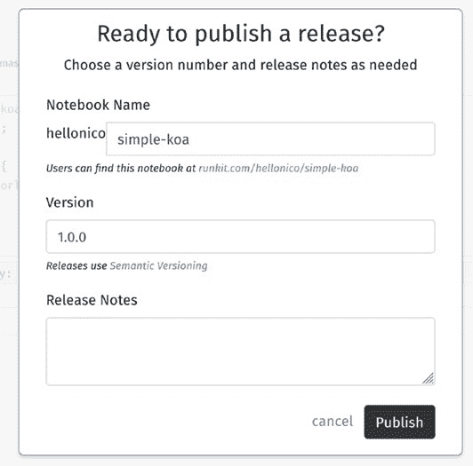

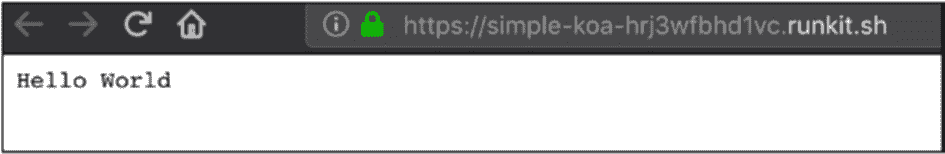

第 11 章 第 11 周：Node.js

***图 11-9. 准备好发布了吗，Koa？***

现在，Koa 应用程序可以在一个易于记忆的位置访问，格式如下：

[`runkit.io/hellonico/simple-koa/branches/master`](https://runkit.io/hellonico/simple-koa/branches/master)

你可以从浏览器可靠地访问它。请注意，你实际上会被重定向到 RunKit 内部映射的 URL（见图 11-10）。

***图 11-10. 已发布！***

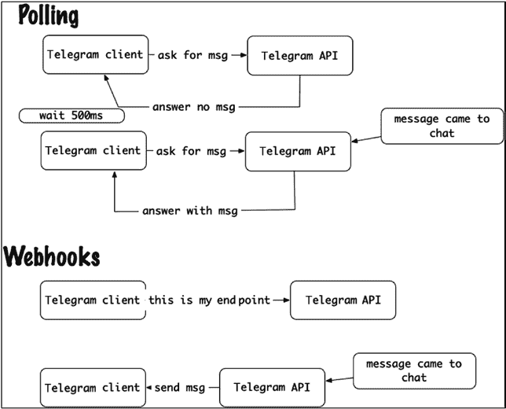

第 11 章 第 11 周：Node.js

另外，请注意 URL 是通过 HTTPS 协议的，这一点非常重要，因为 Telegram 不接受纯 HTTP 端点。

从这里开始，你应该多练习一下 Koa 和 RunKit，一旦你准备好了，让我们看看如何使用 RunKit、Koa 和神秘的 Telegram webhook 编写第一个 Telegram 机器人。

** 使用 Webhooks 的 Telegram 机器人**

那么，首先，webhooks……它们是什么？Webhooks 的工作方向与轮询相反。轮询是你的客户端机器人定期向 Telegram 服务器询问是否有新消息到达，而使用 webhooks，你要求 Telegram 服务器在有新消息发送到聊天室（你的机器人应该知道）时，向你发送一条更新消息。

流程总结在图 11-11 中。

***图 11-11. 轮询 vs. webhooks***

第 11 章 第 11 周：Node.js

知道了这一点，我们只需要知道是否有一个 Telegram Bot API 方法可以告知你的应用程序端点——这里有一个：

[`core.telegram.org/bots/api#setwebhook`](https://core.telegram.org/bots/api#setwebhook)

在下面的代码片段中，你可以看到如何使用 `setWebhook` 函数将 URL 公开给机器人 API。

const Telegraf = require('telegraf')

const Koa = require('koa')

const koaBody = require('koa-body')

const bot = new Telegraf(process.env.BOT_TOKEN)

bot.on('text', ({ reply }) => reply('这里的时间是 ::'+ new

Date()))

bot.telegram.setWebhook('https://runkit.io/hellonico/koa-bot/

branches/master')

const app = new Koa()

app.use(koaBody())

app.use((ctx, next) => ctx.method === 'POST' || ctx.url === '/

secret-path'

  ? bot.handleUpdate(ctx.request.body, ctx.response)

  : next()

)

app.listen(3000)

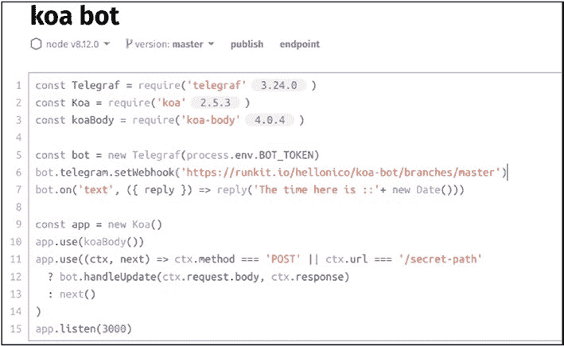

第 11 章 第 11 周：Node.js

它将在 Koa 中显示，如图 11-12 所示。

***图 11-12. RunKit 上的第一个机器人***

现在，我可以解释代码中缺失的两个部分。第一个是我们将 HTTP POST 请求与 Telegraf 机器人粘合在一起的地方，使用 `handleUpdate`，它做两件事：

• 将 `ctx.request.body` 映射到机器人的输入请求

• 将 `ctx.response` 映射到机器人的输出响应

app.use(koaBody())

app.use((ctx, next) => ctx.method === 'POST' || ctx.url

=== '/secret-path'

  ? bot.handleUpdate(ctx.request.body, ctx.response)

  : next()

)

第 11 章 第 11 周：Node.js

缺失的第二个部分与本书中介绍的其他 API 类似。

bot.on('text', ({ reply }) => reply('这里的时间是 ::'+ new

Date()))

每当有文本到达机器人时，我们有一个回调函数，带有一个解构后的 `reply` 对象（由 Telegraf 准备），我们可以用它来向聊天发送消息。在运行这个机器人之前，你会注意到代码需要一个从启动 Node.js 进程的环境中检索到的令牌。

const bot = new Telegraf(process.env.BOT_TOKEN)

RunKit 允许你通过为你的笔记本设置环境变量来做到这一点（是的！）。

要访问设置页面，请导航到你自己的 RunKit 设置页面（图 11-13）。

***图 11-13. 设置页面***

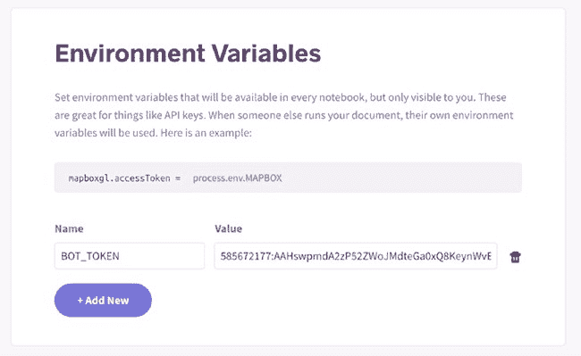

第 11 章 第 11 周：Node.js

在该页面上，有一个环境变量部分，你可以在其中设置所需的 `BOT_TOKEN` 变量来实例化 Telegraf 机器人（图 11-14）。

***图 11-14. 使用你自己的令牌设置 `BOT_TOKEN` 变量***

现在，你可以一起启动 RunKit/Koa/Telegram 机器人，并像往常一样开始与你的机器人聊天（图 11-15）。

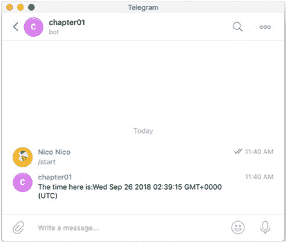

第 11 章 第 11 周：Node.js

***图 11-15. Telegraf，与 RunKit 上的 Koa 机器人一起使用***

** 更多关于 Telegraf 库的内容**

我还没有详细回顾 Telegraf 库。提醒一下，它的 GitHub URL 如下：

[`github.com/telegraf/telegraf/`](https://github.com/telegraf/telegraf/)

你可以在其 examples 文件夹中找到关于游戏和内联键盘的大量示例。

[`github.com/telegraf/telegraf/tree/develop/docs/examples`](https://github.com/telegraf/telegraf/tree/develop/docs/examples)

** 图片到聊天的示例**

图片命令示例是一个即时自我满足的胜利。你可以直接在刚刚定义的 RunKit 机器人中尝试。

const bot = new Telegraf(process.env.BOT_TOKEN)

bot.command('image',

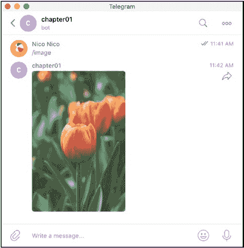

第 11 章 第 11 周：Node.js

(ctx) =>

ctx.replyWithPhoto({ url: 'https://picsum.

photos/200/300/?random' }))

一旦命令部署完毕，你可以向机器人发送 `/image` 命令，并从 Picsum 网站获取一张随机图片。还要注意 `replyWithPhoto` 是如何与 URL 参数一起使用的，以向聊天发送图片（图 11-16）。

***图 11-16. 随机图片***

** RegExp、内联键盘和嵌入式表情符号**

Telegraf 有一个很酷的内置功能，允许你根据 RegExp 匹配消息，并根据这些匹配执行操作。这是通过在 `.hears`（用于发送到聊天群组的消息）或 `.on`（直接发送给机器人的消息）回调中使用正则表达式来完成的。

第 11 章 第 11 周：Node.js

在下面的例子中，在群聊消息中搜索“like”，并显示一个内联键盘。

const { Markup } = Telegraf

const inlineMessageRatingKeyboard = Markup.inlineKeyboard([

    Markup.callbackButton('<', 'like'),

    Markup.callbackButton('=', 'dislike')

]).extra()

bot.hears(/like (.+)/, (ctx) => ctx.telegram.sendMessage(

    ctx.from.id,

    '喜欢?',

    inlineMessageRatingKeyboard)

)

回调本身的动作可以在之后定义。这里，我们使用 API 函数 `editMessageText` 编辑最后一条消息，即带有内联键盘的那条。

bot.action('like', (ctx) => ctx.editMessageText('•• 太棒了! ••'))

bot.action('dislike', (ctx) => ctx.editMessageText('好吧'))

当代码运行时，每当机器人发现以“like”开头的消息时，它会通知你，如图 11-17 所示。

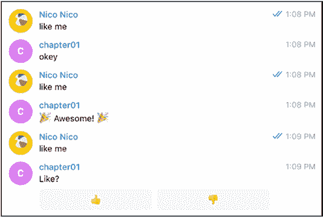

第 11 章 第 11 周：Node.js

***图 11-17. 喜欢我还是不喜欢？***

请注意，你也可以通过在回调中使用 `match` 来使用匹配的模式。

bot.hears(/reverse (.+)/,

({ match, reply }) => reply(match[1].split(").reverse().

join(")))

最后，让我们看看如何在本地或我们自己的服务器上运行这个机器人。

** 在本地运行 Node.js**

在 RunKit 中运行了所有示例之后，你可能确实希望将代码托管在 RunKit 之外的其他地方，例如你自己的机器上。为此，我们需要安装 Node.js。

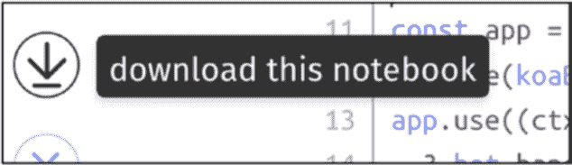

第 11 章 第 11 周：Node.js

** 设置 Node.js**

安装 Node.js 非常简单——可以从主页获取必要的包，

[`nodejs.org/en/`](https://nodejs.org/en/)

或者从你常用的包管理器安装。

另外，虽然使用 NPM 已经足够，但如今，Node.js 的 yarn 构建工具非常流行，你可以从以下地址找到/安装它：

[`yarnpkg.com/en/docs/install#mac-stable`](https://yarnpkg.com/en/docs/install#mac-stable)

安装完成后，你可以进行一些版本检查。

$ node -v

v10.4.0

$ yarn -v

1.7.0

$ npm -v

6.2.0

工具设置好后，你可以使用“下载此笔记本”按钮下载你在 RunKit 中处理的笔记本（图 11-18）。

***图 11-18. 将 RunKit 笔记本下载到你的机器上***

243

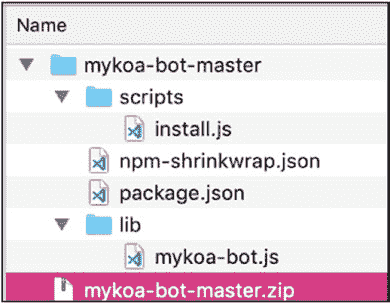

第 11 章 第 11 周：Node.js

解压归档文件的内容后，你会看到类似于图 11-19 的内容。

***图 11-19. 来自 RunKit 的 `mykoa-bot` zip 文件的内容***

** 使用本地隧道**

要运行这个机器人，你可以使用轮询，但让我们尝试一些更具挑战性的方法。每当你启动 Koa 应用程序时，你的应用程序会将监听主机绑定到 `localhost`，并且（通常默认情况下）绑定到端口 3000。

如果有什么东西能让这个精彩的 Koa 站点立即可供全世界访问，那不是很好吗？这就是 LocalTunnel 的用武之地。LocalTunnel 为你创建一个 URL，并将发送到该 URL 的所有请求重定向到你本地正在监听的监听器。

使用 NPM 安装如下：

npm install -g localtunnel

然后使用以下命令启动它：

lt --port 3000

第 11 章 第 11 周：Node.js

它会给你一个临时的类似 Heroku 的 URL，例如：

[`short-cougar-89.localtunnel.me`](https://short-cougar-89.localtunnel.me)

然后你可以告诉 Koa 应用将其注册为 webhook。

const Telegraf = require('telegraf')

const Koa = require('koa')

const koaBody = require('koa-body')

const bot = new Telegraf(process.env.BOT_TOKEN)

bot.command('image', (ctx) => ctx.replyWithPhoto({ url:

'https://picsum.photos/200/300/?random' }))

bot.telegram.setWebhook('https://short-cougar-89.localtunnel.me')

const app = new Koa()

app.use(koaBody())

app.use((ctx, next) => ctx.method === 'POST' || ctx.url === '/

secret-path'

  ? bot.handleUpdate(ctx.request.body, ctx.response)

  : next()

)

app.listen(3000)

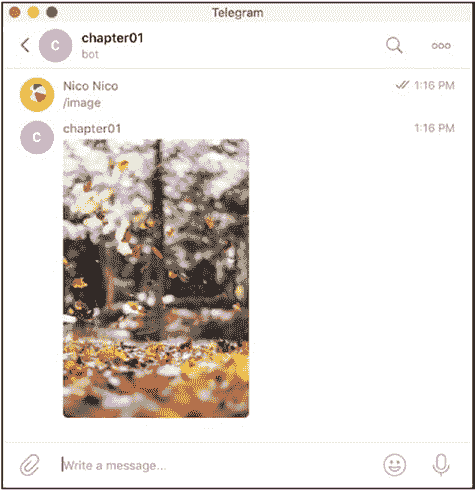

第 11 章 第 11 周：Node.js

在图 11-20 中，我们又回到了随机图片！

***图 11-20. 通过 localtunnel 运行，使用 webhook 设置的 Telegram 机器人返回的随机图片***

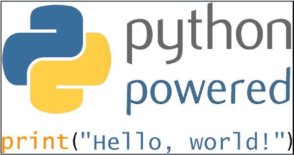

**第 12 章**

**第 12 周：Python**

*总是看到生活光明的一面。*

—蒙提·派森

Python 正朝着成为 21 世纪最广泛使用的编程语言的方向发展。爱好者喜欢它，分析师喜欢它，甚至刚开始学习编程的孩子现在也使用 Python。

凭借其简单的语法和数不胜数的可用库，选择 Python 不会错。最近，许多这些库重新聚焦于机器学习、人工智能、数据科学……以至于 Python 这门语言本身几乎不需要过多介绍。话虽如此，这里还是有一个介绍（图 12-1）。

***图 12-1. 你好，Python***

© Nicolas Modrzyk 2019

N. Modrzyk, *构建 Telegram 机器人*, `doi.org/10.1007/978-1-4842-4197-4_12`

第 12 章 第 12 周：Python

虽然我也喜欢 Python，但很多代码虽然容易编写，却难以维护。所以，我通常会切换到其他语言，但很难找到能与 Python 可用的库数量相匹配的语言——OpenCV、TensorFlow……所有这些都带有顶级的 Python 封装。

** 安装**

3.6。这是什么？3.6 是你想要安装的 Python 版本。是的，最新版本是 3.7，但在撰写本文时，TensorFlow 库不支持 3.7 版本，所以你最好使用 3.6。如果你真的不关心 TensorFlow 示例（但我希望你在乎），你可以坚持使用 3.7。

Python 本身有时会预装并且已经可用。如果没有，或者版本不匹配，或者你是 Windows 爱好者，你可以从以下 Python 下载页面下载安装程序：

[`www.python.org/downloads/windows/`](https://www.python.org/downloads/windows/)

Python 包管理器 `pip` 也需要安装。你可以按照以下步骤进行安装。

https://pip.pypa.io/en/stable/installing/

或者，简而言之，

