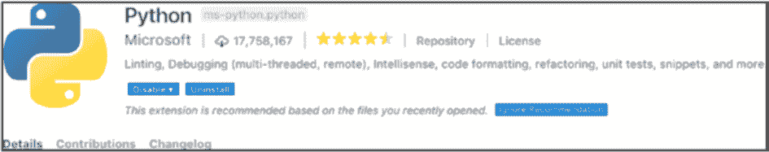
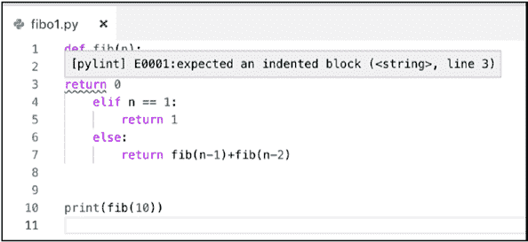
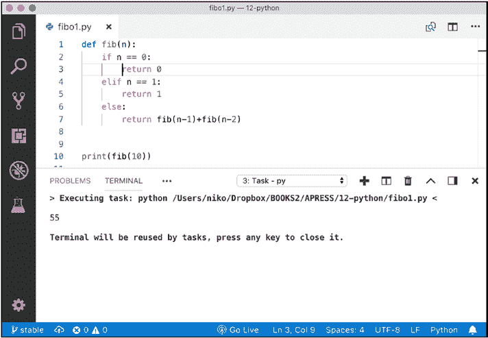
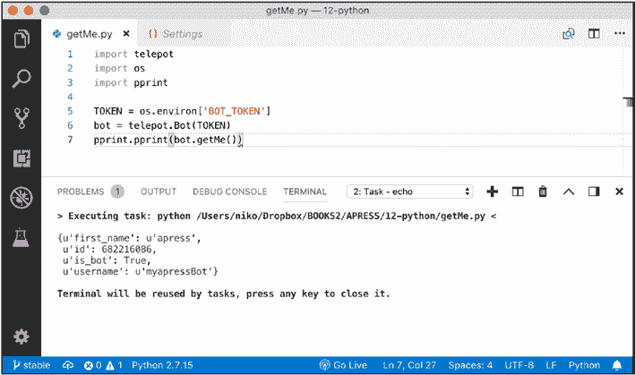

# 使用 Python 可执行文件运行它

python get-pip.py

另一种可选但推荐的方法是为 Python 安装 `mode`，并使用名为 `pyenv` 的工具。`pyenv` 是一个小工具，允许你在不同的 Python 树之间切换，这意味着你可以在不同版本的 Python 及其库之间切换。

[`github.com/pyenv/pyenv#installation`](https://github.com/pyenv/pyenv#installation)

第 12 章   第 12 周：Python

安装 `pyenv` 后，你现在可以方便地在不同版本的 Python 之间切换。要查看已安装的版本，请使用 `pyenv versions`。

$ pyenv versions

system

* 3.6.0 (set by /Users/niko/.pyenv/version)

3.7.0

anaconda3-5.0.1

如上述代码片段所示，我们支持 Python 3.6 版本和 `pip` 18.0 版本。是的，3.6，因为再次强调，在撰写本文时，TensorFlow 包尚不支持 Python 3.7。

$ pip --version

pip 18.0 from /Users/niko/.pyenv/versions/3.7.0/lib/python3.7/

site-packages/pip (python 3.7)

但 `python2` 也完全可用，只是在本节范围内未经充分测试。

在即将编写的 Python 脚本的新文件夹中，我们可以设置 Visual Studio Code 可用的 `tasks.json`。

{

"version": "2.0.0",

"tasks": [

{

"label": "echo",

"type": "shell",

"command": "python",

"args": [

"${file}"

],

第 12 章   第 12 周：Python

"group": {

"kind": "build",

"isDefault": true

}

}

]

}

在 Visual Studio Code 中用于处理 Python 的插件如图 12-2 所示。

***图 12-2.  **Visual Studio Code 的 Python 插件*

设置到此为止。让我们继续学习第一个 Python 程序。

**  几个 Python 程序**

你可能已经猜到了，所以不必过于抗拒。

让我们用 Python 处理斐波那契数列。很棒的是，我们可以逐个示例地学习（新）语言特性。

**  斐波那契 1**

第一个实现采用递归方式。我们使用 `def` 定义一个名为 `fib` 的函数，该函数会调用自身。

第 12 章   第 12 周：Python

请注意，任何 Python 程序的缩进都很重要。因此，`if`、`elif` 和 `else` 都比上一级缩进多一个制表符，而 `return` 语句则比这些多一个制表符。如果不遵守缩进规则，Visual Studio Code 的 linter 或语法检查器会显示错误（图 12-3）。

***图 12-3.  **Python 对缩进要求非常严格*

记住这一点，下面是第一个代码清单。首先定义函数，然后在函数定义之后，紧接着是 `print` 语句，正好两行（！）。

def fib(n):

if n == 0:

return 0

elif n == 1:

return 1

else:

return fib(n-1)+fib(n-2)

print(fib(10))

如果你使用 Visual Studio Code 的常规 Command/Ctrl+Shift+B 构建任务运行此文件，你将在控制台中再次看到程序的输出（图 12-4）。

第 12 章   第 12 周：Python

***图 12-4.  **在 Visual Studio Code 中执行 Python 代码* 让我们继续第二个实现。

**  斐波那契 2**

第二个实现使用一个内部且简单的缓存来计算数字。这次，我们在 `def` 行之后立即为 `fastFib` 函数添加一些文档说明。

然后我们添加一个新参数 `memo`，它将作为缓存。我们为 `memo` 添加一个默认值，即斐波那契数列的起始值，其中 `fib[0]=1` 且 `fib[1]=1`。

接下来，我们在递归调用 `fastFib` 时传递 `memo`。

def fastFib(n, memo={0:1, 1:1}):

"""记忆化递归函数，返回一个斐波那契数"""

print('>', n, memo)

第 12 章   第 12 周：Python

if not n in memo:

memo[n] = fastFib(n-1, memo) + fastFib(n-2, memo)

return memo[n]

print(fastFib(5))

由于我们添加了 `print` 语句，当你执行程序时，可以看到缓存被逐步填充。

> 5 {0: 1, 1: 1}

> 4 {0: 1, 1: 1}

> 3 {0: 1, 1: 1}

> 2 {0: 1, 1: 1}

> 1 {0: 1, 1: 1}

> 0 {0: 1, 1: 1}

> 1 {0: 1, 1: 1, 2: 2}

> 2 {0: 1, 1: 1, 2: 2, 3: 3}

> 3 {0: 1, 1: 1, 2: 2, 3: 3, 4: 5}

**斐波那契数列 3**

接下来的这个实现很有趣，值得在此写下来。我们同样使用缓存——这次是全局缓存——以避免传递它，并且我们只是将元素追加到不断增长的数组中。这也展示了如何使用带范围的 `for` 循环，以及最后如何使用 `join` 来连接数组中的所有值。

x = [1, 1] # 这是一个数组

for i in range(2, 40):

x.append(x[-1] + x[-2])

print(', '.join(str(y) for y in x))

第 12 章   第 12 周：Python

**斐波那契数列 4**

这个新实现展示了元组与 `zip` 函数的用法。`zip` 函数返回一个元组列表 `zip(fn1(), fn2())`，当 `fn1` 或 `fn2` 中的任何一个停止返回值时，该列表即结束。`range` 返回一个从 0 到 9（含）的数字列表。这并不太重要，但循环中的 `print` 语句会格式化变量，以通过填充保持缩进。

难点在于（双关语）关键字 `yield` 的用法。

虽然 `fib()` 看起来像一个函数，但它实际上是一个生成器。

什么是生成器？`range(n)` 就是一个生成器。它返回从 0 到 n 的值。

生成器的工作方式类似于遍历列表。

要实现一个永无止境的列表，即一个常量值的生成器，你可以使用以下定义，你可以将 `constant` 想象为 (1, 1, 1, 1 …)。

def constant():

a = 1

while True:

yield a

`range()` 本身可以简单地重新实现，如下面的代码片段所示，我们从值 `0` 开始，返回一个包含 `n` 个元素的列表，即递增后的 `a` 的列表。

def myrange(n):

a = 0

while a < n:

a=a+1

yield a

因此，`yield` 类似于返回一个元素列表。

那么，接下来是使用 `yield` 实现的 `fib`。请注意，该列表是永无止境的，因此循环也是永无止境的。

第 12 章   第 12 周：Python

def fib():

a, b = 0, 1

while True:

a, b = b, a + b

yield a

for index, fibonacci_number in zip(range(20), fib()):

print('{i:3}: {f:3}'.format(i=index, f=fibonacci_number))

执行结果如下：

0:   1

1:   1

2:   2

...

16: 1597

17: 2584

18: 4181

19: 6765

**斐波那契数列 5**

本章中最后一个斐波那契数列示例使用了基于平方根的实现。`sqrt` 是用于计算平方根的函数，位于 `Math` 包中。因此，我们使用 `import` 使其在我们的程序中可用。

from math import sqrt

def F(n):

return ((1+sqrt(5))**n-(1-sqrt(5))**n)/(2**n*sqrt(5))

print(F(100))

好了，斐波那契数列的例子就到这里。我们已经完成了基础知识的学习，接下来让我们用 Python 编写一些 Telegram 代码。

第 12 章   第 12 周：Python

**第一个 Telegram 程序（使用 Python）**

要开始使用 Telegram，我们将使用 `telepot`，这是一个用于 Telegram API 的 Python 封装器，位于 [`github.com/nickoala/telepot`](https://github.com/nickoala/telepot)。

要为 Python 安装库，我们使用 `pip`，即 Python 包安装器。

要安装任何包，请使用

pip install <包名>

因此，要安装 `telepot`，我们将使用 `telepot` 包名运行 `pip install`。

$ pip install telepot

Collecting telepot

...

Installing collected packages: telepot

你现在已成功安装了 telepot-12.7。你之前已经见过它，在 Visual Studio Code 中，用于将令牌传递给由构建任务启动的进程。你可以在 Visual Studio Code 的集成终端中定义令牌的环境变量。

这可以通过设置 `terminal.integrated.env.[你的操作系统]` 键并将以下内容添加到你的用户设置中来完成：

"terminal.integrated.env.osx": {

"BOT_TOKEN":

"682216086:AAGeNyQ4jf9sAKuOvWJzKs45i4ui1VgWulk"

}

有关此内容及集成终端设置的更多信息，请参阅以下 Visual Studio Code 文档：

[`code.visualstudio.com/docs/editor/integrated-terminal`](https://code.visualstudio.com/docs/editor/integrated-terminal)

第 12 章   第 12 周：Python

第一个示例将使用 `telepot`，通过调用 Telegram 的 `getMe` 方法来检索机器人的信息。同样，我们将从 Visual Studio Code 运行所有内容，如图 12-5 所示。

***图 12-5.**  Visual Studio Code 中的 Python 机器人*

好了，要调用 Telegram API，我们需要：

•  从环境变量中检索用于机器人身份验证的令牌
•  使用该令牌创建 Telegram 封装器 `telebot` 的实例
•  调用 `getMe`，以使用新实例化的机器人（通过该库）

请注意，对于这第一个程序，我们实际上不需要设置轮询或 webhook。Python 中的环境变量可以使用 `os` 模块检索。在 `os` 模块中，有一个名为 `environ` 的全局数组，其中包含传递给进程的所有变量。我们刚刚看到了如何定义 `BOT_TOKEN` 变量，所以这里没什么好惊讶的。

第 12 章   第 12 周：Python

然后可以使用 `telepot.Bot` 和令牌来实例化一个机器人对象。

最后，我们可以在此处调用 API 的任何方法，并且由于我们检索到的返回值是一个 Python 数据结构，我们使用 `pprint` 模块中的 `pprint` 将其作为格式化数据显示在控制台输出上。这给出了第一个代码片段，如下所示：

import telepot

import os

import pprint

TOKEN = os.environ['BOT_TOKEN']

bot = telepot.Bot(TOKEN)

pprint.pprint(bot.getMe())

