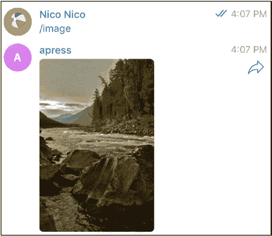
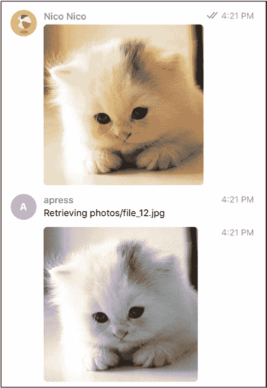
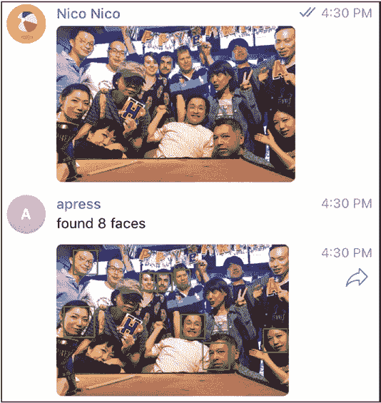
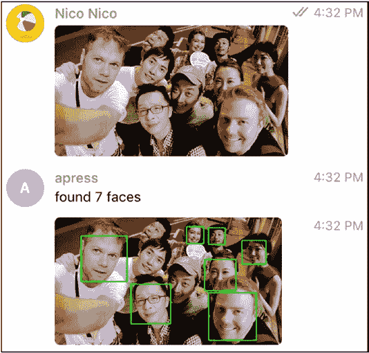
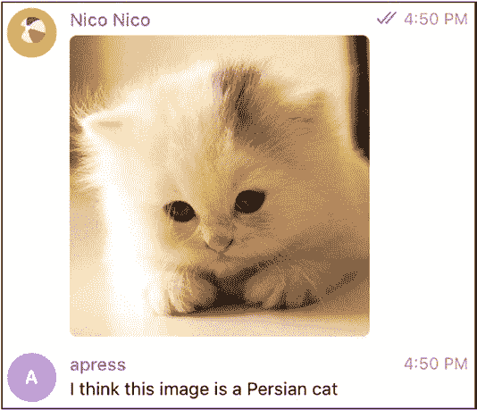
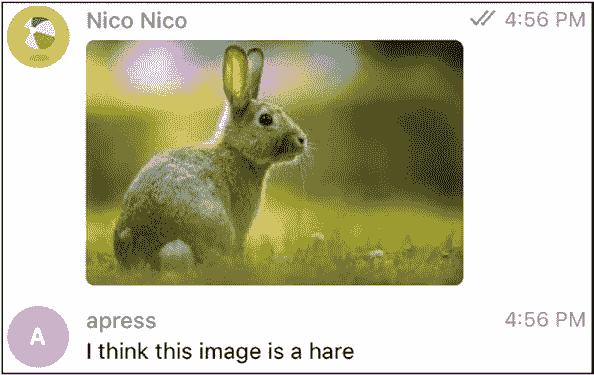
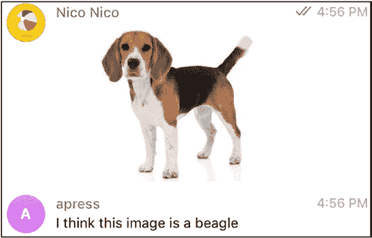

# 空行

正如你在截图中看到的，执行程序后，你将获得与所查询机器人相关的信息数据。

{u'first_name': u'apress',

u'id': 682216086,

u'is_bot': True,

u'username': u'myapressBot'}

我们快成功了，不是吗？

**第一个机器人：发送随机照片**

以第 11 章中的图像示例为基础，我们现在将编写一些代码，使用 Python 的 `telepot` 库中的 `sendPhoto` 函数，将一张图片发送回聊天窗口。

机器人对象的实例化方式相同，但现在我们将通过 `handle` 回调函数来监听消息。在本书的这个阶段，`handle` 函数已无太多秘密。我们从更新和 `msg` 中检索 `chat_id`，通过一个映射对象（用 Python 术语来说，即字典）来实现。



第 12 章 第 12 周：Python

import os

import random

import telepot

from telepot.loop import MessageLoop

def handle(msg):

chat_id = msg['chat']['id']

command = msg['text']

if command == '/image':

bot.sendPhoto(chat_id, 'https://picsum.

photos/200/300/?random')

bot = telepot.Bot(os.environ["BOT_TOKEN"])

MessageLoop(bot, handle).run_forever()

通过调用 `execute` 启动机器人，现在我们可以发送 `/image` 消息来获取一张随机图片，就像之前用 Node.js 实现的那样（图 12-6）。

***图 12-6.** 向 Python 机器人发送消息并获取照片。*

第 12 章 第 12 周：Python

**第一个 OpenCV 机器人：改变图片的色彩空间**

OpenCV 是使用 Python 编程的一大乐趣。一切就绪，即开即用，而在 21 世纪，还有什么比即开即用更好的呢？

因此，现在我们将把一张标准色彩的图片转换为黑白版本。使用 `opencv` 实现这一点相当简单。

我们将从安装现成的 `opencv` 开始，然后进入代码部分。使用 Python 安装该库的推荐方法当然是 `pip`。

pip install opencv-python

代码本身将：

• 使用 `tempfile` 模块中的 `NamedTemporaryFile` 函数创建一个临时文件

• 从 Telegram 更新中包含的图片对象中读取 `file_id`

• 将文件下载到临时文件

• 使用 `opencv` 的 `imread` 函数打开文件

• 使用 `cvtColor` 函数转换文件的色彩

• 再次使用 `opencv` 的 `imwrite` 函数将文件写入磁盘

• 再次使用 `telepot` 的 `sendPhoto` 函数发送照片，但这次是针对文件

第 12 章 第 12 周：Python

注意，在此过程中，我们将默认模块从 `cv2` 重命名为 `cv`，以便更容易理解我们使用的是版本 3。

import os

import telepot

from telepot.loop import MessageLoop

import pprint

import cv2 as cv

import tempfile

def handle(msg):

if msg["photo"]:

chat_id = msg['chat']['id']

f = tempfile.NamedTemporaryFile(delete=True).name+".png"

photo = msg['photo'][-1]["file_id"]

path = bot.getFile(photo)["file_path"]

bot.sendMessage(chat_id, "正在检索 %s" % path) bot.download_file(photo, f)

p = cv.imread(f)

gray = cv.cvtColor(p, cv.COLOR_BGR2GRAY)

cv.imwrite(f, gray)

bot.sendPhoto(chat_id, open(f, 'rb'))

else:

print("没有照片")

bot = telepot.Bot(os.environ["BOT_TOKEN"])

MessageLoop(bot, handle).run_forever()

循环部分与上一个示例相同，因此现在，如果你启动机器人并发送一张图片，你将得到类似于图 12-7 的结果。



第 12 章 第 12 周：Python

***图 12-7.** 彩色猫变成灰色*

**第二个 OpenCV 机器人：统计人脸数量**

既然我们已经安装并准备好使用 `opencv`，那么如果不做一个识别并统计图片中人脸数量的示例（这是所有 `opencv` 示例中最具代表性的一个），就实在说不过去了。其流程与之前使用 `opencv` 改变颜色的示例非常相似。这是第 262 页

第 12 章 第 12 周：Python


届时，我们将使用 opencv 所谓的分类器，并将其应用于发送图片的灰度版本。然后，我们将通过遍历找到的人脸，使用 opencv 的矩形函数在图片中绘制矩形。

`detect` 函数将完成 opencv 的大部分工作，包括检测、计数和绘制人脸。请注意该函数如何再次同时返回两个值，以及我们如何在主 `handle` 函数中将它们赋值给两个变量。

```python
import os

import telepot

from telepot.loop import MessageLoop

import pprint

import cv2 as cv

import tempfile

classifier = cv.CascadeClassifier(cv.data.haarcascades +

"haarcascade_frontalface_default.xml")

def detect(image):

gray = cv.cvtColor(image, cv.COLOR_BGR2GRAY)

faces = classifier.detectMultiScale(gray, 1.3, 5)

count = 0

for (x, y, w, h) in faces:

count = count+1

cv.rectangle(image, (x, y), (x+w, y+h), (0, 255, 0), 5)

return image, count

def handle(msg):

if msg["photo"]:

chat_id = msg['chat']['id']

f = tempfile.NamedTemporaryFile(delete=True).name+".png"

photo = msg['photo'][-1]["file_id"]

path = bot.getFile(photo)["file_path"]

bot.download_file(photo, f)



Chapter 12   Week 12: python

p = cv.imread(f)

hsv, l = detect(p)

cv.imwrite(f, hsv)

bot.sendMessage(chat_id, "found %i faces" % l)

bot.sendPhoto(chat_id, open(f, 'rb'))

else:

print("no photo")

bot = telepot.Bot(os.environ["BOT_TOKEN"])

MessageLoop(bot, handle).run_forever()
```

我测试了这个机器人两次，虽然并非完美，但它能在图片中找到不少派对参与者，如图 12-8 和 12-9 所示。

***图 12-8.  八个派对面孔！***



Chapter 12   Week 12: python

***图 12-9.  七个派对面孔！***

**使用 TensorFlow 压轴**

你可能听说过 TensorFlow，这是最著名的机器学习框架之一。创建自己的模型并理解该库背后的所有数学知识完全超出了本书的范围。但由于 TensorFlow 是 Python 优先的，我们将看到一个简短的示例，展示一个使用 TensorFlow 识别图片内容的 Telegram 机器人。

使用 TensorFlow，你可以通过一系列层（步骤）来训练模型，构建一个类似于记忆或网络的东西。你告诉这个记忆体，输入中的 X 对应输出中的 Y，或者输入中的 X、Y 对应输出中的 Z，最终，一组像素点代表一只猫或一只狗。

Chapter 12   Week 12: python

你使用大量的输入和输出数据集（本例中为图像）来训练这个记忆体，然后你就可以在现实世界中重用这个网络。已经有预训练好的模型供我们使用，因此下面的机器人将使用一组现有的图片来训练一个模型，并重用该 TensorFlow 模型。

TensorFlow 本身同样通过 `pip` 安装。

```bash
pip install tensorflow
```

模型和图像分类代码位于

[`github.com/tensorflow/models`](https://github.com/tensorflow/models)

更具体地说，位于

[`github.com/tensorflow/models/tree/master/tutorials/image/imagenet`](https://github.com/tensorflow/models/tree/master/tutorials/image/imagenet)

要使用它，我们首先复制 `classify_image` 代码，并对其应用一些修改，主要是：

•  将其作为库调用，而不是命令行
•  返回预测结果——实际上是排名最高的预测

差异（diff）在示例中提供，如下所示：

```diff
48c48,54

< FLAGS = None

> class ObjectDict(dict):

>       def __init__(self, *args, **kws):

>           super(ObjectDict, self).__init__(*args, **kws)

>           self.__dict__ = self

>

>   FLAGS = ObjectDict({'model_dir':"/tmp/imagenet", 'num_top_

predictions': 1})

>

Chapter 12   Week 12: python

164,167c171

<     for node_id in top_k:

<       human_string = node_lookup.id_to_string(node_id)

<       score = predictions[node_id]

<       print('%s (score = %.5f)' % (human_string, score))

>     return node_lookup.id_to_string(top_k[0])
```


该机器人遵循了 opencv 的示例，我们通过 `classify_image.run_inference_on_image` 函数获取一张照片文件，并在其上调用 TensorFlow 模型。

import os

import telepot

from telepot.loop import MessageLoop

import tempfile

import classify_image

def handle(msg):

if msg["photo"]:

chat_id = msg['chat']['id']

f = tempfile.NamedTemporaryFile(delete=True).name+".png"

photo = msg['photo'][-1]["file_id"]

bot.download_file(photo, f)

prediction = classify_image.run_inference_on_image(f)

bot.sendMessage(chat_id, "I think this image is a %s" %

prediction)

else:

print("no photo")

classify_image.maybe_download_and_extract()

bot = telepot.Bot(os.environ["BOT_TOKEN"])

MessageLoop(bot, handle).run_forever()



第 12 章   第 12 周：Python

运行此机器人后，我们可以再次发送图片，看看它猜测的结果。一只猫被识别出来了（图 12-10）。

***图 12-10.  **分类结果甚至比“猫”更详细；它是*

*“波斯猫”！*

图 12-11、12-12 和 12-13 展示了相当不错的图像分类效果，你可以将其投入使用！





第 12 章   第 12 周：Python

***图 12-11.  **兔子？*

***图 12-12.  **一只比格犬！它是怎么猜对的？*


第 12 章   第 12 周：Python

***图 12-13.  **特斯拉！*

现在是时候驾驶那辆特斯拉，带领你创建的新机器人军团上路了。从今往后，乐趣就全归你了。

**索引**

**A, B**

照片机器人, 126–127

tgbot-cpp, 111–112

BotFather

Clojure

编辑机器人, 3–4

core.clj, 139, 143–146

查找, 2

调试消息,

新机器人, 5

140, 146–147

头像, 1–2

开发, 135

搜索框, 2

Hello Leiningen, 136–137

开始制图, 3

内联处理器, 149–150

令牌, 5–6

安装说明, 136

openjdk, 136

**C**

OpenWeather, 150–151,  153–154

C++

折纸机器人, 154–158

cmake 文件

project.clj, 142–143

命令, 115

项目文件, 139

编译, 115–116

项目结构, 138–139

下载猫

REPL, 135,  137

图像, 118

反向机器人, 148–149

文件夹结构, 113

Telegram 机器人, 140

main.cpp, 114,  117–118

第三方库, 138

插件, Visual Studio

令牌, 146

代码, 116–117

Visual Studio Code, 141

运行, 118

Crystal

tgbot-cpp, 114

优势, 37

基准测试代码, 41

描述, 111

BotFather 命令, 37–38

回声机器人, 119–123

命令机器人

内联键盘, 123–125

/animals 命令, 54–55

OpenCV 机器人 ( *参见* OpenCV 机器人)

hello 命令, 53–54

© Nicolas Modrzyk 2019


N. Modrzyk，《构建 Telegram 机器人》，[`doi.org/10.1007/978-1-4842-4197-4`](https://doi.org/10.1007/978-1-4842-4197-4)

索引

Crystal（续）

dmd 命令，87–88

发送消息类型，55

下载页面，86–87

telegram_bot，55

dub

定义，37

dub.json 文件，101

EchoBot，50–52

dub 列表，102

嵌入式开发

dub 运行，103

环境，40

dub 搜索，104

斐波那契，40

安装自定义版本，102

安装，38–39

日志记录，105

播放命令，39

source/app.d，103

项目创建

tasks.json 文件，104

构建命令，48

telega，100

init 子命令，46

回显文本消息，105–107

mybot.cr 文件，47

特性，85–86

打印版本，47

斐波那契，98–100

shard.yml 文件，48–49

函数，109

Visual Studio Code

handleUpdate 函数，107–108

访问设置，45

hello.d 文件，87–88

编辑 json 文件，45

导入语句，87

Gerardo Ortega，43

消息、图片、文档和

GitHub 查询，46

位置，108

HTTP 客户端和 JSON

插件，88–89

解析器，42

数组排序，95–97

市场，42

源文件，88,90

requesting.cr，41

tasks.json 文件，89–90

tasks.json 文件，43–44

Telegram 机器人，100

vibe.d，86

**D**

D 语言

**E**

并发

Elixir

共享状态，94–95

Erlang，201

std.concurrency，91–92

斐波那契，222–224

threadState，92–93

file_path，219

索引

getChat，217–218

sqrt，255

getfile，218

Visual Studio Code，251–252

getMe，216–217

yield，254

安装

zip，254

iex，203–204

Rust，64–65

mix，204–205

使用以下方式运行 iex

**G, H, I**

mix，205–206

工具，202

Go

徽标，202

构建命令，187–189

mix 项目

描述，181

config.exs，207

下载，182

依赖项，209–213,

斐波那契，190–192

215–216

file.txt，185

hex.pm，213–214

第一个机器人

mix.exs，208–209

自定义数据类型/结构体，194

telegrambox.ex，212–213

熟悉的 API 和


sendPhoto, 220–221

constructs, 193–194

系统命令, 219

/hello 命令, 195

Telegram.Bot 库, 221–222

hello go, 196

主处理器, 196

启动, 196

**F**

telebot, 193

斐波那契

telegram, 193

Elixir, 222–224

go1, 188–189

D 语言, 98–100

if 语句, 188

Go 程序, 190–192

logo, 181

Python

包, 182–183

def, 250

平台, 182

fastFib, 252–253

插件, Visual Studio

for 循环, 253

Code, 183–184

缩进, 251

程序结构, 184–185

print 语句, 251

ReadFile, 187, 188

range(), 254

reading.go 文件, 185–186

索引

Go ( *续*.)

**K, L, M**

发送图片, 197–199

Koa 应用

Visual Studio Code 插件,

创建, 231

185–186

主页, 230

发布, 232–234

**J**

运行, 231–232

Java 机器人

示例, 231

代码, 166–167

安装

**N**

build.gradle 文件, 161–164

Nim

Gradle 网站, 159

asyncdispatch 模块, 31

项目结构, 161

猫和狗, 34–36

版本 4.10.2, 160

第一个聊天机器人, “hello”, 31–32

Visual Studio Code, 164–165

goodmorning.nim 文件, 23

组织导入, 165–166

hello nim 世界, 20–22

权限

HTTP 客户端

支付设置, 170–171

执行失败, 24

Stripe 仪表板, 172

类 Python 语法, 23

Stripe 设置, 172

运行, 24

Stripe 测试机器人, 173

SSL 支持, 25

resources/token 文件, 165

安装, 17

发送消息, 167–169

使用 Nimble 的包, 29–31

发送照片, 169–170

插件, Visual Studio Code,

SendInvoice 消息, 173

18–19

支付完成, 178

回复消息, 33–34

支付流程, 176

.vscode/tasks.json 文件

同步/异步查询

任意外部

, 174

命令, 26

配送选项, 175

构建任务, 27

配送详情, 174

内容, 28

配送查询, 174

创建, 25

Stripe 测试日志, 179

默认构建任务, 25

交易验证, 177

echo, 27

索引


getsome, 29

编译, 133

Hello, 26–27

处理，聊天消息, 133

Node.js, RunKit, 225

imread 和 imwrite, 130

创建账户, 226–228

安装, 113

斐波那契笔记本, 229–230

Mat 对象, 129

主页, 226

Telegram 架构, 131

Koa ( *参见* Koa 应用)

OpenWeather

本地隧道, 244–246

API 令牌, 150–151

打招呼, 229

HTTP 查询, 151

设置, 243–244

morse/telegram 处理器, 153

Telegraf 库

注册, 151

GitHub URL, 239

结果, 154

图片转聊天, 239–240

检索函数, 153

正则表达式，内联键盘，

使用 curl/httpie 的 Tokyo, 151–152

以及嵌入式

Origami 机器人

表情符号, 240–242

api/download-file, 156

webhooks, 225

apply-cv 函数, 157

BOT_TOKEN 变量, 238

文件路径, 156

第一个机器人, 236

OpenCV 变换,

HTTP POST 请求, 236

157–158

设置页面, 237

project.clj, 154

setWebhook 函数, 235

Telegram 静态文件, 155

开始聊天, 238

Telegraf, 237

**P, Q**

*对比* 轮询, 234

照片机器人, 126–127

Python

**O**

斐波那契 ( *参见* 斐波那契)

OpenCV 机器人

安装

api.telegramorg/file/bot, 131

下载页面, 248

applyOpenCV, 132–133

包管理器，pip, 248

cat.jpg, 130–131

pyenv, 249

CMakeLists.txt 文件, 128–129, 131

tasks.json, 249

彩色猫和灰色猫, 133–134

Visual Studio Code 插件, 250

索引

Python ( *续*.)

Ruby 和 gem 版本, 7–8

库, 248

Telegram 机器人

OpenCV

对话, 11

更改颜色，

执行, 11

图片, 260–262

字段, 14

统计人脸数, 262–265

第一条消息, 12

sendPhoto, 258–259

第一次回复, 15

telepot

gems, 8–10

环境变量, 257

库, 8

执行程序, 258

Linux/OS X, 11

getMe 方法, 257

消息格式, 14

pipinstall, 256

接收到的消息, 13

pprint 模块, 258

ruby 命令, 13

用户设置, 256

to_yaml, 12

Visual Studio Code, 256–257

编写代码, 10

TensorFlow 模型

文本编辑器, 8

beagle, 269

Ruby 版本管理器

classify_image 代码, 266

(RVM), 58

diff, 266

Rust

图像分类代码, 266

优势, 57

安装, 266

cargo

波斯猫, 268

二进制应用, 67

照片文件, 267

二进制目标, 72–73

兔子, 269

--bin 标志, 71

Tesla, 270

Cargo.toml, 67

chrono, 68

**R, S**

日期和时区, 67

main.rs 文件, 70–71

读取-求值-打印循环 (REPL), 135,

项目结构, 67

137, 202, 205, 211

运行代码, 69–70

Ruby

子命令, 66

BotFather ( *参见* BotFather)

链式消息, 82–83

下载并安装, 7

编译, 84

索引

斐波那契, 64–65

text_reply, 74–77

Hello Rust, 62–64

Tokyo，实时位置, 77–81

安装

构建工具，Visual

**T, U, V**

Studio, 60–61

tgbot-cpp, 111–112

C++ 工具链, 59–60

链接, 58

macOS/Linux, 58–59

**W, X, Y, Z**

rustupshow 命令, 61

适用于 Linux 的 Windows 子系统

Windows, 58–59

(WSL), 38

