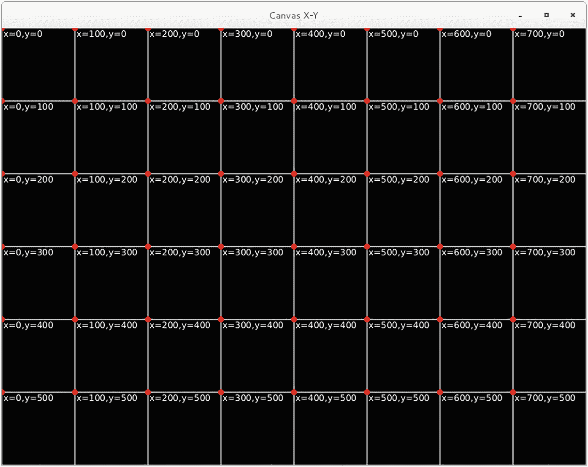
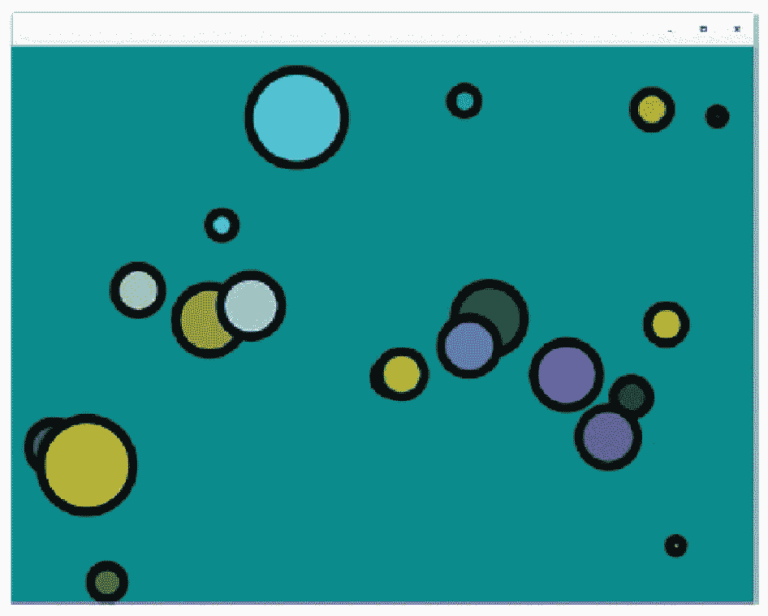
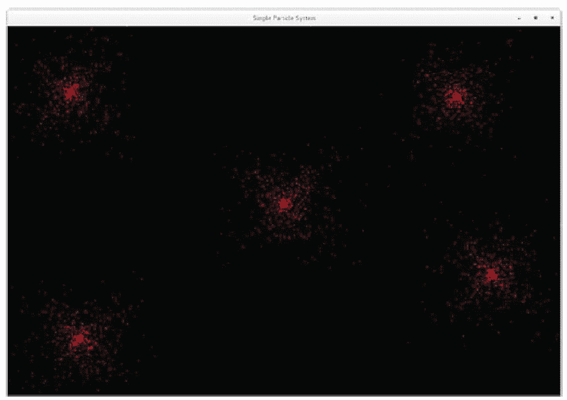
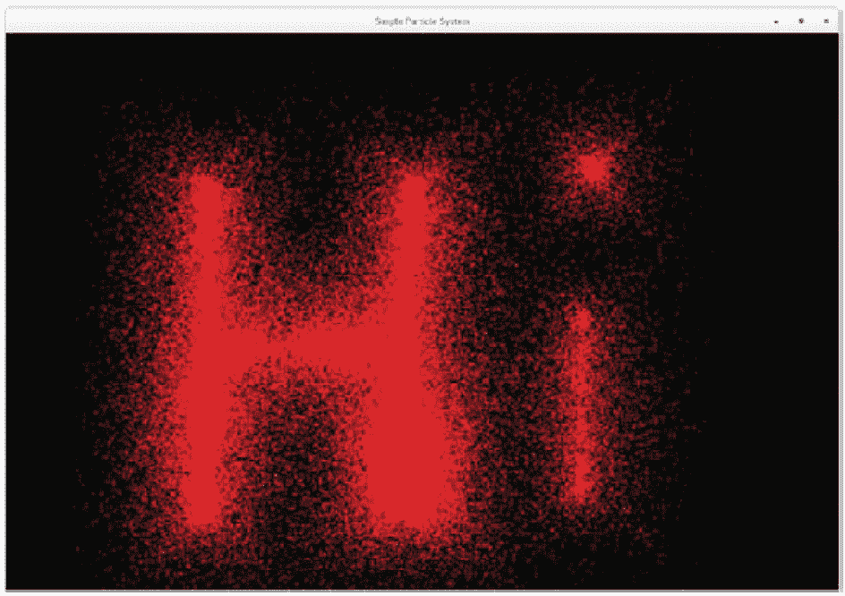
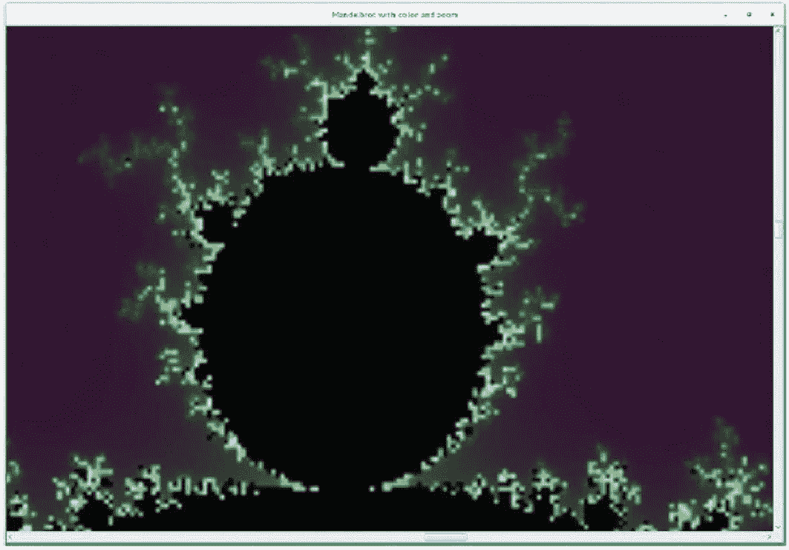
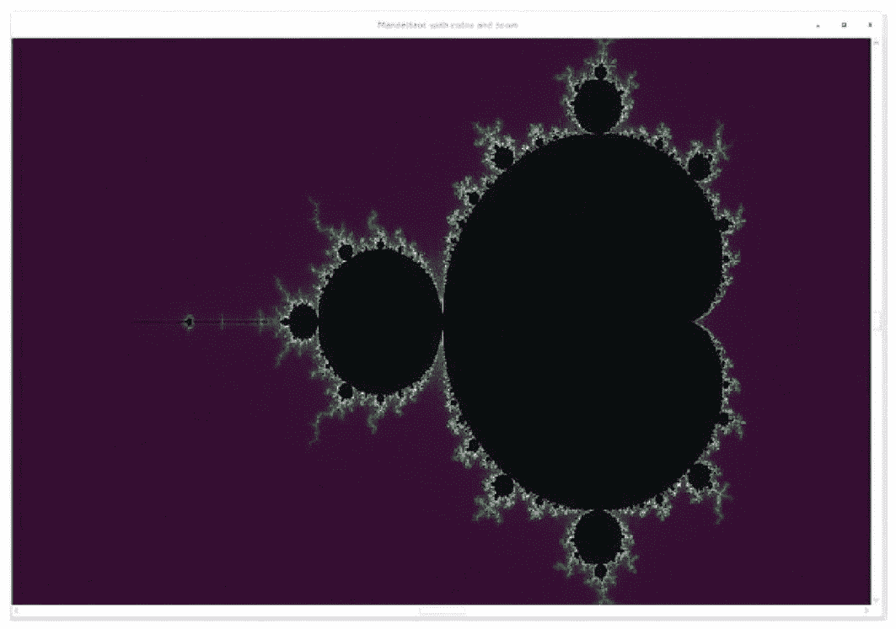
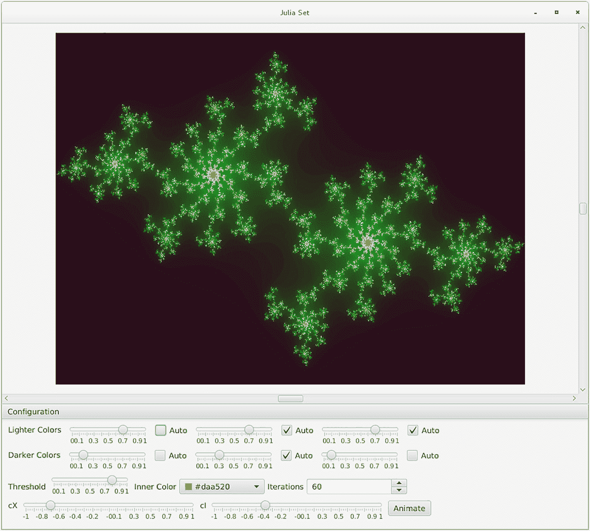
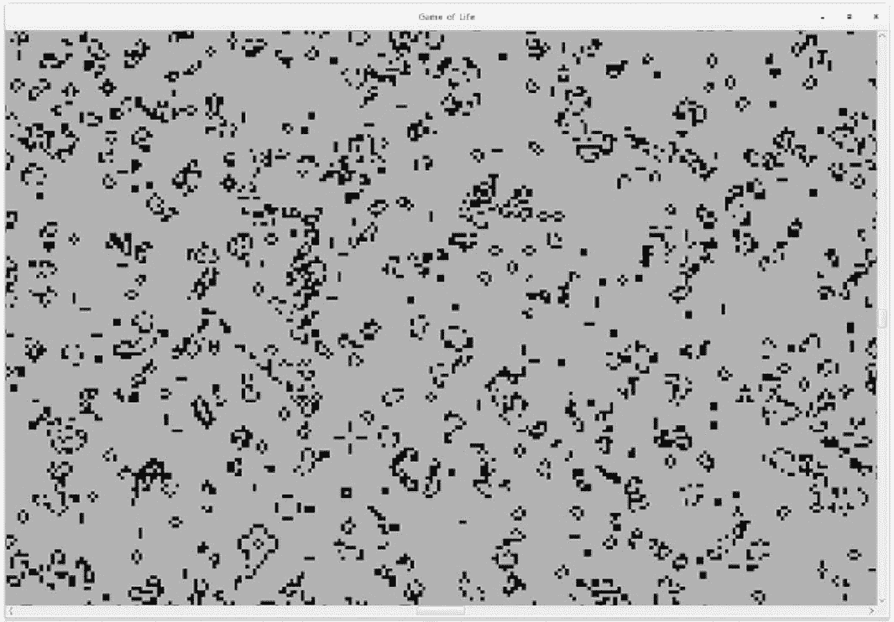
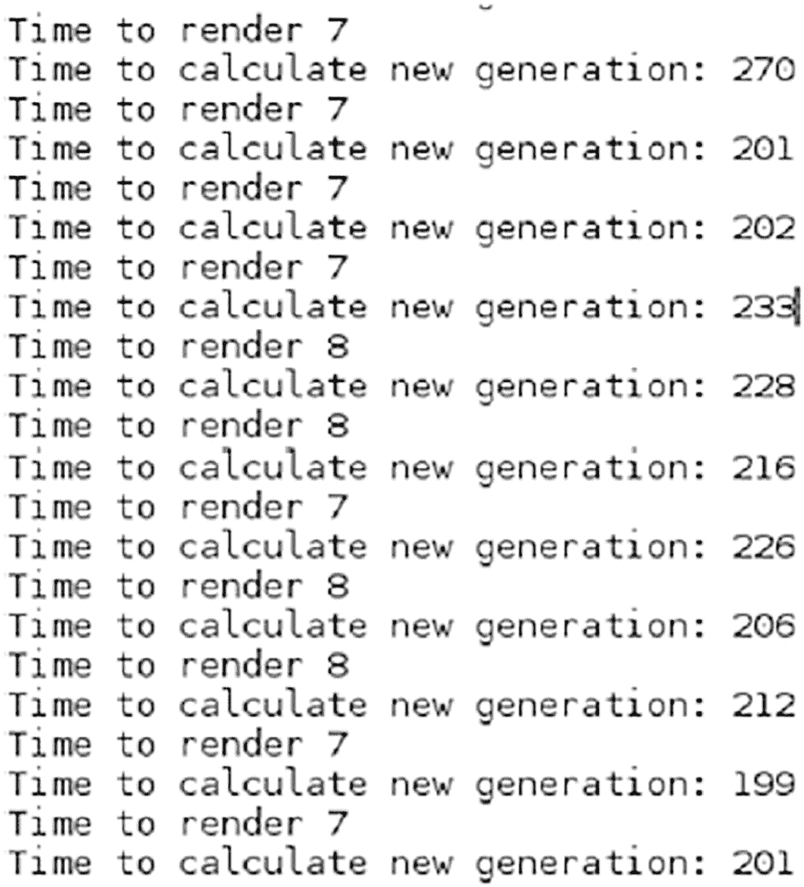
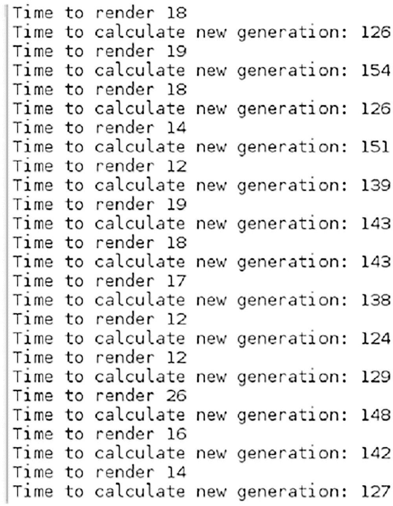

# 六、高性能显示

威廉·安东尼奥·西西里

JavaFX 是一个用于创建丰富用户界面的完整平台。它有一套完整的控件可供使用，并允许开发人员使用 CSS 来设计他们的应用程序。在 JavaFX 提供的所有控件中，我们拥有强大的画布。使用 Canvas，我们可以利用 JavaFX 硬件加速图形创建视觉上令人印象深刻的图形应用程序。在这一章中，我们将探索 Canvas 使用已知算法和技术创建动态图形应用程序的能力。

假设您的任务是创建一个 JavaFX 游戏。您可以使用标准的控件 API 来实现它，但是控件并不适合它。如果您必须构建一个模拟或其他类型的需要持续更新屏幕的应用程序，也是如此。对于这种情况，我们通常使用画布。

来自 JavaFX API 的 Canvas 类似于来自其他平台和编程语言的 canvas，由于它是 Java，我们可以将其移植到移动和嵌入式设备，并利用 JavaFX 硬件加速。作为 Java 库的一部分的另一个巨大优势是，我们可以使用无限数量的可用 API 来检索信息，这些信息稍后可以显示在画布上，例如，访问远程服务或数据库来检索可以使用画布以独特方式显示的数据。

就像按钮或标签一样，javafx.scene.canvas.Canvas 是 Node 的子类，这意味着它可以添加到 javafx 场景图中，并应用转换、事件侦听器和效果。然而，要使用 Canvas，我们需要另一个类 GraphicsContext，所有神奇的事情都发生在这里。从 GraphicsContext 中，我们可以访问在画布上绘制以构建应用程序的所有方法。目前，JavaFX 仅支持 2D 图形上下文，但这足以创建高性能图形。

## 使用画布

要开始使用 Canvas，我们先画几个简单的几何图形和一段文字。在清单 6-1 中，您可以看到一个利用 GraphicsContext 绘制简单表单和文本的小应用程序。

```java
import javafx.application.Application;
import javafx.scene.Scene;
import javafx.scene.canvas.Canvas;
import javafx.scene.canvas.GraphicsContext;
import javafx.scene.layout.StackPane;
import javafx.scene.paint.Color;
import javafx.scene.text.Font;
import javafx.scene.text.TextAlignment;
import javafx.stage.Stage;
public class HelloCanvas extends Application {
        private static final String MSG = "JavaFX Rocks!";
        private static final int WIDTH = 800;
        private static final int HEIGHT = 600;
        public static void main(String[] args) {
                launch();
        }
        @Override
        public void start(Stage stage) throws Exception {
                Canvas canvas = new Canvas(800, 600);
                GraphicsContext gc = canvas.getGraphicsContext2D();
                gc.setFill(Color.WHITESMOKE);
                gc.fillRect(0, 0, WIDTH, HEIGHT);
                gc.setFill(Color.DARKBLUE);
                gc.fillRoundRect(100, 200, WIDTH - 200, 180, 90, 90);
                gc.setTextAlign(TextAlignment.CENTER);
                gc.setFont(Font.font(60));
                gc.setFill(Color.LIGHTBLUE);
                 gc.fillText(MSG, WIDTH / 2, HEIGHT / 2);
                 gc.setStroke(Color.BLUE);
                 gc.strokeText(MSG, WIDTH / 2, HEIGHT / 2);
                 stage.setScene(new Scene(new StackPane(canvas), WIDTH, HEIGHT));
                 stage.setTitle("Hello Canvas");
                 stage.show();
        }
}

Listing 6-1Hello Canvas application

```

如前所述，Java FX . scene . canvas . graphics context 类用于指示将在画布上绘制什么，通过它，我们可以使用例如 fillRect 和 fillOval 来填充几何形状。为了选择用于填充几何形状的颜色，我们使用 setFill 方法，该方法接受 Paint 类型的对象。Color 是 Paint 的子类，它有内置的颜色供我们使用，所以我们不必选择实际的颜色红色、绿色和蓝色值。我们可以挑选一些可用的颜色。像 setFill 一样，我们也可以使用 strokeRect 和 strokeOval 等方法来描边几何形状和文本，并且可以使用 setStroke 来设置描边颜色。更改笔触和填充就像使用带有调色板的画笔一样，在进行实际绘制或绘画之前，您必须先用所需的颜色绘制画笔。该应用的结果如图 6-1 所示。


图 6-1

一个简单的画布应用程序，绘制一个矩形和一个文本

当我们画东西时，我们还必须提供它的 x 和 y 位置，这类似于我们必须在笛卡尔坐标系中追踪函数时所做的事情。熟悉 Canvas 如何看到 x 和 y 位置对于正确编写表单很重要，它基本上是从左上角开始考虑 y 的。对于 x 来说，是一样的；但是，较高的 y 值意味着您正在绘制的元素将接近应用程序的底部。使用清单 6-2 中的代码，我们可以生成图 6-2 中的应用程序，它在画布中显示各种 x，y 坐标。在一个嵌套的 for 循环中，我们画出矩形，并用文本画出小椭圆来显示每个 x，y 点。请注意，在绘制文本之前，我们必须将填充改为白色，然后选择红色来绘制椭圆形。



图 6-2

这个应用程序展示了 x 和 y 位置如何在 JavaFX 画布中工作

```java
Canvas canvas = new Canvas(WIDTH, HEIGHT);
GraphicsContext gc = canvas.getGraphicsContext2D();
gc.setFont(Font.font(12));
gc.setFill(Color.BLACK);
gc.fillRect(0, 0, WIDTH, HEIGHT);
gc.setStroke(Color.LIGHTGRAY);
for (int i = 0; i < WIDTH; i+=RECT_S) {
        for (int j = 0; j < HEIGHT; j+=RECT_S) {
                gc.strokeRect(i, j, RECT_S, RECT_S);
                gc.setFill(Color.WHITE);
                gc.fillText("x=" + i + ",y=" + j, i + 2, j + 12);
                gc.setFill(Color.RED);
                gc.fillOval(i - 4, j - 4, 8, 8);
        }
}

Listing 6-2Drawing x,y coordinates

```

使用事件处理和画布绘制功能，我们可以改变图形的创建方式。例如，允许用户在画布上自由绘制，如清单 6-3 所示，其中我们注册了一个鼠标按下的监听器，并开始绘制路径。然后在 onMouseDragged 上，我们不断地向路径添加行。如果用户停止拖动并再次按下鼠标按钮，就会创建一个新路径。当用户用鼠标辅助按钮点击画布时，我们在画布上的所有内容上绘制背景，并对其进行清理。创建路径的方法允许您交互式地构建几何形状；在这种情况下，我们只是用它来使绘图更精确(我们可以画小点来代替，创建路径)，但这部分 API 还有许多其他应用程序。结果是一个简单的绘画应用程序，如图 6-3 所示。


图 6-3

一个小的 JavaFX 绘图应用程序

```java
public void start(Stage stage) throws Exception {
        Canvas canvas = new Canvas(800, 600);
        GraphicsContext ctx = canvas.getGraphicsContext2D();
        ctx.setLineWidth(10);
        canvas.setOnMousePressed(e -> ctx.beginPath());
        canvas.setOnMouseDragged(e -> {
                ctx.lineTo(e.getX(), e.getY());
                ctx.stroke();
        });
        canvas.setOnMouseClicked(e -> {
                if(e.getButton() == MouseButton.SECONDARY) {
                        clear(ctx);
                }
        });
        stage.setTitle("Drawing on Canvas");
        stage.setScene(new Scene(new StackPane(canvas), WIDTH, HEIGHT));
        stage.show();
        clear(ctx);
}
public void clear(GraphicsContext ctx) {
        ctx.setFill(Color.DARKBLUE);
        ctx.fillRect(0, 0, WIDTH, HEIGHT);
        ctx.setStroke(Color.ALICEBLUE);
}

Listing 6-3Drawing on a canvas

```

到目前为止，我们只是探索了创建形状和文本的高级 GraphicsContext 方法。如果我们想要构建更复杂的图形，我们可能需要直接处理像素，一个接一个。幸运的是，这可以通过使用 PixelWriter 轻松实现，pixel writer 可以从 GraphicsContext 访问。使用像素写入器，我们可以设置画布中每个像素的颜色。像素的数量取决于画布的大小，例如，如果它的大小为 800 × 600，那么它有 480000 个像素，可以使用 x 和 y 点分别访问这些像素。换句话说，我们可以通过从 x = 0 迭代到 x = Canvas.getWidth 来遍历画布的每个像素，在这个迭代中，我们可以从 y = 0 迭代到 y = canvas.getHeight。将其转换为代码，我们可以看到清单 6-4 中的内容，这导致画布具有随机像素，如图 6-4 所示。


图 6-4

带有随机像素的画布

```java
Canvas canvas = new Canvas(WIDTH, HEIGHT);
GraphicsContext gc = canvas.getGraphicsContext2D();
for (int i = 0; i < canvas.getWidth(); i++) {
        for (int j = 0; j < canvas.getHeight(); j++) {
                gc.getPixelWriter().setColor(i, j, Color.color(Math.random(), Math.random(), Math.random()));
        }
}

Listing 6-4Writing random colors to each pixel of a canvas

```

GraphicsContext 类还允许您绘制复杂的路径、其他几何形状和图像，并配置内容的显示方式。为了探索所有 Canvas 和 GraphicsContext 的可能性，我们建议您阅读 Javadocs，在那里您将找到所有可用的方法以及如何使用它们的信息。

## 赋予画布应用程序生命

为了创建我们在本章开始时描述的那种应用程序，我们需要不断地更新画布来创建动画或模拟。有许多不同的方法可以实现这一点；然而，为了保持简单，我们将从处理编程语言中获得灵感，并创建一个重复调用的方法 draw 和一个在抽象类 GraphicApp 上只调用一次的 setup。在这一章中，我们将使用 GraphicApp 来探索一些已知的算法，因为它有一些会在所有例子中重复的代码。使用这个抽象类，我们可以专注于设置和绘制，而不必在每个示例中重复自己。让我们通过检查清单 6-5 中的源代码来理解它的作用。

```java
import javafx.animation.KeyFrame;
import javafx.animation.Timeline;
import javafx.application.Application;
import javafx.scene.Node;
import javafx.scene.Scene;
import javafx.scene.canvas.Canvas;
import javafx.scene.canvas.GraphicsContext;
import javafx.scene.layout.BorderPane;
import javafx.scene.paint.Color;
import javafx.scene.paint.Paint;
import javafx.stage.Stage;
import javafx.util.Duration;
public abstract class GraphicApp extends Application {
        protected int width = 800;
        protected int height = 600;
        protected GraphicsContext graphicContext;
        private Paint backgroundColor = Color.BLACK;
        private Timeline timeline = new Timeline();
        private int frames = 30;
        private BorderPane root;
        private Stage stage;
        @Override
        public void start(Stage stage) throws Exception {
                this.stage = stage;
                Canvas canvas = new Canvas(width, height);
                graphicContext = canvas.getGraphicsContext2D();
                canvas.requestFocus();
                root = new BorderPane(canvas);
                stage.setScene(new Scene(root));
                setup();
                canvas.setWidth(width);
                canvas.setHeight(height);
                startDrawing();
                stage.show();
                internalDraw();
        }
        public abstract void setup();
        public abstract void draw();
        public void title(String title) {
                stage.setTitle(title);
        }
        public void background(Paint color) {
                backgroundColor = color;
        }
        public void frames(int frames) {
                this.frames = frames;
                startDrawing();
        }

        public void setBottom(Node node) {
                root.setBottom(node);
        }
        private void internalDraw() {
                graphicContext.setFill(backgroundColor);
                graphicContext.fillRect(0, 0, width, height);
                draw();
        }
        private void startDrawing() {
                timeline.stop();
                if (frames > 0) {
                        timeline.getKeyFrames().clear();
                        KeyFrame frame = new                         KeyFrame(Duration.millis(1000 /
                        frames), e -> internalDraw());
                        timeline.getKeyFrames().add(frame);
                        timeline.setCycleCount(Timeline.INDEFINITE);
                        timeline.play();
                }
        }

public double map(double value, double start1, double stop1, double start2, double stop2) {
        return start2 + (stop2 - start2) * ((value - start1) / (stop1 - start1));
        }
}

Listing 6-5The GraphicApp abstract class provides a skeleton for creating animated graphics using Canvas

```

注意方法 draw 和 setup 是抽象的。要创建应用程序，我们必须扩展 GraphicApp 并实现这些方法。方法 draw 调用频率由 Timeline 类控制，正如您在方法 startDrawing 中看到的，其中唯一的帧持续时间由 frame int 参数控制，该参数表示每秒的帧数。在方法 draw 上，可以访问 grahicsContext 参数，它属于 GraphicsContext 类型，然后开始创建您的应用程序。使用 grahicsContext，还可以访问画布来注册侦听器，这样就可以响应用户输入。方法映射是将一个范围的值转换为另一个范围的实用程序。最后，您可以使用 setBottom 方法将自定义控件添加到底部。

使用 GraphicApp，我们可以专注于我们的视觉效果。例如，让我们创建一个弹跳球应用程序。这个应用程序简单地绘制了几个椭圆，当它们到达应用程序边界时会改变方向。你可以在清单 6-6 中看到，我们专注于我们的想法，这是一个使用类 ball 表示一个球的模型元素，然后为它生成随机值；对于 draw 中的每次迭代，我们更新球的位置并将其绘制在屏幕上。

```java
import java.util.ArrayList;
import java.util.List;
import java.util.Random;
import javafx.scene.canvas.GraphicsContext;
import javafx.scene.paint.Color;
public class BouncingBalls extends GraphicApp {
        private static final int TOTAL_BALLS = 20;
        List<Ball> balls = new ArrayList<>();
        public static void main(String[] args) {
                launch(args);
        }
        @Override
        public void setup() {
                Random random = new Random();
                for (int i = 0; i < TOTAL_BALLS; i++) {
                        Ball ball = new Ball();
                        ball.circ = random.nextInt(100) + 10;
                        ball.x = random.nextInt(width - ball.circ);
                        ball.y = random.nextInt(height - ball.circ);
                        ball.xDir = random.nextBoolean() ? 1: -1;
                        ball.yDir = random.nextBoolean() ? 1: -1;
                        ball.color = Color.color(Math.random(),
                        Math.random(), Math.random());
                        balls.add(ball);
                }
                background(Color.DARKCYAN);
        }
        @Override
        public void draw() {
                for (Ball ball : balls) {
                        ball.update();
                        ball.draw(graphicContext);
                }
        }
        public class Ball {
                int x, y, xDir = 1, yDir = 1, circ;
                Color color;
                public void update() {
                        if (x + circ > width || x < 0) {
                                xDir *= -1;
                        }
                        if (y + circ > height || y < 0) {
                                yDir *= -1;
                        }
                        x += 5 * xDir;
                        y += 5 * yDir;
                }
                public void draw(GraphicsContext gc) {
                        gc.setLineWidth(10);
                        gc.setFill(color);
                        gc.fillOval(x, y, circ, circ);
                        gc.setStroke(Color.BLACK);
                        gc.strokeOval(x, y, circ, circ);
                }
        }
}

Listing 6-6The bouncing balls

example

```

当您运行这个应用程序时，您将看到球在画布上向四周移动，如图 6-5 所示。您可以通过添加交叉点检测、物理、事件处理或任何其他使其有用或酷的效果来改进它。



图 6-5

弹跳球示例

说到这里，让我们使用我们的 GraphicsApp 来探索一些已知的算法。

## 粒子系统

威廉·里维斯在论文《粒子系统:一种对一类模糊对象建模的技术》中引入了粒子系统，他将粒子系统定义为“许多许多微小粒子的集合，它们共同代表一个模糊对象。”你可以认为它有两个主要部分:发射器和粒子。一个发射器不断创造粒子，最终会死亡。粒子系统的应用包括:

*   游戏效果:爆炸，碰撞

*   动画:火，云，波浪撞击石头

*   模拟:空间，生物的繁殖

用几行代码创建一个非常简单的粒子系统是可能的，但是这种类型的系统可能相当复杂，这取决于我们想要实现什么。对于简单和高级的粒子系统，我们基本上需要两个类:粒子和发射器。粒子类取决于发射器，一个发射器可以有一个或无限个粒子。

使用这些类，我们可以构建一个具有单个发射器的应用程序，它可以生成向随机方向移动的粒子。参见图 6-6 以及清单 6-7 中生成它的代码。



图 6-6

一个非常简单的粒子系统

```java
import java.util.ArrayList;
import java.util.List;
import java.util.Random;
import java.util.stream.Collectors;
import javafx.scene.canvas.GraphicsContext;
import javafx.scene.paint.Color;
public class ParticleSystem extends GraphicApp {
        private List<Emitter> emitters = new ArrayList<>();
        Random random = new Random();
        public static void main(String[] args) {
                launch();
        }
        @Override
        public void setup() {
                frames(50);
                width = 1200;
                height = 800;
                // you can change it to onMouseDragged
                graphicContext.getCanvas().setOnMouseDragged(e ->                 emitters.
                add(new Emitter(5, e.getSceneX(), e.getSceneY())));
                title("Simple Particle System");
        }
        @Override
        public void draw() {
                for (Emitter emitter : emitters) {
                        emitter.emit(graphicContext);
                }
        }
        public class Emitter {
                List<Particle> particles = new ArrayList<>();
                int n = 1;
                double x, y;
                public Emitter(int n, double x, double y) {
                        this.n = n;
                        this.x = x;
                        this.y = y;
                }
                public void emit(GraphicsContext gc) {
                        for (int i = 0; i < n; i++) {
                                int duration = random.nextInt(200) + 2;
                                double yDir = random.nextDouble() * 2.0 +                                 -1.0;
                                double xDir = random.nextDouble() * 2.0 +                                 -1.0;
                                Particle p = new Particle(x, y, duration,                                 xDir, yDir);
                                particles.add(p);
                        }
                        for (Particle particle : particles) {
                                particle.step();
                                particle.show(gc);
                        }
                        particles = particles.stream().filter(p ->                         p.duration > 0).collect(Collectors.toList());
                }
        }

        public class Particle {
                int duration;
                double x, y, yDir, xDir;
                public Particle(double x, double y, int duration, double yDir, double xDir) {
                        this.x = x;
                        this.y = y;
                        this.duration = duration;
                        this.yDir = yDir;
                        this.xDir = xDir;
                }
                public void step() {
                        x += xDir;
                        y += yDir;
                        duration--;
                }
                public void show(GraphicsContext gc) {
                        gc.setFill(Color.rgb(255, 20, 20, 0.6));
                        gc.fillOval(x, y, 3, 3);
                }
        }
}

Listing 6-7Very simple particle system

```

在清单 6-7 的代码中，我们在用户点击画布的位置生成了一个粒子系统。请注意，每次调用 emit 方法时，类 Emitter 都会生成粒子，并且它还会绘制现有的粒子；这两个动作可以用两种不同的方法分开。一个粒子是一个简单的椭圆形；它有一个持续时间，一个初始的 x 和 y 位置，一个 y 和 x 方向。发射器发射所有粒子，完成后，所有过时的粒子都会被移除。代码灵活且易于扩展，例如，当我们在画布中移除鼠标点击事件监听器并将其更改为使用鼠标拖动事件时，我们可以使用粒子系统“编写”。见图 6-7 。



图 6-7

使用鼠标拖动粒子系统

为了使粒子系统可配置，让我们在应用程序的底部添加一个控制面板，这样用户可以配置发射器和粒子的许多方面，以试验粒子系统的全部潜力。为此，我们创建了一个应用程序，允许用户在单击画布时添加新的发射器。参见图 6-8 中我们的可配置粒子系统。


图 6-8

可配置粒子系统

创建发射器的代码可以在清单 6-8 中找到。它的工作方式很简单。当画布上发生点击时，一个新的发射器被添加到列表中；在 draw 方法中，调用每个粒子系统的 emit 方法。底部窗格中的配置(见图 6-8 )在创建时被传递给每个发射器，如果用户选择切换按钮静态配置，特定发射器的配置不会实时更新。

```java
@Override
public void setup() {
        frames(20);
        width = 1200;
        height = 800;
        GridPane gpConfRoot = buildConfigurationRoot();
        TitledPane tpConf = new TitledPane("Configuration", gpConfRoot);
        tpConf.setCollapsible(false);
        setBottom(tpConf);
        graphicContext.getCanvas().setOnMouseClicked(e -> {
                Emitter newEmitter;
                if (globalConf.cloneConfProperty.get()) {
                        newEmitter = new Emitter(e.getSceneX(),
                        e.getSceneY(), globalConf.clone());
                } else {
                        newEmitter = new Emitter(e.getSceneX(),
                        e.getSceneY(), globalConf);
                }
                emitters.add(newEmitter);
        });
        title("Particle System configurable");
}
@Override
public void draw() {
        for (Emitter emitter : emitters) {
                emitter.emit(graphicContext);
        }
}

Listing 6-8Emitter creation and calling draw

```

配置对象包含发射器用来创建粒子的各种信息。ParticleSystemConf 类(参见清单 6-9 )使用 JavaFX 属性，因此属性值可以直接绑定到我们添加到底部窗格的控件。这些属性控制每次调用 emit 时产生的粒子数、粒子在应用程序中存在的帧数(粒子持续时间)以及代表粒子不透明度的椭圆大小。你也可以选择粒子的颜色，如果它将在一条直线上移动，或者如果它将振荡，如果它应该有一个淡出效果。最后，这个配置还有一个克隆方法，它允许我们创建一个新的配置，这个配置不会绑定到清单 6-9 中所示的控件。

```java
public class ParticleSystemConf {
        IntegerProperty numberOfParticlesProperty = new SimpleIntegerProperty();
        IntegerProperty durationProperty = new SimpleIntegerProperty();
        DoubleProperty sizeProperty = new SimpleDoubleProperty();
        DoubleProperty opacityProperty = new SimpleDoubleProperty();
        BooleanProperty oscilateProperty = new SimpleBooleanProperty();
        BooleanProperty fadeOutProperty = new SimpleBooleanProperty();
        ObjectProperty<Color> colorProperty = new SimpleObjectProperty<>();
        BooleanProperty cloneConfProperty = new SimpleBooleanProperty();

        public ParticleSystemConf clone() {
                ParticleSystemConf newConf = new ParticleSystemConf();
                newConf.numberOfParticlesProperty.
                set(numberOfParticlesProperty.get());
                newConf.durationProperty.set(durationProperty.get());
                newConf.sizeProperty.set(sizeProperty.get());
                newConf.opacityProperty.set(opacityProperty.get());
                newConf.oscilateProperty.set(oscilateProperty.get());
                newConf.fadeOutProperty.set(fadeOutProperty.get());
                newConf.colorProperty.set(colorProperty.get());
                return newConf;
        }
}

Listing 6-9The configuration object

```

配置的所有字段稍后都绑定到添加到应用程序底部的控件:

```java
cbBackgrounColor.valueProperty().addListener((a, b, c) -> background(c));
globalConf.numberOfParticlesProperty.bind(sldNumberOfParticles.valueProperty());
globalConf.durationProperty.bind(sldDuration.valueProperty());
globalConf.oscilateProperty.bind(cbOscillate.selectedProperty());
globalConf.sizeProperty.bind(sldPParticleSize.valueProperty());
globalConf.opacityProperty.bind(sldOpacity.valueProperty());
globalConf.fadeOutProperty.bind(cbFadeOut.selectedProperty());
globalConf.colorProperty.bind(cbColor.valueProperty());
globalConf.cloneConfProperty.bind(tbClone.selectedProperty());

```

最后，所有的配置都在发射器和粒子类中使用，如清单 6-10 所示。

```java
public class Emitter {
        List<Particle> particles = new ArrayList<>();
        double x, y;
        private ParticleSystemConf conf;
        public Emitter(double x, double y, ParticleSystemConf conf) {
                this.x = x;
                this.y = y;
                this.conf = conf;
        }
        public void emit(GraphicsContext gc) {
                for (int i = 0; i < conf.numberOfParticlesProperty.get();
                i++) {
                        Particle p = new Particle(x, y, conf);
                        particles.add(p);
                }
                for (Particle particle : particles) {
                        particle.step();
                        particle.show(gc);
                }
              particles = particles.stream().filter(p -> p.duration >               0).collect(Collectors.toList());
        }
}
public class Particle {
        int duration, initialDuration;
        double x, y, yDir, xDir, size, opacity, currentOpacity;
        Color color = Color.YELLOW;
        boolean oscilate, fadeOut;
        public Particle(double x, double y, ParticleSystemConf conf) {
                this.x = x;
                this.y = y;
                this.oscilate = conf.oscilateProperty.get();
                this.size = conf.sizeProperty.get();
                this.initialDuration = conf.durationProperty.get() + 1;
                this.yDir = random.nextGaussian() * 2.0 - 1.0;
                this.xDir = random.nextGaussian() * 2.0 + -1.0;
                this.opacity = conf.opacityProperty.get();
                this.fadeOut = conf.fadeOutProperty.get();
                this.duration = initialDuration;
                this.currentOpacity = opacity;
                this.color = conf.colorProperty.get();
        }
        public void step() {
                x += xDir;
                y += yDir;
                if (oscilate) {
                        x += Math.sin(duration) * 10;
                        y += Math.cos(duration) * 10;
                }
                if (fadeOut) {
                        currentOpacity = map(duration, 0,                         initialDuration, 0, opacity);
                }
                duration--;
        }
        public void show(GraphicsContext gc) {
                Color cl = Color.color(color.getRed(), color.getGreen(), color.getBlue(), currentOpacity);
                gc.setFill(cl);
                gc.fillOval(x, y, size, size);
        }
}

Listing 6-10Particle and Emitter classes using the configuration object

```

本章没有分享所有可配置粒子系统的代码；但是，您可以在与本书相关的 GitHub 资源库中找到它。当你运行这个应用程序时，你会注意到如果你添加很多发射器，这些发射器有很多由帧生成的粒子，主要是如果你每秒有太多的帧，你会很快使它变慢。您可以按照本章末尾提供的提示来提高性能。有几个不错的特性可以添加到这个应用程序中:

*   粒子格式选择

*   粒子取向

*   将可视化导出到文件或可以在其他应用程序中重用的格式

我们会将这些任务作为练习留给您！

## 分形

分形的粗略定义是由类似于它自身的其他小几何形状形成的几何形状。使用分形，我们可以创造美丽迷人的艺术，也可以理解自然界的图案形成。在我们的例子中，我们将使用分形探索画布容量。

Mandelbrot 集是一个由复数序列生成的著名分形。要构建 Mandelbrot 集合，必须迭代函数 f(z) = z <sup>2</sup> + c，从 0 开始用自己的结果值填充它。这个函数趋于无穷大；然而，有几个中间值可能会导致有趣的结果。例如，如果你迭代一个图像像素，并将像素映射到 Mandelbrot 发送的接受值，然后使用像素写入器，当结果趋于无穷大时将像素颜色设置为白色，否则设置为黑色，结果将如图 6-9 所示。请注意，在这幅图中，小部分与整体相似。看起来我们到处都有一个小曼德勃罗。它的代码在清单 6-11 中。


图 6-9

最简单 Mandelbrot 集

```java
private final int MAX_ITERATIONS = 100;
private double zx, zy, cX, cY, tmp;
int i;
@Override
public void setup() {
        width = 1200;
        height = 800;
        frames(0);
}
@Override
public void draw() {
        long start = System.currentTimeMillis();
        for (int x = 0; x < width; x++) {
                for (int y = 0; y < height; y++) {
                        zx = zy = 0;
                      // the known range of accepted values for cx and cy
                        cX = map(x, 0, width, -2.5, 1.0);
                        cY = map(y, 0, height, -1, 1.0);
                        i = 0;
                        while (zx * zx + zy * zy < 4 && i <                         MAX_ITERATIONS) {
                                tmp = zx * zx - zy * zy + cX;
                                zy = 2.0 * zx * zy + cY;
                                zx = tmp;
                                i++;
                        }
                        // if it is not exploding to infinite
                        if (i < MAX_ITERATIONS) {
                                graphicContext.getPixelWriter().setColor(                                x, y, Color.WHITE);
                        } else {
                                graphicContext.getPixelWriter().setColor(x, y, Color.BLACK);
                        }
                }
        }
        System.out.println("GEnerating mandelbrot took " + (System.currentTimeMillis() - start)  + " ms");
}

Listing 6-11Simplest Mandelbrot

```

如果在网络视频中搜索 Mandelbrot，会发现缩放效果、不同颜色等非常有趣的特效。由于着色算法和缩放效果，这是可能的。让我们首先通过允许假缩放来改进原始的 Mandelbrot。这可以通过操作 GraphicsApp 的根窗格，将画布包装在一个非常大的堆栈窗格中，然后包装在一个提供滚动功能的滚动窗格中来完成。画布大小可以使用事件侦听器来更改:当用户用左键单击滚动窗格时，它会放大；当用户使用右键单击时，它会缩小；单击中间的按钮可以重置缩放比例并使窗格居中。这些都是在清单 6-12 中的设置方法中完成的，在这里你可以看到缩放的技巧:我们实际上是在缩放画布；这不是真正的变焦。在图 6-10 中，你可以看到没有缩放的结果。缩放效果如图 6-11 所示。请注意，它不调整分辨率，因此，正如我们所说，一个假的缩放。

```java
@Override
public void setup() {
        width = 1200;
        height = 800;
        Canvas canvas = graphicContext.getCanvas();
        BorderPane bp = (BorderPane) canvas.getParent();
        bp.setCenter(null);
        StackPane p = new StackPane(canvas);
        p.setMinSize(20000, 20000);
        ScrollPane sp = new ScrollPane(p);
        sp.setPrefSize(1200, 800);
        sp.setVvalue(0.5);
        sp.setHvalue(0.5);
        bp.setCenter(sp);
        sp.setOnMouseClicked(e -> {
                double zoom = 0.2;
                double scaleX = canvas.getScaleX();
                double scaleY = canvas.getScaleY();
                if (e.getButton() == MouseButton.SECONDARY &&                  (canvas.getScaleX() > 0.5)) {
                        canvas.setScaleX(scaleX - zoom);
                        canvas.setScaleY(scaleY - zoom);
                } else if (e.getButton() == MouseButton.PRIMARY) {
                        canvas.setScaleX(scaleX + zoom);
                        canvas.setScaleY(scaleY + zoom);
                } else if (e.getButton() == MouseButton.MIDDLE) {
                        sp.setVvalue(0.5);
                        sp.setHvalue(0.5);
                        canvas.setScaleY(1);
                        canvas.setScaleX(1);
                }
        });
        canvas.setOnMousePressed(canvas.getOnMouseClicked());
        frames(0);
        title("Mandelbrot with color and zoom");
}

Listing 6-12Trick for zoom into the application canvas

```

对于着色，我们修改了 Mandelbrot 颜色。选择一个相对于上一次迭代的值，而不是白色。使用这个值，我们可以使用生成的颜色。例如，使用清单 6-13 中的值，我们为外部颜色设置了略带紫色的值，为边框设置了绿色的值，如图 6-10 所示。

```java
// if the steps above are not heading towards infinite we draw the pixel with a specific color
if (i < MAX_ITERATIONS) {
        double newC = ((double) i) / ((double) MAX_ITERATIONS);
        Color c;
        if(newC > 0.4)
        c = Color.color(newC, 0.8, newC);
        else c = Color.color(0.2, newC, 0.2);
        graphicContext.getPixelWriter().setColor(x, y, c);
} else {
        graphicContext.getPixelWriter().setColor(x, y, Color.BLACK);
}

Listing 6-13Adding colors to the Mandelbrot

non-infinite values

```



图 6-11

放大到曼德勃罗



图 6-10

带有颜色和缩放的 Mandelbrot

曼德尔布洛特就这样了。花点时间修改代码，尝试生成更有趣的颜色，摆弄参数。作为我们的下一个视觉效果，我们将为实时实验创建一个面板，并扩展 Mandelbrot 以允许我们测试 Julia 集值，生成其他分形形式。

Julia 集是 Mandelbrot 虚值和实值的固定值的集合。使用这些固定值，我们可以创建从 Mandelbrot 派生的表单。在我们的代码中，我们只是停止从 Mandelbrot 计算 cx 和 ci 变量，而是让用户使用添加到根窗格底部的 JavaFX 滑块为它们选择一个值。中央窗格使用我们在 Mandelbrot 中使用的相同的缩放技巧，这一次我们将让用户选择分形形式的许多不同参数的值，生成独特的图像。我们在 Mandelbrot 代码中为生成 Julia 集所做的更改可以在清单 6-14 中看到，其中 cx 和 ci 来自一个配置对象，我们将很快对此进行描述。此外，颜色现在来自一个特定的方法，将采取用户配置。

```java
@Override
public void draw() {
        running.set(true);
        totalIterations++;
        for (int x = 0; x < width; x++) {
                for (int y = 0; y < height; y++) {
                        zx = zy = 0;
                        zx = 1.5 * (x - width / 2) / (0.5 * width);
                        zy = (y - height / 2) / (0.5 * height);
                        i = 0;
                        while (zx * zx + zy * zy < 4 && i < totalIterations) {
                                tmp = zx * zx - zy * zy + conf.cx;
                                zy = 2.0 * zx * zy + conf.ci;
                                zx = tmp;
                                i++;
                        }
                        Color c = conf.infinityColor;
                        if (i < totalIterations) {
                        double newC = ((double) i) / ((double) totalIterations);
                        c = getColor(newC);
                     }
                     graphicContext.getPixelWriter().setColor(x, y, c);
                }
        }
        if (totalIterations > conf.maxIterations) {
                running.set(false);
                frames(0);
        }
}
private Color getColor(double newC) {
        double r = newC, g = newC, b = newC;
        if (newC > conf.threshold) {
                if (!conf.computedLighterR)
                        r = conf.lighterR;
                if (!conf.computedLighterG)
                        g = conf.lighterG;
                if (!conf.computedLighterB)
                        b = conf.lighterB;
        } else {
                if (!conf.computedDarkerR)
                        r = conf.darkerR;
                if (!conf.computedDarkerG)
                        g = conf.darkerG;
                if (!conf.computedDarkerB)
                        b = conf.darkerB;
        }
        return Color.color(r, g, b);
}

Listing 6-14Code for Julia sets

. Now the values come from configuration objects

```

但是，该配置没有使用绑定，因为 draw()方法中 for 循环内部的绑定将比使用基本类型慢得多。为了使配置对象与配置保持一致，我们使用了侦听器，因此对于 UI 中的每个元素，我们都有一个侦听器，它将在控件发生更改时更新配置对象。这样，绘制分形形式的循环就不会因为使用绑定而出现性能问题。配置和底部窗格结构可在清单 6-15 中找到。在图 6-12 中，您可以看到运行中的应用程序。



图 6-12

我们的 Julia 集分形应用

您在图 6-12 中看到的每个控件解释如下:

*   浅色:高于阈值的值的颜色。您可以为每个值(RGB)使用一个滑块，如果您选择自动，该特定颜色部分的值将从我们在清单 6-14 中看到的算法中获取。

*   深色:就像浅色一样，但用于低于阈值的值。

*   阈值:划分颜色的阈值。我们可以选择高于或低于阈值的颜色值。

*   内部颜色:一个颜色选择器，允许您在计算值趋于无穷大时选择默认颜色。

*   迭代次数:一个微调器，包含迭代次数的可能值。迭代是我们在检查它是否趋于无穷大之前进行计算的次数。

*   cx 和 cy:这些滑块是 Julia 集的已知值范围。改变它就会改变分形的形式。

*   动画按钮将显示分形演化的每一步，从迭代 1 开始绘制，直到你在迭代中选择的数字。

使用这些控件，你可以创建真正有趣的分形，如图 6-13 所示。


图 6-13

使用我们的应用程序生成的分形

```java
public static class JuliaSetConf {
        public double threshold = 0.8;
        public double lighterR = 0.7;
        public double lighterG = 0.7;
        public double lighterB = 0.7;
        public double darkerR = 0.3;
        public double darkerG = 0.3;
        public double darkerB = 0.3;
        public double cx = -0.70176;
        public double ci = -0.3842;
        public boolean computedLighterR = true;
        public boolean computedLighterG = true;
        public boolean computedLighterB = true;
        public boolean computedDarkerR = true;
        public boolean computedDarkerG = true;
        public boolean computedDarkerB = true;
        public Color infinityColor = Color.GOLDENROD;
        public int maxIterations = MAX_ITERATIONS / 2;
}
private Node createConfPanel() {
        VBox vbConf = new VBox(5);
        Slider spLigherR = slider(conf.lighterR);
        Slider spLigherG = slider(conf.lighterG);
        Slider spLigherB = slider(conf.lighterB);
        CheckBox chkUseComputedLighterR = checkBox();
        CheckBox chkUseComputedLighterG = checkBox();
        CheckBox chkUseComputedLighterB = checkBox();
        vbConf.getChildren().add(new HBox(10, new Label("Lighter Colors"),
                        spLigherR, chkUseComputedLighterR, spLigherG,
                        chkUseComputedLighterG, spLigherB,                          chkUseComputedLighterB));
        Slider spDarkerR = slider(conf.darkerR);
        Slider spDarkerG = slider(conf.darkerG);
        Slider spDarkerB = slider(conf.darkerB);

        CheckBox chkUseComputedDarkerR = checkBox();
        CheckBox chkUseComputedDarkerG = checkBox();
        CheckBox chkUseComputedDarkerB = checkBox();
        vbConf.getChildren().add(new HBox(10, new Label("Darker Colors"),
                        spDarkerR, chkUseComputedDarkerR, spDarkerG,
                        chkUseComputedDarkerG, spDarkerB,                         chkUseComputedDarkerB));
        Slider sldThreshold = slider(conf.threshold);
        Spinner<Integer> spMaxIterations = new Spinner<>(10,         MAX_ITERATIONS, MAX_ITERATIONS / 2);
        spMaxIterations.valueProperty().addListener(c ->         updateConf.run());
        ColorPicker clInifinity = new ColorPicker(conf.infinityColor);
        clInifinity.valueProperty().addListener(c -> updateConf.run());
        HBox hbGeneral = new HBox(5, new Label("Threshold"), sldThreshold,
                        new Label("Inner Color"), clInifinity,
                        new Label("Iterations"), spMaxIterations);
        hbGeneral.setAlignment(Pos.CENTER_LEFT);
        vbConf.getChildren().add(hbGeneral);
        Slider sldX = slider(-1, 1.0, conf.cx);
        sldX.setMinSize(300, 10);
        Slider sldI = slider(-1, 1.0, conf.ci);
        sldI.setMinSize(300, 10);
        Button btnRun = new Button("Animate");
        // since we are not using bind we need to get all the properties here
        updateConf = () -> {
                conf.lighterR = spLigherR.getValue();
                conf.lighterG = spLigherG.getValue();
                conf.lighterB = spLigherB.getValue();
                conf.darkerR = spDarkerR.getValue();
                conf.darkerG = spDarkerG.getValue();
                conf.darkerB = spDarkerB.getValue();
                conf.threshold = sldThreshold.getValue();
                conf.computedLighterR =                 chkUseComputedLighterR.isSelected();
                conf.computedLighterG =                 chkUseComputedLighterG.isSelected();
                conf.computedLighterB =                 chkUseComputedLighterB.isSelected();
                conf.computedDarkerR =
                conf.computedDarkerG =                 chkUseComputedDarkerG.isSelected();
                conf.computedDarkerB =                 chkUseComputedDarkerB.isSelected();
                conf.cx = sldX.getValue();
                conf.ci = sldI.getValue();
                conf.infinityColor = clInifinity.getValue();
                conf.maxIterations = spMaxIterations.getValue();
                totalIterations = conf.maxIterations;
                frames(TOTAL_FRAMES);
        };

btnRun.setOnAction(e -> {
                updateConf.run();
                totalIterations = 1;
        });
        HBox hbSet = new HBox(5, new Label("cX"), sldX, new Label("cI"), sldI, btnRun);
        vbConf.getChildren().add(hbSet);
        TitledPane pnConf = new TitledPane("Configuration", vbConf);
        pnConf.setExpanded(true);
        pnConf.setCollapsible(false);
        pnConf.disableProperty().bind(running);
        return pnConf;
}
private CheckBox checkBox() {
        CheckBox checkBox = new CheckBox("Auto");
        checkBox.setSelected(true);
        checkBox.selectedProperty().addListener(c -> updateConf.run());
        return checkBox;
}
private Slider slider(double d) {
        return slider(0.0, 1.0, d);
}
private Slider slider(double min, double max, double d) {
        Slider slider = new Slider(min, max, d);
        slider.setShowTickLabels(true);
        slider.setShowTickMarks(true);
        slider.setMajorTickUnit(0.1);
        slider.valueProperty().addListener(c -> updateConf.run());
        return slider;
}

Listing 6-15Code for the Julia set

```

## 高性能

到目前为止的性能还没有讨论。焦点完全集中在使用 JavaFX APIs 创建我们的算法上，这意味着我们只信任前面提到的 JavaFX 硬件加速特性。如果你运行分形和粒子的例子，你会注意到，一旦我们把它推到极限，性能是妥协。在本章的最后一部分，我们将进行更深入的讨论，讨论为什么 JavaFX 本身不会为你的应用带来最佳性能，并根据 Sean M. Phillips 于 2018 年 5-6 月在 *Java Magazine* 发表的文章《JavaFX 中的生产者-消费者实现》提出解决方案。

JavaFX 是单线程的。所有的渲染都是在一个线程上完成的，这意味着如果你用一个长时间运行的任务来保持线程，它不会显示任何东西，直到任务完成。当您在 JavaFX 应用程序的 start 方法中编写代码时，您已经在 JavaFX 主线程上了。为了弄清楚这种行为，请看清单 6-16 中代码的应用程序。在这个应用程序中，我们有一个动画标签；我们还有一个按钮。当你点击按钮时，我们调用 Thread.sleep，动画就停止了。你甚至不能点击按钮。原因是主线程被我们的 Thread.sleep 调用锁定了！

```java
import javafx.animation.ScaleTransition;
import javafx.animation.Transition;
import javafx.application.Application;
import javafx.scene.Scene;
import javafx.scene.control.Button;
import javafx.scene.control.Label;
import javafx.scene.layout.BorderPane;
import javafx.stage.Stage;
import javafx.util.Duration;
public class LockedThread extends Application {
        public static void main(String[] args) {
                launch();
        }
        @Override
        public void start(Stage stage) throws Exception {
                Label lblHello = new Label("Hello World");
                ScaleTransition st = new                 ScaleTransition(Duration.seconds(1));
                st.setAutoReverse(true);
                st.setCycleCount(Transition.INDEFINITE);
                st.setByX(2);
                st.setByY(2);
                st.setNode(lblHello);
                Button btnLock = new Button("Sleep for 10 seconds");
                BorderPane bp = new BorderPane(lblHello);
                bp.setBottom(btnLock);
                stage.setScene(new Scene(bp, 300, 200));
                stage.show();
                btnLock.setOnAction(e -> {
                        try {
                                Thread.sleep(10000);
                        } catch (InterruptedException e1) {
                                e1.printStackTrace();
                        }
                });
                st.play();
        }
}

Listing 6-16Locking the main JavaFX thread

```

教训是不要在主线程上做繁重的任务。解决方案是使用一个单独的线程进行实际处理，一旦完成，就在 JavaFX 线程上更新画布(或用户界面)。有了这种方法，主线程的负载就减轻了，应用程序应该可以平稳运行。

现在我们知道了这一点，我们将尝试在不同的线程上调用图形上下文或进行任何 JavaFX 控件更改，您将看到类型为*Java . lang . illegalstateexception*的异常，消息*不在 FX 应用程序线程*上。为了确保 JavaFX 线程上有东西在运行，我们可以使用*javafx . application . platform . run later*传递一个 runnable，它稍后将在 Java FX 线程上运行:*platform . run later(()*➤*GC . fill text("安全填充文本"，0，0))* 。换句话说，确保在主线程上做 JavaFX 控件更新；否则，我们可能会面临前面提到的异常。

然而，Platform.runLater 不会解决我们在 JavaFX 中并发编程所面临的所有问题。javafx.concurrent 包中还有其他实用工具，主要是 javafx.concurrent.Task 类，对于异步任务非常有用。对于这一章，我们将探讨 Sean M. Phillips 在 2018 年 5 月至 6 月的 *Java 杂志*中介绍的高密度数据模式:“JavaFX 中的生产者-消费者实现。”

如果您查看了上面提到的文章，您会注意到这个想法是有一个线程来执行硬处理并将结果推送到一个队列，然后另一个线程在结果可用时获取结果并更新画布。第一个线程被称为生产者，它负责在不接触 JavaFX 线程的情况下进行硬处理。生产者生成的结果被添加到一个**Java . util . concurrent . concurrentlinkedqueue**中，由第二个线程(消费者线程)接收，然后在 JavaFX 线程上进行图形处理。

为了在现实世界的应用程序中展示这种模式，让我们创建一个 Conway 的生命游戏的实现。在维基百科的同名文章中，你会发现生命的游戏是一个细胞自动机，其中如果一个细胞由于人口过多而有三个以上的邻居，那么这个细胞就会死亡，少于两个邻居的细胞会因人口不足而死亡，被恰好三个邻居包围的死亡细胞会重生，而有两个或三个邻居的细胞仍然活着。

我们在清单 6-17 中实现了我们的生活游戏。单元格由布尔值表示，其中 true 表示活动单元格。我们可以设置每个单元格的大小以及应用程序的宽度和高度，这意味着单元格的数量可以通过宽度除以单元格的大小乘以高度除以单元格的大小来计算。应用程序将为每个活细胞写一个大小为 cellSize 的正方形，然后根据我们之前讨论的规则计算下一代细胞。确定一个单元是否存活取决于邻居的数量，在 countNeighbours 方法中，我们采用了不同的方法来计算邻居的数量，即检查每个邻居的位置，并排除邻居检查会导致错误的情况。这种方法将我们从 if/else 丑陋的实现中拯救出来。因为我们需要对每个单元格的邻居求和，所以我们必须在 for-for 循环中遍历每个单元格，以找到每个单元格的邻居，正如您在 newGeneration 方法中看到的那样。

```java
import java.util.Arrays;
import javafx.scene.canvas.GraphicsContext;
import javafx.scene.paint.Color;
public class GameOfLife {
        private int columns;
        private int rows;
        private int cellSize;
        public GameOfLife(int columns, int rows, int cellSize) {
                this.columns = columns;
                this.rows = rows;
                this.cellSize = cellSize;
        }
        public boolean[][] newCells() {
                boolean[][] newCells = new boolean[columns][rows];
                for (int i = 0; i < columns; i++) {
                        for (int j = 0; j < rows; j++) {
                                newCells[i][j] = Math.random() > 0.5;
                        }
                }
                return newCells;
        }
        public void drawCells(boolean[][] cells, GraphicsContext graphicContext) {
                for (int i = 0; i < columns; i++) {
                        for (int j = 0; j < rows; j++) {
                                if (cells[i][j]) {
                                     graphicContext.setFill(Color.BLACK);
                                     graphicContext.fillRect(i *                                      cellSize, j * cellSize, cellSize,                                      cellSize);
                                }
                        }
                }
        }

       public boolean[][] newGeneration(boolean previousGeneration[][]) {
                boolean[][] newGeneration = new boolean[columns][rows];
                for (int i = 0; i < columns; i++) {
                        for (int j = 0; j < rows; j++) {
                                updateCell(previousGeneration,                                 newGeneration, i, j);
                        }
                }
                return newGeneration;
        }
        private void updateCell(boolean[][] previousGeneration, boolean[][] newGeneration, int i, int j) {
                int countNeighbours = countNeighbours(previousGeneration,                 i, j);
                if (previousGeneration[i][j] && (countNeighbours < 2 ||                 countNeighbours > 3)) {
                        newGeneration[i][j] = false;
                } else if (!previousGeneration[i][j] && countNeighbours                 == 3) {
                        newGeneration[i][j] = true;
                } else if (previousGeneration[i][j]) {
                        newGeneration[i][j] = true;
                }
        }
        private int countNeighbours(boolean[][] copy, int i, int j) {
                int[][] borders = {
                                {i - 1, j -1}, {i -1, j}, {i -1, j+ 1},
                                {i, j -1}, {i, j + 1},
                                {i +1, j - 1}, {i +1, j}, {i +1, j +1}
                };
                return (int) Arrays.stream(borders)
                        .filter(b -> b[0] > -1 &&
                                        b[0] < columns &&
                                        b[1] > -1      &&
                                        b[1] < rows    &&
                                        copy[b[0]][b[1]])
                        .count();
        }
}

Listing 6-17A Game of Life implementation

```

赋予这个游戏生命的第一个简单方法是使用 GraphicApp 的子类，它将完成 draw 方法中的所有工作。每次调用 draw 时，都会呈现当前的生成，新的生成将替换当前的生成。如您所知，draw 方法运行在 JavaFX 线程上，这意味着该实现将使用一个线程来完成所有工作。这个实现可以在清单 6-18 中找到，结果可以在图 6-14 中看到。



图 6-14

我们的生活游戏

```java
import javafx.scene.paint.Color;
public class GameOfLifeFXThread extends GraphicApp {
        final int WIDTH = 2500;
        final int HEIGHT = 2500;
        final int CELL_SIZE = 5;
        boolean currentGeneration[][];
        int columns = WIDTH / CELL_SIZE;
        int rows = HEIGHT / CELL_SIZE;
        private GameOfLife gameOfLife;
        public static void main(String[] args) {
                launch();
        }
        @Override
        public void setup() {
                width = WIDTH;
                height = HEIGHT;
                gameOfLife = new GameOfLife(columns, rows, CELL_SIZE);
                currentGeneration = gameOfLife.newCells();
                background(Color.DARKGRAY);
                title("Game of Life");
                frames(5);
        }
        @Override
        public void draw() {
                long initial = System.currentTimeMillis();
                gameOfLife.drawCells(currentGeneration, graphicContext);
                System.out.println("Time to render " +
                 (System.currentTimeMillis() - initial));
                initial = System.currentTimeMillis();
                currentGeneration = gameOfLife.newGeneration(currentGeneration);
                System.out.println("Time to calculate new generation: " +                  (System.currentTimeMillis() - initial));
        }
}

Listing 6-18Game of Life running on the application main thread

```

如果您运行清单 6-18 中大小为 2500 × 2500、单元格大小为 5 (2500 × 2500 × 5)的实现，您将在控制台中看到，计算下一代的时间大约是实际呈现单元格所用时间的 30 倍，这意味着当 JavaFX 线程被锁定时，大部分时间用于计算新的一代。当我们简单地将 cell 的大小更改为 2(记住，单元格的数量取决于单元格的大小)时，应用程序变得非常慢并且没有响应，因为现在主线程被锁定进行新的生成。在图 6-15 中可以看到控制台上的输出，是 2500 × 2500 × 2 采集的。



图 6-15

渲染时间×计算新一代的时间

考虑到您正在多核计算机上运行《生命的游戏》,我们可以做一点小小的改动，将 newGeneration 方法中的外部循环(或列循环)转换为使用并行流。这是通过向 GameOfLife 类添加一个新方法实现的，您可以在清单 6-19 中看到。使用单元大小为 2 的 2500 × 2500，我们可以在四核机器中有大约 30%的提高，使应用程序更快。结果如图 6-16 所示。请记住，并行并不是解决问题的灵丹妙药。你必须观察你制造的平行负载是否值得；否则，在内核之间分配工作的时间可能会比执行实际处理的时间长，从而导致性能下降，而不是性能提高。



图 6-16

计算新一代时使用并行流后的处理时间

```java
public boolean[][] newGenerationParallel(boolean previousGeneration[][]) {
        boolean[][] newGeneration = new boolean[columns][rows];
        IntStream.range(0, columns).parallel().forEach(i -> {
                for (int j = 0; j < rows; j++) {
                     updateCell(previousGeneration, newGeneration, i, j);
                }
        });
        return newGeneration;
}

Listing 6-19Method using parallel stream when checking the neighbors for all cells in a column

```

因为我们在 JavaFX 线程上运行所有的东西，所以我们所能做的改进是有限的。然而，如果我们使用已经提到的高密度模式的相同思想，我们可以有令人印象深刻的结果。应用程序很少会变得无响应，因为它会将所有处理从 JavaFX 主线程中取出，并且只调用 Platform.runLater()来呈现数据。所有处理都将在一个生产者任务中进行，该任务计算新的生成，并将结果添加到一个 ConcurrentLinkedQueue 中。结果稍后由另一个任务(消费者任务)轮询，然后在应用程序主线程上更新画布。我们可以通过每 X 毫秒轮询一次结果来控制每秒的帧数，例如，如果您希望每秒 10 帧，您可以让消费者线程在每次轮询队列结果时休眠 100 毫秒，或者您可以不断轮询结果并更新画布，因为最重要的结果是应用程序的其余部分将平稳运行，而不会对最终用户产生任何影响，这意味着用户可能会看到缓慢的动画，但他们仍然可以更改控件或执行其他任务。结果代码可以在清单 6-20 中找到。还可以做进一步的改进，比如使用线程来计算新一代。在这种情况下，简单地在流上调用 parallel 可能没有帮助，因为 parallel 使用所有的内核，这意味着它可能会饿死渲染线程，因为所有的内核都将用于新一代计算，因此需要更复杂的并行编程。

```java
import java.util.concurrent.ConcurrentLinkedQueue;
import org.examples.canvas.GraphicApp;
import javafx.application.Platform;
import javafx.concurrent.Task;
import javafx.scene.paint.Color;
public class GameOfLifePublisherConsumer extends GraphicApp {
        final int WIDTH = 2500;
        final int HEIGHT = 2500;
        final int CELL_SIZE = 2;
        boolean currentGeneration[][];
        int columns = WIDTH / CELL_SIZE;
        int rows = HEIGHT / CELL_SIZE;
        // this is the desired number of frames
        int numberOfFramesPerSecond = 0;
        private GameOfLife gameOfLife;
        ConcurrentLinkedQueue<boolean[][]> cellsQueue;
        public static void main(String[] args) {
                launch();
        }
        @Override
        public void setup() {
                cellsQueue = new ConcurrentLinkedQueue<>();
                width = WIDTH;
                height = HEIGHT;
                gameOfLife = new GameOfLife(columns, rows, CELL_SIZE);
                currentGeneration = gameOfLife.newCells();
                Task<Void> producerTask = new Task<Void>() {
                        @Override
                        protected Void call() throws Exception {
                                while(true) {
                                       cellsQueue.add(currentGeneration);
                                       currentGeneration =                                        gameOfLife.newGeneration(current
                                       Generation);
                                }
                        }
                };
                Task<Void> consumerTask = new Task<Void>() {
                        @Override
                        protected Void call() throws Exception {
                                while (true) {
                                        while (!cellsQueue.isEmpty()) {
                                                boolean[][] data =                                                 cellsQueue.poll();
                                                Platform.runLater(() -> {
                                                     // we need to draw                                                      the background                                                      because we are                                                      not using draw                                                      loop anymore
                                                     graphicContext.set

                                                   Fill(Color.LIGHTGRAY);                                                    graphicContext.
                                                   fillRect(0, 0,
                                                   width, height);
                                                   gameOfLife.
                                                   drawCells(data,                                                    graphicContext);
                                                });
                                               if(numberOfFramesPerSecond                                                    > 0) {
                                                     Thread.sleep(1000 /                                                         numberOfFramesPer
                                                        Second);
                                                }
                                        }
                                }
                        }
                };
                Thread producerThread = new Thread(producerTask);
                producerThread.setDaemon(true);
                Thread consumerThread = new Thread(consumerTask);
                consumerThread.setDaemon(true);
                producerThread.start();
                consumerThread.start();
                frames(0);
                title("Game of Life Using High-Density Data Pattern");
        }
        @Override
        public void draw() {
                // we don't use the main loop anymore, but we have to                 draw the background in draw cells
        }
}

Listing 6-20Game of Life with high-density data pattern

```

## 结论

JavaFX 可以用来生成非常复杂的可视化。与任何允许创建用户界面的框架一样，很容易创建出性能很差的东西。然而，在这一章中，我们解释了一些提示和技巧，即使在复杂的场景图和大量节点的情况下，它们也能让您获得出色的性能。

有了本章中讨论的 JavaFX 应用程序线程的基本知识，您就可以利用 JavaFX 提供的功能来获得更好的性能。