# 七、连接 Swing 和 JavaFX

作者:斯文·雷默斯

一个新的 UI 工具包的主要优势之一是可以保护您在现有应用程序中的投资。本章将向您展示如何将遗留 Swing 组件集成到现代 JavaFX UI 中，以及如何将现代 UI 元素集成到现有的 Swing 应用程序中。

因为将一个现有的 Swing 桌面应用程序迁移到一个纯 JavaFX 应用程序具有挑战性，而且并不总是必要的，所以本章描述了可用于集成的技术，并提供了迁移过程的技巧和策略。

Note

为了理解一些概念，很好地理解 Swing 技术是有帮助的。要全面掌握一些例子的细节，请参考本书的其他章节或一些好的 Swing 深度材料。

## 将 JavaFX 集成到 Swing 中

Java 桌面应用程序的典型迁移路径是使用 JavaFX 的新可用控件，例如 WebView，它最终允许在标准 Swing 应用程序中嵌入真正的浏览器。

### JFXPanel:内置 JavaFX 的 Swing 组件

实现这一点的方法是使用位于`javafx.swing`模块的`javafx.embed.swing`包中的特殊摆动`JComponent`—`JFXPanel`。它允许您将 JavaFX 场景图嵌入到 Swing 容器层次结构中。`JFXPanel`需要的有趣方法是

*   公共空场景(最终场景新闻场景)

附加要在此 JFXPanel 中显示的场景对象。可以在事件调度线程或 JavaFX 应用程序线程上调用此方法。

Swing 编码规则要求始终从 Swing 事件线程创建和访问 Swing 组件。JFXPanel 在这方面有所不同。它也可以通过 FX 应用程序线程进行管理。这在复杂场景的情况下很有帮助，这可能需要在 FX 应用程序线程上显式创建 JavaFX 组件。

除了线程方面，我们将在集成过程中更详细地讨论，这里要认识到的第一件重要事情是 JavaFX 嵌入不能在`Node`或`Control`级别上工作，而是在完整的`Scene`级别上工作。因此，如果需要嵌入一个`Node`，例如一个`Chart`，您不能仅仅将`Chart`实例添加到 Swing 组件层次结构中。相反，您必须创建一个完整的`Scene`，并使用`JFXPanel`将它作为 Swing 组件包装器添加到您的`Scene`中。

这样，在清单 7-1 中可以看到一个完整的 JavaFX 集成场景的小例子。

Note

所有下面的例子都尽可能地简化，以便集成处理变得显而易见，而不是按照面向对象或函数式编程的架构。通常，唯一需要的是一个 main 方法，您可以将示例代码复制并粘贴到该方法中。如果需要更多的特殊代码，这将在示例描述中指出。

```java
SwingUtilities.invokeLater(() -> {
            var frame = new JFrame("JavaFX 17 integrated in Swing");
            frame.setDefaultCloseOperation(JFrame.EXIT_ON_CLOSE);
            var jfxPanel = new JFXPanel();
            var button = new Button("Hello FX");
            var scene = new Scene(button);
            jfxPanel.setScene(scene);
            jfxPanel.setPreferredSize(new Dimension(100,200));
            var panel = new JPanel(new BorderLayout());
            panel.add(new JLabel("Hello Swing North"), BorderLayout.NORTH);
            panel.add(new JLabel("Hello Swing South"), BorderLayout.SOUTH);
            panel.add(jfxPanel, BorderLayout.CENTER);
            frame.setContentPane(panel);
            frame.pack();
            frame.setLocationRelativeTo(null);
            frame.setVisible(true);
        });

Listing 7-1Simple JavaFX in Swing embedding

```

这段代码将生成一个包含三个可见部分的 Swing `JFrame`，一个 Swing `JLabel`在 JavaFX `Button`之上，另一个 Swing `JLabel`之上，如图 7-1 所示。

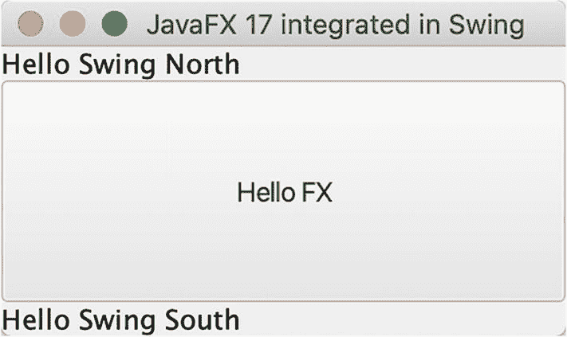

图 7-1

简单的 JavaFX 集成

这里特别有趣的是组件的布局。一个主要方面是正确设置`JFXPanel`的首选尺寸。如果您注释掉设置首选大小，您将看到 JFXPanel 在运行示例后调整到最小的`Button`大小。你得到的初始视图应该类似于图 7-2 所示。这是对 JavaFX 11 行为的改变，在 Java FX 11 中，JFXPanel 没有正确的首选大小。

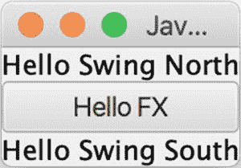

图 7-2

无需设置首选大小的简单 JavaFX 集成

解决了这个初始集成问题后，让我们更深入地研究这个解决方案提供的可能性。

因为 JFXPanel 是一个 Swing 组件，所以这为创建多个组件实例并将其添加到 Swing 组件层次结构中提供了机会。举个简单的例子，清单 7-1 中的应用程序被更改为使用两个 JavaFX `Label`和一个 Swing `JLabel`，如清单 7-2 所示。

```java
SwingUtilities.invokeLater(() -> {
        var frame = new JFrame("JavaFX 17 integrated in Swing (multiple)");
        frame.setDefaultCloseOperation(JFrame.EXIT_ON_CLOSE);
        var northJfxPanel = new JFXPanel();
        var northButton = new Button("Hello FX North");
        var northScene = new Scene(northButton);
        northJfxPanel.setScene(northScene);
        northJfxPanel.setPreferredSize(new Dimension(200,50));
        var southJfxPanel = new JFXPanel();
        var southButton = new Button("Hello FX South");
        var southScene = new Scene(southButton);
        southJfxPanel.setScene(southScene);
        southJfxPanel.setPreferredSize(new Dimension(200,50));
        var panel = new JPanel(new BorderLayout());
        panel.add(northJfxPanel, BorderLayout.NORTH);
        panel.add(southJfxPanel, BorderLayout.SOUTH);
        panel.add(new JLabel("Hello Swing"), BorderLayout.CENTER);
        frame.setContentPane(panel);
        frame.pack();
        frame.setLocationRelativeTo(null);
        frame.setVisible(true);
   });

Listing 7-2Multiple JavaFX Scenes in Swing

```

如果运行这个程序，显示的输出应该类似于图 7-3 。


图 7-3

多个 JavaFX 场景

到目前为止，与真实的集成场景相比，所有的例子都非常简单。一个典型的场景是将`WebView`集成到现有的 Swing 应用程序中。通过对清单 7-1 的一些小的修改，集成了一个 WebView 而不是原来应用程序的按钮，如清单 7-3 所示。

```java
SwingUtilities.invokeLater(() -> {
            var frame = new JFrame("JavaFX 17 integrated in Swing");
            frame.setDefaultCloseOperation(JFrame.EXIT_ON_CLOSE);
            var jfxPanel = new JFXPanel();
            var panel = new JPanel(new BorderLayout());
            panel.add(new JLabel("Hello Swing North"), BorderLayout.NORTH);
            panel.add(new JLabel("Hello Swing South"), BorderLayout.SOUTH);
            Platform.runLater(() -> {
                var webView = new WebView();
                var scene = new Scene(webView);
                webView.getEngine().load("https://openjfx.io/");
                jfxPanel.setScene(scene);
                jfxPanel.setPreferredSize(new Dimension(400,600));
                SwingUtilities.invokeLater(() -> {
                    panel.add(jfxPanel, BorderLayout.CENTER);
                    frame.pack();
                    frame.setLocationRelativeTo(null);
                });
            });
            frame.setContentPane(panel);
            frame.pack();
            frame.setLocationRelativeTo(null);
            frame.setVisible(true);
        });

Listing 7-3Adding a WebView to a Swing application

```

运行这个例子会显示一个`WebView`呈现位于两个 Swing `JLabel`之间的 OpenJFX 主页，如图 7-4 所示。

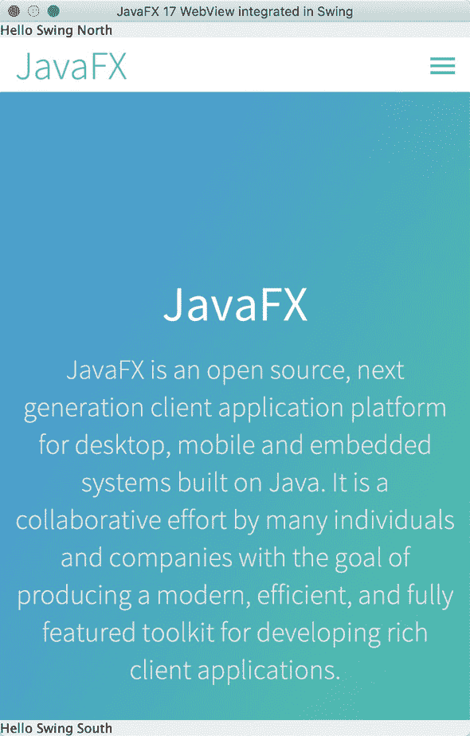

图 7-4

嵌入在 Swing 应用程序中的 WebView

看代码，与原代码相比有明显的变化。创建`Scene`需要几个线程的改变，以便在正确的 UI 线程上完成所有事情。为了更好地理解，让我们先来看看线程的细节。

### 穿线

在混合了 JavaFX 节点和 Swing 组件的应用程序中线程化是一件复杂的事情。

正如上一节已经暗示的那样，必须考虑两条主线:

*   JavaFX 应用程序线程

*   AWT 事件队列

第一个线程与 JavaFX 的所有事情相关联，例如，向已经渲染的(实时)场景图添加新节点，或者更改属于已经渲染的场景图的节点的属性。

第二个线程与 Swing UI 工具包(从 AWT 继承，因此得名)相关联，例如，所有 Swing 组件的创建都应该在这个线程上进行。组合这些工具包将会导致在一个线程或另一个线程上的大量跳跃，以确保所有的事情总是在正确的线程上被触发和完成。

Note

系统属性`javafx.embed.singleThread`是可用的，如果设置为`true`，它将切换两个 UI 工具包以使用相同的线程。这种行为是实验性的，可能会导致不希望的行为，因此请谨慎使用。

还有一点需要特别注意，特别是 WebView 可能是最希望与 Swing 集成的 JavaFX 控件。所有其他 JavaFX 控件都可以在 WebView 之外的任何线程上创建。由于一些初始化问题，WebView 必须在 JavaFX 应用程序线程上创建，引用 JDK-8087718:

> *理论上，应该可以通过推迟初始化调用直到 WebKit 代码的第一次实际使用来消除限制。在实践中，这样的改变很可能会变得非常重要，主要是因为有大量的入口点可能会也可能不会导致“第一次真正的使用”*

有了这些关于线程的知识，让我们再来看看上一个例子的初始化代码。

代码序列的第一个显著部分是在 JavaFX 应用程序线程上设置`JFXPanel`期间执行一些代码的必要性。这段代码完成后，需要在 AWT-EventQueue 上运行另一段代码。执行块的嵌套保证了正确的顺序。因此，一个通用的代码序列大致看起来像清单 7-4 中的伪代码。

```java
Platform.runLater(() -> {
    // ensure JavaFX all necessary init is done
    SwingUtilities.invokeLater(() -> {
        // now come back to update Swing component hierarchy accordingly
    });
});

Listing 7-4Abstract sequence with dedicated thread-sensitive code

```

Note

有两个实用方法有助于确保或检测代码在正确的线程上执行:`javax.swing.SwingUtilities.isEventDispatchThread()`和`javax.application.Platform.isFxApplicationThread()`。无论是在断言中使用以保证线程，还是作为简单的调试支持，它们都有助于使线程的使用更加透明。

随着对如何在正确的线程上运行代码有了更好的理解，集成的下一步是提供 JavaFX `Node` s 和 Swing `JComponent` s 之间的交互。

### Swing 和 JavaFX 之间的交互

集成的下一步是两个 UI 工具包的组件之间的交互。看看 JavaFX 和 Swing 的线程模型，这将需要一些额外的仪式。JavaFX 节点/控件的更改将在 JavaFX 应用程序线程上通知，并且需要在 AWT-EventQueue 上更改 Swing 组件。处理从 JavaFX 到 Swing 的事件需要切换线程，即在正确的线程上执行代码块(lambdas)。这种模式类似于下面的代码片段:

```java
NODE.setOnXXX(e ->
        SwingUtilities.invokeLater(() -> JCOMPONENT.setYYY(ZZZZ))).

```

例如，按下和释放鼠标按钮时，应更改 south 标签的文本。基于上述代码策略，必要的代码是

```java
button.setOnMousePressed(e ->
        SwingUtilities.invokeLater(() -> southLabel.setText("FX Button Pressed")));
button.setOnMouseReleased(e ->
        SwingUtilities.invokeLater(() -> southLabel.setText("Hello Swing South")));

```

第一条语句在按下鼠标按钮时触发`southLabel`文本的改变，一旦松开按钮，第二条语句将文本改变回其原始值。完整的应用可以在清单 7-5 中看到。

```java
SwingUtilities.invokeLater(() -> {
    var frame = new JFrame("JavaFX 17 integrated in Swing");
    frame.setDefaultCloseOperation(JFrame.EXIT_ON_CLOSE);
    var jfxPanel = new JFXPanel();
    var button = new Button("Hello FX");
    var scene = new Scene(button);
    jfxPanel.setScene(scene);
    jfxPanel.setPreferredSize(new Dimension(200,100));
    jfxPanel.setBorder(new EmptyBorder(5,5,5,5));
    var panel = new JPanel(new BorderLayout());
    panel.add(new JLabel("Hello Swing North"), BorderLayout.NORTH);
    var southLabel = new JLabel("Hello Swing South");
    panel.add(southLabel, BorderLayout.SOUTH);
    button.setOnMousePressed(e ->
    SwingUtilities.invokeLater(() -> southLabel.setText("FX Button Pressed")));
    button.setOnMouseReleased(e ->
    SwingUtilities.invokeLater(() -> southLabel.setText("Hello Swing South")));
    panel.add(jfxPanel, BorderLayout.CENTER);
    frame.setContentPane(panel);
    frame.pack();
    frame.setLocationRelativeTo(null);
    frame.setVisible(true);
});

Listing 7-5Interactive JavaFX in Swing embedding

```

这种相互作用在两个方向上都是一样的。为了显示从 Swing 开始的交互，让我们将最后一个示例更改为在南部区域包含一个 Swing `JButton`，并添加一些对它的监听:

```java
southButton.addMouseListener(new MouseAdapter() {
     @Override
     public void mousePressed(MouseEvent e) {
         Platform.runLater(() -> button.setText("Swing Button Pressed"));
     }
     @Override
     public void mouseReleased(MouseEvent e) {
         Platform.runLater(() -> button.setText("Hello FX"));
     }
 });

```

可以看到，交互将从 AWT-EventQueue 开始，然后转移到 JavaFX 应用程序线程，以更改 JavaFX `Button`的 text 属性。完整的示例代码可以在清单 7-6 中看到。

```java
SwingUtilities.invokeLater(() -> {
    var frame = new JFrame("JavaFX 17 bidirectional interaction in Swing");
    frame.setDefaultCloseOperation(JFrame.EXIT_ON_CLOSE);
    var jfxPanel = new JFXPanel();
    var button = new Button("Hello FX");
    var scene = new Scene(button);
    jfxPanel.setScene(scene);
    jfxPanel.setPreferredSize(new Dimension(200,100));
    jfxPanel.setBorder(new EmptyBorder(5,5,5,5));
    var panel = new JPanel(new BorderLayout());
    panel.add(new JLabel("Hello Swing North"), BorderLayout.NORTH);
    var southButton = new JButton("Hello Swing South Button");
    panel.add(southButton, BorderLayout.SOUTH);
    button.setOnMousePressed(e ->
            SwingUtilities.invokeLater(() -> southButton.setText("FX Button Pressed")));
    button.setOnMouseReleased(e ->
            SwingUtilities.invokeLater(() -> southButton.setText("Hello Swing South")));
    southButton.addMouseListener(new MouseAdapter() {
        @Override
        public void mousePressed(MouseEvent e) {
            Platform.runLater(() -> button.setText("Swing Button Pressed"));
        }
     @Override
     public void mouseReleased(MouseEvent e) {
        Platform.runLater(() -> button.setText("Hello FX"));
     }
   });
    panel.add(jfxPanel, BorderLayout.CENTER);
    frame.setContentPane(panel);
    frame.pack();
    frame.setLocationRelativeTo(null);
    frame.setVisible(true);
});

Listing 7-6Interactive bidirectional JavaFX

in Swing

```

运行该应用程序会显示以下状态(参见图 7-5 至 7-7 )。

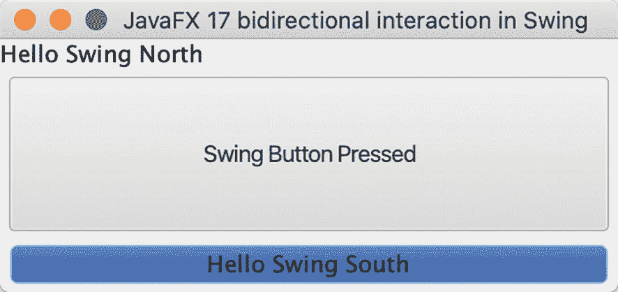

图 7-7

点击 Swing 按钮后的状态

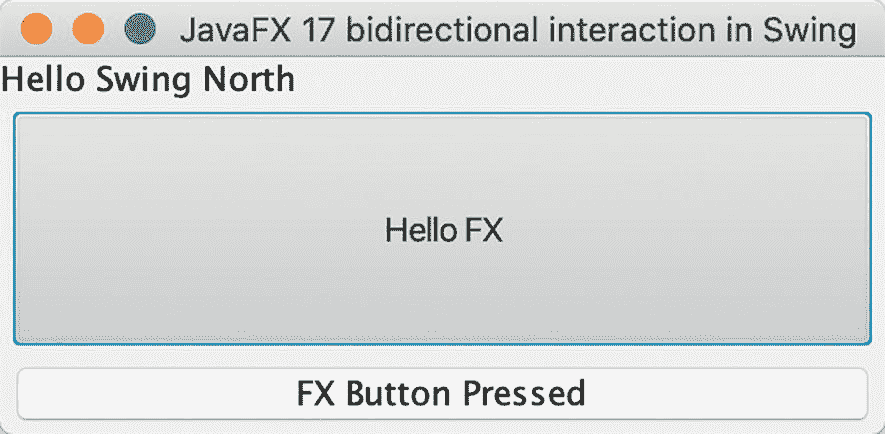

图 7-6

单击 JavaFX 按钮后的状态


图 7-5

交互演示的开始状态

交互性的下一个层次是向 Swing 应用程序动态添加 JavaFX 场景。这是更复杂的应用程序框架通常需要的特性，因为它们会动态地改变 Swing 组件层次结构。用多个 JavaFX `Scene`修改前面的示例，这样第二个`JFXPanel`将作为 Swing 按钮单击的结果被添加。主要的变化是 ActionListener 是必需的:

```java
swingButton.addActionListener(e -> {
      var southJfxPanel = new JFXPanel();
      var southButton = new Button("Hello FX South");
      var southScene = new Scene(southButton);
      southJfxPanel.setPreferredSize(new Dimension(200,50));
      panel.add(southJfxPanel, BorderLayout.SOUTH);
      Platform.runLater(() -> {
          southJfxPanel.setScene(southScene);
          SwingUtilities.invokeLater(frame::pack);
      });
  });

```

JFXPanel 本身的创建可以在 AWT-EventQueue 上完成(如前所述)，但在这种情况下，场景的设置必须在 JavaFX 应用程序线程上完成；为了确保面板的可见性，需要再次调整框架的大小。一旦场景设置好，这必须在 AWT-EventQueue 上完成。

运行清单 7-7 中所示的示例将在一个 Swing JFrame 中显示两个 JFXPanels，如图 7-8 所示。

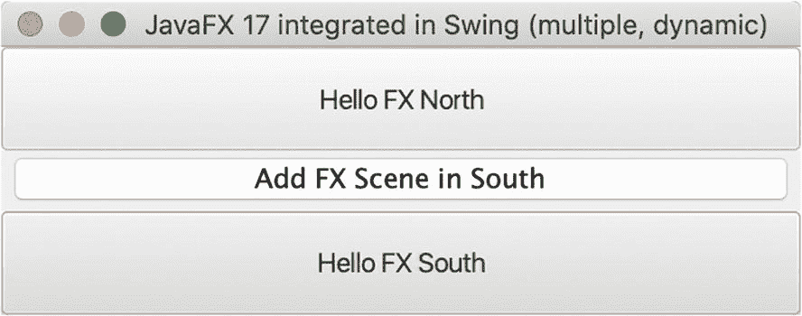

图 7-8

添加场景后的状态

```java
SwingUtilities.invokeLater(() -> {
    var frame = new JFrame("JavaFX 17 integrated in Swing (multiple, dynamic)");
    frame.setDefaultCloseOperation(JFrame.EXIT_ON_CLOSE);
    var northJfxPanel = new JFXPanel();
    var northButton = new Button("Hello FX North");
    var northScene = new Scene(northButton);
    northJfxPanel.setScene(northScene);
    northJfxPanel.setPreferredSize(new Dimension(200,50));
    var panel = new JPanel(new BorderLayout());
    panel.add(northJfxPanel, BorderLayout.NORTH);
    var swingButton = new JButton("Add FX Scene in South");
    swingButton.addActionListener(e -> {
        var southJfxPanel = new JFXPanel();
        var southButton = new Button("Hello FX South");
        var southScene = new Scene(southButton);
        southJfxPanel.setPreferredSize(new Dimension(200,50));
        panel.add(southJfxPanel, BorderLayout.SOUTH);
        Platform.runLater(() -> {
            southJfxPanel.setScene(southScene);
            SwingUtilities.invokeLater(frame::pack);
        });
    });
    panel.add(swingButton, BorderLayout.CENTER);
    frame.setContentPane(panel);
    frame.pack();
    frame.setLocationRelativeTo(null);
    frame.setVisible(true);
});

Listing 7-7Interactive bidirectional dynamic JavaFX

in Swing

```

下一个逻辑步骤是交互删除一个`JFXPanel`。出于演示的目的，最后一个例子增加了删除北`JFXPanel`的可能性(见清单 7-8 )。

```java
SwingUtilities.invokeLater(() -> {
    var frame = new JFrame("JavaFX 17 integrated in Swing (multiple, dynamic)");
    frame.setDefaultCloseOperation(JFrame.EXIT_ON_CLOSE);
    var northJfxPanel = new JFXPanel();
    var northButton = new Button("Hello FX North");
    var northScene = new Scene(northButton);
    northJfxPanel.setScene(northScene);
    northJfxPanel.setPreferredSize(new Dimension(200,50));
    var panel = new JPanel(new BorderLayout());
    panel.add(northJfxPanel, BorderLayout.NORTH);
    var northSwingButton = new JButton("Remove FX Scene in North");
    northSwingButton.addActionListener(e -> {
       panel.remove(northJfxPanel);
       frame.pack();
    });
        var southSwingButton = new JButton("Add FX Scene in South");
        southSwingButton.addActionListener(e -> {
            var southJfxPanel = new JFXPanel();
            var southButton = new Button("Hello FX South");
            var southScene = new Scene(southButton);
            southJfxPanel.setPreferredSize(new Dimension(200,50));
            panel.add(southJfxPanel, BorderLayout.SOUTH);
            Platform.runLater(() -> {
                southJfxPanel.setScene(southScene);
                SwingUtilities.invokeLater(frame::pack);
            });
        });
        var swingInside = new JPanel(new BorderLayout());
        swingInside.add(northSwingButton, BorderLayout.NORTH);
        swingInside.add(southSwingButton, BorderLayout.SOUTH);
        panel.add(swingInside, BorderLayout.CENTER);
        frame.setContentPane(panel);
        frame.pack();
        frame.setLocationRelativeTo(null);
        frame.setVisible(true);
    });

Listing 7-8Adding/removing of JFXPanel in Swing

```

运行该示例显示了两个旋转按钮——一个用于移除北部的 JFXPanel，另一个用于添加南部的 JFXPanel，如图 7-9 所示。

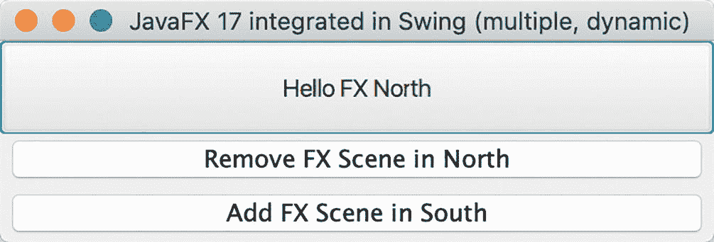

图 7-9

添加/删除 JFXPanels

应用程序的结果取决于按钮点击的顺序。如果先点击将`JFXPanel`加到南边的按钮，面板会出现，点击移除按钮会移除北边的`JFXPanel`(结果如图 7-10 )。

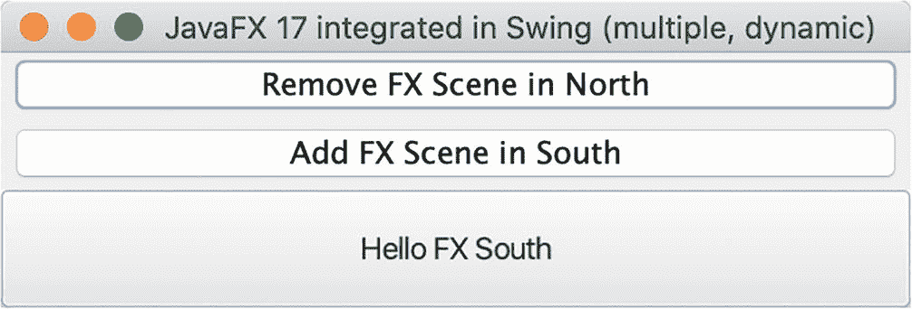

图 7-10

首先添加然后移除 JFXPanel 的结果

如果以相反的顺序单击按钮，北部面板将被删除，但南部面板不能再添加。这是因为 JavaFX 具有一个特性，即只要最后一个 JavaFX 窗口关闭，就会自动启动 JavaFX 运行时的关闭。这个特性在默认情况下是启用的，因此移除唯一的`JFXPanel`会触发关闭，之后所有对运行时的调用，例如将`JFXPanel`添加到南方，都不再起作用。这种行为可以通过禁用`implicitExit`功能来改变:

```java
Platform.setImplicitExit(false);

```

Note

如果您试图在 Swing 上创建 JavaFX 的一些通用集成，禁用这个特性可能总是一个好主意，以确保 JavaFX 运行时不会意外关闭。

## 使用 JavaFX 和 Swing 进行拖放

更复杂的 Swing 应用程序通常会有某种拖放支持，要么在应用程序内部，要么从应用程序外部将内容拖入其中。第二个用例不是集成中的特例，因为放置目标要么是 Swing JComponent，要么是 JavaFX 节点。这允许对每种技术使用默认的丢弃处理。第一种情况更有趣，因为拖动源和拖放目标基于不同的 UI 技术。

图 7-11 显示了一个应用示例。

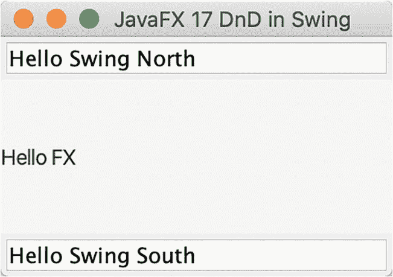

图 7-11

使用 JavaFX 和 Swing 进行拖放

有两个 Swing `JTextField`和一个 JavaFX `Label`。拖动操作允许从北或南 Swing `TextField`拖动选定的文本，并将其放到 JavaFX `Label`上。虽然这听起来像是很多复杂的线程，但事实并非如此。大多数复杂的交互都是在工具箱级别完成的，对用户来说是不可见的。

首先需要的是一个拖拽开始的交互，如清单 7-9 所示。

```java
private static class MouseDragAdapter extends MouseAdapter {
      @Override
      public void mousePressed(MouseEvent e) {
          var component = (JComponent) e.getSource();
          component.getTransferHandler().
                      exportAsDrag(component, e, TransferHandler.COPY);
      }
  }

Listing 7-9Swing MouseAdapter for drag start

```

所示的代码片段定义了一个`MouseListener`并覆盖了`mousePressed`方法，以确保通过按下鼠标按钮，组件的内容被导出为拖动内容。这样，我们现在可以查看清单 7-10 中的完整代码。

```java
SwingUtilities.invokeLater(() -> {
            var frame = new JFrame("JavaFX 17 DnD in Swing");
            frame.setDefaultCloseOperation(JFrame.EXIT_ON_CLOSE);
            var jfxPanel = new JFXPanel();
            var label = new Label("Hello FX");
            var scene = new Scene(button);
            jfxPanel.setScene(label);
            jfxPanel.setPreferredSize(new Dimension(200, 100));
            label.setOnDragOver(event -> {
                var dragboard = event.getDragboard();
                if (dragboard.getContentTypes().
                    contains( DataFormat.lookupMimeType("application/
                    x-java-serialized-object"))) {
                    event.acceptTransferModes(TransferMode.COPY);
                }
                event.consume();
            });
            label.setOnDragDropped(event -> {
                var dataFormat = DataFormat.
                                lookupMimeType("application/x-java-serialized-object");
                var dragboard = event.getDragboard();
                if (dragboard.hasContent(dataFormat)) {
                    String content = (String) dragboard.getContent(dataFormat);
                    label.setText(content);
                }
                event.setDropCompleted(true);
                event.consume();
            });
            var panel = new JPanel(new BorderLayout());
            var northField = new JTextField("Hello Swing North");
            northField.setDragEnabled(true);
            northField.addMouseListener(new MouseDragAdapter());
            var southField = new JTextField("Hello Swing South");
            southField.setDragEnabled(true);
            southField.addMouseListener(new MouseDragAdapter());
            panel.add(northField, BorderLayout.NORTH);
            panel.add(southField, BorderLayout.SOUTH);
            panel.add(jfxPanel, BorderLayout.CENTER);
            frame.setContentPane(panel);
            frame.pack();
            frame.setLocationRelativeTo(null);
            frame.setVisible(true);
        });

Listing 7-10Drag from Swing to JavaFX

```

有两个不同的部分确保了 JavaFX `Label`的成功。第一段代码确保在检测组件上发生拖动的过程中，如果在`DragBoard`内容类型中有兼容的`MimeType`，则设置拖动的接受模式。这样做了，唯一缺少的就是对真正跌落的反应。这段代码确保了预期的`MimeType`的可用性，以正确的格式从`DragBoard`中检索数据，并使用这些数据来更改`Label`的显示文本。

由于所有这些处理方法都是从 UI 工具包中调用的，所以所有的处理都已经在正确的线程上，所以在这个例子中不需要进行线程切换。

Note

从一个`JFXPanel`中的一个节点拖放到另一个`JFXPanel`中的另一个节点与普通 JavaFX 场景中任意两个节点之间的拖放没有什么不同。操作的源和目标对 Swing 上下文中的嵌入一无所知。这是将复杂的 JavaFX 节点/控件集成到 Swing 应用程序中的一个重要因素。

## 集成在 Swing 中的 JavaFX 3D

JavaFX 最引人注目的特性之一是支持 3D 渲染以及 2D 和 3D 的混合，这使得高级可视化的创建变得简单。因为 JFXPanel 只是获取任何场景并将其嵌入到 Swing 组件层次结构中，所以这也可以用于支持 3D 的场景。

基于本书中使用的一个 3D 例子，清单 7-11 展示了一个 3D 集成的例子。

```java
    SwingUtilities.invokeLater(() -> {
        var frame = new JFrame("JavaFX 17 3D integrated in Swing");
        frame.setDefaultCloseOperation(JFrame.EXIT_ON_CLOSE);
        var jfxPanel = new JFXPanel();
        var camera = createCamera();
        var box = new Box(10, 10, 10);
        var view = new Group(box, camera);
        var scene = new Scene(view, 640, 480);
        scene.setCamera(camera);
        jfxPanel.setScene(scene);
        jfxPanel.setPreferredSize(new Dimension(200,100));
        var panel = new JPanel(new BorderLayout());
        panel.add(new JLabel("Hello Swing North"), BorderLayout.NORTH);
        panel.add(new JLabel("Hello Swing South"), BorderLayout.SOUTH);
        panel.add(jfxPanel, BorderLayout.CENTER);
        frame.setContentPane(panel);
        frame.pack();
        frame.setLocationRelativeTo(null);
        frame.setVisible(true);
        Platform.runLater(() -> animate());
    });
private static Camera createCamera() {
    Camera answer = new PerspectiveCamera(true);
    answer.getTransforms().addAll(rotateX, rotateY, rotateZ, translateZ);
    return answer;
}
private static void animate() {
    Timeline timeline = new Timeline(
            new KeyFrame(Duration.seconds(0),
                    new KeyValue(translateZ.zProperty(), -20),
                    new KeyValue(rotateX.angleProperty(), 90),
                    new KeyValue(rotateY.angleProperty(), 90),
                    new KeyValue(rotateZ.angleProperty(), 90)),
            new KeyFrame(Duration.seconds(5),
                    new KeyValue(translateZ.zProperty(), -80),
                    new KeyValue(rotateX.angleProperty(), -90),
                    new KeyValue(rotateY.angleProperty(), -90),
                    new KeyValue(rotateZ.angleProperty(), -90))
    );
    timeline.setCycleCount(Animation.INDEFINITE);
    timeline.setAutoReverse(true);
    timeline.play();
}

Listing 7-113D embedded in Swing

```

运行示例显示了一个带有两个 Swing 标签的 Swing 应用程序，一个在 3D 动画 JavaFX 场景的上方，一个在下方，如图 7-12 所示。

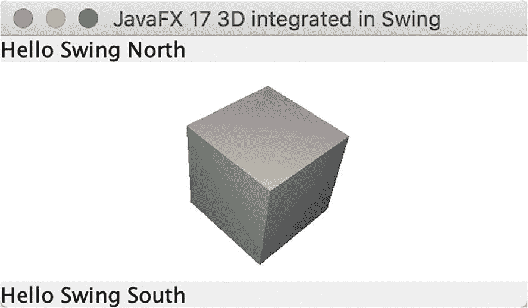

图 7-12

集成在 Swing 中的 3D 渲染

## 将 Swing 集成到 JavaFX 中

在现有 Swing 应用程序中集成了新的 JavaFX 控件后，本节将介绍如何在 JavaFX 场景图中使用众所周知的大型基于 Swing 的库，例如 NASA 的 world wind`(`[`https://worldwind.arc.nasa.gov/java`](https://worldwind.arc.nasa.gov/java)`)`。

实现这一点的方法是使用特殊的 Java FX`Node`—`SwingNode`。它允许你在场景图中嵌入一个秋千`JComponent`。其中 JFXPanel 是包装 JavaFX 场景的 JComponent，SwingNode 是包装 Swing 组件层次结构的 JavaFX 节点。所有显示和讨论的关于线程、交互等的内容对于在 JavaFX 应用程序中集成 Swing 组件也是有效的。因为从交互的角度来看，JavaFX 节点和 Swing JComponent 这两个元素不知道它们是如何集成的，所以无论是 Swing 中的 JavaFX 还是 JavaFX 中的 Swing 都没有关系。主要区别在于，在 UI 树的构建过程中，要么应用 Swing 规则，要么应用 JavaFX 规则。列表 7-12 显示了一个简单的例子。

```java
@Override
public void start(Stage stage) throws Exception {
    var borderPane = new BorderPane();
    var swingNode = new SwingNode();
    var scene = new Scene(borderPane, 200, 200);
    borderPane.setCenter(swingNode);
    borderPane.setBottom(new Label("JavaFX Bottom"));
    SwingUtilities.invokeLater(() -> {
        var panel = new JPanel();
        panel.setLayout(new BorderLayout());
        panel.add(new JLabel("Swing North"), BorderLayout.CENTER);
        swingNode.setContent(panel);
        borderPane.layout();
    });
    stage.setScene(scene);
    stage.show();
}

Listing 7-12Swing embedded in JavaFX

```

运行该应用程序的结果如图 7-13 所示。

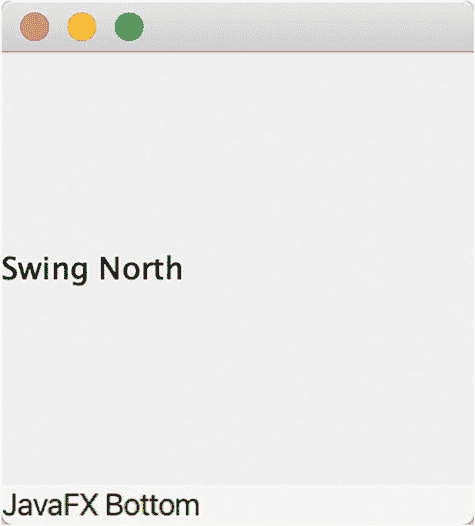

图 7-13

嵌入 JavaFX 的 Swing

## 迁移策略

在 UI 工具包之间进行迁移总是一个冗长而复杂的过程。JavaFX 通过提供无缝的双向集成组件—`JFXPanel`和`SwingNode`缓解了这一问题。这允许从完整的基于 Swing 的应用程序到完整的 JavaFX 应用程序的任意迁移步骤。

通常，迁移路径从复杂的基于 Swing 的应用程序开始，并尝试尽可能多地摆脱 Swing，或者尝试集成 JavaFX 中可用的更好的组件或控件。所以第一站总是基于 JFXPanel 的方法。

使用“divide et impera”策略，在您现有的 Swing 组件层次结构中寻找可以轻松替换为 JavaFX 组件的组件。

当您这样做时，您的应用程序的越来越多的部分将开始成为 JavaFX，并且您可以开始将已经转换的 JFXPanels 重组为更大的场景图。如果仍然有一些 Swing 组件不能被转换，那么仍然有可能重用原始的 Swing 组件，将其包装在 SwingNode 中，并将其用作场景图的一部分。

这种同时使用 JFXPanel 和 SwingNode 的方法至少在理论上允许透明的增量迁移，尽管这样做的细节可能很复杂。

## 大规模集成

JavaFX 在构建最初基于 Swing 的混搭应用程序方面提供了增强的集成可能性，这使得创建两种技术的复杂组合变得很容易。

一个非常突出的例子是一个试图将 JavaFX 快速应用开发工具 Scene Builder 嵌入 Apache NetBeans([`https://netbeans.apache.org`](https://netbeans.apache.org))——一个基于 Swing 的 IDE 的项目。实际项目详见 [`https://github.com/svenreimers/nbscenebuilder`](https://github.com/svenreimers/nbscenebuilder) 。

图 7-14 显示了集成的示例截图。


图 7-14

Apache NetBeans 中的场景构建器集成

## 结论

JavaFX 具有两种兼容性策略，允许将 JavaFX UI 部件嵌入到现有的 Swing 应用程序中，并允许在新的 JavaFX 应用程序中重用 Swing 组件，是构建新的跨平台富客户端应用程序的首选。本章涵盖的要点如下:

*   JavaFX 提供了一个名为`JFXPanel`的 Swing 组件，用于将 JavaFX 场景图形集成到 Swing 中。

*   JavaFX 提供了`SwingNode`来将 Swing 组件集成到 JavaFX 中。

*   在处理两个提供自己专用 UI 线程的 UI 工具包时，需要特别注意。

*   两个 UI 工具包中的节点和组件之间的交互很容易实现。

*   大规模集成当然是可能的，并且可以保护您现有的投资。