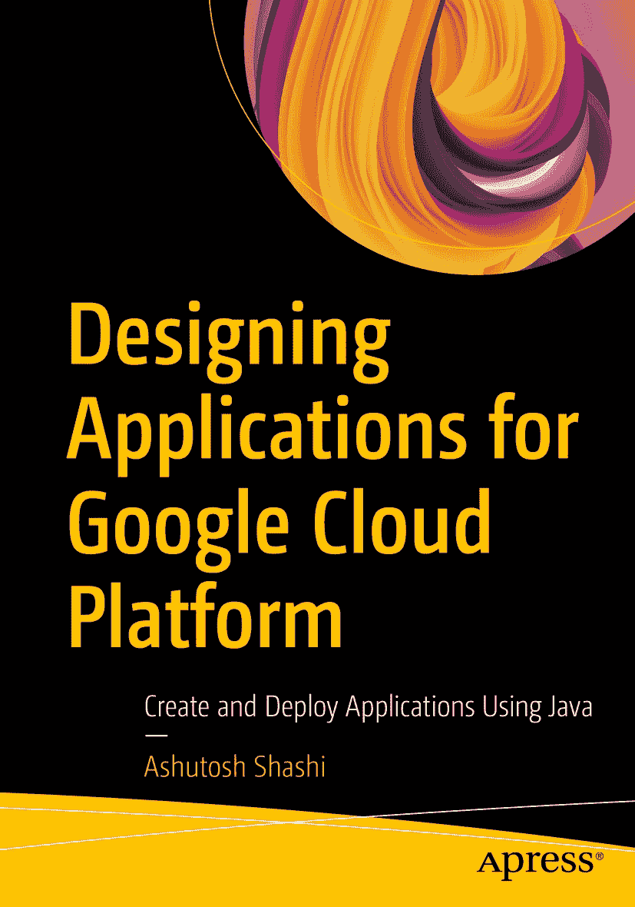

ISBN 978-1-4842-9510-6 e-ISBN 978-1-4842-9511-3 [`doi.org/10.1007/978-1-4842-9511-3`](https://doi.org/10.1007/978-1-4842-9511-3) © Ashutosh Shashi 2023，Apress 标准出版。本出版物中使用通用描述性名称、注册商标名称、商标、服务标志等，即使未作特别声明，也不意味着这些名称不受相关保护性法律和法规的约束，因此可供公众自由使用。出版商、作者和编辑可以合理假定，本书中的建议和信息在出版之日是真实准确的。出版商、作者或编辑均不对本书所含材料或可能存在的任何错误或遗漏提供明示或暗示的担保。出版商对已出版地图中的管辖权主张和机构归属保持中立。

本 Apress 印记由注册公司 APress Media, LLC（Springer Nature 的一部分）出版。

注册公司地址为：1 New York Plaza, New York, NY 10004, U.S.A.

## 引言

作为一名拥有多年经验的软件架构师，我曾与多个云平台合作，包括 Google Cloud Platform (GCP)。我注意到许多开发者和架构师在使用 Java 在 GCP 上设计和构建应用程序时面临挑战。他们需要帮助理解 GCP 提供的各种服务，哪些服务最适合他们的应用程序，以及如何有效利用这些服务来构建健壮且可扩展的应用程序。

这一认识促使我撰写本书，作为面向希望使用 Java 为 GCP 设计和构建应用程序的开发人员、架构师和技术经理的全面指南。本书基于我在 GCP 上的实际工作经验，旨在弥合理论与实践之间的差距，为读者提供在 GCP 上构建应用程序的实践方法。这种方法使开发者和架构师能够更好地理解 GCP 及其服务，并使他们能够设计和构建更好的应用程序。

本书介绍了 GCP，概述了其各种特性、功能和优势。然后，我解释了如何选择 GCP 上最佳的工具来开发可扩展、可靠且经济高效的应用程序，以及它如何帮助组织加速其数字化转型工作。

这本实用指南将为开发者和架构师提供使用 Java 在 GCP 上设计和构建应用程序所需的工具和知识。通过本书，我希望读者能够克服在使用 GCP 时遇到的任何挑战，并获得构建健壮且可扩展的 Java 应用程序所需的信心和技能。

## 源代码

本书中使用的所有源代码均可从 [`https://github.com/Apress/designing-applications-google-cloud-platform`](https://github.com/Apress/designing-applications-google-cloud-platform) 下载。

关于作者 关于技术审校

